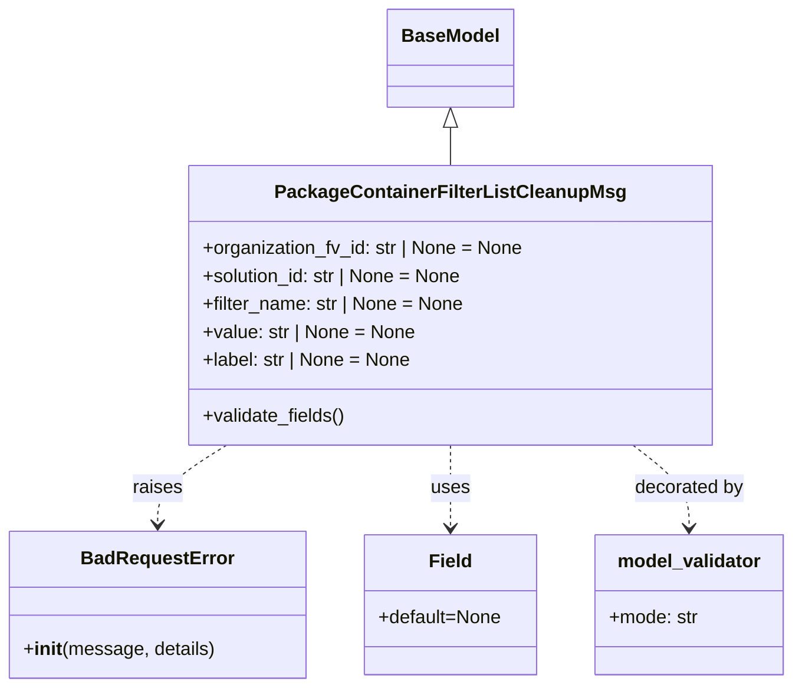

# Diagram: partview_service/partview_service/core/model/package_container_filter_list_cleanup_msg.py

> Auto-generated by Obscura crawlers

## Mermaid

### SVG

<svg id="container" width="673" xmlns="http://www.w3.org/2000/svg" class="classDiagram" height="590" viewBox="0 0 673 590" role="graphics-document document" aria-roledescription="class"><g><defs><marker id="container_class-aggregationStart" class="marker aggregation class" refX="18" refY="7" markerWidth="190" markerHeight="240" orient="auto"><path d="M 18,7 L9,13 L1,7 L9,1 Z"></path></marker></defs><defs><marker id="container_class-aggregationEnd" class="marker aggregation class" refX="1" refY="7" markerWidth="20" markerHeight="28" orient="auto"><path d="M 18,7 L9,13 L1,7 L9,1 Z"></path></marker></defs><defs><marker id="container_class-extensionStart" class="marker extension class" refX="18" refY="7" markerWidth="190" markerHeight="240" orient="auto"><path d="M 1,7 L18,13 V 1 Z"></path></marker></defs><defs><marker id="container_class-extensionEnd" class="marker extension class" refX="1" refY="7" markerWidth="20" markerHeight="28" orient="auto"><path d="M 1,1 V 13 L18,7 Z"></path></marker></defs><defs><marker id="container_class-compositionStart" class="marker composition class" refX="18" refY="7" markerWidth="190" markerHeight="240" orient="auto"><path d="M 18,7 L9,13 L1,7 L9,1 Z"></path></marker></defs><defs><marker id="container_class-compositionEnd" class="marker composition class" refX="1" refY="7" markerWidth="20" markerHeight="28" orient="auto"><path d="M 18,7 L9,13 L1,7 L9,1 Z"></path></marker></defs><defs><marker id="container_class-dependencyStart" class="marker dependency class" refX="6" refY="7" markerWidth="190" markerHeight="240" orient="auto"><path d="M 5,7 L9,13 L1,7 L9,1 Z"></path></marker></defs><defs><marker id="container_class-dependencyEnd" class="marker dependency class" refX="13" refY="7" markerWidth="20" markerHeight="28" orient="auto"><path d="M 18,7 L9,13 L14,7 L9,1 Z"></path></marker></defs><defs><marker id="container_class-lollipopStart" class="marker lollipop class" refX="13" refY="7" markerWidth="190" markerHeight="240" orient="auto"><circle stroke="black" fill="transparent" cx="7" cy="7" r="6"></circle></marker></defs><defs><marker id="container_class-lollipopEnd" class="marker lollipop class" refX="1" refY="7" markerWidth="190" markerHeight="240" orient="auto"><circle stroke="black" fill="transparent" cx="7" cy="7" r="6"></circle></marker></defs><g class="root"><g class="clusters"></g><g class="edgePaths"><path d="M380.527,109.25L380.527,110.542C380.527,111.833,380.527,114.417,380.527,119.875C380.527,125.333,380.527,133.667,380.527,137.833L380.527,142" id="id_BaseModel_PackageContainerFilterListCleanupMsg_1" class="edge-thickness-normal edge-pattern-solid relation" style=";;;" data-edge="true" data-et="edge" data-id="id_BaseModel_PackageContainerFilterListCleanupMsg_1" data-points="W3sieCI6MzgwLjUyNzM0Mzc1LCJ5Ijo5Mn0seyJ4IjozODAuNTI3MzQzNzUsInkiOjExN30seyJ4IjozODAuNTI3MzQzNzUsInkiOjE0Mn1d" marker-start="url(#container_class-extensionStart)"></path><path d="M190.845,382L181.097,388.167C171.35,394.333,151.855,406.667,142.107,418C132.359,429.333,132.359,439.667,132.359,444.833L132.359,450" id="id_PackageContainerFilterListCleanupMsg_BadRequestError_2" class="edge-thickness-normal edge-pattern-dashed relation" style=";;;" data-edge="true" data-et="edge" data-id="id_PackageContainerFilterListCleanupMsg_BadRequestError_2" data-points="W3sieCI6MTkwLjg0NDgxOTg2NDY0OTY4LCJ5IjozODJ9LHsieCI6MTMyLjM1OTM3NSwieSI6NDE5fSx7IngiOjEzMi4zNTkzNzUsInkiOjQ1Nn1d" marker-end="url(#container_class-dependencyEnd)"></path><path d="M380.527,382L380.527,388.167C380.527,394.333,380.527,406.667,380.527,418.5C380.527,430.333,380.527,441.667,380.527,447.333L380.527,453" id="id_PackageContainerFilterListCleanupMsg_Field_3" class="edge-thickness-normal edge-pattern-dashed relation" style=";;;" data-edge="true" data-et="edge" data-id="id_PackageContainerFilterListCleanupMsg_Field_3" data-points="W3sieCI6MzgwLjUyNzM0Mzc1LCJ5IjozODJ9LHsieCI6MzgwLjUyNzM0Mzc1LCJ5Ijo0MTl9LHsieCI6MzgwLjUyNzM0Mzc1LCJ5Ijo0NTl9XQ==" marker-end="url(#container_class-dependencyEnd)"></path><path d="M536.558,382L544.577,388.167C552.595,394.333,568.631,406.667,576.65,418.5C584.668,430.333,584.668,441.667,584.668,447.333L584.668,453" id="id_PackageContainerFilterListCleanupMsg_model_validator_4" class="edge-thickness-normal edge-pattern-dashed relation" style=";;;" data-edge="true" data-et="edge" data-id="id_PackageContainerFilterListCleanupMsg_model_validator_4" data-points="W3sieCI6NTM2LjU1ODM5NDcwNTQxNCwieSI6MzgyfSx7IngiOjU4NC42Njc5Njg3NSwieSI6NDE5fSx7IngiOjU4NC42Njc5Njg3NSwieSI6NDU5fV0=" marker-end="url(#container_class-dependencyEnd)"></path></g><g class="edgeLabels"><g class="edgeLabel"><g class="label" data-id="id_BaseModel_PackageContainerFilterListCleanupMsg_1" transform="translate(0, 0)"><foreignObject width="0" height="0">

</foreignObject></g></g><g class="edgeLabel" transform="translate(132.359375, 419)"><g class="label" data-id="id_PackageContainerFilterListCleanupMsg_BadRequestError_2" transform="translate(-21.25, -12)"><foreignObject width="42.5" height="24">

raises

</foreignObject></g></g><g class="edgeLabel" transform="translate(380.52734375, 419)"><g class="label" data-id="id_PackageContainerFilterListCleanupMsg_Field_3" transform="translate(-16.4921875, -12)"><foreignObject width="32.984375" height="24">

uses

</foreignObject></g></g><g class="edgeLabel" transform="translate(584.66796875, 419)"><g class="label" data-id="id_PackageContainerFilterListCleanupMsg_model_validator_4" transform="translate(-47.328125, -12)"><foreignObject width="94.65625" height="24">

decorated by

</foreignObject></g></g></g><g class="nodes"><g class="node default" id="classId-BaseModel-0" transform="translate(380.52734375, 50)"><g class="basic label-container"><path d="M-52.078125 -42 L52.078125 -42 L52.078125 42 L-52.078125 42" stroke="none" stroke-width="0" fill="#ECECFF" style=""></path><path d="M-52.078125 -42 C-30.51906921947306 -42, -8.96001343894612 -42, 52.078125 -42 M-52.078125 -42 C-28.71146183780857 -42, -5.344798675617142 -42, 52.078125 -42 M52.078125 -42 C52.078125 -14.620261115652958, 52.078125 12.759477768694083, 52.078125 42 M52.078125 -42 C52.078125 -19.767457680619128, 52.078125 2.465084638761745, 52.078125 42 M52.078125 42 C29.459889919109923 42, 6.841654838219846 42, -52.078125 42 M52.078125 42 C29.206980207260294 42, 6.335835414520588 42, -52.078125 42 M-52.078125 42 C-52.078125 19.386661963391763, -52.078125 -3.226676073216474, -52.078125 -42 M-52.078125 42 C-52.078125 19.96753972814774, -52.078125 -2.064920543704517, -52.078125 -42" stroke="#9370DB" stroke-width="1.3" fill="none" stroke-dasharray="0 0" style=""></path></g><g class="annotation-group text" transform="translate(0, -18)"></g><g class="label-group text" transform="translate(-40.078125, -18)"><g class="label" style="font-weight: bolder" transform="translate(0,-12)"><foreignObject width="80.15625" height="24">

BaseModel

</foreignObject></g></g><g class="members-group text" transform="translate(-40.078125, 30)"></g><g class="methods-group text" transform="translate(-40.078125, 60)"></g><g class="divider" style=""><path d="M-52.078125 6 C-12.649469498259883 6, 26.779186003480234 6, 52.078125 6 M-52.078125 6 C-17.80179000931944 6, 16.47454498136112 6, 52.078125 6" stroke="#9370DB" stroke-width="1.3" fill="none" stroke-dasharray="0 0" style=""></path></g><g class="divider" style=""><path d="M-52.078125 24 C-20.15235413956504 24, 11.773416720869918 24, 52.078125 24 M-52.078125 24 C-10.602231534250407 24, 30.873661931499186 24, 52.078125 24" stroke="#9370DB" stroke-width="1.3" fill="none" stroke-dasharray="0 0" style=""></path></g></g><g class="node default" id="classId-PackageContainerFilterListCleanupMsg-1" transform="translate(380.52734375, 262)"><g class="basic label-container"><path d="M-221.4375 -120 L221.4375 -120 L221.4375 120 L-221.4375 120" stroke="none" stroke-width="0" fill="#ECECFF" style=""></path><path d="M-221.4375 -120 C-121.39433457964606 -120, -21.351169159292112 -120, 221.4375 -120 M-221.4375 -120 C-111.78202589832127 -120, -2.1265517966425307 -120, 221.4375 -120 M221.4375 -120 C221.4375 -34.818107332939505, 221.4375 50.36378533412099, 221.4375 120 M221.4375 -120 C221.4375 -38.96370661380631, 221.4375 42.07258677238738, 221.4375 120 M221.4375 120 C85.06803415190353 120, -51.301431696192935 120, -221.4375 120 M221.4375 120 C83.01177947521049 120, -55.41394104957902 120, -221.4375 120 M-221.4375 120 C-221.4375 44.86938403491146, -221.4375 -30.261231930177075, -221.4375 -120 M-221.4375 120 C-221.4375 46.23432711452335, -221.4375 -27.531345770953294, -221.4375 -120" stroke="#9370DB" stroke-width="1.3" fill="none" stroke-dasharray="0 0" style=""></path></g><g class="annotation-group text" transform="translate(0, -96)"></g><g class="label-group text" transform="translate(-141.734375, -96)"><g class="label" style="font-weight: bolder" transform="translate(0,-12)"><foreignObject width="283.46875" height="24">

PackageContainerFilterListCleanupMsg

</foreignObject></g></g><g class="members-group text" transform="translate(-209.4375, -48)"><g class="label" style="" transform="translate(0,-12)"><foreignObject width="277.140625" height="24">

+organization_fv_id: str | None = None

</foreignObject></g><g class="label" style="" transform="translate(0,12)"><foreignObject width="225.859375" height="24">

+solution_id: str | None = None

</foreignObject></g><g class="label" style="" transform="translate(0,36)"><foreignObject width="225.265625" height="24">

+filter_name: str | None = None

</foreignObject></g><g class="label" style="" transform="translate(0,60)"><foreignObject width="182.359375" height="24">

+value: str | None = None

</foreignObject></g><g class="label" style="" transform="translate(0,84)"><foreignObject width="180.03125" height="24">

+label: str | None = None

</foreignObject></g></g><g class="methods-group text" transform="translate(-209.4375, 96)"><g class="label" style="" transform="translate(0,-12)"><foreignObject width="123.34375" height="24">

+validate_fields()

</foreignObject></g></g><g class="divider" style=""><path d="M-221.4375 -72 C-53.564895526955354 -72, 114.30770894608929 -72, 221.4375 -72 M-221.4375 -72 C-59.317393666741765 -72, 102.80271266651647 -72, 221.4375 -72" stroke="#9370DB" stroke-width="1.3" fill="none" stroke-dasharray="0 0" style=""></path></g><g class="divider" style=""><path d="M-221.4375 72 C-88.68698739644714 72, 44.06352520710573 72, 221.4375 72 M-221.4375 72 C-69.44030503389132 72, 82.55688993221736 72, 221.4375 72" stroke="#9370DB" stroke-width="1.3" fill="none" stroke-dasharray="0 0" style=""></path></g></g><g class="node default" id="classId-BadRequestError-2" transform="translate(132.359375, 519)"><g class="basic label-container"><path d="M-124.359375 -63 L124.359375 -63 L124.359375 63 L-124.359375 63" stroke="none" stroke-width="0" fill="#ECECFF" style=""></path><path d="M-124.359375 -63 C-36.36011401928772 -63, 51.63914696142456 -63, 124.359375 -63 M-124.359375 -63 C-26.466342640789378 -63, 71.42668971842124 -63, 124.359375 -63 M124.359375 -63 C124.359375 -33.31413103111082, 124.359375 -3.628262062221644, 124.359375 63 M124.359375 -63 C124.359375 -16.65193298401325, 124.359375 29.6961340319735, 124.359375 63 M124.359375 63 C72.10702140984276 63, 19.854667819685517 63, -124.359375 63 M124.359375 63 C32.9851373246333 63, -58.3891003507334 63, -124.359375 63 M-124.359375 63 C-124.359375 32.8687578648603, -124.359375 2.7375157297205988, -124.359375 -63 M-124.359375 63 C-124.359375 16.003410847504227, -124.359375 -30.993178304991545, -124.359375 -63" stroke="#9370DB" stroke-width="1.3" fill="none" stroke-dasharray="0 0" style=""></path></g><g class="annotation-group text" transform="translate(0, -39)"></g><g class="label-group text" transform="translate(-62.28125, -39)"><g class="label" style="font-weight: bolder" transform="translate(0,-12)"><foreignObject width="124.5625" height="24">

BadRequestError

</foreignObject></g></g><g class="members-group text" transform="translate(-112.359375, 9)"></g><g class="methods-group text" transform="translate(-112.359375, 39)"><g class="label" style="" transform="translate(0,-12)"><foreignObject width="162.4375" height="24">

+<strong>init</strong>(message, details)

</foreignObject></g></g><g class="divider" style=""><path d="M-124.359375 -15 C-72.70970636977238 -15, -21.060037739544754 -15, 124.359375 -15 M-124.359375 -15 C-47.83374929211833 -15, 28.691876415763346 -15, 124.359375 -15" stroke="#9370DB" stroke-width="1.3" fill="none" stroke-dasharray="0 0" style=""></path></g><g class="divider" style=""><path d="M-124.359375 9 C-58.321933743835885 9, 7.71550751232823 9, 124.359375 9 M-124.359375 9 C-71.55592783115327 9, -18.75248066230654 9, 124.359375 9" stroke="#9370DB" stroke-width="1.3" fill="none" stroke-dasharray="0 0" style=""></path></g></g><g class="node default" id="classId-Field-3" transform="translate(380.52734375, 519)"><g class="basic label-container"><path d="M-73.80859375 -60 L73.80859375 -60 L73.80859375 60 L-73.80859375 60" stroke="none" stroke-width="0" fill="#ECECFF" style=""></path><path d="M-73.80859375 -60 C-39.30990259735122 -60, -4.811211444702437 -60, 73.80859375 -60 M-73.80859375 -60 C-42.50413765155271 -60, -11.199681553105414 -60, 73.80859375 -60 M73.80859375 -60 C73.80859375 -15.34267794478135, 73.80859375 29.3146441104373, 73.80859375 60 M73.80859375 -60 C73.80859375 -30.54922592538576, 73.80859375 -1.098451850771518, 73.80859375 60 M73.80859375 60 C26.58038960858532 60, -20.647814532829358 60, -73.80859375 60 M73.80859375 60 C44.08882546861596 60, 14.369057187231917 60, -73.80859375 60 M-73.80859375 60 C-73.80859375 29.554858784190298, -73.80859375 -0.8902824316194042, -73.80859375 -60 M-73.80859375 60 C-73.80859375 16.99687199171904, -73.80859375 -26.00625601656192, -73.80859375 -60" stroke="#9370DB" stroke-width="1.3" fill="none" stroke-dasharray="0 0" style=""></path></g><g class="annotation-group text" transform="translate(0, -36)"></g><g class="label-group text" transform="translate(-17.4765625, -36)"><g class="label" style="font-weight: bolder" transform="translate(0,-12)"><foreignObject width="34.953125" height="24">

Field

</foreignObject></g></g><g class="members-group text" transform="translate(-61.80859375, 12)"><g class="label" style="" transform="translate(0,-12)"><foreignObject width="106.140625" height="24">

+default=None

</foreignObject></g></g><g class="methods-group text" transform="translate(-61.80859375, 60)"></g><g class="divider" style=""><path d="M-73.80859375 -12 C-18.4830610944947 -12, 36.8424715610106 -12, 73.80859375 -12 M-73.80859375 -12 C-43.520402879741894 -12, -13.232212009483781 -12, 73.80859375 -12" stroke="#9370DB" stroke-width="1.3" fill="none" stroke-dasharray="0 0" style=""></path></g><g class="divider" style=""><path d="M-73.80859375 36 C-34.71644538899054 36, 4.375702972018914 36, 73.80859375 36 M-73.80859375 36 C-25.74902901101285 36, 22.310535727974298 36, 73.80859375 36" stroke="#9370DB" stroke-width="1.3" fill="none" stroke-dasharray="0 0" style=""></path></g></g><g class="node default" id="classId-model_validator-4" transform="translate(584.66796875, 519)"><g class="basic label-container"><path d="M-80.33203125 -60 L80.33203125 -60 L80.33203125 60 L-80.33203125 60" stroke="none" stroke-width="0" fill="#ECECFF" style=""></path><path d="M-80.33203125 -60 C-47.17709800490065 -60, -14.0221647598013 -60, 80.33203125 -60 M-80.33203125 -60 C-19.34023449016142 -60, 41.65156226967716 -60, 80.33203125 -60 M80.33203125 -60 C80.33203125 -12.683792355137001, 80.33203125 34.632415289726, 80.33203125 60 M80.33203125 -60 C80.33203125 -17.323178004042724, 80.33203125 25.353643991914552, 80.33203125 60 M80.33203125 60 C45.46179879386002 60, 10.591566337720039 60, -80.33203125 60 M80.33203125 60 C34.64458824670835 60, -11.042854756583296 60, -80.33203125 60 M-80.33203125 60 C-80.33203125 34.440766463924255, -80.33203125 8.881532927848511, -80.33203125 -60 M-80.33203125 60 C-80.33203125 29.46206825420335, -80.33203125 -1.075863491593303, -80.33203125 -60" stroke="#9370DB" stroke-width="1.3" fill="none" stroke-dasharray="0 0" style=""></path></g><g class="annotation-group text" transform="translate(0, -36)"></g><g class="label-group text" transform="translate(-59.8203125, -36)"><g class="label" style="font-weight: bolder" transform="translate(0,-12)"><foreignObject width="119.640625" height="24">

model_validator

</foreignObject></g></g><g class="members-group text" transform="translate(-68.33203125, 12)"><g class="label" style="" transform="translate(0,-12)"><foreignObject width="76.84375" height="24">

+mode: str

</foreignObject></g></g><g class="methods-group text" transform="translate(-68.33203125, 60)"></g><g class="divider" style=""><path d="M-80.33203125 -12 C-29.891876871311702 -12, 20.548277507376596 -12, 80.33203125 -12 M-80.33203125 -12 C-40.162616813767414 -12, 0.006797622465171571 -12, 80.33203125 -12" stroke="#9370DB" stroke-width="1.3" fill="none" stroke-dasharray="0 0" style=""></path></g><g class="divider" style=""><path d="M-80.33203125 36 C-30.746887634997336 36, 18.83825598000533 36, 80.33203125 36 M-80.33203125 36 C-24.71665062263868 36, 30.898730004722637 36, 80.33203125 36" stroke="#9370DB" stroke-width="1.3" fill="none" stroke-dasharray="0 0" style=""></path></g></g></g></g></g></svg>
