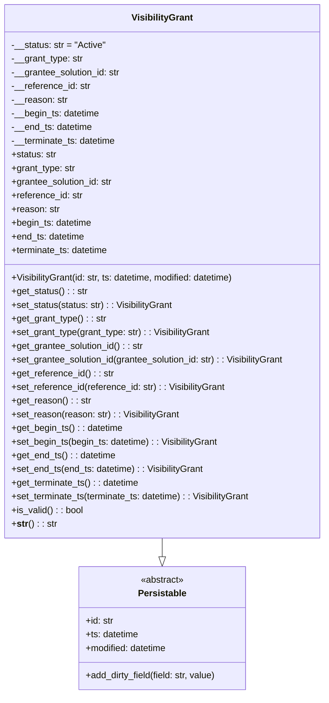

# Diagram: partview_service/partview_service/framework/datamodel/VisibilityGrant.py

> Auto-generated by Obscura crawlers

## Mermaid

### SVG

<svg id="container" width="580.84375" xmlns="http://www.w3.org/2000/svg" class="classDiagram" height="1218" viewBox="0 0 580.84375 1218" role="graphics-document document" aria-roledescription="class"><g><defs><marker id="container_class-aggregationStart" class="marker aggregation class" refX="18" refY="7" markerWidth="190" markerHeight="240" orient="auto"><path d="M 18,7 L9,13 L1,7 L9,1 Z"></path></marker></defs><defs><marker id="container_class-aggregationEnd" class="marker aggregation class" refX="1" refY="7" markerWidth="20" markerHeight="28" orient="auto"><path d="M 18,7 L9,13 L1,7 L9,1 Z"></path></marker></defs><defs><marker id="container_class-extensionStart" class="marker extension class" refX="18" refY="7" markerWidth="190" markerHeight="240" orient="auto"><path d="M 1,7 L18,13 V 1 Z"></path></marker></defs><defs><marker id="container_class-extensionEnd" class="marker extension class" refX="1" refY="7" markerWidth="20" markerHeight="28" orient="auto"><path d="M 1,1 V 13 L18,7 Z"></path></marker></defs><defs><marker id="container_class-compositionStart" class="marker composition class" refX="18" refY="7" markerWidth="190" markerHeight="240" orient="auto"><path d="M 18,7 L9,13 L1,7 L9,1 Z"></path></marker></defs><defs><marker id="container_class-compositionEnd" class="marker composition class" refX="1" refY="7" markerWidth="20" markerHeight="28" orient="auto"><path d="M 18,7 L9,13 L1,7 L9,1 Z"></path></marker></defs><defs><marker id="container_class-dependencyStart" class="marker dependency class" refX="6" refY="7" markerWidth="190" markerHeight="240" orient="auto"><path d="M 5,7 L9,13 L1,7 L9,1 Z"></path></marker></defs><defs><marker id="container_class-dependencyEnd" class="marker dependency class" refX="13" refY="7" markerWidth="20" markerHeight="28" orient="auto"><path d="M 18,7 L9,13 L14,7 L9,1 Z"></path></marker></defs><defs><marker id="container_class-lollipopStart" class="marker lollipop class" refX="13" refY="7" markerWidth="190" markerHeight="240" orient="auto"><circle stroke="black" fill="transparent" cx="7" cy="7" r="6"></circle></marker></defs><defs><marker id="container_class-lollipopEnd" class="marker lollipop class" refX="1" refY="7" markerWidth="190" markerHeight="240" orient="auto"><circle stroke="black" fill="transparent" cx="7" cy="7" r="6"></circle></marker></defs><g class="root"><g class="clusters"></g><g class="edgePaths"><path d="M290.422,944L290.422,948.167C290.422,952.333,290.422,960.667,290.422,966.125C290.422,971.583,290.422,974.167,290.422,975.458L290.422,976.75" id="id_VisibilityGrant_Persistable_1" class="edge-thickness-normal edge-pattern-solid relation" style=";;;" data-edge="true" data-et="edge" data-id="id_VisibilityGrant_Persistable_1" data-points="W3sieCI6MjkwLjQyMTg3NSwieSI6OTQ0fSx7IngiOjI5MC40MjE4NzUsInkiOjk2OX0seyJ4IjoyOTAuNDIxODc1LCJ5Ijo5OTR9XQ==" marker-end="url(#container_class-extensionEnd)"></path></g><g class="edgeLabels"><g class="edgeLabel"><g class="label" data-id="id_VisibilityGrant_Persistable_1" transform="translate(0, 0)"><foreignObject width="0" height="0">

</foreignObject></g></g></g><g class="nodes"><g class="node default" id="classId-Persistable-0" transform="translate(290.421875, 1102)"><g class="basic label-container"><path d="M-148.83203125 -108 L148.83203125 -108 L148.83203125 108 L-148.83203125 108" stroke="none" stroke-width="0" fill="#ECECFF" style=""></path><path d="M-148.83203125 -108 C-43.48494191227988 -108, 61.86214742544024 -108, 148.83203125 -108 M-148.83203125 -108 C-66.28572931364734 -108, 16.260572622705325 -108, 148.83203125 -108 M148.83203125 -108 C148.83203125 -34.056186892561016, 148.83203125 39.88762621487797, 148.83203125 108 M148.83203125 -108 C148.83203125 -22.918311692786588, 148.83203125 62.163376614426824, 148.83203125 108 M148.83203125 108 C74.93169729604666 108, 1.0313633420933286 108, -148.83203125 108 M148.83203125 108 C48.28842366784467 108, -52.25518391431066 108, -148.83203125 108 M-148.83203125 108 C-148.83203125 31.153047036863526, -148.83203125 -45.69390592627295, -148.83203125 -108 M-148.83203125 108 C-148.83203125 44.54803262262159, -148.83203125 -18.90393475475682, -148.83203125 -108" stroke="#9370DB" stroke-width="1.3" fill="none" stroke-dasharray="0 0" style=""></path></g><g class="annotation-group text" transform="translate(-38.609375, -84)"><g class="label" style="" transform="translate(0,-12)"><foreignObject width="77.21875" height="24">

«abstract»

</foreignObject></g></g><g class="label-group text" transform="translate(-40.9765625, -60)"><g class="label" style="font-weight: bolder" transform="translate(0,-12)"><foreignObject width="81.953125" height="24">

Persistable

</foreignObject></g></g><g class="members-group text" transform="translate(-136.83203125, -12)"><g class="label" style="" transform="translate(0,-12)"><foreignObject width="49.578125" height="24">

+id: str

</foreignObject></g><g class="label" style="" transform="translate(0,12)"><foreignObject width="94.484375" height="24">

+ts: datetime

</foreignObject></g><g class="label" style="" transform="translate(0,36)"><foreignObject width="145.9375" height="24">

+modified: datetime

</foreignObject></g></g><g class="methods-group text" transform="translate(-136.83203125, 84)"><g class="label" style="" transform="translate(0,-12)"><foreignObject width="232.6875" height="24">

+add_dirty_field(field: str, value)

</foreignObject></g></g><g class="divider" style=""><path d="M-148.83203125 -36 C-45.56971623601994 -36, 57.692598777960114 -36, 148.83203125 -36 M-148.83203125 -36 C-72.70216756941913 -36, 3.427696111161737 -36, 148.83203125 -36" stroke="#9370DB" stroke-width="1.3" fill="none" stroke-dasharray="0 0" style=""></path></g><g class="divider" style=""><path d="M-148.83203125 60 C-58.92492014289974 60, 30.982190964200527 60, 148.83203125 60 M-148.83203125 60 C-83.48684880861126 60, -18.141666367222513 60, 148.83203125 60" stroke="#9370DB" stroke-width="1.3" fill="none" stroke-dasharray="0 0" style=""></path></g></g><g class="node default" id="classId-VisibilityGrant-1" transform="translate(290.421875, 476)"><g class="basic label-container"><path d="M-282.421875 -468 L282.421875 -468 L282.421875 468 L-282.421875 468" stroke="none" stroke-width="0" fill="#ECECFF" style=""></path><path d="M-282.421875 -468 C-167.66389036074452 -468, -52.90590572148906 -468, 282.421875 -468 M-282.421875 -468 C-125.12311976768737 -468, 32.17563546462526 -468, 282.421875 -468 M282.421875 -468 C282.421875 -135.6515111114736, 282.421875 196.69697777705278, 282.421875 468 M282.421875 -468 C282.421875 -241.76423419233376, 282.421875 -15.52846838466752, 282.421875 468 M282.421875 468 C112.15801773221139 468, -58.10583953557722 468, -282.421875 468 M282.421875 468 C105.04721109391471 468, -72.32745281217058 468, -282.421875 468 M-282.421875 468 C-282.421875 210.9871182556451, -282.421875 -46.0257634887098, -282.421875 -468 M-282.421875 468 C-282.421875 153.78604214381932, -282.421875 -160.42791571236137, -282.421875 -468" stroke="#9370DB" stroke-width="1.3" fill="none" stroke-dasharray="0 0" style=""></path></g><g class="annotation-group text" transform="translate(0, -444)"></g><g class="label-group text" transform="translate(-51.96875, -444)"><g class="label" style="font-weight: bolder" transform="translate(0,-12)"><foreignObject width="103.9375" height="24">

VisibilityGrant

</foreignObject></g></g><g class="members-group text" transform="translate(-270.421875, -396)"><g class="label" style="" transform="translate(0,-12)"><foreignObject width="165.796875" height="24">

-__status: str = "Active"

</foreignObject></g><g class="label" style="" transform="translate(0,12)"><foreignObject width="126.890625" height="24">

-__grant_type: str

</foreignObject></g><g class="label" style="" transform="translate(0,36)"><foreignObject width="194.515625" height="24">

-__grantee_solution_id: str

</foreignObject></g><g class="label" style="" transform="translate(0,60)"><foreignObject width="139.421875" height="24">

-__reference_id: str

</foreignObject></g><g class="label" style="" transform="translate(0,84)"><foreignObject width="98.15625" height="24">

-__reason: str

</foreignObject></g><g class="label" style="" transform="translate(0,108)"><foreignObject width="156.671875" height="24">

-__begin_ts: datetime

</foreignObject></g><g class="label" style="" transform="translate(0,132)"><foreignObject width="143.578125" height="24">

-__end_ts: datetime

</foreignObject></g><g class="label" style="" transform="translate(0,156)"><foreignObject width="186.578125" height="24">

-__terminate_ts: datetime

</foreignObject></g><g class="label" style="" transform="translate(0,180)"><foreignObject width="79.890625" height="24">

+status: str

</foreignObject></g><g class="label" style="" transform="translate(0,204)"><foreignObject width="113.078125" height="24">

+grant_type: str

</foreignObject></g><g class="label" style="" transform="translate(0,228)"><foreignObject width="180.71875" height="24">

+grantee_solution_id: str

</foreignObject></g><g class="label" style="" transform="translate(0,252)"><foreignObject width="125.75" height="24">

+reference_id: str

</foreignObject></g><g class="label" style="" transform="translate(0,276)"><foreignObject width="84.484375" height="24">

+reason: str

</foreignObject></g><g class="label" style="" transform="translate(0,300)"><foreignObject width="143" height="24">

+begin_ts: datetime

</foreignObject></g><g class="label" style="" transform="translate(0,324)"><foreignObject width="130.234375" height="24">

+end_ts: datetime

</foreignObject></g><g class="label" style="" transform="translate(0,348)"><foreignObject width="173.15625" height="24">

+terminate_ts: datetime

</foreignObject></g></g><g class="methods-group text" transform="translate(-270.421875, 12)"><g class="label" style="" transform="translate(0,-12)"><foreignObject width="400.53125" height="24">

+VisibilityGrant(id: str, ts: datetime, modified: datetime)

</foreignObject></g><g class="label" style="" transform="translate(0,12)"><foreignObject width="133.46875" height="24">

+get_status() : : str

</foreignObject></g><g class="label" style="" transform="translate(0,36)"><foreignObject width="287.09375" height="24">

+set_status(status: str) : : VisibilityGrant

</foreignObject></g><g class="label" style="" transform="translate(0,60)"><foreignObject width="166.796875" height="24">

+get_grant_type() : : str

</foreignObject></g><g class="label" style="" transform="translate(0,84)"><foreignObject width="353.609375" height="24">

+set_grant_type(grant_type: str) : : VisibilityGrant

</foreignObject></g><g class="label" style="" transform="translate(0,108)"><foreignObject width="234.421875" height="24">

+get_grantee_solution_id() : : str

</foreignObject></g><g class="label" style="" transform="translate(0,132)"><foreignObject width="488.875" height="24">

+set_grantee_solution_id(grantee_solution_id: str) : : VisibilityGrant

</foreignObject></g><g class="label" style="" transform="translate(0,156)"><foreignObject width="179.3125" height="24">

+get_reference_id() : : str

</foreignObject></g><g class="label" style="" transform="translate(0,180)"><foreignObject width="378.8125" height="24">

+set_reference_id(reference_id: str) : : VisibilityGrant

</foreignObject></g><g class="label" style="" transform="translate(0,204)"><foreignObject width="138.0625" height="24">

+get_reason() : : str

</foreignObject></g><g class="label" style="" transform="translate(0,228)"><foreignObject width="296.28125" height="24">

+set_reason(reason: str) : : VisibilityGrant

</foreignObject></g><g class="label" style="" transform="translate(0,252)"><foreignObject width="196.5625" height="24">

+get_begin_ts() : : datetime

</foreignObject></g><g class="label" style="" transform="translate(0,276)"><foreignObject width="367.484375" height="24">

+set_begin_ts(begin_ts: datetime) : : VisibilityGrant

</foreignObject></g><g class="label" style="" transform="translate(0,300)"><foreignObject width="183.484375" height="24">

+get_end_ts() : : datetime

</foreignObject></g><g class="label" style="" transform="translate(0,324)"><foreignObject width="341.625" height="24">

+set_end_ts(end_ts: datetime) : : VisibilityGrant

</foreignObject></g><g class="label" style="" transform="translate(0,348)"><foreignObject width="226.484375" height="24">

+get_terminate_ts() : : datetime

</foreignObject></g><g class="label" style="" transform="translate(0,372)"><foreignObject width="427.640625" height="24">

+set_terminate_ts(terminate_ts: datetime) : : VisibilityGrant

</foreignObject></g><g class="label" style="" transform="translate(0,396)"><foreignObject width="126.078125" height="24">

+is_valid() : : bool

</foreignObject></g><g class="label" style="" transform="translate(0,420)"><foreignObject width="78.515625" height="24">

+<strong>str</strong>() : : str

</foreignObject></g></g><g class="divider" style=""><path d="M-282.421875 -420 C-131.55100811200532 -420, 19.31985877598936 -420, 282.421875 -420 M-282.421875 -420 C-150.57631096528073 -420, -18.730746930561452 -420, 282.421875 -420" stroke="#9370DB" stroke-width="1.3" fill="none" stroke-dasharray="0 0" style=""></path></g><g class="divider" style=""><path d="M-282.421875 -12 C-77.12362596827234 -12, 128.17462306345533 -12, 282.421875 -12 M-282.421875 -12 C-158.05001415596368 -12, -33.67815331192736 -12, 282.421875 -12" stroke="#9370DB" stroke-width="1.3" fill="none" stroke-dasharray="0 0" style=""></path></g></g></g></g></g></svg>
