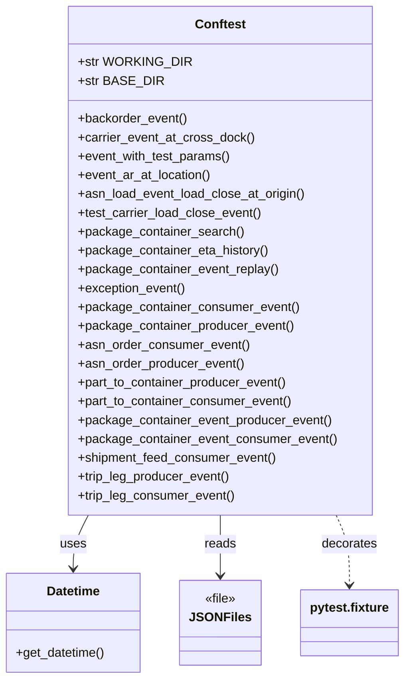

# Diagram: partview_service/partview_service/tests/conftest.py

> Auto-generated by Obscura crawlers

## Diagram 1

```mermaid
flowchart LR
  subgraph Fixtures
    backorder_event["backorder_event\n(read JSON)"]
    carrier_event_at_cross_dock["carrier_event_at_cross_dock\n(read JSON, set body.eventTs)"]
    event_with_test_params["event_with_test_params\n(read JSON, set eventTs, locationCode=AADL)"]
    event_ar_at_location["event_ar_at_location\n(read JSON, set body.eventTs)"]
    asn_load_event_load_close_at_origin["asn_load_event_load_close_at_origin\n(read JSON, set body.eventTs)"]
    test_carrier_load_close_event["test_carrier_load_close_event\n(read JSON)"]
    package_container_search["package_container_search\n(read JSON)"]
    package_container_eta_history["package_container_eta_history\n(read JSON)"]
    package_container_event_replay["package_container_event_replay\n(read JSON)"]
    exception_event["exception_event\n(read JSON)"]
    package_container_consumer_event["package_container_consumer_event\n(read JSON)"]
    package_container_producer_event["package_container_producer_event\n(read JSON)"]
    asn_order_consumer_event["asn_order_consumer_event\n(read JSON)"]
    asn_order_producer_event["asn_order_producer_event\n(read JSON)"]
    part_to_container_producer_event["part_to_container_producer_event\n(read JSON)"]
    part_to_container_consumer_event["part_to_container_consumer_event\n(read JSON)"]
    package_container_event_producer_event["package_container_event_producer_event\n(read JSON)"]
    package_container_event_consumer_event["package_container_event_consumer_event\n(read JSON)"]
    shipment_feed_consumer_event["shipment_feed_consumer_event\n(read JSON from BASE_DIR/common/... )"]
    trip_leg_producer_event["trip_leg_producer_event\n(read JSON from BASE_DIR/common/... )"]
    trip_leg_consumer_event["trip_leg_consumer_event\n(read JSON from BASE_DIR/common/... )"]
  end

  Datetime["Datetime(None).get_datetime()\n(produces timestamp)"]

  backorder_event --> file_backorder["utility/events/backorder_milestone.json"]
  carrier_event_at_cross_dock --> file_carrier_cd["utility/events/carrier_event_at_cross_dock.json"]
  carrier_event_at_cross_dock --> Datetime
  event_with_test_params --> file_test_params["utility/events/package_container_event_test_params.json"]
  event_with_test_params --> Datetime
  event_ar_at_location --> file_ar_origin["utility/events/test_ar_origin.json"]
  event_ar_at_location --> Datetime
  asn_load_event_load_close_at_origin --> file_asn_planned["utility/events/base_collection/create_planned_leg_asn.json"]
  asn_load_event_load_close_at_origin --> Datetime
  test_carrier_load_close_event --> file_asn_planned
  package_container_search --> file_package_search["utility/events/search_package_container_event.json"]
  package_container_eta_history --> file_package_eta["utility/events/package_container_eta_history.json"]
  package_container_event_replay --> file_package_replay["utility/events/package_container_event_replay_event.json"]
  exception_event --> file_package_exception["utility/events/package_container_exception_event.json"]
  package_container_consumer_event --> file_package_consumer["utility/events/package_container_consumer_event.json"]
  package_container_producer_event --> file_package_producer["utility/events/package_container_producer_event.json"]
  asn_order_consumer_event --> file_asn_consumer["utility/events/post_full_asn_consumer_event.json"]
  asn_order_producer_event --> file_asn_producer["utility/events/post_full_asn_producer_event.json"]
  part_to_container_producer_event --> file_part_to_container_prod["utility/events/part_to_container_producer_event.json"]
  part_to_container_consumer_event --> file_part_to_container_cons["utility/events/part_to_container_consumer_event.json"]
  package_container_event_producer_event --> file_pkg_ev_prod["utility/events/package_container_event_producer_event.json"]
  package_container_event_consumer_event --> file_pkg_ev_cons["utility/events/package_container_event_consumer_event.json"]
  shipment_feed_consumer_event --> file_shipment_consumer["common/utility/events/shipment_consumer_event.json"]
  trip_leg_producer_event --> file_trip_leg_prod["common/utility/events/trip_leg_producer_event.json"]
  trip_leg_consumer_event --> file_trip_leg_cons["common/utility/events/trip_leg_consumer_event.json"]
```

### SVG

<svg id="container" width="1053.953125" xmlns="http://www.w3.org/2000/svg" class="flowchart" height="2890" viewBox="0 0 1053.953125 2890" role="graphics-document document" aria-roledescription="flowchart-v2"><g><marker id="container_flowchart-v2-pointEnd" class="marker flowchart-v2" viewBox="0 0 10 10" refX="5" refY="5" markerUnits="userSpaceOnUse" markerWidth="8" markerHeight="8" orient="auto"><path d="M 0 0 L 10 5 L 0 10 z" class="arrowMarkerPath" style="stroke-width: 1; stroke-dasharray: 1, 0;"></path></marker><marker id="container_flowchart-v2-pointStart" class="marker flowchart-v2" viewBox="0 0 10 10" refX="4.5" refY="5" markerUnits="userSpaceOnUse" markerWidth="8" markerHeight="8" orient="auto"><path d="M 0 5 L 10 10 L 10 0 z" class="arrowMarkerPath" style="stroke-width: 1; stroke-dasharray: 1, 0;"></path></marker><marker id="container_flowchart-v2-circleEnd" class="marker flowchart-v2" viewBox="0 0 10 10" refX="11" refY="5" markerUnits="userSpaceOnUse" markerWidth="11" markerHeight="11" orient="auto"><circle cx="5" cy="5" r="5" class="arrowMarkerPath" style="stroke-width: 1; stroke-dasharray: 1, 0;"></circle></marker><marker id="container_flowchart-v2-circleStart" class="marker flowchart-v2" viewBox="0 0 10 10" refX="-1" refY="5" markerUnits="userSpaceOnUse" markerWidth="11" markerHeight="11" orient="auto"><circle cx="5" cy="5" r="5" class="arrowMarkerPath" style="stroke-width: 1; stroke-dasharray: 1, 0;"></circle></marker><marker id="container_flowchart-v2-crossEnd" class="marker cross flowchart-v2" viewBox="0 0 11 11" refX="12" refY="5.2" markerUnits="userSpaceOnUse" markerWidth="11" markerHeight="11" orient="auto"><path d="M 1,1 l 9,9 M 10,1 l -9,9" class="arrowMarkerPath" style="stroke-width: 2; stroke-dasharray: 1, 0;"></path></marker><marker id="container_flowchart-v2-crossStart" class="marker cross flowchart-v2" viewBox="0 0 11 11" refX="-1" refY="5.2" markerUnits="userSpaceOnUse" markerWidth="11" markerHeight="11" orient="auto"><path d="M 1,1 l 9,9 M 10,1 l -9,9" class="arrowMarkerPath" style="stroke-width: 2; stroke-dasharray: 1, 0;"></path></marker><g class="root"><g class="clusters"><g class="cluster" id="Fixtures" data-look="classic"><rect style="" x="8" y="8" width="478.421875" height="2874"></rect><g class="cluster-label" transform="translate(218.9375, 8)"><foreignObject width="56.546875" height="24">

Fixtures

</foreignObject></g></g></g><g class="edgePaths"><path d="M377.211,82L395.413,82C413.615,82,450.018,82,472.387,82C494.755,82,503.089,82,523.827,82C544.565,82,577.708,82,594.28,82L610.852,82" id="L_backorder_event_file_backorder_0" class="edge-thickness-normal edge-pattern-solid edge-thickness-normal edge-pattern-solid flowchart-link" style=";" data-edge="true" data-et="edge" data-id="L_backorder_event_file_backorder_0" data-points="W3sieCI6Mzc3LjIxMDkzNzUsInkiOjgyfSx7IngiOjQ4Ni40MjE4NzUsInkiOjgyfSx7IngiOjUxMS40MjE4NzUsInkiOjgyfSx7IngiOjYxNC44NTE1NjI1LCJ5Ijo4Mn1d" marker-end="url(#container_flowchart-v2-pointEnd)"></path><path d="M409.578,201.855L422.385,201.212C435.193,200.57,460.807,199.285,477.781,198.642C494.755,198,503.089,198,519.451,198C535.813,198,560.203,198,572.398,198L584.594,198" id="L_carrier_event_at_cross_dock_file_carrier_cd_0" class="edge-thickness-normal edge-pattern-solid edge-thickness-normal edge-pattern-solid flowchart-link" style=";" data-edge="true" data-et="edge" data-id="L_carrier_event_at_cross_dock_file_carrier_cd_0" data-points="W3sieCI6NDA5LjU3ODEyNSwieSI6MjAxLjg1NDg2MTM2MDU5MzF9LHsieCI6NDg2LjQyMTg3NSwieSI6MTk4fSx7IngiOjUxMS40MjE4NzUsInkiOjE5OH0seyJ4Ijo1ODguNTkzNzUsInkiOjE5OH1d" marker-end="url(#container_flowchart-v2-pointEnd)"></path><path d="M402.698,249L416.652,252.5C430.606,256,458.514,263,476.635,266.5C494.755,270,503.089,270,521.685,272.373C540.281,274.745,569.139,279.49,583.569,281.863L597.998,284.235" id="L_carrier_event_at_cross_dock_Datetime_0" class="edge-thickness-normal edge-pattern-solid edge-thickness-normal edge-pattern-solid flowchart-link" style=";" data-edge="true" data-et="edge" data-id="L_carrier_event_at_cross_dock_Datetime_0" data-points="W3sieCI6NDAyLjY5ODA0Njg3NSwieSI6MjQ5fSx7IngiOjQ4Ni40MjE4NzUsInkiOjI3MH0seyJ4Ijo1MTEuNDIxODc1LCJ5IjoyNzB9LHsieCI6NjAxLjk0NTMxMjUsInkiOjI4NC44ODQxNjY0MzM5NTd9XQ==" marker-end="url(#container_flowchart-v2-pointEnd)"></path><path d="M331.931,435L357.68,450.5C383.428,466,434.925,497,464.84,512.5C494.755,528,503.089,528,513.188,528C523.286,528,535.151,528,541.083,528L547.016,528" id="L_event_with_test_params_file_test_params_0" class="edge-thickness-normal edge-pattern-solid edge-thickness-normal edge-pattern-solid flowchart-link" style=";" data-edge="true" data-et="edge" data-id="L_event_with_test_params_file_test_params_0" data-points="W3sieCI6MzMxLjkzMTQ3Nzg2NDU4MzMsInkiOjQzNX0seyJ4Ijo0ODYuNDIxODc1LCJ5Ijo1Mjh9LHsieCI6NTExLjQyMTg3NSwieSI6NTI4fSx7IngiOjU1MS4wMTU2MjUsInkiOjUyOH1d" marker-end="url(#container_flowchart-v2-pointEnd)"></path><path d="M376.996,333L395.233,325.833C413.471,318.667,449.946,304.333,472.351,297.167C494.755,290,503.089,290,521.679,291.34C540.269,292.681,569.116,295.362,583.539,296.702L597.962,298.043" id="L_event_with_test_params_Datetime_0" class="edge-thickness-normal edge-pattern-solid edge-thickness-normal edge-pattern-solid flowchart-link" style=";" data-edge="true" data-et="edge" data-id="L_event_with_test_params_Datetime_0" data-points="W3sieCI6Mzc2Ljk5NTU5NTA3OTc4NzIsInkiOjMzM30seyJ4Ijo0ODYuNDIxODc1LCJ5IjoyOTB9LHsieCI6NTExLjQyMTg3NSwieSI6MjkwfSx7IngiOjYwMS45NDUzMTI1LCJ5IjoyOTguNDEyNzg5NzIzNTQwOX1d" marker-end="url(#container_flowchart-v2-pointEnd)"></path><path d="M321.252,563L348.781,577.5C376.309,592,431.365,621,463.06,635.5C494.755,650,503.089,650,528.266,650C553.443,650,595.464,650,616.474,650L637.484,650" id="L_event_ar_at_location_file_ar_origin_0" class="edge-thickness-normal edge-pattern-solid edge-thickness-normal edge-pattern-solid flowchart-link" style=";" data-edge="true" data-et="edge" data-id="L_event_ar_at_location_file_ar_origin_0" data-points="W3sieCI6MzIxLjI1MjQxODE1NDc2MTksInkiOjU2M30seyJ4Ijo0ODYuNDIxODc1LCJ5Ijo2NTB9LHsieCI6NTExLjQyMTg3NSwieSI6NjUwfSx7IngiOjY0MS40ODQzNzUsInkiOjY1MH1d" marker-end="url(#container_flowchart-v2-pointEnd)"></path><path d="M320.096,485L347.817,470.167C375.538,455.333,430.98,425.667,462.867,410.833C494.755,396,503.089,396,530.511,389.35C557.933,382.7,604.445,369.4,627.7,362.75L650.956,356.1" id="L_event_ar_at_location_Datetime_0" class="edge-thickness-normal edge-pattern-solid edge-thickness-normal edge-pattern-solid flowchart-link" style=";" data-edge="true" data-et="edge" data-id="L_event_ar_at_location_Datetime_0" data-points="W3sieCI6MzIwLjA5NTUyMDAxOTUzMTI1LCJ5Ijo0ODV9LHsieCI6NDg2LjQyMTg3NSwieSI6Mzk2fSx7IngiOjUxMS40MjE4NzUsInkiOjM5Nn0seyJ4Ijo2NTQuODAxNzU3ODEyNSwieSI6MzU1fV0=" marker-end="url(#container_flowchart-v2-pointEnd)"></path><path d="M329.046,691L355.276,703.5C381.505,716,433.963,741,464.359,753.5C494.755,766,503.089,766,533.562,772.018C564.035,778.036,616.649,790.072,642.955,796.09L669.262,802.108" id="L_asn_load_event_load_close_at_origin_file_asn_planned_0" class="edge-thickness-normal edge-pattern-solid edge-thickness-normal edge-pattern-solid flowchart-link" style=";" data-edge="true" data-et="edge" data-id="L_asn_load_event_load_close_at_origin_file_asn_planned_0" data-points="W3sieCI6MzI5LjA0NjI1ODIyMzY4NDIsInkiOjY5MX0seyJ4Ijo0ODYuNDIxODc1LCJ5Ijo3NjZ9LHsieCI6NTExLjQyMTg3NSwieSI6NzY2fSx7IngiOjY3My4xNjEzNzY5NTMxMjUsInkiOjgwM31d" marker-end="url(#container_flowchart-v2-pointEnd)"></path><path d="M298.47,613L329.796,589.167C361.121,565.333,423.771,517.667,459.263,493.833C494.755,470,503.089,470,541.49,451.155C579.892,432.31,648.363,394.619,682.598,375.774L716.834,356.929" id="L_asn_load_event_load_close_at_origin_Datetime_0" class="edge-thickness-normal edge-pattern-solid edge-thickness-normal edge-pattern-solid flowchart-link" style=";" data-edge="true" data-et="edge" data-id="L_asn_load_event_load_close_at_origin_Datetime_0" data-points="W3sieCI6Mjk4LjQ3MDQyNDEwNzE0MjgzLCJ5Ijo2MTN9LHsieCI6NDg2LjQyMTg3NSwieSI6NDcwfSx7IngiOjUxMS40MjE4NzUsInkiOjQ3MH0seyJ4Ijo3MjAuMzM3NzYzNzk4NzAxMywieSI6MzU1fV0=" marker-end="url(#container_flowchart-v2-pointEnd)"></path><path d="M414.82,840L426.754,840C438.688,840,462.555,840,478.655,840C494.755,840,503.089,840,511.788,839.838C520.488,839.676,529.554,839.352,534.087,839.19L538.62,839.028" id="L_test_carrier_load_close_event_file_asn_planned_0" class="edge-thickness-normal edge-pattern-solid edge-thickness-normal edge-pattern-solid flowchart-link" style=";" data-edge="true" data-et="edge" data-id="L_test_carrier_load_close_event_file_asn_planned_0" data-points="W3sieCI6NDE0LjgyMDMxMjUsInkiOjg0MH0seyJ4Ijo0ODYuNDIxODc1LCJ5Ijo4NDB9LHsieCI6NTExLjQyMTg3NSwieSI6ODQwfSx7IngiOjU0Mi42MTcxODc1LCJ5Ijo4MzguODg0OTQ4MzM4NDUzfV0=" marker-end="url(#container_flowchart-v2-pointEnd)"></path><path d="M401.938,968L416.018,968C430.099,968,458.26,968,476.508,968C494.755,968,503.089,968,516.648,968C530.208,968,548.995,968,558.388,968L567.781,968" id="L_package_container_search_file_package_search_0" class="edge-thickness-normal edge-pattern-solid edge-thickness-normal edge-pattern-solid flowchart-link" style=";" data-edge="true" data-et="edge" data-id="L_package_container_search_file_package_search_0" data-points="W3sieCI6NDAxLjkzNzUsInkiOjk2OH0seyJ4Ijo0ODYuNDIxODc1LCJ5Ijo5Njh9LHsieCI6NTExLjQyMTg3NSwieSI6OTY4fSx7IngiOjU3MS43ODEyNSwieSI6OTY4fV0=" marker-end="url(#container_flowchart-v2-pointEnd)"></path><path d="M419.016,1096L430.25,1096C441.484,1096,463.953,1096,479.354,1096C494.755,1096,503.089,1096,517.909,1096C532.729,1096,554.036,1096,564.69,1096L575.344,1096" id="L_package_container_eta_history_file_package_eta_0" class="edge-thickness-normal edge-pattern-solid edge-thickness-normal edge-pattern-solid flowchart-link" style=";" data-edge="true" data-et="edge" data-id="L_package_container_eta_history_file_package_eta_0" data-points="W3sieCI6NDE5LjAxNTYyNSwieSI6MTA5Nn0seyJ4Ijo0ODYuNDIxODc1LCJ5IjoxMDk2fSx7IngiOjUxMS40MjE4NzUsInkiOjEwOTZ9LHsieCI6NTc5LjM0Mzc1LCJ5IjoxMDk2fV0=" marker-end="url(#container_flowchart-v2-pointEnd)"></path><path d="M424.93,1224L435.178,1224C445.427,1224,465.924,1224,480.34,1224C494.755,1224,503.089,1224,512.876,1224C522.664,1224,533.906,1224,539.527,1224L545.148,1224" id="L_package_container_event_replay_file_package_replay_0" class="edge-thickness-normal edge-pattern-solid edge-thickness-normal edge-pattern-solid flowchart-link" style=";" data-edge="true" data-et="edge" data-id="L_package_container_event_replay_file_package_replay_0" data-points="W3sieCI6NDI0LjkyOTY4NzUsInkiOjEyMjR9LHsieCI6NDg2LjQyMTg3NSwieSI6MTIyNH0seyJ4Ijo1MTEuNDIxODc1LCJ5IjoxMjI0fSx7IngiOjU0OS4xNDg0Mzc1LCJ5IjoxMjI0fV0=" marker-end="url(#container_flowchart-v2-pointEnd)"></path><path d="M377.211,1352L395.413,1352C413.615,1352,450.018,1352,472.387,1352C494.755,1352,503.089,1352,514.734,1352C526.38,1352,541.339,1352,548.818,1352L556.297,1352" id="L_exception_event_file_package_exception_0" class="edge-thickness-normal edge-pattern-solid edge-thickness-normal edge-pattern-solid flowchart-link" style=";" data-edge="true" data-et="edge" data-id="L_exception_event_file_package_exception_0" data-points="W3sieCI6Mzc3LjIxMDkzNzUsInkiOjEzNTJ9LHsieCI6NDg2LjQyMTg3NSwieSI6MTM1Mn0seyJ4Ijo1MTEuNDIxODc1LCJ5IjoxMzUyfSx7IngiOjU2MC4yOTY4NzUsInkiOjEzNTJ9XQ==" marker-end="url(#container_flowchart-v2-pointEnd)"></path><path d="M437.258,1480L445.452,1480C453.646,1480,470.034,1480,482.395,1480C494.755,1480,503.089,1480,514.784,1480C526.479,1480,541.536,1480,549.065,1480L556.594,1480" id="L_package_container_consumer_event_file_package_consumer_0" class="edge-thickness-normal edge-pattern-solid edge-thickness-normal edge-pattern-solid flowchart-link" style=";" data-edge="true" data-et="edge" data-id="L_package_container_consumer_event_file_package_consumer_0" data-points="W3sieCI6NDM3LjI1NzgxMjUsInkiOjE0ODB9LHsieCI6NDg2LjQyMTg3NSwieSI6MTQ4MH0seyJ4Ijo1MTEuNDIxODc1LCJ5IjoxNDgwfSx7IngiOjU2MC41OTM3NSwieSI6MTQ4MH1d" marker-end="url(#container_flowchart-v2-pointEnd)"></path><path d="M434.516,1608L443.167,1608C451.818,1608,469.12,1608,481.938,1608C494.755,1608,503.089,1608,515.24,1608C527.391,1608,543.359,1608,551.344,1608L559.328,1608" id="L_package_container_producer_event_file_package_producer_0" class="edge-thickness-normal edge-pattern-solid edge-thickness-normal edge-pattern-solid flowchart-link" style=";" data-edge="true" data-et="edge" data-id="L_package_container_producer_event_file_package_producer_0" data-points="W3sieCI6NDM0LjUxNTYyNSwieSI6MTYwOH0seyJ4Ijo0ODYuNDIxODc1LCJ5IjoxNjA4fSx7IngiOjUxMS40MjE4NzUsInkiOjE2MDh9LHsieCI6NTYzLjMyODEyNSwieSI6MTYwOH1d" marker-end="url(#container_flowchart-v2-pointEnd)"></path><path d="M405.773,1736L419.215,1736C432.656,1736,459.539,1736,477.147,1736C494.755,1736,503.089,1736,517.87,1736C532.651,1736,553.88,1736,564.495,1736L575.109,1736" id="L_asn_order_consumer_event_file_asn_consumer_0" class="edge-thickness-normal edge-pattern-solid edge-thickness-normal edge-pattern-solid flowchart-link" style=";" data-edge="true" data-et="edge" data-id="L_asn_order_consumer_event_file_asn_consumer_0" data-points="W3sieCI6NDA1Ljc3MzQzNzUsInkiOjE3MzZ9LHsieCI6NDg2LjQyMTg3NSwieSI6MTczNn0seyJ4Ijo1MTEuNDIxODc1LCJ5IjoxNzM2fSx7IngiOjU3OS4xMDkzNzUsInkiOjE3MzZ9XQ==" marker-end="url(#container_flowchart-v2-pointEnd)"></path><path d="M403.039,1864L416.936,1864C430.833,1864,458.628,1864,476.691,1864C494.755,1864,503.089,1864,518.326,1864C533.563,1864,555.703,1864,566.773,1864L577.844,1864" id="L_asn_order_producer_event_file_asn_producer_0" class="edge-thickness-normal edge-pattern-solid edge-thickness-normal edge-pattern-solid flowchart-link" style=";" data-edge="true" data-et="edge" data-id="L_asn_order_producer_event_file_asn_producer_0" data-points="W3sieCI6NDAzLjAzOTA2MjUsInkiOjE4NjR9LHsieCI6NDg2LjQyMTg3NSwieSI6MTg2NH0seyJ4Ijo1MTEuNDIxODc1LCJ5IjoxODY0fSx7IngiOjU4MS44NDM3NSwieSI6MTg2NH1d" marker-end="url(#container_flowchart-v2-pointEnd)"></path><path d="M431.469,1992L440.628,1992C449.786,1992,468.104,1992,481.43,1992C494.755,1992,503.089,1992,515.747,1992C528.406,1992,545.391,1992,553.883,1992L562.375,1992" id="L_part_to_container_producer_event_file_part_to_container_prod_0" class="edge-thickness-normal edge-pattern-solid edge-thickness-normal edge-pattern-solid flowchart-link" style=";" data-edge="true" data-et="edge" data-id="L_part_to_container_producer_event_file_part_to_container_prod_0" data-points="W3sieCI6NDMxLjQ2ODc1LCJ5IjoxOTkyfSx7IngiOjQ4Ni40MjE4NzUsInkiOjE5OTJ9LHsieCI6NTExLjQyMTg3NSwieSI6MTk5Mn0seyJ4Ijo1NjYuMzc1LCJ5IjoxOTkyfV0=" marker-end="url(#container_flowchart-v2-pointEnd)"></path><path d="M434.211,2120L442.913,2120C451.615,2120,469.018,2120,481.887,2120C494.755,2120,503.089,2120,515.292,2120C527.495,2120,543.568,2120,551.604,2120L559.641,2120" id="L_part_to_container_consumer_event_file_part_to_container_cons_0" class="edge-thickness-normal edge-pattern-solid edge-thickness-normal edge-pattern-solid flowchart-link" style=";" data-edge="true" data-et="edge" data-id="L_part_to_container_consumer_event_file_part_to_container_cons_0" data-points="W3sieCI6NDM0LjIxMDkzNzUsInkiOjIxMjB9LHsieCI6NDg2LjQyMTg3NSwieSI6MjEyMH0seyJ4Ijo1MTEuNDIxODc1LCJ5IjoyMTIwfSx7IngiOjU2My42NDA2MjUsInkiOjIxMjB9XQ==" marker-end="url(#container_flowchart-v2-pointEnd)"></path><path d="M458.688,2248L463.31,2248C467.932,2248,477.177,2248,485.966,2248C494.755,2248,503.089,2248,511.211,2248C519.333,2248,527.245,2248,531.201,2248L535.156,2248" id="L_package_container_event_producer_event_file_pkg_ev_prod_0" class="edge-thickness-normal edge-pattern-solid edge-thickness-normal edge-pattern-solid flowchart-link" style=";" data-edge="true" data-et="edge" data-id="L_package_container_event_producer_event_file_pkg_ev_prod_0" data-points="W3sieCI6NDU4LjY4NzUsInkiOjIyNDh9LHsieCI6NDg2LjQyMTg3NSwieSI6MjI0OH0seyJ4Ijo1MTEuNDIxODc1LCJ5IjoyMjQ4fSx7IngiOjUzOS4xNTYyNSwieSI6MjI0OH1d" marker-end="url(#container_flowchart-v2-pointEnd)"></path><path d="M461.422,2376L465.589,2376C469.755,2376,478.089,2376,486.422,2376C494.755,2376,503.089,2376,510.755,2376C518.422,2376,525.422,2376,528.922,2376L532.422,2376" id="L_package_container_event_consumer_event_file_pkg_ev_cons_0" class="edge-thickness-normal edge-pattern-solid edge-thickness-normal edge-pattern-solid flowchart-link" style=";" data-edge="true" data-et="edge" data-id="L_package_container_event_consumer_event_file_pkg_ev_cons_0" data-points="W3sieCI6NDYxLjQyMTg3NSwieSI6MjM3Nn0seyJ4Ijo0ODYuNDIxODc1LCJ5IjoyMzc2fSx7IngiOjUxMS40MjE4NzUsInkiOjIzNzZ9LHsieCI6NTM2LjQyMTg3NSwieSI6MjM3Nn1d" marker-end="url(#container_flowchart-v2-pointEnd)"></path><path d="M424.297,2504L434.651,2504C445.005,2504,465.714,2504,480.234,2504C494.755,2504,503.089,2504,514.406,2504C525.724,2504,540.026,2504,547.177,2504L554.328,2504" id="L_shipment_feed_consumer_event_file_shipment_consumer_0" class="edge-thickness-normal edge-pattern-solid edge-thickness-normal edge-pattern-solid flowchart-link" style=";" data-edge="true" data-et="edge" data-id="L_shipment_feed_consumer_event_file_shipment_consumer_0" data-points="W3sieCI6NDI0LjI5Njg3NSwieSI6MjUwNH0seyJ4Ijo0ODYuNDIxODc1LCJ5IjoyNTA0fSx7IngiOjUxMS40MjE4NzUsInkiOjI1MDR9LHsieCI6NTU4LjMyODEyNSwieSI6MjUwNH1d" marker-end="url(#container_flowchart-v2-pointEnd)"></path><path d="M394.992,2644L410.23,2644C425.469,2644,455.945,2644,475.35,2644C494.755,2644,503.089,2644,515.939,2644C528.789,2644,546.156,2644,554.84,2644L563.523,2644" id="L_trip_leg_producer_event_file_trip_leg_prod_0" class="edge-thickness-normal edge-pattern-solid edge-thickness-normal edge-pattern-solid flowchart-link" style=";" data-edge="true" data-et="edge" data-id="L_trip_leg_producer_event_file_trip_leg_prod_0" data-points="W3sieCI6Mzk0Ljk5MjE4NzUsInkiOjI2NDR9LHsieCI6NDg2LjQyMTg3NSwieSI6MjY0NH0seyJ4Ijo1MTEuNDIxODc1LCJ5IjoyNjQ0fSx7IngiOjU2Ny41MjM0Mzc1LCJ5IjoyNjQ0fV0=" marker-end="url(#container_flowchart-v2-pointEnd)"></path><path d="M397.727,2796L412.509,2796C427.292,2796,456.857,2796,475.806,2796C494.755,2796,503.089,2796,515.483,2796C527.878,2796,544.333,2796,552.561,2796L560.789,2796" id="L_trip_leg_consumer_event_file_trip_leg_cons_0" class="edge-thickness-normal edge-pattern-solid edge-thickness-normal edge-pattern-solid flowchart-link" style=";" data-edge="true" data-et="edge" data-id="L_trip_leg_consumer_event_file_trip_leg_cons_0" data-points="W3sieCI6Mzk3LjcyNjU2MjUsInkiOjI3OTZ9LHsieCI6NDg2LjQyMTg3NSwieSI6Mjc5Nn0seyJ4Ijo1MTEuNDIxODc1LCJ5IjoyNzk2fSx7IngiOjU2NC43ODkwNjI1LCJ5IjoyNzk2fV0=" marker-end="url(#container_flowchart-v2-pointEnd)"></path></g><g class="edgeLabels"><g class="edgeLabel"><g class="label" data-id="L_backorder_event_file_backorder_0" transform="translate(0, 0)"><foreignObject width="0" height="0">

</foreignObject></g></g><g class="edgeLabel"><g class="label" data-id="L_carrier_event_at_cross_dock_file_carrier_cd_0" transform="translate(0, 0)"><foreignObject width="0" height="0">

</foreignObject></g></g><g class="edgeLabel"><g class="label" data-id="L_carrier_event_at_cross_dock_Datetime_0" transform="translate(0, 0)"><foreignObject width="0" height="0">

</foreignObject></g></g><g class="edgeLabel"><g class="label" data-id="L_event_with_test_params_file_test_params_0" transform="translate(0, 0)"><foreignObject width="0" height="0">

</foreignObject></g></g><g class="edgeLabel"><g class="label" data-id="L_event_with_test_params_Datetime_0" transform="translate(0, 0)"><foreignObject width="0" height="0">

</foreignObject></g></g><g class="edgeLabel"><g class="label" data-id="L_event_ar_at_location_file_ar_origin_0" transform="translate(0, 0)"><foreignObject width="0" height="0">

</foreignObject></g></g><g class="edgeLabel"><g class="label" data-id="L_event_ar_at_location_Datetime_0" transform="translate(0, 0)"><foreignObject width="0" height="0">

</foreignObject></g></g><g class="edgeLabel"><g class="label" data-id="L_asn_load_event_load_close_at_origin_file_asn_planned_0" transform="translate(0, 0)"><foreignObject width="0" height="0">

</foreignObject></g></g><g class="edgeLabel"><g class="label" data-id="L_asn_load_event_load_close_at_origin_Datetime_0" transform="translate(0, 0)"><foreignObject width="0" height="0">

</foreignObject></g></g><g class="edgeLabel"><g class="label" data-id="L_test_carrier_load_close_event_file_asn_planned_0" transform="translate(0, 0)"><foreignObject width="0" height="0">

</foreignObject></g></g><g class="edgeLabel"><g class="label" data-id="L_package_container_search_file_package_search_0" transform="translate(0, 0)"><foreignObject width="0" height="0">

</foreignObject></g></g><g class="edgeLabel"><g class="label" data-id="L_package_container_eta_history_file_package_eta_0" transform="translate(0, 0)"><foreignObject width="0" height="0">

</foreignObject></g></g><g class="edgeLabel"><g class="label" data-id="L_package_container_event_replay_file_package_replay_0" transform="translate(0, 0)"><foreignObject width="0" height="0">

</foreignObject></g></g><g class="edgeLabel"><g class="label" data-id="L_exception_event_file_package_exception_0" transform="translate(0, 0)"><foreignObject width="0" height="0">

</foreignObject></g></g><g class="edgeLabel"><g class="label" data-id="L_package_container_consumer_event_file_package_consumer_0" transform="translate(0, 0)"><foreignObject width="0" height="0">

</foreignObject></g></g><g class="edgeLabel"><g class="label" data-id="L_package_container_producer_event_file_package_producer_0" transform="translate(0, 0)"><foreignObject width="0" height="0">

</foreignObject></g></g><g class="edgeLabel"><g class="label" data-id="L_asn_order_consumer_event_file_asn_consumer_0" transform="translate(0, 0)"><foreignObject width="0" height="0">

</foreignObject></g></g><g class="edgeLabel"><g class="label" data-id="L_asn_order_producer_event_file_asn_producer_0" transform="translate(0, 0)"><foreignObject width="0" height="0">

</foreignObject></g></g><g class="edgeLabel"><g class="label" data-id="L_part_to_container_producer_event_file_part_to_container_prod_0" transform="translate(0, 0)"><foreignObject width="0" height="0">

</foreignObject></g></g><g class="edgeLabel"><g class="label" data-id="L_part_to_container_consumer_event_file_part_to_container_cons_0" transform="translate(0, 0)"><foreignObject width="0" height="0">

</foreignObject></g></g><g class="edgeLabel"><g class="label" data-id="L_package_container_event_producer_event_file_pkg_ev_prod_0" transform="translate(0, 0)"><foreignObject width="0" height="0">

</foreignObject></g></g><g class="edgeLabel"><g class="label" data-id="L_package_container_event_consumer_event_file_pkg_ev_cons_0" transform="translate(0, 0)"><foreignObject width="0" height="0">

</foreignObject></g></g><g class="edgeLabel"><g class="label" data-id="L_shipment_feed_consumer_event_file_shipment_consumer_0" transform="translate(0, 0)"><foreignObject width="0" height="0">

</foreignObject></g></g><g class="edgeLabel"><g class="label" data-id="L_trip_leg_producer_event_file_trip_leg_prod_0" transform="translate(0, 0)"><foreignObject width="0" height="0">

</foreignObject></g></g><g class="edgeLabel"><g class="label" data-id="L_trip_leg_consumer_event_file_trip_leg_cons_0" transform="translate(0, 0)"><foreignObject width="0" height="0">

</foreignObject></g></g></g><g class="nodes"><g class="node default" id="flowchart-backorder_event-0" transform="translate(247.2109375, 82)"><rect class="basic label-container" style="" x="-130" y="-39" width="260" height="78"></rect><g class="label" style="" transform="translate(-100, -24)"><rect></rect><foreignObject width="200" height="48">

backorder_event\n(read JSON)

</foreignObject></g></g><g class="node default" id="flowchart-carrier_event_at_cross_dock-1" transform="translate(247.2109375, 210)"><rect class="basic label-container" style="" x="-162.3671875" y="-39" width="324.734375" height="78"></rect><g class="label" style="" transform="translate(-132.3671875, -24)"><rect></rect><foreignObject width="264.734375" height="48">

carrier_event_at_cross_dock\n(read JSON, set body.eventTs)

</foreignObject></g></g><g class="node default" id="flowchart-event_with_test_params-2" transform="translate(247.2109375, 384)"><rect class="basic label-container" style="" x="-147.9296875" y="-51" width="295.859375" height="102"></rect><g class="label" style="" transform="translate(-117.9296875, -36)"><rect></rect><foreignObject width="235.859375" height="72">

event_with_test_params\n(read JSON, set eventTs, locationCode=AADL)

</foreignObject></g></g><g class="node default" id="flowchart-event_ar_at_location-3" transform="translate(247.2109375, 524)"><rect class="basic label-container" style="" x="-135.4140625" y="-39" width="270.828125" height="78"></rect><g class="label" style="" transform="translate(-105.4140625, -24)"><rect></rect><foreignObject width="210.828125" height="48">

event_ar_at_location\n(read JSON, set body.eventTs)

</foreignObject></g></g><g class="node default" id="flowchart-asn_load_event_load_close_at_origin-4" transform="translate(247.2109375, 652)"><rect class="basic label-container" style="" x="-195.734375" y="-39" width="391.46875" height="78"></rect><g class="label" style="" transform="translate(-165.734375, -24)"><rect></rect><foreignObject width="331.46875" height="48">

asn_load_event_load_close_at_origin\n(read JSON, set body.eventTs)

</foreignObject></g></g><g class="node default" id="flowchart-test_carrier_load_close_event-5" transform="translate(247.2109375, 840)"><rect class="basic label-container" style="" x="-167.609375" y="-39" width="335.21875" height="78"></rect><g class="label" style="" transform="translate(-137.609375, -24)"><rect></rect><foreignObject width="275.21875" height="48">

test_carrier_load_close_event\n(read JSON)

</foreignObject></g></g><g class="node default" id="flowchart-package_container_search-6" transform="translate(247.2109375, 968)"><rect class="basic label-container" style="" x="-154.7265625" y="-39" width="309.453125" height="78"></rect><g class="label" style="" transform="translate(-124.7265625, -24)"><rect></rect><foreignObject width="249.453125" height="48">

package_container_search\n(read JSON)

</foreignObject></g></g><g class="node default" id="flowchart-package_container_eta_history-7" transform="translate(247.2109375, 1096)"><rect class="basic label-container" style="" x="-171.8046875" y="-39" width="343.609375" height="78"></rect><g class="label" style="" transform="translate(-141.8046875, -24)"><rect></rect><foreignObject width="283.609375" height="48">

package_container_eta_history\n(read JSON)

</foreignObject></g></g><g class="node default" id="flowchart-package_container_event_replay-8" transform="translate(247.2109375, 1224)"><rect class="basic label-container" style="" x="-177.71875" y="-39" width="355.4375" height="78"></rect><g class="label" style="" transform="translate(-147.71875, -24)"><rect></rect><foreignObject width="295.4375" height="48">

package_container_event_replay\n(read JSON)

</foreignObject></g></g><g class="node default" id="flowchart-exception_event-9" transform="translate(247.2109375, 1352)"><rect class="basic label-container" style="" x="-130" y="-39" width="260" height="78"></rect><g class="label" style="" transform="translate(-100, -24)"><rect></rect><foreignObject width="200" height="48">

exception_event\n(read JSON)

</foreignObject></g></g><g class="node default" id="flowchart-package_container_consumer_event-10" transform="translate(247.2109375, 1480)"><rect class="basic label-container" style="" x="-190.046875" y="-39" width="380.09375" height="78"></rect><g class="label" style="" transform="translate(-160.046875, -24)"><rect></rect><foreignObject width="320.09375" height="48">

package_container_consumer_event\n(read JSON)

</foreignObject></g></g><g class="node default" id="flowchart-package_container_producer_event-11" transform="translate(247.2109375, 1608)"><rect class="basic label-container" style="" x="-187.3046875" y="-39" width="374.609375" height="78"></rect><g class="label" style="" transform="translate(-157.3046875, -24)"><rect></rect><foreignObject width="314.609375" height="48">

package_container_producer_event\n(read JSON)

</foreignObject></g></g><g class="node default" id="flowchart-asn_order_consumer_event-12" transform="translate(247.2109375, 1736)"><rect class="basic label-container" style="" x="-158.5625" y="-39" width="317.125" height="78"></rect><g class="label" style="" transform="translate(-128.5625, -24)"><rect></rect><foreignObject width="257.125" height="48">

asn_order_consumer_event\n(read JSON)

</foreignObject></g></g><g class="node default" id="flowchart-asn_order_producer_event-13" transform="translate(247.2109375, 1864)"><rect class="basic label-container" style="" x="-155.828125" y="-39" width="311.65625" height="78"></rect><g class="label" style="" transform="translate(-125.828125, -24)"><rect></rect><foreignObject width="251.65625" height="48">

asn_order_producer_event\n(read JSON)

</foreignObject></g></g><g class="node default" id="flowchart-part_to_container_producer_event-14" transform="translate(247.2109375, 1992)"><rect class="basic label-container" style="" x="-184.2578125" y="-39" width="368.515625" height="78"></rect><g class="label" style="" transform="translate(-154.2578125, -24)"><rect></rect><foreignObject width="308.515625" height="48">

part_to_container_producer_event\n(read JSON)

</foreignObject></g></g><g class="node default" id="flowchart-part_to_container_consumer_event-15" transform="translate(247.2109375, 2120)"><rect class="basic label-container" style="" x="-187" y="-39" width="374" height="78"></rect><g class="label" style="" transform="translate(-157, -24)"><rect></rect><foreignObject width="314" height="48">

part_to_container_consumer_event\n(read JSON)

</foreignObject></g></g><g class="node default" id="flowchart-package_container_event_producer_event-16" transform="translate(247.2109375, 2248)"><rect class="basic label-container" style="" x="-211.4765625" y="-39" width="422.953125" height="78"></rect><g class="label" style="" transform="translate(-181.4765625, -24)"><rect></rect><foreignObject width="362.953125" height="48">

package_container_event_producer_event\n(read JSON)

</foreignObject></g></g><g class="node default" id="flowchart-package_container_event_consumer_event-17" transform="translate(247.2109375, 2376)"><rect class="basic label-container" style="" x="-214.2109375" y="-39" width="428.421875" height="78"></rect><g class="label" style="" transform="translate(-184.2109375, -24)"><rect></rect><foreignObject width="368.421875" height="48">

package_container_event_consumer_event\n(read JSON)

</foreignObject></g></g><g class="node default" id="flowchart-shipment_feed_consumer_event-18" transform="translate(247.2109375, 2504)"><rect class="basic label-container" style="" x="-177.0859375" y="-39" width="354.171875" height="78"></rect><g class="label" style="" transform="translate(-147.0859375, -24)"><rect></rect><foreignObject width="294.171875" height="48">

shipment_feed_consumer_event\n(read JSON from BASE_DIR/common/... )

</foreignObject></g></g><g class="node default" id="flowchart-trip_leg_producer_event-19" transform="translate(247.2109375, 2644)"><rect class="basic label-container" style="" x="-147.78125" y="-51" width="295.5625" height="102"></rect><g class="label" style="" transform="translate(-117.78125, -36)"><rect></rect><foreignObject width="235.5625" height="72">

trip_leg_producer_event\n(read JSON from BASE_DIR/common/... )

</foreignObject></g></g><g class="node default" id="flowchart-trip_leg_consumer_event-20" transform="translate(247.2109375, 2796)"><rect class="basic label-container" style="" x="-150.515625" y="-51" width="301.03125" height="102"></rect><g class="label" style="" transform="translate(-120.515625, -36)"><rect></rect><foreignObject width="241.03125" height="72">

trip_leg_consumer_event\n(read JSON from BASE_DIR/common/... )

</foreignObject></g></g><g class="node default" id="flowchart-Datetime-21" transform="translate(791.1875, 316)"><rect class="basic label-container" style="" x="-189.2421875" y="-39" width="378.484375" height="78"></rect><g class="label" style="" transform="translate(-159.2421875, -24)"><rect></rect><foreignObject width="318.484375" height="48">

Datetime(None).get_datetime()\n(produces timestamp)

</foreignObject></g></g><g class="node default" id="flowchart-file_backorder-23" transform="translate(791.1875, 82)"><rect class="basic label-container" style="" x="-176.3359375" y="-27" width="352.671875" height="54"></rect><g class="label" style="" transform="translate(-146.3359375, -12)"><rect></rect><foreignObject width="292.671875" height="24">

utility/events/backorder_milestone.json

</foreignObject></g></g><g class="node default" id="flowchart-file_carrier_cd-25" transform="translate(791.1875, 198)"><rect class="basic label-container" style="" x="-202.59375" y="-27" width="405.1875" height="54"></rect><g class="label" style="" transform="translate(-172.59375, -12)"><rect></rect><foreignObject width="345.1875" height="24">

utility/events/carrier_event_at_cross_dock.json

</foreignObject></g></g><g class="node default" id="flowchart-file_test_params-29" transform="translate(791.1875, 528)"><rect class="basic label-container" style="" x="-240.171875" y="-27" width="480.34375" height="54"></rect><g class="label" style="" transform="translate(-210.171875, -12)"><rect></rect><foreignObject width="420.34375" height="24">

utility/events/package_container_event_test_params.json

</foreignObject></g></g><g class="node default" id="flowchart-file_ar_origin-33" transform="translate(791.1875, 650)"><rect class="basic label-container" style="" x="-149.703125" y="-27" width="299.40625" height="54"></rect><g class="label" style="" transform="translate(-119.703125, -12)"><rect></rect><foreignObject width="239.40625" height="24">

utility/events/test_ar_origin.json

</foreignObject></g></g><g class="node default" id="flowchart-file_asn_planned-37" transform="translate(791.1875, 830)"><rect class="basic label-container" style="" x="-248.5703125" y="-27" width="497.140625" height="54"></rect><g class="label" style="" transform="translate(-218.5703125, -12)"><rect></rect><foreignObject width="437.140625" height="24">

utility/events/base_collection/create_planned_leg_asn.json

</foreignObject></g></g><g class="node default" id="flowchart-file_package_search-43" transform="translate(791.1875, 968)"><rect class="basic label-container" style="" x="-219.40625" y="-27" width="438.8125" height="54"></rect><g class="label" style="" transform="translate(-189.40625, -12)"><rect></rect><foreignObject width="378.8125" height="24">

utility/events/search_package_container_event.json

</foreignObject></g></g><g class="node default" id="flowchart-file_package_eta-45" transform="translate(791.1875, 1096)"><rect class="basic label-container" style="" x="-211.84375" y="-27" width="423.6875" height="54"></rect><g class="label" style="" transform="translate(-181.84375, -12)"><rect></rect><foreignObject width="363.6875" height="24">

utility/events/package_container_eta_history.json

</foreignObject></g></g><g class="node default" id="flowchart-file_package_replay-47" transform="translate(791.1875, 1224)"><rect class="basic label-container" style="" x="-242.0390625" y="-27" width="484.078125" height="54"></rect><g class="label" style="" transform="translate(-212.0390625, -12)"><rect></rect><foreignObject width="424.078125" height="24">

utility/events/package_container_event_replay_event.json

</foreignObject></g></g><g class="node default" id="flowchart-file_package_exception-49" transform="translate(791.1875, 1352)"><rect class="basic label-container" style="" x="-230.890625" y="-27" width="461.78125" height="54"></rect><g class="label" style="" transform="translate(-200.890625, -12)"><rect></rect><foreignObject width="401.78125" height="24">

utility/events/package_container_exception_event.json

</foreignObject></g></g><g class="node default" id="flowchart-file_package_consumer-51" transform="translate(791.1875, 1480)"><rect class="basic label-container" style="" x="-230.59375" y="-27" width="461.1875" height="54"></rect><g class="label" style="" transform="translate(-200.59375, -12)"><rect></rect><foreignObject width="401.1875" height="24">

utility/events/package_container_consumer_event.json

</foreignObject></g></g><g class="node default" id="flowchart-file_package_producer-53" transform="translate(791.1875, 1608)"><rect class="basic label-container" style="" x="-227.859375" y="-27" width="455.71875" height="54"></rect><g class="label" style="" transform="translate(-197.859375, -12)"><rect></rect><foreignObject width="395.71875" height="24">

utility/events/package_container_producer_event.json

</foreignObject></g></g><g class="node default" id="flowchart-file_asn_consumer-55" transform="translate(791.1875, 1736)"><rect class="basic label-container" style="" x="-212.078125" y="-27" width="424.15625" height="54"></rect><g class="label" style="" transform="translate(-182.078125, -12)"><rect></rect><foreignObject width="364.15625" height="24">

utility/events/post_full_asn_consumer_event.json

</foreignObject></g></g><g class="node default" id="flowchart-file_asn_producer-57" transform="translate(791.1875, 1864)"><rect class="basic label-container" style="" x="-209.34375" y="-27" width="418.6875" height="54"></rect><g class="label" style="" transform="translate(-179.34375, -12)"><rect></rect><foreignObject width="358.6875" height="24">

utility/events/post_full_asn_producer_event.json

</foreignObject></g></g><g class="node default" id="flowchart-file_part_to_container_prod-59" transform="translate(791.1875, 1992)"><rect class="basic label-container" style="" x="-224.8125" y="-27" width="449.625" height="54"></rect><g class="label" style="" transform="translate(-194.8125, -12)"><rect></rect><foreignObject width="389.625" height="24">

utility/events/part_to_container_producer_event.json

</foreignObject></g></g><g class="node default" id="flowchart-file_part_to_container_cons-61" transform="translate(791.1875, 2120)"><rect class="basic label-container" style="" x="-227.546875" y="-27" width="455.09375" height="54"></rect><g class="label" style="" transform="translate(-197.546875, -12)"><rect></rect><foreignObject width="395.09375" height="24">

utility/events/part_to_container_consumer_event.json

</foreignObject></g></g><g class="node default" id="flowchart-file_pkg_ev_prod-63" transform="translate(791.1875, 2248)"><rect class="basic label-container" style="" x="-252.03125" y="-27" width="504.0625" height="54"></rect><g class="label" style="" transform="translate(-222.03125, -12)"><rect></rect><foreignObject width="444.0625" height="24">

utility/events/package_container_event_producer_event.json

</foreignObject></g></g><g class="node default" id="flowchart-file_pkg_ev_cons-65" transform="translate(791.1875, 2376)"><rect class="basic label-container" style="" x="-254.765625" y="-27" width="509.53125" height="54"></rect><g class="label" style="" transform="translate(-224.765625, -12)"><rect></rect><foreignObject width="449.53125" height="24">

utility/events/package_container_event_consumer_event.json

</foreignObject></g></g><g class="node default" id="flowchart-file_shipment_consumer-67" transform="translate(791.1875, 2504)"><rect class="basic label-container" style="" x="-232.859375" y="-27" width="465.71875" height="54"></rect><g class="label" style="" transform="translate(-202.859375, -12)"><rect></rect><foreignObject width="405.71875" height="24">

common/utility/events/shipment_consumer_event.json

</foreignObject></g></g><g class="node default" id="flowchart-file_trip_leg_prod-69" transform="translate(791.1875, 2644)"><rect class="basic label-container" style="" x="-223.6640625" y="-27" width="447.328125" height="54"></rect><g class="label" style="" transform="translate(-193.6640625, -12)"><rect></rect><foreignObject width="387.328125" height="24">

common/utility/events/trip_leg_producer_event.json

</foreignObject></g></g><g class="node default" id="flowchart-file_trip_leg_cons-71" transform="translate(791.1875, 2796)"><rect class="basic label-container" style="" x="-226.3984375" y="-27" width="452.796875" height="54"></rect><g class="label" style="" transform="translate(-196.3984375, -12)"><rect></rect><foreignObject width="392.796875" height="24">

common/utility/events/trip_leg_consumer_event.json

</foreignObject></g></g></g></g></g></svg>

## Diagram 2

### SVG

<svg id="container" width="502.4296875" xmlns="http://www.w3.org/2000/svg" class="classDiagram" height="864" viewBox="0 0 502.4296875 864" role="graphics-document document" aria-roledescription="class"><g><defs><marker id="container_class-aggregationStart" class="marker aggregation class" refX="18" refY="7" markerWidth="190" markerHeight="240" orient="auto"><path d="M 18,7 L9,13 L1,7 L9,1 Z"></path></marker></defs><defs><marker id="container_class-aggregationEnd" class="marker aggregation class" refX="1" refY="7" markerWidth="20" markerHeight="28" orient="auto"><path d="M 18,7 L9,13 L1,7 L9,1 Z"></path></marker></defs><defs><marker id="container_class-extensionStart" class="marker extension class" refX="18" refY="7" markerWidth="190" markerHeight="240" orient="auto"><path d="M 1,7 L18,13 V 1 Z"></path></marker></defs><defs><marker id="container_class-extensionEnd" class="marker extension class" refX="1" refY="7" markerWidth="20" markerHeight="28" orient="auto"><path d="M 1,1 V 13 L18,7 Z"></path></marker></defs><defs><marker id="container_class-compositionStart" class="marker composition class" refX="18" refY="7" markerWidth="190" markerHeight="240" orient="auto"><path d="M 18,7 L9,13 L1,7 L9,1 Z"></path></marker></defs><defs><marker id="container_class-compositionEnd" class="marker composition class" refX="1" refY="7" markerWidth="20" markerHeight="28" orient="auto"><path d="M 18,7 L9,13 L1,7 L9,1 Z"></path></marker></defs><defs><marker id="container_class-dependencyStart" class="marker dependency class" refX="6" refY="7" markerWidth="190" markerHeight="240" orient="auto"><path d="M 5,7 L9,13 L1,7 L9,1 Z"></path></marker></defs><defs><marker id="container_class-dependencyEnd" class="marker dependency class" refX="13" refY="7" markerWidth="20" markerHeight="28" orient="auto"><path d="M 18,7 L9,13 L14,7 L9,1 Z"></path></marker></defs><defs><marker id="container_class-lollipopStart" class="marker lollipop class" refX="13" refY="7" markerWidth="190" markerHeight="240" orient="auto"><circle stroke="black" fill="transparent" cx="7" cy="7" r="6"></circle></marker></defs><defs><marker id="container_class-lollipopEnd" class="marker lollipop class" refX="1" refY="7" markerWidth="190" markerHeight="240" orient="auto"><circle stroke="black" fill="transparent" cx="7" cy="7" r="6"></circle></marker></defs><g class="root"><g class="clusters"></g><g class="edgePaths"><path d="M112.467,656L109.353,662.167C106.239,668.333,100.012,680.667,96.899,692C93.785,703.333,93.785,713.667,93.785,718.833L93.785,724" id="id_Conftest_Datetime_1" class="edge-thickness-normal edge-pattern-solid relation" style=";;;" data-edge="true" data-et="edge" data-id="id_Conftest_Datetime_1" data-points="W3sieCI6MTEyLjQ2NjUyMDk0ODc1MzQ3LCJ5Ijo2NTZ9LHsieCI6OTMuNzg1MTU2MjUsInkiOjY5M30seyJ4Ijo5My43ODUxNTYyNSwieSI6NzMwfV0=" marker-end="url(#container_class-dependencyEnd)"></path><path d="M276.055,656L276.055,662.167C276.055,668.333,276.055,680.667,276.055,693.5C276.055,706.333,276.055,719.667,276.055,726.333L276.055,733" id="id_Conftest_JSONFiles_2" class="edge-thickness-normal edge-pattern-solid relation" style=";;;" data-edge="true" data-et="edge" data-id="id_Conftest_JSONFiles_2" data-points="W3sieCI6Mjc2LjA1NDY4NzUsInkiOjY1Nn0seyJ4IjoyNzYuMDU0Njg3NSwieSI6NjkzfSx7IngiOjI3Ni4wNTQ2ODc1LCJ5Ijo3Mzl9XQ==" marker-end="url(#container_class-dependencyEnd)"></path><path d="M417.349,656L420.038,662.167C422.727,668.333,428.106,680.667,430.795,695.5C433.484,710.333,433.484,727.667,433.484,736.333L433.484,745" id="id_Conftest_pytest.fixture_3" class="edge-thickness-normal edge-pattern-dashed relation" style=";;;" data-edge="true" data-et="edge" data-id="id_Conftest_pytest.fixture_3" data-points="W3sieCI6NDE3LjM0ODkyMjI2NDU0MjksInkiOjY1Nn0seyJ4Ijo0MzMuNDg0Mzc1LCJ5Ijo2OTN9LHsieCI6NDMzLjQ4NDM3NSwieSI6NzUxfV0=" marker-end="url(#container_class-dependencyEnd)"></path></g><g class="edgeLabels"><g class="edgeLabel" transform="translate(93.78515625, 693)"><g class="label" data-id="id_Conftest_Datetime_1" transform="translate(-16.4921875, -12)"><foreignObject width="32.984375" height="24">

uses

</foreignObject></g></g><g class="edgeLabel" transform="translate(276.0546875, 693)"><g class="label" data-id="id_Conftest_JSONFiles_2" transform="translate(-20.0078125, -12)"><foreignObject width="40.015625" height="24">

reads

</foreignObject></g></g><g class="edgeLabel" transform="translate(433.484375, 693)"><g class="label" data-id="id_Conftest_pytest.fixture_3" transform="translate(-35.5078125, -12)"><foreignObject width="71.015625" height="24">

decorates

</foreignObject></g></g></g><g class="nodes"><g class="node default" id="classId-Conftest-0" transform="translate(276.0546875, 332)"><g class="basic label-container"><path d="M-191.328125 -324 L191.328125 -324 L191.328125 324 L-191.328125 324" stroke="none" stroke-width="0" fill="#ECECFF" style=""></path><path d="M-191.328125 -324 C-56.519782307823334 -324, 78.28856038435333 -324, 191.328125 -324 M-191.328125 -324 C-89.40122821883489 -324, 12.525668562330225 -324, 191.328125 -324 M191.328125 -324 C191.328125 -78.94674657788627, 191.328125 166.10650684422745, 191.328125 324 M191.328125 -324 C191.328125 -144.4588997435328, 191.328125 35.08220051293438, 191.328125 324 M191.328125 324 C54.6420604022434 324, -82.0440041955132 324, -191.328125 324 M191.328125 324 C101.53992905755045 324, 11.751733115100905 324, -191.328125 324 M-191.328125 324 C-191.328125 171.6626003379781, -191.328125 19.325200675956182, -191.328125 -324 M-191.328125 324 C-191.328125 159.83896573361753, -191.328125 -4.322068532764945, -191.328125 -324" stroke="#9370DB" stroke-width="1.3" fill="none" stroke-dasharray="0 0" style=""></path></g><g class="annotation-group text" transform="translate(0, -300)"></g><g class="label-group text" transform="translate(-30.890625, -300)"><g class="label" style="font-weight: bolder" transform="translate(0,-12)"><foreignObject width="61.78125" height="24">

Conftest

</foreignObject></g></g><g class="members-group text" transform="translate(-179.328125, -252)"><g class="label" style="" transform="translate(0,-12)"><foreignObject width="133.8125" height="24">

+str WORKING_DIR

</foreignObject></g><g class="label" style="" transform="translate(0,12)"><foreignObject width="100.78125" height="24">

+str BASE_DIR

</foreignObject></g></g><g class="methods-group text" transform="translate(-179.328125, -180)"><g class="label" style="" transform="translate(0,-12)"><foreignObject width="138.671875" height="24">

+backorder_event()

</foreignObject></g><g class="label" style="" transform="translate(0,12)"><foreignObject width="223.75" height="24">

+carrier_event_at_cross_dock()

</foreignObject></g><g class="label" style="" transform="translate(0,36)"><foreignObject width="195.203125" height="24">

+event_with_test_params()

</foreignObject></g><g class="label" style="" transform="translate(0,60)"><foreignObject width="170.09375" height="24">

+event_ar_at_location()

</foreignObject></g><g class="label" style="" transform="translate(0,84)"><foreignObject width="290.484375" height="24">

+asn_load_event_load_close_at_origin()

</foreignObject></g><g class="label" style="" transform="translate(0,108)"><foreignObject width="234.484375" height="24">

+test_carrier_load_close_event()

</foreignObject></g><g class="label" style="" transform="translate(0,132)"><foreignObject width="208.71875" height="24">

+package_container_search()

</foreignObject></g><g class="label" style="" transform="translate(0,156)"><foreignObject width="242.625" height="24">

+package_container_eta_history()

</foreignObject></g><g class="label" style="" transform="translate(0,180)"><foreignObject width="254.453125" height="24">

+package_container_event_replay()

</foreignObject></g><g class="label" style="" transform="translate(0,204)"><foreignObject width="137.453125" height="24">

+exception_event()

</foreignObject></g><g class="label" style="" transform="translate(0,228)"><foreignObject width="279.4375" height="24">

+package_container_consumer_event()

</foreignObject></g><g class="label" style="" transform="translate(0,252)"><foreignObject width="273.953125" height="24">

+package_container_producer_event()

</foreignObject></g><g class="label" style="" transform="translate(0,276)"><foreignObject width="216.234375" height="24">

+asn_order_consumer_event()

</foreignObject></g><g class="label" style="" transform="translate(0,300)"><foreignObject width="210.765625" height="24">

+asn_order_producer_event()

</foreignObject></g><g class="label" style="" transform="translate(0,324)"><foreignObject width="267.859375" height="24">

+part_to_container_producer_event()

</foreignObject></g><g class="label" style="" transform="translate(0,348)"><foreignObject width="273.34375" height="24">

+part_to_container_consumer_event()

</foreignObject></g><g class="label" style="" transform="translate(0,372)"><foreignObject width="322.296875" height="24">

+package_container_event_producer_event()

</foreignObject></g><g class="label" style="" transform="translate(0,396)"><foreignObject width="327.765625" height="24">

+package_container_event_consumer_event()

</foreignObject></g><g class="label" style="" transform="translate(0,420)"><foreignObject width="253.515625" height="24">

+shipment_feed_consumer_event()

</foreignObject></g><g class="label" style="" transform="translate(0,444)"><foreignObject width="194.828125" height="24">

+trip_leg_producer_event()

</foreignObject></g><g class="label" style="" transform="translate(0,468)"><foreignObject width="200.296875" height="24">

+trip_leg_consumer_event()

</foreignObject></g></g><g class="divider" style=""><path d="M-191.328125 -276 C-67.50309002117477 -276, 56.32194495765046 -276, 191.328125 -276 M-191.328125 -276 C-77.41872024098312 -276, 36.49068451803376 -276, 191.328125 -276" stroke="#9370DB" stroke-width="1.3" fill="none" stroke-dasharray="0 0" style=""></path></g><g class="divider" style=""><path d="M-191.328125 -204 C-80.1395412106704 -204, 31.049042578659197 -204, 191.328125 -204 M-191.328125 -204 C-95.80165752037547 -204, -0.27519004075094244 -204, 191.328125 -204" stroke="#9370DB" stroke-width="1.3" fill="none" stroke-dasharray="0 0" style=""></path></g></g><g class="node default" id="classId-Datetime-1" transform="translate(93.78515625, 793)"><g class="basic label-container"><path d="M-85.78515625 -63 L85.78515625 -63 L85.78515625 63 L-85.78515625 63" stroke="none" stroke-width="0" fill="#ECECFF" style=""></path><path d="M-85.78515625 -63 C-39.13956385573497 -63, 7.50602853853006 -63, 85.78515625 -63 M-85.78515625 -63 C-48.82116962806031 -63, -11.857183006120621 -63, 85.78515625 -63 M85.78515625 -63 C85.78515625 -34.44403264080577, 85.78515625 -5.888065281611546, 85.78515625 63 M85.78515625 -63 C85.78515625 -33.9862966105856, 85.78515625 -4.972593221171188, 85.78515625 63 M85.78515625 63 C47.4871671387847 63, 9.189178027569397 63, -85.78515625 63 M85.78515625 63 C31.200115266995283 63, -23.384925716009434 63, -85.78515625 63 M-85.78515625 63 C-85.78515625 31.01944805878406, -85.78515625 -0.9611038824318783, -85.78515625 -63 M-85.78515625 63 C-85.78515625 27.676285521947577, -85.78515625 -7.6474289561048465, -85.78515625 -63" stroke="#9370DB" stroke-width="1.3" fill="none" stroke-dasharray="0 0" style=""></path></g><g class="annotation-group text" transform="translate(0, -39)"></g><g class="label-group text" transform="translate(-33.3984375, -39)"><g class="label" style="font-weight: bolder" transform="translate(0,-12)"><foreignObject width="66.796875" height="24">

Datetime

</foreignObject></g></g><g class="members-group text" transform="translate(-73.78515625, 9)"></g><g class="methods-group text" transform="translate(-73.78515625, 39)"><g class="label" style="" transform="translate(0,-12)"><foreignObject width="114.171875" height="24">

+get_datetime()

</foreignObject></g></g><g class="divider" style=""><path d="M-85.78515625 -15 C-29.135284362013252 -15, 27.514587525973496 -15, 85.78515625 -15 M-85.78515625 -15 C-28.436757119906503 -15, 28.911642010186995 -15, 85.78515625 -15" stroke="#9370DB" stroke-width="1.3" fill="none" stroke-dasharray="0 0" style=""></path></g><g class="divider" style=""><path d="M-85.78515625 9 C-31.086263301868186 9, 23.612629646263628 9, 85.78515625 9 M-85.78515625 9 C-32.87350888512045 9, 20.0381384797591 9, 85.78515625 9" stroke="#9370DB" stroke-width="1.3" fill="none" stroke-dasharray="0 0" style=""></path></g></g><g class="node default" id="classId-JSONFiles-2" transform="translate(276.0546875, 793)"><g class="basic label-container"><path d="M-46.484375 -54 L46.484375 -54 L46.484375 54 L-46.484375 54" stroke="none" stroke-width="0" fill="#ECECFF" style=""></path><path d="M-46.484375 -54 C-25.5964303454955 -54, -4.708485690990997 -54, 46.484375 -54 M-46.484375 -54 C-13.349262103867979 -54, 19.785850792264043 -54, 46.484375 -54 M46.484375 -54 C46.484375 -18.217292049723852, 46.484375 17.565415900552296, 46.484375 54 M46.484375 -54 C46.484375 -24.1935006655412, 46.484375 5.612998668917598, 46.484375 54 M46.484375 54 C20.27782117099157 54, -5.9287326580168624 54, -46.484375 54 M46.484375 54 C14.477807143823803 54, -17.528760712352394 54, -46.484375 54 M-46.484375 54 C-46.484375 18.590651953995852, -46.484375 -16.818696092008295, -46.484375 -54 M-46.484375 54 C-46.484375 26.585256506417103, -46.484375 -0.8294869871657937, -46.484375 -54" stroke="#9370DB" stroke-width="1.3" fill="none" stroke-dasharray="0 0" style=""></path></g><g class="annotation-group text" transform="translate(-20.234375, -30)"><g class="label" style="" transform="translate(0,-12)"><foreignObject width="40.46875" height="24">

«file»

</foreignObject></g></g><g class="label-group text" transform="translate(-34.484375, -6)"><g class="label" style="font-weight: bolder" transform="translate(0,-12)"><foreignObject width="68.96875" height="24">

JSONFiles

</foreignObject></g></g><g class="members-group text" transform="translate(-34.484375, 42)"></g><g class="methods-group text" transform="translate(-34.484375, 72)"></g><g class="divider" style=""><path d="M-46.484375 18 C-9.481839175517663 18, 27.520696648964673 18, 46.484375 18 M-46.484375 18 C-11.490151815760221 18, 23.504071368479558 18, 46.484375 18" stroke="#9370DB" stroke-width="1.3" fill="none" stroke-dasharray="0 0" style=""></path></g><g class="divider" style=""><path d="M-46.484375 36 C-22.510258427387615 36, 1.4638581452247692 36, 46.484375 36 M-46.484375 36 C-20.34224281576291 36, 5.799889368474183 36, 46.484375 36" stroke="#9370DB" stroke-width="1.3" fill="none" stroke-dasharray="0 0" style=""></path></g></g><g class="node default" id="classId-pytest.fixture-3" transform="translate(433.484375, 793)"><g class="basic label-container"><path d="M-60.9453125 -42 L60.9453125 -42 L60.9453125 42 L-60.9453125 42" stroke="none" stroke-width="0" fill="#ECECFF" style=""></path><path d="M-60.9453125 -42 C-16.156924729050644 -42, 28.631463041898712 -42, 60.9453125 -42 M-60.9453125 -42 C-29.867948346235714 -42, 1.209415807528572 -42, 60.9453125 -42 M60.9453125 -42 C60.9453125 -9.004719882583615, 60.9453125 23.99056023483277, 60.9453125 42 M60.9453125 -42 C60.9453125 -13.685346777918113, 60.9453125 14.629306444163774, 60.9453125 42 M60.9453125 42 C32.53152480491144 42, 4.11773710982289 42, -60.9453125 42 M60.9453125 42 C14.499863324198529 42, -31.945585851602942 42, -60.9453125 42 M-60.9453125 42 C-60.9453125 9.340576103236643, -60.9453125 -23.318847793526714, -60.9453125 -42 M-60.9453125 42 C-60.9453125 14.35387367026345, -60.9453125 -13.2922526594731, -60.9453125 -42" stroke="#9370DB" stroke-width="1.3" fill="none" stroke-dasharray="0 0" style=""></path></g><g class="annotation-group text" transform="translate(0, -18)"></g><g class="label-group text" transform="translate(-48.9453125, -18)"><g class="label" style="font-weight: bolder" transform="translate(0,-12)"><foreignObject width="97.890625" height="24">

pytest.fixture

</foreignObject></g></g><g class="members-group text" transform="translate(-48.9453125, 30)"></g><g class="methods-group text" transform="translate(-48.9453125, 60)"></g><g class="divider" style=""><path d="M-60.9453125 6 C-15.858801180745253 6, 29.227710138509494 6, 60.9453125 6 M-60.9453125 6 C-23.301153938643942 6, 14.343004622712115 6, 60.9453125 6" stroke="#9370DB" stroke-width="1.3" fill="none" stroke-dasharray="0 0" style=""></path></g><g class="divider" style=""><path d="M-60.9453125 24 C-23.176054143968088 24, 14.593204212063824 24, 60.9453125 24 M-60.9453125 24 C-27.03261528163126 24, 6.880081936737483 24, 60.9453125 24" stroke="#9370DB" stroke-width="1.3" fill="none" stroke-dasharray="0 0" style=""></path></g></g></g></g></g></svg>
