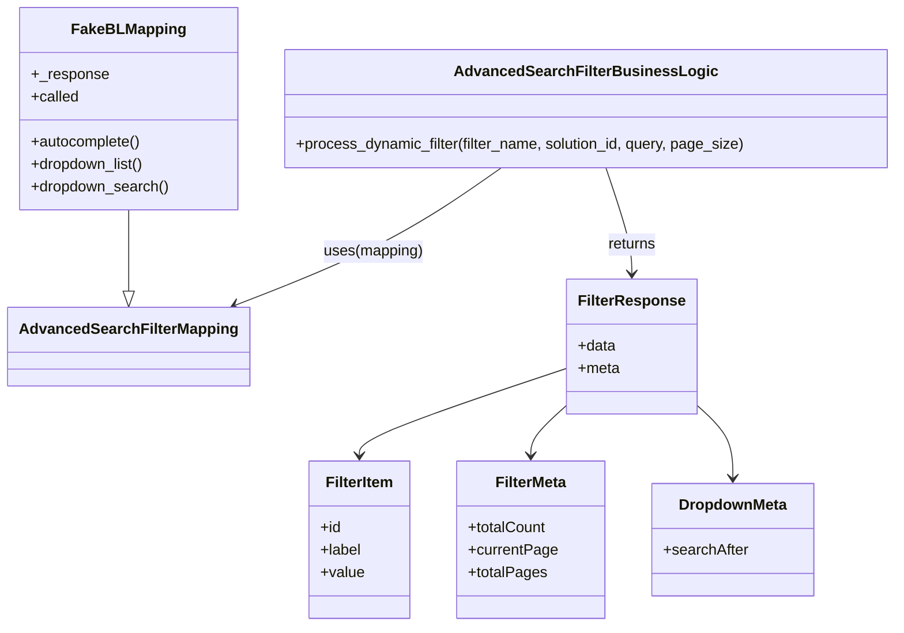

# Diagram: partview_service/partview_service/tests/unit/core/business/open_search/test_AdvancedSearchFilterBusinessLogic.py


> Auto-generated by Obscura crawlers

## Diagram 1



### SVG

<svg id="container" width="941.80859375" xmlns="http://www.w3.org/2000/svg" class="classDiagram" height="668" viewBox="0 0 941.80859375 668" role="graphics-document document" aria-roledescription="class"><style>#container{font-family:"trebuchet ms",verdana,arial,sans-serif;font-size:16px;fill:#333;}@keyframes edge-animation-frame{from{stroke-dashoffset:0;}}@keyframes dash{to{stroke-dashoffset:0;}}#container .edge-animation-slow{stroke-dasharray:9,5!important;stroke-dashoffset:900;animation:dash 50s linear infinite;stroke-linecap:round;}#container .edge-animation-fast{stroke-dasharray:9,5!important;stroke-dashoffset:900;animation:dash 20s linear infinite;stroke-linecap:round;}#container .error-icon{fill:#552222;}#container .error-text{fill:#552222;stroke:#552222;}#container .edge-thickness-normal{stroke-width:1px;}#container .edge-thickness-thick{stroke-width:3.5px;}#container .edge-pattern-solid{stroke-dasharray:0;}#container .edge-thickness-invisible{stroke-width:0;fill:none;}#container .edge-pattern-dashed{stroke-dasharray:3;}#container .edge-pattern-dotted{stroke-dasharray:2;}#container .marker{fill:#333333;stroke:#333333;}#container .marker.cross{stroke:#333333;}#container svg{font-family:"trebuchet ms",verdana,arial,sans-serif;font-size:16px;}#container p{margin:0;}#container g.classGroup text{fill:#9370DB;stroke:none;font-family:"trebuchet ms",verdana,arial,sans-serif;font-size:10px;}#container g.classGroup text .title{font-weight:bolder;}#container .nodeLabel,#container .edgeLabel{color:#131300;}#container .edgeLabel .label rect{fill:#ECECFF;}#container .label text{fill:#131300;}#container .labelBkg{background:#ECECFF;}#container .edgeLabel .label span{background:#ECECFF;}#container .classTitle{font-weight:bolder;}#container .node rect,#container .node circle,#container .node ellipse,#container .node polygon,#container .node path{fill:#ECECFF;stroke:#9370DB;stroke-width:1px;}#container .divider{stroke:#9370DB;stroke-width:1;}#container g.clickable{cursor:pointer;}#container g.classGroup rect{fill:#ECECFF;stroke:#9370DB;}#container g.classGroup line{stroke:#9370DB;stroke-width:1;}#container .classLabel .box{stroke:none;stroke-width:0;fill:#ECECFF;opacity:0.5;}#container .classLabel .label{fill:#9370DB;font-size:10px;}#container .relation{stroke:#333333;stroke-width:1;fill:none;}#container .dashed-line{stroke-dasharray:3;}#container .dotted-line{stroke-dasharray:1 2;}#container #compositionStart,#container .composition{fill:#333333!important;stroke:#333333!important;stroke-width:1;}#container #compositionEnd,#container .composition{fill:#333333!important;stroke:#333333!important;stroke-width:1;}#container #dependencyStart,#container .dependency{fill:#333333!important;stroke:#333333!important;stroke-width:1;}#container #dependencyStart,#container .dependency{fill:#333333!important;stroke:#333333!important;stroke-width:1;}#container #extensionStart,#container .extension{fill:transparent!important;stroke:#333333!important;stroke-width:1;}#container #extensionEnd,#container .extension{fill:transparent!important;stroke:#333333!important;stroke-width:1;}#container #aggregationStart,#container .aggregation{fill:transparent!important;stroke:#333333!important;stroke-width:1;}#container #aggregationEnd,#container .aggregation{fill:transparent!important;stroke:#333333!important;stroke-width:1;}#container #lollipopStart,#container .lollipop{fill:#ECECFF!important;stroke:#333333!important;stroke-width:1;}#container #lollipopEnd,#container .lollipop{fill:#ECECFF!important;stroke:#333333!important;stroke-width:1;}#container .edgeTerminals{font-size:11px;line-height:initial;}#container .classTitleText{text-anchor:middle;font-size:18px;fill:#333;}#container .label-icon{display:inline-block;height:1em;overflow:visible;vertical-align:-0.125em;}#container .node .label-icon path{fill:currentColor;stroke:revert;stroke-width:revert;}#container :root{--mermaid-font-family:"trebuchet ms",verdana,arial,sans-serif;}</style><g><defs><marker id="container_class-aggregationStart" class="marker aggregation class" refX="18" refY="7" markerWidth="190" markerHeight="240" orient="auto"><path d="M 18,7 L9,13 L1,7 L9,1 Z"></path></marker></defs><defs><marker id="container_class-aggregationEnd" class="marker aggregation class" refX="1" refY="7" markerWidth="20" markerHeight="28" orient="auto"><path d="M 18,7 L9,13 L1,7 L9,1 Z"></path></marker></defs><defs><marker id="container_class-extensionStart" class="marker extension class" refX="18" refY="7" markerWidth="190" markerHeight="240" orient="auto"><path d="M 1,7 L18,13 V 1 Z"></path></marker></defs><defs><marker id="container_class-extensionEnd" class="marker extension class" refX="1" refY="7" markerWidth="20" markerHeight="28" orient="auto"><path d="M 1,1 V 13 L18,7 Z"></path></marker></defs><defs><marker id="container_class-compositionStart" class="marker composition class" refX="18" refY="7" markerWidth="190" markerHeight="240" orient="auto"><path d="M 18,7 L9,13 L1,7 L9,1 Z"></path></marker></defs><defs><marker id="container_class-compositionEnd" class="marker composition class" refX="1" refY="7" markerWidth="20" markerHeight="28" orient="auto"><path d="M 18,7 L9,13 L1,7 L9,1 Z"></path></marker></defs><defs><marker id="container_class-dependencyStart" class="marker dependency class" refX="6" refY="7" markerWidth="190" markerHeight="240" orient="auto"><path d="M 5,7 L9,13 L1,7 L9,1 Z"></path></marker></defs><defs><marker id="container_class-dependencyEnd" class="marker dependency class" refX="13" refY="7" markerWidth="20" markerHeight="28" orient="auto"><path d="M 18,7 L9,13 L14,7 L9,1 Z"></path></marker></defs><defs><marker id="container_class-lollipopStart" class="marker lollipop class" refX="13" refY="7" markerWidth="190" markerHeight="240" orient="auto"><circle stroke="black" fill="transparent" cx="7" cy="7" r="6"></circle></marker></defs><defs><marker id="container_class-lollipopEnd" class="marker lollipop class" refX="1" refY="7" markerWidth="190" markerHeight="240" orient="auto"><circle stroke="black" fill="transparent" cx="7" cy="7" r="6"></circle></marker></defs><g class="root"><g class="clusters"></g><g class="edgePaths"><path d="M130.422,224L130.422,230.167C130.422,236.333,130.422,248.667,130.422,263.125C130.422,277.583,130.422,294.167,130.422,302.458L130.422,310.75" id="id_FakeBLMapping_AdvancedSearchFilterMapping_1" class="edge-thickness-normal edge-pattern-solid relation" style=";;;" data-edge="true" data-et="edge" data-id="id_FakeBLMapping_AdvancedSearchFilterMapping_1" data-points="W3sieCI6MTMwLjQyMTg3NSwieSI6MjI0fSx7IngiOjEzMC40MjE4NzUsInkiOjI2MX0seyJ4IjoxMzAuNDIxODc1LCJ5IjozMjh9XQ==" marker-end="url(#container_class-extensionEnd)"></path><path d="M525.2,179L505.857,192.667C486.513,206.333,447.827,233.667,400.861,258.136C353.896,282.605,298.651,304.21,271.028,315.012L243.406,325.815" id="id_AdvancedSearchFilterBusinessLogic_AdvancedSearchFilterMapping_2" class="edge-thickness-normal edge-pattern-solid relation" style=";;;" data-edge="true" data-et="edge" data-id="id_AdvancedSearchFilterBusinessLogic_AdvancedSearchFilterMapping_2" data-points="W3sieCI6NTI1LjE5OTc4NDQ4Mjc1ODYsInkiOjE3OX0seyJ4Ijo0MDkuMTQwNjI1LCJ5IjoyNjF9LHsieCI6MjM3LjgxODA5MDU5NjMzMDI4LCJ5IjozMjh9XQ==" marker-end="url(#container_class-dependencyEnd)"></path><path d="M636.039,179L640.74,192.667C645.441,206.333,654.844,233.667,659.545,252.5C664.246,271.333,664.246,281.667,664.246,286.833L664.246,292" id="id_AdvancedSearchFilterBusinessLogic_FilterResponse_3" class="edge-thickness-normal edge-pattern-solid relation" style=";;;" data-edge="true" data-et="edge" data-id="id_AdvancedSearchFilterBusinessLogic_FilterResponse_3" data-points="W3sieCI6NjM2LjAzODcxMjI4NDQ4MjgsInkiOjE3OX0seyJ4Ijo2NjQuMjQ2MDkzNzUsInkiOjI2MX0seyJ4Ijo2NjQuMjQ2MDkzNzUsInkiOjI5OH1d" marker-end="url(#container_class-dependencyEnd)"></path><path d="M597.941,392.41L561.16,404.842C524.379,417.273,450.816,442.137,414.035,457.735C377.254,473.333,377.254,479.667,377.254,482.833L377.254,486" id="id_FilterResponse_FilterItem_4" class="edge-thickness-normal edge-pattern-solid relation" style=";;;" data-edge="true" data-et="edge" data-id="id_FilterResponse_FilterItem_4" data-points="W3sieCI6NTk3Ljk0MTQwNjI1LCJ5IjozOTIuNDEwMjA4MjQ4MjY0Nn0seyJ4IjozNzcuMjUzOTA2MjUsInkiOjQ2N30seyJ4IjozNzcuMjUzOTA2MjUsInkiOjQ5Mn1d" marker-end="url(#container_class-dependencyEnd)"></path><path d="M597.941,430.472L591.266,436.56C584.591,442.648,571.241,454.824,564.566,464.079C557.891,473.333,557.891,479.667,557.891,482.833L557.891,486" id="id_FilterResponse_FilterMeta_5" class="edge-thickness-normal edge-pattern-solid relation" style=";;;" data-edge="true" data-et="edge" data-id="id_FilterResponse_FilterMeta_5" data-points="W3sieCI6NTk3Ljk0MTQwNjI1LCJ5Ijo0MzAuNDcyMjUxODA4ODY2Mn0seyJ4Ijo1NTcuODkwNjI1LCJ5Ijo0Njd9LHsieCI6NTU3Ljg5MDYyNSwieSI6NDkyfV0=" marker-end="url(#container_class-dependencyEnd)"></path><path d="M730.551,430.472L737.226,436.56C743.901,442.648,757.251,454.824,763.926,468.079C770.602,481.333,770.602,495.667,770.602,502.833L770.602,510" id="id_FilterResponse_DropdownMeta_6" class="edge-thickness-normal edge-pattern-solid relation" style=";;;" data-edge="true" data-et="edge" data-id="id_FilterResponse_DropdownMeta_6" data-points="W3sieCI6NzMwLjU1MDc4MTI1LCJ5Ijo0MzAuNDcyMjUxODA4ODY2Mn0seyJ4Ijo3NzAuNjAxNTYyNSwieSI6NDY3fSx7IngiOjc3MC42MDE1NjI1LCJ5Ijo1MTZ9XQ==" marker-end="url(#container_class-dependencyEnd)"></path></g><g class="edgeLabels"><g class="edgeLabel"><g class="label" data-id="id_FakeBLMapping_AdvancedSearchFilterMapping_1" transform="translate(0, 0)"><foreignObject width="0" height="0"><div xmlns="http://www.w3.org/1999/xhtml" class="labelBkg" style="display: table-cell; white-space: nowrap; line-height: 1.5; max-width: 200px; text-align: center;"><span class="edgeLabel"></span></div></foreignObject></g></g><g class="edgeLabel" transform="translate(389.65146, 268.62173)"><g class="label" data-id="id_AdvancedSearchFilterBusinessLogic_AdvancedSearchFilterMapping_2" transform="translate(-53.4921875, -12)"><foreignObject width="106.984375" height="24"><div xmlns="http://www.w3.org/1999/xhtml" class="labelBkg" style="display: table-cell; white-space: nowrap; line-height: 1.5; max-width: 200px; text-align: center;"><span class="edgeLabel"><p>uses(mapping)</p></span></div></foreignObject></g></g><g class="edgeLabel" transform="translate(664.24609375, 261)"><g class="label" data-id="id_AdvancedSearchFilterBusinessLogic_FilterResponse_3" transform="translate(-26.265625, -12)"><foreignObject width="52.53125" height="24"><div xmlns="http://www.w3.org/1999/xhtml" class="labelBkg" style="display: table-cell; white-space: nowrap; line-height: 1.5; max-width: 200px; text-align: center;"><span class="edgeLabel"><p>returns</p></span></div></foreignObject></g></g><g class="edgeLabel"><g class="label" data-id="id_FilterResponse_FilterItem_4" transform="translate(0, 0)"><foreignObject width="0" height="0"><div xmlns="http://www.w3.org/1999/xhtml" class="labelBkg" style="display: table-cell; white-space: nowrap; line-height: 1.5; max-width: 200px; text-align: center;"><span class="edgeLabel"></span></div></foreignObject></g></g><g class="edgeLabel"><g class="label" data-id="id_FilterResponse_FilterMeta_5" transform="translate(0, 0)"><foreignObject width="0" height="0"><div xmlns="http://www.w3.org/1999/xhtml" class="labelBkg" style="display: table-cell; white-space: nowrap; line-height: 1.5; max-width: 200px; text-align: center;"><span class="edgeLabel"></span></div></foreignObject></g></g><g class="edgeLabel"><g class="label" data-id="id_FilterResponse_DropdownMeta_6" transform="translate(0, 0)"><foreignObject width="0" height="0"><div xmlns="http://www.w3.org/1999/xhtml" class="labelBkg" style="display: table-cell; white-space: nowrap; line-height: 1.5; max-width: 200px; text-align: center;"><span class="edgeLabel"></span></div></foreignObject></g></g></g><g class="nodes"><g class="node default" id="classId-AdvancedSearchFilterMapping-0" transform="translate(130.421875, 370)"><g class="basic label-container"><path d="M-122.421875 -42 L122.421875 -42 L122.421875 42 L-122.421875 42" stroke="none" stroke-width="0" fill="#ECECFF" style=""></path><path d="M-122.421875 -42 C-53.37349833085335 -42, 15.674878338293297 -42, 122.421875 -42 M-122.421875 -42 C-43.96340334721344 -42, 34.49506830557311 -42, 122.421875 -42 M122.421875 -42 C122.421875 -20.85098927425571, 122.421875 0.29802145148858017, 122.421875 42 M122.421875 -42 C122.421875 -14.516887948332258, 122.421875 12.966224103335485, 122.421875 42 M122.421875 42 C55.332056328315204 42, -11.757762343369592 42, -122.421875 42 M122.421875 42 C29.35644799103632 42, -63.70897901792736 42, -122.421875 42 M-122.421875 42 C-122.421875 11.720938417253041, -122.421875 -18.558123165493917, -122.421875 -42 M-122.421875 42 C-122.421875 10.847761958834948, -122.421875 -20.304476082330105, -122.421875 -42" stroke="#9370DB" stroke-width="1.3" fill="none" stroke-dasharray="0 0" style=""></path></g><g class="annotation-group text" transform="translate(0, -18)"></g><g class="label-group text" transform="translate(-110.421875, -18)"><g class="label" style="font-weight: bolder" transform="translate(0,-12)"><foreignObject width="220.84375" height="24"><div xmlns="http://www.w3.org/1999/xhtml" style="display: table-cell; white-space: nowrap; line-height: 1.5; max-width: 269px; text-align: center;"><span class="nodeLabel markdown-node-label" style=""><p>AdvancedSearchFilterMapping</p></span></div></foreignObject></g></g><g class="members-group text" transform="translate(-110.421875, 30)"></g><g class="methods-group text" transform="translate(-110.421875, 60)"></g><g class="divider" style=""><path d="M-122.421875 6 C-49.86756165786551 6, 22.686751684268984 6, 122.421875 6 M-122.421875 6 C-55.74231166923978 6, 10.937251661520435 6, 122.421875 6" stroke="#9370DB" stroke-width="1.3" fill="none" stroke-dasharray="0 0" style=""></path></g><g class="divider" style=""><path d="M-122.421875 24 C-48.81398248301079 24, 24.79391003397842 24, 122.421875 24 M-122.421875 24 C-39.93344500245395 24, 42.5549849950921 24, 122.421875 24" stroke="#9370DB" stroke-width="1.3" fill="none" stroke-dasharray="0 0" style=""></path></g></g><g class="node default" id="classId-FakeBLMapping-1" transform="translate(130.421875, 116)"><g class="basic label-container"><path d="M-114.50390625 -108 L114.50390625 -108 L114.50390625 108 L-114.50390625 108" stroke="none" stroke-width="0" fill="#ECECFF" style=""></path><path d="M-114.50390625 -108 C-39.165151760772744 -108, 36.17360272845451 -108, 114.50390625 -108 M-114.50390625 -108 C-60.76940687722764 -108, -7.034907504455276 -108, 114.50390625 -108 M114.50390625 -108 C114.50390625 -52.30522978478683, 114.50390625 3.3895404304263366, 114.50390625 108 M114.50390625 -108 C114.50390625 -41.11122055620048, 114.50390625 25.777558887599042, 114.50390625 108 M114.50390625 108 C50.39951144488781 108, -13.704883360224386 108, -114.50390625 108 M114.50390625 108 C42.31173285511369 108, -29.88044053977262 108, -114.50390625 108 M-114.50390625 108 C-114.50390625 23.356409394673094, -114.50390625 -61.28718121065381, -114.50390625 -108 M-114.50390625 108 C-114.50390625 22.94545495108413, -114.50390625 -62.10909009783174, -114.50390625 -108" stroke="#9370DB" stroke-width="1.3" fill="none" stroke-dasharray="0 0" style=""></path></g><g class="annotation-group text" transform="translate(0, -84)"></g><g class="label-group text" transform="translate(-56.9921875, -84)"><g class="label" style="font-weight: bolder" transform="translate(0,-12)"><foreignObject width="113.984375" height="24"><div xmlns="http://www.w3.org/1999/xhtml" style="display: table-cell; white-space: nowrap; line-height: 1.5; max-width: 163px; text-align: center;"><span class="nodeLabel markdown-node-label" style=""><p>FakeBLMapping</p></span></div></foreignObject></g></g><g class="members-group text" transform="translate(-102.50390625, -36)"><g class="label" style="" transform="translate(0,-12)"><foreignObject width="81.34375" height="24"><div xmlns="http://www.w3.org/1999/xhtml" style="display: table-cell; white-space: nowrap; line-height: 1.5; max-width: 139px; text-align: center;"><span class="nodeLabel markdown-node-label" style=""><p>+_response</p></span></div></foreignObject></g><g class="label" style="" transform="translate(0,12)"><foreignObject width="51.609375" height="24"><div xmlns="http://www.w3.org/1999/xhtml" style="display: table-cell; white-space: nowrap; line-height: 1.5; max-width: 109px; text-align: center;"><span class="nodeLabel markdown-node-label" style=""><p>+called</p></span></div></foreignObject></g></g><g class="methods-group text" transform="translate(-102.50390625, 36)"><g class="label" style="" transform="translate(0,-12)"><foreignObject width="118.484375" height="24"><div xmlns="http://www.w3.org/1999/xhtml" style="display: table-cell; white-space: nowrap; line-height: 1.5; max-width: 176px; text-align: center;"><span class="nodeLabel markdown-node-label" style=""><p>+autocomplete()</p></span></div></foreignObject></g><g class="label" style="" transform="translate(0,12)"><foreignObject width="122.84375" height="24"><div xmlns="http://www.w3.org/1999/xhtml" style="display: table-cell; white-space: nowrap; line-height: 1.5; max-width: 180px; text-align: center;"><span class="nodeLabel markdown-node-label" style=""><p>+dropdown_list()</p></span></div></foreignObject></g><g class="label" style="" transform="translate(0,36)"><foreignObject width="148.015625" height="24"><div xmlns="http://www.w3.org/1999/xhtml" style="display: table-cell; white-space: nowrap; line-height: 1.5; max-width: 205px; text-align: center;"><span class="nodeLabel markdown-node-label" style=""><p>+dropdown_search()</p></span></div></foreignObject></g></g><g class="divider" style=""><path d="M-114.50390625 -60 C-44.556519102976694 -60, 25.390868044046613 -60, 114.50390625 -60 M-114.50390625 -60 C-32.66418464286389 -60, 49.175536964272226 -60, 114.50390625 -60" stroke="#9370DB" stroke-width="1.3" fill="none" stroke-dasharray="0 0" style=""></path></g><g class="divider" style=""><path d="M-114.50390625 12 C-35.35493218128221 12, 43.79404188743558 12, 114.50390625 12 M-114.50390625 12 C-32.939531655499366 12, 48.62484293900127 12, 114.50390625 12" stroke="#9370DB" stroke-width="1.3" fill="none" stroke-dasharray="0 0" style=""></path></g></g><g class="node default" id="classId-AdvancedSearchFilterBusinessLogic-2" transform="translate(614.3671875, 116)"><g class="basic label-container"><path d="M-319.44140625 -63 L319.44140625 -63 L319.44140625 63 L-319.44140625 63" stroke="none" stroke-width="0" fill="#ECECFF" style=""></path><path d="M-319.44140625 -63 C-124.88867274090319 -63, 69.66406076819362 -63, 319.44140625 -63 M-319.44140625 -63 C-80.23531183831759 -63, 158.97078257336483 -63, 319.44140625 -63 M319.44140625 -63 C319.44140625 -27.51422941647496, 319.44140625 7.971541167050077, 319.44140625 63 M319.44140625 -63 C319.44140625 -15.888936692283536, 319.44140625 31.222126615432927, 319.44140625 63 M319.44140625 63 C70.49687436607218 63, -178.44765751785565 63, -319.44140625 63 M319.44140625 63 C159.47180832480586 63, -0.49778960038827336 63, -319.44140625 63 M-319.44140625 63 C-319.44140625 26.607017269932584, -319.44140625 -9.785965460134832, -319.44140625 -63 M-319.44140625 63 C-319.44140625 23.65865390379726, -319.44140625 -15.682692192405483, -319.44140625 -63" stroke="#9370DB" stroke-width="1.3" fill="none" stroke-dasharray="0 0" style=""></path></g><g class="annotation-group text" transform="translate(0, -39)"></g><g class="label-group text" transform="translate(-130.3203125, -39)"><g class="label" style="font-weight: bolder" transform="translate(0,-12)"><foreignObject width="260.640625" height="24"><div xmlns="http://www.w3.org/1999/xhtml" style="display: table-cell; white-space: nowrap; line-height: 1.5; max-width: 307px; text-align: center;"><span class="nodeLabel markdown-node-label" style=""><p>AdvancedSearchFilterBusinessLogic</p></span></div></foreignObject></g></g><g class="members-group text" transform="translate(-307.44140625, 9)"></g><g class="methods-group text" transform="translate(-307.44140625, 39)"><g class="label" style="" transform="translate(0,-12)"><foreignObject width="484.5625" height="24"><div xmlns="http://www.w3.org/1999/xhtml" style="display: table-cell; white-space: nowrap; line-height: 1.5; max-width: 542px; text-align: center;"><span class="nodeLabel markdown-node-label" style=""><p>+process_dynamic_filter(filter_name, solution_id, query, page_size)</p></span></div></foreignObject></g></g><g class="divider" style=""><path d="M-319.44140625 -15 C-75.80304888550447 -15, 167.83530847899107 -15, 319.44140625 -15 M-319.44140625 -15 C-129.21134123024154 -15, 61.01872378951691 -15, 319.44140625 -15" stroke="#9370DB" stroke-width="1.3" fill="none" stroke-dasharray="0 0" style=""></path></g><g class="divider" style=""><path d="M-319.44140625 9 C-123.64079759367064 9, 72.15981106265872 9, 319.44140625 9 M-319.44140625 9 C-162.3448527215843 9, -5.248299193168577 9, 319.44140625 9" stroke="#9370DB" stroke-width="1.3" fill="none" stroke-dasharray="0 0" style=""></path></g></g><g class="node default" id="classId-FilterResponse-3" transform="translate(664.24609375, 370)"><g class="basic label-container"><path d="M-66.3046875 -72 L66.3046875 -72 L66.3046875 72 L-66.3046875 72" stroke="none" stroke-width="0" fill="#ECECFF" style=""></path><path d="M-66.3046875 -72 C-34.93956040516784 -72, -3.574433310335685 -72, 66.3046875 -72 M-66.3046875 -72 C-30.431167684978 -72, 5.442352130044 -72, 66.3046875 -72 M66.3046875 -72 C66.3046875 -33.450369313409794, 66.3046875 5.099261373180411, 66.3046875 72 M66.3046875 -72 C66.3046875 -24.553911466004024, 66.3046875 22.892177067991952, 66.3046875 72 M66.3046875 72 C31.607957902197114 72, -3.0887716956057716 72, -66.3046875 72 M66.3046875 72 C26.79755042197457 72, -12.70958665605086 72, -66.3046875 72 M-66.3046875 72 C-66.3046875 24.199842185108324, -66.3046875 -23.600315629783353, -66.3046875 -72 M-66.3046875 72 C-66.3046875 22.795743033584785, -66.3046875 -26.40851393283043, -66.3046875 -72" stroke="#9370DB" stroke-width="1.3" fill="none" stroke-dasharray="0 0" style=""></path></g><g class="annotation-group text" transform="translate(0, -48)"></g><g class="label-group text" transform="translate(-54.3046875, -48)"><g class="label" style="font-weight: bolder" transform="translate(0,-12)"><foreignObject width="108.609375" height="24"><div xmlns="http://www.w3.org/1999/xhtml" style="display: table-cell; white-space: nowrap; line-height: 1.5; max-width: 157px; text-align: center;"><span class="nodeLabel markdown-node-label" style=""><p>FilterResponse</p></span></div></foreignObject></g></g><g class="members-group text" transform="translate(-54.3046875, 0)"><g class="label" style="" transform="translate(0,-12)"><foreignObject width="40.625" height="24"><div xmlns="http://www.w3.org/1999/xhtml" style="display: table-cell; white-space: nowrap; line-height: 1.5; max-width: 98px; text-align: center;"><span class="nodeLabel markdown-node-label" style=""><p>+data</p></span></div></foreignObject></g><g class="label" style="" transform="translate(0,12)"><foreignObject width="44.796875" height="24"><div xmlns="http://www.w3.org/1999/xhtml" style="display: table-cell; white-space: nowrap; line-height: 1.5; max-width: 102px; text-align: center;"><span class="nodeLabel markdown-node-label" style=""><p>+meta</p></span></div></foreignObject></g></g><g class="methods-group text" transform="translate(-54.3046875, 72)"></g><g class="divider" style=""><path d="M-66.3046875 -24 C-23.207112351982666 -24, 19.89046279603467 -24, 66.3046875 -24 M-66.3046875 -24 C-17.820205359297717 -24, 30.664276781404567 -24, 66.3046875 -24" stroke="#9370DB" stroke-width="1.3" fill="none" stroke-dasharray="0 0" style=""></path></g><g class="divider" style=""><path d="M-66.3046875 48 C-33.84144953115061 48, -1.3782115623012174 48, 66.3046875 48 M-66.3046875 48 C-38.91749356946363 48, -11.530299638927254 48, 66.3046875 48" stroke="#9370DB" stroke-width="1.3" fill="none" stroke-dasharray="0 0" style=""></path></g></g><g class="node default" id="classId-FilterItem-4" transform="translate(377.25390625, 576)"><g class="basic label-container"><path d="M-53.0234375 -84 L53.0234375 -84 L53.0234375 84 L-53.0234375 84" stroke="none" stroke-width="0" fill="#ECECFF" style=""></path><path d="M-53.0234375 -84 C-17.063661584289022 -84, 18.896114331421956 -84, 53.0234375 -84 M-53.0234375 -84 C-20.770607517096373 -84, 11.482222465807254 -84, 53.0234375 -84 M53.0234375 -84 C53.0234375 -21.934984480908298, 53.0234375 40.130031038183404, 53.0234375 84 M53.0234375 -84 C53.0234375 -41.46511379524443, 53.0234375 1.0697724095111454, 53.0234375 84 M53.0234375 84 C23.766254786186618 84, -5.490927927626764 84, -53.0234375 84 M53.0234375 84 C24.13183517891083 84, -4.75976714217834 84, -53.0234375 84 M-53.0234375 84 C-53.0234375 38.856636823467696, -53.0234375 -6.2867263530646085, -53.0234375 -84 M-53.0234375 84 C-53.0234375 41.77273514286482, -53.0234375 -0.4545297142703646, -53.0234375 -84" stroke="#9370DB" stroke-width="1.3" fill="none" stroke-dasharray="0 0" style=""></path></g><g class="annotation-group text" transform="translate(0, -60)"></g><g class="label-group text" transform="translate(-35.328125, -60)"><g class="label" style="font-weight: bolder" transform="translate(0,-12)"><foreignObject width="70.65625" height="24"><div xmlns="http://www.w3.org/1999/xhtml" style="display: table-cell; white-space: nowrap; line-height: 1.5; max-width: 120px; text-align: center;"><span class="nodeLabel markdown-node-label" style=""><p>FilterItem</p></span></div></foreignObject></g></g><g class="members-group text" transform="translate(-41.0234375, -12)"><g class="label" style="" transform="translate(0,-12)"><foreignObject width="22.078125" height="24"><div xmlns="http://www.w3.org/1999/xhtml" style="display: table-cell; white-space: nowrap; line-height: 1.5; max-width: 79px; text-align: center;"><span class="nodeLabel markdown-node-label" style=""><p>+id</p></span></div></foreignObject></g><g class="label" style="" transform="translate(0,12)"><foreignObject width="44.21875" height="24"><div xmlns="http://www.w3.org/1999/xhtml" style="display: table-cell; white-space: nowrap; line-height: 1.5; max-width: 102px; text-align: center;"><span class="nodeLabel markdown-node-label" style=""><p>+label</p></span></div></foreignObject></g><g class="label" style="" transform="translate(0,36)"><foreignObject width="46.71875" height="24"><div xmlns="http://www.w3.org/1999/xhtml" style="display: table-cell; white-space: nowrap; line-height: 1.5; max-width: 104px; text-align: center;"><span class="nodeLabel markdown-node-label" style=""><p>+value</p></span></div></foreignObject></g></g><g class="methods-group text" transform="translate(-41.0234375, 84)"></g><g class="divider" style=""><path d="M-53.0234375 -36 C-22.55184795800971 -36, 7.919741583980581 -36, 53.0234375 -36 M-53.0234375 -36 C-18.79138889070809 -36, 15.440659718583817 -36, 53.0234375 -36" stroke="#9370DB" stroke-width="1.3" fill="none" stroke-dasharray="0 0" style=""></path></g><g class="divider" style=""><path d="M-53.0234375 60 C-27.89964969673015 60, -2.775861893460302 60, 53.0234375 60 M-53.0234375 60 C-19.454997203380863 60, 14.113443093238274 60, 53.0234375 60" stroke="#9370DB" stroke-width="1.3" fill="none" stroke-dasharray="0 0" style=""></path></g></g><g class="node default" id="classId-FilterMeta-5" transform="translate(557.890625, 576)"><g class="basic label-container"><path d="M-77.61328125 -84 L77.61328125 -84 L77.61328125 84 L-77.61328125 84" stroke="none" stroke-width="0" fill="#ECECFF" style=""></path><path d="M-77.61328125 -84 C-22.76320930080486 -84, 32.08686264839028 -84, 77.61328125 -84 M-77.61328125 -84 C-31.55839480182901 -84, 14.49649164634198 -84, 77.61328125 -84 M77.61328125 -84 C77.61328125 -30.89791972597756, 77.61328125 22.204160548044882, 77.61328125 84 M77.61328125 -84 C77.61328125 -21.63904346703518, 77.61328125 40.72191306592964, 77.61328125 84 M77.61328125 84 C45.99570170460831 84, 14.378122159216609 84, -77.61328125 84 M77.61328125 84 C25.6071132820586 84, -26.399054685882803 84, -77.61328125 84 M-77.61328125 84 C-77.61328125 17.97875346280813, -77.61328125 -48.04249307438374, -77.61328125 -84 M-77.61328125 84 C-77.61328125 31.889480606257997, -77.61328125 -20.221038787484005, -77.61328125 -84" stroke="#9370DB" stroke-width="1.3" fill="none" stroke-dasharray="0 0" style=""></path></g><g class="annotation-group text" transform="translate(0, -60)"></g><g class="label-group text" transform="translate(-36.9453125, -60)"><g class="label" style="font-weight: bolder" transform="translate(0,-12)"><foreignObject width="73.890625" height="24"><div xmlns="http://www.w3.org/1999/xhtml" style="display: table-cell; white-space: nowrap; line-height: 1.5; max-width: 122px; text-align: center;"><span class="nodeLabel markdown-node-label" style=""><p>FilterMeta</p></span></div></foreignObject></g></g><g class="members-group text" transform="translate(-65.61328125, -12)"><g class="label" style="" transform="translate(0,-12)"><foreignObject width="84.140625" height="24"><div xmlns="http://www.w3.org/1999/xhtml" style="display: table-cell; white-space: nowrap; line-height: 1.5; max-width: 142px; text-align: center;"><span class="nodeLabel markdown-node-label" style=""><p>+totalCount</p></span></div></foreignObject></g><g class="label" style="" transform="translate(0,12)"><foreignObject width="94.28125" height="24"><div xmlns="http://www.w3.org/1999/xhtml" style="display: table-cell; white-space: nowrap; line-height: 1.5; max-width: 152px; text-align: center;"><span class="nodeLabel markdown-node-label" style=""><p>+currentPage</p></span></div></foreignObject></g><g class="label" style="" transform="translate(0,36)"><foreignObject width="82.90625" height="24"><div xmlns="http://www.w3.org/1999/xhtml" style="display: table-cell; white-space: nowrap; line-height: 1.5; max-width: 140px; text-align: center;"><span class="nodeLabel markdown-node-label" style=""><p>+totalPages</p></span></div></foreignObject></g></g><g class="methods-group text" transform="translate(-65.61328125, 84)"></g><g class="divider" style=""><path d="M-77.61328125 -36 C-32.121610543255294 -36, 13.370060163489413 -36, 77.61328125 -36 M-77.61328125 -36 C-30.884367499195463 -36, 15.844546251609074 -36, 77.61328125 -36" stroke="#9370DB" stroke-width="1.3" fill="none" stroke-dasharray="0 0" style=""></path></g><g class="divider" style=""><path d="M-77.61328125 60 C-40.25264361647406 60, -2.8920059829481204 60, 77.61328125 60 M-77.61328125 60 C-29.846291289035285 60, 17.92069867192943 60, 77.61328125 60" stroke="#9370DB" stroke-width="1.3" fill="none" stroke-dasharray="0 0" style=""></path></g></g><g class="node default" id="classId-DropdownMeta-6" transform="translate(770.6015625, 576)"><g class="basic label-container"><path d="M-85.09765625 -60 L85.09765625 -60 L85.09765625 60 L-85.09765625 60" stroke="none" stroke-width="0" fill="#ECECFF" style=""></path><path d="M-85.09765625 -60 C-29.42432779022029 -60, 26.249000669559422 -60, 85.09765625 -60 M-85.09765625 -60 C-30.256449185821808 -60, 24.584757878356385 -60, 85.09765625 -60 M85.09765625 -60 C85.09765625 -26.883910757914734, 85.09765625 6.232178484170532, 85.09765625 60 M85.09765625 -60 C85.09765625 -31.908083061156248, 85.09765625 -3.816166122312495, 85.09765625 60 M85.09765625 60 C26.717115439492808 60, -31.663425371014384 60, -85.09765625 60 M85.09765625 60 C26.75075238411172 60, -31.59615148177656 60, -85.09765625 60 M-85.09765625 60 C-85.09765625 12.635620817609265, -85.09765625 -34.72875836478147, -85.09765625 -60 M-85.09765625 60 C-85.09765625 14.405526087109706, -85.09765625 -31.188947825780588, -85.09765625 -60" stroke="#9370DB" stroke-width="1.3" fill="none" stroke-dasharray="0 0" style=""></path></g><g class="annotation-group text" transform="translate(0, -36)"></g><g class="label-group text" transform="translate(-55.7890625, -36)"><g class="label" style="font-weight: bolder" transform="translate(0,-12)"><foreignObject width="111.578125" height="24"><div xmlns="http://www.w3.org/1999/xhtml" style="display: table-cell; white-space: nowrap; line-height: 1.5; max-width: 160px; text-align: center;"><span class="nodeLabel markdown-node-label" style=""><p>DropdownMeta</p></span></div></foreignObject></g></g><g class="members-group text" transform="translate(-73.09765625, 12)"><g class="label" style="" transform="translate(0,-12)"><foreignObject width="90.40625" height="24"><div xmlns="http://www.w3.org/1999/xhtml" style="display: table-cell; white-space: nowrap; line-height: 1.5; max-width: 149px; text-align: center;"><span class="nodeLabel markdown-node-label" style=""><p>+searchAfter</p></span></div></foreignObject></g></g><g class="methods-group text" transform="translate(-73.09765625, 60)"></g><g class="divider" style=""><path d="M-85.09765625 -12 C-17.170012837300433 -12, 50.75763057539913 -12, 85.09765625 -12 M-85.09765625 -12 C-18.812153118125565 -12, 47.47335001374887 -12, 85.09765625 -12" stroke="#9370DB" stroke-width="1.3" fill="none" stroke-dasharray="0 0" style=""></path></g><g class="divider" style=""><path d="M-85.09765625 36 C-45.89250113863131 36, -6.68734602726262 36, 85.09765625 36 M-85.09765625 36 C-42.4026593618112 36, 0.2923375263775938 36, 85.09765625 36" stroke="#9370DB" stroke-width="1.3" fill="none" stroke-dasharray="0 0" style=""></path></g></g></g></g></g></svg>

## Diagram 2

```mermaid
flowchart LR
A[process_dynamic_filter(filter_name, query)] --> Q{query provided?}
Q -->|Yes| D{filter_name in dropdown-filters?}
Q -->|No| E{filter_name in autocomplete-filters?}
D -->|Yes| DS[dropdown_search()]
D -->|No| AU[autocomplete()]
E -->|Yes| AU
E -->|No| DL[dropdown_list()]
subgraph AutocompleteFilters
  AF1(shipment-id)
  AF2(part-number)
  AF3(order-number)
  AF4(tracking-number)
  AF5(bill-of-lading)
end
subgraph DropdownFilters
  DF1(origin)
  DF2(destination)
  DF3(carrier)
  DF4(order-priority-list)
  DF5(current-location)
  DF6(final-mile-origin)
  DF7(parts)
  DF8(trailer-equipment-number)
end
AU -->|routes to| M_autocomplete[AdvancedSearchFilterMapping.autocomplete()]
DL -->|routes to| M_dropdown_list[AdvancedSearchFilterMapping.dropdown_list()]
DS -->|routes to| M_dropdown_search[AdvancedSearchFilterMapping.dropdown_search()]
AF1 --- E
AF2 --- E
AF3 --- E
AF4 --- E
AF5 --- E
DF1 --- D
DF2 --- D
DF3 --- D
DF4 --- D
DF5 --- D
DF6 --- D
DF7 --- D
DF8 --- D
```

> SVG rendering failed for this diagram.
