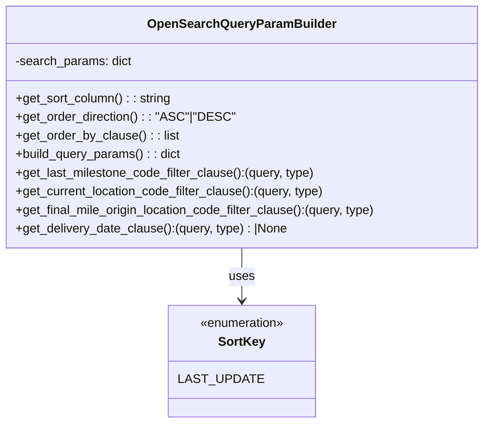

# Diagram: partview_service/partview_service/tests/unit/core/business/open_search/test_OpenSearchQueryParamBuilder.py


> Auto-generated by Obscura crawlers

## Diagram 1



### SVG

<svg id="container" width="626.34375" xmlns="http://www.w3.org/2000/svg" class="classDiagram" height="546" viewBox="0 0 626.34375 546" role="graphics-document document" aria-roledescription="class"><style>#container{font-family:"trebuchet ms",verdana,arial,sans-serif;font-size:16px;fill:#333;}@keyframes edge-animation-frame{from{stroke-dashoffset:0;}}@keyframes dash{to{stroke-dashoffset:0;}}#container .edge-animation-slow{stroke-dasharray:9,5!important;stroke-dashoffset:900;animation:dash 50s linear infinite;stroke-linecap:round;}#container .edge-animation-fast{stroke-dasharray:9,5!important;stroke-dashoffset:900;animation:dash 20s linear infinite;stroke-linecap:round;}#container .error-icon{fill:#552222;}#container .error-text{fill:#552222;stroke:#552222;}#container .edge-thickness-normal{stroke-width:1px;}#container .edge-thickness-thick{stroke-width:3.5px;}#container .edge-pattern-solid{stroke-dasharray:0;}#container .edge-thickness-invisible{stroke-width:0;fill:none;}#container .edge-pattern-dashed{stroke-dasharray:3;}#container .edge-pattern-dotted{stroke-dasharray:2;}#container .marker{fill:#333333;stroke:#333333;}#container .marker.cross{stroke:#333333;}#container svg{font-family:"trebuchet ms",verdana,arial,sans-serif;font-size:16px;}#container p{margin:0;}#container g.classGroup text{fill:#9370DB;stroke:none;font-family:"trebuchet ms",verdana,arial,sans-serif;font-size:10px;}#container g.classGroup text .title{font-weight:bolder;}#container .nodeLabel,#container .edgeLabel{color:#131300;}#container .edgeLabel .label rect{fill:#ECECFF;}#container .label text{fill:#131300;}#container .labelBkg{background:#ECECFF;}#container .edgeLabel .label span{background:#ECECFF;}#container .classTitle{font-weight:bolder;}#container .node rect,#container .node circle,#container .node ellipse,#container .node polygon,#container .node path{fill:#ECECFF;stroke:#9370DB;stroke-width:1px;}#container .divider{stroke:#9370DB;stroke-width:1;}#container g.clickable{cursor:pointer;}#container g.classGroup rect{fill:#ECECFF;stroke:#9370DB;}#container g.classGroup line{stroke:#9370DB;stroke-width:1;}#container .classLabel .box{stroke:none;stroke-width:0;fill:#ECECFF;opacity:0.5;}#container .classLabel .label{fill:#9370DB;font-size:10px;}#container .relation{stroke:#333333;stroke-width:1;fill:none;}#container .dashed-line{stroke-dasharray:3;}#container .dotted-line{stroke-dasharray:1 2;}#container #compositionStart,#container .composition{fill:#333333!important;stroke:#333333!important;stroke-width:1;}#container #compositionEnd,#container .composition{fill:#333333!important;stroke:#333333!important;stroke-width:1;}#container #dependencyStart,#container .dependency{fill:#333333!important;stroke:#333333!important;stroke-width:1;}#container #dependencyStart,#container .dependency{fill:#333333!important;stroke:#333333!important;stroke-width:1;}#container #extensionStart,#container .extension{fill:transparent!important;stroke:#333333!important;stroke-width:1;}#container #extensionEnd,#container .extension{fill:transparent!important;stroke:#333333!important;stroke-width:1;}#container #aggregationStart,#container .aggregation{fill:transparent!important;stroke:#333333!important;stroke-width:1;}#container #aggregationEnd,#container .aggregation{fill:transparent!important;stroke:#333333!important;stroke-width:1;}#container #lollipopStart,#container .lollipop{fill:#ECECFF!important;stroke:#333333!important;stroke-width:1;}#container #lollipopEnd,#container .lollipop{fill:#ECECFF!important;stroke:#333333!important;stroke-width:1;}#container .edgeTerminals{font-size:11px;line-height:initial;}#container .classTitleText{text-anchor:middle;font-size:18px;fill:#333;}#container .label-icon{display:inline-block;height:1em;overflow:visible;vertical-align:-0.125em;}#container .node .label-icon path{fill:currentColor;stroke:revert;stroke-width:revert;}#container :root{--mermaid-font-family:"trebuchet ms",verdana,arial,sans-serif;}</style><g><defs><marker id="container_class-aggregationStart" class="marker aggregation class" refX="18" refY="7" markerWidth="190" markerHeight="240" orient="auto"><path d="M 18,7 L9,13 L1,7 L9,1 Z"></path></marker></defs><defs><marker id="container_class-aggregationEnd" class="marker aggregation class" refX="1" refY="7" markerWidth="20" markerHeight="28" orient="auto"><path d="M 18,7 L9,13 L1,7 L9,1 Z"></path></marker></defs><defs><marker id="container_class-extensionStart" class="marker extension class" refX="18" refY="7" markerWidth="190" markerHeight="240" orient="auto"><path d="M 1,7 L18,13 V 1 Z"></path></marker></defs><defs><marker id="container_class-extensionEnd" class="marker extension class" refX="1" refY="7" markerWidth="20" markerHeight="28" orient="auto"><path d="M 1,1 V 13 L18,7 Z"></path></marker></defs><defs><marker id="container_class-compositionStart" class="marker composition class" refX="18" refY="7" markerWidth="190" markerHeight="240" orient="auto"><path d="M 18,7 L9,13 L1,7 L9,1 Z"></path></marker></defs><defs><marker id="container_class-compositionEnd" class="marker composition class" refX="1" refY="7" markerWidth="20" markerHeight="28" orient="auto"><path d="M 18,7 L9,13 L1,7 L9,1 Z"></path></marker></defs><defs><marker id="container_class-dependencyStart" class="marker dependency class" refX="6" refY="7" markerWidth="190" markerHeight="240" orient="auto"><path d="M 5,7 L9,13 L1,7 L9,1 Z"></path></marker></defs><defs><marker id="container_class-dependencyEnd" class="marker dependency class" refX="13" refY="7" markerWidth="20" markerHeight="28" orient="auto"><path d="M 18,7 L9,13 L14,7 L9,1 Z"></path></marker></defs><defs><marker id="container_class-lollipopStart" class="marker lollipop class" refX="13" refY="7" markerWidth="190" markerHeight="240" orient="auto"><circle stroke="black" fill="transparent" cx="7" cy="7" r="6"></circle></marker></defs><defs><marker id="container_class-lollipopEnd" class="marker lollipop class" refX="1" refY="7" markerWidth="190" markerHeight="240" orient="auto"><circle stroke="black" fill="transparent" cx="7" cy="7" r="6"></circle></marker></defs><g class="root"><g class="clusters"></g><g class="edgePaths"><path d="M313.172,320L313.172,326.167C313.172,332.333,313.172,344.667,313.172,356C313.172,367.333,313.172,377.667,313.172,382.833L313.172,388" id="id_OpenSearchQueryParamBuilder_SortKey_1" class="edge-thickness-normal edge-pattern-solid relation" style=";;;" data-edge="true" data-et="edge" data-id="id_OpenSearchQueryParamBuilder_SortKey_1" data-points="W3sieCI6MzEzLjE3MTg3NSwieSI6MzIwfSx7IngiOjMxMy4xNzE4NzUsInkiOjM1N30seyJ4IjozMTMuMTcxODc1LCJ5IjozOTR9XQ==" marker-end="url(#container_class-dependencyEnd)"></path></g><g class="edgeLabels"><g class="edgeLabel" transform="translate(313.171875, 357)"><g class="label" data-id="id_OpenSearchQueryParamBuilder_SortKey_1" transform="translate(-16.4921875, -12)"><foreignObject width="32.984375" height="24"><div xmlns="http://www.w3.org/1999/xhtml" class="labelBkg" style="display: table-cell; white-space: nowrap; line-height: 1.5; max-width: 200px; text-align: center;"><span class="edgeLabel"><p>uses</p></span></div></foreignObject></g></g></g><g class="nodes"><g class="node default" id="classId-OpenSearchQueryParamBuilder-0" transform="translate(313.171875, 164)"><g class="basic label-container"><path d="M-305.171875 -156 L305.171875 -156 L305.171875 156 L-305.171875 156" stroke="none" stroke-width="0" fill="#ECECFF" style=""></path><path d="M-305.171875 -156 C-81.77891754014013 -156, 141.61403991971974 -156, 305.171875 -156 M-305.171875 -156 C-157.40753670826984 -156, -9.64319841653969 -156, 305.171875 -156 M305.171875 -156 C305.171875 -78.41564851412059, 305.171875 -0.8312970282411811, 305.171875 156 M305.171875 -156 C305.171875 -63.18363649711149, 305.171875 29.632727005777014, 305.171875 156 M305.171875 156 C91.17330411792014 156, -122.82526676415972 156, -305.171875 156 M305.171875 156 C136.8852183452156 156, -31.40143830956879 156, -305.171875 156 M-305.171875 156 C-305.171875 53.11782183171489, -305.171875 -49.764356336570216, -305.171875 -156 M-305.171875 156 C-305.171875 86.52599817340064, -305.171875 17.051996346801275, -305.171875 -156" stroke="#9370DB" stroke-width="1.3" fill="none" stroke-dasharray="0 0" style=""></path></g><g class="annotation-group text" transform="translate(0, -132)"></g><g class="label-group text" transform="translate(-115.28125, -132)"><g class="label" style="font-weight: bolder" transform="translate(0,-12)"><foreignObject width="230.5625" height="24"><div xmlns="http://www.w3.org/1999/xhtml" style="display: table-cell; white-space: nowrap; line-height: 1.5; max-width: 279px; text-align: center;"><span class="nodeLabel markdown-node-label" style=""><p>OpenSearchQueryParamBuilder</p></span></div></foreignObject></g></g><g class="members-group text" transform="translate(-293.171875, -84)"><g class="label" style="" transform="translate(0,-12)"><foreignObject width="151.375" height="24"><div xmlns="http://www.w3.org/1999/xhtml" style="display: table-cell; white-space: nowrap; line-height: 1.5; max-width: 209px; text-align: center;"><span class="nodeLabel markdown-node-label" style=""><p>-search_params: dict</p></span></div></foreignObject></g></g><g class="methods-group text" transform="translate(-293.171875, -36)"><g class="label" style="" transform="translate(0,-12)"><foreignObject width="201.796875" height="24"><div xmlns="http://www.w3.org/1999/xhtml" style="display: table-cell; white-space: nowrap; line-height: 1.5; max-width: 260px; text-align: center;"><span class="nodeLabel markdown-node-label" style=""><p>+get_sort_column() : : string</p></span></div></foreignObject></g><g class="label" style="" transform="translate(0,12)"><foreignObject width="275.4375" height="24"><div xmlns="http://www.w3.org/1999/xhtml" style="display: table-cell; white-space: nowrap; line-height: 1.5; max-width: 333px; text-align: center;"><span class="nodeLabel markdown-node-label" style=""><p>+get_order_direction() : : "ASC"|"DESC"</p></span></div></foreignObject></g><g class="label" style="" transform="translate(0,36)"><foreignObject width="209.609375" height="24"><div xmlns="http://www.w3.org/1999/xhtml" style="display: table-cell; white-space: nowrap; line-height: 1.5; max-width: 267px; text-align: center;"><span class="nodeLabel markdown-node-label" style=""><p>+get_order_by_clause() : : list</p></span></div></foreignObject></g><g class="label" style="" transform="translate(0,60)"><foreignObject width="214.8125" height="24"><div xmlns="http://www.w3.org/1999/xhtml" style="display: table-cell; white-space: nowrap; line-height: 1.5; max-width: 272px; text-align: center;"><span class="nodeLabel markdown-node-label" style=""><p>+build_query_params() : : dict</p></span></div></foreignObject></g><g class="label" style="" transform="translate(0,84)"><foreignObject width="388.71875" height="24"><div xmlns="http://www.w3.org/1999/xhtml" style="display: table-cell; white-space: nowrap; line-height: 1.5; max-width: 446px; text-align: center;"><span class="nodeLabel markdown-node-label" style=""><p>+get_last_milestone_code_filter_clause():(query, type)</p></span></div></foreignObject></g><g class="label" style="" transform="translate(0,108)"><foreignObject width="402.015625" height="24"><div xmlns="http://www.w3.org/1999/xhtml" style="display: table-cell; white-space: nowrap; line-height: 1.5; max-width: 459px; text-align: center;"><span class="nodeLabel markdown-node-label" style=""><p>+get_current_location_code_filter_clause():(query, type)</p></span></div></foreignObject></g><g class="label" style="" transform="translate(0,132)"><foreignObject width="471.0625" height="24"><div xmlns="http://www.w3.org/1999/xhtml" style="display: table-cell; white-space: nowrap; line-height: 1.5; max-width: 528px; text-align: center;"><span class="nodeLabel markdown-node-label" style=""><p>+get_final_mile_origin_location_code_filter_clause():(query, type)</p></span></div></foreignObject></g><g class="label" style="" transform="translate(0,156)"><foreignObject width="353.40625" height="24"><div xmlns="http://www.w3.org/1999/xhtml" style="display: table-cell; white-space: nowrap; line-height: 1.5; max-width: 411px; text-align: center;"><span class="nodeLabel markdown-node-label" style=""><p>+get_delivery_date_clause():(query, type) : |None</p></span></div></foreignObject></g></g><g class="divider" style=""><path d="M-305.171875 -108 C-69.42117157770164 -108, 166.32953184459672 -108, 305.171875 -108 M-305.171875 -108 C-90.28753802548212 -108, 124.59679894903576 -108, 305.171875 -108" stroke="#9370DB" stroke-width="1.3" fill="none" stroke-dasharray="0 0" style=""></path></g><g class="divider" style=""><path d="M-305.171875 -60 C-131.33397739660666 -60, 42.50392020678669 -60, 305.171875 -60 M-305.171875 -60 C-124.28497608648388 -60, 56.60192282703224 -60, 305.171875 -60" stroke="#9370DB" stroke-width="1.3" fill="none" stroke-dasharray="0 0" style=""></path></g></g><g class="node default" id="classId-SortKey-1" transform="translate(313.171875, 466)"><g class="basic label-container"><path d="M-87.80859375 -72 L87.80859375 -72 L87.80859375 72 L-87.80859375 72" stroke="none" stroke-width="0" fill="#ECECFF" style=""></path><path d="M-87.80859375 -72 C-26.747492253347403 -72, 34.313609243305194 -72, 87.80859375 -72 M-87.80859375 -72 C-47.525328335161866 -72, -7.2420629203237326 -72, 87.80859375 -72 M87.80859375 -72 C87.80859375 -39.88684103485618, 87.80859375 -7.773682069712365, 87.80859375 72 M87.80859375 -72 C87.80859375 -40.28621698065547, 87.80859375 -8.572433961310942, 87.80859375 72 M87.80859375 72 C34.960909232035704 72, -17.886775285928593 72, -87.80859375 72 M87.80859375 72 C21.13492925112142 72, -45.53873524775716 72, -87.80859375 72 M-87.80859375 72 C-87.80859375 38.5733064013945, -87.80859375 5.146612802788994, -87.80859375 -72 M-87.80859375 72 C-87.80859375 20.069241040765974, -87.80859375 -31.861517918468053, -87.80859375 -72" stroke="#9370DB" stroke-width="1.3" fill="none" stroke-dasharray="0 0" style=""></path></g><g class="annotation-group text" transform="translate(-55.5546875, -48)"><g class="label" style="" transform="translate(0,-12)"><foreignObject width="111.109375" height="24"><div xmlns="http://www.w3.org/1999/xhtml" style="display: table-cell; white-space: nowrap; line-height: 1.5; max-width: 161px; text-align: center;"><span class="nodeLabel markdown-node-label" style=""><p>«enumeration»</p></span></div></foreignObject></g></g><g class="label-group text" transform="translate(-28.9609375, -24)"><g class="label" style="font-weight: bolder" transform="translate(0,-12)"><foreignObject width="57.921875" height="24"><div xmlns="http://www.w3.org/1999/xhtml" style="display: table-cell; white-space: nowrap; line-height: 1.5; max-width: 106px; text-align: center;"><span class="nodeLabel markdown-node-label" style=""><p>SortKey</p></span></div></foreignObject></g></g><g class="members-group text" transform="translate(-75.80859375, 24)"><g class="label" style="" transform="translate(0,-12)"><foreignObject width="96.0625" height="24"><div xmlns="http://www.w3.org/1999/xhtml" style="display: table-cell; white-space: nowrap; line-height: 1.5; max-width: 146px; text-align: center;"><span class="nodeLabel markdown-node-label" style=""><p>LAST_UPDATE</p></span></div></foreignObject></g></g><g class="methods-group text" transform="translate(-75.80859375, 72)"></g><g class="divider" style=""><path d="M-87.80859375 0 C-18.780126120123 0, 50.248341509754 0, 87.80859375 0 M-87.80859375 0 C-52.55381930224586 0, -17.299044854491726 0, 87.80859375 0" stroke="#9370DB" stroke-width="1.3" fill="none" stroke-dasharray="0 0" style=""></path></g><g class="divider" style=""><path d="M-87.80859375 48 C-23.509807056795097 48, 40.788979636409806 48, 87.80859375 48 M-87.80859375 48 C-44.79261746221661 48, -1.7766411744332231 48, 87.80859375 48" stroke="#9370DB" stroke-width="1.3" fill="none" stroke-dasharray="0 0" style=""></path></g></g></g></g></g></svg>

## Diagram 2

```mermaid
flowchart LR
subgraph SortLogic
  A[Start: get_sort_column(search_params)] --> B{sortColumn is None?}
  B -- yes --> C[destinationEtaDisplay]
  B -- no --> D{sortColumn maps to known SortKey?}
  D -- yes --> E[lastUpdate.eventTs]
  D -- no --> C
end

subgraph OrderDirectionAndOrderBy
  E --> G{reverseSort == True?}
  D -- no_valid--> G
  C --> H[order=DESC; missing=_first]
  G -- yes --> I[order=DESC; missing=_first]
  G -- no --> J[order=ASC; missing=_last]
  I --> K[if sortColumn valid then append packageContainerId ASC]
  J --> K
end

subgraph FieldMatching
  L[Input: <field>Contains -> value] --> M{len(value) < 25?}
  M -- yes --> N[Use "<field>.searchable" (partial match); no "term"]
  M -- no --> O[Use "term" exact match; no ".searchable"]
end

subgraph DeliveryDateClause
  P[Params: deliveryDateFrom, deliveryDateTo, deliveryDateType] --> Q{deliveryDateType is None or empty or invalid?}
  Q -- yes --> R[Return None]
  Q -- no --> S[Return (range query, type=should) with ISO times "YYYY-MM-DDTHH:MM:SSZ"]
end

subgraph CodeFilters
  T[Filter param for code fields (e.g., lastMilestoneCode, currentLocationCode, finalMileOriginLocationCode)] --> U{exact value present?}
  U -- yes --> V[Return (match query for field, type=must)]
  U -- no --> W{<Code>Empty flag True?}
  W -- yes --> X[Return (exists query on field, type=must_not)]
  W -- no --> Y{<Code>IsNotEmpty flag True?}
  Y -- yes --> Z[Return (exists query on field, type=must)]
  Y -- no --> AA[No filter]
end

C --> H
E --> G
L --> M
P --> Q
T --> U
```

> SVG rendering failed for this diagram.
