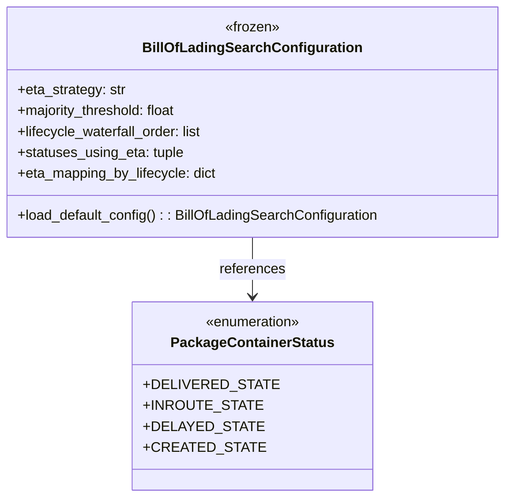

# Diagram: partview_service/partview_service/tests/unit/core/business/test_BillOfLadingSearchConfiguration.py


> Auto-generated by Obscura crawlers

## Diagram 1



> SVG rendering failed for this diagram.

## Diagram 2

```mermaid
flowchart LR
A[Cfg.load_default_config()] --> B{eta_strategy.upper() == "MOST_FREQUENT_THEN_FURTHEST"}
A --> C{0.0 < majority_threshold < 1.0}
A --> D{lifecycle_waterfall_order[0] == PCS.DELIVERED_STATE}
A --> E{set(lifecycle_waterfall_order) == {DELIVERED, INROUTE, DELAYED, CREATED}}
A --> F{lifecycle_waterfall_order[-1] == PCS.CREATED_STATE}
A --> G{statuses_using_eta == (PCS.INROUTE_STATE,)}
A --> H{eta_mapping_by_lifecycle[DELIVERED] is None}
A --> I{eta_mapping_by_lifecycle[DELAYED] == "tbd"}
A --> J{eta_mapping_by_lifecycle[CREATED] == "tbd"}
A --> K{set(statuses_using_eta).issubset(known)}
A --> L{assigning attribute raises FrozenInstanceError}
B --> OK1[assert passes]
C --> OK2[assert passes]
D --> OK3[assert passes]
E --> OK4[assert passes]
F --> OK5[assert passes]
G --> OK6[assert passes]
H --> OK7[assert passes]
I --> OK8[assert passes]
J --> OK9[assert passes]
K --> OK10[assert passes]
L --> OK11[assert raises FrozenInstanceError]
```

> SVG rendering failed for this diagram.
