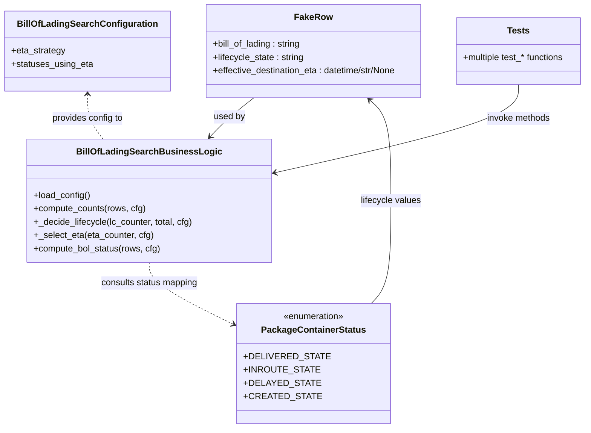

# Diagram: partview_service/partview_service/tests/unit/core/business/trip_leg/test_BillOfLadingSearchBusinessLogic.py


> Auto-generated by Obscura crawlers

## Diagram 1



### SVG

<svg id="container" width="1056.544921875" xmlns="http://www.w3.org/2000/svg" class="classDiagram" height="770" viewBox="0 0 1056.544921875 770" role="graphics-document document" aria-roledescription="class"><style>#container{font-family:"trebuchet ms",verdana,arial,sans-serif;font-size:16px;fill:#333;}@keyframes edge-animation-frame{from{stroke-dashoffset:0;}}@keyframes dash{to{stroke-dashoffset:0;}}#container .edge-animation-slow{stroke-dasharray:9,5!important;stroke-dashoffset:900;animation:dash 50s linear infinite;stroke-linecap:round;}#container .edge-animation-fast{stroke-dasharray:9,5!important;stroke-dashoffset:900;animation:dash 20s linear infinite;stroke-linecap:round;}#container .error-icon{fill:#552222;}#container .error-text{fill:#552222;stroke:#552222;}#container .edge-thickness-normal{stroke-width:1px;}#container .edge-thickness-thick{stroke-width:3.5px;}#container .edge-pattern-solid{stroke-dasharray:0;}#container .edge-thickness-invisible{stroke-width:0;fill:none;}#container .edge-pattern-dashed{stroke-dasharray:3;}#container .edge-pattern-dotted{stroke-dasharray:2;}#container .marker{fill:#333333;stroke:#333333;}#container .marker.cross{stroke:#333333;}#container svg{font-family:"trebuchet ms",verdana,arial,sans-serif;font-size:16px;}#container p{margin:0;}#container g.classGroup text{fill:#9370DB;stroke:none;font-family:"trebuchet ms",verdana,arial,sans-serif;font-size:10px;}#container g.classGroup text .title{font-weight:bolder;}#container .nodeLabel,#container .edgeLabel{color:#131300;}#container .edgeLabel .label rect{fill:#ECECFF;}#container .label text{fill:#131300;}#container .labelBkg{background:#ECECFF;}#container .edgeLabel .label span{background:#ECECFF;}#container .classTitle{font-weight:bolder;}#container .node rect,#container .node circle,#container .node ellipse,#container .node polygon,#container .node path{fill:#ECECFF;stroke:#9370DB;stroke-width:1px;}#container .divider{stroke:#9370DB;stroke-width:1;}#container g.clickable{cursor:pointer;}#container g.classGroup rect{fill:#ECECFF;stroke:#9370DB;}#container g.classGroup line{stroke:#9370DB;stroke-width:1;}#container .classLabel .box{stroke:none;stroke-width:0;fill:#ECECFF;opacity:0.5;}#container .classLabel .label{fill:#9370DB;font-size:10px;}#container .relation{stroke:#333333;stroke-width:1;fill:none;}#container .dashed-line{stroke-dasharray:3;}#container .dotted-line{stroke-dasharray:1 2;}#container #compositionStart,#container .composition{fill:#333333!important;stroke:#333333!important;stroke-width:1;}#container #compositionEnd,#container .composition{fill:#333333!important;stroke:#333333!important;stroke-width:1;}#container #dependencyStart,#container .dependency{fill:#333333!important;stroke:#333333!important;stroke-width:1;}#container #dependencyStart,#container .dependency{fill:#333333!important;stroke:#333333!important;stroke-width:1;}#container #extensionStart,#container .extension{fill:transparent!important;stroke:#333333!important;stroke-width:1;}#container #extensionEnd,#container .extension{fill:transparent!important;stroke:#333333!important;stroke-width:1;}#container #aggregationStart,#container .aggregation{fill:transparent!important;stroke:#333333!important;stroke-width:1;}#container #aggregationEnd,#container .aggregation{fill:transparent!important;stroke:#333333!important;stroke-width:1;}#container #lollipopStart,#container .lollipop{fill:#ECECFF!important;stroke:#333333!important;stroke-width:1;}#container #lollipopEnd,#container .lollipop{fill:#ECECFF!important;stroke:#333333!important;stroke-width:1;}#container .edgeTerminals{font-size:11px;line-height:initial;}#container .classTitleText{text-anchor:middle;font-size:18px;fill:#333;}#container .label-icon{display:inline-block;height:1em;overflow:visible;vertical-align:-0.125em;}#container .node .label-icon path{fill:currentColor;stroke:revert;stroke-width:revert;}#container :root{--mermaid-font-family:"trebuchet ms",verdana,arial,sans-serif;}</style><g><defs><marker id="container_class-aggregationStart" class="marker aggregation class" refX="18" refY="7" markerWidth="190" markerHeight="240" orient="auto"><path d="M 18,7 L9,13 L1,7 L9,1 Z"></path></marker></defs><defs><marker id="container_class-aggregationEnd" class="marker aggregation class" refX="1" refY="7" markerWidth="20" markerHeight="28" orient="auto"><path d="M 18,7 L9,13 L1,7 L9,1 Z"></path></marker></defs><defs><marker id="container_class-extensionStart" class="marker extension class" refX="18" refY="7" markerWidth="190" markerHeight="240" orient="auto"><path d="M 1,7 L18,13 V 1 Z"></path></marker></defs><defs><marker id="container_class-extensionEnd" class="marker extension class" refX="1" refY="7" markerWidth="20" markerHeight="28" orient="auto"><path d="M 1,1 V 13 L18,7 Z"></path></marker></defs><defs><marker id="container_class-compositionStart" class="marker composition class" refX="18" refY="7" markerWidth="190" markerHeight="240" orient="auto"><path d="M 18,7 L9,13 L1,7 L9,1 Z"></path></marker></defs><defs><marker id="container_class-compositionEnd" class="marker composition class" refX="1" refY="7" markerWidth="20" markerHeight="28" orient="auto"><path d="M 18,7 L9,13 L1,7 L9,1 Z"></path></marker></defs><defs><marker id="container_class-dependencyStart" class="marker dependency class" refX="6" refY="7" markerWidth="190" markerHeight="240" orient="auto"><path d="M 5,7 L9,13 L1,7 L9,1 Z"></path></marker></defs><defs><marker id="container_class-dependencyEnd" class="marker dependency class" refX="13" refY="7" markerWidth="20" markerHeight="28" orient="auto"><path d="M 18,7 L9,13 L14,7 L9,1 Z"></path></marker></defs><defs><marker id="container_class-lollipopStart" class="marker lollipop class" refX="13" refY="7" markerWidth="190" markerHeight="240" orient="auto"><circle stroke="black" fill="transparent" cx="7" cy="7" r="6"></circle></marker></defs><defs><marker id="container_class-lollipopEnd" class="marker lollipop class" refX="1" refY="7" markerWidth="190" markerHeight="240" orient="auto"><circle stroke="black" fill="transparent" cx="7" cy="7" r="6"></circle></marker></defs><g class="root"><g class="clusters"></g><g class="edgePaths"><path d="M453.068,176L445.266,182.167C437.463,188.333,421.859,200.667,408.784,212.281C395.71,223.896,385.165,234.792,379.893,240.24L374.621,245.688" id="id_FakeRow_BillOfLadingSearchBusinessLogic_1" class="edge-thickness-normal edge-pattern-solid relation" style=";;;" data-edge="true" data-et="edge" data-id="id_FakeRow_BillOfLadingSearchBusinessLogic_1" data-points="W3sieCI6NDUzLjA2ODI5NDgwODg4NDMsInkiOjE3Nn0seyJ4Ijo0MDYuMjUzOTA2MjUsInkiOjIxM30seyJ4IjozNzAuNDQ4NzMwNDY4NzUsInkiOjI1MH1d" marker-end="url(#container_class-dependencyEnd)"></path><path d="M152.648,170L152.648,177.167C152.648,184.333,152.648,198.667,157.248,212C161.847,225.333,171.046,237.667,175.645,243.833L180.245,250" id="id_BillOfLadingSearchConfiguration_BillOfLadingSearchBusinessLogic_2" class="edge-thickness-normal edge-pattern-dashed relation" style=";;;" data-edge="true" data-et="edge" data-id="id_BillOfLadingSearchConfiguration_BillOfLadingSearchBusinessLogic_2" data-points="W3sieCI6MTUyLjY0ODQzNzUsInkiOjE2NH0seyJ4IjoxNTIuNjQ4NDM3NSwieSI6MjEzfSx7IngiOjE4MC4yNDQ2Mjg5MDYyNSwieSI6MjUwfV0=" marker-start="url(#container_class-dependencyStart)"></path><path d="M666.024,546L672.115,539.833C678.206,533.667,690.388,521.333,696.479,490.5C702.57,459.667,702.57,410.333,702.57,361C702.57,311.667,702.57,262.333,696.035,232.145C689.5,201.957,676.429,190.915,669.894,185.393L663.359,179.872" id="id_PackageContainerStatus_FakeRow_3" class="edge-thickness-normal edge-pattern-solid relation" style=";;;" data-edge="true" data-et="edge" data-id="id_PackageContainerStatus_FakeRow_3" data-points="W3sieCI6NjY2LjAyNDMzOTk3ODQ0ODMsInkiOjU0Nn0seyJ4Ijo3MDIuNTcwMzEyNSwieSI6NTA5fSx7IngiOjcwMi41NzAzMTI1LCJ5IjozNjF9LHsieCI6NzAyLjU3MDMxMjUsInkiOjIxM30seyJ4Ijo2NTguNzc1NTUyMDQwMjg5MywieSI6MTc2fV0=" marker-end="url(#container_class-dependencyEnd)"></path><path d="M933.619,152L933.619,162.167C933.619,172.333,933.619,192.667,858.85,219.335C784.081,246.003,634.543,279.007,559.774,295.508L485.005,312.01" id="id_Tests_BillOfLadingSearchBusinessLogic_4" class="edge-thickness-normal edge-pattern-solid relation" style=";;;" data-edge="true" data-et="edge" data-id="id_Tests_BillOfLadingSearchBusinessLogic_4" data-points="W3sieCI6OTMzLjYxOTE0MDYyNSwieSI6MTUyfSx7IngiOjkzMy42MTkxNDA2MjUsInkiOjIxM30seyJ4Ijo0NzkuMTQ2NDg0Mzc1LCJ5IjozMTMuMzAzMjU2MjQ3NDUxNX1d" marker-end="url(#container_class-dependencyEnd)"></path><path d="M263.033,472L263.033,478.167C263.033,484.333,263.033,496.667,290.949,516.494C318.864,536.321,374.696,563.641,402.611,577.301L430.527,590.962" id="id_BillOfLadingSearchBusinessLogic_PackageContainerStatus_5" class="edge-thickness-normal edge-pattern-dashed relation" style=";;;" data-edge="true" data-et="edge" data-id="id_BillOfLadingSearchBusinessLogic_PackageContainerStatus_5" data-points="W3sieCI6MjYzLjAzMzIwMzEyNSwieSI6NDcyfSx7IngiOjI2My4wMzMyMDMxMjUsInkiOjUwOX0seyJ4Ijo0MzUuOTE2MDE1NjI1LCJ5Ijo1OTMuNTk4Nzg0NTU1MTQ5OH1d" marker-end="url(#container_class-dependencyEnd)"></path></g><g class="edgeLabels"><g class="edgeLabel" transform="translate(409.46376, 210.46308)"><g class="label" data-id="id_FakeRow_BillOfLadingSearchBusinessLogic_1" transform="translate(-28.3125, -12)"><foreignObject width="56.625" height="24"><div xmlns="http://www.w3.org/1999/xhtml" class="labelBkg" style="display: table-cell; white-space: nowrap; line-height: 1.5; max-width: 200px; text-align: center;"><span class="edgeLabel"><p>used by</p></span></div></foreignObject></g></g><g class="edgeLabel" transform="translate(152.6484375, 213)"><g class="label" data-id="id_BillOfLadingSearchConfiguration_BillOfLadingSearchBusinessLogic_2" transform="translate(-64.78125, -12)"><foreignObject width="129.5625" height="24"><div xmlns="http://www.w3.org/1999/xhtml" class="labelBkg" style="display: table-cell; white-space: nowrap; line-height: 1.5; max-width: 200px; text-align: center;"><span class="edgeLabel"><p>provides config to</p></span></div></foreignObject></g></g><g class="edgeLabel" transform="translate(702.5703125, 361)"><g class="label" data-id="id_PackageContainerStatus_FakeRow_3" transform="translate(-55.078125, -12)"><foreignObject width="110.15625" height="24"><div xmlns="http://www.w3.org/1999/xhtml" class="labelBkg" style="display: table-cell; white-space: nowrap; line-height: 1.5; max-width: 200px; text-align: center;"><span class="edgeLabel"><p>lifecycle values</p></span></div></foreignObject></g></g><g class="edgeLabel" transform="translate(933.619140625, 213)"><g class="label" data-id="id_Tests_BillOfLadingSearchBusinessLogic_4" transform="translate(-57.953125, -12)"><foreignObject width="115.90625" height="24"><div xmlns="http://www.w3.org/1999/xhtml" class="labelBkg" style="display: table-cell; white-space: nowrap; line-height: 1.5; max-width: 200px; text-align: center;"><span class="edgeLabel"><p>invoke methods</p></span></div></foreignObject></g></g><g class="edgeLabel" transform="translate(263.033203125, 509)"><g class="label" data-id="id_BillOfLadingSearchBusinessLogic_PackageContainerStatus_5" transform="translate(-88.640625, -12)"><foreignObject width="177.28125" height="24"><div xmlns="http://www.w3.org/1999/xhtml" class="labelBkg" style="display: table-cell; white-space: nowrap; line-height: 1.5; max-width: 200px; text-align: center;"><span class="edgeLabel"><p>consults status mapping</p></span></div></foreignObject></g></g></g><g class="nodes"><g class="node default" id="classId-FakeRow-0" transform="translate(559.349609375, 92)"><g class="basic label-container"><path d="M-199.46875 -84 L199.46875 -84 L199.46875 84 L-199.46875 84" stroke="none" stroke-width="0" fill="#ECECFF" style=""></path><path d="M-199.46875 -84 C-113.9573701362837 -84, -28.4459902725674 -84, 199.46875 -84 M-199.46875 -84 C-72.9633368486555 -84, 53.542076302689 -84, 199.46875 -84 M199.46875 -84 C199.46875 -26.82375435225844, 199.46875 30.35249129548312, 199.46875 84 M199.46875 -84 C199.46875 -18.638069135315916, 199.46875 46.72386172936817, 199.46875 84 M199.46875 84 C44.91932714690833 84, -109.63009570618334 84, -199.46875 84 M199.46875 84 C59.9324210550474 84, -79.6039078899052 84, -199.46875 84 M-199.46875 84 C-199.46875 35.07153961615153, -199.46875 -13.856920767696934, -199.46875 -84 M-199.46875 84 C-199.46875 24.897881709066688, -199.46875 -34.204236581866624, -199.46875 -84" stroke="#9370DB" stroke-width="1.3" fill="none" stroke-dasharray="0 0" style=""></path></g><g class="annotation-group text" transform="translate(0, -60)"></g><g class="label-group text" transform="translate(-32.015625, -60)"><g class="label" style="font-weight: bolder" transform="translate(0,-12)"><foreignObject width="64.03125" height="24"><div xmlns="http://www.w3.org/1999/xhtml" style="display: table-cell; white-space: nowrap; line-height: 1.5; max-width: 113px; text-align: center;"><span class="nodeLabel markdown-node-label" style=""><p>FakeRow</p></span></div></foreignObject></g></g><g class="members-group text" transform="translate(-187.46875, -12)"><g class="label" style="" transform="translate(0,-12)"><foreignObject width="160.8125" height="24"><div xmlns="http://www.w3.org/1999/xhtml" style="display: table-cell; white-space: nowrap; line-height: 1.5; max-width: 219px; text-align: center;"><span class="nodeLabel markdown-node-label" style=""><p>+bill_of_lading : string</p></span></div></foreignObject></g><g class="label" style="" transform="translate(0,12)"><foreignObject width="165.59375" height="24"><div xmlns="http://www.w3.org/1999/xhtml" style="display: table-cell; white-space: nowrap; line-height: 1.5; max-width: 224px; text-align: center;"><span class="nodeLabel markdown-node-label" style=""><p>+lifecycle_state : string</p></span></div></foreignObject></g><g class="label" style="" transform="translate(0,36)"><foreignObject width="342.921875" height="24"><div xmlns="http://www.w3.org/1999/xhtml" style="display: table-cell; white-space: nowrap; line-height: 1.5; max-width: 400px; text-align: center;"><span class="nodeLabel markdown-node-label" style=""><p>+effective_destination_eta : datetime/str/None</p></span></div></foreignObject></g></g><g class="methods-group text" transform="translate(-187.46875, 84)"></g><g class="divider" style=""><path d="M-199.46875 -36 C-71.3211492683383 -36, 56.826451463323394 -36, 199.46875 -36 M-199.46875 -36 C-102.34316725136189 -36, -5.217584502723781 -36, 199.46875 -36" stroke="#9370DB" stroke-width="1.3" fill="none" stroke-dasharray="0 0" style=""></path></g><g class="divider" style=""><path d="M-199.46875 60 C-73.00274719935946 60, 53.46325560128108 60, 199.46875 60 M-199.46875 60 C-72.47532558159678 60, 54.518098836806445 60, 199.46875 60" stroke="#9370DB" stroke-width="1.3" fill="none" stroke-dasharray="0 0" style=""></path></g></g><g class="node default" id="classId-BillOfLadingSearchBusinessLogic-1" transform="translate(263.033203125, 361)"><g class="basic label-container"><path d="M-216.11328125 -111 L216.11328125 -111 L216.11328125 111 L-216.11328125 111" stroke="none" stroke-width="0" fill="#ECECFF" style=""></path><path d="M-216.11328125 -111 C-96.87093700563672 -111, 22.37140723872656 -111, 216.11328125 -111 M-216.11328125 -111 C-128.7404810773749 -111, -41.36768090474985 -111, 216.11328125 -111 M216.11328125 -111 C216.11328125 -46.55737590670391, 216.11328125 17.88524818659218, 216.11328125 111 M216.11328125 -111 C216.11328125 -49.46642822067749, 216.11328125 12.067143558645014, 216.11328125 111 M216.11328125 111 C69.90120473472174 111, -76.31087178055651 111, -216.11328125 111 M216.11328125 111 C105.55019472082996 111, -5.012891808340072 111, -216.11328125 111 M-216.11328125 111 C-216.11328125 41.47369242704423, -216.11328125 -28.052615145911545, -216.11328125 -111 M-216.11328125 111 C-216.11328125 28.582918571210016, -216.11328125 -53.83416285757997, -216.11328125 -111" stroke="#9370DB" stroke-width="1.3" fill="none" stroke-dasharray="0 0" style=""></path></g><g class="annotation-group text" transform="translate(0, -87)"></g><g class="label-group text" transform="translate(-120.9296875, -87)"><g class="label" style="font-weight: bolder" transform="translate(0,-12)"><foreignObject width="241.859375" height="24"><div xmlns="http://www.w3.org/1999/xhtml" style="display: table-cell; white-space: nowrap; line-height: 1.5; max-width: 289px; text-align: center;"><span class="nodeLabel markdown-node-label" style=""><p>BillOfLadingSearchBusinessLogic</p></span></div></foreignObject></g></g><g class="members-group text" transform="translate(-204.11328125, -39)"></g><g class="methods-group text" transform="translate(-204.11328125, -9)"><g class="label" style="" transform="translate(0,-12)"><foreignObject width="101.984375" height="24"><div xmlns="http://www.w3.org/1999/xhtml" style="display: table-cell; white-space: nowrap; line-height: 1.5; max-width: 159px; text-align: center;"><span class="nodeLabel markdown-node-label" style=""><p>+load_config()</p></span></div></foreignObject></g><g class="label" style="" transform="translate(0,12)"><foreignObject width="201.5" height="24"><div xmlns="http://www.w3.org/1999/xhtml" style="display: table-cell; white-space: nowrap; line-height: 1.5; max-width: 259px; text-align: center;"><span class="nodeLabel markdown-node-label" style=""><p>+compute_counts(rows, cfg)</p></span></div></foreignObject></g><g class="label" style="" transform="translate(0,36)"><foreignObject width="287.296875" height="24"><div xmlns="http://www.w3.org/1999/xhtml" style="display: table-cell; white-space: nowrap; line-height: 1.5; max-width: 345px; text-align: center;"><span class="nodeLabel markdown-node-label" style=""><p>+_decide_lifecycle(lc_counter, total, cfg)</p></span></div></foreignObject></g><g class="label" style="" transform="translate(0,60)"><foreignObject width="214.4375" height="24"><div xmlns="http://www.w3.org/1999/xhtml" style="display: table-cell; white-space: nowrap; line-height: 1.5; max-width: 272px; text-align: center;"><span class="nodeLabel markdown-node-label" style=""><p>+_select_eta(eta_counter, cfg)</p></span></div></foreignObject></g><g class="label" style="" transform="translate(0,84)"><foreignObject width="229.46875" height="24"><div xmlns="http://www.w3.org/1999/xhtml" style="display: table-cell; white-space: nowrap; line-height: 1.5; max-width: 287px; text-align: center;"><span class="nodeLabel markdown-node-label" style=""><p>+compute_bol_status(rows, cfg)</p></span></div></foreignObject></g></g><g class="divider" style=""><path d="M-216.11328125 -63 C-126.22632182460782 -63, -36.339362399215645 -63, 216.11328125 -63 M-216.11328125 -63 C-90.3758604914774 -63, 35.361560267045206 -63, 216.11328125 -63" stroke="#9370DB" stroke-width="1.3" fill="none" stroke-dasharray="0 0" style=""></path></g><g class="divider" style=""><path d="M-216.11328125 -39 C-84.76625883388044 -39, 46.580763582239115 -39, 216.11328125 -39 M-216.11328125 -39 C-119.79720086902968 -39, -23.48112048805936 -39, 216.11328125 -39" stroke="#9370DB" stroke-width="1.3" fill="none" stroke-dasharray="0 0" style=""></path></g></g><g class="node default" id="classId-BillOfLadingSearchConfiguration-2" transform="translate(152.6484375, 92)"><g class="basic label-container"><path d="M-144.6484375 -72 L144.6484375 -72 L144.6484375 72 L-144.6484375 72" stroke="none" stroke-width="0" fill="#ECECFF" style=""></path><path d="M-144.6484375 -72 C-67.70496641862215 -72, 9.238504662755702 -72, 144.6484375 -72 M-144.6484375 -72 C-28.977090077098396 -72, 86.69425734580321 -72, 144.6484375 -72 M144.6484375 -72 C144.6484375 -17.322140622508023, 144.6484375 37.355718754983954, 144.6484375 72 M144.6484375 -72 C144.6484375 -19.88741651082198, 144.6484375 32.22516697835604, 144.6484375 72 M144.6484375 72 C80.28213075756904 72, 15.915824015138071 72, -144.6484375 72 M144.6484375 72 C41.55261851534746 72, -61.54320046930508 72, -144.6484375 72 M-144.6484375 72 C-144.6484375 42.183306129588345, -144.6484375 12.366612259176684, -144.6484375 -72 M-144.6484375 72 C-144.6484375 21.704366771602096, -144.6484375 -28.591266456795807, -144.6484375 -72" stroke="#9370DB" stroke-width="1.3" fill="none" stroke-dasharray="0 0" style=""></path></g><g class="annotation-group text" transform="translate(0, -48)"></g><g class="label-group text" transform="translate(-118.890625, -48)"><g class="label" style="font-weight: bolder" transform="translate(0,-12)"><foreignObject width="237.78125" height="24"><div xmlns="http://www.w3.org/1999/xhtml" style="display: table-cell; white-space: nowrap; line-height: 1.5; max-width: 284px; text-align: center;"><span class="nodeLabel markdown-node-label" style=""><p>BillOfLadingSearchConfiguration</p></span></div></foreignObject></g></g><g class="members-group text" transform="translate(-132.6484375, 0)"><g class="label" style="" transform="translate(0,-12)"><foreignObject width="97.421875" height="24"><div xmlns="http://www.w3.org/1999/xhtml" style="display: table-cell; white-space: nowrap; line-height: 1.5; max-width: 155px; text-align: center;"><span class="nodeLabel markdown-node-label" style=""><p>+eta_strategy</p></span></div></foreignObject></g><g class="label" style="" transform="translate(0,12)"><foreignObject width="146.40625" height="24"><div xmlns="http://www.w3.org/1999/xhtml" style="display: table-cell; white-space: nowrap; line-height: 1.5; max-width: 204px; text-align: center;"><span class="nodeLabel markdown-node-label" style=""><p>+statuses_using_eta</p></span></div></foreignObject></g></g><g class="methods-group text" transform="translate(-132.6484375, 72)"></g><g class="divider" style=""><path d="M-144.6484375 -24 C-79.11609842486676 -24, -13.583759349733526 -24, 144.6484375 -24 M-144.6484375 -24 C-86.73453527798262 -24, -28.820633055965246 -24, 144.6484375 -24" stroke="#9370DB" stroke-width="1.3" fill="none" stroke-dasharray="0 0" style=""></path></g><g class="divider" style=""><path d="M-144.6484375 48 C-35.88004433291853 48, 72.88834883416294 48, 144.6484375 48 M-144.6484375 48 C-56.41248161254302 48, 31.823474274913963 48, 144.6484375 48" stroke="#9370DB" stroke-width="1.3" fill="none" stroke-dasharray="0 0" style=""></path></g></g><g class="node default" id="classId-PackageContainerStatus-3" transform="translate(559.349609375, 654)"><g class="basic label-container"><path d="M-123.43359375 -108 L123.43359375 -108 L123.43359375 108 L-123.43359375 108" stroke="none" stroke-width="0" fill="#ECECFF" style=""></path><path d="M-123.43359375 -108 C-31.672936519659032 -108, 60.087720710681936 -108, 123.43359375 -108 M-123.43359375 -108 C-25.55008580213547 -108, 72.33342214572906 -108, 123.43359375 -108 M123.43359375 -108 C123.43359375 -38.19085468738119, 123.43359375 31.61829062523762, 123.43359375 108 M123.43359375 -108 C123.43359375 -60.60050535051426, 123.43359375 -13.201010701028522, 123.43359375 108 M123.43359375 108 C35.226188984163784 108, -52.98121578167243 108, -123.43359375 108 M123.43359375 108 C49.7745987494624 108, -23.884396251075202 108, -123.43359375 108 M-123.43359375 108 C-123.43359375 49.78755977882076, -123.43359375 -8.424880442358486, -123.43359375 -108 M-123.43359375 108 C-123.43359375 50.28428829933313, -123.43359375 -7.4314234013337455, -123.43359375 -108" stroke="#9370DB" stroke-width="1.3" fill="none" stroke-dasharray="0 0" style=""></path></g><g class="annotation-group text" transform="translate(-55.5546875, -84)"><g class="label" style="" transform="translate(0,-12)"><foreignObject width="111.109375" height="24"><div xmlns="http://www.w3.org/1999/xhtml" style="display: table-cell; white-space: nowrap; line-height: 1.5; max-width: 161px; text-align: center;"><span class="nodeLabel markdown-node-label" style=""><p>«enumeration»</p></span></div></foreignObject></g></g><g class="label-group text" transform="translate(-88.9296875, -60)"><g class="label" style="font-weight: bolder" transform="translate(0,-12)"><foreignObject width="177.859375" height="24"><div xmlns="http://www.w3.org/1999/xhtml" style="display: table-cell; white-space: nowrap; line-height: 1.5; max-width: 224px; text-align: center;"><span class="nodeLabel markdown-node-label" style=""><p>PackageContainerStatus</p></span></div></foreignObject></g></g><g class="members-group text" transform="translate(-111.43359375, -12)"><g class="label" style="" transform="translate(0,-12)"><foreignObject width="133.9375" height="24"><div xmlns="http://www.w3.org/1999/xhtml" style="display: table-cell; white-space: nowrap; line-height: 1.5; max-width: 191px; text-align: center;"><span class="nodeLabel markdown-node-label" style=""><p>+DELIVERED_STATE</p></span></div></foreignObject></g><g class="label" style="" transform="translate(0,12)"><foreignObject width="120.71875" height="24"><div xmlns="http://www.w3.org/1999/xhtml" style="display: table-cell; white-space: nowrap; line-height: 1.5; max-width: 178px; text-align: center;"><span class="nodeLabel markdown-node-label" style=""><p>+INROUTE_STATE</p></span></div></foreignObject></g><g class="label" style="" transform="translate(0,36)"><foreignObject width="119.265625" height="24"><div xmlns="http://www.w3.org/1999/xhtml" style="display: table-cell; white-space: nowrap; line-height: 1.5; max-width: 177px; text-align: center;"><span class="nodeLabel markdown-node-label" style=""><p>+DELAYED_STATE</p></span></div></foreignObject></g><g class="label" style="" transform="translate(0,60)"><foreignObject width="119.09375" height="24"><div xmlns="http://www.w3.org/1999/xhtml" style="display: table-cell; white-space: nowrap; line-height: 1.5; max-width: 176px; text-align: center;"><span class="nodeLabel markdown-node-label" style=""><p>+CREATED_STATE</p></span></div></foreignObject></g></g><g class="methods-group text" transform="translate(-111.43359375, 108)"></g><g class="divider" style=""><path d="M-123.43359375 -36 C-73.574008034755 -36, -23.714422319510007 -36, 123.43359375 -36 M-123.43359375 -36 C-55.15691798912768 -36, 13.119757771744645 -36, 123.43359375 -36" stroke="#9370DB" stroke-width="1.3" fill="none" stroke-dasharray="0 0" style=""></path></g><g class="divider" style=""><path d="M-123.43359375 84 C-42.362297569680635 84, 38.70899861063873 84, 123.43359375 84 M-123.43359375 84 C-51.15493540282904 84, 21.12372294434192 84, 123.43359375 84" stroke="#9370DB" stroke-width="1.3" fill="none" stroke-dasharray="0 0" style=""></path></g></g><g class="node default" id="classId-Tests-4" transform="translate(933.619140625, 92)"><g class="basic label-container"><path d="M-114.92578125 -60 L114.92578125 -60 L114.92578125 60 L-114.92578125 60" stroke="none" stroke-width="0" fill="#ECECFF" style=""></path><path d="M-114.92578125 -60 C-33.01025484925424 -60, 48.90527155149152 -60, 114.92578125 -60 M-114.92578125 -60 C-49.090056804551125 -60, 16.74566764089775 -60, 114.92578125 -60 M114.92578125 -60 C114.92578125 -25.695418624087118, 114.92578125 8.609162751825764, 114.92578125 60 M114.92578125 -60 C114.92578125 -26.71199589976468, 114.92578125 6.576008200470639, 114.92578125 60 M114.92578125 60 C30.50898621292484 60, -53.90780882415032 60, -114.92578125 60 M114.92578125 60 C63.69218767679083 60, 12.45859410358166 60, -114.92578125 60 M-114.92578125 60 C-114.92578125 13.7370465619924, -114.92578125 -32.5259068760152, -114.92578125 -60 M-114.92578125 60 C-114.92578125 23.73729115598514, -114.92578125 -12.52541768802972, -114.92578125 -60" stroke="#9370DB" stroke-width="1.3" fill="none" stroke-dasharray="0 0" style=""></path></g><g class="annotation-group text" transform="translate(0, -36)"></g><g class="label-group text" transform="translate(-19.1171875, -36)"><g class="label" style="font-weight: bolder" transform="translate(0,-12)"><foreignObject width="38.234375" height="24"><div xmlns="http://www.w3.org/1999/xhtml" style="display: table-cell; white-space: nowrap; line-height: 1.5; max-width: 87px; text-align: center;"><span class="nodeLabel markdown-node-label" style=""><p>Tests</p></span></div></foreignObject></g></g><g class="members-group text" transform="translate(-102.92578125, 12)"><g class="label" style="" transform="translate(0,-12)"><foreignObject width="186.734375" height="24"><div xmlns="http://www.w3.org/1999/xhtml" style="display: table-cell; white-space: nowrap; line-height: 1.5; max-width: 244px; text-align: center;"><span class="nodeLabel markdown-node-label" style=""><p>+multiple test_* functions</p></span></div></foreignObject></g></g><g class="methods-group text" transform="translate(-102.92578125, 60)"></g><g class="divider" style=""><path d="M-114.92578125 -12 C-28.282197273653352 -12, 58.361386702693295 -12, 114.92578125 -12 M-114.92578125 -12 C-37.79149883686607 -12, 39.34278357626786 -12, 114.92578125 -12" stroke="#9370DB" stroke-width="1.3" fill="none" stroke-dasharray="0 0" style=""></path></g><g class="divider" style=""><path d="M-114.92578125 36 C-50.93693036894808 36, 13.051920512103834 36, 114.92578125 36 M-114.92578125 36 C-43.23500115160738 36, 28.455778946785244 36, 114.92578125 36" stroke="#9370DB" stroke-width="1.3" fill="none" stroke-dasharray="0 0" style=""></path></g></g></g></g></g></svg>

## Diagram 2

```mermaid
flowchart TD
Start([Start]) --> ComputeCounts[Compute counts<br/>(lc_counter, eta_counter, total)]
ComputeCounts --> DecideLifecycle{Decide lifecycle}
DecideLifecycle -->|Clear majority| Majority[Select lifecycle with highest count]
DecideLifecycle -->|Tie| Waterfall[Apply waterfall priority order]
Waterfall --> WaterfallPick[Pick highest-priority lifecycle from waterfall]
Majority --> LifecycleChosen[Lifecycle chosen]
WaterfallPick --> LifecycleChosen
LifecycleChosen --> ETAEligibility{Is lifecycle in statuses_using_eta?}
ComputeCounts --> BuildEtaCounter[Build ETA counter<br/>(filter ETAs by allowed statuses)]
BuildEtaCounter --> SelectETA{Select ETA from eta_counter}
SelectETA -->|Most frequent| MostFreq[Choose most frequent ETA]
SelectETA -->|Tie| StrategyTie[Apply eta_strategy]
StrategyTie -->|LATEST| ChooseLatest[Choose furthest/latest timestamp]
StrategyTie -->|EARLIEST| ChooseEarliest[Choose earliest timestamp]
MostFreq --> ETAChosen[ETA chosen]
ChooseLatest --> ETAChosen
ChooseEarliest --> ETAChosen
ETAEligibility -->|Yes| UseETA[Use ETAChosen]
ETAEligibility -->|No| UseMapping[Use lifecycle-to-eta mapping]
UseMapping -->|Delivered| DeliveredMap[eta = None]
UseMapping -->|Delayed| DelayedMap[eta = "tbd"]
UseMapping -->|Created| CreatedMap[eta = "tbd"]
UseMapping -->|Other| NoneMap[eta = None]
UseETA --> Result[Result: lifecycle + ETA]
DeliveredMap --> Result
DelayedMap --> Result
CreatedMap --> Result
NoneMap --> Result
Result --> End([End])
```

> SVG rendering failed for this diagram.
