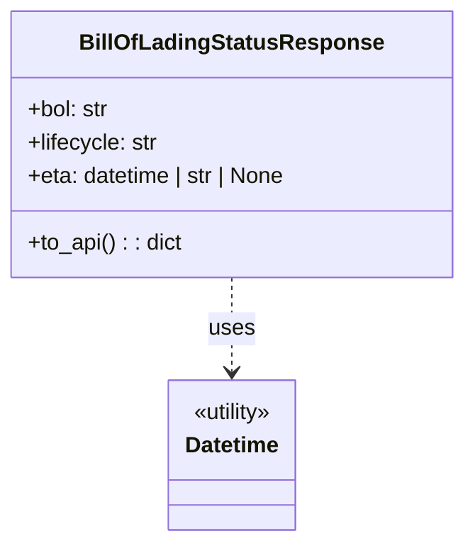

# Diagram: partview_service/partview_service/tests/unit/core/model/bill_of_lading_status_response_test.py


> Auto-generated by Obscura crawlers

## Diagram 1



> SVG rendering failed for this diagram.

## Diagram 2

```mermaid
flowchart TD
    Start([BillOfLadingStatusResponse.to_api tests]) --> B1[Create B1: bol="B1", lifecycle="INROUTE", eta=datetime(2025-11-03T23:59:59)]
    Start --> B2[Create B2: bol="B2", lifecycle="DELIVERED", eta=None]
    Start --> B3[Create B3: bol="B3", lifecycle="DELAYED", eta="tbd"]
    B1 --> Call1[Call to_api()]
    B2 --> Call2[Call to_api()]
    B3 --> Call3[Call to_api()]
    Call1 --> Check1{eta type?}
    Call2 --> Check2{eta type?}
    Call3 --> Check3{eta type?}
    Check1 -->|datetime| Out1["\"2025-11-03\" (ISO date string)"]
    Check2 -->|None| Out2[null]
    Check3 -->|string 'tbd'| Out3["\"tbd\""]
```

> SVG rendering failed for this diagram.
