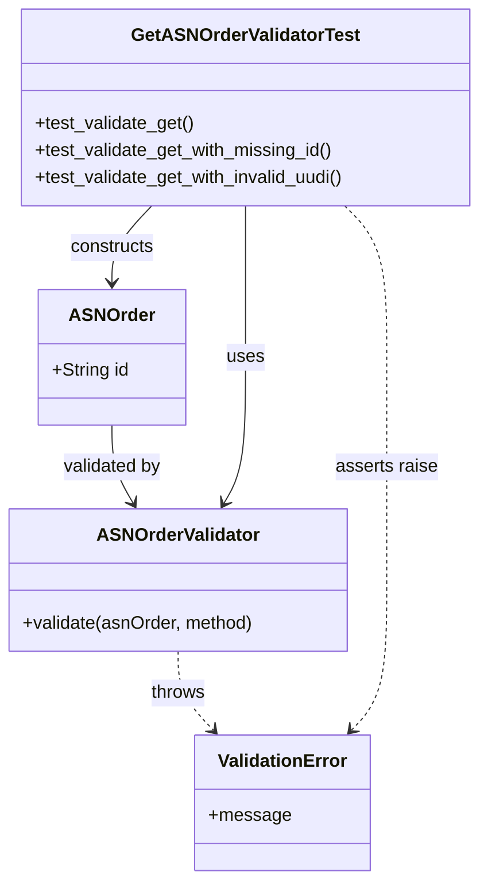
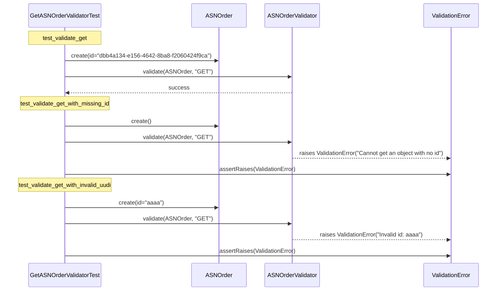

# Diagram: partview_service/partview_service/tests/unit/core/validators/asn_order/asn_order_get_validator_test.py

> Auto-generated by Obscura crawlers

## Diagram 1

### SVG

<svg id="container" width="424.705078125" xmlns="http://www.w3.org/2000/svg" class="classDiagram" height="778" viewBox="0 0 424.705078125 778" role="graphics-document document" aria-roledescription="class"><g><defs><marker id="container_class-aggregationStart" class="marker aggregation class" refX="18" refY="7" markerWidth="190" markerHeight="240" orient="auto"><path d="M 18,7 L9,13 L1,7 L9,1 Z"></path></marker></defs><defs><marker id="container_class-aggregationEnd" class="marker aggregation class" refX="1" refY="7" markerWidth="20" markerHeight="28" orient="auto"><path d="M 18,7 L9,13 L1,7 L9,1 Z"></path></marker></defs><defs><marker id="container_class-extensionStart" class="marker extension class" refX="18" refY="7" markerWidth="190" markerHeight="240" orient="auto"><path d="M 1,7 L18,13 V 1 Z"></path></marker></defs><defs><marker id="container_class-extensionEnd" class="marker extension class" refX="1" refY="7" markerWidth="20" markerHeight="28" orient="auto"><path d="M 1,1 V 13 L18,7 Z"></path></marker></defs><defs><marker id="container_class-compositionStart" class="marker composition class" refX="18" refY="7" markerWidth="190" markerHeight="240" orient="auto"><path d="M 18,7 L9,13 L1,7 L9,1 Z"></path></marker></defs><defs><marker id="container_class-compositionEnd" class="marker composition class" refX="1" refY="7" markerWidth="20" markerHeight="28" orient="auto"><path d="M 18,7 L9,13 L1,7 L9,1 Z"></path></marker></defs><defs><marker id="container_class-dependencyStart" class="marker dependency class" refX="6" refY="7" markerWidth="190" markerHeight="240" orient="auto"><path d="M 5,7 L9,13 L1,7 L9,1 Z"></path></marker></defs><defs><marker id="container_class-dependencyEnd" class="marker dependency class" refX="13" refY="7" markerWidth="20" markerHeight="28" orient="auto"><path d="M 18,7 L9,13 L14,7 L9,1 Z"></path></marker></defs><defs><marker id="container_class-lollipopStart" class="marker lollipop class" refX="13" refY="7" markerWidth="190" markerHeight="240" orient="auto"><circle stroke="black" fill="transparent" cx="7" cy="7" r="6"></circle></marker></defs><defs><marker id="container_class-lollipopEnd" class="marker lollipop class" refX="1" refY="7" markerWidth="190" markerHeight="240" orient="auto"><circle stroke="black" fill="transparent" cx="7" cy="7" r="6"></circle></marker></defs><g class="root"><g class="clusters"></g><g class="edgePaths"><path d="M99.6,376L99.6,382.167C99.6,388.333,99.6,400.667,102.662,412.134C105.723,423.601,111.847,434.203,114.909,439.504L117.971,444.804" id="id_ASNOrder_ASNOrderValidator_1" class="edge-thickness-normal edge-pattern-solid relation" style=";;;" data-edge="true" data-et="edge" data-id="id_ASNOrder_ASNOrderValidator_1" data-points="W3sieCI6OTkuNTk5NjA5Mzc1LCJ5IjozNzZ9LHsieCI6OTkuNTk5NjA5Mzc1LCJ5Ijo0MTN9LHsieCI6MTIwLjk3MjE2Nzk2ODc1LCJ5Ijo0NTB9XQ==" marker-end="url(#container_class-dependencyEnd)"></path><path d="M157.363,576L157.363,582.167C157.363,588.333,157.363,600.667,162.535,612.275C167.706,623.884,178.049,634.767,183.221,640.209L188.392,645.651" id="id_ASNOrderValidator_ValidationError_2" class="edge-thickness-normal edge-pattern-dashed relation" style=";;;" data-edge="true" data-et="edge" data-id="id_ASNOrderValidator_ValidationError_2" data-points="W3sieCI6MTU3LjM2MzI4MTI1LCJ5Ijo1NzZ9LHsieCI6MTU3LjM2MzI4MTI1LCJ5Ijo2MTN9LHsieCI6MTkyLjUyNTM1MDM1NDM4MTQzLCJ5Ijo2NTB9XQ==" marker-end="url(#container_class-dependencyEnd)"></path><path d="M216.857,182L216.857,188.167C216.857,194.333,216.857,206.667,216.857,229C216.857,251.333,216.857,283.667,216.857,316C216.857,348.333,216.857,380.667,213.7,402.141C210.542,423.615,204.227,434.229,201.07,439.536L197.912,444.844" id="id_GetASNOrderValidatorTest_ASNOrderValidator_3" class="edge-thickness-normal edge-pattern-solid relation" style=";;;" data-edge="true" data-et="edge" data-id="id_GetASNOrderValidatorTest_ASNOrderValidator_3" data-points="W3sieCI6MjE2Ljg1NzQyMTg3NSwieSI6MTgyfSx7IngiOjIxNi44NTc0MjE4NzUsInkiOjIxOX0seyJ4IjoyMTYuODU3NDIxODc1LCJ5IjozMTZ9LHsieCI6MjE2Ljg1NzQyMTg3NSwieSI6NDEzfSx7IngiOjE5NC44NDQ1ODk4NDM3NSwieSI6NDUwfV0=" marker-end="url(#container_class-dependencyEnd)"></path><path d="M134.588,182L128.756,188.167C122.925,194.333,111.262,206.667,105.431,218C99.6,229.333,99.6,239.667,99.6,244.833L99.6,250" id="id_GetASNOrderValidatorTest_ASNOrder_4" class="edge-thickness-normal edge-pattern-solid relation" style=";;;" data-edge="true" data-et="edge" data-id="id_GetASNOrderValidatorTest_ASNOrder_4" data-points="W3sieCI6MTM0LjU4NzgyNzYyMDk2Nzc0LCJ5IjoxODJ9LHsieCI6OTkuNTk5NjA5Mzc1LCJ5IjoyMTl9LHsieCI6OTkuNTk5NjA5Mzc1LCJ5IjoyNTZ9XQ==" marker-end="url(#container_class-dependencyEnd)"></path><path d="M304.467,182L310.677,188.167C316.887,194.333,329.307,206.667,335.517,229C341.727,251.333,341.727,283.667,341.727,316C341.727,348.333,341.727,380.667,341.727,413.5C341.727,446.333,341.727,479.667,341.727,513C341.727,546.333,341.727,579.667,336.555,601.775C331.384,623.884,321.041,634.767,315.869,640.209L310.698,645.651" id="id_GetASNOrderValidatorTest_ValidationError_5" class="edge-thickness-normal edge-pattern-dashed relation" style=";;;" data-edge="true" data-et="edge" data-id="id_GetASNOrderValidatorTest_ValidationError_5" data-points="W3sieCI6MzA0LjQ2NzIyMjE1MjIxNzc0LCJ5IjoxODJ9LHsieCI6MzQxLjcyNjU2MjUsInkiOjIxOX0seyJ4IjozNDEuNzI2NTYyNSwieSI6MzE2fSx7IngiOjM0MS43MjY1NjI1LCJ5Ijo0MTN9LHsieCI6MzQxLjcyNjU2MjUsInkiOjUxM30seyJ4IjozNDEuNzI2NTYyNSwieSI6NjEzfSx7IngiOjMwNi41NjQ0OTMzOTU2MTg1NywieSI6NjUwfV0=" marker-end="url(#container_class-dependencyEnd)"></path></g><g class="edgeLabels"><g class="edgeLabel" transform="translate(99.599609375, 413)"><g class="label" data-id="id_ASNOrder_ASNOrderValidator_1" transform="translate(-44.5078125, -12)"><foreignObject width="89.015625" height="24">

validated by

</foreignObject></g></g><g class="edgeLabel" transform="translate(157.36328125, 613)"><g class="label" data-id="id_ASNOrderValidator_ValidationError_2" transform="translate(-24.5703125, -12)"><foreignObject width="49.140625" height="24">

throws

</foreignObject></g></g><g class="edgeLabel" transform="translate(216.857421875, 316)"><g class="label" data-id="id_GetASNOrderValidatorTest_ASNOrderValidator_3" transform="translate(-16.4921875, -12)"><foreignObject width="32.984375" height="24">

uses

</foreignObject></g></g><g class="edgeLabel" transform="translate(99.599609375, 219)"><g class="label" data-id="id_GetASNOrderValidatorTest_ASNOrder_4" transform="translate(-37.84375, -12)"><foreignObject width="75.6875" height="24">

constructs

</foreignObject></g></g><g class="edgeLabel" transform="translate(341.7265625, 413)"><g class="label" data-id="id_GetASNOrderValidatorTest_ValidationError_5" transform="translate(-45.375, -12)"><foreignObject width="90.75" height="24">

asserts raise

</foreignObject></g></g></g><g class="nodes"><g class="node default" id="classId-ASNOrder-0" transform="translate(99.599609375, 316)"><g class="basic label-container"><path d="M-64.03515625 -60 L64.03515625 -60 L64.03515625 60 L-64.03515625 60" stroke="none" stroke-width="0" fill="#ECECFF" style=""></path><path d="M-64.03515625 -60 C-22.55901415219755 -60, 18.917127945604904 -60, 64.03515625 -60 M-64.03515625 -60 C-19.202126240655126 -60, 25.63090376868975 -60, 64.03515625 -60 M64.03515625 -60 C64.03515625 -17.700133772124666, 64.03515625 24.59973245575067, 64.03515625 60 M64.03515625 -60 C64.03515625 -27.425130436827494, 64.03515625 5.149739126345011, 64.03515625 60 M64.03515625 60 C25.694687830904712 60, -12.645780588190576 60, -64.03515625 60 M64.03515625 60 C25.099351326316743 60, -13.836453597366514 60, -64.03515625 60 M-64.03515625 60 C-64.03515625 16.037050117040053, -64.03515625 -27.925899765919894, -64.03515625 -60 M-64.03515625 60 C-64.03515625 18.46280019796268, -64.03515625 -23.074399604074642, -64.03515625 -60" stroke="#9370DB" stroke-width="1.3" fill="none" stroke-dasharray="0 0" style=""></path></g><g class="annotation-group text" transform="translate(0, -36)"></g><g class="label-group text" transform="translate(-35.5234375, -36)"><g class="label" style="font-weight: bolder" transform="translate(0,-12)"><foreignObject width="71.046875" height="24">

ASNOrder

</foreignObject></g></g><g class="members-group text" transform="translate(-52.03515625, 12)"><g class="label" style="" transform="translate(0,-12)"><foreignObject width="68.546875" height="24">

+String id

</foreignObject></g></g><g class="methods-group text" transform="translate(-52.03515625, 60)"></g><g class="divider" style=""><path d="M-64.03515625 -12 C-34.417781392037156 -12, -4.800406534074305 -12, 64.03515625 -12 M-64.03515625 -12 C-15.064088403222847 -12, 33.906979443554306 -12, 64.03515625 -12" stroke="#9370DB" stroke-width="1.3" fill="none" stroke-dasharray="0 0" style=""></path></g><g class="divider" style=""><path d="M-64.03515625 36 C-25.907212109582375 36, 12.22073203083525 36, 64.03515625 36 M-64.03515625 36 C-27.443902774243107 36, 9.147350701513787 36, 64.03515625 36" stroke="#9370DB" stroke-width="1.3" fill="none" stroke-dasharray="0 0" style=""></path></g></g><g class="node default" id="classId-ASNOrderValidator-1" transform="translate(157.36328125, 513)"><g class="basic label-container"><path d="M-149.36328125 -63 L149.36328125 -63 L149.36328125 63 L-149.36328125 63" stroke="none" stroke-width="0" fill="#ECECFF" style=""></path><path d="M-149.36328125 -63 C-57.74332180328368 -63, 33.876637643432645 -63, 149.36328125 -63 M-149.36328125 -63 C-69.7434785595396 -63, 9.876324130920807 -63, 149.36328125 -63 M149.36328125 -63 C149.36328125 -16.882106628614984, 149.36328125 29.23578674277003, 149.36328125 63 M149.36328125 -63 C149.36328125 -17.28315825095148, 149.36328125 28.43368349809704, 149.36328125 63 M149.36328125 63 C81.69091729136044 63, 14.01855333272087 63, -149.36328125 63 M149.36328125 63 C62.64436951988205 63, -24.074542210235904 63, -149.36328125 63 M-149.36328125 63 C-149.36328125 20.457446386747854, -149.36328125 -22.08510722650429, -149.36328125 -63 M-149.36328125 63 C-149.36328125 33.15722949666972, -149.36328125 3.314458993339443, -149.36328125 -63" stroke="#9370DB" stroke-width="1.3" fill="none" stroke-dasharray="0 0" style=""></path></g><g class="annotation-group text" transform="translate(0, -39)"></g><g class="label-group text" transform="translate(-68.7109375, -39)"><g class="label" style="font-weight: bolder" transform="translate(0,-12)"><foreignObject width="137.421875" height="24">

ASNOrderValidator

</foreignObject></g></g><g class="members-group text" transform="translate(-137.36328125, 9)"></g><g class="methods-group text" transform="translate(-137.36328125, 39)"><g class="label" style="" transform="translate(0,-12)"><foreignObject width="206.015625" height="24">

+validate(asnOrder, method)

</foreignObject></g></g><g class="divider" style=""><path d="M-149.36328125 -15 C-29.9593350681877 -15, 89.4446111136246 -15, 149.36328125 -15 M-149.36328125 -15 C-84.69993327060952 -15, -20.03658529121904 -15, 149.36328125 -15" stroke="#9370DB" stroke-width="1.3" fill="none" stroke-dasharray="0 0" style=""></path></g><g class="divider" style=""><path d="M-149.36328125 9 C-62.26655172162236 9, 24.830177806755273 9, 149.36328125 9 M-149.36328125 9 C-75.02930050483675 9, -0.6953197596735095 9, 149.36328125 9" stroke="#9370DB" stroke-width="1.3" fill="none" stroke-dasharray="0 0" style=""></path></g></g><g class="node default" id="classId-ValidationError-2" transform="translate(249.544921875, 710)"><g class="basic label-container"><path d="M-74.77734375 -60 L74.77734375 -60 L74.77734375 60 L-74.77734375 60" stroke="none" stroke-width="0" fill="#ECECFF" style=""></path><path d="M-74.77734375 -60 C-26.121759699590605 -60, 22.53382435081879 -60, 74.77734375 -60 M-74.77734375 -60 C-41.681577230962034 -60, -8.585810711924069 -60, 74.77734375 -60 M74.77734375 -60 C74.77734375 -20.94737467904305, 74.77734375 18.105250641913898, 74.77734375 60 M74.77734375 -60 C74.77734375 -31.51895140092551, 74.77734375 -3.0379028018510184, 74.77734375 60 M74.77734375 60 C19.7408883599443 60, -35.2955670301114 60, -74.77734375 60 M74.77734375 60 C18.87655968496623 60, -37.02422438006754 60, -74.77734375 60 M-74.77734375 60 C-74.77734375 13.848262166466768, -74.77734375 -32.303475667066465, -74.77734375 -60 M-74.77734375 60 C-74.77734375 24.58465792454055, -74.77734375 -10.830684150918898, -74.77734375 -60" stroke="#9370DB" stroke-width="1.3" fill="none" stroke-dasharray="0 0" style=""></path></g><g class="annotation-group text" transform="translate(0, -36)"></g><g class="label-group text" transform="translate(-55.1796875, -36)"><g class="label" style="font-weight: bolder" transform="translate(0,-12)"><foreignObject width="110.359375" height="24">

ValidationError

</foreignObject></g></g><g class="members-group text" transform="translate(-62.77734375, 12)"><g class="label" style="" transform="translate(0,-12)"><foreignObject width="70.375" height="24">

+message

</foreignObject></g></g><g class="methods-group text" transform="translate(-62.77734375, 60)"></g><g class="divider" style=""><path d="M-74.77734375 -12 C-42.19890766012335 -12, -9.620471570246707 -12, 74.77734375 -12 M-74.77734375 -12 C-28.427294984636504 -12, 17.922753780726993 -12, 74.77734375 -12" stroke="#9370DB" stroke-width="1.3" fill="none" stroke-dasharray="0 0" style=""></path></g><g class="divider" style=""><path d="M-74.77734375 36 C-35.816476395697194 36, 3.1443909586056122 36, 74.77734375 36 M-74.77734375 36 C-21.604999500223613 36, 31.567344749552774 36, 74.77734375 36" stroke="#9370DB" stroke-width="1.3" fill="none" stroke-dasharray="0 0" style=""></path></g></g><g class="node default" id="classId-GetASNOrderValidatorTest-3" transform="translate(216.857421875, 95)"><g class="basic label-container"><path d="M-199.84765625 -87 L199.84765625 -87 L199.84765625 87 L-199.84765625 87" stroke="none" stroke-width="0" fill="#ECECFF" style=""></path><path d="M-199.84765625 -87 C-46.40116516002041 -87, 107.04532592995918 -87, 199.84765625 -87 M-199.84765625 -87 C-71.43327978646997 -87, 56.981096677060066 -87, 199.84765625 -87 M199.84765625 -87 C199.84765625 -18.700546543846727, 199.84765625 49.598906912306546, 199.84765625 87 M199.84765625 -87 C199.84765625 -42.27637800753243, 199.84765625 2.4472439849351417, 199.84765625 87 M199.84765625 87 C77.09261897836936 87, -45.66241829326128 87, -199.84765625 87 M199.84765625 87 C91.12342913367104 87, -17.600797982657923 87, -199.84765625 87 M-199.84765625 87 C-199.84765625 17.538795562899296, -199.84765625 -51.92240887420141, -199.84765625 -87 M-199.84765625 87 C-199.84765625 26.39074892780367, -199.84765625 -34.21850214439266, -199.84765625 -87" stroke="#9370DB" stroke-width="1.3" fill="none" stroke-dasharray="0 0" style=""></path></g><g class="annotation-group text" transform="translate(0, -63)"></g><g class="label-group text" transform="translate(-96.6171875, -63)"><g class="label" style="font-weight: bolder" transform="translate(0,-12)"><foreignObject width="193.234375" height="24">

GetASNOrderValidatorTest

</foreignObject></g></g><g class="members-group text" transform="translate(-187.84765625, -15)"></g><g class="methods-group text" transform="translate(-187.84765625, 15)"><g class="label" style="" transform="translate(0,-12)"><foreignObject width="142.21875" height="24">

+test_validate_get()

</foreignObject></g><g class="label" style="" transform="translate(0,12)"><foreignObject width="267.359375" height="24">

+test_validate_get_with_missing_id()

</foreignObject></g><g class="label" style="" transform="translate(0,36)"><foreignObject width="279.078125" height="24">

+test_validate_get_with_invalid_uudi()

</foreignObject></g></g><g class="divider" style=""><path d="M-199.84765625 -39 C-110.53953105995402 -39, -21.23140586990803 -39, 199.84765625 -39 M-199.84765625 -39 C-101.47011929977495 -39, -3.0925823495499003 -39, 199.84765625 -39" stroke="#9370DB" stroke-width="1.3" fill="none" stroke-dasharray="0 0" style=""></path></g><g class="divider" style=""><path d="M-199.84765625 -15 C-40.413176909319105 -15, 119.02130243136179 -15, 199.84765625 -15 M-199.84765625 -15 C-63.811599400114176 -15, 72.22445744977165 -15, 199.84765625 -15" stroke="#9370DB" stroke-width="1.3" fill="none" stroke-dasharray="0 0" style=""></path></g></g></g></g></g></svg>

## Diagram 2

### SVG

<svg id="container" width="1442.5" xmlns="http://www.w3.org/2000/svg" height="846" viewBox="-85.5 -10 1442.5 846" role="graphics-document document" aria-roledescription="sequence"><g><rect x="1157" y="760" fill="#eaeaea" stroke="#666" width="150" height="65" name="Error" rx="3" ry="3" class="actor actor-bottom"></rect><text x="1232" y="792.5" dominant-baseline="central" alignment-baseline="central" class="actor actor-box" style="text-anchor: middle; font-size: 16px; font-weight: 400;"><tspan x="1232" dy="0">ValidationError</tspan></text></g><g><rect x="678" y="760" fill="#eaeaea" stroke="#666" width="156" height="65" name="Validator" rx="3" ry="3" class="actor actor-bottom"></rect><text x="756" y="792.5" dominant-baseline="central" alignment-baseline="central" class="actor actor-box" style="text-anchor: middle; font-size: 16px; font-weight: 400;"><tspan x="756" dy="0">ASNOrderValidator</tspan></text></g><g><rect x="478" y="760" fill="#eaeaea" stroke="#666" width="150" height="65" name="ASNOrder" rx="3" ry="3" class="actor actor-bottom"></rect><text x="553" y="792.5" dominant-baseline="central" alignment-baseline="central" class="actor actor-box" style="text-anchor: middle; font-size: 16px; font-weight: 400;"><tspan x="553" dy="0">ASNOrder</tspan></text></g><g><rect x="0" y="760" fill="#eaeaea" stroke="#666" width="210" height="65" name="TestSuite" rx="3" ry="3" class="actor actor-bottom"></rect><text x="105" y="792.5" dominant-baseline="central" alignment-baseline="central" class="actor actor-box" style="text-anchor: middle; font-size: 16px; font-weight: 400;"><tspan x="105" dy="0">GetASNOrderValidatorTest</tspan></text></g><g><line id="actor3" x1="1232" y1="65" x2="1232" y2="760" class="actor-line 200" stroke-width="0.5px" stroke="#999" name="Error"></line><g id="root-3"><rect x="1157" y="0" fill="#eaeaea" stroke="#666" width="150" height="65" name="Error" rx="3" ry="3" class="actor actor-top"></rect><text x="1232" y="32.5" dominant-baseline="central" alignment-baseline="central" class="actor actor-box" style="text-anchor: middle; font-size: 16px; font-weight: 400;"><tspan x="1232" dy="0">ValidationError</tspan></text></g></g><g><line id="actor2" x1="756" y1="65" x2="756" y2="760" class="actor-line 200" stroke-width="0.5px" stroke="#999" name="Validator"></line><g id="root-2"><rect x="678" y="0" fill="#eaeaea" stroke="#666" width="156" height="65" name="Validator" rx="3" ry="3" class="actor actor-top"></rect><text x="756" y="32.5" dominant-baseline="central" alignment-baseline="central" class="actor actor-box" style="text-anchor: middle; font-size: 16px; font-weight: 400;"><tspan x="756" dy="0">ASNOrderValidator</tspan></text></g></g><g><line id="actor1" x1="553" y1="65" x2="553" y2="760" class="actor-line 200" stroke-width="0.5px" stroke="#999" name="ASNOrder"></line><g id="root-1"><rect x="478" y="0" fill="#eaeaea" stroke="#666" width="150" height="65" name="ASNOrder" rx="3" ry="3" class="actor actor-top"></rect><text x="553" y="32.5" dominant-baseline="central" alignment-baseline="central" class="actor actor-box" style="text-anchor: middle; font-size: 16px; font-weight: 400;"><tspan x="553" dy="0">ASNOrder</tspan></text></g></g><g><line id="actor0" x1="105" y1="65" x2="105" y2="760" class="actor-line 200" stroke-width="0.5px" stroke="#999" name="TestSuite"></line><g id="root-0"><rect x="0" y="0" fill="#eaeaea" stroke="#666" width="210" height="65" name="TestSuite" rx="3" ry="3" class="actor actor-top"></rect><text x="105" y="32.5" dominant-baseline="central" alignment-baseline="central" class="actor actor-box" style="text-anchor: middle; font-size: 16px; font-weight: 400;"><tspan x="105" dy="0">GetASNOrderValidatorTest</tspan></text></g></g><g></g><defs><symbol id="computer" width="24" height="24"><path transform="scale(.5)" d="M2 2v13h20v-13h-20zm18 11h-16v-9h16v9zm-10.228 6l.466-1h3.524l.467 1h-4.457zm14.228 3h-24l2-6h2.104l-1.33 4h18.45l-1.297-4h2.073l2 6zm-5-10h-14v-7h14v7z"></path></symbol></defs><defs><symbol id="database" fill-rule="evenodd" clip-rule="evenodd"><path transform="scale(.5)" d="M12.258.001l.256.004.255.005.253.008.251.01.249.012.247.015.246.016.242.019.241.02.239.023.236.024.233.027.231.028.229.031.225.032.223.034.22.036.217.038.214.04.211.041.208.043.205.045.201.046.198.048.194.05.191.051.187.053.183.054.18.056.175.057.172.059.168.06.163.061.16.063.155.064.15.066.074.033.073.033.071.034.07.034.069.035.068.035.067.035.066.035.064.036.064.036.062.036.06.036.06.037.058.037.058.037.055.038.055.038.053.038.052.038.051.039.05.039.048.039.047.039.045.04.044.04.043.04.041.04.04.041.039.041.037.041.036.041.034.041.033.042.032.042.03.042.029.042.027.042.026.043.024.043.023.043.021.043.02.043.018.044.017.043.015.044.013.044.012.044.011.045.009.044.007.045.006.045.004.045.002.045.001.045v17l-.001.045-.002.045-.004.045-.006.045-.007.045-.009.044-.011.045-.012.044-.013.044-.015.044-.017.043-.018.044-.02.043-.021.043-.023.043-.024.043-.026.043-.027.042-.029.042-.03.042-.032.042-.033.042-.034.041-.036.041-.037.041-.039.041-.04.041-.041.04-.043.04-.044.04-.045.04-.047.039-.048.039-.05.039-.051.039-.052.038-.053.038-.055.038-.055.038-.058.037-.058.037-.06.037-.06.036-.062.036-.064.036-.064.036-.066.035-.067.035-.068.035-.069.035-.07.034-.071.034-.073.033-.074.033-.15.066-.155.064-.16.063-.163.061-.168.06-.172.059-.175.057-.18.056-.183.054-.187.053-.191.051-.194.05-.198.048-.201.046-.205.045-.208.043-.211.041-.214.04-.217.038-.22.036-.223.034-.225.032-.229.031-.231.028-.233.027-.236.024-.239.023-.241.02-.242.019-.246.016-.247.015-.249.012-.251.01-.253.008-.255.005-.256.004-.258.001-.258-.001-.256-.004-.255-.005-.253-.008-.251-.01-.249-.012-.247-.015-.245-.016-.243-.019-.241-.02-.238-.023-.236-.024-.234-.027-.231-.028-.228-.031-.226-.032-.223-.034-.22-.036-.217-.038-.214-.04-.211-.041-.208-.043-.204-.045-.201-.046-.198-.048-.195-.05-.19-.051-.187-.053-.184-.054-.179-.056-.176-.057-.172-.059-.167-.06-.164-.061-.159-.063-.155-.064-.151-.066-.074-.033-.072-.033-.072-.034-.07-.034-.069-.035-.068-.035-.067-.035-.066-.035-.064-.036-.063-.036-.062-.036-.061-.036-.06-.037-.058-.037-.057-.037-.056-.038-.055-.038-.053-.038-.052-.038-.051-.039-.049-.039-.049-.039-.046-.039-.046-.04-.044-.04-.043-.04-.041-.04-.04-.041-.039-.041-.037-.041-.036-.041-.034-.041-.033-.042-.032-.042-.03-.042-.029-.042-.027-.042-.026-.043-.024-.043-.023-.043-.021-.043-.02-.043-.018-.044-.017-.043-.015-.044-.013-.044-.012-.044-.011-.045-.009-.044-.007-.045-.006-.045-.004-.045-.002-.045-.001-.045v-17l.001-.045.002-.045.004-.045.006-.045.007-.045.009-.044.011-.045.012-.044.013-.044.015-.044.017-.043.018-.044.02-.043.021-.043.023-.043.024-.043.026-.043.027-.042.029-.042.03-.042.032-.042.033-.042.034-.041.036-.041.037-.041.039-.041.04-.041.041-.04.043-.04.044-.04.046-.04.046-.039.049-.039.049-.039.051-.039.052-.038.053-.038.055-.038.056-.038.057-.037.058-.037.06-.037.061-.036.062-.036.063-.036.064-.036.066-.035.067-.035.068-.035.069-.035.07-.034.072-.034.072-.033.074-.033.151-.066.155-.064.159-.063.164-.061.167-.06.172-.059.176-.057.179-.056.184-.054.187-.053.19-.051.195-.05.198-.048.201-.046.204-.045.208-.043.211-.041.214-.04.217-.038.22-.036.223-.034.226-.032.228-.031.231-.028.234-.027.236-.024.238-.023.241-.02.243-.019.245-.016.247-.015.249-.012.251-.01.253-.008.255-.005.256-.004.258-.001.258.001zm-9.258 20.499v.01l.001.021.003.021.004.022.005.021.006.022.007.022.009.023.01.022.011.023.012.023.013.023.015.023.016.024.017.023.018.024.019.024.021.024.022.025.023.024.024.025.052.049.056.05.061.051.066.051.07.051.075.051.079.052.084.052.088.052.092.052.097.052.102.051.105.052.11.052.114.051.119.051.123.051.127.05.131.05.135.05.139.048.144.049.147.047.152.047.155.047.16.045.163.045.167.043.171.043.176.041.178.041.183.039.187.039.19.037.194.035.197.035.202.033.204.031.209.03.212.029.216.027.219.025.222.024.226.021.23.02.233.018.236.016.24.015.243.012.246.01.249.008.253.005.256.004.259.001.26-.001.257-.004.254-.005.25-.008.247-.011.244-.012.241-.014.237-.016.233-.018.231-.021.226-.021.224-.024.22-.026.216-.027.212-.028.21-.031.205-.031.202-.034.198-.034.194-.036.191-.037.187-.039.183-.04.179-.04.175-.042.172-.043.168-.044.163-.045.16-.046.155-.046.152-.047.148-.048.143-.049.139-.049.136-.05.131-.05.126-.05.123-.051.118-.052.114-.051.11-.052.106-.052.101-.052.096-.052.092-.052.088-.053.083-.051.079-.052.074-.052.07-.051.065-.051.06-.051.056-.05.051-.05.023-.024.023-.025.021-.024.02-.024.019-.024.018-.024.017-.024.015-.023.014-.024.013-.023.012-.023.01-.023.01-.022.008-.022.006-.022.006-.022.004-.022.004-.021.001-.021.001-.021v-4.127l-.077.055-.08.053-.083.054-.085.053-.087.052-.09.052-.093.051-.095.05-.097.05-.1.049-.102.049-.105.048-.106.047-.109.047-.111.046-.114.045-.115.045-.118.044-.12.043-.122.042-.124.042-.126.041-.128.04-.13.04-.132.038-.134.038-.135.037-.138.037-.139.035-.142.035-.143.034-.144.033-.147.032-.148.031-.15.03-.151.03-.153.029-.154.027-.156.027-.158.026-.159.025-.161.024-.162.023-.163.022-.165.021-.166.02-.167.019-.169.018-.169.017-.171.016-.173.015-.173.014-.175.013-.175.012-.177.011-.178.01-.179.008-.179.008-.181.006-.182.005-.182.004-.184.003-.184.002h-.37l-.184-.002-.184-.003-.182-.004-.182-.005-.181-.006-.179-.008-.179-.008-.178-.01-.176-.011-.176-.012-.175-.013-.173-.014-.172-.015-.171-.016-.17-.017-.169-.018-.167-.019-.166-.02-.165-.021-.163-.022-.162-.023-.161-.024-.159-.025-.157-.026-.156-.027-.155-.027-.153-.029-.151-.03-.15-.03-.148-.031-.146-.032-.145-.033-.143-.034-.141-.035-.14-.035-.137-.037-.136-.037-.134-.038-.132-.038-.13-.04-.128-.04-.126-.041-.124-.042-.122-.042-.12-.044-.117-.043-.116-.045-.113-.045-.112-.046-.109-.047-.106-.047-.105-.048-.102-.049-.1-.049-.097-.05-.095-.05-.093-.052-.09-.051-.087-.052-.085-.053-.083-.054-.08-.054-.077-.054v4.127zm0-5.654v.011l.001.021.003.021.004.021.005.022.006.022.007.022.009.022.01.022.011.023.012.023.013.023.015.024.016.023.017.024.018.024.019.024.021.024.022.024.023.025.024.024.052.05.056.05.061.05.066.051.07.051.075.052.079.051.084.052.088.052.092.052.097.052.102.052.105.052.11.051.114.051.119.052.123.05.127.051.131.05.135.049.139.049.144.048.147.048.152.047.155.046.16.045.163.045.167.044.171.042.176.042.178.04.183.04.187.038.19.037.194.036.197.034.202.033.204.032.209.03.212.028.216.027.219.025.222.024.226.022.23.02.233.018.236.016.24.014.243.012.246.01.249.008.253.006.256.003.259.001.26-.001.257-.003.254-.006.25-.008.247-.01.244-.012.241-.015.237-.016.233-.018.231-.02.226-.022.224-.024.22-.025.216-.027.212-.029.21-.03.205-.032.202-.033.198-.035.194-.036.191-.037.187-.039.183-.039.179-.041.175-.042.172-.043.168-.044.163-.045.16-.045.155-.047.152-.047.148-.048.143-.048.139-.05.136-.049.131-.05.126-.051.123-.051.118-.051.114-.052.11-.052.106-.052.101-.052.096-.052.092-.052.088-.052.083-.052.079-.052.074-.051.07-.052.065-.051.06-.05.056-.051.051-.049.023-.025.023-.024.021-.025.02-.024.019-.024.018-.024.017-.024.015-.023.014-.023.013-.024.012-.022.01-.023.01-.023.008-.022.006-.022.006-.022.004-.021.004-.022.001-.021.001-.021v-4.139l-.077.054-.08.054-.083.054-.085.052-.087.053-.09.051-.093.051-.095.051-.097.05-.1.049-.102.049-.105.048-.106.047-.109.047-.111.046-.114.045-.115.044-.118.044-.12.044-.122.042-.124.042-.126.041-.128.04-.13.039-.132.039-.134.038-.135.037-.138.036-.139.036-.142.035-.143.033-.144.033-.147.033-.148.031-.15.03-.151.03-.153.028-.154.028-.156.027-.158.026-.159.025-.161.024-.162.023-.163.022-.165.021-.166.02-.167.019-.169.018-.169.017-.171.016-.173.015-.173.014-.175.013-.175.012-.177.011-.178.009-.179.009-.179.007-.181.007-.182.005-.182.004-.184.003-.184.002h-.37l-.184-.002-.184-.003-.182-.004-.182-.005-.181-.007-.179-.007-.179-.009-.178-.009-.176-.011-.176-.012-.175-.013-.173-.014-.172-.015-.171-.016-.17-.017-.169-.018-.167-.019-.166-.02-.165-.021-.163-.022-.162-.023-.161-.024-.159-.025-.157-.026-.156-.027-.155-.028-.153-.028-.151-.03-.15-.03-.148-.031-.146-.033-.145-.033-.143-.033-.141-.035-.14-.036-.137-.036-.136-.037-.134-.038-.132-.039-.13-.039-.128-.04-.126-.041-.124-.042-.122-.043-.12-.043-.117-.044-.116-.044-.113-.046-.112-.046-.109-.046-.106-.047-.105-.048-.102-.049-.1-.049-.097-.05-.095-.051-.093-.051-.09-.051-.087-.053-.085-.052-.083-.054-.08-.054-.077-.054v4.139zm0-5.666v.011l.001.02.003.022.004.021.005.022.006.021.007.022.009.023.01.022.011.023.012.023.013.023.015.023.016.024.017.024.018.023.019.024.021.025.022.024.023.024.024.025.052.05.056.05.061.05.066.051.07.051.075.052.079.051.084.052.088.052.092.052.097.052.102.052.105.051.11.052.114.051.119.051.123.051.127.05.131.05.135.05.139.049.144.048.147.048.152.047.155.046.16.045.163.045.167.043.171.043.176.042.178.04.183.04.187.038.19.037.194.036.197.034.202.033.204.032.209.03.212.028.216.027.219.025.222.024.226.021.23.02.233.018.236.017.24.014.243.012.246.01.249.008.253.006.256.003.259.001.26-.001.257-.003.254-.006.25-.008.247-.01.244-.013.241-.014.237-.016.233-.018.231-.02.226-.022.224-.024.22-.025.216-.027.212-.029.21-.03.205-.032.202-.033.198-.035.194-.036.191-.037.187-.039.183-.039.179-.041.175-.042.172-.043.168-.044.163-.045.16-.045.155-.047.152-.047.148-.048.143-.049.139-.049.136-.049.131-.051.126-.05.123-.051.118-.052.114-.051.11-.052.106-.052.101-.052.096-.052.092-.052.088-.052.083-.052.079-.052.074-.052.07-.051.065-.051.06-.051.056-.05.051-.049.023-.025.023-.025.021-.024.02-.024.019-.024.018-.024.017-.024.015-.023.014-.024.013-.023.012-.023.01-.022.01-.023.008-.022.006-.022.006-.022.004-.022.004-.021.001-.021.001-.021v-4.153l-.077.054-.08.054-.083.053-.085.053-.087.053-.09.051-.093.051-.095.051-.097.05-.1.049-.102.048-.105.048-.106.048-.109.046-.111.046-.114.046-.115.044-.118.044-.12.043-.122.043-.124.042-.126.041-.128.04-.13.039-.132.039-.134.038-.135.037-.138.036-.139.036-.142.034-.143.034-.144.033-.147.032-.148.032-.15.03-.151.03-.153.028-.154.028-.156.027-.158.026-.159.024-.161.024-.162.023-.163.023-.165.021-.166.02-.167.019-.169.018-.169.017-.171.016-.173.015-.173.014-.175.013-.175.012-.177.01-.178.01-.179.009-.179.007-.181.006-.182.006-.182.004-.184.003-.184.001-.185.001-.185-.001-.184-.001-.184-.003-.182-.004-.182-.006-.181-.006-.179-.007-.179-.009-.178-.01-.176-.01-.176-.012-.175-.013-.173-.014-.172-.015-.171-.016-.17-.017-.169-.018-.167-.019-.166-.02-.165-.021-.163-.023-.162-.023-.161-.024-.159-.024-.157-.026-.156-.027-.155-.028-.153-.028-.151-.03-.15-.03-.148-.032-.146-.032-.145-.033-.143-.034-.141-.034-.14-.036-.137-.036-.136-.037-.134-.038-.132-.039-.13-.039-.128-.041-.126-.041-.124-.041-.122-.043-.12-.043-.117-.044-.116-.044-.113-.046-.112-.046-.109-.046-.106-.048-.105-.048-.102-.048-.1-.05-.097-.049-.095-.051-.093-.051-.09-.052-.087-.052-.085-.053-.083-.053-.08-.054-.077-.054v4.153zm8.74-8.179l-.257.004-.254.005-.25.008-.247.011-.244.012-.241.014-.237.016-.233.018-.231.021-.226.022-.224.023-.22.026-.216.027-.212.028-.21.031-.205.032-.202.033-.198.034-.194.036-.191.038-.187.038-.183.04-.179.041-.175.042-.172.043-.168.043-.163.045-.16.046-.155.046-.152.048-.148.048-.143.048-.139.049-.136.05-.131.05-.126.051-.123.051-.118.051-.114.052-.11.052-.106.052-.101.052-.096.052-.092.052-.088.052-.083.052-.079.052-.074.051-.07.052-.065.051-.06.05-.056.05-.051.05-.023.025-.023.024-.021.024-.02.025-.019.024-.018.024-.017.023-.015.024-.014.023-.013.023-.012.023-.01.023-.01.022-.008.022-.006.023-.006.021-.004.022-.004.021-.001.021-.001.021.001.021.001.021.004.021.004.022.006.021.006.023.008.022.01.022.01.023.012.023.013.023.014.023.015.024.017.023.018.024.019.024.02.025.021.024.023.024.023.025.051.05.056.05.06.05.065.051.07.052.074.051.079.052.083.052.088.052.092.052.096.052.101.052.106.052.11.052.114.052.118.051.123.051.126.051.131.05.136.05.139.049.143.048.148.048.152.048.155.046.16.046.163.045.168.043.172.043.175.042.179.041.183.04.187.038.191.038.194.036.198.034.202.033.205.032.21.031.212.028.216.027.22.026.224.023.226.022.231.021.233.018.237.016.241.014.244.012.247.011.25.008.254.005.257.004.26.001.26-.001.257-.004.254-.005.25-.008.247-.011.244-.012.241-.014.237-.016.233-.018.231-.021.226-.022.224-.023.22-.026.216-.027.212-.028.21-.031.205-.032.202-.033.198-.034.194-.036.191-.038.187-.038.183-.04.179-.041.175-.042.172-.043.168-.043.163-.045.16-.046.155-.046.152-.048.148-.048.143-.048.139-.049.136-.05.131-.05.126-.051.123-.051.118-.051.114-.052.11-.052.106-.052.101-.052.096-.052.092-.052.088-.052.083-.052.079-.052.074-.051.07-.052.065-.051.06-.05.056-.05.051-.05.023-.025.023-.024.021-.024.02-.025.019-.024.018-.024.017-.023.015-.024.014-.023.013-.023.012-.023.01-.023.01-.022.008-.022.006-.023.006-.021.004-.022.004-.021.001-.021.001-.021-.001-.021-.001-.021-.004-.021-.004-.022-.006-.021-.006-.023-.008-.022-.01-.022-.01-.023-.012-.023-.013-.023-.014-.023-.015-.024-.017-.023-.018-.024-.019-.024-.02-.025-.021-.024-.023-.024-.023-.025-.051-.05-.056-.05-.06-.05-.065-.051-.07-.052-.074-.051-.079-.052-.083-.052-.088-.052-.092-.052-.096-.052-.101-.052-.106-.052-.11-.052-.114-.052-.118-.051-.123-.051-.126-.051-.131-.05-.136-.05-.139-.049-.143-.048-.148-.048-.152-.048-.155-.046-.16-.046-.163-.045-.168-.043-.172-.043-.175-.042-.179-.041-.183-.04-.187-.038-.191-.038-.194-.036-.198-.034-.202-.033-.205-.032-.21-.031-.212-.028-.216-.027-.22-.026-.224-.023-.226-.022-.231-.021-.233-.018-.237-.016-.241-.014-.244-.012-.247-.011-.25-.008-.254-.005-.257-.004-.26-.001-.26.001z"></path></symbol></defs><defs><symbol id="clock" width="24" height="24"><path transform="scale(.5)" d="M12 2c5.514 0 10 4.486 10 10s-4.486 10-10 10-10-4.486-10-10 4.486-10 10-10zm0-2c-6.627 0-12 5.373-12 12s5.373 12 12 12 12-5.373 12-12-5.373-12-12-12zm5.848 12.459c.202.038.202.333.001.372-1.907.361-6.045 1.111-6.547 1.111-.719 0-1.301-.582-1.301-1.301 0-.512.77-5.447 1.125-7.445.034-.192.312-.181.343.014l.985 6.238 5.394 1.011z"></path></symbol></defs><defs><marker id="arrowhead" refX="7.9" refY="5" markerUnits="userSpaceOnUse" markerWidth="12" markerHeight="12" orient="auto-start-reverse"><path d="M -1 0 L 10 5 L 0 10 z"></path></marker></defs><defs><marker id="crosshead" markerWidth="15" markerHeight="8" orient="auto" refX="4" refY="4.5"><path fill="none" stroke="#000000" stroke-width="1pt" d="M 1,2 L 6,7 M 6,2 L 1,7" style="stroke-dasharray: 0, 0;"></path></marker></defs><defs><marker id="filled-head" refX="15.5" refY="7" markerWidth="20" markerHeight="28" orient="auto"><path d="M 18,7 L9,13 L14,7 L9,1 Z"></path></marker></defs><defs><marker id="sequencenumber" refX="15" refY="15" markerWidth="60" markerHeight="40" orient="auto"><circle cx="15" cy="15" r="6"></circle></marker></defs><g><rect x="0" y="75" fill="#EDF2AE" stroke="#666" width="210" height="39" class="note"></rect><text x="105" y="80" text-anchor="middle" dominant-baseline="middle" alignment-baseline="middle" class="noteText" dy="1em" style="font-size: 16px; font-weight: 400;"><tspan x="105">test_validate_get</tspan></text></g><g><rect x="-29.5" y="268" fill="#EDF2AE" stroke="#666" width="269" height="39" class="note"></rect><text x="105" y="273" text-anchor="middle" dominant-baseline="middle" alignment-baseline="middle" class="noteText" dy="1em" style="font-size: 16px; font-weight: 400;"><tspan x="105">test_validate_get_with_missing_id</tspan></text></g><g><rect x="-35.5" y="509" fill="#EDF2AE" stroke="#666" width="281" height="39" class="note"></rect><text x="105" y="514" text-anchor="middle" dominant-baseline="middle" alignment-baseline="middle" class="noteText" dy="1em" style="font-size: 16px; font-weight: 400;"><tspan x="105">test_validate_get_with_invalid_uudi</tspan></text></g><text x="328" y="129" text-anchor="middle" dominant-baseline="middle" alignment-baseline="middle" class="messageText" dy="1em" style="font-size: 16px; font-weight: 400;">create(id="dbb4a134-e156-4642-8ba8-f2060424f9ca")</text><line x1="106" y1="162" x2="549" y2="162" class="messageLine0" stroke-width="2" stroke="none" marker-end="url(#arrowhead)" style="fill: none;"></line><text x="429" y="177" text-anchor="middle" dominant-baseline="middle" alignment-baseline="middle" class="messageText" dy="1em" style="font-size: 16px; font-weight: 400;">validate(ASNOrder, "GET")</text><line x1="106" y1="210" x2="752" y2="210" class="messageLine0" stroke-width="2" stroke="none" marker-end="url(#arrowhead)" style="fill: none;"></line><text x="432" y="225" text-anchor="middle" dominant-baseline="middle" alignment-baseline="middle" class="messageText" dy="1em" style="font-size: 16px; font-weight: 400;">success</text><line x1="755" y1="258" x2="109" y2="258" class="messageLine1" stroke-width="2" stroke="none" marker-end="url(#arrowhead)" style="stroke-dasharray: 3, 3; fill: none;"></line><text x="328" y="322" text-anchor="middle" dominant-baseline="middle" alignment-baseline="middle" class="messageText" dy="1em" style="font-size: 16px; font-weight: 400;">create()</text><line x1="106" y1="355" x2="549" y2="355" class="messageLine0" stroke-width="2" stroke="none" marker-end="url(#arrowhead)" style="fill: none;"></line><text x="429" y="370" text-anchor="middle" dominant-baseline="middle" alignment-baseline="middle" class="messageText" dy="1em" style="font-size: 16px; font-weight: 400;">validate(ASNOrder, "GET")</text><line x1="106" y1="403" x2="752" y2="403" class="messageLine0" stroke-width="2" stroke="none" marker-end="url(#arrowhead)" style="fill: none;"></line><text x="993" y="418" text-anchor="middle" dominant-baseline="middle" alignment-baseline="middle" class="messageText" dy="1em" style="font-size: 16px; font-weight: 400;">raises ValidationError("Cannot get an object with no id")</text><line x1="757" y1="451" x2="1228" y2="451" class="messageLine1" stroke-width="2" stroke="none" marker-end="url(#arrowhead)" style="stroke-dasharray: 3, 3; fill: none;"></line><text x="667" y="466" text-anchor="middle" dominant-baseline="middle" alignment-baseline="middle" class="messageText" dy="1em" style="font-size: 16px; font-weight: 400;">assertRaises(ValidationError)</text><line x1="106" y1="499" x2="1228" y2="499" class="messageLine0" stroke-width="2" stroke="none" marker-end="url(#arrowhead)" style="fill: none;"></line><text x="328" y="563" text-anchor="middle" dominant-baseline="middle" alignment-baseline="middle" class="messageText" dy="1em" style="font-size: 16px; font-weight: 400;">create(id="aaaa")</text><line x1="106" y1="596" x2="549" y2="596" class="messageLine0" stroke-width="2" stroke="none" marker-end="url(#arrowhead)" style="fill: none;"></line><text x="429" y="611" text-anchor="middle" dominant-baseline="middle" alignment-baseline="middle" class="messageText" dy="1em" style="font-size: 16px; font-weight: 400;">validate(ASNOrder, "GET")</text><line x1="106" y1="644" x2="752" y2="644" class="messageLine0" stroke-width="2" stroke="none" marker-end="url(#arrowhead)" style="fill: none;"></line><text x="993" y="659" text-anchor="middle" dominant-baseline="middle" alignment-baseline="middle" class="messageText" dy="1em" style="font-size: 16px; font-weight: 400;">raises ValidationError("Invalid id: aaaa")</text><line x1="757" y1="692" x2="1228" y2="692" class="messageLine1" stroke-width="2" stroke="none" marker-end="url(#arrowhead)" style="stroke-dasharray: 3, 3; fill: none;"></line><text x="667" y="707" text-anchor="middle" dominant-baseline="middle" alignment-baseline="middle" class="messageText" dy="1em" style="font-size: 16px; font-weight: 400;">assertRaises(ValidationError)</text><line x1="106" y1="740" x2="1228" y2="740" class="messageLine0" stroke-width="2" stroke="none" marker-end="url(#arrowhead)" style="fill: none;"></line></svg>
