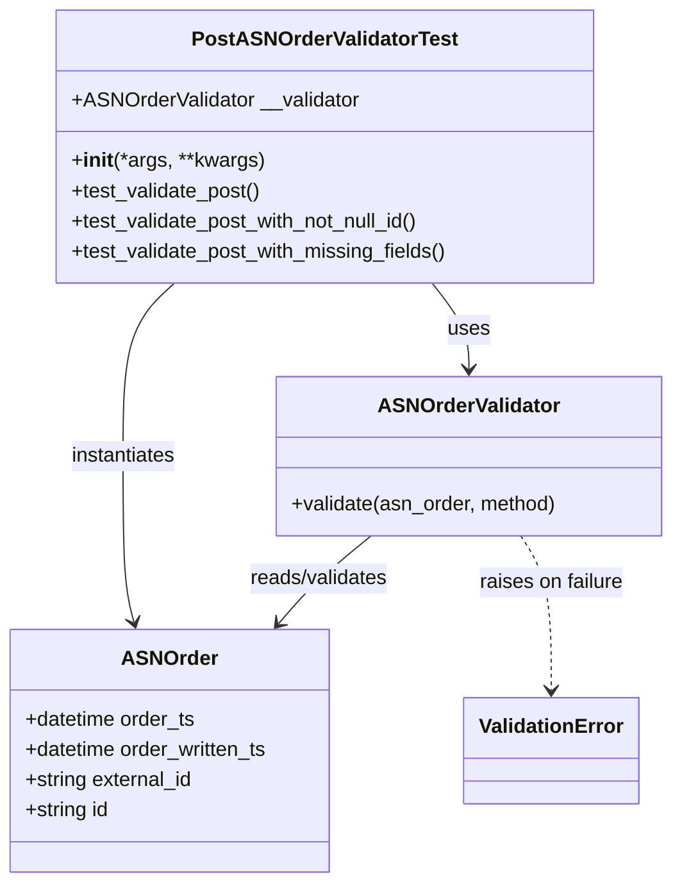

# Diagram: partview_service/partview_service/tests/unit/core/validators/asn_order/asn_order_post_validator_test.py

> Auto-generated by Obscura crawlers

## Mermaid

### SVG

<svg id="container" width="534.3203125" xmlns="http://www.w3.org/2000/svg" class="classDiagram" height="698" viewBox="0 0 534.3203125 698" role="graphics-document document" aria-roledescription="class"><g><defs><marker id="container_class-aggregationStart" class="marker aggregation class" refX="18" refY="7" markerWidth="190" markerHeight="240" orient="auto"><path d="M 18,7 L9,13 L1,7 L9,1 Z"></path></marker></defs><defs><marker id="container_class-aggregationEnd" class="marker aggregation class" refX="1" refY="7" markerWidth="20" markerHeight="28" orient="auto"><path d="M 18,7 L9,13 L1,7 L9,1 Z"></path></marker></defs><defs><marker id="container_class-extensionStart" class="marker extension class" refX="18" refY="7" markerWidth="190" markerHeight="240" orient="auto"><path d="M 1,7 L18,13 V 1 Z"></path></marker></defs><defs><marker id="container_class-extensionEnd" class="marker extension class" refX="1" refY="7" markerWidth="20" markerHeight="28" orient="auto"><path d="M 1,1 V 13 L18,7 Z"></path></marker></defs><defs><marker id="container_class-compositionStart" class="marker composition class" refX="18" refY="7" markerWidth="190" markerHeight="240" orient="auto"><path d="M 18,7 L9,13 L1,7 L9,1 Z"></path></marker></defs><defs><marker id="container_class-compositionEnd" class="marker composition class" refX="1" refY="7" markerWidth="20" markerHeight="28" orient="auto"><path d="M 18,7 L9,13 L1,7 L9,1 Z"></path></marker></defs><defs><marker id="container_class-dependencyStart" class="marker dependency class" refX="6" refY="7" markerWidth="190" markerHeight="240" orient="auto"><path d="M 5,7 L9,13 L1,7 L9,1 Z"></path></marker></defs><defs><marker id="container_class-dependencyEnd" class="marker dependency class" refX="13" refY="7" markerWidth="20" markerHeight="28" orient="auto"><path d="M 18,7 L9,13 L14,7 L9,1 Z"></path></marker></defs><defs><marker id="container_class-lollipopStart" class="marker lollipop class" refX="13" refY="7" markerWidth="190" markerHeight="240" orient="auto"><circle stroke="black" fill="transparent" cx="7" cy="7" r="6"></circle></marker></defs><defs><marker id="container_class-lollipopEnd" class="marker lollipop class" refX="1" refY="7" markerWidth="190" markerHeight="240" orient="auto"><circle stroke="black" fill="transparent" cx="7" cy="7" r="6"></circle></marker></defs><g class="root"><g class="clusters"></g><g class="edgePaths"><path d="M344.427,224L349.327,230.167C354.226,236.333,364.025,248.667,368.925,260C373.824,271.333,373.824,281.667,373.824,286.833L373.824,292" id="id_PostASNOrderValidatorTest_ASNOrderValidator_1" class="edge-thickness-normal edge-pattern-solid relation" style=";;;" data-edge="true" data-et="edge" data-id="id_PostASNOrderValidatorTest_ASNOrderValidator_1" data-points="W3sieCI6MzQ0LjQyNzA2MDg4MzYyMDcsInkiOjIyNH0seyJ4IjozNzMuODI0MjE4NzUsInkiOjI2MX0seyJ4IjozNzMuODI0MjE4NzUsInkiOjI5OH1d" marker-end="url(#container_class-dependencyEnd)"></path><path d="M138.744,224L131.899,230.167C125.055,236.333,111.365,248.667,104.52,271.5C97.676,294.333,97.676,327.667,97.676,361C97.676,394.333,97.676,427.667,99.177,449.539C100.677,471.412,103.679,481.823,105.18,487.029L106.681,492.235" id="id_PostASNOrderValidatorTest_ASNOrder_2" class="edge-thickness-normal edge-pattern-solid relation" style=";;;" data-edge="true" data-et="edge" data-id="id_PostASNOrderValidatorTest_ASNOrder_2" data-points="W3sieCI6MTM4Ljc0NDA4Njc0NTY4OTY2LCJ5IjoyMjR9LHsieCI6OTcuNjc1NzgxMjUsInkiOjI2MX0seyJ4Ijo5Ny42NzU3ODEyNSwieSI6MzYxfSx7IngiOjk3LjY3NTc4MTI1LCJ5Ijo0NjF9LHsieCI6MTA4LjM0MjgzOTUyMDY3NjY5LCJ5Ijo0OTh9XQ==" marker-end="url(#container_class-dependencyEnd)"></path><path d="M296.586,424L289.026,430.167C281.466,436.333,266.345,448.667,254.098,460.244C241.851,471.822,232.477,482.643,227.79,488.054L223.103,493.465" id="id_ASNOrderValidator_ASNOrder_3" class="edge-thickness-normal edge-pattern-solid relation" style=";;;" data-edge="true" data-et="edge" data-id="id_ASNOrderValidator_ASNOrder_3" data-points="W3sieCI6Mjk2LjU4NjQ2NDg0Mzc1LCJ5Ijo0MjR9LHsieCI6MjUxLjIyNDYwOTM3NSwieSI6NDYxfSx7IngiOjIxOS4xNzUwNzYzNjI3ODE5NywieSI6NDk4fV0=" marker-end="url(#container_class-dependencyEnd)"></path><path d="M416.305,424L420.463,430.167C424.621,436.333,432.938,448.667,437.096,469C441.254,489.333,441.254,517.667,441.254,531.833L441.254,546" id="id_ASNOrderValidator_ValidationError_4" class="edge-thickness-normal edge-pattern-dashed relation" style=";;;" data-edge="true" data-et="edge" data-id="id_ASNOrderValidator_ValidationError_4" data-points="W3sieCI6NDE2LjMwNDkyMTg3NSwieSI6NDI0fSx7IngiOjQ0MS4yNTM5MDYyNSwieSI6NDYxfSx7IngiOjQ0MS4yNTM5MDYyNSwieSI6NTUyfV0=" marker-end="url(#container_class-dependencyEnd)"></path></g><g class="edgeLabels"><g class="edgeLabel" transform="translate(373.82421875, 261)"><g class="label" data-id="id_PostASNOrderValidatorTest_ASNOrderValidator_1" transform="translate(-16.4921875, -12)"><foreignObject width="32.984375" height="24">

uses

</foreignObject></g></g><g class="edgeLabel" transform="translate(97.67578125, 361)"><g class="label" data-id="id_PostASNOrderValidatorTest_ASNOrder_2" transform="translate(-42.9140625, -12)"><foreignObject width="85.828125" height="24">

instantiates

</foreignObject></g></g><g class="edgeLabel" transform="translate(254.93927, 457.97009)"><g class="label" data-id="id_ASNOrderValidator_ASNOrder_3" transform="translate(-56.6875, -12)"><foreignObject width="113.375" height="24">

reads/validates

</foreignObject></g></g><g class="edgeLabel" transform="translate(441.25390625, 461)"><g class="label" data-id="id_ASNOrderValidator_ValidationError_4" transform="translate(-58.171875, -12)"><foreignObject width="116.34375" height="24">

raises on failure

</foreignObject></g></g></g><g class="nodes"><g class="node default" id="classId-PostASNOrderValidatorTest-0" transform="translate(258.619140625, 116)"><g class="basic label-container"><path d="M-213.0234375 -108 L213.0234375 -108 L213.0234375 108 L-213.0234375 108" stroke="none" stroke-width="0" fill="#ECECFF" style=""></path><path d="M-213.0234375 -108 C-98.70036759517052 -108, 15.622702309658962 -108, 213.0234375 -108 M-213.0234375 -108 C-105.7253602159317 -108, 1.5727170681365976 -108, 213.0234375 -108 M213.0234375 -108 C213.0234375 -37.50363176172955, 213.0234375 32.9927364765409, 213.0234375 108 M213.0234375 -108 C213.0234375 -41.58342148472737, 213.0234375 24.833157030545266, 213.0234375 108 M213.0234375 108 C126.78592834562176 108, 40.54841919124351 108, -213.0234375 108 M213.0234375 108 C108.28937677068028 108, 3.5553160413605553 108, -213.0234375 108 M-213.0234375 108 C-213.0234375 53.87489933103282, -213.0234375 -0.2502013379343566, -213.0234375 -108 M-213.0234375 108 C-213.0234375 64.37325029858964, -213.0234375 20.746500597179278, -213.0234375 -108" stroke="#9370DB" stroke-width="1.3" fill="none" stroke-dasharray="0 0" style=""></path></g><g class="annotation-group text" transform="translate(0, -84)"></g><g class="label-group text" transform="translate(-100.140625, -84)"><g class="label" style="font-weight: bolder" transform="translate(0,-12)"><foreignObject width="200.28125" height="24">

PostASNOrderValidatorTest

</foreignObject></g></g><g class="members-group text" transform="translate(-201.0234375, -36)"><g class="label" style="" transform="translate(0,-12)"><foreignObject width="228.140625" height="24">

+ASNOrderValidator __validator

</foreignObject></g></g><g class="methods-group text" transform="translate(-201.0234375, 12)"><g class="label" style="" transform="translate(0,-12)"><foreignObject width="151.8125" height="24">

+<strong>init</strong>(*args, **kwargs)

</foreignObject></g><g class="label" style="" transform="translate(0,12)"><foreignObject width="151.609375" height="24">

+test_validate_post()

</foreignObject></g><g class="label" style="" transform="translate(0,36)"><foreignObject width="282.34375" height="24">

+test_validate_post_with_not_null_id()

</foreignObject></g><g class="label" style="" transform="translate(0,60)"><foreignObject width="301.90625" height="24">

+test_validate_post_with_missing_fields()

</foreignObject></g></g><g class="divider" style=""><path d="M-213.0234375 -60 C-61.414032797332965 -60, 90.19537190533407 -60, 213.0234375 -60 M-213.0234375 -60 C-117.52403652641829 -60, -22.02463555283657 -60, 213.0234375 -60" stroke="#9370DB" stroke-width="1.3" fill="none" stroke-dasharray="0 0" style=""></path></g><g class="divider" style=""><path d="M-213.0234375 -12 C-95.57054429667842 -12, 21.88234890664316 -12, 213.0234375 -12 M-213.0234375 -12 C-98.47984982147597 -12, 16.063737857048068 -12, 213.0234375 -12" stroke="#9370DB" stroke-width="1.3" fill="none" stroke-dasharray="0 0" style=""></path></g></g><g class="node default" id="classId-ASNOrder-1" transform="translate(136.01953125, 594)"><g class="basic label-container"><path d="M-128.01953125 -96 L128.01953125 -96 L128.01953125 96 L-128.01953125 96" stroke="none" stroke-width="0" fill="#ECECFF" style=""></path><path d="M-128.01953125 -96 C-28.712928153907512 -96, 70.59367494218498 -96, 128.01953125 -96 M-128.01953125 -96 C-55.32347286617731 -96, 17.372585517645376 -96, 128.01953125 -96 M128.01953125 -96 C128.01953125 -20.16302745708863, 128.01953125 55.67394508582274, 128.01953125 96 M128.01953125 -96 C128.01953125 -34.71372126852381, 128.01953125 26.572557462952375, 128.01953125 96 M128.01953125 96 C36.334475807258514 96, -55.35057963548297 96, -128.01953125 96 M128.01953125 96 C33.352535383742804 96, -61.31446048251439 96, -128.01953125 96 M-128.01953125 96 C-128.01953125 38.49339015367077, -128.01953125 -19.013219692658467, -128.01953125 -96 M-128.01953125 96 C-128.01953125 42.84641300822963, -128.01953125 -10.307173983540736, -128.01953125 -96" stroke="#9370DB" stroke-width="1.3" fill="none" stroke-dasharray="0 0" style=""></path></g><g class="annotation-group text" transform="translate(0, -72)"></g><g class="label-group text" transform="translate(-35.5234375, -72)"><g class="label" style="font-weight: bolder" transform="translate(0,-12)"><foreignObject width="71.046875" height="24">

ASNOrder

</foreignObject></g></g><g class="members-group text" transform="translate(-116.01953125, -24)"><g class="label" style="" transform="translate(0,-12)"><foreignObject width="136.953125" height="24">

+datetime order_ts

</foreignObject></g><g class="label" style="" transform="translate(0,12)"><foreignObject width="196.515625" height="24">

+datetime order_written_ts

</foreignObject></g><g class="label" style="" transform="translate(0,36)"><foreignObject width="135.640625" height="24">

+string external_id

</foreignObject></g><g class="label" style="" transform="translate(0,60)"><foreignObject width="67.9375" height="24">

+string id

</foreignObject></g></g><g class="methods-group text" transform="translate(-116.01953125, 96)"></g><g class="divider" style=""><path d="M-128.01953125 -48 C-34.685986968690386 -48, 58.64755731261923 -48, 128.01953125 -48 M-128.01953125 -48 C-55.997146339914536 -48, 16.025238570170927 -48, 128.01953125 -48" stroke="#9370DB" stroke-width="1.3" fill="none" stroke-dasharray="0 0" style=""></path></g><g class="divider" style=""><path d="M-128.01953125 72 C-40.84384648524252 72, 46.331838279514955 72, 128.01953125 72 M-128.01953125 72 C-61.000307083834 72, 6.0189170823319955 72, 128.01953125 72" stroke="#9370DB" stroke-width="1.3" fill="none" stroke-dasharray="0 0" style=""></path></g></g><g class="node default" id="classId-ASNOrderValidator-2" transform="translate(373.82421875, 361)"><g class="basic label-container"><path d="M-152.49609375 -63 L152.49609375 -63 L152.49609375 63 L-152.49609375 63" stroke="none" stroke-width="0" fill="#ECECFF" style=""></path><path d="M-152.49609375 -63 C-83.5043297299956 -63, -14.512565709991208 -63, 152.49609375 -63 M-152.49609375 -63 C-47.84504517242432 -63, 56.80600340515136 -63, 152.49609375 -63 M152.49609375 -63 C152.49609375 -20.9968130368869, 152.49609375 21.006373926226203, 152.49609375 63 M152.49609375 -63 C152.49609375 -37.76845326254133, 152.49609375 -12.536906525082664, 152.49609375 63 M152.49609375 63 C73.40526373750652 63, -5.685566274986968 63, -152.49609375 63 M152.49609375 63 C34.18360041570695 63, -84.1288929185861 63, -152.49609375 63 M-152.49609375 63 C-152.49609375 14.869241840925312, -152.49609375 -33.261516318149376, -152.49609375 -63 M-152.49609375 63 C-152.49609375 33.978573806685354, -152.49609375 4.957147613370708, -152.49609375 -63" stroke="#9370DB" stroke-width="1.3" fill="none" stroke-dasharray="0 0" style=""></path></g><g class="annotation-group text" transform="translate(0, -39)"></g><g class="label-group text" transform="translate(-68.7109375, -39)"><g class="label" style="font-weight: bolder" transform="translate(0,-12)"><foreignObject width="137.421875" height="24">

ASNOrderValidator

</foreignObject></g></g><g class="members-group text" transform="translate(-140.49609375, 9)"></g><g class="methods-group text" transform="translate(-140.49609375, 39)"><g class="label" style="" transform="translate(0,-12)"><foreignObject width="212.28125" height="24">

+validate(asn_order, method)

</foreignObject></g></g><g class="divider" style=""><path d="M-152.49609375 -15 C-87.86285277533405 -15, -23.229611800668096 -15, 152.49609375 -15 M-152.49609375 -15 C-65.00144611579583 -15, 22.49320151840834 -15, 152.49609375 -15" stroke="#9370DB" stroke-width="1.3" fill="none" stroke-dasharray="0 0" style=""></path></g><g class="divider" style=""><path d="M-152.49609375 9 C-80.60738983070657 9, -8.718685911413132 9, 152.49609375 9 M-152.49609375 9 C-56.86000291090066 9, 38.77608792819868 9, 152.49609375 9" stroke="#9370DB" stroke-width="1.3" fill="none" stroke-dasharray="0 0" style=""></path></g></g><g class="node default" id="classId-ValidationError-3" transform="translate(441.25390625, 594)"><g class="basic label-container"><path d="M-67.1796875 -42 L67.1796875 -42 L67.1796875 42 L-67.1796875 42" stroke="none" stroke-width="0" fill="#ECECFF" style=""></path><path d="M-67.1796875 -42 C-25.555471930517776 -42, 16.06874363896445 -42, 67.1796875 -42 M-67.1796875 -42 C-19.840149902274483 -42, 27.499387695451034 -42, 67.1796875 -42 M67.1796875 -42 C67.1796875 -12.293032162080678, 67.1796875 17.413935675838644, 67.1796875 42 M67.1796875 -42 C67.1796875 -21.951839468545508, 67.1796875 -1.9036789370910157, 67.1796875 42 M67.1796875 42 C34.0913319261674 42, 1.002976352334798 42, -67.1796875 42 M67.1796875 42 C15.013604691262394 42, -37.15247811747521 42, -67.1796875 42 M-67.1796875 42 C-67.1796875 12.519788106985853, -67.1796875 -16.960423786028294, -67.1796875 -42 M-67.1796875 42 C-67.1796875 21.977290267028685, -67.1796875 1.9545805340573708, -67.1796875 -42" stroke="#9370DB" stroke-width="1.3" fill="none" stroke-dasharray="0 0" style=""></path></g><g class="annotation-group text" transform="translate(0, -18)"></g><g class="label-group text" transform="translate(-55.1796875, -18)"><g class="label" style="font-weight: bolder" transform="translate(0,-12)"><foreignObject width="110.359375" height="24">

ValidationError

</foreignObject></g></g><g class="members-group text" transform="translate(-55.1796875, 30)"></g><g class="methods-group text" transform="translate(-55.1796875, 60)"></g><g class="divider" style=""><path d="M-67.1796875 6 C-35.60298283822771 6, -4.0262781764554205 6, 67.1796875 6 M-67.1796875 6 C-38.36818433378467 6, -9.55668116756933 6, 67.1796875 6" stroke="#9370DB" stroke-width="1.3" fill="none" stroke-dasharray="0 0" style=""></path></g><g class="divider" style=""><path d="M-67.1796875 24 C-17.20512683033524 24, 32.76943383932952 24, 67.1796875 24 M-67.1796875 24 C-14.31746740309741 24, 38.54475269380518 24, 67.1796875 24" stroke="#9370DB" stroke-width="1.3" fill="none" stroke-dasharray="0 0" style=""></path></g></g></g></g></g></svg>
