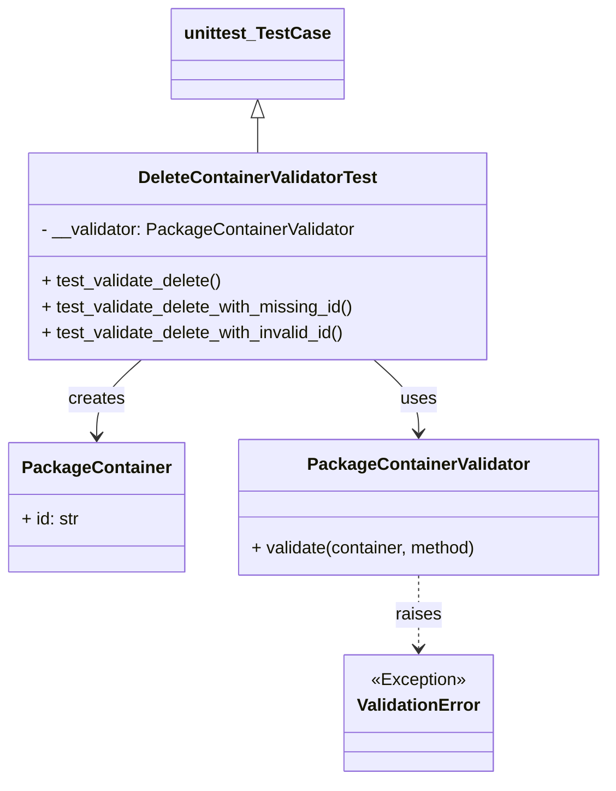

# Diagram: partview_service/partview_service/tests/unit/core/validators/package_container/container_delete_validator_test.py


> Auto-generated by Obscura crawlers

## Diagram 1



> SVG rendering failed for this diagram.

## Diagram 2

```mermaid
flowchart TD
A[Create PackageContainer id="dbb4a134-e156-4642-8ba8-f2060424f9ca"] --> B[Call PackageContainerValidator.validate(..., "DELETE")]
B --> C[No exception — test_validate_delete passes]
D[Create PackageContainer id=null] --> E[Call PackageContainerValidator.validate(..., "DELETE")]
E --> F[ValidationError raised — test_validate_delete_with_missing_id passes]
G[Create PackageContainer id="aaa"] --> H[Call PackageContainerValidator.validate(..., "DELETE")]
H --> I[ValidationError raised — test_validate_delete_with_invalid_id passes]
```

> SVG rendering failed for this diagram.
