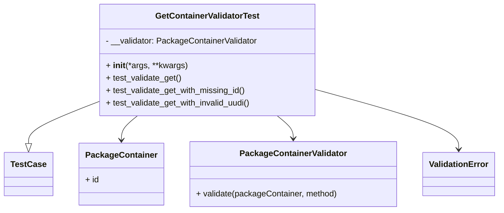
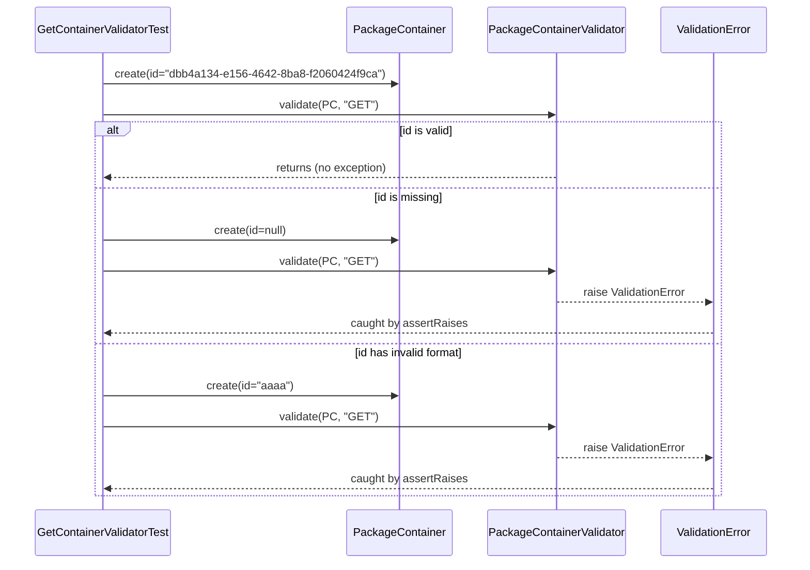

# Diagram: partview_service/partview_service/tests/unit/core/validators/package_container/container_get_validator_test.py

> Auto-generated by Obscura crawlers

## Diagram 1

### SVG

<svg id="container" width="939.8828125" xmlns="http://www.w3.org/2000/svg" class="classDiagram" height="408" viewBox="0 0 939.8828125 408" role="graphics-document document" aria-roledescription="class"><g><defs><marker id="container_class-aggregationStart" class="marker aggregation class" refX="18" refY="7" markerWidth="190" markerHeight="240" orient="auto"><path d="M 18,7 L9,13 L1,7 L9,1 Z"></path></marker></defs><defs><marker id="container_class-aggregationEnd" class="marker aggregation class" refX="1" refY="7" markerWidth="20" markerHeight="28" orient="auto"><path d="M 18,7 L9,13 L1,7 L9,1 Z"></path></marker></defs><defs><marker id="container_class-extensionStart" class="marker extension class" refX="18" refY="7" markerWidth="190" markerHeight="240" orient="auto"><path d="M 1,7 L18,13 V 1 Z"></path></marker></defs><defs><marker id="container_class-extensionEnd" class="marker extension class" refX="1" refY="7" markerWidth="20" markerHeight="28" orient="auto"><path d="M 1,1 V 13 L18,7 Z"></path></marker></defs><defs><marker id="container_class-compositionStart" class="marker composition class" refX="18" refY="7" markerWidth="190" markerHeight="240" orient="auto"><path d="M 18,7 L9,13 L1,7 L9,1 Z"></path></marker></defs><defs><marker id="container_class-compositionEnd" class="marker composition class" refX="1" refY="7" markerWidth="20" markerHeight="28" orient="auto"><path d="M 18,7 L9,13 L1,7 L9,1 Z"></path></marker></defs><defs><marker id="container_class-dependencyStart" class="marker dependency class" refX="6" refY="7" markerWidth="190" markerHeight="240" orient="auto"><path d="M 5,7 L9,13 L1,7 L9,1 Z"></path></marker></defs><defs><marker id="container_class-dependencyEnd" class="marker dependency class" refX="13" refY="7" markerWidth="20" markerHeight="28" orient="auto"><path d="M 18,7 L9,13 L14,7 L9,1 Z"></path></marker></defs><defs><marker id="container_class-lollipopStart" class="marker lollipop class" refX="13" refY="7" markerWidth="190" markerHeight="240" orient="auto"><circle stroke="black" fill="transparent" cx="7" cy="7" r="6"></circle></marker></defs><defs><marker id="container_class-lollipopEnd" class="marker lollipop class" refX="1" refY="7" markerWidth="190" markerHeight="240" orient="auto"><circle stroke="black" fill="transparent" cx="7" cy="7" r="6"></circle></marker></defs><g class="root"><g class="clusters"></g><g class="edgePaths"><path d="M179.764,198.345L158.53,206.788C137.296,215.23,94.827,232.115,73.593,245.349C52.359,258.583,52.359,268.167,52.359,272.958L52.359,277.75" id="id_GetContainerValidatorTest_TestCase_1" class="edge-thickness-normal edge-pattern-solid relation" style=";;;" data-edge="true" data-et="edge" data-id="id_GetContainerValidatorTest_TestCase_1" data-points="W3sieCI6MTc5Ljc2MzY3MTg3NSwieSI6MTk4LjM0NTA1NTQ5Njg0NDE3fSx7IngiOjUyLjM1OTM3NSwieSI6MjQ5fSx7IngiOjUyLjM1OTM3NSwieSI6Mjk1fV0=" marker-end="url(#container_class-extensionEnd)"></path><path d="M254.755,224L249.658,228.167C244.56,232.333,234.366,240.667,229.269,248.5C224.172,256.333,224.172,263.667,224.172,267.333L224.172,271" id="id_GetContainerValidatorTest_PackageContainer_2" class="edge-thickness-normal edge-pattern-solid relation" style=";;;" data-edge="true" data-et="edge" data-id="id_GetContainerValidatorTest_PackageContainer_2" data-points="W3sieCI6MjU0Ljc1NDgwMjA0NDE3MjkyLCJ5IjoyMjR9LHsieCI6MjI0LjE3MTg3NSwieSI6MjQ5fSx7IngiOjIyNC4xNzE4NzUsInkiOjI3N31d" marker-end="url(#container_class-dependencyEnd)"></path><path d="M518.991,224L524.088,228.167C529.186,232.333,539.38,240.667,544.477,248C549.574,255.333,549.574,261.667,549.574,264.833L549.574,268" id="id_GetContainerValidatorTest_PackageContainerValidator_3" class="edge-thickness-normal edge-pattern-solid relation" style=";;;" data-edge="true" data-et="edge" data-id="id_GetContainerValidatorTest_PackageContainerValidator_3" data-points="W3sieCI6NTE4Ljk5MTI5MTcwNTgyNywieSI6MjI0fSx7IngiOjU0OS41NzQyMTg3NSwieSI6MjQ5fSx7IngiOjU0OS41NzQyMTg3NSwieSI6Mjc0fV0=" marker-end="url(#container_class-dependencyEnd)"></path><path d="M593.982,173.647L639.103,186.206C684.223,198.765,774.463,223.882,819.583,243.108C864.703,262.333,864.703,275.667,864.703,282.333L864.703,289" id="id_GetContainerValidatorTest_ValidationError_4" class="edge-thickness-normal edge-pattern-solid relation" style=";;;" data-edge="true" data-et="edge" data-id="id_GetContainerValidatorTest_ValidationError_4" data-points="W3sieCI6NTkzLjk4MjQyMTg3NSwieSI6MTczLjY0NzE1OTgwODU0MjAzfSx7IngiOjg2NC43MDMxMjUsInkiOjI0OX0seyJ4Ijo4NjQuNzAzMTI1LCJ5IjoyOTV9XQ==" marker-end="url(#container_class-dependencyEnd)"></path></g><g class="edgeLabels"><g class="edgeLabel"><g class="label" data-id="id_GetContainerValidatorTest_TestCase_1" transform="translate(0, 0)"><foreignObject width="0" height="0">

</foreignObject></g></g><g class="edgeLabel"><g class="label" data-id="id_GetContainerValidatorTest_PackageContainer_2" transform="translate(0, 0)"><foreignObject width="0" height="0">

</foreignObject></g></g><g class="edgeLabel"><g class="label" data-id="id_GetContainerValidatorTest_PackageContainerValidator_3" transform="translate(0, 0)"><foreignObject width="0" height="0">

</foreignObject></g></g><g class="edgeLabel"><g class="label" data-id="id_GetContainerValidatorTest_ValidationError_4" transform="translate(0, 0)"><foreignObject width="0" height="0">

</foreignObject></g></g></g><g class="nodes"><g class="node default" id="classId-GetContainerValidatorTest-0" transform="translate(386.873046875, 116)"><g class="basic label-container"><path d="M-207.109375 -108 L207.109375 -108 L207.109375 108 L-207.109375 108" stroke="none" stroke-width="0" fill="#ECECFF" style=""></path><path d="M-207.109375 -108 C-91.75515792232369 -108, 23.59905915535262 -108, 207.109375 -108 M-207.109375 -108 C-91.63529200832504 -108, 23.838790983349924 -108, 207.109375 -108 M207.109375 -108 C207.109375 -48.13117855949031, 207.109375 11.737642881019383, 207.109375 108 M207.109375 -108 C207.109375 -60.66005965535624, 207.109375 -13.320119310712485, 207.109375 108 M207.109375 108 C67.95262202526999 108, -71.20413094946002 108, -207.109375 108 M207.109375 108 C45.598069085284834 108, -115.91323682943033 108, -207.109375 108 M-207.109375 108 C-207.109375 34.17019610234368, -207.109375 -39.65960779531264, -207.109375 -108 M-207.109375 108 C-207.109375 35.254446870112986, -207.109375 -37.49110625977403, -207.109375 -108" stroke="#9370DB" stroke-width="1.3" fill="none" stroke-dasharray="0 0" style=""></path></g><g class="annotation-group text" transform="translate(0, -84)"></g><g class="label-group text" transform="translate(-96.703125, -84)"><g class="label" style="font-weight: bolder" transform="translate(0,-12)"><foreignObject width="193.40625" height="24">

GetContainerValidatorTest

</foreignObject></g></g><g class="members-group text" transform="translate(-195.109375, -36)"><g class="label" style="" transform="translate(0,-12)"><foreignObject width="293.515625" height="24">

- __validator: PackageContainerValidator

</foreignObject></g></g><g class="methods-group text" transform="translate(-195.109375, 12)"><g class="label" style="" transform="translate(0,-12)"><foreignObject width="156.0625" height="24">

+ <strong>init</strong>(*args, **kwargs)

</foreignObject></g><g class="label" style="" transform="translate(0,12)"><foreignObject width="146.53125" height="24">

+ test_validate_get()

</foreignObject></g><g class="label" style="" transform="translate(0,36)"><foreignObject width="271.671875" height="24">

+ test_validate_get_with_missing_id()

</foreignObject></g><g class="label" style="" transform="translate(0,60)"><foreignObject width="283.40625" height="24">

+ test_validate_get_with_invalid_uudi()

</foreignObject></g></g><g class="divider" style=""><path d="M-207.109375 -60 C-66.19210736782492 -60, 74.72516026435017 -60, 207.109375 -60 M-207.109375 -60 C-66.78466104005292 -60, 73.54005291989415 -60, 207.109375 -60" stroke="#9370DB" stroke-width="1.3" fill="none" stroke-dasharray="0 0" style=""></path></g><g class="divider" style=""><path d="M-207.109375 -12 C-105.34564261607188 -12, -3.5819102321437697 -12, 207.109375 -12 M-207.109375 -12 C-65.86587620970832 -12, 75.37762258058336 -12, 207.109375 -12" stroke="#9370DB" stroke-width="1.3" fill="none" stroke-dasharray="0 0" style=""></path></g></g><g class="node default" id="classId-PackageContainer-1" transform="translate(224.171875, 337)"><g class="basic label-container"><path d="M-77.453125 -60 L77.453125 -60 L77.453125 60 L-77.453125 60" stroke="none" stroke-width="0" fill="#ECECFF" style=""></path><path d="M-77.453125 -60 C-18.584809489011306 -60, 40.28350602197739 -60, 77.453125 -60 M-77.453125 -60 C-37.392491419552385 -60, 2.668142160895229 -60, 77.453125 -60 M77.453125 -60 C77.453125 -17.30146177324343, 77.453125 25.397076453513137, 77.453125 60 M77.453125 -60 C77.453125 -23.317829769770796, 77.453125 13.364340460458408, 77.453125 60 M77.453125 60 C31.76852436013351 60, -13.916076279732977 60, -77.453125 60 M77.453125 60 C36.498101012404796 60, -4.456922975190409 60, -77.453125 60 M-77.453125 60 C-77.453125 13.809227406973449, -77.453125 -32.3815451860531, -77.453125 -60 M-77.453125 60 C-77.453125 27.92763908978567, -77.453125 -4.144721820428657, -77.453125 -60" stroke="#9370DB" stroke-width="1.3" fill="none" stroke-dasharray="0 0" style=""></path></g><g class="annotation-group text" transform="translate(0, -36)"></g><g class="label-group text" transform="translate(-65.453125, -36)"><g class="label" style="font-weight: bolder" transform="translate(0,-12)"><foreignObject width="130.90625" height="24">

PackageContainer

</foreignObject></g></g><g class="members-group text" transform="translate(-65.453125, 12)"><g class="label" style="" transform="translate(0,-12)"><foreignObject width="26.3125" height="24">

+ id

</foreignObject></g></g><g class="methods-group text" transform="translate(-65.453125, 60)"></g><g class="divider" style=""><path d="M-77.453125 -12 C-25.126614108015573 -12, 27.199896783968853 -12, 77.453125 -12 M-77.453125 -12 C-29.756294427573195 -12, 17.94053614485361 -12, 77.453125 -12" stroke="#9370DB" stroke-width="1.3" fill="none" stroke-dasharray="0 0" style=""></path></g><g class="divider" style=""><path d="M-77.453125 36 C-46.25197219998377 36, -15.050819399967537 36, 77.453125 36 M-77.453125 36 C-42.76778105083519 36, -8.08243710167038 36, 77.453125 36" stroke="#9370DB" stroke-width="1.3" fill="none" stroke-dasharray="0 0" style=""></path></g></g><g class="node default" id="classId-PackageContainerValidator-2" transform="translate(549.57421875, 337)"><g class="basic label-container"><path d="M-197.94921875 -63 L197.94921875 -63 L197.94921875 63 L-197.94921875 63" stroke="none" stroke-width="0" fill="#ECECFF" style=""></path><path d="M-197.94921875 -63 C-108.2452142447943 -63, -18.541209739588595 -63, 197.94921875 -63 M-197.94921875 -63 C-102.62313934971334 -63, -7.297059949426682 -63, 197.94921875 -63 M197.94921875 -63 C197.94921875 -13.388499389284007, 197.94921875 36.223001221431986, 197.94921875 63 M197.94921875 -63 C197.94921875 -17.939627660569947, 197.94921875 27.120744678860106, 197.94921875 63 M197.94921875 63 C56.38925771122925 63, -85.1707033275415 63, -197.94921875 63 M197.94921875 63 C76.8810946733712 63, -44.18702940325761 63, -197.94921875 63 M-197.94921875 63 C-197.94921875 31.06409645029044, -197.94921875 -0.8718070994191223, -197.94921875 -63 M-197.94921875 63 C-197.94921875 15.924640284350382, -197.94921875 -31.150719431299237, -197.94921875 -63" stroke="#9370DB" stroke-width="1.3" fill="none" stroke-dasharray="0 0" style=""></path></g><g class="annotation-group text" transform="translate(0, -39)"></g><g class="label-group text" transform="translate(-98.6328125, -39)"><g class="label" style="font-weight: bolder" transform="translate(0,-12)"><foreignObject width="197.265625" height="24">

PackageContainerValidator

</foreignObject></g></g><g class="members-group text" transform="translate(-185.94921875, 9)"></g><g class="methods-group text" transform="translate(-185.94921875, 39)"><g class="label" style="" transform="translate(0,-12)"><foreignObject width="273.265625" height="24">

+ validate(packageContainer, method)

</foreignObject></g></g><g class="divider" style=""><path d="M-197.94921875 -15 C-84.28244376903072 -15, 29.38433121193856 -15, 197.94921875 -15 M-197.94921875 -15 C-56.07962342024993 -15, 85.78997190950014 -15, 197.94921875 -15" stroke="#9370DB" stroke-width="1.3" fill="none" stroke-dasharray="0 0" style=""></path></g><g class="divider" style=""><path d="M-197.94921875 9 C-63.166396200282236 9, 71.61642634943553 9, 197.94921875 9 M-197.94921875 9 C-95.36738396228742 9, 7.2144508254251605 9, 197.94921875 9" stroke="#9370DB" stroke-width="1.3" fill="none" stroke-dasharray="0 0" style=""></path></g></g><g class="node default" id="classId-ValidationError-3" transform="translate(864.703125, 337)"><g class="basic label-container"><path d="M-67.1796875 -42 L67.1796875 -42 L67.1796875 42 L-67.1796875 42" stroke="none" stroke-width="0" fill="#ECECFF" style=""></path><path d="M-67.1796875 -42 C-18.31972613363591 -42, 30.54023523272818 -42, 67.1796875 -42 M-67.1796875 -42 C-14.278647174255681 -42, 38.62239315148864 -42, 67.1796875 -42 M67.1796875 -42 C67.1796875 -10.296040736968703, 67.1796875 21.407918526062595, 67.1796875 42 M67.1796875 -42 C67.1796875 -14.360442000831636, 67.1796875 13.279115998336728, 67.1796875 42 M67.1796875 42 C26.58399290774984 42, -14.011701684500323 42, -67.1796875 42 M67.1796875 42 C37.39488997444027 42, 7.610092448880536 42, -67.1796875 42 M-67.1796875 42 C-67.1796875 21.3434569089967, -67.1796875 0.6869138179933998, -67.1796875 -42 M-67.1796875 42 C-67.1796875 21.65443355091463, -67.1796875 1.3088671018292573, -67.1796875 -42" stroke="#9370DB" stroke-width="1.3" fill="none" stroke-dasharray="0 0" style=""></path></g><g class="annotation-group text" transform="translate(0, -18)"></g><g class="label-group text" transform="translate(-55.1796875, -18)"><g class="label" style="font-weight: bolder" transform="translate(0,-12)"><foreignObject width="110.359375" height="24">

ValidationError

</foreignObject></g></g><g class="members-group text" transform="translate(-55.1796875, 30)"></g><g class="methods-group text" transform="translate(-55.1796875, 60)"></g><g class="divider" style=""><path d="M-67.1796875 6 C-36.32716097230479 6, -5.474634444609578 6, 67.1796875 6 M-67.1796875 6 C-22.509887509295623 6, 22.159912481408753 6, 67.1796875 6" stroke="#9370DB" stroke-width="1.3" fill="none" stroke-dasharray="0 0" style=""></path></g><g class="divider" style=""><path d="M-67.1796875 24 C-30.84026503591671 24, 5.499157428166583 24, 67.1796875 24 M-67.1796875 24 C-18.84263947116331 24, 29.49440855767338 24, 67.1796875 24" stroke="#9370DB" stroke-width="1.3" fill="none" stroke-dasharray="0 0" style=""></path></g></g><g class="node default" id="classId-TestCase-4" transform="translate(52.359375, 337)"><g class="basic label-container"><path d="M-44.359375 -42 L44.359375 -42 L44.359375 42 L-44.359375 42" stroke="none" stroke-width="0" fill="#ECECFF" style=""></path><path d="M-44.359375 -42 C-26.25679519912934 -42, -8.154215398258678 -42, 44.359375 -42 M-44.359375 -42 C-15.992018027107719 -42, 12.375338945784563 -42, 44.359375 -42 M44.359375 -42 C44.359375 -8.616342709750171, 44.359375 24.767314580499658, 44.359375 42 M44.359375 -42 C44.359375 -23.338728571379402, 44.359375 -4.677457142758804, 44.359375 42 M44.359375 42 C16.07533358808754 42, -12.208707823824923 42, -44.359375 42 M44.359375 42 C21.200177521262777 42, -1.959019957474446 42, -44.359375 42 M-44.359375 42 C-44.359375 22.367160262294913, -44.359375 2.734320524589826, -44.359375 -42 M-44.359375 42 C-44.359375 9.83414286289586, -44.359375 -22.33171427420828, -44.359375 -42" stroke="#9370DB" stroke-width="1.3" fill="none" stroke-dasharray="0 0" style=""></path></g><g class="annotation-group text" transform="translate(0, -18)"></g><g class="label-group text" transform="translate(-32.359375, -18)"><g class="label" style="font-weight: bolder" transform="translate(0,-12)"><foreignObject width="64.71875" height="24">

TestCase

</foreignObject></g></g><g class="members-group text" transform="translate(-32.359375, 30)"></g><g class="methods-group text" transform="translate(-32.359375, 60)"></g><g class="divider" style=""><path d="M-44.359375 6 C-17.271927364208402 6, 9.815520271583196 6, 44.359375 6 M-44.359375 6 C-18.69595648441289 6, 6.967462031174222 6, 44.359375 6" stroke="#9370DB" stroke-width="1.3" fill="none" stroke-dasharray="0 0" style=""></path></g><g class="divider" style=""><path d="M-44.359375 24 C-18.66718883710502 24, 7.024997325789961 24, 44.359375 24 M-44.359375 24 C-25.3396542286301 24, -6.319933457260198 24, 44.359375 24" stroke="#9370DB" stroke-width="1.3" fill="none" stroke-dasharray="0 0" style=""></path></g></g></g></g></g></svg>

## Diagram 2

### SVG

<svg id="container" width="1193" xmlns="http://www.w3.org/2000/svg" height="844" viewBox="-50 -10 1193 844" role="graphics-document document" aria-roledescription="sequence"><g><rect x="943" y="758" fill="#eaeaea" stroke="#666" width="150" height="65" name="E" rx="3" ry="3" class="actor actor-bottom"></rect><text x="1018" y="790.5" dominant-baseline="central" alignment-baseline="central" class="actor actor-box" style="text-anchor: middle; font-size: 16px; font-weight: 400;"><tspan x="1018" dy="0">ValidationError</tspan></text></g><g><rect x="678" y="758" fill="#eaeaea" stroke="#666" width="215" height="65" name="V" rx="3" ry="3" class="actor actor-bottom"></rect><text x="785.5" y="790.5" dominant-baseline="central" alignment-baseline="central" class="actor actor-box" style="text-anchor: middle; font-size: 16px; font-weight: 400;"><tspan x="785.5" dy="0">PackageContainerValidator</tspan></text></g><g><rect x="478" y="758" fill="#eaeaea" stroke="#666" width="150" height="65" name="PC" rx="3" ry="3" class="actor actor-bottom"></rect><text x="553" y="790.5" dominant-baseline="central" alignment-baseline="central" class="actor actor-box" style="text-anchor: middle; font-size: 16px; font-weight: 400;"><tspan x="553" dy="0">PackageContainer</tspan></text></g><g><rect x="0" y="758" fill="#eaeaea" stroke="#666" width="210" height="65" name="Test" rx="3" ry="3" class="actor actor-bottom"></rect><text x="105" y="790.5" dominant-baseline="central" alignment-baseline="central" class="actor actor-box" style="text-anchor: middle; font-size: 16px; font-weight: 400;"><tspan x="105" dy="0">GetContainerValidatorTest</tspan></text></g><g><line id="actor3" x1="1018" y1="65" x2="1018" y2="758" class="actor-line 200" stroke-width="0.5px" stroke="#999" name="E"></line><g id="root-3"><rect x="943" y="0" fill="#eaeaea" stroke="#666" width="150" height="65" name="E" rx="3" ry="3" class="actor actor-top"></rect><text x="1018" y="32.5" dominant-baseline="central" alignment-baseline="central" class="actor actor-box" style="text-anchor: middle; font-size: 16px; font-weight: 400;"><tspan x="1018" dy="0">ValidationError</tspan></text></g></g><g><line id="actor2" x1="785.5" y1="65" x2="785.5" y2="758" class="actor-line 200" stroke-width="0.5px" stroke="#999" name="V"></line><g id="root-2"><rect x="678" y="0" fill="#eaeaea" stroke="#666" width="215" height="65" name="V" rx="3" ry="3" class="actor actor-top"></rect><text x="785.5" y="32.5" dominant-baseline="central" alignment-baseline="central" class="actor actor-box" style="text-anchor: middle; font-size: 16px; font-weight: 400;"><tspan x="785.5" dy="0">PackageContainerValidator</tspan></text></g></g><g><line id="actor1" x1="553" y1="65" x2="553" y2="758" class="actor-line 200" stroke-width="0.5px" stroke="#999" name="PC"></line><g id="root-1"><rect x="478" y="0" fill="#eaeaea" stroke="#666" width="150" height="65" name="PC" rx="3" ry="3" class="actor actor-top"></rect><text x="553" y="32.5" dominant-baseline="central" alignment-baseline="central" class="actor actor-box" style="text-anchor: middle; font-size: 16px; font-weight: 400;"><tspan x="553" dy="0">PackageContainer</tspan></text></g></g><g><line id="actor0" x1="105" y1="65" x2="105" y2="758" class="actor-line 200" stroke-width="0.5px" stroke="#999" name="Test"></line><g id="root-0"><rect x="0" y="0" fill="#eaeaea" stroke="#666" width="210" height="65" name="Test" rx="3" ry="3" class="actor actor-top"></rect><text x="105" y="32.5" dominant-baseline="central" alignment-baseline="central" class="actor actor-box" style="text-anchor: middle; font-size: 16px; font-weight: 400;"><tspan x="105" dy="0">GetContainerValidatorTest</tspan></text></g></g><g></g><defs><symbol id="computer" width="24" height="24"><path transform="scale(.5)" d="M2 2v13h20v-13h-20zm18 11h-16v-9h16v9zm-10.228 6l.466-1h3.524l.467 1h-4.457zm14.228 3h-24l2-6h2.104l-1.33 4h18.45l-1.297-4h2.073l2 6zm-5-10h-14v-7h14v7z"></path></symbol></defs><defs><symbol id="database" fill-rule="evenodd" clip-rule="evenodd"><path transform="scale(.5)" d="M12.258.001l.256.004.255.005.253.008.251.01.249.012.247.015.246.016.242.019.241.02.239.023.236.024.233.027.231.028.229.031.225.032.223.034.22.036.217.038.214.04.211.041.208.043.205.045.201.046.198.048.194.05.191.051.187.053.183.054.18.056.175.057.172.059.168.06.163.061.16.063.155.064.15.066.074.033.073.033.071.034.07.034.069.035.068.035.067.035.066.035.064.036.064.036.062.036.06.036.06.037.058.037.058.037.055.038.055.038.053.038.052.038.051.039.05.039.048.039.047.039.045.04.044.04.043.04.041.04.04.041.039.041.037.041.036.041.034.041.033.042.032.042.03.042.029.042.027.042.026.043.024.043.023.043.021.043.02.043.018.044.017.043.015.044.013.044.012.044.011.045.009.044.007.045.006.045.004.045.002.045.001.045v17l-.001.045-.002.045-.004.045-.006.045-.007.045-.009.044-.011.045-.012.044-.013.044-.015.044-.017.043-.018.044-.02.043-.021.043-.023.043-.024.043-.026.043-.027.042-.029.042-.03.042-.032.042-.033.042-.034.041-.036.041-.037.041-.039.041-.04.041-.041.04-.043.04-.044.04-.045.04-.047.039-.048.039-.05.039-.051.039-.052.038-.053.038-.055.038-.055.038-.058.037-.058.037-.06.037-.06.036-.062.036-.064.036-.064.036-.066.035-.067.035-.068.035-.069.035-.07.034-.071.034-.073.033-.074.033-.15.066-.155.064-.16.063-.163.061-.168.06-.172.059-.175.057-.18.056-.183.054-.187.053-.191.051-.194.05-.198.048-.201.046-.205.045-.208.043-.211.041-.214.04-.217.038-.22.036-.223.034-.225.032-.229.031-.231.028-.233.027-.236.024-.239.023-.241.02-.242.019-.246.016-.247.015-.249.012-.251.01-.253.008-.255.005-.256.004-.258.001-.258-.001-.256-.004-.255-.005-.253-.008-.251-.01-.249-.012-.247-.015-.245-.016-.243-.019-.241-.02-.238-.023-.236-.024-.234-.027-.231-.028-.228-.031-.226-.032-.223-.034-.22-.036-.217-.038-.214-.04-.211-.041-.208-.043-.204-.045-.201-.046-.198-.048-.195-.05-.19-.051-.187-.053-.184-.054-.179-.056-.176-.057-.172-.059-.167-.06-.164-.061-.159-.063-.155-.064-.151-.066-.074-.033-.072-.033-.072-.034-.07-.034-.069-.035-.068-.035-.067-.035-.066-.035-.064-.036-.063-.036-.062-.036-.061-.036-.06-.037-.058-.037-.057-.037-.056-.038-.055-.038-.053-.038-.052-.038-.051-.039-.049-.039-.049-.039-.046-.039-.046-.04-.044-.04-.043-.04-.041-.04-.04-.041-.039-.041-.037-.041-.036-.041-.034-.041-.033-.042-.032-.042-.03-.042-.029-.042-.027-.042-.026-.043-.024-.043-.023-.043-.021-.043-.02-.043-.018-.044-.017-.043-.015-.044-.013-.044-.012-.044-.011-.045-.009-.044-.007-.045-.006-.045-.004-.045-.002-.045-.001-.045v-17l.001-.045.002-.045.004-.045.006-.045.007-.045.009-.044.011-.045.012-.044.013-.044.015-.044.017-.043.018-.044.02-.043.021-.043.023-.043.024-.043.026-.043.027-.042.029-.042.03-.042.032-.042.033-.042.034-.041.036-.041.037-.041.039-.041.04-.041.041-.04.043-.04.044-.04.046-.04.046-.039.049-.039.049-.039.051-.039.052-.038.053-.038.055-.038.056-.038.057-.037.058-.037.06-.037.061-.036.062-.036.063-.036.064-.036.066-.035.067-.035.068-.035.069-.035.07-.034.072-.034.072-.033.074-.033.151-.066.155-.064.159-.063.164-.061.167-.06.172-.059.176-.057.179-.056.184-.054.187-.053.19-.051.195-.05.198-.048.201-.046.204-.045.208-.043.211-.041.214-.04.217-.038.22-.036.223-.034.226-.032.228-.031.231-.028.234-.027.236-.024.238-.023.241-.02.243-.019.245-.016.247-.015.249-.012.251-.01.253-.008.255-.005.256-.004.258-.001.258.001zm-9.258 20.499v.01l.001.021.003.021.004.022.005.021.006.022.007.022.009.023.01.022.011.023.012.023.013.023.015.023.016.024.017.023.018.024.019.024.021.024.022.025.023.024.024.025.052.049.056.05.061.051.066.051.07.051.075.051.079.052.084.052.088.052.092.052.097.052.102.051.105.052.11.052.114.051.119.051.123.051.127.05.131.05.135.05.139.048.144.049.147.047.152.047.155.047.16.045.163.045.167.043.171.043.176.041.178.041.183.039.187.039.19.037.194.035.197.035.202.033.204.031.209.03.212.029.216.027.219.025.222.024.226.021.23.02.233.018.236.016.24.015.243.012.246.01.249.008.253.005.256.004.259.001.26-.001.257-.004.254-.005.25-.008.247-.011.244-.012.241-.014.237-.016.233-.018.231-.021.226-.021.224-.024.22-.026.216-.027.212-.028.21-.031.205-.031.202-.034.198-.034.194-.036.191-.037.187-.039.183-.04.179-.04.175-.042.172-.043.168-.044.163-.045.16-.046.155-.046.152-.047.148-.048.143-.049.139-.049.136-.05.131-.05.126-.05.123-.051.118-.052.114-.051.11-.052.106-.052.101-.052.096-.052.092-.052.088-.053.083-.051.079-.052.074-.052.07-.051.065-.051.06-.051.056-.05.051-.05.023-.024.023-.025.021-.024.02-.024.019-.024.018-.024.017-.024.015-.023.014-.024.013-.023.012-.023.01-.023.01-.022.008-.022.006-.022.006-.022.004-.022.004-.021.001-.021.001-.021v-4.127l-.077.055-.08.053-.083.054-.085.053-.087.052-.09.052-.093.051-.095.05-.097.05-.1.049-.102.049-.105.048-.106.047-.109.047-.111.046-.114.045-.115.045-.118.044-.12.043-.122.042-.124.042-.126.041-.128.04-.13.04-.132.038-.134.038-.135.037-.138.037-.139.035-.142.035-.143.034-.144.033-.147.032-.148.031-.15.03-.151.03-.153.029-.154.027-.156.027-.158.026-.159.025-.161.024-.162.023-.163.022-.165.021-.166.02-.167.019-.169.018-.169.017-.171.016-.173.015-.173.014-.175.013-.175.012-.177.011-.178.01-.179.008-.179.008-.181.006-.182.005-.182.004-.184.003-.184.002h-.37l-.184-.002-.184-.003-.182-.004-.182-.005-.181-.006-.179-.008-.179-.008-.178-.01-.176-.011-.176-.012-.175-.013-.173-.014-.172-.015-.171-.016-.17-.017-.169-.018-.167-.019-.166-.02-.165-.021-.163-.022-.162-.023-.161-.024-.159-.025-.157-.026-.156-.027-.155-.027-.153-.029-.151-.03-.15-.03-.148-.031-.146-.032-.145-.033-.143-.034-.141-.035-.14-.035-.137-.037-.136-.037-.134-.038-.132-.038-.13-.04-.128-.04-.126-.041-.124-.042-.122-.042-.12-.044-.117-.043-.116-.045-.113-.045-.112-.046-.109-.047-.106-.047-.105-.048-.102-.049-.1-.049-.097-.05-.095-.05-.093-.052-.09-.051-.087-.052-.085-.053-.083-.054-.08-.054-.077-.054v4.127zm0-5.654v.011l.001.021.003.021.004.021.005.022.006.022.007.022.009.022.01.022.011.023.012.023.013.023.015.024.016.023.017.024.018.024.019.024.021.024.022.024.023.025.024.024.052.05.056.05.061.05.066.051.07.051.075.052.079.051.084.052.088.052.092.052.097.052.102.052.105.052.11.051.114.051.119.052.123.05.127.051.131.05.135.049.139.049.144.048.147.048.152.047.155.046.16.045.163.045.167.044.171.042.176.042.178.04.183.04.187.038.19.037.194.036.197.034.202.033.204.032.209.03.212.028.216.027.219.025.222.024.226.022.23.02.233.018.236.016.24.014.243.012.246.01.249.008.253.006.256.003.259.001.26-.001.257-.003.254-.006.25-.008.247-.01.244-.012.241-.015.237-.016.233-.018.231-.02.226-.022.224-.024.22-.025.216-.027.212-.029.21-.03.205-.032.202-.033.198-.035.194-.036.191-.037.187-.039.183-.039.179-.041.175-.042.172-.043.168-.044.163-.045.16-.045.155-.047.152-.047.148-.048.143-.048.139-.05.136-.049.131-.05.126-.051.123-.051.118-.051.114-.052.11-.052.106-.052.101-.052.096-.052.092-.052.088-.052.083-.052.079-.052.074-.051.07-.052.065-.051.06-.05.056-.051.051-.049.023-.025.023-.024.021-.025.02-.024.019-.024.018-.024.017-.024.015-.023.014-.023.013-.024.012-.022.01-.023.01-.023.008-.022.006-.022.006-.022.004-.021.004-.022.001-.021.001-.021v-4.139l-.077.054-.08.054-.083.054-.085.052-.087.053-.09.051-.093.051-.095.051-.097.05-.1.049-.102.049-.105.048-.106.047-.109.047-.111.046-.114.045-.115.044-.118.044-.12.044-.122.042-.124.042-.126.041-.128.04-.13.039-.132.039-.134.038-.135.037-.138.036-.139.036-.142.035-.143.033-.144.033-.147.033-.148.031-.15.03-.151.03-.153.028-.154.028-.156.027-.158.026-.159.025-.161.024-.162.023-.163.022-.165.021-.166.02-.167.019-.169.018-.169.017-.171.016-.173.015-.173.014-.175.013-.175.012-.177.011-.178.009-.179.009-.179.007-.181.007-.182.005-.182.004-.184.003-.184.002h-.37l-.184-.002-.184-.003-.182-.004-.182-.005-.181-.007-.179-.007-.179-.009-.178-.009-.176-.011-.176-.012-.175-.013-.173-.014-.172-.015-.171-.016-.17-.017-.169-.018-.167-.019-.166-.02-.165-.021-.163-.022-.162-.023-.161-.024-.159-.025-.157-.026-.156-.027-.155-.028-.153-.028-.151-.03-.15-.03-.148-.031-.146-.033-.145-.033-.143-.033-.141-.035-.14-.036-.137-.036-.136-.037-.134-.038-.132-.039-.13-.039-.128-.04-.126-.041-.124-.042-.122-.043-.12-.043-.117-.044-.116-.044-.113-.046-.112-.046-.109-.046-.106-.047-.105-.048-.102-.049-.1-.049-.097-.05-.095-.051-.093-.051-.09-.051-.087-.053-.085-.052-.083-.054-.08-.054-.077-.054v4.139zm0-5.666v.011l.001.02.003.022.004.021.005.022.006.021.007.022.009.023.01.022.011.023.012.023.013.023.015.023.016.024.017.024.018.023.019.024.021.025.022.024.023.024.024.025.052.05.056.05.061.05.066.051.07.051.075.052.079.051.084.052.088.052.092.052.097.052.102.052.105.051.11.052.114.051.119.051.123.051.127.05.131.05.135.05.139.049.144.048.147.048.152.047.155.046.16.045.163.045.167.043.171.043.176.042.178.04.183.04.187.038.19.037.194.036.197.034.202.033.204.032.209.03.212.028.216.027.219.025.222.024.226.021.23.02.233.018.236.017.24.014.243.012.246.01.249.008.253.006.256.003.259.001.26-.001.257-.003.254-.006.25-.008.247-.01.244-.013.241-.014.237-.016.233-.018.231-.02.226-.022.224-.024.22-.025.216-.027.212-.029.21-.03.205-.032.202-.033.198-.035.194-.036.191-.037.187-.039.183-.039.179-.041.175-.042.172-.043.168-.044.163-.045.16-.045.155-.047.152-.047.148-.048.143-.049.139-.049.136-.049.131-.051.126-.05.123-.051.118-.052.114-.051.11-.052.106-.052.101-.052.096-.052.092-.052.088-.052.083-.052.079-.052.074-.052.07-.051.065-.051.06-.051.056-.05.051-.049.023-.025.023-.025.021-.024.02-.024.019-.024.018-.024.017-.024.015-.023.014-.024.013-.023.012-.023.01-.022.01-.023.008-.022.006-.022.006-.022.004-.022.004-.021.001-.021.001-.021v-4.153l-.077.054-.08.054-.083.053-.085.053-.087.053-.09.051-.093.051-.095.051-.097.05-.1.049-.102.048-.105.048-.106.048-.109.046-.111.046-.114.046-.115.044-.118.044-.12.043-.122.043-.124.042-.126.041-.128.04-.13.039-.132.039-.134.038-.135.037-.138.036-.139.036-.142.034-.143.034-.144.033-.147.032-.148.032-.15.03-.151.03-.153.028-.154.028-.156.027-.158.026-.159.024-.161.024-.162.023-.163.023-.165.021-.166.02-.167.019-.169.018-.169.017-.171.016-.173.015-.173.014-.175.013-.175.012-.177.01-.178.01-.179.009-.179.007-.181.006-.182.006-.182.004-.184.003-.184.001-.185.001-.185-.001-.184-.001-.184-.003-.182-.004-.182-.006-.181-.006-.179-.007-.179-.009-.178-.01-.176-.01-.176-.012-.175-.013-.173-.014-.172-.015-.171-.016-.17-.017-.169-.018-.167-.019-.166-.02-.165-.021-.163-.023-.162-.023-.161-.024-.159-.024-.157-.026-.156-.027-.155-.028-.153-.028-.151-.03-.15-.03-.148-.032-.146-.032-.145-.033-.143-.034-.141-.034-.14-.036-.137-.036-.136-.037-.134-.038-.132-.039-.13-.039-.128-.041-.126-.041-.124-.041-.122-.043-.12-.043-.117-.044-.116-.044-.113-.046-.112-.046-.109-.046-.106-.048-.105-.048-.102-.048-.1-.05-.097-.049-.095-.051-.093-.051-.09-.052-.087-.052-.085-.053-.083-.053-.08-.054-.077-.054v4.153zm8.74-8.179l-.257.004-.254.005-.25.008-.247.011-.244.012-.241.014-.237.016-.233.018-.231.021-.226.022-.224.023-.22.026-.216.027-.212.028-.21.031-.205.032-.202.033-.198.034-.194.036-.191.038-.187.038-.183.04-.179.041-.175.042-.172.043-.168.043-.163.045-.16.046-.155.046-.152.048-.148.048-.143.048-.139.049-.136.05-.131.05-.126.051-.123.051-.118.051-.114.052-.11.052-.106.052-.101.052-.096.052-.092.052-.088.052-.083.052-.079.052-.074.051-.07.052-.065.051-.06.05-.056.05-.051.05-.023.025-.023.024-.021.024-.02.025-.019.024-.018.024-.017.023-.015.024-.014.023-.013.023-.012.023-.01.023-.01.022-.008.022-.006.023-.006.021-.004.022-.004.021-.001.021-.001.021.001.021.001.021.004.021.004.022.006.021.006.023.008.022.01.022.01.023.012.023.013.023.014.023.015.024.017.023.018.024.019.024.02.025.021.024.023.024.023.025.051.05.056.05.06.05.065.051.07.052.074.051.079.052.083.052.088.052.092.052.096.052.101.052.106.052.11.052.114.052.118.051.123.051.126.051.131.05.136.05.139.049.143.048.148.048.152.048.155.046.16.046.163.045.168.043.172.043.175.042.179.041.183.04.187.038.191.038.194.036.198.034.202.033.205.032.21.031.212.028.216.027.22.026.224.023.226.022.231.021.233.018.237.016.241.014.244.012.247.011.25.008.254.005.257.004.26.001.26-.001.257-.004.254-.005.25-.008.247-.011.244-.012.241-.014.237-.016.233-.018.231-.021.226-.022.224-.023.22-.026.216-.027.212-.028.21-.031.205-.032.202-.033.198-.034.194-.036.191-.038.187-.038.183-.04.179-.041.175-.042.172-.043.168-.043.163-.045.16-.046.155-.046.152-.048.148-.048.143-.048.139-.049.136-.05.131-.05.126-.051.123-.051.118-.051.114-.052.11-.052.106-.052.101-.052.096-.052.092-.052.088-.052.083-.052.079-.052.074-.051.07-.052.065-.051.06-.05.056-.05.051-.05.023-.025.023-.024.021-.024.02-.025.019-.024.018-.024.017-.023.015-.024.014-.023.013-.023.012-.023.01-.023.01-.022.008-.022.006-.023.006-.021.004-.022.004-.021.001-.021.001-.021-.001-.021-.001-.021-.004-.021-.004-.022-.006-.021-.006-.023-.008-.022-.01-.022-.01-.023-.012-.023-.013-.023-.014-.023-.015-.024-.017-.023-.018-.024-.019-.024-.02-.025-.021-.024-.023-.024-.023-.025-.051-.05-.056-.05-.06-.05-.065-.051-.07-.052-.074-.051-.079-.052-.083-.052-.088-.052-.092-.052-.096-.052-.101-.052-.106-.052-.11-.052-.114-.052-.118-.051-.123-.051-.126-.051-.131-.05-.136-.05-.139-.049-.143-.048-.148-.048-.152-.048-.155-.046-.16-.046-.163-.045-.168-.043-.172-.043-.175-.042-.179-.041-.183-.04-.187-.038-.191-.038-.194-.036-.198-.034-.202-.033-.205-.032-.21-.031-.212-.028-.216-.027-.22-.026-.224-.023-.226-.022-.231-.021-.233-.018-.237-.016-.241-.014-.244-.012-.247-.011-.25-.008-.254-.005-.257-.004-.26-.001-.26.001z"></path></symbol></defs><defs><symbol id="clock" width="24" height="24"><path transform="scale(.5)" d="M12 2c5.514 0 10 4.486 10 10s-4.486 10-10 10-10-4.486-10-10 4.486-10 10-10zm0-2c-6.627 0-12 5.373-12 12s5.373 12 12 12 12-5.373 12-12-5.373-12-12-12zm5.848 12.459c.202.038.202.333.001.372-1.907.361-6.045 1.111-6.547 1.111-.719 0-1.301-.582-1.301-1.301 0-.512.77-5.447 1.125-7.445.034-.192.312-.181.343.014l.985 6.238 5.394 1.011z"></path></symbol></defs><defs><marker id="arrowhead" refX="7.9" refY="5" markerUnits="userSpaceOnUse" markerWidth="12" markerHeight="12" orient="auto-start-reverse"><path d="M -1 0 L 10 5 L 0 10 z"></path></marker></defs><defs><marker id="crosshead" markerWidth="15" markerHeight="8" orient="auto" refX="4" refY="4.5"><path fill="none" stroke="#000000" stroke-width="1pt" d="M 1,2 L 6,7 M 6,2 L 1,7" style="stroke-dasharray: 0, 0;"></path></marker></defs><defs><marker id="filled-head" refX="15.5" refY="7" markerWidth="20" markerHeight="28" orient="auto"><path d="M 18,7 L9,13 L14,7 L9,1 Z"></path></marker></defs><defs><marker id="sequencenumber" refX="15" refY="15" markerWidth="60" markerHeight="40" orient="auto"><circle cx="15" cy="15" r="6"></circle></marker></defs><g><line x1="94" y1="171" x2="1029" y2="171" class="loopLine"></line><line x1="1029" y1="171" x2="1029" y2="738" class="loopLine"></line><line x1="94" y1="738" x2="1029" y2="738" class="loopLine"></line><line x1="94" y1="171" x2="94" y2="738" class="loopLine"></line><line x1="94" y1="269" x2="1029" y2="269" class="loopLine" style="stroke-dasharray: 3, 3;"></line><line x1="94" y1="506" x2="1029" y2="506" class="loopLine" style="stroke-dasharray: 3, 3;"></line><polygon points="94,171 144,171 144,184 135.6,191 94,191" class="labelBox"></polygon><text x="119" y="184" text-anchor="middle" dominant-baseline="middle" alignment-baseline="middle" class="labelText" style="font-size: 16px; font-weight: 400;">alt</text><text x="586.5" y="189" text-anchor="middle" class="loopText" style="font-size: 16px; font-weight: 400;"><tspan x="586.5">[id is valid]</tspan></text><text x="561.5" y="287" text-anchor="middle" class="loopText" style="font-size: 16px; font-weight: 400;">[id is missing]</text><text x="561.5" y="524" text-anchor="middle" class="loopText" style="font-size: 16px; font-weight: 400;">[id has invalid format]</text></g><text x="328" y="80" text-anchor="middle" dominant-baseline="middle" alignment-baseline="middle" class="messageText" dy="1em" style="font-size: 16px; font-weight: 400;">create(id="dbb4a134-e156-4642-8ba8-f2060424f9ca")</text><line x1="106" y1="113" x2="549" y2="113" class="messageLine0" stroke-width="2" stroke="none" marker-end="url(#arrowhead)" style="fill: none;"></line><text x="444" y="128" text-anchor="middle" dominant-baseline="middle" alignment-baseline="middle" class="messageText" dy="1em" style="font-size: 16px; font-weight: 400;">validate(PC, "GET")</text><line x1="106" y1="161" x2="781.5" y2="161" class="messageLine0" stroke-width="2" stroke="none" marker-end="url(#arrowhead)" style="fill: none;"></line><text x="447" y="221" text-anchor="middle" dominant-baseline="middle" alignment-baseline="middle" class="messageText" dy="1em" style="font-size: 16px; font-weight: 400;">returns (no exception)</text><line x1="784.5" y1="254" x2="109" y2="254" class="messageLine1" stroke-width="2" stroke="none" marker-end="url(#arrowhead)" style="stroke-dasharray: 3, 3; fill: none;"></line><text x="328" y="314" text-anchor="middle" dominant-baseline="middle" alignment-baseline="middle" class="messageText" dy="1em" style="font-size: 16px; font-weight: 400;">create(id=null)</text><line x1="106" y1="347" x2="549" y2="347" class="messageLine0" stroke-width="2" stroke="none" marker-end="url(#arrowhead)" style="fill: none;"></line><text x="444" y="362" text-anchor="middle" dominant-baseline="middle" alignment-baseline="middle" class="messageText" dy="1em" style="font-size: 16px; font-weight: 400;">validate(PC, "GET")</text><line x1="106" y1="395" x2="781.5" y2="395" class="messageLine0" stroke-width="2" stroke="none" marker-end="url(#arrowhead)" style="fill: none;"></line><text x="900" y="410" text-anchor="middle" dominant-baseline="middle" alignment-baseline="middle" class="messageText" dy="1em" style="font-size: 16px; font-weight: 400;">raise ValidationError</text><line x1="786.5" y1="443" x2="1014" y2="443" class="messageLine1" stroke-width="2" stroke="none" marker-end="url(#arrowhead)" style="stroke-dasharray: 3, 3; fill: none;"></line><text x="563" y="458" text-anchor="middle" dominant-baseline="middle" alignment-baseline="middle" class="messageText" dy="1em" style="font-size: 16px; font-weight: 400;">caught by assertRaises</text><line x1="1017" y1="491" x2="109" y2="491" class="messageLine1" stroke-width="2" stroke="none" marker-end="url(#arrowhead)" style="stroke-dasharray: 3, 3; fill: none;"></line><text x="328" y="551" text-anchor="middle" dominant-baseline="middle" alignment-baseline="middle" class="messageText" dy="1em" style="font-size: 16px; font-weight: 400;">create(id="aaaa")</text><line x1="106" y1="584" x2="549" y2="584" class="messageLine0" stroke-width="2" stroke="none" marker-end="url(#arrowhead)" style="fill: none;"></line><text x="444" y="599" text-anchor="middle" dominant-baseline="middle" alignment-baseline="middle" class="messageText" dy="1em" style="font-size: 16px; font-weight: 400;">validate(PC, "GET")</text><line x1="106" y1="632" x2="781.5" y2="632" class="messageLine0" stroke-width="2" stroke="none" marker-end="url(#arrowhead)" style="fill: none;"></line><text x="900" y="647" text-anchor="middle" dominant-baseline="middle" alignment-baseline="middle" class="messageText" dy="1em" style="font-size: 16px; font-weight: 400;">raise ValidationError</text><line x1="786.5" y1="680" x2="1014" y2="680" class="messageLine1" stroke-width="2" stroke="none" marker-end="url(#arrowhead)" style="stroke-dasharray: 3, 3; fill: none;"></line><text x="563" y="695" text-anchor="middle" dominant-baseline="middle" alignment-baseline="middle" class="messageText" dy="1em" style="font-size: 16px; font-weight: 400;">caught by assertRaises</text><line x1="1017" y1="728" x2="109" y2="728" class="messageLine1" stroke-width="2" stroke="none" marker-end="url(#arrowhead)" style="stroke-dasharray: 3, 3; fill: none;"></line></svg>
