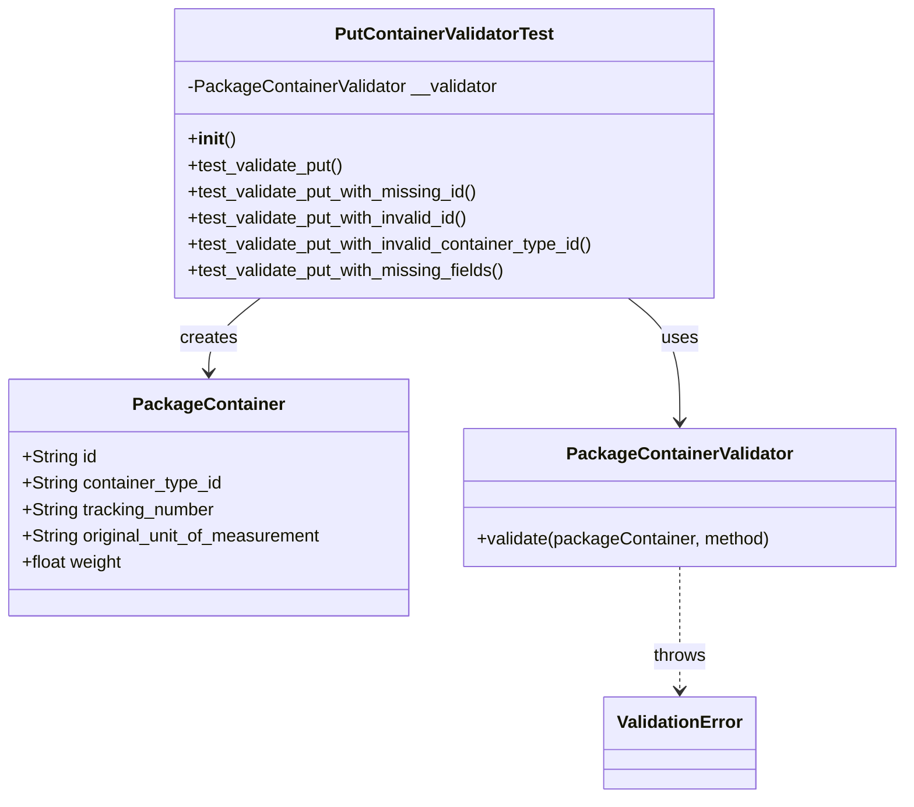

# Diagram: partview_service/partview_service/tests/unit/core/validators/package_container/container_put_validator_test.py


> Auto-generated by Obscura crawlers

## Diagram 1



### SVG

<svg id="container" width="824.0234375" xmlns="http://www.w3.org/2000/svg" class="classDiagram" height="728" viewBox="0 0 824.0234375 728" role="graphics-document document" aria-roledescription="class"><style>#container{font-family:"trebuchet ms",verdana,arial,sans-serif;font-size:16px;fill:#333;}@keyframes edge-animation-frame{from{stroke-dashoffset:0;}}@keyframes dash{to{stroke-dashoffset:0;}}#container .edge-animation-slow{stroke-dasharray:9,5!important;stroke-dashoffset:900;animation:dash 50s linear infinite;stroke-linecap:round;}#container .edge-animation-fast{stroke-dasharray:9,5!important;stroke-dashoffset:900;animation:dash 20s linear infinite;stroke-linecap:round;}#container .error-icon{fill:#552222;}#container .error-text{fill:#552222;stroke:#552222;}#container .edge-thickness-normal{stroke-width:1px;}#container .edge-thickness-thick{stroke-width:3.5px;}#container .edge-pattern-solid{stroke-dasharray:0;}#container .edge-thickness-invisible{stroke-width:0;fill:none;}#container .edge-pattern-dashed{stroke-dasharray:3;}#container .edge-pattern-dotted{stroke-dasharray:2;}#container .marker{fill:#333333;stroke:#333333;}#container .marker.cross{stroke:#333333;}#container svg{font-family:"trebuchet ms",verdana,arial,sans-serif;font-size:16px;}#container p{margin:0;}#container g.classGroup text{fill:#9370DB;stroke:none;font-family:"trebuchet ms",verdana,arial,sans-serif;font-size:10px;}#container g.classGroup text .title{font-weight:bolder;}#container .nodeLabel,#container .edgeLabel{color:#131300;}#container .edgeLabel .label rect{fill:#ECECFF;}#container .label text{fill:#131300;}#container .labelBkg{background:#ECECFF;}#container .edgeLabel .label span{background:#ECECFF;}#container .classTitle{font-weight:bolder;}#container .node rect,#container .node circle,#container .node ellipse,#container .node polygon,#container .node path{fill:#ECECFF;stroke:#9370DB;stroke-width:1px;}#container .divider{stroke:#9370DB;stroke-width:1;}#container g.clickable{cursor:pointer;}#container g.classGroup rect{fill:#ECECFF;stroke:#9370DB;}#container g.classGroup line{stroke:#9370DB;stroke-width:1;}#container .classLabel .box{stroke:none;stroke-width:0;fill:#ECECFF;opacity:0.5;}#container .classLabel .label{fill:#9370DB;font-size:10px;}#container .relation{stroke:#333333;stroke-width:1;fill:none;}#container .dashed-line{stroke-dasharray:3;}#container .dotted-line{stroke-dasharray:1 2;}#container #compositionStart,#container .composition{fill:#333333!important;stroke:#333333!important;stroke-width:1;}#container #compositionEnd,#container .composition{fill:#333333!important;stroke:#333333!important;stroke-width:1;}#container #dependencyStart,#container .dependency{fill:#333333!important;stroke:#333333!important;stroke-width:1;}#container #dependencyStart,#container .dependency{fill:#333333!important;stroke:#333333!important;stroke-width:1;}#container #extensionStart,#container .extension{fill:transparent!important;stroke:#333333!important;stroke-width:1;}#container #extensionEnd,#container .extension{fill:transparent!important;stroke:#333333!important;stroke-width:1;}#container #aggregationStart,#container .aggregation{fill:transparent!important;stroke:#333333!important;stroke-width:1;}#container #aggregationEnd,#container .aggregation{fill:transparent!important;stroke:#333333!important;stroke-width:1;}#container #lollipopStart,#container .lollipop{fill:#ECECFF!important;stroke:#333333!important;stroke-width:1;}#container #lollipopEnd,#container .lollipop{fill:#ECECFF!important;stroke:#333333!important;stroke-width:1;}#container .edgeTerminals{font-size:11px;line-height:initial;}#container .classTitleText{text-anchor:middle;font-size:18px;fill:#333;}#container .label-icon{display:inline-block;height:1em;overflow:visible;vertical-align:-0.125em;}#container .node .label-icon path{fill:currentColor;stroke:revert;stroke-width:revert;}#container :root{--mermaid-font-family:"trebuchet ms",verdana,arial,sans-serif;}</style><g><defs><marker id="container_class-aggregationStart" class="marker aggregation class" refX="18" refY="7" markerWidth="190" markerHeight="240" orient="auto"><path d="M 18,7 L9,13 L1,7 L9,1 Z"></path></marker></defs><defs><marker id="container_class-aggregationEnd" class="marker aggregation class" refX="1" refY="7" markerWidth="20" markerHeight="28" orient="auto"><path d="M 18,7 L9,13 L1,7 L9,1 Z"></path></marker></defs><defs><marker id="container_class-extensionStart" class="marker extension class" refX="18" refY="7" markerWidth="190" markerHeight="240" orient="auto"><path d="M 1,7 L18,13 V 1 Z"></path></marker></defs><defs><marker id="container_class-extensionEnd" class="marker extension class" refX="1" refY="7" markerWidth="20" markerHeight="28" orient="auto"><path d="M 1,1 V 13 L18,7 Z"></path></marker></defs><defs><marker id="container_class-compositionStart" class="marker composition class" refX="18" refY="7" markerWidth="190" markerHeight="240" orient="auto"><path d="M 18,7 L9,13 L1,7 L9,1 Z"></path></marker></defs><defs><marker id="container_class-compositionEnd" class="marker composition class" refX="1" refY="7" markerWidth="20" markerHeight="28" orient="auto"><path d="M 18,7 L9,13 L1,7 L9,1 Z"></path></marker></defs><defs><marker id="container_class-dependencyStart" class="marker dependency class" refX="6" refY="7" markerWidth="190" markerHeight="240" orient="auto"><path d="M 5,7 L9,13 L1,7 L9,1 Z"></path></marker></defs><defs><marker id="container_class-dependencyEnd" class="marker dependency class" refX="13" refY="7" markerWidth="20" markerHeight="28" orient="auto"><path d="M 18,7 L9,13 L14,7 L9,1 Z"></path></marker></defs><defs><marker id="container_class-lollipopStart" class="marker lollipop class" refX="13" refY="7" markerWidth="190" markerHeight="240" orient="auto"><circle stroke="black" fill="transparent" cx="7" cy="7" r="6"></circle></marker></defs><defs><marker id="container_class-lollipopEnd" class="marker lollipop class" refX="1" refY="7" markerWidth="190" markerHeight="240" orient="auto"><circle stroke="black" fill="transparent" cx="7" cy="7" r="6"></circle></marker></defs><g class="root"><g class="clusters"></g><g class="edgePaths"><path d="M573.307,272L581.134,278.167C588.961,284.333,604.615,296.667,612.442,315.5C620.27,334.333,620.27,359.667,620.27,372.333L620.27,385" id="id_PutContainerValidatorTest_PackageContainerValidator_1" class="edge-thickness-normal edge-pattern-solid relation" style=";;;" data-edge="true" data-et="edge" data-id="id_PutContainerValidatorTest_PackageContainerValidator_1" data-points="W3sieCI6NTczLjMwNjcwOTk2NjcxNiwieSI6MjcyfSx7IngiOjYyMC4yNjk1MzEyNSwieSI6MzA5fSx7IngiOjYyMC4yNjk1MzEyNSwieSI6MzkxfV0=" marker-end="url(#container_class-dependencyEnd)"></path><path d="M238.221,272L230.393,278.167C222.566,284.333,206.912,296.667,199.085,308C191.258,319.333,191.258,329.667,191.258,334.833L191.258,340" id="id_PutContainerValidatorTest_PackageContainer_2" class="edge-thickness-normal edge-pattern-solid relation" style=";;;" data-edge="true" data-et="edge" data-id="id_PutContainerValidatorTest_PackageContainer_2" data-points="W3sieCI6MjM4LjIyMDYzMzc4MzI4NDAzLCJ5IjoyNzJ9LHsieCI6MTkxLjI1NzgxMjUsInkiOjMwOX0seyJ4IjoxOTEuMjU3ODEyNSwieSI6MzQ2fV0=" marker-end="url(#container_class-dependencyEnd)"></path><path d="M620.27,517L620.27,530.667C620.27,544.333,620.27,571.667,620.27,590.5C620.27,609.333,620.27,619.667,620.27,624.833L620.27,630" id="id_PackageContainerValidator_ValidationError_3" class="edge-thickness-normal edge-pattern-dashed relation" style=";;;" data-edge="true" data-et="edge" data-id="id_PackageContainerValidator_ValidationError_3" data-points="W3sieCI6NjIwLjI2OTUzMTI1LCJ5Ijo1MTd9LHsieCI6NjIwLjI2OTUzMTI1LCJ5Ijo1OTl9LHsieCI6NjIwLjI2OTUzMTI1LCJ5Ijo2MzZ9XQ==" marker-end="url(#container_class-dependencyEnd)"></path></g><g class="edgeLabels"><g class="edgeLabel" transform="translate(620.26953125, 309)"><g class="label" data-id="id_PutContainerValidatorTest_PackageContainerValidator_1" transform="translate(-16.4921875, -12)"><foreignObject width="32.984375" height="24"><div xmlns="http://www.w3.org/1999/xhtml" class="labelBkg" style="display: table-cell; white-space: nowrap; line-height: 1.5; max-width: 200px; text-align: center;"><span class="edgeLabel"><p>uses</p></span></div></foreignObject></g></g><g class="edgeLabel" transform="translate(191.2578125, 309)"><g class="label" data-id="id_PutContainerValidatorTest_PackageContainer_2" transform="translate(-26.171875, -12)"><foreignObject width="52.34375" height="24"><div xmlns="http://www.w3.org/1999/xhtml" class="labelBkg" style="display: table-cell; white-space: nowrap; line-height: 1.5; max-width: 200px; text-align: center;"><span class="edgeLabel"><p>creates</p></span></div></foreignObject></g></g><g class="edgeLabel" transform="translate(620.26953125, 599)"><g class="label" data-id="id_PackageContainerValidator_ValidationError_3" transform="translate(-24.5703125, -12)"><foreignObject width="49.140625" height="24"><div xmlns="http://www.w3.org/1999/xhtml" class="labelBkg" style="display: table-cell; white-space: nowrap; line-height: 1.5; max-width: 200px; text-align: center;"><span class="edgeLabel"><p>throws</p></span></div></foreignObject></g></g></g><g class="nodes"><g class="node default" id="classId-PutContainerValidatorTest-0" transform="translate(405.763671875, 140)"><g class="basic label-container"><path d="M-249.17578125 -132 L249.17578125 -132 L249.17578125 132 L-249.17578125 132" stroke="none" stroke-width="0" fill="#ECECFF" style=""></path><path d="M-249.17578125 -132 C-57.712134941882994 -132, 133.751511366234 -132, 249.17578125 -132 M-249.17578125 -132 C-111.47787776101768 -132, 26.22002572796464 -132, 249.17578125 -132 M249.17578125 -132 C249.17578125 -67.51702754081484, 249.17578125 -3.034055081629674, 249.17578125 132 M249.17578125 -132 C249.17578125 -62.59573076755959, 249.17578125 6.808538464880826, 249.17578125 132 M249.17578125 132 C117.48245342888953 132, -14.210874392220944 132, -249.17578125 132 M249.17578125 132 C123.76936532078778 132, -1.6370506084244312 132, -249.17578125 132 M-249.17578125 132 C-249.17578125 32.57912977269655, -249.17578125 -66.8417404546069, -249.17578125 -132 M-249.17578125 132 C-249.17578125 30.162971796811533, -249.17578125 -71.67405640637693, -249.17578125 -132" stroke="#9370DB" stroke-width="1.3" fill="none" stroke-dasharray="0 0" style=""></path></g><g class="annotation-group text" transform="translate(0, -108)"></g><g class="label-group text" transform="translate(-96.2890625, -108)"><g class="label" style="font-weight: bolder" transform="translate(0,-12)"><foreignObject width="192.578125" height="24"><div xmlns="http://www.w3.org/1999/xhtml" style="display: table-cell; white-space: nowrap; line-height: 1.5; max-width: 239px; text-align: center;"><span class="nodeLabel markdown-node-label" style=""><p>PutContainerValidatorTest</p></span></div></foreignObject></g></g><g class="members-group text" transform="translate(-237.17578125, -60)"><g class="label" style="" transform="translate(0,-12)"><foreignObject width="285.265625" height="24"><div xmlns="http://www.w3.org/1999/xhtml" style="display: table-cell; white-space: nowrap; line-height: 1.5; max-width: 343px; text-align: center;"><span class="nodeLabel markdown-node-label" style=""><p>-PackageContainerValidator __validator</p></span></div></foreignObject></g></g><g class="methods-group text" transform="translate(-237.17578125, -12)"><g class="label" style="" transform="translate(0,-12)"><foreignObject width="42.796875" height="24"><div xmlns="http://www.w3.org/1999/xhtml" style="display: table-cell; white-space: nowrap; line-height: 1.5; max-width: 132px; text-align: center;"><span class="nodeLabel markdown-node-label" style=""><p>+<strong>init</strong>()</p></span></div></foreignObject></g><g class="label" style="" transform="translate(0,12)"><foreignObject width="144.109375" height="24"><div xmlns="http://www.w3.org/1999/xhtml" style="display: table-cell; white-space: nowrap; line-height: 1.5; max-width: 201px; text-align: center;"><span class="nodeLabel markdown-node-label" style=""><p>+test_validate_put()</p></span></div></foreignObject></g><g class="label" style="" transform="translate(0,36)"><foreignObject width="269.234375" height="24"><div xmlns="http://www.w3.org/1999/xhtml" style="display: table-cell; white-space: nowrap; line-height: 1.5; max-width: 327px; text-align: center;"><span class="nodeLabel markdown-node-label" style=""><p>+test_validate_put_with_missing_id()</p></span></div></foreignObject></g><g class="label" style="" transform="translate(0,60)"><foreignObject width="262.671875" height="24"><div xmlns="http://www.w3.org/1999/xhtml" style="display: table-cell; white-space: nowrap; line-height: 1.5; max-width: 320px; text-align: center;"><span class="nodeLabel markdown-node-label" style=""><p>+test_validate_put_with_invalid_id()</p></span></div></foreignObject></g><g class="label" style="" transform="translate(0,84)"><foreignObject width="378.0625" height="24"><div xmlns="http://www.w3.org/1999/xhtml" style="display: table-cell; white-space: nowrap; line-height: 1.5; max-width: 435px; text-align: center;"><span class="nodeLabel markdown-node-label" style=""><p>+test_validate_put_with_invalid_container_type_id()</p></span></div></foreignObject></g><g class="label" style="" transform="translate(0,108)"><foreignObject width="294.40625" height="24"><div xmlns="http://www.w3.org/1999/xhtml" style="display: table-cell; white-space: nowrap; line-height: 1.5; max-width: 352px; text-align: center;"><span class="nodeLabel markdown-node-label" style=""><p>+test_validate_put_with_missing_fields()</p></span></div></foreignObject></g></g><g class="divider" style=""><path d="M-249.17578125 -84 C-135.76193113430224 -84, -22.348081018604518 -84, 249.17578125 -84 M-249.17578125 -84 C-92.41993367631108 -84, 64.33591389737785 -84, 249.17578125 -84" stroke="#9370DB" stroke-width="1.3" fill="none" stroke-dasharray="0 0" style=""></path></g><g class="divider" style=""><path d="M-249.17578125 -36 C-104.17989087455194 -36, 40.81599950089611 -36, 249.17578125 -36 M-249.17578125 -36 C-79.37470144624461 -36, 90.42637835751077 -36, 249.17578125 -36" stroke="#9370DB" stroke-width="1.3" fill="none" stroke-dasharray="0 0" style=""></path></g></g><g class="node default" id="classId-PackageContainer-1" transform="translate(191.2578125, 454)"><g class="basic label-container"><path d="M-183.2578125 -108 L183.2578125 -108 L183.2578125 108 L-183.2578125 108" stroke="none" stroke-width="0" fill="#ECECFF" style=""></path><path d="M-183.2578125 -108 C-96.14739884828036 -108, -9.036985196560721 -108, 183.2578125 -108 M-183.2578125 -108 C-50.06874260962877 -108, 83.12032728074246 -108, 183.2578125 -108 M183.2578125 -108 C183.2578125 -46.37584198437018, 183.2578125 15.248316031259634, 183.2578125 108 M183.2578125 -108 C183.2578125 -27.628182231530076, 183.2578125 52.74363553693985, 183.2578125 108 M183.2578125 108 C52.183129774426845 108, -78.89155295114631 108, -183.2578125 108 M183.2578125 108 C60.60610730011405 108, -62.045597899771906 108, -183.2578125 108 M-183.2578125 108 C-183.2578125 59.224595993540916, -183.2578125 10.449191987081832, -183.2578125 -108 M-183.2578125 108 C-183.2578125 52.474152485530006, -183.2578125 -3.0516950289399887, -183.2578125 -108" stroke="#9370DB" stroke-width="1.3" fill="none" stroke-dasharray="0 0" style=""></path></g><g class="annotation-group text" transform="translate(0, -84)"></g><g class="label-group text" transform="translate(-65.453125, -84)"><g class="label" style="font-weight: bolder" transform="translate(0,-12)"><foreignObject width="130.90625" height="24"><div xmlns="http://www.w3.org/1999/xhtml" style="display: table-cell; white-space: nowrap; line-height: 1.5; max-width: 179px; text-align: center;"><span class="nodeLabel markdown-node-label" style=""><p>PackageContainer</p></span></div></foreignObject></g></g><g class="members-group text" transform="translate(-171.2578125, -36)"><g class="label" style="" transform="translate(0,-12)"><foreignObject width="68.546875" height="24"><div xmlns="http://www.w3.org/1999/xhtml" style="display: table-cell; white-space: nowrap; line-height: 1.5; max-width: 126px; text-align: center;"><span class="nodeLabel markdown-node-label" style=""><p>+String id</p></span></div></foreignObject></g><g class="label" style="" transform="translate(0,12)"><foreignObject width="184.265625" height="24"><div xmlns="http://www.w3.org/1999/xhtml" style="display: table-cell; white-space: nowrap; line-height: 1.5; max-width: 242px; text-align: center;"><span class="nodeLabel markdown-node-label" style=""><p>+String container_type_id</p></span></div></foreignObject></g><g class="label" style="" transform="translate(0,36)"><foreignObject width="177.796875" height="24"><div xmlns="http://www.w3.org/1999/xhtml" style="display: table-cell; white-space: nowrap; line-height: 1.5; max-width: 236px; text-align: center;"><span class="nodeLabel markdown-node-label" style=""><p>+String tracking_number</p></span></div></foreignObject></g><g class="label" style="" transform="translate(0,60)"><foreignObject width="277.0625" height="24"><div xmlns="http://www.w3.org/1999/xhtml" style="display: table-cell; white-space: nowrap; line-height: 1.5; max-width: 335px; text-align: center;"><span class="nodeLabel markdown-node-label" style=""><p>+String original_unit_of_measurement</p></span></div></foreignObject></g><g class="label" style="" transform="translate(0,84)"><foreignObject width="93.21875" height="24"><div xmlns="http://www.w3.org/1999/xhtml" style="display: table-cell; white-space: nowrap; line-height: 1.5; max-width: 151px; text-align: center;"><span class="nodeLabel markdown-node-label" style=""><p>+float weight</p></span></div></foreignObject></g></g><g class="methods-group text" transform="translate(-171.2578125, 108)"></g><g class="divider" style=""><path d="M-183.2578125 -60 C-52.2166719782314 -60, 78.8244685435372 -60, 183.2578125 -60 M-183.2578125 -60 C-84.28831310744616 -60, 14.681186285107685 -60, 183.2578125 -60" stroke="#9370DB" stroke-width="1.3" fill="none" stroke-dasharray="0 0" style=""></path></g><g class="divider" style=""><path d="M-183.2578125 84 C-70.77946791059435 84, 41.6988766788113 84, 183.2578125 84 M-183.2578125 84 C-63.084160187236876 84, 57.08949212552625 84, 183.2578125 84" stroke="#9370DB" stroke-width="1.3" fill="none" stroke-dasharray="0 0" style=""></path></g></g><g class="node default" id="classId-PackageContainerValidator-2" transform="translate(620.26953125, 454)"><g class="basic label-container"><path d="M-195.75390625 -63 L195.75390625 -63 L195.75390625 63 L-195.75390625 63" stroke="none" stroke-width="0" fill="#ECECFF" style=""></path><path d="M-195.75390625 -63 C-59.84248783297255 -63, 76.0689305840549 -63, 195.75390625 -63 M-195.75390625 -63 C-57.29425559075696 -63, 81.16539506848608 -63, 195.75390625 -63 M195.75390625 -63 C195.75390625 -36.2839939677004, 195.75390625 -9.567987935400787, 195.75390625 63 M195.75390625 -63 C195.75390625 -35.62679785266833, 195.75390625 -8.253595705336664, 195.75390625 63 M195.75390625 63 C47.21119786498781 63, -101.33151052002438 63, -195.75390625 63 M195.75390625 63 C69.69775761824629 63, -56.35839101350743 63, -195.75390625 63 M-195.75390625 63 C-195.75390625 33.27944359236616, -195.75390625 3.5588871847323134, -195.75390625 -63 M-195.75390625 63 C-195.75390625 32.29799445281574, -195.75390625 1.5959889056314935, -195.75390625 -63" stroke="#9370DB" stroke-width="1.3" fill="none" stroke-dasharray="0 0" style=""></path></g><g class="annotation-group text" transform="translate(0, -39)"></g><g class="label-group text" transform="translate(-98.6328125, -39)"><g class="label" style="font-weight: bolder" transform="translate(0,-12)"><foreignObject width="197.265625" height="24"><div xmlns="http://www.w3.org/1999/xhtml" style="display: table-cell; white-space: nowrap; line-height: 1.5; max-width: 245px; text-align: center;"><span class="nodeLabel markdown-node-label" style=""><p>PackageContainerValidator</p></span></div></foreignObject></g></g><g class="members-group text" transform="translate(-183.75390625, 9)"></g><g class="methods-group text" transform="translate(-183.75390625, 39)"><g class="label" style="" transform="translate(0,-12)"><foreignObject width="268.875" height="24"><div xmlns="http://www.w3.org/1999/xhtml" style="display: table-cell; white-space: nowrap; line-height: 1.5; max-width: 326px; text-align: center;"><span class="nodeLabel markdown-node-label" style=""><p>+validate(packageContainer, method)</p></span></div></foreignObject></g></g><g class="divider" style=""><path d="M-195.75390625 -15 C-75.47600728187611 -15, 44.801891686247785 -15, 195.75390625 -15 M-195.75390625 -15 C-106.25286458033368 -15, -16.751822910667357 -15, 195.75390625 -15" stroke="#9370DB" stroke-width="1.3" fill="none" stroke-dasharray="0 0" style=""></path></g><g class="divider" style=""><path d="M-195.75390625 9 C-81.12115138856687 9, 33.511603472866256 9, 195.75390625 9 M-195.75390625 9 C-45.12039174562648 9, 105.51312275874704 9, 195.75390625 9" stroke="#9370DB" stroke-width="1.3" fill="none" stroke-dasharray="0 0" style=""></path></g></g><g class="node default" id="classId-ValidationError-3" transform="translate(620.26953125, 678)"><g class="basic label-container"><path d="M-67.1796875 -42 L67.1796875 -42 L67.1796875 42 L-67.1796875 42" stroke="none" stroke-width="0" fill="#ECECFF" style=""></path><path d="M-67.1796875 -42 C-21.67577926926195 -42, 23.828128961476096 -42, 67.1796875 -42 M-67.1796875 -42 C-21.656650786969955 -42, 23.86638592606009 -42, 67.1796875 -42 M67.1796875 -42 C67.1796875 -21.02465308815957, 67.1796875 -0.049306176319142025, 67.1796875 42 M67.1796875 -42 C67.1796875 -17.1811848806486, 67.1796875 7.637630238702798, 67.1796875 42 M67.1796875 42 C27.252244480656096 42, -12.675198538687809 42, -67.1796875 42 M67.1796875 42 C37.892295033243485 42, 8.604902566486977 42, -67.1796875 42 M-67.1796875 42 C-67.1796875 18.635529349203615, -67.1796875 -4.728941301592769, -67.1796875 -42 M-67.1796875 42 C-67.1796875 14.01815282194704, -67.1796875 -13.963694356105918, -67.1796875 -42" stroke="#9370DB" stroke-width="1.3" fill="none" stroke-dasharray="0 0" style=""></path></g><g class="annotation-group text" transform="translate(0, -18)"></g><g class="label-group text" transform="translate(-55.1796875, -18)"><g class="label" style="font-weight: bolder" transform="translate(0,-12)"><foreignObject width="110.359375" height="24"><div xmlns="http://www.w3.org/1999/xhtml" style="display: table-cell; white-space: nowrap; line-height: 1.5; max-width: 160px; text-align: center;"><span class="nodeLabel markdown-node-label" style=""><p>ValidationError</p></span></div></foreignObject></g></g><g class="members-group text" transform="translate(-55.1796875, 30)"></g><g class="methods-group text" transform="translate(-55.1796875, 60)"></g><g class="divider" style=""><path d="M-67.1796875 6 C-38.259144190053334 6, -9.338600880106661 6, 67.1796875 6 M-67.1796875 6 C-30.125493975151223 6, 6.928699549697555 6, 67.1796875 6" stroke="#9370DB" stroke-width="1.3" fill="none" stroke-dasharray="0 0" style=""></path></g><g class="divider" style=""><path d="M-67.1796875 24 C-21.410520930299576 24, 24.358645639400848 24, 67.1796875 24 M-67.1796875 24 C-15.299495614459751 24, 36.5806962710805 24, 67.1796875 24" stroke="#9370DB" stroke-width="1.3" fill="none" stroke-dasharray="0 0" style=""></path></g></g></g></g></g></svg>

## Diagram 2

```mermaid
sequenceDiagram
participant TestCase as PutContainerValidatorTest
participant Container as PackageContainer
participant Validator as PackageContainerValidator
participant Error as ValidationError

TestCase->>Container: instantiate(id?, container_type_id?, tracking_number?, original_unit_of_measurement?, weight?)
TestCase->>Validator: validate(Container, "PUT")
alt all required fields valid
  Validator-->>TestCase: return (no exception)
else id missing or invalid
  Validator--x Error: raise ValidationError("id missing or invalid")
  Error-->>TestCase: thrown
  TestCase->>TestCase: assertRaises(ValidationError)
else container_type_id invalid
  Validator--x Error: raise ValidationError("container_type_id invalid")
  Error-->>TestCase: thrown
  TestCase->>TestCase: assertRaises(ValidationError)
else missing required fields
  Validator--x Error: raise ValidationError("Missing required fields: ...")
  Error-->>TestCase: thrown
  TestCase->>TestCase: assertRaises(ValidationError) and assertEqual(message)
```

> SVG rendering failed for this diagram.
