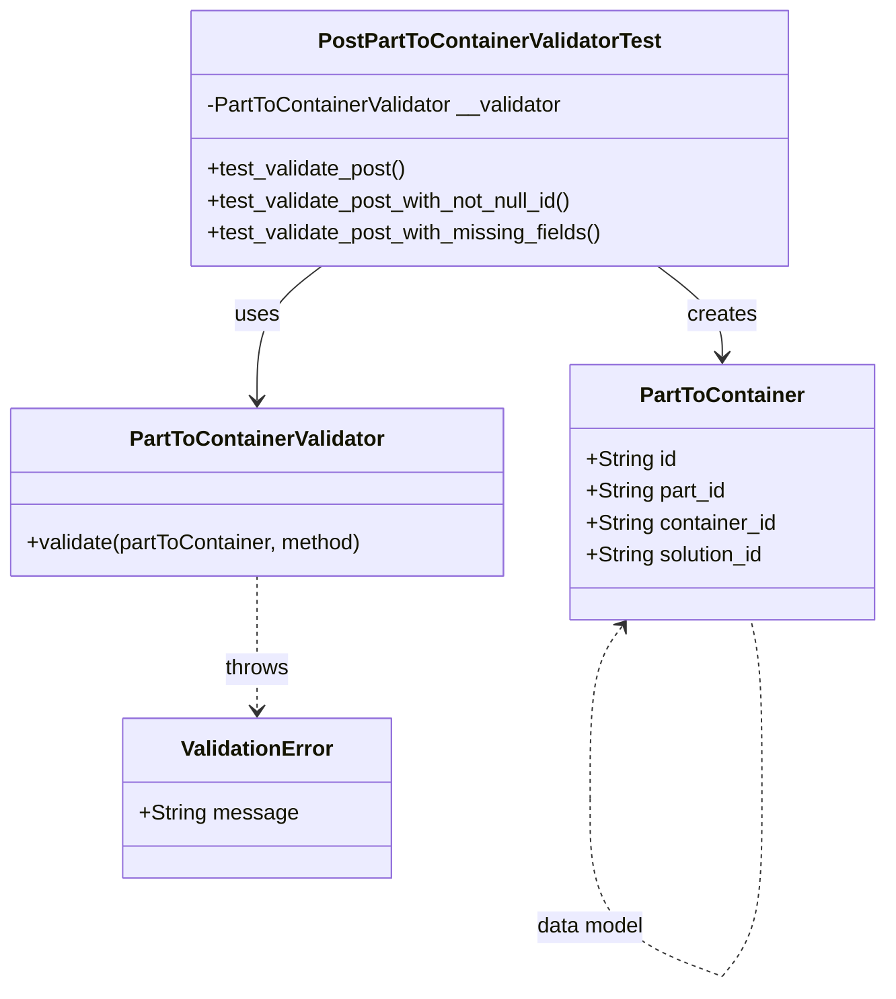
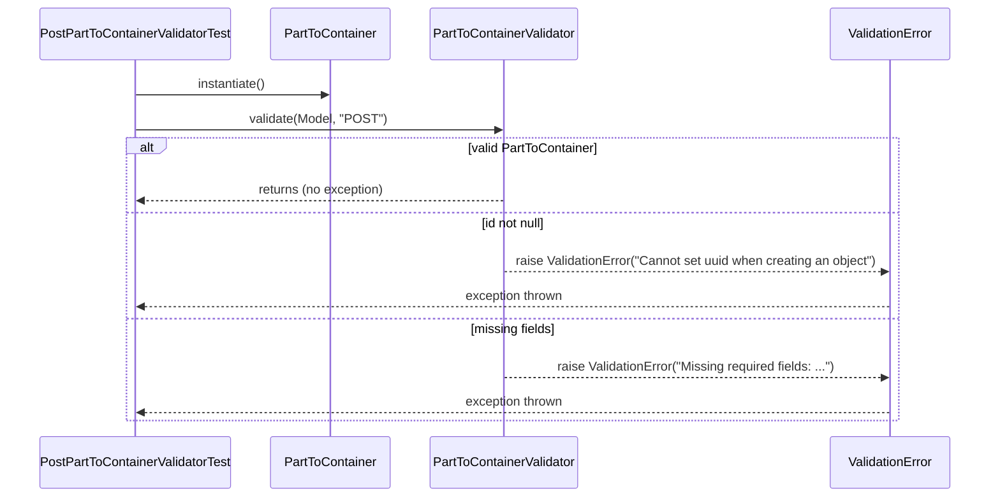

# Diagram: partview_service/partview_service/tests/unit/core/validators/part_to_container/part_to_container_post_validator_test.py

> Auto-generated by Obscura crawlers

## Diagram 1

### SVG

<svg id="container" width="667.046875" xmlns="http://www.w3.org/2000/svg" class="classDiagram" height="742.1499633789062" viewBox="0 0 667.046875 742.1499633789062" role="graphics-document document" aria-roledescription="class"><g><defs><marker id="container_class-aggregationStart" class="marker aggregation class" refX="18" refY="7" markerWidth="190" markerHeight="240" orient="auto"><path d="M 18,7 L9,13 L1,7 L9,1 Z"></path></marker></defs><defs><marker id="container_class-aggregationEnd" class="marker aggregation class" refX="1" refY="7" markerWidth="20" markerHeight="28" orient="auto"><path d="M 18,7 L9,13 L1,7 L9,1 Z"></path></marker></defs><defs><marker id="container_class-extensionStart" class="marker extension class" refX="18" refY="7" markerWidth="190" markerHeight="240" orient="auto"><path d="M 1,7 L18,13 V 1 Z"></path></marker></defs><defs><marker id="container_class-extensionEnd" class="marker extension class" refX="1" refY="7" markerWidth="20" markerHeight="28" orient="auto"><path d="M 1,1 V 13 L18,7 Z"></path></marker></defs><defs><marker id="container_class-compositionStart" class="marker composition class" refX="18" refY="7" markerWidth="190" markerHeight="240" orient="auto"><path d="M 18,7 L9,13 L1,7 L9,1 Z"></path></marker></defs><defs><marker id="container_class-compositionEnd" class="marker composition class" refX="1" refY="7" markerWidth="20" markerHeight="28" orient="auto"><path d="M 18,7 L9,13 L1,7 L9,1 Z"></path></marker></defs><defs><marker id="container_class-dependencyStart" class="marker dependency class" refX="6" refY="7" markerWidth="190" markerHeight="240" orient="auto"><path d="M 5,7 L9,13 L1,7 L9,1 Z"></path></marker></defs><defs><marker id="container_class-dependencyEnd" class="marker dependency class" refX="13" refY="7" markerWidth="20" markerHeight="28" orient="auto"><path d="M 18,7 L9,13 L14,7 L9,1 Z"></path></marker></defs><defs><marker id="container_class-lollipopStart" class="marker lollipop class" refX="13" refY="7" markerWidth="190" markerHeight="240" orient="auto"><circle stroke="black" fill="transparent" cx="7" cy="7" r="6"></circle></marker></defs><defs><marker id="container_class-lollipopEnd" class="marker lollipop class" refX="1" refY="7" markerWidth="190" markerHeight="240" orient="auto"><circle stroke="black" fill="transparent" cx="7" cy="7" r="6"></circle></marker></defs><g class="root"><g class="clusters"></g><g class="edgePaths"><path d="M243.273,200L235.146,206.167C227.02,212.333,210.768,224.667,202.642,241.5C194.516,258.333,194.516,279.667,194.516,290.333L194.516,301" id="id_PostPartToContainerValidatorTest_PartToContainerValidator_1" class="edge-thickness-normal edge-pattern-solid relation" style=";;;" data-edge="true" data-et="edge" data-id="id_PostPartToContainerValidatorTest_PartToContainerValidator_1" data-points="W3sieCI6MjQzLjI3MjY0NDUwMTg3OTcsInkiOjIwMH0seyJ4IjoxOTQuNTE1NjI1LCJ5IjoyMzd9LHsieCI6MTk0LjUxNTYyNSwieSI6MzA3fV0=" marker-end="url(#container_class-dependencyEnd)"></path><path d="M496.282,200L504.408,206.167C512.534,212.333,528.787,224.667,536.913,236C545.039,247.333,545.039,257.667,545.039,262.833L545.039,268" id="id_PostPartToContainerValidatorTest_PartToContainer_2" class="edge-thickness-normal edge-pattern-solid relation" style=";;;" data-edge="true" data-et="edge" data-id="id_PostPartToContainerValidatorTest_PartToContainer_2" data-points="W3sieCI6NDk2LjI4MjA0Mjk5ODEyMDMsInkiOjIwMH0seyJ4Ijo1NDUuMDM5MDYyNSwieSI6MjM3fSx7IngiOjU0NS4wMzkwNjI1LCJ5IjoyNzR9XQ==" marker-end="url(#container_class-dependencyEnd)"></path><path d="M194.516,433L194.516,444.667C194.516,456.333,194.516,479.667,194.516,496.5C194.516,513.333,194.516,523.667,194.516,528.833L194.516,534" id="id_PartToContainerValidator_ValidationError_3" class="edge-thickness-normal edge-pattern-dashed relation" style=";;;" data-edge="true" data-et="edge" data-id="id_PartToContainerValidator_ValidationError_3" data-points="W3sieCI6MTk0LjUxNTYyNSwieSI6NDMzfSx7IngiOjE5NC41MTU2MjUsInkiOjUwM30seyJ4IjoxOTQuNTE1NjI1LCJ5Ijo1NDB9XQ==" marker-end="url(#container_class-dependencyEnd)"></path><path d="M468.339,470.774L464.251,476.145C460.163,481.516,451.988,492.258,447.9,513.787C443.812,535.317,443.812,567.633,443.812,583.792L443.812,599.95" id="PartToContainer-cyclic-special-1" class="edge-thickness-normal edge-pattern-dashed relation" style=";;;" data-edge="true" data-et="edge" data-id="PartToContainer-cyclic-special-1" data-points="W3sieCI6NDcxLjk3Mjk5MTA3MTY5NzUsInkiOjQ2Nn0seyJ4Ijo0NDMuODEyMTA5Mzc1MzcyNTMsInkiOjUwM30seyJ4Ijo0NDMuODEyMTA5Mzc1MzcyNTMsInkiOjU5OS45NDk5OTk5OTkyNTQ5fV0=" marker-start="url(#container_class-dependencyStart)"></path><path d="M443.812,600.05L443.812,616.208C443.812,632.367,443.812,664.683,460.675,687.014C477.538,709.344,511.263,721.688,528.126,727.86L544.989,734.032" id="PartToContainer-cyclic-special-mid" class="edge-thickness-normal edge-pattern-dashed relation" style=";;;" data-edge="true" data-et="edge" data-id="PartToContainer-cyclic-special-mid" data-points="W3sieCI6NDQzLjgxMjEwOTM3NTM3MjUzLCJ5Ijo2MDAuMDUwMDAwMDAwNzQ1MX0seyJ4Ijo0NDMuODEyMTA5Mzc1MzcyNTMsInkiOjY5N30seyJ4Ijo1NDQuOTg5MDYyNDk5MjU0OSwieSI6NzM0LjAzMTY5OTUzODU2MTN9XQ=="></path><path d="M545.081,734L550.195,727.833C555.31,721.667,565.54,709.333,570.655,687C575.77,664.667,575.77,632.333,575.77,600C575.77,567.667,575.77,535.333,574.345,513C572.92,490.667,570.07,478.333,568.645,472.167L567.22,466" id="PartToContainer-cyclic-special-2" class="edge-thickness-normal edge-pattern-dashed relation" style=";;;" data-edge="true" data-et="edge" data-id="PartToContainer-cyclic-special-2" data-points="W3sieCI6NTQ1LjA4MDUzNDExODM2MzQsInkiOjczNH0seyJ4Ijo1NzUuNzY5NTMxMjUsInkiOjY5N30seyJ4Ijo1NzUuNzY5NTMxMjUsInkiOjYwMH0seyJ4Ijo1NzUuNzY5NTMxMjUsInkiOjUwM30seyJ4Ijo1NjcuMjIwNDUzNDc3NDQzNiwieSI6NDY2fV0="></path></g><g class="edgeLabels"><g class="edgeLabel" transform="translate(194.515625, 237)"><g class="label" data-id="id_PostPartToContainerValidatorTest_PartToContainerValidator_1" transform="translate(-16.4921875, -12)"><foreignObject width="32.984375" height="24">

uses

</foreignObject></g></g><g class="edgeLabel" transform="translate(545.0390625, 237)"><g class="label" data-id="id_PostPartToContainerValidatorTest_PartToContainer_2" transform="translate(-26.171875, -12)"><foreignObject width="52.34375" height="24">

creates

</foreignObject></g></g><g class="edgeLabel" transform="translate(194.515625, 503)"><g class="label" data-id="id_PartToContainerValidator_ValidationError_3" transform="translate(-24.5703125, -12)"><foreignObject width="49.140625" height="24">

throws

</foreignObject></g></g><g class="edgeLabel"><g class="label" data-id="PartToContainer-cyclic-special-1" transform="translate(0, 0)"><foreignObject width="0" height="0">

</foreignObject></g></g><g class="edgeLabel" transform="translate(443.81210937537253, 697)"><g class="label" data-id="PartToContainer-cyclic-special-mid" transform="translate(-41.4609375, -12)"><foreignObject width="82.921875" height="24">

data model

</foreignObject></g></g><g class="edgeLabel"><g class="label" data-id="PartToContainer-cyclic-special-2" transform="translate(0, 0)"><foreignObject width="0" height="0">

</foreignObject></g></g></g><g class="nodes"><g class="node default" id="classId-PartToContainer-0" transform="translate(545.0390625, 370)"><g class="basic label-container"><path d="M-114.0078125 -96 L114.0078125 -96 L114.0078125 96 L-114.0078125 96" stroke="none" stroke-width="0" fill="#ECECFF" style=""></path><path d="M-114.0078125 -96 C-52.4660204026935 -96, 9.075771694612996 -96, 114.0078125 -96 M-114.0078125 -96 C-54.91999049879804 -96, 4.167831502403914 -96, 114.0078125 -96 M114.0078125 -96 C114.0078125 -31.626878500478725, 114.0078125 32.74624299904255, 114.0078125 96 M114.0078125 -96 C114.0078125 -42.02275275642937, 114.0078125 11.954494487141261, 114.0078125 96 M114.0078125 96 C36.53711357393742 96, -40.933585352125164 96, -114.0078125 96 M114.0078125 96 C62.123450047245704 96, 10.239087594491409 96, -114.0078125 96 M-114.0078125 96 C-114.0078125 32.68437024848917, -114.0078125 -30.631259503021667, -114.0078125 -96 M-114.0078125 96 C-114.0078125 31.050799468204545, -114.0078125 -33.89840106359091, -114.0078125 -96" stroke="#9370DB" stroke-width="1.3" fill="none" stroke-dasharray="0 0" style=""></path></g><g class="annotation-group text" transform="translate(0, -72)"></g><g class="label-group text" transform="translate(-59.21875, -72)"><g class="label" style="font-weight: bolder" transform="translate(0,-12)"><foreignObject width="118.4375" height="24">

PartToContainer

</foreignObject></g></g><g class="members-group text" transform="translate(-102.0078125, -24)"><g class="label" style="" transform="translate(0,-12)"><foreignObject width="68.546875" height="24">

+String id

</foreignObject></g><g class="label" style="" transform="translate(0,12)"><foreignObject width="106.875" height="24">

+String part_id

</foreignObject></g><g class="label" style="" transform="translate(0,36)"><foreignObject width="144.796875" height="24">

+String container_id

</foreignObject></g><g class="label" style="" transform="translate(0,60)"><foreignObject width="136.703125" height="24">

+String solution_id

</foreignObject></g></g><g class="methods-group text" transform="translate(-102.0078125, 96)"></g><g class="divider" style=""><path d="M-114.0078125 -48 C-29.217591718091768 -48, 55.572629063816464 -48, 114.0078125 -48 M-114.0078125 -48 C-57.43968338041523 -48, -0.8715542608304645 -48, 114.0078125 -48" stroke="#9370DB" stroke-width="1.3" fill="none" stroke-dasharray="0 0" style=""></path></g><g class="divider" style=""><path d="M-114.0078125 72 C-55.596260346504295 72, 2.815291806991411 72, 114.0078125 72 M-114.0078125 72 C-23.991826380608586 72, 66.02415973878283 72, 114.0078125 72" stroke="#9370DB" stroke-width="1.3" fill="none" stroke-dasharray="0 0" style=""></path></g></g><g class="node default" id="classId-PartToContainerValidator-1" transform="translate(194.515625, 370)"><g class="basic label-container"><path d="M-186.515625 -63 L186.515625 -63 L186.515625 63 L-186.515625 63" stroke="none" stroke-width="0" fill="#ECECFF" style=""></path><path d="M-186.515625 -63 C-65.66186476400068 -63, 55.191895471998635 -63, 186.515625 -63 M-186.515625 -63 C-74.49372052524393 -63, 37.52818394951214 -63, 186.515625 -63 M186.515625 -63 C186.515625 -26.52510193617819, 186.515625 9.949796127643623, 186.515625 63 M186.515625 -63 C186.515625 -28.773435244343332, 186.515625 5.453129511313335, 186.515625 63 M186.515625 63 C55.24922590049147 63, -76.01717319901707 63, -186.515625 63 M186.515625 63 C59.69155857293657 63, -67.13250785412686 63, -186.515625 63 M-186.515625 63 C-186.515625 32.65926010872475, -186.515625 2.3185202174495103, -186.515625 -63 M-186.515625 63 C-186.515625 24.021667974575443, -186.515625 -14.956664050849113, -186.515625 -63" stroke="#9370DB" stroke-width="1.3" fill="none" stroke-dasharray="0 0" style=""></path></g><g class="annotation-group text" transform="translate(0, -39)"></g><g class="label-group text" transform="translate(-92.40625, -39)"><g class="label" style="font-weight: bolder" transform="translate(0,-12)"><foreignObject width="184.8125" height="24">

PartToContainerValidator

</foreignObject></g></g><g class="members-group text" transform="translate(-174.515625, 9)"></g><g class="methods-group text" transform="translate(-174.515625, 39)"><g class="label" style="" transform="translate(0,-12)"><foreignObject width="256.625" height="24">

+validate(partToContainer, method)

</foreignObject></g></g><g class="divider" style=""><path d="M-186.515625 -15 C-104.5507876434882 -15, -22.585950286976413 -15, 186.515625 -15 M-186.515625 -15 C-95.87825574409929 -15, -5.2408864881985835 -15, 186.515625 -15" stroke="#9370DB" stroke-width="1.3" fill="none" stroke-dasharray="0 0" style=""></path></g><g class="divider" style=""><path d="M-186.515625 9 C-83.3615705850675 9, 19.792483829865006 9, 186.515625 9 M-186.515625 9 C-55.2475114611652 9, 76.0206020776696 9, 186.515625 9" stroke="#9370DB" stroke-width="1.3" fill="none" stroke-dasharray="0 0" style=""></path></g></g><g class="node default" id="classId-ValidationError-2" transform="translate(194.515625, 600)"><g class="basic label-container"><path d="M-98.01953125 -60 L98.01953125 -60 L98.01953125 60 L-98.01953125 60" stroke="none" stroke-width="0" fill="#ECECFF" style=""></path><path d="M-98.01953125 -60 C-46.91282419186649 -60, 4.193882866267018 -60, 98.01953125 -60 M-98.01953125 -60 C-47.93847227813094 -60, 2.1425866937381244 -60, 98.01953125 -60 M98.01953125 -60 C98.01953125 -30.229347124601695, 98.01953125 -0.45869424920338986, 98.01953125 60 M98.01953125 -60 C98.01953125 -16.305316261187336, 98.01953125 27.389367477625328, 98.01953125 60 M98.01953125 60 C37.00837876858048 60, -24.002773712839044 60, -98.01953125 60 M98.01953125 60 C45.73354197619348 60, -6.552447297613043 60, -98.01953125 60 M-98.01953125 60 C-98.01953125 31.939278715299427, -98.01953125 3.8785574305988533, -98.01953125 -60 M-98.01953125 60 C-98.01953125 19.551001738674884, -98.01953125 -20.89799652265023, -98.01953125 -60" stroke="#9370DB" stroke-width="1.3" fill="none" stroke-dasharray="0 0" style=""></path></g><g class="annotation-group text" transform="translate(0, -36)"></g><g class="label-group text" transform="translate(-55.1796875, -36)"><g class="label" style="font-weight: bolder" transform="translate(0,-12)"><foreignObject width="110.359375" height="24">

ValidationError

</foreignObject></g></g><g class="members-group text" transform="translate(-86.01953125, 12)"><g class="label" style="" transform="translate(0,-12)"><foreignObject width="116.859375" height="24">

+String message

</foreignObject></g></g><g class="methods-group text" transform="translate(-86.01953125, 60)"></g><g class="divider" style=""><path d="M-98.01953125 -12 C-53.260085745086826 -12, -8.500640240173652 -12, 98.01953125 -12 M-98.01953125 -12 C-57.165371502471906 -12, -16.311211754943812 -12, 98.01953125 -12" stroke="#9370DB" stroke-width="1.3" fill="none" stroke-dasharray="0 0" style=""></path></g><g class="divider" style=""><path d="M-98.01953125 36 C-52.94608859394291 36, -7.872645937885821 36, 98.01953125 36 M-98.01953125 36 C-35.706242304200494 36, 26.607046641599013 36, 98.01953125 36" stroke="#9370DB" stroke-width="1.3" fill="none" stroke-dasharray="0 0" style=""></path></g></g><g class="node default" id="classId-PostPartToContainerValidatorTest-3" transform="translate(369.77734375, 104)"><g class="basic label-container"><path d="M-224.87109375 -96 L224.87109375 -96 L224.87109375 96 L-224.87109375 96" stroke="none" stroke-width="0" fill="#ECECFF" style=""></path><path d="M-224.87109375 -96 C-93.02955336498681 -96, 38.81198702002638 -96, 224.87109375 -96 M-224.87109375 -96 C-70.787584738003 -96, 83.29592427399399 -96, 224.87109375 -96 M224.87109375 -96 C224.87109375 -27.49351770441436, 224.87109375 41.01296459117128, 224.87109375 96 M224.87109375 -96 C224.87109375 -54.77821907370297, 224.87109375 -13.556438147405942, 224.87109375 96 M224.87109375 96 C50.80542230583481 96, -123.26024913833038 96, -224.87109375 96 M224.87109375 96 C78.344081436517 96, -68.182930876966 96, -224.87109375 96 M-224.87109375 96 C-224.87109375 22.943163283104013, -224.87109375 -50.11367343379197, -224.87109375 -96 M-224.87109375 96 C-224.87109375 55.50095525818975, -224.87109375 15.001910516379496, -224.87109375 -96" stroke="#9370DB" stroke-width="1.3" fill="none" stroke-dasharray="0 0" style=""></path></g><g class="annotation-group text" transform="translate(0, -72)"></g><g class="label-group text" transform="translate(-123.8359375, -72)"><g class="label" style="font-weight: bolder" transform="translate(0,-12)"><foreignObject width="247.671875" height="24">

PostPartToContainerValidatorTest

</foreignObject></g></g><g class="members-group text" transform="translate(-212.87109375, -24)"><g class="label" style="" transform="translate(0,-12)"><foreignObject width="273.03125" height="24">

-PartToContainerValidator __validator

</foreignObject></g></g><g class="methods-group text" transform="translate(-212.87109375, 24)"><g class="label" style="" transform="translate(0,-12)"><foreignObject width="151.609375" height="24">

+test_validate_post()

</foreignObject></g><g class="label" style="" transform="translate(0,12)"><foreignObject width="282.34375" height="24">

+test_validate_post_with_not_null_id()

</foreignObject></g><g class="label" style="" transform="translate(0,36)"><foreignObject width="301.90625" height="24">

+test_validate_post_with_missing_fields()

</foreignObject></g></g><g class="divider" style=""><path d="M-224.87109375 -48 C-70.30289283758819 -48, 84.26530807482362 -48, 224.87109375 -48 M-224.87109375 -48 C-115.15896128420813 -48, -5.4468288184162645 -48, 224.87109375 -48" stroke="#9370DB" stroke-width="1.3" fill="none" stroke-dasharray="0 0" style=""></path></g><g class="divider" style=""><path d="M-224.87109375 0 C-110.39766580329308 0, 4.07576214341384 0, 224.87109375 0 M-224.87109375 0 C-114.75798380515829 0, -4.644873860316579 0, 224.87109375 0" stroke="#9370DB" stroke-width="1.3" fill="none" stroke-dasharray="0 0" style=""></path></g></g><g class="label edgeLabel" id="PartToContainer---PartToContainer---1" transform="translate(443.81210937537253, 600)"><rect width="0.1" height="0.1"></rect><g class="label" style="" transform="translate(0, 0)"><rect></rect><foreignObject width="0" height="0">

</foreignObject></g></g><g class="label edgeLabel" id="PartToContainer---PartToContainer---2" transform="translate(545.0390625, 734.0500000007451)"><rect width="0.1" height="0.1"></rect><g class="label" style="" transform="translate(0, 0)"><rect></rect><foreignObject width="0" height="0">

</foreignObject></g></g></g></g></g></svg>

## Diagram 2

### SVG

<svg id="container" width="1323" xmlns="http://www.w3.org/2000/svg" height="652" viewBox="-50 -10 1323 652" role="graphics-document document" aria-roledescription="sequence"><g><rect x="1073" y="566" fill="#eaeaea" stroke="#666" width="150" height="65" name="Error" rx="3" ry="3" class="actor actor-bottom"></rect><text x="1148" y="598.5" dominant-baseline="central" alignment-baseline="central" class="actor actor-box" style="text-anchor: middle; font-size: 16px; font-weight: 400;"><tspan x="1148" dy="0">ValidationError</tspan></text></g><g><rect x="513" y="566" fill="#eaeaea" stroke="#666" width="202" height="65" name="Validator" rx="3" ry="3" class="actor actor-bottom"></rect><text x="614" y="598.5" dominant-baseline="central" alignment-baseline="central" class="actor actor-box" style="text-anchor: middle; font-size: 16px; font-weight: 400;"><tspan x="614" dy="0">PartToContainerValidator</tspan></text></g><g><rect x="313" y="566" fill="#eaeaea" stroke="#666" width="150" height="65" name="Model" rx="3" ry="3" class="actor actor-bottom"></rect><text x="388" y="598.5" dominant-baseline="central" alignment-baseline="central" class="actor actor-box" style="text-anchor: middle; font-size: 16px; font-weight: 400;"><tspan x="388" dy="0">PartToContainer</tspan></text></g><g><rect x="0" y="566" fill="#eaeaea" stroke="#666" width="263" height="65" name="Test" rx="3" ry="3" class="actor actor-bottom"></rect><text x="131.5" y="598.5" dominant-baseline="central" alignment-baseline="central" class="actor actor-box" style="text-anchor: middle; font-size: 16px; font-weight: 400;"><tspan x="131.5" dy="0">PostPartToContainerValidatorTest</tspan></text></g><g><line id="actor3" x1="1148" y1="65" x2="1148" y2="566" class="actor-line 200" stroke-width="0.5px" stroke="#999" name="Error"></line><g id="root-3"><rect x="1073" y="0" fill="#eaeaea" stroke="#666" width="150" height="65" name="Error" rx="3" ry="3" class="actor actor-top"></rect><text x="1148" y="32.5" dominant-baseline="central" alignment-baseline="central" class="actor actor-box" style="text-anchor: middle; font-size: 16px; font-weight: 400;"><tspan x="1148" dy="0">ValidationError</tspan></text></g></g><g><line id="actor2" x1="614" y1="65" x2="614" y2="566" class="actor-line 200" stroke-width="0.5px" stroke="#999" name="Validator"></line><g id="root-2"><rect x="513" y="0" fill="#eaeaea" stroke="#666" width="202" height="65" name="Validator" rx="3" ry="3" class="actor actor-top"></rect><text x="614" y="32.5" dominant-baseline="central" alignment-baseline="central" class="actor actor-box" style="text-anchor: middle; font-size: 16px; font-weight: 400;"><tspan x="614" dy="0">PartToContainerValidator</tspan></text></g></g><g><line id="actor1" x1="388" y1="65" x2="388" y2="566" class="actor-line 200" stroke-width="0.5px" stroke="#999" name="Model"></line><g id="root-1"><rect x="313" y="0" fill="#eaeaea" stroke="#666" width="150" height="65" name="Model" rx="3" ry="3" class="actor actor-top"></rect><text x="388" y="32.5" dominant-baseline="central" alignment-baseline="central" class="actor actor-box" style="text-anchor: middle; font-size: 16px; font-weight: 400;"><tspan x="388" dy="0">PartToContainer</tspan></text></g></g><g><line id="actor0" x1="131.5" y1="65" x2="131.5" y2="566" class="actor-line 200" stroke-width="0.5px" stroke="#999" name="Test"></line><g id="root-0"><rect x="0" y="0" fill="#eaeaea" stroke="#666" width="263" height="65" name="Test" rx="3" ry="3" class="actor actor-top"></rect><text x="131.5" y="32.5" dominant-baseline="central" alignment-baseline="central" class="actor actor-box" style="text-anchor: middle; font-size: 16px; font-weight: 400;"><tspan x="131.5" dy="0">PostPartToContainerValidatorTest</tspan></text></g></g><g></g><defs><symbol id="computer" width="24" height="24"><path transform="scale(.5)" d="M2 2v13h20v-13h-20zm18 11h-16v-9h16v9zm-10.228 6l.466-1h3.524l.467 1h-4.457zm14.228 3h-24l2-6h2.104l-1.33 4h18.45l-1.297-4h2.073l2 6zm-5-10h-14v-7h14v7z"></path></symbol></defs><defs><symbol id="database" fill-rule="evenodd" clip-rule="evenodd"><path transform="scale(.5)" d="M12.258.001l.256.004.255.005.253.008.251.01.249.012.247.015.246.016.242.019.241.02.239.023.236.024.233.027.231.028.229.031.225.032.223.034.22.036.217.038.214.04.211.041.208.043.205.045.201.046.198.048.194.05.191.051.187.053.183.054.18.056.175.057.172.059.168.06.163.061.16.063.155.064.15.066.074.033.073.033.071.034.07.034.069.035.068.035.067.035.066.035.064.036.064.036.062.036.06.036.06.037.058.037.058.037.055.038.055.038.053.038.052.038.051.039.05.039.048.039.047.039.045.04.044.04.043.04.041.04.04.041.039.041.037.041.036.041.034.041.033.042.032.042.03.042.029.042.027.042.026.043.024.043.023.043.021.043.02.043.018.044.017.043.015.044.013.044.012.044.011.045.009.044.007.045.006.045.004.045.002.045.001.045v17l-.001.045-.002.045-.004.045-.006.045-.007.045-.009.044-.011.045-.012.044-.013.044-.015.044-.017.043-.018.044-.02.043-.021.043-.023.043-.024.043-.026.043-.027.042-.029.042-.03.042-.032.042-.033.042-.034.041-.036.041-.037.041-.039.041-.04.041-.041.04-.043.04-.044.04-.045.04-.047.039-.048.039-.05.039-.051.039-.052.038-.053.038-.055.038-.055.038-.058.037-.058.037-.06.037-.06.036-.062.036-.064.036-.064.036-.066.035-.067.035-.068.035-.069.035-.07.034-.071.034-.073.033-.074.033-.15.066-.155.064-.16.063-.163.061-.168.06-.172.059-.175.057-.18.056-.183.054-.187.053-.191.051-.194.05-.198.048-.201.046-.205.045-.208.043-.211.041-.214.04-.217.038-.22.036-.223.034-.225.032-.229.031-.231.028-.233.027-.236.024-.239.023-.241.02-.242.019-.246.016-.247.015-.249.012-.251.01-.253.008-.255.005-.256.004-.258.001-.258-.001-.256-.004-.255-.005-.253-.008-.251-.01-.249-.012-.247-.015-.245-.016-.243-.019-.241-.02-.238-.023-.236-.024-.234-.027-.231-.028-.228-.031-.226-.032-.223-.034-.22-.036-.217-.038-.214-.04-.211-.041-.208-.043-.204-.045-.201-.046-.198-.048-.195-.05-.19-.051-.187-.053-.184-.054-.179-.056-.176-.057-.172-.059-.167-.06-.164-.061-.159-.063-.155-.064-.151-.066-.074-.033-.072-.033-.072-.034-.07-.034-.069-.035-.068-.035-.067-.035-.066-.035-.064-.036-.063-.036-.062-.036-.061-.036-.06-.037-.058-.037-.057-.037-.056-.038-.055-.038-.053-.038-.052-.038-.051-.039-.049-.039-.049-.039-.046-.039-.046-.04-.044-.04-.043-.04-.041-.04-.04-.041-.039-.041-.037-.041-.036-.041-.034-.041-.033-.042-.032-.042-.03-.042-.029-.042-.027-.042-.026-.043-.024-.043-.023-.043-.021-.043-.02-.043-.018-.044-.017-.043-.015-.044-.013-.044-.012-.044-.011-.045-.009-.044-.007-.045-.006-.045-.004-.045-.002-.045-.001-.045v-17l.001-.045.002-.045.004-.045.006-.045.007-.045.009-.044.011-.045.012-.044.013-.044.015-.044.017-.043.018-.044.02-.043.021-.043.023-.043.024-.043.026-.043.027-.042.029-.042.03-.042.032-.042.033-.042.034-.041.036-.041.037-.041.039-.041.04-.041.041-.04.043-.04.044-.04.046-.04.046-.039.049-.039.049-.039.051-.039.052-.038.053-.038.055-.038.056-.038.057-.037.058-.037.06-.037.061-.036.062-.036.063-.036.064-.036.066-.035.067-.035.068-.035.069-.035.07-.034.072-.034.072-.033.074-.033.151-.066.155-.064.159-.063.164-.061.167-.06.172-.059.176-.057.179-.056.184-.054.187-.053.19-.051.195-.05.198-.048.201-.046.204-.045.208-.043.211-.041.214-.04.217-.038.22-.036.223-.034.226-.032.228-.031.231-.028.234-.027.236-.024.238-.023.241-.02.243-.019.245-.016.247-.015.249-.012.251-.01.253-.008.255-.005.256-.004.258-.001.258.001zm-9.258 20.499v.01l.001.021.003.021.004.022.005.021.006.022.007.022.009.023.01.022.011.023.012.023.013.023.015.023.016.024.017.023.018.024.019.024.021.024.022.025.023.024.024.025.052.049.056.05.061.051.066.051.07.051.075.051.079.052.084.052.088.052.092.052.097.052.102.051.105.052.11.052.114.051.119.051.123.051.127.05.131.05.135.05.139.048.144.049.147.047.152.047.155.047.16.045.163.045.167.043.171.043.176.041.178.041.183.039.187.039.19.037.194.035.197.035.202.033.204.031.209.03.212.029.216.027.219.025.222.024.226.021.23.02.233.018.236.016.24.015.243.012.246.01.249.008.253.005.256.004.259.001.26-.001.257-.004.254-.005.25-.008.247-.011.244-.012.241-.014.237-.016.233-.018.231-.021.226-.021.224-.024.22-.026.216-.027.212-.028.21-.031.205-.031.202-.034.198-.034.194-.036.191-.037.187-.039.183-.04.179-.04.175-.042.172-.043.168-.044.163-.045.16-.046.155-.046.152-.047.148-.048.143-.049.139-.049.136-.05.131-.05.126-.05.123-.051.118-.052.114-.051.11-.052.106-.052.101-.052.096-.052.092-.052.088-.053.083-.051.079-.052.074-.052.07-.051.065-.051.06-.051.056-.05.051-.05.023-.024.023-.025.021-.024.02-.024.019-.024.018-.024.017-.024.015-.023.014-.024.013-.023.012-.023.01-.023.01-.022.008-.022.006-.022.006-.022.004-.022.004-.021.001-.021.001-.021v-4.127l-.077.055-.08.053-.083.054-.085.053-.087.052-.09.052-.093.051-.095.05-.097.05-.1.049-.102.049-.105.048-.106.047-.109.047-.111.046-.114.045-.115.045-.118.044-.12.043-.122.042-.124.042-.126.041-.128.04-.13.04-.132.038-.134.038-.135.037-.138.037-.139.035-.142.035-.143.034-.144.033-.147.032-.148.031-.15.03-.151.03-.153.029-.154.027-.156.027-.158.026-.159.025-.161.024-.162.023-.163.022-.165.021-.166.02-.167.019-.169.018-.169.017-.171.016-.173.015-.173.014-.175.013-.175.012-.177.011-.178.01-.179.008-.179.008-.181.006-.182.005-.182.004-.184.003-.184.002h-.37l-.184-.002-.184-.003-.182-.004-.182-.005-.181-.006-.179-.008-.179-.008-.178-.01-.176-.011-.176-.012-.175-.013-.173-.014-.172-.015-.171-.016-.17-.017-.169-.018-.167-.019-.166-.02-.165-.021-.163-.022-.162-.023-.161-.024-.159-.025-.157-.026-.156-.027-.155-.027-.153-.029-.151-.03-.15-.03-.148-.031-.146-.032-.145-.033-.143-.034-.141-.035-.14-.035-.137-.037-.136-.037-.134-.038-.132-.038-.13-.04-.128-.04-.126-.041-.124-.042-.122-.042-.12-.044-.117-.043-.116-.045-.113-.045-.112-.046-.109-.047-.106-.047-.105-.048-.102-.049-.1-.049-.097-.05-.095-.05-.093-.052-.09-.051-.087-.052-.085-.053-.083-.054-.08-.054-.077-.054v4.127zm0-5.654v.011l.001.021.003.021.004.021.005.022.006.022.007.022.009.022.01.022.011.023.012.023.013.023.015.024.016.023.017.024.018.024.019.024.021.024.022.024.023.025.024.024.052.05.056.05.061.05.066.051.07.051.075.052.079.051.084.052.088.052.092.052.097.052.102.052.105.052.11.051.114.051.119.052.123.05.127.051.131.05.135.049.139.049.144.048.147.048.152.047.155.046.16.045.163.045.167.044.171.042.176.042.178.04.183.04.187.038.19.037.194.036.197.034.202.033.204.032.209.03.212.028.216.027.219.025.222.024.226.022.23.02.233.018.236.016.24.014.243.012.246.01.249.008.253.006.256.003.259.001.26-.001.257-.003.254-.006.25-.008.247-.01.244-.012.241-.015.237-.016.233-.018.231-.02.226-.022.224-.024.22-.025.216-.027.212-.029.21-.03.205-.032.202-.033.198-.035.194-.036.191-.037.187-.039.183-.039.179-.041.175-.042.172-.043.168-.044.163-.045.16-.045.155-.047.152-.047.148-.048.143-.048.139-.05.136-.049.131-.05.126-.051.123-.051.118-.051.114-.052.11-.052.106-.052.101-.052.096-.052.092-.052.088-.052.083-.052.079-.052.074-.051.07-.052.065-.051.06-.05.056-.051.051-.049.023-.025.023-.024.021-.025.02-.024.019-.024.018-.024.017-.024.015-.023.014-.023.013-.024.012-.022.01-.023.01-.023.008-.022.006-.022.006-.022.004-.021.004-.022.001-.021.001-.021v-4.139l-.077.054-.08.054-.083.054-.085.052-.087.053-.09.051-.093.051-.095.051-.097.05-.1.049-.102.049-.105.048-.106.047-.109.047-.111.046-.114.045-.115.044-.118.044-.12.044-.122.042-.124.042-.126.041-.128.04-.13.039-.132.039-.134.038-.135.037-.138.036-.139.036-.142.035-.143.033-.144.033-.147.033-.148.031-.15.03-.151.03-.153.028-.154.028-.156.027-.158.026-.159.025-.161.024-.162.023-.163.022-.165.021-.166.02-.167.019-.169.018-.169.017-.171.016-.173.015-.173.014-.175.013-.175.012-.177.011-.178.009-.179.009-.179.007-.181.007-.182.005-.182.004-.184.003-.184.002h-.37l-.184-.002-.184-.003-.182-.004-.182-.005-.181-.007-.179-.007-.179-.009-.178-.009-.176-.011-.176-.012-.175-.013-.173-.014-.172-.015-.171-.016-.17-.017-.169-.018-.167-.019-.166-.02-.165-.021-.163-.022-.162-.023-.161-.024-.159-.025-.157-.026-.156-.027-.155-.028-.153-.028-.151-.03-.15-.03-.148-.031-.146-.033-.145-.033-.143-.033-.141-.035-.14-.036-.137-.036-.136-.037-.134-.038-.132-.039-.13-.039-.128-.04-.126-.041-.124-.042-.122-.043-.12-.043-.117-.044-.116-.044-.113-.046-.112-.046-.109-.046-.106-.047-.105-.048-.102-.049-.1-.049-.097-.05-.095-.051-.093-.051-.09-.051-.087-.053-.085-.052-.083-.054-.08-.054-.077-.054v4.139zm0-5.666v.011l.001.02.003.022.004.021.005.022.006.021.007.022.009.023.01.022.011.023.012.023.013.023.015.023.016.024.017.024.018.023.019.024.021.025.022.024.023.024.024.025.052.05.056.05.061.05.066.051.07.051.075.052.079.051.084.052.088.052.092.052.097.052.102.052.105.051.11.052.114.051.119.051.123.051.127.05.131.05.135.05.139.049.144.048.147.048.152.047.155.046.16.045.163.045.167.043.171.043.176.042.178.04.183.04.187.038.19.037.194.036.197.034.202.033.204.032.209.03.212.028.216.027.219.025.222.024.226.021.23.02.233.018.236.017.24.014.243.012.246.01.249.008.253.006.256.003.259.001.26-.001.257-.003.254-.006.25-.008.247-.01.244-.013.241-.014.237-.016.233-.018.231-.02.226-.022.224-.024.22-.025.216-.027.212-.029.21-.03.205-.032.202-.033.198-.035.194-.036.191-.037.187-.039.183-.039.179-.041.175-.042.172-.043.168-.044.163-.045.16-.045.155-.047.152-.047.148-.048.143-.049.139-.049.136-.049.131-.051.126-.05.123-.051.118-.052.114-.051.11-.052.106-.052.101-.052.096-.052.092-.052.088-.052.083-.052.079-.052.074-.052.07-.051.065-.051.06-.051.056-.05.051-.049.023-.025.023-.025.021-.024.02-.024.019-.024.018-.024.017-.024.015-.023.014-.024.013-.023.012-.023.01-.022.01-.023.008-.022.006-.022.006-.022.004-.022.004-.021.001-.021.001-.021v-4.153l-.077.054-.08.054-.083.053-.085.053-.087.053-.09.051-.093.051-.095.051-.097.05-.1.049-.102.048-.105.048-.106.048-.109.046-.111.046-.114.046-.115.044-.118.044-.12.043-.122.043-.124.042-.126.041-.128.04-.13.039-.132.039-.134.038-.135.037-.138.036-.139.036-.142.034-.143.034-.144.033-.147.032-.148.032-.15.03-.151.03-.153.028-.154.028-.156.027-.158.026-.159.024-.161.024-.162.023-.163.023-.165.021-.166.02-.167.019-.169.018-.169.017-.171.016-.173.015-.173.014-.175.013-.175.012-.177.01-.178.01-.179.009-.179.007-.181.006-.182.006-.182.004-.184.003-.184.001-.185.001-.185-.001-.184-.001-.184-.003-.182-.004-.182-.006-.181-.006-.179-.007-.179-.009-.178-.01-.176-.01-.176-.012-.175-.013-.173-.014-.172-.015-.171-.016-.17-.017-.169-.018-.167-.019-.166-.02-.165-.021-.163-.023-.162-.023-.161-.024-.159-.024-.157-.026-.156-.027-.155-.028-.153-.028-.151-.03-.15-.03-.148-.032-.146-.032-.145-.033-.143-.034-.141-.034-.14-.036-.137-.036-.136-.037-.134-.038-.132-.039-.13-.039-.128-.041-.126-.041-.124-.041-.122-.043-.12-.043-.117-.044-.116-.044-.113-.046-.112-.046-.109-.046-.106-.048-.105-.048-.102-.048-.1-.05-.097-.049-.095-.051-.093-.051-.09-.052-.087-.052-.085-.053-.083-.053-.08-.054-.077-.054v4.153zm8.74-8.179l-.257.004-.254.005-.25.008-.247.011-.244.012-.241.014-.237.016-.233.018-.231.021-.226.022-.224.023-.22.026-.216.027-.212.028-.21.031-.205.032-.202.033-.198.034-.194.036-.191.038-.187.038-.183.04-.179.041-.175.042-.172.043-.168.043-.163.045-.16.046-.155.046-.152.048-.148.048-.143.048-.139.049-.136.05-.131.05-.126.051-.123.051-.118.051-.114.052-.11.052-.106.052-.101.052-.096.052-.092.052-.088.052-.083.052-.079.052-.074.051-.07.052-.065.051-.06.05-.056.05-.051.05-.023.025-.023.024-.021.024-.02.025-.019.024-.018.024-.017.023-.015.024-.014.023-.013.023-.012.023-.01.023-.01.022-.008.022-.006.023-.006.021-.004.022-.004.021-.001.021-.001.021.001.021.001.021.004.021.004.022.006.021.006.023.008.022.01.022.01.023.012.023.013.023.014.023.015.024.017.023.018.024.019.024.02.025.021.024.023.024.023.025.051.05.056.05.06.05.065.051.07.052.074.051.079.052.083.052.088.052.092.052.096.052.101.052.106.052.11.052.114.052.118.051.123.051.126.051.131.05.136.05.139.049.143.048.148.048.152.048.155.046.16.046.163.045.168.043.172.043.175.042.179.041.183.04.187.038.191.038.194.036.198.034.202.033.205.032.21.031.212.028.216.027.22.026.224.023.226.022.231.021.233.018.237.016.241.014.244.012.247.011.25.008.254.005.257.004.26.001.26-.001.257-.004.254-.005.25-.008.247-.011.244-.012.241-.014.237-.016.233-.018.231-.021.226-.022.224-.023.22-.026.216-.027.212-.028.21-.031.205-.032.202-.033.198-.034.194-.036.191-.038.187-.038.183-.04.179-.041.175-.042.172-.043.168-.043.163-.045.16-.046.155-.046.152-.048.148-.048.143-.048.139-.049.136-.05.131-.05.126-.051.123-.051.118-.051.114-.052.11-.052.106-.052.101-.052.096-.052.092-.052.088-.052.083-.052.079-.052.074-.051.07-.052.065-.051.06-.05.056-.05.051-.05.023-.025.023-.024.021-.024.02-.025.019-.024.018-.024.017-.023.015-.024.014-.023.013-.023.012-.023.01-.023.01-.022.008-.022.006-.023.006-.021.004-.022.004-.021.001-.021.001-.021-.001-.021-.001-.021-.004-.021-.004-.022-.006-.021-.006-.023-.008-.022-.01-.022-.01-.023-.012-.023-.013-.023-.014-.023-.015-.024-.017-.023-.018-.024-.019-.024-.02-.025-.021-.024-.023-.024-.023-.025-.051-.05-.056-.05-.06-.05-.065-.051-.07-.052-.074-.051-.079-.052-.083-.052-.088-.052-.092-.052-.096-.052-.101-.052-.106-.052-.11-.052-.114-.052-.118-.051-.123-.051-.126-.051-.131-.05-.136-.05-.139-.049-.143-.048-.148-.048-.152-.048-.155-.046-.16-.046-.163-.045-.168-.043-.172-.043-.175-.042-.179-.041-.183-.04-.187-.038-.191-.038-.194-.036-.198-.034-.202-.033-.205-.032-.21-.031-.212-.028-.216-.027-.22-.026-.224-.023-.226-.022-.231-.021-.233-.018-.237-.016-.241-.014-.244-.012-.247-.011-.25-.008-.254-.005-.257-.004-.26-.001-.26.001z"></path></symbol></defs><defs><symbol id="clock" width="24" height="24"><path transform="scale(.5)" d="M12 2c5.514 0 10 4.486 10 10s-4.486 10-10 10-10-4.486-10-10 4.486-10 10-10zm0-2c-6.627 0-12 5.373-12 12s5.373 12 12 12 12-5.373 12-12-5.373-12-12-12zm5.848 12.459c.202.038.202.333.001.372-1.907.361-6.045 1.111-6.547 1.111-.719 0-1.301-.582-1.301-1.301 0-.512.77-5.447 1.125-7.445.034-.192.312-.181.343.014l.985 6.238 5.394 1.011z"></path></symbol></defs><defs><marker id="arrowhead" refX="7.9" refY="5" markerUnits="userSpaceOnUse" markerWidth="12" markerHeight="12" orient="auto-start-reverse"><path d="M -1 0 L 10 5 L 0 10 z"></path></marker></defs><defs><marker id="crosshead" markerWidth="15" markerHeight="8" orient="auto" refX="4" refY="4.5"><path fill="none" stroke="#000000" stroke-width="1pt" d="M 1,2 L 6,7 M 6,2 L 1,7" style="stroke-dasharray: 0, 0;"></path></marker></defs><defs><marker id="filled-head" refX="15.5" refY="7" markerWidth="20" markerHeight="28" orient="auto"><path d="M 18,7 L9,13 L14,7 L9,1 Z"></path></marker></defs><defs><marker id="sequencenumber" refX="15" refY="15" markerWidth="60" markerHeight="40" orient="auto"><circle cx="15" cy="15" r="6"></circle></marker></defs><g><line x1="120.5" y1="171" x2="1159" y2="171" class="loopLine"></line><line x1="1159" y1="171" x2="1159" y2="546" class="loopLine"></line><line x1="120.5" y1="546" x2="1159" y2="546" class="loopLine"></line><line x1="120.5" y1="171" x2="120.5" y2="546" class="loopLine"></line><line x1="120.5" y1="269" x2="1159" y2="269" class="loopLine" style="stroke-dasharray: 3, 3;"></line><line x1="120.5" y1="410" x2="1159" y2="410" class="loopLine" style="stroke-dasharray: 3, 3;"></line><polygon points="120.5,171 170.5,171 170.5,184 162.1,191 120.5,191" class="labelBox"></polygon><text x="146" y="184" text-anchor="middle" dominant-baseline="middle" alignment-baseline="middle" class="labelText" style="font-size: 16px; font-weight: 400;">alt</text><text x="664.75" y="189" text-anchor="middle" class="loopText" style="font-size: 16px; font-weight: 400;"><tspan x="664.75">[valid PartToContainer]</tspan></text><text x="639.75" y="287" text-anchor="middle" class="loopText" style="font-size: 16px; font-weight: 400;">[id not null]</text><text x="639.75" y="428" text-anchor="middle" class="loopText" style="font-size: 16px; font-weight: 400;">[missing fields]</text></g><text x="258" y="80" text-anchor="middle" dominant-baseline="middle" alignment-baseline="middle" class="messageText" dy="1em" style="font-size: 16px; font-weight: 400;">instantiate()</text><line x1="132.5" y1="113" x2="384" y2="113" class="messageLine0" stroke-width="2" stroke="none" marker-end="url(#arrowhead)" style="fill: none;"></line><text x="371" y="128" text-anchor="middle" dominant-baseline="middle" alignment-baseline="middle" class="messageText" dy="1em" style="font-size: 16px; font-weight: 400;">validate(Model, "POST")</text><line x1="132.5" y1="161" x2="610" y2="161" class="messageLine0" stroke-width="2" stroke="none" marker-end="url(#arrowhead)" style="fill: none;"></line><text x="374" y="221" text-anchor="middle" dominant-baseline="middle" alignment-baseline="middle" class="messageText" dy="1em" style="font-size: 16px; font-weight: 400;">returns (no exception)</text><line x1="613" y1="254" x2="135.5" y2="254" class="messageLine1" stroke-width="2" stroke="none" marker-end="url(#arrowhead)" style="stroke-dasharray: 3, 3; fill: none;"></line><text x="880" y="314" text-anchor="middle" dominant-baseline="middle" alignment-baseline="middle" class="messageText" dy="1em" style="font-size: 16px; font-weight: 400;">raise ValidationError("Cannot set uuid when creating an object")</text><line x1="615" y1="347" x2="1144" y2="347" class="messageLine1" stroke-width="2" stroke="none" marker-end="url(#arrowhead)" style="stroke-dasharray: 3, 3; fill: none;"></line><text x="641" y="362" text-anchor="middle" dominant-baseline="middle" alignment-baseline="middle" class="messageText" dy="1em" style="font-size: 16px; font-weight: 400;">exception thrown</text><line x1="1147" y1="395" x2="135.5" y2="395" class="messageLine1" stroke-width="2" stroke="none" marker-end="url(#arrowhead)" style="stroke-dasharray: 3, 3; fill: none;"></line><text x="880" y="455" text-anchor="middle" dominant-baseline="middle" alignment-baseline="middle" class="messageText" dy="1em" style="font-size: 16px; font-weight: 400;">raise ValidationError("Missing required fields: ...")</text><line x1="615" y1="488" x2="1144" y2="488" class="messageLine1" stroke-width="2" stroke="none" marker-end="url(#arrowhead)" style="stroke-dasharray: 3, 3; fill: none;"></line><text x="641" y="503" text-anchor="middle" dominant-baseline="middle" alignment-baseline="middle" class="messageText" dy="1em" style="font-size: 16px; font-weight: 400;">exception thrown</text><line x1="1147" y1="536" x2="135.5" y2="536" class="messageLine1" stroke-width="2" stroke="none" marker-end="url(#arrowhead)" style="stroke-dasharray: 3, 3; fill: none;"></line></svg>
