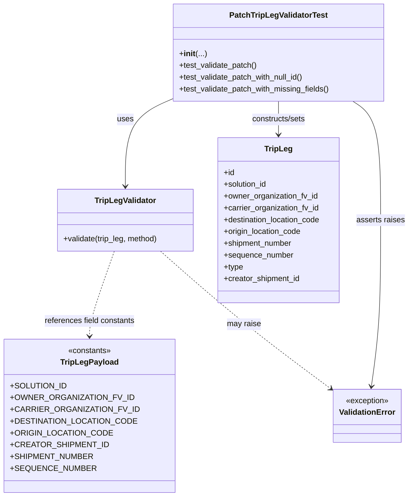
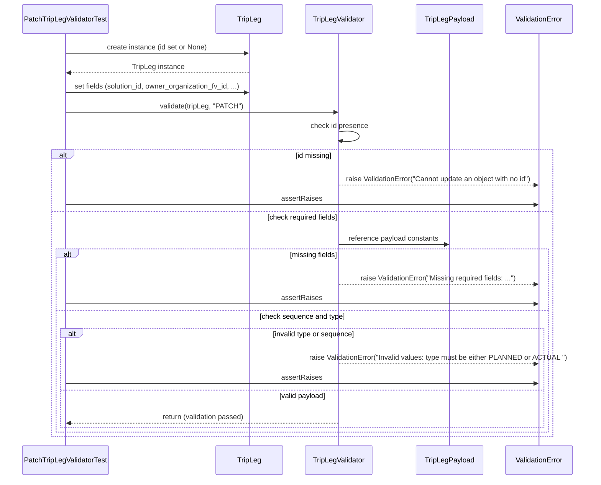

# Diagram: partview_service/partview_service/tests/unit/core/validators/trip_leg/trip_leg_patch_validator_test.py

> Auto-generated by Obscura crawlers

## Diagram 1

### SVG

<svg id="container" width="821.3359375" xmlns="http://www.w3.org/2000/svg" class="classDiagram" height="1010" viewBox="0 0 821.3359375 1010" role="graphics-document document" aria-roledescription="class"><g><defs><marker id="container_class-aggregationStart" class="marker aggregation class" refX="18" refY="7" markerWidth="190" markerHeight="240" orient="auto"><path d="M 18,7 L9,13 L1,7 L9,1 Z"></path></marker></defs><defs><marker id="container_class-aggregationEnd" class="marker aggregation class" refX="1" refY="7" markerWidth="20" markerHeight="28" orient="auto"><path d="M 18,7 L9,13 L1,7 L9,1 Z"></path></marker></defs><defs><marker id="container_class-extensionStart" class="marker extension class" refX="18" refY="7" markerWidth="190" markerHeight="240" orient="auto"><path d="M 1,7 L18,13 V 1 Z"></path></marker></defs><defs><marker id="container_class-extensionEnd" class="marker extension class" refX="1" refY="7" markerWidth="20" markerHeight="28" orient="auto"><path d="M 1,1 V 13 L18,7 Z"></path></marker></defs><defs><marker id="container_class-compositionStart" class="marker composition class" refX="18" refY="7" markerWidth="190" markerHeight="240" orient="auto"><path d="M 18,7 L9,13 L1,7 L9,1 Z"></path></marker></defs><defs><marker id="container_class-compositionEnd" class="marker composition class" refX="1" refY="7" markerWidth="20" markerHeight="28" orient="auto"><path d="M 18,7 L9,13 L1,7 L9,1 Z"></path></marker></defs><defs><marker id="container_class-dependencyStart" class="marker dependency class" refX="6" refY="7" markerWidth="190" markerHeight="240" orient="auto"><path d="M 5,7 L9,13 L1,7 L9,1 Z"></path></marker></defs><defs><marker id="container_class-dependencyEnd" class="marker dependency class" refX="13" refY="7" markerWidth="20" markerHeight="28" orient="auto"><path d="M 18,7 L9,13 L14,7 L9,1 Z"></path></marker></defs><defs><marker id="container_class-lollipopStart" class="marker lollipop class" refX="13" refY="7" markerWidth="190" markerHeight="240" orient="auto"><circle stroke="black" fill="transparent" cx="7" cy="7" r="6"></circle></marker></defs><defs><marker id="container_class-lollipopEnd" class="marker lollipop class" refX="1" refY="7" markerWidth="190" markerHeight="240" orient="auto"><circle stroke="black" fill="transparent" cx="7" cy="7" r="6"></circle></marker></defs><g class="root"><g class="clusters"></g><g class="edgePaths"><path d="M338.855,199.425L321.959,206.688C305.063,213.95,271.27,228.475,254.373,258.404C237.477,288.333,237.477,333.667,237.477,356.333L237.477,379" id="id_PatchTripLegValidatorTest_TripLegValidator_1" class="edge-thickness-normal edge-pattern-solid relation" style=";;;" data-edge="true" data-et="edge" data-id="id_PatchTripLegValidatorTest_TripLegValidator_1" data-points="W3sieCI6MzM4Ljg1NTQ2ODc1LCJ5IjoxOTkuNDI1MTMwNTUzOTQzNzd9LHsieCI6MjM3LjQ3NjU2MjUsInkiOjI0M30seyJ4IjoyMzcuNDc2NTYyNSwieSI6Mzg1fV0=" marker-end="url(#container_class-dependencyEnd)"></path><path d="M553.887,206L553.887,212.167C553.887,218.333,553.887,230.667,553.887,242C553.887,253.333,553.887,263.667,553.887,268.833L553.887,274" id="id_PatchTripLegValidatorTest_TripLeg_2" class="edge-thickness-normal edge-pattern-solid relation" style=";;;" data-edge="true" data-et="edge" data-id="id_PatchTripLegValidatorTest_TripLeg_2" data-points="W3sieCI6NTUzLjg4NjcxODc1LCJ5IjoyMDZ9LHsieCI6NTUzLjg4NjcxODc1LCJ5IjoyNDN9LHsieCI6NTUzLjg4NjcxODc1LCJ5IjoyODB9XQ==" marker-end="url(#container_class-dependencyEnd)"></path><path d="M707.002,206L716.539,212.167C726.077,218.333,745.152,230.667,754.689,271C764.227,311.333,764.227,379.667,764.227,448C764.227,516.333,764.227,584.667,761.086,641.01C757.946,697.353,751.666,741.706,748.526,763.883L745.386,786.059" id="id_PatchTripLegValidatorTest_ValidationError_3" class="edge-thickness-normal edge-pattern-solid relation" style=";;;" data-edge="true" data-et="edge" data-id="id_PatchTripLegValidatorTest_ValidationError_3" data-points="W3sieCI6NzA3LjAwMTc1MjA2ODAxNDYsInkiOjIwNn0seyJ4Ijo3NjQuMjI2NTYyNSwieSI6MjQzfSx7IngiOjc2NC4yMjY1NjI1LCJ5Ijo0NDh9LHsieCI6NzY0LjIyNjU2MjUsInkiOjY1M30seyJ4Ijo3NDQuNTQ0NjQ4NjM5ODk2NCwieSI6NzkyfV0=" marker-end="url(#container_class-dependencyEnd)"></path><path d="M214.73,511L206.185,534.667C197.641,558.333,180.551,605.667,172.006,634.5C163.461,663.333,163.461,673.667,163.461,678.833L163.461,684" id="id_TripLegValidator_TripLegPayload_4" class="edge-thickness-normal edge-pattern-dashed relation" style=";;;" data-edge="true" data-et="edge" data-id="id_TripLegValidator_TripLegPayload_4" data-points="W3sieCI6MjE0LjczMDI5NzI1NjA5NzU3LCJ5Ijo1MTF9LHsieCI6MTYzLjQ2MDkzNzUsInkiOjY1M30seyJ4IjoxNjMuNDYwOTM3NSwieSI6NjkwfV0=" marker-end="url(#container_class-dependencyEnd)"></path><path d="M310.018,511L337.269,534.667C364.52,558.333,419.022,605.667,478.165,652.704C537.309,699.742,601.094,746.483,632.986,769.854L664.879,793.225" id="id_TripLegValidator_ValidationError_5" class="edge-thickness-normal edge-pattern-dashed relation" style=";;;" data-edge="true" data-et="edge" data-id="id_TripLegValidator_ValidationError_5" data-points="W3sieCI6MzEwLjAxNzc5NzI1NjA5NzU0LCJ5Ijo1MTF9LHsieCI6NDczLjUyMzQzNzUsInkiOjY1M30seyJ4Ijo2NjkuNzE4NzUsInkiOjc5Ni43NzEwMzEwODY4NTMzfV0=" marker-end="url(#container_class-dependencyEnd)"></path></g><g class="edgeLabels"><g class="edgeLabel" transform="translate(237.4765625, 243)"><g class="label" data-id="id_PatchTripLegValidatorTest_TripLegValidator_1" transform="translate(-16.4921875, -12)"><foreignObject width="32.984375" height="24">

uses

</foreignObject></g></g><g class="edgeLabel" transform="translate(553.88671875, 243)"><g class="label" data-id="id_PatchTripLegValidatorTest_TripLeg_2" transform="translate(-56.484375, -12)"><foreignObject width="112.96875" height="24">

constructs/sets

</foreignObject></g></g><g class="edgeLabel" transform="translate(764.2265625, 448)"><g class="label" data-id="id_PatchTripLegValidatorTest_ValidationError_3" transform="translate(-49.109375, -12)"><foreignObject width="98.21875" height="24">

asserts raises

</foreignObject></g></g><g class="edgeLabel" transform="translate(163.4609375, 653)"><g class="label" data-id="id_TripLegValidator_TripLegPayload_4" transform="translate(-93.375, -12)"><foreignObject width="186.75" height="24">

references field constants

</foreignObject></g></g><g class="edgeLabel" transform="translate(473.5234375, 653)"><g class="label" data-id="id_TripLegValidator_ValidationError_5" transform="translate(-34.65625, -12)"><foreignObject width="69.3125" height="24">

may raise

</foreignObject></g></g></g><g class="nodes"><g class="node default" id="classId-PatchTripLegValidatorTest-0" transform="translate(553.88671875, 107)"><g class="basic label-container"><path d="M-215.03125 -99 L215.03125 -99 L215.03125 99 L-215.03125 99" stroke="none" stroke-width="0" fill="#ECECFF" style=""></path><path d="M-215.03125 -99 C-104.61389967436273 -99, 5.803450651274545 -99, 215.03125 -99 M-215.03125 -99 C-79.80671339922466 -99, 55.417823201550675 -99, 215.03125 -99 M215.03125 -99 C215.03125 -30.229143210702887, 215.03125 38.541713578594226, 215.03125 99 M215.03125 -99 C215.03125 -38.884925375764404, 215.03125 21.230149248471193, 215.03125 99 M215.03125 99 C125.62620786832689 99, 36.221165736653774 99, -215.03125 99 M215.03125 99 C119.09932173491356 99, 23.16739346982712 99, -215.03125 99 M-215.03125 99 C-215.03125 54.794917987324695, -215.03125 10.58983597464939, -215.03125 -99 M-215.03125 99 C-215.03125 44.84306151725912, -215.03125 -9.313876965481754, -215.03125 -99" stroke="#9370DB" stroke-width="1.3" fill="none" stroke-dasharray="0 0" style=""></path></g><g class="annotation-group text" transform="translate(0, -75)"></g><g class="label-group text" transform="translate(-95.640625, -75)"><g class="label" style="font-weight: bolder" transform="translate(0,-12)"><foreignObject width="191.28125" height="24">

PatchTripLegValidatorTest

</foreignObject></g></g><g class="members-group text" transform="translate(-203.03125, -27)"></g><g class="methods-group text" transform="translate(-203.03125, 3)"><g class="label" style="" transform="translate(0,-12)"><foreignObject width="54.3125" height="24">

+<strong>init</strong>(...)

</foreignObject></g><g class="label" style="" transform="translate(0,12)"><foreignObject width="160.125" height="24">

+test_validate_patch()

</foreignObject></g><g class="label" style="" transform="translate(0,36)"><foreignObject width="258.046875" height="24">

+test_validate_patch_with_null_id()

</foreignObject></g><g class="label" style="" transform="translate(0,60)"><foreignObject width="310.421875" height="24">

+test_validate_patch_with_missing_fields()

</foreignObject></g></g><g class="divider" style=""><path d="M-215.03125 -51 C-44.736789399734306 -51, 125.55767120053139 -51, 215.03125 -51 M-215.03125 -51 C-106.29322113612892 -51, 2.444807727742159 -51, 215.03125 -51" stroke="#9370DB" stroke-width="1.3" fill="none" stroke-dasharray="0 0" style=""></path></g><g class="divider" style=""><path d="M-215.03125 -27 C-128.3844537462807 -27, -41.7376574925614 -27, 215.03125 -27 M-215.03125 -27 C-127.06669573833476 -27, -39.102141476669516 -27, 215.03125 -27" stroke="#9370DB" stroke-width="1.3" fill="none" stroke-dasharray="0 0" style=""></path></g></g><g class="node default" id="classId-TripLeg-1" transform="translate(553.88671875, 448)"><g class="basic label-container"><path d="M-126.23046875 -168 L126.23046875 -168 L126.23046875 168 L-126.23046875 168" stroke="none" stroke-width="0" fill="#ECECFF" style=""></path><path d="M-126.23046875 -168 C-39.89308190974086 -168, 46.444304930518285 -168, 126.23046875 -168 M-126.23046875 -168 C-42.51655521602987 -168, 41.19735831794026 -168, 126.23046875 -168 M126.23046875 -168 C126.23046875 -36.20489545932401, 126.23046875 95.59020908135199, 126.23046875 168 M126.23046875 -168 C126.23046875 -36.22133191902691, 126.23046875 95.55733616194618, 126.23046875 168 M126.23046875 168 C56.096661928373265 168, -14.037144893253469 168, -126.23046875 168 M126.23046875 168 C50.17823652088835 168, -25.873995708223305 168, -126.23046875 168 M-126.23046875 168 C-126.23046875 90.01807726928995, -126.23046875 12.036154538579893, -126.23046875 -168 M-126.23046875 168 C-126.23046875 61.956306506217686, -126.23046875 -44.08738698756463, -126.23046875 -168" stroke="#9370DB" stroke-width="1.3" fill="none" stroke-dasharray="0 0" style=""></path></g><g class="annotation-group text" transform="translate(0, -144)"></g><g class="label-group text" transform="translate(-27.0546875, -144)"><g class="label" style="font-weight: bolder" transform="translate(0,-12)"><foreignObject width="54.109375" height="24">

TripLeg

</foreignObject></g></g><g class="members-group text" transform="translate(-114.23046875, -96)"><g class="label" style="" transform="translate(0,-12)"><foreignObject width="22.078125" height="24">

+id

</foreignObject></g><g class="label" style="" transform="translate(0,12)"><foreignObject width="90.21875" height="24">

+solution_id

</foreignObject></g><g class="label" style="" transform="translate(0,36)"><foreignObject width="193.296875" height="24">

+owner_organization_fv_id

</foreignObject></g><g class="label" style="" transform="translate(0,60)"><foreignObject width="196.171875" height="24">

+carrier_organization_fv_id

</foreignObject></g><g class="label" style="" transform="translate(0,84)"><foreignObject width="201.40625" height="24">

+destination_location_code

</foreignObject></g><g class="label" style="" transform="translate(0,108)"><foreignObject width="160.5" height="24">

+origin_location_code

</foreignObject></g><g class="label" style="" transform="translate(0,132)"><foreignObject width="141.5625" height="24">

+shipment_number

</foreignObject></g><g class="label" style="" transform="translate(0,156)"><foreignObject width="142.015625" height="24">

+sequence_number

</foreignObject></g><g class="label" style="" transform="translate(0,180)"><foreignObject width="39.703125" height="24">

+type

</foreignObject></g><g class="label" style="" transform="translate(0,204)"><foreignObject width="157.546875" height="24">

+creator_shipment_id

</foreignObject></g></g><g class="methods-group text" transform="translate(-114.23046875, 168)"></g><g class="divider" style=""><path d="M-126.23046875 -120 C-68.83018352985015 -120, -11.429898309700292 -120, 126.23046875 -120 M-126.23046875 -120 C-68.06861716457604 -120, -9.906765579152065 -120, 126.23046875 -120" stroke="#9370DB" stroke-width="1.3" fill="none" stroke-dasharray="0 0" style=""></path></g><g class="divider" style=""><path d="M-126.23046875 144 C-62.58847254396234 144, 1.053523662075321 144, 126.23046875 144 M-126.23046875 144 C-55.990590410501696 144, 14.249287928996608 144, 126.23046875 144" stroke="#9370DB" stroke-width="1.3" fill="none" stroke-dasharray="0 0" style=""></path></g></g><g class="node default" id="classId-TripLegValidator-2" transform="translate(237.4765625, 448)"><g class="basic label-container"><path d="M-140.1796875 -63 L140.1796875 -63 L140.1796875 63 L-140.1796875 63" stroke="none" stroke-width="0" fill="#ECECFF" style=""></path><path d="M-140.1796875 -63 C-73.31069249219136 -63, -6.441697484382729 -63, 140.1796875 -63 M-140.1796875 -63 C-83.50591390595466 -63, -26.8321403119093 -63, 140.1796875 -63 M140.1796875 -63 C140.1796875 -37.479152825948525, 140.1796875 -11.95830565189705, 140.1796875 63 M140.1796875 -63 C140.1796875 -16.67114535647859, 140.1796875 29.65770928704282, 140.1796875 63 M140.1796875 63 C56.22254484714132 63, -27.734597805717357 63, -140.1796875 63 M140.1796875 63 C29.67167213303665 63, -80.8363432339267 63, -140.1796875 63 M-140.1796875 63 C-140.1796875 27.079697670190065, -140.1796875 -8.84060465961987, -140.1796875 -63 M-140.1796875 63 C-140.1796875 24.921922012069317, -140.1796875 -13.156155975861367, -140.1796875 -63" stroke="#9370DB" stroke-width="1.3" fill="none" stroke-dasharray="0 0" style=""></path></g><g class="annotation-group text" transform="translate(0, -39)"></g><g class="label-group text" transform="translate(-60.234375, -39)"><g class="label" style="font-weight: bolder" transform="translate(0,-12)"><foreignObject width="120.46875" height="24">

TripLegValidator

</foreignObject></g></g><g class="members-group text" transform="translate(-128.1796875, 9)"></g><g class="methods-group text" transform="translate(-128.1796875, 39)"><g class="label" style="" transform="translate(0,-12)"><foreignObject width="196.125" height="24">

+validate(trip_leg, method)

</foreignObject></g></g><g class="divider" style=""><path d="M-140.1796875 -15 C-75.85485645407765 -15, -11.530025408155296 -15, 140.1796875 -15 M-140.1796875 -15 C-75.78900665200675 -15, -11.398325804013496 -15, 140.1796875 -15" stroke="#9370DB" stroke-width="1.3" fill="none" stroke-dasharray="0 0" style=""></path></g><g class="divider" style=""><path d="M-140.1796875 9 C-67.87334623283483 9, 4.432995034330332 9, 140.1796875 9 M-140.1796875 9 C-54.80776146547166 9, 30.564164569056686 9, 140.1796875 9" stroke="#9370DB" stroke-width="1.3" fill="none" stroke-dasharray="0 0" style=""></path></g></g><g class="node default" id="classId-TripLegPayload-3" transform="translate(163.4609375, 846)"><g class="basic label-container"><path d="M-155.4609375 -156 L155.4609375 -156 L155.4609375 156 L-155.4609375 156" stroke="none" stroke-width="0" fill="#ECECFF" style=""></path><path d="M-155.4609375 -156 C-59.20491183135566 -156, 37.05111383728868 -156, 155.4609375 -156 M-155.4609375 -156 C-52.546290314797005 -156, 50.36835687040599 -156, 155.4609375 -156 M155.4609375 -156 C155.4609375 -84.31893761761374, 155.4609375 -12.637875235227483, 155.4609375 156 M155.4609375 -156 C155.4609375 -69.57102799977955, 155.4609375 16.85794400044091, 155.4609375 156 M155.4609375 156 C62.418612756133896 156, -30.623711987732207 156, -155.4609375 156 M155.4609375 156 C76.35356443802388 156, -2.7538086239522386 156, -155.4609375 156 M-155.4609375 156 C-155.4609375 65.37761414357699, -155.4609375 -25.244771712846017, -155.4609375 -156 M-155.4609375 156 C-155.4609375 89.50397634865233, -155.4609375 23.00795269730466, -155.4609375 -156" stroke="#9370DB" stroke-width="1.3" fill="none" stroke-dasharray="0 0" style=""></path></g><g class="annotation-group text" transform="translate(-44.2265625, -132)"><g class="label" style="" transform="translate(0,-12)"><foreignObject width="88.453125" height="24">

«constants»

</foreignObject></g></g><g class="label-group text" transform="translate(-55.953125, -108)"><g class="label" style="font-weight: bolder" transform="translate(0,-12)"><foreignObject width="111.90625" height="24">

TripLegPayload

</foreignObject></g></g><g class="members-group text" transform="translate(-143.4609375, -60)"><g class="label" style="" transform="translate(0,-12)"><foreignObject width="103.640625" height="24">

+SOLUTION_ID

</foreignObject></g><g class="label" style="" transform="translate(0,12)"><foreignObject width="223.96875" height="24">

+OWNER_ORGANIZATION_FV_ID

</foreignObject></g><g class="label" style="" transform="translate(0,36)"><foreignObject width="230.96875" height="24">

+CARRIER_ORGANIZATION_FV_ID

</foreignObject></g><g class="label" style="" transform="translate(0,60)"><foreignObject width="227.5625" height="24">

+DESTINATION_LOCATION_CODE

</foreignObject></g><g class="label" style="" transform="translate(0,84)"><foreignObject width="184.421875" height="24">

+ORIGIN_LOCATION_CODE

</foreignObject></g><g class="label" style="" transform="translate(0,108)"><foreignObject width="175.90625" height="24">

+CREATOR_SHIPMENT_ID

</foreignObject></g><g class="label" style="" transform="translate(0,132)"><foreignObject width="150.15625" height="24">

+SHIPMENT_NUMBER

</foreignObject></g><g class="label" style="" transform="translate(0,156)"><foreignObject width="153.359375" height="24">

+SEQUENCE_NUMBER

</foreignObject></g></g><g class="methods-group text" transform="translate(-143.4609375, 156)"></g><g class="divider" style=""><path d="M-155.4609375 -84 C-86.68720495290914 -84, -17.913472405818283 -84, 155.4609375 -84 M-155.4609375 -84 C-47.07994291999354 -84, 61.30105166001292 -84, 155.4609375 -84" stroke="#9370DB" stroke-width="1.3" fill="none" stroke-dasharray="0 0" style=""></path></g><g class="divider" style=""><path d="M-155.4609375 132 C-49.3835123842929 132, 56.6939127314142 132, 155.4609375 132 M-155.4609375 132 C-92.27612105943477 132, -29.091304618869543 132, 155.4609375 132" stroke="#9370DB" stroke-width="1.3" fill="none" stroke-dasharray="0 0" style=""></path></g></g><g class="node default" id="classId-ValidationError-4" transform="translate(736.8984375, 846)"><g class="basic label-container"><path d="M-67.1796875 -54 L67.1796875 -54 L67.1796875 54 L-67.1796875 54" stroke="none" stroke-width="0" fill="#ECECFF" style=""></path><path d="M-67.1796875 -54 C-28.07176826909877 -54, 11.036150961802463 -54, 67.1796875 -54 M-67.1796875 -54 C-18.00825601739009 -54, 31.163175465219823 -54, 67.1796875 -54 M67.1796875 -54 C67.1796875 -13.884162133862809, 67.1796875 26.231675732274383, 67.1796875 54 M67.1796875 -54 C67.1796875 -23.916536274312747, 67.1796875 6.166927451374505, 67.1796875 54 M67.1796875 54 C37.72066140905572 54, 8.261635318111445 54, -67.1796875 54 M67.1796875 54 C14.708164382650196 54, -37.76335873469961 54, -67.1796875 54 M-67.1796875 54 C-67.1796875 25.72107392072812, -67.1796875 -2.55785215854376, -67.1796875 -54 M-67.1796875 54 C-67.1796875 27.039025422762705, -67.1796875 0.07805084552541075, -67.1796875 -54" stroke="#9370DB" stroke-width="1.3" fill="none" stroke-dasharray="0 0" style=""></path></g><g class="annotation-group text" transform="translate(-44.3515625, -30)"><g class="label" style="" transform="translate(0,-12)"><foreignObject width="88.703125" height="24">

«exception»

</foreignObject></g></g><g class="label-group text" transform="translate(-55.1796875, -6)"><g class="label" style="font-weight: bolder" transform="translate(0,-12)"><foreignObject width="110.359375" height="24">

ValidationError

</foreignObject></g></g><g class="members-group text" transform="translate(-55.1796875, 42)"></g><g class="methods-group text" transform="translate(-55.1796875, 72)"></g><g class="divider" style=""><path d="M-67.1796875 18 C-33.68946852898093 18, -0.1992495579618634 18, 67.1796875 18 M-67.1796875 18 C-37.16089737974567 18, -7.14210725949134 18, 67.1796875 18" stroke="#9370DB" stroke-width="1.3" fill="none" stroke-dasharray="0 0" style=""></path></g><g class="divider" style=""><path d="M-67.1796875 36 C-35.06864724485366 36, -2.9576069897073154 36, 67.1796875 36 M-67.1796875 36 C-18.754069429658323 36, 29.671548640683355 36, 67.1796875 36" stroke="#9370DB" stroke-width="1.3" fill="none" stroke-dasharray="0 0" style=""></path></g></g></g></g></g></svg>

## Diagram 2

### SVG

<svg id="container" width="1399.5" xmlns="http://www.w3.org/2000/svg" height="1125" viewBox="-50 -10 1399.5 1125" role="graphics-document document" aria-roledescription="sequence"><g><rect x="1149.5" y="1039" fill="#eaeaea" stroke="#666" width="150" height="65" name="E" rx="3" ry="3" class="actor actor-bottom"></rect><text x="1224.5" y="1071.5" dominant-baseline="central" alignment-baseline="central" class="actor actor-box" style="text-anchor: middle; font-size: 16px; font-weight: 400;"><tspan x="1224.5" dy="0">ValidationError</tspan></text></g><g><rect x="949.5" y="1039" fill="#eaeaea" stroke="#666" width="150" height="65" name="P" rx="3" ry="3" class="actor actor-bottom"></rect><text x="1024.5" y="1071.5" dominant-baseline="central" alignment-baseline="central" class="actor actor-box" style="text-anchor: middle; font-size: 16px; font-weight: 400;"><tspan x="1024.5" dy="0">TripLegPayload</tspan></text></g><g><rect x="674.5" y="1039" fill="#eaeaea" stroke="#666" width="150" height="65" name="V" rx="3" ry="3" class="actor actor-bottom"></rect><text x="749.5" y="1071.5" dominant-baseline="central" alignment-baseline="central" class="actor actor-box" style="text-anchor: middle; font-size: 16px; font-weight: 400;"><tspan x="749.5" dy="0">TripLegValidator</tspan></text></g><g><rect x="474.5" y="1039" fill="#eaeaea" stroke="#666" width="150" height="65" name="TL" rx="3" ry="3" class="actor actor-bottom"></rect><text x="549.5" y="1071.5" dominant-baseline="central" alignment-baseline="central" class="actor actor-box" style="text-anchor: middle; font-size: 16px; font-weight: 400;"><tspan x="549.5" dy="0">TripLeg</tspan></text></g><g><rect x="0" y="1039" fill="#eaeaea" stroke="#666" width="207" height="65" name="Test" rx="3" ry="3" class="actor actor-bottom"></rect><text x="103.5" y="1071.5" dominant-baseline="central" alignment-baseline="central" class="actor actor-box" style="text-anchor: middle; font-size: 16px; font-weight: 400;"><tspan x="103.5" dy="0">PatchTripLegValidatorTest</tspan></text></g><g><line id="actor4" x1="1224.5" y1="65" x2="1224.5" y2="1039" class="actor-line 200" stroke-width="0.5px" stroke="#999" name="E"></line><g id="root-4"><rect x="1149.5" y="0" fill="#eaeaea" stroke="#666" width="150" height="65" name="E" rx="3" ry="3" class="actor actor-top"></rect><text x="1224.5" y="32.5" dominant-baseline="central" alignment-baseline="central" class="actor actor-box" style="text-anchor: middle; font-size: 16px; font-weight: 400;"><tspan x="1224.5" dy="0">ValidationError</tspan></text></g></g><g><line id="actor3" x1="1024.5" y1="65" x2="1024.5" y2="1039" class="actor-line 200" stroke-width="0.5px" stroke="#999" name="P"></line><g id="root-3"><rect x="949.5" y="0" fill="#eaeaea" stroke="#666" width="150" height="65" name="P" rx="3" ry="3" class="actor actor-top"></rect><text x="1024.5" y="32.5" dominant-baseline="central" alignment-baseline="central" class="actor actor-box" style="text-anchor: middle; font-size: 16px; font-weight: 400;"><tspan x="1024.5" dy="0">TripLegPayload</tspan></text></g></g><g><line id="actor2" x1="749.5" y1="65" x2="749.5" y2="1039" class="actor-line 200" stroke-width="0.5px" stroke="#999" name="V"></line><g id="root-2"><rect x="674.5" y="0" fill="#eaeaea" stroke="#666" width="150" height="65" name="V" rx="3" ry="3" class="actor actor-top"></rect><text x="749.5" y="32.5" dominant-baseline="central" alignment-baseline="central" class="actor actor-box" style="text-anchor: middle; font-size: 16px; font-weight: 400;"><tspan x="749.5" dy="0">TripLegValidator</tspan></text></g></g><g><line id="actor1" x1="549.5" y1="65" x2="549.5" y2="1039" class="actor-line 200" stroke-width="0.5px" stroke="#999" name="TL"></line><g id="root-1"><rect x="474.5" y="0" fill="#eaeaea" stroke="#666" width="150" height="65" name="TL" rx="3" ry="3" class="actor actor-top"></rect><text x="549.5" y="32.5" dominant-baseline="central" alignment-baseline="central" class="actor actor-box" style="text-anchor: middle; font-size: 16px; font-weight: 400;"><tspan x="549.5" dy="0">TripLeg</tspan></text></g></g><g><line id="actor0" x1="103.5" y1="65" x2="103.5" y2="1039" class="actor-line 200" stroke-width="0.5px" stroke="#999" name="Test"></line><g id="root-0"><rect x="0" y="0" fill="#eaeaea" stroke="#666" width="207" height="65" name="Test" rx="3" ry="3" class="actor actor-top"></rect><text x="103.5" y="32.5" dominant-baseline="central" alignment-baseline="central" class="actor actor-box" style="text-anchor: middle; font-size: 16px; font-weight: 400;"><tspan x="103.5" dy="0">PatchTripLegValidatorTest</tspan></text></g></g><g></g><defs><symbol id="computer" width="24" height="24"><path transform="scale(.5)" d="M2 2v13h20v-13h-20zm18 11h-16v-9h16v9zm-10.228 6l.466-1h3.524l.467 1h-4.457zm14.228 3h-24l2-6h2.104l-1.33 4h18.45l-1.297-4h2.073l2 6zm-5-10h-14v-7h14v7z"></path></symbol></defs><defs><symbol id="database" fill-rule="evenodd" clip-rule="evenodd"><path transform="scale(.5)" d="M12.258.001l.256.004.255.005.253.008.251.01.249.012.247.015.246.016.242.019.241.02.239.023.236.024.233.027.231.028.229.031.225.032.223.034.22.036.217.038.214.04.211.041.208.043.205.045.201.046.198.048.194.05.191.051.187.053.183.054.18.056.175.057.172.059.168.06.163.061.16.063.155.064.15.066.074.033.073.033.071.034.07.034.069.035.068.035.067.035.066.035.064.036.064.036.062.036.06.036.06.037.058.037.058.037.055.038.055.038.053.038.052.038.051.039.05.039.048.039.047.039.045.04.044.04.043.04.041.04.04.041.039.041.037.041.036.041.034.041.033.042.032.042.03.042.029.042.027.042.026.043.024.043.023.043.021.043.02.043.018.044.017.043.015.044.013.044.012.044.011.045.009.044.007.045.006.045.004.045.002.045.001.045v17l-.001.045-.002.045-.004.045-.006.045-.007.045-.009.044-.011.045-.012.044-.013.044-.015.044-.017.043-.018.044-.02.043-.021.043-.023.043-.024.043-.026.043-.027.042-.029.042-.03.042-.032.042-.033.042-.034.041-.036.041-.037.041-.039.041-.04.041-.041.04-.043.04-.044.04-.045.04-.047.039-.048.039-.05.039-.051.039-.052.038-.053.038-.055.038-.055.038-.058.037-.058.037-.06.037-.06.036-.062.036-.064.036-.064.036-.066.035-.067.035-.068.035-.069.035-.07.034-.071.034-.073.033-.074.033-.15.066-.155.064-.16.063-.163.061-.168.06-.172.059-.175.057-.18.056-.183.054-.187.053-.191.051-.194.05-.198.048-.201.046-.205.045-.208.043-.211.041-.214.04-.217.038-.22.036-.223.034-.225.032-.229.031-.231.028-.233.027-.236.024-.239.023-.241.02-.242.019-.246.016-.247.015-.249.012-.251.01-.253.008-.255.005-.256.004-.258.001-.258-.001-.256-.004-.255-.005-.253-.008-.251-.01-.249-.012-.247-.015-.245-.016-.243-.019-.241-.02-.238-.023-.236-.024-.234-.027-.231-.028-.228-.031-.226-.032-.223-.034-.22-.036-.217-.038-.214-.04-.211-.041-.208-.043-.204-.045-.201-.046-.198-.048-.195-.05-.19-.051-.187-.053-.184-.054-.179-.056-.176-.057-.172-.059-.167-.06-.164-.061-.159-.063-.155-.064-.151-.066-.074-.033-.072-.033-.072-.034-.07-.034-.069-.035-.068-.035-.067-.035-.066-.035-.064-.036-.063-.036-.062-.036-.061-.036-.06-.037-.058-.037-.057-.037-.056-.038-.055-.038-.053-.038-.052-.038-.051-.039-.049-.039-.049-.039-.046-.039-.046-.04-.044-.04-.043-.04-.041-.04-.04-.041-.039-.041-.037-.041-.036-.041-.034-.041-.033-.042-.032-.042-.03-.042-.029-.042-.027-.042-.026-.043-.024-.043-.023-.043-.021-.043-.02-.043-.018-.044-.017-.043-.015-.044-.013-.044-.012-.044-.011-.045-.009-.044-.007-.045-.006-.045-.004-.045-.002-.045-.001-.045v-17l.001-.045.002-.045.004-.045.006-.045.007-.045.009-.044.011-.045.012-.044.013-.044.015-.044.017-.043.018-.044.02-.043.021-.043.023-.043.024-.043.026-.043.027-.042.029-.042.03-.042.032-.042.033-.042.034-.041.036-.041.037-.041.039-.041.04-.041.041-.04.043-.04.044-.04.046-.04.046-.039.049-.039.049-.039.051-.039.052-.038.053-.038.055-.038.056-.038.057-.037.058-.037.06-.037.061-.036.062-.036.063-.036.064-.036.066-.035.067-.035.068-.035.069-.035.07-.034.072-.034.072-.033.074-.033.151-.066.155-.064.159-.063.164-.061.167-.06.172-.059.176-.057.179-.056.184-.054.187-.053.19-.051.195-.05.198-.048.201-.046.204-.045.208-.043.211-.041.214-.04.217-.038.22-.036.223-.034.226-.032.228-.031.231-.028.234-.027.236-.024.238-.023.241-.02.243-.019.245-.016.247-.015.249-.012.251-.01.253-.008.255-.005.256-.004.258-.001.258.001zm-9.258 20.499v.01l.001.021.003.021.004.022.005.021.006.022.007.022.009.023.01.022.011.023.012.023.013.023.015.023.016.024.017.023.018.024.019.024.021.024.022.025.023.024.024.025.052.049.056.05.061.051.066.051.07.051.075.051.079.052.084.052.088.052.092.052.097.052.102.051.105.052.11.052.114.051.119.051.123.051.127.05.131.05.135.05.139.048.144.049.147.047.152.047.155.047.16.045.163.045.167.043.171.043.176.041.178.041.183.039.187.039.19.037.194.035.197.035.202.033.204.031.209.03.212.029.216.027.219.025.222.024.226.021.23.02.233.018.236.016.24.015.243.012.246.01.249.008.253.005.256.004.259.001.26-.001.257-.004.254-.005.25-.008.247-.011.244-.012.241-.014.237-.016.233-.018.231-.021.226-.021.224-.024.22-.026.216-.027.212-.028.21-.031.205-.031.202-.034.198-.034.194-.036.191-.037.187-.039.183-.04.179-.04.175-.042.172-.043.168-.044.163-.045.16-.046.155-.046.152-.047.148-.048.143-.049.139-.049.136-.05.131-.05.126-.05.123-.051.118-.052.114-.051.11-.052.106-.052.101-.052.096-.052.092-.052.088-.053.083-.051.079-.052.074-.052.07-.051.065-.051.06-.051.056-.05.051-.05.023-.024.023-.025.021-.024.02-.024.019-.024.018-.024.017-.024.015-.023.014-.024.013-.023.012-.023.01-.023.01-.022.008-.022.006-.022.006-.022.004-.022.004-.021.001-.021.001-.021v-4.127l-.077.055-.08.053-.083.054-.085.053-.087.052-.09.052-.093.051-.095.05-.097.05-.1.049-.102.049-.105.048-.106.047-.109.047-.111.046-.114.045-.115.045-.118.044-.12.043-.122.042-.124.042-.126.041-.128.04-.13.04-.132.038-.134.038-.135.037-.138.037-.139.035-.142.035-.143.034-.144.033-.147.032-.148.031-.15.03-.151.03-.153.029-.154.027-.156.027-.158.026-.159.025-.161.024-.162.023-.163.022-.165.021-.166.02-.167.019-.169.018-.169.017-.171.016-.173.015-.173.014-.175.013-.175.012-.177.011-.178.01-.179.008-.179.008-.181.006-.182.005-.182.004-.184.003-.184.002h-.37l-.184-.002-.184-.003-.182-.004-.182-.005-.181-.006-.179-.008-.179-.008-.178-.01-.176-.011-.176-.012-.175-.013-.173-.014-.172-.015-.171-.016-.17-.017-.169-.018-.167-.019-.166-.02-.165-.021-.163-.022-.162-.023-.161-.024-.159-.025-.157-.026-.156-.027-.155-.027-.153-.029-.151-.03-.15-.03-.148-.031-.146-.032-.145-.033-.143-.034-.141-.035-.14-.035-.137-.037-.136-.037-.134-.038-.132-.038-.13-.04-.128-.04-.126-.041-.124-.042-.122-.042-.12-.044-.117-.043-.116-.045-.113-.045-.112-.046-.109-.047-.106-.047-.105-.048-.102-.049-.1-.049-.097-.05-.095-.05-.093-.052-.09-.051-.087-.052-.085-.053-.083-.054-.08-.054-.077-.054v4.127zm0-5.654v.011l.001.021.003.021.004.021.005.022.006.022.007.022.009.022.01.022.011.023.012.023.013.023.015.024.016.023.017.024.018.024.019.024.021.024.022.024.023.025.024.024.052.05.056.05.061.05.066.051.07.051.075.052.079.051.084.052.088.052.092.052.097.052.102.052.105.052.11.051.114.051.119.052.123.05.127.051.131.05.135.049.139.049.144.048.147.048.152.047.155.046.16.045.163.045.167.044.171.042.176.042.178.04.183.04.187.038.19.037.194.036.197.034.202.033.204.032.209.03.212.028.216.027.219.025.222.024.226.022.23.02.233.018.236.016.24.014.243.012.246.01.249.008.253.006.256.003.259.001.26-.001.257-.003.254-.006.25-.008.247-.01.244-.012.241-.015.237-.016.233-.018.231-.02.226-.022.224-.024.22-.025.216-.027.212-.029.21-.03.205-.032.202-.033.198-.035.194-.036.191-.037.187-.039.183-.039.179-.041.175-.042.172-.043.168-.044.163-.045.16-.045.155-.047.152-.047.148-.048.143-.048.139-.05.136-.049.131-.05.126-.051.123-.051.118-.051.114-.052.11-.052.106-.052.101-.052.096-.052.092-.052.088-.052.083-.052.079-.052.074-.051.07-.052.065-.051.06-.05.056-.051.051-.049.023-.025.023-.024.021-.025.02-.024.019-.024.018-.024.017-.024.015-.023.014-.023.013-.024.012-.022.01-.023.01-.023.008-.022.006-.022.006-.022.004-.021.004-.022.001-.021.001-.021v-4.139l-.077.054-.08.054-.083.054-.085.052-.087.053-.09.051-.093.051-.095.051-.097.05-.1.049-.102.049-.105.048-.106.047-.109.047-.111.046-.114.045-.115.044-.118.044-.12.044-.122.042-.124.042-.126.041-.128.04-.13.039-.132.039-.134.038-.135.037-.138.036-.139.036-.142.035-.143.033-.144.033-.147.033-.148.031-.15.03-.151.03-.153.028-.154.028-.156.027-.158.026-.159.025-.161.024-.162.023-.163.022-.165.021-.166.02-.167.019-.169.018-.169.017-.171.016-.173.015-.173.014-.175.013-.175.012-.177.011-.178.009-.179.009-.179.007-.181.007-.182.005-.182.004-.184.003-.184.002h-.37l-.184-.002-.184-.003-.182-.004-.182-.005-.181-.007-.179-.007-.179-.009-.178-.009-.176-.011-.176-.012-.175-.013-.173-.014-.172-.015-.171-.016-.17-.017-.169-.018-.167-.019-.166-.02-.165-.021-.163-.022-.162-.023-.161-.024-.159-.025-.157-.026-.156-.027-.155-.028-.153-.028-.151-.03-.15-.03-.148-.031-.146-.033-.145-.033-.143-.033-.141-.035-.14-.036-.137-.036-.136-.037-.134-.038-.132-.039-.13-.039-.128-.04-.126-.041-.124-.042-.122-.043-.12-.043-.117-.044-.116-.044-.113-.046-.112-.046-.109-.046-.106-.047-.105-.048-.102-.049-.1-.049-.097-.05-.095-.051-.093-.051-.09-.051-.087-.053-.085-.052-.083-.054-.08-.054-.077-.054v4.139zm0-5.666v.011l.001.02.003.022.004.021.005.022.006.021.007.022.009.023.01.022.011.023.012.023.013.023.015.023.016.024.017.024.018.023.019.024.021.025.022.024.023.024.024.025.052.05.056.05.061.05.066.051.07.051.075.052.079.051.084.052.088.052.092.052.097.052.102.052.105.051.11.052.114.051.119.051.123.051.127.05.131.05.135.05.139.049.144.048.147.048.152.047.155.046.16.045.163.045.167.043.171.043.176.042.178.04.183.04.187.038.19.037.194.036.197.034.202.033.204.032.209.03.212.028.216.027.219.025.222.024.226.021.23.02.233.018.236.017.24.014.243.012.246.01.249.008.253.006.256.003.259.001.26-.001.257-.003.254-.006.25-.008.247-.01.244-.013.241-.014.237-.016.233-.018.231-.02.226-.022.224-.024.22-.025.216-.027.212-.029.21-.03.205-.032.202-.033.198-.035.194-.036.191-.037.187-.039.183-.039.179-.041.175-.042.172-.043.168-.044.163-.045.16-.045.155-.047.152-.047.148-.048.143-.049.139-.049.136-.049.131-.051.126-.05.123-.051.118-.052.114-.051.11-.052.106-.052.101-.052.096-.052.092-.052.088-.052.083-.052.079-.052.074-.052.07-.051.065-.051.06-.051.056-.05.051-.049.023-.025.023-.025.021-.024.02-.024.019-.024.018-.024.017-.024.015-.023.014-.024.013-.023.012-.023.01-.022.01-.023.008-.022.006-.022.006-.022.004-.022.004-.021.001-.021.001-.021v-4.153l-.077.054-.08.054-.083.053-.085.053-.087.053-.09.051-.093.051-.095.051-.097.05-.1.049-.102.048-.105.048-.106.048-.109.046-.111.046-.114.046-.115.044-.118.044-.12.043-.122.043-.124.042-.126.041-.128.04-.13.039-.132.039-.134.038-.135.037-.138.036-.139.036-.142.034-.143.034-.144.033-.147.032-.148.032-.15.03-.151.03-.153.028-.154.028-.156.027-.158.026-.159.024-.161.024-.162.023-.163.023-.165.021-.166.02-.167.019-.169.018-.169.017-.171.016-.173.015-.173.014-.175.013-.175.012-.177.01-.178.01-.179.009-.179.007-.181.006-.182.006-.182.004-.184.003-.184.001-.185.001-.185-.001-.184-.001-.184-.003-.182-.004-.182-.006-.181-.006-.179-.007-.179-.009-.178-.01-.176-.01-.176-.012-.175-.013-.173-.014-.172-.015-.171-.016-.17-.017-.169-.018-.167-.019-.166-.02-.165-.021-.163-.023-.162-.023-.161-.024-.159-.024-.157-.026-.156-.027-.155-.028-.153-.028-.151-.03-.15-.03-.148-.032-.146-.032-.145-.033-.143-.034-.141-.034-.14-.036-.137-.036-.136-.037-.134-.038-.132-.039-.13-.039-.128-.041-.126-.041-.124-.041-.122-.043-.12-.043-.117-.044-.116-.044-.113-.046-.112-.046-.109-.046-.106-.048-.105-.048-.102-.048-.1-.05-.097-.049-.095-.051-.093-.051-.09-.052-.087-.052-.085-.053-.083-.053-.08-.054-.077-.054v4.153zm8.74-8.179l-.257.004-.254.005-.25.008-.247.011-.244.012-.241.014-.237.016-.233.018-.231.021-.226.022-.224.023-.22.026-.216.027-.212.028-.21.031-.205.032-.202.033-.198.034-.194.036-.191.038-.187.038-.183.04-.179.041-.175.042-.172.043-.168.043-.163.045-.16.046-.155.046-.152.048-.148.048-.143.048-.139.049-.136.05-.131.05-.126.051-.123.051-.118.051-.114.052-.11.052-.106.052-.101.052-.096.052-.092.052-.088.052-.083.052-.079.052-.074.051-.07.052-.065.051-.06.05-.056.05-.051.05-.023.025-.023.024-.021.024-.02.025-.019.024-.018.024-.017.023-.015.024-.014.023-.013.023-.012.023-.01.023-.01.022-.008.022-.006.023-.006.021-.004.022-.004.021-.001.021-.001.021.001.021.001.021.004.021.004.022.006.021.006.023.008.022.01.022.01.023.012.023.013.023.014.023.015.024.017.023.018.024.019.024.02.025.021.024.023.024.023.025.051.05.056.05.06.05.065.051.07.052.074.051.079.052.083.052.088.052.092.052.096.052.101.052.106.052.11.052.114.052.118.051.123.051.126.051.131.05.136.05.139.049.143.048.148.048.152.048.155.046.16.046.163.045.168.043.172.043.175.042.179.041.183.04.187.038.191.038.194.036.198.034.202.033.205.032.21.031.212.028.216.027.22.026.224.023.226.022.231.021.233.018.237.016.241.014.244.012.247.011.25.008.254.005.257.004.26.001.26-.001.257-.004.254-.005.25-.008.247-.011.244-.012.241-.014.237-.016.233-.018.231-.021.226-.022.224-.023.22-.026.216-.027.212-.028.21-.031.205-.032.202-.033.198-.034.194-.036.191-.038.187-.038.183-.04.179-.041.175-.042.172-.043.168-.043.163-.045.16-.046.155-.046.152-.048.148-.048.143-.048.139-.049.136-.05.131-.05.126-.051.123-.051.118-.051.114-.052.11-.052.106-.052.101-.052.096-.052.092-.052.088-.052.083-.052.079-.052.074-.051.07-.052.065-.051.06-.05.056-.05.051-.05.023-.025.023-.024.021-.024.02-.025.019-.024.018-.024.017-.023.015-.024.014-.023.013-.023.012-.023.01-.023.01-.022.008-.022.006-.023.006-.021.004-.022.004-.021.001-.021.001-.021-.001-.021-.001-.021-.004-.021-.004-.022-.006-.021-.006-.023-.008-.022-.01-.022-.01-.023-.012-.023-.013-.023-.014-.023-.015-.024-.017-.023-.018-.024-.019-.024-.02-.025-.021-.024-.023-.024-.023-.025-.051-.05-.056-.05-.06-.05-.065-.051-.07-.052-.074-.051-.079-.052-.083-.052-.088-.052-.092-.052-.096-.052-.101-.052-.106-.052-.11-.052-.114-.052-.118-.051-.123-.051-.126-.051-.131-.05-.136-.05-.139-.049-.143-.048-.148-.048-.152-.048-.155-.046-.16-.046-.163-.045-.168-.043-.172-.043-.175-.042-.179-.041-.183-.04-.187-.038-.191-.038-.194-.036-.198-.034-.202-.033-.205-.032-.21-.031-.212-.028-.216-.027-.22-.026-.224-.023-.226-.022-.231-.021-.233-.018-.237-.016-.241-.014-.244-.012-.247-.011-.25-.008-.254-.005-.257-.004-.26-.001-.26.001z"></path></symbol></defs><defs><symbol id="clock" width="24" height="24"><path transform="scale(.5)" d="M12 2c5.514 0 10 4.486 10 10s-4.486 10-10 10-10-4.486-10-10 4.486-10 10-10zm0-2c-6.627 0-12 5.373-12 12s5.373 12 12 12 12-5.373 12-12-5.373-12-12-12zm5.848 12.459c.202.038.202.333.001.372-1.907.361-6.045 1.111-6.547 1.111-.719 0-1.301-.582-1.301-1.301 0-.512.77-5.447 1.125-7.445.034-.192.312-.181.343.014l.985 6.238 5.394 1.011z"></path></symbol></defs><defs><marker id="arrowhead" refX="7.9" refY="5" markerUnits="userSpaceOnUse" markerWidth="12" markerHeight="12" orient="auto-start-reverse"><path d="M -1 0 L 10 5 L 0 10 z"></path></marker></defs><defs><marker id="crosshead" markerWidth="15" markerHeight="8" orient="auto" refX="4" refY="4.5"><path fill="none" stroke="#000000" stroke-width="1pt" d="M 1,2 L 6,7 M 6,2 L 1,7" style="stroke-dasharray: 0, 0;"></path></marker></defs><defs><marker id="filled-head" refX="15.5" refY="7" markerWidth="20" markerHeight="28" orient="auto"><path d="M 18,7 L9,13 L14,7 L9,1 Z"></path></marker></defs><defs><marker id="sequencenumber" refX="15" refY="15" markerWidth="60" markerHeight="40" orient="auto"><circle cx="15" cy="15" r="6"></circle></marker></defs><g><line x1="92.5" y1="765" x2="1235.5" y2="765" class="loopLine"></line><line x1="1235.5" y1="765" x2="1235.5" y2="999" class="loopLine"></line><line x1="92.5" y1="999" x2="1235.5" y2="999" class="loopLine"></line><line x1="92.5" y1="765" x2="92.5" y2="999" class="loopLine"></line><line x1="92.5" y1="911" x2="1235.5" y2="911" class="loopLine" style="stroke-dasharray: 3, 3;"></line><polygon points="92.5,765 142.5,765 142.5,778 134.1,785 92.5,785" class="labelBox"></polygon><text x="118" y="778" text-anchor="middle" dominant-baseline="middle" alignment-baseline="middle" class="labelText" style="font-size: 16px; font-weight: 400;">alt</text><text x="689" y="783" text-anchor="middle" class="loopText" style="font-size: 16px; font-weight: 400;"><tspan x="689">[invalid type or sequence]</tspan></text><text x="664" y="929" text-anchor="middle" class="loopText" style="font-size: 16px; font-weight: 400;">[valid payload]</text></g><g><line x1="82.5" y1="579" x2="1245.5" y2="579" class="loopLine"></line><line x1="1245.5" y1="579" x2="1245.5" y2="1009" class="loopLine"></line><line x1="82.5" y1="1009" x2="1245.5" y2="1009" class="loopLine"></line><line x1="82.5" y1="579" x2="82.5" y2="1009" class="loopLine"></line><line x1="82.5" y1="725" x2="1245.5" y2="725" class="loopLine" style="stroke-dasharray: 3, 3;"></line><polygon points="82.5,579 132.5,579 132.5,592 124.1,599 82.5,599" class="labelBox"></polygon><text x="108" y="592" text-anchor="middle" dominant-baseline="middle" alignment-baseline="middle" class="labelText" style="font-size: 16px; font-weight: 400;">alt</text><text x="689" y="597" text-anchor="middle" class="loopText" style="font-size: 16px; font-weight: 400;"><tspan x="689">[missing fields]</tspan></text><text x="664" y="743" text-anchor="middle" class="loopText" style="font-size: 16px; font-weight: 400;">[check sequence and type]</text></g><g><line x1="72.5" y1="345" x2="1255.5" y2="345" class="loopLine"></line><line x1="1255.5" y1="345" x2="1255.5" y2="1019" class="loopLine"></line><line x1="72.5" y1="1019" x2="1255.5" y2="1019" class="loopLine"></line><line x1="72.5" y1="345" x2="72.5" y2="1019" class="loopLine"></line><line x1="72.5" y1="491" x2="1255.5" y2="491" class="loopLine" style="stroke-dasharray: 3, 3;"></line><polygon points="72.5,345 122.5,345 122.5,358 114.1,365 72.5,365" class="labelBox"></polygon><text x="98" y="358" text-anchor="middle" dominant-baseline="middle" alignment-baseline="middle" class="labelText" style="font-size: 16px; font-weight: 400;">alt</text><text x="689" y="363" text-anchor="middle" class="loopText" style="font-size: 16px; font-weight: 400;"><tspan x="689">[id missing]</tspan></text><text x="664" y="509" text-anchor="middle" class="loopText" style="font-size: 16px; font-weight: 400;">[check required fields]</text></g><text x="325" y="80" text-anchor="middle" dominant-baseline="middle" alignment-baseline="middle" class="messageText" dy="1em" style="font-size: 16px; font-weight: 400;">create instance (id set or None)</text><line x1="104.5" y1="113" x2="545.5" y2="113" class="messageLine0" stroke-width="2" stroke="none" marker-end="url(#arrowhead)" style="fill: none;"></line><text x="328" y="128" text-anchor="middle" dominant-baseline="middle" alignment-baseline="middle" class="messageText" dy="1em" style="font-size: 16px; font-weight: 400;">TripLeg instance</text><line x1="548.5" y1="161" x2="107.5" y2="161" class="messageLine1" stroke-width="2" stroke="none" marker-end="url(#arrowhead)" style="stroke-dasharray: 3, 3; fill: none;"></line><text x="325" y="176" text-anchor="middle" dominant-baseline="middle" alignment-baseline="middle" class="messageText" dy="1em" style="font-size: 16px; font-weight: 400;">set fields (solution_id, owner_organization_fv_id, ...)</text><line x1="104.5" y1="209" x2="545.5" y2="209" class="messageLine0" stroke-width="2" stroke="none" marker-end="url(#arrowhead)" style="fill: none;"></line><text x="425" y="224" text-anchor="middle" dominant-baseline="middle" alignment-baseline="middle" class="messageText" dy="1em" style="font-size: 16px; font-weight: 400;">validate(tripLeg, "PATCH")</text><line x1="104.5" y1="257" x2="745.5" y2="257" class="messageLine0" stroke-width="2" stroke="none" marker-end="url(#arrowhead)" style="fill: none;"></line><text x="751" y="272" text-anchor="middle" dominant-baseline="middle" alignment-baseline="middle" class="messageText" dy="1em" style="font-size: 16px; font-weight: 400;">check id presence</text><path d="M 750.5,305 C 810.5,295 810.5,335 750.5,325" class="messageLine0" stroke-width="2" stroke="none" marker-end="url(#arrowhead)" style="fill: none;"></path><text x="986" y="395" text-anchor="middle" dominant-baseline="middle" alignment-baseline="middle" class="messageText" dy="1em" style="font-size: 16px; font-weight: 400;">raise ValidationError("Cannot update an object with no id")</text><line x1="750.5" y1="428" x2="1220.5" y2="428" class="messageLine1" stroke-width="2" stroke="none" marker-end="url(#arrowhead)" style="stroke-dasharray: 3, 3; fill: none;"></line><text x="663" y="443" text-anchor="middle" dominant-baseline="middle" alignment-baseline="middle" class="messageText" dy="1em" style="font-size: 16px; font-weight: 400;">assertRaises</text><line x1="104.5" y1="476" x2="1220.5" y2="476" class="messageLine0" stroke-width="2" stroke="none" marker-end="url(#arrowhead)" style="fill: none;"></line><text x="886" y="536" text-anchor="middle" dominant-baseline="middle" alignment-baseline="middle" class="messageText" dy="1em" style="font-size: 16px; font-weight: 400;">reference payload constants</text><line x1="750.5" y1="569" x2="1020.5" y2="569" class="messageLine0" stroke-width="2" stroke="none" marker-end="url(#arrowhead)" style="fill: none;"></line><text x="986" y="629" text-anchor="middle" dominant-baseline="middle" alignment-baseline="middle" class="messageText" dy="1em" style="font-size: 16px; font-weight: 400;">raise ValidationError("Missing required fields: ...")</text><line x1="750.5" y1="662" x2="1220.5" y2="662" class="messageLine1" stroke-width="2" stroke="none" marker-end="url(#arrowhead)" style="stroke-dasharray: 3, 3; fill: none;"></line><text x="663" y="677" text-anchor="middle" dominant-baseline="middle" alignment-baseline="middle" class="messageText" dy="1em" style="font-size: 16px; font-weight: 400;">assertRaises</text><line x1="104.5" y1="710" x2="1220.5" y2="710" class="messageLine0" stroke-width="2" stroke="none" marker-end="url(#arrowhead)" style="fill: none;"></line><text x="986" y="815" text-anchor="middle" dominant-baseline="middle" alignment-baseline="middle" class="messageText" dy="1em" style="font-size: 16px; font-weight: 400;">raise ValidationError("Invalid values: type must be either PLANNED or ACTUAL ")</text><line x1="750.5" y1="848" x2="1220.5" y2="848" class="messageLine1" stroke-width="2" stroke="none" marker-end="url(#arrowhead)" style="stroke-dasharray: 3, 3; fill: none;"></line><text x="663" y="863" text-anchor="middle" dominant-baseline="middle" alignment-baseline="middle" class="messageText" dy="1em" style="font-size: 16px; font-weight: 400;">assertRaises</text><line x1="104.5" y1="896" x2="1220.5" y2="896" class="messageLine0" stroke-width="2" stroke="none" marker-end="url(#arrowhead)" style="fill: none;"></line><text x="428" y="956" text-anchor="middle" dominant-baseline="middle" alignment-baseline="middle" class="messageText" dy="1em" style="font-size: 16px; font-weight: 400;">return (validation passed)</text><line x1="748.5" y1="989" x2="107.5" y2="989" class="messageLine1" stroke-width="2" stroke="none" marker-end="url(#arrowhead)" style="stroke-dasharray: 3, 3; fill: none;"></line></svg>
