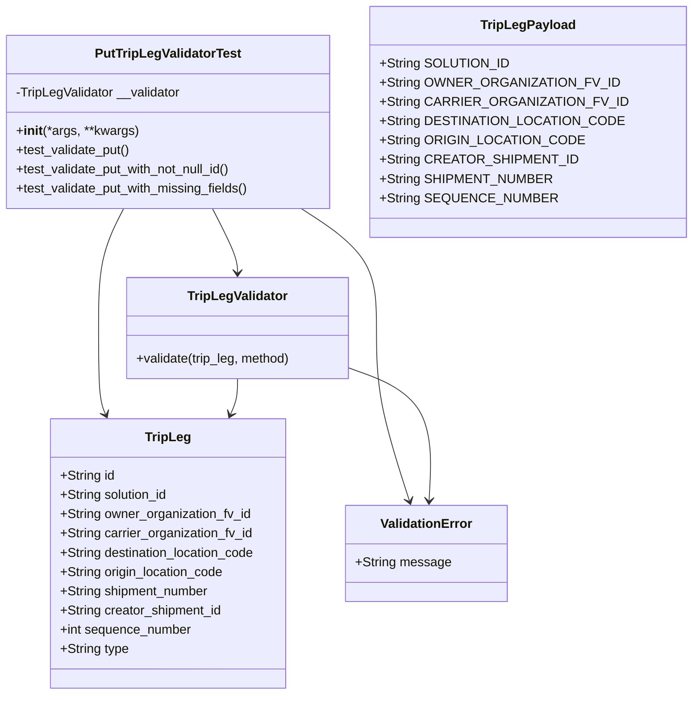
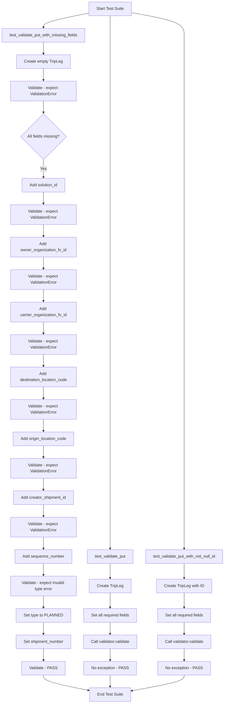
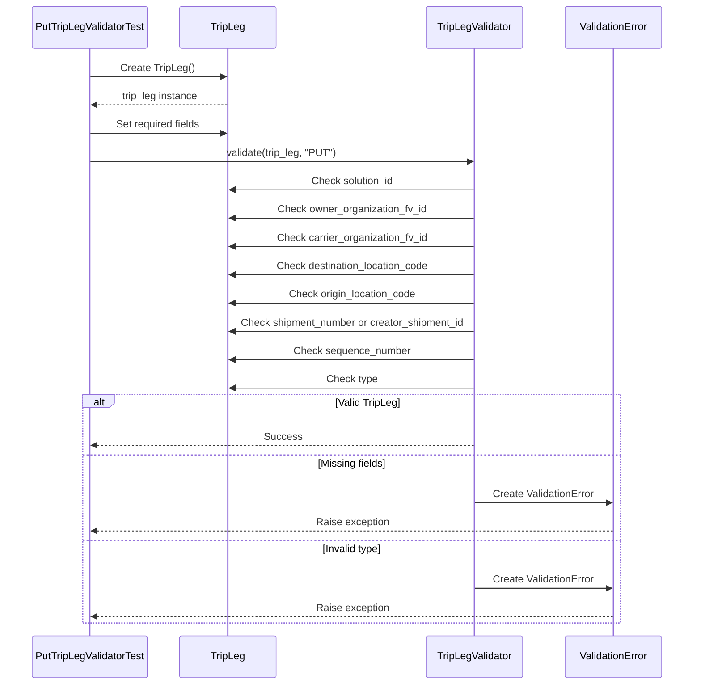
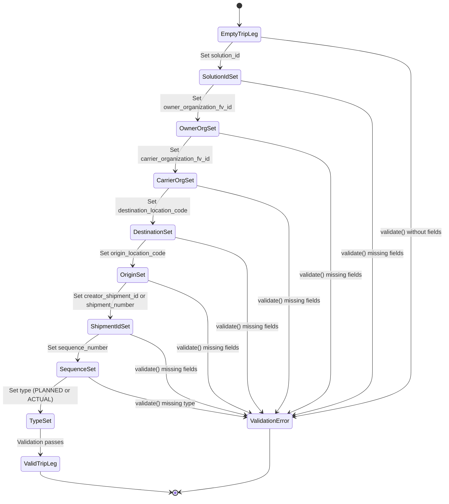

# Diagram: partview_service/partview_service/tests/unit/core/validators/trip_leg/trip_leg_put_validator_test.py

> Auto-generated by Obscura crawlers

## Diagram 1

### SVG

<svg id="container" width="829.5546875" xmlns="http://www.w3.org/2000/svg" class="classDiagram" height="866" viewBox="0 0 829.5546875 866" role="graphics-document document" aria-roledescription="class"><g><defs><marker id="container_class-aggregationStart" class="marker aggregation class" refX="18" refY="7" markerWidth="190" markerHeight="240" orient="auto"><path d="M 18,7 L9,13 L1,7 L9,1 Z"></path></marker></defs><defs><marker id="container_class-aggregationEnd" class="marker aggregation class" refX="1" refY="7" markerWidth="20" markerHeight="28" orient="auto"><path d="M 18,7 L9,13 L1,7 L9,1 Z"></path></marker></defs><defs><marker id="container_class-extensionStart" class="marker extension class" refX="18" refY="7" markerWidth="190" markerHeight="240" orient="auto"><path d="M 1,7 L18,13 V 1 Z"></path></marker></defs><defs><marker id="container_class-extensionEnd" class="marker extension class" refX="1" refY="7" markerWidth="20" markerHeight="28" orient="auto"><path d="M 1,1 V 13 L18,7 Z"></path></marker></defs><defs><marker id="container_class-compositionStart" class="marker composition class" refX="18" refY="7" markerWidth="190" markerHeight="240" orient="auto"><path d="M 18,7 L9,13 L1,7 L9,1 Z"></path></marker></defs><defs><marker id="container_class-compositionEnd" class="marker composition class" refX="1" refY="7" markerWidth="20" markerHeight="28" orient="auto"><path d="M 18,7 L9,13 L1,7 L9,1 Z"></path></marker></defs><defs><marker id="container_class-dependencyStart" class="marker dependency class" refX="6" refY="7" markerWidth="190" markerHeight="240" orient="auto"><path d="M 5,7 L9,13 L1,7 L9,1 Z"></path></marker></defs><defs><marker id="container_class-dependencyEnd" class="marker dependency class" refX="13" refY="7" markerWidth="20" markerHeight="28" orient="auto"><path d="M 18,7 L9,13 L14,7 L9,1 Z"></path></marker></defs><defs><marker id="container_class-lollipopStart" class="marker lollipop class" refX="13" refY="7" markerWidth="190" markerHeight="240" orient="auto"><circle stroke="black" fill="transparent" cx="7" cy="7" r="6"></circle></marker></defs><defs><marker id="container_class-lollipopEnd" class="marker lollipop class" refX="1" refY="7" markerWidth="190" markerHeight="240" orient="auto"><circle stroke="black" fill="transparent" cx="7" cy="7" r="6"></circle></marker></defs><g class="root"><g class="clusters"></g><g class="edgePaths"><path d="M267.049,260L272.318,270.167C277.587,280.333,288.126,300.667,293.395,314C298.664,327.333,298.664,333.667,298.664,336.833L298.664,340" id="id_PutTripLegValidatorTest_TripLegValidator_1" class="edge-thickness-normal edge-pattern-solid relation" style=";;;" data-edge="true" data-et="edge" data-id="id_PutTripLegValidatorTest_TripLegValidator_1" data-points="W3sieCI6MjY3LjA0ODc5MzQ1NDE0MiwieSI6MjYwfSx7IngiOjI5OC42NjQwNjI1LCJ5IjozMjF9LHsieCI6Mjk4LjY2NDA2MjUsInkiOjM0Nn1d" marker-end="url(#container_class-dependencyEnd)"></path><path d="M155.1,260L149.83,270.167C144.561,280.333,134.023,300.667,128.754,325.5C123.484,350.333,123.484,379.667,123.484,409C123.484,438.333,123.484,467.667,124.962,485.589C126.44,503.512,129.395,510.024,130.873,513.28L132.351,516.536" id="id_PutTripLegValidatorTest_TripLeg_2" class="edge-thickness-normal edge-pattern-solid relation" style=";;;" data-edge="true" data-et="edge" data-id="id_PutTripLegValidatorTest_TripLeg_2" data-points="W3sieCI6MTU1LjA5OTY0NDA0NTg1Nzk5LCJ5IjoyNjB9LHsieCI6MTIzLjQ4NDM3NSwieSI6MzIxfSx7IngiOjEyMy40ODQzNzUsInkiOjQwOX0seyJ4IjoxMjMuNDg0Mzc1LCJ5Ijo0OTd9LHsieCI6MTM0LjgzMDIwOTY4MjY0MjQ4LCJ5Ijo1MjJ9XQ==" marker-end="url(#container_class-dependencyEnd)"></path><path d="M378.998,260L394.806,270.167C410.613,280.333,442.228,300.667,458.036,325.5C473.844,350.333,473.844,379.667,473.844,409C473.844,438.333,473.844,467.667,480.565,503.547C487.287,539.427,500.73,581.854,507.451,603.067L514.173,624.28" id="id_PutTripLegValidatorTest_ValidationError_3" class="edge-thickness-normal edge-pattern-solid relation" style=";;;" data-edge="true" data-et="edge" data-id="id_PutTripLegValidatorTest_ValidationError_3" data-points="W3sieCI6Mzc4Ljk5Nzk0Mjg2MjQyNjA0LCJ5IjoyNjB9LHsieCI6NDczLjg0Mzc1LCJ5IjozMjF9LHsieCI6NDczLjg0Mzc1LCJ5Ijo0MDl9LHsieCI6NDczLjg0Mzc1LCJ5Ijo0OTd9LHsieCI6NTE1Ljk4NTAwMjQyODc1NjUsInkiOjYzMH1d" marker-end="url(#container_class-dependencyEnd)"></path><path d="M298.664,472L298.664,476.167C298.664,480.333,298.664,488.667,297.186,496.089C295.709,503.512,292.753,510.024,291.276,513.28L289.798,516.536" id="id_TripLegValidator_TripLeg_4" class="edge-thickness-normal edge-pattern-solid relation" style=";;;" data-edge="true" data-et="edge" data-id="id_TripLegValidator_TripLeg_4" data-points="W3sieCI6Mjk4LjY2NDA2MjUsInkiOjQ3Mn0seyJ4IjoyOTguNjY0MDYyNSwieSI6NDk3fSx7IngiOjI4Ny4zMTgyMjc4MTczNTc1LCJ5Ijo1MjJ9XQ==" marker-end="url(#container_class-dependencyEnd)"></path><path d="M438.844,459.078L456.536,465.398C474.228,471.719,509.612,484.359,526.207,511.848C542.803,539.336,540.609,581.672,539.512,602.84L538.415,624.008" id="id_TripLegValidator_ValidationError_5" class="edge-thickness-normal edge-pattern-solid relation" style=";;;" data-edge="true" data-et="edge" data-id="id_TripLegValidator_ValidationError_5" data-points="W3sieCI6NDM4Ljg0Mzc1LCJ5Ijo0NTkuMDc3OTg3OTc5ODkyNX0seyJ4Ijo1NDQuOTk2MDkzNzUsInkiOjQ5N30seyJ4Ijo1MzguMTA0OTAyMDQwMTU1NSwieSI6NjMwfV0=" marker-end="url(#container_class-dependencyEnd)"></path></g><g class="edgeLabels"><g class="edgeLabel"><g class="label" data-id="id_PutTripLegValidatorTest_TripLegValidator_1" transform="translate(0, 0)"><foreignObject width="0" height="0">

</foreignObject></g></g><g class="edgeLabel"><g class="label" data-id="id_PutTripLegValidatorTest_TripLeg_2" transform="translate(0, 0)"><foreignObject width="0" height="0">

</foreignObject></g></g><g class="edgeLabel"><g class="label" data-id="id_PutTripLegValidatorTest_ValidationError_3" transform="translate(0, 0)"><foreignObject width="0" height="0">

</foreignObject></g></g><g class="edgeLabel"><g class="label" data-id="id_TripLegValidator_TripLeg_4" transform="translate(0, 0)"><foreignObject width="0" height="0">

</foreignObject></g></g><g class="edgeLabel"><g class="label" data-id="id_TripLegValidator_ValidationError_5" transform="translate(0, 0)"><foreignObject width="0" height="0">

</foreignObject></g></g></g><g class="nodes"><g class="node default" id="classId-PutTripLegValidatorTest-0" transform="translate(211.07421875, 152)"><g class="basic label-container"><path d="M-203.07421875 -108 L203.07421875 -108 L203.07421875 108 L-203.07421875 108" stroke="none" stroke-width="0" fill="#ECECFF" style=""></path><path d="M-203.07421875 -108 C-115.09691921544443 -108, -27.11961968088886 -108, 203.07421875 -108 M-203.07421875 -108 C-91.86542225813872 -108, 19.343374233722557 -108, 203.07421875 -108 M203.07421875 -108 C203.07421875 -42.17920749757438, 203.07421875 23.641585004851237, 203.07421875 108 M203.07421875 -108 C203.07421875 -55.23262232092927, 203.07421875 -2.465244641858547, 203.07421875 108 M203.07421875 108 C55.27492999408855 108, -92.5243587618229 108, -203.07421875 108 M203.07421875 108 C86.24536171225743 108, -30.58349532548513 108, -203.07421875 108 M-203.07421875 108 C-203.07421875 59.37238367425454, -203.07421875 10.744767348509086, -203.07421875 -108 M-203.07421875 108 C-203.07421875 27.055028017171978, -203.07421875 -53.889943965656045, -203.07421875 -108" stroke="#9370DB" stroke-width="1.3" fill="none" stroke-dasharray="0 0" style=""></path></g><g class="annotation-group text" transform="translate(0, -84)"></g><g class="label-group text" transform="translate(-87.7421875, -84)"><g class="label" style="font-weight: bolder" transform="translate(0,-12)"><foreignObject width="175.484375" height="24">

PutTripLegValidatorTest

</foreignObject></g></g><g class="members-group text" transform="translate(-191.07421875, -36)"><g class="label" style="" transform="translate(0,-12)"><foreignObject width="208.5" height="24">

-TripLegValidator __validator

</foreignObject></g></g><g class="methods-group text" transform="translate(-191.07421875, 12)"><g class="label" style="" transform="translate(0,-12)"><foreignObject width="151.8125" height="24">

+<strong>init</strong>(*args, **kwargs)

</foreignObject></g><g class="label" style="" transform="translate(0,12)"><foreignObject width="144.109375" height="24">

+test_validate_put()

</foreignObject></g><g class="label" style="" transform="translate(0,36)"><foreignObject width="274.84375" height="24">

+test_validate_put_with_not_null_id()

</foreignObject></g><g class="label" style="" transform="translate(0,60)"><foreignObject width="294.40625" height="24">

+test_validate_put_with_missing_fields()

</foreignObject></g></g><g class="divider" style=""><path d="M-203.07421875 -60 C-59.21963730527267 -60, 84.63494413945466 -60, 203.07421875 -60 M-203.07421875 -60 C-86.03862488772613 -60, 30.99696897454774 -60, 203.07421875 -60" stroke="#9370DB" stroke-width="1.3" fill="none" stroke-dasharray="0 0" style=""></path></g><g class="divider" style=""><path d="M-203.07421875 -12 C-63.97098452215684 -12, 75.13224970568632 -12, 203.07421875 -12 M-203.07421875 -12 C-81.7734255138901 -12, 39.52736772221979 -12, 203.07421875 -12" stroke="#9370DB" stroke-width="1.3" fill="none" stroke-dasharray="0 0" style=""></path></g></g><g class="node default" id="classId-TripLeg-1" transform="translate(211.07421875, 690)"><g class="basic label-container"><path d="M-149.46484375 -168 L149.46484375 -168 L149.46484375 168 L-149.46484375 168" stroke="none" stroke-width="0" fill="#ECECFF" style=""></path><path d="M-149.46484375 -168 C-42.31981990870186 -168, 64.82520393259628 -168, 149.46484375 -168 M-149.46484375 -168 C-61.29136265698439 -168, 26.88211843603122 -168, 149.46484375 -168 M149.46484375 -168 C149.46484375 -47.80978157342659, 149.46484375 72.38043685314682, 149.46484375 168 M149.46484375 -168 C149.46484375 -76.87286435584132, 149.46484375 14.25427128831737, 149.46484375 168 M149.46484375 168 C70.13402256035336 168, -9.196798629293284 168, -149.46484375 168 M149.46484375 168 C53.26373928317378 168, -42.937365183652446 168, -149.46484375 168 M-149.46484375 168 C-149.46484375 90.09603324954041, -149.46484375 12.192066499080823, -149.46484375 -168 M-149.46484375 168 C-149.46484375 87.32335127232957, -149.46484375 6.646702544659149, -149.46484375 -168" stroke="#9370DB" stroke-width="1.3" fill="none" stroke-dasharray="0 0" style=""></path></g><g class="annotation-group text" transform="translate(0, -144)"></g><g class="label-group text" transform="translate(-27.0546875, -144)"><g class="label" style="font-weight: bolder" transform="translate(0,-12)"><foreignObject width="54.109375" height="24">

TripLeg

</foreignObject></g></g><g class="members-group text" transform="translate(-137.46484375, -96)"><g class="label" style="" transform="translate(0,-12)"><foreignObject width="68.546875" height="24">

+String id

</foreignObject></g><g class="label" style="" transform="translate(0,12)"><foreignObject width="136.703125" height="24">

+String solution_id

</foreignObject></g><g class="label" style="" transform="translate(0,36)"><foreignObject width="239.78125" height="24">

+String owner_organization_fv_id

</foreignObject></g><g class="label" style="" transform="translate(0,60)"><foreignObject width="242.640625" height="24">

+String carrier_organization_fv_id

</foreignObject></g><g class="label" style="" transform="translate(0,84)"><foreignObject width="247.875" height="24">

+String destination_location_code

</foreignObject></g><g class="label" style="" transform="translate(0,108)"><foreignObject width="206.984375" height="24">

+String origin_location_code

</foreignObject></g><g class="label" style="" transform="translate(0,132)"><foreignObject width="188.046875" height="24">

+String shipment_number

</foreignObject></g><g class="label" style="" transform="translate(0,156)"><foreignObject width="204.03125" height="24">

+String creator_shipment_id

</foreignObject></g><g class="label" style="" transform="translate(0,180)"><foreignObject width="165.90625" height="24">

+int sequence_number

</foreignObject></g><g class="label" style="" transform="translate(0,204)"><foreignObject width="86.265625" height="24">

+String type

</foreignObject></g></g><g class="methods-group text" transform="translate(-137.46484375, 168)"></g><g class="divider" style=""><path d="M-149.46484375 -120 C-80.55721218134737 -120, -11.649580612694734 -120, 149.46484375 -120 M-149.46484375 -120 C-52.20592902553646 -120, 45.052985698927074 -120, 149.46484375 -120" stroke="#9370DB" stroke-width="1.3" fill="none" stroke-dasharray="0 0" style=""></path></g><g class="divider" style=""><path d="M-149.46484375 144 C-68.48294497484643 144, 12.498953800307135 144, 149.46484375 144 M-149.46484375 144 C-50.996448959181535 144, 47.47194583163693 144, 149.46484375 144" stroke="#9370DB" stroke-width="1.3" fill="none" stroke-dasharray="0 0" style=""></path></g></g><g class="node default" id="classId-TripLegValidator-2" transform="translate(298.6640625, 409)"><g class="basic label-container"><path d="M-140.1796875 -63 L140.1796875 -63 L140.1796875 63 L-140.1796875 63" stroke="none" stroke-width="0" fill="#ECECFF" style=""></path><path d="M-140.1796875 -63 C-50.22404494112929 -63, 39.731597617741414 -63, 140.1796875 -63 M-140.1796875 -63 C-71.80777415140788 -63, -3.4358608028157676 -63, 140.1796875 -63 M140.1796875 -63 C140.1796875 -27.362663478668082, 140.1796875 8.274673042663835, 140.1796875 63 M140.1796875 -63 C140.1796875 -18.02243329966487, 140.1796875 26.955133400670263, 140.1796875 63 M140.1796875 63 C41.61739964672137 63, -56.944888206557266 63, -140.1796875 63 M140.1796875 63 C37.69803001729545 63, -64.7836274654091 63, -140.1796875 63 M-140.1796875 63 C-140.1796875 19.632344995019906, -140.1796875 -23.735310009960187, -140.1796875 -63 M-140.1796875 63 C-140.1796875 29.17349962580174, -140.1796875 -4.653000748396522, -140.1796875 -63" stroke="#9370DB" stroke-width="1.3" fill="none" stroke-dasharray="0 0" style=""></path></g><g class="annotation-group text" transform="translate(0, -39)"></g><g class="label-group text" transform="translate(-60.234375, -39)"><g class="label" style="font-weight: bolder" transform="translate(0,-12)"><foreignObject width="120.46875" height="24">

TripLegValidator

</foreignObject></g></g><g class="members-group text" transform="translate(-128.1796875, 9)"></g><g class="methods-group text" transform="translate(-128.1796875, 39)"><g class="label" style="" transform="translate(0,-12)"><foreignObject width="196.125" height="24">

+validate(trip_leg, method)

</foreignObject></g></g><g class="divider" style=""><path d="M-140.1796875 -15 C-51.77237316680461 -15, 36.634941166390774 -15, 140.1796875 -15 M-140.1796875 -15 C-82.26739731909967 -15, -24.355107138199344 -15, 140.1796875 -15" stroke="#9370DB" stroke-width="1.3" fill="none" stroke-dasharray="0 0" style=""></path></g><g class="divider" style=""><path d="M-140.1796875 9 C-74.6264465795442 9, -9.073205659088387 9, 140.1796875 9 M-140.1796875 9 C-77.41233019288069 9, -14.64497288576139 9, 140.1796875 9" stroke="#9370DB" stroke-width="1.3" fill="none" stroke-dasharray="0 0" style=""></path></g></g><g class="node default" id="classId-TripLegPayload-3" transform="translate(642.8515625, 152)"><g class="basic label-container"><path d="M-178.703125 -144 L178.703125 -144 L178.703125 144 L-178.703125 144" stroke="none" stroke-width="0" fill="#ECECFF" style=""></path><path d="M-178.703125 -144 C-61.35353662673387 -144, 55.99605174653226 -144, 178.703125 -144 M-178.703125 -144 C-82.63684816085309 -144, 13.429428678293817 -144, 178.703125 -144 M178.703125 -144 C178.703125 -39.55799597168392, 178.703125 64.88400805663215, 178.703125 144 M178.703125 -144 C178.703125 -79.21726845330703, 178.703125 -14.434536906614056, 178.703125 144 M178.703125 144 C106.94042016278622 144, 35.17771532557245 144, -178.703125 144 M178.703125 144 C68.45115188051655 144, -41.800821238966904 144, -178.703125 144 M-178.703125 144 C-178.703125 69.9292740413406, -178.703125 -4.14145191731879, -178.703125 -144 M-178.703125 144 C-178.703125 84.9513885027234, -178.703125 25.902777005446808, -178.703125 -144" stroke="#9370DB" stroke-width="1.3" fill="none" stroke-dasharray="0 0" style=""></path></g><g class="annotation-group text" transform="translate(0, -120)"></g><g class="label-group text" transform="translate(-55.953125, -120)"><g class="label" style="font-weight: bolder" transform="translate(0,-12)"><foreignObject width="111.90625" height="24">

TripLegPayload

</foreignObject></g></g><g class="members-group text" transform="translate(-166.703125, -72)"><g class="label" style="" transform="translate(0,-12)"><foreignObject width="150.765625" height="24">

+String SOLUTION_ID

</foreignObject></g><g class="label" style="" transform="translate(0,12)"><foreignObject width="270.453125" height="24">

+String OWNER_ORGANIZATION_FV_ID

</foreignObject></g><g class="label" style="" transform="translate(0,36)"><foreignObject width="277.453125" height="24">

+String CARRIER_ORGANIZATION_FV_ID

</foreignObject></g><g class="label" style="" transform="translate(0,60)"><foreignObject width="274.046875" height="24">

+String DESTINATION_LOCATION_CODE

</foreignObject></g><g class="label" style="" transform="translate(0,84)"><foreignObject width="230.90625" height="24">

+String ORIGIN_LOCATION_CODE

</foreignObject></g><g class="label" style="" transform="translate(0,108)"><foreignObject width="222.390625" height="24">

+String CREATOR_SHIPMENT_ID

</foreignObject></g><g class="label" style="" transform="translate(0,132)"><foreignObject width="197.265625" height="24">

+String SHIPMENT_NUMBER

</foreignObject></g><g class="label" style="" transform="translate(0,156)"><foreignObject width="200.46875" height="24">

+String SEQUENCE_NUMBER

</foreignObject></g></g><g class="methods-group text" transform="translate(-166.703125, 144)"></g><g class="divider" style=""><path d="M-178.703125 -96 C-54.089392110687314 -96, 70.52434077862537 -96, 178.703125 -96 M-178.703125 -96 C-41.13716642458391 -96, 96.42879215083218 -96, 178.703125 -96" stroke="#9370DB" stroke-width="1.3" fill="none" stroke-dasharray="0 0" style=""></path></g><g class="divider" style=""><path d="M-178.703125 120 C-63.99002530849748 120, 50.72307438300504 120, 178.703125 120 M-178.703125 120 C-38.37310290195947 120, 101.95691919608106 120, 178.703125 120" stroke="#9370DB" stroke-width="1.3" fill="none" stroke-dasharray="0 0" style=""></path></g></g><g class="node default" id="classId-ValidationError-4" transform="translate(534.99609375, 690)"><g class="basic label-container"><path d="M-98.01953125 -60 L98.01953125 -60 L98.01953125 60 L-98.01953125 60" stroke="none" stroke-width="0" fill="#ECECFF" style=""></path><path d="M-98.01953125 -60 C-44.54373462265951 -60, 8.932062004680986 -60, 98.01953125 -60 M-98.01953125 -60 C-29.15486211201329 -60, 39.70980702597342 -60, 98.01953125 -60 M98.01953125 -60 C98.01953125 -30.2360575327685, 98.01953125 -0.4721150655369968, 98.01953125 60 M98.01953125 -60 C98.01953125 -27.956222844836738, 98.01953125 4.087554310326524, 98.01953125 60 M98.01953125 60 C40.629778193765915 60, -16.75997486246817 60, -98.01953125 60 M98.01953125 60 C47.412102655975886 60, -3.195325938048228 60, -98.01953125 60 M-98.01953125 60 C-98.01953125 31.34477442996939, -98.01953125 2.689548859938782, -98.01953125 -60 M-98.01953125 60 C-98.01953125 34.542354691001265, -98.01953125 9.084709382002536, -98.01953125 -60" stroke="#9370DB" stroke-width="1.3" fill="none" stroke-dasharray="0 0" style=""></path></g><g class="annotation-group text" transform="translate(0, -36)"></g><g class="label-group text" transform="translate(-55.1796875, -36)"><g class="label" style="font-weight: bolder" transform="translate(0,-12)"><foreignObject width="110.359375" height="24">

ValidationError

</foreignObject></g></g><g class="members-group text" transform="translate(-86.01953125, 12)"><g class="label" style="" transform="translate(0,-12)"><foreignObject width="116.859375" height="24">

+String message

</foreignObject></g></g><g class="methods-group text" transform="translate(-86.01953125, 60)"></g><g class="divider" style=""><path d="M-98.01953125 -12 C-54.28351733586855 -12, -10.547503421737105 -12, 98.01953125 -12 M-98.01953125 -12 C-27.45671468790296 -12, 43.10610187419408 -12, 98.01953125 -12" stroke="#9370DB" stroke-width="1.3" fill="none" stroke-dasharray="0 0" style=""></path></g><g class="divider" style=""><path d="M-98.01953125 36 C-51.891168614889 36, -5.762805979777994 36, 98.01953125 36 M-98.01953125 36 C-21.312912650290357 36, 55.393705949419285 36, 98.01953125 36" stroke="#9370DB" stroke-width="1.3" fill="none" stroke-dasharray="0 0" style=""></path></g></g></g></g></g></svg>

## Diagram 2

### SVG

<svg id="container" width="911.796875" xmlns="http://www.w3.org/2000/svg" class="flowchart" height="2774.84375" viewBox="0 0 911.796875 2774.84375" role="graphics-document document" aria-roledescription="flowchart-v2"><g><marker id="container_flowchart-v2-pointEnd" class="marker flowchart-v2" viewBox="0 0 10 10" refX="5" refY="5" markerUnits="userSpaceOnUse" markerWidth="8" markerHeight="8" orient="auto"><path d="M 0 0 L 10 5 L 0 10 z" class="arrowMarkerPath" style="stroke-width: 1; stroke-dasharray: 1, 0;"></path></marker><marker id="container_flowchart-v2-pointStart" class="marker flowchart-v2" viewBox="0 0 10 10" refX="4.5" refY="5" markerUnits="userSpaceOnUse" markerWidth="8" markerHeight="8" orient="auto"><path d="M 0 5 L 10 10 L 10 0 z" class="arrowMarkerPath" style="stroke-width: 1; stroke-dasharray: 1, 0;"></path></marker><marker id="container_flowchart-v2-circleEnd" class="marker flowchart-v2" viewBox="0 0 10 10" refX="11" refY="5" markerUnits="userSpaceOnUse" markerWidth="11" markerHeight="11" orient="auto"><circle cx="5" cy="5" r="5" class="arrowMarkerPath" style="stroke-width: 1; stroke-dasharray: 1, 0;"></circle></marker><marker id="container_flowchart-v2-circleStart" class="marker flowchart-v2" viewBox="0 0 10 10" refX="-1" refY="5" markerUnits="userSpaceOnUse" markerWidth="11" markerHeight="11" orient="auto"><circle cx="5" cy="5" r="5" class="arrowMarkerPath" style="stroke-width: 1; stroke-dasharray: 1, 0;"></circle></marker><marker id="container_flowchart-v2-crossEnd" class="marker cross flowchart-v2" viewBox="0 0 11 11" refX="12" refY="5.2" markerUnits="userSpaceOnUse" markerWidth="11" markerHeight="11" orient="auto"><path d="M 1,1 l 9,9 M 10,1 l -9,9" class="arrowMarkerPath" style="stroke-width: 2; stroke-dasharray: 1, 0;"></path></marker><marker id="container_flowchart-v2-crossStart" class="marker cross flowchart-v2" viewBox="0 0 11 11" refX="-1" refY="5.2" markerUnits="userSpaceOnUse" markerWidth="11" markerHeight="11" orient="auto"><path d="M 1,1 l 9,9 M 10,1 l -9,9" class="arrowMarkerPath" style="stroke-width: 2; stroke-dasharray: 1, 0;"></path></marker><g class="root"><g class="clusters"></g><g class="edgePaths"><path d="M444.32,62L444.32,66.167C444.32,70.333,444.32,78.667,444.32,91.5C444.32,104.333,444.32,121.667,444.32,139C444.32,156.333,444.32,173.667,444.32,191C444.32,208.333,444.32,225.667,444.32,243C444.32,260.333,444.32,277.667,444.32,297C444.32,316.333,444.32,337.667,444.32,359C444.32,380.333,444.32,401.667,444.32,431.737C444.32,461.807,444.32,500.615,444.32,541.422C444.32,582.229,444.32,625.036,444.32,657.107C444.32,689.177,444.32,710.51,444.32,729.844C444.32,749.177,444.32,766.51,444.32,785.844C444.32,805.177,444.32,826.51,444.32,847.844C444.32,869.177,444.32,890.51,444.32,911.844C444.32,933.177,444.32,954.51,444.32,975.844C444.32,997.177,444.32,1018.51,444.32,1039.844C444.32,1061.177,444.32,1082.51,444.32,1103.844C444.32,1125.177,444.32,1146.51,444.32,1167.844C444.32,1189.177,444.32,1210.51,444.32,1231.844C444.32,1253.177,444.32,1274.51,444.32,1295.844C444.32,1317.177,444.32,1338.51,444.32,1359.844C444.32,1381.177,444.32,1402.51,444.32,1423.844C444.32,1445.177,444.32,1466.51,444.32,1487.844C444.32,1509.177,444.32,1530.51,444.32,1551.844C444.32,1573.177,444.32,1594.51,444.32,1615.844C444.32,1637.177,444.32,1658.51,444.32,1677.844C444.32,1697.177,444.32,1714.51,444.32,1731.844C444.32,1749.177,444.32,1766.51,444.32,1785.844C444.32,1805.177,444.32,1826.51,444.32,1847.844C444.32,1869.177,444.32,1890.51,444.32,1909.844C444.32,1929.177,444.32,1946.51,444.32,1963.844C444.32,1981.177,444.32,1998.51,444.32,2017.844C444.32,2037.177,444.32,2058.51,444.32,2079.844C444.32,2101.177,444.32,2122.51,444.32,2136.677C444.32,2150.844,444.32,2157.844,444.32,2161.344L444.32,2164.844" id="L_A_B_0" class="edge-thickness-normal edge-pattern-solid edge-thickness-normal edge-pattern-solid flowchart-link" style=";" data-edge="true" data-et="edge" data-id="L_A_B_0" data-points="W3sieCI6NDQ0LjMyMDMxMjUsInkiOjYyfSx7IngiOjQ0NC4zMjAzMTI1LCJ5Ijo4N30seyJ4Ijo0NDQuMzIwMzEyNSwieSI6MTM5fSx7IngiOjQ0NC4zMjAzMTI1LCJ5IjoxOTF9LHsieCI6NDQ0LjMyMDMxMjUsInkiOjI0M30seyJ4Ijo0NDQuMzIwMzEyNSwieSI6Mjk1fSx7IngiOjQ0NC4zMjAzMTI1LCJ5IjozNTl9LHsieCI6NDQ0LjMyMDMxMjUsInkiOjQyM30seyJ4Ijo0NDQuMzIwMzEyNSwieSI6NTM5LjQyMTg3NX0seyJ4Ijo0NDQuMzIwMzEyNSwieSI6NjY3Ljg0Mzc1fSx7IngiOjQ0NC4zMjAzMTI1LCJ5Ijo3MzEuODQzNzV9LHsieCI6NDQ0LjMyMDMxMjUsInkiOjc4My44NDM3NX0seyJ4Ijo0NDQuMzIwMzEyNSwieSI6ODQ3Ljg0Mzc1fSx7IngiOjQ0NC4zMjAzMTI1LCJ5Ijo5MTEuODQzNzV9LHsieCI6NDQ0LjMyMDMxMjUsInkiOjk3NS44NDM3NX0seyJ4Ijo0NDQuMzIwMzEyNSwieSI6MTAzOS44NDM3NX0seyJ4Ijo0NDQuMzIwMzEyNSwieSI6MTEwMy44NDM3NX0seyJ4Ijo0NDQuMzIwMzEyNSwieSI6MTE2Ny44NDM3NX0seyJ4Ijo0NDQuMzIwMzEyNSwieSI6MTIzMS44NDM3NX0seyJ4Ijo0NDQuMzIwMzEyNSwieSI6MTI5NS44NDM3NX0seyJ4Ijo0NDQuMzIwMzEyNSwieSI6MTM1OS44NDM3NX0seyJ4Ijo0NDQuMzIwMzEyNSwieSI6MTQyMy44NDM3NX0seyJ4Ijo0NDQuMzIwMzEyNSwieSI6MTQ4Ny44NDM3NX0seyJ4Ijo0NDQuMzIwMzEyNSwieSI6MTU1MS44NDM3NX0seyJ4Ijo0NDQuMzIwMzEyNSwieSI6MTYxNS44NDM3NX0seyJ4Ijo0NDQuMzIwMzEyNSwieSI6MTY3OS44NDM3NX0seyJ4Ijo0NDQuMzIwMzEyNSwieSI6MTczMS44NDM3NX0seyJ4Ijo0NDQuMzIwMzEyNSwieSI6MTc4My44NDM3NX0seyJ4Ijo0NDQuMzIwMzEyNSwieSI6MTg0Ny44NDM3NX0seyJ4Ijo0NDQuMzIwMzEyNSwieSI6MTkxMS44NDM3NX0seyJ4Ijo0NDQuMzIwMzEyNSwieSI6MTk2My44NDM3NX0seyJ4Ijo0NDQuMzIwMzEyNSwieSI6MjAxNS44NDM3NX0seyJ4Ijo0NDQuMzIwMzEyNSwieSI6MjA3OS44NDM3NX0seyJ4Ijo0NDQuMzIwMzEyNSwieSI6MjE0My44NDM3NX0seyJ4Ijo0NDQuMzIwMzEyNSwieSI6MjE2OC44NDM3NX1d" marker-end="url(#container_flowchart-v2-pointEnd)"></path><path d="M529.164,49.648L565.223,55.873C601.281,62.099,673.398,74.549,709.457,89.441C745.516,104.333,745.516,121.667,745.516,139C745.516,156.333,745.516,173.667,745.516,191C745.516,208.333,745.516,225.667,745.516,243C745.516,260.333,745.516,277.667,745.516,297C745.516,316.333,745.516,337.667,745.516,359C745.516,380.333,745.516,401.667,745.516,431.737C745.516,461.807,745.516,500.615,745.516,541.422C745.516,582.229,745.516,625.036,745.516,657.107C745.516,689.177,745.516,710.51,745.516,729.844C745.516,749.177,745.516,766.51,745.516,785.844C745.516,805.177,745.516,826.51,745.516,847.844C745.516,869.177,745.516,890.51,745.516,911.844C745.516,933.177,745.516,954.51,745.516,975.844C745.516,997.177,745.516,1018.51,745.516,1039.844C745.516,1061.177,745.516,1082.51,745.516,1103.844C745.516,1125.177,745.516,1146.51,745.516,1167.844C745.516,1189.177,745.516,1210.51,745.516,1231.844C745.516,1253.177,745.516,1274.51,745.516,1295.844C745.516,1317.177,745.516,1338.51,745.516,1359.844C745.516,1381.177,745.516,1402.51,745.516,1423.844C745.516,1445.177,745.516,1466.51,745.516,1487.844C745.516,1509.177,745.516,1530.51,745.516,1551.844C745.516,1573.177,745.516,1594.51,745.516,1615.844C745.516,1637.177,745.516,1658.51,745.516,1677.844C745.516,1697.177,745.516,1714.51,745.516,1731.844C745.516,1749.177,745.516,1766.51,745.516,1785.844C745.516,1805.177,745.516,1826.51,745.516,1847.844C745.516,1869.177,745.516,1890.51,745.516,1909.844C745.516,1929.177,745.516,1946.51,745.516,1963.844C745.516,1981.177,745.516,1998.51,745.516,2017.844C745.516,2037.177,745.516,2058.51,745.516,2079.844C745.516,2101.177,745.516,2122.51,745.516,2136.677C745.516,2150.844,745.516,2157.844,745.516,2161.344L745.516,2164.844" id="L_A_C_0" class="edge-thickness-normal edge-pattern-solid edge-thickness-normal edge-pattern-solid flowchart-link" style=";" data-edge="true" data-et="edge" data-id="L_A_C_0" data-points="W3sieCI6NTI5LjE2NDA2MjUsInkiOjQ5LjY0Nzg4NzMyMzk0MzY2NH0seyJ4Ijo3NDUuNTE1NjI1LCJ5Ijo4N30seyJ4Ijo3NDUuNTE1NjI1LCJ5IjoxMzl9LHsieCI6NzQ1LjUxNTYyNSwieSI6MTkxfSx7IngiOjc0NS41MTU2MjUsInkiOjI0M30seyJ4Ijo3NDUuNTE1NjI1LCJ5IjoyOTV9LHsieCI6NzQ1LjUxNTYyNSwieSI6MzU5fSx7IngiOjc0NS41MTU2MjUsInkiOjQyM30seyJ4Ijo3NDUuNTE1NjI1LCJ5Ijo1MzkuNDIxODc1fSx7IngiOjc0NS41MTU2MjUsInkiOjY2Ny44NDM3NX0seyJ4Ijo3NDUuNTE1NjI1LCJ5Ijo3MzEuODQzNzV9LHsieCI6NzQ1LjUxNTYyNSwieSI6NzgzLjg0Mzc1fSx7IngiOjc0NS41MTU2MjUsInkiOjg0Ny44NDM3NX0seyJ4Ijo3NDUuNTE1NjI1LCJ5Ijo5MTEuODQzNzV9LHsieCI6NzQ1LjUxNTYyNSwieSI6OTc1Ljg0Mzc1fSx7IngiOjc0NS41MTU2MjUsInkiOjEwMzkuODQzNzV9LHsieCI6NzQ1LjUxNTYyNSwieSI6MTEwMy44NDM3NX0seyJ4Ijo3NDUuNTE1NjI1LCJ5IjoxMTY3Ljg0Mzc1fSx7IngiOjc0NS41MTU2MjUsInkiOjEyMzEuODQzNzV9LHsieCI6NzQ1LjUxNTYyNSwieSI6MTI5NS44NDM3NX0seyJ4Ijo3NDUuNTE1NjI1LCJ5IjoxMzU5Ljg0Mzc1fSx7IngiOjc0NS41MTU2MjUsInkiOjE0MjMuODQzNzV9LHsieCI6NzQ1LjUxNTYyNSwieSI6MTQ4Ny44NDM3NX0seyJ4Ijo3NDUuNTE1NjI1LCJ5IjoxNTUxLjg0Mzc1fSx7IngiOjc0NS41MTU2MjUsInkiOjE2MTUuODQzNzV9LHsieCI6NzQ1LjUxNTYyNSwieSI6MTY3OS44NDM3NX0seyJ4Ijo3NDUuNTE1NjI1LCJ5IjoxNzMxLjg0Mzc1fSx7IngiOjc0NS41MTU2MjUsInkiOjE3ODMuODQzNzV9LHsieCI6NzQ1LjUxNTYyNSwieSI6MTg0Ny44NDM3NX0seyJ4Ijo3NDUuNTE1NjI1LCJ5IjoxOTExLjg0Mzc1fSx7IngiOjc0NS41MTU2MjUsInkiOjE5NjMuODQzNzV9LHsieCI6NzQ1LjUxNTYyNSwieSI6MjAxNS44NDM3NX0seyJ4Ijo3NDUuNTE1NjI1LCJ5IjoyMDc5Ljg0Mzc1fSx7IngiOjc0NS41MTU2MjUsInkiOjIxNDMuODQzNzV9LHsieCI6NzQ1LjUxNTYyNSwieSI6MjE2OC44NDM3NX1d" marker-end="url(#container_flowchart-v2-pointEnd)"></path><path d="M359.477,51.447L328.909,57.372C298.341,63.298,237.206,75.149,206.638,84.574C176.07,94,176.07,101,176.07,104.5L176.07,108" id="L_A_D_0" class="edge-thickness-normal edge-pattern-solid edge-thickness-normal edge-pattern-solid flowchart-link" style=";" data-edge="true" data-et="edge" data-id="L_A_D_0" data-points="W3sieCI6MzU5LjQ3NjU2MjUsInkiOjUxLjQ0Njg3NzkxMjM5NTE1fSx7IngiOjE3Ni4wNzAzMTI1LCJ5Ijo4N30seyJ4IjoxNzYuMDcwMzEyNSwieSI6MTEyfV0=" marker-end="url(#container_flowchart-v2-pointEnd)"></path><path d="M444.32,2222.844L444.32,2227.01C444.32,2231.177,444.32,2239.51,444.32,2249.177C444.32,2258.844,444.32,2269.844,444.32,2275.344L444.32,2280.844" id="L_B_B1_0" class="edge-thickness-normal edge-pattern-solid edge-thickness-normal edge-pattern-solid flowchart-link" style=";" data-edge="true" data-et="edge" data-id="L_B_B1_0" data-points="W3sieCI6NDQ0LjMyMDMxMjUsInkiOjIyMjIuODQzNzV9LHsieCI6NDQ0LjMyMDMxMjUsInkiOjIyNDcuODQzNzV9LHsieCI6NDQ0LjMyMDMxMjUsInkiOjIyODQuODQzNzV9XQ==" marker-end="url(#container_flowchart-v2-pointEnd)"></path><path d="M444.32,2338.844L444.32,2345.01C444.32,2351.177,444.32,2363.51,444.32,2373.177C444.32,2382.844,444.32,2389.844,444.32,2393.344L444.32,2396.844" id="L_B1_B2_0" class="edge-thickness-normal edge-pattern-solid edge-thickness-normal edge-pattern-solid flowchart-link" style=";" data-edge="true" data-et="edge" data-id="L_B1_B2_0" data-points="W3sieCI6NDQ0LjMyMDMxMjUsInkiOjIzMzguODQzNzV9LHsieCI6NDQ0LjMyMDMxMjUsInkiOjIzNzUuODQzNzV9LHsieCI6NDQ0LjMyMDMxMjUsInkiOjI0MDAuODQzNzV9XQ==" marker-end="url(#container_flowchart-v2-pointEnd)"></path><path d="M444.32,2454.844L444.32,2459.01C444.32,2463.177,444.32,2471.51,444.32,2479.177C444.32,2486.844,444.32,2493.844,444.32,2497.344L444.32,2500.844" id="L_B2_B3_0" class="edge-thickness-normal edge-pattern-solid edge-thickness-normal edge-pattern-solid flowchart-link" style=";" data-edge="true" data-et="edge" data-id="L_B2_B3_0" data-points="W3sieCI6NDQ0LjMyMDMxMjUsInkiOjI0NTQuODQzNzV9LHsieCI6NDQ0LjMyMDMxMjUsInkiOjI0NzkuODQzNzV9LHsieCI6NDQ0LjMyMDMxMjUsInkiOjI1MDQuODQzNzV9XQ==" marker-end="url(#container_flowchart-v2-pointEnd)"></path><path d="M444.32,2558.844L444.32,2563.01C444.32,2567.177,444.32,2575.51,444.32,2583.177C444.32,2590.844,444.32,2597.844,444.32,2601.344L444.32,2604.844" id="L_B3_B4_0" class="edge-thickness-normal edge-pattern-solid edge-thickness-normal edge-pattern-solid flowchart-link" style=";" data-edge="true" data-et="edge" data-id="L_B3_B4_0" data-points="W3sieCI6NDQ0LjMyMDMxMjUsInkiOjI1NTguODQzNzV9LHsieCI6NDQ0LjMyMDMxMjUsInkiOjI1ODMuODQzNzV9LHsieCI6NDQ0LjMyMDMxMjUsInkiOjI2MDguODQzNzV9XQ==" marker-end="url(#container_flowchart-v2-pointEnd)"></path><path d="M745.516,2222.844L745.516,2227.01C745.516,2231.177,745.516,2239.51,745.516,2249.177C745.516,2258.844,745.516,2269.844,745.516,2275.344L745.516,2280.844" id="L_C_C1_0" class="edge-thickness-normal edge-pattern-solid edge-thickness-normal edge-pattern-solid flowchart-link" style=";" data-edge="true" data-et="edge" data-id="L_C_C1_0" data-points="W3sieCI6NzQ1LjUxNTYyNSwieSI6MjIyMi44NDM3NX0seyJ4Ijo3NDUuNTE1NjI1LCJ5IjoyMjQ3Ljg0Mzc1fSx7IngiOjc0NS41MTU2MjUsInkiOjIyODQuODQzNzV9XQ==" marker-end="url(#container_flowchart-v2-pointEnd)"></path><path d="M745.516,2338.844L745.516,2345.01C745.516,2351.177,745.516,2363.51,745.516,2373.177C745.516,2382.844,745.516,2389.844,745.516,2393.344L745.516,2396.844" id="L_C1_C2_0" class="edge-thickness-normal edge-pattern-solid edge-thickness-normal edge-pattern-solid flowchart-link" style=";" data-edge="true" data-et="edge" data-id="L_C1_C2_0" data-points="W3sieCI6NzQ1LjUxNTYyNSwieSI6MjMzOC44NDM3NX0seyJ4Ijo3NDUuNTE1NjI1LCJ5IjoyMzc1Ljg0Mzc1fSx7IngiOjc0NS41MTU2MjUsInkiOjI0MDAuODQzNzV9XQ==" marker-end="url(#container_flowchart-v2-pointEnd)"></path><path d="M745.516,2454.844L745.516,2459.01C745.516,2463.177,745.516,2471.51,745.516,2479.177C745.516,2486.844,745.516,2493.844,745.516,2497.344L745.516,2500.844" id="L_C2_C3_0" class="edge-thickness-normal edge-pattern-solid edge-thickness-normal edge-pattern-solid flowchart-link" style=";" data-edge="true" data-et="edge" data-id="L_C2_C3_0" data-points="W3sieCI6NzQ1LjUxNTYyNSwieSI6MjQ1NC44NDM3NX0seyJ4Ijo3NDUuNTE1NjI1LCJ5IjoyNDc5Ljg0Mzc1fSx7IngiOjc0NS41MTU2MjUsInkiOjI1MDQuODQzNzV9XQ==" marker-end="url(#container_flowchart-v2-pointEnd)"></path><path d="M745.516,2558.844L745.516,2563.01C745.516,2567.177,745.516,2575.51,745.516,2583.177C745.516,2590.844,745.516,2597.844,745.516,2601.344L745.516,2604.844" id="L_C3_C4_0" class="edge-thickness-normal edge-pattern-solid edge-thickness-normal edge-pattern-solid flowchart-link" style=";" data-edge="true" data-et="edge" data-id="L_C3_C4_0" data-points="W3sieCI6NzQ1LjUxNTYyNSwieSI6MjU1OC44NDM3NX0seyJ4Ijo3NDUuNTE1NjI1LCJ5IjoyNTgzLjg0Mzc1fSx7IngiOjc0NS41MTU2MjUsInkiOjI2MDguODQzNzV9XQ==" marker-end="url(#container_flowchart-v2-pointEnd)"></path><path d="M176.07,166L176.07,170.167C176.07,174.333,176.07,182.667,176.07,190.333C176.07,198,176.07,205,176.07,208.5L176.07,212" id="L_D_D1_0" class="edge-thickness-normal edge-pattern-solid edge-thickness-normal edge-pattern-solid flowchart-link" style=";" data-edge="true" data-et="edge" data-id="L_D_D1_0" data-points="W3sieCI6MTc2LjA3MDMxMjUsInkiOjE2Nn0seyJ4IjoxNzYuMDcwMzEyNSwieSI6MTkxfSx7IngiOjE3Ni4wNzAzMTI1LCJ5IjoyMTZ9XQ==" marker-end="url(#container_flowchart-v2-pointEnd)"></path><path d="M176.07,270L176.07,274.167C176.07,278.333,176.07,286.667,176.07,294.333C176.07,302,176.07,309,176.07,312.5L176.07,316" id="L_D1_D2_0" class="edge-thickness-normal edge-pattern-solid edge-thickness-normal edge-pattern-solid flowchart-link" style=";" data-edge="true" data-et="edge" data-id="L_D1_D2_0" data-points="W3sieCI6MTc2LjA3MDMxMjUsInkiOjI3MH0seyJ4IjoxNzYuMDcwMzEyNSwieSI6Mjk1fSx7IngiOjE3Ni4wNzAzMTI1LCJ5IjozMjB9XQ==" marker-end="url(#container_flowchart-v2-pointEnd)"></path><path d="M176.07,398L176.07,402.167C176.07,406.333,176.07,414.667,176.07,422.333C176.07,430,176.07,437,176.07,440.5L176.07,444" id="L_D2_D3_0" class="edge-thickness-normal edge-pattern-solid edge-thickness-normal edge-pattern-solid flowchart-link" style=";" data-edge="true" data-et="edge" data-id="L_D2_D3_0" data-points="W3sieCI6MTc2LjA3MDMxMjUsInkiOjM5OH0seyJ4IjoxNzYuMDcwMzEyNSwieSI6NDIzfSx7IngiOjE3Ni4wNzAzMTI1LCJ5Ijo0NDh9XQ==" marker-end="url(#container_flowchart-v2-pointEnd)"></path><path d="M176.07,630.844L176.07,637.01C176.07,643.177,176.07,655.51,176.07,667.177C176.07,678.844,176.07,689.844,176.07,695.344L176.07,700.844" id="L_D3_D4_0" class="edge-thickness-normal edge-pattern-solid edge-thickness-normal edge-pattern-solid flowchart-link" style=";" data-edge="true" data-et="edge" data-id="L_D3_D4_0" data-points="W3sieCI6MTc2LjA3MDMxMjUsInkiOjYzMC44NDM3NX0seyJ4IjoxNzYuMDcwMzEyNSwieSI6NjY3Ljg0Mzc1fSx7IngiOjE3Ni4wNzAzMTI1LCJ5Ijo3MDQuODQzNzV9XQ==" marker-end="url(#container_flowchart-v2-pointEnd)"></path><path d="M176.07,758.844L176.07,763.01C176.07,767.177,176.07,775.51,176.07,783.177C176.07,790.844,176.07,797.844,176.07,801.344L176.07,804.844" id="L_D4_D5_0" class="edge-thickness-normal edge-pattern-solid edge-thickness-normal edge-pattern-solid flowchart-link" style=";" data-edge="true" data-et="edge" data-id="L_D4_D5_0" data-points="W3sieCI6MTc2LjA3MDMxMjUsInkiOjc1OC44NDM3NX0seyJ4IjoxNzYuMDcwMzEyNSwieSI6NzgzLjg0Mzc1fSx7IngiOjE3Ni4wNzAzMTI1LCJ5Ijo4MDguODQzNzV9XQ==" marker-end="url(#container_flowchart-v2-pointEnd)"></path><path d="M176.07,886.844L176.07,891.01C176.07,895.177,176.07,903.51,176.07,911.177C176.07,918.844,176.07,925.844,176.07,929.344L176.07,932.844" id="L_D5_D6_0" class="edge-thickness-normal edge-pattern-solid edge-thickness-normal edge-pattern-solid flowchart-link" style=";" data-edge="true" data-et="edge" data-id="L_D5_D6_0" data-points="W3sieCI6MTc2LjA3MDMxMjUsInkiOjg4Ni44NDM3NX0seyJ4IjoxNzYuMDcwMzEyNSwieSI6OTExLjg0Mzc1fSx7IngiOjE3Ni4wNzAzMTI1LCJ5Ijo5MzYuODQzNzV9XQ==" marker-end="url(#container_flowchart-v2-pointEnd)"></path><path d="M176.07,1014.844L176.07,1019.01C176.07,1023.177,176.07,1031.51,176.07,1039.177C176.07,1046.844,176.07,1053.844,176.07,1057.344L176.07,1060.844" id="L_D6_D7_0" class="edge-thickness-normal edge-pattern-solid edge-thickness-normal edge-pattern-solid flowchart-link" style=";" data-edge="true" data-et="edge" data-id="L_D6_D7_0" data-points="W3sieCI6MTc2LjA3MDMxMjUsInkiOjEwMTQuODQzNzV9LHsieCI6MTc2LjA3MDMxMjUsInkiOjEwMzkuODQzNzV9LHsieCI6MTc2LjA3MDMxMjUsInkiOjEwNjQuODQzNzV9XQ==" marker-end="url(#container_flowchart-v2-pointEnd)"></path><path d="M176.07,1142.844L176.07,1147.01C176.07,1151.177,176.07,1159.51,176.07,1167.177C176.07,1174.844,176.07,1181.844,176.07,1185.344L176.07,1188.844" id="L_D7_D8_0" class="edge-thickness-normal edge-pattern-solid edge-thickness-normal edge-pattern-solid flowchart-link" style=";" data-edge="true" data-et="edge" data-id="L_D7_D8_0" data-points="W3sieCI6MTc2LjA3MDMxMjUsInkiOjExNDIuODQzNzV9LHsieCI6MTc2LjA3MDMxMjUsInkiOjExNjcuODQzNzV9LHsieCI6MTc2LjA3MDMxMjUsInkiOjExOTIuODQzNzV9XQ==" marker-end="url(#container_flowchart-v2-pointEnd)"></path><path d="M176.07,1270.844L176.07,1275.01C176.07,1279.177,176.07,1287.51,176.07,1295.177C176.07,1302.844,176.07,1309.844,176.07,1313.344L176.07,1316.844" id="L_D8_D9_0" class="edge-thickness-normal edge-pattern-solid edge-thickness-normal edge-pattern-solid flowchart-link" style=";" data-edge="true" data-et="edge" data-id="L_D8_D9_0" data-points="W3sieCI6MTc2LjA3MDMxMjUsInkiOjEyNzAuODQzNzV9LHsieCI6MTc2LjA3MDMxMjUsInkiOjEyOTUuODQzNzV9LHsieCI6MTc2LjA3MDMxMjUsInkiOjEzMjAuODQzNzV9XQ==" marker-end="url(#container_flowchart-v2-pointEnd)"></path><path d="M176.07,1398.844L176.07,1403.01C176.07,1407.177,176.07,1415.51,176.07,1423.177C176.07,1430.844,176.07,1437.844,176.07,1441.344L176.07,1444.844" id="L_D9_D10_0" class="edge-thickness-normal edge-pattern-solid edge-thickness-normal edge-pattern-solid flowchart-link" style=";" data-edge="true" data-et="edge" data-id="L_D9_D10_0" data-points="W3sieCI6MTc2LjA3MDMxMjUsInkiOjEzOTguODQzNzV9LHsieCI6MTc2LjA3MDMxMjUsInkiOjE0MjMuODQzNzV9LHsieCI6MTc2LjA3MDMxMjUsInkiOjE0NDguODQzNzV9XQ==" marker-end="url(#container_flowchart-v2-pointEnd)"></path><path d="M176.07,1526.844L176.07,1531.01C176.07,1535.177,176.07,1543.51,176.07,1551.177C176.07,1558.844,176.07,1565.844,176.07,1569.344L176.07,1572.844" id="L_D10_D11_0" class="edge-thickness-normal edge-pattern-solid edge-thickness-normal edge-pattern-solid flowchart-link" style=";" data-edge="true" data-et="edge" data-id="L_D10_D11_0" data-points="W3sieCI6MTc2LjA3MDMxMjUsInkiOjE1MjYuODQzNzV9LHsieCI6MTc2LjA3MDMxMjUsInkiOjE1NTEuODQzNzV9LHsieCI6MTc2LjA3MDMxMjUsInkiOjE1NzYuODQzNzV9XQ==" marker-end="url(#container_flowchart-v2-pointEnd)"></path><path d="M176.07,1654.844L176.07,1659.01C176.07,1663.177,176.07,1671.51,176.07,1679.177C176.07,1686.844,176.07,1693.844,176.07,1697.344L176.07,1700.844" id="L_D11_D12_0" class="edge-thickness-normal edge-pattern-solid edge-thickness-normal edge-pattern-solid flowchart-link" style=";" data-edge="true" data-et="edge" data-id="L_D11_D12_0" data-points="W3sieCI6MTc2LjA3MDMxMjUsInkiOjE2NTQuODQzNzV9LHsieCI6MTc2LjA3MDMxMjUsInkiOjE2NzkuODQzNzV9LHsieCI6MTc2LjA3MDMxMjUsInkiOjE3MDQuODQzNzV9XQ==" marker-end="url(#container_flowchart-v2-pointEnd)"></path><path d="M176.07,1758.844L176.07,1763.01C176.07,1767.177,176.07,1775.51,176.07,1783.177C176.07,1790.844,176.07,1797.844,176.07,1801.344L176.07,1804.844" id="L_D12_D13_0" class="edge-thickness-normal edge-pattern-solid edge-thickness-normal edge-pattern-solid flowchart-link" style=";" data-edge="true" data-et="edge" data-id="L_D12_D13_0" data-points="W3sieCI6MTc2LjA3MDMxMjUsInkiOjE3NTguODQzNzV9LHsieCI6MTc2LjA3MDMxMjUsInkiOjE3ODMuODQzNzV9LHsieCI6MTc2LjA3MDMxMjUsInkiOjE4MDguODQzNzV9XQ==" marker-end="url(#container_flowchart-v2-pointEnd)"></path><path d="M176.07,1886.844L176.07,1891.01C176.07,1895.177,176.07,1903.51,176.07,1911.177C176.07,1918.844,176.07,1925.844,176.07,1929.344L176.07,1932.844" id="L_D13_D14_0" class="edge-thickness-normal edge-pattern-solid edge-thickness-normal edge-pattern-solid flowchart-link" style=";" data-edge="true" data-et="edge" data-id="L_D13_D14_0" data-points="W3sieCI6MTc2LjA3MDMxMjUsInkiOjE4ODYuODQzNzV9LHsieCI6MTc2LjA3MDMxMjUsInkiOjE5MTEuODQzNzV9LHsieCI6MTc2LjA3MDMxMjUsInkiOjE5MzYuODQzNzV9XQ==" marker-end="url(#container_flowchart-v2-pointEnd)"></path><path d="M176.07,1990.844L176.07,1995.01C176.07,1999.177,176.07,2007.51,176.07,2015.177C176.07,2022.844,176.07,2029.844,176.07,2033.344L176.07,2036.844" id="L_D14_D15_0" class="edge-thickness-normal edge-pattern-solid edge-thickness-normal edge-pattern-solid flowchart-link" style=";" data-edge="true" data-et="edge" data-id="L_D14_D15_0" data-points="W3sieCI6MTc2LjA3MDMxMjUsInkiOjE5OTAuODQzNzV9LHsieCI6MTc2LjA3MDMxMjUsInkiOjIwMTUuODQzNzV9LHsieCI6MTc2LjA3MDMxMjUsInkiOjIwNDAuODQzNzV9XQ==" marker-end="url(#container_flowchart-v2-pointEnd)"></path><path d="M176.07,2118.844L176.07,2123.01C176.07,2127.177,176.07,2135.51,176.07,2143.177C176.07,2150.844,176.07,2157.844,176.07,2161.344L176.07,2164.844" id="L_D15_D16_0" class="edge-thickness-normal edge-pattern-solid edge-thickness-normal edge-pattern-solid flowchart-link" style=";" data-edge="true" data-et="edge" data-id="L_D15_D16_0" data-points="W3sieCI6MTc2LjA3MDMxMjUsInkiOjIxMTguODQzNzV9LHsieCI6MTc2LjA3MDMxMjUsInkiOjIxNDMuODQzNzV9LHsieCI6MTc2LjA3MDMxMjUsInkiOjIxNjguODQzNzV9XQ==" marker-end="url(#container_flowchart-v2-pointEnd)"></path><path d="M176.07,2222.844L176.07,2227.01C176.07,2231.177,176.07,2239.51,176.07,2247.177C176.07,2254.844,176.07,2261.844,176.07,2265.344L176.07,2268.844" id="L_D16_D17_0" class="edge-thickness-normal edge-pattern-solid edge-thickness-normal edge-pattern-solid flowchart-link" style=";" data-edge="true" data-et="edge" data-id="L_D16_D17_0" data-points="W3sieCI6MTc2LjA3MDMxMjUsInkiOjIyMjIuODQzNzV9LHsieCI6MTc2LjA3MDMxMjUsInkiOjIyNDcuODQzNzV9LHsieCI6MTc2LjA3MDMxMjUsInkiOjIyNzIuODQzNzV9XQ==" marker-end="url(#container_flowchart-v2-pointEnd)"></path><path d="M176.07,2350.844L176.07,2355.01C176.07,2359.177,176.07,2367.51,176.07,2375.177C176.07,2382.844,176.07,2389.844,176.07,2393.344L176.07,2396.844" id="L_D17_D18_0" class="edge-thickness-normal edge-pattern-solid edge-thickness-normal edge-pattern-solid flowchart-link" style=";" data-edge="true" data-et="edge" data-id="L_D17_D18_0" data-points="W3sieCI6MTc2LjA3MDMxMjUsInkiOjIzNTAuODQzNzV9LHsieCI6MTc2LjA3MDMxMjUsInkiOjIzNzUuODQzNzV9LHsieCI6MTc2LjA3MDMxMjUsInkiOjI0MDAuODQzNzV9XQ==" marker-end="url(#container_flowchart-v2-pointEnd)"></path><path d="M176.07,2454.844L176.07,2459.01C176.07,2463.177,176.07,2471.51,176.07,2479.177C176.07,2486.844,176.07,2493.844,176.07,2497.344L176.07,2500.844" id="L_D18_D19_0" class="edge-thickness-normal edge-pattern-solid edge-thickness-normal edge-pattern-solid flowchart-link" style=";" data-edge="true" data-et="edge" data-id="L_D18_D19_0" data-points="W3sieCI6MTc2LjA3MDMxMjUsInkiOjI0NTQuODQzNzV9LHsieCI6MTc2LjA3MDMxMjUsInkiOjI0NzkuODQzNzV9LHsieCI6MTc2LjA3MDMxMjUsInkiOjI1MDQuODQzNzV9XQ==" marker-end="url(#container_flowchart-v2-pointEnd)"></path><path d="M176.07,2558.844L176.07,2563.01C176.07,2567.177,176.07,2575.51,176.07,2583.177C176.07,2590.844,176.07,2597.844,176.07,2601.344L176.07,2604.844" id="L_D19_D20_0" class="edge-thickness-normal edge-pattern-solid edge-thickness-normal edge-pattern-solid flowchart-link" style=";" data-edge="true" data-et="edge" data-id="L_D19_D20_0" data-points="W3sieCI6MTc2LjA3MDMxMjUsInkiOjI1NTguODQzNzV9LHsieCI6MTc2LjA3MDMxMjUsInkiOjI1ODMuODQzNzV9LHsieCI6MTc2LjA3MDMxMjUsInkiOjI2MDguODQzNzV9XQ==" marker-end="url(#container_flowchart-v2-pointEnd)"></path><path d="M176.07,2662.844L176.07,2667.01C176.07,2671.177,176.07,2679.51,206.625,2689.6C237.181,2699.69,298.291,2711.536,328.846,2717.459L359.401,2723.382" id="L_D20_E_0" class="edge-thickness-normal edge-pattern-solid edge-thickness-normal edge-pattern-solid flowchart-link" style=";" data-edge="true" data-et="edge" data-id="L_D20_E_0" data-points="W3sieCI6MTc2LjA3MDMxMjUsInkiOjI2NjIuODQzNzV9LHsieCI6MTc2LjA3MDMxMjUsInkiOjI2ODcuODQzNzV9LHsieCI6MzYzLjMyODEyNSwieSI6MjcyNC4xNDM0OTM3MDkyMjYzfV0=" marker-end="url(#container_flowchart-v2-pointEnd)"></path><path d="M444.32,2662.844L444.32,2667.01C444.32,2671.177,444.32,2679.51,444.32,2687.177C444.32,2694.844,444.32,2701.844,444.32,2705.344L444.32,2708.844" id="L_B4_E_0" class="edge-thickness-normal edge-pattern-solid edge-thickness-normal edge-pattern-solid flowchart-link" style=";" data-edge="true" data-et="edge" data-id="L_B4_E_0" data-points="W3sieCI6NDQ0LjMyMDMxMjUsInkiOjI2NjIuODQzNzV9LHsieCI6NDQ0LjMyMDMxMjUsInkiOjI2ODcuODQzNzV9LHsieCI6NDQ0LjMyMDMxMjUsInkiOjI3MTIuODQzNzV9XQ==" marker-end="url(#container_flowchart-v2-pointEnd)"></path><path d="M745.516,2662.844L745.516,2667.01C745.516,2671.177,745.516,2679.51,709.472,2689.9C673.428,2700.289,601.341,2712.735,565.298,2718.958L529.254,2725.18" id="L_C4_E_0" class="edge-thickness-normal edge-pattern-solid edge-thickness-normal edge-pattern-solid flowchart-link" style=";" data-edge="true" data-et="edge" data-id="L_C4_E_0" data-points="W3sieCI6NzQ1LjUxNTYyNSwieSI6MjY2Mi44NDM3NX0seyJ4Ijo3NDUuNTE1NjI1LCJ5IjoyNjg3Ljg0Mzc1fSx7IngiOjUyNS4zMTI1LCJ5IjoyNzI1Ljg2MDgxNzQxMzY5MDN9XQ==" marker-end="url(#container_flowchart-v2-pointEnd)"></path></g><g class="edgeLabels"><g class="edgeLabel"><g class="label" data-id="L_A_B_0" transform="translate(0, 0)"><foreignObject width="0" height="0">

</foreignObject></g></g><g class="edgeLabel"><g class="label" data-id="L_A_C_0" transform="translate(0, 0)"><foreignObject width="0" height="0">

</foreignObject></g></g><g class="edgeLabel"><g class="label" data-id="L_A_D_0" transform="translate(0, 0)"><foreignObject width="0" height="0">

</foreignObject></g></g><g class="edgeLabel"><g class="label" data-id="L_B_B1_0" transform="translate(0, 0)"><foreignObject width="0" height="0">

</foreignObject></g></g><g class="edgeLabel"><g class="label" data-id="L_B1_B2_0" transform="translate(0, 0)"><foreignObject width="0" height="0">

</foreignObject></g></g><g class="edgeLabel"><g class="label" data-id="L_B2_B3_0" transform="translate(0, 0)"><foreignObject width="0" height="0">

</foreignObject></g></g><g class="edgeLabel"><g class="label" data-id="L_B3_B4_0" transform="translate(0, 0)"><foreignObject width="0" height="0">

</foreignObject></g></g><g class="edgeLabel"><g class="label" data-id="L_C_C1_0" transform="translate(0, 0)"><foreignObject width="0" height="0">

</foreignObject></g></g><g class="edgeLabel"><g class="label" data-id="L_C1_C2_0" transform="translate(0, 0)"><foreignObject width="0" height="0">

</foreignObject></g></g><g class="edgeLabel"><g class="label" data-id="L_C2_C3_0" transform="translate(0, 0)"><foreignObject width="0" height="0">

</foreignObject></g></g><g class="edgeLabel"><g class="label" data-id="L_C3_C4_0" transform="translate(0, 0)"><foreignObject width="0" height="0">

</foreignObject></g></g><g class="edgeLabel"><g class="label" data-id="L_D_D1_0" transform="translate(0, 0)"><foreignObject width="0" height="0">

</foreignObject></g></g><g class="edgeLabel"><g class="label" data-id="L_D1_D2_0" transform="translate(0, 0)"><foreignObject width="0" height="0">

</foreignObject></g></g><g class="edgeLabel"><g class="label" data-id="L_D2_D3_0" transform="translate(0, 0)"><foreignObject width="0" height="0">

</foreignObject></g></g><g class="edgeLabel" transform="translate(176.0703125, 667.84375)"><g class="label" data-id="L_D3_D4_0" transform="translate(-12.03125, -12)"><foreignObject width="24.0625" height="24">

Yes

</foreignObject></g></g><g class="edgeLabel"><g class="label" data-id="L_D4_D5_0" transform="translate(0, 0)"><foreignObject width="0" height="0">

</foreignObject></g></g><g class="edgeLabel"><g class="label" data-id="L_D5_D6_0" transform="translate(0, 0)"><foreignObject width="0" height="0">

</foreignObject></g></g><g class="edgeLabel"><g class="label" data-id="L_D6_D7_0" transform="translate(0, 0)"><foreignObject width="0" height="0">

</foreignObject></g></g><g class="edgeLabel"><g class="label" data-id="L_D7_D8_0" transform="translate(0, 0)"><foreignObject width="0" height="0">

</foreignObject></g></g><g class="edgeLabel"><g class="label" data-id="L_D8_D9_0" transform="translate(0, 0)"><foreignObject width="0" height="0">

</foreignObject></g></g><g class="edgeLabel"><g class="label" data-id="L_D9_D10_0" transform="translate(0, 0)"><foreignObject width="0" height="0">

</foreignObject></g></g><g class="edgeLabel"><g class="label" data-id="L_D10_D11_0" transform="translate(0, 0)"><foreignObject width="0" height="0">

</foreignObject></g></g><g class="edgeLabel"><g class="label" data-id="L_D11_D12_0" transform="translate(0, 0)"><foreignObject width="0" height="0">

</foreignObject></g></g><g class="edgeLabel"><g class="label" data-id="L_D12_D13_0" transform="translate(0, 0)"><foreignObject width="0" height="0">

</foreignObject></g></g><g class="edgeLabel"><g class="label" data-id="L_D13_D14_0" transform="translate(0, 0)"><foreignObject width="0" height="0">

</foreignObject></g></g><g class="edgeLabel"><g class="label" data-id="L_D14_D15_0" transform="translate(0, 0)"><foreignObject width="0" height="0">

</foreignObject></g></g><g class="edgeLabel"><g class="label" data-id="L_D15_D16_0" transform="translate(0, 0)"><foreignObject width="0" height="0">

</foreignObject></g></g><g class="edgeLabel"><g class="label" data-id="L_D16_D17_0" transform="translate(0, 0)"><foreignObject width="0" height="0">

</foreignObject></g></g><g class="edgeLabel"><g class="label" data-id="L_D17_D18_0" transform="translate(0, 0)"><foreignObject width="0" height="0">

</foreignObject></g></g><g class="edgeLabel"><g class="label" data-id="L_D18_D19_0" transform="translate(0, 0)"><foreignObject width="0" height="0">

</foreignObject></g></g><g class="edgeLabel"><g class="label" data-id="L_D19_D20_0" transform="translate(0, 0)"><foreignObject width="0" height="0">

</foreignObject></g></g><g class="edgeLabel"><g class="label" data-id="L_D20_E_0" transform="translate(0, 0)"><foreignObject width="0" height="0">

</foreignObject></g></g><g class="edgeLabel"><g class="label" data-id="L_B4_E_0" transform="translate(0, 0)"><foreignObject width="0" height="0">

</foreignObject></g></g><g class="edgeLabel"><g class="label" data-id="L_C4_E_0" transform="translate(0, 0)"><foreignObject width="0" height="0">

</foreignObject></g></g></g><g class="nodes"><g class="node default" id="flowchart-A-0" transform="translate(444.3203125, 35)"><rect class="basic label-container" style="" x="-84.84375" y="-27" width="169.6875" height="54"></rect><g class="label" style="" transform="translate(-54.84375, -12)"><rect></rect><foreignObject width="109.6875" height="24">

Start Test Suite

</foreignObject></g></g><g class="node default" id="flowchart-B-1" transform="translate(444.3203125, 2195.84375)"><rect class="basic label-container" style="" x="-92.9140625" y="-27" width="185.828125" height="54"></rect><g class="label" style="" transform="translate(-62.9140625, -12)"><rect></rect><foreignObject width="125.828125" height="24">

test_validate_put

</foreignObject></g></g><g class="node default" id="flowchart-C-3" transform="translate(745.515625, 2195.84375)"><rect class="basic label-container" style="" x="-158.28125" y="-27" width="316.5625" height="54"></rect><g class="label" style="" transform="translate(-128.28125, -12)"><rect></rect><foreignObject width="256.5625" height="24">

test_validate_put_with_not_null_id

</foreignObject></g></g><g class="node default" id="flowchart-D-5" transform="translate(176.0703125, 139)"><rect class="basic label-container" style="" x="-168.0703125" y="-27" width="336.140625" height="54"></rect><g class="label" style="" transform="translate(-138.0703125, -12)"><rect></rect><foreignObject width="276.140625" height="24">

test_validate_put_with_missing_fields

</foreignObject></g></g><g class="node default" id="flowchart-B1-7" transform="translate(444.3203125, 2311.84375)"><rect class="basic label-container" style="" x="-81.390625" y="-27" width="162.78125" height="54"></rect><g class="label" style="" transform="translate(-51.390625, -12)"><rect></rect><foreignObject width="102.78125" height="24">

Create TripLeg

</foreignObject></g></g><g class="node default" id="flowchart-B2-9" transform="translate(444.3203125, 2427.84375)"><rect class="basic label-container" style="" x="-107.609375" y="-27" width="215.21875" height="54"></rect><g class="label" style="" transform="translate(-77.609375, -12)"><rect></rect><foreignObject width="155.21875" height="24">

Set all required fields

</foreignObject></g></g><g class="node default" id="flowchart-B3-11" transform="translate(444.3203125, 2531.84375)"><rect class="basic label-container" style="" x="-107.734375" y="-27" width="215.46875" height="54"></rect><g class="label" style="" transform="translate(-77.734375, -12)"><rect></rect><foreignObject width="155.46875" height="24">

Call validator.validate

</foreignObject></g></g><g class="node default" id="flowchart-B4-13" transform="translate(444.3203125, 2635.84375)"><rect class="basic label-container" style="" x="-102.4765625" y="-27" width="204.953125" height="54"></rect><g class="label" style="" transform="translate(-72.4765625, -12)"><rect></rect><foreignObject width="144.953125" height="24">

No exception - PASS

</foreignObject></g></g><g class="node default" id="flowchart-C1-15" transform="translate(745.515625, 2311.84375)"><rect class="basic label-container" style="" x="-108.7109375" y="-27" width="217.421875" height="54"></rect><g class="label" style="" transform="translate(-78.7109375, -12)"><rect></rect><foreignObject width="157.421875" height="24">

Create TripLeg with ID

</foreignObject></g></g><g class="node default" id="flowchart-C2-17" transform="translate(745.515625, 2427.84375)"><rect class="basic label-container" style="" x="-107.609375" y="-27" width="215.21875" height="54"></rect><g class="label" style="" transform="translate(-77.609375, -12)"><rect></rect><foreignObject width="155.21875" height="24">

Set all required fields

</foreignObject></g></g><g class="node default" id="flowchart-C3-19" transform="translate(745.515625, 2531.84375)"><rect class="basic label-container" style="" x="-107.734375" y="-27" width="215.46875" height="54"></rect><g class="label" style="" transform="translate(-77.734375, -12)"><rect></rect><foreignObject width="155.46875" height="24">

Call validator.validate

</foreignObject></g></g><g class="node default" id="flowchart-C4-21" transform="translate(745.515625, 2635.84375)"><rect class="basic label-container" style="" x="-102.4765625" y="-27" width="204.953125" height="54"></rect><g class="label" style="" transform="translate(-72.4765625, -12)"><rect></rect><foreignObject width="144.953125" height="24">

No exception - PASS

</foreignObject></g></g><g class="node default" id="flowchart-D1-23" transform="translate(176.0703125, 243)"><rect class="basic label-container" style="" x="-106.2578125" y="-27" width="212.515625" height="54"></rect><g class="label" style="" transform="translate(-76.2578125, -12)"><rect></rect><foreignObject width="152.515625" height="24">

Create empty TripLeg

</foreignObject></g></g><g class="node default" id="flowchart-D2-25" transform="translate(176.0703125, 359)"><rect class="basic label-container" style="" x="-130" y="-39" width="260" height="78"></rect><g class="label" style="" transform="translate(-100, -24)"><rect></rect><foreignObject width="200" height="48">

Validate - expect ValidationError

</foreignObject></g></g><g class="node default" id="flowchart-D3-27" transform="translate(176.0703125, 539.421875)"><polygon points="91.421875,0 182.84375,-91.421875 91.421875,-182.84375 0,-91.421875" class="label-container" transform="translate(-90.921875, 91.421875)"></polygon><g class="label" style="" transform="translate(-64.421875, -12)"><rect></rect><foreignObject width="128.84375" height="24">

All fields missing?

</foreignObject></g></g><g class="node default" id="flowchart-D4-29" transform="translate(176.0703125, 731.84375)"><rect class="basic label-container" style="" x="-87.390625" y="-27" width="174.78125" height="54"></rect><g class="label" style="" transform="translate(-57.390625, -12)"><rect></rect><foreignObject width="114.78125" height="24">

Add solution_id

</foreignObject></g></g><g class="node default" id="flowchart-D5-31" transform="translate(176.0703125, 847.84375)"><rect class="basic label-container" style="" x="-130" y="-39" width="260" height="78"></rect><g class="label" style="" transform="translate(-100, -24)"><rect></rect><foreignObject width="200" height="48">

Validate - expect ValidationError

</foreignObject></g></g><g class="node default" id="flowchart-D6-33" transform="translate(176.0703125, 975.84375)"><rect class="basic label-container" style="" x="-130" y="-39" width="260" height="78"></rect><g class="label" style="" transform="translate(-100, -24)"><rect></rect><foreignObject width="200" height="48">

Add owner_organization_fv_id

</foreignObject></g></g><g class="node default" id="flowchart-D7-35" transform="translate(176.0703125, 1103.84375)"><rect class="basic label-container" style="" x="-130" y="-39" width="260" height="78"></rect><g class="label" style="" transform="translate(-100, -24)"><rect></rect><foreignObject width="200" height="48">

Validate - expect ValidationError

</foreignObject></g></g><g class="node default" id="flowchart-D8-37" transform="translate(176.0703125, 1231.84375)"><rect class="basic label-container" style="" x="-130" y="-39" width="260" height="78"></rect><g class="label" style="" transform="translate(-100, -24)"><rect></rect><foreignObject width="200" height="48">

Add carrier_organization_fv_id

</foreignObject></g></g><g class="node default" id="flowchart-D9-39" transform="translate(176.0703125, 1359.84375)"><rect class="basic label-container" style="" x="-130" y="-39" width="260" height="78"></rect><g class="label" style="" transform="translate(-100, -24)"><rect></rect><foreignObject width="200" height="48">

Validate - expect ValidationError

</foreignObject></g></g><g class="node default" id="flowchart-D10-41" transform="translate(176.0703125, 1487.84375)"><rect class="basic label-container" style="" x="-130" y="-39" width="260" height="78"></rect><g class="label" style="" transform="translate(-100, -24)"><rect></rect><foreignObject width="200" height="48">

Add destination_location_code

</foreignObject></g></g><g class="node default" id="flowchart-D11-43" transform="translate(176.0703125, 1615.84375)"><rect class="basic label-container" style="" x="-130" y="-39" width="260" height="78"></rect><g class="label" style="" transform="translate(-100, -24)"><rect></rect><foreignObject width="200" height="48">

Validate - expect ValidationError

</foreignObject></g></g><g class="node default" id="flowchart-D12-45" transform="translate(176.0703125, 1731.84375)"><rect class="basic label-container" style="" x="-122.53125" y="-27" width="245.0625" height="54"></rect><g class="label" style="" transform="translate(-92.53125, -12)"><rect></rect><foreignObject width="185.0625" height="24">

Add origin_location_code

</foreignObject></g></g><g class="node default" id="flowchart-D13-47" transform="translate(176.0703125, 1847.84375)"><rect class="basic label-container" style="" x="-130" y="-39" width="260" height="78"></rect><g class="label" style="" transform="translate(-100, -24)"><rect></rect><foreignObject width="200" height="48">

Validate - expect ValidationError

</foreignObject></g></g><g class="node default" id="flowchart-D14-49" transform="translate(176.0703125, 1963.84375)"><rect class="basic label-container" style="" x="-121.0546875" y="-27" width="242.109375" height="54"></rect><g class="label" style="" transform="translate(-91.0546875, -12)"><rect></rect><foreignObject width="182.109375" height="24">

Add creator_shipment_id

</foreignObject></g></g><g class="node default" id="flowchart-D15-51" transform="translate(176.0703125, 2079.84375)"><rect class="basic label-container" style="" x="-130" y="-39" width="260" height="78"></rect><g class="label" style="" transform="translate(-100, -24)"><rect></rect><foreignObject width="200" height="48">

Validate - expect ValidationError

</foreignObject></g></g><g class="node default" id="flowchart-D16-53" transform="translate(176.0703125, 2195.84375)"><rect class="basic label-container" style="" x="-113.28125" y="-27" width="226.5625" height="54"></rect><g class="label" style="" transform="translate(-83.28125, -12)"><rect></rect><foreignObject width="166.5625" height="24">

Add sequence_number

</foreignObject></g></g><g class="node default" id="flowchart-D17-55" transform="translate(176.0703125, 2311.84375)"><rect class="basic label-container" style="" x="-130" y="-39" width="260" height="78"></rect><g class="label" style="" transform="translate(-100, -24)"><rect></rect><foreignObject width="200" height="48">

Validate - expect invalid type error

</foreignObject></g></g><g class="node default" id="flowchart-D18-57" transform="translate(176.0703125, 2427.84375)"><rect class="basic label-container" style="" x="-104.8828125" y="-27" width="209.765625" height="54"></rect><g class="label" style="" transform="translate(-74.8828125, -12)"><rect></rect><foreignObject width="149.765625" height="24">

Set type to PLANNED

</foreignObject></g></g><g class="node default" id="flowchart-D19-59" transform="translate(176.0703125, 2531.84375)"><rect class="basic label-container" style="" x="-110.515625" y="-27" width="221.03125" height="54"></rect><g class="label" style="" transform="translate(-80.515625, -12)"><rect></rect><foreignObject width="161.03125" height="24">

Set shipment_number

</foreignObject></g></g><g class="node default" id="flowchart-D20-61" transform="translate(176.0703125, 2635.84375)"><rect class="basic label-container" style="" x="-84.109375" y="-27" width="168.21875" height="54"></rect><g class="label" style="" transform="translate(-54.109375, -12)"><rect></rect><foreignObject width="108.21875" height="24">

Validate - PASS

</foreignObject></g></g><g class="node default" id="flowchart-E-63" transform="translate(444.3203125, 2739.84375)"><rect class="basic label-container" style="" x="-80.9921875" y="-27" width="161.984375" height="54"></rect><g class="label" style="" transform="translate(-50.9921875, -12)"><rect></rect><foreignObject width="101.984375" height="24">

End Test Suite

</foreignObject></g></g></g></g></g></svg>

## Diagram 3

### SVG

<svg id="container" width="1145" xmlns="http://www.w3.org/2000/svg" height="1132" viewBox="-50 -10 1145 1132" role="graphics-document document" aria-roledescription="sequence"><g><rect x="895" y="1046" fill="#eaeaea" stroke="#666" width="150" height="65" name="Error" rx="3" ry="3" class="actor actor-bottom"></rect><text x="970" y="1078.5" dominant-baseline="central" alignment-baseline="central" class="actor actor-box" style="text-anchor: middle; font-size: 16px; font-weight: 400;"><tspan x="970" dy="0">ValidationError</tspan></text></g><g><rect x="665" y="1046" fill="#eaeaea" stroke="#666" width="150" height="65" name="Validator" rx="3" ry="3" class="actor actor-bottom"></rect><text x="740" y="1078.5" dominant-baseline="central" alignment-baseline="central" class="actor actor-box" style="text-anchor: middle; font-size: 16px; font-weight: 400;"><tspan x="740" dy="0">TripLegValidator</tspan></text></g><g><rect x="241" y="1046" fill="#eaeaea" stroke="#666" width="150" height="65" name="TripLeg" rx="3" ry="3" class="actor actor-bottom"></rect><text x="316" y="1078.5" dominant-baseline="central" alignment-baseline="central" class="actor actor-box" style="text-anchor: middle; font-size: 16px; font-weight: 400;"><tspan x="316" dy="0">TripLeg</tspan></text></g><g><rect x="0" y="1046" fill="#eaeaea" stroke="#666" width="191" height="65" name="Test" rx="3" ry="3" class="actor actor-bottom"></rect><text x="95.5" y="1078.5" dominant-baseline="central" alignment-baseline="central" class="actor actor-box" style="text-anchor: middle; font-size: 16px; font-weight: 400;"><tspan x="95.5" dy="0">PutTripLegValidatorTest</tspan></text></g><g><line id="actor3" x1="970" y1="65" x2="970" y2="1046" class="actor-line 200" stroke-width="0.5px" stroke="#999" name="Error"></line><g id="root-3"><rect x="895" y="0" fill="#eaeaea" stroke="#666" width="150" height="65" name="Error" rx="3" ry="3" class="actor actor-top"></rect><text x="970" y="32.5" dominant-baseline="central" alignment-baseline="central" class="actor actor-box" style="text-anchor: middle; font-size: 16px; font-weight: 400;"><tspan x="970" dy="0">ValidationError</tspan></text></g></g><g><line id="actor2" x1="740" y1="65" x2="740" y2="1046" class="actor-line 200" stroke-width="0.5px" stroke="#999" name="Validator"></line><g id="root-2"><rect x="665" y="0" fill="#eaeaea" stroke="#666" width="150" height="65" name="Validator" rx="3" ry="3" class="actor actor-top"></rect><text x="740" y="32.5" dominant-baseline="central" alignment-baseline="central" class="actor actor-box" style="text-anchor: middle; font-size: 16px; font-weight: 400;"><tspan x="740" dy="0">TripLegValidator</tspan></text></g></g><g><line id="actor1" x1="316" y1="65" x2="316" y2="1046" class="actor-line 200" stroke-width="0.5px" stroke="#999" name="TripLeg"></line><g id="root-1"><rect x="241" y="0" fill="#eaeaea" stroke="#666" width="150" height="65" name="TripLeg" rx="3" ry="3" class="actor actor-top"></rect><text x="316" y="32.5" dominant-baseline="central" alignment-baseline="central" class="actor actor-box" style="text-anchor: middle; font-size: 16px; font-weight: 400;"><tspan x="316" dy="0">TripLeg</tspan></text></g></g><g><line id="actor0" x1="95.5" y1="65" x2="95.5" y2="1046" class="actor-line 200" stroke-width="0.5px" stroke="#999" name="Test"></line><g id="root-0"><rect x="0" y="0" fill="#eaeaea" stroke="#666" width="191" height="65" name="Test" rx="3" ry="3" class="actor actor-top"></rect><text x="95.5" y="32.5" dominant-baseline="central" alignment-baseline="central" class="actor actor-box" style="text-anchor: middle; font-size: 16px; font-weight: 400;"><tspan x="95.5" dy="0">PutTripLegValidatorTest</tspan></text></g></g><g></g><defs><symbol id="computer" width="24" height="24"><path transform="scale(.5)" d="M2 2v13h20v-13h-20zm18 11h-16v-9h16v9zm-10.228 6l.466-1h3.524l.467 1h-4.457zm14.228 3h-24l2-6h2.104l-1.33 4h18.45l-1.297-4h2.073l2 6zm-5-10h-14v-7h14v7z"></path></symbol></defs><defs><symbol id="database" fill-rule="evenodd" clip-rule="evenodd"><path transform="scale(.5)" d="M12.258.001l.256.004.255.005.253.008.251.01.249.012.247.015.246.016.242.019.241.02.239.023.236.024.233.027.231.028.229.031.225.032.223.034.22.036.217.038.214.04.211.041.208.043.205.045.201.046.198.048.194.05.191.051.187.053.183.054.18.056.175.057.172.059.168.06.163.061.16.063.155.064.15.066.074.033.073.033.071.034.07.034.069.035.068.035.067.035.066.035.064.036.064.036.062.036.06.036.06.037.058.037.058.037.055.038.055.038.053.038.052.038.051.039.05.039.048.039.047.039.045.04.044.04.043.04.041.04.04.041.039.041.037.041.036.041.034.041.033.042.032.042.03.042.029.042.027.042.026.043.024.043.023.043.021.043.02.043.018.044.017.043.015.044.013.044.012.044.011.045.009.044.007.045.006.045.004.045.002.045.001.045v17l-.001.045-.002.045-.004.045-.006.045-.007.045-.009.044-.011.045-.012.044-.013.044-.015.044-.017.043-.018.044-.02.043-.021.043-.023.043-.024.043-.026.043-.027.042-.029.042-.03.042-.032.042-.033.042-.034.041-.036.041-.037.041-.039.041-.04.041-.041.04-.043.04-.044.04-.045.04-.047.039-.048.039-.05.039-.051.039-.052.038-.053.038-.055.038-.055.038-.058.037-.058.037-.06.037-.06.036-.062.036-.064.036-.064.036-.066.035-.067.035-.068.035-.069.035-.07.034-.071.034-.073.033-.074.033-.15.066-.155.064-.16.063-.163.061-.168.06-.172.059-.175.057-.18.056-.183.054-.187.053-.191.051-.194.05-.198.048-.201.046-.205.045-.208.043-.211.041-.214.04-.217.038-.22.036-.223.034-.225.032-.229.031-.231.028-.233.027-.236.024-.239.023-.241.02-.242.019-.246.016-.247.015-.249.012-.251.01-.253.008-.255.005-.256.004-.258.001-.258-.001-.256-.004-.255-.005-.253-.008-.251-.01-.249-.012-.247-.015-.245-.016-.243-.019-.241-.02-.238-.023-.236-.024-.234-.027-.231-.028-.228-.031-.226-.032-.223-.034-.22-.036-.217-.038-.214-.04-.211-.041-.208-.043-.204-.045-.201-.046-.198-.048-.195-.05-.19-.051-.187-.053-.184-.054-.179-.056-.176-.057-.172-.059-.167-.06-.164-.061-.159-.063-.155-.064-.151-.066-.074-.033-.072-.033-.072-.034-.07-.034-.069-.035-.068-.035-.067-.035-.066-.035-.064-.036-.063-.036-.062-.036-.061-.036-.06-.037-.058-.037-.057-.037-.056-.038-.055-.038-.053-.038-.052-.038-.051-.039-.049-.039-.049-.039-.046-.039-.046-.04-.044-.04-.043-.04-.041-.04-.04-.041-.039-.041-.037-.041-.036-.041-.034-.041-.033-.042-.032-.042-.03-.042-.029-.042-.027-.042-.026-.043-.024-.043-.023-.043-.021-.043-.02-.043-.018-.044-.017-.043-.015-.044-.013-.044-.012-.044-.011-.045-.009-.044-.007-.045-.006-.045-.004-.045-.002-.045-.001-.045v-17l.001-.045.002-.045.004-.045.006-.045.007-.045.009-.044.011-.045.012-.044.013-.044.015-.044.017-.043.018-.044.02-.043.021-.043.023-.043.024-.043.026-.043.027-.042.029-.042.03-.042.032-.042.033-.042.034-.041.036-.041.037-.041.039-.041.04-.041.041-.04.043-.04.044-.04.046-.04.046-.039.049-.039.049-.039.051-.039.052-.038.053-.038.055-.038.056-.038.057-.037.058-.037.06-.037.061-.036.062-.036.063-.036.064-.036.066-.035.067-.035.068-.035.069-.035.07-.034.072-.034.072-.033.074-.033.151-.066.155-.064.159-.063.164-.061.167-.06.172-.059.176-.057.179-.056.184-.054.187-.053.19-.051.195-.05.198-.048.201-.046.204-.045.208-.043.211-.041.214-.04.217-.038.22-.036.223-.034.226-.032.228-.031.231-.028.234-.027.236-.024.238-.023.241-.02.243-.019.245-.016.247-.015.249-.012.251-.01.253-.008.255-.005.256-.004.258-.001.258.001zm-9.258 20.499v.01l.001.021.003.021.004.022.005.021.006.022.007.022.009.023.01.022.011.023.012.023.013.023.015.023.016.024.017.023.018.024.019.024.021.024.022.025.023.024.024.025.052.049.056.05.061.051.066.051.07.051.075.051.079.052.084.052.088.052.092.052.097.052.102.051.105.052.11.052.114.051.119.051.123.051.127.05.131.05.135.05.139.048.144.049.147.047.152.047.155.047.16.045.163.045.167.043.171.043.176.041.178.041.183.039.187.039.19.037.194.035.197.035.202.033.204.031.209.03.212.029.216.027.219.025.222.024.226.021.23.02.233.018.236.016.24.015.243.012.246.01.249.008.253.005.256.004.259.001.26-.001.257-.004.254-.005.25-.008.247-.011.244-.012.241-.014.237-.016.233-.018.231-.021.226-.021.224-.024.22-.026.216-.027.212-.028.21-.031.205-.031.202-.034.198-.034.194-.036.191-.037.187-.039.183-.04.179-.04.175-.042.172-.043.168-.044.163-.045.16-.046.155-.046.152-.047.148-.048.143-.049.139-.049.136-.05.131-.05.126-.05.123-.051.118-.052.114-.051.11-.052.106-.052.101-.052.096-.052.092-.052.088-.053.083-.051.079-.052.074-.052.07-.051.065-.051.06-.051.056-.05.051-.05.023-.024.023-.025.021-.024.02-.024.019-.024.018-.024.017-.024.015-.023.014-.024.013-.023.012-.023.01-.023.01-.022.008-.022.006-.022.006-.022.004-.022.004-.021.001-.021.001-.021v-4.127l-.077.055-.08.053-.083.054-.085.053-.087.052-.09.052-.093.051-.095.05-.097.05-.1.049-.102.049-.105.048-.106.047-.109.047-.111.046-.114.045-.115.045-.118.044-.12.043-.122.042-.124.042-.126.041-.128.04-.13.04-.132.038-.134.038-.135.037-.138.037-.139.035-.142.035-.143.034-.144.033-.147.032-.148.031-.15.03-.151.03-.153.029-.154.027-.156.027-.158.026-.159.025-.161.024-.162.023-.163.022-.165.021-.166.02-.167.019-.169.018-.169.017-.171.016-.173.015-.173.014-.175.013-.175.012-.177.011-.178.01-.179.008-.179.008-.181.006-.182.005-.182.004-.184.003-.184.002h-.37l-.184-.002-.184-.003-.182-.004-.182-.005-.181-.006-.179-.008-.179-.008-.178-.01-.176-.011-.176-.012-.175-.013-.173-.014-.172-.015-.171-.016-.17-.017-.169-.018-.167-.019-.166-.02-.165-.021-.163-.022-.162-.023-.161-.024-.159-.025-.157-.026-.156-.027-.155-.027-.153-.029-.151-.03-.15-.03-.148-.031-.146-.032-.145-.033-.143-.034-.141-.035-.14-.035-.137-.037-.136-.037-.134-.038-.132-.038-.13-.04-.128-.04-.126-.041-.124-.042-.122-.042-.12-.044-.117-.043-.116-.045-.113-.045-.112-.046-.109-.047-.106-.047-.105-.048-.102-.049-.1-.049-.097-.05-.095-.05-.093-.052-.09-.051-.087-.052-.085-.053-.083-.054-.08-.054-.077-.054v4.127zm0-5.654v.011l.001.021.003.021.004.021.005.022.006.022.007.022.009.022.01.022.011.023.012.023.013.023.015.024.016.023.017.024.018.024.019.024.021.024.022.024.023.025.024.024.052.05.056.05.061.05.066.051.07.051.075.052.079.051.084.052.088.052.092.052.097.052.102.052.105.052.11.051.114.051.119.052.123.05.127.051.131.05.135.049.139.049.144.048.147.048.152.047.155.046.16.045.163.045.167.044.171.042.176.042.178.04.183.04.187.038.19.037.194.036.197.034.202.033.204.032.209.03.212.028.216.027.219.025.222.024.226.022.23.02.233.018.236.016.24.014.243.012.246.01.249.008.253.006.256.003.259.001.26-.001.257-.003.254-.006.25-.008.247-.01.244-.012.241-.015.237-.016.233-.018.231-.02.226-.022.224-.024.22-.025.216-.027.212-.029.21-.03.205-.032.202-.033.198-.035.194-.036.191-.037.187-.039.183-.039.179-.041.175-.042.172-.043.168-.044.163-.045.16-.045.155-.047.152-.047.148-.048.143-.048.139-.05.136-.049.131-.05.126-.051.123-.051.118-.051.114-.052.11-.052.106-.052.101-.052.096-.052.092-.052.088-.052.083-.052.079-.052.074-.051.07-.052.065-.051.06-.05.056-.051.051-.049.023-.025.023-.024.021-.025.02-.024.019-.024.018-.024.017-.024.015-.023.014-.023.013-.024.012-.022.01-.023.01-.023.008-.022.006-.022.006-.022.004-.021.004-.022.001-.021.001-.021v-4.139l-.077.054-.08.054-.083.054-.085.052-.087.053-.09.051-.093.051-.095.051-.097.05-.1.049-.102.049-.105.048-.106.047-.109.047-.111.046-.114.045-.115.044-.118.044-.12.044-.122.042-.124.042-.126.041-.128.04-.13.039-.132.039-.134.038-.135.037-.138.036-.139.036-.142.035-.143.033-.144.033-.147.033-.148.031-.15.03-.151.03-.153.028-.154.028-.156.027-.158.026-.159.025-.161.024-.162.023-.163.022-.165.021-.166.02-.167.019-.169.018-.169.017-.171.016-.173.015-.173.014-.175.013-.175.012-.177.011-.178.009-.179.009-.179.007-.181.007-.182.005-.182.004-.184.003-.184.002h-.37l-.184-.002-.184-.003-.182-.004-.182-.005-.181-.007-.179-.007-.179-.009-.178-.009-.176-.011-.176-.012-.175-.013-.173-.014-.172-.015-.171-.016-.17-.017-.169-.018-.167-.019-.166-.02-.165-.021-.163-.022-.162-.023-.161-.024-.159-.025-.157-.026-.156-.027-.155-.028-.153-.028-.151-.03-.15-.03-.148-.031-.146-.033-.145-.033-.143-.033-.141-.035-.14-.036-.137-.036-.136-.037-.134-.038-.132-.039-.13-.039-.128-.04-.126-.041-.124-.042-.122-.043-.12-.043-.117-.044-.116-.044-.113-.046-.112-.046-.109-.046-.106-.047-.105-.048-.102-.049-.1-.049-.097-.05-.095-.051-.093-.051-.09-.051-.087-.053-.085-.052-.083-.054-.08-.054-.077-.054v4.139zm0-5.666v.011l.001.02.003.022.004.021.005.022.006.021.007.022.009.023.01.022.011.023.012.023.013.023.015.023.016.024.017.024.018.023.019.024.021.025.022.024.023.024.024.025.052.05.056.05.061.05.066.051.07.051.075.052.079.051.084.052.088.052.092.052.097.052.102.052.105.051.11.052.114.051.119.051.123.051.127.05.131.05.135.05.139.049.144.048.147.048.152.047.155.046.16.045.163.045.167.043.171.043.176.042.178.04.183.04.187.038.19.037.194.036.197.034.202.033.204.032.209.03.212.028.216.027.219.025.222.024.226.021.23.02.233.018.236.017.24.014.243.012.246.01.249.008.253.006.256.003.259.001.26-.001.257-.003.254-.006.25-.008.247-.01.244-.013.241-.014.237-.016.233-.018.231-.02.226-.022.224-.024.22-.025.216-.027.212-.029.21-.03.205-.032.202-.033.198-.035.194-.036.191-.037.187-.039.183-.039.179-.041.175-.042.172-.043.168-.044.163-.045.16-.045.155-.047.152-.047.148-.048.143-.049.139-.049.136-.049.131-.051.126-.05.123-.051.118-.052.114-.051.11-.052.106-.052.101-.052.096-.052.092-.052.088-.052.083-.052.079-.052.074-.052.07-.051.065-.051.06-.051.056-.05.051-.049.023-.025.023-.025.021-.024.02-.024.019-.024.018-.024.017-.024.015-.023.014-.024.013-.023.012-.023.01-.022.01-.023.008-.022.006-.022.006-.022.004-.022.004-.021.001-.021.001-.021v-4.153l-.077.054-.08.054-.083.053-.085.053-.087.053-.09.051-.093.051-.095.051-.097.05-.1.049-.102.048-.105.048-.106.048-.109.046-.111.046-.114.046-.115.044-.118.044-.12.043-.122.043-.124.042-.126.041-.128.04-.13.039-.132.039-.134.038-.135.037-.138.036-.139.036-.142.034-.143.034-.144.033-.147.032-.148.032-.15.03-.151.03-.153.028-.154.028-.156.027-.158.026-.159.024-.161.024-.162.023-.163.023-.165.021-.166.02-.167.019-.169.018-.169.017-.171.016-.173.015-.173.014-.175.013-.175.012-.177.01-.178.01-.179.009-.179.007-.181.006-.182.006-.182.004-.184.003-.184.001-.185.001-.185-.001-.184-.001-.184-.003-.182-.004-.182-.006-.181-.006-.179-.007-.179-.009-.178-.01-.176-.01-.176-.012-.175-.013-.173-.014-.172-.015-.171-.016-.17-.017-.169-.018-.167-.019-.166-.02-.165-.021-.163-.023-.162-.023-.161-.024-.159-.024-.157-.026-.156-.027-.155-.028-.153-.028-.151-.03-.15-.03-.148-.032-.146-.032-.145-.033-.143-.034-.141-.034-.14-.036-.137-.036-.136-.037-.134-.038-.132-.039-.13-.039-.128-.041-.126-.041-.124-.041-.122-.043-.12-.043-.117-.044-.116-.044-.113-.046-.112-.046-.109-.046-.106-.048-.105-.048-.102-.048-.1-.05-.097-.049-.095-.051-.093-.051-.09-.052-.087-.052-.085-.053-.083-.053-.08-.054-.077-.054v4.153zm8.74-8.179l-.257.004-.254.005-.25.008-.247.011-.244.012-.241.014-.237.016-.233.018-.231.021-.226.022-.224.023-.22.026-.216.027-.212.028-.21.031-.205.032-.202.033-.198.034-.194.036-.191.038-.187.038-.183.04-.179.041-.175.042-.172.043-.168.043-.163.045-.16.046-.155.046-.152.048-.148.048-.143.048-.139.049-.136.05-.131.05-.126.051-.123.051-.118.051-.114.052-.11.052-.106.052-.101.052-.096.052-.092.052-.088.052-.083.052-.079.052-.074.051-.07.052-.065.051-.06.05-.056.05-.051.05-.023.025-.023.024-.021.024-.02.025-.019.024-.018.024-.017.023-.015.024-.014.023-.013.023-.012.023-.01.023-.01.022-.008.022-.006.023-.006.021-.004.022-.004.021-.001.021-.001.021.001.021.001.021.004.021.004.022.006.021.006.023.008.022.01.022.01.023.012.023.013.023.014.023.015.024.017.023.018.024.019.024.02.025.021.024.023.024.023.025.051.05.056.05.06.05.065.051.07.052.074.051.079.052.083.052.088.052.092.052.096.052.101.052.106.052.11.052.114.052.118.051.123.051.126.051.131.05.136.05.139.049.143.048.148.048.152.048.155.046.16.046.163.045.168.043.172.043.175.042.179.041.183.04.187.038.191.038.194.036.198.034.202.033.205.032.21.031.212.028.216.027.22.026.224.023.226.022.231.021.233.018.237.016.241.014.244.012.247.011.25.008.254.005.257.004.26.001.26-.001.257-.004.254-.005.25-.008.247-.011.244-.012.241-.014.237-.016.233-.018.231-.021.226-.022.224-.023.22-.026.216-.027.212-.028.21-.031.205-.032.202-.033.198-.034.194-.036.191-.038.187-.038.183-.04.179-.041.175-.042.172-.043.168-.043.163-.045.16-.046.155-.046.152-.048.148-.048.143-.048.139-.049.136-.05.131-.05.126-.051.123-.051.118-.051.114-.052.11-.052.106-.052.101-.052.096-.052.092-.052.088-.052.083-.052.079-.052.074-.051.07-.052.065-.051.06-.05.056-.05.051-.05.023-.025.023-.024.021-.024.02-.025.019-.024.018-.024.017-.023.015-.024.014-.023.013-.023.012-.023.01-.023.01-.022.008-.022.006-.023.006-.021.004-.022.004-.021.001-.021.001-.021-.001-.021-.001-.021-.004-.021-.004-.022-.006-.021-.006-.023-.008-.022-.01-.022-.01-.023-.012-.023-.013-.023-.014-.023-.015-.024-.017-.023-.018-.024-.019-.024-.02-.025-.021-.024-.023-.024-.023-.025-.051-.05-.056-.05-.06-.05-.065-.051-.07-.052-.074-.051-.079-.052-.083-.052-.088-.052-.092-.052-.096-.052-.101-.052-.106-.052-.11-.052-.114-.052-.118-.051-.123-.051-.126-.051-.131-.05-.136-.05-.139-.049-.143-.048-.148-.048-.152-.048-.155-.046-.16-.046-.163-.045-.168-.043-.172-.043-.175-.042-.179-.041-.183-.04-.187-.038-.191-.038-.194-.036-.198-.034-.202-.033-.205-.032-.21-.031-.212-.028-.216-.027-.22-.026-.224-.023-.226-.022-.231-.021-.233-.018-.237-.016-.241-.014-.244-.012-.247-.011-.25-.008-.254-.005-.257-.004-.26-.001-.26.001z"></path></symbol></defs><defs><symbol id="clock" width="24" height="24"><path transform="scale(.5)" d="M12 2c5.514 0 10 4.486 10 10s-4.486 10-10 10-10-4.486-10-10 4.486-10 10-10zm0-2c-6.627 0-12 5.373-12 12s5.373 12 12 12 12-5.373 12-12-5.373-12-12-12zm5.848 12.459c.202.038.202.333.001.372-1.907.361-6.045 1.111-6.547 1.111-.719 0-1.301-.582-1.301-1.301 0-.512.77-5.447 1.125-7.445.034-.192.312-.181.343.014l.985 6.238 5.394 1.011z"></path></symbol></defs><defs><marker id="arrowhead" refX="7.9" refY="5" markerUnits="userSpaceOnUse" markerWidth="12" markerHeight="12" orient="auto-start-reverse"><path d="M -1 0 L 10 5 L 0 10 z"></path></marker></defs><defs><marker id="crosshead" markerWidth="15" markerHeight="8" orient="auto" refX="4" refY="4.5"><path fill="none" stroke="#000000" stroke-width="1pt" d="M 1,2 L 6,7 M 6,2 L 1,7" style="stroke-dasharray: 0, 0;"></path></marker></defs><defs><marker id="filled-head" refX="15.5" refY="7" markerWidth="20" markerHeight="28" orient="auto"><path d="M 18,7 L9,13 L14,7 L9,1 Z"></path></marker></defs><defs><marker id="sequencenumber" refX="15" refY="15" markerWidth="60" markerHeight="40" orient="auto"><circle cx="15" cy="15" r="6"></circle></marker></defs><g><line x1="84.5" y1="651" x2="981" y2="651" class="loopLine"></line><line x1="981" y1="651" x2="981" y2="1026" class="loopLine"></line><line x1="84.5" y1="1026" x2="981" y2="1026" class="loopLine"></line><line x1="84.5" y1="651" x2="84.5" y2="1026" class="loopLine"></line><line x1="84.5" y1="749" x2="981" y2="749" class="loopLine" style="stroke-dasharray: 3, 3;"></line><line x1="84.5" y1="890" x2="981" y2="890" class="loopLine" style="stroke-dasharray: 3, 3;"></line><polygon points="84.5,651 134.5,651 134.5,664 126.1,671 84.5,671" class="labelBox"></polygon><text x="110" y="664" text-anchor="middle" dominant-baseline="middle" alignment-baseline="middle" class="labelText" style="font-size: 16px; font-weight: 400;">alt</text><text x="557.75" y="669" text-anchor="middle" class="loopText" style="font-size: 16px; font-weight: 400;"><tspan x="557.75">[Valid TripLeg]</tspan></text><text x="532.75" y="767" text-anchor="middle" class="loopText" style="font-size: 16px; font-weight: 400;">[Missing fields]</text><text x="532.75" y="908" text-anchor="middle" class="loopText" style="font-size: 16px; font-weight: 400;">[Invalid type]</text></g><text x="204" y="80" text-anchor="middle" dominant-baseline="middle" alignment-baseline="middle" class="messageText" dy="1em" style="font-size: 16px; font-weight: 400;">Create TripLeg()</text><line x1="96.5" y1="113" x2="312" y2="113" class="messageLine0" stroke-width="2" stroke="none" marker-end="url(#arrowhead)" style="fill: none;"></line><text x="207" y="128" text-anchor="middle" dominant-baseline="middle" alignment-baseline="middle" class="messageText" dy="1em" style="font-size: 16px; font-weight: 400;">trip_leg instance</text><line x1="315" y1="161" x2="99.5" y2="161" class="messageLine1" stroke-width="2" stroke="none" marker-end="url(#arrowhead)" style="stroke-dasharray: 3, 3; fill: none;"></line><text x="204" y="176" text-anchor="middle" dominant-baseline="middle" alignment-baseline="middle" class="messageText" dy="1em" style="font-size: 16px; font-weight: 400;">Set required fields</text><line x1="96.5" y1="209" x2="312" y2="209" class="messageLine0" stroke-width="2" stroke="none" marker-end="url(#arrowhead)" style="fill: none;"></line><text x="416" y="224" text-anchor="middle" dominant-baseline="middle" alignment-baseline="middle" class="messageText" dy="1em" style="font-size: 16px; font-weight: 400;">validate(trip_leg, "PUT")</text><line x1="96.5" y1="257" x2="736" y2="257" class="messageLine0" stroke-width="2" stroke="none" marker-end="url(#arrowhead)" style="fill: none;"></line><text x="530" y="272" text-anchor="middle" dominant-baseline="middle" alignment-baseline="middle" class="messageText" dy="1em" style="font-size: 16px; font-weight: 400;">Check solution_id</text><line x1="739" y1="305" x2="320" y2="305" class="messageLine0" stroke-width="2" stroke="none" marker-end="url(#arrowhead)" style="fill: none;"></line><text x="530" y="320" text-anchor="middle" dominant-baseline="middle" alignment-baseline="middle" class="messageText" dy="1em" style="font-size: 16px; font-weight: 400;">Check owner_organization_fv_id</text><line x1="739" y1="353" x2="320" y2="353" class="messageLine0" stroke-width="2" stroke="none" marker-end="url(#arrowhead)" style="fill: none;"></line><text x="530" y="368" text-anchor="middle" dominant-baseline="middle" alignment-baseline="middle" class="messageText" dy="1em" style="font-size: 16px; font-weight: 400;">Check carrier_organization_fv_id</text><line x1="739" y1="401" x2="320" y2="401" class="messageLine0" stroke-width="2" stroke="none" marker-end="url(#arrowhead)" style="fill: none;"></line><text x="530" y="416" text-anchor="middle" dominant-baseline="middle" alignment-baseline="middle" class="messageText" dy="1em" style="font-size: 16px; font-weight: 400;">Check destination_location_code</text><line x1="739" y1="449" x2="320" y2="449" class="messageLine0" stroke-width="2" stroke="none" marker-end="url(#arrowhead)" style="fill: none;"></line><text x="530" y="464" text-anchor="middle" dominant-baseline="middle" alignment-baseline="middle" class="messageText" dy="1em" style="font-size: 16px; font-weight: 400;">Check origin_location_code</text><line x1="739" y1="497" x2="320" y2="497" class="messageLine0" stroke-width="2" stroke="none" marker-end="url(#arrowhead)" style="fill: none;"></line><text x="530" y="512" text-anchor="middle" dominant-baseline="middle" alignment-baseline="middle" class="messageText" dy="1em" style="font-size: 16px; font-weight: 400;">Check shipment_number or creator_shipment_id</text><line x1="739" y1="545" x2="320" y2="545" class="messageLine0" stroke-width="2" stroke="none" marker-end="url(#arrowhead)" style="fill: none;"></line><text x="530" y="560" text-anchor="middle" dominant-baseline="middle" alignment-baseline="middle" class="messageText" dy="1em" style="font-size: 16px; font-weight: 400;">Check sequence_number</text><line x1="739" y1="593" x2="320" y2="593" class="messageLine0" stroke-width="2" stroke="none" marker-end="url(#arrowhead)" style="fill: none;"></line><text x="530" y="608" text-anchor="middle" dominant-baseline="middle" alignment-baseline="middle" class="messageText" dy="1em" style="font-size: 16px; font-weight: 400;">Check type</text><line x1="739" y1="641" x2="320" y2="641" class="messageLine0" stroke-width="2" stroke="none" marker-end="url(#arrowhead)" style="fill: none;"></line><text x="419" y="701" text-anchor="middle" dominant-baseline="middle" alignment-baseline="middle" class="messageText" dy="1em" style="font-size: 16px; font-weight: 400;">Success</text><line x1="739" y1="734" x2="99.5" y2="734" class="messageLine1" stroke-width="2" stroke="none" marker-end="url(#arrowhead)" style="stroke-dasharray: 3, 3; fill: none;"></line><text x="854" y="794" text-anchor="middle" dominant-baseline="middle" alignment-baseline="middle" class="messageText" dy="1em" style="font-size: 16px; font-weight: 400;">Create ValidationError</text><line x1="741" y1="827" x2="966" y2="827" class="messageLine0" stroke-width="2" stroke="none" marker-end="url(#arrowhead)" style="fill: none;"></line><text x="534" y="842" text-anchor="middle" dominant-baseline="middle" alignment-baseline="middle" class="messageText" dy="1em" style="font-size: 16px; font-weight: 400;">Raise exception</text><line x1="969" y1="875" x2="99.5" y2="875" class="messageLine1" stroke-width="2" stroke="none" marker-end="url(#arrowhead)" style="stroke-dasharray: 3, 3; fill: none;"></line><text x="854" y="935" text-anchor="middle" dominant-baseline="middle" alignment-baseline="middle" class="messageText" dy="1em" style="font-size: 16px; font-weight: 400;">Create ValidationError</text><line x1="741" y1="968" x2="966" y2="968" class="messageLine0" stroke-width="2" stroke="none" marker-end="url(#arrowhead)" style="fill: none;"></line><text x="534" y="983" text-anchor="middle" dominant-baseline="middle" alignment-baseline="middle" class="messageText" dy="1em" style="font-size: 16px; font-weight: 400;">Raise exception</text><line x1="969" y1="1016" x2="99.5" y2="1016" class="messageLine1" stroke-width="2" stroke="none" marker-end="url(#arrowhead)" style="stroke-dasharray: 3, 3; fill: none;"></line></svg>

## Diagram 4

### SVG

<svg id="container" width="1207.8984375" xmlns="http://www.w3.org/2000/svg" class="statediagram" height="1330" viewBox="0 0 1207.8984375 1330" role="graphics-document document" aria-roledescription="stateDiagram"><g><defs><marker id="container_stateDiagram-barbEnd" refX="19" refY="7" markerWidth="20" markerHeight="14" markerUnits="userSpaceOnUse" orient="auto"><path d="M 19,7 L9,13 L14,7 L9,1 Z"></path></marker></defs><g class="root"><g class="clusters"></g><g class="edgePaths"><path d="M644.703,22L644.703,26.167C644.703,30.333,644.703,38.667,644.786,47.083C644.87,55.5,645.036,64,645.12,68.25L645.203,72.5" id="edge0" class="edge-thickness-normal edge-pattern-solid transition" style="fill:none;;;fill:none" data-edge="true" data-et="edge" data-id="edge0" data-points="W3sieCI6NjQ0LjcwMzEyNSwieSI6MjJ9LHsieCI6NjQ0LjcwMzEyNSwieSI6NDd9LHsieCI6NjQ1LjIwMzEyNSwieSI6NzIuNX1d" marker-end="url(#container_stateDiagram-barbEnd)"></path><path d="M626.618,112.5L620.804,118.583C614.99,124.667,603.362,136.833,597.632,149.167C591.901,161.5,592.068,174,592.151,180.25L592.234,186.5" id="edge1" class="edge-thickness-normal edge-pattern-solid transition" style="fill:none;;;fill:none" data-edge="true" data-et="edge" data-id="edge1" data-points="W3sieCI6NjI2LjYxNzU5ODY4NDIxMDUsInkiOjExMi41fSx7IngiOjU5MS43MzQzNzUsInkiOjE0OX0seyJ4Ijo1OTIuMjM0Mzc1LCJ5IjoxODYuNX1d" marker-end="url(#container_stateDiagram-barbEnd)"></path><path d="M574.843,226.5L567.658,234.583C560.474,242.667,546.104,258.833,539.002,275.167C531.901,291.5,532.068,308,532.151,316.25L532.234,324.5" id="edge2" class="edge-thickness-normal edge-pattern-solid transition" style="fill:none;;;fill:none" data-edge="true" data-et="edge" data-id="edge2" data-points="W3sieCI6NTc0Ljg0MzA3MDY1MjE3MzksInkiOjIyNi41fSx7IngiOjUzMS43MzQzNzUsInkiOjI3NX0seyJ4Ijo1MzIuMjM0Mzc1LCJ5IjozMjQuNX1d" marker-end="url(#container_stateDiagram-barbEnd)"></path><path d="M514.843,364.5L507.658,372.583C500.474,380.667,486.104,396.833,479.002,413.167C471.901,429.5,472.068,446,472.151,454.25L472.234,462.5" id="edge3" class="edge-thickness-normal edge-pattern-solid transition" style="fill:none;;;fill:none" data-edge="true" data-et="edge" data-id="edge3" data-points="W3sieCI6NTE0Ljg0MzA3MDY1MjE3MzksInkiOjM2NC41fSx7IngiOjQ3MS43MzQzNzUsInkiOjQxM30seyJ4Ijo0NzIuMjM0Mzc1LCJ5Ijo0NjIuNX1d" marker-end="url(#container_stateDiagram-barbEnd)"></path><path d="M454.843,502.5L447.658,510.583C440.474,518.667,426.104,534.833,419.002,551.167C411.901,567.5,412.068,584,412.151,592.25L412.234,600.5" id="edge4" class="edge-thickness-normal edge-pattern-solid transition" style="fill:none;;;fill:none" data-edge="true" data-et="edge" data-id="edge4" data-points="W3sieCI6NDU0Ljg0MzA3MDY1MjE3Mzk0LCJ5Ijo1MDIuNX0seyJ4Ijo0MTEuNzM0Mzc1LCJ5Ijo1NTF9LHsieCI6NDEyLjIzNDM3NSwieSI6NjAwLjV9XQ==" marker-end="url(#container_stateDiagram-barbEnd)"></path><path d="M392.939,640.5L386.906,646.583C380.873,652.667,368.808,664.833,362.858,677.167C356.909,689.5,357.076,702,357.159,708.25L357.242,714.5" id="edge5" class="edge-thickness-normal edge-pattern-solid transition" style="fill:none;;;fill:none" data-edge="true" data-et="edge" data-id="edge5" data-points="W3sieCI6MzkyLjkzODg3MDYxNDAzNTA3LCJ5Ijo2NDAuNX0seyJ4IjozNTYuNzQyMTg3NSwieSI6Njc3fSx7IngiOjM1Ny4yNDIxODc1LCJ5Ijo3MTQuNX1d" marker-end="url(#container_stateDiagram-barbEnd)"></path><path d="M339.851,754.5L332.666,762.583C325.481,770.667,311.112,786.833,304.01,803.167C296.909,819.5,297.076,836,297.159,844.25L297.242,852.5" id="edge6" class="edge-thickness-normal edge-pattern-solid transition" style="fill:none;;;fill:none" data-edge="true" data-et="edge" data-id="edge6" data-points="W3sieCI6MzM5Ljg1MDg4MzE1MjE3Mzk0LCJ5Ijo3NTQuNX0seyJ4IjoyOTYuNzQyMTg3NSwieSI6ODAzfSx7IngiOjI5Ny4yNDIxODc1LCJ5Ijo4NTIuNX1d" marker-end="url(#container_stateDiagram-barbEnd)"></path><path d="M266.434,892.5L256.851,898.583C247.268,904.667,228.103,916.833,218.604,929.167C209.104,941.5,209.271,954,209.354,960.25L209.438,966.5" id="edge7" class="edge-thickness-normal edge-pattern-solid transition" style="fill:none;;;fill:none" data-edge="true" data-et="edge" data-id="edge7" data-points="W3sieCI6MjY2LjQzMzUyNTIxOTI5ODI1LCJ5Ijo4OTIuNX0seyJ4IjoyMDguOTM3NSwieSI6OTI5fSx7IngiOjIwOS40Mzc1LCJ5Ijo5NjYuNX1d" marker-end="url(#container_stateDiagram-barbEnd)"></path><path d="M180.18,1006.5L168.15,1014.583C156.12,1022.667,132.06,1038.833,120.113,1055.167C108.167,1071.5,108.333,1088,108.417,1096.25L108.5,1104.5" id="edge8" class="edge-thickness-normal edge-pattern-solid transition" style="fill:none;;;fill:none" data-edge="true" data-et="edge" data-id="edge8" data-points="W3sieCI6MTgwLjE4MDI1MzYyMzE4ODQsInkiOjEwMDYuNX0seyJ4IjoxMDgsInkiOjEwNTV9LHsieCI6MTA4LjUsInkiOjExMDQuNX1d" marker-end="url(#container_stateDiagram-barbEnd)"></path><path d="M108.5,1144.5L108.417,1150.583C108.333,1156.667,108.167,1168.833,108.167,1181.167C108.167,1193.5,108.333,1206,108.417,1212.25L108.5,1218.5" id="edge9" class="edge-thickness-normal edge-pattern-solid transition" style="fill:none;;;fill:none" data-edge="true" data-et="edge" data-id="edge9" data-points="W3sieCI6MTA4LjUsInkiOjExNDQuNX0seyJ4IjoxMDgsInkiOjExODF9LHsieCI6MTA4LjUsInkiOjEyMTguNX1d" marker-end="url(#container_stateDiagram-barbEnd)"></path><path d="M108.5,1258.5L108.417,1262.583C108.333,1266.667,108.167,1274.833,167.544,1284.148C226.92,1293.462,345.841,1303.924,405.301,1309.155L464.761,1314.387" id="edge10" class="edge-thickness-normal edge-pattern-solid transition" style="fill:none;;;fill:none" data-edge="true" data-et="edge" data-id="edge10" data-points="W3sieCI6MTA4LjUsInkiOjEyNTguNX0seyJ4IjoxMDgsInkiOjEyODN9LHsieCI6NDY0Ljc2MTMwODE1MjE0ODQ0LCJ5IjoxMzE0LjM4NjUzNTQ2NTI1MTl9XQ==" marker-end="url(#container_stateDiagram-barbEnd)"></path><path d="M702.094,99.41L770.738,107.675C839.383,115.94,976.672,132.47,1045.316,150.235C1113.961,168,1113.961,187,1113.961,208C1113.961,229,1113.961,252,1113.961,275C1113.961,298,1113.961,321,1113.961,344C1113.961,367,1113.961,390,1113.961,413C1113.961,436,1113.961,459,1113.961,482C1113.961,505,1113.961,528,1113.961,551C1113.961,574,1113.961,597,1113.961,618C1113.961,639,1113.961,658,1113.961,677C1113.961,696,1113.961,715,1113.961,736C1113.961,757,1113.961,780,1113.961,803C1113.961,826,1113.961,849,1113.961,870C1113.961,891,1113.961,910,1113.961,929C1113.961,948,1113.961,967,1113.961,988C1113.961,1009,1113.961,1032,1060.37,1053.213C1006.779,1074.427,899.596,1093.853,846.005,1103.566L792.414,1113.28" id="edge11" class="edge-thickness-normal edge-pattern-solid transition" style="fill:none;;;fill:none" data-edge="true" data-et="edge" data-id="edge11" data-points="W3sieCI6NzAyLjA5Mzc1LCJ5Ijo5OS40MTA0MTM3MTg0NzE2Nn0seyJ4IjoxMTEzLjk2MDkzNzUsInkiOjE0OX0seyJ4IjoxMTEzLjk2MDkzNzUsInkiOjIwNn0seyJ4IjoxMTEzLjk2MDkzNzUsInkiOjI3NX0seyJ4IjoxMTEzLjk2MDkzNzUsInkiOjM0NH0seyJ4IjoxMTEzLjk2MDkzNzUsInkiOjQxM30seyJ4IjoxMTEzLjk2MDkzNzUsInkiOjQ4Mn0seyJ4IjoxMTEzLjk2MDkzNzUsInkiOjU1MX0seyJ4IjoxMTEzLjk2MDkzNzUsInkiOjYyMH0seyJ4IjoxMTEzLjk2MDkzNzUsInkiOjY3N30seyJ4IjoxMTEzLjk2MDkzNzUsInkiOjczNH0seyJ4IjoxMTEzLjk2MDkzNzUsInkiOjgwM30seyJ4IjoxMTEzLjk2MDkzNzUsInkiOjg3Mn0seyJ4IjoxMTEzLjk2MDkzNzUsInkiOjkyOX0seyJ4IjoxMTEzLjk2MDkzNzUsInkiOjk4Nn0seyJ4IjoxMTEzLjk2MDkzNzUsInkiOjEwNTV9LHsieCI6NzkyLjQxNDA2MjUsInkiOjExMTMuMjc5NjMzMTI4MTYxM31d" marker-end="url(#container_stateDiagram-barbEnd)"></path><path d="M649.523,215.996L709.273,225.83C769.023,235.664,888.523,255.332,948.273,276.666C1008.023,298,1008.023,321,1008.023,344C1008.023,367,1008.023,390,1008.023,413C1008.023,436,1008.023,459,1008.023,482C1008.023,505,1008.023,528,1008.023,551C1008.023,574,1008.023,597,1008.023,618C1008.023,639,1008.023,658,1008.023,677C1008.023,696,1008.023,715,1008.023,736C1008.023,757,1008.023,780,1008.023,803C1008.023,826,1008.023,849,1008.023,870C1008.023,891,1008.023,910,1008.023,929C1008.023,948,1008.023,967,1008.023,988C1008.023,1009,1008.023,1032,972.084,1052.503C936.145,1073.007,864.267,1091.013,828.328,1100.017L792.389,1109.02" id="edge12" class="edge-thickness-normal edge-pattern-solid transition" style="fill:none;;;fill:none" data-edge="true" data-et="edge" data-id="edge12" data-points="W3sieCI6NjQ5LjUyMzQzNzUsInkiOjIxNS45OTU2NzQyMDQ3NDgwNH0seyJ4IjoxMDA4LjAyMzQzNzUsInkiOjI3NX0seyJ4IjoxMDA4LjAyMzQzNzUsInkiOjM0NH0seyJ4IjoxMDA4LjAyMzQzNzUsInkiOjQxM30seyJ4IjoxMDA4LjAyMzQzNzUsInkiOjQ4Mn0seyJ4IjoxMDA4LjAyMzQzNzUsInkiOjU1MX0seyJ4IjoxMDA4LjAyMzQzNzUsInkiOjYyMH0seyJ4IjoxMDA4LjAyMzQzNzUsInkiOjY3N30seyJ4IjoxMDA4LjAyMzQzNzUsInkiOjczNH0seyJ4IjoxMDA4LjAyMzQzNzUsInkiOjgwM30seyJ4IjoxMDA4LjAyMzQzNzUsInkiOjg3Mn0seyJ4IjoxMDA4LjAyMzQzNzUsInkiOjkyOX0seyJ4IjoxMDA4LjAyMzQzNzUsInkiOjk4Nn0seyJ4IjoxMDA4LjAyMzQzNzUsInkiOjEwNTV9LHsieCI6NzkyLjM4ODYzNzAzODE0NjIsInkiOjExMDkuMDIwMTMyMjcwMTQwM31d" marker-end="url(#container_stateDiagram-barbEnd)"></path><path d="M587.922,355.073L639.125,364.728C690.328,374.382,792.734,393.691,843.938,414.846C895.141,436,895.141,459,895.141,482C895.141,505,895.141,528,895.141,551C895.141,574,895.141,597,895.141,618C895.141,639,895.141,658,895.141,677C895.141,696,895.141,715,895.141,736C895.141,757,895.141,780,895.141,803C895.141,826,895.141,849,895.141,870C895.141,891,895.141,910,895.141,929C895.141,948,895.141,967,895.141,988C895.141,1009,895.141,1032,875.604,1051.75C856.068,1071.5,816.996,1088,797.459,1096.25L777.923,1104.5" id="edge13" class="edge-thickness-normal edge-pattern-solid transition" style="fill:none;;;fill:none" data-edge="true" data-et="edge" data-id="edge13" data-points="W3sieCI6NTg3LjkyMTg3NSwieSI6MzU1LjA3MzM5NDEwMDk1NDV9LHsieCI6ODk1LjE0MDYyNSwieSI6NDEzfSx7IngiOjg5NS4xNDA2MjUsInkiOjQ4Mn0seyJ4Ijo4OTUuMTQwNjI1LCJ5Ijo1NTF9LHsieCI6ODk1LjE0MDYyNSwieSI6NjIwfSx7IngiOjg5NS4xNDA2MjUsInkiOjY3N30seyJ4Ijo4OTUuMTQwNjI1LCJ5Ijo3MzR9LHsieCI6ODk1LjE0MDYyNSwieSI6ODAzfSx7IngiOjg5NS4xNDA2MjUsInkiOjg3Mn0seyJ4Ijo4OTUuMTQwNjI1LCJ5Ijo5Mjl9LHsieCI6ODk1LjE0MDYyNSwieSI6OTg2fSx7IngiOjg5NS4xNDA2MjUsInkiOjEwNTV9LHsieCI6Nzc3LjkyMzAwNzI0NjM3NjgsInkiOjExMDQuNX1d" marker-end="url(#container_stateDiagram-barbEnd)"></path><path d="M529.141,495.145L571.327,504.454C613.513,513.763,697.885,532.382,740.072,553.191C782.258,574,782.258,597,782.258,618C782.258,639,782.258,658,782.258,677C782.258,696,782.258,715,782.258,736C782.258,757,782.258,780,782.258,803C782.258,826,782.258,849,782.258,870C782.258,891,782.258,910,782.258,929C782.258,948,782.258,967,782.258,988C782.258,1009,782.258,1032,776.082,1051.75C769.906,1071.5,757.555,1088,751.379,1096.25L745.203,1104.5" id="edge14" class="edge-thickness-normal edge-pattern-solid transition" style="fill:none;;;fill:none" data-edge="true" data-et="edge" data-id="edge14" data-points="W3sieCI6NTI5LjE0MDYyNSwieSI6NDk1LjE0NDg3ODg1ODc4MTh9LHsieCI6NzgyLjI1NzgxMjUsInkiOjU1MX0seyJ4Ijo3ODIuMjU3ODEyNSwieSI6NjIwfSx7IngiOjc4Mi4yNTc4MTI1LCJ5Ijo2Nzd9LHsieCI6NzgyLjI1NzgxMjUsInkiOjczNH0seyJ4Ijo3ODIuMjU3ODEyNSwieSI6ODAzfSx7IngiOjc4Mi4yNTc4MTI1LCJ5Ijo4NzJ9LHsieCI6NzgyLjI1NzgxMjUsInkiOjkyOX0seyJ4Ijo3ODIuMjU3ODEyNSwieSI6OTg2fSx7IngiOjc4Mi4yNTc4MTI1LCJ5IjoxMDU1fSx7IngiOjc0NS4yMDMzNTE0NDkyNzU0LCJ5IjoxMTA0LjV9XQ==" marker-end="url(#container_stateDiagram-barbEnd)"></path><path d="M473.781,634.117L506.38,641.264C538.979,648.411,604.177,662.706,636.776,679.353C669.375,696,669.375,715,669.375,736C669.375,757,669.375,780,669.375,803C669.375,826,669.375,849,669.375,870C669.375,891,669.375,910,669.375,929C669.375,948,669.375,967,669.375,988C669.375,1009,669.375,1032,676.56,1051.75C683.745,1071.5,698.114,1088,705.299,1096.25L712.484,1104.5" id="edge15" class="edge-thickness-normal edge-pattern-solid transition" style="fill:none;;;fill:none" data-edge="true" data-et="edge" data-id="edge15" data-points="W3sieCI6NDczLjc4MTI1LCJ5Ijo2MzQuMTE2NTMyMjMzNjEwM30seyJ4Ijo2NjkuMzc1LCJ5Ijo2Nzd9LHsieCI6NjY5LjM3NSwieSI6NzM0fSx7IngiOjY2OS4zNzUsInkiOjgwM30seyJ4Ijo2NjkuMzc1LCJ5Ijo4NzJ9LHsieCI6NjY5LjM3NSwieSI6OTI5fSx7IngiOjY2OS4zNzUsInkiOjk4Nn0seyJ4Ijo2NjkuMzc1LCJ5IjoxMDU1fSx7IngiOjcxMi40ODM2OTU2NTIxNzM5LCJ5IjoxMTA0LjV9XQ==" marker-end="url(#container_stateDiagram-barbEnd)"></path><path d="M398.836,748.516L425.947,757.597C453.057,766.678,507.279,784.839,534.389,805.419C561.5,826,561.5,849,561.5,870C561.5,891,561.5,910,561.5,929C561.5,948,561.5,967,561.5,988C561.5,1009,561.5,1032,581.453,1051.75C601.405,1071.5,641.31,1088,661.263,1096.25L681.216,1104.5" id="edge16" class="edge-thickness-normal edge-pattern-solid transition" style="fill:none;;;fill:none" data-edge="true" data-et="edge" data-id="edge16" data-points="W3sieCI6Mzk4LjgzNTkzNzUsInkiOjc0OC41MTY0MDY1Nzc4OTMxfSx7IngiOjU2MS41LCJ5Ijo4MDN9LHsieCI6NTYxLjUsInkiOjg3Mn0seyJ4Ijo1NjEuNSwieSI6OTI5fSx7IngiOjU2MS41LCJ5Ijo5ODZ9LHsieCI6NTYxLjUsInkiOjEwNTV9LHsieCI6NjgxLjIxNTU3OTcxMDE0NDksInkiOjExMDQuNX1d" marker-end="url(#container_stateDiagram-barbEnd)"></path><path d="M350.532,892.5L366.879,898.583C383.227,904.667,415.922,916.833,432.27,932.417C448.617,948,448.617,967,448.617,988C448.617,1009,448.617,1032,485.073,1052.522C521.528,1073.045,594.44,1091.089,630.895,1100.112L667.351,1109.134" id="edge17" class="edge-thickness-normal edge-pattern-solid transition" style="fill:none;;;fill:none" data-edge="true" data-et="edge" data-id="edge17" data-points="W3sieCI6MzUwLjUzMTY2MTE4NDIxMDUsInkiOjg5Mi41fSx7IngiOjQ0OC42MTcxODc1LCJ5Ijo5Mjl9LHsieCI6NDQ4LjYxNzE4NzUsInkiOjk4Nn0seyJ4Ijo0NDguNjE3MTg3NSwieSI6MTA1NX0seyJ4Ijo2NjcuMzUxMDc5MjAwNDc2NSwieSI6MTEwOS4xMzM5MDc0MzUxOTUyfV0=" marker-end="url(#container_stateDiagram-barbEnd)"></path><path d="M238.695,1006.5L250.558,1014.583C262.421,1022.667,286.148,1038.833,357.588,1056.786C429.029,1074.738,548.182,1094.476,607.759,1104.345L667.336,1114.213" id="edge18" class="edge-thickness-normal edge-pattern-solid transition" style="fill:none;;;fill:none" data-edge="true" data-et="edge" data-id="edge18" data-points="W3sieCI6MjM4LjY5NDc0NjM3NjgxMTYsInkiOjEwMDYuNX0seyJ4IjozMDkuODc1LCJ5IjoxMDU1fSx7IngiOjY2Ny4zMzU5Mzc1LCJ5IjoxMTE0LjIxMzQ3OTU4ODc5NjJ9XQ==" marker-end="url(#container_stateDiagram-barbEnd)"></path><path d="M729.875,1144.5L729.792,1150.583C729.708,1156.667,729.542,1168.833,729.458,1184.417C729.375,1200,729.375,1219,729.375,1236C729.375,1253,729.375,1268,687.593,1280.69C645.81,1293.379,562.246,1303.758,520.463,1308.948L478.681,1314.137" id="edge19" class="edge-thickness-normal edge-pattern-solid transition" style="fill:none;;;fill:none" data-edge="true" data-et="edge" data-id="edge19" data-points="W3sieCI6NzI5Ljg3NSwieSI6MTE0NC41fSx7IngiOjcyOS4zNzUsInkiOjExODF9LHsieCI6NzI5LjM3NSwieSI6MTIzOH0seyJ4Ijo3MjkuMzc1LCJ5IjoxMjgzfSx7IngiOjQ3OC42ODA5OTg1NDYwMjg0LCJ5IjoxMzE0LjEzNzIwMTQ2NjI5NDh9XQ==" marker-end="url(#container_stateDiagram-barbEnd)"></path></g><g class="edgeLabels"><g class="edgeLabel"><g class="label" data-id="edge0" transform="translate(0, 0)"><foreignObject width="0" height="0">

</foreignObject></g></g><g class="edgeLabel" transform="translate(591.734375, 149)"><g class="label" data-id="edge1" transform="translate(-54.84375, -12)"><foreignObject width="109.6875" height="24">

Set solution_id

</foreignObject></g></g><g class="edgeLabel" transform="translate(531.734375, 275)"><g class="label" data-id="edge2" transform="translate(-100, -24)"><foreignObject width="200" height="48">

Set owner_organization_fv_id

</foreignObject></g></g><g class="edgeLabel" transform="translate(471.734375, 413)"><g class="label" data-id="edge3" transform="translate(-100, -24)"><foreignObject width="200" height="48">

Set carrier_organization_fv_id

</foreignObject></g></g><g class="edgeLabel" transform="translate(411.734375, 551)"><g class="label" data-id="edge4" transform="translate(-100, -24)"><foreignObject width="200" height="48">

Set destination_location_code

</foreignObject></g></g><g class="edgeLabel" transform="translate(356.7421875, 677)"><g class="label" data-id="edge5" transform="translate(-89.984375, -12)"><foreignObject width="179.96875" height="24">

Set origin_location_code

</foreignObject></g></g><g class="edgeLabel" transform="translate(296.7421875, 803)"><g class="label" data-id="edge6" transform="translate(-100, -24)"><foreignObject width="200" height="48">

Set creator_shipment_id or shipment_number

</foreignObject></g></g><g class="edgeLabel" transform="translate(208.9375, 929)"><g class="label" data-id="edge7" transform="translate(-80.7421875, -12)"><foreignObject width="161.484375" height="24">

Set sequence_number

</foreignObject></g></g><g class="edgeLabel" transform="translate(108, 1055)"><g class="label" data-id="edge8" transform="translate(-100, -24)"><foreignObject width="200" height="48">

Set type (PLANNED or ACTUAL)

</foreignObject></g></g><g class="edgeLabel" transform="translate(108, 1181)"><g class="label" data-id="edge9" transform="translate(-63.1953125, -12)"><foreignObject width="126.390625" height="24">

Validation passes

</foreignObject></g></g><g class="edgeLabel"><g class="label" data-id="edge10" transform="translate(0, 0)"><foreignObject width="0" height="0">

</foreignObject></g></g><g class="edgeLabel" transform="translate(1113.9609375, 620)"><g class="label" data-id="edge11" transform="translate(-85.9375, -12)"><foreignObject width="171.875" height="24">

validate() without fields

</foreignObject></g></g><g class="edgeLabel" transform="translate(1008.0234375, 677)"><g class="label" data-id="edge12" transform="translate(-85.765625, -12)"><foreignObject width="171.53125" height="24">

validate() missing fields

</foreignObject></g></g><g class="edgeLabel" transform="translate(895.140625, 734)"><g class="label" data-id="edge13" transform="translate(-85.765625, -12)"><foreignObject width="171.53125" height="24">

validate() missing fields

</foreignObject></g></g><g class="edgeLabel" transform="translate(782.2578125, 803)"><g class="label" data-id="edge14" transform="translate(-85.765625, -12)"><foreignObject width="171.53125" height="24">

validate() missing fields

</foreignObject></g></g><g class="edgeLabel" transform="translate(669.375, 872)"><g class="label" data-id="edge15" transform="translate(-85.765625, -12)"><foreignObject width="171.53125" height="24">

validate() missing fields

</foreignObject></g></g><g class="edgeLabel" transform="translate(561.5, 929)"><g class="label" data-id="edge16" transform="translate(-85.765625, -12)"><foreignObject width="171.53125" height="24">

validate() missing fields

</foreignObject></g></g><g class="edgeLabel" transform="translate(448.6171875, 986)"><g class="label" data-id="edge17" transform="translate(-85.765625, -12)"><foreignObject width="171.53125" height="24">

validate() missing fields

</foreignObject></g></g><g class="edgeLabel" transform="translate(446.118, 1077.56868)"><g class="label" data-id="edge18" transform="translate(-81.875, -12)"><foreignObject width="163.75" height="24">

validate() missing type

</foreignObject></g></g><g class="edgeLabel"><g class="label" data-id="edge19" transform="translate(0, 0)"><foreignObject width="0" height="0">

</foreignObject></g></g></g><g class="nodes"><g class="node default" id="state-root_start-0" transform="translate(644.703125, 15)"><circle class="state-start" r="7" width="14" height="14"></circle></g><g class="node  statediagram-state" id="state-EmptyTripLeg-11" transform="translate(644.703125, 92)"><g class="basic label-container outer-path"><path d="M-51.890625 -20 C-24.505072765329867 -20, 2.8804794693402656 -20, 51.890625 -20 C51.890625 -20, 51.890625 -20, 51.890625 -20 C51.97941170578079 -19.99632775468521, 52.068198411561575 -19.992655509370422, 52.30352172736166 -19.982922465033347 C52.453220132018195 -19.964262578352677, 52.60291853667473 -19.945602691672008, 52.71359795140367 -19.931806517013612 C52.85489227513123 -19.902180212804705, 52.996186598858785 -19.872553908595794, 53.118052435703994 -19.847001329696653 C53.255510662879225 -19.80607824239791, 53.392968890054455 -19.765155155099162, 53.51412234602342 -19.729086208503173 C53.66054007516646 -19.671953833303355, 53.80695780430949 -19.614821458103542, 53.899102123264846 -19.578866633275286 C54.03085192975327 -19.514458077582578, 54.16260173624169 -19.45004952188987, 54.270361965185366 -19.397368756032446 C54.399927813508384 -19.320164268128295, 54.5294936618314 -19.24295978022414, 54.625365790612136 -19.185832391312644 C54.72977871726765 -19.111282994575514, 54.834191643923155 -19.036733597838385, 54.96168856344834 -18.94570254698197 C55.0590468110674 -18.863244317465902, 55.15640505868645 -18.780786087949835, 55.277032858128706 -18.678619553365657 C55.361520094116976 -18.594132317377383, 55.44600733010525 -18.50964508138911, 55.56924455336566 -18.386407858128706 C55.65877559621339 -18.280698755588933, 55.74830663906113 -18.17498965304916, 55.83632754698197 -18.07106356344834 C55.886378377032585 -18.000963014337934, 55.9364292070832 -17.93086246522753, 56.076457391312644 -17.734740790612136 C56.15128610828801 -17.609162000349677, 56.22611482526337 -17.483583210087215, 56.28799375603245 -17.37973696518537 C56.34567005238482 -17.261758215286868, 56.40334634873719 -17.14377946538837, 56.46949163327529 -17.008477123264846 C56.51108994467156 -16.901869787765058, 56.552688256067825 -16.79526245226527, 56.619711208503176 -16.623497346023417 C56.66177329073648 -16.482213302303037, 56.703835372969785 -16.340929258582662, 56.73762632969665 -16.227427435703994 C56.76637033244367 -16.090341000598062, 56.79511433519069 -15.953254565492129, 56.82243151701361 -15.82297295140367 C56.83695611370861 -15.706449791819145, 56.85148071040361 -15.589926632234619, 56.87354746503335 -15.412896727361662 C56.87816377160356 -15.301284724864779, 56.882780078173774 -15.189672722367895, 56.890625 -15 C56.890625 -15, 56.890625 -15, 56.890625 -15 C56.890625 -6.490736102401462, 56.890625 2.018527795197077, 56.890625 15 C56.890625 15, 56.890625 15, 56.890625 15 C56.886123205035304 15.10884336713727, 56.881621410070615 15.21768673427454, 56.87354746503335 15.412896727361662 C56.859238336885355 15.527691296719858, 56.84492920873736 15.642485866078053, 56.82243151701361 15.822972951403669 C56.80330701916353 15.914181863973438, 56.78418252131346 16.005390776543205, 56.73762632969665 16.227427435703994 C56.694288483174255 16.372996696133264, 56.650950636651864 16.518565956562533, 56.619711208503176 16.623497346023417 C56.56190758003941 16.77163534984861, 56.504103951575644 16.9197733536738, 56.46949163327529 17.008477123264846 C56.421936685651254 17.105752323424984, 56.374381738027225 17.20302752358512, 56.28799375603245 17.379736965185366 C56.2398567098708 17.460521352090975, 56.19171966370915 17.54130573899658, 56.076457391312644 17.734740790612133 C56.0105041858979 17.827114002215012, 55.94455098048315 17.919487213817888, 55.83632754698197 18.07106356344834 C55.774489800654166 18.14407525257288, 55.712652054326355 18.21708694169742, 55.56924455336566 18.386407858128706 C55.46449821787872 18.491154193615646, 55.35975188239178 18.595900529102586, 55.277032858128706 18.678619553365657 C55.16940446275805 18.769776154320976, 55.06177606738739 18.8609327552763, 54.96168856344834 18.94570254698197 C54.873555742415455 19.008628171722098, 54.78542292138256 19.07155379646223, 54.625365790612136 19.185832391312644 C54.517176887447874 19.250298984738443, 54.40898798428361 19.31476557816424, 54.270361965185366 19.397368756032446 C54.14448858410066 19.458904502398315, 54.018615203015955 19.52044024876418, 53.899102123264846 19.578866633275286 C53.81063120198618 19.613388093882207, 53.72216028070751 19.64790955448913, 53.51412234602342 19.729086208503173 C53.35650580964072 19.77601068447428, 53.198889273258025 19.822935160445386, 53.118052435703994 19.847001329696653 C53.03702219526479 19.86399158443613, 52.95599195482558 19.8809818391756, 52.71359795140367 19.931806517013612 C52.584222178874874 19.94793319024136, 52.454846406346086 19.96405986346911, 52.30352172736166 19.982922465033347 C52.15738663333954 19.98896665723115, 52.01125153931743 19.995010849428954, 51.890625 20 C51.890625 20, 51.890625 20, 51.890625 20 C21.691385358976184 20, -8.507854282047632 20, -51.890625 20 C-51.890625 20, -51.890625 20, -51.890625 20 C-51.980795946639205 19.996270502059808, -52.0709668932784 19.992541004119616, -52.30352172736166 19.982922465033347 C-52.46032262148275 19.963377253964197, -52.61712351560385 19.943832042895043, -52.71359795140367 19.931806517013612 C-52.82224977515368 19.909024625297445, -52.93090159890369 19.886242733581277, -53.118052435703994 19.847001329696653 C-53.272315006525716 19.801075372535728, -53.42657757734744 19.755149415374802, -53.51412234602342 19.729086208503173 C-53.663051166160145 19.67097400255709, -53.811979986296876 19.612861796611014, -53.899102123264846 19.578866633275286 C-54.04217527295704 19.508922432401715, -54.18524842264923 19.43897823152814, -54.270361965185366 19.397368756032446 C-54.39116230074624 19.325387380026825, -54.5119626363071 19.2534060040212, -54.625365790612136 19.185832391312644 C-54.71563764957507 19.121379522845224, -54.805909508538 19.056926654377808, -54.96168856344834 18.94570254698197 C-55.070145996549144 18.85384378688655, -55.17860342964995 18.761985026791134, -55.277032858128706 18.67861955336566 C-55.3666922512176 18.588960160276766, -55.456351644306494 18.49930076718787, -55.56924455336566 18.386407858128706 C-55.64826912555466 18.293103722054965, -55.72729369774366 18.199799585981225, -55.83632754698197 18.07106356344834 C-55.88966032922097 17.996366354295983, -55.94299311145998 17.921669145143625, -56.076457391312644 17.734740790612133 C-56.13382255771725 17.638469619710364, -56.19118772412186 17.5421984488086, -56.28799375603244 17.37973696518537 C-56.333902969465946 17.28582816811876, -56.37981218289946 17.191919371052144, -56.46949163327528 17.00847712326485 C-56.50900228482948 16.907220001408916, -56.548512936383666 16.805962879552986, -56.619711208503176 16.623497346023417 C-56.65764096972954 16.496093523890078, -56.695570730955914 16.368689701756743, -56.73762632969665 16.227427435703994 C-56.77061902488374 16.07007805720786, -56.80361172007083 15.912728678711726, -56.82243151701361 15.82297295140367 C-56.83502207633784 15.721965551046658, -56.847612635662074 15.620958150689644, -56.87354746503335 15.412896727361664 C-56.87955010521301 15.267766268512986, -56.88555274539269 15.12263580966431, -56.890625 15 C-56.890625 15, -56.890625 15, -56.890625 15 C-56.890625 6.1669131731550255, -56.890625 -2.666173653689949, -56.890625 -15 C-56.890625 -15, -56.890625 -15, -56.890625 -15 C-56.88533440574531 -15.127914775629138, -56.88004381149063 -15.255829551258278, -56.87354746503335 -15.41289672736166 C-56.85949700914323 -15.525616105964657, -56.84544655325311 -15.638335484567653, -56.82243151701361 -15.822972951403669 C-56.79965116239138 -15.93161744441655, -56.77687080776915 -16.040261937429435, -56.73762632969665 -16.227427435703994 C-56.693046001595015 -16.377170118190453, -56.64846567349338 -16.526912800676907, -56.619711208503176 -16.623497346023417 C-56.56154787306925 -16.77255719980746, -56.503384537635334 -16.921617053591497, -56.46949163327529 -17.008477123264846 C-56.41675620987816 -17.116349155993003, -56.36402078648103 -17.224221188721156, -56.28799375603245 -17.379736965185366 C-56.23923803136781 -17.461559628585707, -56.190482306703174 -17.543382291986052, -56.076457391312644 -17.734740790612133 C-55.98967028808057 -17.856293691655285, -55.90288318484849 -17.97784659269844, -55.83632754698197 -18.07106356344834 C-55.74892617146332 -18.174258172524116, -55.661524795944665 -18.277452781599894, -55.56924455336566 -18.386407858128706 C-55.46075736329496 -18.4948950481994, -55.35227017322427 -18.603382238270093, -55.277032858128706 -18.678619553365657 C-55.195693035131924 -18.7475108692787, -55.11435321213515 -18.81640218519174, -54.96168856344834 -18.945702546981966 C-54.863485761399424 -19.01581799997369, -54.76528295935051 -19.085933452965413, -54.625365790612136 -19.185832391312644 C-54.48798511992984 -19.26769350259494, -54.35060444924754 -19.349554613877235, -54.270361965185366 -19.397368756032446 C-54.193484535582954 -19.43495184126069, -54.11660710598054 -19.472534926488937, -53.899102123264846 -19.578866633275286 C-53.78033281785928 -19.625210560054967, -53.66156351245372 -19.67155448683465, -53.51412234602342 -19.729086208503173 C-53.398788520104304 -19.763422576166125, -53.28345469418519 -19.797758943829077, -53.118052435703994 -19.847001329696653 C-53.023447690450865 -19.866837858783835, -52.92884294519774 -19.886674387871018, -52.71359795140367 -19.931806517013612 C-52.63133873770733 -19.942060117307726, -52.54907952401099 -19.95231371760184, -52.30352172736166 -19.982922465033347 C-52.196996735280436 -19.98732837129643, -52.0904717431992 -19.991734277559516, -51.890625 -20 C-51.890625 -20, -51.890625 -20, -51.890625 -20" stroke="none" stroke-width="0" fill="#ECECFF" style=""></path><path d="M-51.890625 -20 C-26.41419524988777 -20, -0.9377654997755371 -20, 51.890625 -20 M-51.890625 -20 C-30.41940918023507 -20, -8.948193360470142 -20, 51.890625 -20 M51.890625 -20 C51.890625 -20, 51.890625 -20, 51.890625 -20 M51.890625 -20 C51.890625 -20, 51.890625 -20, 51.890625 -20 M51.890625 -20 C52.04271610966067 -19.993709465173183, 52.19480721932133 -19.98741893034637, 52.30352172736166 -19.982922465033347 M51.890625 -20 C51.99168772982982 -19.995820014574775, 52.09275045965965 -19.991640029149554, 52.30352172736166 -19.982922465033347 M52.30352172736166 -19.982922465033347 C52.422313864077495 -19.968115040633883, 52.54110600079333 -19.95330761623442, 52.71359795140367 -19.931806517013612 M52.30352172736166 -19.982922465033347 C52.42572443364078 -19.96768991358117, 52.54792713991989 -19.952457362128992, 52.71359795140367 -19.931806517013612 M52.71359795140367 -19.931806517013612 C52.8745667148988 -19.89805491659806, 53.035535478393925 -19.864303316182504, 53.118052435703994 -19.847001329696653 M52.71359795140367 -19.931806517013612 C52.84043527591311 -19.905211526770366, 52.96727260042255 -19.878616536527115, 53.118052435703994 -19.847001329696653 M53.118052435703994 -19.847001329696653 C53.21703027446377 -19.81753435038632, 53.316008113223546 -19.78806737107599, 53.51412234602342 -19.729086208503173 M53.118052435703994 -19.847001329696653 C53.2078587378188 -19.820264835148844, 53.29766503993362 -19.793528340601036, 53.51412234602342 -19.729086208503173 M53.51412234602342 -19.729086208503173 C53.59684828872428 -19.696806445493554, 53.67957423142514 -19.66452668248393, 53.899102123264846 -19.578866633275286 M53.51412234602342 -19.729086208503173 C53.63809953386156 -19.680710159692392, 53.762076721699714 -19.632334110881615, 53.899102123264846 -19.578866633275286 M53.899102123264846 -19.578866633275286 C53.979297528989875 -19.53966148836, 54.059492934714896 -19.500456343444714, 54.270361965185366 -19.397368756032446 M53.899102123264846 -19.578866633275286 C54.00897985905116 -19.52515068140098, 54.118857594837465 -19.471434729526674, 54.270361965185366 -19.397368756032446 M54.270361965185366 -19.397368756032446 C54.39346091675683 -19.324017702181287, 54.516559868328294 -19.250666648330128, 54.625365790612136 -19.185832391312644 M54.270361965185366 -19.397368756032446 C54.378537402039875 -19.332910186785565, 54.48671283889438 -19.268451617538684, 54.625365790612136 -19.185832391312644 M54.625365790612136 -19.185832391312644 C54.737853604823734 -19.105517635674957, 54.85034141903533 -19.025202880037273, 54.96168856344834 -18.94570254698197 M54.625365790612136 -19.185832391312644 C54.70657052067259 -19.12785332845023, 54.787775250733056 -19.069874265587814, 54.96168856344834 -18.94570254698197 M54.96168856344834 -18.94570254698197 C55.042896612914916 -18.87692283755593, 55.12410466238149 -18.808143128129892, 55.277032858128706 -18.678619553365657 M54.96168856344834 -18.94570254698197 C55.08199925601566 -18.843804588220728, 55.20230994858299 -18.741906629459482, 55.277032858128706 -18.678619553365657 M55.277032858128706 -18.678619553365657 C55.369982405587116 -18.585670005907247, 55.462931953045526 -18.492720458448836, 55.56924455336566 -18.386407858128706 M55.277032858128706 -18.678619553365657 C55.38232894092178 -18.573323470572582, 55.487625023714855 -18.468027387779507, 55.56924455336566 -18.386407858128706 M55.56924455336566 -18.386407858128706 C55.66532679613576 -18.272963768456822, 55.76140903890585 -18.15951967878494, 55.83632754698197 -18.07106356344834 M55.56924455336566 -18.386407858128706 C55.67277642310557 -18.26416801051425, 55.77630829284547 -18.141928162899795, 55.83632754698197 -18.07106356344834 M55.83632754698197 -18.07106356344834 C55.88978906728993 -17.996186045411672, 55.943250587597895 -17.921308527375004, 56.076457391312644 -17.734740790612136 M55.83632754698197 -18.07106356344834 C55.891633392166916 -17.99360290769979, 55.94693923735187 -17.916142251951236, 56.076457391312644 -17.734740790612136 M56.076457391312644 -17.734740790612136 C56.14170663403364 -17.62523843245809, 56.206955876754634 -17.51573607430404, 56.28799375603245 -17.37973696518537 M56.076457391312644 -17.734740790612136 C56.15904683046622 -17.596137828051983, 56.24163626961979 -17.457534865491834, 56.28799375603245 -17.37973696518537 M56.28799375603245 -17.37973696518537 C56.344540923489454 -17.26406788535888, 56.40108809094646 -17.148398805532388, 56.46949163327529 -17.008477123264846 M56.28799375603245 -17.37973696518537 C56.32471560523585 -17.304621222029628, 56.36143745443926 -17.22950547887389, 56.46949163327529 -17.008477123264846 M56.46949163327529 -17.008477123264846 C56.52659455620362 -16.862134873824754, 56.583697479131956 -16.715792624384665, 56.619711208503176 -16.623497346023417 M56.46949163327529 -17.008477123264846 C56.502107955386215 -16.924888653508827, 56.53472427749714 -16.841300183752807, 56.619711208503176 -16.623497346023417 M56.619711208503176 -16.623497346023417 C56.66152523663837 -16.48304650133129, 56.703339264773554 -16.342595656639165, 56.73762632969665 -16.227427435703994 M56.619711208503176 -16.623497346023417 C56.65048470845506 -16.52013098178793, 56.68125820840694 -16.41676461755244, 56.73762632969665 -16.227427435703994 M56.73762632969665 -16.227427435703994 C56.75480327979826 -16.145506804254495, 56.77198022989987 -16.063586172804992, 56.82243151701361 -15.82297295140367 M56.73762632969665 -16.227427435703994 C56.755104756108494 -16.14406899780135, 56.772583182520336 -16.060710559898713, 56.82243151701361 -15.82297295140367 M56.82243151701361 -15.82297295140367 C56.842447808047176 -15.662392831805786, 56.86246409908073 -15.501812712207903, 56.87354746503335 -15.412896727361662 M56.82243151701361 -15.82297295140367 C56.8367177835189 -15.7083617889171, 56.85100405002418 -15.59375062643053, 56.87354746503335 -15.412896727361662 M56.87354746503335 -15.412896727361662 C56.87934166996641 -15.272805768145641, 56.88513587489947 -15.13271480892962, 56.890625 -15 M56.87354746503335 -15.412896727361662 C56.87975519777554 -15.262807587530267, 56.88596293051773 -15.112718447698871, 56.890625 -15 M56.890625 -15 C56.890625 -15, 56.890625 -15, 56.890625 -15 M56.890625 -15 C56.890625 -15, 56.890625 -15, 56.890625 -15 M56.890625 -15 C56.890625 -5.895027237934478, 56.890625 3.2099455241310437, 56.890625 15 M56.890625 -15 C56.890625 -5.617217927806356, 56.890625 3.7655641443872874, 56.890625 15 M56.890625 15 C56.890625 15, 56.890625 15, 56.890625 15 M56.890625 15 C56.890625 15, 56.890625 15, 56.890625 15 M56.890625 15 C56.88424526750002 15.154247710564146, 56.87786553500003 15.308495421128292, 56.87354746503335 15.412896727361662 M56.890625 15 C56.88497381707114 15.1366330059697, 56.87932263414229 15.273266011939398, 56.87354746503335 15.412896727361662 M56.87354746503335 15.412896727361662 C56.8565461015416 15.549289677396892, 56.83954473804987 15.68568262743212, 56.82243151701361 15.822972951403669 M56.87354746503335 15.412896727361662 C56.859376038792014 15.526586587130883, 56.84520461255069 15.640276446900103, 56.82243151701361 15.822972951403669 M56.82243151701361 15.822972951403669 C56.79910916411859 15.934202352708706, 56.77578681122357 16.045431754013745, 56.73762632969665 16.227427435703994 M56.82243151701361 15.822972951403669 C56.80361394109256 15.91271808617341, 56.784796365171495 16.002463220943152, 56.73762632969665 16.227427435703994 M56.73762632969665 16.227427435703994 C56.70305664673878 16.343544953884127, 56.6684869637809 16.459662472064263, 56.619711208503176 16.623497346023417 M56.73762632969665 16.227427435703994 C56.70297756836313 16.343810573465696, 56.6683288070296 16.460193711227397, 56.619711208503176 16.623497346023417 M56.619711208503176 16.623497346023417 C56.56258075908419 16.769910139813156, 56.505450309665214 16.916322933602892, 56.46949163327529 17.008477123264846 M56.619711208503176 16.623497346023417 C56.56214711989987 16.771021461798536, 56.504583031296555 16.918545577573653, 56.46949163327529 17.008477123264846 M56.46949163327529 17.008477123264846 C56.43221389379886 17.084729958148724, 56.39493615432244 17.160982793032602, 56.28799375603245 17.379736965185366 M56.46949163327529 17.008477123264846 C56.4009774498992 17.14862512541192, 56.33246326652311 17.288773127558997, 56.28799375603245 17.379736965185366 M56.28799375603245 17.379736965185366 C56.21989156047796 17.49402719596355, 56.151789364923474 17.60831742674174, 56.076457391312644 17.734740790612133 M56.28799375603245 17.379736965185366 C56.24437273937613 17.452942476694027, 56.20075172271982 17.52614798820269, 56.076457391312644 17.734740790612133 M56.076457391312644 17.734740790612133 C55.98589753352593 17.861577763181597, 55.89533767573922 17.988414735751064, 55.83632754698197 18.07106356344834 M56.076457391312644 17.734740790612133 C56.01099623385279 17.826424846175215, 55.94553507639292 17.918108901738297, 55.83632754698197 18.07106356344834 M55.83632754698197 18.07106356344834 C55.749678218909324 18.17337023178249, 55.66302889083668 18.27567690011664, 55.56924455336566 18.386407858128706 M55.83632754698197 18.07106356344834 C55.754411343861165 18.167781841711818, 55.67249514074035 18.264500119975292, 55.56924455336566 18.386407858128706 M55.56924455336566 18.386407858128706 C55.46691040733709 18.488742004157274, 55.36457626130852 18.591076150185845, 55.277032858128706 18.678619553365657 M55.56924455336566 18.386407858128706 C55.495609697637875 18.460042713856488, 55.42197484191009 18.533677569584267, 55.277032858128706 18.678619553365657 M55.277032858128706 18.678619553365657 C55.16854358633464 18.770505279458728, 55.06005431454058 18.8623910055518, 54.96168856344834 18.94570254698197 M55.277032858128706 18.678619553365657 C55.19271247377103 18.75003527598069, 55.10839208941335 18.821450998595722, 54.96168856344834 18.94570254698197 M54.96168856344834 18.94570254698197 C54.828594048568206 19.040730204104072, 54.69549953368807 19.135757861226175, 54.625365790612136 19.185832391312644 M54.96168856344834 18.94570254698197 C54.86929079945638 19.011673282465583, 54.77689303546442 19.077644017949194, 54.625365790612136 19.185832391312644 M54.625365790612136 19.185832391312644 C54.50677644873331 19.256496301047708, 54.38818710685449 19.327160210782775, 54.270361965185366 19.397368756032446 M54.625365790612136 19.185832391312644 C54.526071558692145 19.244998911089578, 54.426777326772154 19.30416543086651, 54.270361965185366 19.397368756032446 M54.270361965185366 19.397368756032446 C54.12636986032142 19.467762206714703, 53.98237775545748 19.53815565739696, 53.899102123264846 19.578866633275286 M54.270361965185366 19.397368756032446 C54.193946742042606 19.43472588229125, 54.117531518899845 19.472083008550054, 53.899102123264846 19.578866633275286 M53.899102123264846 19.578866633275286 C53.79961574678432 19.61768633783991, 53.7001293703038 19.65650604240453, 53.51412234602342 19.729086208503173 M53.899102123264846 19.578866633275286 C53.74571244082723 19.638719473092554, 53.59232275838962 19.69857231290982, 53.51412234602342 19.729086208503173 M53.51412234602342 19.729086208503173 C53.38257073042237 19.768250821347117, 53.251019114821325 19.80741543419106, 53.118052435703994 19.847001329696653 M53.51412234602342 19.729086208503173 C53.372490975283746 19.77125169447028, 53.23085960454408 19.813417180437387, 53.118052435703994 19.847001329696653 M53.118052435703994 19.847001329696653 C53.00043054512181 19.87166404664156, 52.88280865453962 19.896326763586465, 52.71359795140367 19.931806517013612 M53.118052435703994 19.847001329696653 C53.00809266443269 19.87005746916838, 52.898132893161375 19.893113608640107, 52.71359795140367 19.931806517013612 M52.71359795140367 19.931806517013612 C52.57511918265857 19.949067877536397, 52.436640413913466 19.966329238059185, 52.30352172736166 19.982922465033347 M52.71359795140367 19.931806517013612 C52.606104032252354 19.94520562006235, 52.49861011310104 19.95860472311109, 52.30352172736166 19.982922465033347 M52.30352172736166 19.982922465033347 C52.14659501784022 19.989413001749824, 51.98966830831878 19.9959035384663, 51.890625 20 M52.30352172736166 19.982922465033347 C52.16305806467577 19.988732085095947, 52.022594401989885 19.994541705158547, 51.890625 20 M51.890625 20 C51.890625 20, 51.890625 20, 51.890625 20 M51.890625 20 C51.890625 20, 51.890625 20, 51.890625 20 M51.890625 20 C19.337035281404845 20, -13.216554437190311 20, -51.890625 20 M51.890625 20 C13.492401206566534 20, -24.905822586866933 20, -51.890625 20 M-51.890625 20 C-51.890625 20, -51.890625 20, -51.890625 20 M-51.890625 20 C-51.890625 20, -51.890625 20, -51.890625 20 M-51.890625 20 C-52.03569409823056 19.99399989771427, -52.18076319646111 19.98799979542854, -52.30352172736166 19.982922465033347 M-51.890625 20 C-52.012800953658854 19.994946765177758, -52.134976907317714 19.98989353035552, -52.30352172736166 19.982922465033347 M-52.30352172736166 19.982922465033347 C-52.43810056883557 19.966147229937953, -52.57267941030949 19.949371994842558, -52.71359795140367 19.931806517013612 M-52.30352172736166 19.982922465033347 C-52.41936971091707 19.96848202894261, -52.53521769447247 19.954041592851873, -52.71359795140367 19.931806517013612 M-52.71359795140367 19.931806517013612 C-52.84178011902272 19.904929542823467, -52.96996228664178 19.878052568633326, -53.118052435703994 19.847001329696653 M-52.71359795140367 19.931806517013612 C-52.86839817827696 19.89934832271418, -53.023198405150254 19.866890128414745, -53.118052435703994 19.847001329696653 M-53.118052435703994 19.847001329696653 C-53.235063661927384 19.812165578326393, -53.35207488815077 19.777329826956134, -53.51412234602342 19.729086208503173 M-53.118052435703994 19.847001329696653 C-53.22135640450595 19.81624640567017, -53.32466037330791 19.785491481643685, -53.51412234602342 19.729086208503173 M-53.51412234602342 19.729086208503173 C-53.66468078613044 19.670338122871478, -53.815239226237466 19.611590037239782, -53.899102123264846 19.578866633275286 M-53.51412234602342 19.729086208503173 C-53.637494252621856 19.680946341165026, -53.76086615922029 19.63280647382688, -53.899102123264846 19.578866633275286 M-53.899102123264846 19.578866633275286 C-54.015133254591646 19.522142469624946, -54.131164385918446 19.465418305974605, -54.270361965185366 19.397368756032446 M-53.899102123264846 19.578866633275286 C-54.043379252761476 19.50833384254072, -54.187656382258105 19.437801051806154, -54.270361965185366 19.397368756032446 M-54.270361965185366 19.397368756032446 C-54.36552264714367 19.340665297410506, -54.46068332910197 19.28396183878857, -54.625365790612136 19.185832391312644 M-54.270361965185366 19.397368756032446 C-54.369596168844645 19.338238005335008, -54.468830372503916 19.279107254637566, -54.625365790612136 19.185832391312644 M-54.625365790612136 19.185832391312644 C-54.715664532365956 19.121360328901453, -54.80596327411978 19.056888266490258, -54.96168856344834 18.94570254698197 M-54.625365790612136 19.185832391312644 C-54.707078852005246 19.12749038685472, -54.788791913398356 19.0691483823968, -54.96168856344834 18.94570254698197 M-54.96168856344834 18.94570254698197 C-55.07489247845474 18.84982372177715, -55.188096393461144 18.753944896572328, -55.277032858128706 18.67861955336566 M-54.96168856344834 18.94570254698197 C-55.05315850013899 18.868231462426607, -55.14462843682965 18.790760377871244, -55.277032858128706 18.67861955336566 M-55.277032858128706 18.67861955336566 C-55.38993697617459 18.565715435319778, -55.50284109422047 18.45281131727389, -55.56924455336566 18.386407858128706 M-55.277032858128706 18.67861955336566 C-55.388662252669306 18.566990158825057, -55.50029164720991 18.45536076428445, -55.56924455336566 18.386407858128706 M-55.56924455336566 18.386407858128706 C-55.62617384846951 18.319191566413156, -55.68310314357337 18.25197527469761, -55.83632754698197 18.07106356344834 M-55.56924455336566 18.386407858128706 C-55.62605357419622 18.319333573979296, -55.68286259502678 18.252259289829883, -55.83632754698197 18.07106356344834 M-55.83632754698197 18.07106356344834 C-55.90157068957964 17.979684856698412, -55.96681383217732 17.888306149948484, -56.076457391312644 17.734740790612133 M-55.83632754698197 18.07106356344834 C-55.89999368131962 17.981893594193224, -55.96365981565728 17.892723624938107, -56.076457391312644 17.734740790612133 M-56.076457391312644 17.734740790612133 C-56.15589108017268 17.601433860380897, -56.235324769032715 17.46812693014966, -56.28799375603244 17.37973696518537 M-56.076457391312644 17.734740790612133 C-56.13425038433066 17.63775163401282, -56.192043377348675 17.54076247741351, -56.28799375603244 17.37973696518537 M-56.28799375603244 17.37973696518537 C-56.32764146156218 17.298636287254087, -56.367289167091926 17.217535609322805, -56.46949163327528 17.00847712326485 M-56.28799375603244 17.37973696518537 C-56.34315701134836 17.26689872289008, -56.39832026666428 17.15406048059479, -56.46949163327528 17.00847712326485 M-56.46949163327528 17.00847712326485 C-56.501882157584014 16.925467323681858, -56.53427268189275 16.842457524098865, -56.619711208503176 16.623497346023417 M-56.46949163327528 17.00847712326485 C-56.50229512737935 16.92440897280067, -56.535098621483414 16.84034082233649, -56.619711208503176 16.623497346023417 M-56.619711208503176 16.623497346023417 C-56.66431639642934 16.473671160858327, -56.70892158435551 16.323844975693234, -56.73762632969665 16.227427435703994 M-56.619711208503176 16.623497346023417 C-56.65196324503547 16.51516466495866, -56.68421528156777 16.40683198389391, -56.73762632969665 16.227427435703994 M-56.73762632969665 16.227427435703994 C-56.76899431136931 16.077826671265605, -56.80036229304197 15.928225906827214, -56.82243151701361 15.82297295140367 M-56.73762632969665 16.227427435703994 C-56.76088393421053 16.116506833588424, -56.784141538724406 16.00558623147285, -56.82243151701361 15.82297295140367 M-56.82243151701361 15.82297295140367 C-56.83739964626134 15.702891564660924, -56.852367775509066 15.582810177918176, -56.87354746503335 15.412896727361664 M-56.82243151701361 15.82297295140367 C-56.83989450892588 15.682876600630818, -56.857357500838155 15.542780249857964, -56.87354746503335 15.412896727361664 M-56.87354746503335 15.412896727361664 C-56.879083500941874 15.279047719665323, -56.884619536850394 15.145198711968984, -56.890625 15 M-56.87354746503335 15.412896727361664 C-56.87747132137476 15.318026627832058, -56.88139517771617 15.223156528302454, -56.890625 15 M-56.890625 15 C-56.890625 15, -56.890625 15, -56.890625 15 M-56.890625 15 C-56.890625 15, -56.890625 15, -56.890625 15 M-56.890625 15 C-56.890625 6.087996810228153, -56.890625 -2.824006379543693, -56.890625 -15 M-56.890625 15 C-56.890625 8.855913243585324, -56.890625 2.7118264871706472, -56.890625 -15 M-56.890625 -15 C-56.890625 -15, -56.890625 -15, -56.890625 -15 M-56.890625 -15 C-56.890625 -15, -56.890625 -15, -56.890625 -15 M-56.890625 -15 C-56.884192049006856 -15.155534415097666, -56.877759098013705 -15.311068830195332, -56.87354746503335 -15.41289672736166 M-56.890625 -15 C-56.884762419562385 -15.141744126497894, -56.87889983912477 -15.28348825299579, -56.87354746503335 -15.41289672736166 M-56.87354746503335 -15.41289672736166 C-56.85909976583635 -15.52880297897832, -56.844652066639355 -15.644709230594978, -56.82243151701361 -15.822972951403669 M-56.87354746503335 -15.41289672736166 C-56.86329283157007 -15.495164229627925, -56.853038198106795 -15.577431731894189, -56.82243151701361 -15.822972951403669 M-56.82243151701361 -15.822972951403669 C-56.79931531869465 -15.933219156451674, -56.776199120375686 -16.043465361499678, -56.73762632969665 -16.227427435703994 M-56.82243151701361 -15.822972951403669 C-56.79506566715661 -15.95348667398987, -56.767699817299594 -16.084000396576073, -56.73762632969665 -16.227427435703994 M-56.73762632969665 -16.227427435703994 C-56.705753179995064 -16.33448745833835, -56.67388003029347 -16.441547480972712, -56.619711208503176 -16.623497346023417 M-56.73762632969665 -16.227427435703994 C-56.69741406457263 -16.362498053282206, -56.65720179944861 -16.49756867086042, -56.619711208503176 -16.623497346023417 M-56.619711208503176 -16.623497346023417 C-56.56315859779862 -16.76842926610397, -56.506605987094055 -16.913361186184524, -56.46949163327529 -17.008477123264846 M-56.619711208503176 -16.623497346023417 C-56.58751546976081 -16.706007952982315, -56.555319731018436 -16.78851855994121, -56.46949163327529 -17.008477123264846 M-56.46949163327529 -17.008477123264846 C-56.405689829446914 -17.138985798977206, -56.34188802561854 -17.269494474689562, -56.28799375603245 -17.379736965185366 M-56.46949163327529 -17.008477123264846 C-56.39873899019548 -17.153203967921673, -56.327986347115676 -17.2979308125785, -56.28799375603245 -17.379736965185366 M-56.28799375603245 -17.379736965185366 C-56.22267132243999 -17.489362153470253, -56.15734888884753 -17.598987341755137, -56.076457391312644 -17.734740790612133 M-56.28799375603245 -17.379736965185366 C-56.243152836665466 -17.454989737596474, -56.19831191729848 -17.530242510007582, -56.076457391312644 -17.734740790612133 M-56.076457391312644 -17.734740790612133 C-56.01397647968405 -17.822250752178284, -55.951495568055456 -17.909760713744436, -55.83632754698197 -18.07106356344834 M-56.076457391312644 -17.734740790612133 C-55.986816071467864 -17.86029127074895, -55.897174751623076 -17.985841750885765, -55.83632754698197 -18.07106356344834 M-55.83632754698197 -18.07106356344834 C-55.76431326671835 -18.15609066348628, -55.69229898645472 -18.24111776352422, -55.56924455336566 -18.386407858128706 M-55.83632754698197 -18.07106356344834 C-55.77957768582662 -18.138067997901224, -55.72282782467126 -18.205072432354104, -55.56924455336566 -18.386407858128706 M-55.56924455336566 -18.386407858128706 C-55.49839641798252 -18.457255993511843, -55.42754828259938 -18.52810412889498, -55.277032858128706 -18.678619553365657 M-55.56924455336566 -18.386407858128706 C-55.51055806532161 -18.445094346172755, -55.45187157727756 -18.503780834216805, -55.277032858128706 -18.678619553365657 M-55.277032858128706 -18.678619553365657 C-55.205835648741896 -18.738920513747487, -55.134638439355086 -18.799221474129318, -54.96168856344834 -18.945702546981966 M-55.277032858128706 -18.678619553365657 C-55.17740214118439 -18.763002466221586, -55.07777142424007 -18.84738537907752, -54.96168856344834 -18.945702546981966 M-54.96168856344834 -18.945702546981966 C-54.8750428175574 -19.007566420478394, -54.788397071666466 -19.06943029397482, -54.625365790612136 -19.185832391312644 M-54.96168856344834 -18.945702546981966 C-54.858344695911875 -19.019488650179166, -54.755000828375415 -19.09327475337637, -54.625365790612136 -19.185832391312644 M-54.625365790612136 -19.185832391312644 C-54.54149529640301 -19.235808358278415, -54.45762480219389 -19.285784325244187, -54.270361965185366 -19.397368756032446 M-54.625365790612136 -19.185832391312644 C-54.52810755182636 -19.24378572251143, -54.43084931304059 -19.301739053710214, -54.270361965185366 -19.397368756032446 M-54.270361965185366 -19.397368756032446 C-54.15627617870581 -19.453141898536913, -54.04219039222626 -19.50891504104138, -53.899102123264846 -19.578866633275286 M-54.270361965185366 -19.397368756032446 C-54.14905086903309 -19.45667413720091, -54.027739772880814 -19.515979518369374, -53.899102123264846 -19.578866633275286 M-53.899102123264846 -19.578866633275286 C-53.78540937807943 -19.623229680110175, -53.67171663289401 -19.66759272694506, -53.51412234602342 -19.729086208503173 M-53.899102123264846 -19.578866633275286 C-53.81867364706855 -19.610249922072963, -53.73824517087226 -19.64163321087064, -53.51412234602342 -19.729086208503173 M-53.51412234602342 -19.729086208503173 C-53.35591006391461 -19.776188045661446, -53.1976977818058 -19.82328988281972, -53.118052435703994 -19.847001329696653 M-53.51412234602342 -19.729086208503173 C-53.43142167659704 -19.75370726454434, -53.34872100717065 -19.778328320585505, -53.118052435703994 -19.847001329696653 M-53.118052435703994 -19.847001329696653 C-53.028628208794295 -19.865751618315336, -52.939203981884596 -19.884501906934016, -52.71359795140367 -19.931806517013612 M-53.118052435703994 -19.847001329696653 C-52.96579120972478 -19.878927151492434, -52.81352998374556 -19.91085297328822, -52.71359795140367 -19.931806517013612 M-52.71359795140367 -19.931806517013612 C-52.61625374078518 -19.943940460213128, -52.51890953016669 -19.95607440341264, -52.30352172736166 -19.982922465033347 M-52.71359795140367 -19.931806517013612 C-52.631582444710794 -19.942029739261425, -52.549566938017925 -19.952252961509238, -52.30352172736166 -19.982922465033347 M-52.30352172736166 -19.982922465033347 C-52.211161973217386 -19.9867424927216, -52.1188022190731 -19.990562520409853, -51.890625 -20 M-52.30352172736166 -19.982922465033347 C-52.20508444041872 -19.98699386133753, -52.10664715347578 -19.99106525764172, -51.890625 -20 M-51.890625 -20 C-51.890625 -20, -51.890625 -20, -51.890625 -20 M-51.890625 -20 C-51.890625 -20, -51.890625 -20, -51.890625 -20" stroke="#9370DB" stroke-width="1.3" fill="none" stroke-dasharray="0 0" style=""></path></g><g class="label" style="" transform="translate(-48.890625, -12)"><rect></rect><foreignObject width="97.78125" height="24">

EmptyTripLeg

</foreignObject></g></g><g class="node  statediagram-state" id="state-SolutionIdSet-12" transform="translate(591.734375, 206)"><g class="basic label-container outer-path"><path d="M-52.2890625 -20 C-29.685590701675594 -20, -7.082118903351187 -20, 52.2890625 -20 C52.2890625 -20, 52.2890625 -20, 52.2890625 -20 C52.41365702765001 -19.99484673221754, 52.53825155530002 -19.989693464435078, 52.70195922736166 -19.982922465033347 C52.81826517992896 -19.968424943164813, 52.93457113249625 -19.953927421296275, 53.11203545140367 -19.931806517013612 C53.20589305338997 -19.912126647395308, 53.299750655376265 -19.892446777777003, 53.516489935703994 -19.847001329696653 C53.63893084340621 -19.810549092112883, 53.76137175110841 -19.774096854529112, 53.91255984602342 -19.729086208503173 C54.04969244839111 -19.675576901013883, 54.186825050758806 -19.622067593524594, 54.297539623264846 -19.578866633275286 C54.39363129293683 -19.53189027845068, 54.48972296260882 -19.48491392362607, 54.668799465185366 -19.397368756032446 C54.7412641379841 -19.354189183429174, 54.81372881078284 -19.3110096108259, 55.023803290612136 -19.185832391312644 C55.145417728712154 -19.09900135146646, 55.26703216681217 -19.012170311620274, 55.36012606344834 -18.94570254698197 C55.451511956948536 -18.868302643377966, 55.542897850448725 -18.790902739773962, 55.675470358128706 -18.678619553365657 C55.762440905465326 -18.591649006029034, 55.84941145280195 -18.50467845869241, 55.96768205336566 -18.386407858128706 C56.05623194089481 -18.28185720348455, 56.144781828423966 -18.177306548840395, 56.23476504698197 -18.07106356344834 C56.286986488940016 -17.997922883205995, 56.339207930898056 -17.924782202963648, 56.474894891312644 -17.734740790612136 C56.52539074877048 -17.64999780758187, 56.57588660622831 -17.565254824551598, 56.68643125603245 -17.37973696518537 C56.72787187904983 -17.29496881591421, 56.7693125020672 -17.210200666643054, 56.86792913327529 -17.008477123264846 C56.92248177784317 -16.86867067712218, 56.977034422411045 -16.728864230979507, 57.018148708503176 -16.623497346023417 C57.04977060404191 -16.5172812712453, 57.081392499580645 -16.41106519646718, 57.13606382969665 -16.227427435703994 C57.1553645996047 -16.135377843140954, 57.174665369512745 -16.043328250577915, 57.22086901701361 -15.82297295140367 C57.23118663414049 -15.740200164506167, 57.24150425126737 -15.657427377608665, 57.27198496503335 -15.412896727361662 C57.275965897819084 -15.31664664663938, 57.27994683060482 -15.220396565917099, 57.2890625 -15 C57.2890625 -15, 57.2890625 -15, 57.2890625 -15 C57.2890625 -3.5313663690669905, 57.2890625 7.937267261866019, 57.2890625 15 C57.2890625 15, 57.2890625 15, 57.2890625 15 C57.282861539463056 15.149925403004803, 57.276660578926105 15.299850806009605, 57.27198496503335 15.412896727361662 C57.25284819486395 15.56642091610204, 57.233711424694555 15.719945104842417, 57.22086901701361 15.822972951403669 C57.20038050114503 15.920687164199826, 57.17989198527644 16.018401376995985, 57.13606382969665 16.227427435703994 C57.10144033625488 16.343725700113417, 57.066816842813104 16.460023964522843, 57.018148708503176 16.623497346023417 C56.965690929775135 16.75793511113269, 56.913233151047095 16.89237287624196, 56.86792913327529 17.008477123264846 C56.79744126452729 17.15266236336923, 56.7269533957793 17.296847603473616, 56.68643125603245 17.379736965185366 C56.62696558137878 17.479533243766593, 56.567499906725104 17.579329522347816, 56.474894891312644 17.734740790612133 C56.41408405903992 17.819911660503152, 56.35327322676721 17.90508253039417, 56.23476504698197 18.07106356344834 C56.14292685765308 18.179496708690994, 56.05108866832419 18.28792985393365, 55.96768205336566 18.386407858128706 C55.86088156437954 18.493208347114823, 55.75408107539342 18.600008836100944, 55.675470358128706 18.678619553365657 C55.60717421691257 18.736463434343232, 55.53887807569643 18.79430731532081, 55.36012606344834 18.94570254698197 C55.24908407189889 19.02498500508041, 55.138042080349436 19.10426746317885, 55.023803290612136 19.185832391312644 C54.90100759956161 19.25900274111622, 54.778211908511075 19.3321730909198, 54.668799465185366 19.397368756032446 C54.56380345725423 19.448698176580315, 54.45880744932309 19.500027597128184, 54.297539623264846 19.578866633275286 C54.198525167265146 19.617502193896872, 54.099510711265445 19.656137754518454, 53.91255984602342 19.729086208503173 C53.76934597283678 19.77172282586138, 53.62613209965015 19.814359443219594, 53.516489935703994 19.847001329696653 C53.38759952519393 19.8740268068046, 53.25870911468387 19.901052283912552, 53.11203545140367 19.931806517013612 C52.96087663033114 19.950648444410692, 52.809717809258615 19.96949037180777, 52.70195922736166 19.982922465033347 C52.54153995282871 19.989557455307228, 52.381120678295744 19.99619244558111, 52.2890625 20 C52.2890625 20, 52.2890625 20, 52.2890625 20 C12.884798372984726 20, -26.51946575403055 20, -52.2890625 20 C-52.2890625 20, -52.2890625 20, -52.2890625 20 C-52.43875158529226 19.993808813635944, -52.58844067058452 19.987617627271888, -52.70195922736166 19.982922465033347 C-52.789722616944836 19.971982769930445, -52.877486006528 19.961043074827543, -53.11203545140367 19.931806517013612 C-53.22767878750402 19.907558659317303, -53.34332212360436 19.883310801620997, -53.516489935703994 19.847001329696653 C-53.63238577735735 19.812497642700198, -53.74828161901071 19.77799395570374, -53.91255984602342 19.729086208503173 C-54.03895016137356 19.679768554415304, -54.1653404767237 19.63045090032744, -54.297539623264846 19.578866633275286 C-54.38051074177432 19.538304525065485, -54.46348186028381 19.49774241685568, -54.668799465185366 19.397368756032446 C-54.80775852590903 19.314567128430195, -54.946717586632694 19.231765500827944, -55.023803290612136 19.185832391312644 C-55.13251914720559 19.108210761650426, -55.24123500379905 19.030589131988204, -55.36012606344834 18.94570254698197 C-55.4463513085411 18.87267348962098, -55.53257655363386 18.79964443225999, -55.675470358128706 18.67861955336566 C-55.734020430175356 18.62006948131901, -55.792570502222 18.561519409272364, -55.96768205336566 18.386407858128706 C-56.05803898966894 18.2797236250286, -56.14839592597222 18.173039391928494, -56.23476504698197 18.07106356344834 C-56.29622439586478 17.98498438953062, -56.35768374474759 17.898905215612903, -56.474894891312644 17.734740790612133 C-56.52835154966416 17.64502894255964, -56.58180820801567 17.55531709450715, -56.68643125603244 17.37973696518537 C-56.73197805231608 17.286569504247932, -56.77752484859972 17.193402043310495, -56.86792913327528 17.00847712326485 C-56.92618569027747 16.85917836307643, -56.98444224727966 16.70987960288801, -57.018148708503176 16.623497346023417 C-57.04395194705975 16.536825795524955, -57.06975518561632 16.45015424502649, -57.13606382969665 16.227427435703994 C-57.1661198613408 16.08408364786099, -57.196175892984954 15.940739860017983, -57.22086901701361 15.82297295140367 C-57.23225347870754 15.731641434625491, -57.24363794040147 15.640309917847311, -57.27198496503335 15.412896727361664 C-57.27711588063572 15.288842625600264, -57.282246796238084 15.164788523838862, -57.2890625 15 C-57.2890625 15, -57.2890625 15, -57.2890625 15 C-57.2890625 5.638852385525542, -57.2890625 -3.7222952289489157, -57.2890625 -15 C-57.2890625 -15, -57.2890625 -15, -57.2890625 -15 C-57.28278913161403 -15.151676063387288, -57.27651576322806 -15.303352126774579, -57.27198496503335 -15.41289672736166 C-57.25629222861402 -15.538791254315164, -57.24059949219469 -15.664685781268668, -57.22086901701361 -15.822972951403669 C-57.19166482634965 -15.962254123323675, -57.16246063568568 -16.10153529524368, -57.13606382969665 -16.227427435703994 C-57.09316576201008 -16.37151950506309, -57.05026769432351 -16.515611574422188, -57.018148708503176 -16.623497346023417 C-56.96584504148377 -16.757540156672405, -56.91354137446435 -16.891582967321394, -56.86792913327529 -17.008477123264846 C-56.81076808435212 -17.125401917701055, -56.75360703542895 -17.242326712137267, -56.68643125603245 -17.379736965185366 C-56.61735073670872 -17.495669035091517, -56.548270217385 -17.61160110499767, -56.474894891312644 -17.734740790612133 C-56.42269754563853 -17.807847721908992, -56.37050019996441 -17.88095465320585, -56.23476504698197 -18.07106356344834 C-56.154199331797784 -18.16618732361809, -56.0736336166136 -18.261311083787835, -55.96768205336566 -18.386407858128706 C-55.853079812732 -18.501010098762364, -55.73847757209834 -18.61561233939602, -55.675470358128706 -18.678619553365657 C-55.55557033087407 -18.78016969634923, -55.43567030361944 -18.881719839332803, -55.36012606344834 -18.945702546981966 C-55.2713548182668 -19.009083997802918, -55.18258357308526 -19.072465448623866, -55.023803290612136 -19.185832391312644 C-54.92803930218786 -19.242895342558274, -54.83227531376359 -19.299958293803908, -54.668799465185366 -19.397368756032446 C-54.545348625912624 -19.457720193871623, -54.42189778663989 -19.518071631710804, -54.297539623264846 -19.578866633275286 C-54.14450940004106 -19.63857921167207, -53.99147917681727 -19.698291790068858, -53.91255984602342 -19.729086208503173 C-53.79578811786756 -19.763850658209453, -53.67901638971169 -19.798615107915733, -53.516489935703994 -19.847001329696653 C-53.407924129197916 -19.86976518549341, -53.29935832269184 -19.89252904129017, -53.11203545140367 -19.931806517013612 C-53.00934923601352 -19.94460634041349, -52.90666302062337 -19.957406163813367, -52.70195922736166 -19.982922465033347 C-52.58933450704209 -19.98758065792254, -52.47670978672252 -19.99223885081173, -52.2890625 -20 C-52.2890625 -20, -52.2890625 -20, -52.2890625 -20" stroke="none" stroke-width="0" fill="#ECECFF" style=""></path><path d="M-52.2890625 -20 C-17.870233126282514 -20, 16.548596247434972 -20, 52.2890625 -20 M-52.2890625 -20 C-21.999313318843466 -20, 8.290435862313068 -20, 52.2890625 -20 M52.2890625 -20 C52.2890625 -20, 52.2890625 -20, 52.2890625 -20 M52.2890625 -20 C52.2890625 -20, 52.2890625 -20, 52.2890625 -20 M52.2890625 -20 C52.41584615986833 -19.99475618903924, 52.54262981973666 -19.989512378078476, 52.70195922736166 -19.982922465033347 M52.2890625 -20 C52.406355957330234 -19.99514870671968, 52.52364941466047 -19.990297413439354, 52.70195922736166 -19.982922465033347 M52.70195922736166 -19.982922465033347 C52.79329733794094 -19.971537181422967, 52.88463544852023 -19.96015189781259, 53.11203545140367 -19.931806517013612 M52.70195922736166 -19.982922465033347 C52.85004530373703 -19.964463554863332, 52.9981313801124 -19.94600464469332, 53.11203545140367 -19.931806517013612 M53.11203545140367 -19.931806517013612 C53.256189571281716 -19.901580576609174, 53.40034369115977 -19.871354636204735, 53.516489935703994 -19.847001329696653 M53.11203545140367 -19.931806517013612 C53.25199494818338 -19.90246009658333, 53.3919544449631 -19.873113676153043, 53.516489935703994 -19.847001329696653 M53.516489935703994 -19.847001329696653 C53.63271984602977 -19.812398186147277, 53.74894975635556 -19.7777950425979, 53.91255984602342 -19.729086208503173 M53.516489935703994 -19.847001329696653 C53.60386946455134 -19.82098731685343, 53.69124899339867 -19.79497330401021, 53.91255984602342 -19.729086208503173 M53.91255984602342 -19.729086208503173 C53.99411788767309 -19.697262161897868, 54.075675929322756 -19.66543811529256, 54.297539623264846 -19.578866633275286 M53.91255984602342 -19.729086208503173 C54.03873942254012 -19.679850784963286, 54.164918999056816 -19.6306153614234, 54.297539623264846 -19.578866633275286 M54.297539623264846 -19.578866633275286 C54.395019568642745 -19.53121159181345, 54.49249951402064 -19.483556550351615, 54.668799465185366 -19.397368756032446 M54.297539623264846 -19.578866633275286 C54.38788346976154 -19.53470021797898, 54.478227316258234 -19.490533802682673, 54.668799465185366 -19.397368756032446 M54.668799465185366 -19.397368756032446 C54.75314393461668 -19.34711036113692, 54.83748840404799 -19.296851966241398, 55.023803290612136 -19.185832391312644 M54.668799465185366 -19.397368756032446 C54.79737354062329 -19.320755236494588, 54.925947616061215 -19.24414171695673, 55.023803290612136 -19.185832391312644 M55.023803290612136 -19.185832391312644 C55.09424955436118 -19.135534725754404, 55.16469581811022 -19.085237060196167, 55.36012606344834 -18.94570254698197 M55.023803290612136 -19.185832391312644 C55.12104915413698 -19.116400179294708, 55.21829501766183 -19.04696796727677, 55.36012606344834 -18.94570254698197 M55.36012606344834 -18.94570254698197 C55.47659870860352 -18.847055248561727, 55.593071353758695 -18.748407950141484, 55.675470358128706 -18.678619553365657 M55.36012606344834 -18.94570254698197 C55.440390302220145 -18.877722204438477, 55.52065454099194 -18.809741861894985, 55.675470358128706 -18.678619553365657 M55.675470358128706 -18.678619553365657 C55.779408550309995 -18.57468136118437, 55.88334674249128 -18.470743169003082, 55.96768205336566 -18.386407858128706 M55.675470358128706 -18.678619553365657 C55.772117136221866 -18.581972775272497, 55.868763914315025 -18.485325997179338, 55.96768205336566 -18.386407858128706 M55.96768205336566 -18.386407858128706 C56.073841894978145 -18.261065169987504, 56.180001736590626 -18.1357224818463, 56.23476504698197 -18.07106356344834 M55.96768205336566 -18.386407858128706 C56.02217704231948 -18.322065746253386, 56.07667203127329 -18.257723634378067, 56.23476504698197 -18.07106356344834 M56.23476504698197 -18.07106356344834 C56.321972096383064 -17.94892249119973, 56.40917914578416 -17.826781418951125, 56.474894891312644 -17.734740790612136 M56.23476504698197 -18.07106356344834 C56.28757984237404 -17.997091840014505, 56.34039463776611 -17.923120116580673, 56.474894891312644 -17.734740790612136 M56.474894891312644 -17.734740790612136 C56.52427027361633 -17.651878207514734, 56.57364565592001 -17.569015624417332, 56.68643125603245 -17.37973696518537 M56.474894891312644 -17.734740790612136 C56.551644614280335 -17.60593813632589, 56.628394337248025 -17.47713548203964, 56.68643125603245 -17.37973696518537 M56.68643125603245 -17.37973696518537 C56.725000498937845 -17.3008423178122, 56.76356974184325 -17.22194767043903, 56.86792913327529 -17.008477123264846 M56.68643125603245 -17.37973696518537 C56.72754801693838 -17.29563128645176, 56.76866477784431 -17.211525607718148, 56.86792913327529 -17.008477123264846 M56.86792913327529 -17.008477123264846 C56.91690729915097 -16.882956841637707, 56.96588546502665 -16.757436560010568, 57.018148708503176 -16.623497346023417 M56.86792913327529 -17.008477123264846 C56.914877087154494 -16.88815982907108, 56.9618250410337 -16.767842534877307, 57.018148708503176 -16.623497346023417 M57.018148708503176 -16.623497346023417 C57.045592576469524 -16.531315018479393, 57.07303644443588 -16.439132690935367, 57.13606382969665 -16.227427435703994 M57.018148708503176 -16.623497346023417 C57.04463823092387 -16.534520608660323, 57.07112775334457 -16.44554387129723, 57.13606382969665 -16.227427435703994 M57.13606382969665 -16.227427435703994 C57.163274460489625 -16.097653986778926, 57.190485091282596 -15.967880537853858, 57.22086901701361 -15.82297295140367 M57.13606382969665 -16.227427435703994 C57.16772114723662 -16.07644676523978, 57.19937846477658 -15.925466094775565, 57.22086901701361 -15.82297295140367 M57.22086901701361 -15.82297295140367 C57.23746716796104 -15.689814762417846, 57.254065318908474 -15.556656573432024, 57.27198496503335 -15.412896727361662 M57.22086901701361 -15.82297295140367 C57.23527166815816 -15.707428096493171, 57.24967431930272 -15.591883241582673, 57.27198496503335 -15.412896727361662 M57.27198496503335 -15.412896727361662 C57.275748847839004 -15.321894431323997, 57.27951273064466 -15.23089213528633, 57.2890625 -15 M57.27198496503335 -15.412896727361662 C57.27819297413511 -15.262800905771801, 57.28440098323687 -15.11270508418194, 57.2890625 -15 M57.2890625 -15 C57.2890625 -15, 57.2890625 -15, 57.2890625 -15 M57.2890625 -15 C57.2890625 -15, 57.2890625 -15, 57.2890625 -15 M57.2890625 -15 C57.2890625 -3.34207584528372, 57.2890625 8.31584830943256, 57.2890625 15 M57.2890625 -15 C57.2890625 -6.915026745393694, 57.2890625 1.1699465092126111, 57.2890625 15 M57.2890625 15 C57.2890625 15, 57.2890625 15, 57.2890625 15 M57.2890625 15 C57.2890625 15, 57.2890625 15, 57.2890625 15 M57.2890625 15 C57.28324381259045 15.140682890922898, 57.27742512518089 15.281365781845798, 57.27198496503335 15.412896727361662 M57.2890625 15 C57.28347524782037 15.135087302963788, 57.27788799564073 15.270174605927577, 57.27198496503335 15.412896727361662 M57.27198496503335 15.412896727361662 C57.25555254266481 15.544725363585986, 57.23912012029626 15.676553999810308, 57.22086901701361 15.822972951403669 M57.27198496503335 15.412896727361662 C57.25541235254295 15.545850034809877, 57.23883974005255 15.678803342258094, 57.22086901701361 15.822972951403669 M57.22086901701361 15.822972951403669 C57.198068436610924 15.931713905586692, 57.175267856208244 16.040454859769717, 57.13606382969665 16.227427435703994 M57.22086901701361 15.822972951403669 C57.18974802538595 15.971395766303385, 57.158627033758286 16.1198185812031, 57.13606382969665 16.227427435703994 M57.13606382969665 16.227427435703994 C57.100553480406255 16.346704596398094, 57.06504313111586 16.465981757092194, 57.018148708503176 16.623497346023417 M57.13606382969665 16.227427435703994 C57.10795033252105 16.321859008113066, 57.079836835345446 16.416290580522137, 57.018148708503176 16.623497346023417 M57.018148708503176 16.623497346023417 C56.96058479753124 16.771021006568333, 56.90302088655931 16.91854466711325, 56.86792913327529 17.008477123264846 M57.018148708503176 16.623497346023417 C56.95864610074676 16.775989460613655, 56.899143492990355 16.92848157520389, 56.86792913327529 17.008477123264846 M56.86792913327529 17.008477123264846 C56.80043315683867 17.146542349827264, 56.73293718040205 17.284607576389682, 56.68643125603245 17.379736965185366 M56.86792913327529 17.008477123264846 C56.798375516333905 17.150751320753717, 56.72882189939252 17.293025518242587, 56.68643125603245 17.379736965185366 M56.68643125603245 17.379736965185366 C56.61143776146705 17.505592287924326, 56.536444266901654 17.63144761066329, 56.474894891312644 17.734740790612133 M56.68643125603245 17.379736965185366 C56.623505295473194 17.485340352795713, 56.56057933491394 17.590943740406058, 56.474894891312644 17.734740790612133 M56.474894891312644 17.734740790612133 C56.41376077202296 17.820364452142897, 56.352626652733285 17.90598811367366, 56.23476504698197 18.07106356344834 M56.474894891312644 17.734740790612133 C56.400678927928745 17.838686714799763, 56.326462964544845 17.942632638987398, 56.23476504698197 18.07106356344834 M56.23476504698197 18.07106356344834 C56.16514483492563 18.153263992495294, 56.095524622869284 18.235464421542243, 55.96768205336566 18.386407858128706 M56.23476504698197 18.07106356344834 C56.15327016349714 18.167284390557608, 56.07177528001232 18.26350521766688, 55.96768205336566 18.386407858128706 M55.96768205336566 18.386407858128706 C55.89926431437505 18.454825597119314, 55.83084657538444 18.523243336109918, 55.675470358128706 18.678619553365657 M55.96768205336566 18.386407858128706 C55.85670693716765 18.49738297432671, 55.745731820969645 18.608358090524717, 55.675470358128706 18.678619553365657 M55.675470358128706 18.678619553365657 C55.591086245360906 18.750089251190772, 55.506702132593105 18.82155894901589, 55.36012606344834 18.94570254698197 M55.675470358128706 18.678619553365657 C55.61036045972864 18.73376482433487, 55.545250561328565 18.788910095304086, 55.36012606344834 18.94570254698197 M55.36012606344834 18.94570254698197 C55.24198724762917 19.030052040216802, 55.123848431809996 19.114401533451638, 55.023803290612136 19.185832391312644 M55.36012606344834 18.94570254698197 C55.26830631462752 19.011260587565687, 55.176486565806705 19.076818628149404, 55.023803290612136 19.185832391312644 M55.023803290612136 19.185832391312644 C54.90609859867103 19.25596916410306, 54.78839390672992 19.326105936893477, 54.668799465185366 19.397368756032446 M55.023803290612136 19.185832391312644 C54.91056082164656 19.253310256341493, 54.79731835268099 19.32078812137034, 54.668799465185366 19.397368756032446 M54.668799465185366 19.397368756032446 C54.55623165322636 19.45239980601281, 54.44366384126735 19.507430855993178, 54.297539623264846 19.578866633275286 M54.668799465185366 19.397368756032446 C54.52206073123217 19.46910495185701, 54.37532199727898 19.540841147681572, 54.297539623264846 19.578866633275286 M54.297539623264846 19.578866633275286 C54.21704141775342 19.610277130536158, 54.136543212242 19.64168762779703, 53.91255984602342 19.729086208503173 M54.297539623264846 19.578866633275286 C54.14596240805508 19.638012246185646, 53.99438519284531 19.697157859096002, 53.91255984602342 19.729086208503173 M53.91255984602342 19.729086208503173 C53.776844273936575 19.76949048490366, 53.64112870184973 19.80989476130415, 53.516489935703994 19.847001329696653 M53.91255984602342 19.729086208503173 C53.82546750637166 19.755014721418426, 53.7383751667199 19.780943234333684, 53.516489935703994 19.847001329696653 M53.516489935703994 19.847001329696653 C53.362617047436196 19.879265081537916, 53.208744159168404 19.91152883337918, 53.11203545140367 19.931806517013612 M53.516489935703994 19.847001329696653 C53.3602783615186 19.879755452407856, 53.20406678733321 19.91250957511906, 53.11203545140367 19.931806517013612 M53.11203545140367 19.931806517013612 C53.0184284823029 19.94347461354376, 52.924821513202126 19.955142710073904, 52.70195922736166 19.982922465033347 M53.11203545140367 19.931806517013612 C52.99095624456999 19.946899024405962, 52.869877037736316 19.96199153179831, 52.70195922736166 19.982922465033347 M52.70195922736166 19.982922465033347 C52.597180436024566 19.987256147899416, 52.492401644687476 19.991589830765484, 52.2890625 20 M52.70195922736166 19.982922465033347 C52.56482510756253 19.9885943741835, 52.4276909877634 19.994266283333655, 52.2890625 20 M52.2890625 20 C52.2890625 20, 52.2890625 20, 52.2890625 20 M52.2890625 20 C52.2890625 20, 52.2890625 20, 52.2890625 20 M52.2890625 20 C25.465156816788483 20, -1.358748866423035 20, -52.2890625 20 M52.2890625 20 C22.01089674544407 20, -8.267269009111857 20, -52.2890625 20 M-52.2890625 20 C-52.2890625 20, -52.2890625 20, -52.2890625 20 M-52.2890625 20 C-52.2890625 20, -52.2890625 20, -52.2890625 20 M-52.2890625 20 C-52.42746536501316 19.99427561515963, -52.565868230026325 19.98855123031926, -52.70195922736166 19.982922465033347 M-52.2890625 20 C-52.394950518645565 19.995620439153093, -52.50083853729112 19.991240878306186, -52.70195922736166 19.982922465033347 M-52.70195922736166 19.982922465033347 C-52.848501094706926 19.9646560403182, -52.99504296205218 19.946389615603053, -53.11203545140367 19.931806517013612 M-52.70195922736166 19.982922465033347 C-52.86212934247083 19.96295728100601, -53.02229945758 19.942992096978667, -53.11203545140367 19.931806517013612 M-53.11203545140367 19.931806517013612 C-53.236729857554465 19.905660849499778, -53.36142426370525 19.879515181985948, -53.516489935703994 19.847001329696653 M-53.11203545140367 19.931806517013612 C-53.26347012177703 19.900054005703197, -53.414904792150395 19.868301494392778, -53.516489935703994 19.847001329696653 M-53.516489935703994 19.847001329696653 C-53.669598704097616 19.801418874401428, -53.82270747249124 19.755836419106206, -53.91255984602342 19.729086208503173 M-53.516489935703994 19.847001329696653 C-53.60308527169982 19.821220781180603, -53.689680607695635 19.795440232664554, -53.91255984602342 19.729086208503173 M-53.91255984602342 19.729086208503173 C-54.03325146786825 19.681992191521278, -54.15394308971307 19.63489817453938, -54.297539623264846 19.578866633275286 M-53.91255984602342 19.729086208503173 C-54.0387275183923 19.67985542997618, -54.16489519076118 19.630624651449182, -54.297539623264846 19.578866633275286 M-54.297539623264846 19.578866633275286 C-54.37807536353919 19.53949510893708, -54.458611103813524 19.500123584598867, -54.668799465185366 19.397368756032446 M-54.297539623264846 19.578866633275286 C-54.38439263776612 19.536406781753026, -54.4712456522674 19.493946930230766, -54.668799465185366 19.397368756032446 M-54.668799465185366 19.397368756032446 C-54.77451124940945 19.334378205111133, -54.88022303363353 19.271387654189816, -55.023803290612136 19.185832391312644 M-54.668799465185366 19.397368756032446 C-54.79372038053684 19.322932047416266, -54.91864129588832 19.248495338800087, -55.023803290612136 19.185832391312644 M-55.023803290612136 19.185832391312644 C-55.125703115521105 19.113077314734376, -55.227602940430074 19.040322238156108, -55.36012606344834 18.94570254698197 M-55.023803290612136 19.185832391312644 C-55.13707453819269 19.104958275000854, -55.25034578577324 19.02408415868906, -55.36012606344834 18.94570254698197 M-55.36012606344834 18.94570254698197 C-55.451673180966246 18.868166093600408, -55.543220298484144 18.790629640218846, -55.675470358128706 18.67861955336566 M-55.36012606344834 18.94570254698197 C-55.48305546597582 18.84158665402192, -55.6059848685033 18.737470761061868, -55.675470358128706 18.67861955336566 M-55.675470358128706 18.67861955336566 C-55.75228854597531 18.60180136551905, -55.829106733821924 18.524983177672443, -55.96768205336566 18.386407858128706 M-55.675470358128706 18.67861955336566 C-55.769668739259075 18.584421172235288, -55.86386712038944 18.49022279110492, -55.96768205336566 18.386407858128706 M-55.96768205336566 18.386407858128706 C-56.05337927848618 18.28522533562591, -56.13907650360671 18.184042813123114, -56.23476504698197 18.07106356344834 M-55.96768205336566 18.386407858128706 C-56.03483226639783 18.307123751418835, -56.101982479430006 18.22783964470897, -56.23476504698197 18.07106356344834 M-56.23476504698197 18.07106356344834 C-56.29034455765568 17.993219615334503, -56.34592406832939 17.915375667220662, -56.474894891312644 17.734740790612133 M-56.23476504698197 18.07106356344834 C-56.32929817710724 17.93866167672228, -56.423831307232504 17.806259789996222, -56.474894891312644 17.734740790612133 M-56.474894891312644 17.734740790612133 C-56.52240243447401 17.65501284605162, -56.569909977635376 17.575284901491106, -56.68643125603244 17.37973696518537 M-56.474894891312644 17.734740790612133 C-56.533137372070506 17.63699729625468, -56.59137985282837 17.53925380189723, -56.68643125603244 17.37973696518537 M-56.68643125603244 17.37973696518537 C-56.75758041147177 17.234199041533287, -56.8287295669111 17.088661117881205, -56.86792913327528 17.00847712326485 M-56.68643125603244 17.37973696518537 C-56.74470826054314 17.26052944710903, -56.80298526505384 17.14132192903269, -56.86792913327528 17.00847712326485 M-56.86792913327528 17.00847712326485 C-56.90901194302329 16.903190905265326, -56.9500947527713 16.797904687265802, -57.018148708503176 16.623497346023417 M-56.86792913327528 17.00847712326485 C-56.913219359920724 16.892408219869765, -56.95850958656617 16.776339316474676, -57.018148708503176 16.623497346023417 M-57.018148708503176 16.623497346023417 C-57.0552820115 16.49876877992473, -57.09241531449682 16.374040213826042, -57.13606382969665 16.227427435703994 M-57.018148708503176 16.623497346023417 C-57.058913977363076 16.486569221639808, -57.099679246222976 16.349641097256203, -57.13606382969665 16.227427435703994 M-57.13606382969665 16.227427435703994 C-57.164023429400096 16.09408199025342, -57.19198302910354 15.960736544802849, -57.22086901701361 15.82297295140367 M-57.13606382969665 16.227427435703994 C-57.16118877013284 16.107601100208583, -57.18631371056902 15.987774764713174, -57.22086901701361 15.82297295140367 M-57.22086901701361 15.82297295140367 C-57.238790949685196 15.67919476157805, -57.25671288235678 15.535416571752426, -57.27198496503335 15.412896727361664 M-57.22086901701361 15.82297295140367 C-57.23867731593194 15.680106385098032, -57.256485614850256 15.537239818792393, -57.27198496503335 15.412896727361664 M-57.27198496503335 15.412896727361664 C-57.278066396179725 15.265861278573713, -57.284147827326095 15.118825829785763, -57.2890625 15 M-57.27198496503335 15.412896727361664 C-57.27841673135098 15.257390955077149, -57.28484849766861 15.101885182792635, -57.2890625 15 M-57.2890625 15 C-57.2890625 15, -57.2890625 15, -57.2890625 15 M-57.2890625 15 C-57.2890625 15, -57.2890625 15, -57.2890625 15 M-57.2890625 15 C-57.2890625 5.9411678845827804, -57.2890625 -3.117664230834439, -57.2890625 -15 M-57.2890625 15 C-57.2890625 8.1416509939184, -57.2890625 1.2833019878367988, -57.2890625 -15 M-57.2890625 -15 C-57.2890625 -15, -57.2890625 -15, -57.2890625 -15 M-57.2890625 -15 C-57.2890625 -15, -57.2890625 -15, -57.2890625 -15 M-57.2890625 -15 C-57.28549886439625 -15.08616076507357, -57.2819352287925 -15.17232153014714, -57.27198496503335 -15.41289672736166 M-57.2890625 -15 C-57.28274262719002 -15.152800436695296, -57.276422754380036 -15.305600873390592, -57.27198496503335 -15.41289672736166 M-57.27198496503335 -15.41289672736166 C-57.26126730467364 -15.498878849598311, -57.25054964431393 -15.58486097183496, -57.22086901701361 -15.822972951403669 M-57.27198496503335 -15.41289672736166 C-57.25823168897379 -15.523231989314214, -57.24447841291423 -15.633567251266768, -57.22086901701361 -15.822972951403669 M-57.22086901701361 -15.822972951403669 C-57.2022918324281 -15.911571607323161, -57.1837146478426 -16.00017026324265, -57.13606382969665 -16.227427435703994 M-57.22086901701361 -15.822972951403669 C-57.20044068341407 -15.920400141797527, -57.18001234981453 -16.017827332191384, -57.13606382969665 -16.227427435703994 M-57.13606382969665 -16.227427435703994 C-57.09745263244727 -16.357120161090716, -57.05884143519789 -16.486812886477438, -57.018148708503176 -16.623497346023417 M-57.13606382969665 -16.227427435703994 C-57.111124827126424 -16.311196068695857, -57.08618582455619 -16.394964701687716, -57.018148708503176 -16.623497346023417 M-57.018148708503176 -16.623497346023417 C-56.984203783907205 -16.710490732135767, -56.95025885931124 -16.797484118248118, -56.86792913327529 -17.008477123264846 M-57.018148708503176 -16.623497346023417 C-56.97814497039674 -16.726018140411735, -56.93814123229031 -16.828538934800054, -56.86792913327529 -17.008477123264846 M-56.86792913327529 -17.008477123264846 C-56.81093524342981 -17.12505998834242, -56.75394135358433 -17.24164285342, -56.68643125603245 -17.379736965185366 M-56.86792913327529 -17.008477123264846 C-56.80831887383199 -17.130411857896203, -56.74870861438869 -17.252346592527562, -56.68643125603245 -17.379736965185366 M-56.68643125603245 -17.379736965185366 C-56.62552001928937 -17.48195920997014, -56.56460878254629 -17.584181454754912, -56.474894891312644 -17.734740790612133 M-56.68643125603245 -17.379736965185366 C-56.608471014251755 -17.51057113216181, -56.53051077247107 -17.64140529913826, -56.474894891312644 -17.734740790612133 M-56.474894891312644 -17.734740790612133 C-56.389927139493366 -17.853745531456287, -56.30495938767408 -17.97275027230044, -56.23476504698197 -18.07106356344834 M-56.474894891312644 -17.734740790612133 C-56.38521386288283 -17.860346886082645, -56.29553283445301 -17.985952981553158, -56.23476504698197 -18.07106356344834 M-56.23476504698197 -18.07106356344834 C-56.14946156281413 -18.171781196886766, -56.064158078646294 -18.27249883032519, -55.96768205336566 -18.386407858128706 M-56.23476504698197 -18.07106356344834 C-56.17487213232438 -18.141778994158916, -56.1149792176668 -18.212494424869494, -55.96768205336566 -18.386407858128706 M-55.96768205336566 -18.386407858128706 C-55.89133066527129 -18.46275924622307, -55.81497927717693 -18.539110634317435, -55.675470358128706 -18.678619553365657 M-55.96768205336566 -18.386407858128706 C-55.896932318078655 -18.457157593415705, -55.82618258279166 -18.527907328702707, -55.675470358128706 -18.678619553365657 M-55.675470358128706 -18.678619553365657 C-55.56771989398479 -18.769879541298135, -55.45996942984086 -18.86113952923061, -55.36012606344834 -18.945702546981966 M-55.675470358128706 -18.678619553365657 C-55.57773806518141 -18.76139458311468, -55.4800057722341 -18.844169612863702, -55.36012606344834 -18.945702546981966 M-55.36012606344834 -18.945702546981966 C-55.29090348926227 -18.995126514985362, -55.221680915076206 -19.044550482988754, -55.023803290612136 -19.185832391312644 M-55.36012606344834 -18.945702546981966 C-55.280166667748404 -19.002792458201125, -55.20020727204847 -19.059882369420283, -55.023803290612136 -19.185832391312644 M-55.023803290612136 -19.185832391312644 C-54.905041405184285 -19.256599114686615, -54.78627951975643 -19.327365838060587, -54.668799465185366 -19.397368756032446 M-55.023803290612136 -19.185832391312644 C-54.91105654159474 -19.25301487136746, -54.798309792577335 -19.320197351422273, -54.668799465185366 -19.397368756032446 M-54.668799465185366 -19.397368756032446 C-54.52221883302195 -19.469027660601686, -54.37563820085853 -19.540686565170926, -54.297539623264846 -19.578866633275286 M-54.668799465185366 -19.397368756032446 C-54.57566008795043 -19.442901823030518, -54.48252071071549 -19.488434890028593, -54.297539623264846 -19.578866633275286 M-54.297539623264846 -19.578866633275286 C-54.150221234170246 -19.636350447078755, -54.00290284507565 -19.693834260882223, -53.91255984602342 -19.729086208503173 M-54.297539623264846 -19.578866633275286 C-54.18226524248447 -19.62384683623443, -54.06699086170409 -19.668827039193577, -53.91255984602342 -19.729086208503173 M-53.91255984602342 -19.729086208503173 C-53.79612010653513 -19.763751820900808, -53.67968036704684 -19.798417433298443, -53.516489935703994 -19.847001329696653 M-53.91255984602342 -19.729086208503173 C-53.79693362931612 -19.763509624675304, -53.681307412608824 -19.797933040847436, -53.516489935703994 -19.847001329696653 M-53.516489935703994 -19.847001329696653 C-53.4138409949715 -19.86852454920494, -53.311192054239015 -19.890047768713224, -53.11203545140367 -19.931806517013612 M-53.516489935703994 -19.847001329696653 C-53.3895134273385 -19.873625503725574, -53.262536918973005 -19.900249677754495, -53.11203545140367 -19.931806517013612 M-53.11203545140367 -19.931806517013612 C-52.951381804712014 -19.951831973189854, -52.79072815802035 -19.971857429366096, -52.70195922736166 -19.982922465033347 M-53.11203545140367 -19.931806517013612 C-53.01716677256937 -19.94363188549803, -52.922298093735066 -19.955457253982445, -52.70195922736166 -19.982922465033347 M-52.70195922736166 -19.982922465033347 C-52.55792345979906 -19.98887982844651, -52.413887692236464 -19.994837191859673, -52.2890625 -20 M-52.70195922736166 -19.982922465033347 C-52.558174500392 -19.98886944533078, -52.41438977342234 -19.994816425628215, -52.2890625 -20 M-52.2890625 -20 C-52.2890625 -20, -52.2890625 -20, -52.2890625 -20 M-52.2890625 -20 C-52.2890625 -20, -52.2890625 -20, -52.2890625 -20" stroke="#9370DB" stroke-width="1.3" fill="none" stroke-dasharray="0 0" style=""></path></g><g class="label" style="" transform="translate(-49.2890625, -12)"><rect></rect><foreignObject width="98.578125" height="24">

SolutionIdSet

</foreignObject></g></g><g class="node  statediagram-state" id="state-OwnerOrgSet-13" transform="translate(531.734375, 344)"><g class="basic label-container outer-path"><path d="M-50.6875 -20 C-30.11559905194102 -20, -9.543698103882043 -20, 50.6875 -20 C50.6875 -20, 50.6875 -20, 50.6875 -20 C50.82808876937182 -19.994185205486595, 50.96867753874363 -19.98837041097319, 51.10039672736166 -19.982922465033347 C51.21620171935788 -19.968487387834873, 51.332006711354104 -19.954052310636403, 51.51047295140367 -19.931806517013612 C51.65064397428638 -19.902415744223585, 51.7908149971691 -19.87302497143356, 51.914927435703994 -19.847001329696653 C52.00456525495675 -19.82031499467013, 52.09420307420952 -19.79362865964361, 52.31099734602342 -19.729086208503173 C52.38906196084206 -19.69862530127731, 52.46712657566069 -19.66816439405145, 52.695977123264846 -19.578866633275286 C52.79024743831734 -19.532780684467756, 52.88451775336983 -19.486694735660226, 53.067236965185366 -19.397368756032446 C53.160770659584486 -19.341634771565612, 53.2543043539836 -19.28590078709878, 53.422240790612136 -19.185832391312644 C53.53472251165013 -19.10552198611729, 53.64720423268813 -19.025211580921937, 53.75856356344834 -18.94570254698197 C53.86300114497568 -18.85724842749761, 53.96743872650301 -18.768794308013245, 54.073907858128706 -18.678619553365657 C54.17839761825574 -18.574129793238626, 54.28288737838277 -18.4696400331116, 54.36611955336566 -18.386407858128706 C54.434342779451214 -18.30585684730068, 54.50256600553677 -18.225305836472657, 54.63320254698197 -18.07106356344834 C54.69189623256599 -17.98885794199127, 54.75058991815 -17.9066523205342, 54.873332391312644 -17.734740790612136 C54.935259359923414 -17.630813927809957, 54.99718632853419 -17.526887065007774, 55.08486875603245 -17.37973696518537 C55.151209168062394 -17.24403548339765, 55.21754958009234 -17.10833400160993, 55.26636663327529 -17.008477123264846 C55.301357457712854 -16.91880332557881, 55.33634828215042 -16.829129527892775, 55.416586208503176 -16.623497346023417 C55.46367148969586 -16.465340674422738, 55.51075677088854 -16.307184002822055, 55.53450132969665 -16.227427435703994 C55.55225474756879 -16.14275750338951, 55.57000816544093 -16.058087571075028, 55.61930651701361 -15.82297295140367 C55.63802710226698 -15.672787594191982, 55.65674768752035 -15.522602236980294, 55.67042246503335 -15.412896727361662 C55.67429566194282 -15.319251459969607, 55.678168858852295 -15.225606192577553, 55.6875 -15 C55.6875 -15, 55.6875 -15, 55.6875 -15 C55.6875 -7.2966948572736525, 55.6875 0.40661028545269495, 55.6875 15 C55.6875 15, 55.6875 15, 55.6875 15 C55.68109519718309 15.15485385494236, 55.67469039436618 15.309707709884718, 55.67042246503335 15.412896727361662 C55.6528376541291 15.553970367496852, 55.63525284322486 15.695044007632042, 55.61930651701361 15.822972951403669 C55.59297226830936 15.948566742492254, 55.56663801960511 16.074160533580837, 55.53450132969665 16.227427435703994 C55.4925085044793 16.36847884920853, 55.45051567926193 16.50953026271306, 55.416586208503176 16.623497346023417 C55.35925788269158 16.77041725354607, 55.301929556879976 16.917337161068723, 55.26636663327529 17.008477123264846 C55.222733692035234 17.0977297311377, 55.17910075079518 17.18698233901056, 55.08486875603245 17.379736965185366 C55.01898068462922 17.490311416198182, 54.953092613225984 17.600885867211, 54.873332391312644 17.734740790612133 C54.799160583436866 17.838624871162757, 54.72498877556109 17.94250895171338, 54.63320254698197 18.07106356344834 C54.56324305043491 18.15366458493651, 54.49328355388785 18.23626560642468, 54.36611955336566 18.386407858128706 C54.2865791272941 18.465948284200266, 54.20703870122254 18.545488710271826, 54.073907858128706 18.678619553365657 C53.980776466364226 18.757497818587872, 53.887645074599746 18.83637608381009, 53.75856356344834 18.94570254698197 C53.646128372444906 19.02597973037119, 53.53369318144148 19.106256913760415, 53.422240790612136 19.185832391312644 C53.29135856483722 19.263821269921426, 53.160476339062306 19.34181014853021, 53.067236965185366 19.397368756032446 C52.92247184508229 19.468140110837734, 52.777706724979225 19.53891146564302, 52.695977123264846 19.578866633275286 C52.57698838895506 19.62529618147909, 52.45799965464528 19.67172572968289, 52.31099734602342 19.729086208503173 C52.16887671845775 19.771397352538283, 52.02675609089209 19.813708496573394, 51.914927435703994 19.847001329696653 C51.83107551759392 19.864583228026973, 51.74722359948385 19.882165126357297, 51.51047295140367 19.931806517013612 C51.41753715124551 19.94339095242231, 51.32460135108735 19.954975387831006, 51.10039672736166 19.982922465033347 C50.951871964410905 19.98906549466914, 50.80334720146015 19.995208524304935, 50.6875 20 C50.6875 20, 50.6875 20, 50.6875 20 C11.877779229711983 20, -26.931941540576034 20, -50.6875 20 C-50.6875 20, -50.6875 20, -50.6875 20 C-50.831555772061954 19.994041809194623, -50.9756115441239 19.988083618389247, -51.10039672736166 19.982922465033347 C-51.18355199010346 19.972557172342196, -51.26670725284526 19.962191879651048, -51.51047295140367 19.931806517013612 C-51.615046472265114 19.90987975548842, -51.71961999312656 19.88795299396322, -51.914927435703994 19.847001329696653 C-52.002444027726156 19.820946511378313, -52.08996061974832 19.794891693059974, -52.31099734602342 19.729086208503173 C-52.448807080280126 19.67531268333089, -52.58661681453684 19.621539158158612, -52.695977123264846 19.578866633275286 C-52.779249892341035 19.538157057089297, -52.86252266141722 19.497447480903308, -53.067236965185366 19.397368756032446 C-53.140506722787336 19.353709457013938, -53.213776480389306 19.310050157995427, -53.422240790612136 19.185832391312644 C-53.50012767004224 19.13022222826828, -53.57801454947235 19.07461206522392, -53.75856356344834 18.94570254698197 C-53.8843255045804 18.839187616199425, -54.01008744571247 18.732672685416876, -54.073907858128706 18.67861955336566 C-54.140714619850776 18.611812791643587, -54.20752138157285 18.545006029921513, -54.36611955336566 18.386407858128706 C-54.431864025173155 18.308783506946497, -54.49760849698065 18.231159155764292, -54.63320254698197 18.07106356344834 C-54.70341825659007 17.972720343271433, -54.77363396619817 17.874377123094526, -54.873332391312644 17.734740790612133 C-54.95449177617 17.598537768820545, -55.03565116102735 17.462334747028958, -55.08486875603244 17.37973696518537 C-55.14928450369468 17.247972447288127, -55.213700251356926 17.11620792939089, -55.26636663327528 17.00847712326485 C-55.30504906839568 16.90934253822016, -55.343731503516075 16.810207953175468, -55.416586208503176 16.623497346023417 C-55.45760142968328 16.48572964659597, -55.498616650863376 16.34796194716852, -55.53450132969665 16.227427435703994 C-55.56547542093939 16.0797052208655, -55.59644951218214 15.931983006027005, -55.61930651701361 15.82297295140367 C-55.633616650601375 15.708170315933783, -55.647926784189146 15.593367680463894, -55.67042246503335 15.412896727361664 C-55.67412985977839 15.323260186710161, -55.67783725452343 15.233623646058659, -55.6875 15 C-55.6875 15, -55.6875 15, -55.6875 15 C-55.6875 7.295403780153872, -55.6875 -0.4091924396922568, -55.6875 -15 C-55.6875 -15, -55.6875 -15, -55.6875 -15 C-55.681575550186956 -15.143239990080607, -55.67565110037391 -15.286479980161216, -55.67042246503335 -15.41289672736166 C-55.655498529702506 -15.532623569676215, -55.64057459437167 -15.652350411990769, -55.61930651701361 -15.822972951403669 C-55.59370634161212 -15.945065786377434, -55.568106166210626 -16.0671586213512, -55.53450132969665 -16.227427435703994 C-55.49611817578527 -16.35635417702087, -55.45773502187388 -16.485280918337743, -55.416586208503176 -16.623497346023417 C-55.376062683529966 -16.72735023998585, -55.335539158556756 -16.831203133948282, -55.26636663327529 -17.008477123264846 C-55.204937450362664 -17.134132525321885, -55.14350826745004 -17.259787927378923, -55.08486875603245 -17.379736965185366 C-55.032522776094 -17.467584854357888, -54.98017679615554 -17.55543274353041, -54.873332391312644 -17.734740790612133 C-54.80716481037612 -17.827414253814773, -54.74099722943961 -17.920087717017413, -54.63320254698197 -18.07106356344834 C-54.553081490323216 -18.16566231628918, -54.47296043366446 -18.260261069130014, -54.36611955336566 -18.386407858128706 C-54.250745770762215 -18.501781640732148, -54.135371988158774 -18.617155423335593, -54.073907858128706 -18.678619553365657 C-53.957400023977385 -18.777296655345342, -53.84089218982607 -18.875973757325028, -53.75856356344834 -18.945702546981966 C-53.68701555681899 -18.996786841837146, -53.61546755018964 -19.047871136692326, -53.422240790612136 -19.185832391312644 C-53.286853317911834 -19.266505814392506, -53.15146584521153 -19.347179237472368, -53.067236965185366 -19.397368756032446 C-52.93251674197583 -19.46322945997426, -52.79779651876629 -19.529090163916077, -52.695977123264846 -19.578866633275286 C-52.548214739622125 -19.636523694289036, -52.40045235597941 -19.69418075530279, -52.31099734602342 -19.729086208503173 C-52.2274713635314 -19.75395297088966, -52.14394538103938 -19.77881973327615, -51.914927435703994 -19.847001329696653 C-51.80245003358097 -19.870585360845347, -51.68997263145794 -19.894169391994044, -51.51047295140367 -19.931806517013612 C-51.39261776165018 -19.94649715109602, -51.274762571896694 -19.96118778517842, -51.10039672736166 -19.982922465033347 C-50.96420926423721 -19.98855522017381, -50.82802180111276 -19.994187975314276, -50.6875 -20 C-50.6875 -20, -50.6875 -20, -50.6875 -20" stroke="none" stroke-width="0" fill="#ECECFF" style=""></path><path d="M-50.6875 -20 C-12.345318173282195 -20, 25.99686365343561 -20, 50.6875 -20 M-50.6875 -20 C-19.73555469859959 -20, 11.216390602800821 -20, 50.6875 -20 M50.6875 -20 C50.6875 -20, 50.6875 -20, 50.6875 -20 M50.6875 -20 C50.6875 -20, 50.6875 -20, 50.6875 -20 M50.6875 -20 C50.78038423133789 -19.99615827977456, 50.87326846267578 -19.99231655954912, 51.10039672736166 -19.982922465033347 M50.6875 -20 C50.77526134264497 -19.996370164018213, 50.86302268528994 -19.992740328036422, 51.10039672736166 -19.982922465033347 M51.10039672736166 -19.982922465033347 C51.1970843741445 -19.9708703624306, 51.293772020927335 -19.95881825982785, 51.51047295140367 -19.931806517013612 M51.10039672736166 -19.982922465033347 C51.24695994478724 -19.964653379033464, 51.393523162212816 -19.94638429303358, 51.51047295140367 -19.931806517013612 M51.51047295140367 -19.931806517013612 C51.64665168528132 -19.903252839199755, 51.78283041915897 -19.8746991613859, 51.914927435703994 -19.847001329696653 M51.51047295140367 -19.931806517013612 C51.59691663380667 -19.91368118285831, 51.68336031620968 -19.895555848703005, 51.914927435703994 -19.847001329696653 M51.914927435703994 -19.847001329696653 C52.026314863455816 -19.81383985567255, 52.13770229120763 -19.78067838164845, 52.31099734602342 -19.729086208503173 M51.914927435703994 -19.847001329696653 C52.057360050275776 -19.804597303105513, 52.19979266484756 -19.76219327651437, 52.31099734602342 -19.729086208503173 M52.31099734602342 -19.729086208503173 C52.40308631832028 -19.69315298000808, 52.495175290617134 -19.657219751512987, 52.695977123264846 -19.578866633275286 M52.31099734602342 -19.729086208503173 C52.39129258735125 -19.697754908112493, 52.471587828679084 -19.666423607721818, 52.695977123264846 -19.578866633275286 M52.695977123264846 -19.578866633275286 C52.77170045918835 -19.541847750067323, 52.847423795111865 -19.504828866859356, 53.067236965185366 -19.397368756032446 M52.695977123264846 -19.578866633275286 C52.84427168376389 -19.506369840199028, 52.99256624426293 -19.43387304712277, 53.067236965185366 -19.397368756032446 M53.067236965185366 -19.397368756032446 C53.183536165917914 -19.328069474219898, 53.29983536665047 -19.258770192407347, 53.422240790612136 -19.185832391312644 M53.067236965185366 -19.397368756032446 C53.16791933686048 -19.3373750844997, 53.26860170853559 -19.277381412966957, 53.422240790612136 -19.185832391312644 M53.422240790612136 -19.185832391312644 C53.505683506218396 -19.126255437483177, 53.58912622182466 -19.066678483653714, 53.75856356344834 -18.94570254698197 M53.422240790612136 -19.185832391312644 C53.53316531909574 -19.106633800231233, 53.64408984757934 -19.02743520914982, 53.75856356344834 -18.94570254698197 M53.75856356344834 -18.94570254698197 C53.83233673355015 -18.88321985916506, 53.906109903651966 -18.820737171348146, 54.073907858128706 -18.678619553365657 M53.75856356344834 -18.94570254698197 C53.85490018087205 -18.864109594103358, 53.95123679829576 -18.78251664122475, 54.073907858128706 -18.678619553365657 M54.073907858128706 -18.678619553365657 C54.16298751850126 -18.5895398929931, 54.25206717887382 -18.50046023262054, 54.36611955336566 -18.386407858128706 M54.073907858128706 -18.678619553365657 C54.14488347511978 -18.607643936374586, 54.21585909211085 -18.536668319383516, 54.36611955336566 -18.386407858128706 M54.36611955336566 -18.386407858128706 C54.46024514918039 -18.275273977151596, 54.55437074499512 -18.164140096174485, 54.63320254698197 -18.07106356344834 M54.36611955336566 -18.386407858128706 C54.42134044958768 -18.32120866916137, 54.476561345809706 -18.25600948019403, 54.63320254698197 -18.07106356344834 M54.63320254698197 -18.07106356344834 C54.721436162231896 -17.94748469626949, 54.80966977748182 -17.823905829090638, 54.873332391312644 -17.734740790612136 M54.63320254698197 -18.07106356344834 C54.71380855478971 -17.958167825191733, 54.794414562597446 -17.845272086935125, 54.873332391312644 -17.734740790612136 M54.873332391312644 -17.734740790612136 C54.92798835395978 -17.643016250257965, 54.98264431660692 -17.551291709903794, 55.08486875603245 -17.37973696518537 M54.873332391312644 -17.734740790612136 C54.93550501369568 -17.63040166758699, 54.99767763607872 -17.526062544561846, 55.08486875603245 -17.37973696518537 M55.08486875603245 -17.37973696518537 C55.146597281870086 -17.253469247388292, 55.20832580770772 -17.127201529591215, 55.26636663327529 -17.008477123264846 M55.08486875603245 -17.37973696518537 C55.14060405049581 -17.26572859811132, 55.19633934495918 -17.151720231037274, 55.26636663327529 -17.008477123264846 M55.26636663327529 -17.008477123264846 C55.30073755360111 -16.92039200366214, 55.33510847392692 -16.832306884059435, 55.416586208503176 -16.623497346023417 M55.26636663327529 -17.008477123264846 C55.29920573514001 -16.92431771793094, 55.332044837004744 -16.840158312597033, 55.416586208503176 -16.623497346023417 M55.416586208503176 -16.623497346023417 C55.46122999518557 -16.473541509921592, 55.50587378186797 -16.323585673819764, 55.53450132969665 -16.227427435703994 M55.416586208503176 -16.623497346023417 C55.45483055446187 -16.495036852400794, 55.49307490042057 -16.366576358778172, 55.53450132969665 -16.227427435703994 M55.53450132969665 -16.227427435703994 C55.56063118928982 -16.102808420983884, 55.586761048882984 -15.978189406263773, 55.61930651701361 -15.82297295140367 M55.53450132969665 -16.227427435703994 C55.558661127563845 -16.11220407618643, 55.582820925431044 -15.996980716668865, 55.61930651701361 -15.82297295140367 M55.61930651701361 -15.82297295140367 C55.636567788682704 -15.684494895484779, 55.653829060351796 -15.546016839565885, 55.67042246503335 -15.412896727361662 M55.61930651701361 -15.82297295140367 C55.63718097515085 -15.679575624665544, 55.655055433288084 -15.536178297927416, 55.67042246503335 -15.412896727361662 M55.67042246503335 -15.412896727361662 C55.6743461825529 -15.318029984235112, 55.67826990007246 -15.223163241108564, 55.6875 -15 M55.67042246503335 -15.412896727361662 C55.674719219353676 -15.309010785941851, 55.679015973674005 -15.20512484452204, 55.6875 -15 M55.6875 -15 C55.6875 -15, 55.6875 -15, 55.6875 -15 M55.6875 -15 C55.6875 -15, 55.6875 -15, 55.6875 -15 M55.6875 -15 C55.6875 -4.427633552531159, 55.6875 6.1447328949376825, 55.6875 15 M55.6875 -15 C55.6875 -3.163301460723405, 55.6875 8.67339707855319, 55.6875 15 M55.6875 15 C55.6875 15, 55.6875 15, 55.6875 15 M55.6875 15 C55.6875 15, 55.6875 15, 55.6875 15 M55.6875 15 C55.682917837285395 15.110786480179556, 55.67833567457079 15.22157296035911, 55.67042246503335 15.412896727361662 M55.6875 15 C55.68089639357178 15.159660483103778, 55.67429278714356 15.319320966207558, 55.67042246503335 15.412896727361662 M55.67042246503335 15.412896727361662 C55.65911304219089 15.503626247110367, 55.64780361934843 15.59435576685907, 55.61930651701361 15.822972951403669 M55.67042246503335 15.412896727361662 C55.65360863315376 15.547785210427609, 55.63679480127416 15.682673693493555, 55.61930651701361 15.822972951403669 M55.61930651701361 15.822972951403669 C55.595004207459525 15.938875980321818, 55.57070189790543 16.05477900923997, 55.53450132969665 16.227427435703994 M55.61930651701361 15.822972951403669 C55.600652734822276 15.91193691805644, 55.58199895263094 16.000900884709214, 55.53450132969665 16.227427435703994 M55.53450132969665 16.227427435703994 C55.49074278548301 16.374409794768614, 55.44698424126936 16.521392153833233, 55.416586208503176 16.623497346023417 M55.53450132969665 16.227427435703994 C55.509628874902816 16.310972538655257, 55.48475642010897 16.394517641606523, 55.416586208503176 16.623497346023417 M55.416586208503176 16.623497346023417 C55.37414933782887 16.73225372477256, 55.33171246715455 16.841010103521704, 55.26636663327529 17.008477123264846 M55.416586208503176 16.623497346023417 C55.36577746278686 16.753709001715492, 55.31496871707055 16.883920657407568, 55.26636663327529 17.008477123264846 M55.26636663327529 17.008477123264846 C55.211890980041815 17.119908853019545, 55.15741532680835 17.231340582774244, 55.08486875603245 17.379736965185366 M55.26636663327529 17.008477123264846 C55.19798914884178 17.14834550325555, 55.12961166440827 17.28821388324625, 55.08486875603245 17.379736965185366 M55.08486875603245 17.379736965185366 C55.001870113774515 17.519026659162204, 54.91887147151658 17.65831635313904, 54.873332391312644 17.734740790612133 M55.08486875603245 17.379736965185366 C55.02346542900002 17.482785044031367, 54.9620621019676 17.585833122877364, 54.873332391312644 17.734740790612133 M54.873332391312644 17.734740790612133 C54.81485929312505 17.816637460197665, 54.75638619493746 17.8985341297832, 54.63320254698197 18.07106356344834 M54.873332391312644 17.734740790612133 C54.807353407454784 17.82715010717103, 54.741374423596916 17.919559423729925, 54.63320254698197 18.07106356344834 M54.63320254698197 18.07106356344834 C54.57189381410757 18.143450647568717, 54.51058508123316 18.215837731689092, 54.36611955336566 18.386407858128706 M54.63320254698197 18.07106356344834 C54.53307577341672 18.18928302160641, 54.43294899985146 18.307502479764477, 54.36611955336566 18.386407858128706 M54.36611955336566 18.386407858128706 C54.30362990618229 18.44889750531208, 54.24114025899891 18.51138715249545, 54.073907858128706 18.678619553365657 M54.36611955336566 18.386407858128706 C54.266133317294596 18.486394094199767, 54.166147081223535 18.586380330270828, 54.073907858128706 18.678619553365657 M54.073907858128706 18.678619553365657 C53.95728936336736 18.77739038010111, 53.84067086860601 18.876161206836567, 53.75856356344834 18.94570254698197 M54.073907858128706 18.678619553365657 C54.007052019091965 18.735243560623385, 53.94019618005522 18.791867567881113, 53.75856356344834 18.94570254698197 M53.75856356344834 18.94570254698197 C53.652116085125265 19.021704585688884, 53.54566860680218 19.097706624395798, 53.422240790612136 19.185832391312644 M53.75856356344834 18.94570254698197 C53.650185375019326 19.023083086208715, 53.54180718659031 19.10046362543546, 53.422240790612136 19.185832391312644 M53.422240790612136 19.185832391312644 C53.346887208094394 19.230733380464677, 53.271533625576645 19.27563436961671, 53.067236965185366 19.397368756032446 M53.422240790612136 19.185832391312644 C53.2973479779326 19.26025235437107, 53.17245516525307 19.334672317429494, 53.067236965185366 19.397368756032446 M53.067236965185366 19.397368756032446 C52.98989118693491 19.435180802963064, 52.91254540868445 19.472992849893686, 52.695977123264846 19.578866633275286 M53.067236965185366 19.397368756032446 C52.9312294703118 19.463858768744227, 52.795221975438224 19.53034878145601, 52.695977123264846 19.578866633275286 M52.695977123264846 19.578866633275286 C52.59426216809002 19.618555931944872, 52.4925472129152 19.658245230614458, 52.31099734602342 19.729086208503173 M52.695977123264846 19.578866633275286 C52.55101573411492 19.6354307428464, 52.406054344964986 19.691994852417512, 52.31099734602342 19.729086208503173 M52.31099734602342 19.729086208503173 C52.18772380751421 19.76578633101826, 52.06445026900501 19.802486453533348, 51.914927435703994 19.847001329696653 M52.31099734602342 19.729086208503173 C52.187223650109594 19.765935234329124, 52.063449954195775 19.80278426015508, 51.914927435703994 19.847001329696653 M51.914927435703994 19.847001329696653 C51.79413265703809 19.87232933131195, 51.67333787837219 19.897657332927245, 51.51047295140367 19.931806517013612 M51.914927435703994 19.847001329696653 C51.803788580253205 19.870304697122535, 51.69264972480242 19.89360806454842, 51.51047295140367 19.931806517013612 M51.51047295140367 19.931806517013612 C51.417288514258736 19.94342194499039, 51.3241040771138 19.955037372967166, 51.10039672736166 19.982922465033347 M51.51047295140367 19.931806517013612 C51.353691010752826 19.95134936553516, 51.19690907010199 19.97089221405671, 51.10039672736166 19.982922465033347 M51.10039672736166 19.982922465033347 C50.96019551963676 19.988721229878465, 50.81999431191187 19.994519994723582, 50.6875 20 M51.10039672736166 19.982922465033347 C50.94704090159409 19.989265308905278, 50.793685075826524 19.995608152777205, 50.6875 20 M50.6875 20 C50.6875 20, 50.6875 20, 50.6875 20 M50.6875 20 C50.6875 20, 50.6875 20, 50.6875 20 M50.6875 20 C17.56511799500862 20, -15.55726400998276 20, -50.6875 20 M50.6875 20 C19.85358990103686 20, -10.980320197926282 20, -50.6875 20 M-50.6875 20 C-50.6875 20, -50.6875 20, -50.6875 20 M-50.6875 20 C-50.6875 20, -50.6875 20, -50.6875 20 M-50.6875 20 C-50.847375297801946 19.99338750877014, -51.00725059560389 19.986775017540282, -51.10039672736166 19.982922465033347 M-50.6875 20 C-50.805326460717 19.99512666153653, -50.923152921434 19.990253323073066, -51.10039672736166 19.982922465033347 M-51.10039672736166 19.982922465033347 C-51.19003595139549 19.971748947410017, -51.279675175429304 19.960575429786687, -51.51047295140367 19.931806517013612 M-51.10039672736166 19.982922465033347 C-51.245737871856655 19.964805710265402, -51.39107901635164 19.946688955497454, -51.51047295140367 19.931806517013612 M-51.51047295140367 19.931806517013612 C-51.61780059990117 19.909302275650422, -51.72512824839867 19.88679803428723, -51.914927435703994 19.847001329696653 M-51.51047295140367 19.931806517013612 C-51.632450117331025 19.906230594860702, -51.75442728325838 19.880654672707788, -51.914927435703994 19.847001329696653 M-51.914927435703994 19.847001329696653 C-52.07142112382739 19.800411140135918, -52.22791481195079 19.753820950575186, -52.31099734602342 19.729086208503173 M-51.914927435703994 19.847001329696653 C-52.00908957801402 19.818968045336906, -52.10325172032404 19.79093476097716, -52.31099734602342 19.729086208503173 M-52.31099734602342 19.729086208503173 C-52.41949155047244 19.68675163855822, -52.52798575492147 19.644417068613265, -52.695977123264846 19.578866633275286 M-52.31099734602342 19.729086208503173 C-52.44206405874535 19.67794381849847, -52.573130771467284 19.62680142849377, -52.695977123264846 19.578866633275286 M-52.695977123264846 19.578866633275286 C-52.77738885570387 19.53906686246272, -52.8588005881429 19.49926709165016, -53.067236965185366 19.397368756032446 M-52.695977123264846 19.578866633275286 C-52.82902037271398 19.513825751849502, -52.962063622163114 19.44878487042372, -53.067236965185366 19.397368756032446 M-53.067236965185366 19.397368756032446 C-53.201438742637144 19.31740185396609, -53.335640520088916 19.237434951899733, -53.422240790612136 19.185832391312644 M-53.067236965185366 19.397368756032446 C-53.15886200065624 19.342772085426063, -53.25048703612711 19.28817541481968, -53.422240790612136 19.185832391312644 M-53.422240790612136 19.185832391312644 C-53.527928867853895 19.110372554556267, -53.63361694509565 19.03491271779989, -53.75856356344834 18.94570254698197 M-53.422240790612136 19.185832391312644 C-53.54413532580929 19.098801365982972, -53.66602986100645 19.0117703406533, -53.75856356344834 18.94570254698197 M-53.75856356344834 18.94570254698197 C-53.8794048982902 18.843355157139804, -54.00024623313205 18.74100776729764, -54.073907858128706 18.67861955336566 M-53.75856356344834 18.94570254698197 C-53.84297665214347 18.87420830779827, -53.92738974083859 18.802714068614566, -54.073907858128706 18.67861955336566 M-54.073907858128706 18.67861955336566 C-54.17410057765892 18.578426833835447, -54.27429329718913 18.478234114305234, -54.36611955336566 18.386407858128706 M-54.073907858128706 18.67861955336566 C-54.17513819341669 18.577389218077673, -54.27636852870468 18.476158882789687, -54.36611955336566 18.386407858128706 M-54.36611955336566 18.386407858128706 C-54.42991890842202 18.31108010195486, -54.49371826347838 18.235752345781016, -54.63320254698197 18.07106356344834 M-54.36611955336566 18.386407858128706 C-54.43339189480258 18.30697955468382, -54.500664236239516 18.227551251238935, -54.63320254698197 18.07106356344834 M-54.63320254698197 18.07106356344834 C-54.719433543250716 17.95028953866866, -54.80566453951946 17.82951551388898, -54.873332391312644 17.734740790612133 M-54.63320254698197 18.07106356344834 C-54.70263059581918 17.973823530820898, -54.77205864465639 17.876583498193455, -54.873332391312644 17.734740790612133 M-54.873332391312644 17.734740790612133 C-54.93259629096121 17.63528313418121, -54.99186019060977 17.535825477750294, -55.08486875603244 17.37973696518537 M-54.873332391312644 17.734740790612133 C-54.92691048530165 17.644825147264637, -54.98048857929065 17.55490950391714, -55.08486875603244 17.37973696518537 M-55.08486875603244 17.37973696518537 C-55.12322523112661 17.30127754132646, -55.16158170622077 17.22281811746755, -55.26636663327528 17.00847712326485 M-55.08486875603244 17.37973696518537 C-55.1413644261653 17.2641732248191, -55.197860096298164 17.148609484452834, -55.26636663327528 17.00847712326485 M-55.26636663327528 17.00847712326485 C-55.32009059845501 16.87079440038375, -55.37381456363474 16.733111677502656, -55.416586208503176 16.623497346023417 M-55.26636663327528 17.00847712326485 C-55.30690029178792 16.90459825926658, -55.34743395030056 16.800719395268313, -55.416586208503176 16.623497346023417 M-55.416586208503176 16.623497346023417 C-55.46130109206214 16.473302699722836, -55.50601597562111 16.32310805342226, -55.53450132969665 16.227427435703994 M-55.416586208503176 16.623497346023417 C-55.448933335889244 16.514845260411192, -55.481280463275304 16.406193174798968, -55.53450132969665 16.227427435703994 M-55.53450132969665 16.227427435703994 C-55.564106944713444 16.08623178325814, -55.593712559730236 15.945036130812285, -55.61930651701361 15.82297295140367 M-55.53450132969665 16.227427435703994 C-55.56221681804141 16.095246210707526, -55.58993230638617 15.963064985711057, -55.61930651701361 15.82297295140367 M-55.61930651701361 15.82297295140367 C-55.62978183046306 15.738935050290168, -55.64025714391251 15.654897149176666, -55.67042246503335 15.412896727361664 M-55.61930651701361 15.82297295140367 C-55.63132946707087 15.726519180079283, -55.64335241712812 15.630065408754897, -55.67042246503335 15.412896727361664 M-55.67042246503335 15.412896727361664 C-55.67715482531326 15.250123263133833, -55.683887185593164 15.087349798906002, -55.6875 15 M-55.67042246503335 15.412896727361664 C-55.675158189583584 15.2983974643065, -55.67989391413383 15.183898201251335, -55.6875 15 M-55.6875 15 C-55.6875 15, -55.6875 15, -55.6875 15 M-55.6875 15 C-55.6875 15, -55.6875 15, -55.6875 15 M-55.6875 15 C-55.6875 7.951554394579392, -55.6875 0.9031087891587841, -55.6875 -15 M-55.6875 15 C-55.6875 8.232974348784566, -55.6875 1.4659486975691323, -55.6875 -15 M-55.6875 -15 C-55.6875 -15, -55.6875 -15, -55.6875 -15 M-55.6875 -15 C-55.6875 -15, -55.6875 -15, -55.6875 -15 M-55.6875 -15 C-55.68152306262269 -15.144509022382778, -55.67554612524537 -15.289018044765555, -55.67042246503335 -15.41289672736166 M-55.6875 -15 C-55.68277387998151 -15.114267046887262, -55.678047759963015 -15.228534093774524, -55.67042246503335 -15.41289672736166 M-55.67042246503335 -15.41289672736166 C-55.65650414578261 -15.524556043572508, -55.64258582653188 -15.636215359783357, -55.61930651701361 -15.822972951403669 M-55.67042246503335 -15.41289672736166 C-55.65534946222092 -15.533819459263448, -55.64027645940848 -15.654742191165235, -55.61930651701361 -15.822972951403669 M-55.61930651701361 -15.822972951403669 C-55.59864337786885 -15.921519980792189, -55.577980238724074 -16.02006701018071, -55.53450132969665 -16.227427435703994 M-55.61930651701361 -15.822972951403669 C-55.601560915680054 -15.90760560493627, -55.583815314346495 -15.992238258468872, -55.53450132969665 -16.227427435703994 M-55.53450132969665 -16.227427435703994 C-55.49238980288674 -16.36887756082959, -55.45027827607682 -16.51032768595518, -55.416586208503176 -16.623497346023417 M-55.53450132969665 -16.227427435703994 C-55.50155854181093 -16.338080309665447, -55.4686157539252 -16.4487331836269, -55.416586208503176 -16.623497346023417 M-55.416586208503176 -16.623497346023417 C-55.38435714022646 -16.706093369258365, -55.35212807194976 -16.788689392493314, -55.26636663327529 -17.008477123264846 M-55.416586208503176 -16.623497346023417 C-55.375955643775534 -16.72762455936637, -55.335325079047884 -16.831751772709325, -55.26636663327529 -17.008477123264846 M-55.26636663327529 -17.008477123264846 C-55.20894784888092 -17.125929124033988, -55.15152906448654 -17.243381124803133, -55.08486875603245 -17.379736965185366 M-55.26636663327529 -17.008477123264846 C-55.21320781979786 -17.11721521424487, -55.160049006320435 -17.225953305224888, -55.08486875603245 -17.379736965185366 M-55.08486875603245 -17.379736965185366 C-55.03857344246383 -17.45743052599682, -54.99227812889521 -17.535124086808274, -54.873332391312644 -17.734740790612133 M-55.08486875603245 -17.379736965185366 C-55.03814194188823 -17.45815467739847, -54.99141512774401 -17.536572389611568, -54.873332391312644 -17.734740790612133 M-54.873332391312644 -17.734740790612133 C-54.812802393174756 -17.819518327824337, -54.752272395036876 -17.904295865036538, -54.63320254698197 -18.07106356344834 M-54.873332391312644 -17.734740790612133 C-54.77966078010666 -17.865936045015616, -54.685989168900676 -17.997131299419102, -54.63320254698197 -18.07106356344834 M-54.63320254698197 -18.07106356344834 C-54.528817312520864 -18.19431097688519, -54.424432078059766 -18.317558390322038, -54.36611955336566 -18.386407858128706 M-54.63320254698197 -18.07106356344834 C-54.529810045774674 -18.193138858947282, -54.42641754456738 -18.315214154446224, -54.36611955336566 -18.386407858128706 M-54.36611955336566 -18.386407858128706 C-54.30137016754527 -18.45115724394909, -54.23662078172489 -18.515906629769475, -54.073907858128706 -18.678619553365657 M-54.36611955336566 -18.386407858128706 C-54.29909341050101 -18.453434000993354, -54.23206726763636 -18.520460143858006, -54.073907858128706 -18.678619553365657 M-54.073907858128706 -18.678619553365657 C-54.00048681252641 -18.740804006944487, -53.927065766924116 -18.802988460523316, -53.75856356344834 -18.945702546981966 M-54.073907858128706 -18.678619553365657 C-53.96920891124851 -18.767295038011994, -53.86450996436831 -18.85597052265833, -53.75856356344834 -18.945702546981966 M-53.75856356344834 -18.945702546981966 C-53.64680650884727 -19.025495550286205, -53.535049454246206 -19.10528855359044, -53.422240790612136 -19.185832391312644 M-53.75856356344834 -18.945702546981966 C-53.6277509580959 -19.03910095201673, -53.49693835274346 -19.132499357051497, -53.422240790612136 -19.185832391312644 M-53.422240790612136 -19.185832391312644 C-53.3017020956177 -19.257657863380558, -53.181163400623255 -19.32948333544847, -53.067236965185366 -19.397368756032446 M-53.422240790612136 -19.185832391312644 C-53.31237694724042 -19.251297032469846, -53.20251310386872 -19.316761673627045, -53.067236965185366 -19.397368756032446 M-53.067236965185366 -19.397368756032446 C-52.97032714913958 -19.444745078247415, -52.87341733309379 -19.49212140046238, -52.695977123264846 -19.578866633275286 M-53.067236965185366 -19.397368756032446 C-52.9845514126964 -19.437791259521557, -52.90186586020742 -19.47821376301067, -52.695977123264846 -19.578866633275286 M-52.695977123264846 -19.578866633275286 C-52.585688285500616 -19.621901471312846, -52.475399447736386 -19.664936309350402, -52.31099734602342 -19.729086208503173 M-52.695977123264846 -19.578866633275286 C-52.59956207794627 -19.61648790070163, -52.50314703262768 -19.654109168127977, -52.31099734602342 -19.729086208503173 M-52.31099734602342 -19.729086208503173 C-52.18504463794695 -19.766583954356943, -52.05909192987048 -19.804081700210716, -51.914927435703994 -19.847001329696653 M-52.31099734602342 -19.729086208503173 C-52.204788753551114 -19.760705876462954, -52.09858016107881 -19.792325544422738, -51.914927435703994 -19.847001329696653 M-51.914927435703994 -19.847001329696653 C-51.82453918576521 -19.865953752688256, -51.73415093582642 -19.884906175679863, -51.51047295140367 -19.931806517013612 M-51.914927435703994 -19.847001329696653 C-51.81699549004509 -19.867535499345642, -51.71906354438619 -19.888069668994632, -51.51047295140367 -19.931806517013612 M-51.51047295140367 -19.931806517013612 C-51.3756725203051 -19.948609373226915, -51.24087208920654 -19.96541222944022, -51.10039672736166 -19.982922465033347 M-51.51047295140367 -19.931806517013612 C-51.392259571348156 -19.9465417994706, -51.27404619129264 -19.96127708192759, -51.10039672736166 -19.982922465033347 M-51.10039672736166 -19.982922465033347 C-51.01768261829914 -19.986343545889998, -50.93496850923661 -19.98976462674665, -50.6875 -20 M-51.10039672736166 -19.982922465033347 C-50.985750442813156 -19.987664270437534, -50.87110415826464 -19.992406075841718, -50.6875 -20 M-50.6875 -20 C-50.6875 -20, -50.6875 -20, -50.6875 -20 M-50.6875 -20 C-50.6875 -20, -50.6875 -20, -50.6875 -20" stroke="#9370DB" stroke-width="1.3" fill="none" stroke-dasharray="0 0" style=""></path></g><g class="label" style="" transform="translate(-47.6875, -12)"><rect></rect><foreignObject width="95.375" height="24">

OwnerOrgSet

</foreignObject></g></g><g class="node  statediagram-state" id="state-CarrierOrgSet-14" transform="translate(471.734375, 482)"><g class="basic label-container outer-path"><path d="M-51.90625 -20 C-17.600268162279306 -20, 16.705713675441388 -20, 51.90625 -20 C51.90625 -20, 51.90625 -20, 51.90625 -20 C52.018135984330115 -19.995372361457342, 52.13002196866022 -19.990744722914684, 52.31914672736166 -19.982922465033347 C52.45220130284067 -19.966337229496073, 52.58525587831968 -19.9497519939588, 52.72922295140367 -19.931806517013612 C52.84941233242316 -19.90660545393602, 52.96960171344265 -19.881404390858428, 53.133677435703994 -19.847001329696653 C53.23762115333356 -19.816055944192094, 53.341564870963126 -19.78511055868753, 53.52974734602342 -19.729086208503173 C53.66409230746335 -19.676664641879277, 53.798437268903285 -19.624243075255382, 53.914727123264846 -19.578866633275286 C54.02174558371983 -19.526548495935415, 54.128764044174815 -19.474230358595545, 54.285986965185366 -19.397368756032446 C54.40779486268261 -19.324787003428085, 54.52960276017984 -19.25220525082372, 54.640990790612136 -19.185832391312644 C54.736285243323 -19.117793459835998, 54.83157969603387 -19.049754528359355, 54.97731356344834 -18.94570254698197 C55.06599845613503 -18.87059027437431, 55.154683348821706 -18.795478001766654, 55.292657858128706 -18.678619553365657 C55.36050254725314 -18.610774864241222, 55.428347236377576 -18.542930175116787, 55.58486955336566 -18.386407858128706 C55.666498329120905 -18.29002894471447, 55.74812710487616 -18.193650031300237, 55.85195254698197 -18.07106356344834 C55.91323694146002 -17.985229428420695, 55.97452133593808 -17.899395293393045, 56.092082391312644 -17.734740790612136 C56.1459456878034 -17.64434651570984, 56.19980898429415 -17.553952240807547, 56.30361875603245 -17.37973696518537 C56.350920181813244 -17.282980352244394, 56.398221607594046 -17.18622373930342, 56.48511663327529 -17.008477123264846 C56.5209214100434 -16.91671734453124, 56.55672618681152 -16.824957565797632, 56.635336208503176 -16.623497346023417 C56.67868987547583 -16.47787494563845, 56.72204354244849 -16.332252545253485, 56.75325132969665 -16.227427435703994 C56.78171086455284 -16.091697690179497, 56.81017039940904 -15.955967944655002, 56.83805651701361 -15.82297295140367 C56.850813493436455 -15.720630474655485, 56.86357046985929 -15.6182879979073, 56.88917246503335 -15.412896727361662 C56.89314803416096 -15.316776327936541, 56.89712360328857 -15.220655928511421, 56.90625 -15 C56.90625 -15, 56.90625 -15, 56.90625 -15 C56.90625 -3.0890790908690313, 56.90625 8.821841818261937, 56.90625 15 C56.90625 15, 56.90625 15, 56.90625 15 C56.900642925063075 15.135566573047425, 56.895035850126156 15.27113314609485, 56.88917246503335 15.412896727361662 C56.86930409276309 15.572290172931783, 56.84943572049283 15.731683618501904, 56.83805651701361 15.822972951403669 C56.811698037298335 15.948682305482908, 56.78533955758305 16.074391659562146, 56.75325132969665 16.227427435703994 C56.72837837433247 16.3109742200414, 56.70350541896829 16.394521004378806, 56.635336208503176 16.623497346023417 C56.60486921819043 16.701577550457657, 56.574402227877684 16.7796577548919, 56.48511663327529 17.008477123264846 C56.44307144399497 17.094481932592984, 56.40102625471464 17.180486741921122, 56.30361875603245 17.379736965185366 C56.22365925098401 17.513926328839347, 56.14369974593557 17.648115692493327, 56.092082391312644 17.734740790612133 C56.00884525777637 17.851321649738107, 55.9256081242401 17.967902508864082, 55.85195254698197 18.07106356344834 C55.78722930552009 18.14748215023992, 55.722506064058216 18.2239007370315, 55.58486955336566 18.386407858128706 C55.51147212950835 18.45980528198601, 55.43807470565105 18.533202705843316, 55.292657858128706 18.678619553365657 C55.16949592422905 18.782932390351775, 55.04633399032939 18.887245227337896, 54.97731356344834 18.94570254698197 C54.901646838203604 18.99972755040593, 54.82598011295886 19.053752553829888, 54.640990790612136 19.185832391312644 C54.49921725944419 19.270311079283697, 54.35744372827623 19.354789767254747, 54.285986965185366 19.397368756032446 C54.1503956107483 19.463655330081245, 54.01480425631123 19.52994190413004, 53.914727123264846 19.578866633275286 C53.82379054275964 19.61435019709792, 53.732853962254424 19.64983376092055, 53.52974734602342 19.729086208503173 C53.426863587164995 19.759716030609194, 53.32397982830658 19.790345852715213, 53.133677435703994 19.847001329696653 C53.014807475579246 19.871925739305258, 52.8959375154545 19.896850148913867, 52.72922295140367 19.931806517013612 C52.595176566330025 19.94851538148793, 52.46113018125638 19.965224245962247, 52.31914672736166 19.982922465033347 C52.177717204893646 19.988772033352035, 52.03628768242563 19.994621601670723, 51.90625 20 C51.90625 20, 51.90625 20, 51.90625 20 C25.800085949779852 20, -0.3060781004402955 20, -51.90625 20 C-51.90625 20, -51.90625 20, -51.90625 20 C-52.00575178779599 19.995884575614856, -52.10525357559198 19.99176915122971, -52.31914672736166 19.982922465033347 C-52.47008283940659 19.96410829828761, -52.62101895145151 19.94529413154187, -52.72922295140367 19.931806517013612 C-52.881610033163035 19.899854306035795, -53.0339971149224 19.867902095057982, -53.133677435703994 19.847001329696653 C-53.26159769476517 19.808917818535363, -53.389517953826356 19.770834307374074, -53.52974734602342 19.729086208503173 C-53.633396983111446 19.688641994608467, -53.73704662019948 19.64819778071376, -53.914727123264846 19.578866633275286 C-54.0036442357873 19.53539770571796, -54.092561348309744 19.491928778160634, -54.285986965185366 19.397368756032446 C-54.3729643499325 19.345541484142835, -54.45994173467964 19.293714212253228, -54.640990790612136 19.185832391312644 C-54.770609938415994 19.09328609858933, -54.90022908621985 19.00073980586602, -54.97731356344834 18.94570254698197 C-55.08336860138382 18.8558785117997, -55.189423639319294 18.766054476617423, -55.292657858128706 18.67861955336566 C-55.35565379466463 18.615623616829733, -55.41864973120056 18.552627680293803, -55.58486955336566 18.386407858128706 C-55.65691911384093 18.30133910282359, -55.7289686743162 18.21627034751847, -55.85195254698197 18.07106356344834 C-55.90504843273098 17.996698148474305, -55.95814431847999 17.922332733500273, -56.092082391312644 17.734740790612133 C-56.165226029848604 17.611989926852637, -56.238369668384564 17.489239063093144, -56.30361875603244 17.37973696518537 C-56.34640555919121 17.29221516042203, -56.389192362349974 17.204693355658698, -56.48511663327528 17.00847712326485 C-56.53437637918832 16.882235213847903, -56.583636125101364 16.75599330443096, -56.635336208503176 16.623497346023417 C-56.66952930080263 16.50864477356693, -56.70372239310209 16.393792201110443, -56.75325132969665 16.227427435703994 C-56.78660621678123 16.068350684841267, -56.8199611038658 15.909273933978536, -56.83805651701361 15.82297295140367 C-56.851727901849074 15.713294659443067, -56.865399286684536 15.603616367482465, -56.88917246503335 15.412896727361664 C-56.893372294638205 15.311354209503635, -56.89757212424306 15.209811691645607, -56.90625 15 C-56.90625 15, -56.90625 15, -56.90625 15 C-56.90625 4.205156799260754, -56.90625 -6.589686401478492, -56.90625 -15 C-56.90625 -15, -56.90625 -15, -56.90625 -15 C-56.8995020122352 -15.16315130197662, -56.892754024470406 -15.326302603953241, -56.88917246503335 -15.41289672736166 C-56.87799036953977 -15.502604767113002, -56.8668082740462 -15.592312806864346, -56.83805651701361 -15.822972951403669 C-56.81779966911142 -15.919582289004772, -56.79754282120924 -16.016191626605874, -56.75325132969665 -16.227427435703994 C-56.72680967356185 -16.31624339304694, -56.70036801742705 -16.40505935038988, -56.635336208503176 -16.623497346023417 C-56.59266862063611 -16.732845002263115, -56.550001032769046 -16.842192658502814, -56.48511663327529 -17.008477123264846 C-56.44151081650947 -17.097674247138826, -56.397904999743645 -17.186871371012803, -56.30361875603245 -17.379736965185366 C-56.25560250550914 -17.460318630853134, -56.20758625498582 -17.5409002965209, -56.092082391312644 -17.734740790612133 C-56.03027872951727 -17.82130220476866, -55.968475067721904 -17.907863618925187, -55.85195254698197 -18.07106356344834 C-55.7924431621301 -18.141326161372998, -55.73293377727822 -18.21158875929765, -55.58486955336566 -18.386407858128706 C-55.47295080562137 -18.498326605872993, -55.36103205787708 -18.61024535361728, -55.292657858128706 -18.678619553365657 C-55.20697575306827 -18.75118859458482, -55.121293648007835 -18.823757635803986, -54.97731356344834 -18.945702546981966 C-54.86505221387712 -19.025855609974275, -54.7527908643059 -19.106008672966585, -54.640990790612136 -19.185832391312644 C-54.55521835024947 -19.23694167219336, -54.469445909886794 -19.288050953074073, -54.285986965185366 -19.397368756032446 C-54.15003901772877 -19.46382965778593, -54.01409107027217 -19.53029055953941, -53.914727123264846 -19.578866633275286 C-53.834885757743685 -19.61002083077663, -53.75504439222253 -19.641175028277974, -53.52974734602342 -19.729086208503173 C-53.43316923033116 -19.757838759302366, -53.3365911146389 -19.786591310101556, -53.133677435703994 -19.847001329696653 C-53.03416463743826 -19.8678669692802, -52.93465183917253 -19.888732608863748, -52.72922295140367 -19.931806517013612 C-52.60932807551784 -19.946751397707267, -52.48943319963201 -19.961696278400925, -52.31914672736166 -19.982922465033347 C-52.21270338480888 -19.987324994246954, -52.1062600422561 -19.99172752346056, -51.90625 -20 C-51.90625 -20, -51.90625 -20, -51.90625 -20" stroke="none" stroke-width="0" fill="#ECECFF" style=""></path><path d="M-51.90625 -20 C-20.963771512545133 -20, 9.978706974909734 -20, 51.90625 -20 M-51.90625 -20 C-23.329422580802937 -20, 5.247404838394125 -20, 51.90625 -20 M51.90625 -20 C51.90625 -20, 51.90625 -20, 51.90625 -20 M51.90625 -20 C51.90625 -20, 51.90625 -20, 51.90625 -20 M51.90625 -20 C52.02333087486499 -19.99515749919548, 52.14041174972998 -19.990314998390957, 52.31914672736166 -19.982922465033347 M51.90625 -20 C52.05507821038495 -19.99384441968549, 52.2039064207699 -19.98768883937098, 52.31914672736166 -19.982922465033347 M52.31914672736166 -19.982922465033347 C52.44095470593525 -19.967739116338354, 52.562762684508826 -19.95255576764336, 52.72922295140367 -19.931806517013612 M52.31914672736166 -19.982922465033347 C52.44556295489457 -19.967164698704615, 52.571979182427484 -19.951406932375882, 52.72922295140367 -19.931806517013612 M52.72922295140367 -19.931806517013612 C52.87755927354113 -19.900703661011068, 53.0258955956786 -19.869600805008524, 53.133677435703994 -19.847001329696653 M52.72922295140367 -19.931806517013612 C52.86822002073976 -19.90266189639716, 53.007217090075855 -19.87351727578071, 53.133677435703994 -19.847001329696653 M53.133677435703994 -19.847001329696653 C53.27744564448709 -19.804199679481023, 53.42121385327018 -19.761398029265393, 53.52974734602342 -19.729086208503173 M53.133677435703994 -19.847001329696653 C53.2708980610008 -19.806148979541934, 53.4081186862976 -19.765296629387212, 53.52974734602342 -19.729086208503173 M53.52974734602342 -19.729086208503173 C53.648866952733066 -19.68260559373048, 53.76798655944271 -19.636124978957785, 53.914727123264846 -19.578866633275286 M53.52974734602342 -19.729086208503173 C53.666789755827004 -19.675612094261606, 53.803832165630595 -19.622137980020042, 53.914727123264846 -19.578866633275286 M53.914727123264846 -19.578866633275286 C54.05897486761369 -19.508348208064117, 54.20322261196253 -19.437829782852948, 54.285986965185366 -19.397368756032446 M53.914727123264846 -19.578866633275286 C54.05328580570896 -19.51112942095768, 54.19184448815307 -19.443392208640073, 54.285986965185366 -19.397368756032446 M54.285986965185366 -19.397368756032446 C54.40920662256951 -19.32394577712869, 54.53242627995366 -19.250522798224935, 54.640990790612136 -19.185832391312644 M54.285986965185366 -19.397368756032446 C54.36739208065926 -19.348861835927455, 54.44879719613315 -19.300354915822464, 54.640990790612136 -19.185832391312644 M54.640990790612136 -19.185832391312644 C54.76723444991637 -19.09569615105506, 54.89347810922062 -19.00555991079747, 54.97731356344834 -18.94570254698197 M54.640990790612136 -19.185832391312644 C54.7426616981574 -19.11324075859055, 54.844332605702654 -19.04064912586846, 54.97731356344834 -18.94570254698197 M54.97731356344834 -18.94570254698197 C55.05772311646503 -18.877599129551143, 55.13813266948171 -18.809495712120317, 55.292657858128706 -18.678619553365657 M54.97731356344834 -18.94570254698197 C55.062913783236546 -18.873202859050654, 55.14851400302475 -18.800703171119334, 55.292657858128706 -18.678619553365657 M55.292657858128706 -18.678619553365657 C55.36603418992314 -18.60524322157122, 55.439410521717576 -18.531866889776786, 55.58486955336566 -18.386407858128706 M55.292657858128706 -18.678619553365657 C55.4067990416421 -18.56447836985226, 55.5209402251555 -18.450337186338864, 55.58486955336566 -18.386407858128706 M55.58486955336566 -18.386407858128706 C55.687433951182065 -18.265310302455823, 55.78999834899847 -18.14421274678294, 55.85195254698197 -18.07106356344834 M55.58486955336566 -18.386407858128706 C55.65467549176481 -18.303988142403167, 55.72448143016397 -18.221568426677628, 55.85195254698197 -18.07106356344834 M55.85195254698197 -18.07106356344834 C55.9376064576485 -17.951097797344058, 56.02326036831503 -17.831132031239775, 56.092082391312644 -17.734740790612136 M55.85195254698197 -18.07106356344834 C55.946904077634784 -17.938075670322398, 56.041855608287605 -17.80508777719645, 56.092082391312644 -17.734740790612136 M56.092082391312644 -17.734740790612136 C56.146216856497574 -17.643891435922992, 56.200351321682504 -17.553042081233848, 56.30361875603245 -17.37973696518537 M56.092082391312644 -17.734740790612136 C56.152134882075615 -17.63395970753217, 56.21218737283859 -17.5331786244522, 56.30361875603245 -17.37973696518537 M56.30361875603245 -17.37973696518537 C56.365900814605155 -17.252336978081114, 56.42818287317786 -17.124936990976863, 56.48511663327529 -17.008477123264846 M56.30361875603245 -17.37973696518537 C56.35417872202201 -17.276314901710336, 56.40473868801158 -17.172892838235303, 56.48511663327529 -17.008477123264846 M56.48511663327529 -17.008477123264846 C56.52098415964627 -16.916556531081344, 56.556851686017254 -16.824635938897842, 56.635336208503176 -16.623497346023417 M56.48511663327529 -17.008477123264846 C56.52273497873399 -16.91206956630756, 56.56035332419269 -16.815662009350277, 56.635336208503176 -16.623497346023417 M56.635336208503176 -16.623497346023417 C56.66429316884971 -16.526232630764746, 56.693250129196244 -16.428967915506075, 56.75325132969665 -16.227427435703994 M56.635336208503176 -16.623497346023417 C56.67369019943108 -16.494668561441312, 56.71204419035899 -16.365839776859207, 56.75325132969665 -16.227427435703994 M56.75325132969665 -16.227427435703994 C56.77638577015954 -16.117094229882223, 56.79952021062244 -16.006761024060452, 56.83805651701361 -15.82297295140367 M56.75325132969665 -16.227427435703994 C56.784267924077625 -16.079502514104295, 56.8152845184586 -15.931577592504597, 56.83805651701361 -15.82297295140367 M56.83805651701361 -15.82297295140367 C56.8554386199687 -15.683525529965275, 56.872820722923784 -15.54407810852688, 56.88917246503335 -15.412896727361662 M56.83805651701361 -15.82297295140367 C56.85332300912209 -15.7004979571847, 56.86858950123058 -15.57802296296573, 56.88917246503335 -15.412896727361662 M56.88917246503335 -15.412896727361662 C56.8956111096539 -15.257224653045135, 56.90204975427446 -15.10155257872861, 56.90625 -15 M56.88917246503335 -15.412896727361662 C56.8944219911712 -15.285974887251143, 56.89967151730905 -15.159053047140622, 56.90625 -15 M56.90625 -15 C56.90625 -15, 56.90625 -15, 56.90625 -15 M56.90625 -15 C56.90625 -15, 56.90625 -15, 56.90625 -15 M56.90625 -15 C56.90625 -3.7139996174704795, 56.90625 7.572000765059041, 56.90625 15 M56.90625 -15 C56.90625 -3.239430955958616, 56.90625 8.521138088082768, 56.90625 15 M56.90625 15 C56.90625 15, 56.90625 15, 56.90625 15 M56.90625 15 C56.90625 15, 56.90625 15, 56.90625 15 M56.90625 15 C56.89958325780132 15.16118696529526, 56.89291651560264 15.32237393059052, 56.88917246503335 15.412896727361662 M56.90625 15 C56.900147166921826 15.147552899790997, 56.89404433384365 15.295105799581993, 56.88917246503335 15.412896727361662 M56.88917246503335 15.412896727361662 C56.871686418584595 15.553178032490933, 56.854200372135836 15.693459337620205, 56.83805651701361 15.822972951403669 M56.88917246503335 15.412896727361662 C56.87606392901102 15.518059580893793, 56.86295539298869 15.623222434425923, 56.83805651701361 15.822972951403669 M56.83805651701361 15.822972951403669 C56.808696117885546 15.962999115650103, 56.77933571875748 16.103025279896535, 56.75325132969665 16.227427435703994 M56.83805651701361 15.822972951403669 C56.81527292624974 15.93163287828374, 56.79248933548587 16.04029280516381, 56.75325132969665 16.227427435703994 M56.75325132969665 16.227427435703994 C56.710973825142084 16.369435070246322, 56.668696320587514 16.511442704788653, 56.635336208503176 16.623497346023417 M56.75325132969665 16.227427435703994 C56.724744306050766 16.323180840226005, 56.69623728240487 16.418934244748016, 56.635336208503176 16.623497346023417 M56.635336208503176 16.623497346023417 C56.588899258714854 16.742505048968656, 56.54246230892653 16.861512751913892, 56.48511663327529 17.008477123264846 M56.635336208503176 16.623497346023417 C56.581528851049995 16.76139378498519, 56.527721493596815 16.899290223946966, 56.48511663327529 17.008477123264846 M56.48511663327529 17.008477123264846 C56.444848576459044 17.090846750034878, 56.4045805196428 17.17321637680491, 56.30361875603245 17.379736965185366 M56.48511663327529 17.008477123264846 C56.432359078379996 17.116394426696083, 56.379601523484695 17.224311730127315, 56.30361875603245 17.379736965185366 M56.30361875603245 17.379736965185366 C56.25696934093133 17.4580247850444, 56.210319925830206 17.53631260490344, 56.092082391312644 17.734740790612133 M56.30361875603245 17.379736965185366 C56.25201914716014 17.466332282092026, 56.20041953828783 17.55292759899869, 56.092082391312644 17.734740790612133 M56.092082391312644 17.734740790612133 C56.00437731849568 17.857579388054372, 55.91667224567872 17.980417985496608, 55.85195254698197 18.07106356344834 M56.092082391312644 17.734740790612133 C56.004844506771164 17.85692505016195, 55.91760662222968 17.97910930971177, 55.85195254698197 18.07106356344834 M55.85195254698197 18.07106356344834 C55.79008539957836 18.144109966357487, 55.72821825217474 18.217156369266636, 55.58486955336566 18.386407858128706 M55.85195254698197 18.07106356344834 C55.7651830881069 18.17351206995289, 55.678413629231834 18.275960576457436, 55.58486955336566 18.386407858128706 M55.58486955336566 18.386407858128706 C55.515642910663615 18.45563450083075, 55.44641626796157 18.524861143532796, 55.292657858128706 18.678619553365657 M55.58486955336566 18.386407858128706 C55.52472210111396 18.446555310380404, 55.46457464886226 18.506702762632106, 55.292657858128706 18.678619553365657 M55.292657858128706 18.678619553365657 C55.222820878855785 18.73776845760773, 55.15298389958286 18.796917361849804, 54.97731356344834 18.94570254698197 M55.292657858128706 18.678619553365657 C55.21360585762841 18.745573182466124, 55.13455385712811 18.812526811566592, 54.97731356344834 18.94570254698197 M54.97731356344834 18.94570254698197 C54.89775350570996 19.002507336376837, 54.81819344797157 19.059312125771704, 54.640990790612136 19.185832391312644 M54.97731356344834 18.94570254698197 C54.88634262216553 19.010654550632033, 54.79537168088272 19.075606554282096, 54.640990790612136 19.185832391312644 M54.640990790612136 19.185832391312644 C54.516945981062904 19.25974705418384, 54.392901171513664 19.33366171705504, 54.285986965185366 19.397368756032446 M54.640990790612136 19.185832391312644 C54.52874896588898 19.252714001793635, 54.416507141165816 19.31959561227462, 54.285986965185366 19.397368756032446 M54.285986965185366 19.397368756032446 C54.19398689606281 19.442344849233265, 54.101986826940255 19.487320942434085, 53.914727123264846 19.578866633275286 M54.285986965185366 19.397368756032446 C54.16326548030881 19.457363634234092, 54.04054399543226 19.517358512435738, 53.914727123264846 19.578866633275286 M53.914727123264846 19.578866633275286 C53.79267480338978 19.626491596276168, 53.670622483514705 19.674116559277053, 53.52974734602342 19.729086208503173 M53.914727123264846 19.578866633275286 C53.80384810203872 19.622131761614295, 53.69296908081259 19.6653968899533, 53.52974734602342 19.729086208503173 M53.52974734602342 19.729086208503173 C53.38942970598132 19.770860579895846, 53.24911206593922 19.812634951288523, 53.133677435703994 19.847001329696653 M53.52974734602342 19.729086208503173 C53.38743881798366 19.771453292933145, 53.245130289943894 19.813820377363115, 53.133677435703994 19.847001329696653 M53.133677435703994 19.847001329696653 C52.98881729071829 19.877375307998626, 52.84395714573259 19.907749286300604, 52.72922295140367 19.931806517013612 M53.133677435703994 19.847001329696653 C53.00905238559192 19.873132454778435, 52.88442733547985 19.899263579860218, 52.72922295140367 19.931806517013612 M52.72922295140367 19.931806517013612 C52.57878001343045 19.950559209675422, 52.42833707545723 19.969311902337232, 52.31914672736166 19.982922465033347 M52.72922295140367 19.931806517013612 C52.63951994807894 19.942987984717263, 52.549816944754205 19.954169452420917, 52.31914672736166 19.982922465033347 M52.31914672736166 19.982922465033347 C52.17048480237451 19.98907116773293, 52.02182287738736 19.995219870432514, 51.90625 20 M52.31914672736166 19.982922465033347 C52.23249739123569 19.9865063080853, 52.145848055109724 19.99009015113725, 51.90625 20 M51.90625 20 C51.90625 20, 51.90625 20, 51.90625 20 M51.90625 20 C51.90625 20, 51.90625 20, 51.90625 20 M51.90625 20 C25.33534759879501 20, -1.235554802409979 20, -51.90625 20 M51.90625 20 C18.641708019025195 20, -14.62283396194961 20, -51.90625 20 M-51.90625 20 C-51.90625 20, -51.90625 20, -51.90625 20 M-51.90625 20 C-51.90625 20, -51.90625 20, -51.90625 20 M-51.90625 20 C-52.02856171883177 19.99494114988867, -52.150873437663535 19.989882299777342, -52.31914672736166 19.982922465033347 M-51.90625 20 C-52.05801368872712 19.99372300740317, -52.20977737745425 19.987446014806334, -52.31914672736166 19.982922465033347 M-52.31914672736166 19.982922465033347 C-52.43287702378963 19.968745998367762, -52.546607320217596 19.954569531702173, -52.72922295140367 19.931806517013612 M-52.31914672736166 19.982922465033347 C-52.402901504306804 19.972482442974684, -52.48665628125195 19.962042420916017, -52.72922295140367 19.931806517013612 M-52.72922295140367 19.931806517013612 C-52.889856872121776 19.898125125745267, -53.05049079283988 19.864443734476918, -53.133677435703994 19.847001329696653 M-52.72922295140367 19.931806517013612 C-52.86932236575093 19.902430758954534, -53.0094217800982 19.87305500089545, -53.133677435703994 19.847001329696653 M-53.133677435703994 19.847001329696653 C-53.24673446736788 19.813342793051767, -53.359791499031765 19.779684256406885, -53.52974734602342 19.729086208503173 M-53.133677435703994 19.847001329696653 C-53.213097460307665 19.823356963936128, -53.29251748491134 19.7997125981756, -53.52974734602342 19.729086208503173 M-53.52974734602342 19.729086208503173 C-53.63148408079588 19.689388411408217, -53.73322081556834 19.649690614313265, -53.914727123264846 19.578866633275286 M-53.52974734602342 19.729086208503173 C-53.65149293076299 19.681580933923566, -53.77323851550257 19.63407565934396, -53.914727123264846 19.578866633275286 M-53.914727123264846 19.578866633275286 C-53.99400902258309 19.5401080744298, -54.07329092190135 19.50134951558431, -54.285986965185366 19.397368756032446 M-53.914727123264846 19.578866633275286 C-54.03641397418281 19.51937755679525, -54.158100825100775 19.45988848031521, -54.285986965185366 19.397368756032446 M-54.285986965185366 19.397368756032446 C-54.358550439108676 19.3541303107376, -54.431113913031986 19.310891865442752, -54.640990790612136 19.185832391312644 M-54.285986965185366 19.397368756032446 C-54.359477378342056 19.353577974842317, -54.43296779149875 19.309787193652188, -54.640990790612136 19.185832391312644 M-54.640990790612136 19.185832391312644 C-54.71795073208793 19.130884049246973, -54.79491067356371 19.0759357071813, -54.97731356344834 18.94570254698197 M-54.640990790612136 19.185832391312644 C-54.73790428867845 19.116637483670935, -54.83481778674476 19.047442576029226, -54.97731356344834 18.94570254698197 M-54.97731356344834 18.94570254698197 C-55.08805429395138 18.851909932633298, -55.19879502445443 18.758117318284626, -55.292657858128706 18.67861955336566 M-54.97731356344834 18.94570254698197 C-55.06166398679283 18.874261382642892, -55.146014410137326 18.802820218303818, -55.292657858128706 18.67861955336566 M-55.292657858128706 18.67861955336566 C-55.39358054454909 18.577696866945278, -55.49450323096947 18.476774180524895, -55.58486955336566 18.386407858128706 M-55.292657858128706 18.67861955336566 C-55.394145534443986 18.577131877050377, -55.49563321075927 18.475644200735093, -55.58486955336566 18.386407858128706 M-55.58486955336566 18.386407858128706 C-55.64153397299324 18.319504304297038, -55.69819839262082 18.25260075046537, -55.85195254698197 18.07106356344834 M-55.58486955336566 18.386407858128706 C-55.6799623158738 18.27413204559451, -55.77505507838194 18.16185623306031, -55.85195254698197 18.07106356344834 M-55.85195254698197 18.07106356344834 C-55.918662306754605 17.977630731538138, -55.98537206652725 17.884197899627935, -56.092082391312644 17.734740790612133 M-55.85195254698197 18.07106356344834 C-55.943591618961406 17.94271505735503, -56.03523069094084 17.81436655126172, -56.092082391312644 17.734740790612133 M-56.092082391312644 17.734740790612133 C-56.169377999708715 17.605022022372726, -56.246673608104786 17.47530325413332, -56.30361875603244 17.37973696518537 M-56.092082391312644 17.734740790612133 C-56.175874021630754 17.594120290959147, -56.259665651948865 17.45349979130616, -56.30361875603244 17.37973696518537 M-56.30361875603244 17.37973696518537 C-56.35973202627539 17.264955436296383, -56.415845296518334 17.150173907407392, -56.48511663327528 17.00847712326485 M-56.30361875603244 17.37973696518537 C-56.351417084166705 17.281963922234304, -56.39921541230097 17.184190879283243, -56.48511663327528 17.00847712326485 M-56.48511663327528 17.00847712326485 C-56.52950365901703 16.89472292540785, -56.57389068475878 16.780968727550853, -56.635336208503176 16.623497346023417 M-56.48511663327528 17.00847712326485 C-56.53218638429526 16.88784768975067, -56.57925613531524 16.767218256236497, -56.635336208503176 16.623497346023417 M-56.635336208503176 16.623497346023417 C-56.66108537201142 16.537007430410497, -56.686834535519665 16.450517514797575, -56.75325132969665 16.227427435703994 M-56.635336208503176 16.623497346023417 C-56.6800139285551 16.47342752974255, -56.72469164860702 16.323357713461686, -56.75325132969665 16.227427435703994 M-56.75325132969665 16.227427435703994 C-56.782108700111536 16.089800325397736, -56.81096607052641 15.952173215091477, -56.83805651701361 15.82297295140367 M-56.75325132969665 16.227427435703994 C-56.772688929828696 16.134725269879404, -56.79212652996075 16.04202310405481, -56.83805651701361 15.82297295140367 M-56.83805651701361 15.82297295140367 C-56.85195229573225 15.71149446596387, -56.865848074450874 15.600015980524072, -56.88917246503335 15.412896727361664 M-56.83805651701361 15.82297295140367 C-56.85140935650591 15.715850180304372, -56.86476219599821 15.608727409205073, -56.88917246503335 15.412896727361664 M-56.88917246503335 15.412896727361664 C-56.893465616554494 15.309097893594954, -56.89775876807564 15.205299059828244, -56.90625 15 M-56.88917246503335 15.412896727361664 C-56.89410772371749 15.293573173737276, -56.89904298240163 15.174249620112885, -56.90625 15 M-56.90625 15 C-56.90625 15, -56.90625 15, -56.90625 15 M-56.90625 15 C-56.90625 15, -56.90625 15, -56.90625 15 M-56.90625 15 C-56.90625 6.008300891585355, -56.90625 -2.98339821682929, -56.90625 -15 M-56.90625 15 C-56.90625 4.287914190333401, -56.90625 -6.4241716193331975, -56.90625 -15 M-56.90625 -15 C-56.90625 -15, -56.90625 -15, -56.90625 -15 M-56.90625 -15 C-56.90625 -15, -56.90625 -15, -56.90625 -15 M-56.90625 -15 C-56.90031590867093 -15.143473100445718, -56.89438181734187 -15.286946200891435, -56.88917246503335 -15.41289672736166 M-56.90625 -15 C-56.90200256435074 -15.102693525891388, -56.897755128701476 -15.205387051782775, -56.88917246503335 -15.41289672736166 M-56.88917246503335 -15.41289672736166 C-56.875240054687296 -15.524669088979708, -56.86130764434125 -15.636441450597758, -56.83805651701361 -15.822972951403669 M-56.88917246503335 -15.41289672736166 C-56.86970617038344 -15.569064516777264, -56.85023987573352 -15.725232306192868, -56.83805651701361 -15.822972951403669 M-56.83805651701361 -15.822972951403669 C-56.81701980847214 -15.923301614940701, -56.795983099930666 -16.023630278477736, -56.75325132969665 -16.227427435703994 M-56.83805651701361 -15.822972951403669 C-56.80617348972743 -15.975030081007914, -56.77429046244124 -16.12708721061216, -56.75325132969665 -16.227427435703994 M-56.75325132969665 -16.227427435703994 C-56.72315485105908 -16.32851972543125, -56.6930583724215 -16.429612015158508, -56.635336208503176 -16.623497346023417 M-56.75325132969665 -16.227427435703994 C-56.70723529655944 -16.381992566396665, -56.661219263422225 -16.53655769708934, -56.635336208503176 -16.623497346023417 M-56.635336208503176 -16.623497346023417 C-56.59516728681191 -16.726441469658923, -56.55499836512064 -16.82938559329443, -56.48511663327529 -17.008477123264846 M-56.635336208503176 -16.623497346023417 C-56.59776586137826 -16.719781893793527, -56.56019551425334 -16.81606644156364, -56.48511663327529 -17.008477123264846 M-56.48511663327529 -17.008477123264846 C-56.435744235442066 -17.109469977248885, -56.38637183760884 -17.210462831232928, -56.30361875603245 -17.379736965185366 M-56.48511663327529 -17.008477123264846 C-56.44480125633347 -17.090943544898863, -56.40448587939164 -17.173409966532876, -56.30361875603245 -17.379736965185366 M-56.30361875603245 -17.379736965185366 C-56.232037888282385 -17.499865161168593, -56.16045702053232 -17.61999335715182, -56.092082391312644 -17.734740790612133 M-56.30361875603245 -17.379736965185366 C-56.25403700840075 -17.462945873988883, -56.20445526076905 -17.5461547827924, -56.092082391312644 -17.734740790612133 M-56.092082391312644 -17.734740790612133 C-56.027362964444706 -17.825385987843937, -55.96264353757676 -17.91603118507574, -55.85195254698197 -18.07106356344834 M-56.092082391312644 -17.734740790612133 C-56.02215058143579 -17.832686384475306, -55.95221877155893 -17.930631978338475, -55.85195254698197 -18.07106356344834 M-55.85195254698197 -18.07106356344834 C-55.76113465603435 -18.178292044668588, -55.67031676508674 -18.28552052588884, -55.58486955336566 -18.386407858128706 M-55.85195254698197 -18.07106356344834 C-55.79585290958322 -18.1373002801625, -55.73975327218447 -18.203536996876657, -55.58486955336566 -18.386407858128706 M-55.58486955336566 -18.386407858128706 C-55.484630438268766 -18.4866469732256, -55.38439132317187 -18.58688608832249, -55.292657858128706 -18.678619553365657 M-55.58486955336566 -18.386407858128706 C-55.50148931927206 -18.4697880922223, -55.41810908517847 -18.55316832631589, -55.292657858128706 -18.678619553365657 M-55.292657858128706 -18.678619553365657 C-55.17926655342092 -18.774657089551656, -55.06587524871314 -18.870694625737652, -54.97731356344834 -18.945702546981966 M-55.292657858128706 -18.678619553365657 C-55.196698095953366 -18.759893326130364, -55.100738333778025 -18.84116709889507, -54.97731356344834 -18.945702546981966 M-54.97731356344834 -18.945702546981966 C-54.85278434153666 -19.034614702469085, -54.72825511962498 -19.123526857956204, -54.640990790612136 -19.185832391312644 M-54.97731356344834 -18.945702546981966 C-54.90923175479647 -18.994312024049066, -54.8411499461446 -19.042921501116165, -54.640990790612136 -19.185832391312644 M-54.640990790612136 -19.185832391312644 C-54.55136818965024 -19.23923586994114, -54.461745588688345 -19.292639348569633, -54.285986965185366 -19.397368756032446 M-54.640990790612136 -19.185832391312644 C-54.54085911750766 -19.245497917723153, -54.44072744440318 -19.30516344413366, -54.285986965185366 -19.397368756032446 M-54.285986965185366 -19.397368756032446 C-54.18776070328031 -19.44538864941236, -54.08953444137525 -19.493408542792274, -53.914727123264846 -19.578866633275286 M-54.285986965185366 -19.397368756032446 C-54.182890024330035 -19.447769779258326, -54.079793083474705 -19.498170802484207, -53.914727123264846 -19.578866633275286 M-53.914727123264846 -19.578866633275286 C-53.83621049869561 -19.609503915253143, -53.757693874126375 -19.640141197231, -53.52974734602342 -19.729086208503173 M-53.914727123264846 -19.578866633275286 C-53.76986637078038 -19.635391474297684, -53.6250056182959 -19.69191631532008, -53.52974734602342 -19.729086208503173 M-53.52974734602342 -19.729086208503173 C-53.401657816058375 -19.76722011379596, -53.27356828609333 -19.80535401908875, -53.133677435703994 -19.847001329696653 M-53.52974734602342 -19.729086208503173 C-53.417851984121995 -19.762398901075436, -53.30595662222058 -19.7957115936477, -53.133677435703994 -19.847001329696653 M-53.133677435703994 -19.847001329696653 C-53.016243942856 -19.871624543790787, -52.89881045000801 -19.896247757884918, -52.72922295140367 -19.931806517013612 M-53.133677435703994 -19.847001329696653 C-53.00807760574639 -19.873336844618585, -52.88247777578877 -19.899672359540517, -52.72922295140367 -19.931806517013612 M-52.72922295140367 -19.931806517013612 C-52.582891771590454 -19.950046679555278, -52.436560591777244 -19.968286842096944, -52.31914672736166 -19.982922465033347 M-52.72922295140367 -19.931806517013612 C-52.61919654909115 -19.94552129375919, -52.50917014677863 -19.959236070504765, -52.31914672736166 -19.982922465033347 M-52.31914672736166 -19.982922465033347 C-52.21482827184348 -19.98723710826911, -52.1105098163253 -19.99155175150487, -51.90625 -20 M-52.31914672736166 -19.982922465033347 C-52.15714052417157 -19.989623091161995, -51.99513432098148 -19.996323717290647, -51.90625 -20 M-51.90625 -20 C-51.90625 -20, -51.90625 -20, -51.90625 -20 M-51.90625 -20 C-51.90625 -20, -51.90625 -20, -51.90625 -20" stroke="#9370DB" stroke-width="1.3" fill="none" stroke-dasharray="0 0" style=""></path></g><g class="label" style="" transform="translate(-48.90625, -12)"><rect></rect><foreignObject width="97.8125" height="24">

CarrierOrgSet

</foreignObject></g></g><g class="node  statediagram-state" id="state-DestinationSet-15" transform="translate(411.734375, 620)"><g class="basic label-container outer-path"><path d="M-56.546875 -20 C-14.545243289304501 -20, 27.456388421390997 -20, 56.546875 -20 C56.546875 -20, 56.546875 -20, 56.546875 -20 C56.69938919507334 -19.993691966231076, 56.85190339014667 -19.98738393246215, 56.95977172736166 -19.982922465033347 C57.11758422308757 -19.963251157955657, 57.27539671881348 -19.943579850877967, 57.36984795140367 -19.931806517013612 C57.461841428667796 -19.91251751324643, 57.55383490593192 -19.893228509479247, 57.774302435703994 -19.847001329696653 C57.91969611625633 -19.80371575556842, 58.06508979680867 -19.76043018144018, 58.17037234602342 -19.729086208503173 C58.31337363649094 -19.673286931811298, 58.45637492695845 -19.617487655119426, 58.555352123264846 -19.578866633275286 C58.6821393356942 -19.516884141987173, 58.80892654812356 -19.454901650699057, 58.926611965185366 -19.397368756032446 C59.05972151717525 -19.31805267907589, 59.19283106916513 -19.238736602119335, 59.281615790612136 -19.185832391312644 C59.36874741151358 -19.12362160972655, 59.45587903241502 -19.061410828140456, 59.61793856344834 -18.94570254698197 C59.68835838263828 -18.886060002510913, 59.758778201828214 -18.826417458039856, 59.933282858128706 -18.678619553365657 C60.03713483685587 -18.574767574638493, 60.140986815583034 -18.47091559591133, 60.22549455336566 -18.386407858128706 C60.29966085237597 -18.298839874357867, 60.37382715138628 -18.21127189058703, 60.49257754698197 -18.07106356344834 C60.58312711380965 -17.94424100426379, 60.673676680637335 -17.81741844507924, 60.732707391312644 -17.734740790612136 C60.77596847546767 -17.662139323779304, 60.81922955962269 -17.58953785694647, 60.94424375603245 -17.37973696518537 C61.00709932441042 -17.251163845023715, 61.06995489278838 -17.12259072486206, 61.12574163327529 -17.008477123264846 C61.18081960113339 -16.86732438891078, 61.23589756899149 -16.726171654556712, 61.275961208503176 -16.623497346023417 C61.309625678395435 -16.51042038493291, 61.343290148287686 -16.397343423842408, 61.39387632969665 -16.227427435703994 C61.416217926106896 -16.120875476555824, 61.43855952251713 -16.014323517407654, 61.47868151701361 -15.82297295140367 C61.49401721418632 -15.699942761545747, 61.50935291135903 -15.576912571687824, 61.52979746503335 -15.412896727361662 C61.53534531246088 -15.27876214346506, 61.54089315988842 -15.14462755956846, 61.546875 -15 C61.546875 -15, 61.546875 -15, 61.546875 -15 C61.546875 -8.801302987329382, 61.546875 -2.602605974658763, 61.546875 15 C61.546875 15, 61.546875 15, 61.546875 15 C61.543459091348886 15.082589056662263, 61.540043182697765 15.165178113324524, 61.52979746503335 15.412896727361662 C61.51267037414433 15.550298321828464, 61.49554328325531 15.687699916295267, 61.47868151701361 15.822972951403669 C61.4567166144429 15.92772837525225, 61.434751711872174 16.032483799100834, 61.39387632969665 16.227427435703994 C61.34873684753451 16.379048283572093, 61.30359736537237 16.53066913144019, 61.275961208503176 16.623497346023417 C61.242954038703516 16.70808747256029, 61.20994686890386 16.79267759909716, 61.12574163327529 17.008477123264846 C61.054801448260015 17.1535875910823, 60.98386126324474 17.298698058899756, 60.94424375603245 17.379736965185366 C60.87308421187109 17.499158088954648, 60.80192466770973 17.618579212723933, 60.732707391312644 17.734740790612133 C60.64036502455547 17.864074322329508, 60.548022657798306 17.993407854046882, 60.49257754698197 18.07106356344834 C60.42260257550769 18.15368285614856, 60.3526276040334 18.236302148848775, 60.22549455336566 18.386407858128706 C60.16171544700696 18.4501869644874, 60.09793634064827 18.513966070846095, 59.933282858128706 18.678619553365657 C59.809766794015744 18.78323232334278, 59.68625072990278 18.8878450933199, 59.61793856344834 18.94570254698197 C59.55055612717898 18.99381268176569, 59.48317369090961 19.04192281654941, 59.281615790612136 19.185832391312644 C59.143263441062494 19.26827249752556, 59.004911091512845 19.35071260373848, 58.926611965185366 19.397368756032446 C58.838690966759266 19.440350713081344, 58.75076996833317 19.483332670130242, 58.555352123264846 19.578866633275286 C58.44418076855724 19.622245830492734, 58.33300941384964 19.66562502771018, 58.17037234602342 19.729086208503173 C58.06412676115288 19.760716889577072, 57.957881176282335 19.792347570650975, 57.774302435703994 19.847001329696653 C57.6406402616131 19.875027340412245, 57.50697808752221 19.903053351127838, 57.36984795140367 19.931806517013612 C57.25252822878418 19.94643040518737, 57.13520850616468 19.96105429336113, 56.95977172736166 19.982922465033347 C56.80056936025936 19.98950712364359, 56.64136699315706 19.996091782253835, 56.546875 20 C56.546875 20, 56.546875 20, 56.546875 20 C28.218598026565587 20, -0.10967894686882573 20, -56.546875 20 C-56.546875 20, -56.546875 20, -56.546875 20 C-56.658227435976045 19.995394429180504, -56.76957987195209 19.990788858361004, -56.95977172736166 19.982922465033347 C-57.115442727071134 19.963518095155727, -57.271113726780605 19.944113725278104, -57.36984795140367 19.931806517013612 C-57.526814005970074 19.898894196402466, -57.68378006053648 19.86598187579132, -57.774302435703994 19.847001329696653 C-57.87523044336208 19.816953759950135, -57.97615845102016 19.78690619020362, -58.17037234602342 19.729086208503173 C-58.25168139722661 19.69735931827157, -58.3329904484298 19.665632428039967, -58.555352123264846 19.578866633275286 C-58.70045670199361 19.507929327260044, -58.845561280722364 19.4369920212448, -58.926611965185366 19.397368756032446 C-58.99848261840975 19.3545431422666, -59.07035327163414 19.311717528500754, -59.281615790612136 19.185832391312644 C-59.40789842660452 19.095668322234616, -59.5341810625969 19.005504253156587, -59.61793856344834 18.94570254698197 C-59.70634594529 18.870825314070604, -59.79475332713167 18.79594808115924, -59.933282858128706 18.67861955336566 C-60.01298231143154 18.598920100062823, -60.09268176473438 18.519220646759983, -60.22549455336566 18.386407858128706 C-60.30098868313279 18.297272107545776, -60.37648281289993 18.208136356962846, -60.49257754698197 18.07106356344834 C-60.56311895721492 17.972264171163513, -60.63366036744787 17.87346477887868, -60.732707391312644 17.734740790612133 C-60.81237755870159 17.60103699820305, -60.892047726090546 17.46733320579397, -60.94424375603244 17.37973696518537 C-61.0000093877214 17.26566654232451, -61.05577501941035 17.15159611946365, -61.12574163327528 17.00847712326485 C-61.1638323652545 16.91085894340995, -61.201923097233724 16.813240763555047, -61.275961208503176 16.623497346023417 C-61.302112425441564 16.53565695674429, -61.328263642379945 16.447816567465168, -61.39387632969665 16.227427435703994 C-61.411407060996 16.143819544354326, -61.42893779229534 16.060211653004657, -61.47868151701361 15.82297295140367 C-61.49502086020064 15.691891040238186, -61.51136020338767 15.5608091290727, -61.52979746503335 15.412896727361664 C-61.53398440864178 15.31166576417256, -61.53817135225022 15.210434800983453, -61.546875 15 C-61.546875 15, -61.546875 15, -61.546875 15 C-61.546875 4.848306119559696, -61.546875 -5.303387760880607, -61.546875 -15 C-61.546875 -15, -61.546875 -15, -61.546875 -15 C-61.54159025797219 -15.12777328182874, -61.53630551594438 -15.255546563657479, -61.52979746503335 -15.41289672736166 C-61.5134605149779 -15.543959439697794, -61.49712356492246 -15.675022152033927, -61.47868151701361 -15.822972951403669 C-61.45158238422025 -15.952214641985163, -61.42448325142689 -16.08145633256666, -61.39387632969665 -16.227427435703994 C-61.35529279506785 -16.357027243986124, -61.31670926043903 -16.486627052268254, -61.275961208503176 -16.623497346023417 C-61.24576506558446 -16.7008834280754, -61.21556892266574 -16.77826951012738, -61.12574163327529 -17.008477123264846 C-61.08010410934334 -17.10183017057322, -61.03446658541139 -17.19518321788159, -60.94424375603245 -17.379736965185366 C-60.896746868130556 -17.459447027913225, -60.84924998022866 -17.53915709064108, -60.732707391312644 -17.734740790612133 C-60.65564539273694 -17.842672835100487, -60.57858339416124 -17.950604879588845, -60.49257754698197 -18.07106356344834 C-60.40450398653053 -18.17505181977456, -60.316430426079094 -18.27904007610078, -60.22549455336566 -18.386407858128706 C-60.148784256735276 -18.463118154759087, -60.072073960104895 -18.539828451389468, -59.933282858128706 -18.678619553365657 C-59.818337995624375 -18.77597288588619, -59.70339313312005 -18.873326218406724, -59.61793856344834 -18.945702546981966 C-59.52162622464327 -19.014468235161065, -59.42531388583821 -19.083233923340163, -59.281615790612136 -19.185832391312644 C-59.1882302781861 -19.24147807848898, -59.09484476576005 -19.297123765665315, -58.926611965185366 -19.397368756032446 C-58.78956749669402 -19.464365714255518, -58.65252302820267 -19.531362672478586, -58.555352123264846 -19.578866633275286 C-58.44933551081473 -19.6202344438223, -58.343318898364615 -19.66160225436932, -58.17037234602342 -19.729086208503173 C-58.07236763223664 -19.758263475956742, -57.974362918449856 -19.787440743410308, -57.774302435703994 -19.847001329696653 C-57.617449553273396 -19.879889920606317, -57.4605966708428 -19.912778511515977, -57.36984795140367 -19.931806517013612 C-57.264550996506394 -19.944931768753676, -57.15925404160912 -19.958057020493737, -56.95977172736166 -19.982922465033347 C-56.80579173570791 -19.989291124597287, -56.65181174405417 -19.99565978416123, -56.546875 -20 C-56.546875 -20, -56.546875 -20, -56.546875 -20" stroke="none" stroke-width="0" fill="#ECECFF" style=""></path><path d="M-56.546875 -20 C-18.41114935094813 -20, 19.72457629810374 -20, 56.546875 -20 M-56.546875 -20 C-26.37504002274272 -20, 3.79679495451456 -20, 56.546875 -20 M56.546875 -20 C56.546875 -20, 56.546875 -20, 56.546875 -20 M56.546875 -20 C56.546875 -20, 56.546875 -20, 56.546875 -20 M56.546875 -20 C56.66693069621811 -19.995034459674187, 56.78698639243622 -19.990068919348374, 56.95977172736166 -19.982922465033347 M56.546875 -20 C56.69168349451911 -19.994010676363505, 56.836491989038215 -19.98802135272701, 56.95977172736166 -19.982922465033347 M56.95977172736166 -19.982922465033347 C57.106979227382375 -19.96457306929173, 57.25418672740309 -19.94622367355012, 57.36984795140367 -19.931806517013612 M56.95977172736166 -19.982922465033347 C57.11873190253341 -19.963108099861923, 57.27769207770516 -19.9432937346905, 57.36984795140367 -19.931806517013612 M57.36984795140367 -19.931806517013612 C57.48802295179629 -19.907027825137284, 57.6061979521889 -19.882249133260952, 57.774302435703994 -19.847001329696653 M57.36984795140367 -19.931806517013612 C57.50435816134308 -19.9036026918794, 57.638868371282484 -19.875398866745186, 57.774302435703994 -19.847001329696653 M57.774302435703994 -19.847001329696653 C57.91093748513433 -19.806323313030703, 58.04757253456467 -19.76564529636475, 58.17037234602342 -19.729086208503173 M57.774302435703994 -19.847001329696653 C57.857269652652874 -19.822300919019856, 57.94023686960175 -19.797600508343056, 58.17037234602342 -19.729086208503173 M58.17037234602342 -19.729086208503173 C58.297656742345424 -19.679419682937496, 58.424941138667435 -19.62975315737182, 58.555352123264846 -19.578866633275286 M58.17037234602342 -19.729086208503173 C58.299260986630024 -19.678793704875165, 58.42814962723662 -19.62850120124716, 58.555352123264846 -19.578866633275286 M58.555352123264846 -19.578866633275286 C58.68503993491446 -19.51546612543444, 58.814727746564074 -19.45206561759359, 58.926611965185366 -19.397368756032446 M58.555352123264846 -19.578866633275286 C58.68972612020768 -19.513175189041515, 58.82410011715051 -19.447483744807748, 58.926611965185366 -19.397368756032446 M58.926611965185366 -19.397368756032446 C59.0311734275688 -19.335063648148644, 59.13573488995223 -19.27275854026484, 59.281615790612136 -19.185832391312644 M58.926611965185366 -19.397368756032446 C59.040847454047174 -19.329299179579948, 59.15508294290899 -19.261229603127447, 59.281615790612136 -19.185832391312644 M59.281615790612136 -19.185832391312644 C59.40210556116681 -19.099804348659628, 59.5225953317215 -19.01377630600661, 59.61793856344834 -18.94570254698197 M59.281615790612136 -19.185832391312644 C59.40862387393067 -19.09515036279931, 59.5356319572492 -19.004468334285974, 59.61793856344834 -18.94570254698197 M59.61793856344834 -18.94570254698197 C59.68349712089315 -18.890177281185505, 59.74905567833796 -18.834652015389036, 59.933282858128706 -18.678619553365657 M59.61793856344834 -18.94570254698197 C59.71848434607714 -18.86054461302533, 59.81903012870593 -18.775386679068685, 59.933282858128706 -18.678619553365657 M59.933282858128706 -18.678619553365657 C60.011296678966346 -18.600605732528013, 60.08931049980399 -18.52259191169037, 60.22549455336566 -18.386407858128706 M59.933282858128706 -18.678619553365657 C60.017864513645996 -18.59403789784837, 60.10244616916328 -18.50945624233108, 60.22549455336566 -18.386407858128706 M60.22549455336566 -18.386407858128706 C60.324818643996764 -18.269136125920134, 60.42414273462788 -18.15186439371156, 60.49257754698197 -18.07106356344834 M60.22549455336566 -18.386407858128706 C60.32915478754159 -18.26401645091103, 60.43281502171752 -18.14162504369335, 60.49257754698197 -18.07106356344834 M60.49257754698197 -18.07106356344834 C60.56041389111009 -17.97605285197334, 60.628250235238205 -17.881042140498334, 60.732707391312644 -17.734740790612136 M60.49257754698197 -18.07106356344834 C60.58137311535836 -17.94669763194509, 60.67016868373475 -17.82233170044184, 60.732707391312644 -17.734740790612136 M60.732707391312644 -17.734740790612136 C60.81585273945629 -17.595204892391834, 60.89899808759994 -17.455668994171532, 60.94424375603245 -17.37973696518537 M60.732707391312644 -17.734740790612136 C60.792512287891135 -17.634375224187004, 60.85231718446963 -17.534009657761867, 60.94424375603245 -17.37973696518537 M60.94424375603245 -17.37973696518537 C61.00141551361875 -17.26279026582861, 61.058587271205056 -17.145843566471846, 61.12574163327529 -17.008477123264846 M60.94424375603245 -17.37973696518537 C61.00185101969491 -17.261899423911082, 61.05945828335737 -17.14406188263679, 61.12574163327529 -17.008477123264846 M61.12574163327529 -17.008477123264846 C61.157921391951625 -16.926007469705343, 61.19010115062797 -16.843537816145837, 61.275961208503176 -16.623497346023417 M61.12574163327529 -17.008477123264846 C61.15869835921195 -16.92401627326941, 61.191655085148604 -16.83955542327397, 61.275961208503176 -16.623497346023417 M61.275961208503176 -16.623497346023417 C61.305216861184256 -16.52522934089862, 61.334472513865336 -16.426961335773818, 61.39387632969665 -16.227427435703994 M61.275961208503176 -16.623497346023417 C61.301557809231525 -16.537519879754917, 61.32715440995987 -16.451542413486415, 61.39387632969665 -16.227427435703994 M61.39387632969665 -16.227427435703994 C61.41981460964982 -16.10372210618346, 61.445752889602986 -15.980016776662929, 61.47868151701361 -15.82297295140367 M61.39387632969665 -16.227427435703994 C61.41244805946675 -16.138854794992103, 61.43101978923685 -16.05028215428021, 61.47868151701361 -15.82297295140367 M61.47868151701361 -15.82297295140367 C61.49364022623084 -15.7029671365849, 61.50859893544806 -15.58296132176613, 61.52979746503335 -15.412896727361662 M61.47868151701361 -15.82297295140367 C61.49558363861045 -15.687376166618353, 61.512485760207284 -15.551779381833038, 61.52979746503335 -15.412896727361662 M61.52979746503335 -15.412896727361662 C61.536249669253266 -15.256896812158683, 61.542701873473185 -15.100896896955701, 61.546875 -15 M61.52979746503335 -15.412896727361662 C61.53610818293754 -15.260317635880925, 61.542418900841724 -15.107738544400188, 61.546875 -15 M61.546875 -15 C61.546875 -15, 61.546875 -15, 61.546875 -15 M61.546875 -15 C61.546875 -15, 61.546875 -15, 61.546875 -15 M61.546875 -15 C61.546875 -8.380814691526425, 61.546875 -1.761629383052849, 61.546875 15 M61.546875 -15 C61.546875 -3.2788597225723546, 61.546875 8.44228055485529, 61.546875 15 M61.546875 15 C61.546875 15, 61.546875 15, 61.546875 15 M61.546875 15 C61.546875 15, 61.546875 15, 61.546875 15 M61.546875 15 C61.540370933751454 15.157253823447636, 61.533866867502915 15.314507646895274, 61.52979746503335 15.412896727361662 M61.546875 15 C61.54318360428954 15.089249719659321, 61.53949220857908 15.178499439318642, 61.52979746503335 15.412896727361662 M61.52979746503335 15.412896727361662 C61.515578640761 15.52696683647263, 61.50135981648865 15.641036945583595, 61.47868151701361 15.822972951403669 M61.52979746503335 15.412896727361662 C61.51187728019921 15.556660895211596, 61.493957095365076 15.700425063061529, 61.47868151701361 15.822972951403669 M61.47868151701361 15.822972951403669 C61.444951077710996 15.983840792923491, 61.41122063840838 16.144708634443315, 61.39387632969665 16.227427435703994 M61.47868151701361 15.822972951403669 C61.46145755382103 15.905117798565298, 61.44423359062844 15.98726264572693, 61.39387632969665 16.227427435703994 M61.39387632969665 16.227427435703994 C61.36508427343574 16.324138247903047, 61.33629221717483 16.420849060102096, 61.275961208503176 16.623497346023417 M61.39387632969665 16.227427435703994 C61.36456874832621 16.325869866221677, 61.33526116695575 16.424312296739362, 61.275961208503176 16.623497346023417 M61.275961208503176 16.623497346023417 C61.22995953462188 16.741389532422485, 61.183957860740584 16.859281718821553, 61.12574163327529 17.008477123264846 M61.275961208503176 16.623497346023417 C61.22704846011909 16.748849976987817, 61.17813571173501 16.874202607952217, 61.12574163327529 17.008477123264846 M61.12574163327529 17.008477123264846 C61.06549396712704 17.13171569415101, 61.00524630097879 17.25495426503717, 60.94424375603245 17.379736965185366 M61.12574163327529 17.008477123264846 C61.057638157063515 17.14778501047937, 60.98953468085174 17.2870928976939, 60.94424375603245 17.379736965185366 M60.94424375603245 17.379736965185366 C60.88393561084081 17.480947091755258, 60.82362746564917 17.582157218325147, 60.732707391312644 17.734740790612133 M60.94424375603245 17.379736965185366 C60.876302574141896 17.493756980170073, 60.80836139225134 17.60777699515478, 60.732707391312644 17.734740790612133 M60.732707391312644 17.734740790612133 C60.66556172002786 17.828784154582124, 60.59841604874308 17.92282751855211, 60.49257754698197 18.07106356344834 M60.732707391312644 17.734740790612133 C60.64101616102112 17.8631623489668, 60.5493249307296 17.99158390732147, 60.49257754698197 18.07106356344834 M60.49257754698197 18.07106356344834 C60.40359004420809 18.1761309094356, 60.314602541434205 18.281198255422854, 60.22549455336566 18.386407858128706 M60.49257754698197 18.07106356344834 C60.392247729583175 18.189522755007665, 60.29191791218438 18.30798194656699, 60.22549455336566 18.386407858128706 M60.22549455336566 18.386407858128706 C60.12258376771019 18.489318643784173, 60.01967298205472 18.592229429439644, 59.933282858128706 18.678619553365657 M60.22549455336566 18.386407858128706 C60.13324981533356 18.478652596160803, 60.04100507730146 18.570897334192896, 59.933282858128706 18.678619553365657 M59.933282858128706 18.678619553365657 C59.84672732325394 18.751928351902336, 59.760171788379175 18.825237150439012, 59.61793856344834 18.94570254698197 M59.933282858128706 18.678619553365657 C59.82658353584565 18.76898926955499, 59.719884213562594 18.859358985744326, 59.61793856344834 18.94570254698197 M59.61793856344834 18.94570254698197 C59.49253345343899 19.03524007455071, 59.36712834342964 19.124777602119448, 59.281615790612136 19.185832391312644 M59.61793856344834 18.94570254698197 C59.5239784639163 19.012788768600725, 59.43001836438426 19.07987499021948, 59.281615790612136 19.185832391312644 M59.281615790612136 19.185832391312644 C59.189015276051705 19.241010321290577, 59.09641476149127 19.296188251268514, 58.926611965185366 19.397368756032446 M59.281615790612136 19.185832391312644 C59.175879848252855 19.24883733735799, 59.07014390589357 19.311842283403337, 58.926611965185366 19.397368756032446 M58.926611965185366 19.397368756032446 C58.796073258104144 19.461185241302456, 58.665534551022915 19.525001726572466, 58.555352123264846 19.578866633275286 M58.926611965185366 19.397368756032446 C58.802074468748124 19.45825142818888, 58.67753697231088 19.51913410034532, 58.555352123264846 19.578866633275286 M58.555352123264846 19.578866633275286 C58.447552665399414 19.620930112262094, 58.33975320753399 19.662993591248906, 58.17037234602342 19.729086208503173 M58.555352123264846 19.578866633275286 C58.427074546763365 19.628920698949575, 58.29879697026188 19.678974764623863, 58.17037234602342 19.729086208503173 M58.17037234602342 19.729086208503173 C58.02476612259901 19.77243505938601, 57.879159899174596 19.81578391026884, 57.774302435703994 19.847001329696653 M58.17037234602342 19.729086208503173 C58.015954618642176 19.775058357773226, 57.861536891260926 19.82103050704328, 57.774302435703994 19.847001329696653 M57.774302435703994 19.847001329696653 C57.662617578998486 19.870419181546566, 57.55093272229297 19.893837033396483, 57.36984795140367 19.931806517013612 M57.774302435703994 19.847001329696653 C57.63880996311308 19.875411113650436, 57.503317490522164 19.903820897604216, 57.36984795140367 19.931806517013612 M57.36984795140367 19.931806517013612 C57.28666154542961 19.942175691704616, 57.20347513945554 19.95254486639562, 56.95977172736166 19.982922465033347 M57.36984795140367 19.931806517013612 C57.24250252301539 19.947680108108177, 57.11515709462711 19.963553699202745, 56.95977172736166 19.982922465033347 M56.95977172736166 19.982922465033347 C56.87275170331622 19.98652163985106, 56.78573167927077 19.990120814668767, 56.546875 20 M56.95977172736166 19.982922465033347 C56.860196749187054 19.987040916594943, 56.760621771012445 19.991159368156538, 56.546875 20 M56.546875 20 C56.546875 20, 56.546875 20, 56.546875 20 M56.546875 20 C56.546875 20, 56.546875 20, 56.546875 20 M56.546875 20 C32.59368433944723 20, 8.640493678894458 20, -56.546875 20 M56.546875 20 C22.07807806110617 20, -12.390718877787663 20, -56.546875 20 M-56.546875 20 C-56.546875 20, -56.546875 20, -56.546875 20 M-56.546875 20 C-56.546875 20, -56.546875 20, -56.546875 20 M-56.546875 20 C-56.689326304288386 19.994108170472614, -56.831777608576765 19.98821634094523, -56.95977172736166 19.982922465033347 M-56.546875 20 C-56.70032995361856 19.993653056169826, -56.853784907237106 19.987306112339652, -56.95977172736166 19.982922465033347 M-56.95977172736166 19.982922465033347 C-57.04426322276973 19.972390611114047, -57.128754718177795 19.961858757194747, -57.36984795140367 19.931806517013612 M-56.95977172736166 19.982922465033347 C-57.11002837497403 19.9641929934408, -57.260285022586395 19.945463521848254, -57.36984795140367 19.931806517013612 M-57.36984795140367 19.931806517013612 C-57.529922641160425 19.898242384147068, -57.68999733091718 19.864678251280523, -57.774302435703994 19.847001329696653 M-57.36984795140367 19.931806517013612 C-57.50957731448622 19.90250835054528, -57.64930667756878 19.873210184076942, -57.774302435703994 19.847001329696653 M-57.774302435703994 19.847001329696653 C-57.86231548268387 19.820798710333648, -57.950328529663736 19.794596090970646, -58.17037234602342 19.729086208503173 M-57.774302435703994 19.847001329696653 C-57.89672275873649 19.81055522043458, -58.01914308176898 19.774109111172507, -58.17037234602342 19.729086208503173 M-58.17037234602342 19.729086208503173 C-58.292733775057954 19.681340630733985, -58.41509520409249 19.633595052964797, -58.555352123264846 19.578866633275286 M-58.17037234602342 19.729086208503173 C-58.26935781316077 19.69046195937078, -58.368343280298106 19.65183771023839, -58.555352123264846 19.578866633275286 M-58.555352123264846 19.578866633275286 C-58.63103929861183 19.541865427895996, -58.70672647395882 19.504864222516705, -58.926611965185366 19.397368756032446 M-58.555352123264846 19.578866633275286 C-58.65534318341329 19.529983982605817, -58.75533424356172 19.48110133193635, -58.926611965185366 19.397368756032446 M-58.926611965185366 19.397368756032446 C-59.06629731559011 19.314134353716614, -59.20598266599485 19.230899951400783, -59.281615790612136 19.185832391312644 M-58.926611965185366 19.397368756032446 C-59.022284211444855 19.340360471251344, -59.117956457704345 19.28335218647024, -59.281615790612136 19.185832391312644 M-59.281615790612136 19.185832391312644 C-59.401520469381055 19.100222096165243, -59.52142514814997 19.014611801017843, -59.61793856344834 18.94570254698197 M-59.281615790612136 19.185832391312644 C-59.362801770677216 19.127866715689617, -59.443987750742295 19.06990104006659, -59.61793856344834 18.94570254698197 M-59.61793856344834 18.94570254698197 C-59.71251147032314 18.865603380739813, -59.807084377197945 18.785504214497657, -59.933282858128706 18.67861955336566 M-59.61793856344834 18.94570254698197 C-59.717428641117166 18.86143874951627, -59.816918718786 18.777174952050576, -59.933282858128706 18.67861955336566 M-59.933282858128706 18.67861955336566 C-60.029925884870345 18.58197652662402, -60.12656891161198 18.485333499882383, -60.22549455336566 18.386407858128706 M-59.933282858128706 18.67861955336566 C-60.03425234465529 18.577650066839073, -60.13522183118188 18.476680580312486, -60.22549455336566 18.386407858128706 M-60.22549455336566 18.386407858128706 C-60.31857981172842 18.276502301260066, -60.41166507009118 18.166596744391427, -60.49257754698197 18.07106356344834 M-60.22549455336566 18.386407858128706 C-60.28791122202374 18.312712636700436, -60.35032789068181 18.239017415272166, -60.49257754698197 18.07106356344834 M-60.49257754698197 18.07106356344834 C-60.56604480082984 17.968166272211388, -60.63951205467771 17.865268980974434, -60.732707391312644 17.734740790612133 M-60.49257754698197 18.07106356344834 C-60.587253803748766 17.938461215388205, -60.68193006051557 17.80585886732807, -60.732707391312644 17.734740790612133 M-60.732707391312644 17.734740790612133 C-60.815165945797894 17.596357480866786, -60.89762450028314 17.457974171121435, -60.94424375603244 17.37973696518537 M-60.732707391312644 17.734740790612133 C-60.81060196026768 17.604016836857717, -60.88849652922273 17.473292883103298, -60.94424375603244 17.37973696518537 M-60.94424375603244 17.37973696518537 C-61.013287379089434 17.238505976861127, -61.082331002146425 17.097274988536885, -61.12574163327528 17.00847712326485 M-60.94424375603244 17.37973696518537 C-61.01089577862556 17.243398073802663, -61.07754780121867 17.10705918241996, -61.12574163327528 17.00847712326485 M-61.12574163327528 17.00847712326485 C-61.15659956341484 16.92939502592011, -61.18745749355439 16.85031292857537, -61.275961208503176 16.623497346023417 M-61.12574163327528 17.00847712326485 C-61.18035470245057 16.86851582212499, -61.234967771625854 16.72855452098513, -61.275961208503176 16.623497346023417 M-61.275961208503176 16.623497346023417 C-61.30502846153188 16.525862164175766, -61.3340957145606 16.428226982328116, -61.39387632969665 16.227427435703994 M-61.275961208503176 16.623497346023417 C-61.306780475477886 16.51997725306811, -61.3375997424526 16.416457160112802, -61.39387632969665 16.227427435703994 M-61.39387632969665 16.227427435703994 C-61.412307073077194 16.13952718991612, -61.43073781645773 16.051626944128245, -61.47868151701361 15.82297295140367 M-61.39387632969665 16.227427435703994 C-61.42442158280954 16.081750443689074, -61.454966835922434 15.936073451674151, -61.47868151701361 15.82297295140367 M-61.47868151701361 15.82297295140367 C-61.49221296804033 15.714417274402376, -61.50574441906704 15.605861597401079, -61.52979746503335 15.412896727361664 M-61.47868151701361 15.82297295140367 C-61.49357055934194 15.703526037199035, -61.50845960167027 15.584079122994401, -61.52979746503335 15.412896727361664 M-61.52979746503335 15.412896727361664 C-61.53639977934874 15.253267484665814, -61.543002093664136 15.093638241969966, -61.546875 15 M-61.52979746503335 15.412896727361664 C-61.53565137919878 15.271362132006848, -61.54150529336421 15.129827536652032, -61.546875 15 M-61.546875 15 C-61.546875 15, -61.546875 15, -61.546875 15 M-61.546875 15 C-61.546875 15, -61.546875 15, -61.546875 15 M-61.546875 15 C-61.546875 3.5766699802972433, -61.546875 -7.8466600394055135, -61.546875 -15 M-61.546875 15 C-61.546875 7.952210214859943, -61.546875 0.9044204297198863, -61.546875 -15 M-61.546875 -15 C-61.546875 -15, -61.546875 -15, -61.546875 -15 M-61.546875 -15 C-61.546875 -15, -61.546875 -15, -61.546875 -15 M-61.546875 -15 C-61.54251210418192 -15.105485095397242, -61.53814920836383 -15.210970190794486, -61.52979746503335 -15.41289672736166 M-61.546875 -15 C-61.54207118890973 -15.11614544381899, -61.53726737781946 -15.232290887637978, -61.52979746503335 -15.41289672736166 M-61.52979746503335 -15.41289672736166 C-61.51057198713341 -15.567132571321057, -61.49134650923348 -15.721368415280452, -61.47868151701361 -15.822972951403669 M-61.52979746503335 -15.41289672736166 C-61.51682552897663 -15.516963711595194, -61.50385359291992 -15.621030695828729, -61.47868151701361 -15.822972951403669 M-61.47868151701361 -15.822972951403669 C-61.453430570801736 -15.943400235999462, -61.42817962458986 -16.063827520595257, -61.39387632969665 -16.227427435703994 M-61.47868151701361 -15.822972951403669 C-61.446758797460355 -15.97521938210985, -61.4148360779071 -16.12746581281603, -61.39387632969665 -16.227427435703994 M-61.39387632969665 -16.227427435703994 C-61.357019340916736 -16.351227878708702, -61.32016235213682 -16.47502832171341, -61.275961208503176 -16.623497346023417 M-61.39387632969665 -16.227427435703994 C-61.358477738783975 -16.346329206624578, -61.32307914787129 -16.46523097754516, -61.275961208503176 -16.623497346023417 M-61.275961208503176 -16.623497346023417 C-61.22570715197931 -16.75228745514659, -61.175453095455445 -16.881077564269763, -61.12574163327529 -17.008477123264846 M-61.275961208503176 -16.623497346023417 C-61.230274704110485 -16.740581822246682, -61.184588199717794 -16.857666298469944, -61.12574163327529 -17.008477123264846 M-61.12574163327529 -17.008477123264846 C-61.0590736036258 -17.144848757604713, -60.992405573976306 -17.28122039194458, -60.94424375603245 -17.379736965185366 M-61.12574163327529 -17.008477123264846 C-61.075080441556395 -17.112106247278774, -61.02441924983749 -17.215735371292702, -60.94424375603245 -17.379736965185366 M-60.94424375603245 -17.379736965185366 C-60.86397707335482 -17.514441839416424, -60.78371039067718 -17.649146713647482, -60.732707391312644 -17.734740790612133 M-60.94424375603245 -17.379736965185366 C-60.8855513051399 -17.478235606863958, -60.82685885424735 -17.576734248542554, -60.732707391312644 -17.734740790612133 M-60.732707391312644 -17.734740790612133 C-60.67512193704384 -17.81539423753665, -60.61753648277504 -17.896047684461166, -60.49257754698197 -18.07106356344834 M-60.732707391312644 -17.734740790612133 C-60.64909253101301 -17.851850688986783, -60.56547767071337 -17.968960587361433, -60.49257754698197 -18.07106356344834 M-60.49257754698197 -18.07106356344834 C-60.40542612745044 -18.173963050047792, -60.31827470791891 -18.27686253664724, -60.22549455336566 -18.386407858128706 M-60.49257754698197 -18.07106356344834 C-60.43673729302526 -18.13699402671119, -60.38089703906854 -18.202924489974038, -60.22549455336566 -18.386407858128706 M-60.22549455336566 -18.386407858128706 C-60.16664097962597 -18.445261431868396, -60.10778740588628 -18.504115005608085, -59.933282858128706 -18.678619553365657 M-60.22549455336566 -18.386407858128706 C-60.14788094032276 -18.464021471171606, -60.07026732727986 -18.5416350842145, -59.933282858128706 -18.678619553365657 M-59.933282858128706 -18.678619553365657 C-59.86812200786751 -18.733807978359945, -59.80296115760632 -18.788996403354233, -59.61793856344834 -18.945702546981966 M-59.933282858128706 -18.678619553365657 C-59.82163027957099 -18.77318446362161, -59.709977701013266 -18.867749373877565, -59.61793856344834 -18.945702546981966 M-59.61793856344834 -18.945702546981966 C-59.51723174409605 -19.017605833964797, -59.41652492474376 -19.08950912094763, -59.281615790612136 -19.185832391312644 M-59.61793856344834 -18.945702546981966 C-59.495796816558666 -19.032910078067523, -59.37365506966899 -19.12011760915308, -59.281615790612136 -19.185832391312644 M-59.281615790612136 -19.185832391312644 C-59.180713148733645 -19.24595731539745, -59.079810506855154 -19.306082239482254, -58.926611965185366 -19.397368756032446 M-59.281615790612136 -19.185832391312644 C-59.17469188425675 -19.249545210251615, -59.067767977901376 -19.313258029190585, -58.926611965185366 -19.397368756032446 M-58.926611965185366 -19.397368756032446 C-58.841709314806366 -19.43887513263479, -58.756806664427366 -19.480381509237134, -58.555352123264846 -19.578866633275286 M-58.926611965185366 -19.397368756032446 C-58.792402735690516 -19.46297965036916, -58.658193506195666 -19.528590544705875, -58.555352123264846 -19.578866633275286 M-58.555352123264846 -19.578866633275286 C-58.45002782073983 -19.619964303651255, -58.344703518214814 -19.66106197402722, -58.17037234602342 -19.729086208503173 M-58.555352123264846 -19.578866633275286 C-58.435301877790195 -19.625710384420938, -58.31525163231554 -19.67255413556659, -58.17037234602342 -19.729086208503173 M-58.17037234602342 -19.729086208503173 C-58.032361572013144 -19.770173796121995, -57.89435079800287 -19.811261383740813, -57.774302435703994 -19.847001329696653 M-58.17037234602342 -19.729086208503173 C-58.05211436280533 -19.764293135512627, -57.93385637958723 -19.799500062522085, -57.774302435703994 -19.847001329696653 M-57.774302435703994 -19.847001329696653 C-57.63542099585687 -19.876121705358848, -57.496539556009736 -19.905242081021044, -57.36984795140367 -19.931806517013612 M-57.774302435703994 -19.847001329696653 C-57.65023869292759 -19.873014761006722, -57.52617495015119 -19.89902819231679, -57.36984795140367 -19.931806517013612 M-57.36984795140367 -19.931806517013612 C-57.22249989423491 -19.950173433185462, -57.07515183706614 -19.96854034935731, -56.95977172736166 -19.982922465033347 M-57.36984795140367 -19.931806517013612 C-57.21500603688994 -19.95110754152936, -57.06016412237621 -19.97040856604511, -56.95977172736166 -19.982922465033347 M-56.95977172736166 -19.982922465033347 C-56.85598788935129 -19.987214996325424, -56.75220405134091 -19.9915075276175, -56.546875 -20 M-56.95977172736166 -19.982922465033347 C-56.85604781481761 -19.987212517789803, -56.75232390227355 -19.991502570546256, -56.546875 -20 M-56.546875 -20 C-56.546875 -20, -56.546875 -20, -56.546875 -20 M-56.546875 -20 C-56.546875 -20, -56.546875 -20, -56.546875 -20" stroke="#9370DB" stroke-width="1.3" fill="none" stroke-dasharray="0 0" style=""></path></g><g class="label" style="" transform="translate(-53.546875, -12)"><rect></rect><foreignObject width="107.09375" height="24">

DestinationSet

</foreignObject></g></g><g class="node  statediagram-state" id="state-OriginSet-16" transform="translate(356.7421875, 734)"><g class="basic label-container outer-path"><path d="M-36.59375 -20 C-17.526386334484513 -20, 1.5409773310309731 -20, 36.59375 -20 C36.59375 -20, 36.59375 -20, 36.59375 -20 C36.67649040774534 -19.99657783142178, 36.75923081549069 -19.993155662843563, 37.00664672736166 -19.982922465033347 C37.14905614891538 -19.965171149148926, 37.29146557046909 -19.947419833264505, 37.41672295140367 -19.931806517013612 C37.557123223513486 -19.902367675715507, 37.697523495623294 -19.8729288344174, 37.821177435703994 -19.847001329696653 C37.90083426872992 -19.823286463014238, 37.98049110175585 -19.799571596331823, 38.21724734602342 -19.729086208503173 C38.298668533546554 -19.69731556254375, 38.38008972106969 -19.665544916584324, 38.602227123264846 -19.578866633275286 C38.68458112201412 -19.538606216532845, 38.7669351207634 -19.498345799790403, 38.973486965185366 -19.397368756032446 C39.05011640547698 -19.351707520663183, 39.12674584576859 -19.30604628529392, 39.328490790612136 -19.185832391312644 C39.421154318661486 -19.119671903939228, 39.513817846710836 -19.053511416565815, 39.66481356344834 -18.94570254698197 C39.76816232814096 -18.85817060831591, 39.871511092833586 -18.770638669649852, 39.980157858128706 -18.678619553365657 C40.07876577698638 -18.580011634507983, 40.177373695844054 -18.48140371565031, 40.27236955336566 -18.386407858128706 C40.341328834902086 -18.30498778827203, 40.410288116438515 -18.223567718415353, 40.53945254698197 -18.07106356344834 C40.59242047392086 -17.996877365938705, 40.64538840085975 -17.922691168429072, 40.779582391312644 -17.734740790612136 C40.84170912384534 -17.63047868069271, 40.90383585637803 -17.526216570773283, 40.99111875603245 -17.37973696518537 C41.03495086474951 -17.29007695372658, 41.07878297346657 -17.20041694226779, 41.17261663327529 -17.008477123264846 C41.20566937557223 -16.923770204426933, 41.23872211786917 -16.839063285589017, 41.322836208503176 -16.623497346023417 C41.34654902507912 -16.543847399183747, 41.37026184165506 -16.464197452344074, 41.44075132969665 -16.227427435703994 C41.46665540199837 -16.103885249954047, 41.492559474300094 -15.980343064204096, 41.52555651701361 -15.82297295140367 C41.54481205798015 -15.668495927356355, 41.5640675989467 -15.514018903309038, 41.57667246503335 -15.412896727361662 C41.58241849903574 -15.273970433869682, 41.58816453303813 -15.135044140377703, 41.59375 -15 C41.59375 -15, 41.59375 -15, 41.59375 -15 C41.59375 -4.554367912159462, 41.59375 5.891264175681076, 41.59375 15 C41.59375 15, 41.59375 15, 41.59375 15 C41.589985400844775 15.091019615773396, 41.58622080168955 15.182039231546794, 41.57667246503335 15.412896727361662 C41.564674281317316 15.509151811425326, 41.55267609760128 15.60540689548899, 41.52555651701361 15.822972951403669 C41.497422885160965 15.957148394232753, 41.469289253308325 16.091323837061836, 41.44075132969665 16.227427435703994 C41.40233184778833 16.356476200611596, 41.363912365880005 16.485524965519197, 41.322836208503176 16.623497346023417 C41.26862110963498 16.762438736675982, 41.21440601076679 16.901380127328547, 41.17261663327529 17.008477123264846 C41.1150706571991 17.126189298777646, 41.0575246811229 17.24390147429045, 40.99111875603245 17.379736965185366 C40.927109620375475 17.487158155157058, 40.863100484718494 17.594579345128754, 40.779582391312644 17.734740790612133 C40.70778698599954 17.835296512284742, 40.63599158068644 17.93585223395735, 40.53945254698197 18.07106356344834 C40.46239827526268 18.162041370153382, 40.38534400354339 18.253019176858427, 40.27236955336566 18.386407858128706 C40.2133868915079 18.445390519986464, 40.15440422965014 18.50437318184422, 39.980157858128706 18.678619553365657 C39.899365887193774 18.747046862251445, 39.81857391625884 18.81547417113723, 39.66481356344834 18.94570254698197 C39.54411721141741 19.031878085974043, 39.423420859386475 19.118053624966116, 39.328490790612136 19.185832391312644 C39.19111357803763 19.26769144200996, 39.05373636546312 19.349550492707273, 38.973486965185366 19.397368756032446 C38.8337543556708 19.465679866324642, 38.69402174615624 19.53399097661684, 38.602227123264846 19.578866633275286 C38.51482910287437 19.612969446656525, 38.42743108248389 19.647072260037763, 38.21724734602342 19.729086208503173 C38.13655858931585 19.753108292176357, 38.05586983260828 19.777130375849545, 37.821177435703994 19.847001329696653 C37.674501764857254 19.87775598374015, 37.527826094010514 19.90851063778365, 37.41672295140367 19.931806517013612 C37.333900543149035 19.942130319436206, 37.2510781348944 19.9524541218588, 37.00664672736166 19.982922465033347 C36.88501314082361 19.98795326738554, 36.76337955428556 19.99298406973773, 36.59375 20 C36.59375 20, 36.59375 20, 36.59375 20 C15.103085057685256 20, -6.3875798846294884 20, -36.59375 20 C-36.59375 20, -36.59375 20, -36.59375 20 C-36.69265234023519 19.995909368949366, -36.791554680470384 19.991818737898736, -37.00664672736166 19.982922465033347 C-37.11074002873467 19.969947248548618, -37.21483333010767 19.95697203206389, -37.41672295140367 19.931806517013612 C-37.561059369749835 19.90154235264001, -37.705395788096006 19.871278188266405, -37.821177435703994 19.847001329696653 C-37.91181398217417 19.820017660694962, -38.002450528644346 19.793033991693267, -38.21724734602342 19.729086208503173 C-38.31321414488531 19.691639847386984, -38.409180943747195 19.654193486270792, -38.602227123264846 19.578866633275286 C-38.71581944848486 19.523334729280876, -38.82941177370487 19.467802825286466, -38.973486965185366 19.397368756032446 C-39.04668952851823 19.3537494961076, -39.119892091851085 19.310130236182758, -39.328490790612136 19.185832391312644 C-39.420309083189885 19.120275390466492, -39.51212737576764 19.054718389620337, -39.66481356344834 18.94570254698197 C-39.776799281890334 18.85085548163684, -39.888785000332334 18.756008416291717, -39.980157858128706 18.67861955336566 C-40.056217900026205 18.60255951146816, -40.132277941923704 18.526499469570663, -40.27236955336566 18.386407858128706 C-40.37861714858003 18.260961559505546, -40.48486474379439 18.135515260882386, -40.53945254698197 18.07106356344834 C-40.62960019215282 17.9448039305692, -40.71974783732367 17.81854429769006, -40.779582391312644 17.734740790612133 C-40.83865703578711 17.635600745344075, -40.89773168026157 17.53646070007602, -40.99111875603244 17.37973696518537 C-41.0392554336167 17.2812718173721, -41.08739211120096 17.18280666955883, -41.17261663327528 17.00847712326485 C-41.22918742436076 16.863498610861136, -41.285758215446236 16.71852009845742, -41.322836208503176 16.623497346023417 C-41.35036176259689 16.531040639614215, -41.37788731669061 16.438583933205013, -41.44075132969665 16.227427435703994 C-41.47334495963125 16.071981286668297, -41.505938589565844 15.916535137632604, -41.52555651701361 15.82297295140367 C-41.54447841874265 15.671172538551275, -41.563400320471686 15.51937212569888, -41.57667246503335 15.412896727361664 C-41.58244668708145 15.273288909759406, -41.588220909129554 15.133681092157147, -41.59375 15 C-41.59375 15, -41.59375 15, -41.59375 15 C-41.59375 6.20073595260947, -41.59375 -2.5985280947810594, -41.59375 -15 C-41.59375 -15, -41.59375 -15, -41.59375 -15 C-41.587544857699974 -15.150026508714255, -41.581339715399956 -15.30005301742851, -41.57667246503335 -15.41289672736166 C-41.55979505176559 -15.548295290287008, -41.54291763849783 -15.683693853212354, -41.52555651701361 -15.822972951403669 C-41.50661600685694 -15.913304386427484, -41.487675496700255 -16.003635821451297, -41.44075132969665 -16.227427435703994 C-41.40917089183876 -16.333504256586878, -41.377590453980865 -16.43958107746976, -41.322836208503176 -16.623497346023417 C-41.290433433794895 -16.706538540689778, -41.25803065908662 -16.78957973535614, -41.17261663327529 -17.008477123264846 C-41.12675830952365 -17.10228182382337, -41.08089998577202 -17.19608652438189, -40.99111875603245 -17.379736965185366 C-40.928971249469384 -17.4840339384261, -40.86682374290631 -17.58833091166684, -40.779582391312644 -17.734740790612133 C-40.70317238821802 -17.841759658611807, -40.6267623851234 -17.94877852661148, -40.53945254698197 -18.07106356344834 C-40.44043819332576 -18.18796958990169, -40.34142383966956 -18.30487561635504, -40.27236955336566 -18.386407858128706 C-40.17055957551262 -18.488217835981743, -40.06874959765958 -18.590027813834784, -39.980157858128706 -18.678619553365657 C-39.9029330766421 -18.744025606903786, -39.8257082951555 -18.809431660441916, -39.66481356344834 -18.945702546981966 C-39.53772624352105 -19.03644114934656, -39.410638923593766 -19.12717975171116, -39.328490790612136 -19.185832391312644 C-39.22348333438777 -19.248403253842003, -39.118475878163416 -19.310974116371362, -38.973486965185366 -19.397368756032446 C-38.83626354358942 -19.464453199097516, -38.69904012199347 -19.531537642162586, -38.602227123264846 -19.578866633275286 C-38.463589111847654 -19.632963353198498, -38.324951100430454 -19.68706007312171, -38.21724734602342 -19.729086208503173 C-38.12086720793887 -19.757779818814843, -38.024487069854324 -19.786473429126513, -37.821177435703994 -19.847001329696653 C-37.673240620811306 -19.878020417838925, -37.525303805918625 -19.909039505981195, -37.41672295140367 -19.931806517013612 C-37.28113875355194 -19.948707069650812, -37.145554555700215 -19.96560762228801, -37.00664672736166 -19.982922465033347 C-36.850095058173004 -19.98939748996692, -36.693543388984345 -19.99587251490049, -36.59375 -20 C-36.59375 -20, -36.59375 -20, -36.59375 -20" stroke="none" stroke-width="0" fill="#ECECFF" style=""></path><path d="M-36.59375 -20 C-14.824289630031032 -20, 6.945170739937936 -20, 36.59375 -20 M-36.59375 -20 C-15.97929881423494 -20, 4.635152371530118 -20, 36.59375 -20 M36.59375 -20 C36.59375 -20, 36.59375 -20, 36.59375 -20 M36.59375 -20 C36.59375 -20, 36.59375 -20, 36.59375 -20 M36.59375 -20 C36.70809112538305 -19.99527081607226, 36.82243225076609 -19.99054163214452, 37.00664672736166 -19.982922465033347 M36.59375 -20 C36.67817444344362 -19.99650817919008, 36.762598886887254 -19.993016358380164, 37.00664672736166 -19.982922465033347 M37.00664672736166 -19.982922465033347 C37.10653865507597 -19.970470949229025, 37.20643058279029 -19.958019433424703, 37.41672295140367 -19.931806517013612 M37.00664672736166 -19.982922465033347 C37.15622330050196 -19.964277764635337, 37.305799873642265 -19.94563306423733, 37.41672295140367 -19.931806517013612 M37.41672295140367 -19.931806517013612 C37.52274653575548 -19.90957570914774, 37.62877012010729 -19.887344901281867, 37.821177435703994 -19.847001329696653 M37.41672295140367 -19.931806517013612 C37.54642027250193 -19.904611848547336, 37.6761175936002 -19.877417180081057, 37.821177435703994 -19.847001329696653 M37.821177435703994 -19.847001329696653 C37.94918307395724 -19.80889240004858, 38.077188712210486 -19.770783470400513, 38.21724734602342 -19.729086208503173 M37.821177435703994 -19.847001329696653 C37.97933901947787 -19.799914586086647, 38.13750060325174 -19.75282784247664, 38.21724734602342 -19.729086208503173 M38.21724734602342 -19.729086208503173 C38.29588464255184 -19.698401840180725, 38.37452193908027 -19.667717471858282, 38.602227123264846 -19.578866633275286 M38.21724734602342 -19.729086208503173 C38.303965514059584 -19.695248674333776, 38.39068368209575 -19.661411140164383, 38.602227123264846 -19.578866633275286 M38.602227123264846 -19.578866633275286 C38.741353926447616 -19.51085168365232, 38.880480729630385 -19.44283673402935, 38.973486965185366 -19.397368756032446 M38.602227123264846 -19.578866633275286 C38.74132417267644 -19.51086622938471, 38.88042122208804 -19.44286582549413, 38.973486965185366 -19.397368756032446 M38.973486965185366 -19.397368756032446 C39.06020292718329 -19.345697258289654, 39.146918889181215 -19.294025760546862, 39.328490790612136 -19.185832391312644 M38.973486965185366 -19.397368756032446 C39.09693810852099 -19.32380784144138, 39.22038925185661 -19.250246926850313, 39.328490790612136 -19.185832391312644 M39.328490790612136 -19.185832391312644 C39.457401758042614 -19.09379172965732, 39.5863127254731 -19.001751068001994, 39.66481356344834 -18.94570254698197 M39.328490790612136 -19.185832391312644 C39.45319796087557 -19.096793183144417, 39.57790513113901 -19.00775397497619, 39.66481356344834 -18.94570254698197 M39.66481356344834 -18.94570254698197 C39.73386049547432 -18.887222778625254, 39.802907427500294 -18.82874301026854, 39.980157858128706 -18.678619553365657 M39.66481356344834 -18.94570254698197 C39.753456091653845 -18.87062615525958, 39.84209861985935 -18.795549763537185, 39.980157858128706 -18.678619553365657 M39.980157858128706 -18.678619553365657 C40.077552642877215 -18.58122476861715, 40.17494742762572 -18.48382998386864, 40.27236955336566 -18.386407858128706 M39.980157858128706 -18.678619553365657 C40.067031578396396 -18.59174583309797, 40.15390529866408 -18.50487211283028, 40.27236955336566 -18.386407858128706 M40.27236955336566 -18.386407858128706 C40.32900395487563 -18.31953974662153, 40.3856383563856 -18.25267163511435, 40.53945254698197 -18.07106356344834 M40.27236955336566 -18.386407858128706 C40.333679600304066 -18.314019222495894, 40.39498964724247 -18.24163058686308, 40.53945254698197 -18.07106356344834 M40.53945254698197 -18.07106356344834 C40.6070051041921 -17.97645032028228, 40.674557661402226 -17.881837077116217, 40.779582391312644 -17.734740790612136 M40.53945254698197 -18.07106356344834 C40.589186452824464 -18.00140689430942, 40.63892035866696 -17.931750225170497, 40.779582391312644 -17.734740790612136 M40.779582391312644 -17.734740790612136 C40.84392485802787 -17.62676019894623, 40.90826732474309 -17.518779607280322, 40.99111875603245 -17.37973696518537 M40.779582391312644 -17.734740790612136 C40.85800922392465 -17.60312358318662, 40.93643605653665 -17.471506375761106, 40.99111875603245 -17.37973696518537 M40.99111875603245 -17.37973696518537 C41.03187724858635 -17.296364136079315, 41.072635741140246 -17.21299130697326, 41.17261663327529 -17.008477123264846 M40.99111875603245 -17.37973696518537 C41.061390845422444 -17.23599310881262, 41.13166293481243 -17.09224925243987, 41.17261663327529 -17.008477123264846 M41.17261663327529 -17.008477123264846 C41.217563181880855 -16.893288991200894, 41.262509730486414 -16.778100859136945, 41.322836208503176 -16.623497346023417 M41.17261663327529 -17.008477123264846 C41.20416881718816 -16.92761580598426, 41.23572100110103 -16.846754488703674, 41.322836208503176 -16.623497346023417 M41.322836208503176 -16.623497346023417 C41.36144991495129 -16.493796192386718, 41.400063621399404 -16.36409503875002, 41.44075132969665 -16.227427435703994 M41.322836208503176 -16.623497346023417 C41.36251904182537 -16.490205058519816, 41.40220187514757 -16.35691277101622, 41.44075132969665 -16.227427435703994 M41.44075132969665 -16.227427435703994 C41.4699371227378 -16.088234006070593, 41.49912291577893 -15.949040576437195, 41.52555651701361 -15.82297295140367 M41.44075132969665 -16.227427435703994 C41.46145043372125 -16.128708881938458, 41.48214953774584 -16.029990328172925, 41.52555651701361 -15.82297295140367 M41.52555651701361 -15.82297295140367 C41.53594749493196 -15.73961162966482, 41.54633847285031 -15.65625030792597, 41.57667246503335 -15.412896727361662 M41.52555651701361 -15.82297295140367 C41.53966811800725 -15.709763037964855, 41.55377971900088 -15.596553124526041, 41.57667246503335 -15.412896727361662 M41.57667246503335 -15.412896727361662 C41.58193684224698 -15.285615821343757, 41.587201219460624 -15.158334915325852, 41.59375 -15 M41.57667246503335 -15.412896727361662 C41.58095610776422 -15.309327794947231, 41.585239750495106 -15.2057588625328, 41.59375 -15 M41.59375 -15 C41.59375 -15, 41.59375 -15, 41.59375 -15 M41.59375 -15 C41.59375 -15, 41.59375 -15, 41.59375 -15 M41.59375 -15 C41.59375 -6.013154457941113, 41.59375 2.9736910841177746, 41.59375 15 M41.59375 -15 C41.59375 -7.49421183983228, 41.59375 0.01157632033543976, 41.59375 15 M41.59375 15 C41.59375 15, 41.59375 15, 41.59375 15 M41.59375 15 C41.59375 15, 41.59375 15, 41.59375 15 M41.59375 15 C41.58992776483399 15.09241312603575, 41.586105529667975 15.184826252071499, 41.57667246503335 15.412896727361662 M41.59375 15 C41.59031532896986 15.083042689163138, 41.58688065793972 15.166085378326276, 41.57667246503335 15.412896727361662 M41.57667246503335 15.412896727361662 C41.56146431788237 15.534903650835757, 41.54625617073138 15.656910574309853, 41.52555651701361 15.822972951403669 M41.57667246503335 15.412896727361662 C41.556582795774816 15.574065521660655, 41.53649312651629 15.735234315959648, 41.52555651701361 15.822972951403669 M41.52555651701361 15.822972951403669 C41.49448467695537 15.971161351719877, 41.463412836897135 16.119349752036086, 41.44075132969665 16.227427435703994 M41.52555651701361 15.822972951403669 C41.506893560850294 15.911980670735053, 41.48823060468698 16.000988390066436, 41.44075132969665 16.227427435703994 M41.44075132969665 16.227427435703994 C41.40479709400083 16.34819558455135, 41.36884285830501 16.468963733398706, 41.322836208503176 16.623497346023417 M41.44075132969665 16.227427435703994 C41.414619661417916 16.315202162192836, 41.38848799313918 16.40297688868168, 41.322836208503176 16.623497346023417 M41.322836208503176 16.623497346023417 C41.26941647417354 16.760400392056685, 41.215996739843895 16.897303438089953, 41.17261663327529 17.008477123264846 M41.322836208503176 16.623497346023417 C41.28693904155768 16.715493900489186, 41.25104187461218 16.80749045495495, 41.17261663327529 17.008477123264846 M41.17261663327529 17.008477123264846 C41.12727844753785 17.10121786450958, 41.081940261800405 17.193958605754307, 40.99111875603245 17.379736965185366 M41.17261663327529 17.008477123264846 C41.111834465481834 17.132809034741655, 41.05105229768837 17.257140946218463, 40.99111875603245 17.379736965185366 M40.99111875603245 17.379736965185366 C40.91397364412347 17.50920316773138, 40.836828532214504 17.63866937027739, 40.779582391312644 17.734740790612133 M40.99111875603245 17.379736965185366 C40.93339717624612 17.47660627491831, 40.875675596459786 17.573475584651256, 40.779582391312644 17.734740790612133 M40.779582391312644 17.734740790612133 C40.727428185270114 17.807787301095605, 40.67527397922758 17.880833811579073, 40.53945254698197 18.07106356344834 M40.779582391312644 17.734740790612133 C40.69349004394561 17.855320625522566, 40.607397696578566 17.975900460432996, 40.53945254698197 18.07106356344834 M40.53945254698197 18.07106356344834 C40.46344178117139 18.16080930505511, 40.38743101536081 18.250555046661876, 40.27236955336566 18.386407858128706 M40.53945254698197 18.07106356344834 C40.48528243309243 18.13502209606009, 40.43111231920288 18.19898062867184, 40.27236955336566 18.386407858128706 M40.27236955336566 18.386407858128706 C40.18024856956789 18.478528841926476, 40.08812758577012 18.570649825724242, 39.980157858128706 18.678619553365657 M40.27236955336566 18.386407858128706 C40.162433013322726 18.49634439817164, 40.05249647327979 18.60628093821457, 39.980157858128706 18.678619553365657 M39.980157858128706 18.678619553365657 C39.892106115242434 18.753195575446654, 39.80405437235616 18.827771597527654, 39.66481356344834 18.94570254698197 M39.980157858128706 18.678619553365657 C39.87069413193062 18.77133060023909, 39.76123040573253 18.864041647112526, 39.66481356344834 18.94570254698197 M39.66481356344834 18.94570254698197 C39.58392867177511 19.003453249625156, 39.50304378010188 19.061203952268343, 39.328490790612136 19.185832391312644 M39.66481356344834 18.94570254698197 C39.535634117769085 19.0379348984225, 39.406454672089836 19.130167249863025, 39.328490790612136 19.185832391312644 M39.328490790612136 19.185832391312644 C39.21380435395011 19.254170674329703, 39.099117917288076 19.322508957346763, 38.973486965185366 19.397368756032446 M39.328490790612136 19.185832391312644 C39.24991993213308 19.232650460823848, 39.17134907365402 19.27946853033505, 38.973486965185366 19.397368756032446 M38.973486965185366 19.397368756032446 C38.83856259925292 19.463329259270278, 38.70363823332047 19.52928976250811, 38.602227123264846 19.578866633275286 M38.973486965185366 19.397368756032446 C38.876421254403745 19.44482129053981, 38.779355543622124 19.492273825047175, 38.602227123264846 19.578866633275286 M38.602227123264846 19.578866633275286 C38.50450958265717 19.616996135940546, 38.4067920420495 19.655125638605806, 38.21724734602342 19.729086208503173 M38.602227123264846 19.578866633275286 C38.49743372425033 19.619757144458617, 38.39264032523582 19.66064765564195, 38.21724734602342 19.729086208503173 M38.21724734602342 19.729086208503173 C38.1121927446794 19.760362318418775, 38.007138143335375 19.791638428334377, 37.821177435703994 19.847001329696653 M38.21724734602342 19.729086208503173 C38.11952208706393 19.75818027864998, 38.021796828104435 19.787274348796785, 37.821177435703994 19.847001329696653 M37.821177435703994 19.847001329696653 C37.731076567075895 19.865893495164034, 37.6409756984478 19.88478566063142, 37.41672295140367 19.931806517013612 M37.821177435703994 19.847001329696653 C37.708220674202785 19.870685871937294, 37.59526391270157 19.894370414177935, 37.41672295140367 19.931806517013612 M37.41672295140367 19.931806517013612 C37.327391262126646 19.942941700469486, 37.238059572849615 19.95407688392536, 37.00664672736166 19.982922465033347 M37.41672295140367 19.931806517013612 C37.262591571694664 19.951018973458314, 37.10846019198566 19.97023142990302, 37.00664672736166 19.982922465033347 M37.00664672736166 19.982922465033347 C36.88778046004382 19.987838810215948, 36.76891419272599 19.992755155398548, 36.59375 20 M37.00664672736166 19.982922465033347 C36.91224298071473 19.986827032876857, 36.8178392340678 19.990731600720363, 36.59375 20 M36.59375 20 C36.59375 20, 36.59375 20, 36.59375 20 M36.59375 20 C36.59375 20, 36.59375 20, 36.59375 20 M36.59375 20 C16.32371825938527 20, -3.94631348122946 20, -36.59375 20 M36.59375 20 C15.110678983004927 20, -6.372392033990145 20, -36.59375 20 M-36.59375 20 C-36.59375 20, -36.59375 20, -36.59375 20 M-36.59375 20 C-36.59375 20, -36.59375 20, -36.59375 20 M-36.59375 20 C-36.70036807255546 19.995590243900025, -36.80698614511093 19.991180487800047, -37.00664672736166 19.982922465033347 M-36.59375 20 C-36.709401736471385 19.995216608796675, -36.82505347294278 19.990433217593345, -37.00664672736166 19.982922465033347 M-37.00664672736166 19.982922465033347 C-37.146730510811224 19.965461039636292, -37.28681429426078 19.947999614239237, -37.41672295140367 19.931806517013612 M-37.00664672736166 19.982922465033347 C-37.08926854603287 19.972623666076252, -37.17189036470407 19.962324867119158, -37.41672295140367 19.931806517013612 M-37.41672295140367 19.931806517013612 C-37.5481009318892 19.904259451331615, -37.67947891237474 19.87671238564962, -37.821177435703994 19.847001329696653 M-37.41672295140367 19.931806517013612 C-37.53322868944848 19.90737783264513, -37.64973442749329 19.882949148276644, -37.821177435703994 19.847001329696653 M-37.821177435703994 19.847001329696653 C-37.91869628075684 19.817968711632382, -38.01621512580968 19.78893609356811, -38.21724734602342 19.729086208503173 M-37.821177435703994 19.847001329696653 C-37.972167025976816 19.802049781063193, -38.123156616249645 19.757098232429733, -38.21724734602342 19.729086208503173 M-38.21724734602342 19.729086208503173 C-38.348713861727596 19.677787814890703, -38.48018037743178 19.626489421278233, -38.602227123264846 19.578866633275286 M-38.21724734602342 19.729086208503173 C-38.3339151654915 19.683562284080857, -38.45058298495958 19.63803835965854, -38.602227123264846 19.578866633275286 M-38.602227123264846 19.578866633275286 C-38.72075084093068 19.520923918415534, -38.8392745585965 19.46298120355578, -38.973486965185366 19.397368756032446 M-38.602227123264846 19.578866633275286 C-38.72085409696793 19.520873439614817, -38.83948107067101 19.462880245954345, -38.973486965185366 19.397368756032446 M-38.973486965185366 19.397368756032446 C-39.10142087661135 19.321136691448622, -39.22935478803734 19.2449046268648, -39.328490790612136 19.185832391312644 M-38.973486965185366 19.397368756032446 C-39.07897217978514 19.334513211303314, -39.18445739438492 19.271657666574182, -39.328490790612136 19.185832391312644 M-39.328490790612136 19.185832391312644 C-39.41862743018795 19.121476067631967, -39.508764069763764 19.057119743951286, -39.66481356344834 18.94570254698197 M-39.328490790612136 19.185832391312644 C-39.40278226656304 19.132789297011463, -39.47707374251394 19.079746202710282, -39.66481356344834 18.94570254698197 M-39.66481356344834 18.94570254698197 C-39.74860541028088 18.874734472816055, -39.83239725711342 18.803766398650144, -39.980157858128706 18.67861955336566 M-39.66481356344834 18.94570254698197 C-39.76589413897522 18.860091666545582, -39.8669747145021 18.774480786109194, -39.980157858128706 18.67861955336566 M-39.980157858128706 18.67861955336566 C-40.08665812668761 18.572119284806757, -40.19315839524651 18.465619016247853, -40.27236955336566 18.386407858128706 M-39.980157858128706 18.67861955336566 C-40.09395473092874 18.564822680565623, -40.20775160372878 18.451025807765586, -40.27236955336566 18.386407858128706 M-40.27236955336566 18.386407858128706 C-40.36386990815614 18.278373593371818, -40.455370262946616 18.17033932861493, -40.53945254698197 18.07106356344834 M-40.27236955336566 18.386407858128706 C-40.326041830649395 18.323037120086717, -40.37971410793313 18.259666382044728, -40.53945254698197 18.07106356344834 M-40.53945254698197 18.07106356344834 C-40.601809708253555 17.983726925041275, -40.66416686952513 17.896390286634208, -40.779582391312644 17.734740790612133 M-40.53945254698197 18.07106356344834 C-40.61647949522177 17.963180610009847, -40.69350644346156 17.855297656571352, -40.779582391312644 17.734740790612133 M-40.779582391312644 17.734740790612133 C-40.858937507151765 17.60156572292395, -40.93829262299088 17.468390655235773, -40.99111875603244 17.37973696518537 M-40.779582391312644 17.734740790612133 C-40.85228779809846 17.612725374622727, -40.924993204884274 17.49070995863332, -40.99111875603244 17.37973696518537 M-40.99111875603244 17.37973696518537 C-41.05973599298419 17.23937816357997, -41.12835322993594 17.099019361974577, -41.17261663327528 17.00847712326485 M-40.99111875603244 17.37973696518537 C-41.06371623385581 17.231236450744255, -41.13631371167918 17.082735936303138, -41.17261663327528 17.00847712326485 M-41.17261663327528 17.00847712326485 C-41.21122325090883 16.909536841786476, -41.249829868542385 16.810596560308102, -41.322836208503176 16.623497346023417 M-41.17261663327528 17.00847712326485 C-41.20420905996631 16.927512672582733, -41.23580148665734 16.846548221900612, -41.322836208503176 16.623497346023417 M-41.322836208503176 16.623497346023417 C-41.36549565515383 16.480206790595194, -41.408155101804475 16.336916235166974, -41.44075132969665 16.227427435703994 M-41.322836208503176 16.623497346023417 C-41.35909083037685 16.501720217790556, -41.395345452250524 16.379943089557695, -41.44075132969665 16.227427435703994 M-41.44075132969665 16.227427435703994 C-41.46716833500845 16.10143896025603, -41.49358534032025 15.975450484808064, -41.52555651701361 15.82297295140367 M-41.44075132969665 16.227427435703994 C-41.46723304971213 16.101130321681783, -41.4937147697276 15.974833207659568, -41.52555651701361 15.82297295140367 M-41.52555651701361 15.82297295140367 C-41.545711340399755 15.661281459988267, -41.5658661637859 15.499589968572865, -41.57667246503335 15.412896727361664 M-41.52555651701361 15.82297295140367 C-41.53868593055684 15.717642608560135, -41.551815344100056 15.612312265716602, -41.57667246503335 15.412896727361664 M-41.57667246503335 15.412896727361664 C-41.58154546961194 15.29507833923664, -41.58641847419054 15.177259951111619, -41.59375 15 M-41.57667246503335 15.412896727361664 C-41.5821822267429 15.279682971227613, -41.58769198845246 15.146469215093562, -41.59375 15 M-41.59375 15 C-41.59375 15, -41.59375 15, -41.59375 15 M-41.59375 15 C-41.59375 15, -41.59375 15, -41.59375 15 M-41.59375 15 C-41.59375 7.735258987812588, -41.59375 0.4705179756251763, -41.59375 -15 M-41.59375 15 C-41.59375 4.334229052866332, -41.59375 -6.331541894267335, -41.59375 -15 M-41.59375 -15 C-41.59375 -15, -41.59375 -15, -41.59375 -15 M-41.59375 -15 C-41.59375 -15, -41.59375 -15, -41.59375 -15 M-41.59375 -15 C-41.58849227597084 -15.12712004684803, -41.583234551941686 -15.254240093696058, -41.57667246503335 -15.41289672736166 M-41.59375 -15 C-41.58919025039649 -15.110244581115138, -41.58463050079298 -15.220489162230274, -41.57667246503335 -15.41289672736166 M-41.57667246503335 -15.41289672736166 C-41.55722601095358 -15.568905346373443, -41.537779556873815 -15.724913965385225, -41.52555651701361 -15.822972951403669 M-41.57667246503335 -15.41289672736166 C-41.55672687816455 -15.57290962482963, -41.536781291295746 -15.732922522297601, -41.52555651701361 -15.822972951403669 M-41.52555651701361 -15.822972951403669 C-41.49470285575655 -15.970120809303715, -41.46384919449948 -16.11726866720376, -41.44075132969665 -16.227427435703994 M-41.52555651701361 -15.822972951403669 C-41.49723412427067 -15.958048636198566, -41.468911731527726 -16.093124320993464, -41.44075132969665 -16.227427435703994 M-41.44075132969665 -16.227427435703994 C-41.41410721722407 -16.31692343189808, -41.38746310475149 -16.406419428092168, -41.322836208503176 -16.623497346023417 M-41.44075132969665 -16.227427435703994 C-41.39710179059702 -16.374043653044854, -41.35345225149738 -16.52065987038571, -41.322836208503176 -16.623497346023417 M-41.322836208503176 -16.623497346023417 C-41.27041093079694 -16.757851818152293, -41.21798565309071 -16.89220629028117, -41.17261663327529 -17.008477123264846 M-41.322836208503176 -16.623497346023417 C-41.27725603211871 -16.74030932691537, -41.23167585573424 -16.857121307807326, -41.17261663327529 -17.008477123264846 M-41.17261663327529 -17.008477123264846 C-41.11859698738586 -17.118976075088284, -41.064577341496424 -17.22947502691172, -40.99111875603245 -17.379736965185366 M-41.17261663327529 -17.008477123264846 C-41.124438688236985 -17.107026685004598, -41.07626074319868 -17.205576246744346, -40.99111875603245 -17.379736965185366 M-40.99111875603245 -17.379736965185366 C-40.9207907520327 -17.49776258450434, -40.85046274803295 -17.615788203823314, -40.779582391312644 -17.734740790612133 M-40.99111875603245 -17.379736965185366 C-40.938759816972606 -17.467606602569713, -40.886400877912756 -17.555476239954057, -40.779582391312644 -17.734740790612133 M-40.779582391312644 -17.734740790612133 C-40.728477409307914 -17.806317771397193, -40.677372427303176 -17.877894752182257, -40.53945254698197 -18.07106356344834 M-40.779582391312644 -17.734740790612133 C-40.70639497974992 -17.837246138342184, -40.6332075681872 -17.939751486072236, -40.53945254698197 -18.07106356344834 M-40.53945254698197 -18.07106356344834 C-40.459499144529275 -18.16546436734213, -40.37954574207659 -18.25986517123592, -40.27236955336566 -18.386407858128706 M-40.53945254698197 -18.07106356344834 C-40.458706056521606 -18.166400764583347, -40.37795956606124 -18.261737965718357, -40.27236955336566 -18.386407858128706 M-40.27236955336566 -18.386407858128706 C-40.19730354785665 -18.461473863637718, -40.122237542347634 -18.536539869146726, -39.980157858128706 -18.678619553365657 M-40.27236955336566 -18.386407858128706 C-40.19732644305202 -18.46145096844234, -40.12228333273839 -18.53649407875597, -39.980157858128706 -18.678619553365657 M-39.980157858128706 -18.678619553365657 C-39.86438380679495 -18.776675173000854, -39.748609755461196 -18.874730792636054, -39.66481356344834 -18.945702546981966 M-39.980157858128706 -18.678619553365657 C-39.85499924815149 -18.784623488726062, -39.72984063817428 -18.890627424086468, -39.66481356344834 -18.945702546981966 M-39.66481356344834 -18.945702546981966 C-39.58317498483144 -19.00399137175983, -39.501536406214534 -19.062280196537696, -39.328490790612136 -19.185832391312644 M-39.66481356344834 -18.945702546981966 C-39.548967843039435 -19.028414801562818, -39.43312212263053 -19.11112705614367, -39.328490790612136 -19.185832391312644 M-39.328490790612136 -19.185832391312644 C-39.24189292021472 -19.237433521735184, -39.15529504981729 -19.289034652157724, -38.973486965185366 -19.397368756032446 M-39.328490790612136 -19.185832391312644 C-39.214513181391936 -19.2537483048522, -39.10053557217174 -19.321664218391753, -38.973486965185366 -19.397368756032446 M-38.973486965185366 -19.397368756032446 C-38.858023362614475 -19.453815471780157, -38.74255976004359 -19.510262187527864, -38.602227123264846 -19.578866633275286 M-38.973486965185366 -19.397368756032446 C-38.8252510666061 -19.469836871043608, -38.677015168026834 -19.542304986054766, -38.602227123264846 -19.578866633275286 M-38.602227123264846 -19.578866633275286 C-38.47930912856694 -19.62682938364023, -38.35639113386904 -19.674792134005177, -38.21724734602342 -19.729086208503173 M-38.602227123264846 -19.578866633275286 C-38.48466572988328 -19.624739231320618, -38.36710433650172 -19.670611829365946, -38.21724734602342 -19.729086208503173 M-38.21724734602342 -19.729086208503173 C-38.11512447186338 -19.75948950541986, -38.013001597703344 -19.78989280233655, -37.821177435703994 -19.847001329696653 M-38.21724734602342 -19.729086208503173 C-38.12662217685804 -19.756066490334472, -38.035997007692664 -19.78304677216577, -37.821177435703994 -19.847001329696653 M-37.821177435703994 -19.847001329696653 C-37.68847807180358 -19.874825460344837, -37.55577870790317 -19.90264959099302, -37.41672295140367 -19.931806517013612 M-37.821177435703994 -19.847001329696653 C-37.71110743960154 -19.870080580885062, -37.60103744349908 -19.893159832073472, -37.41672295140367 -19.931806517013612 M-37.41672295140367 -19.931806517013612 C-37.304849525543055 -19.945751525004358, -37.19297609968245 -19.959696532995103, -37.00664672736166 -19.982922465033347 M-37.41672295140367 -19.931806517013612 C-37.32188129646963 -19.943628516972375, -37.22703964153558 -19.955450516931137, -37.00664672736166 -19.982922465033347 M-37.00664672736166 -19.982922465033347 C-36.90844247996856 -19.986984222750454, -36.810238232575465 -19.99104598046756, -36.59375 -20 M-37.00664672736166 -19.982922465033347 C-36.841726952227674 -19.989743597388983, -36.67680717709368 -19.99656472974462, -36.59375 -20 M-36.59375 -20 C-36.59375 -20, -36.59375 -20, -36.59375 -20 M-36.59375 -20 C-36.59375 -20, -36.59375 -20, -36.59375 -20" stroke="#9370DB" stroke-width="1.3" fill="none" stroke-dasharray="0 0" style=""></path></g><g class="label" style="" transform="translate(-33.59375, -12)"><rect></rect><foreignObject width="67.1875" height="24">

OriginSet

</foreignObject></g></g><g class="node  statediagram-state" id="state-ShipmentIdSet-17" transform="translate(296.7421875, 872)"><g class="basic label-container outer-path"><path d="M-56.6015625 -20 C-33.22436810147495 -20, -9.847173702949902 -20, 56.6015625 -20 C56.6015625 -20, 56.6015625 -20, 56.6015625 -20 C56.73160812822903 -19.994621273029864, 56.86165375645805 -19.989242546059725, 57.01445922736166 -19.982922465033347 C57.1467163732603 -19.966436628989605, 57.27897351915894 -19.949950792945863, 57.42453545140367 -19.931806517013612 C57.5666104575292 -19.902016520919545, 57.70868546365474 -19.872226524825482, 57.828989935703994 -19.847001329696653 C57.954057836316956 -19.809767002437866, 58.07912573692992 -19.77253267517908, 58.22505984602342 -19.729086208503173 C58.37774673683182 -19.66950759883059, 58.530433627640214 -19.60992898915801, 58.610039623264846 -19.578866633275286 C58.733005102702876 -19.518752473400898, 58.855970582140905 -19.458638313526507, 58.981299465185366 -19.397368756032446 C59.060427123188525 -19.350218906019823, 59.13955478119168 -19.3030690560072, 59.336303290612136 -19.185832391312644 C59.423072594811785 -19.12388029887943, 59.50984189901144 -19.06192820644622, 59.67262606344834 -18.94570254698197 C59.73734968518907 -18.89088443565471, 59.80207330692981 -18.836066324327444, 59.987970358128706 -18.678619553365657 C60.052620621109284 -18.61396929038508, 60.11727088408986 -18.5493190274045, 60.28018205336566 -18.386407858128706 C60.38443878735965 -18.26331216490668, 60.48869552135364 -18.140216471684656, 60.54726504698197 -18.07106356344834 C60.59689783661869 -18.00154851636727, 60.646530626255405 -17.932033469286196, 60.787394891312644 -17.734740790612136 C60.861998328636375 -17.60954006838647, 60.93660176596011 -17.484339346160805, 60.99893125603245 -17.37973696518537 C61.03775728788901 -17.300317047616957, 61.07658331974557 -17.220897130048545, 61.18042913327529 -17.008477123264846 C61.21181033166028 -16.928054004337135, 61.24319153004527 -16.847630885409423, 61.330648708503176 -16.623497346023417 C61.375474694811516 -16.47292951216611, 61.420300681119855 -16.322361678308805, 61.44856382969665 -16.227427435703994 C61.47530924869844 -16.099872683547947, 61.502054667700214 -15.972317931391903, 61.53336901701361 -15.82297295140367 C61.54796908333606 -15.70584433890169, 61.56256914965852 -15.588715726399709, 61.58448496503335 -15.412896727361662 C61.588613386214746 -15.31308070600378, 61.59274180739615 -15.213264684645896, 61.6015625 -15 C61.6015625 -15, 61.6015625 -15, 61.6015625 -15 C61.6015625 -5.324592725114504, 61.6015625 4.350814549770991, 61.6015625 15 C61.6015625 15, 61.6015625 15, 61.6015625 15 C61.59495241258992 15.159817178798075, 61.588342325179845 15.319634357596149, 61.58448496503335 15.412896727361662 C61.573408287256214 15.501759056512276, 61.56233160947909 15.590621385662889, 61.53336901701361 15.822972951403669 C61.50415769748118 15.962288122456387, 61.474946377948754 16.101603293509104, 61.44856382969665 16.227427435703994 C61.41839450228877 16.328764420137322, 61.38822517488089 16.430101404570653, 61.330648708503176 16.623497346023417 C61.28131167008289 16.74993733915998, 61.23197463166262 16.876377332296542, 61.18042913327529 17.008477123264846 C61.13223241322956 17.107065089896125, 61.08403569318383 17.205653056527403, 60.99893125603245 17.379736965185366 C60.954685616954784 17.453990728370854, 60.91043997787712 17.528244491556343, 60.787394891312644 17.734740790612133 C60.726303228190005 17.820304988581164, 60.66521156506736 17.905869186550195, 60.54726504698197 18.07106356344834 C60.4679587340703 18.164700350164747, 60.38865242115864 18.25833713688115, 60.28018205336566 18.386407858128706 C60.21534024171362 18.451249669780744, 60.15049843006158 18.516091481432785, 59.987970358128706 18.678619553365657 C59.90162120669007 18.751753554048417, 59.81527205525144 18.82488755473118, 59.67262606344834 18.94570254698197 C59.55753535029243 19.027875736745404, 59.442444637136525 19.110048926508842, 59.336303290612136 19.185832391312644 C59.23948553711294 19.2435232502518, 59.142667783613746 19.301214109190962, 58.981299465185366 19.397368756032446 C58.863763035072196 19.454828815418047, 58.74622660495903 19.512288874803648, 58.610039623264846 19.578866633275286 C58.461285255052026 19.636910767869423, 58.31253088683921 19.69495490246356, 58.22505984602342 19.729086208503173 C58.07653380693616 19.773304326171434, 57.928007767848904 19.817522443839692, 57.828989935703994 19.847001329696653 C57.70915943692999 19.87212714308056, 57.58932893815598 19.897252956464467, 57.42453545140367 19.931806517013612 C57.31037675335562 19.946036383885453, 57.196218055307575 19.960266250757293, 57.01445922736166 19.982922465033347 C56.873470709648146 19.988753793260468, 56.73248219193463 19.994585121487585, 56.6015625 20 C56.6015625 20, 56.6015625 20, 56.6015625 20 C22.709486192043315 20, -11.18259011591337 20, -56.6015625 20 C-56.6015625 20, -56.6015625 20, -56.6015625 20 C-56.73160471963702 19.994621414010272, -56.861646939274046 19.989242828020544, -57.01445922736166 19.982922465033347 C-57.142338593101805 19.96698231871728, -57.27021795884194 19.951042172401216, -57.42453545140367 19.931806517013612 C-57.57003787189627 19.90129786769973, -57.715540292388866 19.87078921838585, -57.828989935703994 19.847001329696653 C-57.951358973073674 19.810570488837932, -58.073728010443354 19.774139647979208, -58.22505984602342 19.729086208503173 C-58.367585572364135 19.67347249750941, -58.51011129870484 19.617858786515647, -58.610039623264846 19.578866633275286 C-58.7369519674788 19.516822968785238, -58.86386431169276 19.454779304295187, -58.981299465185366 19.397368756032446 C-59.06921838750193 19.34498044952738, -59.15713730981849 19.29259214302232, -59.336303290612136 19.185832391312644 C-59.42090071078056 19.12543099427221, -59.50549813094897 19.065029597231778, -59.67262606344834 18.94570254698197 C-59.77827707305942 18.856220706335023, -59.8839280826705 18.766738865688076, -59.987970358128706 18.67861955336566 C-60.079860029884344 18.586729881610022, -60.17174970163998 18.49484020985438, -60.28018205336566 18.386407858128706 C-60.34086243667931 18.314762664932818, -60.401542819992954 18.24311747173693, -60.54726504698197 18.07106356344834 C-60.629076647762915 17.95647928717268, -60.71088824854387 17.84189501089702, -60.787394891312644 17.734740790612133 C-60.83201193778999 17.659863725386572, -60.87662898426734 17.58498666016101, -60.99893125603244 17.37973696518537 C-61.051542522371726 17.27211889977832, -61.10415378871101 17.164500834371268, -61.18042913327528 17.00847712326485 C-61.21552385654148 16.918537055701258, -61.25061857980768 16.82859698813766, -61.330648708503176 16.623497346023417 C-61.36248594206231 16.516557963584987, -61.39432317562144 16.409618581146557, -61.44856382969665 16.227427435703994 C-61.47309504129446 16.110432722880947, -61.49762625289226 15.993438010057899, -61.53336901701361 15.82297295140367 C-61.54911129238922 15.696680999597023, -61.56485356776483 15.570389047790375, -61.58448496503335 15.412896727361664 C-61.58918762279321 15.29919694558744, -61.593890280553076 15.185497163813217, -61.6015625 15 C-61.6015625 15, -61.6015625 15, -61.6015625 15 C-61.6015625 7.612878229967026, -61.6015625 0.22575645993405224, -61.6015625 -15 C-61.6015625 -15, -61.6015625 -15, -61.6015625 -15 C-61.59607122645395 -15.132766753552977, -61.59057995290791 -15.265533507105951, -61.58448496503335 -15.41289672736166 C-61.57176342139705 -15.514954945598067, -61.55904187776075 -15.617013163834471, -61.53336901701361 -15.822972951403669 C-61.51535496322426 -15.908885913405621, -61.49734090943491 -15.994798875407573, -61.44856382969665 -16.227427435703994 C-61.40221621998002 -16.383106312494252, -61.35586861026338 -16.53878518928451, -61.330648708503176 -16.623497346023417 C-61.293756958684064 -16.718042797945124, -61.25686520886496 -16.812588249866828, -61.18042913327529 -17.008477123264846 C-61.1415681268372 -17.087968582483253, -61.10270712039912 -17.167460041701663, -60.99893125603245 -17.379736965185366 C-60.91833471040359 -17.514995420876076, -60.837738164774734 -17.650253876566786, -60.787394891312644 -17.734740790612133 C-60.731937603610504 -17.812413554803303, -60.676480315908364 -17.890086318994477, -60.54726504698197 -18.07106356344834 C-60.486443388049125 -18.142875560452612, -60.42562172911629 -18.214687557456887, -60.28018205336566 -18.386407858128706 C-60.182175033744016 -18.48441487775035, -60.08416801412237 -18.582421897371994, -59.987970358128706 -18.678619553365657 C-59.865296845604554 -18.782518718548236, -59.7426233330804 -18.88641788373081, -59.67262606344834 -18.945702546981966 C-59.55235559730561 -19.03157400929444, -59.432085131162886 -19.117445471606917, -59.336303290612136 -19.185832391312644 C-59.23790069146941 -19.2444676132757, -59.13949809232669 -19.30310283523875, -58.981299465185366 -19.397368756032446 C-58.89746919718808 -19.438350876833606, -58.81363892919079 -19.479332997634764, -58.610039623264846 -19.578866633275286 C-58.46947954598635 -19.633713345624887, -58.32891946870785 -19.68856005797449, -58.22505984602342 -19.729086208503173 C-58.13953052577376 -19.754549390381094, -58.054001205524095 -19.78001257225901, -57.828989935703994 -19.847001329696653 C-57.72533707120808 -19.86873504988206, -57.621684206712175 -19.89046877006746, -57.42453545140367 -19.931806517013612 C-57.31465380045315 -19.945503250520733, -57.20477214950263 -19.95919998402785, -57.01445922736166 -19.982922465033347 C-56.91321281168136 -19.987110047761544, -56.81196639600107 -19.99129763048974, -56.6015625 -20 C-56.6015625 -20, -56.6015625 -20, -56.6015625 -20" stroke="none" stroke-width="0" fill="#ECECFF" style=""></path><path d="M-56.6015625 -20 C-14.867649659720094 -20, 26.866263180559812 -20, 56.6015625 -20 M-56.6015625 -20 C-14.512577444281469 -20, 27.576407611437062 -20, 56.6015625 -20 M56.6015625 -20 C56.6015625 -20, 56.6015625 -20, 56.6015625 -20 M56.6015625 -20 C56.6015625 -20, 56.6015625 -20, 56.6015625 -20 M56.6015625 -20 C56.75551197455819 -19.993632602632466, 56.90946144911637 -19.987265205264936, 57.01445922736166 -19.982922465033347 M56.6015625 -20 C56.71996795173683 -19.995102714290812, 56.83837340347365 -19.99020542858163, 57.01445922736166 -19.982922465033347 M57.01445922736166 -19.982922465033347 C57.15834094933919 -19.964987627092487, 57.30222267131673 -19.947052789151627, 57.42453545140367 -19.931806517013612 M57.01445922736166 -19.982922465033347 C57.121101300924174 -19.96962954442652, 57.227743374486685 -19.95633662381969, 57.42453545140367 -19.931806517013612 M57.42453545140367 -19.931806517013612 C57.54551465051565 -19.906439846497165, 57.66649384962762 -19.881073175980713, 57.828989935703994 -19.847001329696653 M57.42453545140367 -19.931806517013612 C57.520148116609654 -19.9117586493365, 57.615760781815645 -19.891710781659388, 57.828989935703994 -19.847001329696653 M57.828989935703994 -19.847001329696653 C57.91802431903729 -19.820494645327052, 58.007058702370585 -19.793987960957455, 58.22505984602342 -19.729086208503173 M57.828989935703994 -19.847001329696653 C57.940026682203374 -19.813944258004828, 58.051063428702754 -19.780887186313002, 58.22505984602342 -19.729086208503173 M58.22505984602342 -19.729086208503173 C58.31285639673391 -19.69482788810851, 58.4006529474444 -19.660569567713843, 58.610039623264846 -19.578866633275286 M58.22505984602342 -19.729086208503173 C58.35529750632885 -19.67826731575524, 58.48553516663428 -19.627448423007305, 58.610039623264846 -19.578866633275286 M58.610039623264846 -19.578866633275286 C58.73023050406711 -19.52010889202131, 58.85042138486938 -19.46135115076733, 58.981299465185366 -19.397368756032446 M58.610039623264846 -19.578866633275286 C58.72908937052317 -19.520666758217676, 58.84813911778149 -19.462466883160065, 58.981299465185366 -19.397368756032446 M58.981299465185366 -19.397368756032446 C59.05584621004721 -19.35294853776913, 59.13039295490905 -19.308528319505818, 59.336303290612136 -19.185832391312644 M58.981299465185366 -19.397368756032446 C59.06338342669943 -19.348457331487623, 59.1454673882135 -19.299545906942797, 59.336303290612136 -19.185832391312644 M59.336303290612136 -19.185832391312644 C59.45046938422863 -19.10431936721147, 59.56463547784514 -19.022806343110297, 59.67262606344834 -18.94570254698197 M59.336303290612136 -19.185832391312644 C59.451226411634444 -19.103778860032673, 59.56614953265675 -19.0217253287527, 59.67262606344834 -18.94570254698197 M59.67262606344834 -18.94570254698197 C59.74649603117384 -18.883137875759793, 59.82036599889934 -18.820573204537613, 59.987970358128706 -18.678619553365657 M59.67262606344834 -18.94570254698197 C59.73647277922838 -18.89162713711801, 59.80031949500841 -18.837551727254052, 59.987970358128706 -18.678619553365657 M59.987970358128706 -18.678619553365657 C60.06885548330505 -18.59773442818931, 60.1497406084814 -18.51684930301296, 60.28018205336566 -18.386407858128706 M59.987970358128706 -18.678619553365657 C60.06780506776053 -18.598784843733835, 60.14763977739235 -18.51895013410201, 60.28018205336566 -18.386407858128706 M60.28018205336566 -18.386407858128706 C60.35849766682013 -18.293940788051085, 60.4368132802746 -18.201473717973464, 60.54726504698197 -18.07106356344834 M60.28018205336566 -18.386407858128706 C60.38163025641451 -18.266628191127555, 60.48307845946337 -18.146848524126405, 60.54726504698197 -18.07106356344834 M60.54726504698197 -18.07106356344834 C60.6190494592916 -17.970523238435067, 60.69083387160123 -17.869982913421797, 60.787394891312644 -17.734740790612136 M60.54726504698197 -18.07106356344834 C60.64122999826544 -17.93945746070354, 60.73519494954891 -17.80785135795874, 60.787394891312644 -17.734740790612136 M60.787394891312644 -17.734740790612136 C60.84053705819817 -17.64555672733858, 60.893679225083694 -17.556372664065023, 60.99893125603245 -17.37973696518537 M60.787394891312644 -17.734740790612136 C60.84484583105317 -17.638325673479606, 60.9022967707937 -17.541910556347077, 60.99893125603245 -17.37973696518537 M60.99893125603245 -17.37973696518537 C61.04359045324734 -17.288385117162854, 61.088249650462224 -17.19703326914034, 61.18042913327529 -17.008477123264846 M60.99893125603245 -17.37973696518537 C61.05470073300221 -17.265658676676903, 61.110470209971965 -17.151580388168433, 61.18042913327529 -17.008477123264846 M61.18042913327529 -17.008477123264846 C61.22645990854838 -16.890510356390422, 61.27249068382146 -16.772543589515998, 61.330648708503176 -16.623497346023417 M61.18042913327529 -17.008477123264846 C61.21300196892362 -16.925000099761125, 61.24557480457196 -16.841523076257406, 61.330648708503176 -16.623497346023417 M61.330648708503176 -16.623497346023417 C61.36266976063926 -16.515940527868935, 61.39469081277534 -16.40838370971445, 61.44856382969665 -16.227427435703994 M61.330648708503176 -16.623497346023417 C61.35582329168752 -16.538937411697514, 61.38099787487186 -16.45437747737161, 61.44856382969665 -16.227427435703994 M61.44856382969665 -16.227427435703994 C61.481416366988576 -16.07074650086093, 61.5142689042805 -15.91406556601787, 61.53336901701361 -15.82297295140367 M61.44856382969665 -16.227427435703994 C61.47884811071066 -16.082995076700445, 61.50913239172467 -15.938562717696898, 61.53336901701361 -15.82297295140367 M61.53336901701361 -15.82297295140367 C61.54682171483714 -15.7150490697118, 61.56027441266066 -15.607125188019928, 61.58448496503335 -15.412896727361662 M61.53336901701361 -15.82297295140367 C61.553691581074965 -15.659935765241874, 61.57401414513631 -15.496898579080078, 61.58448496503335 -15.412896727361662 M61.58448496503335 -15.412896727361662 C61.58939432313409 -15.294199392108027, 61.59430368123483 -15.175502056854391, 61.6015625 -15 M61.58448496503335 -15.412896727361662 C61.59105717113236 -15.25399543422254, 61.59762937723138 -15.095094141083418, 61.6015625 -15 M61.6015625 -15 C61.6015625 -15, 61.6015625 -15, 61.6015625 -15 M61.6015625 -15 C61.6015625 -15, 61.6015625 -15, 61.6015625 -15 M61.6015625 -15 C61.6015625 -6.2405681368082, 61.6015625 2.5188637263836, 61.6015625 15 M61.6015625 -15 C61.6015625 -6.714502387029842, 61.6015625 1.5709952259403153, 61.6015625 15 M61.6015625 15 C61.6015625 15, 61.6015625 15, 61.6015625 15 M61.6015625 15 C61.6015625 15, 61.6015625 15, 61.6015625 15 M61.6015625 15 C61.59765112931707 15.094568224139651, 61.59373975863414 15.189136448279305, 61.58448496503335 15.412896727361662 M61.6015625 15 C61.595788546392775 15.1396013273002, 61.59001459278556 15.2792026546004, 61.58448496503335 15.412896727361662 M61.58448496503335 15.412896727361662 C61.56758945789916 15.548440447810453, 61.55069395076497 15.683984168259242, 61.53336901701361 15.822972951403669 M61.58448496503335 15.412896727361662 C61.57157998724575 15.51642654080546, 61.55867500945814 15.61995635424926, 61.53336901701361 15.822972951403669 M61.53336901701361 15.822972951403669 C61.50257245171627 15.969848506185542, 61.471775886418925 16.116724060967414, 61.44856382969665 16.227427435703994 M61.53336901701361 15.822972951403669 C61.50811721479763 15.943404318470256, 61.482865412581646 16.063835685536844, 61.44856382969665 16.227427435703994 M61.44856382969665 16.227427435703994 C61.409046022610646 16.360165409851472, 61.36952821552463 16.49290338399895, 61.330648708503176 16.623497346023417 M61.44856382969665 16.227427435703994 C61.40561278428701 16.371697454098086, 61.36266173887736 16.51596747249218, 61.330648708503176 16.623497346023417 M61.330648708503176 16.623497346023417 C61.29895020483835 16.704733648690755, 61.26725170117352 16.785969951358094, 61.18042913327529 17.008477123264846 M61.330648708503176 16.623497346023417 C61.30044840826584 16.70089408236992, 61.27024810802849 16.77829081871642, 61.18042913327529 17.008477123264846 M61.18042913327529 17.008477123264846 C61.132620361336954 17.106271529358594, 61.084811589398626 17.204065935452345, 60.99893125603245 17.379736965185366 M61.18042913327529 17.008477123264846 C61.11211707196976 17.148211678108275, 61.04380501066423 17.287946232951704, 60.99893125603245 17.379736965185366 M60.99893125603245 17.379736965185366 C60.92748104025485 17.49964589886783, 60.856030824477244 17.619554832550293, 60.787394891312644 17.734740790612133 M60.99893125603245 17.379736965185366 C60.953725420708196 17.45560214559054, 60.90851958538394 17.531467325995717, 60.787394891312644 17.734740790612133 M60.787394891312644 17.734740790612133 C60.7034812494411 17.852269158615233, 60.61956760756956 17.969797526618333, 60.54726504698197 18.07106356344834 M60.787394891312644 17.734740790612133 C60.714291528792856 17.837128420333194, 60.641188166273075 17.93951605005425, 60.54726504698197 18.07106356344834 M60.54726504698197 18.07106356344834 C60.471962234913306 18.159973425651522, 60.39665942284465 18.248883287854706, 60.28018205336566 18.386407858128706 M60.54726504698197 18.07106356344834 C60.46041015855522 18.173612936433962, 60.37355527012846 18.276162309419586, 60.28018205336566 18.386407858128706 M60.28018205336566 18.386407858128706 C60.194855694800296 18.471734216694067, 60.109529336234935 18.55706057525943, 59.987970358128706 18.678619553365657 M60.28018205336566 18.386407858128706 C60.198227683499766 18.4683622279946, 60.11627331363387 18.550316597860494, 59.987970358128706 18.678619553365657 M59.987970358128706 18.678619553365657 C59.890494759165854 18.76117717439993, 59.793019160203 18.843734795434205, 59.67262606344834 18.94570254698197 M59.987970358128706 18.678619553365657 C59.86814904559956 18.780103028377493, 59.74832773307041 18.881586503389332, 59.67262606344834 18.94570254698197 M59.67262606344834 18.94570254698197 C59.59001100898133 19.004688562116293, 59.507395954514315 19.06367457725062, 59.336303290612136 19.185832391312644 M59.67262606344834 18.94570254698197 C59.58772588541826 19.006320108980777, 59.502825707388176 19.066937670979588, 59.336303290612136 19.185832391312644 M59.336303290612136 19.185832391312644 C59.207932754366844 19.262324627816902, 59.07956221812156 19.338816864321156, 58.981299465185366 19.397368756032446 M59.336303290612136 19.185832391312644 C59.244838085166315 19.24033382389608, 59.15337287972049 19.294835256479516, 58.981299465185366 19.397368756032446 M58.981299465185366 19.397368756032446 C58.88350410149198 19.445177996112715, 58.7857087377986 19.49298723619298, 58.610039623264846 19.578866633275286 M58.981299465185366 19.397368756032446 C58.84155140371641 19.465687420324848, 58.701803342247445 19.53400608461725, 58.610039623264846 19.578866633275286 M58.610039623264846 19.578866633275286 C58.52543459634223 19.611879617223504, 58.440829569419606 19.644892601171723, 58.22505984602342 19.729086208503173 M58.610039623264846 19.578866633275286 C58.53018654542684 19.61002540093685, 58.45033346758883 19.641184168598407, 58.22505984602342 19.729086208503173 M58.22505984602342 19.729086208503173 C58.14005314756382 19.754393799132913, 58.05504644910422 19.77970138976265, 57.828989935703994 19.847001329696653 M58.22505984602342 19.729086208503173 C58.12809282125466 19.757954542550962, 58.031125796485895 19.786822876598755, 57.828989935703994 19.847001329696653 M57.828989935703994 19.847001329696653 C57.72771635976478 19.86823616553397, 57.62644278382557 19.889471001371284, 57.42453545140367 19.931806517013612 M57.828989935703994 19.847001329696653 C57.670584251849526 19.880215508826325, 57.51217856799505 19.913429687955993, 57.42453545140367 19.931806517013612 M57.42453545140367 19.931806517013612 C57.283792243149705 19.949350139626816, 57.14304903489574 19.96689376224002, 57.01445922736166 19.982922465033347 M57.42453545140367 19.931806517013612 C57.30389032479999 19.94684491636172, 57.18324519819631 19.96188331570983, 57.01445922736166 19.982922465033347 M57.01445922736166 19.982922465033347 C56.89989544692137 19.987660858042375, 56.78533166648107 19.992399251051403, 56.6015625 20 M57.01445922736166 19.982922465033347 C56.9301789160356 19.986408324494786, 56.84589860470954 19.989894183956228, 56.6015625 20 M56.6015625 20 C56.6015625 20, 56.6015625 20, 56.6015625 20 M56.6015625 20 C56.6015625 20, 56.6015625 20, 56.6015625 20 M56.6015625 20 C24.764820076643097 20, -7.071922346713805 20, -56.6015625 20 M56.6015625 20 C29.452979936928667 20, 2.3043973738573342 20, -56.6015625 20 M-56.6015625 20 C-56.6015625 20, -56.6015625 20, -56.6015625 20 M-56.6015625 20 C-56.6015625 20, -56.6015625 20, -56.6015625 20 M-56.6015625 20 C-56.73499926594071 19.99448101453661, -56.86843603188141 19.988962029073225, -57.01445922736166 19.982922465033347 M-56.6015625 20 C-56.74951127386651 19.993880793448948, -56.89746004773302 19.9877615868979, -57.01445922736166 19.982922465033347 M-57.01445922736166 19.982922465033347 C-57.17215635290771 19.96326553883358, -57.32985347845376 19.94360861263381, -57.42453545140367 19.931806517013612 M-57.01445922736166 19.982922465033347 C-57.16238888881271 19.964483051963317, -57.31031855026375 19.946043638893286, -57.42453545140367 19.931806517013612 M-57.42453545140367 19.931806517013612 C-57.53374243541609 19.908908220431453, -57.64294941942851 19.886009923849294, -57.828989935703994 19.847001329696653 M-57.42453545140367 19.931806517013612 C-57.5575535823725 19.903915547939853, -57.69057171334132 19.876024578866097, -57.828989935703994 19.847001329696653 M-57.828989935703994 19.847001329696653 C-57.985482296326715 19.800411535349994, -58.14197465694944 19.753821741003332, -58.22505984602342 19.729086208503173 M-57.828989935703994 19.847001329696653 C-57.94636271214571 19.812057940162774, -58.063735488587426 19.777114550628895, -58.22505984602342 19.729086208503173 M-58.22505984602342 19.729086208503173 C-58.358097672357374 19.67717468758036, -58.49113549869133 19.62526316665755, -58.610039623264846 19.578866633275286 M-58.22505984602342 19.729086208503173 C-58.357936142092825 19.677237716885173, -58.49081243816223 19.625389225267174, -58.610039623264846 19.578866633275286 M-58.610039623264846 19.578866633275286 C-58.704160605624715 19.532853688772704, -58.798281587984576 19.486840744270122, -58.981299465185366 19.397368756032446 M-58.610039623264846 19.578866633275286 C-58.72188451208113 19.524188998884213, -58.83372940089741 19.469511364493144, -58.981299465185366 19.397368756032446 M-58.981299465185366 19.397368756032446 C-59.071659985872174 19.343525572688446, -59.16202050655898 19.289682389344442, -59.336303290612136 19.185832391312644 M-58.981299465185366 19.397368756032446 C-59.07651698734383 19.34063142800277, -59.1717345095023 19.28389409997309, -59.336303290612136 19.185832391312644 M-59.336303290612136 19.185832391312644 C-59.46443512375093 19.09434802084925, -59.592566956889726 19.00286365038586, -59.67262606344834 18.94570254698197 M-59.336303290612136 19.185832391312644 C-59.464798876465125 19.09408830640322, -59.59329446231812 19.002344221493797, -59.67262606344834 18.94570254698197 M-59.67262606344834 18.94570254698197 C-59.737750620591115 18.890544860690994, -59.80287517773389 18.83538717440002, -59.987970358128706 18.67861955336566 M-59.67262606344834 18.94570254698197 C-59.7903791100539 18.845970803851085, -59.908132156659455 18.746239060720196, -59.987970358128706 18.67861955336566 M-59.987970358128706 18.67861955336566 C-60.08414996664874 18.582439944845625, -60.18032957516877 18.486260336325593, -60.28018205336566 18.386407858128706 M-59.987970358128706 18.67861955336566 C-60.05995946513595 18.606630446358423, -60.13194857214318 18.534641339351182, -60.28018205336566 18.386407858128706 M-60.28018205336566 18.386407858128706 C-60.38518822628968 18.26242730403405, -60.4901943992137 18.138446749939394, -60.54726504698197 18.07106356344834 M-60.28018205336566 18.386407858128706 C-60.38176357104361 18.26647078684242, -60.483345088721556 18.146533715556135, -60.54726504698197 18.07106356344834 M-60.54726504698197 18.07106356344834 C-60.64197614123176 17.938412422457397, -60.736687235481554 17.805761281466456, -60.787394891312644 17.734740790612133 M-60.54726504698197 18.07106356344834 C-60.62423613294889 17.963258849991064, -60.70120721891581 17.855454136533787, -60.787394891312644 17.734740790612133 M-60.787394891312644 17.734740790612133 C-60.869776275342275 17.59648698960156, -60.95215765937191 17.458233188590984, -60.99893125603244 17.37973696518537 M-60.787394891312644 17.734740790612133 C-60.832787008164416 17.65856298946696, -60.87817912501619 17.58238518832179, -60.99893125603244 17.37973696518537 M-60.99893125603244 17.37973696518537 C-61.0412441468222 17.29318456366726, -61.08355703761196 17.206632162149152, -61.18042913327528 17.00847712326485 M-60.99893125603244 17.37973696518537 C-61.04965931520117 17.27597106161661, -61.10038737436989 17.17220515804785, -61.18042913327528 17.00847712326485 M-61.18042913327528 17.00847712326485 C-61.21927194636725 16.908931524704265, -61.258114759459225 16.80938592614368, -61.330648708503176 16.623497346023417 M-61.18042913327528 17.00847712326485 C-61.23239414584013 16.8753022096012, -61.28435915840498 16.74212729593755, -61.330648708503176 16.623497346023417 M-61.330648708503176 16.623497346023417 C-61.374915350196126 16.474808317610332, -61.419181991889076 16.326119289197248, -61.44856382969665 16.227427435703994 M-61.330648708503176 16.623497346023417 C-61.36085433139376 16.52203844721276, -61.39105995428434 16.42057954840211, -61.44856382969665 16.227427435703994 M-61.44856382969665 16.227427435703994 C-61.46913675338377 16.12931066356215, -61.48970967707089 16.03119389142031, -61.53336901701361 15.82297295140367 M-61.44856382969665 16.227427435703994 C-61.47452854448878 16.103596032655457, -61.5004932592809 15.979764629606915, -61.53336901701361 15.82297295140367 M-61.53336901701361 15.82297295140367 C-61.54522109381978 15.727890005825685, -61.55707317062594 15.6328070602477, -61.58448496503335 15.412896727361664 M-61.53336901701361 15.82297295140367 C-61.55204207244044 15.673168900859482, -61.570715127867274 15.523364850315291, -61.58448496503335 15.412896727361664 M-61.58448496503335 15.412896727361664 C-61.59041856594968 15.269435484002459, -61.596352166866026 15.125974240643252, -61.6015625 15 M-61.58448496503335 15.412896727361664 C-61.58889977158688 15.306156546097222, -61.59331457814042 15.199416364832778, -61.6015625 15 M-61.6015625 15 C-61.6015625 15, -61.6015625 15, -61.6015625 15 M-61.6015625 15 C-61.6015625 15, -61.6015625 15, -61.6015625 15 M-61.6015625 15 C-61.6015625 4.835699439450545, -61.6015625 -5.3286011210989095, -61.6015625 -15 M-61.6015625 15 C-61.6015625 6.906014235791915, -61.6015625 -1.1879715284161705, -61.6015625 -15 M-61.6015625 -15 C-61.6015625 -15, -61.6015625 -15, -61.6015625 -15 M-61.6015625 -15 C-61.6015625 -15, -61.6015625 -15, -61.6015625 -15 M-61.6015625 -15 C-61.59580409793349 -15.139225325712246, -61.59004569586698 -15.278450651424494, -61.58448496503335 -15.41289672736166 M-61.6015625 -15 C-61.597782476973556 -15.091392530597494, -61.59400245394712 -15.18278506119499, -61.58448496503335 -15.41289672736166 M-61.58448496503335 -15.41289672736166 C-61.56558451994746 -15.564525004911015, -61.54668407486157 -15.716153282460368, -61.53336901701361 -15.822972951403669 M-61.58448496503335 -15.41289672736166 C-61.568827716447 -15.538506554194958, -61.55317046786064 -15.664116381028254, -61.53336901701361 -15.822972951403669 M-61.53336901701361 -15.822972951403669 C-61.516069699599626 -15.905477179326333, -61.49877038218563 -15.987981407248999, -61.44856382969665 -16.227427435703994 M-61.53336901701361 -15.822972951403669 C-61.506281219452276 -15.95216058178475, -61.47919342189094 -16.081348212165828, -61.44856382969665 -16.227427435703994 M-61.44856382969665 -16.227427435703994 C-61.41645026090587 -16.335295011823707, -61.384336692115085 -16.443162587943423, -61.330648708503176 -16.623497346023417 M-61.44856382969665 -16.227427435703994 C-61.41159927250743 -16.35158919462642, -61.3746347153182 -16.475750953548847, -61.330648708503176 -16.623497346023417 M-61.330648708503176 -16.623497346023417 C-61.28292138939867 -16.74581198211068, -61.23519407029417 -16.868126618197945, -61.18042913327529 -17.008477123264846 M-61.330648708503176 -16.623497346023417 C-61.30029318950037 -16.701291873973712, -61.26993767049757 -16.779086401924005, -61.18042913327529 -17.008477123264846 M-61.18042913327529 -17.008477123264846 C-61.130757558549035 -17.11008195336508, -61.08108598382279 -17.211686783465307, -60.99893125603245 -17.379736965185366 M-61.18042913327529 -17.008477123264846 C-61.136256533148305 -17.098833621034906, -61.09208393302132 -17.189190118804962, -60.99893125603245 -17.379736965185366 M-60.99893125603245 -17.379736965185366 C-60.93976008972272 -17.47903899499354, -60.88058892341298 -17.578341024801716, -60.787394891312644 -17.734740790612133 M-60.99893125603245 -17.379736965185366 C-60.94737479592704 -17.466259869117867, -60.89581833582163 -17.55278277305037, -60.787394891312644 -17.734740790612133 M-60.787394891312644 -17.734740790612133 C-60.70885727584768 -17.84473956514491, -60.63031966038272 -17.954738339677686, -60.54726504698197 -18.07106356344834 M-60.787394891312644 -17.734740790612133 C-60.70723072715704 -17.84701768832995, -60.627066563001435 -17.959294586047765, -60.54726504698197 -18.07106356344834 M-60.54726504698197 -18.07106356344834 C-60.4560140433384 -18.178803419862394, -60.36476303969483 -18.286543276276447, -60.28018205336566 -18.386407858128706 M-60.54726504698197 -18.07106356344834 C-60.47267539326587 -18.159131401175774, -60.39808573954976 -18.247199238903203, -60.28018205336566 -18.386407858128706 M-60.28018205336566 -18.386407858128706 C-60.173280218752836 -18.493309692741523, -60.06637838414002 -18.60021152735434, -59.987970358128706 -18.678619553365657 M-60.28018205336566 -18.386407858128706 C-60.1634477919163 -18.50314211957807, -60.04671353046693 -18.61987638102743, -59.987970358128706 -18.678619553365657 M-59.987970358128706 -18.678619553365657 C-59.88298684989923 -18.76753604918078, -59.778003341669766 -18.856452544995904, -59.67262606344834 -18.945702546981966 M-59.987970358128706 -18.678619553365657 C-59.88395589371801 -18.766715310932366, -59.77994142930731 -18.854811068499075, -59.67262606344834 -18.945702546981966 M-59.67262606344834 -18.945702546981966 C-59.54024188858376 -19.04022303108121, -59.40785771371917 -19.134743515180457, -59.336303290612136 -19.185832391312644 M-59.67262606344834 -18.945702546981966 C-59.59064644634744 -19.004234868557216, -59.508666829246536 -19.062767190132465, -59.336303290612136 -19.185832391312644 M-59.336303290612136 -19.185832391312644 C-59.20596629980765 -19.263496380398266, -59.07562930900316 -19.34116036948389, -58.981299465185366 -19.397368756032446 M-59.336303290612136 -19.185832391312644 C-59.19896176687212 -19.267670176080504, -59.06162024313209 -19.349507960848364, -58.981299465185366 -19.397368756032446 M-58.981299465185366 -19.397368756032446 C-58.86732407850404 -19.453087927364262, -58.75334869182272 -19.508807098696074, -58.610039623264846 -19.578866633275286 M-58.981299465185366 -19.397368756032446 C-58.892049390689415 -19.44100045878, -58.80279931619347 -19.484632161527554, -58.610039623264846 -19.578866633275286 M-58.610039623264846 -19.578866633275286 C-58.51499818370064 -19.61595191807306, -58.41995674413644 -19.65303720287083, -58.22505984602342 -19.729086208503173 M-58.610039623264846 -19.578866633275286 C-58.53279044334067 -19.609009356817968, -58.45554126341651 -19.63915208036065, -58.22505984602342 -19.729086208503173 M-58.22505984602342 -19.729086208503173 C-58.13865777035795 -19.75480922092602, -58.05225569469248 -19.780532233348865, -57.828989935703994 -19.847001329696653 M-58.22505984602342 -19.729086208503173 C-58.09716195548628 -19.767163060266324, -57.969264064949144 -19.805239912029474, -57.828989935703994 -19.847001329696653 M-57.828989935703994 -19.847001329696653 C-57.70244744114593 -19.873534500599966, -57.57590494658786 -19.90006767150328, -57.42453545140367 -19.931806517013612 M-57.828989935703994 -19.847001329696653 C-57.68900514444897 -19.87635305382068, -57.54902035319394 -19.905704777944702, -57.42453545140367 -19.931806517013612 M-57.42453545140367 -19.931806517013612 C-57.31630449976644 -19.94529749106591, -57.208073548129214 -19.958788465118207, -57.01445922736166 -19.982922465033347 M-57.42453545140367 -19.931806517013612 C-57.30033698746438 -19.947287839398694, -57.17613852352508 -19.96276916178378, -57.01445922736166 -19.982922465033347 M-57.01445922736166 -19.982922465033347 C-56.905770823862944 -19.98741785065454, -56.79708242036423 -19.99191323627573, -56.6015625 -20 M-57.01445922736166 -19.982922465033347 C-56.907428426475114 -19.987349291703367, -56.80039762558856 -19.991776118373387, -56.6015625 -20 M-56.6015625 -20 C-56.6015625 -20, -56.6015625 -20, -56.6015625 -20 M-56.6015625 -20 C-56.6015625 -20, -56.6015625 -20, -56.6015625 -20" stroke="#9370DB" stroke-width="1.3" fill="none" stroke-dasharray="0 0" style=""></path></g><g class="label" style="" transform="translate(-53.6015625, -12)"><rect></rect><foreignObject width="107.203125" height="24">

ShipmentIdSet

</foreignObject></g></g><g class="node  statediagram-state" id="state-SequenceSet-18" transform="translate(208.9375, 986)"><g class="basic label-container outer-path"><path d="M-49.84375 -20 C-22.925670523599788 -20, 3.9924089528004245 -20, 49.84375 -20 C49.84375 -20, 49.84375 -20, 49.84375 -20 C49.98095195063336 -19.99432528534579, 50.11815390126673 -19.988650570691583, 50.25664672736166 -19.982922465033347 C50.384301329680525 -19.967010335448524, 50.51195593199939 -19.951098205863705, 50.66672295140367 -19.931806517013612 C50.82445334957221 -19.898733930402535, 50.98218374774074 -19.865661343791455, 51.071177435703994 -19.847001329696653 C51.15798034518121 -19.82115898387771, 51.24478325465843 -19.795316638058765, 51.46724734602342 -19.729086208503173 C51.619722805259386 -19.66959009968616, 51.77219826449536 -19.610093990869153, 51.852227123264846 -19.578866633275286 C51.985291098761024 -19.513815619502513, 52.118355074257195 -19.44876460572974, 52.223486965185366 -19.397368756032446 C52.32830284520274 -19.334912048144503, 52.43311872522012 -19.272455340256556, 52.578490790612136 -19.185832391312644 C52.67902671844354 -19.114051118530526, 52.77956264627493 -19.04226984574841, 52.91481356344834 -18.94570254698197 C53.00497629815319 -18.869338606032876, 53.09513903285804 -18.792974665083783, 53.230157858128706 -18.678619553365657 C53.331248723290194 -18.57752868820417, 53.43233958845168 -18.47643782304268, 53.52236955336566 -18.386407858128706 C53.58150602878919 -18.3165855535341, 53.64064250421273 -18.246763248939498, 53.78945254698197 -18.07106356344834 C53.837788901729105 -18.003364286406526, 53.886125256476234 -17.935665009364712, 54.029582391312644 -17.734740790612136 C54.09527347983194 -17.62449691953263, 54.16096456835123 -17.51425304845312, 54.24111875603245 -17.37973696518537 C54.311483075498586 -17.235804449176428, 54.38184739496473 -17.091871933167482, 54.42261663327529 -17.008477123264846 C54.45966302403862 -16.91353536056827, 54.496709414801956 -16.818593597871693, 54.572836208503176 -16.623497346023417 C54.61919458356406 -16.467782309079237, 54.66555295862495 -16.31206727213506, 54.69075132969665 -16.227427435703994 C54.70826533690894 -16.143899305182888, 54.72577934412123 -16.060371174661782, 54.77555651701361 -15.82297295140367 C54.79127464320626 -15.696874735723384, 54.806992769398896 -15.570776520043097, 54.82667246503335 -15.412896727361662 C54.832864245850864 -15.263193269509806, 54.83905602666838 -15.113489811657951, 54.84375 -15 C54.84375 -15, 54.84375 -15, 54.84375 -15 C54.84375 -5.282936449757978, 54.84375 4.434127100484044, 54.84375 15 C54.84375 15, 54.84375 15, 54.84375 15 C54.839775793759706 15.096087447847804, 54.83580158751941 15.19217489569561, 54.82667246503335 15.412896727361662 C54.807217281916515 15.568975374822449, 54.78776209879968 15.725054022283235, 54.77555651701361 15.822972951403669 C54.753393206902125 15.92867462420378, 54.73122989679064 16.03437629700389, 54.69075132969665 16.227427435703994 C54.64721642441793 16.373658604827906, 54.6036815191392 16.51988977395182, 54.572836208503176 16.623497346023417 C54.52445333241555 16.747492030672596, 54.47607045632792 16.871486715321776, 54.42261663327529 17.008477123264846 C54.38240396744759 17.090733445956825, 54.342191301619884 17.172989768648804, 54.24111875603245 17.379736965185366 C54.17196711186623 17.495788397978377, 54.10281546770001 17.611839830771384, 54.029582391312644 17.734740790612133 C53.94346322006707 17.855358194701992, 53.857344048821496 17.975975598791848, 53.78945254698197 18.07106356344834 C53.710383423627064 18.164420300984265, 53.631314300272166 18.25777703852019, 53.52236955336566 18.386407858128706 C53.43818128386256 18.4705961276318, 53.35399301435947 18.554784397134892, 53.230157858128706 18.678619553365657 C53.15465779285473 18.742564846785474, 53.07915772758075 18.80651014020529, 52.91481356344834 18.94570254698197 C52.797977699413835 19.029121750523412, 52.68114183537933 19.112540954064855, 52.578490790612136 19.185832391312644 C52.46798556412176 19.25167921385381, 52.357480337631394 19.317526036394977, 52.223486965185366 19.397368756032446 C52.07511324139276 19.469904249684728, 51.92673951760016 19.54243974333701, 51.852227123264846 19.578866633275286 C51.73485670876594 19.62466471112936, 51.61748629426704 19.670462788983432, 51.46724734602342 19.729086208503173 C51.31120772231899 19.77554121722942, 51.15516809861456 19.821996225955665, 51.071177435703994 19.847001329696653 C50.98271976248731 19.865548953317987, 50.89426208927061 19.884096576939324, 50.66672295140367 19.931806517013612 C50.51398554194436 19.9508452152479, 50.36124813248504 19.969883913482185, 50.25664672736166 19.982922465033347 C50.14582051157757 19.987506271224714, 50.034994295793474 19.992090077416076, 49.84375 20 C49.84375 20, 49.84375 20, 49.84375 20 C24.68430886443064 20, -0.4751322711387189 20, -49.84375 20 C-49.84375 20, -49.84375 20, -49.84375 20 C-49.95978771202189 19.995200644729817, -50.075825424043785 19.990401289459633, -50.25664672736166 19.982922465033347 C-50.41020370970233 19.96378160714594, -50.563760692043 19.944640749258532, -50.66672295140367 19.931806517013612 C-50.82777213376837 19.898038054534307, -50.98882131613308 19.864269592055006, -51.071177435703994 19.847001329696653 C-51.200971493853096 19.808359964376823, -51.33076555200219 19.769718599056993, -51.46724734602342 19.729086208503173 C-51.598571612910575 19.677843320551347, -51.72989587979772 19.62660043259952, -51.852227123264846 19.578866633275286 C-51.99682418493784 19.508177437230163, -52.14142124661083 19.437488241185044, -52.223486965185366 19.397368756032446 C-52.3639385188725 19.31367779565897, -52.50439007255963 19.229986835285494, -52.578490790612136 19.185832391312644 C-52.64936781552946 19.135227168191737, -52.72024484044679 19.08462194507083, -52.91481356344834 18.94570254698197 C-52.981992301025 18.88880505861128, -53.04917103860167 18.83190757024059, -53.230157858128706 18.67861955336566 C-53.342723480795115 18.56605393069925, -53.455289103461524 18.453488308032842, -53.52236955336566 18.386407858128706 C-53.617899728642776 18.273615593314076, -53.713429903919895 18.16082332849945, -53.78945254698197 18.07106356344834 C-53.88332538218725 17.9395864772984, -53.977198217392534 17.808109391148456, -54.029582391312644 17.734740790612133 C-54.09622241283298 17.622904404477868, -54.16286243435332 17.511068018343604, -54.24111875603244 17.37973696518537 C-54.30160995440827 17.256000241165484, -54.3621011527841 17.132263517145596, -54.42261663327528 17.00847712326485 C-54.47599042589665 16.87169181573931, -54.52936421851801 16.73490650821377, -54.572836208503176 16.623497346023417 C-54.61143032121755 16.493862006578215, -54.65002443393192 16.364226667133014, -54.69075132969665 16.227427435703994 C-54.71812467714231 16.096877955477883, -54.74549802458797 15.966328475251768, -54.77555651701361 15.82297295140367 C-54.79427649619076 15.672792456421051, -54.81299647536791 15.522611961438432, -54.82667246503335 15.412896727361664 C-54.83140342098568 15.298512758374063, -54.83613437693801 15.18412878938646, -54.84375 15 C-54.84375 15, -54.84375 15, -54.84375 15 C-54.84375 6.88124127737151, -54.84375 -1.2375174452569802, -54.84375 -15 C-54.84375 -15, -54.84375 -15, -54.84375 -15 C-54.837140011418434 -15.159814789344946, -54.83053002283687 -15.319629578689892, -54.82667246503335 -15.41289672736166 C-54.81387326736853 -15.515577922810259, -54.801074069703716 -15.618259118258859, -54.77555651701361 -15.822972951403669 C-54.75288332737374 -15.931106351179862, -54.730210137733856 -16.039239750956057, -54.69075132969665 -16.227427435703994 C-54.65320070801654 -16.35355775055036, -54.61565008633643 -16.479688065396733, -54.572836208503176 -16.623497346023417 C-54.52478061299913 -16.74665328242043, -54.476725017495085 -16.86980921881744, -54.42261663327529 -17.008477123264846 C-54.38540310140013 -17.08459861940108, -54.34818956952497 -17.160720115537316, -54.24111875603245 -17.379736965185366 C-54.18685556362808 -17.47080235202293, -54.1325923712237 -17.561867738860492, -54.029582391312644 -17.734740790612133 C-53.9523669918834 -17.842887686363813, -53.875151592454166 -17.951034582115497, -53.78945254698197 -18.07106356344834 C-53.72642459790227 -18.145480522306602, -53.66339664882258 -18.219897481164868, -53.52236955336566 -18.386407858128706 C-53.44838259739934 -18.460394814095025, -53.374395641433026 -18.53438177006134, -53.230157858128706 -18.678619553365657 C-53.14986454077194 -18.74662452421432, -53.06957122341517 -18.81462949506298, -52.91481356344834 -18.945702546981966 C-52.83320102520388 -19.003972779291267, -52.75158848695942 -19.062243011600568, -52.578490790612136 -19.185832391312644 C-52.50616414534909 -19.228929717356753, -52.43383750008604 -19.272027043400865, -52.223486965185366 -19.397368756032446 C-52.09585942553352 -19.4597620582671, -51.968231885881664 -19.522155360501756, -51.852227123264846 -19.578866633275286 C-51.7401254613854 -19.62260883747764, -51.62802379950595 -19.666351041679995, -51.46724734602342 -19.729086208503173 C-51.3126993147499 -19.775097150922743, -51.15815128347638 -19.82110809334231, -51.071177435703994 -19.847001329696653 C-50.927808421127736 -19.877062650830528, -50.78443940655148 -19.907123971964403, -50.66672295140367 -19.931806517013612 C-50.57550851702026 -19.943176384402253, -50.48429408263685 -19.95454625179089, -50.25664672736166 -19.982922465033347 C-50.172688767999524 -19.98639499191894, -50.08873080863739 -19.989867518804527, -49.84375 -20 C-49.84375 -20, -49.84375 -20, -49.84375 -20" stroke="none" stroke-width="0" fill="#ECECFF" style=""></path><path d="M-49.84375 -20 C-12.937962404632117 -20, 23.967825190735766 -20, 49.84375 -20 M-49.84375 -20 C-24.152585356373113 -20, 1.538579287253775 -20, 49.84375 -20 M49.84375 -20 C49.84375 -20, 49.84375 -20, 49.84375 -20 M49.84375 -20 C49.84375 -20, 49.84375 -20, 49.84375 -20 M49.84375 -20 C49.93608089295664 -19.996181166019298, 50.02841178591327 -19.992362332038596, 50.25664672736166 -19.982922465033347 M49.84375 -20 C49.96237111336095 -19.99509379446006, 50.080992226721904 -19.99018758892012, 50.25664672736166 -19.982922465033347 M50.25664672736166 -19.982922465033347 C50.41968528516686 -19.962599729996825, 50.58272384297205 -19.942276994960306, 50.66672295140367 -19.931806517013612 M50.25664672736166 -19.982922465033347 C50.40652910761268 -19.96423964581874, 50.55641148786369 -19.945556826604136, 50.66672295140367 -19.931806517013612 M50.66672295140367 -19.931806517013612 C50.80906232321748 -19.90196108926386, 50.9514016950313 -19.87211566151411, 51.071177435703994 -19.847001329696653 M50.66672295140367 -19.931806517013612 C50.80672365838596 -19.902451455712512, 50.94672436536826 -19.873096394411416, 51.071177435703994 -19.847001329696653 M51.071177435703994 -19.847001329696653 C51.189619739725174 -19.81173952800657, 51.308062043746354 -19.776477726316486, 51.46724734602342 -19.729086208503173 M51.071177435703994 -19.847001329696653 C51.216538335812245 -19.803725514729454, 51.3618992359205 -19.76044969976226, 51.46724734602342 -19.729086208503173 M51.46724734602342 -19.729086208503173 C51.612489646715794 -19.67241248690806, 51.757731947408175 -19.615738765312944, 51.852227123264846 -19.578866633275286 M51.46724734602342 -19.729086208503173 C51.56096362259346 -19.69251800391028, 51.654679899163504 -19.655949799317384, 51.852227123264846 -19.578866633275286 M51.852227123264846 -19.578866633275286 C51.94620743844335 -19.53292245676733, 52.04018775362186 -19.486978280259375, 52.223486965185366 -19.397368756032446 M51.852227123264846 -19.578866633275286 C51.94817627797185 -19.531959949771675, 52.044125432678854 -19.485053266268068, 52.223486965185366 -19.397368756032446 M52.223486965185366 -19.397368756032446 C52.33783207857649 -19.329233857539016, 52.45217719196762 -19.261098959045587, 52.578490790612136 -19.185832391312644 M52.223486965185366 -19.397368756032446 C52.36089671936819 -19.315490314745414, 52.498306473551025 -19.233611873458383, 52.578490790612136 -19.185832391312644 M52.578490790612136 -19.185832391312644 C52.679921556118366 -19.113412216710866, 52.78135232162459 -19.040992042109092, 52.91481356344834 -18.94570254698197 M52.578490790612136 -19.185832391312644 C52.69173537695018 -19.104977310762123, 52.80497996328822 -19.024122230211603, 52.91481356344834 -18.94570254698197 M52.91481356344834 -18.94570254698197 C52.99728938379904 -18.875849090389217, 53.07976520414975 -18.805995633796464, 53.230157858128706 -18.678619553365657 M52.91481356344834 -18.94570254698197 C52.99465483365072 -18.878080440543055, 53.0744961038531 -18.81045833410414, 53.230157858128706 -18.678619553365657 M53.230157858128706 -18.678619553365657 C53.29666737181728 -18.612110039677084, 53.36317688550585 -18.545600525988508, 53.52236955336566 -18.386407858128706 M53.230157858128706 -18.678619553365657 C53.330680342869755 -18.578097068624608, 53.431202827610804 -18.477574583883563, 53.52236955336566 -18.386407858128706 M53.52236955336566 -18.386407858128706 C53.62146521212226 -18.26940583492471, 53.72056087087887 -18.152403811720717, 53.78945254698197 -18.07106356344834 M53.52236955336566 -18.386407858128706 C53.620664371394426 -18.270351385785332, 53.718959189423195 -18.154294913441962, 53.78945254698197 -18.07106356344834 M53.78945254698197 -18.07106356344834 C53.84383261055288 -17.994899545526472, 53.89821267412379 -17.9187355276046, 54.029582391312644 -17.734740790612136 M53.78945254698197 -18.07106356344834 C53.865025403613295 -17.965217192022727, 53.94059826024461 -17.859370820597114, 54.029582391312644 -17.734740790612136 M54.029582391312644 -17.734740790612136 C54.08805125104146 -17.636617383322026, 54.146520110770275 -17.538493976031916, 54.24111875603245 -17.37973696518537 M54.029582391312644 -17.734740790612136 C54.07404602831511 -17.660121179704245, 54.118509665317575 -17.585501568796353, 54.24111875603245 -17.37973696518537 M54.24111875603245 -17.37973696518537 C54.280483884785454 -17.29921430728966, 54.319849013538466 -17.218691649393953, 54.42261663327529 -17.008477123264846 M54.24111875603245 -17.37973696518537 C54.31315222716186 -17.23239014487679, 54.38518569829126 -17.085043324568204, 54.42261663327529 -17.008477123264846 M54.42261663327529 -17.008477123264846 C54.47636531502345 -16.870731057247568, 54.53011399677162 -16.732984991230285, 54.572836208503176 -16.623497346023417 M54.42261663327529 -17.008477123264846 C54.46249897153366 -16.906267450022977, 54.50238130979203 -16.804057776781107, 54.572836208503176 -16.623497346023417 M54.572836208503176 -16.623497346023417 C54.60671630745363 -16.509696099693837, 54.64059640640409 -16.395894853364258, 54.69075132969665 -16.227427435703994 M54.572836208503176 -16.623497346023417 C54.601406479731246 -16.52753149661776, 54.629976750959315 -16.431565647212107, 54.69075132969665 -16.227427435703994 M54.69075132969665 -16.227427435703994 C54.712893146659916 -16.12182826842807, 54.735034963623185 -16.01622910115215, 54.77555651701361 -15.82297295140367 M54.69075132969665 -16.227427435703994 C54.722131658607985 -16.077767784584182, 54.75351198751931 -15.92810813346437, 54.77555651701361 -15.82297295140367 M54.77555651701361 -15.82297295140367 C54.79216315512905 -15.689746674356357, 54.8087697932445 -15.556520397309043, 54.82667246503335 -15.412896727361662 M54.77555651701361 -15.82297295140367 C54.78749237972202 -15.727217835832725, 54.79942824243043 -15.631462720261782, 54.82667246503335 -15.412896727361662 M54.82667246503335 -15.412896727361662 C54.83249511154512 -15.27211811417244, 54.838317758056895 -15.131339500983218, 54.84375 -15 M54.82667246503335 -15.412896727361662 C54.83333189391863 -15.25188658168188, 54.83999132280392 -15.090876436002098, 54.84375 -15 M54.84375 -15 C54.84375 -15, 54.84375 -15, 54.84375 -15 M54.84375 -15 C54.84375 -15, 54.84375 -15, 54.84375 -15 M54.84375 -15 C54.84375 -6.9710107069222165, 54.84375 1.057978586155567, 54.84375 15 M54.84375 -15 C54.84375 -5.987627879199602, 54.84375 3.0247442416007964, 54.84375 15 M54.84375 15 C54.84375 15, 54.84375 15, 54.84375 15 M54.84375 15 C54.84375 15, 54.84375 15, 54.84375 15 M54.84375 15 C54.83738055236112 15.153999045549115, 54.831011104722236 15.30799809109823, 54.82667246503335 15.412896727361662 M54.84375 15 C54.83886912580531 15.11800865789977, 54.83398825161062 15.23601731579954, 54.82667246503335 15.412896727361662 M54.82667246503335 15.412896727361662 C54.80966924225245 15.549304593490731, 54.79266601947155 15.685712459619799, 54.77555651701361 15.822972951403669 M54.82667246503335 15.412896727361662 C54.81133545986704 15.53593741056067, 54.79599845470073 15.658978093759679, 54.77555651701361 15.822972951403669 M54.77555651701361 15.822972951403669 C54.743505638034755 15.97583060243762, 54.711454759055904 16.12868825347157, 54.69075132969665 16.227427435703994 M54.77555651701361 15.822972951403669 C54.75432035560746 15.92425284927055, 54.73308419420131 16.025532747137433, 54.69075132969665 16.227427435703994 M54.69075132969665 16.227427435703994 C54.64759706708381 16.37238004865112, 54.604442804470956 16.517332661598246, 54.572836208503176 16.623497346023417 M54.69075132969665 16.227427435703994 C54.65986012640175 16.33118915849944, 54.62896892310686 16.43495088129489, 54.572836208503176 16.623497346023417 M54.572836208503176 16.623497346023417 C54.52061465867241 16.75732970835405, 54.46839310884163 16.891162070684686, 54.42261663327529 17.008477123264846 M54.572836208503176 16.623497346023417 C54.52871915018499 16.736559676669188, 54.484602091866805 16.84962200731496, 54.42261663327529 17.008477123264846 M54.42261663327529 17.008477123264846 C54.35434196083344 17.148135197965203, 54.286067288391585 17.28779327266556, 54.24111875603245 17.379736965185366 M54.42261663327529 17.008477123264846 C54.350278840295275 17.156446443868557, 54.27794104731527 17.304415764472267, 54.24111875603245 17.379736965185366 M54.24111875603245 17.379736965185366 C54.190292491359486 17.465034443067978, 54.13946622668652 17.55033192095059, 54.029582391312644 17.734740790612133 M54.24111875603245 17.379736965185366 C54.169498434802236 17.499931372651417, 54.09787811357202 17.620125780117466, 54.029582391312644 17.734740790612133 M54.029582391312644 17.734740790612133 C53.93681647905288 17.864667534715302, 53.84405056679311 17.994594278818468, 53.78945254698197 18.07106356344834 M54.029582391312644 17.734740790612133 C53.94581343513542 17.85206651369186, 53.8620444789582 17.969392236771586, 53.78945254698197 18.07106356344834 M53.78945254698197 18.07106356344834 C53.695531881558786 18.181955483569368, 53.6016112161356 18.292847403690395, 53.52236955336566 18.386407858128706 M53.78945254698197 18.07106356344834 C53.68603081137268 18.19317337594049, 53.5826090757634 18.315283188432634, 53.52236955336566 18.386407858128706 M53.52236955336566 18.386407858128706 C53.44143916022375 18.467338251270608, 53.36050876708185 18.54826864441251, 53.230157858128706 18.678619553365657 M53.52236955336566 18.386407858128706 C53.44982252903899 18.458954882455377, 53.377275504712316 18.531501906782044, 53.230157858128706 18.678619553365657 M53.230157858128706 18.678619553365657 C53.12264296625875 18.76968002175963, 53.0151280743888 18.860740490153606, 52.91481356344834 18.94570254698197 M53.230157858128706 18.678619553365657 C53.1566258298155 18.740898004505787, 53.0830938015023 18.803176455645918, 52.91481356344834 18.94570254698197 M52.91481356344834 18.94570254698197 C52.824961457122264 19.009855717827087, 52.735109350796186 19.074008888672203, 52.578490790612136 19.185832391312644 M52.91481356344834 18.94570254698197 C52.78728190191442 19.036758403155847, 52.6597502403805 19.12781425932972, 52.578490790612136 19.185832391312644 M52.578490790612136 19.185832391312644 C52.46587155893125 19.252938887527645, 52.35325232725037 19.32004538374264, 52.223486965185366 19.397368756032446 M52.578490790612136 19.185832391312644 C52.469249092422785 19.250926314407735, 52.360007394233435 19.316020237502823, 52.223486965185366 19.397368756032446 M52.223486965185366 19.397368756032446 C52.08706154307373 19.46406308092127, 51.950636120962095 19.530757405810093, 51.852227123264846 19.578866633275286 M52.223486965185366 19.397368756032446 C52.13569400739051 19.44028811783093, 52.047901049595666 19.48320747962942, 51.852227123264846 19.578866633275286 M51.852227123264846 19.578866633275286 C51.71276959866081 19.6332831282363, 51.57331207405677 19.687699623197314, 51.46724734602342 19.729086208503173 M51.852227123264846 19.578866633275286 C51.73754940204875 19.62361401894999, 51.62287168083265 19.668361404624694, 51.46724734602342 19.729086208503173 M51.46724734602342 19.729086208503173 C51.32251889215325 19.772173736067394, 51.177790438283076 19.815261263631612, 51.071177435703994 19.847001329696653 M51.46724734602342 19.729086208503173 C51.34454741064037 19.765615561968715, 51.22184747525731 19.802144915434262, 51.071177435703994 19.847001329696653 M51.071177435703994 19.847001329696653 C50.98546298252244 19.864973760563398, 50.8997485293409 19.88294619143014, 50.66672295140367 19.931806517013612 M51.071177435703994 19.847001329696653 C50.923675453692 19.877929242971714, 50.77617347168 19.908857156246775, 50.66672295140367 19.931806517013612 M50.66672295140367 19.931806517013612 C50.538743338505185 19.947759159124935, 50.4107637256067 19.963711801236258, 50.25664672736166 19.982922465033347 M50.66672295140367 19.931806517013612 C50.532857891772935 19.94849277929504, 50.3989928321422 19.965179041576473, 50.25664672736166 19.982922465033347 M50.25664672736166 19.982922465033347 C50.15260697757935 19.987225580914604, 50.048567227797044 19.99152869679586, 49.84375 20 M50.25664672736166 19.982922465033347 C50.108709961379624 19.989041174934624, 49.96077319539758 19.995159884835896, 49.84375 20 M49.84375 20 C49.84375 20, 49.84375 20, 49.84375 20 M49.84375 20 C49.84375 20, 49.84375 20, 49.84375 20 M49.84375 20 C10.624659516504032 20, -28.594430966991936 20, -49.84375 20 M49.84375 20 C20.300483964291576 20, -9.242782071416848 20, -49.84375 20 M-49.84375 20 C-49.84375 20, -49.84375 20, -49.84375 20 M-49.84375 20 C-49.84375 20, -49.84375 20, -49.84375 20 M-49.84375 20 C-49.990044790531776 19.9939492027057, -50.13633958106355 19.9878984054114, -50.25664672736166 19.982922465033347 M-49.84375 20 C-49.96995093012968 19.99478029091951, -50.09615186025936 19.989560581839022, -50.25664672736166 19.982922465033347 M-50.25664672736166 19.982922465033347 C-50.41360024183572 19.96335822985704, -50.57055375630977 19.943793994680732, -50.66672295140367 19.931806517013612 M-50.25664672736166 19.982922465033347 C-50.35755043006532 19.970344831608127, -50.45845413276896 19.957767198182907, -50.66672295140367 19.931806517013612 M-50.66672295140367 19.931806517013612 C-50.82548665481291 19.898517269077477, -50.98425035822216 19.86522802114134, -51.071177435703994 19.847001329696653 M-50.66672295140367 19.931806517013612 C-50.8234680442726 19.89894052719832, -50.980213137141526 19.866074537383028, -51.071177435703994 19.847001329696653 M-51.071177435703994 19.847001329696653 C-51.15546050752414 19.821909172051512, -51.239743579344285 19.796817014406376, -51.46724734602342 19.729086208503173 M-51.071177435703994 19.847001329696653 C-51.17046644773702 19.81744171008906, -51.26975545977005 19.787882090481467, -51.46724734602342 19.729086208503173 M-51.46724734602342 19.729086208503173 C-51.611355983195075 19.672854843786528, -51.75546462036673 19.61662347906988, -51.852227123264846 19.578866633275286 M-51.46724734602342 19.729086208503173 C-51.54778355974727 19.697660880391787, -51.628319773471134 19.6662355522804, -51.852227123264846 19.578866633275286 M-51.852227123264846 19.578866633275286 C-51.95005915105492 19.531039469210334, -52.04789117884499 19.483212305145383, -52.223486965185366 19.397368756032446 M-51.852227123264846 19.578866633275286 C-51.989261541022856 19.511874588556342, -52.126295958780865 19.444882543837398, -52.223486965185366 19.397368756032446 M-52.223486965185366 19.397368756032446 C-52.33601995763201 19.330313647247106, -52.44855295007865 19.263258538461766, -52.578490790612136 19.185832391312644 M-52.223486965185366 19.397368756032446 C-52.29531144515638 19.354570655553687, -52.3671359251274 19.311772555074928, -52.578490790612136 19.185832391312644 M-52.578490790612136 19.185832391312644 C-52.70683203672035 19.094198502862934, -52.83517328282856 19.00256461441322, -52.91481356344834 18.94570254698197 M-52.578490790612136 19.185832391312644 C-52.666124484060006 19.12326313681852, -52.75375817750787 19.060693882324394, -52.91481356344834 18.94570254698197 M-52.91481356344834 18.94570254698197 C-52.99240031120074 18.879989923654925, -53.06998705895313 18.81427730032788, -53.230157858128706 18.67861955336566 M-52.91481356344834 18.94570254698197 C-53.020380347579376 18.856292041677783, -53.12594713171042 18.766881536373592, -53.230157858128706 18.67861955336566 M-53.230157858128706 18.67861955336566 C-53.29913457575047 18.609642835743895, -53.36811129337224 18.540666118122125, -53.52236955336566 18.386407858128706 M-53.230157858128706 18.67861955336566 C-53.32807487050848 18.580702540985882, -53.42599188288826 18.482785528606104, -53.52236955336566 18.386407858128706 M-53.52236955336566 18.386407858128706 C-53.577709237102084 18.321068417008142, -53.633048920838505 18.25572897588758, -53.78945254698197 18.07106356344834 M-53.52236955336566 18.386407858128706 C-53.599754354904626 18.29503979560301, -53.67713915644359 18.203671733077314, -53.78945254698197 18.07106356344834 M-53.78945254698197 18.07106356344834 C-53.860362103268876 17.97174855053326, -53.93127165955578 17.87243353761818, -54.029582391312644 17.734740790612133 M-53.78945254698197 18.07106356344834 C-53.8852001393588 17.936960716505986, -53.98094773173564 17.802857869563628, -54.029582391312644 17.734740790612133 M-54.029582391312644 17.734740790612133 C-54.108574284637726 17.602175288953582, -54.18756617796281 17.46960978729503, -54.24111875603244 17.37973696518537 M-54.029582391312644 17.734740790612133 C-54.11294499856502 17.594840284562775, -54.19630760581739 17.454939778513417, -54.24111875603244 17.37973696518537 M-54.24111875603244 17.37973696518537 C-54.29174763922419 17.27617392932004, -54.34237652241594 17.172610893454713, -54.42261663327528 17.00847712326485 M-54.24111875603244 17.37973696518537 C-54.30531257634277 17.24842640694231, -54.3695063966531 17.117115848699257, -54.42261663327528 17.00847712326485 M-54.42261663327528 17.00847712326485 C-54.46654942196383 16.89588703520705, -54.51048221065239 16.78329694714925, -54.572836208503176 16.623497346023417 M-54.42261663327528 17.00847712326485 C-54.45899168348583 16.91525585895254, -54.49536673369638 16.822034594640233, -54.572836208503176 16.623497346023417 M-54.572836208503176 16.623497346023417 C-54.60889435231153 16.50238017597847, -54.64495249611989 16.381263005933523, -54.69075132969665 16.227427435703994 M-54.572836208503176 16.623497346023417 C-54.596684477152635 16.543392423688942, -54.62053274580209 16.46328750135447, -54.69075132969665 16.227427435703994 M-54.69075132969665 16.227427435703994 C-54.71265962133651 16.122942001764883, -54.734567912976374 16.01845656782577, -54.77555651701361 15.82297295140367 M-54.69075132969665 16.227427435703994 C-54.72107405087835 16.082811747134294, -54.75139677206004 15.938196058564593, -54.77555651701361 15.82297295140367 M-54.77555651701361 15.82297295140367 C-54.786270695481974 15.73701876254032, -54.796984873950336 15.65106457367697, -54.82667246503335 15.412896727361664 M-54.77555651701361 15.82297295140367 C-54.790539647556294 15.70277121720321, -54.80552277809898 15.58256948300275, -54.82667246503335 15.412896727361664 M-54.82667246503335 15.412896727361664 C-54.83243508788505 15.273569352472077, -54.83819771073676 15.134241977582489, -54.84375 15 M-54.82667246503335 15.412896727361664 C-54.83248137225216 15.272450299649556, -54.83829027947097 15.132003871937446, -54.84375 15 M-54.84375 15 C-54.84375 15, -54.84375 15, -54.84375 15 M-54.84375 15 C-54.84375 15, -54.84375 15, -54.84375 15 M-54.84375 15 C-54.84375 3.888723937697362, -54.84375 -7.222552124605276, -54.84375 -15 M-54.84375 15 C-54.84375 5.518515254395133, -54.84375 -3.9629694912097335, -54.84375 -15 M-54.84375 -15 C-54.84375 -15, -54.84375 -15, -54.84375 -15 M-54.84375 -15 C-54.84375 -15, -54.84375 -15, -54.84375 -15 M-54.84375 -15 C-54.84017400574549 -15.086459569699937, -54.83659801149098 -15.172919139399871, -54.82667246503335 -15.41289672736166 M-54.84375 -15 C-54.839779572828945 -15.095996078377658, -54.83580914565789 -15.191992156755317, -54.82667246503335 -15.41289672736166 M-54.82667246503335 -15.41289672736166 C-54.81502426128353 -15.506344107203866, -54.803376057533725 -15.599791487046073, -54.77555651701361 -15.822972951403669 M-54.82667246503335 -15.41289672736166 C-54.81277858954957 -15.524359944154492, -54.79888471406581 -15.635823160947323, -54.77555651701361 -15.822972951403669 M-54.77555651701361 -15.822972951403669 C-54.75522449391245 -15.919940815968689, -54.73489247081129 -16.016908680533707, -54.69075132969665 -16.227427435703994 M-54.77555651701361 -15.822972951403669 C-54.75113234135357 -15.93945718643194, -54.726708165693516 -16.05594142146021, -54.69075132969665 -16.227427435703994 M-54.69075132969665 -16.227427435703994 C-54.64499862135652 -16.381108073994753, -54.5992459130164 -16.53478871228551, -54.572836208503176 -16.623497346023417 M-54.69075132969665 -16.227427435703994 C-54.66104896847974 -16.327195908350976, -54.631346607262834 -16.42696438099796, -54.572836208503176 -16.623497346023417 M-54.572836208503176 -16.623497346023417 C-54.51967075132722 -16.75974873556095, -54.46650529415127 -16.89600012509848, -54.42261663327529 -17.008477123264846 M-54.572836208503176 -16.623497346023417 C-54.52819175771235 -16.737911267740635, -54.48354730692153 -16.852325189457854, -54.42261663327529 -17.008477123264846 M-54.42261663327529 -17.008477123264846 C-54.35559942319824 -17.145563017585626, -54.288582213121195 -17.28264891190641, -54.24111875603245 -17.379736965185366 M-54.42261663327529 -17.008477123264846 C-54.3793848100922 -17.096909231037742, -54.336152986909106 -17.18534133881064, -54.24111875603245 -17.379736965185366 M-54.24111875603245 -17.379736965185366 C-54.16832055919633 -17.501908102971644, -54.095522362360214 -17.624079240757926, -54.029582391312644 -17.734740790612133 M-54.24111875603245 -17.379736965185366 C-54.198199452703186 -17.451764849784414, -54.15528014937392 -17.523792734383463, -54.029582391312644 -17.734740790612133 M-54.029582391312644 -17.734740790612133 C-53.95372218204171 -17.840989624450557, -53.877861972770766 -17.947238458288982, -53.78945254698197 -18.07106356344834 M-54.029582391312644 -17.734740790612133 C-53.93714622384958 -17.864205698392272, -53.84471005638652 -17.993670606172408, -53.78945254698197 -18.07106356344834 M-53.78945254698197 -18.07106356344834 C-53.710275651358664 -18.164547547461122, -53.63109875573535 -18.2580315314739, -53.52236955336566 -18.386407858128706 M-53.78945254698197 -18.07106356344834 C-53.71607617532756 -18.157698881752452, -53.642699803673146 -18.244334200056564, -53.52236955336566 -18.386407858128706 M-53.52236955336566 -18.386407858128706 C-53.444288399267066 -18.464489012227297, -53.366207245168475 -18.542570166325884, -53.230157858128706 -18.678619553365657 M-53.52236955336566 -18.386407858128706 C-53.41829190059087 -18.490485510903486, -53.314214247816096 -18.59456316367827, -53.230157858128706 -18.678619553365657 M-53.230157858128706 -18.678619553365657 C-53.150070011245106 -18.746450499600588, -53.06998216436151 -18.81428144583552, -52.91481356344834 -18.945702546981966 M-53.230157858128706 -18.678619553365657 C-53.11484941395568 -18.776280823851575, -52.99954096978266 -18.873942094337497, -52.91481356344834 -18.945702546981966 M-52.91481356344834 -18.945702546981966 C-52.8310095829754 -19.005537438968478, -52.74720560250246 -19.06537233095499, -52.578490790612136 -19.185832391312644 M-52.91481356344834 -18.945702546981966 C-52.84481746278808 -18.99567880227256, -52.77482136212782 -19.045655057563156, -52.578490790612136 -19.185832391312644 M-52.578490790612136 -19.185832391312644 C-52.455457265378115 -19.259144459528752, -52.332423740144094 -19.33245652774486, -52.223486965185366 -19.397368756032446 M-52.578490790612136 -19.185832391312644 C-52.48768104780835 -19.239943252937188, -52.396871305004574 -19.294054114561735, -52.223486965185366 -19.397368756032446 M-52.223486965185366 -19.397368756032446 C-52.09612922836961 -19.459630159697696, -51.968771491553866 -19.52189156336295, -51.852227123264846 -19.578866633275286 M-52.223486965185366 -19.397368756032446 C-52.13133925590498 -19.44241702610837, -52.0391915466246 -19.48746529618429, -51.852227123264846 -19.578866633275286 M-51.852227123264846 -19.578866633275286 C-51.74116911173517 -19.62220160384747, -51.63011110020549 -19.665536574419647, -51.46724734602342 -19.729086208503173 M-51.852227123264846 -19.578866633275286 C-51.73910095058132 -19.62300860283391, -51.62597477789779 -19.667150572392533, -51.46724734602342 -19.729086208503173 M-51.46724734602342 -19.729086208503173 C-51.357173431002444 -19.76185663284435, -51.24709951598147 -19.794627057185526, -51.071177435703994 -19.847001329696653 M-51.46724734602342 -19.729086208503173 C-51.346714814217414 -19.76497029796657, -51.22618228241141 -19.80085438742997, -51.071177435703994 -19.847001329696653 M-51.071177435703994 -19.847001329696653 C-50.96533381446769 -19.869194403265308, -50.85949019323139 -19.891387476833966, -50.66672295140367 -19.931806517013612 M-51.071177435703994 -19.847001329696653 C-50.965407158624096 -19.86917902461292, -50.8596368815442 -19.89135671952918, -50.66672295140367 -19.931806517013612 M-50.66672295140367 -19.931806517013612 C-50.5205440084298 -19.950027703253042, -50.37436506545593 -19.968248889492475, -50.25664672736166 -19.982922465033347 M-50.66672295140367 -19.931806517013612 C-50.566363832693135 -19.944316268114882, -50.4660047139826 -19.95682601921615, -50.25664672736166 -19.982922465033347 M-50.25664672736166 -19.982922465033347 C-50.142769204731835 -19.987632474209377, -50.02889168210201 -19.99234248338541, -49.84375 -20 M-50.25664672736166 -19.982922465033347 C-50.14257104711116 -19.987640670069194, -50.02849536686065 -19.99235887510504, -49.84375 -20 M-49.84375 -20 C-49.84375 -20, -49.84375 -20, -49.84375 -20 M-49.84375 -20 C-49.84375 -20, -49.84375 -20, -49.84375 -20" stroke="#9370DB" stroke-width="1.3" fill="none" stroke-dasharray="0 0" style=""></path></g><g class="label" style="" transform="translate(-46.84375, -12)"><rect></rect><foreignObject width="93.6875" height="24">

SequenceSet

</foreignObject></g></g><g class="node  statediagram-state" id="state-TypeSet-9" transform="translate(108, 1124)"><g class="basic label-container outer-path"><path d="M-31.4765625 -20 C-7.426085510735213 -20, 16.624391478529574 -20, 31.4765625 -20 C31.4765625 -20, 31.4765625 -20, 31.4765625 -20 C31.59771897122258 -19.994988931283228, 31.718875442445157 -19.989977862566455, 31.889459227361662 -19.982922465033347 C31.995110677308606 -19.969753025531425, 32.10076212725555 -19.956583586029502, 32.29953545140367 -19.931806517013612 C32.40227263617411 -19.91026479467631, 32.50500982094455 -19.88872307233901, 32.703989935703994 -19.847001329696653 C32.851446377389735 -19.803101644971523, 32.998902819075475 -19.759201960246394, 33.10005984602342 -19.729086208503173 C33.20153851020779 -19.689489110864173, 33.30301717439215 -19.649892013225173, 33.485039623264846 -19.578866633275286 C33.588343996340186 -19.52836420261625, 33.691648369415525 -19.47786177195721, 33.856299465185366 -19.397368756032446 C33.96989002389161 -19.32968347453914, 34.08348058259786 -19.26199819304584, 34.211303290612136 -19.185832391312644 C34.28726171342841 -19.131599119825676, 34.363220136244685 -19.07736584833871, 34.54762606344834 -18.94570254698197 C34.657683948564305 -18.85248827317484, 34.76774183368027 -18.75927399936771, 34.862970358128706 -18.678619553365657 C34.93909159870476 -18.602498312789603, 35.015212839280814 -18.52637707221355, 35.15518205336566 -18.386407858128706 C35.22281001563364 -18.306559673962013, 35.29043797790162 -18.22671148979532, 35.42226504698197 -18.07106356344834 C35.51803753172887 -17.93692585257249, 35.613810016475774 -17.802788141696638, 35.662394891312644 -17.734740790612136 C35.737491035679405 -17.60871319927902, 35.812587180046165 -17.482685607945903, 35.87393125603245 -17.37973696518537 C35.91196153794076 -17.301944780152915, 35.949991819849075 -17.22415259512046, 36.05542913327529 -17.008477123264846 C36.08631694161918 -16.929318454644807, 36.11720474996307 -16.850159786024765, 36.205648708503176 -16.623497346023417 C36.24203476283122 -16.50127874395848, 36.27842081715926 -16.379060141893543, 36.32356382969665 -16.227427435703994 C36.356230831499026 -16.071631360185208, 36.38889783330141 -15.915835284666422, 36.40836901701361 -15.82297295140367 C36.419397495555785 -15.734497299230386, 36.43042597409796 -15.646021647057099, 36.45948496503335 -15.412896727361662 C36.465706552508976 -15.262472610959705, 36.471928139984605 -15.112048494557747, 36.4765625 -15 C36.4765625 -15, 36.4765625 -15, 36.4765625 -15 C36.4765625 -5.255194162555481, 36.4765625 4.489611674889037, 36.4765625 15 C36.4765625 15, 36.4765625 15, 36.4765625 15 C36.47283052315942 15.090230880924723, 36.46909854631885 15.180461761849449, 36.45948496503335 15.412896727361662 C36.447766408221916 15.506908512618942, 36.436047851410486 15.600920297876222, 36.40836901701361 15.822972951403669 C36.376869774154095 15.973199729147609, 36.34537053129457 16.12342650689155, 36.32356382969665 16.227427435703994 C36.28843299862895 16.345429817159395, 36.253302167561245 16.463432198614793, 36.205648708503176 16.623497346023417 C36.16184172924831 16.73576501213533, 36.11803474999344 16.84803267824725, 36.05542913327529 17.008477123264846 C35.99674136759971 17.128524866733663, 35.93805360192413 17.248572610202483, 35.87393125603245 17.379736965185366 C35.809827629244 17.487316731736495, 35.74572400245554 17.594896498287625, 35.662394891312644 17.734740790612133 C35.57111816054307 17.8625818062652, 35.4798414297735 17.990422821918266, 35.42226504698197 18.07106356344834 C35.33005825594683 18.179931915903186, 35.23785146491169 18.288800268358035, 35.15518205336566 18.386407858128706 C35.07809798167332 18.463491929821043, 35.00101390998098 18.54057600151338, 34.862970358128706 18.678619553365657 C34.754220369832986 18.770726095071762, 34.64547038153727 18.862832636777867, 34.54762606344834 18.94570254698197 C34.44648495821912 19.01791590812107, 34.345343852989906 19.090129269260167, 34.211303290612136 19.185832391312644 C34.09621469059027 19.254410311677443, 33.98112609056841 19.322988232042245, 33.856299465185366 19.397368756032446 C33.72361572004496 19.462233886510976, 33.59093197490456 19.527099016989506, 33.485039623264846 19.578866633275286 C33.351185808511666 19.631096553867312, 33.21733199375848 19.68332647445934, 33.10005984602342 19.729086208503173 C32.997808922145474 19.75952762747259, 32.89555799826753 19.789969046442007, 32.703989935703994 19.847001329696653 C32.55214050751485 19.878840806575816, 32.400291079325704 19.910680283454976, 32.29953545140367 19.931806517013612 C32.16090644376395 19.94908660479508, 32.022277436124234 19.96636669257655, 31.889459227361662 19.982922465033347 C31.75719360796944 19.988393011517186, 31.624927988577223 19.993863558001024, 31.4765625 20 C31.4765625 20, 31.4765625 20, 31.4765625 20 C16.078709603955605 20, 0.6808567079112109 20, -31.4765625 20 C-31.4765625 20, -31.4765625 20, -31.4765625 20 C-31.56833914464328 19.996204089899106, -31.66011578928656 19.992408179798215, -31.889459227361662 19.982922465033347 C-32.008343609059764 19.968103542308835, -32.12722799075787 19.95328461958432, -32.29953545140367 19.931806517013612 C-32.384816125969046 19.913925039958055, -32.47009680053442 19.8960435629025, -32.703989935703994 19.847001329696653 C-32.79457253651721 19.82003372101288, -32.88515513733042 19.793066112329107, -33.10005984602342 19.729086208503173 C-33.194088556068124 19.69239609199016, -33.28811726611282 19.65570597547715, -33.485039623264846 19.578866633275286 C-33.60606838221859 19.519699278352633, -33.72709714117233 19.460531923429983, -33.856299465185366 19.397368756032446 C-33.96386047888096 19.33327630352045, -34.071421492576555 19.26918385100845, -34.211303290612136 19.185832391312644 C-34.319117559299976 19.108854483042233, -34.42693182798781 19.03187657477182, -34.54762606344834 18.94570254698197 C-34.63545098984456 18.87131862866878, -34.72327591624078 18.796934710355593, -34.862970358128706 18.67861955336566 C-34.976542588461434 18.565047323032932, -35.09011481879416 18.4514750927002, -35.15518205336566 18.386407858128706 C-35.25016220283249 18.27426500756113, -35.345142352299334 18.16212215699355, -35.42226504698197 18.07106356344834 C-35.474570611975324 17.99780506156423, -35.526876176968685 17.92454655968012, -35.662394891312644 17.734740790612133 C-35.71774036008653 17.641859109673764, -35.77308582886042 17.548977428735395, -35.87393125603244 17.37973696518537 C-35.94083339754639 17.242886447372527, -36.00773553906035 17.106035929559685, -36.05542913327528 17.00847712326485 C-36.094977680494 16.90712288314412, -36.134526227712705 16.80576864302339, -36.205648708503176 16.623497346023417 C-36.24408059796033 16.49440690489395, -36.282512487417485 16.365316463764483, -36.32356382969665 16.227427435703994 C-36.34158117127318 16.141498793526004, -36.35959851284971 16.05557015134801, -36.40836901701361 15.82297295140367 C-36.42177279509192 15.715441526962021, -36.43517657317022 15.607910102520373, -36.45948496503335 15.412896727361664 C-36.46498195894011 15.27999166823805, -36.47047895284687 15.147086609114437, -36.4765625 15 C-36.4765625 15, -36.4765625 15, -36.4765625 15 C-36.4765625 3.7770304380103124, -36.4765625 -7.445939123979375, -36.4765625 -15 C-36.4765625 -15, -36.4765625 -15, -36.4765625 -15 C-36.47206350690488 -15.10877562417674, -36.46756451380976 -15.21755124835348, -36.45948496503335 -15.41289672736166 C-36.4456489761292 -15.523895550732977, -36.43181298722505 -15.634894374104293, -36.40836901701361 -15.822972951403669 C-36.382097283497096 -15.948268593890534, -36.35582554998059 -16.0735642363774, -36.32356382969665 -16.227427435703994 C-36.299426274915405 -16.308504053026482, -36.275288720134164 -16.38958067034897, -36.205648708503176 -16.623497346023417 C-36.16592664854503 -16.725296261185157, -36.126204588586894 -16.827095176346898, -36.05542913327529 -17.008477123264846 C-36.00723217169388 -17.10706558396525, -35.959035210112475 -17.205654044665657, -35.87393125603245 -17.379736965185366 C-35.82459104600667 -17.462540521584355, -35.77525083598088 -17.545344077983348, -35.662394891312644 -17.734740790612133 C-35.61123612281809 -17.80639310406335, -35.56007735432354 -17.878045417514567, -35.42226504698197 -18.07106356344834 C-35.337903578537095 -18.170668961024376, -35.25354211009221 -18.270274358600407, -35.15518205336566 -18.386407858128706 C-35.04813350029263 -18.493456411201734, -34.9410849472196 -18.600504964274762, -34.862970358128706 -18.678619553365657 C-34.79899527974512 -18.732803680809106, -34.73502020136154 -18.78698780825255, -34.54762606344834 -18.945702546981966 C-34.45778570385004 -19.009847330824655, -34.367945344251744 -19.07399211466734, -34.211303290612136 -19.185832391312644 C-34.08228950239771 -19.26270792279404, -33.95327571418327 -19.339583454275434, -33.856299465185366 -19.397368756032446 C-33.7204707763238 -19.463771355811417, -33.584642087462235 -19.53017395559039, -33.485039623264846 -19.578866633275286 C-33.35044315640323 -19.631386337619254, -33.215846689541614 -19.683906041963223, -33.10005984602342 -19.729086208503173 C-32.946840658236816 -19.774701537075984, -32.79362147045021 -19.820316865648792, -32.703989935703994 -19.847001329696653 C-32.58608486932659 -19.871723422361917, -32.468179802949194 -19.896445515027178, -32.29953545140367 -19.931806517013612 C-32.18718198915289 -19.945811361477993, -32.0748285269021 -19.95981620594237, -31.889459227361662 -19.982922465033347 C-31.732990157828063 -19.989394073619916, -31.576521088294463 -19.995865682206485, -31.4765625 -20 C-31.4765625 -20, -31.4765625 -20, -31.4765625 -20" stroke="none" stroke-width="0" fill="#ECECFF" style=""></path><path d="M-31.4765625 -20 C-8.321979120051441 -20, 14.832604259897117 -20, 31.4765625 -20 M-31.4765625 -20 C-9.683634585247638 -20, 12.109293329504723 -20, 31.4765625 -20 M31.4765625 -20 C31.4765625 -20, 31.4765625 -20, 31.4765625 -20 M31.4765625 -20 C31.4765625 -20, 31.4765625 -20, 31.4765625 -20 M31.4765625 -20 C31.572482101143386 -19.996032735950752, 31.66840170228677 -19.99206547190151, 31.889459227361662 -19.982922465033347 M31.4765625 -20 C31.57060155148577 -19.996110516059932, 31.664640602971538 -19.99222103211987, 31.889459227361662 -19.982922465033347 M31.889459227361662 -19.982922465033347 C32.00860975539177 -19.968070367203147, 32.12776028342187 -19.953218269372947, 32.29953545140367 -19.931806517013612 M31.889459227361662 -19.982922465033347 C32.05322329752126 -19.96250929497616, 32.21698736768086 -19.942096124918976, 32.29953545140367 -19.931806517013612 M32.29953545140367 -19.931806517013612 C32.40060118674593 -19.910615260766686, 32.50166692208819 -19.88942400451976, 32.703989935703994 -19.847001329696653 M32.29953545140367 -19.931806517013612 C32.46055442773658 -19.898044388073146, 32.6215734040695 -19.864282259132676, 32.703989935703994 -19.847001329696653 M32.703989935703994 -19.847001329696653 C32.85817949860017 -19.80109710793689, 33.012369061496344 -19.755192886177127, 33.10005984602342 -19.729086208503173 M32.703989935703994 -19.847001329696653 C32.802781759123945 -19.81758972955239, 32.9015735825439 -19.78817812940813, 33.10005984602342 -19.729086208503173 M33.10005984602342 -19.729086208503173 C33.22269374970954 -19.681234310795013, 33.345327653395664 -19.633382413086853, 33.485039623264846 -19.578866633275286 M33.10005984602342 -19.729086208503173 C33.20345216720065 -19.688742399588428, 33.30684448837788 -19.648398590673686, 33.485039623264846 -19.578866633275286 M33.485039623264846 -19.578866633275286 C33.56109255006684 -19.541686622905026, 33.63714547686883 -19.50450661253476, 33.856299465185366 -19.397368756032446 M33.485039623264846 -19.578866633275286 C33.562527780745114 -19.540984981380554, 33.640015938225375 -19.503103329485818, 33.856299465185366 -19.397368756032446 M33.856299465185366 -19.397368756032446 C33.95469228301792 -19.338739362465166, 34.053085100850474 -19.280109968897886, 34.211303290612136 -19.185832391312644 M33.856299465185366 -19.397368756032446 C33.97003266297793 -19.329598480092255, 34.083765860770484 -19.26182820415206, 34.211303290612136 -19.185832391312644 M34.211303290612136 -19.185832391312644 C34.33716714824198 -19.095967324238426, 34.46303100587182 -19.00610225716421, 34.54762606344834 -18.94570254698197 M34.211303290612136 -19.185832391312644 C34.30998365688181 -19.115375964021084, 34.40866402315148 -19.04491953672952, 34.54762606344834 -18.94570254698197 M34.54762606344834 -18.94570254698197 C34.648925913887055 -18.8599059501687, 34.750225764325776 -18.774109353355424, 34.862970358128706 -18.678619553365657 M34.54762606344834 -18.94570254698197 C34.638758828165635 -18.86851703252103, 34.72989159288293 -18.791331518060094, 34.862970358128706 -18.678619553365657 M34.862970358128706 -18.678619553365657 C34.969534626779904 -18.572055284714455, 35.07609889543111 -18.465491016063254, 35.15518205336566 -18.386407858128706 M34.862970358128706 -18.678619553365657 C34.96425416803964 -18.577335743454725, 35.06553797795057 -18.476051933543797, 35.15518205336566 -18.386407858128706 M35.15518205336566 -18.386407858128706 C35.25040491407633 -18.273978438937046, 35.34562777478699 -18.161549019745383, 35.42226504698197 -18.07106356344834 M35.15518205336566 -18.386407858128706 C35.241118941430024 -18.284942366122827, 35.327055829494384 -18.183476874116945, 35.42226504698197 -18.07106356344834 M35.42226504698197 -18.07106356344834 C35.51517926277592 -17.940929107321796, 35.60809347856988 -17.810794651195252, 35.662394891312644 -17.734740790612136 M35.42226504698197 -18.07106356344834 C35.50056662025482 -17.96139538657526, 35.57886819352767 -17.851727209702176, 35.662394891312644 -17.734740790612136 M35.662394891312644 -17.734740790612136 C35.725796133498385 -17.628339777516537, 35.789197375684125 -17.521938764420938, 35.87393125603245 -17.37973696518537 M35.662394891312644 -17.734740790612136 C35.70831016822847 -17.657685013596023, 35.7542254451443 -17.580629236579913, 35.87393125603245 -17.37973696518537 M35.87393125603245 -17.37973696518537 C35.918788143162004 -17.287980735978994, 35.96364503029155 -17.19622450677262, 36.05542913327529 -17.008477123264846 M35.87393125603245 -17.37973696518537 C35.93931087096548 -17.246000825272375, 36.0046904858985 -17.11226468535938, 36.05542913327529 -17.008477123264846 M36.05542913327529 -17.008477123264846 C36.10099414813255 -16.891703998037066, 36.14655916298981 -16.774930872809286, 36.205648708503176 -16.623497346023417 M36.05542913327529 -17.008477123264846 C36.102638158433784 -16.88749076072368, 36.14984718359227 -16.76650439818251, 36.205648708503176 -16.623497346023417 M36.205648708503176 -16.623497346023417 C36.24562059577796 -16.489234143408, 36.28559248305274 -16.354970940792587, 36.32356382969665 -16.227427435703994 M36.205648708503176 -16.623497346023417 C36.23450434853403 -16.526572959705934, 36.26335998856488 -16.429648573388455, 36.32356382969665 -16.227427435703994 M36.32356382969665 -16.227427435703994 C36.3451476247514 -16.12448959694321, 36.36673141980614 -16.021551758182426, 36.40836901701361 -15.82297295140367 M36.32356382969665 -16.227427435703994 C36.34990514044691 -16.10179996417363, 36.37624645119716 -15.976172492643265, 36.40836901701361 -15.82297295140367 M36.40836901701361 -15.82297295140367 C36.41903128390947 -15.737435221638925, 36.429693550805325 -15.65189749187418, 36.45948496503335 -15.412896727361662 M36.40836901701361 -15.82297295140367 C36.426575626824786 -15.676910947406599, 36.44478223663596 -15.530848943409527, 36.45948496503335 -15.412896727361662 M36.45948496503335 -15.412896727361662 C36.464662240738875 -15.287721741648774, 36.46983951644441 -15.162546755935885, 36.4765625 -15 M36.45948496503335 -15.412896727361662 C36.465708186771245 -15.262433098141033, 36.47193140850915 -15.111969468920403, 36.4765625 -15 M36.4765625 -15 C36.4765625 -15, 36.4765625 -15, 36.4765625 -15 M36.4765625 -15 C36.4765625 -15, 36.4765625 -15, 36.4765625 -15 M36.4765625 -15 C36.4765625 -7.378787896109072, 36.4765625 0.24242420778185547, 36.4765625 15 M36.4765625 -15 C36.4765625 -8.802339161650707, 36.4765625 -2.604678323301414, 36.4765625 15 M36.4765625 15 C36.4765625 15, 36.4765625 15, 36.4765625 15 M36.4765625 15 C36.4765625 15, 36.4765625 15, 36.4765625 15 M36.4765625 15 C36.471986852743996 15.110628950914482, 36.46741120548799 15.221257901828965, 36.45948496503335 15.412896727361662 M36.4765625 15 C36.471919301105395 15.112262198954017, 36.467276102210796 15.224524397908036, 36.45948496503335 15.412896727361662 M36.45948496503335 15.412896727361662 C36.44394199398499 15.537589765930427, 36.42839902293664 15.662282804499192, 36.40836901701361 15.822972951403669 M36.45948496503335 15.412896727361662 C36.44187050452743 15.554208230574204, 36.42425604402152 15.695519733786746, 36.40836901701361 15.822972951403669 M36.40836901701361 15.822972951403669 C36.3782236049607 15.966743013962606, 36.348078192907785 16.110513076521542, 36.32356382969665 16.227427435703994 M36.40836901701361 15.822972951403669 C36.389850164823045 15.91129340737501, 36.371331312632485 15.999613863346354, 36.32356382969665 16.227427435703994 M36.32356382969665 16.227427435703994 C36.28902291746168 16.34344831472941, 36.25448200522671 16.459469193754828, 36.205648708503176 16.623497346023417 M36.32356382969665 16.227427435703994 C36.27759970308509 16.381818215450398, 36.23163557647352 16.5362089951968, 36.205648708503176 16.623497346023417 M36.205648708503176 16.623497346023417 C36.155797304384066 16.751255545471338, 36.10594590026496 16.879013744919256, 36.05542913327529 17.008477123264846 M36.205648708503176 16.623497346023417 C36.15434316545673 16.75498218415657, 36.10303762241029 16.88646702228973, 36.05542913327529 17.008477123264846 M36.05542913327529 17.008477123264846 C35.99045232165438 17.141389315833372, 35.925475510033465 17.274301508401898, 35.87393125603245 17.379736965185366 M36.05542913327529 17.008477123264846 C35.98933038009662 17.143684283971325, 35.923231626917946 17.278891444677804, 35.87393125603245 17.379736965185366 M35.87393125603245 17.379736965185366 C35.81106764547885 17.485235715985144, 35.74820403492525 17.590734466784923, 35.662394891312644 17.734740790612133 M35.87393125603245 17.379736965185366 C35.82963843025761 17.454069917866367, 35.78534560448278 17.528402870547367, 35.662394891312644 17.734740790612133 M35.662394891312644 17.734740790612133 C35.60815403188493 17.810709841000666, 35.55391317245722 17.886678891389195, 35.42226504698197 18.07106356344834 M35.662394891312644 17.734740790612133 C35.60546581594601 17.814474921684738, 35.54853674057939 17.894209052757343, 35.42226504698197 18.07106356344834 M35.42226504698197 18.07106356344834 C35.35369113145859 18.152028632513193, 35.28511721593521 18.232993701578042, 35.15518205336566 18.386407858128706 M35.42226504698197 18.07106356344834 C35.35686097390988 18.14828600660311, 35.29145690083779 18.225508449757882, 35.15518205336566 18.386407858128706 M35.15518205336566 18.386407858128706 C35.05290156603698 18.48868834545738, 34.95062107870831 18.590968832786054, 34.862970358128706 18.678619553365657 M35.15518205336566 18.386407858128706 C35.06291382604795 18.47867608544642, 34.97064559873023 18.570944312764134, 34.862970358128706 18.678619553365657 M34.862970358128706 18.678619553365657 C34.75400958555665 18.770904620247197, 34.6450488129846 18.86318968712874, 34.54762606344834 18.94570254698197 M34.862970358128706 18.678619553365657 C34.78125985951384 18.747824815512736, 34.69954936089897 18.817030077659815, 34.54762606344834 18.94570254698197 M34.54762606344834 18.94570254698197 C34.438126071487716 19.023884038535385, 34.32862607952709 19.1020655300888, 34.211303290612136 19.185832391312644 M34.54762606344834 18.94570254698197 C34.46890562750664 19.001907857936423, 34.390185191564946 19.058113168890873, 34.211303290612136 19.185832391312644 M34.211303290612136 19.185832391312644 C34.1256459834474 19.236873067698408, 34.03998867628266 19.28791374408417, 33.856299465185366 19.397368756032446 M34.211303290612136 19.185832391312644 C34.12255002935769 19.238717855913546, 34.033796768103244 19.291603320514447, 33.856299465185366 19.397368756032446 M33.856299465185366 19.397368756032446 C33.766373706279715 19.441330780759916, 33.676447947374065 19.485292805487386, 33.485039623264846 19.578866633275286 M33.856299465185366 19.397368756032446 C33.7338332036995 19.457238863121244, 33.611366942213635 19.51710897021004, 33.485039623264846 19.578866633275286 M33.485039623264846 19.578866633275286 C33.36485484998509 19.62576287733338, 33.24467007670535 19.672659121391472, 33.10005984602342 19.729086208503173 M33.485039623264846 19.578866633275286 C33.34865453238131 19.63208426087834, 33.212269441497774 19.685301888481398, 33.10005984602342 19.729086208503173 M33.10005984602342 19.729086208503173 C32.96435179929538 19.769488244507276, 32.82864375256734 19.80989028051138, 32.703989935703994 19.847001329696653 M33.10005984602342 19.729086208503173 C32.997786817467414 19.759534208320375, 32.89551378891141 19.78998220813758, 32.703989935703994 19.847001329696653 M32.703989935703994 19.847001329696653 C32.62168345170797 19.86425918456939, 32.53937696771195 19.88151703944213, 32.29953545140367 19.931806517013612 M32.703989935703994 19.847001329696653 C32.59607635794264 19.869628427506996, 32.48816278018129 19.892255525317335, 32.29953545140367 19.931806517013612 M32.29953545140367 19.931806517013612 C32.180978199238254 19.9465846630844, 32.062420947072845 19.961362809155187, 31.889459227361662 19.982922465033347 M32.29953545140367 19.931806517013612 C32.14530740433129 19.951031023032595, 31.99107935725891 19.970255529051578, 31.889459227361662 19.982922465033347 M31.889459227361662 19.982922465033347 C31.792033482696446 19.98695202363945, 31.69460773803123 19.990981582245556, 31.4765625 20 M31.889459227361662 19.982922465033347 C31.800708186905155 19.986593235219413, 31.711957146448643 19.990264005405475, 31.4765625 20 M31.4765625 20 C31.4765625 20, 31.4765625 20, 31.4765625 20 M31.4765625 20 C31.4765625 20, 31.4765625 20, 31.4765625 20 M31.4765625 20 C10.712664368772 20, -10.051233762456 20, -31.4765625 20 M31.4765625 20 C15.254547155669961 20, -0.967468188660078 20, -31.4765625 20 M-31.4765625 20 C-31.4765625 20, -31.4765625 20, -31.4765625 20 M-31.4765625 20 C-31.4765625 20, -31.4765625 20, -31.4765625 20 M-31.4765625 20 C-31.61754596241314 19.99416888086165, -31.75852942482628 19.9883377617233, -31.889459227361662 19.982922465033347 M-31.4765625 20 C-31.633187764827664 19.99352193112828, -31.78981302965533 19.987043862256563, -31.889459227361662 19.982922465033347 M-31.889459227361662 19.982922465033347 C-31.97689797953872 19.972023235940917, -32.06433673171578 19.961124006848486, -32.29953545140367 19.931806517013612 M-31.889459227361662 19.982922465033347 C-32.02139879162357 19.96647621549934, -32.153338355885474 19.950029965965335, -32.29953545140367 19.931806517013612 M-32.29953545140367 19.931806517013612 C-32.38358294414625 19.914183610995188, -32.467630436888825 19.896560704976764, -32.703989935703994 19.847001329696653 M-32.29953545140367 19.931806517013612 C-32.427204632682994 19.90503710474779, -32.55487381396232 19.87826769248197, -32.703989935703994 19.847001329696653 M-32.703989935703994 19.847001329696653 C-32.83490079357965 19.80802747869267, -32.9658116514553 19.769053627688688, -33.10005984602342 19.729086208503173 M-32.703989935703994 19.847001329696653 C-32.82765160798402 19.810185654751468, -32.95131328026406 19.773369979806283, -33.10005984602342 19.729086208503173 M-33.10005984602342 19.729086208503173 C-33.202568067826164 19.689087376234852, -33.305076289628914 19.649088543966535, -33.485039623264846 19.578866633275286 M-33.10005984602342 19.729086208503173 C-33.22515837084989 19.68027261264179, -33.35025689567637 19.631459016780408, -33.485039623264846 19.578866633275286 M-33.485039623264846 19.578866633275286 C-33.60952233526906 19.518010743596182, -33.73400504727328 19.457154853917075, -33.856299465185366 19.397368756032446 M-33.485039623264846 19.578866633275286 C-33.58957298168419 19.52776338829185, -33.694106340103545 19.47666014330841, -33.856299465185366 19.397368756032446 M-33.856299465185366 19.397368756032446 C-33.9549738707678 19.338571572586037, -34.05364827635023 19.279774389139625, -34.211303290612136 19.185832391312644 M-33.856299465185366 19.397368756032446 C-33.96202393998098 19.334370643171862, -34.067748414776595 19.27137253031128, -34.211303290612136 19.185832391312644 M-34.211303290612136 19.185832391312644 C-34.33299192458691 19.098948376630098, -34.45468055856169 19.012064361947548, -34.54762606344834 18.94570254698197 M-34.211303290612136 19.185832391312644 C-34.3444250591657 19.090785275441725, -34.477546827719266 18.995738159570806, -34.54762606344834 18.94570254698197 M-34.54762606344834 18.94570254698197 C-34.6408563515274 18.866740520853973, -34.73408663960645 18.787778494725977, -34.862970358128706 18.67861955336566 M-34.54762606344834 18.94570254698197 C-34.670150980608916 18.841929235652504, -34.792675897769485 18.73815592432304, -34.862970358128706 18.67861955336566 M-34.862970358128706 18.67861955336566 C-34.936482843820265 18.605107067674098, -35.00999532951183 18.531594581982535, -35.15518205336566 18.386407858128706 M-34.862970358128706 18.67861955336566 C-34.938125812655315 18.603464098839055, -35.01328126718192 18.528308644312446, -35.15518205336566 18.386407858128706 M-35.15518205336566 18.386407858128706 C-35.24743457671702 18.277485509630132, -35.339687100068375 18.16856316113156, -35.42226504698197 18.07106356344834 M-35.15518205336566 18.386407858128706 C-35.22586234320601 18.302955797607293, -35.29654263304636 18.219503737085876, -35.42226504698197 18.07106356344834 M-35.42226504698197 18.07106356344834 C-35.49453547001809 17.969842538059748, -35.566805893054216 17.86862151267115, -35.662394891312644 17.734740790612133 M-35.42226504698197 18.07106356344834 C-35.51269416486188 17.944409703511546, -35.60312328274178 17.81775584357475, -35.662394891312644 17.734740790612133 M-35.662394891312644 17.734740790612133 C-35.705868882840726 17.661782019105008, -35.74934287436881 17.588823247597887, -35.87393125603244 17.37973696518537 M-35.662394891312644 17.734740790612133 C-35.72459266995195 17.6303594499417, -35.78679044859127 17.525978109271264, -35.87393125603244 17.37973696518537 M-35.87393125603244 17.37973696518537 C-35.92904379257979 17.26700246978943, -35.98415632912713 17.154267974393488, -36.05542913327528 17.00847712326485 M-35.87393125603244 17.37973696518537 C-35.92126171619265 17.282920961472037, -35.968592176352864 17.186104957758705, -36.05542913327528 17.00847712326485 M-36.05542913327528 17.00847712326485 C-36.09505265501648 16.90693073991032, -36.13467617675767 16.805384356555788, -36.205648708503176 16.623497346023417 M-36.05542913327528 17.00847712326485 C-36.10771980295126 16.874467621952377, -36.16001047262723 16.740458120639907, -36.205648708503176 16.623497346023417 M-36.205648708503176 16.623497346023417 C-36.23027079009949 16.54079323181801, -36.2548928716958 16.4580891176126, -36.32356382969665 16.227427435703994 M-36.205648708503176 16.623497346023417 C-36.23987936095799 16.508518611229015, -36.27411001341281 16.39353987643461, -36.32356382969665 16.227427435703994 M-36.32356382969665 16.227427435703994 C-36.354292415079726 16.080876091999773, -36.38502100046279 15.934324748295554, -36.40836901701361 15.82297295140367 M-36.32356382969665 16.227427435703994 C-36.356881284084835 16.06852920955649, -36.39019873847302 15.90963098340899, -36.40836901701361 15.82297295140367 M-36.40836901701361 15.82297295140367 C-36.421550121459205 15.717227919781363, -36.43473122590479 15.611482888159056, -36.45948496503335 15.412896727361664 M-36.40836901701361 15.82297295140367 C-36.421511882676604 15.71753468931588, -36.4346547483396 15.612096427228089, -36.45948496503335 15.412896727361664 M-36.45948496503335 15.412896727361664 C-36.4640189251004 15.303275679749767, -36.46855288516745 15.19365463213787, -36.4765625 15 M-36.45948496503335 15.412896727361664 C-36.46365889629221 15.31198037377888, -36.46783282755107 15.211064020196098, -36.4765625 15 M-36.4765625 15 C-36.4765625 15, -36.4765625 15, -36.4765625 15 M-36.4765625 15 C-36.4765625 15, -36.4765625 15, -36.4765625 15 M-36.4765625 15 C-36.4765625 3.4017917367911537, -36.4765625 -8.196416526417693, -36.4765625 -15 M-36.4765625 15 C-36.4765625 4.952614920090557, -36.4765625 -5.094770159818886, -36.4765625 -15 M-36.4765625 -15 C-36.4765625 -15, -36.4765625 -15, -36.4765625 -15 M-36.4765625 -15 C-36.4765625 -15, -36.4765625 -15, -36.4765625 -15 M-36.4765625 -15 C-36.47288224141835 -15.088980448710902, -36.469201982836694 -15.177960897421805, -36.45948496503335 -15.41289672736166 M-36.4765625 -15 C-36.472636509534674 -15.094921697888605, -36.46871051906935 -15.189843395777208, -36.45948496503335 -15.41289672736166 M-36.45948496503335 -15.41289672736166 C-36.447817717837 -15.506496882706486, -36.43615047064064 -15.600097038051311, -36.40836901701361 -15.822972951403669 M-36.45948496503335 -15.41289672736166 C-36.44032235341665 -15.566628228370416, -36.42115974179995 -15.720359729379169, -36.40836901701361 -15.822972951403669 M-36.40836901701361 -15.822972951403669 C-36.38661509308509 -15.926722171968844, -36.36486116915657 -16.03047139253402, -36.32356382969665 -16.227427435703994 M-36.40836901701361 -15.822972951403669 C-36.38581033085736 -15.930560259025784, -36.3632516447011 -16.0381475666479, -36.32356382969665 -16.227427435703994 M-36.32356382969665 -16.227427435703994 C-36.286534178745896 -16.35180784071719, -36.249504527795146 -16.476188245730384, -36.205648708503176 -16.623497346023417 M-36.32356382969665 -16.227427435703994 C-36.295203895449234 -16.32268677564573, -36.26684396120181 -16.417946115587473, -36.205648708503176 -16.623497346023417 M-36.205648708503176 -16.623497346023417 C-36.16049342423482 -16.739220421744616, -36.115338139966475 -16.854943497465815, -36.05542913327529 -17.008477123264846 M-36.205648708503176 -16.623497346023417 C-36.15578676276374 -16.751282561328885, -36.10592481702431 -16.879067776634358, -36.05542913327529 -17.008477123264846 M-36.05542913327529 -17.008477123264846 C-36.00260797138031 -17.11652453689355, -35.949786809485325 -17.224571950522257, -35.87393125603245 -17.379736965185366 M-36.05542913327529 -17.008477123264846 C-35.995893901233224 -17.13025838689399, -35.93635866919115 -17.25203965052313, -35.87393125603245 -17.379736965185366 M-35.87393125603245 -17.379736965185366 C-35.82652884716104 -17.45928847164187, -35.77912643828964 -17.538839978098373, -35.662394891312644 -17.734740790612133 M-35.87393125603245 -17.379736965185366 C-35.79075976952289 -17.51931672924358, -35.70758828301334 -17.658896493301796, -35.662394891312644 -17.734740790612133 M-35.662394891312644 -17.734740790612133 C-35.61189928922618 -17.80546428171791, -35.56140368713972 -17.87618777282369, -35.42226504698197 -18.07106356344834 M-35.662394891312644 -17.734740790612133 C-35.57128468357679 -17.86234857624501, -35.48017447584094 -17.989956361877887, -35.42226504698197 -18.07106356344834 M-35.42226504698197 -18.07106356344834 C-35.33895212950683 -18.169430939233802, -35.25563921203169 -18.267798315019263, -35.15518205336566 -18.386407858128706 M-35.42226504698197 -18.07106356344834 C-35.32535307223132 -18.185487315818463, -35.228441097480676 -18.29991106818858, -35.15518205336566 -18.386407858128706 M-35.15518205336566 -18.386407858128706 C-35.05747077405815 -18.484119137436206, -34.95975949475066 -18.58183041674371, -34.862970358128706 -18.678619553365657 M-35.15518205336566 -18.386407858128706 C-35.07780044405481 -18.46378946743955, -35.00041883474397 -18.5411710767504, -34.862970358128706 -18.678619553365657 M-34.862970358128706 -18.678619553365657 C-34.79426050243865 -18.736813832628727, -34.72555064674859 -18.7950081118918, -34.54762606344834 -18.945702546981966 M-34.862970358128706 -18.678619553365657 C-34.768281991839075 -18.758816508743923, -34.673593625549444 -18.839013464122193, -34.54762606344834 -18.945702546981966 M-34.54762606344834 -18.945702546981966 C-34.45095668351899 -19.014723157624005, -34.354287303589636 -19.083743768266046, -34.211303290612136 -19.185832391312644 M-34.54762606344834 -18.945702546981966 C-34.47734629185822 -18.995881339423565, -34.4070665202681 -19.046060131865165, -34.211303290612136 -19.185832391312644 M-34.211303290612136 -19.185832391312644 C-34.105831119791176 -19.24868016363665, -34.00035894897021 -19.311527935960655, -33.856299465185366 -19.397368756032446 M-34.211303290612136 -19.185832391312644 C-34.13555077988175 -19.230971090083113, -34.059798269151365 -19.276109788853585, -33.856299465185366 -19.397368756032446 M-33.856299465185366 -19.397368756032446 C-33.77675152326804 -19.43625737517947, -33.69720358135072 -19.475145994326493, -33.485039623264846 -19.578866633275286 M-33.856299465185366 -19.397368756032446 C-33.7730615347361 -19.43806130065154, -33.68982360428684 -19.47875384527063, -33.485039623264846 -19.578866633275286 M-33.485039623264846 -19.578866633275286 C-33.34747364960385 -19.632545042767966, -33.20990767594285 -19.686223452260645, -33.10005984602342 -19.729086208503173 M-33.485039623264846 -19.578866633275286 C-33.38182699235111 -19.61914032683164, -33.27861436143736 -19.659414020387995, -33.10005984602342 -19.729086208503173 M-33.10005984602342 -19.729086208503173 C-33.01048379610075 -19.755754154003366, -32.92090774617809 -19.782422099503556, -32.703989935703994 -19.847001329696653 M-33.10005984602342 -19.729086208503173 C-32.98598828626938 -19.763046783246853, -32.87191672651535 -19.797007357990537, -32.703989935703994 -19.847001329696653 M-32.703989935703994 -19.847001329696653 C-32.61519189738649 -19.86562032037473, -32.52639385906898 -19.88423931105281, -32.29953545140367 -19.931806517013612 M-32.703989935703994 -19.847001329696653 C-32.593139518606925 -19.870244217959698, -32.48228910150986 -19.893487106222743, -32.29953545140367 -19.931806517013612 M-32.29953545140367 -19.931806517013612 C-32.16394312192049 -19.948708083257618, -32.0283507924373 -19.965609649501623, -31.889459227361662 -19.982922465033347 M-32.29953545140367 -19.931806517013612 C-32.13910226800711 -19.951804492468778, -31.978669084610544 -19.971802467923943, -31.889459227361662 -19.982922465033347 M-31.889459227361662 -19.982922465033347 C-31.778211888203288 -19.987523689016314, -31.66696454904491 -19.992124912999277, -31.4765625 -20 M-31.889459227361662 -19.982922465033347 C-31.768497711358908 -19.98792547034258, -31.647536195356153 -19.99292847565182, -31.4765625 -20 M-31.4765625 -20 C-31.4765625 -20, -31.4765625 -20, -31.4765625 -20 M-31.4765625 -20 C-31.4765625 -20, -31.4765625 -20, -31.4765625 -20" stroke="#9370DB" stroke-width="1.3" fill="none" stroke-dasharray="0 0" style=""></path></g><g class="label" style="" transform="translate(-28.4765625, -12)"><rect></rect><foreignObject width="56.953125" height="24">

TypeSet

</foreignObject></g></g><g class="node  statediagram-state" id="state-ValidTripLeg-10" transform="translate(108, 1238)"><g class="basic label-container outer-path"><path d="M-47.0859375 -20 C-24.17210400361811 -20, -1.2582705072362188 -20, 47.0859375 -20 C47.0859375 -20, 47.0859375 -20, 47.0859375 -20 C47.1849449344352 -19.995905022221102, 47.2839523688704 -19.991810044442204, 47.49883422736166 -19.982922465033347 C47.59354297700496 -19.971117031701798, 47.68825172664826 -19.959311598370252, 47.90891045140367 -19.931806517013612 C48.02304770756706 -19.907874451071695, 48.13718496373044 -19.883942385129778, 48.313364935703994 -19.847001329696653 C48.41074229011299 -19.818010835222136, 48.50811964452198 -19.789020340747623, 48.70943484602342 -19.729086208503173 C48.813596421511605 -19.68844223562485, 48.91775799699978 -19.647798262746534, 49.094414623264846 -19.578866633275286 C49.20297137651623 -19.525796470411514, 49.31152812976761 -19.472726307547738, 49.465674465185366 -19.397368756032446 C49.585532620873295 -19.3259487973721, 49.70539077656123 -19.25452883871175, 49.820678290612136 -19.185832391312644 C49.888817659676 -19.137181816901304, 49.956957028739865 -19.088531242489964, 50.15700106344834 -18.94570254698197 C50.22753518302574 -18.885963195020903, 50.29806930260315 -18.82622384305984, 50.472345358128706 -18.678619553365657 C50.586573436166475 -18.564391475327888, 50.700801514204244 -18.450163397290115, 50.76455705336566 -18.386407858128706 C50.84560250016594 -18.290717679910152, 50.92664794696622 -18.1950275016916, 51.03164004698197 -18.07106356344834 C51.093857526437645 -17.98392256159687, 51.15607500589332 -17.8967815597454, 51.271769891312644 -17.734740790612136 C51.314997867626374 -17.66219488590606, 51.35822584394011 -17.589648981199982, 51.48330625603245 -17.37973696518537 C51.53771925370036 -17.268433399438532, 51.59213225136827 -17.157129833691698, 51.66480413327529 -17.008477123264846 C51.70593499776404 -16.903067751519487, 51.74706586225279 -16.797658379774123, 51.815023708503176 -16.623497346023417 C51.83869596068791 -16.543983652571985, 51.862368212872646 -16.464469959120553, 51.93293882969665 -16.227427435703994 C51.95686048127368 -16.113339847924298, 51.9807821328507 -15.999252260144603, 52.01774401701361 -15.82297295140367 C52.03571288868027 -15.678818194838971, 52.053681760346926 -15.534663438274272, 52.06885996503335 -15.412896727361662 C52.0739299086696 -15.290316791826257, 52.07899985230585 -15.167736856290851, 52.0859375 -15 C52.0859375 -15, 52.0859375 -15, 52.0859375 -15 C52.0859375 -8.361018172903222, 52.0859375 -1.7220363458064458, 52.0859375 15 C52.0859375 15, 52.0859375 15, 52.0859375 15 C52.0819811843755 15.095654892638546, 52.078024868751 15.191309785277092, 52.06885996503335 15.412896727361662 C52.05058401664578 15.559514998095262, 52.0323080682582 15.706133268828859, 52.01774401701361 15.822972951403669 C51.99593877496364 15.926966919312775, 51.97413353291367 16.030960887221884, 51.93293882969665 16.227427435703994 C51.89018948999779 16.371019936558586, 51.84744015029892 16.514612437413177, 51.815023708503176 16.623497346023417 C51.76192699887415 16.7595725506978, 51.708830289245135 16.895647755372185, 51.66480413327529 17.008477123264846 C51.59255281794234 17.156269551014123, 51.52030150260939 17.3040619787634, 51.48330625603245 17.379736965185366 C51.41789312356343 17.48951436582477, 51.35247999109441 17.599291766464177, 51.271769891312644 17.734740790612133 C51.22251006127092 17.80373347527927, 51.17325023122918 17.872726159946406, 51.03164004698197 18.07106356344834 C50.95231882693981 18.16471795098046, 50.87299760689765 18.25837233851258, 50.76455705336566 18.386407858128706 C50.66972392417102 18.481240987323346, 50.574890794976376 18.576074116517987, 50.472345358128706 18.678619553365657 C50.36101981640592 18.77290747755156, 50.24969427468314 18.86719540173746, 50.15700106344834 18.94570254698197 C50.04136977851252 19.02826169757781, 49.925738493576695 19.11082084817365, 49.820678290612136 19.185832391312644 C49.70857865578625 19.25262927500532, 49.59647902096035 19.31942615869799, 49.465674465185366 19.397368756032446 C49.33838434227663 19.459597105272707, 49.21109421936791 19.52182545451297, 49.094414623264846 19.578866633275286 C48.99268567621955 19.618561391589672, 48.890956729174256 19.658256149904055, 48.70943484602342 19.729086208503173 C48.58707648091501 19.765513872092054, 48.46471811580659 19.801941535680935, 48.313364935703994 19.847001329696653 C48.19418396702827 19.8719909509408, 48.07500299835256 19.89698057218494, 47.90891045140367 19.931806517013612 C47.78009730058446 19.9478630595184, 47.651284149765246 19.963919602023186, 47.49883422736166 19.982922465033347 C47.358803519559984 19.988714177949475, 47.21877281175831 19.994505890865607, 47.0859375 20 C47.0859375 20, 47.0859375 20, 47.0859375 20 C11.294001055533705 20, -24.49793538893259 20, -47.0859375 20 C-47.0859375 20, -47.0859375 20, -47.0859375 20 C-47.234524476320836 19.993854397200185, -47.38311145264167 19.98770879440037, -47.49883422736166 19.982922465033347 C-47.648647948402505 19.964248204180365, -47.79846166944334 19.945573943327382, -47.90891045140367 19.931806517013612 C-48.02569267604058 19.907319859503172, -48.142474900677485 19.88283320199273, -48.313364935703994 19.847001329696653 C-48.439820196382406 19.809353967450875, -48.56627545706082 19.771706605205097, -48.70943484602342 19.729086208503173 C-48.80553368972117 19.691588323332144, -48.901632533418926 19.654090438161113, -49.094414623264846 19.578866633275286 C-49.203854204637175 19.52536488204178, -49.313293786009496 19.471863130808277, -49.465674465185366 19.397368756032446 C-49.548870597045905 19.347794621806226, -49.63206672890645 19.298220487580007, -49.820678290612136 19.185832391312644 C-49.89417056897053 19.133359913124846, -49.967662847328924 19.080887434937047, -50.15700106344834 18.94570254698197 C-50.24585744503728 18.870445030683022, -50.33471382662622 18.79518751438408, -50.472345358128706 18.67861955336566 C-50.532998305567546 18.617966605926824, -50.59365125300638 18.557313658487985, -50.76455705336566 18.386407858128706 C-50.867931867467256 18.264353445755997, -50.97130668156886 18.142299033383285, -51.03164004698197 18.07106356344834 C-51.099062571538674 17.976632442344947, -51.16648509609538 17.882201321241556, -51.271769891312644 17.734740790612133 C-51.33363326839714 17.63092064816094, -51.39549664548165 17.527100505709747, -51.48330625603244 17.37973696518537 C-51.5480461844027 17.247309325050878, -51.612786112772966 17.11488168491639, -51.66480413327528 17.00847712326485 C-51.711750525727346 16.888163830665885, -51.75869691817942 16.76785053806692, -51.815023708503176 16.623497346023417 C-51.8410033697626 16.536233202112072, -51.86698303102204 16.448969058200724, -51.93293882969665 16.227427435703994 C-51.95734516715533 16.111028274959075, -51.98175150461401 15.994629114214158, -52.01774401701361 15.82297295140367 C-52.03704674764915 15.668117349592935, -52.056349478284694 15.513261747782197, -52.06885996503335 15.412896727361664 C-52.073532964886226 15.299914007666947, -52.0782059647391 15.18693128797223, -52.0859375 15 C-52.0859375 15, -52.0859375 15, -52.0859375 15 C-52.0859375 7.99954520419533, -52.0859375 0.9990904083906607, -52.0859375 -15 C-52.0859375 -15, -52.0859375 -15, -52.0859375 -15 C-52.07971603670424 -15.150421114009498, -52.07349457340848 -15.300842228018999, -52.06885996503335 -15.41289672736166 C-52.053773676716894 -15.53392604183769, -52.03868738840044 -15.654955356313717, -52.01774401701361 -15.822972951403669 C-51.99040535267436 -15.953357020310525, -51.963066688335104 -16.083741089217384, -51.93293882969665 -16.227427435703994 C-51.90513689855138 -16.320812476265036, -51.87733496740612 -16.414197516826075, -51.815023708503176 -16.623497346023417 C-51.76641408278245 -16.74807314017918, -51.71780445706172 -16.872648934334944, -51.66480413327529 -17.008477123264846 C-51.60150205640874 -17.13796359113836, -51.53819997954219 -17.267450059011875, -51.48330625603245 -17.379736965185366 C-51.417003299500344 -17.491007683282373, -51.35070034296823 -17.60227840137938, -51.271769891312644 -17.734740790612133 C-51.213091330168545 -17.816925228973098, -51.15441276902445 -17.89910966733406, -51.03164004698197 -18.07106356344834 C-50.93882123967174 -18.180654522153727, -50.846002432361516 -18.290245480859117, -50.76455705336566 -18.386407858128706 C-50.69239112998626 -18.4585737815081, -50.62022520660687 -18.53073970488749, -50.472345358128706 -18.678619553365657 C-50.39004092828386 -18.748327849604618, -50.30773649843901 -18.818036145843582, -50.15700106344834 -18.945702546981966 C-50.02272494989869 -19.041573849338615, -49.888448836349035 -19.137445151695264, -49.820678290612136 -19.185832391312644 C-49.6852571357007 -19.26652588463397, -49.549835980789275 -19.3472193779553, -49.465674465185366 -19.397368756032446 C-49.386846569272144 -19.435905366137536, -49.30801867335892 -19.47444197624263, -49.094414623264846 -19.578866633275286 C-48.94562749442621 -19.636923551105284, -48.79684036558758 -19.69498046893528, -48.70943484602342 -19.729086208503173 C-48.58104119689385 -19.767310653994063, -48.45264754776427 -19.805535099484953, -48.313364935703994 -19.847001329696653 C-48.22991581792531 -19.86449876967905, -48.14646670014663 -19.881996209661445, -47.90891045140367 -19.931806517013612 C-47.82253867093121 -19.942572748221764, -47.73616689045875 -19.953338979429915, -47.49883422736166 -19.982922465033347 C-47.36563874137597 -19.988431471083977, -47.23244325539027 -19.993940477134608, -47.0859375 -20 C-47.0859375 -20, -47.0859375 -20, -47.0859375 -20" stroke="none" stroke-width="0" fill="#ECECFF" style=""></path><path d="M-47.0859375 -20 C-17.753123664400633 -20, 11.579690171198735 -20, 47.0859375 -20 M-47.0859375 -20 C-11.695667791146924 -20, 23.69460191770615 -20, 47.0859375 -20 M47.0859375 -20 C47.0859375 -20, 47.0859375 -20, 47.0859375 -20 M47.0859375 -20 C47.0859375 -20, 47.0859375 -20, 47.0859375 -20 M47.0859375 -20 C47.17508929801882 -19.996312654358547, 47.26424109603764 -19.9926253087171, 47.49883422736166 -19.982922465033347 M47.0859375 -20 C47.18107432633913 -19.996065111756142, 47.27621115267825 -19.992130223512284, 47.49883422736166 -19.982922465033347 M47.49883422736166 -19.982922465033347 C47.607541864676094 -19.969372072173353, 47.716249501990525 -19.955821679313356, 47.90891045140367 -19.931806517013612 M47.49883422736166 -19.982922465033347 C47.640045685884004 -19.96532047508506, 47.78125714440634 -19.94771848513677, 47.90891045140367 -19.931806517013612 M47.90891045140367 -19.931806517013612 C48.01989919554989 -19.908534624618408, 48.130887939696116 -19.885262732223207, 48.313364935703994 -19.847001329696653 M47.90891045140367 -19.931806517013612 C48.0440330199938 -19.90347429377258, 48.17915558858392 -19.875142070531545, 48.313364935703994 -19.847001329696653 M48.313364935703994 -19.847001329696653 C48.43615342844479 -19.81044561156341, 48.558941921185585 -19.77388989343017, 48.70943484602342 -19.729086208503173 M48.313364935703994 -19.847001329696653 C48.44124168063609 -19.808930773252882, 48.56911842556818 -19.77086021680911, 48.70943484602342 -19.729086208503173 M48.70943484602342 -19.729086208503173 C48.837588642292246 -19.679080442025544, 48.96574243856108 -19.629074675547916, 49.094414623264846 -19.578866633275286 M48.70943484602342 -19.729086208503173 C48.821695530407176 -19.685281953527088, 48.93395621479093 -19.641477698551004, 49.094414623264846 -19.578866633275286 M49.094414623264846 -19.578866633275286 C49.22814341985588 -19.513490608273614, 49.36187221644692 -19.44811458327194, 49.465674465185366 -19.397368756032446 M49.094414623264846 -19.578866633275286 C49.19252094298454 -19.530905376056833, 49.290627262704234 -19.482944118838383, 49.465674465185366 -19.397368756032446 M49.465674465185366 -19.397368756032446 C49.560255161575895 -19.341010893795136, 49.654835857966425 -19.284653031557827, 49.820678290612136 -19.185832391312644 M49.465674465185366 -19.397368756032446 C49.58514840210237 -19.326177742065756, 49.704622339019366 -19.254986728099066, 49.820678290612136 -19.185832391312644 M49.820678290612136 -19.185832391312644 C49.916061282620724 -19.117730243992483, 50.01144427462932 -19.04962809667232, 50.15700106344834 -18.94570254698197 M49.820678290612136 -19.185832391312644 C49.88940946022516 -19.13675927943069, 49.95814062983818 -19.087686167548735, 50.15700106344834 -18.94570254698197 M50.15700106344834 -18.94570254698197 C50.268589807688635 -18.85119170163501, 50.38017855192892 -18.756680856288053, 50.472345358128706 -18.678619553365657 M50.15700106344834 -18.94570254698197 C50.258283538940326 -18.859920665997922, 50.35956601443231 -18.774138785013875, 50.472345358128706 -18.678619553365657 M50.472345358128706 -18.678619553365657 C50.57778668616143 -18.573178225332928, 50.683228014194164 -18.467736897300203, 50.76455705336566 -18.386407858128706 M50.472345358128706 -18.678619553365657 C50.542467744363506 -18.608497167130857, 50.612590130598306 -18.538374780896053, 50.76455705336566 -18.386407858128706 M50.76455705336566 -18.386407858128706 C50.820788935754756 -18.320015000049494, 50.877020818143855 -18.25362214197028, 51.03164004698197 -18.07106356344834 M50.76455705336566 -18.386407858128706 C50.859839239764796 -18.273908393229025, 50.955121426163934 -18.161408928329344, 51.03164004698197 -18.07106356344834 M51.03164004698197 -18.07106356344834 C51.104168959481186 -17.969480501040902, 51.17669787198041 -17.86789743863346, 51.271769891312644 -17.734740790612136 M51.03164004698197 -18.07106356344834 C51.11875159460551 -17.949056249761586, 51.20586314222906 -17.82704893607483, 51.271769891312644 -17.734740790612136 M51.271769891312644 -17.734740790612136 C51.33189457434632 -17.633838553269634, 51.39201925738 -17.53293631592713, 51.48330625603245 -17.37973696518537 M51.271769891312644 -17.734740790612136 C51.34428785896177 -17.61303993808158, 51.4168058266109 -17.491339085551022, 51.48330625603245 -17.37973696518537 M51.48330625603245 -17.37973696518537 C51.5360811874286 -17.27178411755352, 51.58885611882475 -17.163831269921666, 51.66480413327529 -17.008477123264846 M51.48330625603245 -17.37973696518537 C51.52341155669008 -17.297700261459045, 51.563516857347715 -17.21566355773272, 51.66480413327529 -17.008477123264846 M51.66480413327529 -17.008477123264846 C51.70066465531878 -16.916574481634274, 51.736525177362275 -16.824671840003703, 51.815023708503176 -16.623497346023417 M51.66480413327529 -17.008477123264846 C51.69589849713753 -16.928789098218928, 51.72699286099976 -16.849101073173006, 51.815023708503176 -16.623497346023417 M51.815023708503176 -16.623497346023417 C51.85037111331944 -16.504767506169966, 51.885718518135704 -16.386037666316515, 51.93293882969665 -16.227427435703994 M51.815023708503176 -16.623497346023417 C51.858842298128806 -16.476313297975235, 51.90266088775444 -16.329129249927053, 51.93293882969665 -16.227427435703994 M51.93293882969665 -16.227427435703994 C51.962920653093065 -16.08443756322301, 51.99290247648947 -15.941447690742024, 52.01774401701361 -15.82297295140367 M51.93293882969665 -16.227427435703994 C51.96082322473144 -16.0944406577647, 51.988707619766224 -15.961453879825402, 52.01774401701361 -15.82297295140367 M52.01774401701361 -15.82297295140367 C52.0296421146743 -15.727520804842785, 52.04154021233499 -15.632068658281899, 52.06885996503335 -15.412896727361662 M52.01774401701361 -15.82297295140367 C52.030320020093285 -15.72208232810033, 52.04289602317296 -15.621191704796988, 52.06885996503335 -15.412896727361662 M52.06885996503335 -15.412896727361662 C52.0740018138943 -15.288578283779382, 52.07914366275526 -15.164259840197102, 52.0859375 -15 M52.06885996503335 -15.412896727361662 C52.07444394280478 -15.277888592289196, 52.0800279205762 -15.142880457216728, 52.0859375 -15 M52.0859375 -15 C52.0859375 -15, 52.0859375 -15, 52.0859375 -15 M52.0859375 -15 C52.0859375 -15, 52.0859375 -15, 52.0859375 -15 M52.0859375 -15 C52.0859375 -5.9276361160309925, 52.0859375 3.144727767938015, 52.0859375 15 M52.0859375 -15 C52.0859375 -6.639012806816053, 52.0859375 1.7219743863678936, 52.0859375 15 M52.0859375 15 C52.0859375 15, 52.0859375 15, 52.0859375 15 M52.0859375 15 C52.0859375 15, 52.0859375 15, 52.0859375 15 M52.0859375 15 C52.0805796231295 15.129541519297415, 52.075221746259004 15.259083038594829, 52.06885996503335 15.412896727361662 M52.0859375 15 C52.08018999661281 15.138961819940974, 52.07444249322562 15.277923639881948, 52.06885996503335 15.412896727361662 M52.06885996503335 15.412896727361662 C52.05161701121775 15.551227828827301, 52.034374057402154 15.689558930292938, 52.01774401701361 15.822972951403669 M52.06885996503335 15.412896727361662 C52.056388028577004 15.51295247916997, 52.04391609212066 15.613008230978275, 52.01774401701361 15.822972951403669 M52.01774401701361 15.822972951403669 C51.995781488529325 15.927717052714886, 51.97381896004504 16.0324611540261, 51.93293882969665 16.227427435703994 M52.01774401701361 15.822972951403669 C51.987399959948746 15.967690395466144, 51.95705590288388 16.112407839528622, 51.93293882969665 16.227427435703994 M51.93293882969665 16.227427435703994 C51.896026140353165 16.351414973603696, 51.85911345100968 16.475402511503393, 51.815023708503176 16.623497346023417 M51.93293882969665 16.227427435703994 C51.892561820787044 16.36305141790349, 51.852184811877436 16.498675400102982, 51.815023708503176 16.623497346023417 M51.815023708503176 16.623497346023417 C51.76458439116487 16.75276223792351, 51.714145073826565 16.882027129823605, 51.66480413327529 17.008477123264846 M51.815023708503176 16.623497346023417 C51.76801614493981 16.74396740674509, 51.721008581376445 16.86443746746676, 51.66480413327529 17.008477123264846 M51.66480413327529 17.008477123264846 C51.62655285820844 17.086721357028395, 51.58830158314159 17.164965590791944, 51.48330625603245 17.379736965185366 M51.66480413327529 17.008477123264846 C51.605730697551664 17.129313767426318, 51.54665726182804 17.25015041158779, 51.48330625603245 17.379736965185366 M51.48330625603245 17.379736965185366 C51.427961368213715 17.47261767115519, 51.37261648039498 17.565498377125017, 51.271769891312644 17.734740790612133 M51.48330625603245 17.379736965185366 C51.43980629998575 17.452739310777016, 51.39630634393904 17.525741656368666, 51.271769891312644 17.734740790612133 M51.271769891312644 17.734740790612133 C51.18850711224026 17.851357568546288, 51.105244333167875 17.967974346480442, 51.03164004698197 18.07106356344834 M51.271769891312644 17.734740790612133 C51.17741869356003 17.86688786519599, 51.08306749580742 17.99903493977985, 51.03164004698197 18.07106356344834 M51.03164004698197 18.07106356344834 C50.92937801065227 18.191804121588458, 50.827115974322574 18.312544679728575, 50.76455705336566 18.386407858128706 M51.03164004698197 18.07106356344834 C50.92816045558975 18.19324168613432, 50.824680864197525 18.3154198088203, 50.76455705336566 18.386407858128706 M50.76455705336566 18.386407858128706 C50.65234569698082 18.498619214513546, 50.540134340595976 18.610830570898386, 50.472345358128706 18.678619553365657 M50.76455705336566 18.386407858128706 C50.65518995750555 18.495774953988818, 50.54582286164543 18.60514204984893, 50.472345358128706 18.678619553365657 M50.472345358128706 18.678619553365657 C50.352412648915234 18.78019737655639, 50.23247993970176 18.88177519974713, 50.15700106344834 18.94570254698197 M50.472345358128706 18.678619553365657 C50.38723673488152 18.750702880265425, 50.30212811163433 18.822786207165194, 50.15700106344834 18.94570254698197 M50.15700106344834 18.94570254698197 C50.06501581241767 19.011378753872275, 49.973030561387006 19.077054960762585, 49.820678290612136 19.185832391312644 M50.15700106344834 18.94570254698197 C50.06922154355371 19.00837591955786, 49.98144202365908 19.071049292133747, 49.820678290612136 19.185832391312644 M49.820678290612136 19.185832391312644 C49.73123214171694 19.239130727331222, 49.64178599282174 19.2924290633498, 49.465674465185366 19.397368756032446 M49.820678290612136 19.185832391312644 C49.72668428013974 19.241840664623115, 49.63269026966734 19.297848937933587, 49.465674465185366 19.397368756032446 M49.465674465185366 19.397368756032446 C49.33598675856237 19.46076921252891, 49.206299051939375 19.524169669025373, 49.094414623264846 19.578866633275286 M49.465674465185366 19.397368756032446 C49.38449973120492 19.437052665358564, 49.30332499722447 19.476736574684686, 49.094414623264846 19.578866633275286 M49.094414623264846 19.578866633275286 C48.99904035342594 19.61608178884925, 48.903666083587034 19.653296944423218, 48.70943484602342 19.729086208503173 M49.094414623264846 19.578866633275286 C49.01108470211593 19.61138206940666, 48.92775478096701 19.643897505538032, 48.70943484602342 19.729086208503173 M48.70943484602342 19.729086208503173 C48.566928666021624 19.771512136471745, 48.42442248601983 19.813938064440322, 48.313364935703994 19.847001329696653 M48.70943484602342 19.729086208503173 C48.555275950473 19.774981300198526, 48.401117054922594 19.820876391893876, 48.313364935703994 19.847001329696653 M48.313364935703994 19.847001329696653 C48.1826676438262 19.874405669986487, 48.051970351948405 19.90181001027632, 47.90891045140367 19.931806517013612 M48.313364935703994 19.847001329696653 C48.16422071227556 19.87827358478605, 48.015076488847114 19.909545839875452, 47.90891045140367 19.931806517013612 M47.90891045140367 19.931806517013612 C47.80217431252735 19.945111162849578, 47.69543817365103 19.958415808685544, 47.49883422736166 19.982922465033347 M47.90891045140367 19.931806517013612 C47.77430135762823 19.94858552305446, 47.639692263852794 19.965364529095307, 47.49883422736166 19.982922465033347 M47.49883422736166 19.982922465033347 C47.384944816133704 19.987632965925435, 47.27105540490574 19.992343466817523, 47.0859375 20 M47.49883422736166 19.982922465033347 C47.374501432978455 19.988064907447818, 47.250168638595255 19.99320734986229, 47.0859375 20 M47.0859375 20 C47.0859375 20, 47.0859375 20, 47.0859375 20 M47.0859375 20 C47.0859375 20, 47.0859375 20, 47.0859375 20 M47.0859375 20 C18.856977116470503 20, -9.371983267058994 20, -47.0859375 20 M47.0859375 20 C14.50079153757315 20, -18.0843544248537 20, -47.0859375 20 M-47.0859375 20 C-47.0859375 20, -47.0859375 20, -47.0859375 20 M-47.0859375 20 C-47.0859375 20, -47.0859375 20, -47.0859375 20 M-47.0859375 20 C-47.19787479045697 19.99537023942024, -47.309812080913936 19.99074047884048, -47.49883422736166 19.982922465033347 M-47.0859375 20 C-47.20047220978564 19.995262809362142, -47.31500691957127 19.990525618724284, -47.49883422736166 19.982922465033347 M-47.49883422736166 19.982922465033347 C-47.60585237804518 19.969582666462273, -47.712870528728686 19.956242867891202, -47.90891045140367 19.931806517013612 M-47.49883422736166 19.982922465033347 C-47.650680351391514 19.963994865411983, -47.80252647542137 19.94506726579062, -47.90891045140367 19.931806517013612 M-47.90891045140367 19.931806517013612 C-47.99954567960853 19.91280230812537, -48.09018090781339 19.893798099237134, -48.313364935703994 19.847001329696653 M-47.90891045140367 19.931806517013612 C-48.056524618216386 19.900855081059465, -48.20413878502911 19.869903645105314, -48.313364935703994 19.847001329696653 M-48.313364935703994 19.847001329696653 C-48.46810867259316 19.800932123190908, -48.62285240948233 19.75486291668516, -48.70943484602342 19.729086208503173 M-48.313364935703994 19.847001329696653 C-48.44090755814598 19.80903024582802, -48.568450180587966 19.771059161959386, -48.70943484602342 19.729086208503173 M-48.70943484602342 19.729086208503173 C-48.82620457942507 19.683522517140577, -48.942974312826706 19.637958825777986, -49.094414623264846 19.578866633275286 M-48.70943484602342 19.729086208503173 C-48.847979536827154 19.675025902396328, -48.986524227630895 19.620965596289484, -49.094414623264846 19.578866633275286 M-49.094414623264846 19.578866633275286 C-49.18106141242324 19.536507599179906, -49.267708201581634 19.49414856508453, -49.465674465185366 19.397368756032446 M-49.094414623264846 19.578866633275286 C-49.21643742371565 19.519213321076258, -49.33846022416645 19.459560008877226, -49.465674465185366 19.397368756032446 M-49.465674465185366 19.397368756032446 C-49.57327509195544 19.33325269925151, -49.6808757187255 19.26913664247057, -49.820678290612136 19.185832391312644 M-49.465674465185366 19.397368756032446 C-49.54055056532334 19.352752284622476, -49.615426665461314 19.30813581321251, -49.820678290612136 19.185832391312644 M-49.820678290612136 19.185832391312644 C-49.911459628937635 19.121015761572114, -50.002240967263134 19.056199131831583, -50.15700106344834 18.94570254698197 M-49.820678290612136 19.185832391312644 C-49.92911639380612 19.10840907376594, -50.03755449700011 19.030985756219238, -50.15700106344834 18.94570254698197 M-50.15700106344834 18.94570254698197 C-50.25484052953879 18.86283674621096, -50.35267999562923 18.779970945439953, -50.472345358128706 18.67861955336566 M-50.15700106344834 18.94570254698197 C-50.249150820199525 18.867655684205946, -50.3413005769507 18.789608821429923, -50.472345358128706 18.67861955336566 M-50.472345358128706 18.67861955336566 C-50.55715916007829 18.59380575141607, -50.641972962027886 18.50899194946648, -50.76455705336566 18.386407858128706 M-50.472345358128706 18.67861955336566 C-50.576738829822155 18.574226081672208, -50.6811323015156 18.46983260997876, -50.76455705336566 18.386407858128706 M-50.76455705336566 18.386407858128706 C-50.85632581847494 18.27805668190725, -50.94809458358423 18.16970550568579, -51.03164004698197 18.07106356344834 M-50.76455705336566 18.386407858128706 C-50.81830591667513 18.322946695137002, -50.8720547799846 18.259485532145295, -51.03164004698197 18.07106356344834 M-51.03164004698197 18.07106356344834 C-51.11341183410655 17.956535049667945, -51.19518362123112 17.842006535887545, -51.271769891312644 17.734740790612133 M-51.03164004698197 18.07106356344834 C-51.11116107869275 17.959687428764564, -51.19068211040354 17.84831129408079, -51.271769891312644 17.734740790612133 M-51.271769891312644 17.734740790612133 C-51.3395756319266 17.62094807541759, -51.407381372540556 17.507155360223045, -51.48330625603244 17.37973696518537 M-51.271769891312644 17.734740790612133 C-51.34528057692098 17.611373942385963, -51.41879126252932 17.48800709415979, -51.48330625603244 17.37973696518537 M-51.48330625603244 17.37973696518537 C-51.55087843934562 17.241515854965403, -51.618450622658784 17.103294744745437, -51.66480413327528 17.00847712326485 M-51.48330625603244 17.37973696518537 C-51.534828364341294 17.274346808139278, -51.58635047265014 17.16895665109319, -51.66480413327528 17.00847712326485 M-51.66480413327528 17.00847712326485 C-51.70411558150689 16.907730515771906, -51.74342702973849 16.806983908278966, -51.815023708503176 16.623497346023417 M-51.66480413327528 17.00847712326485 C-51.707222704185774 16.899767642791044, -51.74964127509626 16.79105816231724, -51.815023708503176 16.623497346023417 M-51.815023708503176 16.623497346023417 C-51.85935369312198 16.474595552472934, -51.90368367774079 16.32569375892245, -51.93293882969665 16.227427435703994 M-51.815023708503176 16.623497346023417 C-51.86024007813537 16.47161823769592, -51.90545644776757 16.319739129368422, -51.93293882969665 16.227427435703994 M-51.93293882969665 16.227427435703994 C-51.95940673941599 16.101196186004252, -51.98587464913532 15.974964936304511, -52.01774401701361 15.82297295140367 M-51.93293882969665 16.227427435703994 C-51.966546948759834 16.067142966156176, -52.00015506782301 15.90685849660836, -52.01774401701361 15.82297295140367 M-52.01774401701361 15.82297295140367 C-52.0379465985294 15.660898321765625, -52.05814918004519 15.49882369212758, -52.06885996503335 15.412896727361664 M-52.01774401701361 15.82297295140367 C-52.032160991954264 15.707313184250589, -52.04657796689492 15.591653417097508, -52.06885996503335 15.412896727361664 M-52.06885996503335 15.412896727361664 C-52.074709831282675 15.271460001594921, -52.080559697532 15.130023275828176, -52.0859375 15 M-52.06885996503335 15.412896727361664 C-52.074972015351534 15.2651209752535, -52.08108406566973 15.117345223145337, -52.0859375 15 M-52.0859375 15 C-52.0859375 15, -52.0859375 15, -52.0859375 15 M-52.0859375 15 C-52.0859375 15, -52.0859375 15, -52.0859375 15 M-52.0859375 15 C-52.0859375 8.339510467595588, -52.0859375 1.6790209351911773, -52.0859375 -15 M-52.0859375 15 C-52.0859375 5.621209886040891, -52.0859375 -3.7575802279182184, -52.0859375 -15 M-52.0859375 -15 C-52.0859375 -15, -52.0859375 -15, -52.0859375 -15 M-52.0859375 -15 C-52.0859375 -15, -52.0859375 -15, -52.0859375 -15 M-52.0859375 -15 C-52.07999719319511 -15.143623376795965, -52.074056886390224 -15.287246753591928, -52.06885996503335 -15.41289672736166 M-52.0859375 -15 C-52.081810231728255 -15.099788146572445, -52.0776829634565 -15.199576293144888, -52.06885996503335 -15.41289672736166 M-52.06885996503335 -15.41289672736166 C-52.052804700993924 -15.541699621729222, -52.0367494369545 -15.670502516096782, -52.01774401701361 -15.822972951403669 M-52.06885996503335 -15.41289672736166 C-52.054453241462305 -15.528474253196617, -52.04004651789127 -15.644051779031573, -52.01774401701361 -15.822972951403669 M-52.01774401701361 -15.822972951403669 C-51.98850750283491 -15.962408281234259, -51.959270988656215 -16.10184361106485, -51.93293882969665 -16.227427435703994 M-52.01774401701361 -15.822972951403669 C-51.9864775602447 -15.972089521373675, -51.95521110347579 -16.121206091343684, -51.93293882969665 -16.227427435703994 M-51.93293882969665 -16.227427435703994 C-51.90815615504884 -16.31067097246065, -51.883373480401026 -16.393914509217307, -51.815023708503176 -16.623497346023417 M-51.93293882969665 -16.227427435703994 C-51.89998051463223 -16.33813246453931, -51.86702219956781 -16.448837493374622, -51.815023708503176 -16.623497346023417 M-51.815023708503176 -16.623497346023417 C-51.75657978485017 -16.773276285784885, -51.69813586119715 -16.923055225546356, -51.66480413327529 -17.008477123264846 M-51.815023708503176 -16.623497346023417 C-51.781944301407464 -16.70827260088395, -51.74886489431175 -16.793047855744486, -51.66480413327529 -17.008477123264846 M-51.66480413327529 -17.008477123264846 C-51.59897003710825 -17.143142919401136, -51.53313594094122 -17.277808715537425, -51.48330625603245 -17.379736965185366 M-51.66480413327529 -17.008477123264846 C-51.602344151798654 -17.136241057486224, -51.53988417032202 -17.2640049917076, -51.48330625603245 -17.379736965185366 M-51.48330625603245 -17.379736965185366 C-51.43599594198095 -17.459133916592144, -51.38868562792945 -17.538530867998922, -51.271769891312644 -17.734740790612133 M-51.48330625603245 -17.379736965185366 C-51.42032445915512 -17.48543405822807, -51.35734266227779 -17.59113115127077, -51.271769891312644 -17.734740790612133 M-51.271769891312644 -17.734740790612133 C-51.20639883527508 -17.826298651281498, -51.14102777923752 -17.91785651195086, -51.03164004698197 -18.07106356344834 M-51.271769891312644 -17.734740790612133 C-51.21919803936807 -17.80837225057671, -51.166626187423496 -17.882003710541287, -51.03164004698197 -18.07106356344834 M-51.03164004698197 -18.07106356344834 C-50.937466609375804 -18.182253931121856, -50.843293171769645 -18.293444298795368, -50.76455705336566 -18.386407858128706 M-51.03164004698197 -18.07106356344834 C-50.975608109248576 -18.13722034731866, -50.919576171515175 -18.20337713118898, -50.76455705336566 -18.386407858128706 M-50.76455705336566 -18.386407858128706 C-50.678656780985165 -18.4723081305092, -50.592756508604666 -18.558208402889697, -50.472345358128706 -18.678619553365657 M-50.76455705336566 -18.386407858128706 C-50.67549003204624 -18.47547487944812, -50.586423010726826 -18.564541900767537, -50.472345358128706 -18.678619553365657 M-50.472345358128706 -18.678619553365657 C-50.397121792125745 -18.74233066384866, -50.321898226122784 -18.80604177433166, -50.15700106344834 -18.945702546981966 M-50.472345358128706 -18.678619553365657 C-50.38720302306799 -18.750731432715018, -50.302060688007266 -18.82284331206438, -50.15700106344834 -18.945702546981966 M-50.15700106344834 -18.945702546981966 C-50.08467950767905 -18.99733914530738, -50.01235795190976 -19.04897574363279, -49.820678290612136 -19.185832391312644 M-50.15700106344834 -18.945702546981966 C-50.074811204811034 -19.00438497812899, -49.99262134617373 -19.063067409276016, -49.820678290612136 -19.185832391312644 M-49.820678290612136 -19.185832391312644 C-49.7340833911559 -19.23743175143849, -49.64748849169967 -19.289031111564334, -49.465674465185366 -19.397368756032446 M-49.820678290612136 -19.185832391312644 C-49.73599636268619 -19.236291867825003, -49.65131443476023 -19.286751344337365, -49.465674465185366 -19.397368756032446 M-49.465674465185366 -19.397368756032446 C-49.37654433832361 -19.440941819954766, -49.287414211461865 -19.484514883877086, -49.094414623264846 -19.578866633275286 M-49.465674465185366 -19.397368756032446 C-49.37991116305302 -19.439295879639015, -49.29414786092068 -19.48122300324558, -49.094414623264846 -19.578866633275286 M-49.094414623264846 -19.578866633275286 C-48.977828234662006 -19.624358783275387, -48.86124184605916 -19.669850933275487, -48.70943484602342 -19.729086208503173 M-49.094414623264846 -19.578866633275286 C-48.983440173517096 -19.622168997938978, -48.87246572376935 -19.66547136260267, -48.70943484602342 -19.729086208503173 M-48.70943484602342 -19.729086208503173 C-48.60825870291903 -19.759207651372744, -48.50708255981464 -19.789329094242316, -48.313364935703994 -19.847001329696653 M-48.70943484602342 -19.729086208503173 C-48.61850022607959 -19.75615861782281, -48.52756560613577 -19.783231027142445, -48.313364935703994 -19.847001329696653 M-48.313364935703994 -19.847001329696653 C-48.209618426319814 -19.8687546851503, -48.10587191693564 -19.890508040603944, -47.90891045140367 -19.931806517013612 M-48.313364935703994 -19.847001329696653 C-48.165168689214156 -19.878074814924496, -48.01697244272432 -19.90914830015234, -47.90891045140367 -19.931806517013612 M-47.90891045140367 -19.931806517013612 C-47.75735864317393 -19.950697430208752, -47.60580683494419 -19.969588343403892, -47.49883422736166 -19.982922465033347 M-47.90891045140367 -19.931806517013612 C-47.75538617845542 -19.95094329767951, -47.601861905507164 -19.970080078345404, -47.49883422736166 -19.982922465033347 M-47.49883422736166 -19.982922465033347 C-47.40346299197656 -19.98686704850706, -47.30809175659145 -19.99081163198078, -47.0859375 -20 M-47.49883422736166 -19.982922465033347 C-47.38876083940711 -19.98747513403536, -47.278687451452555 -19.992027803037374, -47.0859375 -20 M-47.0859375 -20 C-47.0859375 -20, -47.0859375 -20, -47.0859375 -20 M-47.0859375 -20 C-47.0859375 -20, -47.0859375 -20, -47.0859375 -20" stroke="#9370DB" stroke-width="1.3" fill="none" stroke-dasharray="0 0" style=""></path></g><g class="label" style="" transform="translate(-44.0859375, -12)"><rect></rect><foreignObject width="88.171875" height="24">

ValidTripLeg

</foreignObject></g></g><g class="node default" id="state-root_end-19" transform="translate(471.734375, 1315)"><g><path d="M7 0 C7 0.40517908122283747, 6.964012880168563 0.816513743121899, 6.893654271085456 1.2155372436685123 C6.823295662002349 1.6145607442151257, 6.716427752933756 2.013397210557766, 6.5778483455013586 2.394141003279681 C6.439268938068961 2.7748847960015954, 6.26476736710249 3.149104622578984, 6.062177826491071 3.4999999999999996 C5.859588285879653 3.8508953774210153, 5.622755194947063 4.189128084166967, 5.362311101832846 4.499513267805774 C5.10186700871863 4.809898451444582, 4.809898451444583 5.10186700871863, 4.499513267805775 5.362311101832846 C4.189128084166968 5.622755194947063, 3.8508953774210166 5.859588285879652, 3.500000000000001 6.06217782649107 C3.149104622578985 6.264767367102489, 2.7748847960015963 6.439268938068961, 2.3941410032796817 6.5778483455013586 C2.013397210557767 6.716427752933756, 1.6145607442151264 6.823295662002349, 1.2155372436685128 6.893654271085456 C0.8165137431218992 6.964012880168563, 0.4051790812228379 7, 4.286263797015736e-16 7 C-0.405179081222837 7, -0.8165137431218985 6.964012880168563, -1.2155372436685121 6.893654271085456 C-1.6145607442151257 6.823295662002349, -2.0133972105577667 6.716427752933756, -2.394141003279681 6.5778483455013586 C-2.774884796001595 6.439268938068961, -3.149104622578983 6.26476736710249, -3.4999999999999982 6.062177826491071 C-3.8508953774210135 5.859588285879653, -4.189128084166966 5.6227551949470636, -4.499513267805773 5.362311101832848 C-4.809898451444581 5.101867008718632, -5.101867008718628 4.809898451444586, -5.3623111018328435 4.499513267805779 C-5.622755194947059 4.189128084166971, -5.859588285879649 3.8508953774210206, -6.062177826491068 3.5000000000000053 C-6.264767367102486 3.14910462257899, -6.439268938068958 2.774884796001602, -6.577848345501356 2.394141003279688 C-6.716427752933754 2.0133972105577738, -6.823295662002347 1.614560744215134, -6.893654271085454 1.215537243668521 C-6.9640128801685615 0.816513743121908, -6.999999999999999 0.4051790812228472, -7 1.0183126166254463e-14 C-7.000000000000001 -0.40517908122282686, -6.964012880168565 -0.8165137431218878, -6.893654271085459 -1.215537243668501 C-6.823295662002352 -1.6145607442151142, -6.716427752933759 -2.0133972105577542, -6.577848345501363 -2.394141003279669 C-6.439268938068967 -2.7748847960015834, -6.264767367102496 -3.149104622578972, -6.062177826491078 -3.4999999999999876 C-5.859588285879661 -3.8508953774210033, -5.6227551949470715 -4.1891280841669545, -5.362311101832856 -4.499513267805763 C-5.10186700871864 -4.809898451444571, -4.809898451444594 -5.10186700871862, -4.499513267805787 -5.362311101832836 C-4.189128084166979 -5.622755194947053, -3.850895377421028 -5.859588285879643, -3.5000000000000133 -6.062177826491062 C-3.1491046225789985 -6.264767367102482, -2.774884796001611 -6.439268938068954, -2.3941410032796973 -6.577848345501353 C-2.0133972105577835 -6.716427752933752, -1.6145607442151435 -6.823295662002345, -1.2155372436685306 -6.893654271085453 C-0.8165137431219176 -6.9640128801685615, -0.40517908122285695 -6.999999999999999, -1.9937625952807352e-14 -7 C0.4051790812228171 -7.000000000000001, 0.8165137431218781 -6.964012880168565, 1.2155372436684913 -6.89365427108546 C1.6145607442151044 -6.823295662002354, 2.013397210557745 -6.716427752933763, 2.3941410032796595 -6.5778483455013665 C2.774884796001574 -6.43926893806897, 3.149104622578963 -6.2647673671025, 3.499999999999979 -6.062177826491083 C3.8508953774209953 -5.859588285879665, 4.189128084166947 -5.622755194947077, 4.499513267805756 -5.362311101832862 C4.809898451444564 -5.1018670087186475, 5.101867008718613 -4.809898451444602, 5.362311101832829 -4.499513267805796 C5.622755194947046 -4.189128084166989, 5.859588285879637 -3.8508953774210393, 6.062177826491056 -3.500000000000025 C6.2647673671024755 -3.1491046225790105, 6.439268938068949 -2.774884796001623, 6.577848345501348 -2.3941410032797092 C6.716427752933747 -2.0133972105577955, 6.823295662002342 -1.6145607442151562, 6.893654271085451 -1.2155372436685434 C6.96401288016856 -0.8165137431219307, 6.982275711847575 -0.2025895406114567, 7 -3.2800750208310675e-14 C7.017724288152425 0.2025895406113911, 7.017724288152424 -0.2025895406114242, 7 0" stroke="none" stroke-width="0" fill="#ECECFF" style=""></path><path d="M7 0 C7 0.40517908122283747, 6.964012880168563 0.816513743121899, 6.893654271085456 1.2155372436685123 C6.823295662002349 1.6145607442151257, 6.716427752933756 2.013397210557766, 6.5778483455013586 2.394141003279681 C6.439268938068961 2.7748847960015954, 6.26476736710249 3.149104622578984, 6.062177826491071 3.4999999999999996 C5.859588285879653 3.8508953774210153, 5.622755194947063 4.189128084166967, 5.362311101832846 4.499513267805774 C5.10186700871863 4.809898451444582, 4.809898451444583 5.10186700871863, 4.499513267805775 5.362311101832846 C4.189128084166968 5.622755194947063, 3.8508953774210166 5.859588285879652, 3.500000000000001 6.06217782649107 C3.149104622578985 6.264767367102489, 2.7748847960015963 6.439268938068961, 2.3941410032796817 6.5778483455013586 C2.013397210557767 6.716427752933756, 1.6145607442151264 6.823295662002349, 1.2155372436685128 6.893654271085456 C0.8165137431218992 6.964012880168563, 0.4051790812228379 7, 4.286263797015736e-16 7 C-0.405179081222837 7, -0.8165137431218985 6.964012880168563, -1.2155372436685121 6.893654271085456 C-1.6145607442151257 6.823295662002349, -2.0133972105577667 6.716427752933756, -2.394141003279681 6.5778483455013586 C-2.774884796001595 6.439268938068961, -3.149104622578983 6.26476736710249, -3.4999999999999982 6.062177826491071 C-3.8508953774210135 5.859588285879653, -4.189128084166966 5.6227551949470636, -4.499513267805773 5.362311101832848 C-4.809898451444581 5.101867008718632, -5.101867008718628 4.809898451444586, -5.3623111018328435 4.499513267805779 C-5.622755194947059 4.189128084166971, -5.859588285879649 3.8508953774210206, -6.062177826491068 3.5000000000000053 C-6.264767367102486 3.14910462257899, -6.439268938068958 2.774884796001602, -6.577848345501356 2.394141003279688 C-6.716427752933754 2.0133972105577738, -6.823295662002347 1.614560744215134, -6.893654271085454 1.215537243668521 C-6.9640128801685615 0.816513743121908, -6.999999999999999 0.4051790812228472, -7 1.0183126166254463e-14 C-7.000000000000001 -0.40517908122282686, -6.964012880168565 -0.8165137431218878, -6.893654271085459 -1.215537243668501 C-6.823295662002352 -1.6145607442151142, -6.716427752933759 -2.0133972105577542, -6.577848345501363 -2.394141003279669 C-6.439268938068967 -2.7748847960015834, -6.264767367102496 -3.149104622578972, -6.062177826491078 -3.4999999999999876 C-5.859588285879661 -3.8508953774210033, -5.6227551949470715 -4.1891280841669545, -5.362311101832856 -4.499513267805763 C-5.10186700871864 -4.809898451444571, -4.809898451444594 -5.10186700871862, -4.499513267805787 -5.362311101832836 C-4.189128084166979 -5.622755194947053, -3.850895377421028 -5.859588285879643, -3.5000000000000133 -6.062177826491062 C-3.1491046225789985 -6.264767367102482, -2.774884796001611 -6.439268938068954, -2.3941410032796973 -6.577848345501353 C-2.0133972105577835 -6.716427752933752, -1.6145607442151435 -6.823295662002345, -1.2155372436685306 -6.893654271085453 C-0.8165137431219176 -6.9640128801685615, -0.40517908122285695 -6.999999999999999, -1.9937625952807352e-14 -7 C0.4051790812228171 -7.000000000000001, 0.8165137431218781 -6.964012880168565, 1.2155372436684913 -6.89365427108546 C1.6145607442151044 -6.823295662002354, 2.013397210557745 -6.716427752933763, 2.3941410032796595 -6.5778483455013665 C2.774884796001574 -6.43926893806897, 3.149104622578963 -6.2647673671025, 3.499999999999979 -6.062177826491083 C3.8508953774209953 -5.859588285879665, 4.189128084166947 -5.622755194947077, 4.499513267805756 -5.362311101832862 C4.809898451444564 -5.1018670087186475, 5.101867008718613 -4.809898451444602, 5.362311101832829 -4.499513267805796 C5.622755194947046 -4.189128084166989, 5.859588285879637 -3.8508953774210393, 6.062177826491056 -3.500000000000025 C6.2647673671024755 -3.1491046225790105, 6.439268938068949 -2.774884796001623, 6.577848345501348 -2.3941410032797092 C6.716427752933747 -2.0133972105577955, 6.823295662002342 -1.6145607442151562, 6.893654271085451 -1.2155372436685434 C6.96401288016856 -0.8165137431219307, 6.982275711847575 -0.2025895406114567, 7 -3.2800750208310675e-14 C7.017724288152425 0.2025895406113911, 7.017724288152424 -0.2025895406114242, 7 0" stroke="#333333" stroke-width="2" fill="none" stroke-dasharray="0 0" style=""></path><g><path d="M2.5 0 C2.5 0.14470681472244193, 2.487147457203058 0.29161205111496386, 2.46201938253052 0.4341204441673258 C2.436891307857982 0.5766288372196877, 2.3987241974763416 0.7190704323420595, 2.3492315519647713 0.8550503583141718 C2.299738906453201 0.991030284286284, 2.2374169168223177 1.124680222349637, 2.165063509461097 1.2499999999999998 C2.092710102099876 1.3753197776503625, 2.0081268553382365 1.496117172916774, 1.915111107797445 1.6069690242163481 C1.8220953602566536 1.7178208755159223, 1.7178208755159226 1.8220953602566536, 1.6069690242163484 1.915111107797445 C1.4961171729167742 2.0081268553382365, 1.375319777650363 2.0927101020998755, 1.2500000000000002 2.1650635094610964 C1.1246802223496375 2.2374169168223172, 0.9910302842862845 2.2997389064532, 0.8550503583141721 2.349231551964771 C0.7190704323420597 2.3987241974763416, 0.576628837219688 2.436891307857982, 0.43412044416732604 2.46201938253052 C0.291612051114964 2.487147457203058, 0.14470681472244212 2.5, 1.5308084989341916e-16 2.5 C-0.1447068147224418 2.5, -0.2916120511149638 2.487147457203058, -0.43412044416732576 2.46201938253052 C-0.5766288372196877 2.436891307857982, -0.7190704323420595 2.3987241974763416, -0.8550503583141718 2.3492315519647713 C-0.991030284286284 2.299738906453201, -1.124680222349637 2.2374169168223177, -1.2499999999999996 2.165063509461097 C-1.375319777650362 2.092710102099876, -1.4961171729167733 2.008126855338237, -1.6069690242163475 1.9151111077974459 C-1.7178208755159217 1.8220953602566548, -1.822095360256653 1.7178208755159234, -1.9151111077974443 1.6069690242163495 C-2.0081268553382357 1.4961171729167755, -2.0927101020998746 1.3753197776503645, -2.1650635094610955 1.250000000000002 C-2.2374169168223164 1.1246802223496395, -2.2997389064531992 0.9910302842862865, -2.34923155196477 0.8550503583141743 C-2.3987241974763407 0.7190704323420621, -2.436891307857981 0.5766288372196907, -2.4620193825305194 0.434120444167329 C-2.487147457203058 0.29161205111496724, -2.5 0.14470681472244545, -2.5 3.636830773662308e-15 C-2.5 -0.14470681472243818, -2.4871474572030587 -0.2916120511149599, -2.4620193825305208 -0.4341204441673218 C-2.436891307857983 -0.5766288372196837, -2.398724197476343 -0.7190704323420553, -2.3492315519647726 -0.8550503583141675 C-2.2997389064532023 -0.9910302842862798, -2.23741691682232 -1.1246802223496328, -2.165063509461099 -1.2499999999999956 C-2.092710102099878 -1.3753197776503583, -2.00812685533824 -1.4961171729167695, -1.9151111077974488 -1.606969024216344 C-1.8220953602566576 -1.7178208755159183, -1.7178208755159263 -1.82209536025665, -1.6069690242163523 -1.9151111077974416 C-1.4961171729167784 -2.0081268553382334, -1.3753197776503672 -2.0927101020998724, -1.2500000000000047 -2.1650635094610937 C-1.1246802223496422 -2.237416916822315, -0.9910302842862897 -2.299738906453198, -0.8550503583141776 -2.3492315519647686 C-0.7190704323420656 -2.3987241974763394, -0.5766288372196942 -2.4368913078579806, -0.43412044416733236 -2.462019382530519 C-0.29161205111497057 -2.4871474572030574, -0.1447068147224489 -2.4999999999999996, -7.120580697431198e-15 -2.5 C0.14470681472243463 -2.5000000000000004, 0.29161205111495647 -2.487147457203059, 0.4341204441673183 -2.4620193825305217 C0.5766288372196802 -2.436891307857984, 0.7190704323420518 -2.3987241974763442, 0.8550503583141642 -2.349231551964774 C0.9910302842862766 -2.2997389064532037, 1.1246802223496295 -2.2374169168223212, 1.2499999999999925 -2.165063509461101 C1.3753197776503554 -2.0927101020998804, 1.4961171729167668 -2.008126855338242, 1.6069690242163412 -1.915111107797451 C1.7178208755159157 -1.82209536025666, 1.8220953602566472 -1.7178208755159294, 1.915111107797439 -1.6069690242163557 C2.0081268553382308 -1.496117172916782, 2.09271010209987 -1.3753197776503712, 2.1650635094610915 -1.2500000000000089 C2.237416916822313 -1.1246802223496466, 2.299738906453196 -0.9910302842862939, 2.3492315519647673 -0.855050358314182 C2.3987241974763385 -0.71907043234207, 2.4368913078579792 -0.5766288372196986, 2.462019382530518 -0.4341204441673369 C2.487147457203057 -0.29161205111497523, 2.4936698970884197 -0.07235340736123454, 2.5 -1.1714553645825241e-14 C2.5063301029115803 0.07235340736121111, 2.50633010291158 -0.07235340736122292, 2.5 0" stroke="none" stroke-width="0" fill="#9370DB" style=""></path><path d="M2.5 0 C2.5 0.14470681472244193, 2.487147457203058 0.29161205111496386, 2.46201938253052 0.4341204441673258 C2.436891307857982 0.5766288372196877, 2.3987241974763416 0.7190704323420595, 2.3492315519647713 0.8550503583141718 C2.299738906453201 0.991030284286284, 2.2374169168223177 1.124680222349637, 2.165063509461097 1.2499999999999998 C2.092710102099876 1.3753197776503625, 2.0081268553382365 1.496117172916774, 1.915111107797445 1.6069690242163481 C1.8220953602566536 1.7178208755159223, 1.7178208755159226 1.8220953602566536, 1.6069690242163484 1.915111107797445 C1.4961171729167742 2.0081268553382365, 1.375319777650363 2.0927101020998755, 1.2500000000000002 2.1650635094610964 C1.1246802223496375 2.2374169168223172, 0.9910302842862845 2.2997389064532, 0.8550503583141721 2.349231551964771 C0.7190704323420597 2.3987241974763416, 0.576628837219688 2.436891307857982, 0.43412044416732604 2.46201938253052 C0.291612051114964 2.487147457203058, 0.14470681472244212 2.5, 1.5308084989341916e-16 2.5 C-0.1447068147224418 2.5, -0.2916120511149638 2.487147457203058, -0.43412044416732576 2.46201938253052 C-0.5766288372196877 2.436891307857982, -0.7190704323420595 2.3987241974763416, -0.8550503583141718 2.3492315519647713 C-0.991030284286284 2.299738906453201, -1.124680222349637 2.2374169168223177, -1.2499999999999996 2.165063509461097 C-1.375319777650362 2.092710102099876, -1.4961171729167733 2.008126855338237, -1.6069690242163475 1.9151111077974459 C-1.7178208755159217 1.8220953602566548, -1.822095360256653 1.7178208755159234, -1.9151111077974443 1.6069690242163495 C-2.0081268553382357 1.4961171729167755, -2.0927101020998746 1.3753197776503645, -2.1650635094610955 1.250000000000002 C-2.2374169168223164 1.1246802223496395, -2.2997389064531992 0.9910302842862865, -2.34923155196477 0.8550503583141743 C-2.3987241974763407 0.7190704323420621, -2.436891307857981 0.5766288372196907, -2.4620193825305194 0.434120444167329 C-2.487147457203058 0.29161205111496724, -2.5 0.14470681472244545, -2.5 3.636830773662308e-15 C-2.5 -0.14470681472243818, -2.4871474572030587 -0.2916120511149599, -2.4620193825305208 -0.4341204441673218 C-2.436891307857983 -0.5766288372196837, -2.398724197476343 -0.7190704323420553, -2.3492315519647726 -0.8550503583141675 C-2.2997389064532023 -0.9910302842862798, -2.23741691682232 -1.1246802223496328, -2.165063509461099 -1.2499999999999956 C-2.092710102099878 -1.3753197776503583, -2.00812685533824 -1.4961171729167695, -1.9151111077974488 -1.606969024216344 C-1.8220953602566576 -1.7178208755159183, -1.7178208755159263 -1.82209536025665, -1.6069690242163523 -1.9151111077974416 C-1.4961171729167784 -2.0081268553382334, -1.3753197776503672 -2.0927101020998724, -1.2500000000000047 -2.1650635094610937 C-1.1246802223496422 -2.237416916822315, -0.9910302842862897 -2.299738906453198, -0.8550503583141776 -2.3492315519647686 C-0.7190704323420656 -2.3987241974763394, -0.5766288372196942 -2.4368913078579806, -0.43412044416733236 -2.462019382530519 C-0.29161205111497057 -2.4871474572030574, -0.1447068147224489 -2.4999999999999996, -7.120580697431198e-15 -2.5 C0.14470681472243463 -2.5000000000000004, 0.29161205111495647 -2.487147457203059, 0.4341204441673183 -2.4620193825305217 C0.5766288372196802 -2.436891307857984, 0.7190704323420518 -2.3987241974763442, 0.8550503583141642 -2.349231551964774 C0.9910302842862766 -2.2997389064532037, 1.1246802223496295 -2.2374169168223212, 1.2499999999999925 -2.165063509461101 C1.3753197776503554 -2.0927101020998804, 1.4961171729167668 -2.008126855338242, 1.6069690242163412 -1.915111107797451 C1.7178208755159157 -1.82209536025666, 1.8220953602566472 -1.7178208755159294, 1.915111107797439 -1.6069690242163557 C2.0081268553382308 -1.496117172916782, 2.09271010209987 -1.3753197776503712, 2.1650635094610915 -1.2500000000000089 C2.237416916822313 -1.1246802223496466, 2.299738906453196 -0.9910302842862939, 2.3492315519647673 -0.855050358314182 C2.3987241974763385 -0.71907043234207, 2.4368913078579792 -0.5766288372196986, 2.462019382530518 -0.4341204441673369 C2.487147457203057 -0.29161205111497523, 2.4936698970884197 -0.07235340736123454, 2.5 -1.1714553645825241e-14 C2.5063301029115803 0.07235340736121111, 2.50633010291158 -0.07235340736122292, 2.5 0" stroke="#9370DB" stroke-width="2" fill="none" stroke-dasharray="0 0" style=""></path></g></g></g><g class="node  statediagram-state" id="state-ValidationError-19" transform="translate(729.375, 1124)"><g class="basic label-container outer-path"><path d="M-57.5390625 -20 C-21.618858946361186 -20, 14.301344607277628 -20, 57.5390625 -20 C57.5390625 -20, 57.5390625 -20, 57.5390625 -20 C57.66341437654967 -19.994856768341286, 57.787766253099335 -19.989713536682572, 57.95195922736166 -19.982922465033347 C58.04474531918442 -19.971356690749197, 58.13753141100718 -19.959790916465046, 58.36203545140367 -19.931806517013612 C58.48654038458587 -19.9057005778035, 58.61104531776807 -19.879594638593385, 58.766489935703994 -19.847001329696653 C58.849516179346416 -19.8222833460118, 58.932542422988845 -19.79756536232695, 59.16255984602342 -19.729086208503173 C59.244635458913315 -19.697060204973237, 59.3267110718032 -19.6650342014433, 59.547539623264846 -19.578866633275286 C59.62528746092971 -19.54085803147392, 59.703035298594585 -19.50284942967256, 59.918799465185366 -19.397368756032446 C60.01570147618973 -19.33962769051784, 60.11260348719411 -19.281886625003235, 60.273803290612136 -19.185832391312644 C60.38295767240069 -19.107897660679157, 60.492112054189256 -19.029962930045667, 60.61012606344834 -18.94570254698197 C60.680181215902984 -18.886368859480825, 60.750236368357626 -18.82703517197968, 60.925470358128706 -18.678619553365657 C61.021816679605216 -18.58227323188915, 61.11816300108172 -18.48592691041264, 61.21768205336566 -18.386407858128706 C61.30622922833228 -18.28186040620108, 61.3947764032989 -18.177312954273457, 61.48476504698197 -18.07106356344834 C61.54728848778648 -17.98349403606516, 61.609811928591 -17.895924508681976, 61.724894891312644 -17.734740790612136 C61.80057196494996 -17.607738274170416, 61.87624903858727 -17.48073575772869, 61.93643125603245 -17.37973696518537 C61.98296108931092 -17.284558669934892, 62.029490922589396 -17.189380374684415, 62.11792913327529 -17.008477123264846 C62.160853280025826 -16.898471962957135, 62.20377742677636 -16.788466802649424, 62.268148708503176 -16.623497346023417 C62.3147584436817 -16.466938005327176, 62.36136817886022 -16.310378664630935, 62.38606382969665 -16.227427435703994 C62.41084956950021 -16.109218822205147, 62.435635309303755 -15.991010208706298, 62.47086901701361 -15.82297295140367 C62.485404220243176 -15.706364701200407, 62.49993942347274 -15.589756450997143, 62.52198496503335 -15.412896727361662 C62.527898351918175 -15.26992421422454, 62.533811738803 -15.126951701087417, 62.5390625 -15 C62.5390625 -15, 62.5390625 -15, 62.5390625 -15 C62.5390625 -4.110364059359629, 62.5390625 6.779271881280742, 62.5390625 15 C62.5390625 15, 62.5390625 15, 62.5390625 15 C62.53510498643753 15.095683856108279, 62.53114747287506 15.191367712216556, 62.52198496503335 15.412896727361662 C62.51070288926457 15.50340685599763, 62.499420813495796 15.593916984633598, 62.47086901701361 15.822972951403669 C62.45144971285851 15.915587859713082, 62.43203040870341 16.008202768022496, 62.38606382969665 16.227427435703994 C62.35617689372288 16.32781588403058, 62.326289957749104 16.42820433235717, 62.268148708503176 16.623497346023417 C62.235241074429545 16.7078323843564, 62.202333440355915 16.79216742268939, 62.11792913327529 17.008477123264846 C62.07259358750418 17.10121246437213, 62.02725804173307 17.193947805479414, 61.93643125603245 17.379736965185366 C61.884429205470965 17.46700766638993, 61.83242715490949 17.554278367594495, 61.724894891312644 17.734740790612133 C61.666080095566286 17.817116037405572, 61.607265299819936 17.89949128419901, 61.48476504698197 18.07106356344834 C61.38314938853343 18.19104094466629, 61.28153373008489 18.31101832588424, 61.21768205336566 18.386407858128706 C61.15229689347368 18.451793018020677, 61.086911733581715 18.51717817791265, 60.925470358128706 18.678619553365657 C60.82396986077492 18.764586089447338, 60.72246936342115 18.85055262552902, 60.61012606344834 18.94570254698197 C60.526470372605985 19.005431562207274, 60.44281468176363 19.06516057743258, 60.273803290612136 19.185832391312644 C60.20156930003645 19.228874507146795, 60.12933530946076 19.271916622980946, 59.918799465185366 19.397368756032446 C59.837185913258104 19.4372671903808, 59.75557236133084 19.477165624729157, 59.547539623264846 19.578866633275286 C59.39804744387671 19.6371986626834, 59.24855526448858 19.695530692091516, 59.16255984602342 19.729086208503173 C59.060866538519754 19.759361617885293, 58.959173231016095 19.789637027267414, 58.766489935703994 19.847001329696653 C58.63892964002349 19.873747911053282, 58.51136934434298 19.900494492409912, 58.36203545140367 19.931806517013612 C58.26773179618324 19.94356145537801, 58.17342814096281 19.955316393742407, 57.95195922736166 19.982922465033347 C57.80186946469004 19.9891302235364, 57.651779702018416 19.995337982039448, 57.5390625 20 C57.5390625 20, 57.5390625 20, 57.5390625 20 C27.044894149110096 20, -3.449274201779808 20, -57.5390625 20 C-57.5390625 20, -57.5390625 20, -57.5390625 20 C-57.627542730154346 19.996340430610886, -57.71602296030869 19.99268086122177, -57.95195922736166 19.982922465033347 C-58.1112484819547 19.963067080154836, -58.270537736547745 19.94321169527633, -58.36203545140367 19.931806517013612 C-58.49062217736574 19.90484471585927, -58.619208903327824 19.877882914704923, -58.766489935703994 19.847001329696653 C-58.86553946086016 19.817513008421432, -58.96458898601634 19.788024687146212, -59.16255984602342 19.729086208503173 C-59.26016278086736 19.69100142514569, -59.3577657157113 19.652916641788206, -59.547539623264846 19.578866633275286 C-59.64187768017927 19.532747567489423, -59.73621573709369 19.48662850170356, -59.918799465185366 19.397368756032446 C-60.00053211202099 19.348666669597883, -60.08226475885662 19.299964583163316, -60.273803290612136 19.185832391312644 C-60.3759005184101 19.11293637178066, -60.47799774620807 19.040040352248678, -60.61012606344834 18.94570254698197 C-60.73143665444055 18.842957717453963, -60.85274724543276 18.740212887925956, -60.925470358128706 18.67861955336566 C-61.02698687391639 18.577103037577977, -61.12850338970407 18.47558652179029, -61.21768205336566 18.386407858128706 C-61.30338373971908 18.28522006825818, -61.389085426072505 18.184032278387654, -61.48476504698197 18.07106356344834 C-61.53651528832212 17.99858284073361, -61.58826552966227 17.926102118018882, -61.724894891312644 17.734740790612133 C-61.779081647283824 17.643803680660767, -61.83326840325501 17.552866570709398, -61.93643125603244 17.37973696518537 C-61.975287885700006 17.300254458794164, -62.014144515367576 17.220771952402956, -62.11792913327528 17.00847712326485 C-62.16096971254082 16.89817357199431, -62.204010291806355 16.78787002072377, -62.268148708503176 16.623497346023417 C-62.296552671699686 16.528090115448656, -62.32495663489619 16.43268288487389, -62.38606382969665 16.227427435703994 C-62.4156580720291 16.086286022076845, -62.445252314361554 15.945144608449699, -62.47086901701361 15.82297295140367 C-62.481460360678376 15.738004201222218, -62.49205170434314 15.653035451040765, -62.52198496503335 15.412896727361664 C-62.5264234219863 15.305584732159215, -62.53086187893926 15.198272736956765, -62.5390625 15 C-62.5390625 15, -62.5390625 15, -62.5390625 15 C-62.5390625 7.515238303748727, -62.5390625 0.0304766074974534, -62.5390625 -15 C-62.5390625 -15, -62.5390625 -15, -62.5390625 -15 C-62.53550209101606 -15.08608275259909, -62.53194168203213 -15.17216550519818, -62.52198496503335 -15.41289672736166 C-62.50512294286426 -15.54817181564023, -62.48826092069517 -15.683446903918801, -62.47086901701361 -15.822972951403669 C-62.44886341459798 -15.927922481713281, -62.42685781218234 -16.032872012022892, -62.38606382969665 -16.227427435703994 C-62.348338772080936 -16.354143670529684, -62.31061371446522 -16.480859905355373, -62.268148708503176 -16.623497346023417 C-62.22290686438096 -16.739442255638167, -62.177665020258736 -16.855387165252917, -62.11792913327529 -17.008477123264846 C-62.067733390782784 -17.11115415566847, -62.01753764829027 -17.213831188072092, -61.93643125603245 -17.379736965185366 C-61.873422677242736 -17.48547900407631, -61.81041409845303 -17.591221042967256, -61.724894891312644 -17.734740790612133 C-61.65041633503519 -17.839054499030556, -61.575937778757734 -17.94336820744898, -61.48476504698197 -18.07106356344834 C-61.41276455056202 -18.156074388932808, -61.34076405414207 -18.241085214417275, -61.21768205336566 -18.386407858128706 C-61.10707754104983 -18.49701237044453, -60.99647302873401 -18.607616882760354, -60.925470358128706 -18.678619553365657 C-60.811686389784214 -18.774989658687506, -60.69790242143972 -18.871359764009355, -60.61012606344834 -18.945702546981966 C-60.483479760388256 -19.036126269355606, -60.35683345732818 -19.12654999172924, -60.273803290612136 -19.185832391312644 C-60.17443007786623 -19.245045973446654, -60.07505686512033 -19.304259555580664, -59.918799465185366 -19.397368756032446 C-59.81505653062406 -19.448085586337648, -59.711313596062766 -19.49880241664285, -59.547539623264846 -19.578866633275286 C-59.45225682388722 -19.616046096964507, -59.35697402450958 -19.653225560653727, -59.16255984602342 -19.729086208503173 C-59.005321915492594 -19.775897968628556, -58.84808398496176 -19.82270972875394, -58.766489935703994 -19.847001329696653 C-58.64938267924649 -19.871556139213066, -58.532275422789 -19.89611094872948, -58.36203545140367 -19.931806517013612 C-58.19823878545939 -19.95222375013112, -58.034442119515106 -19.97264098324863, -57.95195922736166 -19.982922465033347 C-57.816239892119235 -19.98853585826139, -57.68052055687681 -19.994149251489436, -57.5390625 -20 C-57.5390625 -20, -57.5390625 -20, -57.5390625 -20" stroke="none" stroke-width="0" fill="#ECECFF" style=""></path><path d="M-57.5390625 -20 C-20.92464038503688 -20, 15.689781729926239 -20, 57.5390625 -20 M-57.5390625 -20 C-15.86131199572678 -20, 25.81643850854644 -20, 57.5390625 -20 M57.5390625 -20 C57.5390625 -20, 57.5390625 -20, 57.5390625 -20 M57.5390625 -20 C57.5390625 -20, 57.5390625 -20, 57.5390625 -20 M57.5390625 -20 C57.69893162518407 -19.993387764071503, 57.858800750368154 -19.986775528143006, 57.95195922736166 -19.982922465033347 M57.5390625 -20 C57.67591184039822 -19.994339869412997, 57.81276118079644 -19.98867973882599, 57.95195922736166 -19.982922465033347 M57.95195922736166 -19.982922465033347 C58.08425114522504 -19.96643229466872, 58.21654306308842 -19.949942124304094, 58.36203545140367 -19.931806517013612 M57.95195922736166 -19.982922465033347 C58.10429734944328 -19.963933537918788, 58.25663547152489 -19.944944610804228, 58.36203545140367 -19.931806517013612 M58.36203545140367 -19.931806517013612 C58.508986416845815 -19.90099413976358, 58.65593738228796 -19.870181762513546, 58.766489935703994 -19.847001329696653 M58.36203545140367 -19.931806517013612 C58.45860639438779 -19.911557719616024, 58.555177337371916 -19.891308922218432, 58.766489935703994 -19.847001329696653 M58.766489935703994 -19.847001329696653 C58.90663082389165 -19.80527957961096, 59.04677171207932 -19.763557829525265, 59.16255984602342 -19.729086208503173 M58.766489935703994 -19.847001329696653 C58.89080311605649 -19.80999169239452, 59.01511629640898 -19.77298205509238, 59.16255984602342 -19.729086208503173 M59.16255984602342 -19.729086208503173 C59.308579387790054 -19.67210920649977, 59.45459892955669 -19.615132204496366, 59.547539623264846 -19.578866633275286 M59.16255984602342 -19.729086208503173 C59.29679252325977 -19.676708455311474, 59.43102520049612 -19.624330702119774, 59.547539623264846 -19.578866633275286 M59.547539623264846 -19.578866633275286 C59.69130476961126 -19.50858413585138, 59.83506991595766 -19.43830163842747, 59.918799465185366 -19.397368756032446 M59.547539623264846 -19.578866633275286 C59.638321229460146 -19.53448621030277, 59.729102835655446 -19.49010578733025, 59.918799465185366 -19.397368756032446 M59.918799465185366 -19.397368756032446 C60.0498113010847 -19.31930264655293, 60.18082313698404 -19.241236537073416, 60.273803290612136 -19.185832391312644 M59.918799465185366 -19.397368756032446 C60.004526924284875 -19.346286278166822, 60.090254383384384 -19.295203800301195, 60.273803290612136 -19.185832391312644 M60.273803290612136 -19.185832391312644 C60.39202280124483 -19.101425283088357, 60.510242311877526 -19.017018174864074, 60.61012606344834 -18.94570254698197 M60.273803290612136 -19.185832391312644 C60.36305760193659 -19.12210603789494, 60.45231191326104 -19.058379684477234, 60.61012606344834 -18.94570254698197 M60.61012606344834 -18.94570254698197 C60.68231239917878 -18.884563839320812, 60.75449873490921 -18.82342513165965, 60.925470358128706 -18.678619553365657 M60.61012606344834 -18.94570254698197 C60.69648398156804 -18.872561121299093, 60.782841899687746 -18.79941969561622, 60.925470358128706 -18.678619553365657 M60.925470358128706 -18.678619553365657 C61.02331052810654 -18.58077938338782, 61.12115069808438 -18.48293921340999, 61.21768205336566 -18.386407858128706 M60.925470358128706 -18.678619553365657 C61.0039322799186 -18.600157631575765, 61.08239420170849 -18.521695709785874, 61.21768205336566 -18.386407858128706 M61.21768205336566 -18.386407858128706 C61.28717669758837 -18.30435568674277, 61.35667134181108 -18.222303515356835, 61.48476504698197 -18.07106356344834 M61.21768205336566 -18.386407858128706 C61.27333936023229 -18.32069340008694, 61.32899666709893 -18.25497894204518, 61.48476504698197 -18.07106356344834 M61.48476504698197 -18.07106356344834 C61.57620102298885 -17.94299951096318, 61.66763699899572 -17.81493545847802, 61.724894891312644 -17.734740790612136 M61.48476504698197 -18.07106356344834 C61.56730814041975 -17.955454767961665, 61.64985123385753 -17.83984597247499, 61.724894891312644 -17.734740790612136 M61.724894891312644 -17.734740790612136 C61.78722621342249 -17.63013533508106, 61.849557535532334 -17.525529879549982, 61.93643125603245 -17.37973696518537 M61.724894891312644 -17.734740790612136 C61.769521033788806 -17.659848460330945, 61.814147176264974 -17.58495613004975, 61.93643125603245 -17.37973696518537 M61.93643125603245 -17.37973696518537 C61.993277445764996 -17.263456225517807, 62.05012363549755 -17.147175485850244, 62.11792913327529 -17.008477123264846 M61.93643125603245 -17.37973696518537 C61.97794758021401 -17.294813966707853, 62.019463904395565 -17.209890968230336, 62.11792913327529 -17.008477123264846 M62.11792913327529 -17.008477123264846 C62.16069793072381 -16.89887008909744, 62.20346672817234 -16.78926305493003, 62.268148708503176 -16.623497346023417 M62.11792913327529 -17.008477123264846 C62.16240921462303 -16.89448444432832, 62.20688929597077 -16.780491765391798, 62.268148708503176 -16.623497346023417 M62.268148708503176 -16.623497346023417 C62.30223637832495 -16.508998881427384, 62.33632404814672 -16.394500416831356, 62.38606382969665 -16.227427435703994 M62.268148708503176 -16.623497346023417 C62.30231766224289 -16.50872585355984, 62.336486615982615 -16.393954361096267, 62.38606382969665 -16.227427435703994 M62.38606382969665 -16.227427435703994 C62.41141193181043 -16.106536793365088, 62.4367600339242 -15.985646151026184, 62.47086901701361 -15.82297295140367 M62.38606382969665 -16.227427435703994 C62.4135567449275 -16.096307710562133, 62.44104966015834 -15.96518798542027, 62.47086901701361 -15.82297295140367 M62.47086901701361 -15.82297295140367 C62.49124165034012 -15.659534086001003, 62.51161428366663 -15.496095220598335, 62.52198496503335 -15.412896727361662 M62.47086901701361 -15.82297295140367 C62.48765402239936 -15.688315728056192, 62.504439027785104 -15.553658504708716, 62.52198496503335 -15.412896727361662 M62.52198496503335 -15.412896727361662 C62.52585236120092 -15.31939170897814, 62.5297197573685 -15.225886690594619, 62.5390625 -15 M62.52198496503335 -15.412896727361662 C62.52639352172931 -15.30630765372162, 62.53080207842527 -15.199718580081576, 62.5390625 -15 M62.5390625 -15 C62.5390625 -15, 62.5390625 -15, 62.5390625 -15 M62.5390625 -15 C62.5390625 -15, 62.5390625 -15, 62.5390625 -15 M62.5390625 -15 C62.5390625 -4.241836579389215, 62.5390625 6.51632684122157, 62.5390625 15 M62.5390625 -15 C62.5390625 -5.971659290703187, 62.5390625 3.0566814185936266, 62.5390625 15 M62.5390625 15 C62.5390625 15, 62.5390625 15, 62.5390625 15 M62.5390625 15 C62.5390625 15, 62.5390625 15, 62.5390625 15 M62.5390625 15 C62.533861689705695 15.125743999607787, 62.52866087941138 15.251487999215573, 62.52198496503335 15.412896727361662 M62.5390625 15 C62.53350392845696 15.134393869104033, 62.52794535691392 15.268787738208065, 62.52198496503335 15.412896727361662 M62.52198496503335 15.412896727361662 C62.506400114739 15.5379257409779, 62.49081526444465 15.662954754594141, 62.47086901701361 15.822972951403669 M62.52198496503335 15.412896727361662 C62.51013029520886 15.508000475354622, 62.49827562538437 15.603104223347582, 62.47086901701361 15.822972951403669 M62.47086901701361 15.822972951403669 C62.44171052467616 15.962036178010798, 62.41255203233871 16.10109940461793, 62.38606382969665 16.227427435703994 M62.47086901701361 15.822972951403669 C62.45350520696128 15.905784758822415, 62.43614139690896 15.988596566241164, 62.38606382969665 16.227427435703994 M62.38606382969665 16.227427435703994 C62.34752777711825 16.35686775459021, 62.30899172453986 16.486308073476426, 62.268148708503176 16.623497346023417 M62.38606382969665 16.227427435703994 C62.346652249684496 16.35980859940012, 62.30724066967234 16.49218976309625, 62.268148708503176 16.623497346023417 M62.268148708503176 16.623497346023417 C62.2121891115352 16.766909502146, 62.15622951456724 16.910321658268582, 62.11792913327529 17.008477123264846 M62.268148708503176 16.623497346023417 C62.234224386299324 16.710437932729867, 62.200300064095465 16.797378519436315, 62.11792913327529 17.008477123264846 M62.11792913327529 17.008477123264846 C62.075557017377164 17.095150671678468, 62.03318490147903 17.18182422009209, 61.93643125603245 17.379736965185366 M62.11792913327529 17.008477123264846 C62.04955348223598 17.148341752987772, 61.98117783119667 17.288206382710698, 61.93643125603245 17.379736965185366 M61.93643125603245 17.379736965185366 C61.87897516864718 17.476160721180435, 61.821519081261904 17.5725844771755, 61.724894891312644 17.734740790612133 M61.93643125603245 17.379736965185366 C61.89284411471395 17.452885626541914, 61.84925697339545 17.52603428789846, 61.724894891312644 17.734740790612133 M61.724894891312644 17.734740790612133 C61.658513238534354 17.82771408008423, 61.59213158575606 17.92068736955633, 61.48476504698197 18.07106356344834 M61.724894891312644 17.734740790612133 C61.63757409681234 17.857041172784385, 61.55025330231202 17.979341554956637, 61.48476504698197 18.07106356344834 M61.48476504698197 18.07106356344834 C61.42674420614779 18.139568640772367, 61.3687233653136 18.208073718096394, 61.21768205336566 18.386407858128706 M61.48476504698197 18.07106356344834 C61.41994883531081 18.14759191995859, 61.35513262363966 18.224120276468835, 61.21768205336566 18.386407858128706 M61.21768205336566 18.386407858128706 C61.130156916195915 18.473932995298448, 61.04263177902617 18.56145813246819, 60.925470358128706 18.678619553365657 M61.21768205336566 18.386407858128706 C61.12106437417508 18.48302553731929, 61.02444669498449 18.579643216509872, 60.925470358128706 18.678619553365657 M60.925470358128706 18.678619553365657 C60.858275521710986 18.7355306767592, 60.79108068529326 18.79244180015274, 60.61012606344834 18.94570254698197 M60.925470358128706 18.678619553365657 C60.83769714424458 18.752959673415265, 60.74992393036045 18.827299793464874, 60.61012606344834 18.94570254698197 M60.61012606344834 18.94570254698197 C60.49509116963185 19.027835882503094, 60.38005627581535 19.10996921802422, 60.273803290612136 19.185832391312644 M60.61012606344834 18.94570254698197 C60.49418830411501 19.028480516091776, 60.378250544781686 19.111258485201578, 60.273803290612136 19.185832391312644 M60.273803290612136 19.185832391312644 C60.18743890201899 19.237294396777738, 60.10107451342585 19.288756402242832, 59.918799465185366 19.397368756032446 M60.273803290612136 19.185832391312644 C60.159099746303546 19.254180868274396, 60.044396201994964 19.32252934523615, 59.918799465185366 19.397368756032446 M59.918799465185366 19.397368756032446 C59.78826230928358 19.461184482977036, 59.657725153381804 19.52500020992162, 59.547539623264846 19.578866633275286 M59.918799465185366 19.397368756032446 C59.819049706597475 19.4461334415571, 59.719299948009585 19.49489812708176, 59.547539623264846 19.578866633275286 M59.547539623264846 19.578866633275286 C59.468172032243125 19.609835963393287, 59.388804441221396 19.64080529351129, 59.16255984602342 19.729086208503173 M59.547539623264846 19.578866633275286 C59.43855700202602 19.621391784043013, 59.32957438078721 19.66391693481074, 59.16255984602342 19.729086208503173 M59.16255984602342 19.729086208503173 C59.018514633692064 19.77197032624818, 58.874469421360715 19.814854443993184, 58.766489935703994 19.847001329696653 M59.16255984602342 19.729086208503173 C59.03562460615315 19.7668764667456, 58.90868936628288 19.804666724988028, 58.766489935703994 19.847001329696653 M58.766489935703994 19.847001329696653 C58.634453561203884 19.874686446086212, 58.502417186703774 19.90237156247577, 58.36203545140367 19.931806517013612 M58.766489935703994 19.847001329696653 C58.67891354067241 19.86536416871436, 58.591337145640836 19.88372700773207, 58.36203545140367 19.931806517013612 M58.36203545140367 19.931806517013612 C58.263456125656155 19.9440944171534, 58.16487679990865 19.956382317293194, 57.95195922736166 19.982922465033347 M58.36203545140367 19.931806517013612 C58.20946025899121 19.950824994914097, 58.056885066578744 19.969843472814578, 57.95195922736166 19.982922465033347 M57.95195922736166 19.982922465033347 C57.79652188425545 19.989351401099228, 57.641084541149226 19.99578033716511, 57.5390625 20 M57.95195922736166 19.982922465033347 C57.83308579993711 19.987839106360152, 57.71421237251256 19.992755747686957, 57.5390625 20 M57.5390625 20 C57.5390625 20, 57.5390625 20, 57.5390625 20 M57.5390625 20 C57.5390625 20, 57.5390625 20, 57.5390625 20 M57.5390625 20 C34.18380682391384 20, 10.828551147827689 20, -57.5390625 20 M57.5390625 20 C24.66001922210537 20, -8.219024055789262 20, -57.5390625 20 M-57.5390625 20 C-57.5390625 20, -57.5390625 20, -57.5390625 20 M-57.5390625 20 C-57.5390625 20, -57.5390625 20, -57.5390625 20 M-57.5390625 20 C-57.64563365566039 19.995592184397157, -57.75220481132079 19.99118436879432, -57.95195922736166 19.982922465033347 M-57.5390625 20 C-57.70206182474502 19.99325829806, -57.86506114949004 19.986516596119998, -57.95195922736166 19.982922465033347 M-57.95195922736166 19.982922465033347 C-58.1122883246427 19.96293746389895, -58.272617421923734 19.942952462764556, -58.36203545140367 19.931806517013612 M-57.95195922736166 19.982922465033347 C-58.05225033290245 19.970421191764846, -58.15254143844324 19.957919918496344, -58.36203545140367 19.931806517013612 M-58.36203545140367 19.931806517013612 C-58.451739418325495 19.912997573082528, -58.54144338524732 19.894188629151447, -58.766489935703994 19.847001329696653 M-58.36203545140367 19.931806517013612 C-58.47223655814741 19.908699774814657, -58.582437664891145 19.885593032615702, -58.766489935703994 19.847001329696653 M-58.766489935703994 19.847001329696653 C-58.9156099756143 19.802606370321374, -59.06473001552462 19.758211410946096, -59.16255984602342 19.729086208503173 M-58.766489935703994 19.847001329696653 C-58.85862218639858 19.81957237025432, -58.95075443709316 19.79214341081199, -59.16255984602342 19.729086208503173 M-59.16255984602342 19.729086208503173 C-59.26513247357416 19.689062245034002, -59.3677051011249 19.64903828156483, -59.547539623264846 19.578866633275286 M-59.16255984602342 19.729086208503173 C-59.24287157532087 19.697748474486787, -59.32318330461832 19.666410740470397, -59.547539623264846 19.578866633275286 M-59.547539623264846 19.578866633275286 C-59.6408195694052 19.533264846326766, -59.73409951554556 19.487663059378246, -59.918799465185366 19.397368756032446 M-59.547539623264846 19.578866633275286 C-59.69142610048694 19.508524820800584, -59.83531257770904 19.438183008325883, -59.918799465185366 19.397368756032446 M-59.918799465185366 19.397368756032446 C-60.05674989675741 19.315168140951194, -60.19470032832945 19.23296752586994, -60.273803290612136 19.185832391312644 M-59.918799465185366 19.397368756032446 C-60.05493699369291 19.316248396701653, -60.19107452220046 19.235128037370863, -60.273803290612136 19.185832391312644 M-60.273803290612136 19.185832391312644 C-60.38919942881363 19.10344113225811, -60.50459556701514 19.021049873203577, -60.61012606344834 18.94570254698197 M-60.273803290612136 19.185832391312644 C-60.39488821505238 19.09937941695284, -60.51597313949262 19.012926442593034, -60.61012606344834 18.94570254698197 M-60.61012606344834 18.94570254698197 C-60.70745659121851 18.86326779498032, -60.80478711898867 18.78083304297867, -60.925470358128706 18.67861955336566 M-60.61012606344834 18.94570254698197 C-60.68649710599356 18.881019573442682, -60.76286814853878 18.816336599903394, -60.925470358128706 18.67861955336566 M-60.925470358128706 18.67861955336566 C-61.00056181864471 18.603528092849654, -61.07565327916072 18.528436632333648, -61.21768205336566 18.386407858128706 M-60.925470358128706 18.67861955336566 C-60.998354267720565 18.6057356437738, -61.07123817731242 18.53285173418194, -61.21768205336566 18.386407858128706 M-61.21768205336566 18.386407858128706 C-61.27766215518479 18.315589485731007, -61.33764225700393 18.244771113333307, -61.48476504698197 18.07106356344834 M-61.21768205336566 18.386407858128706 C-61.299164803906535 18.290201356359287, -61.380647554447414 18.19399485458987, -61.48476504698197 18.07106356344834 M-61.48476504698197 18.07106356344834 C-61.578732078433745 17.93945454724655, -61.67269910988552 17.807845531044766, -61.724894891312644 17.734740790612133 M-61.48476504698197 18.07106356344834 C-61.554792582244524 17.97298389784062, -61.62482011750707 17.8749042322329, -61.724894891312644 17.734740790612133 M-61.724894891312644 17.734740790612133 C-61.80925276908619 17.593170005115457, -61.89361064685974 17.451599219618785, -61.93643125603244 17.37973696518537 M-61.724894891312644 17.734740790612133 C-61.76817544710479 17.66210664615588, -61.81145600289693 17.589472501699632, -61.93643125603244 17.37973696518537 M-61.93643125603244 17.37973696518537 C-61.9942904025116 17.261384189374283, -62.05214954899076 17.1430314135632, -62.11792913327528 17.00847712326485 M-61.93643125603244 17.37973696518537 C-61.97930759712495 17.29203200765114, -62.02218393821747 17.204327050116913, -62.11792913327528 17.00847712326485 M-62.11792913327528 17.00847712326485 C-62.169339967788915 16.876722446227394, -62.22075080230255 16.744967769189937, -62.268148708503176 16.623497346023417 M-62.11792913327528 17.00847712326485 C-62.15561124116435 16.911906157203244, -62.19329334905342 16.81533519114164, -62.268148708503176 16.623497346023417 M-62.268148708503176 16.623497346023417 C-62.30327499646999 16.50551022457492, -62.3384012844368 16.387523103126423, -62.38606382969665 16.227427435703994 M-62.268148708503176 16.623497346023417 C-62.30026679450726 16.5156145968517, -62.33238488051134 16.407731847679987, -62.38606382969665 16.227427435703994 M-62.38606382969665 16.227427435703994 C-62.419469248594964 16.068109687570782, -62.452874667493276 15.908791939437569, -62.47086901701361 15.82297295140367 M-62.38606382969665 16.227427435703994 C-62.40667838300181 16.129112122809772, -62.42729293630697 16.030796809915554, -62.47086901701361 15.82297295140367 M-62.47086901701361 15.82297295140367 C-62.48559207535206 15.70485763898789, -62.5003151336905 15.586742326572113, -62.52198496503335 15.412896727361664 M-62.47086901701361 15.82297295140367 C-62.490360609837474 15.666602208114554, -62.509852202661335 15.510231464825438, -62.52198496503335 15.412896727361664 M-62.52198496503335 15.412896727361664 C-62.527983527544855 15.26786485743945, -62.53398209005636 15.122832987517237, -62.5390625 15 M-62.52198496503335 15.412896727361664 C-62.52739131003471 15.282183356702019, -62.53279765503606 15.151469986042374, -62.5390625 15 M-62.5390625 15 C-62.5390625 15, -62.5390625 15, -62.5390625 15 M-62.5390625 15 C-62.5390625 15, -62.5390625 15, -62.5390625 15 M-62.5390625 15 C-62.5390625 8.231100037666936, -62.5390625 1.4622000753338718, -62.5390625 -15 M-62.5390625 15 C-62.5390625 7.640006353981601, -62.5390625 0.280012707963202, -62.5390625 -15 M-62.5390625 -15 C-62.5390625 -15, -62.5390625 -15, -62.5390625 -15 M-62.5390625 -15 C-62.5390625 -15, -62.5390625 -15, -62.5390625 -15 M-62.5390625 -15 C-62.532483784201666 -15.15905868315767, -62.52590506840333 -15.31811736631534, -62.52198496503335 -15.41289672736166 M-62.5390625 -15 C-62.53291299623738 -15.148681292905795, -62.52676349247475 -15.297362585811593, -62.52198496503335 -15.41289672736166 M-62.52198496503335 -15.41289672736166 C-62.50297458542662 -15.565406951445203, -62.48396420581989 -15.717917175528745, -62.47086901701361 -15.822972951403669 M-62.52198496503335 -15.41289672736166 C-62.503139714783444 -15.564082205925477, -62.48429446453354 -15.715267684489294, -62.47086901701361 -15.822972951403669 M-62.47086901701361 -15.822972951403669 C-62.44296516566623 -15.956052520752609, -62.415061314318855 -16.089132090101547, -62.38606382969665 -16.227427435703994 M-62.47086901701361 -15.822972951403669 C-62.441072541924036 -15.965078857275673, -62.41127606683446 -16.10718476314768, -62.38606382969665 -16.227427435703994 M-62.38606382969665 -16.227427435703994 C-62.36196150389673 -16.308385720964132, -62.33785917809681 -16.38934400622427, -62.268148708503176 -16.623497346023417 M-62.38606382969665 -16.227427435703994 C-62.360569327190284 -16.31306196009012, -62.335074824683915 -16.398696484476243, -62.268148708503176 -16.623497346023417 M-62.268148708503176 -16.623497346023417 C-62.233413427718254 -16.712516241455067, -62.19867814693333 -16.801535136886713, -62.11792913327529 -17.008477123264846 M-62.268148708503176 -16.623497346023417 C-62.21586070417711 -16.7575000166295, -62.16357269985104 -16.891502687235587, -62.11792913327529 -17.008477123264846 M-62.11792913327529 -17.008477123264846 C-62.067997436835114 -17.11061404083551, -62.018065740394945 -17.212750958406172, -61.93643125603245 -17.379736965185366 M-62.11792913327529 -17.008477123264846 C-62.05189620817795 -17.14354963047872, -61.98586328308062 -17.278622137692597, -61.93643125603245 -17.379736965185366 M-61.93643125603245 -17.379736965185366 C-61.86668707326662 -17.496782806054995, -61.79694289050079 -17.613828646924624, -61.724894891312644 -17.734740790612133 M-61.93643125603245 -17.379736965185366 C-61.87816892239148 -17.47751377697955, -61.81990658875051 -17.57529058877373, -61.724894891312644 -17.734740790612133 M-61.724894891312644 -17.734740790612133 C-61.64580293497901 -17.845515967838907, -61.566710978645375 -17.956291145065684, -61.48476504698197 -18.07106356344834 M-61.724894891312644 -17.734740790612133 C-61.658412259531026 -17.827855509978097, -61.5919296277494 -17.92097022934406, -61.48476504698197 -18.07106356344834 M-61.48476504698197 -18.07106356344834 C-61.3984596641778 -18.17296413637137, -61.31215428137363 -18.2748647092944, -61.21768205336566 -18.386407858128706 M-61.48476504698197 -18.07106356344834 C-61.40185584560803 -18.168954272533835, -61.31894664423409 -18.26684498161933, -61.21768205336566 -18.386407858128706 M-61.21768205336566 -18.386407858128706 C-61.11330343848198 -18.490786473012385, -61.0089248235983 -18.59516508789606, -60.925470358128706 -18.678619553365657 M-61.21768205336566 -18.386407858128706 C-61.12815137635774 -18.475938535136624, -61.03862069934982 -18.565469212144542, -60.925470358128706 -18.678619553365657 M-60.925470358128706 -18.678619553365657 C-60.8590897155803 -18.73484108972791, -60.7927090730319 -18.791062626090167, -60.61012606344834 -18.945702546981966 M-60.925470358128706 -18.678619553365657 C-60.820487113714655 -18.767535825740516, -60.715503869300605 -18.85645209811538, -60.61012606344834 -18.945702546981966 M-60.61012606344834 -18.945702546981966 C-60.49501807652552 -19.027888069977923, -60.3799100896027 -19.110073592973883, -60.273803290612136 -19.185832391312644 M-60.61012606344834 -18.945702546981966 C-60.48425926593438 -19.0355697130931, -60.35839246842042 -19.125436879204234, -60.273803290612136 -19.185832391312644 M-60.273803290612136 -19.185832391312644 C-60.157044891975936 -19.255405295684355, -60.04028649333973 -19.324978200056062, -59.918799465185366 -19.397368756032446 M-60.273803290612136 -19.185832391312644 C-60.170908117597754 -19.24714460624585, -60.06801294458338 -19.308456821179057, -59.918799465185366 -19.397368756032446 M-59.918799465185366 -19.397368756032446 C-59.81136965540715 -19.449887989802747, -59.70393984562893 -19.502407223573048, -59.547539623264846 -19.578866633275286 M-59.918799465185366 -19.397368756032446 C-59.78750696531002 -19.46155374814474, -59.65621446543467 -19.52573874025704, -59.547539623264846 -19.578866633275286 M-59.547539623264846 -19.578866633275286 C-59.45435522429757 -19.615227298583562, -59.3611708253303 -19.65158796389184, -59.16255984602342 -19.729086208503173 M-59.547539623264846 -19.578866633275286 C-59.443899613347014 -19.619307090636525, -59.340259603429175 -19.659747547997764, -59.16255984602342 -19.729086208503173 M-59.16255984602342 -19.729086208503173 C-59.01181202547654 -19.77396577917064, -58.861064204929654 -19.81884534983811, -58.766489935703994 -19.847001329696653 M-59.16255984602342 -19.729086208503173 C-59.02845377946065 -19.76901131434819, -58.894347712897876 -19.80893642019321, -58.766489935703994 -19.847001329696653 M-58.766489935703994 -19.847001329696653 C-58.62701204453181 -19.876246768050226, -58.487534153359626 -19.9054922064038, -58.36203545140367 -19.931806517013612 M-58.766489935703994 -19.847001329696653 C-58.663892531510406 -19.86851374312909, -58.56129512731682 -19.890026156561525, -58.36203545140367 -19.931806517013612 M-58.36203545140367 -19.931806517013612 C-58.24039005463415 -19.946969599907867, -58.11874465786462 -19.962132682802118, -57.95195922736166 -19.982922465033347 M-58.36203545140367 -19.931806517013612 C-58.24865145767151 -19.945939817093183, -58.135267463939336 -19.960073117172755, -57.95195922736166 -19.982922465033347 M-57.95195922736166 -19.982922465033347 C-57.82383220805237 -19.988221837751578, -57.695705188743084 -19.993521210469808, -57.5390625 -20 M-57.95195922736166 -19.982922465033347 C-57.78985888617758 -19.98962698473823, -57.62775854499351 -19.99633150444311, -57.5390625 -20 M-57.5390625 -20 C-57.5390625 -20, -57.5390625 -20, -57.5390625 -20 M-57.5390625 -20 C-57.5390625 -20, -57.5390625 -20, -57.5390625 -20" stroke="#9370DB" stroke-width="1.3" fill="none" stroke-dasharray="0 0" style=""></path></g><g class="label" style="" transform="translate(-54.5390625, -12)"><rect></rect><foreignObject width="109.078125" height="24">

ValidationError

</foreignObject></g></g></g></g></g></svg>
