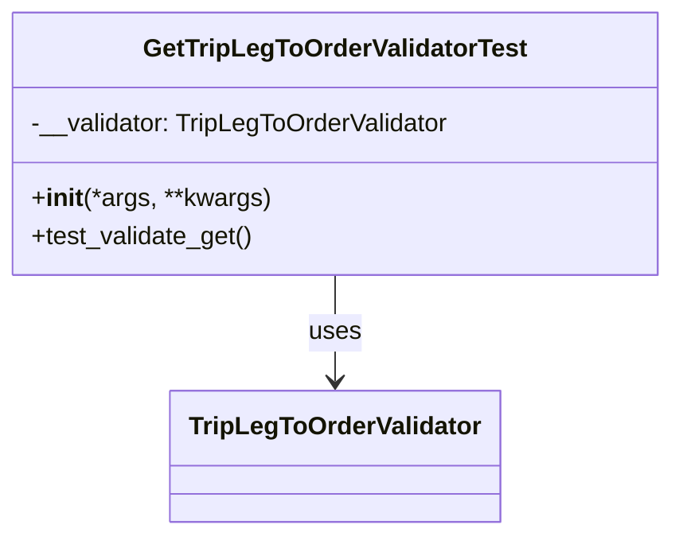

# Diagram: partview_service/partview_service/tests/unit/core/validators/trip_leg_to_order/trip_leg_to_order_get_validator_test.py


> Auto-generated by Obscura crawlers

## Diagram 1



### SVG

<svg id="container" width="427.6171875" xmlns="http://www.w3.org/2000/svg" class="classDiagram" height="342" viewBox="0 0 427.6171875 342" role="graphics-document document" aria-roledescription="class"><style>#container{font-family:"trebuchet ms",verdana,arial,sans-serif;font-size:16px;fill:#333;}@keyframes edge-animation-frame{from{stroke-dashoffset:0;}}@keyframes dash{to{stroke-dashoffset:0;}}#container .edge-animation-slow{stroke-dasharray:9,5!important;stroke-dashoffset:900;animation:dash 50s linear infinite;stroke-linecap:round;}#container .edge-animation-fast{stroke-dasharray:9,5!important;stroke-dashoffset:900;animation:dash 20s linear infinite;stroke-linecap:round;}#container .error-icon{fill:#552222;}#container .error-text{fill:#552222;stroke:#552222;}#container .edge-thickness-normal{stroke-width:1px;}#container .edge-thickness-thick{stroke-width:3.5px;}#container .edge-pattern-solid{stroke-dasharray:0;}#container .edge-thickness-invisible{stroke-width:0;fill:none;}#container .edge-pattern-dashed{stroke-dasharray:3;}#container .edge-pattern-dotted{stroke-dasharray:2;}#container .marker{fill:#333333;stroke:#333333;}#container .marker.cross{stroke:#333333;}#container svg{font-family:"trebuchet ms",verdana,arial,sans-serif;font-size:16px;}#container p{margin:0;}#container g.classGroup text{fill:#9370DB;stroke:none;font-family:"trebuchet ms",verdana,arial,sans-serif;font-size:10px;}#container g.classGroup text .title{font-weight:bolder;}#container .nodeLabel,#container .edgeLabel{color:#131300;}#container .edgeLabel .label rect{fill:#ECECFF;}#container .label text{fill:#131300;}#container .labelBkg{background:#ECECFF;}#container .edgeLabel .label span{background:#ECECFF;}#container .classTitle{font-weight:bolder;}#container .node rect,#container .node circle,#container .node ellipse,#container .node polygon,#container .node path{fill:#ECECFF;stroke:#9370DB;stroke-width:1px;}#container .divider{stroke:#9370DB;stroke-width:1;}#container g.clickable{cursor:pointer;}#container g.classGroup rect{fill:#ECECFF;stroke:#9370DB;}#container g.classGroup line{stroke:#9370DB;stroke-width:1;}#container .classLabel .box{stroke:none;stroke-width:0;fill:#ECECFF;opacity:0.5;}#container .classLabel .label{fill:#9370DB;font-size:10px;}#container .relation{stroke:#333333;stroke-width:1;fill:none;}#container .dashed-line{stroke-dasharray:3;}#container .dotted-line{stroke-dasharray:1 2;}#container #compositionStart,#container .composition{fill:#333333!important;stroke:#333333!important;stroke-width:1;}#container #compositionEnd,#container .composition{fill:#333333!important;stroke:#333333!important;stroke-width:1;}#container #dependencyStart,#container .dependency{fill:#333333!important;stroke:#333333!important;stroke-width:1;}#container #dependencyStart,#container .dependency{fill:#333333!important;stroke:#333333!important;stroke-width:1;}#container #extensionStart,#container .extension{fill:transparent!important;stroke:#333333!important;stroke-width:1;}#container #extensionEnd,#container .extension{fill:transparent!important;stroke:#333333!important;stroke-width:1;}#container #aggregationStart,#container .aggregation{fill:transparent!important;stroke:#333333!important;stroke-width:1;}#container #aggregationEnd,#container .aggregation{fill:transparent!important;stroke:#333333!important;stroke-width:1;}#container #lollipopStart,#container .lollipop{fill:#ECECFF!important;stroke:#333333!important;stroke-width:1;}#container #lollipopEnd,#container .lollipop{fill:#ECECFF!important;stroke:#333333!important;stroke-width:1;}#container .edgeTerminals{font-size:11px;line-height:initial;}#container .classTitleText{text-anchor:middle;font-size:18px;fill:#333;}#container .label-icon{display:inline-block;height:1em;overflow:visible;vertical-align:-0.125em;}#container .node .label-icon path{fill:currentColor;stroke:revert;stroke-width:revert;}#container :root{--mermaid-font-family:"trebuchet ms",verdana,arial,sans-serif;}</style><g><defs><marker id="container_class-aggregationStart" class="marker aggregation class" refX="18" refY="7" markerWidth="190" markerHeight="240" orient="auto"><path d="M 18,7 L9,13 L1,7 L9,1 Z"></path></marker></defs><defs><marker id="container_class-aggregationEnd" class="marker aggregation class" refX="1" refY="7" markerWidth="20" markerHeight="28" orient="auto"><path d="M 18,7 L9,13 L1,7 L9,1 Z"></path></marker></defs><defs><marker id="container_class-extensionStart" class="marker extension class" refX="18" refY="7" markerWidth="190" markerHeight="240" orient="auto"><path d="M 1,7 L18,13 V 1 Z"></path></marker></defs><defs><marker id="container_class-extensionEnd" class="marker extension class" refX="1" refY="7" markerWidth="20" markerHeight="28" orient="auto"><path d="M 1,1 V 13 L18,7 Z"></path></marker></defs><defs><marker id="container_class-compositionStart" class="marker composition class" refX="18" refY="7" markerWidth="190" markerHeight="240" orient="auto"><path d="M 18,7 L9,13 L1,7 L9,1 Z"></path></marker></defs><defs><marker id="container_class-compositionEnd" class="marker composition class" refX="1" refY="7" markerWidth="20" markerHeight="28" orient="auto"><path d="M 18,7 L9,13 L1,7 L9,1 Z"></path></marker></defs><defs><marker id="container_class-dependencyStart" class="marker dependency class" refX="6" refY="7" markerWidth="190" markerHeight="240" orient="auto"><path d="M 5,7 L9,13 L1,7 L9,1 Z"></path></marker></defs><defs><marker id="container_class-dependencyEnd" class="marker dependency class" refX="13" refY="7" markerWidth="20" markerHeight="28" orient="auto"><path d="M 18,7 L9,13 L14,7 L9,1 Z"></path></marker></defs><defs><marker id="container_class-lollipopStart" class="marker lollipop class" refX="13" refY="7" markerWidth="190" markerHeight="240" orient="auto"><circle stroke="black" fill="transparent" cx="7" cy="7" r="6"></circle></marker></defs><defs><marker id="container_class-lollipopEnd" class="marker lollipop class" refX="1" refY="7" markerWidth="190" markerHeight="240" orient="auto"><circle stroke="black" fill="transparent" cx="7" cy="7" r="6"></circle></marker></defs><g class="root"><g class="clusters"></g><g class="edgePaths"><path d="M213.809,176L213.809,182.167C213.809,188.333,213.809,200.667,213.809,212C213.809,223.333,213.809,233.667,213.809,238.833L213.809,244" id="id_GetTripLegToOrderValidatorTest_TripLegToOrderValidator_1" class="edge-thickness-normal edge-pattern-solid relation" style=";;;" data-edge="true" data-et="edge" data-id="id_GetTripLegToOrderValidatorTest_TripLegToOrderValidator_1" data-points="W3sieCI6MjEzLjgwODU5Mzc1LCJ5IjoxNzZ9LHsieCI6MjEzLjgwODU5Mzc1LCJ5IjoyMTN9LHsieCI6MjEzLjgwODU5Mzc1LCJ5IjoyNTB9XQ==" marker-end="url(#container_class-dependencyEnd)"></path></g><g class="edgeLabels"><g class="edgeLabel" transform="translate(213.80859375, 213)"><g class="label" data-id="id_GetTripLegToOrderValidatorTest_TripLegToOrderValidator_1" transform="translate(-16.4921875, -12)"><foreignObject width="32.984375" height="24"><div xmlns="http://www.w3.org/1999/xhtml" class="labelBkg" style="display: table-cell; white-space: nowrap; line-height: 1.5; max-width: 200px; text-align: center;"><span class="edgeLabel"><p>uses</p></span></div></foreignObject></g></g></g><g class="nodes"><g class="node default" id="classId-GetTripLegToOrderValidatorTest-0" transform="translate(213.80859375, 92)"><g class="basic label-container"><path d="M-205.80859375 -84 L205.80859375 -84 L205.80859375 84 L-205.80859375 84" stroke="none" stroke-width="0" fill="#ECECFF" style=""></path><path d="M-205.80859375 -84 C-77.94967201969759 -84, 49.909249710604826 -84, 205.80859375 -84 M-205.80859375 -84 C-52.39376515026379 -84, 101.02106344947242 -84, 205.80859375 -84 M205.80859375 -84 C205.80859375 -48.3208223033026, 205.80859375 -12.641644606605198, 205.80859375 84 M205.80859375 -84 C205.80859375 -48.36218265680938, 205.80859375 -12.724365313618762, 205.80859375 84 M205.80859375 84 C85.26204963666981 84, -35.28449447666037 84, -205.80859375 84 M205.80859375 84 C96.60418182275733 84, -12.600230104485348 84, -205.80859375 84 M-205.80859375 84 C-205.80859375 29.493761428869057, -205.80859375 -25.012477142261886, -205.80859375 -84 M-205.80859375 84 C-205.80859375 45.71433628688879, -205.80859375 7.428672573777575, -205.80859375 -84" stroke="#9370DB" stroke-width="1.3" fill="none" stroke-dasharray="0 0" style=""></path></g><g class="annotation-group text" transform="translate(0, -60)"></g><g class="label-group text" transform="translate(-117.6171875, -60)"><g class="label" style="font-weight: bolder" transform="translate(0,-12)"><foreignObject width="235.234375" height="24"><div xmlns="http://www.w3.org/1999/xhtml" style="display: table-cell; white-space: nowrap; line-height: 1.5; max-width: 280px; text-align: center;"><span class="nodeLabel markdown-node-label" style=""><p>GetTripLegToOrderValidatorTest</p></span></div></foreignObject></g></g><g class="members-group text" transform="translate(-193.80859375, -12)"><g class="label" style="" transform="translate(0,-12)"><foreignObject width="270" height="24"><div xmlns="http://www.w3.org/1999/xhtml" style="display: table-cell; white-space: nowrap; line-height: 1.5; max-width: 328px; text-align: center;"><span class="nodeLabel markdown-node-label" style=""><p>-__validator: TripLegToOrderValidator</p></span></div></foreignObject></g></g><g class="methods-group text" transform="translate(-193.80859375, 36)"><g class="label" style="" transform="translate(0,-12)"><foreignObject width="151.8125" height="24"><div xmlns="http://www.w3.org/1999/xhtml" style="display: table-cell; white-space: nowrap; line-height: 1.5; max-width: 241px; text-align: center;"><span class="nodeLabel markdown-node-label" style=""><p>+<strong>init</strong>(*args, **kwargs)</p></span></div></foreignObject></g><g class="label" style="" transform="translate(0,12)"><foreignObject width="142.21875" height="24"><div xmlns="http://www.w3.org/1999/xhtml" style="display: table-cell; white-space: nowrap; line-height: 1.5; max-width: 200px; text-align: center;"><span class="nodeLabel markdown-node-label" style=""><p>+test_validate_get()</p></span></div></foreignObject></g></g><g class="divider" style=""><path d="M-205.80859375 -36 C-52.57052940166176 -36, 100.66753494667648 -36, 205.80859375 -36 M-205.80859375 -36 C-52.381181251100514 -36, 101.04623124779897 -36, 205.80859375 -36" stroke="#9370DB" stroke-width="1.3" fill="none" stroke-dasharray="0 0" style=""></path></g><g class="divider" style=""><path d="M-205.80859375 12 C-60.625833663914136 12, 84.55692642217173 12, 205.80859375 12 M-205.80859375 12 C-91.25398215007655 12, 23.300629449846895 12, 205.80859375 12" stroke="#9370DB" stroke-width="1.3" fill="none" stroke-dasharray="0 0" style=""></path></g></g><g class="node default" id="classId-TripLegToOrderValidator-1" transform="translate(213.80859375, 292)"><g class="basic label-container"><path d="M-101.7109375 -42 L101.7109375 -42 L101.7109375 42 L-101.7109375 42" stroke="none" stroke-width="0" fill="#ECECFF" style=""></path><path d="M-101.7109375 -42 C-45.65923012943721 -42, 10.392477241125576 -42, 101.7109375 -42 M-101.7109375 -42 C-48.442936761952645 -42, 4.825063976094711 -42, 101.7109375 -42 M101.7109375 -42 C101.7109375 -9.816377694418819, 101.7109375 22.367244611162363, 101.7109375 42 M101.7109375 -42 C101.7109375 -9.298153328825293, 101.7109375 23.403693342349413, 101.7109375 42 M101.7109375 42 C36.524533070348795 42, -28.66187135930241 42, -101.7109375 42 M101.7109375 42 C49.136877380522925 42, -3.4371827389541494 42, -101.7109375 42 M-101.7109375 42 C-101.7109375 12.560686846213247, -101.7109375 -16.878626307573505, -101.7109375 -42 M-101.7109375 42 C-101.7109375 19.1420226259363, -101.7109375 -3.715954748127402, -101.7109375 -42" stroke="#9370DB" stroke-width="1.3" fill="none" stroke-dasharray="0 0" style=""></path></g><g class="annotation-group text" transform="translate(0, -18)"></g><g class="label-group text" transform="translate(-89.7109375, -18)"><g class="label" style="font-weight: bolder" transform="translate(0,-12)"><foreignObject width="179.421875" height="24"><div xmlns="http://www.w3.org/1999/xhtml" style="display: table-cell; white-space: nowrap; line-height: 1.5; max-width: 227px; text-align: center;"><span class="nodeLabel markdown-node-label" style=""><p>TripLegToOrderValidator</p></span></div></foreignObject></g></g><g class="members-group text" transform="translate(-89.7109375, 30)"></g><g class="methods-group text" transform="translate(-89.7109375, 60)"></g><g class="divider" style=""><path d="M-101.7109375 6 C-23.490340985569418 6, 54.730255528861164 6, 101.7109375 6 M-101.7109375 6 C-22.784781445044572 6, 56.141374609910855 6, 101.7109375 6" stroke="#9370DB" stroke-width="1.3" fill="none" stroke-dasharray="0 0" style=""></path></g><g class="divider" style=""><path d="M-101.7109375 24 C-49.858104738781996 24, 1.994728022436007 24, 101.7109375 24 M-101.7109375 24 C-26.50380918764668 24, 48.70331912470664 24, 101.7109375 24" stroke="#9370DB" stroke-width="1.3" fill="none" stroke-dasharray="0 0" style=""></path></g></g></g></g></g></svg>

## Diagram 2

```mermaid
flowchart TD
    TL[TestLoader.sortTestMethodsUsing = None] --> Inst[Instantiate GetTripLegToOrderValidatorTest]
    Inst --> Init[__init__ creates __validator]
    Init --> Test[test_validate_get()]
    Test --> Assert[assertEqual(1, 1)]
    Assert --> Result[pass]
```

> SVG rendering failed for this diagram.
