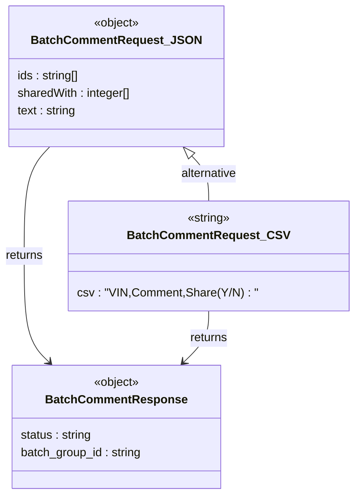

# Diagram: api_documentation/BatchCommentApi.yaml


> Auto-generated by Obscura crawlers

## Diagram 1

```mermaid
flowchart LR
  Client[Client] -->|POST /comment/batch| API[Platform Batch Comment API]
  API -->|Header: Content-Type| ContentType{{"Content-Type\ntext/csv or\napplication/json"}}
  API -->|Query: sharedWith (when text/csv)| QueryParam{{"sharedWith\n(query string)"}}
  API --> RequestBody{{"Request Body"}}
  RequestBody --> JSONBody["application/json: { ids: [string], sharedWith: [integer], text: string }"]
  RequestBody --> CSVBody["text/csv: CSV string (VIN, Comment, Share Y/N)"]
  API -->|Validate & Process Batch| Processor[Batch Processor]
  Processor -->|202 Accepted| Response["BatchCommentResponse\n{ status: string, batch_group_id: string }"]
  Response --> Client
```

> SVG rendering failed for this diagram.

## Diagram 2



### SVG

<svg id="container" width="470.53125" xmlns="http://www.w3.org/2000/svg" class="classDiagram" height="674" viewBox="0 0 470.53125 674" role="graphics-document document" aria-roledescription="class"><style>#container{font-family:"trebuchet ms",verdana,arial,sans-serif;font-size:16px;fill:#333;}@keyframes edge-animation-frame{from{stroke-dashoffset:0;}}@keyframes dash{to{stroke-dashoffset:0;}}#container .edge-animation-slow{stroke-dasharray:9,5!important;stroke-dashoffset:900;animation:dash 50s linear infinite;stroke-linecap:round;}#container .edge-animation-fast{stroke-dasharray:9,5!important;stroke-dashoffset:900;animation:dash 20s linear infinite;stroke-linecap:round;}#container .error-icon{fill:#552222;}#container .error-text{fill:#552222;stroke:#552222;}#container .edge-thickness-normal{stroke-width:1px;}#container .edge-thickness-thick{stroke-width:3.5px;}#container .edge-pattern-solid{stroke-dasharray:0;}#container .edge-thickness-invisible{stroke-width:0;fill:none;}#container .edge-pattern-dashed{stroke-dasharray:3;}#container .edge-pattern-dotted{stroke-dasharray:2;}#container .marker{fill:#333333;stroke:#333333;}#container .marker.cross{stroke:#333333;}#container svg{font-family:"trebuchet ms",verdana,arial,sans-serif;font-size:16px;}#container p{margin:0;}#container g.classGroup text{fill:#9370DB;stroke:none;font-family:"trebuchet ms",verdana,arial,sans-serif;font-size:10px;}#container g.classGroup text .title{font-weight:bolder;}#container .nodeLabel,#container .edgeLabel{color:#131300;}#container .edgeLabel .label rect{fill:#ECECFF;}#container .label text{fill:#131300;}#container .labelBkg{background:#ECECFF;}#container .edgeLabel .label span{background:#ECECFF;}#container .classTitle{font-weight:bolder;}#container .node rect,#container .node circle,#container .node ellipse,#container .node polygon,#container .node path{fill:#ECECFF;stroke:#9370DB;stroke-width:1px;}#container .divider{stroke:#9370DB;stroke-width:1;}#container g.clickable{cursor:pointer;}#container g.classGroup rect{fill:#ECECFF;stroke:#9370DB;}#container g.classGroup line{stroke:#9370DB;stroke-width:1;}#container .classLabel .box{stroke:none;stroke-width:0;fill:#ECECFF;opacity:0.5;}#container .classLabel .label{fill:#9370DB;font-size:10px;}#container .relation{stroke:#333333;stroke-width:1;fill:none;}#container .dashed-line{stroke-dasharray:3;}#container .dotted-line{stroke-dasharray:1 2;}#container #compositionStart,#container .composition{fill:#333333!important;stroke:#333333!important;stroke-width:1;}#container #compositionEnd,#container .composition{fill:#333333!important;stroke:#333333!important;stroke-width:1;}#container #dependencyStart,#container .dependency{fill:#333333!important;stroke:#333333!important;stroke-width:1;}#container #dependencyStart,#container .dependency{fill:#333333!important;stroke:#333333!important;stroke-width:1;}#container #extensionStart,#container .extension{fill:transparent!important;stroke:#333333!important;stroke-width:1;}#container #extensionEnd,#container .extension{fill:transparent!important;stroke:#333333!important;stroke-width:1;}#container #aggregationStart,#container .aggregation{fill:transparent!important;stroke:#333333!important;stroke-width:1;}#container #aggregationEnd,#container .aggregation{fill:transparent!important;stroke:#333333!important;stroke-width:1;}#container #lollipopStart,#container .lollipop{fill:#ECECFF!important;stroke:#333333!important;stroke-width:1;}#container #lollipopEnd,#container .lollipop{fill:#ECECFF!important;stroke:#333333!important;stroke-width:1;}#container .edgeTerminals{font-size:11px;line-height:initial;}#container .classTitleText{text-anchor:middle;font-size:18px;fill:#333;}#container .label-icon{display:inline-block;height:1em;overflow:visible;vertical-align:-0.125em;}#container .node .label-icon path{fill:currentColor;stroke:revert;stroke-width:revert;}#container :root{--mermaid-font-family:"trebuchet ms",verdana,arial,sans-serif;}</style><g><defs><marker id="container_class-aggregationStart" class="marker aggregation class" refX="18" refY="7" markerWidth="190" markerHeight="240" orient="auto"><path d="M 18,7 L9,13 L1,7 L9,1 Z"></path></marker></defs><defs><marker id="container_class-aggregationEnd" class="marker aggregation class" refX="1" refY="7" markerWidth="20" markerHeight="28" orient="auto"><path d="M 18,7 L9,13 L1,7 L9,1 Z"></path></marker></defs><defs><marker id="container_class-extensionStart" class="marker extension class" refX="18" refY="7" markerWidth="190" markerHeight="240" orient="auto"><path d="M 1,7 L18,13 V 1 Z"></path></marker></defs><defs><marker id="container_class-extensionEnd" class="marker extension class" refX="1" refY="7" markerWidth="20" markerHeight="28" orient="auto"><path d="M 1,1 V 13 L18,7 Z"></path></marker></defs><defs><marker id="container_class-compositionStart" class="marker composition class" refX="18" refY="7" markerWidth="190" markerHeight="240" orient="auto"><path d="M 18,7 L9,13 L1,7 L9,1 Z"></path></marker></defs><defs><marker id="container_class-compositionEnd" class="marker composition class" refX="1" refY="7" markerWidth="20" markerHeight="28" orient="auto"><path d="M 18,7 L9,13 L1,7 L9,1 Z"></path></marker></defs><defs><marker id="container_class-dependencyStart" class="marker dependency class" refX="6" refY="7" markerWidth="190" markerHeight="240" orient="auto"><path d="M 5,7 L9,13 L1,7 L9,1 Z"></path></marker></defs><defs><marker id="container_class-dependencyEnd" class="marker dependency class" refX="13" refY="7" markerWidth="20" markerHeight="28" orient="auto"><path d="M 18,7 L9,13 L14,7 L9,1 Z"></path></marker></defs><defs><marker id="container_class-lollipopStart" class="marker lollipop class" refX="13" refY="7" markerWidth="190" markerHeight="240" orient="auto"><circle stroke="black" fill="transparent" cx="7" cy="7" r="6"></circle></marker></defs><defs><marker id="container_class-lollipopEnd" class="marker lollipop class" refX="1" refY="7" markerWidth="190" markerHeight="240" orient="auto"><circle stroke="black" fill="transparent" cx="7" cy="7" r="6"></circle></marker></defs><g class="root"><g class="clusters"></g><g class="edgePaths"><path d="M256.665,212.694L260.393,216.745C264.121,220.796,271.576,228.898,275.304,239.116C279.031,249.333,279.031,261.667,279.031,267.833L279.031,274" id="id_BatchCommentRequest_JSON_BatchCommentRequest_CSV_1" class="edge-thickness-normal edge-pattern-solid relation" style=";;;" data-edge="true" data-et="edge" data-id="id_BatchCommentRequest_JSON_BatchCommentRequest_CSV_1" data-points="W3sieCI6MjQ0Ljk4NDkwMzY2NTQxMzUzLCJ5IjoyMDB9LHsieCI6Mjc5LjAzMTI1LCJ5IjoyMzd9LHsieCI6Mjc5LjAzMTI1LCJ5IjoyNzR9XQ==" marker-start="url(#container_class-extensionStart)"></path><path d="M68.312,200L62.638,206.167C56.963,212.333,45.614,224.667,39.94,249.5C34.266,274.333,34.266,311.667,34.266,349C34.266,386.333,34.266,423.667,39.792,447.797C45.318,471.927,56.37,482.854,61.896,488.318L67.422,493.782" id="id_BatchCommentRequest_JSON_BatchCommentResponse_2" class="edge-thickness-normal edge-pattern-solid relation" style=";;;" data-edge="true" data-et="edge" data-id="id_BatchCommentRequest_JSON_BatchCommentResponse_2" data-points="W3sieCI6NjguMzExOTcxMzM0NTg2NDYsInkiOjIwMH0seyJ4IjozNC4yNjU2MjUsInkiOjIzN30seyJ4IjozNC4yNjU2MjUsInkiOjM0OX0seyJ4IjozNC4yNjU2MjUsInkiOjQ2MX0seyJ4Ijo3MS42ODg0Njg0OTE3MzU1MywieSI6NDk4fV0=" marker-end="url(#container_class-dependencyEnd)"></path><path d="M279.031,424L279.031,430.167C279.031,436.333,279.031,448.667,273.505,460.297C267.979,471.927,256.927,482.854,251.401,488.318L245.875,493.782" id="id_BatchCommentRequest_CSV_BatchCommentResponse_3" class="edge-thickness-normal edge-pattern-solid relation" style=";;;" data-edge="true" data-et="edge" data-id="id_BatchCommentRequest_CSV_BatchCommentResponse_3" data-points="W3sieCI6Mjc5LjAzMTI1LCJ5Ijo0MjR9LHsieCI6Mjc5LjAzMTI1LCJ5Ijo0NjF9LHsieCI6MjQxLjYwODQwNjUwODI2NDQ3LCJ5Ijo0OTh9XQ==" marker-end="url(#container_class-dependencyEnd)"></path></g><g class="edgeLabels"><g class="edgeLabel" transform="translate(279.03125, 237)"><g class="label" data-id="id_BatchCommentRequest_JSON_BatchCommentRequest_CSV_1" transform="translate(-39.28125, -12)"><foreignObject width="78.5625" height="24"><div xmlns="http://www.w3.org/1999/xhtml" class="labelBkg" style="display: table-cell; white-space: nowrap; line-height: 1.5; max-width: 200px; text-align: center;"><span class="edgeLabel"><p>alternative</p></span></div></foreignObject></g></g><g class="edgeLabel" transform="translate(34.265625, 349)"><g class="label" data-id="id_BatchCommentRequest_JSON_BatchCommentResponse_2" transform="translate(-26.265625, -12)"><foreignObject width="52.53125" height="24"><div xmlns="http://www.w3.org/1999/xhtml" class="labelBkg" style="display: table-cell; white-space: nowrap; line-height: 1.5; max-width: 200px; text-align: center;"><span class="edgeLabel"><p>returns</p></span></div></foreignObject></g></g><g class="edgeLabel" transform="translate(279.03125, 461)"><g class="label" data-id="id_BatchCommentRequest_CSV_BatchCommentResponse_3" transform="translate(-26.265625, -12)"><foreignObject width="52.53125" height="24"><div xmlns="http://www.w3.org/1999/xhtml" class="labelBkg" style="display: table-cell; white-space: nowrap; line-height: 1.5; max-width: 200px; text-align: center;"><span class="edgeLabel"><p>returns</p></span></div></foreignObject></g></g></g><g class="nodes"><g class="node default" id="classId-BatchCommentRequest_JSON-0" transform="translate(156.6484375, 104)"><g class="basic label-container"><path d="M-143.96484375 -96 L143.96484375 -96 L143.96484375 96 L-143.96484375 96" stroke="none" stroke-width="0" fill="#ECECFF" style=""></path><path d="M-143.96484375 -96 C-70.51998198494205 -96, 2.9248797801159014 -96, 143.96484375 -96 M-143.96484375 -96 C-85.47750533763494 -96, -26.99016692526986 -96, 143.96484375 -96 M143.96484375 -96 C143.96484375 -39.77190443037178, 143.96484375 16.456191139256447, 143.96484375 96 M143.96484375 -96 C143.96484375 -22.445598894977437, 143.96484375 51.10880221004513, 143.96484375 96 M143.96484375 96 C47.50311859706672 96, -48.95860655586657 96, -143.96484375 96 M143.96484375 96 C82.0866731389112 96, 20.20850252782239 96, -143.96484375 96 M-143.96484375 96 C-143.96484375 19.56764471742852, -143.96484375 -56.86471056514296, -143.96484375 -96 M-143.96484375 96 C-143.96484375 43.84670642967254, -143.96484375 -8.306587140654926, -143.96484375 -96" stroke="#9370DB" stroke-width="1.3" fill="none" stroke-dasharray="0 0" style=""></path></g><g class="annotation-group text" transform="translate(-31.7109375, -72)"><g class="label" style="" transform="translate(0,-12)"><foreignObject width="63.421875" height="24"><div xmlns="http://www.w3.org/1999/xhtml" style="display: table-cell; white-space: nowrap; line-height: 1.5; max-width: 113px; text-align: center;"><span class="nodeLabel markdown-node-label" style=""><p>«object»</p></span></div></foreignObject></g></g><g class="label-group text" transform="translate(-107.7734375, -48)"><g class="label" style="font-weight: bolder" transform="translate(0,-12)"><foreignObject width="215.546875" height="24"><div xmlns="http://www.w3.org/1999/xhtml" style="display: table-cell; white-space: nowrap; line-height: 1.5; max-width: 264px; text-align: center;"><span class="nodeLabel markdown-node-label" style=""><p>BatchCommentRequest_JSON</p></span></div></foreignObject></g></g><g class="members-group text" transform="translate(-131.96484375, 0)"><g class="label" style="" transform="translate(0,-12)"><foreignObject width="85.8125" height="24"><div xmlns="http://www.w3.org/1999/xhtml" style="display: table-cell; white-space: nowrap; line-height: 1.5; max-width: 136px; text-align: center;"><span class="nodeLabel markdown-node-label" style=""><p>ids : string[]</p></span></div></foreignObject></g><g class="label" style="" transform="translate(0,12)"><foreignObject width="156.15625" height="24"><div xmlns="http://www.w3.org/1999/xhtml" style="display: table-cell; white-space: nowrap; line-height: 1.5; max-width: 206px; text-align: center;"><span class="nodeLabel markdown-node-label" style=""><p>sharedWith : integer[]</p></span></div></foreignObject></g><g class="label" style="" transform="translate(0,36)"><foreignObject width="81.609375" height="24"><div xmlns="http://www.w3.org/1999/xhtml" style="display: table-cell; white-space: nowrap; line-height: 1.5; max-width: 132px; text-align: center;"><span class="nodeLabel markdown-node-label" style=""><p>text : string</p></span></div></foreignObject></g></g><g class="methods-group text" transform="translate(-131.96484375, 96)"></g><g class="divider" style=""><path d="M-143.96484375 -24 C-44.24179522318815 -24, 55.4812533036237 -24, 143.96484375 -24 M-143.96484375 -24 C-75.40954211127037 -24, -6.854240472540738 -24, 143.96484375 -24" stroke="#9370DB" stroke-width="1.3" fill="none" stroke-dasharray="0 0" style=""></path></g><g class="divider" style=""><path d="M-143.96484375 72 C-64.05946324024544 72, 15.84591726950913 72, 143.96484375 72 M-143.96484375 72 C-67.67706359910166 72, 8.610716551796685 72, 143.96484375 72" stroke="#9370DB" stroke-width="1.3" fill="none" stroke-dasharray="0 0" style=""></path></g></g><g class="node default" id="classId-BatchCommentRequest_CSV-1" transform="translate(279.03125, 349)"><g class="basic label-container"><path d="M-183.5 -75 L183.5 -75 L183.5 75 L-183.5 75" stroke="none" stroke-width="0" fill="#ECECFF" style=""></path><path d="M-183.5 -75 C-95.89902138082536 -75, -8.29804276165072 -75, 183.5 -75 M-183.5 -75 C-65.499026801136 -75, 52.501946397728005 -75, 183.5 -75 M183.5 -75 C183.5 -20.41975569596478, 183.5 34.16048860807044, 183.5 75 M183.5 -75 C183.5 -37.66001515411866, 183.5 -0.32003030823732104, 183.5 75 M183.5 75 C94.37487526948375 75, 5.249750538967504 75, -183.5 75 M183.5 75 C65.69826828769502 75, -52.10346342460997 75, -183.5 75 M-183.5 75 C-183.5 23.61291175294209, -183.5 -27.77417649411582, -183.5 -75 M-183.5 75 C-183.5 43.3320099212621, -183.5 11.664019842524198, -183.5 -75" stroke="#9370DB" stroke-width="1.3" fill="none" stroke-dasharray="0 0" style=""></path></g><g class="annotation-group text" transform="translate(-29.9453125, -51)"><g class="label" style="" transform="translate(0,-12)"><foreignObject width="59.890625" height="24"><div xmlns="http://www.w3.org/1999/xhtml" style="display: table-cell; white-space: nowrap; line-height: 1.5; max-width: 110px; text-align: center;"><span class="nodeLabel markdown-node-label" style=""><p>«string»</p></span></div></foreignObject></g></g><g class="label-group text" transform="translate(-102.78125, -27)"><g class="label" style="font-weight: bolder" transform="translate(0,-12)"><foreignObject width="205.5625" height="24"><div xmlns="http://www.w3.org/1999/xhtml" style="display: table-cell; white-space: nowrap; line-height: 1.5; max-width: 253px; text-align: center;"><span class="nodeLabel markdown-node-label" style=""><p>BatchCommentRequest_CSV</p></span></div></foreignObject></g></g><g class="members-group text" transform="translate(-171.5, 21)"></g><g class="methods-group text" transform="translate(-171.5, 51)"><g class="label" style="" transform="translate(0,-12)"><foreignObject width="240.21875" height="24"><div xmlns="http://www.w3.org/1999/xhtml" style="display: table-cell; white-space: nowrap; line-height: 1.5; max-width: 290px; text-align: center;"><span class="nodeLabel markdown-node-label" style=""><p>csv : "VIN,Comment,Share(Y/N) : "</p></span></div></foreignObject></g></g><g class="divider" style=""><path d="M-183.5 -3 C-42.64009484908465 -3, 98.2198103018307 -3, 183.5 -3 M-183.5 -3 C-59.75899448140602 -3, 63.98201103718796 -3, 183.5 -3" stroke="#9370DB" stroke-width="1.3" fill="none" stroke-dasharray="0 0" style=""></path></g><g class="divider" style=""><path d="M-183.5 21 C-66.84892915050953 21, 49.80214169898093 21, 183.5 21 M-183.5 21 C-109.8510346113462 21, -36.20206922269239 21, 183.5 21" stroke="#9370DB" stroke-width="1.3" fill="none" stroke-dasharray="0 0" style=""></path></g></g><g class="node default" id="classId-BatchCommentResponse-2" transform="translate(156.6484375, 582)"><g class="basic label-container"><path d="M-141.09375 -84 L141.09375 -84 L141.09375 84 L-141.09375 84" stroke="none" stroke-width="0" fill="#ECECFF" style=""></path><path d="M-141.09375 -84 C-33.75159492113758 -84, 73.59056015772484 -84, 141.09375 -84 M-141.09375 -84 C-58.41339411610852 -84, 24.26696176778296 -84, 141.09375 -84 M141.09375 -84 C141.09375 -24.74071974396854, 141.09375 34.51856051206292, 141.09375 84 M141.09375 -84 C141.09375 -21.766353825332075, 141.09375 40.46729234933585, 141.09375 84 M141.09375 84 C45.66769022837839 84, -49.75836954324322 84, -141.09375 84 M141.09375 84 C51.0237263289152 84, -39.046297342169595 84, -141.09375 84 M-141.09375 84 C-141.09375 37.90101568858804, -141.09375 -8.197968622823922, -141.09375 -84 M-141.09375 84 C-141.09375 38.09874192473065, -141.09375 -7.802516150538693, -141.09375 -84" stroke="#9370DB" stroke-width="1.3" fill="none" stroke-dasharray="0 0" style=""></path></g><g class="annotation-group text" transform="translate(-31.7109375, -60)"><g class="label" style="" transform="translate(0,-12)"><foreignObject width="63.421875" height="24"><div xmlns="http://www.w3.org/1999/xhtml" style="display: table-cell; white-space: nowrap; line-height: 1.5; max-width: 113px; text-align: center;"><span class="nodeLabel markdown-node-label" style=""><p>«object»</p></span></div></foreignObject></g></g><g class="label-group text" transform="translate(-90.90625, -36)"><g class="label" style="font-weight: bolder" transform="translate(0,-12)"><foreignObject width="181.8125" height="24"><div xmlns="http://www.w3.org/1999/xhtml" style="display: table-cell; white-space: nowrap; line-height: 1.5; max-width: 230px; text-align: center;"><span class="nodeLabel markdown-node-label" style=""><p>BatchCommentResponse</p></span></div></foreignObject></g></g><g class="members-group text" transform="translate(-129.09375, 12)"><g class="label" style="" transform="translate(0,-12)"><foreignObject width="98.359375" height="24"><div xmlns="http://www.w3.org/1999/xhtml" style="display: table-cell; white-space: nowrap; line-height: 1.5; max-width: 149px; text-align: center;"><span class="nodeLabel markdown-node-label" style=""><p>status : string</p></span></div></foreignObject></g><g class="label" style="" transform="translate(0,12)"><foreignObject width="167.28125" height="24"><div xmlns="http://www.w3.org/1999/xhtml" style="display: table-cell; white-space: nowrap; line-height: 1.5; max-width: 218px; text-align: center;"><span class="nodeLabel markdown-node-label" style=""><p>batch_group_id : string</p></span></div></foreignObject></g></g><g class="methods-group text" transform="translate(-129.09375, 84)"></g><g class="divider" style=""><path d="M-141.09375 -12 C-66.15024440562928 -12, 8.79326118874144 -12, 141.09375 -12 M-141.09375 -12 C-62.87504313005357 -12, 15.343663739892861 -12, 141.09375 -12" stroke="#9370DB" stroke-width="1.3" fill="none" stroke-dasharray="0 0" style=""></path></g><g class="divider" style=""><path d="M-141.09375 60 C-72.37724245505171 60, -3.6607349101034288 60, 141.09375 60 M-141.09375 60 C-71.69520875004649 60, -2.2966675000929797 60, 141.09375 60" stroke="#9370DB" stroke-width="1.3" fill="none" stroke-dasharray="0 0" style=""></path></g></g></g></g></g></svg>
