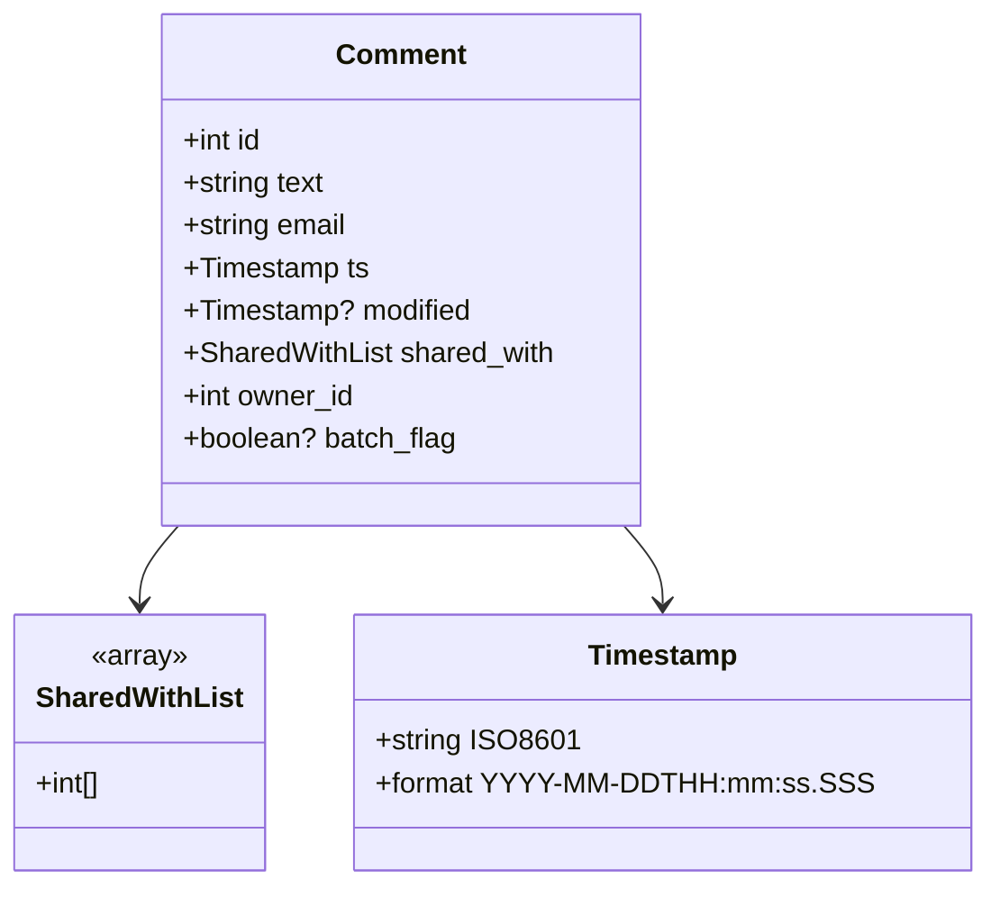
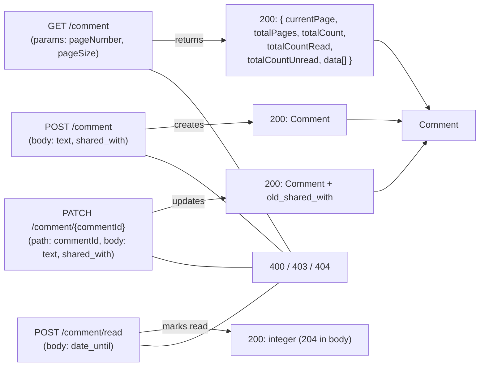

# Diagram: api_documentation/CommentsApi.yaml

> Auto-generated by Obscura crawlers

## Diagram 1

### SVG

<svg id="container" width="528.9375" xmlns="http://www.w3.org/2000/svg" class="classDiagram" height="498" viewBox="0 0 528.9375 498" role="graphics-document document" aria-roledescription="class"><g><defs><marker id="container_class-aggregationStart" class="marker aggregation class" refX="18" refY="7" markerWidth="190" markerHeight="240" orient="auto"><path d="M 18,7 L9,13 L1,7 L9,1 Z"></path></marker></defs><defs><marker id="container_class-aggregationEnd" class="marker aggregation class" refX="1" refY="7" markerWidth="20" markerHeight="28" orient="auto"><path d="M 18,7 L9,13 L1,7 L9,1 Z"></path></marker></defs><defs><marker id="container_class-extensionStart" class="marker extension class" refX="18" refY="7" markerWidth="190" markerHeight="240" orient="auto"><path d="M 1,7 L18,13 V 1 Z"></path></marker></defs><defs><marker id="container_class-extensionEnd" class="marker extension class" refX="1" refY="7" markerWidth="20" markerHeight="28" orient="auto"><path d="M 1,1 V 13 L18,7 Z"></path></marker></defs><defs><marker id="container_class-compositionStart" class="marker composition class" refX="18" refY="7" markerWidth="190" markerHeight="240" orient="auto"><path d="M 18,7 L9,13 L1,7 L9,1 Z"></path></marker></defs><defs><marker id="container_class-compositionEnd" class="marker composition class" refX="1" refY="7" markerWidth="20" markerHeight="28" orient="auto"><path d="M 18,7 L9,13 L1,7 L9,1 Z"></path></marker></defs><defs><marker id="container_class-dependencyStart" class="marker dependency class" refX="6" refY="7" markerWidth="190" markerHeight="240" orient="auto"><path d="M 5,7 L9,13 L1,7 L9,1 Z"></path></marker></defs><defs><marker id="container_class-dependencyEnd" class="marker dependency class" refX="13" refY="7" markerWidth="20" markerHeight="28" orient="auto"><path d="M 18,7 L9,13 L14,7 L9,1 Z"></path></marker></defs><defs><marker id="container_class-lollipopStart" class="marker lollipop class" refX="13" refY="7" markerWidth="190" markerHeight="240" orient="auto"><circle stroke="black" fill="transparent" cx="7" cy="7" r="6"></circle></marker></defs><defs><marker id="container_class-lollipopEnd" class="marker lollipop class" refX="1" refY="7" markerWidth="190" markerHeight="240" orient="auto"><circle stroke="black" fill="transparent" cx="7" cy="7" r="6"></circle></marker></defs><g class="root"><g class="clusters"></g><g class="edgePaths"><path d="M96.631,296L93.161,300.167C89.692,304.333,82.752,312.667,79.282,320C75.813,327.333,75.813,333.667,75.813,336.833L75.813,340" id="id_Comment_SharedWithList_1" class="edge-thickness-normal edge-pattern-solid relation" style=";;;" data-edge="true" data-et="edge" data-id="id_Comment_SharedWithList_1" data-points="W3sieCI6OTYuNjMxMTk0NTI2NjI3MjEsInkiOjI5Nn0seyJ4Ijo3NS44MTI1LCJ5IjozMjF9LHsieCI6NzUuODEyNSwieSI6MzQ2fV0=" marker-end="url(#container_class-dependencyEnd)"></path><path d="M336.463,296L339.932,300.167C343.402,304.333,350.342,312.667,353.811,320C357.281,327.333,357.281,333.667,357.281,336.833L357.281,340" id="id_Comment_Timestamp_2" class="edge-thickness-normal edge-pattern-solid relation" style=";;;" data-edge="true" data-et="edge" data-id="id_Comment_Timestamp_2" data-points="W3sieCI6MzM2LjQ2MjU1NTQ3MzM3MjgsInkiOjI5Nn0seyJ4IjozNTcuMjgxMjUsInkiOjMyMX0seyJ4IjozNTcuMjgxMjUsInkiOjM0Nn1d" marker-end="url(#container_class-dependencyEnd)"></path></g><g class="edgeLabels"><g class="edgeLabel"><g class="label" data-id="id_Comment_SharedWithList_1" transform="translate(0, 0)"><foreignObject width="0" height="0">

</foreignObject></g></g><g class="edgeLabel"><g class="label" data-id="id_Comment_Timestamp_2" transform="translate(0, 0)"><foreignObject width="0" height="0">

</foreignObject></g></g></g><g class="nodes"><g class="node default" id="classId-Comment-0" transform="translate(216.546875, 152)"><g class="basic label-container"><path d="M-134.20703125 -144 L134.20703125 -144 L134.20703125 144 L-134.20703125 144" stroke="none" stroke-width="0" fill="#ECECFF" style=""></path><path d="M-134.20703125 -144 C-51.840996619144605 -144, 30.52503801171079 -144, 134.20703125 -144 M-134.20703125 -144 C-30.757343845871034 -144, 72.69234355825793 -144, 134.20703125 -144 M134.20703125 -144 C134.20703125 -36.47100284039922, 134.20703125 71.05799431920155, 134.20703125 144 M134.20703125 -144 C134.20703125 -45.46830156400033, 134.20703125 53.063396871999345, 134.20703125 144 M134.20703125 144 C31.43657901314242 144, -71.33387322371516 144, -134.20703125 144 M134.20703125 144 C45.01587776450586 144, -44.17527572098828 144, -134.20703125 144 M-134.20703125 144 C-134.20703125 84.18914664010131, -134.20703125 24.378293280202627, -134.20703125 -144 M-134.20703125 144 C-134.20703125 57.85671206150482, -134.20703125 -28.286575876990355, -134.20703125 -144" stroke="#9370DB" stroke-width="1.3" fill="none" stroke-dasharray="0 0" style=""></path></g><g class="annotation-group text" transform="translate(0, -120)"></g><g class="label-group text" transform="translate(-34.7578125, -120)"><g class="label" style="font-weight: bolder" transform="translate(0,-12)"><foreignObject width="69.515625" height="24">

Comment

</foreignObject></g></g><g class="members-group text" transform="translate(-122.20703125, -72)"><g class="label" style="" transform="translate(0,-12)"><foreignObject width="45.96875" height="24">

+int id

</foreignObject></g><g class="label" style="" transform="translate(0,12)"><foreignObject width="81.515625" height="24">

+string text

</foreignObject></g><g class="label" style="" transform="translate(0,36)"><foreignObject width="94.203125" height="24">

+string email

</foreignObject></g><g class="label" style="" transform="translate(0,60)"><foreignObject width="104.953125" height="24">

+Timestamp ts

</foreignObject></g><g class="label" style="" transform="translate(0,84)"><foreignObject width="163.03125" height="24">

+Timestamp? modified

</foreignObject></g><g class="label" style="" transform="translate(0,108)"><foreignObject width="209.65625" height="24">

+SharedWithList shared_with

</foreignObject></g><g class="label" style="" transform="translate(0,132)"><foreignObject width="98.109375" height="24">

+int owner_id

</foreignObject></g><g class="label" style="" transform="translate(0,156)"><foreignObject width="153.40625" height="24">

+boolean? batch_flag

</foreignObject></g></g><g class="methods-group text" transform="translate(-122.20703125, 144)"></g><g class="divider" style=""><path d="M-134.20703125 -96 C-50.72227969112531 -96, 32.76247186774938 -96, 134.20703125 -96 M-134.20703125 -96 C-51.925604696551446 -96, 30.35582185689711 -96, 134.20703125 -96" stroke="#9370DB" stroke-width="1.3" fill="none" stroke-dasharray="0 0" style=""></path></g><g class="divider" style=""><path d="M-134.20703125 120 C-35.38435705242732 120, 63.43831714514536 120, 134.20703125 120 M-134.20703125 120 C-63.63380968464533 120, 6.9394118807093434 120, 134.20703125 120" stroke="#9370DB" stroke-width="1.3" fill="none" stroke-dasharray="0 0" style=""></path></g></g><g class="node default" id="classId-SharedWithList-1" transform="translate(75.8125, 418)"><g class="basic label-container"><path d="M-67.8125 -72 L67.8125 -72 L67.8125 72 L-67.8125 72" stroke="none" stroke-width="0" fill="#ECECFF" style=""></path><path d="M-67.8125 -72 C-29.47348366439502 -72, 8.865532671209962 -72, 67.8125 -72 M-67.8125 -72 C-29.245084563983795 -72, 9.32233087203241 -72, 67.8125 -72 M67.8125 -72 C67.8125 -15.62982430909529, 67.8125 40.74035138180942, 67.8125 72 M67.8125 -72 C67.8125 -20.129587108613258, 67.8125 31.740825782773484, 67.8125 72 M67.8125 72 C18.869521358845624 72, -30.073457282308752 72, -67.8125 72 M67.8125 72 C34.24376891395408 72, 0.6750378279081559 72, -67.8125 72 M-67.8125 72 C-67.8125 29.104850241881984, -67.8125 -13.790299516236033, -67.8125 -72 M-67.8125 72 C-67.8125 35.38347872169869, -67.8125 -1.2330425566026264, -67.8125 -72" stroke="#9370DB" stroke-width="1.3" fill="none" stroke-dasharray="0 0" style=""></path></g><g class="annotation-group text" transform="translate(-27.4296875, -48)"><g class="label" style="" transform="translate(0,-12)"><foreignObject width="54.859375" height="24">

«array»

</foreignObject></g></g><g class="label-group text" transform="translate(-55.8125, -24)"><g class="label" style="font-weight: bolder" transform="translate(0,-12)"><foreignObject width="111.625" height="24">

SharedWithList

</foreignObject></g></g><g class="members-group text" transform="translate(-55.8125, 24)"><g class="label" style="" transform="translate(0,-12)"><foreignObject width="37.953125" height="24">

+int[]

</foreignObject></g></g><g class="methods-group text" transform="translate(-55.8125, 72)"></g><g class="divider" style=""><path d="M-67.8125 0 C-31.82954869214003 0, 4.153402615719941 0, 67.8125 0 M-67.8125 0 C-33.08335202772697 0, 1.645795944546066 0, 67.8125 0" stroke="#9370DB" stroke-width="1.3" fill="none" stroke-dasharray="0 0" style=""></path></g><g class="divider" style=""><path d="M-67.8125 48 C-23.13833369791223 48, 21.53583260417554 48, 67.8125 48 M-67.8125 48 C-13.912162468808795 48, 39.98817506238241 48, 67.8125 48" stroke="#9370DB" stroke-width="1.3" fill="none" stroke-dasharray="0 0" style=""></path></g></g><g class="node default" id="classId-Timestamp-2" transform="translate(357.28125, 418)"><g class="basic label-container"><path d="M-163.65625 -72 L163.65625 -72 L163.65625 72 L-163.65625 72" stroke="none" stroke-width="0" fill="#ECECFF" style=""></path><path d="M-163.65625 -72 C-97.67836705135349 -72, -31.70048410270698 -72, 163.65625 -72 M-163.65625 -72 C-72.59096476774135 -72, 18.47432046451729 -72, 163.65625 -72 M163.65625 -72 C163.65625 -37.44608501316744, 163.65625 -2.892170026334881, 163.65625 72 M163.65625 -72 C163.65625 -32.19127809820561, 163.65625 7.617443803588785, 163.65625 72 M163.65625 72 C66.64503442190873 72, -30.366181156182535 72, -163.65625 72 M163.65625 72 C89.31565014916103 72, 14.97505029832206 72, -163.65625 72 M-163.65625 72 C-163.65625 15.095704985756704, -163.65625 -41.80859002848659, -163.65625 -72 M-163.65625 72 C-163.65625 23.73654677315521, -163.65625 -24.526906453689577, -163.65625 -72" stroke="#9370DB" stroke-width="1.3" fill="none" stroke-dasharray="0 0" style=""></path></g><g class="annotation-group text" transform="translate(0, -48)"></g><g class="label-group text" transform="translate(-40.53125, -48)"><g class="label" style="font-weight: bolder" transform="translate(0,-12)"><foreignObject width="81.0625" height="24">

Timestamp

</foreignObject></g></g><g class="members-group text" transform="translate(-151.65625, 0)"><g class="label" style="" transform="translate(0,-12)"><foreignObject width="111.171875" height="24">

+string ISO8601

</foreignObject></g><g class="label" style="" transform="translate(0,12)"><foreignObject width="262.78125" height="24">

+format YYYY-MM-DDTHH:mm:ss.SSS

</foreignObject></g></g><g class="methods-group text" transform="translate(-151.65625, 72)"></g><g class="divider" style=""><path d="M-163.65625 -24 C-48.11524549015344 -24, 67.42575901969312 -24, 163.65625 -24 M-163.65625 -24 C-78.59186093014576 -24, 6.472528139708487 -24, 163.65625 -24" stroke="#9370DB" stroke-width="1.3" fill="none" stroke-dasharray="0 0" style=""></path></g><g class="divider" style=""><path d="M-163.65625 48 C-73.69190768040626 48, 16.27243463918748 48, 163.65625 48 M-163.65625 48 C-97.72761123047967 48, -31.798972460959334 48, 163.65625 48" stroke="#9370DB" stroke-width="1.3" fill="none" stroke-dasharray="0 0" style=""></path></g></g></g></g></g></svg>

## Diagram 2

### SVG

<svg id="container" width="886.765625" xmlns="http://www.w3.org/2000/svg" class="flowchart" height="658" viewBox="0 0 886.765625 658" role="graphics-document document" aria-roledescription="flowchart-v2"><g><marker id="container_flowchart-v2-pointEnd" class="marker flowchart-v2" viewBox="0 0 10 10" refX="5" refY="5" markerUnits="userSpaceOnUse" markerWidth="8" markerHeight="8" orient="auto"><path d="M 0 0 L 10 5 L 0 10 z" class="arrowMarkerPath" style="stroke-width: 1; stroke-dasharray: 1, 0;"></path></marker><marker id="container_flowchart-v2-pointStart" class="marker flowchart-v2" viewBox="0 0 10 10" refX="4.5" refY="5" markerUnits="userSpaceOnUse" markerWidth="8" markerHeight="8" orient="auto"><path d="M 0 5 L 10 10 L 10 0 z" class="arrowMarkerPath" style="stroke-width: 1; stroke-dasharray: 1, 0;"></path></marker><marker id="container_flowchart-v2-circleEnd" class="marker flowchart-v2" viewBox="0 0 10 10" refX="11" refY="5" markerUnits="userSpaceOnUse" markerWidth="11" markerHeight="11" orient="auto"><circle cx="5" cy="5" r="5" class="arrowMarkerPath" style="stroke-width: 1; stroke-dasharray: 1, 0;"></circle></marker><marker id="container_flowchart-v2-circleStart" class="marker flowchart-v2" viewBox="0 0 10 10" refX="-1" refY="5" markerUnits="userSpaceOnUse" markerWidth="11" markerHeight="11" orient="auto"><circle cx="5" cy="5" r="5" class="arrowMarkerPath" style="stroke-width: 1; stroke-dasharray: 1, 0;"></circle></marker><marker id="container_flowchart-v2-crossEnd" class="marker cross flowchart-v2" viewBox="0 0 11 11" refX="12" refY="5.2" markerUnits="userSpaceOnUse" markerWidth="11" markerHeight="11" orient="auto"><path d="M 1,1 l 9,9 M 10,1 l -9,9" class="arrowMarkerPath" style="stroke-width: 2; stroke-dasharray: 1, 0;"></path></marker><marker id="container_flowchart-v2-crossStart" class="marker cross flowchart-v2" viewBox="0 0 11 11" refX="-1" refY="5.2" markerUnits="userSpaceOnUse" markerWidth="11" markerHeight="11" orient="auto"><path d="M 1,1 l 9,9 M 10,1 l -9,9" class="arrowMarkerPath" style="stroke-width: 2; stroke-dasharray: 1, 0;"></path></marker><g class="root"><g class="clusters"></g><g class="edgePaths"><path d="M288.266,71L302.556,71C316.846,71,345.427,71,369.964,71C394.5,71,414.992,71,425.238,71L435.484,71" id="L_GET_COMMENTS_RESP_LIST_0" class="edge-thickness-normal edge-pattern-solid edge-thickness-normal edge-pattern-solid flowchart-link" style=";" data-edge="true" data-et="edge" data-id="L_GET_COMMENTS_RESP_LIST_0" data-points="W3sieCI6Mjg4LjI2NTYyNSwieSI6NzF9LHsieCI6Mzc0LjAwNzgxMjUsInkiOjcxfSx7IngiOjQzOS40ODQzNzUsInkiOjcxfV0=" marker-end="url(#container_flowchart-v2-pointEnd)"></path><path d="M699.484,71L703.651,71C707.818,71,716.151,71,732.104,89.934C748.057,108.868,771.63,146.736,783.417,165.67L795.203,184.604" id="L_RESP_LIST_Comment_0" class="edge-thickness-normal edge-pattern-solid edge-thickness-normal edge-pattern-solid flowchart-link" style=";" data-edge="true" data-et="edge" data-id="L_RESP_LIST_Comment_0" data-points="W3sieCI6Njk5LjQ4NDM3NSwieSI6NzF9LHsieCI6NzI0LjQ4NDM3NSwieSI6NzF9LHsieCI6Nzk3LjMxNzM4MjgxMjUsInkiOjE4OH1d" marker-end="url(#container_flowchart-v2-pointEnd)"></path><path d="M288.266,221.359L302.556,220.299C316.846,219.239,345.427,217.12,378.035,215.685C410.644,214.25,447.279,213.501,465.597,213.126L483.915,212.751" id="L_POST_COMMENT_RESP_SINGLE_0" class="edge-thickness-normal edge-pattern-solid edge-thickness-normal edge-pattern-solid flowchart-link" style=";" data-edge="true" data-et="edge" data-id="L_POST_COMMENT_RESP_SINGLE_0" data-points="W3sieCI6Mjg4LjI2NTYyNSwieSI6MjIxLjM1ODg2MjkzNjgwOTcxfSx7IngiOjM3NC4wMDc4MTI1LCJ5IjoyMTV9LHsieCI6NDg3LjkxNDA2MjUsInkiOjIxMi42NjkxNTc5MDczNTc4M31d" marker-end="url(#container_flowchart-v2-pointEnd)"></path><path d="M651.055,211L663.293,211C675.531,211,700.008,211,715.747,211.156C731.486,211.312,738.487,211.625,741.988,211.781L745.488,211.937" id="L_RESP_SINGLE_Comment_0" class="edge-thickness-normal edge-pattern-solid edge-thickness-normal edge-pattern-solid flowchart-link" style=";" data-edge="true" data-et="edge" data-id="L_RESP_SINGLE_Comment_0" data-points="W3sieCI6NjUxLjA1NDY4NzUsInkiOjIxMX0seyJ4Ijo3MjQuNDg0Mzc1LCJ5IjoyMTF9LHsieCI6NzQ5LjQ4NDM3NSwieSI6MjEyLjExNTU2NTYyNjYzNDEyfV0=" marker-end="url(#container_flowchart-v2-pointEnd)"></path><path d="M308.531,366.603L319.444,363.669C330.357,360.735,352.182,354.868,373.344,350.99C394.506,347.113,415.003,345.225,425.252,344.281L435.501,343.338" id="L_PATCH_COMMENT_RESP_UPDATE_0" class="edge-thickness-normal edge-pattern-solid edge-thickness-normal edge-pattern-solid flowchart-link" style=";" data-edge="true" data-et="edge" data-id="L_PATCH_COMMENT_RESP_UPDATE_0" data-points="W3sieCI6MzA4LjUzMTI1LCJ5IjozNjYuNjAyNjc5NzAzMDU5OTV9LHsieCI6Mzc0LjAwNzgxMjUsInkiOjM0OX0seyJ4Ijo0MzkuNDg0Mzc1LCJ5IjozNDIuOTcwNzQ0NTc0NTU3NH1d" marker-end="url(#container_flowchart-v2-pointEnd)"></path><path d="M699.484,331L703.651,331C707.818,331,716.151,331,731.373,316.694C746.594,302.388,768.704,273.777,779.759,259.471L790.815,245.165" id="L_RESP_UPDATE_Comment_0" class="edge-thickness-normal edge-pattern-solid edge-thickness-normal edge-pattern-solid flowchart-link" style=";" data-edge="true" data-et="edge" data-id="L_RESP_UPDATE_Comment_0" data-points="W3sieCI6Njk5LjQ4NDM3NSwieSI6MzMxfSx7IngiOjcyNC40ODQzNzUsInkiOjMzMX0seyJ4Ijo3OTMuMjYwMzcxNzY3MjQxNCwieSI6MjQyfV0=" marker-end="url(#container_flowchart-v2-pointEnd)"></path><path d="M288.266,580.923L302.556,578.936C316.846,576.949,345.427,572.974,371.338,572.771C397.25,572.567,420.492,576.134,432.113,577.917L443.734,579.701" id="L_POST_READ_RESP_READ_0" class="edge-thickness-normal edge-pattern-solid edge-thickness-normal edge-pattern-solid flowchart-link" style=";" data-edge="true" data-et="edge" data-id="L_POST_READ_RESP_READ_0" data-points="W3sieCI6Mjg4LjI2NTYyNSwieSI6NTgwLjkyMjg2ODAwNjUxODJ9LHsieCI6Mzc0LjAwNzgxMjUsInkiOjU2OX0seyJ4Ijo0NDcuNjg3NSwieSI6NTgwLjMwNzcwMTUzMDcxNDJ9XQ==" marker-end="url(#container_flowchart-v2-pointEnd)"></path><path d="M271.968,110L288.974,115.833C305.981,121.667,339.994,133.333,386.832,188C433.669,242.667,493.33,340.333,523.161,389.167L552.991,438" id="L_GET_COMMENTS_ERRORS_0" class="edge-thickness-normal edge-pattern-solid edge-thickness-normal edge-pattern-solid flowchart-link" style=";" data-edge="true" data-et="edge" data-id="L_GET_COMMENTS_ERRORS_0" data-points="W3sieCI6MjcxLjk2NzU4ODY4MjQzMjQ1LCJ5IjoxMTB9LHsieCI6Mzc0LjAwNzgxMjUsInkiOjE0NX0seyJ4Ijo1NTIuOTkxMDQwMDM5MDYyNSwieSI6NDM4fV0="></path><path d="M288.266,267.154L302.556,271.129C316.846,275.103,345.427,283.051,387.241,311.526C429.056,340,484.104,389,511.628,413.5L539.152,438" id="L_POST_COMMENT_ERRORS_0" class="edge-thickness-normal edge-pattern-solid edge-thickness-normal edge-pattern-solid flowchart-link" style=";" data-edge="true" data-et="edge" data-id="L_POST_COMMENT_ERRORS_0" data-points="W3sieCI6Mjg4LjI2NTYyNSwieSI6MjY3LjE1NDI2Mzk4Njk2MzZ9LHsieCI6Mzc0LjAwNzgxMjUsInkiOjI5MX0seyJ4Ijo1MzkuMTUxODA0OTU2ODk2NSwieSI6NDM4fV0="></path><path d="M308.531,447.397L319.444,450.331C330.357,453.265,352.182,459.132,381.409,462.066C410.635,465,447.263,465,465.577,465L483.891,465" id="L_PATCH_COMMENT_ERRORS_0" class="edge-thickness-normal edge-pattern-solid edge-thickness-normal edge-pattern-solid flowchart-link" style=";" data-edge="true" data-et="edge" data-id="L_PATCH_COMMENT_ERRORS_0" data-points="W3sieCI6MzA4LjUzMTI1LCJ5Ijo0NDcuMzk3MzIwMjk2OTQwMDV9LHsieCI6Mzc0LjAwNzgxMjUsInkiOjQ2NX0seyJ4Ijo0ODMuODkwNjI1LCJ5Ijo0NjV9XQ=="></path><path d="M288.266,608.641L302.556,609.701C316.846,610.761,345.427,612.88,386.433,593.44C427.438,574,480.868,533,507.583,512.5L534.299,492" id="L_POST_READ_ERRORS_0" class="edge-thickness-normal edge-pattern-solid edge-thickness-normal edge-pattern-solid flowchart-link" style=";" data-edge="true" data-et="edge" data-id="L_POST_READ_ERRORS_0" data-points="W3sieCI6Mjg4LjI2NTYyNSwieSI6NjA4LjY0MTEzNzA2MzE5MDN9LHsieCI6Mzc0LjAwNzgxMjUsInkiOjYxNX0seyJ4Ijo1MzQuMjk4NTkzNzUsInkiOjQ5Mn1d"></path></g><g class="edgeLabels"><g class="edgeLabel" transform="translate(374.0078125, 71)"><g class="label" data-id="L_GET_COMMENTS_RESP_LIST_0" transform="translate(-26.265625, -12)"><foreignObject width="52.53125" height="24">

returns

</foreignObject></g></g><g class="edgeLabel"><g class="label" data-id="L_RESP_LIST_Comment_0" transform="translate(0, 0)"><foreignObject width="0" height="0">

</foreignObject></g></g><g class="edgeLabel" transform="translate(387.98111, 214.71407)"><g class="label" data-id="L_POST_COMMENT_RESP_SINGLE_0" transform="translate(-26.171875, -12)"><foreignObject width="52.34375" height="24">

creates

</foreignObject></g></g><g class="edgeLabel"><g class="label" data-id="L_RESP_SINGLE_Comment_0" transform="translate(0, 0)"><foreignObject width="0" height="0">

</foreignObject></g></g><g class="edgeLabel" transform="translate(373.01899, 349.26583)"><g class="label" data-id="L_PATCH_COMMENT_RESP_UPDATE_0" transform="translate(-29.4140625, -12)"><foreignObject width="58.828125" height="24">

updates

</foreignObject></g></g><g class="edgeLabel"><g class="label" data-id="L_RESP_UPDATE_Comment_0" transform="translate(0, 0)"><foreignObject width="0" height="0">

</foreignObject></g></g><g class="edgeLabel" transform="translate(368.05269, 569.82809)"><g class="label" data-id="L_POST_READ_RESP_READ_0" transform="translate(-40.4765625, -12)"><foreignObject width="80.953125" height="24">

marks read

</foreignObject></g></g><g class="edgeLabel"><g class="label" data-id="L_GET_COMMENTS_ERRORS_0" transform="translate(0, 0)"><foreignObject width="0" height="0">

</foreignObject></g></g><g class="edgeLabel"><g class="label" data-id="L_POST_COMMENT_ERRORS_0" transform="translate(0, 0)"><foreignObject width="0" height="0">

</foreignObject></g></g><g class="edgeLabel"><g class="label" data-id="L_PATCH_COMMENT_ERRORS_0" transform="translate(0, 0)"><foreignObject width="0" height="0">

</foreignObject></g></g><g class="edgeLabel"><g class="label" data-id="L_POST_READ_ERRORS_0" transform="translate(0, 0)"><foreignObject width="0" height="0">

</foreignObject></g></g></g><g class="nodes"><g class="node default" id="flowchart-GET_COMMENTS-0" transform="translate(158.265625, 71)"><rect class="basic label-container" style="" x="-130" y="-39" width="260" height="78"></rect><g class="label" style="" transform="translate(-100, -24)"><rect></rect><foreignObject width="200" height="48">

GET /comment\n(params: pageNumber, pageSize)

</foreignObject></g></g><g class="node default" id="flowchart-POST_COMMENT-1" transform="translate(158.265625, 231)"><rect class="basic label-container" style="" x="-130" y="-39" width="260" height="78"></rect><g class="label" style="" transform="translate(-100, -24)"><rect></rect><foreignObject width="200" height="48">

POST /comment\n(body: text, shared_with)

</foreignObject></g></g><g class="node default" id="flowchart-PATCH_COMMENT-2" transform="translate(158.265625, 407)"><rect class="basic label-container" style="" x="-150.265625" y="-63" width="300.53125" height="126"></rect><g class="label" style="" transform="translate(-120.265625, -48)"><rect></rect><foreignObject width="240.53125" height="96">

PATCH /comment/{commentId}\n(path: commentId, body: text, shared_with)

</foreignObject></g></g><g class="node default" id="flowchart-POST_READ-3" transform="translate(158.265625, 599)"><rect class="basic label-container" style="" x="-130" y="-51" width="260" height="102"></rect><g class="label" style="" transform="translate(-100, -36)"><rect></rect><foreignObject width="200" height="72">

POST /comment/read\n(body: date_until)

</foreignObject></g></g><g class="node default" id="flowchart-RESP_LIST-4" transform="translate(569.484375, 71)"><rect class="basic label-container" style="" x="-130" y="-63" width="260" height="126"></rect><g class="label" style="" transform="translate(-100, -48)"><rect></rect><foreignObject width="200" height="96">

200: { currentPage, totalPages, totalCount,\n totalCountRead, totalCountUnread, data[] }

</foreignObject></g></g><g class="node default" id="flowchart-RESP_SINGLE-5" transform="translate(569.484375, 211)"><rect class="basic label-container" style="" x="-81.5703125" y="-27" width="163.140625" height="54"></rect><g class="label" style="" transform="translate(-51.5703125, -12)"><rect></rect><foreignObject width="103.140625" height="24">

200: Comment

</foreignObject></g></g><g class="node default" id="flowchart-RESP_UPDATE-6" transform="translate(569.484375, 331)"><rect class="basic label-container" style="" x="-130" y="-39" width="260" height="78"></rect><g class="label" style="" transform="translate(-100, -24)"><rect></rect><foreignObject width="200" height="48">

200: Comment + old_shared_with

</foreignObject></g></g><g class="node default" id="flowchart-RESP_READ-7" transform="translate(569.484375, 599)"><rect class="basic label-container" style="" x="-121.796875" y="-27" width="243.59375" height="54"></rect><g class="label" style="" transform="translate(-91.796875, -12)"><rect></rect><foreignObject width="183.59375" height="24">

200: integer (204 in body)

</foreignObject></g></g><g class="node default" id="flowchart-ERRORS-8" transform="translate(569.484375, 465)"><rect class="basic label-container" style="" x="-85.59375" y="-27" width="171.1875" height="54"></rect><g class="label" style="" transform="translate(-55.59375, -12)"><rect></rect><foreignObject width="111.1875" height="24">

400 / 403 / 404

</foreignObject></g></g><g class="node default" id="flowchart-Comment-12" transform="translate(814.125, 215)"><rect class="basic label-container" style="" x="-64.640625" y="-27" width="129.28125" height="54"></rect><g class="label" style="" transform="translate(-34.640625, -12)"><rect></rect><foreignObject width="69.28125" height="24">

Comment

</foreignObject></g></g></g></g></g></svg>
