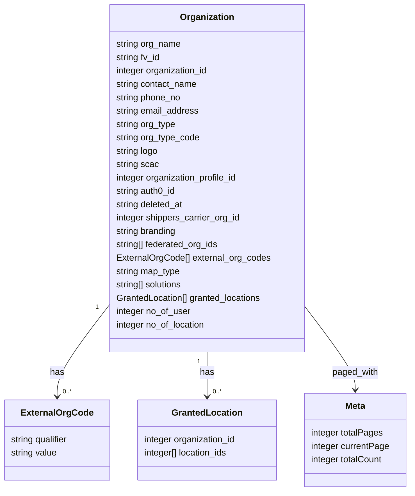

# Diagram: api_documentation/GetOrganizationsAPI.yaml


> Auto-generated by Obscura crawlers

## Diagram 1

```mermaid
graph TD
  Server["https://data-d.freightverify.com"]
  Server --> OrgById[/GET /iam/organizations/{organization_id}]
  Server --> OrgList[/GET /iam/organizations]
  OrgById --> P_id["path: organization_id (integer)"]
  OrgById --> P_return_deleted["query: deleted (boolean)"]
  OrgById --> R_200_id["200: body.response -> Organization"]
  OrgById --> R_400_id["400: Bad Request"]
  OrgById --> R_403_id["403: No Permission"]
  OrgById --> R_404_id["404: Not Found"]
  OrgList --> H_accept["header: Accept (versioned)"]
  OrgList --> Q_org_ids["query: organization_ids (array of integer)"]
  OrgList --> Q_org_fv_id["query: organization_fv_id (string or array)"]
  OrgList --> Q_return_deleted["query: deleted (boolean)"]
  OrgList --> Q_everything["query: everything (string)"]
  OrgList --> Q_fields["query: fields (enum)"]
  OrgList --> Q_orgType["query: orgType (string)"]
  OrgList --> Q_scac["query: scac (string)"]
  OrgList --> Q_allOrgs["query: allOrgs (boolean)"]
  OrgList --> Q_sort["query: sortColumn, reverseSort"]
  OrgList --> Q_locationCount["query: locationCount (boolean)"]
  OrgList --> Q_solutions["query: solutions (array)"]
  OrgList --> Q_feature["query: feature (array)"]
  OrgList --> Q_paging["query: pageNumber (int), pageSize (int)"]
  OrgList --> R_200_list["200: body.response[] -> Organization + meta"]
  OrgList --> R_400_list["400: Bad Request"]
  OrgList --> R_403_list["403: No Permission"]
  OrgList --> R_404_list["404: Not Found"]
  R_200_id --> Organization
  R_200_list --> Organization
  R_200_list --> Meta
  Organization["Organization object"]
  Organization -->|contains| ExternalCodes["external_org_codes[]"]
  Organization -->|contains| FederatedIDs["federated_org_ids[]"]
  Organization -->|contains| Solutions["solutions[]"]
  Organization -->|contains| GrantedLocations["granted_locations[]"]
  GrantedLocations --> GrantedLocationItem["{ organization_id, location_ids[] }"]
  ExternalCodes --> ExternalCodeItem["{ qualifier, value }"]
  Meta["meta { totalPages, currentPage, totalCount }"]
```

> SVG rendering failed for this diagram.

## Diagram 2



### SVG

<svg id="container" width="744.5703125" xmlns="http://www.w3.org/2000/svg" class="classDiagram" height="882" viewBox="0 0 744.5703125 882" role="graphics-document document" aria-roledescription="class"><style>#container{font-family:"trebuchet ms",verdana,arial,sans-serif;font-size:16px;fill:#333;}@keyframes edge-animation-frame{from{stroke-dashoffset:0;}}@keyframes dash{to{stroke-dashoffset:0;}}#container .edge-animation-slow{stroke-dasharray:9,5!important;stroke-dashoffset:900;animation:dash 50s linear infinite;stroke-linecap:round;}#container .edge-animation-fast{stroke-dasharray:9,5!important;stroke-dashoffset:900;animation:dash 20s linear infinite;stroke-linecap:round;}#container .error-icon{fill:#552222;}#container .error-text{fill:#552222;stroke:#552222;}#container .edge-thickness-normal{stroke-width:1px;}#container .edge-thickness-thick{stroke-width:3.5px;}#container .edge-pattern-solid{stroke-dasharray:0;}#container .edge-thickness-invisible{stroke-width:0;fill:none;}#container .edge-pattern-dashed{stroke-dasharray:3;}#container .edge-pattern-dotted{stroke-dasharray:2;}#container .marker{fill:#333333;stroke:#333333;}#container .marker.cross{stroke:#333333;}#container svg{font-family:"trebuchet ms",verdana,arial,sans-serif;font-size:16px;}#container p{margin:0;}#container g.classGroup text{fill:#9370DB;stroke:none;font-family:"trebuchet ms",verdana,arial,sans-serif;font-size:10px;}#container g.classGroup text .title{font-weight:bolder;}#container .nodeLabel,#container .edgeLabel{color:#131300;}#container .edgeLabel .label rect{fill:#ECECFF;}#container .label text{fill:#131300;}#container .labelBkg{background:#ECECFF;}#container .edgeLabel .label span{background:#ECECFF;}#container .classTitle{font-weight:bolder;}#container .node rect,#container .node circle,#container .node ellipse,#container .node polygon,#container .node path{fill:#ECECFF;stroke:#9370DB;stroke-width:1px;}#container .divider{stroke:#9370DB;stroke-width:1;}#container g.clickable{cursor:pointer;}#container g.classGroup rect{fill:#ECECFF;stroke:#9370DB;}#container g.classGroup line{stroke:#9370DB;stroke-width:1;}#container .classLabel .box{stroke:none;stroke-width:0;fill:#ECECFF;opacity:0.5;}#container .classLabel .label{fill:#9370DB;font-size:10px;}#container .relation{stroke:#333333;stroke-width:1;fill:none;}#container .dashed-line{stroke-dasharray:3;}#container .dotted-line{stroke-dasharray:1 2;}#container #compositionStart,#container .composition{fill:#333333!important;stroke:#333333!important;stroke-width:1;}#container #compositionEnd,#container .composition{fill:#333333!important;stroke:#333333!important;stroke-width:1;}#container #dependencyStart,#container .dependency{fill:#333333!important;stroke:#333333!important;stroke-width:1;}#container #dependencyStart,#container .dependency{fill:#333333!important;stroke:#333333!important;stroke-width:1;}#container #extensionStart,#container .extension{fill:transparent!important;stroke:#333333!important;stroke-width:1;}#container #extensionEnd,#container .extension{fill:transparent!important;stroke:#333333!important;stroke-width:1;}#container #aggregationStart,#container .aggregation{fill:transparent!important;stroke:#333333!important;stroke-width:1;}#container #aggregationEnd,#container .aggregation{fill:transparent!important;stroke:#333333!important;stroke-width:1;}#container #lollipopStart,#container .lollipop{fill:#ECECFF!important;stroke:#333333!important;stroke-width:1;}#container #lollipopEnd,#container .lollipop{fill:#ECECFF!important;stroke:#333333!important;stroke-width:1;}#container .edgeTerminals{font-size:11px;line-height:initial;}#container .classTitleText{text-anchor:middle;font-size:18px;fill:#333;}#container .label-icon{display:inline-block;height:1em;overflow:visible;vertical-align:-0.125em;}#container .node .label-icon path{fill:currentColor;stroke:revert;stroke-width:revert;}#container :root{--mermaid-font-family:"trebuchet ms",verdana,arial,sans-serif;}</style><g><defs><marker id="container_class-aggregationStart" class="marker aggregation class" refX="18" refY="7" markerWidth="190" markerHeight="240" orient="auto"><path d="M 18,7 L9,13 L1,7 L9,1 Z"></path></marker></defs><defs><marker id="container_class-aggregationEnd" class="marker aggregation class" refX="1" refY="7" markerWidth="20" markerHeight="28" orient="auto"><path d="M 18,7 L9,13 L1,7 L9,1 Z"></path></marker></defs><defs><marker id="container_class-extensionStart" class="marker extension class" refX="18" refY="7" markerWidth="190" markerHeight="240" orient="auto"><path d="M 1,7 L18,13 V 1 Z"></path></marker></defs><defs><marker id="container_class-extensionEnd" class="marker extension class" refX="1" refY="7" markerWidth="20" markerHeight="28" orient="auto"><path d="M 1,1 V 13 L18,7 Z"></path></marker></defs><defs><marker id="container_class-compositionStart" class="marker composition class" refX="18" refY="7" markerWidth="190" markerHeight="240" orient="auto"><path d="M 18,7 L9,13 L1,7 L9,1 Z"></path></marker></defs><defs><marker id="container_class-compositionEnd" class="marker composition class" refX="1" refY="7" markerWidth="20" markerHeight="28" orient="auto"><path d="M 18,7 L9,13 L1,7 L9,1 Z"></path></marker></defs><defs><marker id="container_class-dependencyStart" class="marker dependency class" refX="6" refY="7" markerWidth="190" markerHeight="240" orient="auto"><path d="M 5,7 L9,13 L1,7 L9,1 Z"></path></marker></defs><defs><marker id="container_class-dependencyEnd" class="marker dependency class" refX="13" refY="7" markerWidth="20" markerHeight="28" orient="auto"><path d="M 18,7 L9,13 L14,7 L9,1 Z"></path></marker></defs><defs><marker id="container_class-lollipopStart" class="marker lollipop class" refX="13" refY="7" markerWidth="190" markerHeight="240" orient="auto"><circle stroke="black" fill="transparent" cx="7" cy="7" r="6"></circle></marker></defs><defs><marker id="container_class-lollipopEnd" class="marker lollipop class" refX="1" refY="7" markerWidth="190" markerHeight="240" orient="auto"><circle stroke="black" fill="transparent" cx="7" cy="7" r="6"></circle></marker></defs><g class="root"><g class="clusters"></g><g class="edgePaths"><path d="M202.652,542.706L186.222,563.755C169.792,584.804,136.931,626.902,120.501,655.118C104.07,683.333,104.07,697.667,104.07,704.833L104.07,712" id="id_Organization_ExternalOrgCode_1" class="edge-thickness-normal edge-pattern-solid relation" style=";;;" data-edge="true" data-et="edge" data-id="id_Organization_ExternalOrgCode_1" data-points="W3sieCI6MjAyLjY1MjM0Mzc1LCJ5Ijo1NDIuNzA2NDM4MTk5MDI0OX0seyJ4IjoxMDQuMDcwMzEyNSwieSI6NjY5fSx7IngiOjEwNC4wNzAzMTI1LCJ5Ijo3MTh9XQ==" marker-end="url(#container_class-dependencyEnd)"></path><path d="M376.492,632L376.492,638.167C376.492,644.333,376.492,656.667,376.492,670C376.492,683.333,376.492,697.667,376.492,704.833L376.492,712" id="id_Organization_GrantedLocation_2" class="edge-thickness-normal edge-pattern-solid relation" style=";;;" data-edge="true" data-et="edge" data-id="id_Organization_GrantedLocation_2" data-points="W3sieCI6Mzc2LjQ5MjE4NzUsInkiOjYzMn0seyJ4IjozNzYuNDkyMTg3NSwieSI6NjY5fSx7IngiOjM3Ni40OTIxODc1LCJ5Ijo3MTh9XQ==" marker-end="url(#container_class-dependencyEnd)"></path><path d="M550.332,546.2L566.061,566.666C581.79,587.133,613.249,628.067,628.978,653.7C644.707,679.333,644.707,689.667,644.707,694.833L644.707,700" id="id_Organization_Meta_3" class="edge-thickness-normal edge-pattern-solid relation" style=";;;" data-edge="true" data-et="edge" data-id="id_Organization_Meta_3" data-points="W3sieCI6NTUwLjMzMjAzMTI1LCJ5Ijo1NDYuMTk5NjU2MjkyMzI2M30seyJ4Ijo2NDQuNzA3MDMxMjUsInkiOjY2OX0seyJ4Ijo2NDQuNzA3MDMxMjUsInkiOjcwNn1d" marker-end="url(#container_class-dependencyEnd)"></path></g><g class="edgeLabels"><g class="edgeLabel" transform="translate(104.0703125, 669)"><g class="label" data-id="id_Organization_ExternalOrgCode_1" transform="translate(-12.703125, -12)"><foreignObject width="25.40625" height="24"><div xmlns="http://www.w3.org/1999/xhtml" class="labelBkg" style="display: table-cell; white-space: nowrap; line-height: 1.5; max-width: 200px; text-align: center;"><span class="edgeLabel"><p>has</p></span></div></foreignObject></g></g><g class="edgeLabel" transform="translate(376.4921875, 669)"><g class="label" data-id="id_Organization_GrantedLocation_2" transform="translate(-12.703125, -12)"><foreignObject width="25.40625" height="24"><div xmlns="http://www.w3.org/1999/xhtml" class="labelBkg" style="display: table-cell; white-space: nowrap; line-height: 1.5; max-width: 200px; text-align: center;"><span class="edgeLabel"><p>has</p></span></div></foreignObject></g></g><g class="edgeLabel" transform="translate(644.70703125, 669)"><g class="label" data-id="id_Organization_Meta_3" transform="translate(-41.6953125, -12)"><foreignObject width="83.390625" height="24"><div xmlns="http://www.w3.org/1999/xhtml" class="labelBkg" style="display: table-cell; white-space: nowrap; line-height: 1.5; max-width: 200px; text-align: center;"><span class="edgeLabel"><p>paged_with</p></span></div></foreignObject></g></g><g class="edgeTerminals" transform="translate(180.06010954081222, 547.2716308026505)"><g class="inner" transform="translate(0, 0)"><foreignObject style="width: 9px; height: 12px;"><div xmlns="http://www.w3.org/1999/xhtml" style="display: inline-block; padding-right: 1px; white-space: nowrap;"><span class="edgeLabel">1</span></div></foreignObject></g></g><g class="edgeTerminals" transform="translate(361.49218875, 649.5000010714285)"><g class="inner" transform="translate(0, 0)"><foreignObject style="width: 9px; height: 12px;"><div xmlns="http://www.w3.org/1999/xhtml" style="display: inline-block; padding-right: 1px; white-space: nowrap;"><span class="edgeLabel">1</span></div></foreignObject></g></g><g class="edgeTerminals" transform="translate(114.07031124999996, 695.4999989285715)"><g class="inner" transform="translate(0, 0)"></g><foreignObject style="width: 36px; height: 12px;"><div xmlns="http://www.w3.org/1999/xhtml" style="display: inline-block; padding-right: 1px; white-space: nowrap;"><span class="edgeLabel">0..*</span></div></foreignObject></g><g class="edgeTerminals" transform="translate(386.4921887499999, 695.5000010714285)"><g class="inner" transform="translate(0, 0)"></g><foreignObject style="width: 36px; height: 12px;"><div xmlns="http://www.w3.org/1999/xhtml" style="display: inline-block; padding-right: 1px; white-space: nowrap;"><span class="edgeLabel">0..*</span></div></foreignObject></g></g><g class="nodes"><g class="node default" id="classId-Organization-0" transform="translate(376.4921875, 320)"><g class="basic label-container"><path d="M-173.83984375 -312 L173.83984375 -312 L173.83984375 312 L-173.83984375 312" stroke="none" stroke-width="0" fill="#ECECFF" style=""></path><path d="M-173.83984375 -312 C-41.08930338208248 -312, 91.66123698583505 -312, 173.83984375 -312 M-173.83984375 -312 C-92.84690917554515 -312, -11.8539746010903 -312, 173.83984375 -312 M173.83984375 -312 C173.83984375 -86.49940223877795, 173.83984375 139.0011955224441, 173.83984375 312 M173.83984375 -312 C173.83984375 -85.41787365410445, 173.83984375 141.1642526917911, 173.83984375 312 M173.83984375 312 C58.80829639458538 312, -56.22325096082923 312, -173.83984375 312 M173.83984375 312 C76.49186389144757 312, -20.85611596710487 312, -173.83984375 312 M-173.83984375 312 C-173.83984375 151.75663356225385, -173.83984375 -8.486732875492294, -173.83984375 -312 M-173.83984375 312 C-173.83984375 142.35961072743424, -173.83984375 -27.28077854513151, -173.83984375 -312" stroke="#9370DB" stroke-width="1.3" fill="none" stroke-dasharray="0 0" style=""></path></g><g class="annotation-group text" transform="translate(0, -288)"></g><g class="label-group text" transform="translate(-46.6953125, -288)"><g class="label" style="font-weight: bolder" transform="translate(0,-12)"><foreignObject width="93.390625" height="24"><div xmlns="http://www.w3.org/1999/xhtml" style="display: table-cell; white-space: nowrap; line-height: 1.5; max-width: 142px; text-align: center;"><span class="nodeLabel markdown-node-label" style=""><p>Organization</p></span></div></foreignObject></g></g><g class="members-group text" transform="translate(-161.83984375, -240)"><g class="label" style="" transform="translate(0,-12)"><foreignObject width="118.375" height="24"><div xmlns="http://www.w3.org/1999/xhtml" style="display: table-cell; white-space: nowrap; line-height: 1.5; max-width: 168px; text-align: center;"><span class="nodeLabel markdown-node-label" style=""><p>string org_name</p></span></div></foreignObject></g><g class="label" style="" transform="translate(0,12)"><foreignObject width="81.03125" height="24"><div xmlns="http://www.w3.org/1999/xhtml" style="display: table-cell; white-space: nowrap; line-height: 1.5; max-width: 131px; text-align: center;"><span class="nodeLabel markdown-node-label" style=""><p>string fv_id</p></span></div></foreignObject></g><g class="label" style="" transform="translate(0,36)"><foreignObject width="168.109375" height="24"><div xmlns="http://www.w3.org/1999/xhtml" style="display: table-cell; white-space: nowrap; line-height: 1.5; max-width: 218px; text-align: center;"><span class="nodeLabel markdown-node-label" style=""><p>integer organization_id</p></span></div></foreignObject></g><g class="label" style="" transform="translate(0,60)"><foreignObject width="148.546875" height="24"><div xmlns="http://www.w3.org/1999/xhtml" style="display: table-cell; white-space: nowrap; line-height: 1.5; max-width: 199px; text-align: center;"><span class="nodeLabel markdown-node-label" style=""><p>string contact_name</p></span></div></foreignObject></g><g class="label" style="" transform="translate(0,84)"><foreignObject width="118.921875" height="24"><div xmlns="http://www.w3.org/1999/xhtml" style="display: table-cell; white-space: nowrap; line-height: 1.5; max-width: 169px; text-align: center;"><span class="nodeLabel markdown-node-label" style=""><p>string phone_no</p></span></div></foreignObject></g><g class="label" style="" transform="translate(0,108)"><foreignObject width="151.25" height="24"><div xmlns="http://www.w3.org/1999/xhtml" style="display: table-cell; white-space: nowrap; line-height: 1.5; max-width: 201px; text-align: center;"><span class="nodeLabel markdown-node-label" style=""><p>string email_address</p></span></div></foreignObject></g><g class="label" style="" transform="translate(0,132)"><foreignObject width="109.34375" height="24"><div xmlns="http://www.w3.org/1999/xhtml" style="display: table-cell; white-space: nowrap; line-height: 1.5; max-width: 159px; text-align: center;"><span class="nodeLabel markdown-node-label" style=""><p>string org_type</p></span></div></foreignObject></g><g class="label" style="" transform="translate(0,156)"><foreignObject width="151.96875" height="24"><div xmlns="http://www.w3.org/1999/xhtml" style="display: table-cell; white-space: nowrap; line-height: 1.5; max-width: 202px; text-align: center;"><span class="nodeLabel markdown-node-label" style=""><p>string org_type_code</p></span></div></foreignObject></g><g class="label" style="" transform="translate(0,180)"><foreignObject width="77.234375" height="24"><div xmlns="http://www.w3.org/1999/xhtml" style="display: table-cell; white-space: nowrap; line-height: 1.5; max-width: 127px; text-align: center;"><span class="nodeLabel markdown-node-label" style=""><p>string logo</p></span></div></foreignObject></g><g class="label" style="" transform="translate(0,204)"><foreignObject width="77.1875" height="24"><div xmlns="http://www.w3.org/1999/xhtml" style="display: table-cell; white-space: nowrap; line-height: 1.5; max-width: 128px; text-align: center;"><span class="nodeLabel markdown-node-label" style=""><p>string scac</p></span></div></foreignObject></g><g class="label" style="" transform="translate(0,228)"><foreignObject width="223.171875" height="24"><div xmlns="http://www.w3.org/1999/xhtml" style="display: table-cell; white-space: nowrap; line-height: 1.5; max-width: 273px; text-align: center;"><span class="nodeLabel markdown-node-label" style=""><p>integer organization_profile_id</p></span></div></foreignObject></g><g class="label" style="" transform="translate(0,252)"><foreignObject width="109.890625" height="24"><div xmlns="http://www.w3.org/1999/xhtml" style="display: table-cell; white-space: nowrap; line-height: 1.5; max-width: 160px; text-align: center;"><span class="nodeLabel markdown-node-label" style=""><p>string auth0_id</p></span></div></foreignObject></g><g class="label" style="" transform="translate(0,276)"><foreignObject width="123.796875" height="24"><div xmlns="http://www.w3.org/1999/xhtml" style="display: table-cell; white-space: nowrap; line-height: 1.5; max-width: 174px; text-align: center;"><span class="nodeLabel markdown-node-label" style=""><p>string deleted_at</p></span></div></foreignObject></g><g class="label" style="" transform="translate(0,300)"><foreignObject width="226.265625" height="24"><div xmlns="http://www.w3.org/1999/xhtml" style="display: table-cell; white-space: nowrap; line-height: 1.5; max-width: 276px; text-align: center;"><span class="nodeLabel markdown-node-label" style=""><p>integer shippers_carrier_org_id</p></span></div></foreignObject></g><g class="label" style="" transform="translate(0,324)"><foreignObject width="110.859375" height="24"><div xmlns="http://www.w3.org/1999/xhtml" style="display: table-cell; white-space: nowrap; line-height: 1.5; max-width: 162px; text-align: center;"><span class="nodeLabel markdown-node-label" style=""><p>string branding</p></span></div></foreignObject></g><g class="label" style="" transform="translate(0,348)"><foreignObject width="188.078125" height="24"><div xmlns="http://www.w3.org/1999/xhtml" style="display: table-cell; white-space: nowrap; line-height: 1.5; max-width: 238px; text-align: center;"><span class="nodeLabel markdown-node-label" style=""><p>string[] federated_org_ids</p></span></div></foreignObject></g><g class="label" style="" transform="translate(0,372)"><foreignObject width="276.984375" height="24"><div xmlns="http://www.w3.org/1999/xhtml" style="display: table-cell; white-space: nowrap; line-height: 1.5; max-width: 327px; text-align: center;"><span class="nodeLabel markdown-node-label" style=""><p>ExternalOrgCode[] external_org_codes</p></span></div></foreignObject></g><g class="label" style="" transform="translate(0,396)"><foreignObject width="117.265625" height="24"><div xmlns="http://www.w3.org/1999/xhtml" style="display: table-cell; white-space: nowrap; line-height: 1.5; max-width: 167px; text-align: center;"><span class="nodeLabel markdown-node-label" style=""><p>string map_type</p></span></div></foreignObject></g><g class="label" style="" transform="translate(0,420)"><foreignObject width="123.484375" height="24"><div xmlns="http://www.w3.org/1999/xhtml" style="display: table-cell; white-space: nowrap; line-height: 1.5; max-width: 173px; text-align: center;"><span class="nodeLabel markdown-node-label" style=""><p>string[] solutions</p></span></div></foreignObject></g><g class="label" style="" transform="translate(0,444)"><foreignObject width="264.90625" height="24"><div xmlns="http://www.w3.org/1999/xhtml" style="display: table-cell; white-space: nowrap; line-height: 1.5; max-width: 315px; text-align: center;"><span class="nodeLabel markdown-node-label" style=""><p>GrantedLocation[] granted_locations</p></span></div></foreignObject></g><g class="label" style="" transform="translate(0,468)"><foreignObject width="135.65625" height="24"><div xmlns="http://www.w3.org/1999/xhtml" style="display: table-cell; white-space: nowrap; line-height: 1.5; max-width: 186px; text-align: center;"><span class="nodeLabel markdown-node-label" style=""><p>integer no_of_user</p></span></div></foreignObject></g><g class="label" style="" transform="translate(0,492)"><foreignObject width="163.28125" height="24"><div xmlns="http://www.w3.org/1999/xhtml" style="display: table-cell; white-space: nowrap; line-height: 1.5; max-width: 213px; text-align: center;"><span class="nodeLabel markdown-node-label" style=""><p>integer no_of_location</p></span></div></foreignObject></g></g><g class="methods-group text" transform="translate(-161.83984375, 312)"></g><g class="divider" style=""><path d="M-173.83984375 -264 C-79.42112696764426 -264, 14.997589814711489 -264, 173.83984375 -264 M-173.83984375 -264 C-67.1005888393598 -264, 39.6386660712804 -264, 173.83984375 -264" stroke="#9370DB" stroke-width="1.3" fill="none" stroke-dasharray="0 0" style=""></path></g><g class="divider" style=""><path d="M-173.83984375 288 C-51.96619809550667 288, 69.90744755898666 288, 173.83984375 288 M-173.83984375 288 C-99.58670962214805 288, -25.3335754942961 288, 173.83984375 288" stroke="#9370DB" stroke-width="1.3" fill="none" stroke-dasharray="0 0" style=""></path></g></g><g class="node default" id="classId-ExternalOrgCode-1" transform="translate(104.0703125, 790)"><g class="basic label-container"><path d="M-96.0703125 -72 L96.0703125 -72 L96.0703125 72 L-96.0703125 72" stroke="none" stroke-width="0" fill="#ECECFF" style=""></path><path d="M-96.0703125 -72 C-38.259430262561544 -72, 19.551451974876912 -72, 96.0703125 -72 M-96.0703125 -72 C-28.143791427835836 -72, 39.78272964432833 -72, 96.0703125 -72 M96.0703125 -72 C96.0703125 -18.81188472735429, 96.0703125 34.37623054529142, 96.0703125 72 M96.0703125 -72 C96.0703125 -34.73381954967881, 96.0703125 2.5323609006423737, 96.0703125 72 M96.0703125 72 C26.202910189054123 72, -43.664492121891755 72, -96.0703125 72 M96.0703125 72 C51.58272417317136 72, 7.095135846342714 72, -96.0703125 72 M-96.0703125 72 C-96.0703125 41.99914285185972, -96.0703125 11.998285703719446, -96.0703125 -72 M-96.0703125 72 C-96.0703125 14.598636714537335, -96.0703125 -42.80272657092533, -96.0703125 -72" stroke="#9370DB" stroke-width="1.3" fill="none" stroke-dasharray="0 0" style=""></path></g><g class="annotation-group text" transform="translate(0, -48)"></g><g class="label-group text" transform="translate(-61.546875, -48)"><g class="label" style="font-weight: bolder" transform="translate(0,-12)"><foreignObject width="123.09375" height="24"><div xmlns="http://www.w3.org/1999/xhtml" style="display: table-cell; white-space: nowrap; line-height: 1.5; max-width: 171px; text-align: center;"><span class="nodeLabel markdown-node-label" style=""><p>ExternalOrgCode</p></span></div></foreignObject></g></g><g class="members-group text" transform="translate(-84.0703125, 0)"><g class="label" style="" transform="translate(0,-12)"><foreignObject width="106.59375" height="24"><div xmlns="http://www.w3.org/1999/xhtml" style="display: table-cell; white-space: nowrap; line-height: 1.5; max-width: 157px; text-align: center;"><span class="nodeLabel markdown-node-label" style=""><p>string qualifier</p></span></div></foreignObject></g><g class="label" style="" transform="translate(0,12)"><foreignObject width="84.765625" height="24"><div xmlns="http://www.w3.org/1999/xhtml" style="display: table-cell; white-space: nowrap; line-height: 1.5; max-width: 135px; text-align: center;"><span class="nodeLabel markdown-node-label" style=""><p>string value</p></span></div></foreignObject></g></g><g class="methods-group text" transform="translate(-84.0703125, 72)"></g><g class="divider" style=""><path d="M-96.0703125 -24 C-55.39159138943442 -24, -14.712870278868834 -24, 96.0703125 -24 M-96.0703125 -24 C-53.35727694910603 -24, -10.64424139821206 -24, 96.0703125 -24" stroke="#9370DB" stroke-width="1.3" fill="none" stroke-dasharray="0 0" style=""></path></g><g class="divider" style=""><path d="M-96.0703125 48 C-44.90527850856354 48, 6.259755482872919 48, 96.0703125 48 M-96.0703125 48 C-40.04776653293129 48, 15.974779434137417 48, 96.0703125 48" stroke="#9370DB" stroke-width="1.3" fill="none" stroke-dasharray="0 0" style=""></path></g></g><g class="node default" id="classId-GrantedLocation-2" transform="translate(376.4921875, 790)"><g class="basic label-container"><path d="M-126.3515625 -72 L126.3515625 -72 L126.3515625 72 L-126.3515625 72" stroke="none" stroke-width="0" fill="#ECECFF" style=""></path><path d="M-126.3515625 -72 C-64.6659190461178 -72, -2.9802755922356 -72, 126.3515625 -72 M-126.3515625 -72 C-41.74156594719966 -72, 42.86843060560068 -72, 126.3515625 -72 M126.3515625 -72 C126.3515625 -34.493297321214264, 126.3515625 3.0134053575714717, 126.3515625 72 M126.3515625 -72 C126.3515625 -15.247050008991401, 126.3515625 41.5058999820172, 126.3515625 72 M126.3515625 72 C71.50647216142977 72, 16.661381822859525 72, -126.3515625 72 M126.3515625 72 C56.10464316815107 72, -14.142276163697858 72, -126.3515625 72 M-126.3515625 72 C-126.3515625 28.783523657363645, -126.3515625 -14.43295268527271, -126.3515625 -72 M-126.3515625 72 C-126.3515625 18.921553192023765, -126.3515625 -34.15689361595247, -126.3515625 -72" stroke="#9370DB" stroke-width="1.3" fill="none" stroke-dasharray="0 0" style=""></path></g><g class="annotation-group text" transform="translate(0, -48)"></g><g class="label-group text" transform="translate(-60.59375, -48)"><g class="label" style="font-weight: bolder" transform="translate(0,-12)"><foreignObject width="121.1875" height="24"><div xmlns="http://www.w3.org/1999/xhtml" style="display: table-cell; white-space: nowrap; line-height: 1.5; max-width: 170px; text-align: center;"><span class="nodeLabel markdown-node-label" style=""><p>GrantedLocation</p></span></div></foreignObject></g></g><g class="members-group text" transform="translate(-114.3515625, 0)"><g class="label" style="" transform="translate(0,-12)"><foreignObject width="168.109375" height="24"><div xmlns="http://www.w3.org/1999/xhtml" style="display: table-cell; white-space: nowrap; line-height: 1.5; max-width: 218px; text-align: center;"><span class="nodeLabel markdown-node-label" style=""><p>integer organization_id</p></span></div></foreignObject></g><g class="label" style="" transform="translate(0,12)"><foreignObject width="154.6875" height="24"><div xmlns="http://www.w3.org/1999/xhtml" style="display: table-cell; white-space: nowrap; line-height: 1.5; max-width: 205px; text-align: center;"><span class="nodeLabel markdown-node-label" style=""><p>integer[] location_ids</p></span></div></foreignObject></g></g><g class="methods-group text" transform="translate(-114.3515625, 72)"></g><g class="divider" style=""><path d="M-126.3515625 -24 C-58.401965506628 -24, 9.547631486743995 -24, 126.3515625 -24 M-126.3515625 -24 C-35.906939972215355 -24, 54.53768255556929 -24, 126.3515625 -24" stroke="#9370DB" stroke-width="1.3" fill="none" stroke-dasharray="0 0" style=""></path></g><g class="divider" style=""><path d="M-126.3515625 48 C-51.054017563242766 48, 24.243527373514468 48, 126.3515625 48 M-126.3515625 48 C-49.403426272416965 48, 27.54470995516607 48, 126.3515625 48" stroke="#9370DB" stroke-width="1.3" fill="none" stroke-dasharray="0 0" style=""></path></g></g><g class="node default" id="classId-Meta-3" transform="translate(644.70703125, 790)"><g class="basic label-container"><path d="M-91.86328125 -84 L91.86328125 -84 L91.86328125 84 L-91.86328125 84" stroke="none" stroke-width="0" fill="#ECECFF" style=""></path><path d="M-91.86328125 -84 C-51.28307067615553 -84, -10.702860102311064 -84, 91.86328125 -84 M-91.86328125 -84 C-45.25537748163627 -84, 1.3525262867274535 -84, 91.86328125 -84 M91.86328125 -84 C91.86328125 -44.63631784773072, 91.86328125 -5.272635695461446, 91.86328125 84 M91.86328125 -84 C91.86328125 -31.726447012070615, 91.86328125 20.54710597585877, 91.86328125 84 M91.86328125 84 C19.75932084719581 84, -52.34463955560838 84, -91.86328125 84 M91.86328125 84 C54.866315407814604 84, 17.869349565629207 84, -91.86328125 84 M-91.86328125 84 C-91.86328125 40.11673606691123, -91.86328125 -3.7665278661775403, -91.86328125 -84 M-91.86328125 84 C-91.86328125 41.76006184826032, -91.86328125 -0.47987630347935806, -91.86328125 -84" stroke="#9370DB" stroke-width="1.3" fill="none" stroke-dasharray="0 0" style=""></path></g><g class="annotation-group text" transform="translate(0, -60)"></g><g class="label-group text" transform="translate(-18.0859375, -60)"><g class="label" style="font-weight: bolder" transform="translate(0,-12)"><foreignObject width="36.171875" height="24"><div xmlns="http://www.w3.org/1999/xhtml" style="display: table-cell; white-space: nowrap; line-height: 1.5; max-width: 86px; text-align: center;"><span class="nodeLabel markdown-node-label" style=""><p>Meta</p></span></div></foreignObject></g></g><g class="members-group text" transform="translate(-79.86328125, -12)"><g class="label" style="" transform="translate(0,-12)"><foreignObject width="130.34375" height="24"><div xmlns="http://www.w3.org/1999/xhtml" style="display: table-cell; white-space: nowrap; line-height: 1.5; max-width: 180px; text-align: center;"><span class="nodeLabel markdown-node-label" style=""><p>integer totalPages</p></span></div></foreignObject></g><g class="label" style="" transform="translate(0,12)"><foreignObject width="141.640625" height="24"><div xmlns="http://www.w3.org/1999/xhtml" style="display: table-cell; white-space: nowrap; line-height: 1.5; max-width: 192px; text-align: center;"><span class="nodeLabel markdown-node-label" style=""><p>integer currentPage</p></span></div></foreignObject></g><g class="label" style="" transform="translate(0,36)"><foreignObject width="131.578125" height="24"><div xmlns="http://www.w3.org/1999/xhtml" style="display: table-cell; white-space: nowrap; line-height: 1.5; max-width: 182px; text-align: center;"><span class="nodeLabel markdown-node-label" style=""><p>integer totalCount</p></span></div></foreignObject></g></g><g class="methods-group text" transform="translate(-79.86328125, 84)"></g><g class="divider" style=""><path d="M-91.86328125 -36 C-26.630295843572995 -36, 38.60268956285401 -36, 91.86328125 -36 M-91.86328125 -36 C-34.12874839694051 -36, 23.605784456118982 -36, 91.86328125 -36" stroke="#9370DB" stroke-width="1.3" fill="none" stroke-dasharray="0 0" style=""></path></g><g class="divider" style=""><path d="M-91.86328125 60 C-33.03970722424922 60, 25.78386680150156 60, 91.86328125 60 M-91.86328125 60 C-45.0120386292679 60, 1.8392039914642027 60, 91.86328125 60" stroke="#9370DB" stroke-width="1.3" fill="none" stroke-dasharray="0 0" style=""></path></g></g></g></g></g></svg>
