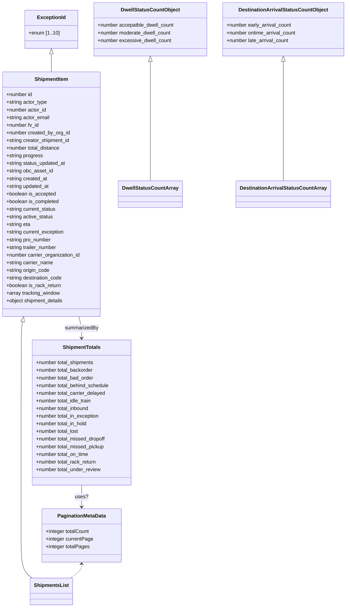

# Diagram: api_documentation/NgShipmentsApi.yaml


> Auto-generated by Obscura crawlers

## Diagram 1

```mermaid
flowchart LR
  API["Shipment NG APIs (https://data.freightverify.com/)"]
  subgraph ShippingNG[/shipping-ng/]
    dwell["dwell_data/ GET\nparams: dest_code, unload_type"]
    destArrival["destination_arrival_status/ GET\nparams: dest_code, unload_type"]
    totals["shipments/totals/ GET"]
    typeFilters["type_filters/ GET"]
    countries["countries/ GET"]
    statusFilters["status_filters/ GET"]
    modes["shipment_modes/ GET"]
    carriers["carriers/ GET"]
    iamOrgs["iam/organizations/ GET\nreturns response+meta"]
    exceptions["exception_filters/ GET"]
    parts["parts/ GET"]
    shipments["shipments/ GET\nmany query filters"]
  end
  API --> ShippingNG
  ShippingNG --> dwell
  ShippingNG --> destArrival
  ShippingNG --> totals
  ShippingNG --> typeFilters
  ShippingNG --> countries
  ShippingNG --> statusFilters
  ShippingNG --> modes
  ShippingNG --> carriers
  ShippingNG --> iamOrgs
  ShippingNG --> exceptions
  ShippingNG --> parts
  ShippingNG --> shipments
  dwell -->|200 JSON: DwellStatusCountArray| DwellSchema[(DwellStatusCountArray)]
  destArrival -->|200 JSON: DestinationArrivalStatusCountArray| DestArrivalSchema[(DestinationArrivalStatusCountArray)]
  totals -->|200 JSON: ShipmentTotals| TotalsSchema[(ShipmentTotals)]
  typeFilters -->|200 JSON: ShipmentTypeFilters| TypeFiltersSchema[(ShipmentTypeFilters)]
  countries -->|200 JSON: CountryList| CountrySchema[(CountryList)]
  statusFilters -->|200 JSON: StatusFiltersList| StatusSchema[(StatusFiltersList)]
  modes -->|200 JSON: ShipmentModesList| ModesSchema[(ShipmentModesList)]
  carriers -->|200 JSON: CarrierList| CarrierSchema[(CarrierList)]
  iamOrgs -->|200 JSON: OrganizationsList + PaginationMetaData| OrgsSchema[(OrganizationsList)]
  exceptions -->|200 JSON: ExceptionsList| ExceptionsSchema[(ExceptionsList)]
  parts -->|200 JSON: [string]| PartsSchema[(Parts Array)]
  shipments -->|200 JSON: ShipmentsList + PaginationMetaData| ShipmentsSchema[(ShipmentsList)]
```

> SVG rendering failed for this diagram.

## Diagram 2



### SVG

<svg id="container" width="1091.24609375" xmlns="http://www.w3.org/2000/svg" class="classDiagram" height="1908" viewBox="0 0 1091.24609375 1908" role="graphics-document document" aria-roledescription="class"><style>#container{font-family:"trebuchet ms",verdana,arial,sans-serif;font-size:16px;fill:#333;}@keyframes edge-animation-frame{from{stroke-dashoffset:0;}}@keyframes dash{to{stroke-dashoffset:0;}}#container .edge-animation-slow{stroke-dasharray:9,5!important;stroke-dashoffset:900;animation:dash 50s linear infinite;stroke-linecap:round;}#container .edge-animation-fast{stroke-dasharray:9,5!important;stroke-dashoffset:900;animation:dash 20s linear infinite;stroke-linecap:round;}#container .error-icon{fill:#552222;}#container .error-text{fill:#552222;stroke:#552222;}#container .edge-thickness-normal{stroke-width:1px;}#container .edge-thickness-thick{stroke-width:3.5px;}#container .edge-pattern-solid{stroke-dasharray:0;}#container .edge-thickness-invisible{stroke-width:0;fill:none;}#container .edge-pattern-dashed{stroke-dasharray:3;}#container .edge-pattern-dotted{stroke-dasharray:2;}#container .marker{fill:#333333;stroke:#333333;}#container .marker.cross{stroke:#333333;}#container svg{font-family:"trebuchet ms",verdana,arial,sans-serif;font-size:16px;}#container p{margin:0;}#container g.classGroup text{fill:#9370DB;stroke:none;font-family:"trebuchet ms",verdana,arial,sans-serif;font-size:10px;}#container g.classGroup text .title{font-weight:bolder;}#container .nodeLabel,#container .edgeLabel{color:#131300;}#container .edgeLabel .label rect{fill:#ECECFF;}#container .label text{fill:#131300;}#container .labelBkg{background:#ECECFF;}#container .edgeLabel .label span{background:#ECECFF;}#container .classTitle{font-weight:bolder;}#container .node rect,#container .node circle,#container .node ellipse,#container .node polygon,#container .node path{fill:#ECECFF;stroke:#9370DB;stroke-width:1px;}#container .divider{stroke:#9370DB;stroke-width:1;}#container g.clickable{cursor:pointer;}#container g.classGroup rect{fill:#ECECFF;stroke:#9370DB;}#container g.classGroup line{stroke:#9370DB;stroke-width:1;}#container .classLabel .box{stroke:none;stroke-width:0;fill:#ECECFF;opacity:0.5;}#container .classLabel .label{fill:#9370DB;font-size:10px;}#container .relation{stroke:#333333;stroke-width:1;fill:none;}#container .dashed-line{stroke-dasharray:3;}#container .dotted-line{stroke-dasharray:1 2;}#container #compositionStart,#container .composition{fill:#333333!important;stroke:#333333!important;stroke-width:1;}#container #compositionEnd,#container .composition{fill:#333333!important;stroke:#333333!important;stroke-width:1;}#container #dependencyStart,#container .dependency{fill:#333333!important;stroke:#333333!important;stroke-width:1;}#container #dependencyStart,#container .dependency{fill:#333333!important;stroke:#333333!important;stroke-width:1;}#container #extensionStart,#container .extension{fill:transparent!important;stroke:#333333!important;stroke-width:1;}#container #extensionEnd,#container .extension{fill:transparent!important;stroke:#333333!important;stroke-width:1;}#container #aggregationStart,#container .aggregation{fill:transparent!important;stroke:#333333!important;stroke-width:1;}#container #aggregationEnd,#container .aggregation{fill:transparent!important;stroke:#333333!important;stroke-width:1;}#container #lollipopStart,#container .lollipop{fill:#ECECFF!important;stroke:#333333!important;stroke-width:1;}#container #lollipopEnd,#container .lollipop{fill:#ECECFF!important;stroke:#333333!important;stroke-width:1;}#container .edgeTerminals{font-size:11px;line-height:initial;}#container .classTitleText{text-anchor:middle;font-size:18px;fill:#333;}#container .label-icon{display:inline-block;height:1em;overflow:visible;vertical-align:-0.125em;}#container .node .label-icon path{fill:currentColor;stroke:revert;stroke-width:revert;}#container :root{--mermaid-font-family:"trebuchet ms",verdana,arial,sans-serif;}</style><g><defs><marker id="container_class-aggregationStart" class="marker aggregation class" refX="18" refY="7" markerWidth="190" markerHeight="240" orient="auto"><path d="M 18,7 L9,13 L1,7 L9,1 Z"></path></marker></defs><defs><marker id="container_class-aggregationEnd" class="marker aggregation class" refX="1" refY="7" markerWidth="20" markerHeight="28" orient="auto"><path d="M 18,7 L9,13 L1,7 L9,1 Z"></path></marker></defs><defs><marker id="container_class-extensionStart" class="marker extension class" refX="18" refY="7" markerWidth="190" markerHeight="240" orient="auto"><path d="M 1,7 L18,13 V 1 Z"></path></marker></defs><defs><marker id="container_class-extensionEnd" class="marker extension class" refX="1" refY="7" markerWidth="20" markerHeight="28" orient="auto"><path d="M 1,1 V 13 L18,7 Z"></path></marker></defs><defs><marker id="container_class-compositionStart" class="marker composition class" refX="18" refY="7" markerWidth="190" markerHeight="240" orient="auto"><path d="M 18,7 L9,13 L1,7 L9,1 Z"></path></marker></defs><defs><marker id="container_class-compositionEnd" class="marker composition class" refX="1" refY="7" markerWidth="20" markerHeight="28" orient="auto"><path d="M 18,7 L9,13 L1,7 L9,1 Z"></path></marker></defs><defs><marker id="container_class-dependencyStart" class="marker dependency class" refX="6" refY="7" markerWidth="190" markerHeight="240" orient="auto"><path d="M 5,7 L9,13 L1,7 L9,1 Z"></path></marker></defs><defs><marker id="container_class-dependencyEnd" class="marker dependency class" refX="13" refY="7" markerWidth="20" markerHeight="28" orient="auto"><path d="M 18,7 L9,13 L14,7 L9,1 Z"></path></marker></defs><defs><marker id="container_class-lollipopStart" class="marker lollipop class" refX="13" refY="7" markerWidth="190" markerHeight="240" orient="auto"><circle stroke="black" fill="transparent" cx="7" cy="7" r="6"></circle></marker></defs><defs><marker id="container_class-lollipopEnd" class="marker lollipop class" refX="1" refY="7" markerWidth="190" markerHeight="240" orient="auto"><circle stroke="black" fill="transparent" cx="7" cy="7" r="6"></circle></marker></defs><g class="root"><g class="clusters"></g><g class="edgePaths"><path d="M471.891,193.25L471.891,194.542C471.891,195.833,471.891,198.417,471.891,260.875C471.891,323.333,471.891,445.667,471.891,506.833L471.891,568" id="id_DwellStatusCountObject_DwellStatusCountArray_1" class="edge-thickness-normal edge-pattern-solid relation" style=";;;" data-edge="true" data-et="edge" data-id="id_DwellStatusCountObject_DwellStatusCountArray_1" data-points="W3sieCI6NDcxLjg5MDYyNSwieSI6MTc2fSx7IngiOjQ3MS44OTA2MjUsInkiOjIwMX0seyJ4Ijo0NzEuODkwNjI1LCJ5Ijo1Njh9XQ==" marker-start="url(#container_class-extensionStart)"></path><path d="M891.781,193.25L891.781,194.542C891.781,195.833,891.781,198.417,891.781,260.875C891.781,323.333,891.781,445.667,891.781,506.833L891.781,568" id="id_DestinationArrivalStatusCountObject_DestinationArrivalStatusCountArray_2" class="edge-thickness-normal edge-pattern-solid relation" style=";;;" data-edge="true" data-et="edge" data-id="id_DestinationArrivalStatusCountObject_DestinationArrivalStatusCountArray_2" data-points="W3sieCI6ODkxLjc4MTI1LCJ5IjoxNzZ9LHsieCI6ODkxLjc4MTI1LCJ5IjoyMDF9LHsieCI6ODkxLjc4MTI1LCJ5Ijo1Njh9XQ==" marker-start="url(#container_class-extensionStart)"></path><path d="M71.873,1010.812L71.1,1014.176C70.326,1017.541,68.779,1024.271,68.006,1071.802C67.232,1119.333,67.232,1207.667,67.232,1296C67.232,1384.333,67.232,1472.667,67.232,1537C67.232,1601.333,67.232,1641.667,67.232,1680C67.232,1718.333,67.232,1754.667,73.251,1777C79.27,1799.333,91.307,1807.667,97.325,1811.833L103.344,1816" id="id_ShipmentItem_ShipmentsList_3" class="edge-thickness-normal edge-pattern-solid relation" style=";;;" data-edge="true" data-et="edge" data-id="id_ShipmentItem_ShipmentsList_3" data-points="W3sieCI6NzUuNzM3OTY1NzgwODc4ODcsInkiOjk5NH0seyJ4Ijo2Ny4yMzI0MjE4NzUsInkiOjEwMzF9LHsieCI6NjcuMjMyNDIxODc1LCJ5IjoxMjk2fSx7IngiOjY3LjIzMjQyMTg3NSwieSI6MTU2MX0seyJ4Ijo2Ny4yMzI0MjE4NzUsInkiOjE2ODJ9LHsieCI6NjcuMjMyNDIxODc1LCJ5IjoxNzkxfSx7IngiOjEwMy4zNDQwOTk4MTM0MzI4MywieSI6MTgxNn1d" marker-start="url(#container_class-extensionStart)"></path><path d="M260.791,1524L260.791,1530.167C260.791,1536.333,260.791,1548.667,260.791,1560C260.791,1571.333,260.791,1581.667,260.791,1586.833L260.791,1592" id="id_ShipmentTotals_PaginationMetaData_4" class="edge-thickness-normal edge-pattern-solid relation" style=";;;" data-edge="true" data-et="edge" data-id="id_ShipmentTotals_PaginationMetaData_4" data-points="W3sieCI6MjYwLjc5MTAxNTYyNSwieSI6MTUyNH0seyJ4IjoyNjAuNzkxMDE1NjI1LCJ5IjoxNTYxfSx7IngiOjI2MC43OTEwMTU2MjUsInkiOjE1OTh9XQ==" marker-end="url(#container_class-dependencyEnd)"></path><path d="M252.285,994L253.703,1000.167C255.121,1006.333,257.956,1018.667,259.373,1030C260.791,1041.333,260.791,1051.667,260.791,1056.833L260.791,1062" id="id_ShipmentItem_ShipmentTotals_5" class="edge-thickness-normal edge-pattern-solid relation" style=";;;" data-edge="true" data-et="edge" data-id="id_ShipmentItem_ShipmentTotals_5" data-points="W3sieCI6MjUyLjI4NTQ3MTcxOTEyMTEyLCJ5Ijo5OTR9LHsieCI6MjYwLjc5MTAxNTYyNSwieSI6MTAzMX0seyJ4IjoyNjAuNzkxMDE1NjI1LCJ5IjoxMDY4fV0=" marker-end="url(#container_class-dependencyEnd)"></path><path d="M164.012,169.25L164.012,174.542C164.012,179.833,164.012,190.417,164.012,199.875C164.012,209.333,164.012,217.667,164.012,221.833L164.012,226" id="id_ExceptionId_ShipmentItem_6" class="edge-thickness-normal edge-pattern-solid relation" style=";;;" data-edge="true" data-et="edge" data-id="id_ExceptionId_ShipmentItem_6" data-points="W3sieCI6MTY0LjAxMTcxODc1LCJ5IjoxNTJ9LHsieCI6MTY0LjAxMTcxODc1LCJ5IjoyMDF9LHsieCI6MTY0LjAxMTcxODc1LCJ5IjoyMjZ9XQ==" marker-start="url(#container_class-extensionStart)"></path><path d="M260.791,1772L260.791,1775.167C260.791,1778.333,260.791,1784.667,254.772,1792C248.754,1799.333,236.717,1807.667,230.698,1811.833L224.679,1816" id="id_PaginationMetaData_ShipmentsList_7" class="edge-thickness-normal edge-pattern-dashed relation" style=";;;" data-edge="true" data-et="edge" data-id="id_PaginationMetaData_ShipmentsList_7" data-points="W3sieCI6MjYwLjc5MTAxNTYyNSwieSI6MTc2Nn0seyJ4IjoyNjAuNzkxMDE1NjI1LCJ5IjoxNzkxfSx7IngiOjIyNC42NzkzMzc2ODY1NjcxOCwieSI6MTgxNn1d" marker-start="url(#container_class-dependencyStart)"></path></g><g class="edgeLabels"><g class="edgeLabel"><g class="label" data-id="id_DwellStatusCountObject_DwellStatusCountArray_1" transform="translate(0, 0)"><foreignObject width="0" height="0"><div xmlns="http://www.w3.org/1999/xhtml" class="labelBkg" style="display: table-cell; white-space: nowrap; line-height: 1.5; max-width: 200px; text-align: center;"><span class="edgeLabel"></span></div></foreignObject></g></g><g class="edgeLabel"><g class="label" data-id="id_DestinationArrivalStatusCountObject_DestinationArrivalStatusCountArray_2" transform="translate(0, 0)"><foreignObject width="0" height="0"><div xmlns="http://www.w3.org/1999/xhtml" class="labelBkg" style="display: table-cell; white-space: nowrap; line-height: 1.5; max-width: 200px; text-align: center;"><span class="edgeLabel"></span></div></foreignObject></g></g><g class="edgeLabel"><g class="label" data-id="id_ShipmentItem_ShipmentsList_3" transform="translate(0, 0)"><foreignObject width="0" height="0"><div xmlns="http://www.w3.org/1999/xhtml" class="labelBkg" style="display: table-cell; white-space: nowrap; line-height: 1.5; max-width: 200px; text-align: center;"><span class="edgeLabel"></span></div></foreignObject></g></g><g class="edgeLabel" transform="translate(260.791015625, 1561)"><g class="label" data-id="id_ShipmentTotals_PaginationMetaData_4" transform="translate(-19.921875, -12)"><foreignObject width="39.84375" height="24"><div xmlns="http://www.w3.org/1999/xhtml" class="labelBkg" style="display: table-cell; white-space: nowrap; line-height: 1.5; max-width: 200px; text-align: center;"><span class="edgeLabel"><p>uses?</p></span></div></foreignObject></g></g><g class="edgeLabel" transform="translate(260.791015625, 1031)"><g class="label" data-id="id_ShipmentItem_ShipmentTotals_5" transform="translate(-53.1875, -12)"><foreignObject width="106.375" height="24"><div xmlns="http://www.w3.org/1999/xhtml" class="labelBkg" style="display: table-cell; white-space: nowrap; line-height: 1.5; max-width: 200px; text-align: center;"><span class="edgeLabel"><p>summarizedBy</p></span></div></foreignObject></g></g><g class="edgeLabel"><g class="label" data-id="id_ExceptionId_ShipmentItem_6" transform="translate(0, 0)"><foreignObject width="0" height="0"><div xmlns="http://www.w3.org/1999/xhtml" class="labelBkg" style="display: table-cell; white-space: nowrap; line-height: 1.5; max-width: 200px; text-align: center;"><span class="edgeLabel"></span></div></foreignObject></g></g><g class="edgeLabel"><g class="label" data-id="id_PaginationMetaData_ShipmentsList_7" transform="translate(0, 0)"><foreignObject width="0" height="0"><div xmlns="http://www.w3.org/1999/xhtml" class="labelBkg" style="display: table-cell; white-space: nowrap; line-height: 1.5; max-width: 200px; text-align: center;"><span class="edgeLabel"></span></div></foreignObject></g></g></g><g class="nodes"><g class="node default" id="classId-DwellStatusCountObject-0" transform="translate(471.890625, 92)"><g class="basic label-container"><path d="M-178.42578125 -84 L178.42578125 -84 L178.42578125 84 L-178.42578125 84" stroke="none" stroke-width="0" fill="#ECECFF" style=""></path><path d="M-178.42578125 -84 C-93.88065460662317 -84, -9.335527963246335 -84, 178.42578125 -84 M-178.42578125 -84 C-81.2182100737041 -84, 15.9893611025918 -84, 178.42578125 -84 M178.42578125 -84 C178.42578125 -37.168952659496505, 178.42578125 9.662094681006991, 178.42578125 84 M178.42578125 -84 C178.42578125 -23.670654950117623, 178.42578125 36.658690099764755, 178.42578125 84 M178.42578125 84 C37.63117196154104 84, -103.16343732691792 84, -178.42578125 84 M178.42578125 84 C50.89599111509446 84, -76.63379901981108 84, -178.42578125 84 M-178.42578125 84 C-178.42578125 44.91160972565884, -178.42578125 5.823219451317684, -178.42578125 -84 M-178.42578125 84 C-178.42578125 17.022841175007514, -178.42578125 -49.95431764998497, -178.42578125 -84" stroke="#9370DB" stroke-width="1.3" fill="none" stroke-dasharray="0 0" style=""></path></g><g class="annotation-group text" transform="translate(0, -60)"></g><g class="label-group text" transform="translate(-89.1328125, -60)"><g class="label" style="font-weight: bolder" transform="translate(0,-12)"><foreignObject width="178.265625" height="24"><div xmlns="http://www.w3.org/1999/xhtml" style="display: table-cell; white-space: nowrap; line-height: 1.5; max-width: 225px; text-align: center;"><span class="nodeLabel markdown-node-label" style=""><p>DwellStatusCountObject</p></span></div></foreignObject></g></g><g class="members-group text" transform="translate(-166.42578125, -12)"><g class="label" style="" transform="translate(0,-12)"><foreignObject width="243.71875" height="24"><div xmlns="http://www.w3.org/1999/xhtml" style="display: table-cell; white-space: nowrap; line-height: 1.5; max-width: 301px; text-align: center;"><span class="nodeLabel markdown-node-label" style=""><p>+number accepatble_dwell_count</p></span></div></foreignObject></g><g class="label" style="" transform="translate(0,12)"><foreignObject width="234.90625" height="24"><div xmlns="http://www.w3.org/1999/xhtml" style="display: table-cell; white-space: nowrap; line-height: 1.5; max-width: 292px; text-align: center;"><span class="nodeLabel markdown-node-label" style=""><p>+number moderate_dwell_count</p></span></div></foreignObject></g><g class="label" style="" transform="translate(0,36)"><foreignObject width="233.046875" height="24"><div xmlns="http://www.w3.org/1999/xhtml" style="display: table-cell; white-space: nowrap; line-height: 1.5; max-width: 291px; text-align: center;"><span class="nodeLabel markdown-node-label" style=""><p>+number excessive_dwell_count</p></span></div></foreignObject></g></g><g class="methods-group text" transform="translate(-166.42578125, 84)"></g><g class="divider" style=""><path d="M-178.42578125 -36 C-100.13624433780844 -36, -21.84670742561687 -36, 178.42578125 -36 M-178.42578125 -36 C-96.0379751554543 -36, -13.65016906090861 -36, 178.42578125 -36" stroke="#9370DB" stroke-width="1.3" fill="none" stroke-dasharray="0 0" style=""></path></g><g class="divider" style=""><path d="M-178.42578125 60 C-49.529572664610384 60, 79.36663592077923 60, 178.42578125 60 M-178.42578125 60 C-105.6214235835483 60, -32.81706591709661 60, 178.42578125 60" stroke="#9370DB" stroke-width="1.3" fill="none" stroke-dasharray="0 0" style=""></path></g></g><g class="node default" id="classId-DestinationArrivalStatusCountObject-1" transform="translate(891.78125, 92)"><g class="basic label-container"><path d="M-191.46484375 -84 L191.46484375 -84 L191.46484375 84 L-191.46484375 84" stroke="none" stroke-width="0" fill="#ECECFF" style=""></path><path d="M-191.46484375 -84 C-68.58619286350302 -84, 54.29245802299397 -84, 191.46484375 -84 M-191.46484375 -84 C-113.18015263079131 -84, -34.895461511582624 -84, 191.46484375 -84 M191.46484375 -84 C191.46484375 -43.93837680354733, 191.46484375 -3.876753607094656, 191.46484375 84 M191.46484375 -84 C191.46484375 -45.83162853800949, 191.46484375 -7.663257076018979, 191.46484375 84 M191.46484375 84 C88.5862280386631 84, -14.292387672673811 84, -191.46484375 84 M191.46484375 84 C67.57858253216148 84, -56.30767868567705 84, -191.46484375 84 M-191.46484375 84 C-191.46484375 33.3106571271862, -191.46484375 -17.378685745627607, -191.46484375 -84 M-191.46484375 84 C-191.46484375 22.850734755133267, -191.46484375 -38.298530489733466, -191.46484375 -84" stroke="#9370DB" stroke-width="1.3" fill="none" stroke-dasharray="0 0" style=""></path></g><g class="annotation-group text" transform="translate(0, -60)"></g><g class="label-group text" transform="translate(-135.2265625, -60)"><g class="label" style="font-weight: bolder" transform="translate(0,-12)"><foreignObject width="270.453125" height="24"><div xmlns="http://www.w3.org/1999/xhtml" style="display: table-cell; white-space: nowrap; line-height: 1.5; max-width: 316px; text-align: center;"><span class="nodeLabel markdown-node-label" style=""><p>DestinationArrivalStatusCountObject</p></span></div></foreignObject></g></g><g class="members-group text" transform="translate(-179.46484375, -12)"><g class="label" style="" transform="translate(0,-12)"><foreignObject width="207.9375" height="24"><div xmlns="http://www.w3.org/1999/xhtml" style="display: table-cell; white-space: nowrap; line-height: 1.5; max-width: 266px; text-align: center;"><span class="nodeLabel markdown-node-label" style=""><p>+number early_arrival_count</p></span></div></foreignObject></g><g class="label" style="" transform="translate(0,12)"><foreignObject width="223.703125" height="24"><div xmlns="http://www.w3.org/1999/xhtml" style="display: table-cell; white-space: nowrap; line-height: 1.5; max-width: 281px; text-align: center;"><span class="nodeLabel markdown-node-label" style=""><p>+number ontime_arrival_count</p></span></div></foreignObject></g><g class="label" style="" transform="translate(0,36)"><foreignObject width="199.828125" height="24"><div xmlns="http://www.w3.org/1999/xhtml" style="display: table-cell; white-space: nowrap; line-height: 1.5; max-width: 257px; text-align: center;"><span class="nodeLabel markdown-node-label" style=""><p>+number late_arrival_count</p></span></div></foreignObject></g></g><g class="methods-group text" transform="translate(-179.46484375, 84)"></g><g class="divider" style=""><path d="M-191.46484375 -36 C-82.22456030854761 -36, 27.015723132904782 -36, 191.46484375 -36 M-191.46484375 -36 C-53.596440227436574 -36, 84.27196329512685 -36, 191.46484375 -36" stroke="#9370DB" stroke-width="1.3" fill="none" stroke-dasharray="0 0" style=""></path></g><g class="divider" style=""><path d="M-191.46484375 60 C-49.36567547442843 60, 92.73349280114314 60, 191.46484375 60 M-191.46484375 60 C-109.59548414016452 60, -27.72612453032903 60, 191.46484375 60" stroke="#9370DB" stroke-width="1.3" fill="none" stroke-dasharray="0 0" style=""></path></g></g><g class="node default" id="classId-ShipmentTotals-2" transform="translate(260.791015625, 1296)"><g class="basic label-container"><path d="M-158.55859375 -228 L158.55859375 -228 L158.55859375 228 L-158.55859375 228" stroke="none" stroke-width="0" fill="#ECECFF" style=""></path><path d="M-158.55859375 -228 C-88.52552291916359 -228, -18.492452088327184 -228, 158.55859375 -228 M-158.55859375 -228 C-61.94223761251628 -228, 34.67411852496744 -228, 158.55859375 -228 M158.55859375 -228 C158.55859375 -77.0392751764588, 158.55859375 73.9214496470824, 158.55859375 228 M158.55859375 -228 C158.55859375 -56.29115261281899, 158.55859375 115.41769477436202, 158.55859375 228 M158.55859375 228 C82.56223240475543 228, 6.565871059510869 228, -158.55859375 228 M158.55859375 228 C56.99795116907055 228, -44.56269141185891 228, -158.55859375 228 M-158.55859375 228 C-158.55859375 77.61493210142271, -158.55859375 -72.77013579715458, -158.55859375 -228 M-158.55859375 228 C-158.55859375 111.58452301976641, -158.55859375 -4.830953960467184, -158.55859375 -228" stroke="#9370DB" stroke-width="1.3" fill="none" stroke-dasharray="0 0" style=""></path></g><g class="annotation-group text" transform="translate(0, -204)"></g><g class="label-group text" transform="translate(-57.1953125, -204)"><g class="label" style="font-weight: bolder" transform="translate(0,-12)"><foreignObject width="114.390625" height="24"><div xmlns="http://www.w3.org/1999/xhtml" style="display: table-cell; white-space: nowrap; line-height: 1.5; max-width: 163px; text-align: center;"><span class="nodeLabel markdown-node-label" style=""><p>ShipmentTotals</p></span></div></foreignObject></g></g><g class="members-group text" transform="translate(-146.55859375, -156)"><g class="label" style="" transform="translate(0,-12)"><foreignObject width="187.046875" height="24"><div xmlns="http://www.w3.org/1999/xhtml" style="display: table-cell; white-space: nowrap; line-height: 1.5; max-width: 244px; text-align: center;"><span class="nodeLabel markdown-node-label" style=""><p>+number total_shipments</p></span></div></foreignObject></g><g class="label" style="" transform="translate(0,12)"><foreignObject width="184.375" height="24"><div xmlns="http://www.w3.org/1999/xhtml" style="display: table-cell; white-space: nowrap; line-height: 1.5; max-width: 243px; text-align: center;"><span class="nodeLabel markdown-node-label" style=""><p>+number total_backorder</p></span></div></foreignObject></g><g class="label" style="" transform="translate(0,36)"><foreignObject width="186.25" height="24"><div xmlns="http://www.w3.org/1999/xhtml" style="display: table-cell; white-space: nowrap; line-height: 1.5; max-width: 244px; text-align: center;"><span class="nodeLabel markdown-node-label" style=""><p>+number total_bad_order</p></span></div></foreignObject></g><g class="label" style="" transform="translate(0,60)"><foreignObject width="235.921875" height="24"><div xmlns="http://www.w3.org/1999/xhtml" style="display: table-cell; white-space: nowrap; line-height: 1.5; max-width: 293px; text-align: center;"><span class="nodeLabel markdown-node-label" style=""><p>+number total_behind_schedule</p></span></div></foreignObject></g><g class="label" style="" transform="translate(0,84)"><foreignObject width="222.9375" height="24"><div xmlns="http://www.w3.org/1999/xhtml" style="display: table-cell; white-space: nowrap; line-height: 1.5; max-width: 280px; text-align: center;"><span class="nodeLabel markdown-node-label" style=""><p>+number total_carrier_delayed</p></span></div></foreignObject></g><g class="label" style="" transform="translate(0,108)"><foreignObject width="180.203125" height="24"><div xmlns="http://www.w3.org/1999/xhtml" style="display: table-cell; white-space: nowrap; line-height: 1.5; max-width: 238px; text-align: center;"><span class="nodeLabel markdown-node-label" style=""><p>+number total_idle_train</p></span></div></foreignObject></g><g class="label" style="" transform="translate(0,132)"><foreignObject width="172.125" height="24"><div xmlns="http://www.w3.org/1999/xhtml" style="display: table-cell; white-space: nowrap; line-height: 1.5; max-width: 229px; text-align: center;"><span class="nodeLabel markdown-node-label" style=""><p>+number total_inbound</p></span></div></foreignObject></g><g class="label" style="" transform="translate(0,156)"><foreignObject width="203.765625" height="24"><div xmlns="http://www.w3.org/1999/xhtml" style="display: table-cell; white-space: nowrap; line-height: 1.5; max-width: 261px; text-align: center;"><span class="nodeLabel markdown-node-label" style=""><p>+number total_in_exception</p></span></div></foreignObject></g><g class="label" style="" transform="translate(0,180)"><foreignObject width="166.234375" height="24"><div xmlns="http://www.w3.org/1999/xhtml" style="display: table-cell; white-space: nowrap; line-height: 1.5; max-width: 224px; text-align: center;"><span class="nodeLabel markdown-node-label" style=""><p>+number total_in_hold</p></span></div></foreignObject></g><g class="label" style="" transform="translate(0,204)"><foreignObject width="138.171875" height="24"><div xmlns="http://www.w3.org/1999/xhtml" style="display: table-cell; white-space: nowrap; line-height: 1.5; max-width: 196px; text-align: center;"><span class="nodeLabel markdown-node-label" style=""><p>+number total_lost</p></span></div></foreignObject></g><g class="label" style="" transform="translate(0,228)"><foreignObject width="224.59375" height="24"><div xmlns="http://www.w3.org/1999/xhtml" style="display: table-cell; white-space: nowrap; line-height: 1.5; max-width: 284px; text-align: center;"><span class="nodeLabel markdown-node-label" style=""><p>+number total_missed_dropoff</p></span></div></foreignObject></g><g class="label" style="" transform="translate(0,252)"><foreignObject width="219.296875" height="24"><div xmlns="http://www.w3.org/1999/xhtml" style="display: table-cell; white-space: nowrap; line-height: 1.5; max-width: 277px; text-align: center;"><span class="nodeLabel markdown-node-label" style=""><p>+number total_missed_pickup</p></span></div></foreignObject></g><g class="label" style="" transform="translate(0,276)"><foreignObject width="170.25" height="24"><div xmlns="http://www.w3.org/1999/xhtml" style="display: table-cell; white-space: nowrap; line-height: 1.5; max-width: 228px; text-align: center;"><span class="nodeLabel markdown-node-label" style=""><p>+number total_on_time</p></span></div></foreignObject></g><g class="label" style="" transform="translate(0,300)"><foreignObject width="194.671875" height="24"><div xmlns="http://www.w3.org/1999/xhtml" style="display: table-cell; white-space: nowrap; line-height: 1.5; max-width: 252px; text-align: center;"><span class="nodeLabel markdown-node-label" style=""><p>+number total_rack_return</p></span></div></foreignObject></g><g class="label" style="" transform="translate(0,324)"><foreignObject width="207.921875" height="24"><div xmlns="http://www.w3.org/1999/xhtml" style="display: table-cell; white-space: nowrap; line-height: 1.5; max-width: 266px; text-align: center;"><span class="nodeLabel markdown-node-label" style=""><p>+number total_under_review</p></span></div></foreignObject></g></g><g class="methods-group text" transform="translate(-146.55859375, 228)"></g><g class="divider" style=""><path d="M-158.55859375 -180 C-53.16597033724828 -180, 52.226653075503435 -180, 158.55859375 -180 M-158.55859375 -180 C-56.0011890567349 -180, 46.5562156365302 -180, 158.55859375 -180" stroke="#9370DB" stroke-width="1.3" fill="none" stroke-dasharray="0 0" style=""></path></g><g class="divider" style=""><path d="M-158.55859375 204 C-49.9564542227391 204, 58.645685304521805 204, 158.55859375 204 M-158.55859375 204 C-57.235130369758295 204, 44.08833301048341 204, 158.55859375 204" stroke="#9370DB" stroke-width="1.3" fill="none" stroke-dasharray="0 0" style=""></path></g></g><g class="node default" id="classId-ShipmentItem-3" transform="translate(164.01171875, 610)"><g class="basic label-container"><path d="M-156.01171875 -384 L156.01171875 -384 L156.01171875 384 L-156.01171875 384" stroke="none" stroke-width="0" fill="#ECECFF" style=""></path><path d="M-156.01171875 -384 C-33.96210563123081 -384, 88.08750748753837 -384, 156.01171875 -384 M-156.01171875 -384 C-93.10960153858937 -384, -30.20748432717876 -384, 156.01171875 -384 M156.01171875 -384 C156.01171875 -77.73538176948131, 156.01171875 228.52923646103739, 156.01171875 384 M156.01171875 -384 C156.01171875 -122.49534679819146, 156.01171875 139.00930640361707, 156.01171875 384 M156.01171875 384 C82.69423105229077 384, 9.37674335458155 384, -156.01171875 384 M156.01171875 384 C34.32704615867421 384, -87.35762643265159 384, -156.01171875 384 M-156.01171875 384 C-156.01171875 130.82210297572564, -156.01171875 -122.35579404854872, -156.01171875 -384 M-156.01171875 384 C-156.01171875 164.9900152322602, -156.01171875 -54.01996953547962, -156.01171875 -384" stroke="#9370DB" stroke-width="1.3" fill="none" stroke-dasharray="0 0" style=""></path></g><g class="annotation-group text" transform="translate(0, -360)"></g><g class="label-group text" transform="translate(-51.5703125, -360)"><g class="label" style="font-weight: bolder" transform="translate(0,-12)"><foreignObject width="103.140625" height="24"><div xmlns="http://www.w3.org/1999/xhtml" style="display: table-cell; white-space: nowrap; line-height: 1.5; max-width: 152px; text-align: center;"><span class="nodeLabel markdown-node-label" style=""><p>ShipmentItem</p></span></div></foreignObject></g></g><g class="members-group text" transform="translate(-144.01171875, -312)"><g class="label" style="" transform="translate(0,-12)"><foreignObject width="83.109375" height="24"><div xmlns="http://www.w3.org/1999/xhtml" style="display: table-cell; white-space: nowrap; line-height: 1.5; max-width: 140px; text-align: center;"><span class="nodeLabel markdown-node-label" style=""><p>+number id</p></span></div></foreignObject></g><g class="label" style="" transform="translate(0,12)"><foreignObject width="129.78125" height="24"><div xmlns="http://www.w3.org/1999/xhtml" style="display: table-cell; white-space: nowrap; line-height: 1.5; max-width: 187px; text-align: center;"><span class="nodeLabel markdown-node-label" style=""><p>+string actor_type</p></span></div></foreignObject></g><g class="label" style="" transform="translate(0,36)"><foreignObject width="127.5625" height="24"><div xmlns="http://www.w3.org/1999/xhtml" style="display: table-cell; white-space: nowrap; line-height: 1.5; max-width: 185px; text-align: center;"><span class="nodeLabel markdown-node-label" style=""><p>+number actor_id</p></span></div></foreignObject></g><g class="label" style="" transform="translate(0,60)"><foreignObject width="138.328125" height="24"><div xmlns="http://www.w3.org/1999/xhtml" style="display: table-cell; white-space: nowrap; line-height: 1.5; max-width: 196px; text-align: center;"><span class="nodeLabel markdown-node-label" style=""><p>+string actor_email</p></span></div></foreignObject></g><g class="label" style="" transform="translate(0,84)"><foreignObject width="104.1875" height="24"><div xmlns="http://www.w3.org/1999/xhtml" style="display: table-cell; white-space: nowrap; line-height: 1.5; max-width: 162px; text-align: center;"><span class="nodeLabel markdown-node-label" style=""><p>+number fv_id</p></span></div></foreignObject></g><g class="label" style="" transform="translate(0,108)"><foreignObject width="202.6875" height="24"><div xmlns="http://www.w3.org/1999/xhtml" style="display: table-cell; white-space: nowrap; line-height: 1.5; max-width: 260px; text-align: center;"><span class="nodeLabel markdown-node-label" style=""><p>+number created_by_org_id</p></span></div></foreignObject></g><g class="label" style="" transform="translate(0,132)"><foreignObject width="203.421875" height="24"><div xmlns="http://www.w3.org/1999/xhtml" style="display: table-cell; white-space: nowrap; line-height: 1.5; max-width: 261px; text-align: center;"><span class="nodeLabel markdown-node-label" style=""><p>+string creator_shipment_id</p></span></div></foreignObject></g><g class="label" style="" transform="translate(0,156)"><foreignObject width="172.15625" height="24"><div xmlns="http://www.w3.org/1999/xhtml" style="display: table-cell; white-space: nowrap; line-height: 1.5; max-width: 230px; text-align: center;"><span class="nodeLabel markdown-node-label" style=""><p>+number total_distance</p></span></div></foreignObject></g><g class="label" style="" transform="translate(0,180)"><foreignObject width="115.921875" height="24"><div xmlns="http://www.w3.org/1999/xhtml" style="display: table-cell; white-space: nowrap; line-height: 1.5; max-width: 173px; text-align: center;"><span class="nodeLabel markdown-node-label" style=""><p>+string progress</p></span></div></foreignObject></g><g class="label" style="" transform="translate(0,204)"><foreignObject width="189.34375" height="24"><div xmlns="http://www.w3.org/1999/xhtml" style="display: table-cell; white-space: nowrap; line-height: 1.5; max-width: 247px; text-align: center;"><span class="nodeLabel markdown-node-label" style=""><p>+string status_updated_at</p></span></div></foreignObject></g><g class="label" style="" transform="translate(0,228)"><foreignObject width="148.578125" height="24"><div xmlns="http://www.w3.org/1999/xhtml" style="display: table-cell; white-space: nowrap; line-height: 1.5; max-width: 206px; text-align: center;"><span class="nodeLabel markdown-node-label" style=""><p>+string obc_asset_id</p></span></div></foreignObject></g><g class="label" style="" transform="translate(0,252)"><foreignObject width="130.78125" height="24"><div xmlns="http://www.w3.org/1999/xhtml" style="display: table-cell; white-space: nowrap; line-height: 1.5; max-width: 188px; text-align: center;"><span class="nodeLabel markdown-node-label" style=""><p>+string created_at</p></span></div></foreignObject></g><g class="label" style="" transform="translate(0,276)"><foreignObject width="137.25" height="24"><div xmlns="http://www.w3.org/1999/xhtml" style="display: table-cell; white-space: nowrap; line-height: 1.5; max-width: 195px; text-align: center;"><span class="nodeLabel markdown-node-label" style=""><p>+string updated_at</p></span></div></foreignObject></g><g class="label" style="" transform="translate(0,300)"><foreignObject width="156.75" height="24"><div xmlns="http://www.w3.org/1999/xhtml" style="display: table-cell; white-space: nowrap; line-height: 1.5; max-width: 214px; text-align: center;"><span class="nodeLabel markdown-node-label" style=""><p>+boolean is_accepted</p></span></div></foreignObject></g><g class="label" style="" transform="translate(0,324)"><foreignObject width="168.375" height="24"><div xmlns="http://www.w3.org/1999/xhtml" style="display: table-cell; white-space: nowrap; line-height: 1.5; max-width: 226px; text-align: center;"><span class="nodeLabel markdown-node-label" style=""><p>+boolean is_completed</p></span></div></foreignObject></g><g class="label" style="" transform="translate(0,348)"><foreignObject width="159.125" height="24"><div xmlns="http://www.w3.org/1999/xhtml" style="display: table-cell; white-space: nowrap; line-height: 1.5; max-width: 216px; text-align: center;"><span class="nodeLabel markdown-node-label" style=""><p>+string current_status</p></span></div></foreignObject></g><g class="label" style="" transform="translate(0,372)"><foreignObject width="149.4375" height="24"><div xmlns="http://www.w3.org/1999/xhtml" style="display: table-cell; white-space: nowrap; line-height: 1.5; max-width: 207px; text-align: center;"><span class="nodeLabel markdown-node-label" style=""><p>+string active_status</p></span></div></foreignObject></g><g class="label" style="" transform="translate(0,396)"><foreignObject width="76.953125" height="24"><div xmlns="http://www.w3.org/1999/xhtml" style="display: table-cell; white-space: nowrap; line-height: 1.5; max-width: 134px; text-align: center;"><span class="nodeLabel markdown-node-label" style=""><p>+string eta</p></span></div></foreignObject></g><g class="label" style="" transform="translate(0,420)"><foreignObject width="185.15625" height="24"><div xmlns="http://www.w3.org/1999/xhtml" style="display: table-cell; white-space: nowrap; line-height: 1.5; max-width: 243px; text-align: center;"><span class="nodeLabel markdown-node-label" style=""><p>+string current_exception</p></span></div></foreignObject></g><g class="label" style="" transform="translate(0,444)"><foreignObject width="143.203125" height="24"><div xmlns="http://www.w3.org/1999/xhtml" style="display: table-cell; white-space: nowrap; line-height: 1.5; max-width: 201px; text-align: center;"><span class="nodeLabel markdown-node-label" style=""><p>+string pro_number</p></span></div></foreignObject></g><g class="label" style="" transform="translate(0,468)"><foreignObject width="161.8125" height="24"><div xmlns="http://www.w3.org/1999/xhtml" style="display: table-cell; white-space: nowrap; line-height: 1.5; max-width: 220px; text-align: center;"><span class="nodeLabel markdown-node-label" style=""><p>+string trailer_number</p></span></div></foreignObject></g><g class="label" style="" transform="translate(0,492)"><foreignObject width="236.453125" height="24"><div xmlns="http://www.w3.org/1999/xhtml" style="display: table-cell; white-space: nowrap; line-height: 1.5; max-width: 294px; text-align: center;"><span class="nodeLabel markdown-node-label" style=""><p>+number carrier_organization_id</p></span></div></foreignObject></g><g class="label" style="" transform="translate(0,516)"><foreignObject width="149.375" height="24"><div xmlns="http://www.w3.org/1999/xhtml" style="display: table-cell; white-space: nowrap; line-height: 1.5; max-width: 207px; text-align: center;"><span class="nodeLabel markdown-node-label" style=""><p>+string carrier_name</p></span></div></foreignObject></g><g class="label" style="" transform="translate(0,540)"><foreignObject width="139.0625" height="24"><div xmlns="http://www.w3.org/1999/xhtml" style="display: table-cell; white-space: nowrap; line-height: 1.5; max-width: 196px; text-align: center;"><span class="nodeLabel markdown-node-label" style=""><p>+string origin_code</p></span></div></foreignObject></g><g class="label" style="" transform="translate(0,564)"><foreignObject width="179.953125" height="24"><div xmlns="http://www.w3.org/1999/xhtml" style="display: table-cell; white-space: nowrap; line-height: 1.5; max-width: 237px; text-align: center;"><span class="nodeLabel markdown-node-label" style=""><p>+string destination_code</p></span></div></foreignObject></g><g class="label" style="" transform="translate(0,588)"><foreignObject width="175.1875" height="24"><div xmlns="http://www.w3.org/1999/xhtml" style="display: table-cell; white-space: nowrap; line-height: 1.5; max-width: 233px; text-align: center;"><span class="nodeLabel markdown-node-label" style=""><p>+boolean is_rack_return</p></span></div></foreignObject></g><g class="label" style="" transform="translate(0,612)"><foreignObject width="170.78125" height="24"><div xmlns="http://www.w3.org/1999/xhtml" style="display: table-cell; white-space: nowrap; line-height: 1.5; max-width: 229px; text-align: center;"><span class="nodeLabel markdown-node-label" style=""><p>+array tracking_window</p></span></div></foreignObject></g><g class="label" style="" transform="translate(0,636)"><foreignObject width="183.484375" height="24"><div xmlns="http://www.w3.org/1999/xhtml" style="display: table-cell; white-space: nowrap; line-height: 1.5; max-width: 241px; text-align: center;"><span class="nodeLabel markdown-node-label" style=""><p>+object shipment_details</p></span></div></foreignObject></g></g><g class="methods-group text" transform="translate(-144.01171875, 384)"></g><g class="divider" style=""><path d="M-156.01171875 -336 C-36.43716399754463 -336, 83.13739075491074 -336, 156.01171875 -336 M-156.01171875 -336 C-37.67790179045791 -336, 80.65591516908418 -336, 156.01171875 -336" stroke="#9370DB" stroke-width="1.3" fill="none" stroke-dasharray="0 0" style=""></path></g><g class="divider" style=""><path d="M-156.01171875 360 C-85.08884725447362 360, -14.16597575894724 360, 156.01171875 360 M-156.01171875 360 C-70.14042041748117 360, 15.730877915037667 360, 156.01171875 360" stroke="#9370DB" stroke-width="1.3" fill="none" stroke-dasharray="0 0" style=""></path></g></g><g class="node default" id="classId-PaginationMetaData-4" transform="translate(260.791015625, 1682)"><g class="basic label-container"><path d="M-123.7890625 -84 L123.7890625 -84 L123.7890625 84 L-123.7890625 84" stroke="none" stroke-width="0" fill="#ECECFF" style=""></path><path d="M-123.7890625 -84 C-28.619124960127763 -84, 66.55081257974447 -84, 123.7890625 -84 M-123.7890625 -84 C-57.226691147464635 -84, 9.33568020507073 -84, 123.7890625 -84 M123.7890625 -84 C123.7890625 -18.625148714943606, 123.7890625 46.74970257011279, 123.7890625 84 M123.7890625 -84 C123.7890625 -32.4431134110675, 123.7890625 19.113773177865, 123.7890625 84 M123.7890625 84 C47.66113826331386 84, -28.466785973372282 84, -123.7890625 84 M123.7890625 84 C71.85069218347314 84, 19.9123218669463 84, -123.7890625 84 M-123.7890625 84 C-123.7890625 39.44807133879578, -123.7890625 -5.1038573224084445, -123.7890625 -84 M-123.7890625 84 C-123.7890625 34.4332352308726, -123.7890625 -15.133529538254805, -123.7890625 -84" stroke="#9370DB" stroke-width="1.3" fill="none" stroke-dasharray="0 0" style=""></path></g><g class="annotation-group text" transform="translate(0, -60)"></g><g class="label-group text" transform="translate(-73.953125, -60)"><g class="label" style="font-weight: bolder" transform="translate(0,-12)"><foreignObject width="147.90625" height="24"><div xmlns="http://www.w3.org/1999/xhtml" style="display: table-cell; white-space: nowrap; line-height: 1.5; max-width: 196px; text-align: center;"><span class="nodeLabel markdown-node-label" style=""><p>PaginationMetaData</p></span></div></foreignObject></g></g><g class="members-group text" transform="translate(-111.7890625, -12)"><g class="label" style="" transform="translate(0,-12)"><foreignObject width="139.5625" height="24"><div xmlns="http://www.w3.org/1999/xhtml" style="display: table-cell; white-space: nowrap; line-height: 1.5; max-width: 197px; text-align: center;"><span class="nodeLabel markdown-node-label" style=""><p>+integer totalCount</p></span></div></foreignObject></g><g class="label" style="" transform="translate(0,12)"><foreignObject width="149.625" height="24"><div xmlns="http://www.w3.org/1999/xhtml" style="display: table-cell; white-space: nowrap; line-height: 1.5; max-width: 207px; text-align: center;"><span class="nodeLabel markdown-node-label" style=""><p>+integer currentPage</p></span></div></foreignObject></g><g class="label" style="" transform="translate(0,36)"><foreignObject width="138.328125" height="24"><div xmlns="http://www.w3.org/1999/xhtml" style="display: table-cell; white-space: nowrap; line-height: 1.5; max-width: 196px; text-align: center;"><span class="nodeLabel markdown-node-label" style=""><p>+integer totalPages</p></span></div></foreignObject></g></g><g class="methods-group text" transform="translate(-111.7890625, 84)"></g><g class="divider" style=""><path d="M-123.7890625 -36 C-24.829474464735085 -36, 74.13011357052983 -36, 123.7890625 -36 M-123.7890625 -36 C-28.928940557445628 -36, 65.93118138510874 -36, 123.7890625 -36" stroke="#9370DB" stroke-width="1.3" fill="none" stroke-dasharray="0 0" style=""></path></g><g class="divider" style=""><path d="M-123.7890625 60 C-33.27492919405178 60, 57.23920411189644 60, 123.7890625 60 M-123.7890625 60 C-35.35090536935 60, 53.087251761299996 60, 123.7890625 60" stroke="#9370DB" stroke-width="1.3" fill="none" stroke-dasharray="0 0" style=""></path></g></g><g class="node default" id="classId-ExceptionId-5" transform="translate(164.01171875, 92)"><g class="basic label-container"><path d="M-79.453125 -60 L79.453125 -60 L79.453125 60 L-79.453125 60" stroke="none" stroke-width="0" fill="#ECECFF" style=""></path><path d="M-79.453125 -60 C-18.603924204868548 -60, 42.245276590262904 -60, 79.453125 -60 M-79.453125 -60 C-27.68950834255166 -60, 24.074108314896677 -60, 79.453125 -60 M79.453125 -60 C79.453125 -31.695675788661386, 79.453125 -3.391351577322773, 79.453125 60 M79.453125 -60 C79.453125 -21.434595755977277, 79.453125 17.130808488045446, 79.453125 60 M79.453125 60 C32.04635393592096 60, -15.360417128158076 60, -79.453125 60 M79.453125 60 C45.69500122645561 60, 11.936877452911219 60, -79.453125 60 M-79.453125 60 C-79.453125 23.528178178478854, -79.453125 -12.943643643042293, -79.453125 -60 M-79.453125 60 C-79.453125 16.213405231632862, -79.453125 -27.573189536734276, -79.453125 -60" stroke="#9370DB" stroke-width="1.3" fill="none" stroke-dasharray="0 0" style=""></path></g><g class="annotation-group text" transform="translate(0, -36)"></g><g class="label-group text" transform="translate(-42.84375, -36)"><g class="label" style="font-weight: bolder" transform="translate(0,-12)"><foreignObject width="85.6875" height="24"><div xmlns="http://www.w3.org/1999/xhtml" style="display: table-cell; white-space: nowrap; line-height: 1.5; max-width: 135px; text-align: center;"><span class="nodeLabel markdown-node-label" style=""><p>ExceptionId</p></span></div></foreignObject></g></g><g class="members-group text" transform="translate(-67.453125, 12)"><g class="label" style="" transform="translate(0,-12)"><foreignObject width="92.0625" height="24"><div xmlns="http://www.w3.org/1999/xhtml" style="display: table-cell; white-space: nowrap; line-height: 1.5; max-width: 149px; text-align: center;"><span class="nodeLabel markdown-node-label" style=""><p>+enum [1..10]</p></span></div></foreignObject></g></g><g class="methods-group text" transform="translate(-67.453125, 60)"></g><g class="divider" style=""><path d="M-79.453125 -12 C-33.25370624073253 -12, 12.945712518534947 -12, 79.453125 -12 M-79.453125 -12 C-41.80905668248997 -12, -4.1649883649799335 -12, 79.453125 -12" stroke="#9370DB" stroke-width="1.3" fill="none" stroke-dasharray="0 0" style=""></path></g><g class="divider" style=""><path d="M-79.453125 36 C-26.257626005503248 36, 26.937872988993504 36, 79.453125 36 M-79.453125 36 C-40.38138314269331 36, -1.3096412853866184 36, 79.453125 36" stroke="#9370DB" stroke-width="1.3" fill="none" stroke-dasharray="0 0" style=""></path></g></g><g class="node default" id="classId-DwellStatusCountArray-6" transform="translate(471.890625, 610)"><g class="basic label-container"><path d="M-96.5078125 -42 L96.5078125 -42 L96.5078125 42 L-96.5078125 42" stroke="none" stroke-width="0" fill="#ECECFF" style=""></path><path d="M-96.5078125 -42 C-55.01135161864563 -42, -13.514890737291253 -42, 96.5078125 -42 M-96.5078125 -42 C-27.75978568058538 -42, 40.98824113882924 -42, 96.5078125 -42 M96.5078125 -42 C96.5078125 -10.08214479162821, 96.5078125 21.83571041674358, 96.5078125 42 M96.5078125 -42 C96.5078125 -21.34540886344695, 96.5078125 -0.6908177268938971, 96.5078125 42 M96.5078125 42 C42.33191506395769 42, -11.843982372084625 42, -96.5078125 42 M96.5078125 42 C26.36462386288636 42, -43.77856477422728 42, -96.5078125 42 M-96.5078125 42 C-96.5078125 22.292692058661732, -96.5078125 2.585384117323464, -96.5078125 -42 M-96.5078125 42 C-96.5078125 11.118250079315963, -96.5078125 -19.763499841368073, -96.5078125 -42" stroke="#9370DB" stroke-width="1.3" fill="none" stroke-dasharray="0 0" style=""></path></g><g class="annotation-group text" transform="translate(0, -18)"></g><g class="label-group text" transform="translate(-84.5078125, -18)"><g class="label" style="font-weight: bolder" transform="translate(0,-12)"><foreignObject width="169.015625" height="24"><div xmlns="http://www.w3.org/1999/xhtml" style="display: table-cell; white-space: nowrap; line-height: 1.5; max-width: 215px; text-align: center;"><span class="nodeLabel markdown-node-label" style=""><p>DwellStatusCountArray</p></span></div></foreignObject></g></g><g class="members-group text" transform="translate(-84.5078125, 30)"></g><g class="methods-group text" transform="translate(-84.5078125, 60)"></g><g class="divider" style=""><path d="M-96.5078125 6 C-46.8944245046154 6, 2.718963490769198 6, 96.5078125 6 M-96.5078125 6 C-51.86180724299644 6, -7.215801985992883 6, 96.5078125 6" stroke="#9370DB" stroke-width="1.3" fill="none" stroke-dasharray="0 0" style=""></path></g><g class="divider" style=""><path d="M-96.5078125 24 C-52.749277352055124 24, -8.990742204110248 24, 96.5078125 24 M-96.5078125 24 C-44.35551586979851 24, 7.7967807604029815 24, 96.5078125 24" stroke="#9370DB" stroke-width="1.3" fill="none" stroke-dasharray="0 0" style=""></path></g></g><g class="node default" id="classId-DestinationArrivalStatusCountArray-7" transform="translate(891.78125, 610)"><g class="basic label-container"><path d="M-142.6015625 -42 L142.6015625 -42 L142.6015625 42 L-142.6015625 42" stroke="none" stroke-width="0" fill="#ECECFF" style=""></path><path d="M-142.6015625 -42 C-83.403442732426 -42, -24.205322964852 -42, 142.6015625 -42 M-142.6015625 -42 C-82.96796927295877 -42, -23.334376045917537 -42, 142.6015625 -42 M142.6015625 -42 C142.6015625 -9.724828559202265, 142.6015625 22.55034288159547, 142.6015625 42 M142.6015625 -42 C142.6015625 -21.344840069670067, 142.6015625 -0.6896801393401333, 142.6015625 42 M142.6015625 42 C61.533074370114875 42, -19.53541375977025 42, -142.6015625 42 M142.6015625 42 C68.2516906971514 42, -6.0981811056971935 42, -142.6015625 42 M-142.6015625 42 C-142.6015625 10.516113670700278, -142.6015625 -20.967772658599444, -142.6015625 -42 M-142.6015625 42 C-142.6015625 8.715489684470619, -142.6015625 -24.569020631058763, -142.6015625 -42" stroke="#9370DB" stroke-width="1.3" fill="none" stroke-dasharray="0 0" style=""></path></g><g class="annotation-group text" transform="translate(0, -18)"></g><g class="label-group text" transform="translate(-130.6015625, -18)"><g class="label" style="font-weight: bolder" transform="translate(0,-12)"><foreignObject width="261.203125" height="24"><div xmlns="http://www.w3.org/1999/xhtml" style="display: table-cell; white-space: nowrap; line-height: 1.5; max-width: 306px; text-align: center;"><span class="nodeLabel markdown-node-label" style=""><p>DestinationArrivalStatusCountArray</p></span></div></foreignObject></g></g><g class="members-group text" transform="translate(-130.6015625, 30)"></g><g class="methods-group text" transform="translate(-130.6015625, 60)"></g><g class="divider" style=""><path d="M-142.6015625 6 C-28.790155313453013 6, 85.02125187309397 6, 142.6015625 6 M-142.6015625 6 C-47.75542257227565 6, 47.0907173554487 6, 142.6015625 6" stroke="#9370DB" stroke-width="1.3" fill="none" stroke-dasharray="0 0" style=""></path></g><g class="divider" style=""><path d="M-142.6015625 24 C-58.459430888785604 24, 25.68270072242879 24, 142.6015625 24 M-142.6015625 24 C-78.12394075294793 24, -13.646319005895862 24, 142.6015625 24" stroke="#9370DB" stroke-width="1.3" fill="none" stroke-dasharray="0 0" style=""></path></g></g><g class="node default" id="classId-ShipmentsList-8" transform="translate(164.01171875, 1858)"><g class="basic label-container"><path d="M-64.28125 -42 L64.28125 -42 L64.28125 42 L-64.28125 42" stroke="none" stroke-width="0" fill="#ECECFF" style=""></path><path d="M-64.28125 -42 C-18.01376630800543 -42, 28.25371738398914 -42, 64.28125 -42 M-64.28125 -42 C-25.738592955076356 -42, 12.804064089847287 -42, 64.28125 -42 M64.28125 -42 C64.28125 -17.04021159675026, 64.28125 7.919576806499478, 64.28125 42 M64.28125 -42 C64.28125 -17.64423396776312, 64.28125 6.711532064473758, 64.28125 42 M64.28125 42 C15.241316780584015 42, -33.79861643883197 42, -64.28125 42 M64.28125 42 C19.946316841778312 42, -24.388616316443375 42, -64.28125 42 M-64.28125 42 C-64.28125 16.86442493139866, -64.28125 -8.271150137202682, -64.28125 -42 M-64.28125 42 C-64.28125 9.740307626809994, -64.28125 -22.519384746380013, -64.28125 -42" stroke="#9370DB" stroke-width="1.3" fill="none" stroke-dasharray="0 0" style=""></path></g><g class="annotation-group text" transform="translate(0, -18)"></g><g class="label-group text" transform="translate(-52.28125, -18)"><g class="label" style="font-weight: bolder" transform="translate(0,-12)"><foreignObject width="104.5625" height="24"><div xmlns="http://www.w3.org/1999/xhtml" style="display: table-cell; white-space: nowrap; line-height: 1.5; max-width: 153px; text-align: center;"><span class="nodeLabel markdown-node-label" style=""><p>ShipmentsList</p></span></div></foreignObject></g></g><g class="members-group text" transform="translate(-52.28125, 30)"></g><g class="methods-group text" transform="translate(-52.28125, 60)"></g><g class="divider" style=""><path d="M-64.28125 6 C-28.096894972030135 6, 8.08746005593973 6, 64.28125 6 M-64.28125 6 C-16.752201132235122 6, 30.776847735529756 6, 64.28125 6" stroke="#9370DB" stroke-width="1.3" fill="none" stroke-dasharray="0 0" style=""></path></g><g class="divider" style=""><path d="M-64.28125 24 C-23.004078517085254 24, 18.27309296582949 24, 64.28125 24 M-64.28125 24 C-29.554904236052437 24, 5.1714415278951265 24, 64.28125 24" stroke="#9370DB" stroke-width="1.3" fill="none" stroke-dasharray="0 0" style=""></path></g></g></g></g></g></svg>
