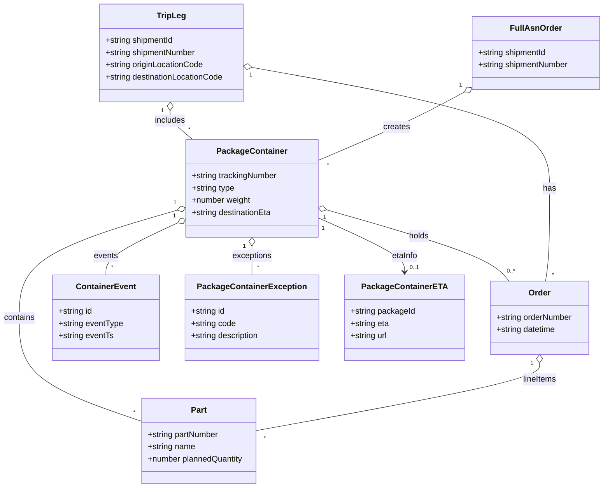

# Diagram: api_documentation/PartView.yaml

> Auto-generated by Obscura crawlers

## Mermaid

### SVG

<svg id="container" width="1179.7578125" xmlns="http://www.w3.org/2000/svg" class="classDiagram" height="958" viewBox="0 0 1179.7578125 958" role="graphics-document document" aria-roledescription="class"><g><defs><marker id="container_class-aggregationStart" class="marker aggregation class" refX="18" refY="7" markerWidth="190" markerHeight="240" orient="auto"><path d="M 18,7 L9,13 L1,7 L9,1 Z"></path></marker></defs><defs><marker id="container_class-aggregationEnd" class="marker aggregation class" refX="1" refY="7" markerWidth="20" markerHeight="28" orient="auto"><path d="M 18,7 L9,13 L1,7 L9,1 Z"></path></marker></defs><defs><marker id="container_class-extensionStart" class="marker extension class" refX="18" refY="7" markerWidth="190" markerHeight="240" orient="auto"><path d="M 1,7 L18,13 V 1 Z"></path></marker></defs><defs><marker id="container_class-extensionEnd" class="marker extension class" refX="1" refY="7" markerWidth="20" markerHeight="28" orient="auto"><path d="M 1,1 V 13 L18,7 Z"></path></marker></defs><defs><marker id="container_class-compositionStart" class="marker composition class" refX="18" refY="7" markerWidth="190" markerHeight="240" orient="auto"><path d="M 18,7 L9,13 L1,7 L9,1 Z"></path></marker></defs><defs><marker id="container_class-compositionEnd" class="marker composition class" refX="1" refY="7" markerWidth="20" markerHeight="28" orient="auto"><path d="M 18,7 L9,13 L1,7 L9,1 Z"></path></marker></defs><defs><marker id="container_class-dependencyStart" class="marker dependency class" refX="6" refY="7" markerWidth="190" markerHeight="240" orient="auto"><path d="M 5,7 L9,13 L1,7 L9,1 Z"></path></marker></defs><defs><marker id="container_class-dependencyEnd" class="marker dependency class" refX="13" refY="7" markerWidth="20" markerHeight="28" orient="auto"><path d="M 18,7 L9,13 L14,7 L9,1 Z"></path></marker></defs><defs><marker id="container_class-lollipopStart" class="marker lollipop class" refX="13" refY="7" markerWidth="190" markerHeight="240" orient="auto"><circle stroke="black" fill="transparent" cx="7" cy="7" r="6"></circle></marker></defs><defs><marker id="container_class-lollipopEnd" class="marker lollipop class" refX="1" refY="7" markerWidth="190" markerHeight="240" orient="auto"><circle stroke="black" fill="transparent" cx="7" cy="7" r="6"></circle></marker></defs><g class="root"><g class="clusters"></g><g class="edgePaths"><path d="M346.862,412.865L295.534,427.888C244.205,442.91,141.548,472.955,90.219,508.144C38.891,543.333,38.891,583.667,38.891,624C38.891,664.333,38.891,704.667,77.527,738.308C116.163,771.949,193.436,798.899,232.073,812.373L270.709,825.848" id="id_PackageContainer_Part_1" class="edge-thickness-normal edge-pattern-solid relation" style=";;;" data-edge="true" data-et="edge" data-id="id_PackageContainer_Part_1" data-points="W3sieCI6MzYzLjQxNzk2ODc1LCJ5Ijo0MDguMDE5OTI1MjE1OTcxMX0seyJ4IjozOC44OTA2MjUsInkiOjUwM30seyJ4IjozOC44OTA2MjUsInkiOjYyNH0seyJ4IjozOC44OTA2MjUsInkiOjc0NX0seyJ4IjoyNzAuNzA4OTg0Mzc1LCJ5Ijo4MjUuODQ4MDgzNDUxMDgyOX1d" marker-start="url(#container_class-aggregationStart)"></path><path d="M347.789,437.994L324.599,448.828C301.409,459.662,255.029,481.331,231.839,498.332C208.648,515.333,208.648,527.667,208.648,533.833L208.648,540" id="id_PackageContainer_ContainerEvent_2" class="edge-thickness-normal edge-pattern-solid relation" style=";;;" data-edge="true" data-et="edge" data-id="id_PackageContainer_ContainerEvent_2" data-points="W3sieCI6MzYzLjQxNzk2ODc1LCJ5Ijo0MzAuNjkxOTYwNDI2NDcyfSx7IngiOjIwOC42NDg0Mzc1LCJ5Ijo1MDN9LHsieCI6MjA4LjY0ODQzNzUsInkiOjU0MH1d" marker-start="url(#container_class-aggregationStart)"></path><path d="M493.324,483.25L493.324,486.542C493.324,489.833,493.324,496.417,493.324,505.875C493.324,515.333,493.324,527.667,493.324,533.833L493.324,540" id="id_PackageContainer_PackageContainerException_3" class="edge-thickness-normal edge-pattern-solid relation" style=";;;" data-edge="true" data-et="edge" data-id="id_PackageContainer_PackageContainerException_3" data-points="W3sieCI6NDkzLjMyNDIxODc1LCJ5Ijo0NjZ9LHsieCI6NDkzLjMyNDIxODc1LCJ5Ijo1MDN9LHsieCI6NDkzLjMyNDIxODc1LCJ5Ijo1NDB9XQ==" marker-start="url(#container_class-aggregationStart)"></path><path d="M639.802,412.345L692.066,427.455C744.33,442.564,848.858,472.782,907.77,496.058C966.681,519.333,979.976,535.667,986.623,543.833L993.27,552" id="id_PackageContainer_Order_4" class="edge-thickness-normal edge-pattern-solid relation" style=";;;" data-edge="true" data-et="edge" data-id="id_PackageContainer_Order_4" data-points="W3sieCI6NjIzLjIzMDQ2ODc1LCJ5Ijo0MDcuNTU0NzQ3OTk2MTk2MTd9LHsieCI6OTUzLjM4NjcxODc1LCJ5Ijo1MDN9LHsieCI6OTkzLjI3MDQwMjg5MjU2MiwieSI6NTUyfV0=" marker-start="url(#container_class-aggregationStart)"></path><path d="M327.408,217.223L327.222,220.519C327.037,223.815,326.666,230.408,334.225,239.87C341.784,249.333,357.273,261.667,365.017,267.833L372.762,274" id="id_TripLeg_PackageContainer_5" class="edge-thickness-normal edge-pattern-solid relation" style=";;;" data-edge="true" data-et="edge" data-id="id_TripLeg_PackageContainer_5" data-points="W3sieCI6MzI4LjM3NzA0MTIzNTkwMjI1LCJ5IjoyMDB9LHsieCI6MzI2LjI5NDkyMTg3NSwieSI6MjM3fSx7IngiOjM3Mi43NjE3MTg3NSwieSI6Mjc0fV0=" marker-start="url(#container_class-aggregationStart)"></path><path d="M493.979,132.863L590.31,150.219C686.642,167.575,879.305,202.288,975.637,241.811C1071.969,281.333,1071.969,325.667,1071.969,370C1071.969,414.333,1071.969,458.667,1070.613,489C1069.256,519.333,1066.544,535.667,1065.188,543.833L1063.832,552" id="id_TripLeg_Order_6" class="edge-thickness-normal edge-pattern-solid relation" style=";;;" data-edge="true" data-et="edge" data-id="id_TripLeg_Order_6" data-points="W3sieCI6NDc3LjAwMTk1MzEyNSwieSI6MTI5LjgwNDUwNDc5MjkyMzk4fSx7IngiOjEwNzEuOTY4NzUsInkiOjIzN30seyJ4IjoxMDcxLjk2ODc1LCJ5IjozNzB9LHsieCI6MTA3MS45Njg3NSwieSI6NTAzfSx7IngiOjEwNjMuODMxNjExNTcwMjQ4LCJ5Ijo1NTJ9XQ==" marker-start="url(#container_class-aggregationStart)"></path><path d="M1051.875,713.25L1051.875,718.542C1051.875,723.833,1051.875,734.417,960.057,756.389C868.239,778.361,684.603,811.723,592.785,828.404L500.967,845.084" id="id_Order_Part_7" class="edge-thickness-normal edge-pattern-solid relation" style=";;;" data-edge="true" data-et="edge" data-id="id_Order_Part_7" data-points="W3sieCI6MTA1MS44NzUsInkiOjY5Nn0seyJ4IjoxMDUxLjg3NSwieSI6NzQ1fSx7IngiOjUwMC45NjY3OTY4NzUsInkiOjg0NS4wODQzNTIxMTc2NzM2fV0=" marker-start="url(#container_class-aggregationStart)"></path><path d="M904.858,180.449L887.471,189.874C870.083,199.299,835.308,218.15,788.37,240.368C741.432,262.587,682.331,288.173,652.781,300.966L623.23,313.76" id="id_FullAsnOrder_PackageContainer_8" class="edge-thickness-normal edge-pattern-solid relation" style=";;;" data-edge="true" data-et="edge" data-id="id_FullAsnOrder_PackageContainer_8" data-points="W3sieCI6OTIwLjAyMzQzNzUsInkiOjE3Mi4yMjgzNjU4MjQ3Mjk1Nn0seyJ4Ijo4MDAuNTMzMjAzMTI1LCJ5IjoyMzd9LHsieCI6NjIzLjIzMDQ2ODc1LCJ5IjozMTMuNzU5NjgxMTAwNjM1MTN9XQ==" marker-start="url(#container_class-aggregationStart)"></path><path d="M623.23,428.465L650.833,440.887C678.435,453.31,733.639,478.155,761.242,495.744C788.844,513.333,788.844,523.667,788.844,528.833L788.844,534" id="id_PackageContainer_PackageContainerETA_9" class="edge-thickness-normal edge-pattern-solid relation" style=";;;" data-edge="true" data-et="edge" data-id="id_PackageContainer_PackageContainerETA_9" data-points="W3sieCI6NjIzLjIzMDQ2ODc1LCJ5Ijo0MjguNDY0OTM4NjAxMjQ1MTR9LHsieCI6Nzg4Ljg0Mzc1LCJ5Ijo1MDN9LHsieCI6Nzg4Ljg0Mzc1LCJ5Ijo1NDB9XQ==" marker-end="url(#container_class-dependencyEnd)"></path></g><g class="edgeLabels"><g class="edgeLabel" transform="translate(38.890625, 624)"><g class="label" data-id="id_PackageContainer_Part_1" transform="translate(-30.890625, -12)"><foreignObject width="61.78125" height="24">

contains

</foreignObject></g></g><g class="edgeLabel" transform="translate(208.6484375, 503)"><g class="label" data-id="id_PackageContainer_ContainerEvent_2" transform="translate(-23.90625, -12)"><foreignObject width="47.8125" height="24">

events

</foreignObject></g></g><g class="edgeLabel" transform="translate(493.32421875, 503)"><g class="label" data-id="id_PackageContainer_PackageContainerException_3" transform="translate(-39.1171875, -12)"><foreignObject width="78.234375" height="24">

exceptions

</foreignObject></g></g><g class="edgeLabel" transform="translate(818.6559, 464.05051)"><g class="label" data-id="id_PackageContainer_Order_4" transform="translate(-20.1875, -12)"><foreignObject width="40.375" height="24">

holds

</foreignObject></g></g><g class="edgeLabel" transform="translate(335.03304, 243.95788)"><g class="label" data-id="id_TripLeg_PackageContainer_5" transform="translate(-30.6484375, -12)"><foreignObject width="61.296875" height="24">

includes

</foreignObject></g></g><g class="edgeLabel" transform="translate(1071.96875, 370)"><g class="label" data-id="id_TripLeg_Order_6" transform="translate(-12.703125, -12)"><foreignObject width="25.40625" height="24">

has

</foreignObject></g></g><g class="edgeLabel" transform="translate(1051.875, 745)"><g class="label" data-id="id_Order_Part_7" transform="translate(-33.734375, -12)"><foreignObject width="67.46875" height="24">

lineItems

</foreignObject></g></g><g class="edgeLabel" transform="translate(774.24646, 248.38032)"><g class="label" data-id="id_FullAsnOrder_PackageContainer_8" transform="translate(-26.171875, -12)"><foreignObject width="52.34375" height="24">

creates

</foreignObject></g></g><g class="edgeLabel" transform="translate(788.84375, 503)"><g class="label" data-id="id_PackageContainer_PackageContainerETA_9" transform="translate(-25.8671875, -12)"><foreignObject width="51.734375" height="24">

etaInfo

</foreignObject></g></g><g class="edgeTerminals" transform="translate(342.4091794134695, 398.5393786731724)"><g class="inner" transform="translate(0, 0)"><foreignObject style="width: 9px; height: 12px;">
1
</foreignObject></g></g><g class="edgeTerminals" transform="translate(341.21378176547137, 424.5093973163076)"><g class="inner" transform="translate(0, 0)"><foreignObject style="width: 9px; height: 12px;">
1
</foreignObject></g></g><g class="edgeTerminals" transform="translate(478.324219375, 483.5000005357143)"><g class="inner" transform="translate(0, 0)"><foreignObject style="width: 9px; height: 12px;">
1
</foreignObject></g></g><g class="edgeTerminals" transform="translate(635.8762754325173, 426.8247646032475)"><g class="inner" transform="translate(0, 0)"><foreignObject style="width: 9px; height: 12px;">
1
</foreignObject></g></g><g class="edgeTerminals" transform="translate(312.41750466208157, 216.62958580491355)"><g class="inner" transform="translate(0, 0)"><foreignObject style="width: 9px; height: 12px;">
1
</foreignObject></g></g><g class="edgeTerminals" transform="translate(491.56491254850465, 147.66983802098133)"><g class="inner" transform="translate(0, 0)"><foreignObject style="width: 9px; height: 12px;">
1
</foreignObject></g></g><g class="edgeTerminals" transform="translate(1036.875, 713.5)"><g class="inner" transform="translate(0, 0)"><foreignObject style="width: 9px; height: 12px;">
1
</foreignObject></g></g><g class="edgeTerminals" transform="translate(897.4900831300351, 167.3809006486008)"><g class="inner" transform="translate(0, 0)"><foreignObject style="width: 9px; height: 12px;">
1
</foreignObject></g></g><g class="edgeTerminals" transform="translate(633.0326752228818, 449.32559106465055)"><g class="inner" transform="translate(0, 0)"><foreignObject style="width: 9px; height: 12px;">
1
</foreignObject></g></g><g class="edgeTerminals" transform="translate(254.1246252208967, 800.9219067274794)"><g class="inner" transform="translate(0, 0)"></g><foreignObject style="width: 9px; height: 12px;">
*
</foreignObject></g><g class="edgeTerminals" transform="translate(218.64843874999997, 517.5000010714285)"><g class="inner" transform="translate(0, 0)"></g><foreignObject style="width: 9px; height: 12px;">
*
</foreignObject></g><g class="edgeTerminals" transform="translate(503.324219375, 517.5000005357143)"><g class="inner" transform="translate(0, 0)"></g><foreignObject style="width: 9px; height: 12px;">
*
</foreignObject></g><g class="edgeTerminals" transform="translate(988.8565965553951, 523.9585952329794)"><g class="inner" transform="translate(0, 0)"></g><foreignObject style="width: 36px; height: 12px;">
0..*
</foreignObject></g><g class="edgeTerminals" transform="translate(363.4153181482516, 246.36465724235322)"><g class="inner" transform="translate(0, 0)"></g><foreignObject style="width: 9px; height: 12px;">
*
</foreignObject></g><g class="edgeTerminals" transform="translate(1076.4958232305473, 532.193727592859)"><g class="inner" transform="translate(0, 0)"></g><foreignObject style="width: 9px; height: 12px;">
*
</foreignObject></g><g class="edgeTerminals" transform="translate(515.8661502204473, 851.7147304276737)"><g class="inner" transform="translate(0, 0)"></g><foreignObject style="width: 9px; height: 12px;">
*
</foreignObject></g><g class="edgeTerminals" transform="translate(640.2494906801295, 315.5723649326622)"><g class="inner" transform="translate(0, 0)"></g><foreignObject style="width: 9px; height: 12px;">
*
</foreignObject></g><g class="edgeTerminals" transform="translate(798.84375, 517.5)"><g class="inner" transform="translate(0, 0)"></g><foreignObject style="width: 36px; height: 12px;">
0..1
</foreignObject></g></g><g class="nodes"><g class="node default" id="classId-PackageContainer-0" transform="translate(493.32421875, 370)"><g class="basic label-container"><path d="M-129.90625 -96 L129.90625 -96 L129.90625 96 L-129.90625 96" stroke="none" stroke-width="0" fill="#ECECFF" style=""></path><path d="M-129.90625 -96 C-31.724117842968496 -96, 66.458014314063 -96, 129.90625 -96 M-129.90625 -96 C-31.76141893886171 -96, 66.38341212227658 -96, 129.90625 -96 M129.90625 -96 C129.90625 -50.53613641807551, 129.90625 -5.072272836151015, 129.90625 96 M129.90625 -96 C129.90625 -28.13892963492148, 129.90625 39.72214073015704, 129.90625 96 M129.90625 96 C74.87667200234002 96, 19.84709400468003 96, -129.90625 96 M129.90625 96 C71.398043403603 96, 12.889836807205995 96, -129.90625 96 M-129.90625 96 C-129.90625 30.46492071089122, -129.90625 -35.07015857821756, -129.90625 -96 M-129.90625 96 C-129.90625 46.404868242326195, -129.90625 -3.1902635153476098, -129.90625 -96" stroke="#9370DB" stroke-width="1.3" fill="none" stroke-dasharray="0 0" style=""></path></g><g class="annotation-group text" transform="translate(0, -72)"></g><g class="label-group text" transform="translate(-65.453125, -72)"><g class="label" style="font-weight: bolder" transform="translate(0,-12)"><foreignObject width="130.90625" height="24">

PackageContainer

</foreignObject></g></g><g class="members-group text" transform="translate(-117.90625, -24)"><g class="label" style="" transform="translate(0,-12)"><foreignObject width="170.359375" height="24">

+string trackingNumber

</foreignObject></g><g class="label" style="" transform="translate(0,12)"><foreignObject width="85.65625" height="24">

+string type

</foreignObject></g><g class="label" style="" transform="translate(0,36)"><foreignObject width="117.203125" height="24">

+number weight

</foreignObject></g><g class="label" style="" transform="translate(0,60)"><foreignObject width="159.703125" height="24">

+string destinationEta

</foreignObject></g></g><g class="methods-group text" transform="translate(-117.90625, 96)"></g><g class="divider" style=""><path d="M-129.90625 -48 C-72.07645356972922 -48, -14.24665713945845 -48, 129.90625 -48 M-129.90625 -48 C-54.532212552085156 -48, 20.84182489582969 -48, 129.90625 -48" stroke="#9370DB" stroke-width="1.3" fill="none" stroke-dasharray="0 0" style=""></path></g><g class="divider" style=""><path d="M-129.90625 72 C-61.67299055007314 72, 6.560268899853725 72, 129.90625 72 M-129.90625 72 C-29.86951648010961 72, 70.16721703978078 72, 129.90625 72" stroke="#9370DB" stroke-width="1.3" fill="none" stroke-dasharray="0 0" style=""></path></g></g><g class="node default" id="classId-Part-1" transform="translate(385.837890625, 866)"><g class="basic label-container"><path d="M-115.12890625 -84 L115.12890625 -84 L115.12890625 84 L-115.12890625 84" stroke="none" stroke-width="0" fill="#ECECFF" style=""></path><path d="M-115.12890625 -84 C-59.23365177151216 -84, -3.3383972930243146 -84, 115.12890625 -84 M-115.12890625 -84 C-52.55714495697774 -84, 10.014616336044526 -84, 115.12890625 -84 M115.12890625 -84 C115.12890625 -42.42907394621491, 115.12890625 -0.8581478924298267, 115.12890625 84 M115.12890625 -84 C115.12890625 -19.36351753983942, 115.12890625 45.27296492032116, 115.12890625 84 M115.12890625 84 C27.918289631277574 84, -59.29232698744485 84, -115.12890625 84 M115.12890625 84 C58.03138025626526 84, 0.9338542625305166 84, -115.12890625 84 M-115.12890625 84 C-115.12890625 23.56709998369498, -115.12890625 -36.86580003261004, -115.12890625 -84 M-115.12890625 84 C-115.12890625 26.136214715806958, -115.12890625 -31.727570568386085, -115.12890625 -84" stroke="#9370DB" stroke-width="1.3" fill="none" stroke-dasharray="0 0" style=""></path></g><g class="annotation-group text" transform="translate(0, -60)"></g><g class="label-group text" transform="translate(-15.0703125, -60)"><g class="label" style="font-weight: bolder" transform="translate(0,-12)"><foreignObject width="30.140625" height="24">

Part

</foreignObject></g></g><g class="members-group text" transform="translate(-103.12890625, -12)"><g class="label" style="" transform="translate(0,-12)"><foreignObject width="142.21875" height="24">

+string partNumber

</foreignObject></g><g class="label" style="" transform="translate(0,12)"><foreignObject width="94.375" height="24">

+string name

</foreignObject></g><g class="label" style="" transform="translate(0,36)"><foreignObject width="191.1875" height="24">

+number plannedQuantity

</foreignObject></g></g><g class="methods-group text" transform="translate(-103.12890625, 84)"></g><g class="divider" style=""><path d="M-115.12890625 -36 C-30.502155176377272 -36, 54.124595897245456 -36, 115.12890625 -36 M-115.12890625 -36 C-56.68811028570015 -36, 1.752685678599704 -36, 115.12890625 -36" stroke="#9370DB" stroke-width="1.3" fill="none" stroke-dasharray="0 0" style=""></path></g><g class="divider" style=""><path d="M-115.12890625 60 C-35.47151283878782 60, 44.18588057242437 60, 115.12890625 60 M-115.12890625 60 C-38.81854414802869 60, 37.491817953942615 60, 115.12890625 60" stroke="#9370DB" stroke-width="1.3" fill="none" stroke-dasharray="0 0" style=""></path></g></g><g class="node default" id="classId-TripLeg-2" transform="translate(333.779296875, 104)"><g class="basic label-container"><path d="M-143.22265625 -96 L143.22265625 -96 L143.22265625 96 L-143.22265625 96" stroke="none" stroke-width="0" fill="#ECECFF" style=""></path><path d="M-143.22265625 -96 C-52.57568925595088 -96, 38.071277738098246 -96, 143.22265625 -96 M-143.22265625 -96 C-39.15472114783333 -96, 64.91321395433334 -96, 143.22265625 -96 M143.22265625 -96 C143.22265625 -49.919716541476156, 143.22265625 -3.8394330829523113, 143.22265625 96 M143.22265625 -96 C143.22265625 -44.719276957331914, 143.22265625 6.561446085336172, 143.22265625 96 M143.22265625 96 C67.27605960002674 96, -8.670537049946518 96, -143.22265625 96 M143.22265625 96 C51.601952665799075 96, -40.01875091840185 96, -143.22265625 96 M-143.22265625 96 C-143.22265625 37.46198004588535, -143.22265625 -21.076039908229305, -143.22265625 -96 M-143.22265625 96 C-143.22265625 48.57796621261849, -143.22265625 1.1559324252369834, -143.22265625 -96" stroke="#9370DB" stroke-width="1.3" fill="none" stroke-dasharray="0 0" style=""></path></g><g class="annotation-group text" transform="translate(0, -72)"></g><g class="label-group text" transform="translate(-27.0546875, -72)"><g class="label" style="font-weight: bolder" transform="translate(0,-12)"><foreignObject width="54.109375" height="24">

TripLeg

</foreignObject></g></g><g class="members-group text" transform="translate(-131.22265625, -24)"><g class="label" style="" transform="translate(0,-12)"><foreignObject width="136.59375" height="24">

+string shipmentId

</foreignObject></g><g class="label" style="" transform="translate(0,12)"><foreignObject width="180.671875" height="24">

+string shipmentNumber

</foreignObject></g><g class="label" style="" transform="translate(0,36)"><foreignObject width="194.484375" height="24">

+string originLocationCode

</foreignObject></g><g class="label" style="" transform="translate(0,60)"><foreignObject width="235.390625" height="24">

+string destinationLocationCode

</foreignObject></g></g><g class="methods-group text" transform="translate(-131.22265625, 96)"></g><g class="divider" style=""><path d="M-143.22265625 -48 C-29.68078410131396 -48, 83.86108804737208 -48, 143.22265625 -48 M-143.22265625 -48 C-52.28848398523222 -48, 38.64568827953556 -48, 143.22265625 -48" stroke="#9370DB" stroke-width="1.3" fill="none" stroke-dasharray="0 0" style=""></path></g><g class="divider" style=""><path d="M-143.22265625 72 C-28.71649918910356 72, 85.78965787179288 72, 143.22265625 72 M-143.22265625 72 C-79.54054950547375 72, -15.858442760947497 72, 143.22265625 72" stroke="#9370DB" stroke-width="1.3" fill="none" stroke-dasharray="0 0" style=""></path></g></g><g class="node default" id="classId-Order-3" transform="translate(1051.875, 624)"><g class="basic label-container"><path d="M-98.3203125 -72 L98.3203125 -72 L98.3203125 72 L-98.3203125 72" stroke="none" stroke-width="0" fill="#ECECFF" style=""></path><path d="M-98.3203125 -72 C-31.060029133019157 -72, 36.20025423396169 -72, 98.3203125 -72 M-98.3203125 -72 C-30.193274100622247 -72, 37.933764298755506 -72, 98.3203125 -72 M98.3203125 -72 C98.3203125 -18.476661819246488, 98.3203125 35.046676361507025, 98.3203125 72 M98.3203125 -72 C98.3203125 -19.178422457964942, 98.3203125 33.643155084070116, 98.3203125 72 M98.3203125 72 C52.147006303366936 72, 5.973700106733872 72, -98.3203125 72 M98.3203125 72 C37.4078585370875 72, -23.504595425825002 72, -98.3203125 72 M-98.3203125 72 C-98.3203125 26.25707115867622, -98.3203125 -19.485857682647563, -98.3203125 -72 M-98.3203125 72 C-98.3203125 40.002877179584516, -98.3203125 8.005754359169025, -98.3203125 -72" stroke="#9370DB" stroke-width="1.3" fill="none" stroke-dasharray="0 0" style=""></path></g><g class="annotation-group text" transform="translate(0, -48)"></g><g class="label-group text" transform="translate(-20.921875, -48)"><g class="label" style="font-weight: bolder" transform="translate(0,-12)"><foreignObject width="41.84375" height="24">

Order

</foreignObject></g></g><g class="members-group text" transform="translate(-86.3203125, 0)"><g class="label" style="" transform="translate(0,-12)"><foreignObject width="151.71875" height="24">

+string orderNumber

</foreignObject></g><g class="label" style="" transform="translate(0,12)"><foreignObject width="119.109375" height="24">

+string datetime

</foreignObject></g></g><g class="methods-group text" transform="translate(-86.3203125, 72)"></g><g class="divider" style=""><path d="M-98.3203125 -24 C-50.41456872574193 -24, -2.5088249514838594 -24, 98.3203125 -24 M-98.3203125 -24 C-55.67054737652055 -24, -13.020782253041105 -24, 98.3203125 -24" stroke="#9370DB" stroke-width="1.3" fill="none" stroke-dasharray="0 0" style=""></path></g><g class="divider" style=""><path d="M-98.3203125 48 C-20.38599703609256 48, 57.54831842781488 48, 98.3203125 48 M-98.3203125 48 C-23.808361961560195 48, 50.70358857687961 48, 98.3203125 48" stroke="#9370DB" stroke-width="1.3" fill="none" stroke-dasharray="0 0" style=""></path></g></g><g class="node default" id="classId-ContainerEvent-4" transform="translate(208.6484375, 624)"><g class="basic label-container"><path d="M-103.8671875 -84 L103.8671875 -84 L103.8671875 84 L-103.8671875 84" stroke="none" stroke-width="0" fill="#ECECFF" style=""></path><path d="M-103.8671875 -84 C-25.971727447105607 -84, 51.923732605788786 -84, 103.8671875 -84 M-103.8671875 -84 C-43.39281536662811 -84, 17.081556766743773 -84, 103.8671875 -84 M103.8671875 -84 C103.8671875 -32.13201914413391, 103.8671875 19.735961711732173, 103.8671875 84 M103.8671875 -84 C103.8671875 -37.75134636898002, 103.8671875 8.497307262039953, 103.8671875 84 M103.8671875 84 C40.614934273635306 84, -22.637318952729387 84, -103.8671875 84 M103.8671875 84 C47.07497204919591 84, -9.717243401608187 84, -103.8671875 84 M-103.8671875 84 C-103.8671875 47.868691168178565, -103.8671875 11.737382336357129, -103.8671875 -84 M-103.8671875 84 C-103.8671875 24.11187990120777, -103.8671875 -35.77624019758446, -103.8671875 -84" stroke="#9370DB" stroke-width="1.3" fill="none" stroke-dasharray="0 0" style=""></path></g><g class="annotation-group text" transform="translate(0, -60)"></g><g class="label-group text" transform="translate(-55.8125, -60)"><g class="label" style="font-weight: bolder" transform="translate(0,-12)"><foreignObject width="111.625" height="24">

ContainerEvent

</foreignObject></g></g><g class="members-group text" transform="translate(-91.8671875, -12)"><g class="label" style="" transform="translate(0,-12)"><foreignObject width="67.9375" height="24">

+string id

</foreignObject></g><g class="label" style="" transform="translate(0,12)"><foreignObject width="127.921875" height="24">

+string eventType

</foreignObject></g><g class="label" style="" transform="translate(0,36)"><foreignObject width="109.140625" height="24">

+string eventTs

</foreignObject></g></g><g class="methods-group text" transform="translate(-91.8671875, 84)"></g><g class="divider" style=""><path d="M-103.8671875 -36 C-58.1200507131485 -36, -12.372913926297002 -36, 103.8671875 -36 M-103.8671875 -36 C-44.454615105079874 -36, 14.957957289840252 -36, 103.8671875 -36" stroke="#9370DB" stroke-width="1.3" fill="none" stroke-dasharray="0 0" style=""></path></g><g class="divider" style=""><path d="M-103.8671875 60 C-41.37628817615966 60, 21.114611147680677 60, 103.8671875 60 M-103.8671875 60 C-48.0343970367878 60, 7.798393426424397 60, 103.8671875 60" stroke="#9370DB" stroke-width="1.3" fill="none" stroke-dasharray="0 0" style=""></path></g></g><g class="node default" id="classId-PackageContainerException-5" transform="translate(493.32421875, 624)"><g class="basic label-container"><path d="M-130.80859375 -84 L130.80859375 -84 L130.80859375 84 L-130.80859375 84" stroke="none" stroke-width="0" fill="#ECECFF" style=""></path><path d="M-130.80859375 -84 C-66.16018028651533 -84, -1.511766823030655 -84, 130.80859375 -84 M-130.80859375 -84 C-31.736202867823195 -84, 67.33618801435361 -84, 130.80859375 -84 M130.80859375 -84 C130.80859375 -21.165464417609343, 130.80859375 41.669071164781315, 130.80859375 84 M130.80859375 -84 C130.80859375 -40.88559767973142, 130.80859375 2.228804640537163, 130.80859375 84 M130.80859375 84 C47.708794779330375 84, -35.39100419133925 84, -130.80859375 84 M130.80859375 84 C45.54544374103378 84, -39.71770626793244 84, -130.80859375 84 M-130.80859375 84 C-130.80859375 24.392111291433892, -130.80859375 -35.215777417132216, -130.80859375 -84 M-130.80859375 84 C-130.80859375 42.49718561391178, -130.80859375 0.9943712278235637, -130.80859375 -84" stroke="#9370DB" stroke-width="1.3" fill="none" stroke-dasharray="0 0" style=""></path></g><g class="annotation-group text" transform="translate(0, -60)"></g><g class="label-group text" transform="translate(-101.1484375, -60)"><g class="label" style="font-weight: bolder" transform="translate(0,-12)"><foreignObject width="202.296875" height="24">

PackageContainerException

</foreignObject></g></g><g class="members-group text" transform="translate(-118.80859375, -12)"><g class="label" style="" transform="translate(0,-12)"><foreignObject width="67.9375" height="24">

+string id

</foreignObject></g><g class="label" style="" transform="translate(0,12)"><foreignObject width="88.828125" height="24">

+string code

</foreignObject></g><g class="label" style="" transform="translate(0,36)"><foreignObject width="136.46875" height="24">

+string description

</foreignObject></g></g><g class="methods-group text" transform="translate(-118.80859375, 84)"></g><g class="divider" style=""><path d="M-130.80859375 -36 C-41.63267872208705 -36, 47.5432363058259 -36, 130.80859375 -36 M-130.80859375 -36 C-75.73399067082963 -36, -20.65938759165924 -36, 130.80859375 -36" stroke="#9370DB" stroke-width="1.3" fill="none" stroke-dasharray="0 0" style=""></path></g><g class="divider" style=""><path d="M-130.80859375 60 C-40.06366771094754 60, 50.68125832810492 60, 130.80859375 60 M-130.80859375 60 C-46.459722460229145 60, 37.88914882954171 60, 130.80859375 60" stroke="#9370DB" stroke-width="1.3" fill="none" stroke-dasharray="0 0" style=""></path></g></g><g class="node default" id="classId-FullAsnOrder-6" transform="translate(1045.890625, 104)"><g class="basic label-container"><path d="M-125.8671875 -72 L125.8671875 -72 L125.8671875 72 L-125.8671875 72" stroke="none" stroke-width="0" fill="#ECECFF" style=""></path><path d="M-125.8671875 -72 C-70.41139607303083 -72, -14.955604646061644 -72, 125.8671875 -72 M-125.8671875 -72 C-63.48534736827782 -72, -1.103507236555643 -72, 125.8671875 -72 M125.8671875 -72 C125.8671875 -16.802992269142464, 125.8671875 38.39401546171507, 125.8671875 72 M125.8671875 -72 C125.8671875 -22.755787290756558, 125.8671875 26.488425418486884, 125.8671875 72 M125.8671875 72 C71.69317988645108 72, 17.51917227290214 72, -125.8671875 72 M125.8671875 72 C65.01318845506546 72, 4.159189410130907 72, -125.8671875 72 M-125.8671875 72 C-125.8671875 16.795088265501732, -125.8671875 -38.409823468996535, -125.8671875 -72 M-125.8671875 72 C-125.8671875 23.487964438952517, -125.8671875 -25.024071122094966, -125.8671875 -72" stroke="#9370DB" stroke-width="1.3" fill="none" stroke-dasharray="0 0" style=""></path></g><g class="annotation-group text" transform="translate(0, -48)"></g><g class="label-group text" transform="translate(-47.0625, -48)"><g class="label" style="font-weight: bolder" transform="translate(0,-12)"><foreignObject width="94.125" height="24">

FullAsnOrder

</foreignObject></g></g><g class="members-group text" transform="translate(-113.8671875, 0)"><g class="label" style="" transform="translate(0,-12)"><foreignObject width="136.59375" height="24">

+string shipmentId

</foreignObject></g><g class="label" style="" transform="translate(0,12)"><foreignObject width="180.671875" height="24">

+string shipmentNumber

</foreignObject></g></g><g class="methods-group text" transform="translate(-113.8671875, 72)"></g><g class="divider" style=""><path d="M-125.8671875 -24 C-32.494364535011016 -24, 60.87845842997797 -24, 125.8671875 -24 M-125.8671875 -24 C-31.601158626497167 -24, 62.664870247005666 -24, 125.8671875 -24" stroke="#9370DB" stroke-width="1.3" fill="none" stroke-dasharray="0 0" style=""></path></g><g class="divider" style=""><path d="M-125.8671875 48 C-30.876138692579318 48, 64.11491011484136 48, 125.8671875 48 M-125.8671875 48 C-49.57531451454443 48, 26.71655847091114 48, 125.8671875 48" stroke="#9370DB" stroke-width="1.3" fill="none" stroke-dasharray="0 0" style=""></path></g></g><g class="node default" id="classId-PackageContainerETA-7" transform="translate(788.84375, 624)"><g class="basic label-container"><path d="M-114.7109375 -84 L114.7109375 -84 L114.7109375 84 L-114.7109375 84" stroke="none" stroke-width="0" fill="#ECECFF" style=""></path><path d="M-114.7109375 -84 C-30.469545701295218 -84, 53.771846097409565 -84, 114.7109375 -84 M-114.7109375 -84 C-48.35433203249693 -84, 18.002273435006146 -84, 114.7109375 -84 M114.7109375 -84 C114.7109375 -42.98946793930429, 114.7109375 -1.9789358786085813, 114.7109375 84 M114.7109375 -84 C114.7109375 -21.016844502108462, 114.7109375 41.966310995783076, 114.7109375 84 M114.7109375 84 C28.036737104168523 84, -58.637463291662954 84, -114.7109375 84 M114.7109375 84 C64.69811091333406 84, 14.685284326668125 84, -114.7109375 84 M-114.7109375 84 C-114.7109375 26.79690458130058, -114.7109375 -30.40619083739884, -114.7109375 -84 M-114.7109375 84 C-114.7109375 44.85830439941393, -114.7109375 5.716608798827863, -114.7109375 -84" stroke="#9370DB" stroke-width="1.3" fill="none" stroke-dasharray="0 0" style=""></path></g><g class="annotation-group text" transform="translate(0, -60)"></g><g class="label-group text" transform="translate(-78.296875, -60)"><g class="label" style="font-weight: bolder" transform="translate(0,-12)"><foreignObject width="156.59375" height="24">

PackageContainerETA

</foreignObject></g></g><g class="members-group text" transform="translate(-102.7109375, -12)"><g class="label" style="" transform="translate(0,-12)"><foreignObject width="127.125" height="24">

+string packageId

</foreignObject></g><g class="label" style="" transform="translate(0,12)"><foreignObject width="76.953125" height="24">

+string eta

</foreignObject></g><g class="label" style="" transform="translate(0,36)"><foreignObject width="74.046875" height="24">

+string url

</foreignObject></g></g><g class="methods-group text" transform="translate(-102.7109375, 84)"></g><g class="divider" style=""><path d="M-114.7109375 -36 C-49.446799922371596 -36, 15.817337655256807 -36, 114.7109375 -36 M-114.7109375 -36 C-59.32913344340034 -36, -3.947329386800675 -36, 114.7109375 -36" stroke="#9370DB" stroke-width="1.3" fill="none" stroke-dasharray="0 0" style=""></path></g><g class="divider" style=""><path d="M-114.7109375 60 C-26.40133483264617 60, 61.90826783470766 60, 114.7109375 60 M-114.7109375 60 C-27.828222813132342 60, 59.054491873735316 60, 114.7109375 60" stroke="#9370DB" stroke-width="1.3" fill="none" stroke-dasharray="0 0" style=""></path></g></g></g></g></g></svg>
