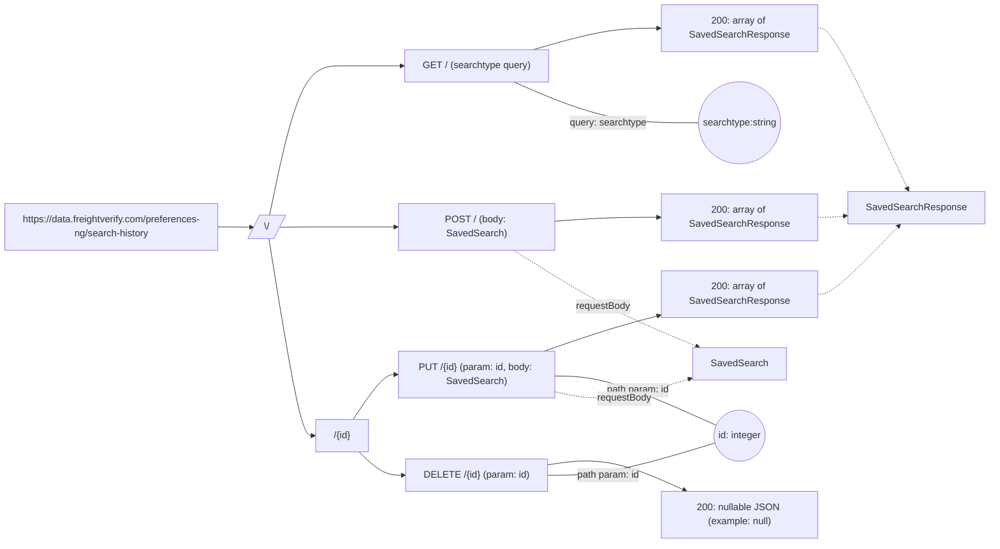
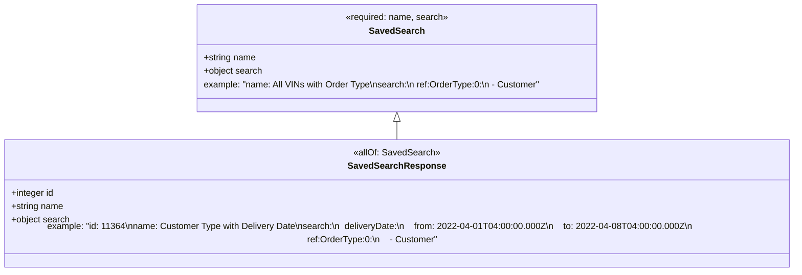

# Diagram: api_documentation/SavedSearchApi.yaml

> Auto-generated by Obscura crawlers

## Diagram 1

### SVG

<svg id="container" width="1664.90625" xmlns="http://www.w3.org/2000/svg" class="flowchart" height="910.15625" viewBox="0 0 1664.90625 910.15625" role="graphics-document document" aria-roledescription="flowchart-v2"><g><marker id="container_flowchart-v2-pointEnd" class="marker flowchart-v2" viewBox="0 0 10 10" refX="5" refY="5" markerUnits="userSpaceOnUse" markerWidth="8" markerHeight="8" orient="auto"><path d="M 0 0 L 10 5 L 0 10 z" class="arrowMarkerPath" style="stroke-width: 1; stroke-dasharray: 1, 0;"></path></marker><marker id="container_flowchart-v2-pointStart" class="marker flowchart-v2" viewBox="0 0 10 10" refX="4.5" refY="5" markerUnits="userSpaceOnUse" markerWidth="8" markerHeight="8" orient="auto"><path d="M 0 5 L 10 10 L 10 0 z" class="arrowMarkerPath" style="stroke-width: 1; stroke-dasharray: 1, 0;"></path></marker><marker id="container_flowchart-v2-circleEnd" class="marker flowchart-v2" viewBox="0 0 10 10" refX="11" refY="5" markerUnits="userSpaceOnUse" markerWidth="11" markerHeight="11" orient="auto"><circle cx="5" cy="5" r="5" class="arrowMarkerPath" style="stroke-width: 1; stroke-dasharray: 1, 0;"></circle></marker><marker id="container_flowchart-v2-circleStart" class="marker flowchart-v2" viewBox="0 0 10 10" refX="-1" refY="5" markerUnits="userSpaceOnUse" markerWidth="11" markerHeight="11" orient="auto"><circle cx="5" cy="5" r="5" class="arrowMarkerPath" style="stroke-width: 1; stroke-dasharray: 1, 0;"></circle></marker><marker id="container_flowchart-v2-crossEnd" class="marker cross flowchart-v2" viewBox="0 0 11 11" refX="12" refY="5.2" markerUnits="userSpaceOnUse" markerWidth="11" markerHeight="11" orient="auto"><path d="M 1,1 l 9,9 M 10,1 l -9,9" class="arrowMarkerPath" style="stroke-width: 2; stroke-dasharray: 1, 0;"></path></marker><marker id="container_flowchart-v2-crossStart" class="marker cross flowchart-v2" viewBox="0 0 11 11" refX="-1" refY="5.2" markerUnits="userSpaceOnUse" markerWidth="11" markerHeight="11" orient="auto"><path d="M 1,1 l 9,9 M 10,1 l -9,9" class="arrowMarkerPath" style="stroke-width: 2; stroke-dasharray: 1, 0;"></path></marker><g class="root"><g class="clusters"></g><g class="edgePaths"><path d="M380.766,380.891L384.932,380.891C389.099,380.891,397.432,380.891,406.807,380.965C416.182,381.038,426.599,381.186,431.808,381.26L437.016,381.334" id="L_Server_Root_0" class="edge-thickness-normal edge-pattern-solid edge-thickness-normal edge-pattern-solid flowchart-link" style=";" data-edge="true" data-et="edge" data-id="L_Server_Root_0" data-points="W3sieCI6MzgwLjc2NTYyNSwieSI6MzgwLjg5MDYyNX0seyJ4Ijo0MDUuNzY1NjI1LCJ5IjozODAuODkwNjI1fSx7IngiOjQ0MS4wMTU2MjUsInkiOjM4MS4zOTA2MjV9XQ==" marker-end="url(#container_flowchart-v2-pointEnd)"></path><path d="M466.48,361.891L475.082,319.988C483.684,278.085,500.889,194.279,521.385,152.376C541.88,110.473,565.667,110.473,589.453,110.473C613.24,110.473,637.026,110.473,654.15,110.473C671.273,110.473,681.734,110.473,686.965,110.473L692.195,110.473" id="L_Root_GET_GET_0" class="edge-thickness-normal edge-pattern-solid edge-thickness-normal edge-pattern-solid flowchart-link" style=";" data-edge="true" data-et="edge" data-id="L_Root_GET_GET_0" data-points="W3sieCI6NDY2LjQ3OTcxMTMzNDYzMSwieSI6MzYxLjg5MDYyNX0seyJ4Ijo1MTguMDkzNzUsInkiOjExMC40NzI2NTYyNX0seyJ4Ijo1ODkuNDUzMTI1LCJ5IjoxMTAuNDcyNjU2MjV9LHsieCI6NjYwLjgxMjUsInkiOjExMC40NzI2NTYyNX0seyJ4Ijo2OTYuMTk1MzEyNSwieSI6MTEwLjQ3MjY1NjI1fV0=" marker-end="url(#container_flowchart-v2-pointEnd)"></path><path d="M483.844,381.391L489.552,381.307C495.26,381.224,506.677,381.057,524.279,380.974C541.88,380.891,565.667,380.891,589.453,380.891C613.24,380.891,637.026,380.891,652.419,380.891C667.813,380.891,674.813,380.891,678.313,380.891L681.813,380.891" id="L_Root_POST_POST_0" class="edge-thickness-normal edge-pattern-solid edge-thickness-normal edge-pattern-solid flowchart-link" style=";" data-edge="true" data-et="edge" data-id="L_Root_POST_POST_0" data-points="W3sieCI6NDgzLjg0Mzc1LCJ5IjozODEuMzkwNjI1fSx7IngiOjUxOC4wOTM3NSwieSI6MzgwLjg5MDYyNX0seyJ4Ijo1ODkuNDUzMTI1LCJ5IjozODAuODkwNjI1fSx7IngiOjY2MC44MTI1LCJ5IjozODAuODkwNjI1fSx7IngiOjY4NS44MTI1LCJ5IjozODAuODkwNjI1fV0=" marker-end="url(#container_flowchart-v2-pointEnd)"></path><path d="M465.567,400.891L474.321,455.746C483.076,510.602,500.585,620.313,512.839,675.168C525.094,730.023,532.094,730.023,535.594,730.023L539.094,730.023" id="L_Root_Item_0" class="edge-thickness-normal edge-pattern-solid edge-thickness-normal edge-pattern-solid flowchart-link" style=";" data-edge="true" data-et="edge" data-id="L_Root_Item_0" data-points="W3sieCI6NDY1LjU2NjYwMDM4Njg0MDE1LCJ5Ijo0MDAuODkwNjI1fSx7IngiOjUxOC4wOTM3NSwieSI6NzMwLjAyMzQzNzV9LHsieCI6NTQzLjA5Mzc1LCJ5Ijo3MzAuMDIzNDM3NX1d" marker-end="url(#container_flowchart-v2-pointEnd)"></path><path d="M608.238,703.023L617,690.429C625.763,677.835,643.288,652.646,655.55,640.051C667.813,627.457,674.813,627.457,678.313,627.457L681.813,627.457" id="L_Item_PUT_PUT_0" class="edge-thickness-normal edge-pattern-solid edge-thickness-normal edge-pattern-solid flowchart-link" style=";" data-edge="true" data-et="edge" data-id="L_Item_PUT_PUT_0" data-points="W3sieCI6NjA4LjIzODA1ODU0MTUzMTgsInkiOjcwMy4wMjM0Mzc1fSx7IngiOjY2MC44MTI1LCJ5Ijo2MjcuNDU3MDMxMjV9LHsieCI6Njg1LjgxMjUsInkiOjYyNy40NTcwMzEyNX1d" marker-end="url(#container_flowchart-v2-pointEnd)"></path><path d="M618.397,757.023L625.466,763.618C632.536,770.212,646.674,783.401,659.574,789.995C672.474,796.59,684.135,796.59,689.966,796.59L695.797,796.59" id="L_Item_DELETE_DEL_0" class="edge-thickness-normal edge-pattern-solid edge-thickness-normal edge-pattern-solid flowchart-link" style=";" data-edge="true" data-et="edge" data-id="L_Item_DELETE_DEL_0" data-points="W3sieCI6NjE4LjM5NzIwMTA1MTg3NDgsInkiOjc1Ny4wMjM0Mzc1fSx7IngiOjY2MC44MTI1LCJ5Ijo3OTYuNTg5ODQzNzV9LHsieCI6Njk5Ljc5Njg3NSwieSI6Nzk2LjU4OTg0Mzc1fV0=" marker-end="url(#container_flowchart-v2-pointEnd)"></path><path d="M909.193,83.473L930.217,77.394C951.241,71.315,993.288,59.158,1028.566,53.079C1063.844,47,1092.352,47,1106.605,47L1120.859,47" id="L_GET_GET_RespGet_0" class="edge-thickness-normal edge-pattern-solid edge-thickness-normal edge-pattern-solid flowchart-link" style=";" data-edge="true" data-et="edge" data-id="L_GET_GET_RespGet_0" data-points="W3sieCI6OTA5LjE5MzM4NDk3NzUzNzEsInkiOjgzLjQ3MjY1NjI1fSx7IngiOjEwMzUuMzM1OTM3NSwieSI6NDd9LHsieCI6MTEyNC44NTkzNzUsInkiOjQ3fV0=" marker-end="url(#container_flowchart-v2-pointEnd)"></path><path d="M945.813,371.416L960.733,370.328C975.654,369.241,1005.495,367.066,1034.669,365.978C1063.844,364.891,1092.352,364.891,1106.605,364.891L1120.859,364.891" id="L_POST_POST_RespPost_0" class="edge-thickness-normal edge-pattern-solid edge-thickness-normal edge-pattern-solid flowchart-link" style=";" data-edge="true" data-et="edge" data-id="L_POST_POST_RespPost_0" data-points="W3sieCI6OTQ1LjgxMjUsInkiOjM3MS40MTU1NTQ3MTI4MDExN30seyJ4IjoxMDM1LjMzNTkzNzUsInkiOjM2NC44OTA2MjV9LHsieCI6MTEyNC44NTkzNzUsInkiOjM2NC44OTA2MjV9XQ==" marker-end="url(#container_flowchart-v2-pointEnd)"></path><path d="M927.629,588.457L945.58,582.196C963.532,575.935,999.434,563.413,1031.661,553.38C1063.888,543.347,1092.44,535.803,1106.716,532.031L1120.992,528.26" id="L_PUT_PUT_RespPut_0" class="edge-thickness-normal edge-pattern-solid edge-thickness-normal edge-pattern-solid flowchart-link" style=";" data-edge="true" data-et="edge" data-id="L_PUT_PUT_RespPut_0" data-points="W3sieCI6OTI3LjYyOTM0NjA3OTI4MTcsInkiOjU4OC40NTcwMzEyNX0seyJ4IjoxMDM1LjMzNTkzNzUsInkiOjU1MC44OTA2MjV9LHsieCI6MTEyNC44NTkzNzUsInkiOjUyNy4yMzc3NTQ3OTEwOTU4fV0=" marker-end="url(#container_flowchart-v2-pointEnd)"></path><path d="M931.828,779.678L949.079,777.163C966.331,774.649,1000.833,769.619,1039.587,776.759C1078.341,783.899,1121.346,803.208,1142.848,812.863L1164.351,822.518" id="L_DELETE_DEL_RespDel_0" class="edge-thickness-normal edge-pattern-solid edge-thickness-normal edge-pattern-solid flowchart-link" style=";" data-edge="true" data-et="edge" data-id="L_DELETE_DEL_RespDel_0" data-points="W3sieCI6OTMxLjgyODEyNSwieSI6Nzc5LjY3ODIwOTg4NDAyNjJ9LHsieCI6MTAzNS4zMzU5Mzc1LCJ5Ijo3NjQuNTg5ODQzNzV9LHsieCI6MTE2OC4wMDAwMjQxNDk5MjI2LCJ5Ijo4MjQuMTU2MjV9XQ==" marker-end="url(#container_flowchart-v2-pointEnd)"></path><path d="M877.894,137.473L904.135,148.885C930.375,160.297,982.855,183.121,1034.025,194.533C1085.195,205.945,1135.055,205.945,1159.984,205.945L1184.914,205.945" id="L_GET_GET_SearchTypeParam_0" class="edge-thickness-normal edge-pattern-solid edge-thickness-normal edge-pattern-solid flowchart-link" style=";" data-edge="true" data-et="edge" data-id="L_GET_GET_SearchTypeParam_0" data-points="W3sieCI6ODc3Ljg5NDQ5MzM3MTc5MzMsInkiOjEzNy40NzI2NTYyNX0seyJ4IjoxMDM1LjMzNTkzNzUsInkiOjIwNS45NDUzMTI1fSx7IngiOjExODQuOTE0MDYyNSwieSI6MjA1Ljk0NTMxMjV9XQ=="></path><path d="M945.813,629.826L960.733,630.098C975.654,630.37,1005.495,630.913,1050.292,644.6C1095.09,658.287,1154.844,685.117,1184.722,698.531L1214.599,711.946" id="L_PUT_PUT_IdParam_0" class="edge-thickness-normal edge-pattern-solid edge-thickness-normal edge-pattern-solid flowchart-link" style=";" data-edge="true" data-et="edge" data-id="L_PUT_PUT_IdParam_0" data-points="W3sieCI6OTQ1LjgxMjUsInkiOjYyOS44MjU3OTg4MjE3OTk3fSx7IngiOjEwMzUuMzM1OTM3NSwieSI6NjMxLjQ1NzAzMTI1fSx7IngiOjEyMTQuNTk4Njg3OTc5Mjg4MSwieSI6NzExLjk0NjMxODgxOTczMzR9XQ=="></path><path d="M931.828,796.59L949.079,796.59C966.331,796.59,1000.833,796.59,1047.633,787.63C1094.432,778.67,1153.529,760.75,1183.077,751.79L1212.626,742.83" id="L_DELETE_DEL_IdParam_0" class="edge-thickness-normal edge-pattern-solid edge-thickness-normal edge-pattern-solid flowchart-link" style=";" data-edge="true" data-et="edge" data-id="L_DELETE_DEL_IdParam_0" data-points="W3sieCI6OTMxLjgyODEyNSwieSI6Nzk2LjU4OTg0Mzc1fSx7IngiOjEwMzUuMzM1OTM3NSwieSI6Nzk2LjU4OTg0Mzc1fSx7IngiOjEyMTIuNjI1NTU0Njk4MDE0NCwieSI6NzQyLjgzMDA1OTI5NzMyNjJ9XQ=="></path><path d="M877.852,419.891L904.099,436.391C930.346,452.891,982.841,485.891,1034.083,512.638C1085.324,539.385,1135.313,559.879,1160.307,570.126L1185.301,580.373" id="L_POST_POST_SavedSearchClass_0" class="edge-thickness-normal edge-pattern-dotted edge-thickness-normal edge-pattern-solid flowchart-link" style=";" data-edge="true" data-et="edge" data-id="L_POST_POST_SavedSearchClass_0" data-points="W3sieCI6ODc3Ljg1MTczMjMzNjk1NjUsInkiOjQxOS44OTA2MjV9LHsieCI6MTAzNS4zMzU5Mzc1LCJ5Ijo1MTguODkwNjI1fSx7IngiOjExODkuMDAyMzQzNzUsInkiOjU4MS44OTA2MjV9XQ==" marker-end="url(#container_flowchart-v2-pointEnd)"></path><path d="M945.813,655.882L960.733,659.145C975.654,662.407,1005.495,668.932,1043.699,665.134C1081.904,661.336,1128.472,647.215,1151.755,640.155L1175.039,633.095" id="L_PUT_PUT_SavedSearchClass_0" class="edge-thickness-normal edge-pattern-dotted edge-thickness-normal edge-pattern-solid flowchart-link" style=";" data-edge="true" data-et="edge" data-id="L_PUT_PUT_SavedSearchClass_0" data-points="W3sieCI6OTQ1LjgxMjUsInkiOjY1NS44ODIyNDIxMTE1OTY1fSx7IngiOjEwMzUuMzM1OTM3NSwieSI6Njc1LjQ1NzAzMTI1fSx7IngiOjExNzguODY3MTg3NSwieSI6NjMxLjkzMzg0NDgxNTQyOTN9XQ==" marker-end="url(#container_flowchart-v2-pointEnd)"></path><path d="M1384.859,47L1389.026,47C1393.193,47,1401.526,47,1426.062,92.207C1450.598,137.415,1491.336,227.829,1511.705,273.036L1532.074,318.244" id="L_RespGet_SavedSearchResponseClass_0" class="edge-thickness-normal edge-pattern-dotted edge-thickness-normal edge-pattern-solid flowchart-link" style=";" data-edge="true" data-et="edge" data-id="L_RespGet_SavedSearchResponseClass_0" data-points="W3sieCI6MTM4NC44NTkzNzUsInkiOjQ3fSx7IngiOjE0MDkuODU5Mzc1LCJ5Ijo0N30seyJ4IjoxNTMzLjcxNzM3MDc1MjY3ODMsInkiOjMyMS44OTA2MjV9XQ==" marker-end="url(#container_flowchart-v2-pointEnd)"></path><path d="M1384.859,364.891L1389.026,364.891C1393.193,364.891,1401.526,364.891,1409.197,364.478C1416.869,364.066,1423.878,363.242,1427.382,362.829L1430.887,362.417" id="L_RespPost_SavedSearchResponseClass_0" class="edge-thickness-normal edge-pattern-dotted edge-thickness-normal edge-pattern-solid flowchart-link" style=";" data-edge="true" data-et="edge" data-id="L_RespPost_SavedSearchResponseClass_0" data-points="W3sieCI6MTM4NC44NTkzNzUsInkiOjM2NC44OTA2MjV9LHsieCI6MTQwOS44NTkzNzUsInkiOjM2NC44OTA2MjV9LHsieCI6MTQzNC44NTkzNzUsInkiOjM2MS45NDk5NTUzMDg0MjU3M31d" marker-end="url(#container_flowchart-v2-pointEnd)"></path><path d="M1384.859,492.891L1389.026,492.891C1393.193,492.891,1401.526,492.891,1423.655,473.875C1445.783,454.86,1481.708,416.829,1499.67,397.814L1517.632,378.798" id="L_RespPut_SavedSearchResponseClass_0" class="edge-thickness-normal edge-pattern-dotted edge-thickness-normal edge-pattern-solid flowchart-link" style=";" data-edge="true" data-et="edge" data-id="L_RespPut_SavedSearchResponseClass_0" data-points="W3sieCI6MTM4NC44NTkzNzUsInkiOjQ5Mi44OTA2MjV9LHsieCI6MTQwOS44NTkzNzUsInkiOjQ5Mi44OTA2MjV9LHsieCI6MTUyMC4zNzg0MTc5Njg3NSwieSI6Mzc1Ljg5MDYyNX1d" marker-end="url(#container_flowchart-v2-pointEnd)"></path></g><g class="edgeLabels"><g class="edgeLabel"><g class="label" data-id="L_Server_Root_0" transform="translate(0, 0)"><foreignObject width="0" height="0">

</foreignObject></g></g><g class="edgeLabel"><g class="label" data-id="L_Root_GET_GET_0" transform="translate(0, 0)"><foreignObject width="0" height="0">

</foreignObject></g></g><g class="edgeLabel"><g class="label" data-id="L_Root_POST_POST_0" transform="translate(0, 0)"><foreignObject width="0" height="0">

</foreignObject></g></g><g class="edgeLabel"><g class="label" data-id="L_Root_Item_0" transform="translate(0, 0)"><foreignObject width="0" height="0">

</foreignObject></g></g><g class="edgeLabel"><g class="label" data-id="L_Item_PUT_PUT_0" transform="translate(0, 0)"><foreignObject width="0" height="0">

</foreignObject></g></g><g class="edgeLabel"><g class="label" data-id="L_Item_DELETE_DEL_0" transform="translate(0, 0)"><foreignObject width="0" height="0">

</foreignObject></g></g><g class="edgeLabel"><g class="label" data-id="L_GET_GET_RespGet_0" transform="translate(0, 0)"><foreignObject width="0" height="0">

</foreignObject></g></g><g class="edgeLabel"><g class="label" data-id="L_POST_POST_RespPost_0" transform="translate(0, 0)"><foreignObject width="0" height="0">

</foreignObject></g></g><g class="edgeLabel"><g class="label" data-id="L_PUT_PUT_RespPut_0" transform="translate(0, 0)"><foreignObject width="0" height="0">

</foreignObject></g></g><g class="edgeLabel"><g class="label" data-id="L_DELETE_DEL_RespDel_0" transform="translate(0, 0)"><foreignObject width="0" height="0">

</foreignObject></g></g><g class="edgeLabel" transform="translate(1035.3359375, 205.9453125)"><g class="label" data-id="L_GET_GET_SearchTypeParam_0" transform="translate(-64.5234375, -12)"><foreignObject width="129.046875" height="24">

query: searchtype

</foreignObject></g></g><g class="edgeLabel" transform="translate(1035.3359375, 631.45703125)"><g class="label" data-id="L_PUT_PUT_IdParam_0" transform="translate(-52.84375, -12)"><foreignObject width="105.6875" height="24">

path param: id

</foreignObject></g></g><g class="edgeLabel" transform="translate(1035.3359375, 796.58984375)"><g class="label" data-id="L_DELETE_DEL_IdParam_0" transform="translate(-52.84375, -12)"><foreignObject width="105.6875" height="24">

path param: id

</foreignObject></g></g><g class="edgeLabel" transform="translate(1026.89628, 513.58517)"><g class="label" data-id="L_POST_POST_SavedSearchClass_0" transform="translate(-45.890625, -12)"><foreignObject width="91.78125" height="24">

requestBody

</foreignObject></g></g><g class="edgeLabel" transform="translate(1063.25386, 666.99144)"><g class="label" data-id="L_PUT_PUT_SavedSearchClass_0" transform="translate(-45.890625, -12)"><foreignObject width="91.78125" height="24">

requestBody

</foreignObject></g></g><g class="edgeLabel"><g class="label" data-id="L_RespGet_SavedSearchResponseClass_0" transform="translate(0, 0)"><foreignObject width="0" height="0">

</foreignObject></g></g><g class="edgeLabel"><g class="label" data-id="L_RespPost_SavedSearchResponseClass_0" transform="translate(0, 0)"><foreignObject width="0" height="0">

</foreignObject></g></g><g class="edgeLabel"><g class="label" data-id="L_RespPut_SavedSearchResponseClass_0" transform="translate(0, 0)"><foreignObject width="0" height="0">

</foreignObject></g></g></g><g class="nodes"><g class="node default" id="flowchart-Server-0" transform="translate(194.3828125, 380.890625)"><rect class="basic label-container" style="" x="-186.3828125" y="-39" width="372.765625" height="78"></rect><g class="label" style="" transform="translate(-156.3828125, -24)"><rect></rect><foreignObject width="312.765625" height="48">

https://data.freightverify.com/preferences-ng/search-history

</foreignObject></g></g><g class="node default" id="flowchart-Root-2" transform="translate(461.9296875, 380.890625)"><polygon points="-19.5,0 23.328125,0 42.828125,-39 0,-39" class="label-container" transform="translate(-11.6640625,19.5)"></polygon><g class="label" style="" transform="translate(-4.1640625, -12)"><rect></rect><foreignObject width="8.328125" height="24">

/

</foreignObject></g></g><g class="node default" id="flowchart-GET_GET-4" transform="translate(815.8125, 110.47265625)"><rect class="basic label-container" style="" x="-119.6171875" y="-27" width="239.234375" height="54"></rect><g class="label" style="" transform="translate(-89.6171875, -12)"><rect></rect><foreignObject width="179.234375" height="24">

GET / (searchtype query)

</foreignObject></g></g><g class="node default" id="flowchart-POST_POST-6" transform="translate(815.8125, 380.890625)"><rect class="basic label-container" style="" x="-130" y="-39" width="260" height="78"></rect><g class="label" style="" transform="translate(-100, -24)"><rect></rect><foreignObject width="200" height="48">

POST / (body: SavedSearch)

</foreignObject></g></g><g class="node default" id="flowchart-Item-8" transform="translate(589.453125, 730.0234375)"><rect class="basic label-container" style="" x="-46.359375" y="-27" width="92.71875" height="54"></rect><g class="label" style="" transform="translate(-16.359375, -12)"><rect></rect><foreignObject width="32.71875" height="24">

/{id}

</foreignObject></g></g><g class="node default" id="flowchart-PUT_PUT-10" transform="translate(815.8125, 627.45703125)"><rect class="basic label-container" style="" x="-130" y="-39" width="260" height="78"></rect><g class="label" style="" transform="translate(-100, -24)"><rect></rect><foreignObject width="200" height="48">

PUT /{id} (param: id, body: SavedSearch)

</foreignObject></g></g><g class="node default" id="flowchart-DELETE_DEL-12" transform="translate(815.8125, 796.58984375)"><rect class="basic label-container" style="" x="-116.015625" y="-27" width="232.03125" height="54"></rect><g class="label" style="" transform="translate(-86.015625, -12)"><rect></rect><foreignObject width="172.03125" height="24">

DELETE /{id} (param: id)

</foreignObject></g></g><g class="node default" id="flowchart-RespGet-14" transform="translate(1254.859375, 47)"><rect class="basic label-container" style="" x="-130" y="-39" width="260" height="78"></rect><g class="label" style="" transform="translate(-100, -24)"><rect></rect><foreignObject width="200" height="48">

200: array of SavedSearchResponse

</foreignObject></g></g><g class="node default" id="flowchart-RespPost-16" transform="translate(1254.859375, 364.890625)"><rect class="basic label-container" style="" x="-130" y="-39" width="260" height="78"></rect><g class="label" style="" transform="translate(-100, -24)"><rect></rect><foreignObject width="200" height="48">

200: array of SavedSearchResponse

</foreignObject></g></g><g class="node default" id="flowchart-RespPut-18" transform="translate(1254.859375, 492.890625)"><rect class="basic label-container" style="" x="-130" y="-39" width="260" height="78"></rect><g class="label" style="" transform="translate(-100, -24)"><rect></rect><foreignObject width="200" height="48">

200: array of SavedSearchResponse

</foreignObject></g></g><g class="node default" id="flowchart-RespDel-20" transform="translate(1254.859375, 863.15625)"><rect class="basic label-container" style="" x="-130" y="-39" width="260" height="78"></rect><g class="label" style="" transform="translate(-100, -24)"><rect></rect><foreignObject width="200" height="48">

200: nullable JSON (example: null)

</foreignObject></g></g><g class="node default" id="flowchart-SearchTypeParam-22" transform="translate(1254.859375, 205.9453125)"><circle class="basic label-container" style="" r="69.9453125" cx="0" cy="0"></circle><g class="label" style="" transform="translate(-62.4453125, -12)"><rect></rect><foreignObject width="124.890625" height="24">

searchtype:string

</foreignObject></g></g><g class="node default" id="flowchart-IdParam-24" transform="translate(1254.859375, 730.0234375)"><circle class="basic label-container" style="" r="44.1328125" cx="0" cy="0"></circle><g class="label" style="" transform="translate(-36.6328125, -12)"><rect></rect><foreignObject width="73.265625" height="24">

id: integer

</foreignObject></g></g><g class="node default" id="flowchart-SavedSearchClass-28" transform="translate(1254.859375, 608.890625)"><rect class="basic label-container" style="" x="-75.9921875" y="-27" width="151.984375" height="54"></rect><g class="label" style="" transform="translate(-45.9921875, -12)"><rect></rect><foreignObject width="91.984375" height="24">

SavedSearch

</foreignObject></g></g><g class="node default" id="flowchart-SavedSearchResponseClass-32" transform="translate(1545.8828125, 348.890625)"><rect class="basic label-container" style="" x="-111.0234375" y="-27" width="222.046875" height="54"></rect><g class="label" style="" transform="translate(-81.0234375, -12)"><rect></rect><foreignObject width="162.046875" height="24">

SavedSearchResponse

</foreignObject></g></g></g></g></g></svg>

## Diagram 2

### SVG

<svg id="container" width="1474.296875" xmlns="http://www.w3.org/2000/svg" class="classDiagram" height="474" viewBox="0 0 1474.296875 474" role="graphics-document document" aria-roledescription="class"><g><defs><marker id="container_class-aggregationStart" class="marker aggregation class" refX="18" refY="7" markerWidth="190" markerHeight="240" orient="auto"><path d="M 18,7 L9,13 L1,7 L9,1 Z"></path></marker></defs><defs><marker id="container_class-aggregationEnd" class="marker aggregation class" refX="1" refY="7" markerWidth="20" markerHeight="28" orient="auto"><path d="M 18,7 L9,13 L1,7 L9,1 Z"></path></marker></defs><defs><marker id="container_class-extensionStart" class="marker extension class" refX="18" refY="7" markerWidth="190" markerHeight="240" orient="auto"><path d="M 1,7 L18,13 V 1 Z"></path></marker></defs><defs><marker id="container_class-extensionEnd" class="marker extension class" refX="1" refY="7" markerWidth="20" markerHeight="28" orient="auto"><path d="M 1,1 V 13 L18,7 Z"></path></marker></defs><defs><marker id="container_class-compositionStart" class="marker composition class" refX="18" refY="7" markerWidth="190" markerHeight="240" orient="auto"><path d="M 18,7 L9,13 L1,7 L9,1 Z"></path></marker></defs><defs><marker id="container_class-compositionEnd" class="marker composition class" refX="1" refY="7" markerWidth="20" markerHeight="28" orient="auto"><path d="M 18,7 L9,13 L1,7 L9,1 Z"></path></marker></defs><defs><marker id="container_class-dependencyStart" class="marker dependency class" refX="6" refY="7" markerWidth="190" markerHeight="240" orient="auto"><path d="M 5,7 L9,13 L1,7 L9,1 Z"></path></marker></defs><defs><marker id="container_class-dependencyEnd" class="marker dependency class" refX="13" refY="7" markerWidth="20" markerHeight="28" orient="auto"><path d="M 18,7 L9,13 L14,7 L9,1 Z"></path></marker></defs><defs><marker id="container_class-lollipopStart" class="marker lollipop class" refX="13" refY="7" markerWidth="190" markerHeight="240" orient="auto"><circle stroke="black" fill="transparent" cx="7" cy="7" r="6"></circle></marker></defs><defs><marker id="container_class-lollipopEnd" class="marker lollipop class" refX="1" refY="7" markerWidth="190" markerHeight="240" orient="auto"><circle stroke="black" fill="transparent" cx="7" cy="7" r="6"></circle></marker></defs><g class="root"><g class="clusters"></g><g class="edgePaths"><path d="M737.148,217.25L737.148,218.542C737.148,219.833,737.148,222.417,737.148,227.875C737.148,233.333,737.148,241.667,737.148,245.833L737.148,250" id="id_SavedSearch_SavedSearchResponse_1" class="edge-thickness-normal edge-pattern-solid relation" style=";;;" data-edge="true" data-et="edge" data-id="id_SavedSearch_SavedSearchResponse_1" data-points="W3sieCI6NzM3LjE0ODQzNzUsInkiOjIwMH0seyJ4Ijo3MzcuMTQ4NDM3NSwieSI6MjI1fSx7IngiOjczNy4xNDg0Mzc1LCJ5IjoyNTB9XQ==" marker-start="url(#container_class-extensionStart)"></path></g><g class="edgeLabels"><g class="edgeLabel"><g class="label" data-id="id_SavedSearch_SavedSearchResponse_1" transform="translate(0, 0)"><foreignObject width="0" height="0">

</foreignObject></g></g></g><g class="nodes"><g class="node default" id="classId-SavedSearch-0" transform="translate(737.1484375, 104)"><g class="basic label-container"><path d="M-362.9375 -96 L362.9375 -96 L362.9375 96 L-362.9375 96" stroke="none" stroke-width="0" fill="#ECECFF" style=""></path><path d="M-362.9375 -96 C-164.1701797658722 -96, 34.59714046825559 -96, 362.9375 -96 M-362.9375 -96 C-166.8190985034169 -96, 29.29930299316618 -96, 362.9375 -96 M362.9375 -96 C362.9375 -32.1898021532419, 362.9375 31.6203956935162, 362.9375 96 M362.9375 -96 C362.9375 -46.08780333309566, 362.9375 3.824393333808686, 362.9375 96 M362.9375 96 C168.87117156757984 96, -25.195156864840328 96, -362.9375 96 M362.9375 96 C79.3126139345515 96, -204.312272130897 96, -362.9375 96 M-362.9375 96 C-362.9375 47.58077063111431, -362.9375 -0.8384587377713757, -362.9375 -96 M-362.9375 96 C-362.9375 40.965234381664544, -362.9375 -14.069531236670912, -362.9375 -96" stroke="#9370DB" stroke-width="1.3" fill="none" stroke-dasharray="0 0" style=""></path></g><g class="annotation-group text" transform="translate(-92.015625, -72)"><g class="label" style="" transform="translate(0,-12)"><foreignObject width="184.03125" height="24">

«required: name, search»

</foreignObject></g></g><g class="label-group text" transform="translate(-46.8125, -48)"><g class="label" style="font-weight: bolder" transform="translate(0,-12)"><foreignObject width="93.625" height="24">

SavedSearch

</foreignObject></g></g><g class="members-group text" transform="translate(-350.9375, 0)"><g class="label" style="" transform="translate(0,-12)"><foreignObject width="94.375" height="24">

+string name

</foreignObject></g><g class="label" style="" transform="translate(0,12)"><foreignObject width="105.15625" height="24">

+object search

</foreignObject></g><g class="label" style="" transform="translate(0,36)"><foreignObject width="609.859375" height="24">

example: "name: All VINs with Order Type\nsearch:\n  ref:OrderType:0:\n    - Customer"

</foreignObject></g></g><g class="methods-group text" transform="translate(-350.9375, 96)"></g><g class="divider" style=""><path d="M-362.9375 -24 C-140.50702811985713 -24, 81.92344376028575 -24, 362.9375 -24 M-362.9375 -24 C-133.51392581710374 -24, 95.90964836579252 -24, 362.9375 -24" stroke="#9370DB" stroke-width="1.3" fill="none" stroke-dasharray="0 0" style=""></path></g><g class="divider" style=""><path d="M-362.9375 72 C-96.41048748747528 72, 170.11652502504944 72, 362.9375 72 M-362.9375 72 C-199.19022424301735 72, -35.44294848603471 72, 362.9375 72" stroke="#9370DB" stroke-width="1.3" fill="none" stroke-dasharray="0 0" style=""></path></g></g><g class="node default" id="classId-SavedSearchResponse-1" transform="translate(737.1484375, 358)"><g class="basic label-container"><path d="M-729.1484375 -108 L729.1484375 -108 L729.1484375 108 L-729.1484375 108" stroke="none" stroke-width="0" fill="#ECECFF" style=""></path><path d="M-729.1484375 -108 C-258.59493863490906 -108, 211.9585602301819 -108, 729.1484375 -108 M-729.1484375 -108 C-423.3385738717669 -108, -117.52871024353385 -108, 729.1484375 -108 M729.1484375 -108 C729.1484375 -62.09578287666119, 729.1484375 -16.19156575332238, 729.1484375 108 M729.1484375 -108 C729.1484375 -51.113290360201276, 729.1484375 5.773419279597448, 729.1484375 108 M729.1484375 108 C155.9345088678101 108, -417.2794197643798 108, -729.1484375 108 M729.1484375 108 C423.7372093177309 108, 118.3259811354618 108, -729.1484375 108 M-729.1484375 108 C-729.1484375 37.94004264898341, -729.1484375 -32.119914702033185, -729.1484375 -108 M-729.1484375 108 C-729.1484375 45.58957063077115, -729.1484375 -16.8208587384577, -729.1484375 -108" stroke="#9370DB" stroke-width="1.3" fill="none" stroke-dasharray="0 0" style=""></path></g><g class="annotation-group text" transform="translate(-76.265625, -84)"><g class="label" style="" transform="translate(0,-12)"><foreignObject width="152.53125" height="24">

«allOf: SavedSearch»

</foreignObject></g></g><g class="label-group text" transform="translate(-82.25, -60)"><g class="label" style="font-weight: bolder" transform="translate(0,-12)"><foreignObject width="164.5" height="24">

SavedSearchResponse

</foreignObject></g></g><g class="members-group text" transform="translate(-717.1484375, -12)"><g class="label" style="" transform="translate(0,-12)"><foreignObject width="77.421875" height="24">

+integer id

</foreignObject></g><g class="label" style="" transform="translate(0,12)"><foreignObject width="94.375" height="24">

+string name

</foreignObject></g><g class="label" style="" transform="translate(0,36)"><foreignObject width="105.15625" height="24">

+object search

</foreignObject></g><g class="label" style="" transform="translate(0,60)"><foreignObject width="1352.046875" height="24">

example: "id: 11364\nname: Customer Type with Delivery Date\nsearch:\n  deliveryDate:\n    from: 2022-04-01T04:00:00.000Z\n    to: 2022-04-08T04:00:00.000Z\n  ref:OrderType:0:\n    - Customer"

</foreignObject></g></g><g class="methods-group text" transform="translate(-717.1484375, 108)"></g><g class="divider" style=""><path d="M-729.1484375 -36 C-266.7793854623874 -36, 195.58966657522524 -36, 729.1484375 -36 M-729.1484375 -36 C-290.9054836116547 -36, 147.33747027669062 -36, 729.1484375 -36" stroke="#9370DB" stroke-width="1.3" fill="none" stroke-dasharray="0 0" style=""></path></g><g class="divider" style=""><path d="M-729.1484375 84 C-433.07984157796926 84, -137.01124565593852 84, 729.1484375 84 M-729.1484375 84 C-179.0136309566011 84, 371.1211755867978 84, 729.1484375 84" stroke="#9370DB" stroke-width="1.3" fill="none" stroke-dasharray="0 0" style=""></path></g></g></g></g></g></svg>
