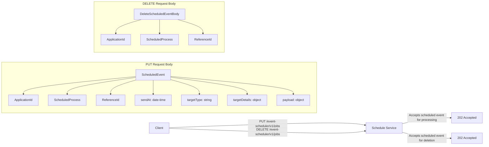
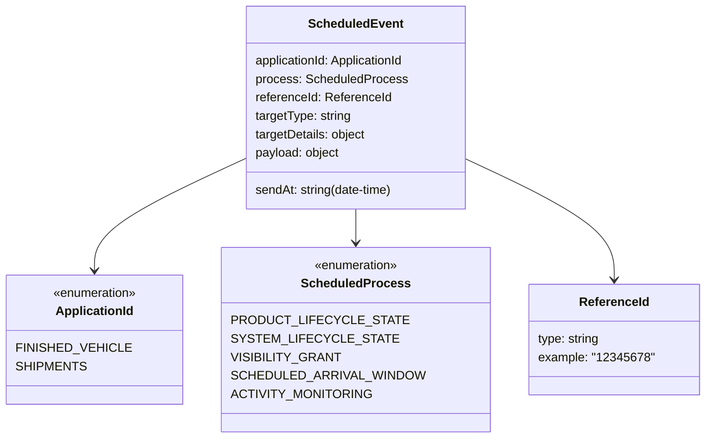

# Diagram: api_documentation/ScheduleService.yaml

> Auto-generated by Obscura crawlers

## Diagram 1

### SVG

<svg id="container" width="2471.796875" xmlns="http://www.w3.org/2000/svg" class="flowchart" height="738" viewBox="0 0 2471.796875 738" role="graphics-document document" aria-roledescription="flowchart-v2"><g><marker id="container_flowchart-v2-pointEnd" class="marker flowchart-v2" viewBox="0 0 10 10" refX="5" refY="5" markerUnits="userSpaceOnUse" markerWidth="8" markerHeight="8" orient="auto"><path d="M 0 0 L 10 5 L 0 10 z" class="arrowMarkerPath" style="stroke-width: 1; stroke-dasharray: 1, 0;"></path></marker><marker id="container_flowchart-v2-pointStart" class="marker flowchart-v2" viewBox="0 0 10 10" refX="4.5" refY="5" markerUnits="userSpaceOnUse" markerWidth="8" markerHeight="8" orient="auto"><path d="M 0 5 L 10 10 L 10 0 z" class="arrowMarkerPath" style="stroke-width: 1; stroke-dasharray: 1, 0;"></path></marker><marker id="container_flowchart-v2-circleEnd" class="marker flowchart-v2" viewBox="0 0 10 10" refX="11" refY="5" markerUnits="userSpaceOnUse" markerWidth="11" markerHeight="11" orient="auto"><circle cx="5" cy="5" r="5" class="arrowMarkerPath" style="stroke-width: 1; stroke-dasharray: 1, 0;"></circle></marker><marker id="container_flowchart-v2-circleStart" class="marker flowchart-v2" viewBox="0 0 10 10" refX="-1" refY="5" markerUnits="userSpaceOnUse" markerWidth="11" markerHeight="11" orient="auto"><circle cx="5" cy="5" r="5" class="arrowMarkerPath" style="stroke-width: 1; stroke-dasharray: 1, 0;"></circle></marker><marker id="container_flowchart-v2-crossEnd" class="marker cross flowchart-v2" viewBox="0 0 11 11" refX="12" refY="5.2" markerUnits="userSpaceOnUse" markerWidth="11" markerHeight="11" orient="auto"><path d="M 1,1 l 9,9 M 10,1 l -9,9" class="arrowMarkerPath" style="stroke-width: 2; stroke-dasharray: 1, 0;"></path></marker><marker id="container_flowchart-v2-crossStart" class="marker cross flowchart-v2" viewBox="0 0 11 11" refX="-1" refY="5.2" markerUnits="userSpaceOnUse" markerWidth="11" markerHeight="11" orient="auto"><path d="M 1,1 l 9,9 M 10,1 l -9,9" class="arrowMarkerPath" style="stroke-width: 2; stroke-dasharray: 1, 0;"></path></marker><g class="root"><g class="clusters"></g><g class="edgePaths"><path d="M868,649.146L1015.188,643.788C1162.375,638.431,1456.75,627.715,1624.112,625.526C1791.474,623.337,1831.824,629.674,1851.999,632.843L1872.173,636.011" id="L_Client_Scheduler_0" class="edge-thickness-normal edge-pattern-solid edge-thickness-normal edge-pattern-solid flowchart-link" style=";" data-edge="true" data-et="edge" data-id="L_Client_Scheduler_0" data-points="W3sieCI6ODY4LCJ5Ijo2NDkuMTQ1ODY4MTgzMzM5fSx7IngiOjE3NTEuMTI1LCJ5Ijo2MTd9LHsieCI6MTg3Ni4xMjUsInkiOjYzNi42MzE5MDE4NDA0OTA5fV0=" marker-end="url(#container_flowchart-v2-pointEnd)"></path><path d="M868,652.854L1015.188,658.212C1162.375,663.569,1456.75,674.285,1624.112,676.474C1791.474,678.663,1831.824,672.326,1851.999,669.157L1872.173,665.989" id="L_Client_Scheduler_2" class="edge-thickness-normal edge-pattern-solid edge-thickness-normal edge-pattern-solid flowchart-link" style=";" data-edge="true" data-et="edge" data-id="L_Client_Scheduler_2" data-points="W3sieCI6ODY4LCJ5Ijo2NTIuODU0MTMxODE2NjYxfSx7IngiOjE3NTEuMTI1LCJ5Ijo2ODV9LHsieCI6MTg3Ni4xMjUsInkiOjY2NS4zNjgwOTgxNTk1MDkxfV0=" marker-end="url(#container_flowchart-v2-pointEnd)"></path><path d="M2059.094,629.025L2079.927,624.021C2100.76,619.017,2142.427,609.008,2183.427,604.004C2224.427,599,2264.76,599,2284.927,599L2305.094,599" id="L_Scheduler_Put202_0" class="edge-thickness-normal edge-pattern-solid edge-thickness-normal edge-pattern-solid flowchart-link" style=";" data-edge="true" data-et="edge" data-id="L_Scheduler_Put202_0" data-points="W3sieCI6MjA1OS4wOTM3NSwieSI6NjI5LjAyNTI2MTYzODM5NzZ9LHsieCI6MjE4NC4wOTM3NSwieSI6NTk5fSx7IngiOjIzMDkuMDkzNzUsInkiOjU5OX1d" marker-end="url(#container_flowchart-v2-pointEnd)"></path><path d="M2059.094,672.975L2079.927,677.979C2100.76,682.983,2142.427,692.992,2183.427,697.996C2224.427,703,2264.76,703,2284.927,703L2305.094,703" id="L_Scheduler_Delete202_0" class="edge-thickness-normal edge-pattern-solid edge-thickness-normal edge-pattern-solid flowchart-link" style=";" data-edge="true" data-et="edge" data-id="L_Scheduler_Delete202_0" data-points="W3sieCI6MjA1OS4wOTM3NSwieSI6NjcyLjk3NDczODM2MTYwMjR9LHsieCI6MjE4NC4wOTM3NSwieSI6NzAzfSx7IngiOjIzMDkuMDkzNzUsInkiOjcwM31d" marker-end="url(#container_flowchart-v2-pointEnd)"></path></g><g class="edgeLabels"><g class="edgeLabel" transform="translate(1372.78676, 630.77156)"><g class="label" data-id="L_Client_Scheduler_0" transform="translate(-100, -24)"><foreignObject width="200" height="48">

PUT /event-scheduler/v1/jobs

</foreignObject></g></g><g class="edgeLabel" transform="translate(1372.78676, 671.22844)"><g class="label" data-id="L_Client_Scheduler_2" transform="translate(-100, -24)"><foreignObject width="200" height="48">

DELETE /event-scheduler/v1/jobs

</foreignObject></g></g><g class="edgeLabel" transform="translate(2184.09375, 599)"><g class="label" data-id="L_Scheduler_Put202_0" transform="translate(-100, -24)"><foreignObject width="200" height="48">

Accepts scheduled event for processing

</foreignObject></g></g><g class="edgeLabel" transform="translate(2184.09375, 703)"><g class="label" data-id="L_Scheduler_Delete202_0" transform="translate(-100, -24)"><foreignObject width="200" height="48">

Accepts scheduled event for deletion

</foreignObject></g></g></g><g class="nodes"><g class="root" transform="translate(476.96875, 0)"><g class="clusters"><g class="cluster" id="subGraph1" data-look="classic"><rect style="" x="8" y="8" width="664.1875" height="258"></rect><g class="cluster-label" transform="translate(261.9765625, 8)"><foreignObject width="156.234375" height="24">

DELETE Request Body

</foreignObject></g></g></g><g class="edgePaths"><path d="M251.661,99.5L229.957,105.75C208.253,112,164.845,124.5,143.141,136.333C121.438,148.167,121.438,159.333,121.438,164.917L121.438,170.5" id="L_DelBody_ApplicationIdRef2_0" class="edge-thickness-normal edge-pattern-solid edge-thickness-normal edge-pattern-solid flowchart-link" style=";" data-edge="true" data-et="edge" data-id="L_DelBody_ApplicationIdRef2_0" data-points="W3sieCI6MjUxLjY2MDk3MzgzNzIwOTMsInkiOjk5LjV9LHsieCI6MTIxLjQzNzUsInkiOjEzN30seyJ4IjoxMjEuNDM3NSwieSI6MTc0LjV9XQ==" marker-end="url(#container_flowchart-v2-pointEnd)"></path><path d="M345.422,99.5L345.422,105.75C345.422,112,345.422,124.5,345.422,136.333C345.422,148.167,345.422,159.333,345.422,164.917L345.422,170.5" id="L_DelBody_ScheduledProcessRef2_0" class="edge-thickness-normal edge-pattern-solid edge-thickness-normal edge-pattern-solid flowchart-link" style=";" data-edge="true" data-et="edge" data-id="L_DelBody_ScheduledProcessRef2_0" data-points="W3sieCI6MzQ1LjQyMTg3NSwieSI6OTkuNX0seyJ4IjozNDUuNDIxODc1LCJ5IjoxMzd9LHsieCI6MzQ1LjQyMTg3NSwieSI6MTc0LjV9XQ==" marker-end="url(#container_flowchart-v2-pointEnd)"></path><path d="M436.952,99.5L458.14,105.75C479.328,112,521.703,124.5,542.891,136.333C564.078,148.167,564.078,159.333,564.078,164.917L564.078,170.5" id="L_DelBody_ReferenceIdRef2_0" class="edge-thickness-normal edge-pattern-solid edge-thickness-normal edge-pattern-solid flowchart-link" style=";" data-edge="true" data-et="edge" data-id="L_DelBody_ReferenceIdRef2_0" data-points="W3sieCI6NDM2Ljk1MjM5ODI1NTgxMzkzLCJ5Ijo5OS41fSx7IngiOjU2NC4wNzgxMjUsInkiOjEzN30seyJ4Ijo1NjQuMDc4MTI1LCJ5IjoxNzQuNX1d" marker-end="url(#container_flowchart-v2-pointEnd)"></path></g><g class="edgeLabels"><g class="edgeLabel"><g class="label" data-id="L_DelBody_ApplicationIdRef2_0" transform="translate(0, 0)"><foreignObject width="0" height="0">

</foreignObject></g></g><g class="edgeLabel"><g class="label" data-id="L_DelBody_ScheduledProcessRef2_0" transform="translate(0, 0)"><foreignObject width="0" height="0">

</foreignObject></g></g><g class="edgeLabel"><g class="label" data-id="L_DelBody_ReferenceIdRef2_0" transform="translate(0, 0)"><foreignObject width="0" height="0">

</foreignObject></g></g></g><g class="nodes"><g class="node default" id="flowchart-DelBody-23" transform="translate(345.421875, 72.5)"><rect class="basic label-container" style="" x="-129.640625" y="-27" width="259.28125" height="54"></rect><g class="label" style="" transform="translate(-99.640625, -12)"><rect></rect><foreignObject width="199.28125" height="24">

DeleteScheduledEventBody

</foreignObject></g></g><g class="node default" id="flowchart-ApplicationIdRef2-25" transform="translate(121.4375, 201.5)"><rect class="basic label-container" style="" x="-78.4375" y="-27" width="156.875" height="54"></rect><g class="label" style="" transform="translate(-48.4375, -12)"><rect></rect><foreignObject width="96.875" height="24">

ApplicationId

</foreignObject></g></g><g class="node default" id="flowchart-ScheduledProcessRef2-27" transform="translate(345.421875, 201.5)"><rect class="basic label-container" style="" x="-95.546875" y="-27" width="191.09375" height="54"></rect><g class="label" style="" transform="translate(-65.546875, -12)"><rect></rect><foreignObject width="131.09375" height="24">

ScheduledProcess

</foreignObject></g></g><g class="node default" id="flowchart-ReferenceIdRef2-29" transform="translate(564.078125, 201.5)"><rect class="basic label-container" style="" x="-73.109375" y="-27" width="146.21875" height="54"></rect><g class="label" style="" transform="translate(-43.109375, -12)"><rect></rect><foreignObject width="86.21875" height="24">

ReferenceId

</foreignObject></g></g></g></g><g class="root" transform="translate(0, 308)"><g class="clusters"><g class="cluster" id="subGraph0" data-look="classic"><rect style="" x="8" y="8" width="1618.125" height="258"></rect><g class="cluster-label" transform="translate(750.9765625, 8)"><foreignObject width="132.171875" height="24">

PUT Request Body

</foreignObject></g></g></g><g class="edgePaths"><path d="M694.023,81.1L598.592,90.416C503.161,99.733,312.299,118.367,216.868,133.267C121.438,148.167,121.438,159.333,121.438,164.917L121.438,170.5" id="L_SE_ApplicationIdRef_0" class="edge-thickness-normal edge-pattern-solid edge-thickness-normal edge-pattern-solid flowchart-link" style=";" data-edge="true" data-et="edge" data-id="L_SE_ApplicationIdRef_0" data-points="W3sieCI6Njk0LjAyMzQzNzUsInkiOjgxLjA5OTY0NDA2NDk5MDY2fSx7IngiOjEyMS40Mzc1LCJ5IjoxMzd9LHsieCI6MTIxLjQzNzUsInkiOjE3NC41fV0=" marker-end="url(#container_flowchart-v2-pointEnd)"></path><path d="M694.023,85.511L635.923,94.092C577.823,102.674,461.622,119.837,403.522,134.002C345.422,148.167,345.422,159.333,345.422,164.917L345.422,170.5" id="L_SE_ScheduledProcessRef_0" class="edge-thickness-normal edge-pattern-solid edge-thickness-normal edge-pattern-solid flowchart-link" style=";" data-edge="true" data-et="edge" data-id="L_SE_ScheduledProcessRef_0" data-points="W3sieCI6Njk0LjAyMzQzNzUsInkiOjg1LjUxMDU0NjM3MTgzMzR9LHsieCI6MzQ1LjQyMTg3NSwieSI6MTM3fSx7IngiOjM0NS40MjE4NzUsInkiOjE3NC41fV0=" marker-end="url(#container_flowchart-v2-pointEnd)"></path><path d="M694.023,98.558L672.366,104.965C650.708,111.372,607.393,124.186,585.736,136.176C564.078,148.167,564.078,159.333,564.078,164.917L564.078,170.5" id="L_SE_ReferenceIdRef_0" class="edge-thickness-normal edge-pattern-solid edge-thickness-normal edge-pattern-solid flowchart-link" style=";" data-edge="true" data-et="edge" data-id="L_SE_ReferenceIdRef_0" data-points="W3sieCI6Njk0LjAyMzQzNzUsInkiOjk4LjU1ODM4ODI3NTc2MzIyfSx7IngiOjU2NC4wNzgxMjUsInkiOjEzN30seyJ4Ijo1NjQuMDc4MTI1LCJ5IjoxNzQuNX1d" marker-end="url(#container_flowchart-v2-pointEnd)"></path><path d="M782.109,99.5L782.109,105.75C782.109,112,782.109,124.5,782.109,136.333C782.109,148.167,782.109,159.333,782.109,164.917L782.109,170.5" id="L_SE_SendAt_0" class="edge-thickness-normal edge-pattern-solid edge-thickness-normal edge-pattern-solid flowchart-link" style=";" data-edge="true" data-et="edge" data-id="L_SE_SendAt_0" data-points="W3sieCI6NzgyLjEwOTM3NSwieSI6OTkuNX0seyJ4Ijo3ODIuMTA5Mzc1LCJ5IjoxMzd9LHsieCI6NzgyLjEwOTM3NSwieSI6MTc0LjV9XQ==" marker-end="url(#container_flowchart-v2-pointEnd)"></path><path d="M870.195,96.364L895.194,103.137C920.193,109.909,970.19,123.455,995.189,135.811C1020.188,148.167,1020.188,159.333,1020.188,164.917L1020.188,170.5" id="L_SE_TargetType_0" class="edge-thickness-normal edge-pattern-solid edge-thickness-normal edge-pattern-solid flowchart-link" style=";" data-edge="true" data-et="edge" data-id="L_SE_TargetType_0" data-points="W3sieCI6ODcwLjE5NTMxMjUsInkiOjk2LjM2NDE5NTcwNzgxNjQ5fSx7IngiOjEwMjAuMTg3NSwieSI6MTM3fSx7IngiOjEwMjAuMTg3NSwieSI6MTc0LjV9XQ==" marker-end="url(#container_flowchart-v2-pointEnd)"></path><path d="M870.195,84.227L936.26,93.023C1002.326,101.818,1134.456,119.409,1200.521,133.788C1266.586,148.167,1266.586,159.333,1266.586,164.917L1266.586,170.5" id="L_SE_TargetDetails_0" class="edge-thickness-normal edge-pattern-solid edge-thickness-normal edge-pattern-solid flowchart-link" style=";" data-edge="true" data-et="edge" data-id="L_SE_TargetDetails_0" data-points="W3sieCI6ODcwLjE5NTMxMjUsInkiOjg0LjIyNzE3ODE3MjMxODd9LHsieCI6MTI2Ni41ODU5Mzc1LCJ5IjoxMzd9LHsieCI6MTI2Ni41ODU5Mzc1LCJ5IjoxNzQuNX1d" marker-end="url(#container_flowchart-v2-pointEnd)"></path><path d="M870.195,80.354L976.076,89.795C1081.956,99.236,1293.716,118.118,1399.596,133.142C1505.477,148.167,1505.477,159.333,1505.477,164.917L1505.477,170.5" id="L_SE_Payload_0" class="edge-thickness-normal edge-pattern-solid edge-thickness-normal edge-pattern-solid flowchart-link" style=";" data-edge="true" data-et="edge" data-id="L_SE_Payload_0" data-points="W3sieCI6ODcwLjE5NTMxMjUsInkiOjgwLjM1NDMwMDA5Mzk2MTYxfSx7IngiOjE1MDUuNDc2NTYyNSwieSI6MTM3fSx7IngiOjE1MDUuNDc2NTYyNSwieSI6MTc0LjV9XQ==" marker-end="url(#container_flowchart-v2-pointEnd)"></path></g><g class="edgeLabels"><g class="edgeLabel"><g class="label" data-id="L_SE_ApplicationIdRef_0" transform="translate(0, 0)"><foreignObject width="0" height="0">

</foreignObject></g></g><g class="edgeLabel"><g class="label" data-id="L_SE_ScheduledProcessRef_0" transform="translate(0, 0)"><foreignObject width="0" height="0">

</foreignObject></g></g><g class="edgeLabel"><g class="label" data-id="L_SE_ReferenceIdRef_0" transform="translate(0, 0)"><foreignObject width="0" height="0">

</foreignObject></g></g><g class="edgeLabel"><g class="label" data-id="L_SE_SendAt_0" transform="translate(0, 0)"><foreignObject width="0" height="0">

</foreignObject></g></g><g class="edgeLabel"><g class="label" data-id="L_SE_TargetType_0" transform="translate(0, 0)"><foreignObject width="0" height="0">

</foreignObject></g></g><g class="edgeLabel"><g class="label" data-id="L_SE_TargetDetails_0" transform="translate(0, 0)"><foreignObject width="0" height="0">

</foreignObject></g></g><g class="edgeLabel"><g class="label" data-id="L_SE_Payload_0" transform="translate(0, 0)"><foreignObject width="0" height="0">

</foreignObject></g></g></g><g class="nodes"><g class="node default" id="flowchart-SE-8" transform="translate(782.109375, 72.5)"><rect class="basic label-container" style="" x="-88.0859375" y="-27" width="176.171875" height="54"></rect><g class="label" style="" transform="translate(-58.0859375, -12)"><rect></rect><foreignObject width="116.171875" height="24">

ScheduledEvent

</foreignObject></g></g><g class="node default" id="flowchart-ApplicationIdRef-10" transform="translate(121.4375, 201.5)"><rect class="basic label-container" style="" x="-78.4375" y="-27" width="156.875" height="54"></rect><g class="label" style="" transform="translate(-48.4375, -12)"><rect></rect><foreignObject width="96.875" height="24">

ApplicationId

</foreignObject></g></g><g class="node default" id="flowchart-ScheduledProcessRef-12" transform="translate(345.421875, 201.5)"><rect class="basic label-container" style="" x="-95.546875" y="-27" width="191.09375" height="54"></rect><g class="label" style="" transform="translate(-65.546875, -12)"><rect></rect><foreignObject width="131.09375" height="24">

ScheduledProcess

</foreignObject></g></g><g class="node default" id="flowchart-ReferenceIdRef-14" transform="translate(564.078125, 201.5)"><rect class="basic label-container" style="" x="-73.109375" y="-27" width="146.21875" height="54"></rect><g class="label" style="" transform="translate(-43.109375, -12)"><rect></rect><foreignObject width="86.21875" height="24">

ReferenceId

</foreignObject></g></g><g class="node default" id="flowchart-SendAt-16" transform="translate(782.109375, 201.5)"><rect class="basic label-container" style="" x="-94.921875" y="-27" width="189.84375" height="54"></rect><g class="label" style="" transform="translate(-64.921875, -12)"><rect></rect><foreignObject width="129.84375" height="24">

sendAt: date-time

</foreignObject></g></g><g class="node default" id="flowchart-TargetType-18" transform="translate(1020.1875, 201.5)"><rect class="basic label-container" style="" x="-93.15625" y="-27" width="186.3125" height="54"></rect><g class="label" style="" transform="translate(-63.15625, -12)"><rect></rect><foreignObject width="126.3125" height="24">

targetType: string

</foreignObject></g></g><g class="node default" id="flowchart-TargetDetails-20" transform="translate(1266.5859375, 201.5)"><rect class="basic label-container" style="" x="-103.2421875" y="-27" width="206.484375" height="54"></rect><g class="label" style="" transform="translate(-73.2421875, -12)"><rect></rect><foreignObject width="146.484375" height="24">

targetDetails: object

</foreignObject></g></g><g class="node default" id="flowchart-Payload-22" transform="translate(1505.4765625, 201.5)"><rect class="basic label-container" style="" x="-85.6484375" y="-27" width="171.296875" height="54"></rect><g class="label" style="" transform="translate(-55.6484375, -12)"><rect></rect><foreignObject width="111.296875" height="24">

payload: object

</foreignObject></g></g></g></g><g class="node default" id="flowchart-Client-0" transform="translate(817.0625, 651)"><rect class="basic label-container" style="" x="-50.9375" y="-27" width="101.875" height="54"></rect><g class="label" style="" transform="translate(-20.9375, -12)"><rect></rect><foreignObject width="41.875" height="24">

Client

</foreignObject></g></g><g class="node default" id="flowchart-Scheduler-1" transform="translate(1967.609375, 651)"><rect class="basic label-container" style="" x="-91.484375" y="-27" width="182.96875" height="54"></rect><g class="label" style="" transform="translate(-61.484375, -12)"><rect></rect><foreignObject width="122.96875" height="24">

Schedule Service

</foreignObject></g></g><g class="node default" id="flowchart-Put202-5" transform="translate(2386.4453125, 599)"><rect class="basic label-container" style="" x="-77.3515625" y="-27" width="154.703125" height="54"></rect><g class="label" style="" transform="translate(-47.3515625, -12)"><rect></rect><foreignObject width="94.703125" height="24">

202 Accepted

</foreignObject></g></g><g class="node default" id="flowchart-Delete202-7" transform="translate(2386.4453125, 703)"><rect class="basic label-container" style="" x="-77.3515625" y="-27" width="154.703125" height="54"></rect><g class="label" style="" transform="translate(-47.3515625, -12)"><rect></rect><foreignObject width="94.703125" height="24">

202 Accepted

</foreignObject></g></g></g></g></g></svg>

## Diagram 2

### SVG

<svg id="container" width="852.8828125" xmlns="http://www.w3.org/2000/svg" class="classDiagram" height="570" viewBox="0 0 852.8828125 570" role="graphics-document document" aria-roledescription="class"><g><defs><marker id="container_class-aggregationStart" class="marker aggregation class" refX="18" refY="7" markerWidth="190" markerHeight="240" orient="auto"><path d="M 18,7 L9,13 L1,7 L9,1 Z"></path></marker></defs><defs><marker id="container_class-aggregationEnd" class="marker aggregation class" refX="1" refY="7" markerWidth="20" markerHeight="28" orient="auto"><path d="M 18,7 L9,13 L1,7 L9,1 Z"></path></marker></defs><defs><marker id="container_class-extensionStart" class="marker extension class" refX="18" refY="7" markerWidth="190" markerHeight="240" orient="auto"><path d="M 1,7 L18,13 V 1 Z"></path></marker></defs><defs><marker id="container_class-extensionEnd" class="marker extension class" refX="1" refY="7" markerWidth="20" markerHeight="28" orient="auto"><path d="M 1,1 V 13 L18,7 Z"></path></marker></defs><defs><marker id="container_class-compositionStart" class="marker composition class" refX="18" refY="7" markerWidth="190" markerHeight="240" orient="auto"><path d="M 18,7 L9,13 L1,7 L9,1 Z"></path></marker></defs><defs><marker id="container_class-compositionEnd" class="marker composition class" refX="1" refY="7" markerWidth="20" markerHeight="28" orient="auto"><path d="M 18,7 L9,13 L1,7 L9,1 Z"></path></marker></defs><defs><marker id="container_class-dependencyStart" class="marker dependency class" refX="6" refY="7" markerWidth="190" markerHeight="240" orient="auto"><path d="M 5,7 L9,13 L1,7 L9,1 Z"></path></marker></defs><defs><marker id="container_class-dependencyEnd" class="marker dependency class" refX="13" refY="7" markerWidth="20" markerHeight="28" orient="auto"><path d="M 18,7 L9,13 L14,7 L9,1 Z"></path></marker></defs><defs><marker id="container_class-lollipopStart" class="marker lollipop class" refX="13" refY="7" markerWidth="190" markerHeight="240" orient="auto"><circle stroke="black" fill="transparent" cx="7" cy="7" r="6"></circle></marker></defs><defs><marker id="container_class-lollipopEnd" class="marker lollipop class" refX="1" refY="7" markerWidth="190" markerHeight="240" orient="auto"><circle stroke="black" fill="transparent" cx="7" cy="7" r="6"></circle></marker></defs><g class="root"><g class="clusters"></g><g class="edgePaths"><path d="M284.121,211.382L255.741,225.652C227.361,239.921,170.6,268.461,142.22,291.897C113.84,315.333,113.84,333.667,113.84,342.833L113.84,352" id="id_ScheduledEvent_ApplicationId_1" class="edge-thickness-normal edge-pattern-solid relation" style=";;;" data-edge="true" data-et="edge" data-id="id_ScheduledEvent_ApplicationId_1" data-points="W3sieCI6Mjg0LjEyMTA5Mzc1LCJ5IjoyMTEuMzgyMjA1NzY0NjExNjh9LHsieCI6MTEzLjgzOTg0Mzc1LCJ5IjoyOTd9LHsieCI6MTEzLjgzOTg0Mzc1LCJ5IjozNTh9XQ==" marker-end="url(#container_class-dependencyEnd)"></path><path d="M426.09,272L426.09,276.167C426.09,280.333,426.09,288.667,426.09,296C426.09,303.333,426.09,309.667,426.09,312.833L426.09,316" id="id_ScheduledEvent_ScheduledProcess_2" class="edge-thickness-normal edge-pattern-solid relation" style=";;;" data-edge="true" data-et="edge" data-id="id_ScheduledEvent_ScheduledProcess_2" data-points="W3sieCI6NDI2LjA4OTg0Mzc1LCJ5IjoyNzJ9LHsieCI6NDI2LjA4OTg0Mzc1LCJ5IjoyOTd9LHsieCI6NDI2LjA4OTg0Mzc1LCJ5IjozMjJ9XQ==" marker-end="url(#container_class-dependencyEnd)"></path><path d="M568.059,211.302L596.497,225.585C624.936,239.868,681.814,268.434,710.253,293.884C738.691,319.333,738.691,341.667,738.691,352.833L738.691,364" id="id_ScheduledEvent_ReferenceId_3" class="edge-thickness-normal edge-pattern-solid relation" style=";;;" data-edge="true" data-et="edge" data-id="id_ScheduledEvent_ReferenceId_3" data-points="W3sieCI6NTY4LjA1ODU5Mzc1LCJ5IjoyMTEuMzAxOTI2ODczNzY2MDR9LHsieCI6NzM4LjY5MTQwNjI1LCJ5IjoyOTd9LHsieCI6NzM4LjY5MTQwNjI1LCJ5IjozNzB9XQ==" marker-end="url(#container_class-dependencyEnd)"></path></g><g class="edgeLabels"><g class="edgeLabel"><g class="label" data-id="id_ScheduledEvent_ApplicationId_1" transform="translate(0, 0)"><foreignObject width="0" height="0">

</foreignObject></g></g><g class="edgeLabel"><g class="label" data-id="id_ScheduledEvent_ScheduledProcess_2" transform="translate(0, 0)"><foreignObject width="0" height="0">

</foreignObject></g></g><g class="edgeLabel"><g class="label" data-id="id_ScheduledEvent_ReferenceId_3" transform="translate(0, 0)"><foreignObject width="0" height="0">

</foreignObject></g></g></g><g class="nodes"><g class="node default" id="classId-ScheduledEvent-0" transform="translate(426.08984375, 140)"><g class="basic label-container"><path d="M-141.96875 -132 L141.96875 -132 L141.96875 132 L-141.96875 132" stroke="none" stroke-width="0" fill="#ECECFF" style=""></path><path d="M-141.96875 -132 C-41.89768503959799 -132, 58.173379920804024 -132, 141.96875 -132 M-141.96875 -132 C-57.912843596958254 -132, 26.143062806083492 -132, 141.96875 -132 M141.96875 -132 C141.96875 -42.36337562150189, 141.96875 47.273248756996225, 141.96875 132 M141.96875 -132 C141.96875 -32.72251074976904, 141.96875 66.55497850046191, 141.96875 132 M141.96875 132 C82.32943746821546 132, 22.69012493643092 132, -141.96875 132 M141.96875 132 C62.99257598787679 132, -15.983598024246419 132, -141.96875 132 M-141.96875 132 C-141.96875 73.99677316346762, -141.96875 15.993546326935231, -141.96875 -132 M-141.96875 132 C-141.96875 61.41489619342033, -141.96875 -9.170207613159334, -141.96875 -132" stroke="#9370DB" stroke-width="1.3" fill="none" stroke-dasharray="0 0" style=""></path></g><g class="annotation-group text" transform="translate(0, -108)"></g><g class="label-group text" transform="translate(-58.578125, -108)"><g class="label" style="font-weight: bolder" transform="translate(0,-12)"><foreignObject width="117.15625" height="24">

ScheduledEvent

</foreignObject></g></g><g class="members-group text" transform="translate(-129.96875, -60)"><g class="label" style="" transform="translate(0,-12)"><foreignObject width="201.359375" height="24">

applicationId: ApplicationId

</foreignObject></g><g class="label" style="" transform="translate(0,12)"><foreignObject width="194.546875" height="24">

process: ScheduledProcess

</foreignObject></g><g class="label" style="" transform="translate(0,36)"><foreignObject width="176.765625" height="24">

referenceId: ReferenceId

</foreignObject></g><g class="label" style="" transform="translate(0,60)"><foreignObject width="126.3125" height="24">

targetType: string

</foreignObject></g><g class="label" style="" transform="translate(0,84)"><foreignObject width="146.484375" height="24">

targetDetails: object

</foreignObject></g><g class="label" style="" transform="translate(0,108)"><foreignObject width="111.296875" height="24">

payload: object

</foreignObject></g></g><g class="methods-group text" transform="translate(-129.96875, 108)"><g class="label" style="" transform="translate(0,-12)"><foreignObject width="181.84375" height="24">

sendAt: string(date-time)

</foreignObject></g></g><g class="divider" style=""><path d="M-141.96875 -84 C-61.81156812479031 -84, 18.345613750419375 -84, 141.96875 -84 M-141.96875 -84 C-83.56538788834439 -84, -25.162025776688793 -84, 141.96875 -84" stroke="#9370DB" stroke-width="1.3" fill="none" stroke-dasharray="0 0" style=""></path></g><g class="divider" style=""><path d="M-141.96875 84 C-33.83783413637704 84, 74.29308172724592 84, 141.96875 84 M-141.96875 84 C-77.56167365899799 84, -13.154597317995979 84, 141.96875 84" stroke="#9370DB" stroke-width="1.3" fill="none" stroke-dasharray="0 0" style=""></path></g></g><g class="node default" id="classId-ApplicationId-1" transform="translate(113.83984375, 442)"><g class="basic label-container"><path d="M-105.83984375 -84 L105.83984375 -84 L105.83984375 84 L-105.83984375 84" stroke="none" stroke-width="0" fill="#ECECFF" style=""></path><path d="M-105.83984375 -84 C-51.31215759893181 -84, 3.2155285521363766 -84, 105.83984375 -84 M-105.83984375 -84 C-39.95234306374195 -84, 25.9351576225161 -84, 105.83984375 -84 M105.83984375 -84 C105.83984375 -48.45534387962274, 105.83984375 -12.910687759245477, 105.83984375 84 M105.83984375 -84 C105.83984375 -26.693027585970746, 105.83984375 30.613944828058507, 105.83984375 84 M105.83984375 84 C49.62392460528982 84, -6.591994539420355 84, -105.83984375 84 M105.83984375 84 C32.71755929548745 84, -40.404725159025105 84, -105.83984375 84 M-105.83984375 84 C-105.83984375 35.97624716676561, -105.83984375 -12.04750566646878, -105.83984375 -84 M-105.83984375 84 C-105.83984375 46.34710381073657, -105.83984375 8.69420762147314, -105.83984375 -84" stroke="#9370DB" stroke-width="1.3" fill="none" stroke-dasharray="0 0" style=""></path></g><g class="annotation-group text" transform="translate(-55.5546875, -60)"><g class="label" style="" transform="translate(0,-12)"><foreignObject width="111.109375" height="24">

«enumeration»

</foreignObject></g></g><g class="label-group text" transform="translate(-48.8203125, -36)"><g class="label" style="font-weight: bolder" transform="translate(0,-12)"><foreignObject width="97.640625" height="24">

ApplicationId

</foreignObject></g></g><g class="members-group text" transform="translate(-93.83984375, 12)"><g class="label" style="" transform="translate(0,-12)"><foreignObject width="132.125" height="24">

FINISHED_VEHICLE

</foreignObject></g><g class="label" style="" transform="translate(0,12)"><foreignObject width="81.75" height="24">

SHIPMENTS

</foreignObject></g></g><g class="methods-group text" transform="translate(-93.83984375, 84)"></g><g class="divider" style=""><path d="M-105.83984375 -12 C-29.827465514178513 -12, 46.184912721642974 -12, 105.83984375 -12 M-105.83984375 -12 C-38.67618302787167 -12, 28.487477694256654 -12, 105.83984375 -12" stroke="#9370DB" stroke-width="1.3" fill="none" stroke-dasharray="0 0" style=""></path></g><g class="divider" style=""><path d="M-105.83984375 60 C-52.11777188108316 60, 1.6042999878336843 60, 105.83984375 60 M-105.83984375 60 C-40.36869180701659 60, 25.102460135966822 60, 105.83984375 60" stroke="#9370DB" stroke-width="1.3" fill="none" stroke-dasharray="0 0" style=""></path></g></g><g class="node default" id="classId-ScheduledProcess-2" transform="translate(426.08984375, 442)"><g class="basic label-container"><path d="M-156.41015625 -120 L156.41015625 -120 L156.41015625 120 L-156.41015625 120" stroke="none" stroke-width="0" fill="#ECECFF" style=""></path><path d="M-156.41015625 -120 C-78.78194171982966 -120, -1.153727189659321 -120, 156.41015625 -120 M-156.41015625 -120 C-44.28841248095928 -120, 67.83333128808144 -120, 156.41015625 -120 M156.41015625 -120 C156.41015625 -27.702846800219604, 156.41015625 64.5943063995608, 156.41015625 120 M156.41015625 -120 C156.41015625 -70.77924808104702, 156.41015625 -21.55849616209403, 156.41015625 120 M156.41015625 120 C93.54176637488547 120, 30.673376499770953 120, -156.41015625 120 M156.41015625 120 C68.76378020786554 120, -18.882595834268926 120, -156.41015625 120 M-156.41015625 120 C-156.41015625 60.438059773992244, -156.41015625 0.8761195479844872, -156.41015625 -120 M-156.41015625 120 C-156.41015625 59.001580486163014, -156.41015625 -1.9968390276739711, -156.41015625 -120" stroke="#9370DB" stroke-width="1.3" fill="none" stroke-dasharray="0 0" style=""></path></g><g class="annotation-group text" transform="translate(-55.5546875, -96)"><g class="label" style="" transform="translate(0,-12)"><foreignObject width="111.109375" height="24">

«enumeration»

</foreignObject></g></g><g class="label-group text" transform="translate(-66.4140625, -72)"><g class="label" style="font-weight: bolder" transform="translate(0,-12)"><foreignObject width="132.828125" height="24">

ScheduledProcess

</foreignObject></g></g><g class="members-group text" transform="translate(-144.41015625, -24)"><g class="label" style="" transform="translate(0,-12)"><foreignObject width="195.828125" height="24">

PRODUCT_LIFECYCLE_STATE

</foreignObject></g><g class="label" style="" transform="translate(0,12)"><foreignObject width="183.28125" height="24">

SYSTEM_LIFECYCLE_STATE

</foreignObject></g><g class="label" style="" transform="translate(0,36)"><foreignObject width="125.8125" height="24">

VISIBILITY_GRANT

</foreignObject></g><g class="label" style="" transform="translate(0,60)"><foreignObject width="222.40625" height="24">

SCHEDULED_ARRIVAL_WINDOW

</foreignObject></g><g class="label" style="" transform="translate(0,84)"><foreignObject width="161.75" height="24">

ACTIVITY_MONITORING

</foreignObject></g></g><g class="methods-group text" transform="translate(-144.41015625, 120)"></g><g class="divider" style=""><path d="M-156.41015625 -48 C-37.430742282443774 -48, 81.54867168511245 -48, 156.41015625 -48 M-156.41015625 -48 C-74.60326203608074 -48, 7.203632177838529 -48, 156.41015625 -48" stroke="#9370DB" stroke-width="1.3" fill="none" stroke-dasharray="0 0" style=""></path></g><g class="divider" style=""><path d="M-156.41015625 96 C-75.8091999791852 96, 4.791756291629611 96, 156.41015625 96 M-156.41015625 96 C-91.86917946220933 96, -27.328202674418662 96, 156.41015625 96" stroke="#9370DB" stroke-width="1.3" fill="none" stroke-dasharray="0 0" style=""></path></g></g><g class="node default" id="classId-ReferenceId-3" transform="translate(738.69140625, 442)"><g class="basic label-container"><path d="M-106.19140625 -72 L106.19140625 -72 L106.19140625 72 L-106.19140625 72" stroke="none" stroke-width="0" fill="#ECECFF" style=""></path><path d="M-106.19140625 -72 C-63.26686692191765 -72, -20.342327593835293 -72, 106.19140625 -72 M-106.19140625 -72 C-34.79152883983883 -72, 36.608348570322335 -72, 106.19140625 -72 M106.19140625 -72 C106.19140625 -15.867920079464312, 106.19140625 40.264159841071375, 106.19140625 72 M106.19140625 -72 C106.19140625 -34.26371082315487, 106.19140625 3.472578353690267, 106.19140625 72 M106.19140625 72 C54.2345994841932 72, 2.2777927183863937 72, -106.19140625 72 M106.19140625 72 C57.179107006990314 72, 8.166807763980628 72, -106.19140625 72 M-106.19140625 72 C-106.19140625 30.838428466925578, -106.19140625 -10.323143066148845, -106.19140625 -72 M-106.19140625 72 C-106.19140625 30.73502276799463, -106.19140625 -10.529954464010743, -106.19140625 -72" stroke="#9370DB" stroke-width="1.3" fill="none" stroke-dasharray="0 0" style=""></path></g><g class="annotation-group text" transform="translate(0, -48)"></g><g class="label-group text" transform="translate(-43.6484375, -48)"><g class="label" style="font-weight: bolder" transform="translate(0,-12)"><foreignObject width="87.296875" height="24">

ReferenceId

</foreignObject></g></g><g class="members-group text" transform="translate(-94.19140625, 0)"><g class="label" style="" transform="translate(0,-12)"><foreignObject width="81.515625" height="24">

type: string

</foreignObject></g><g class="label" style="" transform="translate(0,12)"><foreignObject width="144.734375" height="24">

example: "12345678"

</foreignObject></g></g><g class="methods-group text" transform="translate(-94.19140625, 72)"></g><g class="divider" style=""><path d="M-106.19140625 -24 C-33.10310555913732 -24, 39.98519513172536 -24, 106.19140625 -24 M-106.19140625 -24 C-21.999793235734415 -24, 62.19181977853117 -24, 106.19140625 -24" stroke="#9370DB" stroke-width="1.3" fill="none" stroke-dasharray="0 0" style=""></path></g><g class="divider" style=""><path d="M-106.19140625 48 C-41.55432896137566 48, 23.08274832724868 48, 106.19140625 48 M-106.19140625 48 C-46.62605289409903 48, 12.939300461801935 48, 106.19140625 48" stroke="#9370DB" stroke-width="1.3" fill="none" stroke-dasharray="0 0" style=""></path></g></g></g></g></g></svg>
