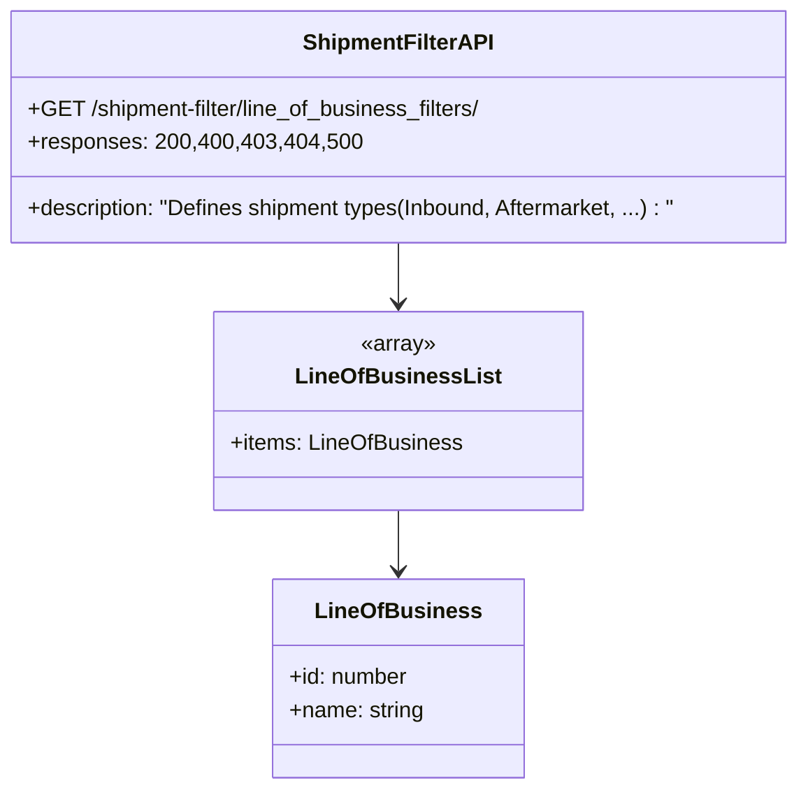

# Diagram: api_documentation/ShipmentFilterApi.yaml

> Auto-generated by Obscura crawlers

## Mermaid

### SVG

<svg id="container" width="584.9921875" xmlns="http://www.w3.org/2000/svg" class="classDiagram" height="572" viewBox="0 0 584.9921875 572" role="graphics-document document" aria-roledescription="class"><g><defs><marker id="container_class-aggregationStart" class="marker aggregation class" refX="18" refY="7" markerWidth="190" markerHeight="240" orient="auto"><path d="M 18,7 L9,13 L1,7 L9,1 Z"></path></marker></defs><defs><marker id="container_class-aggregationEnd" class="marker aggregation class" refX="1" refY="7" markerWidth="20" markerHeight="28" orient="auto"><path d="M 18,7 L9,13 L1,7 L9,1 Z"></path></marker></defs><defs><marker id="container_class-extensionStart" class="marker extension class" refX="18" refY="7" markerWidth="190" markerHeight="240" orient="auto"><path d="M 1,7 L18,13 V 1 Z"></path></marker></defs><defs><marker id="container_class-extensionEnd" class="marker extension class" refX="1" refY="7" markerWidth="20" markerHeight="28" orient="auto"><path d="M 1,1 V 13 L18,7 Z"></path></marker></defs><defs><marker id="container_class-compositionStart" class="marker composition class" refX="18" refY="7" markerWidth="190" markerHeight="240" orient="auto"><path d="M 18,7 L9,13 L1,7 L9,1 Z"></path></marker></defs><defs><marker id="container_class-compositionEnd" class="marker composition class" refX="1" refY="7" markerWidth="20" markerHeight="28" orient="auto"><path d="M 18,7 L9,13 L1,7 L9,1 Z"></path></marker></defs><defs><marker id="container_class-dependencyStart" class="marker dependency class" refX="6" refY="7" markerWidth="190" markerHeight="240" orient="auto"><path d="M 5,7 L9,13 L1,7 L9,1 Z"></path></marker></defs><defs><marker id="container_class-dependencyEnd" class="marker dependency class" refX="13" refY="7" markerWidth="20" markerHeight="28" orient="auto"><path d="M 18,7 L9,13 L14,7 L9,1 Z"></path></marker></defs><defs><marker id="container_class-lollipopStart" class="marker lollipop class" refX="13" refY="7" markerWidth="190" markerHeight="240" orient="auto"><circle stroke="black" fill="transparent" cx="7" cy="7" r="6"></circle></marker></defs><defs><marker id="container_class-lollipopEnd" class="marker lollipop class" refX="1" refY="7" markerWidth="190" markerHeight="240" orient="auto"><circle stroke="black" fill="transparent" cx="7" cy="7" r="6"></circle></marker></defs><g class="root"><g class="clusters"></g><g class="edgePaths"><path d="M292.496,176L292.496,180.167C292.496,184.333,292.496,192.667,292.496,200C292.496,207.333,292.496,213.667,292.496,216.833L292.496,220" id="id_ShipmentFilterAPI_LineOfBusinessList_1" class="edge-thickness-normal edge-pattern-solid relation" style=";;;" data-edge="true" data-et="edge" data-id="id_ShipmentFilterAPI_LineOfBusinessList_1" data-points="W3sieCI6MjkyLjQ5NjA5Mzc1LCJ5IjoxNzZ9LHsieCI6MjkyLjQ5NjA5Mzc1LCJ5IjoyMDF9LHsieCI6MjkyLjQ5NjA5Mzc1LCJ5IjoyMjZ9XQ==" marker-end="url(#container_class-dependencyEnd)"></path><path d="M292.496,370L292.496,374.167C292.496,378.333,292.496,386.667,292.496,394C292.496,401.333,292.496,407.667,292.496,410.833L292.496,414" id="id_LineOfBusinessList_LineOfBusiness_2" class="edge-thickness-normal edge-pattern-solid relation" style=";;;" data-edge="true" data-et="edge" data-id="id_LineOfBusinessList_LineOfBusiness_2" data-points="W3sieCI6MjkyLjQ5NjA5Mzc1LCJ5IjozNzB9LHsieCI6MjkyLjQ5NjA5Mzc1LCJ5IjozOTV9LHsieCI6MjkyLjQ5NjA5Mzc1LCJ5Ijo0MjB9XQ==" marker-end="url(#container_class-dependencyEnd)"></path></g><g class="edgeLabels"><g class="edgeLabel"><g class="label" data-id="id_ShipmentFilterAPI_LineOfBusinessList_1" transform="translate(0, 0)"><foreignObject width="0" height="0">

</foreignObject></g></g><g class="edgeLabel"><g class="label" data-id="id_LineOfBusinessList_LineOfBusiness_2" transform="translate(0, 0)"><foreignObject width="0" height="0">

</foreignObject></g></g></g><g class="nodes"><g class="node default" id="classId-ShipmentFilterAPI-0" transform="translate(292.49609375, 92)"><g class="basic label-container"><path d="M-284.49609375 -84 L284.49609375 -84 L284.49609375 84 L-284.49609375 84" stroke="none" stroke-width="0" fill="#ECECFF" style=""></path><path d="M-284.49609375 -84 C-159.86926709547174 -84, -35.24244044094348 -84, 284.49609375 -84 M-284.49609375 -84 C-99.56409200874211 -84, 85.36790973251578 -84, 284.49609375 -84 M284.49609375 -84 C284.49609375 -36.408608734591816, 284.49609375 11.182782530816368, 284.49609375 84 M284.49609375 -84 C284.49609375 -46.106386273716446, 284.49609375 -8.212772547432891, 284.49609375 84 M284.49609375 84 C58.529436113110705 84, -167.4372215237786 84, -284.49609375 84 M284.49609375 84 C145.3879692264995 84, 6.279844702999014 84, -284.49609375 84 M-284.49609375 84 C-284.49609375 40.33546525388454, -284.49609375 -3.3290694922309143, -284.49609375 -84 M-284.49609375 84 C-284.49609375 45.18501749820324, -284.49609375 6.370034996406474, -284.49609375 -84" stroke="#9370DB" stroke-width="1.3" fill="none" stroke-dasharray="0 0" style=""></path></g><g class="annotation-group text" transform="translate(0, -60)"></g><g class="label-group text" transform="translate(-65.8359375, -60)"><g class="label" style="font-weight: bolder" transform="translate(0,-12)"><foreignObject width="131.671875" height="24">

ShipmentFilterAPI

</foreignObject></g></g><g class="members-group text" transform="translate(-272.49609375, -12)"><g class="label" style="" transform="translate(0,-12)"><foreignObject width="341.453125" height="24">

+GET /shipment-filter/line_of_business_filters/

</foreignObject></g><g class="label" style="" transform="translate(0,12)"><foreignObject width="232.625" height="24">

+responses: 200,400,403,404,500

</foreignObject></g></g><g class="methods-group text" transform="translate(-272.49609375, 60)"><g class="label" style="" transform="translate(0,-12)"><foreignObject width="479.15625" height="24">

+description: "Defines shipment types(Inbound, Aftermarket, ...) : "

</foreignObject></g></g><g class="divider" style=""><path d="M-284.49609375 -36 C-165.9997713613527 -36, -47.50344897270543 -36, 284.49609375 -36 M-284.49609375 -36 C-60.04436882460334 -36, 164.40735610079332 -36, 284.49609375 -36" stroke="#9370DB" stroke-width="1.3" fill="none" stroke-dasharray="0 0" style=""></path></g><g class="divider" style=""><path d="M-284.49609375 36 C-155.06930819937662 36, -25.642522648753243 36, 284.49609375 36 M-284.49609375 36 C-142.47129461662234 36, -0.44649548324468924 36, 284.49609375 36" stroke="#9370DB" stroke-width="1.3" fill="none" stroke-dasharray="0 0" style=""></path></g></g><g class="node default" id="classId-LineOfBusinessList-1" transform="translate(292.49609375, 298)"><g class="basic label-container"><path d="M-130.1796875 -72 L130.1796875 -72 L130.1796875 72 L-130.1796875 72" stroke="none" stroke-width="0" fill="#ECECFF" style=""></path><path d="M-130.1796875 -72 C-58.181045346113535 -72, 13.81759680777293 -72, 130.1796875 -72 M-130.1796875 -72 C-31.210918774361588 -72, 67.75784995127682 -72, 130.1796875 -72 M130.1796875 -72 C130.1796875 -29.533372308311314, 130.1796875 12.933255383377372, 130.1796875 72 M130.1796875 -72 C130.1796875 -30.005253606822677, 130.1796875 11.989492786354646, 130.1796875 72 M130.1796875 72 C46.152164586439994 72, -37.87535832712001 72, -130.1796875 72 M130.1796875 72 C33.136847711692795 72, -63.90599207661441 72, -130.1796875 72 M-130.1796875 72 C-130.1796875 29.772451618185826, -130.1796875 -12.455096763628347, -130.1796875 -72 M-130.1796875 72 C-130.1796875 34.47459050180245, -130.1796875 -3.050818996395094, -130.1796875 -72" stroke="#9370DB" stroke-width="1.3" fill="none" stroke-dasharray="0 0" style=""></path></g><g class="annotation-group text" transform="translate(-27.4296875, -48)"><g class="label" style="" transform="translate(0,-12)"><foreignObject width="54.859375" height="24">

«array»

</foreignObject></g></g><g class="label-group text" transform="translate(-69.421875, -24)"><g class="label" style="font-weight: bolder" transform="translate(0,-12)"><foreignObject width="138.84375" height="24">

LineOfBusinessList

</foreignObject></g></g><g class="members-group text" transform="translate(-118.1796875, 24)"><g class="label" style="" transform="translate(0,-12)"><foreignObject width="166.9375" height="24">

+items: LineOfBusiness

</foreignObject></g></g><g class="methods-group text" transform="translate(-118.1796875, 72)"></g><g class="divider" style=""><path d="M-130.1796875 0 C-46.0103554385678 0, 38.1589766228644 0, 130.1796875 0 M-130.1796875 0 C-72.64355890701253 0, -15.107430314025066 0, 130.1796875 0" stroke="#9370DB" stroke-width="1.3" fill="none" stroke-dasharray="0 0" style=""></path></g><g class="divider" style=""><path d="M-130.1796875 48 C-76.27007797586947 48, -22.360468451738925 48, 130.1796875 48 M-130.1796875 48 C-38.28081732411957 48, 53.618052851760865 48, 130.1796875 48" stroke="#9370DB" stroke-width="1.3" fill="none" stroke-dasharray="0 0" style=""></path></g></g><g class="node default" id="classId-LineOfBusiness-2" transform="translate(292.49609375, 492)"><g class="basic label-container"><path d="M-89.1640625 -72 L89.1640625 -72 L89.1640625 72 L-89.1640625 72" stroke="none" stroke-width="0" fill="#ECECFF" style=""></path><path d="M-89.1640625 -72 C-26.041651361977316 -72, 37.08075977604537 -72, 89.1640625 -72 M-89.1640625 -72 C-53.34966036618598 -72, -17.53525823237196 -72, 89.1640625 -72 M89.1640625 -72 C89.1640625 -26.34050452495819, 89.1640625 19.318990950083617, 89.1640625 72 M89.1640625 -72 C89.1640625 -30.05961962751386, 89.1640625 11.880760744972278, 89.1640625 72 M89.1640625 72 C53.02065218639353 72, 16.877241872787053 72, -89.1640625 72 M89.1640625 72 C27.76657486995407 72, -33.63091276009186 72, -89.1640625 72 M-89.1640625 72 C-89.1640625 22.940930176591998, -89.1640625 -26.118139646816005, -89.1640625 -72 M-89.1640625 72 C-89.1640625 24.047445083575496, -89.1640625 -23.905109832849007, -89.1640625 -72" stroke="#9370DB" stroke-width="1.3" fill="none" stroke-dasharray="0 0" style=""></path></g><g class="annotation-group text" transform="translate(0, -48)"></g><g class="label-group text" transform="translate(-56.109375, -48)"><g class="label" style="font-weight: bolder" transform="translate(0,-12)"><foreignObject width="112.21875" height="24">

LineOfBusiness

</foreignObject></g></g><g class="members-group text" transform="translate(-77.1640625, 0)"><g class="label" style="" transform="translate(0,-12)"><foreignObject width="86.953125" height="24">

+id: number

</foreignObject></g><g class="label" style="" transform="translate(0,12)"><foreignObject width="98.21875" height="24">

+name: string

</foreignObject></g></g><g class="methods-group text" transform="translate(-77.1640625, 72)"></g><g class="divider" style=""><path d="M-89.1640625 -24 C-38.070088783576146 -24, 13.023884932847707 -24, 89.1640625 -24 M-89.1640625 -24 C-37.82283007406226 -24, 13.51840235187548 -24, 89.1640625 -24" stroke="#9370DB" stroke-width="1.3" fill="none" stroke-dasharray="0 0" style=""></path></g><g class="divider" style=""><path d="M-89.1640625 48 C-19.50469251925233 48, 50.15467746149534 48, 89.1640625 48 M-89.1640625 48 C-21.929070066556818 48, 45.305922366886364 48, 89.1640625 48" stroke="#9370DB" stroke-width="1.3" fill="none" stroke-dasharray="0 0" style=""></path></g></g></g></g></g></svg>
