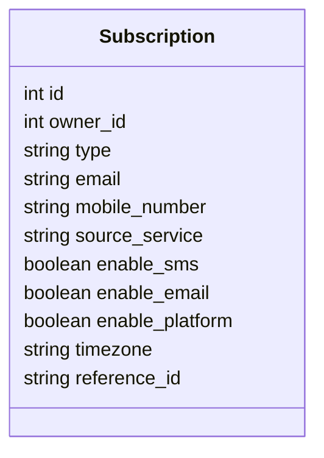

# Diagram: api_documentation/SubscriptionApi.yaml


> Auto-generated by Obscura crawlers

## Diagram 1

```mermaid
flowchart LR
  Servers[[Servers]]
  S1["https://data.freightverify.com/entity/solution/{solutionId}/entity/{externalId}"]
  S2["https://data.freightverify.com/entity/internal/{id}"]
  S3["https://data.freightverify.com/partview/package-container/{externalId}"]
  S4["https://data.freightverify.com/reuse-trip-container/{containerId}"]
  S5["https://data.freightverify.com/preferences-ng/shipments/{id}"]
  Servers --> S1
  Servers --> S2
  Servers --> S3
  Servers --> S4
  Servers --> S5

  subgraph API["Platform Comment API (openapi 3.0.2)"]
    direction TB
    SUBS_GET[/subscription\nGET]
    SUB_PATCH[/subscription/:subscriptionId\nPATCH]
    SUBSCRIBE_POST[/subscribe\nPOST]
    UNSUBSCRIBE_POST[/unsubscribe\nPOST]

    SUBS_GET -->|200| SUBS_200[Subscriptions (array of Subscription)]
    SUB_PATCH -->|200| PATCH_200[Subscription updated]
    SUBSCRIBE_POST -->|201| CREATED_201[Subscription created (object)]
    UNSUBSCRIBE_POST -->|204| NO_CONTENT_204[Unsubscription successful]
  end

  SUBS_GET -->|query: email, sourceService, type| QUERY_PARAMS
  SUBSCRIBE_POST -->|body: type,email,mobile_number,source_service,enable_sms,enable_email,enable_platform,timezone| SUB_BODY
  SUB_PATCH -->|body: mobile_number,enable_sms,enable_email,enable_platform| PATCH_BODY
  UNSUBSCRIBE_POST -->|body: type,email,source_service| UNSUB_BODY

  classDef endpoints fill:#f9f,stroke:#333,stroke-width:1px;
  class SUBS_GET,SUB_PATCH,SUBSCRIBE_POST,UNSUBSCRIBE_POST endpoints
```

> SVG rendering failed for this diagram.

## Diagram 2



### SVG

<svg id="container" width="270.84375" xmlns="http://www.w3.org/2000/svg" class="classDiagram" height="376" viewBox="0 0 270.84375 376" role="graphics-document document" aria-roledescription="class"><style>#container{font-family:"trebuchet ms",verdana,arial,sans-serif;font-size:16px;fill:#333;}@keyframes edge-animation-frame{from{stroke-dashoffset:0;}}@keyframes dash{to{stroke-dashoffset:0;}}#container .edge-animation-slow{stroke-dasharray:9,5!important;stroke-dashoffset:900;animation:dash 50s linear infinite;stroke-linecap:round;}#container .edge-animation-fast{stroke-dasharray:9,5!important;stroke-dashoffset:900;animation:dash 20s linear infinite;stroke-linecap:round;}#container .error-icon{fill:#552222;}#container .error-text{fill:#552222;stroke:#552222;}#container .edge-thickness-normal{stroke-width:1px;}#container .edge-thickness-thick{stroke-width:3.5px;}#container .edge-pattern-solid{stroke-dasharray:0;}#container .edge-thickness-invisible{stroke-width:0;fill:none;}#container .edge-pattern-dashed{stroke-dasharray:3;}#container .edge-pattern-dotted{stroke-dasharray:2;}#container .marker{fill:#333333;stroke:#333333;}#container .marker.cross{stroke:#333333;}#container svg{font-family:"trebuchet ms",verdana,arial,sans-serif;font-size:16px;}#container p{margin:0;}#container g.classGroup text{fill:#9370DB;stroke:none;font-family:"trebuchet ms",verdana,arial,sans-serif;font-size:10px;}#container g.classGroup text .title{font-weight:bolder;}#container .nodeLabel,#container .edgeLabel{color:#131300;}#container .edgeLabel .label rect{fill:#ECECFF;}#container .label text{fill:#131300;}#container .labelBkg{background:#ECECFF;}#container .edgeLabel .label span{background:#ECECFF;}#container .classTitle{font-weight:bolder;}#container .node rect,#container .node circle,#container .node ellipse,#container .node polygon,#container .node path{fill:#ECECFF;stroke:#9370DB;stroke-width:1px;}#container .divider{stroke:#9370DB;stroke-width:1;}#container g.clickable{cursor:pointer;}#container g.classGroup rect{fill:#ECECFF;stroke:#9370DB;}#container g.classGroup line{stroke:#9370DB;stroke-width:1;}#container .classLabel .box{stroke:none;stroke-width:0;fill:#ECECFF;opacity:0.5;}#container .classLabel .label{fill:#9370DB;font-size:10px;}#container .relation{stroke:#333333;stroke-width:1;fill:none;}#container .dashed-line{stroke-dasharray:3;}#container .dotted-line{stroke-dasharray:1 2;}#container #compositionStart,#container .composition{fill:#333333!important;stroke:#333333!important;stroke-width:1;}#container #compositionEnd,#container .composition{fill:#333333!important;stroke:#333333!important;stroke-width:1;}#container #dependencyStart,#container .dependency{fill:#333333!important;stroke:#333333!important;stroke-width:1;}#container #dependencyStart,#container .dependency{fill:#333333!important;stroke:#333333!important;stroke-width:1;}#container #extensionStart,#container .extension{fill:transparent!important;stroke:#333333!important;stroke-width:1;}#container #extensionEnd,#container .extension{fill:transparent!important;stroke:#333333!important;stroke-width:1;}#container #aggregationStart,#container .aggregation{fill:transparent!important;stroke:#333333!important;stroke-width:1;}#container #aggregationEnd,#container .aggregation{fill:transparent!important;stroke:#333333!important;stroke-width:1;}#container #lollipopStart,#container .lollipop{fill:#ECECFF!important;stroke:#333333!important;stroke-width:1;}#container #lollipopEnd,#container .lollipop{fill:#ECECFF!important;stroke:#333333!important;stroke-width:1;}#container .edgeTerminals{font-size:11px;line-height:initial;}#container .classTitleText{text-anchor:middle;font-size:18px;fill:#333;}#container .label-icon{display:inline-block;height:1em;overflow:visible;vertical-align:-0.125em;}#container .node .label-icon path{fill:currentColor;stroke:revert;stroke-width:revert;}#container :root{--mermaid-font-family:"trebuchet ms",verdana,arial,sans-serif;}</style><g><defs><marker id="container_class-aggregationStart" class="marker aggregation class" refX="18" refY="7" markerWidth="190" markerHeight="240" orient="auto"><path d="M 18,7 L9,13 L1,7 L9,1 Z"></path></marker></defs><defs><marker id="container_class-aggregationEnd" class="marker aggregation class" refX="1" refY="7" markerWidth="20" markerHeight="28" orient="auto"><path d="M 18,7 L9,13 L1,7 L9,1 Z"></path></marker></defs><defs><marker id="container_class-extensionStart" class="marker extension class" refX="18" refY="7" markerWidth="190" markerHeight="240" orient="auto"><path d="M 1,7 L18,13 V 1 Z"></path></marker></defs><defs><marker id="container_class-extensionEnd" class="marker extension class" refX="1" refY="7" markerWidth="20" markerHeight="28" orient="auto"><path d="M 1,1 V 13 L18,7 Z"></path></marker></defs><defs><marker id="container_class-compositionStart" class="marker composition class" refX="18" refY="7" markerWidth="190" markerHeight="240" orient="auto"><path d="M 18,7 L9,13 L1,7 L9,1 Z"></path></marker></defs><defs><marker id="container_class-compositionEnd" class="marker composition class" refX="1" refY="7" markerWidth="20" markerHeight="28" orient="auto"><path d="M 18,7 L9,13 L1,7 L9,1 Z"></path></marker></defs><defs><marker id="container_class-dependencyStart" class="marker dependency class" refX="6" refY="7" markerWidth="190" markerHeight="240" orient="auto"><path d="M 5,7 L9,13 L1,7 L9,1 Z"></path></marker></defs><defs><marker id="container_class-dependencyEnd" class="marker dependency class" refX="13" refY="7" markerWidth="20" markerHeight="28" orient="auto"><path d="M 18,7 L9,13 L14,7 L9,1 Z"></path></marker></defs><defs><marker id="container_class-lollipopStart" class="marker lollipop class" refX="13" refY="7" markerWidth="190" markerHeight="240" orient="auto"><circle stroke="black" fill="transparent" cx="7" cy="7" r="6"></circle></marker></defs><defs><marker id="container_class-lollipopEnd" class="marker lollipop class" refX="1" refY="7" markerWidth="190" markerHeight="240" orient="auto"><circle stroke="black" fill="transparent" cx="7" cy="7" r="6"></circle></marker></defs><g class="root"><g class="clusters"></g><g class="edgePaths"></g><g class="edgeLabels"></g><g class="nodes"><g class="node default" id="classId-Subscription-0" transform="translate(135.421875, 188)"><g class="basic label-container"><path d="M-127.421875 -180 L127.421875 -180 L127.421875 180 L-127.421875 180" stroke="none" stroke-width="0" fill="#ECECFF" style=""></path><path d="M-127.421875 -180 C-40.55739066982791 -180, 46.30709366034418 -180, 127.421875 -180 M-127.421875 -180 C-74.68005168754084 -180, -21.938228375081678 -180, 127.421875 -180 M127.421875 -180 C127.421875 -44.937412243267715, 127.421875 90.12517551346457, 127.421875 180 M127.421875 -180 C127.421875 -75.40487036612848, 127.421875 29.190259267743045, 127.421875 180 M127.421875 180 C67.91723713505264 180, 8.41259927010529 180, -127.421875 180 M127.421875 180 C32.50760276844004 180, -62.406669463119925 180, -127.421875 180 M-127.421875 180 C-127.421875 94.67390573404973, -127.421875 9.34781146809945, -127.421875 -180 M-127.421875 180 C-127.421875 57.90646079346085, -127.421875 -64.1870784130783, -127.421875 -180" stroke="#9370DB" stroke-width="1.3" fill="none" stroke-dasharray="0 0" style=""></path></g><g class="annotation-group text" transform="translate(0, -156)"></g><g class="label-group text" transform="translate(-46.5, -156)"><g class="label" style="font-weight: bolder" transform="translate(0,-12)"><foreignObject width="93" height="24"><div xmlns="http://www.w3.org/1999/xhtml" style="display: table-cell; white-space: nowrap; line-height: 1.5; max-width: 142px; text-align: center;"><span class="nodeLabel markdown-node-label" style=""><p>Subscription</p></span></div></foreignObject></g></g><g class="members-group text" transform="translate(-115.421875, -108)"><g class="label" style="" transform="translate(0,-12)"><foreignObject width="37.984375" height="24"><div xmlns="http://www.w3.org/1999/xhtml" style="display: table-cell; white-space: nowrap; line-height: 1.5; max-width: 88px; text-align: center;"><span class="nodeLabel markdown-node-label" style=""><p>int id</p></span></div></foreignObject></g><g class="label" style="" transform="translate(0,12)"><foreignObject width="90.125" height="24"><div xmlns="http://www.w3.org/1999/xhtml" style="display: table-cell; white-space: nowrap; line-height: 1.5; max-width: 140px; text-align: center;"><span class="nodeLabel markdown-node-label" style=""><p>int owner_id</p></span></div></foreignObject></g><g class="label" style="" transform="translate(0,36)"><foreignObject width="77.671875" height="24"><div xmlns="http://www.w3.org/1999/xhtml" style="display: table-cell; white-space: nowrap; line-height: 1.5; max-width: 128px; text-align: center;"><span class="nodeLabel markdown-node-label" style=""><p>string type</p></span></div></foreignObject></g><g class="label" style="" transform="translate(0,60)"><foreignObject width="86.21875" height="24"><div xmlns="http://www.w3.org/1999/xhtml" style="display: table-cell; white-space: nowrap; line-height: 1.5; max-width: 137px; text-align: center;"><span class="nodeLabel markdown-node-label" style=""><p>string email</p></span></div></foreignObject></g><g class="label" style="" transform="translate(0,84)"><foreignObject width="161.078125" height="24"><div xmlns="http://www.w3.org/1999/xhtml" style="display: table-cell; white-space: nowrap; line-height: 1.5; max-width: 212px; text-align: center;"><span class="nodeLabel markdown-node-label" style=""><p>string mobile_number</p></span></div></foreignObject></g><g class="label" style="" transform="translate(0,108)"><foreignObject width="152.546875" height="24"><div xmlns="http://www.w3.org/1999/xhtml" style="display: table-cell; white-space: nowrap; line-height: 1.5; max-width: 203px; text-align: center;"><span class="nodeLabel markdown-node-label" style=""><p>string source_service</p></span></div></foreignObject></g><g class="label" style="" transform="translate(0,132)"><foreignObject width="149.96875" height="24"><div xmlns="http://www.w3.org/1999/xhtml" style="display: table-cell; white-space: nowrap; line-height: 1.5; max-width: 200px; text-align: center;"><span class="nodeLabel markdown-node-label" style=""><p>boolean enable_sms</p></span></div></foreignObject></g><g class="label" style="" transform="translate(0,156)"><foreignObject width="161.34375" height="24"><div xmlns="http://www.w3.org/1999/xhtml" style="display: table-cell; white-space: nowrap; line-height: 1.5; max-width: 212px; text-align: center;"><span class="nodeLabel markdown-node-label" style=""><p>boolean enable_email</p></span></div></foreignObject></g><g class="label" style="" transform="translate(0,180)"><foreignObject width="184.34375" height="24"><div xmlns="http://www.w3.org/1999/xhtml" style="display: table-cell; white-space: nowrap; line-height: 1.5; max-width: 234px; text-align: center;"><span class="nodeLabel markdown-node-label" style=""><p>boolean enable_platform</p></span></div></foreignObject></g><g class="label" style="" transform="translate(0,204)"><foreignObject width="112.8125" height="24"><div xmlns="http://www.w3.org/1999/xhtml" style="display: table-cell; white-space: nowrap; line-height: 1.5; max-width: 163px; text-align: center;"><span class="nodeLabel markdown-node-label" style=""><p>string timezone</p></span></div></foreignObject></g><g class="label" style="" transform="translate(0,228)"><foreignObject width="136.140625" height="24"><div xmlns="http://www.w3.org/1999/xhtml" style="display: table-cell; white-space: nowrap; line-height: 1.5; max-width: 186px; text-align: center;"><span class="nodeLabel markdown-node-label" style=""><p>string reference_id</p></span></div></foreignObject></g></g><g class="methods-group text" transform="translate(-115.421875, 180)"></g><g class="divider" style=""><path d="M-127.421875 -132 C-33.0225625959487 -132, 61.3767498081026 -132, 127.421875 -132 M-127.421875 -132 C-43.79487181818918 -132, 39.83213136362164 -132, 127.421875 -132" stroke="#9370DB" stroke-width="1.3" fill="none" stroke-dasharray="0 0" style=""></path></g><g class="divider" style=""><path d="M-127.421875 156 C-55.248261714861144 156, 16.925351570277712 156, 127.421875 156 M-127.421875 156 C-76.2675435242511 156, -25.113212048502206 156, 127.421875 156" stroke="#9370DB" stroke-width="1.3" fill="none" stroke-dasharray="0 0" style=""></path></g></g></g></g></g></svg>
