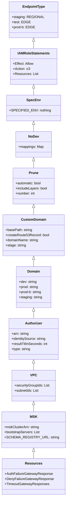

# Diagram: application_service/config.global.yml


> Auto-generated by Obscura crawlers

## Diagram 1

```mermaid
flowchart LR
  A[endpointType] --> A1[staging: REGIONAL]
  A --> A2[test: EDGE]
  A --> A3[prod-b: EDGE]
  B[iamRoleStatements] --> B1[Effect: Allow]
  B1 --> B2[Action: s3:*]
  B1 --> B3[Resources]
  B3 --> R1["arn:aws:s3:::csv-export-s/*"]
  B3 --> R2["arn:aws:s3:::csv-export-t/*"]
  B3 --> R3["arn:aws:s3:::csv-export-s1/*"]
  B3 --> R4["arn:aws:s3:::csv-export-p/*"]
  B3 --> R5["arn:aws:s3:::csv-export-d/*"]
  B3 --> R6["arn:aws:s3:::csv-export-q/*"]
  C[spec_env] --> C1["${env:SPECIFIED_ENV, \"nothing\"}"]
  D[no_dev mappings] --> D1[test/prod/prod-b/...]
  E[prune] --> E1[automatic: true]
  E --> E2[includeLayers: true]
  E --> E3[number: ${...prune_number..., 1}]
  F[customDomain] --> F1[basePath]
  F --> F2[createRoute53Record: true]
  F --> F3[domainName]
  F --> F4[stage: ${opt:stage}]
  G[domain entries] --> G1[dev -> data-d.freightverify.com]
  G --> G2[prod -> data.freightverify.com]
  G --> G3[prod-b -> data-b.freightverify.com]
  G --> G4[staging -> data-s.freightverify.com]
  H[authorizer] --> H1[arn -> lambda arn with no_dev mapping]
  H --> H2[type: request]
  I[fv_layers] --> L1[FvLambdaLayerQualifiedArn]
  I --> L2[PythonRequirementsLambdaLayerQualifiedArn]
  J[vpc] --> J1[securityGroupIds]
  J --> J2[subnetIds]
  K[msk configs] --> K1[mskClusterArn]
  K --> K2[bootstrapServers]
  L[cors_headers] --> CH1[Accept-Encoding,...,x-fv-mock]
  M[resources] --> M1[AuthFailureGatewayResponse]
  M --> M2[DenyFailureGatewayResponse]
  M --> M3[TimeoutGatewayResponses]
```

> SVG rendering failed for this diagram.

## Diagram 2



### SVG

<svg id="container" width="300.671875" xmlns="http://www.w3.org/2000/svg" class="classDiagram" height="2316" viewBox="0 0 300.671875 2316" role="graphics-document document" aria-roledescription="class"><style>#container{font-family:"trebuchet ms",verdana,arial,sans-serif;font-size:16px;fill:#333;}@keyframes edge-animation-frame{from{stroke-dashoffset:0;}}@keyframes dash{to{stroke-dashoffset:0;}}#container .edge-animation-slow{stroke-dasharray:9,5!important;stroke-dashoffset:900;animation:dash 50s linear infinite;stroke-linecap:round;}#container .edge-animation-fast{stroke-dasharray:9,5!important;stroke-dashoffset:900;animation:dash 20s linear infinite;stroke-linecap:round;}#container .error-icon{fill:#552222;}#container .error-text{fill:#552222;stroke:#552222;}#container .edge-thickness-normal{stroke-width:1px;}#container .edge-thickness-thick{stroke-width:3.5px;}#container .edge-pattern-solid{stroke-dasharray:0;}#container .edge-thickness-invisible{stroke-width:0;fill:none;}#container .edge-pattern-dashed{stroke-dasharray:3;}#container .edge-pattern-dotted{stroke-dasharray:2;}#container .marker{fill:#333333;stroke:#333333;}#container .marker.cross{stroke:#333333;}#container svg{font-family:"trebuchet ms",verdana,arial,sans-serif;font-size:16px;}#container p{margin:0;}#container g.classGroup text{fill:#9370DB;stroke:none;font-family:"trebuchet ms",verdana,arial,sans-serif;font-size:10px;}#container g.classGroup text .title{font-weight:bolder;}#container .nodeLabel,#container .edgeLabel{color:#131300;}#container .edgeLabel .label rect{fill:#ECECFF;}#container .label text{fill:#131300;}#container .labelBkg{background:#ECECFF;}#container .edgeLabel .label span{background:#ECECFF;}#container .classTitle{font-weight:bolder;}#container .node rect,#container .node circle,#container .node ellipse,#container .node polygon,#container .node path{fill:#ECECFF;stroke:#9370DB;stroke-width:1px;}#container .divider{stroke:#9370DB;stroke-width:1;}#container g.clickable{cursor:pointer;}#container g.classGroup rect{fill:#ECECFF;stroke:#9370DB;}#container g.classGroup line{stroke:#9370DB;stroke-width:1;}#container .classLabel .box{stroke:none;stroke-width:0;fill:#ECECFF;opacity:0.5;}#container .classLabel .label{fill:#9370DB;font-size:10px;}#container .relation{stroke:#333333;stroke-width:1;fill:none;}#container .dashed-line{stroke-dasharray:3;}#container .dotted-line{stroke-dasharray:1 2;}#container #compositionStart,#container .composition{fill:#333333!important;stroke:#333333!important;stroke-width:1;}#container #compositionEnd,#container .composition{fill:#333333!important;stroke:#333333!important;stroke-width:1;}#container #dependencyStart,#container .dependency{fill:#333333!important;stroke:#333333!important;stroke-width:1;}#container #dependencyStart,#container .dependency{fill:#333333!important;stroke:#333333!important;stroke-width:1;}#container #extensionStart,#container .extension{fill:transparent!important;stroke:#333333!important;stroke-width:1;}#container #extensionEnd,#container .extension{fill:transparent!important;stroke:#333333!important;stroke-width:1;}#container #aggregationStart,#container .aggregation{fill:transparent!important;stroke:#333333!important;stroke-width:1;}#container #aggregationEnd,#container .aggregation{fill:transparent!important;stroke:#333333!important;stroke-width:1;}#container #lollipopStart,#container .lollipop{fill:#ECECFF!important;stroke:#333333!important;stroke-width:1;}#container #lollipopEnd,#container .lollipop{fill:#ECECFF!important;stroke:#333333!important;stroke-width:1;}#container .edgeTerminals{font-size:11px;line-height:initial;}#container .classTitleText{text-anchor:middle;font-size:18px;fill:#333;}#container .label-icon{display:inline-block;height:1em;overflow:visible;vertical-align:-0.125em;}#container .node .label-icon path{fill:currentColor;stroke:revert;stroke-width:revert;}#container :root{--mermaid-font-family:"trebuchet ms",verdana,arial,sans-serif;}</style><g><defs><marker id="container_class-aggregationStart" class="marker aggregation class" refX="18" refY="7" markerWidth="190" markerHeight="240" orient="auto"><path d="M 18,7 L9,13 L1,7 L9,1 Z"></path></marker></defs><defs><marker id="container_class-aggregationEnd" class="marker aggregation class" refX="1" refY="7" markerWidth="20" markerHeight="28" orient="auto"><path d="M 18,7 L9,13 L1,7 L9,1 Z"></path></marker></defs><defs><marker id="container_class-extensionStart" class="marker extension class" refX="18" refY="7" markerWidth="190" markerHeight="240" orient="auto"><path d="M 1,7 L18,13 V 1 Z"></path></marker></defs><defs><marker id="container_class-extensionEnd" class="marker extension class" refX="1" refY="7" markerWidth="20" markerHeight="28" orient="auto"><path d="M 1,1 V 13 L18,7 Z"></path></marker></defs><defs><marker id="container_class-compositionStart" class="marker composition class" refX="18" refY="7" markerWidth="190" markerHeight="240" orient="auto"><path d="M 18,7 L9,13 L1,7 L9,1 Z"></path></marker></defs><defs><marker id="container_class-compositionEnd" class="marker composition class" refX="1" refY="7" markerWidth="20" markerHeight="28" orient="auto"><path d="M 18,7 L9,13 L1,7 L9,1 Z"></path></marker></defs><defs><marker id="container_class-dependencyStart" class="marker dependency class" refX="6" refY="7" markerWidth="190" markerHeight="240" orient="auto"><path d="M 5,7 L9,13 L1,7 L9,1 Z"></path></marker></defs><defs><marker id="container_class-dependencyEnd" class="marker dependency class" refX="13" refY="7" markerWidth="20" markerHeight="28" orient="auto"><path d="M 18,7 L9,13 L14,7 L9,1 Z"></path></marker></defs><defs><marker id="container_class-lollipopStart" class="marker lollipop class" refX="13" refY="7" markerWidth="190" markerHeight="240" orient="auto"><circle stroke="black" fill="transparent" cx="7" cy="7" r="6"></circle></marker></defs><defs><marker id="container_class-lollipopEnd" class="marker lollipop class" refX="1" refY="7" markerWidth="190" markerHeight="240" orient="auto"><circle stroke="black" fill="transparent" cx="7" cy="7" r="6"></circle></marker></defs><g class="root"><g class="clusters"></g><g class="edgePaths"><path d="M150.336,193.25L150.336,194.542C150.336,195.833,150.336,198.417,150.336,203.875C150.336,209.333,150.336,217.667,150.336,221.833L150.336,226" id="id_EndpointType_IAMRoleStatements_1" class="edge-thickness-normal edge-pattern-solid relation" style=";;;" data-edge="true" data-et="edge" data-id="id_EndpointType_IAMRoleStatements_1" data-points="W3sieCI6MTUwLjMzNTkzNzUsInkiOjE3Nn0seyJ4IjoxNTAuMzM1OTM3NSwieSI6MjAxfSx7IngiOjE1MC4zMzU5Mzc1LCJ5IjoyMjZ9XQ==" marker-start="url(#container_class-extensionStart)"></path><path d="M150.336,411.25L150.336,412.542C150.336,413.833,150.336,416.417,150.336,421.875C150.336,427.333,150.336,435.667,150.336,439.833L150.336,444" id="id_IAMRoleStatements_SpecEnv_2" class="edge-thickness-normal edge-pattern-solid relation" style=";;;" data-edge="true" data-et="edge" data-id="id_IAMRoleStatements_SpecEnv_2" data-points="W3sieCI6MTUwLjMzNTkzNzUsInkiOjM5NH0seyJ4IjoxNTAuMzM1OTM3NSwieSI6NDE5fSx7IngiOjE1MC4zMzU5Mzc1LCJ5Ijo0NDR9XQ==" marker-start="url(#container_class-extensionStart)"></path><path d="M150.336,581.25L150.336,582.542C150.336,583.833,150.336,586.417,150.336,591.875C150.336,597.333,150.336,605.667,150.336,609.833L150.336,614" id="id_SpecEnv_NoDev_3" class="edge-thickness-normal edge-pattern-solid relation" style=";;;" data-edge="true" data-et="edge" data-id="id_SpecEnv_NoDev_3" data-points="W3sieCI6MTUwLjMzNTkzNzUsInkiOjU2NH0seyJ4IjoxNTAuMzM1OTM3NSwieSI6NTg5fSx7IngiOjE1MC4zMzU5Mzc1LCJ5Ijo2MTR9XQ==" marker-start="url(#container_class-extensionStart)"></path><path d="M150.336,751.25L150.336,752.542C150.336,753.833,150.336,756.417,150.336,761.875C150.336,767.333,150.336,775.667,150.336,779.833L150.336,784" id="id_NoDev_Prune_4" class="edge-thickness-normal edge-pattern-solid relation" style=";;;" data-edge="true" data-et="edge" data-id="id_NoDev_Prune_4" data-points="W3sieCI6MTUwLjMzNTkzNzUsInkiOjczNH0seyJ4IjoxNTAuMzM1OTM3NSwieSI6NzU5fSx7IngiOjE1MC4zMzU5Mzc1LCJ5Ijo3ODR9XQ==" marker-start="url(#container_class-extensionStart)"></path><path d="M150.336,969.25L150.336,970.542C150.336,971.833,150.336,974.417,150.336,979.875C150.336,985.333,150.336,993.667,150.336,997.833L150.336,1002" id="id_Prune_CustomDomain_5" class="edge-thickness-normal edge-pattern-solid relation" style=";;;" data-edge="true" data-et="edge" data-id="id_Prune_CustomDomain_5" data-points="W3sieCI6MTUwLjMzNTkzNzUsInkiOjk1Mn0seyJ4IjoxNTAuMzM1OTM3NSwieSI6OTc3fSx7IngiOjE1MC4zMzU5Mzc1LCJ5IjoxMDAyfV0=" marker-start="url(#container_class-extensionStart)"></path><path d="M150.336,1211.25L150.336,1212.542C150.336,1213.833,150.336,1216.417,150.336,1221.875C150.336,1227.333,150.336,1235.667,150.336,1239.833L150.336,1244" id="id_CustomDomain_Domain_6" class="edge-thickness-normal edge-pattern-solid relation" style=";;;" data-edge="true" data-et="edge" data-id="id_CustomDomain_Domain_6" data-points="W3sieCI6MTUwLjMzNTkzNzUsInkiOjExOTR9LHsieCI6MTUwLjMzNTkzNzUsInkiOjEyMTl9LHsieCI6MTUwLjMzNTkzNzUsInkiOjEyNDR9XQ==" marker-start="url(#container_class-extensionStart)"></path><path d="M150.336,1453.25L150.336,1454.542C150.336,1455.833,150.336,1458.417,150.336,1463.875C150.336,1469.333,150.336,1477.667,150.336,1481.833L150.336,1486" id="id_Domain_Authorizer_7" class="edge-thickness-normal edge-pattern-solid relation" style=";;;" data-edge="true" data-et="edge" data-id="id_Domain_Authorizer_7" data-points="W3sieCI6MTUwLjMzNTkzNzUsInkiOjE0MzZ9LHsieCI6MTUwLjMzNTkzNzUsInkiOjE0NjF9LHsieCI6MTUwLjMzNTkzNzUsInkiOjE0ODZ9XQ==" marker-start="url(#container_class-extensionStart)"></path><path d="M150.336,1695.25L150.336,1696.542C150.336,1697.833,150.336,1700.417,150.336,1705.875C150.336,1711.333,150.336,1719.667,150.336,1723.833L150.336,1728" id="id_Authorizer_VPC_8" class="edge-thickness-normal edge-pattern-solid relation" style=";;;" data-edge="true" data-et="edge" data-id="id_Authorizer_VPC_8" data-points="W3sieCI6MTUwLjMzNTkzNzUsInkiOjE2Nzh9LHsieCI6MTUwLjMzNTkzNzUsInkiOjE3MDN9LHsieCI6MTUwLjMzNTkzNzUsInkiOjE3Mjh9XQ==" marker-start="url(#container_class-extensionStart)"></path><path d="M150.336,1889.25L150.336,1890.542C150.336,1891.833,150.336,1894.417,150.336,1899.875C150.336,1905.333,150.336,1913.667,150.336,1917.833L150.336,1922" id="id_VPC_MSK_9" class="edge-thickness-normal edge-pattern-solid relation" style=";;;" data-edge="true" data-et="edge" data-id="id_VPC_MSK_9" data-points="W3sieCI6MTUwLjMzNTkzNzUsInkiOjE4NzJ9LHsieCI6MTUwLjMzNTkzNzUsInkiOjE4OTd9LHsieCI6MTUwLjMzNTkzNzUsInkiOjE5MjJ9XQ==" marker-start="url(#container_class-extensionStart)"></path><path d="M150.336,2107.25L150.336,2108.542C150.336,2109.833,150.336,2112.417,150.336,2117.875C150.336,2123.333,150.336,2131.667,150.336,2135.833L150.336,2140" id="id_MSK_Resources_10" class="edge-thickness-normal edge-pattern-solid relation" style=";;;" data-edge="true" data-et="edge" data-id="id_MSK_Resources_10" data-points="W3sieCI6MTUwLjMzNTkzNzUsInkiOjIwOTB9LHsieCI6MTUwLjMzNTkzNzUsInkiOjIxMTV9LHsieCI6MTUwLjMzNTkzNzUsInkiOjIxNDB9XQ==" marker-start="url(#container_class-extensionStart)"></path></g><g class="edgeLabels"><g class="edgeLabel"><g class="label" data-id="id_EndpointType_IAMRoleStatements_1" transform="translate(0, 0)"><foreignObject width="0" height="0"><div xmlns="http://www.w3.org/1999/xhtml" class="labelBkg" style="display: table-cell; white-space: nowrap; line-height: 1.5; max-width: 200px; text-align: center;"><span class="edgeLabel"></span></div></foreignObject></g></g><g class="edgeLabel"><g class="label" data-id="id_IAMRoleStatements_SpecEnv_2" transform="translate(0, 0)"><foreignObject width="0" height="0"><div xmlns="http://www.w3.org/1999/xhtml" class="labelBkg" style="display: table-cell; white-space: nowrap; line-height: 1.5; max-width: 200px; text-align: center;"><span class="edgeLabel"></span></div></foreignObject></g></g><g class="edgeLabel"><g class="label" data-id="id_SpecEnv_NoDev_3" transform="translate(0, 0)"><foreignObject width="0" height="0"><div xmlns="http://www.w3.org/1999/xhtml" class="labelBkg" style="display: table-cell; white-space: nowrap; line-height: 1.5; max-width: 200px; text-align: center;"><span class="edgeLabel"></span></div></foreignObject></g></g><g class="edgeLabel"><g class="label" data-id="id_NoDev_Prune_4" transform="translate(0, 0)"><foreignObject width="0" height="0"><div xmlns="http://www.w3.org/1999/xhtml" class="labelBkg" style="display: table-cell; white-space: nowrap; line-height: 1.5; max-width: 200px; text-align: center;"><span class="edgeLabel"></span></div></foreignObject></g></g><g class="edgeLabel"><g class="label" data-id="id_Prune_CustomDomain_5" transform="translate(0, 0)"><foreignObject width="0" height="0"><div xmlns="http://www.w3.org/1999/xhtml" class="labelBkg" style="display: table-cell; white-space: nowrap; line-height: 1.5; max-width: 200px; text-align: center;"><span class="edgeLabel"></span></div></foreignObject></g></g><g class="edgeLabel"><g class="label" data-id="id_CustomDomain_Domain_6" transform="translate(0, 0)"><foreignObject width="0" height="0"><div xmlns="http://www.w3.org/1999/xhtml" class="labelBkg" style="display: table-cell; white-space: nowrap; line-height: 1.5; max-width: 200px; text-align: center;"><span class="edgeLabel"></span></div></foreignObject></g></g><g class="edgeLabel"><g class="label" data-id="id_Domain_Authorizer_7" transform="translate(0, 0)"><foreignObject width="0" height="0"><div xmlns="http://www.w3.org/1999/xhtml" class="labelBkg" style="display: table-cell; white-space: nowrap; line-height: 1.5; max-width: 200px; text-align: center;"><span class="edgeLabel"></span></div></foreignObject></g></g><g class="edgeLabel"><g class="label" data-id="id_Authorizer_VPC_8" transform="translate(0, 0)"><foreignObject width="0" height="0"><div xmlns="http://www.w3.org/1999/xhtml" class="labelBkg" style="display: table-cell; white-space: nowrap; line-height: 1.5; max-width: 200px; text-align: center;"><span class="edgeLabel"></span></div></foreignObject></g></g><g class="edgeLabel"><g class="label" data-id="id_VPC_MSK_9" transform="translate(0, 0)"><foreignObject width="0" height="0"><div xmlns="http://www.w3.org/1999/xhtml" class="labelBkg" style="display: table-cell; white-space: nowrap; line-height: 1.5; max-width: 200px; text-align: center;"><span class="edgeLabel"></span></div></foreignObject></g></g><g class="edgeLabel"><g class="label" data-id="id_MSK_Resources_10" transform="translate(0, 0)"><foreignObject width="0" height="0"><div xmlns="http://www.w3.org/1999/xhtml" class="labelBkg" style="display: table-cell; white-space: nowrap; line-height: 1.5; max-width: 200px; text-align: center;"><span class="edgeLabel"></span></div></foreignObject></g></g></g><g class="nodes"><g class="node default" id="classId-EndpointType-0" transform="translate(150.3359375, 92)"><g class="basic label-container"><path d="M-107.28515625 -84 L107.28515625 -84 L107.28515625 84 L-107.28515625 84" stroke="none" stroke-width="0" fill="#ECECFF" style=""></path><path d="M-107.28515625 -84 C-35.73484881370351 -84, 35.815458622592985 -84, 107.28515625 -84 M-107.28515625 -84 C-23.490498728049985 -84, 60.30415879390003 -84, 107.28515625 -84 M107.28515625 -84 C107.28515625 -43.75746670501416, 107.28515625 -3.51493341002832, 107.28515625 84 M107.28515625 -84 C107.28515625 -49.70094446952977, 107.28515625 -15.401888939059546, 107.28515625 84 M107.28515625 84 C62.0432142146259 84, 16.801272179251797 84, -107.28515625 84 M107.28515625 84 C33.75979281024735 84, -39.765570629505305 84, -107.28515625 84 M-107.28515625 84 C-107.28515625 21.713008751348546, -107.28515625 -40.57398249730291, -107.28515625 -84 M-107.28515625 84 C-107.28515625 25.818787644019707, -107.28515625 -32.362424711960585, -107.28515625 -84" stroke="#9370DB" stroke-width="1.3" fill="none" stroke-dasharray="0 0" style=""></path></g><g class="annotation-group text" transform="translate(0, -60)"></g><g class="label-group text" transform="translate(-50.2890625, -60)"><g class="label" style="font-weight: bolder" transform="translate(0,-12)"><foreignObject width="100.578125" height="24"><div xmlns="http://www.w3.org/1999/xhtml" style="display: table-cell; white-space: nowrap; line-height: 1.5; max-width: 150px; text-align: center;"><span class="nodeLabel markdown-node-label" style=""><p>EndpointType</p></span></div></foreignObject></g></g><g class="members-group text" transform="translate(-95.28515625, -12)"><g class="label" style="" transform="translate(0,-12)"><foreignObject width="140.28125" height="24"><div xmlns="http://www.w3.org/1999/xhtml" style="display: table-cell; white-space: nowrap; line-height: 1.5; max-width: 198px; text-align: center;"><span class="nodeLabel markdown-node-label" style=""><p>+staging: REGIONAL</p></span></div></foreignObject></g><g class="label" style="" transform="translate(0,12)"><foreignObject width="81.078125" height="24"><div xmlns="http://www.w3.org/1999/xhtml" style="display: table-cell; white-space: nowrap; line-height: 1.5; max-width: 138px; text-align: center;"><span class="nodeLabel markdown-node-label" style=""><p>+test: EDGE</p></span></div></foreignObject></g><g class="label" style="" transform="translate(0,36)"><foreignObject width="103.65625" height="24"><div xmlns="http://www.w3.org/1999/xhtml" style="display: table-cell; white-space: nowrap; line-height: 1.5; max-width: 161px; text-align: center;"><span class="nodeLabel markdown-node-label" style=""><p>+prod-b: EDGE</p></span></div></foreignObject></g></g><g class="methods-group text" transform="translate(-95.28515625, 84)"></g><g class="divider" style=""><path d="M-107.28515625 -36 C-39.54018556316767 -36, 28.204785123664664 -36, 107.28515625 -36 M-107.28515625 -36 C-63.05896045375925 -36, -18.832764657518496 -36, 107.28515625 -36" stroke="#9370DB" stroke-width="1.3" fill="none" stroke-dasharray="0 0" style=""></path></g><g class="divider" style=""><path d="M-107.28515625 60 C-41.90625835253081 60, 23.472639544938374 60, 107.28515625 60 M-107.28515625 60 C-61.53630800571107 60, -15.787459761422141 60, 107.28515625 60" stroke="#9370DB" stroke-width="1.3" fill="none" stroke-dasharray="0 0" style=""></path></g></g><g class="node default" id="classId-IAMRoleStatements-1" transform="translate(150.3359375, 310)"><g class="basic label-container"><path d="M-105.47265625 -84 L105.47265625 -84 L105.47265625 84 L-105.47265625 84" stroke="none" stroke-width="0" fill="#ECECFF" style=""></path><path d="M-105.47265625 -84 C-30.542422208514736 -84, 44.38781183297053 -84, 105.47265625 -84 M-105.47265625 -84 C-24.82261604669914 -84, 55.82742415660172 -84, 105.47265625 -84 M105.47265625 -84 C105.47265625 -21.09246249997313, 105.47265625 41.81507500005374, 105.47265625 84 M105.47265625 -84 C105.47265625 -45.25603166746001, 105.47265625 -6.512063334920015, 105.47265625 84 M105.47265625 84 C42.96785196240847 84, -19.536952325183066 84, -105.47265625 84 M105.47265625 84 C57.217935373016715 84, 8.96321449603343 84, -105.47265625 84 M-105.47265625 84 C-105.47265625 48.87081048035485, -105.47265625 13.741620960709696, -105.47265625 -84 M-105.47265625 84 C-105.47265625 31.35157882063629, -105.47265625 -21.296842358727417, -105.47265625 -84" stroke="#9370DB" stroke-width="1.3" fill="none" stroke-dasharray="0 0" style=""></path></g><g class="annotation-group text" transform="translate(0, -60)"></g><g class="label-group text" transform="translate(-71.6484375, -60)"><g class="label" style="font-weight: bolder" transform="translate(0,-12)"><foreignObject width="143.296875" height="24"><div xmlns="http://www.w3.org/1999/xhtml" style="display: table-cell; white-space: nowrap; line-height: 1.5; max-width: 191px; text-align: center;"><span class="nodeLabel markdown-node-label" style=""><p>IAMRoleStatements</p></span></div></foreignObject></g></g><g class="members-group text" transform="translate(-93.47265625, -12)"><g class="label" style="" transform="translate(0,-12)"><foreignObject width="96.359375" height="24"><div xmlns="http://www.w3.org/1999/xhtml" style="display: table-cell; white-space: nowrap; line-height: 1.5; max-width: 154px; text-align: center;"><span class="nodeLabel markdown-node-label" style=""><p>+Effect: Allow</p></span></div></foreignObject></g><g class="label" style="font-style:italic;" transform="translate(0,12)"><foreignObject width="80.125" height="24"><div xmlns="http://www.w3.org/1999/xhtml" style="display: table-cell; white-space: nowrap; line-height: 1.5; max-width: 139px; text-align: center;"><span class="nodeLabel markdown-node-label" style=""><p>+Action: s3:</p></span></div></foreignObject></g><g class="label" style="" transform="translate(0,36)"><foreignObject width="115.296875" height="24"><div xmlns="http://www.w3.org/1999/xhtml" style="display: table-cell; white-space: nowrap; line-height: 1.5; max-width: 173px; text-align: center;"><span class="nodeLabel markdown-node-label" style=""><p>+Resources: List</p></span></div></foreignObject></g></g><g class="methods-group text" transform="translate(-93.47265625, 84)"></g><g class="divider" style=""><path d="M-105.47265625 -36 C-47.81305224012938 -36, 9.84655176974124 -36, 105.47265625 -36 M-105.47265625 -36 C-28.351414437833228 -36, 48.769827374333545 -36, 105.47265625 -36" stroke="#9370DB" stroke-width="1.3" fill="none" stroke-dasharray="0 0" style=""></path></g><g class="divider" style=""><path d="M-105.47265625 60 C-27.377568817185463 60, 50.717518615629075 60, 105.47265625 60 M-105.47265625 60 C-57.58528599849623 60, -9.697915746992464 60, 105.47265625 60" stroke="#9370DB" stroke-width="1.3" fill="none" stroke-dasharray="0 0" style=""></path></g></g><g class="node default" id="classId-SpecEnv-2" transform="translate(150.3359375, 504)"><g class="basic label-container"><path d="M-116.6640625 -60 L116.6640625 -60 L116.6640625 60 L-116.6640625 60" stroke="none" stroke-width="0" fill="#ECECFF" style=""></path><path d="M-116.6640625 -60 C-54.1463082746427 -60, 8.371445950714602 -60, 116.6640625 -60 M-116.6640625 -60 C-50.68942569493632 -60, 15.285211110127364 -60, 116.6640625 -60 M116.6640625 -60 C116.6640625 -15.816133899913105, 116.6640625 28.36773220017379, 116.6640625 60 M116.6640625 -60 C116.6640625 -19.842677322118817, 116.6640625 20.314645355762366, 116.6640625 60 M116.6640625 60 C44.05956507081984 60, -28.544932358360313 60, -116.6640625 60 M116.6640625 60 C34.561849294023645 60, -47.54036391195271 60, -116.6640625 60 M-116.6640625 60 C-116.6640625 24.523716790425574, -116.6640625 -10.952566419148852, -116.6640625 -60 M-116.6640625 60 C-116.6640625 27.46043409346143, -116.6640625 -5.07913181307714, -116.6640625 -60" stroke="#9370DB" stroke-width="1.3" fill="none" stroke-dasharray="0 0" style=""></path></g><g class="annotation-group text" transform="translate(0, -36)"></g><g class="label-group text" transform="translate(-30.40625, -36)"><g class="label" style="font-weight: bolder" transform="translate(0,-12)"><foreignObject width="60.8125" height="24"><div xmlns="http://www.w3.org/1999/xhtml" style="display: table-cell; white-space: nowrap; line-height: 1.5; max-width: 110px; text-align: center;"><span class="nodeLabel markdown-node-label" style=""><p>SpecEnv</p></span></div></foreignObject></g></g><g class="members-group text" transform="translate(-104.6640625, 12)"><g class="label" style="" transform="translate(0,-12)"><foreignObject width="178.921875" height="24"><div xmlns="http://www.w3.org/1999/xhtml" style="display: table-cell; white-space: nowrap; line-height: 1.5; max-width: 237px; text-align: center;"><span class="nodeLabel markdown-node-label" style=""><p>+SPECIFIED_ENV: nothing</p></span></div></foreignObject></g></g><g class="methods-group text" transform="translate(-104.6640625, 60)"></g><g class="divider" style=""><path d="M-116.6640625 -12 C-29.44349379947313 -12, 57.77707490105374 -12, 116.6640625 -12 M-116.6640625 -12 C-33.23657507089386 -12, 50.19091235821227 -12, 116.6640625 -12" stroke="#9370DB" stroke-width="1.3" fill="none" stroke-dasharray="0 0" style=""></path></g><g class="divider" style=""><path d="M-116.6640625 36 C-45.28119092542778 36, 26.10168064914444 36, 116.6640625 36 M-116.6640625 36 C-29.4453417094074 36, 57.7733790811852 36, 116.6640625 36" stroke="#9370DB" stroke-width="1.3" fill="none" stroke-dasharray="0 0" style=""></path></g></g><g class="node default" id="classId-NoDev-3" transform="translate(150.3359375, 674)"><g class="basic label-container"><path d="M-82.6796875 -60 L82.6796875 -60 L82.6796875 60 L-82.6796875 60" stroke="none" stroke-width="0" fill="#ECECFF" style=""></path><path d="M-82.6796875 -60 C-25.38775628058746 -60, 31.90417493882508 -60, 82.6796875 -60 M-82.6796875 -60 C-21.48411221315027 -60, 39.71146307369946 -60, 82.6796875 -60 M82.6796875 -60 C82.6796875 -34.25432782019155, 82.6796875 -8.508655640383097, 82.6796875 60 M82.6796875 -60 C82.6796875 -18.512583116547155, 82.6796875 22.97483376690569, 82.6796875 60 M82.6796875 60 C20.495048882487403 60, -41.689589735025194 60, -82.6796875 60 M82.6796875 60 C37.17781203898523 60, -8.324063422029539 60, -82.6796875 60 M-82.6796875 60 C-82.6796875 18.67590679919578, -82.6796875 -22.64818640160844, -82.6796875 -60 M-82.6796875 60 C-82.6796875 16.432649715044448, -82.6796875 -27.134700569911104, -82.6796875 -60" stroke="#9370DB" stroke-width="1.3" fill="none" stroke-dasharray="0 0" style=""></path></g><g class="annotation-group text" transform="translate(0, -36)"></g><g class="label-group text" transform="translate(-23.640625, -36)"><g class="label" style="font-weight: bolder" transform="translate(0,-12)"><foreignObject width="47.28125" height="24"><div xmlns="http://www.w3.org/1999/xhtml" style="display: table-cell; white-space: nowrap; line-height: 1.5; max-width: 97px; text-align: center;"><span class="nodeLabel markdown-node-label" style=""><p>NoDev</p></span></div></foreignObject></g></g><g class="members-group text" transform="translate(-70.6796875, 12)"><g class="label" style="" transform="translate(0,-12)"><foreignObject width="117.71875" height="24"><div xmlns="http://www.w3.org/1999/xhtml" style="display: table-cell; white-space: nowrap; line-height: 1.5; max-width: 175px; text-align: center;"><span class="nodeLabel markdown-node-label" style=""><p>+mappings: Map</p></span></div></foreignObject></g></g><g class="methods-group text" transform="translate(-70.6796875, 60)"></g><g class="divider" style=""><path d="M-82.6796875 -12 C-48.258132422359 -12, -13.836577344717995 -12, 82.6796875 -12 M-82.6796875 -12 C-43.78991998794597 -12, -4.900152475891943 -12, 82.6796875 -12" stroke="#9370DB" stroke-width="1.3" fill="none" stroke-dasharray="0 0" style=""></path></g><g class="divider" style=""><path d="M-82.6796875 36 C-35.586512477597864 36, 11.506662544804271 36, 82.6796875 36 M-82.6796875 36 C-47.41522790342722 36, -12.150768306854445 36, 82.6796875 36" stroke="#9370DB" stroke-width="1.3" fill="none" stroke-dasharray="0 0" style=""></path></g></g><g class="node default" id="classId-Prune-4" transform="translate(150.3359375, 868)"><g class="basic label-container"><path d="M-97.22265625 -84 L97.22265625 -84 L97.22265625 84 L-97.22265625 84" stroke="none" stroke-width="0" fill="#ECECFF" style=""></path><path d="M-97.22265625 -84 C-33.230823665876876 -84, 30.761008918246247 -84, 97.22265625 -84 M-97.22265625 -84 C-36.21821273779836 -84, 24.78623077440328 -84, 97.22265625 -84 M97.22265625 -84 C97.22265625 -30.162552421513915, 97.22265625 23.67489515697217, 97.22265625 84 M97.22265625 -84 C97.22265625 -47.6657060800773, 97.22265625 -11.3314121601546, 97.22265625 84 M97.22265625 84 C29.942303428415144 84, -37.33804939316971 84, -97.22265625 84 M97.22265625 84 C19.778505981542978 84, -57.665644286914045 84, -97.22265625 84 M-97.22265625 84 C-97.22265625 45.2843488758823, -97.22265625 6.568697751764603, -97.22265625 -84 M-97.22265625 84 C-97.22265625 39.46730870166819, -97.22265625 -5.065382596663625, -97.22265625 -84" stroke="#9370DB" stroke-width="1.3" fill="none" stroke-dasharray="0 0" style=""></path></g><g class="annotation-group text" transform="translate(0, -60)"></g><g class="label-group text" transform="translate(-21.4609375, -60)"><g class="label" style="font-weight: bolder" transform="translate(0,-12)"><foreignObject width="42.921875" height="24"><div xmlns="http://www.w3.org/1999/xhtml" style="display: table-cell; white-space: nowrap; line-height: 1.5; max-width: 93px; text-align: center;"><span class="nodeLabel markdown-node-label" style=""><p>Prune</p></span></div></foreignObject></g></g><g class="members-group text" transform="translate(-85.22265625, -12)"><g class="label" style="" transform="translate(0,-12)"><foreignObject width="122.03125" height="24"><div xmlns="http://www.w3.org/1999/xhtml" style="display: table-cell; white-space: nowrap; line-height: 1.5; max-width: 180px; text-align: center;"><span class="nodeLabel markdown-node-label" style=""><p>+automatic: bool</p></span></div></foreignObject></g><g class="label" style="" transform="translate(0,12)"><foreignObject width="148.984375" height="24"><div xmlns="http://www.w3.org/1999/xhtml" style="display: table-cell; white-space: nowrap; line-height: 1.5; max-width: 207px; text-align: center;"><span class="nodeLabel markdown-node-label" style=""><p>+includeLayers: bool</p></span></div></foreignObject></g><g class="label" style="" transform="translate(0,36)"><foreignObject width="92.703125" height="24"><div xmlns="http://www.w3.org/1999/xhtml" style="display: table-cell; white-space: nowrap; line-height: 1.5; max-width: 150px; text-align: center;"><span class="nodeLabel markdown-node-label" style=""><p>+number: int</p></span></div></foreignObject></g></g><g class="methods-group text" transform="translate(-85.22265625, 84)"></g><g class="divider" style=""><path d="M-97.22265625 -36 C-45.714170278963685 -36, 5.7943156920726295 -36, 97.22265625 -36 M-97.22265625 -36 C-50.48401204230324 -36, -3.7453678346064834 -36, 97.22265625 -36" stroke="#9370DB" stroke-width="1.3" fill="none" stroke-dasharray="0 0" style=""></path></g><g class="divider" style=""><path d="M-97.22265625 60 C-20.173124633935018 60, 56.876406982129964 60, 97.22265625 60 M-97.22265625 60 C-33.61823920450121 60, 29.986177840997584 60, 97.22265625 60" stroke="#9370DB" stroke-width="1.3" fill="none" stroke-dasharray="0 0" style=""></path></g></g><g class="node default" id="classId-CustomDomain-5" transform="translate(150.3359375, 1098)"><g class="basic label-container"><path d="M-140.59375 -96 L140.59375 -96 L140.59375 96 L-140.59375 96" stroke="none" stroke-width="0" fill="#ECECFF" style=""></path><path d="M-140.59375 -96 C-81.98783672689868 -96, -23.381923453797356 -96, 140.59375 -96 M-140.59375 -96 C-62.83417047924385 -96, 14.925409041512296 -96, 140.59375 -96 M140.59375 -96 C140.59375 -24.9052889434016, 140.59375 46.1894221131968, 140.59375 96 M140.59375 -96 C140.59375 -44.30175165768337, 140.59375 7.396496684633263, 140.59375 96 M140.59375 96 C29.261838121027523 96, -82.07007375794495 96, -140.59375 96 M140.59375 96 C47.01154961878363 96, -46.570650762432734 96, -140.59375 96 M-140.59375 96 C-140.59375 46.29256898638332, -140.59375 -3.4148620272333545, -140.59375 -96 M-140.59375 96 C-140.59375 52.06942582727746, -140.59375 8.138851654554927, -140.59375 -96" stroke="#9370DB" stroke-width="1.3" fill="none" stroke-dasharray="0 0" style=""></path></g><g class="annotation-group text" transform="translate(0, -72)"></g><g class="label-group text" transform="translate(-55.1875, -72)"><g class="label" style="font-weight: bolder" transform="translate(0,-12)"><foreignObject width="110.375" height="24"><div xmlns="http://www.w3.org/1999/xhtml" style="display: table-cell; white-space: nowrap; line-height: 1.5; max-width: 160px; text-align: center;"><span class="nodeLabel markdown-node-label" style=""><p>CustomDomain</p></span></div></foreignObject></g></g><g class="members-group text" transform="translate(-128.59375, -24)"><g class="label" style="" transform="translate(0,-12)"><foreignObject width="124.0625" height="24"><div xmlns="http://www.w3.org/1999/xhtml" style="display: table-cell; white-space: nowrap; line-height: 1.5; max-width: 182px; text-align: center;"><span class="nodeLabel markdown-node-label" style=""><p>+basePath: string</p></span></div></foreignObject></g><g class="label" style="" transform="translate(0,12)"><foreignObject width="202" height="24"><div xmlns="http://www.w3.org/1999/xhtml" style="display: table-cell; white-space: nowrap; line-height: 1.5; max-width: 260px; text-align: center;"><span class="nodeLabel markdown-node-label" style=""><p>+createRoute53Record: bool</p></span></div></foreignObject></g><g class="label" style="" transform="translate(0,36)"><foreignObject width="154.984375" height="24"><div xmlns="http://www.w3.org/1999/xhtml" style="display: table-cell; white-space: nowrap; line-height: 1.5; max-width: 213px; text-align: center;"><span class="nodeLabel markdown-node-label" style=""><p>+domainName: string</p></span></div></foreignObject></g><g class="label" style="" transform="translate(0,60)"><foreignObject width="96.171875" height="24"><div xmlns="http://www.w3.org/1999/xhtml" style="display: table-cell; white-space: nowrap; line-height: 1.5; max-width: 154px; text-align: center;"><span class="nodeLabel markdown-node-label" style=""><p>+stage: string</p></span></div></foreignObject></g></g><g class="methods-group text" transform="translate(-128.59375, 96)"></g><g class="divider" style=""><path d="M-140.59375 -48 C-69.33897078594312 -48, 1.9158084281137633 -48, 140.59375 -48 M-140.59375 -48 C-31.075777496478864 -48, 78.44219500704227 -48, 140.59375 -48" stroke="#9370DB" stroke-width="1.3" fill="none" stroke-dasharray="0 0" style=""></path></g><g class="divider" style=""><path d="M-140.59375 72 C-82.6456335961937 72, -24.697517192387423 72, 140.59375 72 M-140.59375 72 C-47.311580959019324 72, 45.97058808196135 72, 140.59375 72" stroke="#9370DB" stroke-width="1.3" fill="none" stroke-dasharray="0 0" style=""></path></g></g><g class="node default" id="classId-Domain-6" transform="translate(150.3359375, 1340)"><g class="basic label-container"><path d="M-80.90234375 -96 L80.90234375 -96 L80.90234375 96 L-80.90234375 96" stroke="none" stroke-width="0" fill="#ECECFF" style=""></path><path d="M-80.90234375 -96 C-36.02679642481855 -96, 8.848750900362901 -96, 80.90234375 -96 M-80.90234375 -96 C-27.872393893352644 -96, 25.157555963294712 -96, 80.90234375 -96 M80.90234375 -96 C80.90234375 -41.29233674992374, 80.90234375 13.415326500152517, 80.90234375 96 M80.90234375 -96 C80.90234375 -50.56757082539043, 80.90234375 -5.1351416507808665, 80.90234375 96 M80.90234375 96 C46.41248851760924 96, 11.922633285218481 96, -80.90234375 96 M80.90234375 96 C23.049753933977023 96, -34.802835882045954 96, -80.90234375 96 M-80.90234375 96 C-80.90234375 45.478548499123846, -80.90234375 -5.0429030017523075, -80.90234375 -96 M-80.90234375 96 C-80.90234375 55.228381704529184, -80.90234375 14.456763409058368, -80.90234375 -96" stroke="#9370DB" stroke-width="1.3" fill="none" stroke-dasharray="0 0" style=""></path></g><g class="annotation-group text" transform="translate(0, -72)"></g><g class="label-group text" transform="translate(-27.8984375, -72)"><g class="label" style="font-weight: bolder" transform="translate(0,-12)"><foreignObject width="55.796875" height="24"><div xmlns="http://www.w3.org/1999/xhtml" style="display: table-cell; white-space: nowrap; line-height: 1.5; max-width: 106px; text-align: center;"><span class="nodeLabel markdown-node-label" style=""><p>Domain</p></span></div></foreignObject></g></g><g class="members-group text" transform="translate(-68.90234375, -24)"><g class="label" style="" transform="translate(0,-12)"><foreignObject width="83.859375" height="24"><div xmlns="http://www.w3.org/1999/xhtml" style="display: table-cell; white-space: nowrap; line-height: 1.5; max-width: 142px; text-align: center;"><span class="nodeLabel markdown-node-label" style=""><p>+dev: string</p></span></div></foreignObject></g><g class="label" style="" transform="translate(0,12)"><foreignObject width="91.8125" height="24"><div xmlns="http://www.w3.org/1999/xhtml" style="display: table-cell; white-space: nowrap; line-height: 1.5; max-width: 150px; text-align: center;"><span class="nodeLabel markdown-node-label" style=""><p>+prod: string</p></span></div></foreignObject></g><g class="label" style="" transform="translate(0,36)"><foreignObject width="107.765625" height="24"><div xmlns="http://www.w3.org/1999/xhtml" style="display: table-cell; white-space: nowrap; line-height: 1.5; max-width: 166px; text-align: center;"><span class="nodeLabel markdown-node-label" style=""><p>+prod-b: string</p></span></div></foreignObject></g><g class="label" style="" transform="translate(0,60)"><foreignObject width="109.90625" height="24"><div xmlns="http://www.w3.org/1999/xhtml" style="display: table-cell; white-space: nowrap; line-height: 1.5; max-width: 168px; text-align: center;"><span class="nodeLabel markdown-node-label" style=""><p>+staging: string</p></span></div></foreignObject></g></g><g class="methods-group text" transform="translate(-68.90234375, 96)"></g><g class="divider" style=""><path d="M-80.90234375 -48 C-27.095096611183003 -48, 26.712150527633995 -48, 80.90234375 -48 M-80.90234375 -48 C-21.590319256655064 -48, 37.72170523668987 -48, 80.90234375 -48" stroke="#9370DB" stroke-width="1.3" fill="none" stroke-dasharray="0 0" style=""></path></g><g class="divider" style=""><path d="M-80.90234375 72 C-42.48203079639207 72, -4.061717842784134 72, 80.90234375 72 M-80.90234375 72 C-29.97486164442501 72, 20.952620461149976 72, 80.90234375 72" stroke="#9370DB" stroke-width="1.3" fill="none" stroke-dasharray="0 0" style=""></path></g></g><g class="node default" id="classId-Authorizer-7" transform="translate(150.3359375, 1582)"><g class="basic label-container"><path d="M-116.16015625 -96 L116.16015625 -96 L116.16015625 96 L-116.16015625 96" stroke="none" stroke-width="0" fill="#ECECFF" style=""></path><path d="M-116.16015625 -96 C-31.489914167888685 -96, 53.18032791422263 -96, 116.16015625 -96 M-116.16015625 -96 C-48.814796656601175 -96, 18.53056293679765 -96, 116.16015625 -96 M116.16015625 -96 C116.16015625 -34.06590138855781, 116.16015625 27.868197222884376, 116.16015625 96 M116.16015625 -96 C116.16015625 -49.67140403612345, 116.16015625 -3.3428080722468962, 116.16015625 96 M116.16015625 96 C36.9167170891652 96, -42.32672207166959 96, -116.16015625 96 M116.16015625 96 C49.07723835639089 96, -18.005679537218214 96, -116.16015625 96 M-116.16015625 96 C-116.16015625 20.463518676389114, -116.16015625 -55.07296264722177, -116.16015625 -96 M-116.16015625 96 C-116.16015625 57.13104027334261, -116.16015625 18.262080546685226, -116.16015625 -96" stroke="#9370DB" stroke-width="1.3" fill="none" stroke-dasharray="0 0" style=""></path></g><g class="annotation-group text" transform="translate(0, -72)"></g><g class="label-group text" transform="translate(-38.3671875, -72)"><g class="label" style="font-weight: bolder" transform="translate(0,-12)"><foreignObject width="76.734375" height="24"><div xmlns="http://www.w3.org/1999/xhtml" style="display: table-cell; white-space: nowrap; line-height: 1.5; max-width: 126px; text-align: center;"><span class="nodeLabel markdown-node-label" style=""><p>Authorizer</p></span></div></foreignObject></g></g><g class="members-group text" transform="translate(-104.16015625, -24)"><g class="label" style="" transform="translate(0,-12)"><foreignObject width="81.71875" height="24"><div xmlns="http://www.w3.org/1999/xhtml" style="display: table-cell; white-space: nowrap; line-height: 1.5; max-width: 140px; text-align: center;"><span class="nodeLabel markdown-node-label" style=""><p>+arn: string</p></span></div></foreignObject></g><g class="label" style="" transform="translate(0,12)"><foreignObject width="162.859375" height="24"><div xmlns="http://www.w3.org/1999/xhtml" style="display: table-cell; white-space: nowrap; line-height: 1.5; max-width: 221px; text-align: center;"><span class="nodeLabel markdown-node-label" style=""><p>+identitySource: string</p></span></div></foreignObject></g><g class="label" style="" transform="translate(0,36)"><foreignObject width="169.953125" height="24"><div xmlns="http://www.w3.org/1999/xhtml" style="display: table-cell; white-space: nowrap; line-height: 1.5; max-width: 228px; text-align: center;"><span class="nodeLabel markdown-node-label" style=""><p>+resultTtlInSeconds: int</p></span></div></foreignObject></g><g class="label" style="" transform="translate(0,60)"><foreignObject width="89.421875" height="24"><div xmlns="http://www.w3.org/1999/xhtml" style="display: table-cell; white-space: nowrap; line-height: 1.5; max-width: 147px; text-align: center;"><span class="nodeLabel markdown-node-label" style=""><p>+type: string</p></span></div></foreignObject></g></g><g class="methods-group text" transform="translate(-104.16015625, 96)"></g><g class="divider" style=""><path d="M-116.16015625 -48 C-41.72335507212934 -48, 32.713446105741326 -48, 116.16015625 -48 M-116.16015625 -48 C-25.71046739697647 -48, 64.73922145604706 -48, 116.16015625 -48" stroke="#9370DB" stroke-width="1.3" fill="none" stroke-dasharray="0 0" style=""></path></g><g class="divider" style=""><path d="M-116.16015625 72 C-34.97682088893214 72, 46.20651447213572 72, 116.16015625 72 M-116.16015625 72 C-60.839967946558005 72, -5.51977964311601 72, 116.16015625 72" stroke="#9370DB" stroke-width="1.3" fill="none" stroke-dasharray="0 0" style=""></path></g></g><g class="node default" id="classId-VPC-8" transform="translate(150.3359375, 1800)"><g class="basic label-container"><path d="M-101.36328125 -72 L101.36328125 -72 L101.36328125 72 L-101.36328125 72" stroke="none" stroke-width="0" fill="#ECECFF" style=""></path><path d="M-101.36328125 -72 C-44.66501149102601 -72, 12.033258267947986 -72, 101.36328125 -72 M-101.36328125 -72 C-23.301546256879575 -72, 54.76018873624085 -72, 101.36328125 -72 M101.36328125 -72 C101.36328125 -34.84749565026915, 101.36328125 2.3050086994616947, 101.36328125 72 M101.36328125 -72 C101.36328125 -38.54293573362824, 101.36328125 -5.0858714672564815, 101.36328125 72 M101.36328125 72 C20.829593542264718 72, -59.704094165470565 72, -101.36328125 72 M101.36328125 72 C59.54520437925111 72, 17.72712750850222 72, -101.36328125 72 M-101.36328125 72 C-101.36328125 39.81135394786117, -101.36328125 7.622707895722343, -101.36328125 -72 M-101.36328125 72 C-101.36328125 39.0804200733497, -101.36328125 6.1608401466994, -101.36328125 -72" stroke="#9370DB" stroke-width="1.3" fill="none" stroke-dasharray="0 0" style=""></path></g><g class="annotation-group text" transform="translate(0, -48)"></g><g class="label-group text" transform="translate(-13.9609375, -48)"><g class="label" style="font-weight: bolder" transform="translate(0,-12)"><foreignObject width="27.921875" height="24"><div xmlns="http://www.w3.org/1999/xhtml" style="display: table-cell; white-space: nowrap; line-height: 1.5; max-width: 77px; text-align: center;"><span class="nodeLabel markdown-node-label" style=""><p>VPC</p></span></div></foreignObject></g></g><g class="members-group text" transform="translate(-89.36328125, 0)"><g class="label" style="" transform="translate(0,-12)"><foreignObject width="164.765625" height="24"><div xmlns="http://www.w3.org/1999/xhtml" style="display: table-cell; white-space: nowrap; line-height: 1.5; max-width: 222px; text-align: center;"><span class="nodeLabel markdown-node-label" style=""><p>+securityGroupIds: List</p></span></div></foreignObject></g><g class="label" style="" transform="translate(0,12)"><foreignObject width="113.71875" height="24"><div xmlns="http://www.w3.org/1999/xhtml" style="display: table-cell; white-space: nowrap; line-height: 1.5; max-width: 171px; text-align: center;"><span class="nodeLabel markdown-node-label" style=""><p>+subnetIds: List</p></span></div></foreignObject></g></g><g class="methods-group text" transform="translate(-89.36328125, 72)"></g><g class="divider" style=""><path d="M-101.36328125 -24 C-37.899373042979526 -24, 25.564535164040947 -24, 101.36328125 -24 M-101.36328125 -24 C-55.88068084332927 -24, -10.398080436658546 -24, 101.36328125 -24" stroke="#9370DB" stroke-width="1.3" fill="none" stroke-dasharray="0 0" style=""></path></g><g class="divider" style=""><path d="M-101.36328125 48 C-33.3154855438018 48, 34.7323101623964 48, 101.36328125 48 M-101.36328125 48 C-41.152143176421326 48, 19.058994897157348 48, 101.36328125 48" stroke="#9370DB" stroke-width="1.3" fill="none" stroke-dasharray="0 0" style=""></path></g></g><g class="node default" id="classId-MSK-9" transform="translate(150.3359375, 2006)"><g class="basic label-container"><path d="M-133.1484375 -84 L133.1484375 -84 L133.1484375 84 L-133.1484375 84" stroke="none" stroke-width="0" fill="#ECECFF" style=""></path><path d="M-133.1484375 -84 C-68.81593260376259 -84, -4.4834277075251805 -84, 133.1484375 -84 M-133.1484375 -84 C-74.5136068677384 -84, -15.878776235476806 -84, 133.1484375 -84 M133.1484375 -84 C133.1484375 -45.7596937017354, 133.1484375 -7.519387403470802, 133.1484375 84 M133.1484375 -84 C133.1484375 -42.6398579826407, 133.1484375 -1.2797159652813974, 133.1484375 84 M133.1484375 84 C42.434624739883915 84, -48.27918802023217 84, -133.1484375 84 M133.1484375 84 C75.15928760113968 84, 17.170137702279348 84, -133.1484375 84 M-133.1484375 84 C-133.1484375 26.054459138340647, -133.1484375 -31.891081723318706, -133.1484375 -84 M-133.1484375 84 C-133.1484375 46.469755058481134, -133.1484375 8.939510116962268, -133.1484375 -84" stroke="#9370DB" stroke-width="1.3" fill="none" stroke-dasharray="0 0" style=""></path></g><g class="annotation-group text" transform="translate(0, -60)"></g><g class="label-group text" transform="translate(-15.8125, -60)"><g class="label" style="font-weight: bolder" transform="translate(0,-12)"><foreignObject width="31.625" height="24"><div xmlns="http://www.w3.org/1999/xhtml" style="display: table-cell; white-space: nowrap; line-height: 1.5; max-width: 81px; text-align: center;"><span class="nodeLabel markdown-node-label" style=""><p>MSK</p></span></div></foreignObject></g></g><g class="members-group text" transform="translate(-121.1484375, -12)"><g class="label" style="" transform="translate(0,-12)"><foreignObject width="162.5" height="24"><div xmlns="http://www.w3.org/1999/xhtml" style="display: table-cell; white-space: nowrap; line-height: 1.5; max-width: 221px; text-align: center;"><span class="nodeLabel markdown-node-label" style=""><p>+mskClusterArn: string</p></span></div></foreignObject></g><g class="label" style="" transform="translate(0,12)"><foreignObject width="166.390625" height="24"><div xmlns="http://www.w3.org/1999/xhtml" style="display: table-cell; white-space: nowrap; line-height: 1.5; max-width: 224px; text-align: center;"><span class="nodeLabel markdown-node-label" style=""><p>+bootstrapServers: List</p></span></div></foreignObject></g><g class="label" style="" transform="translate(0,36)"><foreignObject width="226.484375" height="24"><div xmlns="http://www.w3.org/1999/xhtml" style="display: table-cell; white-space: nowrap; line-height: 1.5; max-width: 285px; text-align: center;"><span class="nodeLabel markdown-node-label" style=""><p>+SCHEMA_REGISTRY_URL: string</p></span></div></foreignObject></g></g><g class="methods-group text" transform="translate(-121.1484375, 84)"></g><g class="divider" style=""><path d="M-133.1484375 -36 C-67.6382626844219 -36, -2.1280878688438065 -36, 133.1484375 -36 M-133.1484375 -36 C-75.87563011598087 -36, -18.602822731961737 -36, 133.1484375 -36" stroke="#9370DB" stroke-width="1.3" fill="none" stroke-dasharray="0 0" style=""></path></g><g class="divider" style=""><path d="M-133.1484375 60 C-28.153116464561805 60, 76.84220457087639 60, 133.1484375 60 M-133.1484375 60 C-74.04099883366737 60, -14.933560167334747 60, 133.1484375 60" stroke="#9370DB" stroke-width="1.3" fill="none" stroke-dasharray="0 0" style=""></path></g></g><g class="node default" id="classId-Resources-10" transform="translate(150.3359375, 2224)"><g class="basic label-container"><path d="M-142.3359375 -84 L142.3359375 -84 L142.3359375 84 L-142.3359375 84" stroke="none" stroke-width="0" fill="#ECECFF" style=""></path><path d="M-142.3359375 -84 C-67.24998140431845 -84, 7.835974691363106 -84, 142.3359375 -84 M-142.3359375 -84 C-28.8854351654696 -84, 84.5650671690608 -84, 142.3359375 -84 M142.3359375 -84 C142.3359375 -41.354905247642655, 142.3359375 1.2901895047146894, 142.3359375 84 M142.3359375 -84 C142.3359375 -22.8641589537122, 142.3359375 38.2716820925756, 142.3359375 84 M142.3359375 84 C76.86709086180025 84, 11.3982442236005 84, -142.3359375 84 M142.3359375 84 C64.86972364215377 84, -12.596490215692455 84, -142.3359375 84 M-142.3359375 84 C-142.3359375 35.17458349143216, -142.3359375 -13.650833017135682, -142.3359375 -84 M-142.3359375 84 C-142.3359375 21.619854202835725, -142.3359375 -40.76029159432855, -142.3359375 -84" stroke="#9370DB" stroke-width="1.3" fill="none" stroke-dasharray="0 0" style=""></path></g><g class="annotation-group text" transform="translate(0, -60)"></g><g class="label-group text" transform="translate(-37.265625, -60)"><g class="label" style="font-weight: bolder" transform="translate(0,-12)"><foreignObject width="74.53125" height="24"><div xmlns="http://www.w3.org/1999/xhtml" style="display: table-cell; white-space: nowrap; line-height: 1.5; max-width: 124px; text-align: center;"><span class="nodeLabel markdown-node-label" style=""><p>Resources</p></span></div></foreignObject></g></g><g class="members-group text" transform="translate(-130.3359375, -12)"><g class="label" style="" transform="translate(0,-12)"><foreignObject width="220.71875" height="24"><div xmlns="http://www.w3.org/1999/xhtml" style="display: table-cell; white-space: nowrap; line-height: 1.5; max-width: 278px; text-align: center;"><span class="nodeLabel markdown-node-label" style=""><p>+AuthFailureGatewayResponse</p></span></div></foreignObject></g><g class="label" style="" transform="translate(0,12)"><foreignObject width="223.40625" height="24"><div xmlns="http://www.w3.org/1999/xhtml" style="display: table-cell; white-space: nowrap; line-height: 1.5; max-width: 281px; text-align: center;"><span class="nodeLabel markdown-node-label" style=""><p>+DenyFailureGatewayResponse</p></span></div></foreignObject></g><g class="label" style="" transform="translate(0,36)"><foreignObject width="205.03125" height="24"><div xmlns="http://www.w3.org/1999/xhtml" style="display: table-cell; white-space: nowrap; line-height: 1.5; max-width: 262px; text-align: center;"><span class="nodeLabel markdown-node-label" style=""><p>+TimeoutGatewayResponses</p></span></div></foreignObject></g></g><g class="methods-group text" transform="translate(-130.3359375, 84)"></g><g class="divider" style=""><path d="M-142.3359375 -36 C-42.01648499233144 -36, 58.302967515337116 -36, 142.3359375 -36 M-142.3359375 -36 C-78.81480984280715 -36, -15.293682185614301 -36, 142.3359375 -36" stroke="#9370DB" stroke-width="1.3" fill="none" stroke-dasharray="0 0" style=""></path></g><g class="divider" style=""><path d="M-142.3359375 60 C-71.41624182135531 60, -0.4965461427106277 60, 142.3359375 60 M-142.3359375 60 C-81.44116264736058 60, -20.546387794721156 60, 142.3359375 60" stroke="#9370DB" stroke-width="1.3" fill="none" stroke-dasharray="0 0" style=""></path></g></g></g></g></g></svg>
