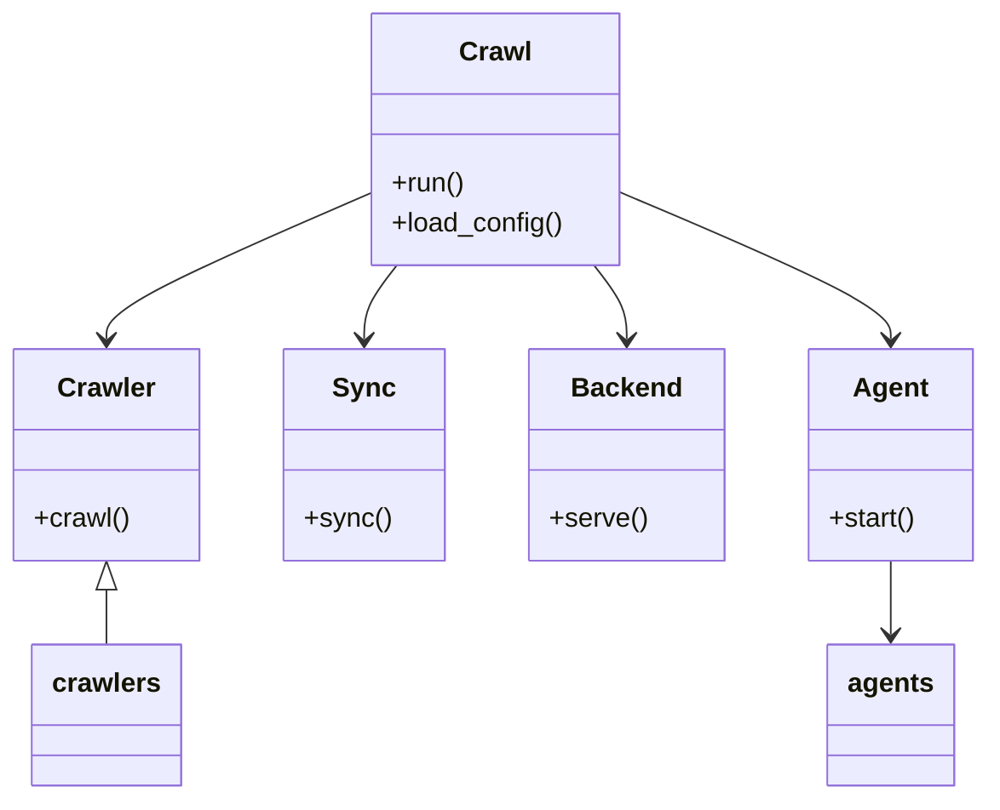
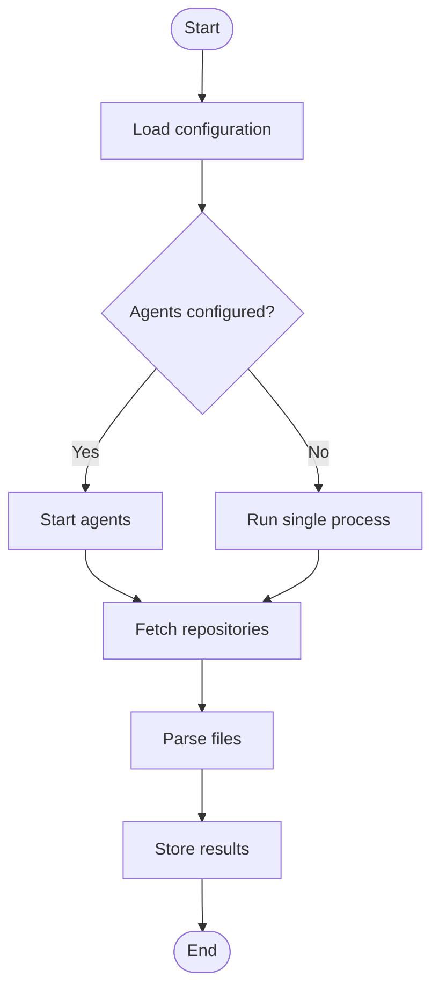

# Diagram: application_service/config/config.dev.yml

> Auto-generated by Obscura crawlers

## Diagram 1

### SVG

<svg id="container" width="575.46875" xmlns="http://www.w3.org/2000/svg" class="classDiagram" height="476" viewBox="0 0 575.46875 476" role="graphics-document document" aria-roledescription="class"><g><defs><marker id="container_class-aggregationStart" class="marker aggregation class" refX="18" refY="7" markerWidth="190" markerHeight="240" orient="auto"><path d="M 18,7 L9,13 L1,7 L9,1 Z"></path></marker></defs><defs><marker id="container_class-aggregationEnd" class="marker aggregation class" refX="1" refY="7" markerWidth="20" markerHeight="28" orient="auto"><path d="M 18,7 L9,13 L1,7 L9,1 Z"></path></marker></defs><defs><marker id="container_class-extensionStart" class="marker extension class" refX="18" refY="7" markerWidth="190" markerHeight="240" orient="auto"><path d="M 1,7 L18,13 V 1 Z"></path></marker></defs><defs><marker id="container_class-extensionEnd" class="marker extension class" refX="1" refY="7" markerWidth="20" markerHeight="28" orient="auto"><path d="M 1,1 V 13 L18,7 Z"></path></marker></defs><defs><marker id="container_class-compositionStart" class="marker composition class" refX="18" refY="7" markerWidth="190" markerHeight="240" orient="auto"><path d="M 18,7 L9,13 L1,7 L9,1 Z"></path></marker></defs><defs><marker id="container_class-compositionEnd" class="marker composition class" refX="1" refY="7" markerWidth="20" markerHeight="28" orient="auto"><path d="M 18,7 L9,13 L1,7 L9,1 Z"></path></marker></defs><defs><marker id="container_class-dependencyStart" class="marker dependency class" refX="6" refY="7" markerWidth="190" markerHeight="240" orient="auto"><path d="M 5,7 L9,13 L1,7 L9,1 Z"></path></marker></defs><defs><marker id="container_class-dependencyEnd" class="marker dependency class" refX="13" refY="7" markerWidth="20" markerHeight="28" orient="auto"><path d="M 18,7 L9,13 L14,7 L9,1 Z"></path></marker></defs><defs><marker id="container_class-lollipopStart" class="marker lollipop class" refX="13" refY="7" markerWidth="190" markerHeight="240" orient="auto"><circle stroke="black" fill="transparent" cx="7" cy="7" r="6"></circle></marker></defs><defs><marker id="container_class-lollipopEnd" class="marker lollipop class" refX="1" refY="7" markerWidth="190" markerHeight="240" orient="auto"><circle stroke="black" fill="transparent" cx="7" cy="7" r="6"></circle></marker></defs><g class="root"><g class="clusters"></g><g class="edgePaths"><path d="M214.871,115.349L189.404,126.624C163.938,137.9,113.004,160.45,87.537,174.892C62.07,189.333,62.07,195.667,62.07,198.833L62.07,202" id="id_Crawl_Crawler_1" class="edge-thickness-normal edge-pattern-solid relation" style=";;;" data-edge="true" data-et="edge" data-id="id_Crawl_Crawler_1" data-points="W3sieCI6MjE0Ljg3MTA5Mzc1LCJ5IjoxMTUuMzQ5Mjc4ODIxMjA5OTJ9LHsieCI6NjIuMDcwMzEyNSwieSI6MTgzfSx7IngiOjYyLjA3MDMxMjUsInkiOjIwOH1d" marker-end="url(#container_class-dependencyEnd)"></path><path d="M230.92,158L227.752,162.167C224.585,166.333,218.249,174.667,215.082,182C211.914,189.333,211.914,195.667,211.914,198.833L211.914,202" id="id_Crawl_Sync_2" class="edge-thickness-normal edge-pattern-solid relation" style=";;;" data-edge="true" data-et="edge" data-id="id_Crawl_Sync_2" data-points="W3sieCI6MjMwLjkxOTkyMTg3NSwieSI6MTU4fSx7IngiOjIxMS45MTQwNjI1LCJ5IjoxODN9LHsieCI6MjExLjkxNDA2MjUsInkiOjIwOH1d" marker-end="url(#container_class-dependencyEnd)"></path><path d="M344.955,158L348.123,162.167C351.29,166.333,357.626,174.667,360.793,182C363.961,189.333,363.961,195.667,363.961,198.833L363.961,202" id="id_Crawl_Backend_3" class="edge-thickness-normal edge-pattern-solid relation" style=";;;" data-edge="true" data-et="edge" data-id="id_Crawl_Backend_3" data-points="W3sieCI6MzQ0Ljk1NTA3ODEyNSwieSI6MTU4fSx7IngiOjM2My45NjA5Mzc1LCJ5IjoxODN9LHsieCI6MzYzLjk2MDkzNzUsInkiOjIwOH1d" marker-end="url(#container_class-dependencyEnd)"></path><path d="M361.004,114.642L387.312,126.035C413.62,137.428,466.236,160.214,492.544,174.774C518.852,189.333,518.852,195.667,518.852,198.833L518.852,202" id="id_Crawl_Agent_4" class="edge-thickness-normal edge-pattern-solid relation" style=";;;" data-edge="true" data-et="edge" data-id="id_Crawl_Agent_4" data-points="W3sieCI6MzYxLjAwMzkwNjI1LCJ5IjoxMTQuNjQyMjUwNTY2NzAxNjJ9LHsieCI6NTE4Ljg1MTU2MjUsInkiOjE4M30seyJ4Ijo1MTguODUxNTYyNSwieSI6MjA4fV0=" marker-end="url(#container_class-dependencyEnd)"></path><path d="M62.07,351.25L62.07,352.542C62.07,353.833,62.07,356.417,62.07,361.875C62.07,367.333,62.07,375.667,62.07,379.833L62.07,384" id="id_Crawler_crawlers_5" class="edge-thickness-normal edge-pattern-solid relation" style=";;;" data-edge="true" data-et="edge" data-id="id_Crawler_crawlers_5" data-points="W3sieCI6NjIuMDcwMzEyNSwieSI6MzM0fSx7IngiOjYyLjA3MDMxMjUsInkiOjM1OX0seyJ4Ijo2Mi4wNzAzMTI1LCJ5IjozODR9XQ==" marker-start="url(#container_class-extensionStart)"></path><path d="M518.852,334L518.852,338.167C518.852,342.333,518.852,350.667,518.852,358C518.852,365.333,518.852,371.667,518.852,374.833L518.852,378" id="id_Agent_agents_6" class="edge-thickness-normal edge-pattern-solid relation" style=";;;" data-edge="true" data-et="edge" data-id="id_Agent_agents_6" data-points="W3sieCI6NTE4Ljg1MTU2MjUsInkiOjMzNH0seyJ4Ijo1MTguODUxNTYyNSwieSI6MzU5fSx7IngiOjUxOC44NTE1NjI1LCJ5IjozODR9XQ==" marker-end="url(#container_class-dependencyEnd)"></path></g><g class="edgeLabels"><g class="edgeLabel"><g class="label" data-id="id_Crawl_Crawler_1" transform="translate(0, 0)"><foreignObject width="0" height="0">

</foreignObject></g></g><g class="edgeLabel"><g class="label" data-id="id_Crawl_Sync_2" transform="translate(0, 0)"><foreignObject width="0" height="0">

</foreignObject></g></g><g class="edgeLabel"><g class="label" data-id="id_Crawl_Backend_3" transform="translate(0, 0)"><foreignObject width="0" height="0">

</foreignObject></g></g><g class="edgeLabel"><g class="label" data-id="id_Crawl_Agent_4" transform="translate(0, 0)"><foreignObject width="0" height="0">

</foreignObject></g></g><g class="edgeLabel"><g class="label" data-id="id_Crawler_crawlers_5" transform="translate(0, 0)"><foreignObject width="0" height="0">

</foreignObject></g></g><g class="edgeLabel"><g class="label" data-id="id_Agent_agents_6" transform="translate(0, 0)"><foreignObject width="0" height="0">

</foreignObject></g></g></g><g class="nodes"><g class="node default" id="classId-Crawl-0" transform="translate(287.9375, 83)"><g class="basic label-container"><path d="M-73.06640625 -75 L73.06640625 -75 L73.06640625 75 L-73.06640625 75" stroke="none" stroke-width="0" fill="#ECECFF" style=""></path><path d="M-73.06640625 -75 C-26.38925402063301 -75, 20.287898208733978 -75, 73.06640625 -75 M-73.06640625 -75 C-21.414719327316718 -75, 30.236967595366565 -75, 73.06640625 -75 M73.06640625 -75 C73.06640625 -43.32667679648641, 73.06640625 -11.65335359297282, 73.06640625 75 M73.06640625 -75 C73.06640625 -30.786977426555545, 73.06640625 13.42604514688891, 73.06640625 75 M73.06640625 75 C31.00271265453931 75, -11.060980940921382 75, -73.06640625 75 M73.06640625 75 C22.664323929456827 75, -27.737758391086345 75, -73.06640625 75 M-73.06640625 75 C-73.06640625 33.33410004013959, -73.06640625 -8.331799919720822, -73.06640625 -75 M-73.06640625 75 C-73.06640625 25.667644937721228, -73.06640625 -23.664710124557544, -73.06640625 -75" stroke="#9370DB" stroke-width="1.3" fill="none" stroke-dasharray="0 0" style=""></path></g><g class="annotation-group text" transform="translate(0, -51)"></g><g class="label-group text" transform="translate(-20.1484375, -51)"><g class="label" style="font-weight: bolder" transform="translate(0,-12)"><foreignObject width="40.296875" height="24">

Crawl

</foreignObject></g></g><g class="members-group text" transform="translate(-61.06640625, -3)"></g><g class="methods-group text" transform="translate(-61.06640625, 27)"><g class="label" style="" transform="translate(0,-12)"><foreignObject width="43.21875" height="24">

+run()

</foreignObject></g><g class="label" style="" transform="translate(0,12)"><foreignObject width="101.984375" height="24">

+load_config()

</foreignObject></g></g><g class="divider" style=""><path d="M-73.06640625 -27 C-33.80959149568506 -27, 5.447223258629876 -27, 73.06640625 -27 M-73.06640625 -27 C-32.37664295805566 -27, 8.313120333888676 -27, 73.06640625 -27" stroke="#9370DB" stroke-width="1.3" fill="none" stroke-dasharray="0 0" style=""></path></g><g class="divider" style=""><path d="M-73.06640625 -3 C-27.0632388297564 -3, 18.9399285904872 -3, 73.06640625 -3 M-73.06640625 -3 C-38.47931551988166 -3, -3.8922247897633184 -3, 73.06640625 -3" stroke="#9370DB" stroke-width="1.3" fill="none" stroke-dasharray="0 0" style=""></path></g></g><g class="node default" id="classId-Crawler-1" transform="translate(62.0703125, 271)"><g class="basic label-container"><path d="M-54.0703125 -63 L54.0703125 -63 L54.0703125 63 L-54.0703125 63" stroke="none" stroke-width="0" fill="#ECECFF" style=""></path><path d="M-54.0703125 -63 C-13.999578264653955 -63, 26.07115597069209 -63, 54.0703125 -63 M-54.0703125 -63 C-25.452707532292987 -63, 3.1648974354140265 -63, 54.0703125 -63 M54.0703125 -63 C54.0703125 -27.463355213939145, 54.0703125 8.073289572121709, 54.0703125 63 M54.0703125 -63 C54.0703125 -26.774206283351603, 54.0703125 9.451587433296794, 54.0703125 63 M54.0703125 63 C20.20621606471292 63, -13.657880370574162 63, -54.0703125 63 M54.0703125 63 C30.160722570822667 63, 6.251132641645334 63, -54.0703125 63 M-54.0703125 63 C-54.0703125 22.604228847802574, -54.0703125 -17.791542304394852, -54.0703125 -63 M-54.0703125 63 C-54.0703125 33.846392223710126, -54.0703125 4.6927844474202445, -54.0703125 -63" stroke="#9370DB" stroke-width="1.3" fill="none" stroke-dasharray="0 0" style=""></path></g><g class="annotation-group text" transform="translate(0, -39)"></g><g class="label-group text" transform="translate(-27.734375, -39)"><g class="label" style="font-weight: bolder" transform="translate(0,-12)"><foreignObject width="55.46875" height="24">

Crawler

</foreignObject></g></g><g class="members-group text" transform="translate(-42.0703125, 9)"></g><g class="methods-group text" transform="translate(-42.0703125, 39)"><g class="label" style="" transform="translate(0,-12)"><foreignObject width="56.40625" height="24">

+crawl()

</foreignObject></g></g><g class="divider" style=""><path d="M-54.0703125 -15 C-25.1469733102085 -15, 3.776365879582997 -15, 54.0703125 -15 M-54.0703125 -15 C-13.30746694154589 -15, 27.45537861690822 -15, 54.0703125 -15" stroke="#9370DB" stroke-width="1.3" fill="none" stroke-dasharray="0 0" style=""></path></g><g class="divider" style=""><path d="M-54.0703125 9 C-19.257103128294915 9, 15.55610624341017 9, 54.0703125 9 M-54.0703125 9 C-23.891409603910514 9, 6.287493292178972 9, 54.0703125 9" stroke="#9370DB" stroke-width="1.3" fill="none" stroke-dasharray="0 0" style=""></path></g></g><g class="node default" id="classId-Sync-2" transform="translate(211.9140625, 271)"><g class="basic label-container"><path d="M-45.7734375 -63 L45.7734375 -63 L45.7734375 63 L-45.7734375 63" stroke="none" stroke-width="0" fill="#ECECFF" style=""></path><path d="M-45.7734375 -63 C-11.224994540719607 -63, 23.323448418560787 -63, 45.7734375 -63 M-45.7734375 -63 C-17.239188927226376 -63, 11.295059645547248 -63, 45.7734375 -63 M45.7734375 -63 C45.7734375 -35.408323557840895, 45.7734375 -7.816647115681789, 45.7734375 63 M45.7734375 -63 C45.7734375 -18.42494833040672, 45.7734375 26.150103339186558, 45.7734375 63 M45.7734375 63 C25.55060064434729 63, 5.327763788694583 63, -45.7734375 63 M45.7734375 63 C16.081396914690266 63, -13.610643670619467 63, -45.7734375 63 M-45.7734375 63 C-45.7734375 26.751156685359675, -45.7734375 -9.49768662928065, -45.7734375 -63 M-45.7734375 63 C-45.7734375 17.4851606522518, -45.7734375 -28.0296786954964, -45.7734375 -63" stroke="#9370DB" stroke-width="1.3" fill="none" stroke-dasharray="0 0" style=""></path></g><g class="annotation-group text" transform="translate(0, -39)"></g><g class="label-group text" transform="translate(-17.09375, -39)"><g class="label" style="font-weight: bolder" transform="translate(0,-12)"><foreignObject width="34.1875" height="24">

Sync

</foreignObject></g></g><g class="members-group text" transform="translate(-33.7734375, 9)"></g><g class="methods-group text" transform="translate(-33.7734375, 39)"><g class="label" style="" transform="translate(0,-12)"><foreignObject width="50.453125" height="24">

+sync()

</foreignObject></g></g><g class="divider" style=""><path d="M-45.7734375 -15 C-16.45964447597396 -15, 12.85414854805208 -15, 45.7734375 -15 M-45.7734375 -15 C-12.32875609318787 -15, 21.11592531362426 -15, 45.7734375 -15" stroke="#9370DB" stroke-width="1.3" fill="none" stroke-dasharray="0 0" style=""></path></g><g class="divider" style=""><path d="M-45.7734375 9 C-15.234930748403514 9, 15.303576003192973 9, 45.7734375 9 M-45.7734375 9 C-18.303236192928765 9, 9.16696511414247 9, 45.7734375 9" stroke="#9370DB" stroke-width="1.3" fill="none" stroke-dasharray="0 0" style=""></path></g></g><g class="node default" id="classId-Backend-3" transform="translate(363.9609375, 271)"><g class="basic label-container"><path d="M-56.2734375 -63 L56.2734375 -63 L56.2734375 63 L-56.2734375 63" stroke="none" stroke-width="0" fill="#ECECFF" style=""></path><path d="M-56.2734375 -63 C-25.837554771909904 -63, 4.598327956180192 -63, 56.2734375 -63 M-56.2734375 -63 C-29.765534316591655 -63, -3.2576311331833097 -63, 56.2734375 -63 M56.2734375 -63 C56.2734375 -20.075372041292418, 56.2734375 22.849255917415164, 56.2734375 63 M56.2734375 -63 C56.2734375 -18.730118602488588, 56.2734375 25.539762795022824, 56.2734375 63 M56.2734375 63 C12.654856199744628 63, -30.963725100510743 63, -56.2734375 63 M56.2734375 63 C29.983949628753567 63, 3.694461757507135 63, -56.2734375 63 M-56.2734375 63 C-56.2734375 24.542325401520593, -56.2734375 -13.915349196958815, -56.2734375 -63 M-56.2734375 63 C-56.2734375 26.528413432685625, -56.2734375 -9.94317313462875, -56.2734375 -63" stroke="#9370DB" stroke-width="1.3" fill="none" stroke-dasharray="0 0" style=""></path></g><g class="annotation-group text" transform="translate(0, -39)"></g><g class="label-group text" transform="translate(-31.296875, -39)"><g class="label" style="font-weight: bolder" transform="translate(0,-12)"><foreignObject width="62.59375" height="24">

Backend

</foreignObject></g></g><g class="members-group text" transform="translate(-44.2734375, 9)"></g><g class="methods-group text" transform="translate(-44.2734375, 39)"><g class="label" style="" transform="translate(0,-12)"><foreignObject width="57.25" height="24">

+serve()

</foreignObject></g></g><g class="divider" style=""><path d="M-56.2734375 -15 C-28.393314180407042 -15, -0.5131908608140847 -15, 56.2734375 -15 M-56.2734375 -15 C-33.647871855358595 -15, -11.02230621071719 -15, 56.2734375 -15" stroke="#9370DB" stroke-width="1.3" fill="none" stroke-dasharray="0 0" style=""></path></g><g class="divider" style=""><path d="M-56.2734375 9 C-20.89886764764063 9, 14.475702204718743 9, 56.2734375 9 M-56.2734375 9 C-22.157912014168488 9, 11.957613471663024 9, 56.2734375 9" stroke="#9370DB" stroke-width="1.3" fill="none" stroke-dasharray="0 0" style=""></path></g></g><g class="node default" id="classId-Agent-4" transform="translate(518.8515625, 271)"><g class="basic label-container"><path d="M-48.6171875 -63 L48.6171875 -63 L48.6171875 63 L-48.6171875 63" stroke="none" stroke-width="0" fill="#ECECFF" style=""></path><path d="M-48.6171875 -63 C-13.809878729530183 -63, 20.997430040939633 -63, 48.6171875 -63 M-48.6171875 -63 C-19.290086269351416 -63, 10.037014961297167 -63, 48.6171875 -63 M48.6171875 -63 C48.6171875 -34.993222545658426, 48.6171875 -6.98644509131686, 48.6171875 63 M48.6171875 -63 C48.6171875 -23.257988262738643, 48.6171875 16.484023474522715, 48.6171875 63 M48.6171875 63 C21.603391009125115 63, -5.41040548174977 63, -48.6171875 63 M48.6171875 63 C19.706589539972157 63, -9.204008420055686 63, -48.6171875 63 M-48.6171875 63 C-48.6171875 14.150283054902154, -48.6171875 -34.69943389019569, -48.6171875 -63 M-48.6171875 63 C-48.6171875 30.0081077253559, -48.6171875 -2.9837845492882025, -48.6171875 -63" stroke="#9370DB" stroke-width="1.3" fill="none" stroke-dasharray="0 0" style=""></path></g><g class="annotation-group text" transform="translate(0, -39)"></g><g class="label-group text" transform="translate(-21.078125, -39)"><g class="label" style="font-weight: bolder" transform="translate(0,-12)"><foreignObject width="42.15625" height="24">

Agent

</foreignObject></g></g><g class="members-group text" transform="translate(-36.6171875, 9)"></g><g class="methods-group text" transform="translate(-36.6171875, 39)"><g class="label" style="" transform="translate(0,-12)"><foreignObject width="52.15625" height="24">

+start()

</foreignObject></g></g><g class="divider" style=""><path d="M-48.6171875 -15 C-18.121810126457007 -15, 12.373567247085987 -15, 48.6171875 -15 M-48.6171875 -15 C-13.783128660224719 -15, 21.050930179550562 -15, 48.6171875 -15" stroke="#9370DB" stroke-width="1.3" fill="none" stroke-dasharray="0 0" style=""></path></g><g class="divider" style=""><path d="M-48.6171875 9 C-11.09544473807086 9, 26.42629802385828 9, 48.6171875 9 M-48.6171875 9 C-15.137880264846203 9, 18.341426970307595 9, 48.6171875 9" stroke="#9370DB" stroke-width="1.3" fill="none" stroke-dasharray="0 0" style=""></path></g></g><g class="node default" id="classId-crawlers-5" transform="translate(62.0703125, 426)"><g class="basic label-container"><path d="M-42.828125 -42 L42.828125 -42 L42.828125 42 L-42.828125 42" stroke="none" stroke-width="0" fill="#ECECFF" style=""></path><path d="M-42.828125 -42 C-16.206340691392924 -42, 10.415443617214152 -42, 42.828125 -42 M-42.828125 -42 C-19.84411160459558 -42, 3.1399017908088425 -42, 42.828125 -42 M42.828125 -42 C42.828125 -9.776370538672722, 42.828125 22.447258922654555, 42.828125 42 M42.828125 -42 C42.828125 -22.750000774195364, 42.828125 -3.5000015483907276, 42.828125 42 M42.828125 42 C15.272874570004891 42, -12.282375859990218 42, -42.828125 42 M42.828125 42 C13.841763330263266 42, -15.144598339473468 42, -42.828125 42 M-42.828125 42 C-42.828125 8.624379823666757, -42.828125 -24.751240352666485, -42.828125 -42 M-42.828125 42 C-42.828125 19.69001068788012, -42.828125 -2.6199786242397565, -42.828125 -42" stroke="#9370DB" stroke-width="1.3" fill="none" stroke-dasharray="0 0" style=""></path></g><g class="annotation-group text" transform="translate(0, -18)"></g><g class="label-group text" transform="translate(-30.828125, -18)"><g class="label" style="font-weight: bolder" transform="translate(0,-12)"><foreignObject width="61.65625" height="24">

crawlers

</foreignObject></g></g><g class="members-group text" transform="translate(-30.828125, 30)"></g><g class="methods-group text" transform="translate(-30.828125, 60)"></g><g class="divider" style=""><path d="M-42.828125 6 C-22.833852228693928 6, -2.839579457387856 6, 42.828125 6 M-42.828125 6 C-14.863591693164242 6, 13.100941613671516 6, 42.828125 6" stroke="#9370DB" stroke-width="1.3" fill="none" stroke-dasharray="0 0" style=""></path></g><g class="divider" style=""><path d="M-42.828125 24 C-11.908280562015186 24, 19.011563875969628 24, 42.828125 24 M-42.828125 24 C-11.470061495193107 24, 19.888002009613786 24, 42.828125 24" stroke="#9370DB" stroke-width="1.3" fill="none" stroke-dasharray="0 0" style=""></path></g></g><g class="node default" id="classId-agents-6" transform="translate(518.8515625, 426)"><g class="basic label-container"><path d="M-36.5234375 -42 L36.5234375 -42 L36.5234375 42 L-36.5234375 42" stroke="none" stroke-width="0" fill="#ECECFF" style=""></path><path d="M-36.5234375 -42 C-14.338444129305337 -42, 7.846549241389326 -42, 36.5234375 -42 M-36.5234375 -42 C-16.352589342928844 -42, 3.818258814142311 -42, 36.5234375 -42 M36.5234375 -42 C36.5234375 -9.117675380618714, 36.5234375 23.764649238762573, 36.5234375 42 M36.5234375 -42 C36.5234375 -18.89767252812523, 36.5234375 4.204654943749539, 36.5234375 42 M36.5234375 42 C16.604774864922437 42, -3.3138877701551266 42, -36.5234375 42 M36.5234375 42 C16.46525043636111 42, -3.59293662727778 42, -36.5234375 42 M-36.5234375 42 C-36.5234375 22.834450502660964, -36.5234375 3.6689010053219278, -36.5234375 -42 M-36.5234375 42 C-36.5234375 13.266501578216797, -36.5234375 -15.466996843566406, -36.5234375 -42" stroke="#9370DB" stroke-width="1.3" fill="none" stroke-dasharray="0 0" style=""></path></g><g class="annotation-group text" transform="translate(0, -18)"></g><g class="label-group text" transform="translate(-24.5234375, -18)"><g class="label" style="font-weight: bolder" transform="translate(0,-12)"><foreignObject width="49.046875" height="24">

agents

</foreignObject></g></g><g class="members-group text" transform="translate(-24.5234375, 30)"></g><g class="methods-group text" transform="translate(-24.5234375, 60)"></g><g class="divider" style=""><path d="M-36.5234375 6 C-21.230601169714504 6, -5.937764839429008 6, 36.5234375 6 M-36.5234375 6 C-15.97094373171931 6, 4.5815500365613815 6, 36.5234375 6" stroke="#9370DB" stroke-width="1.3" fill="none" stroke-dasharray="0 0" style=""></path></g><g class="divider" style=""><path d="M-36.5234375 24 C-9.903132136567617 24, 16.717173226864766 24, 36.5234375 24 M-36.5234375 24 C-17.184056390576178 24, 2.1553247188476448 24, 36.5234375 24" stroke="#9370DB" stroke-width="1.3" fill="none" stroke-dasharray="0 0" style=""></path></g></g></g></g></g></svg>

## Diagram 2

### SVG

<svg id="container" width="408.46875" xmlns="http://www.w3.org/2000/svg" class="flowchart" height="928.875" viewBox="0 0 408.46875 928.875" role="graphics-document document" aria-roledescription="flowchart-v2"><g><marker id="container_flowchart-v2-pointEnd" class="marker flowchart-v2" viewBox="0 0 10 10" refX="5" refY="5" markerUnits="userSpaceOnUse" markerWidth="8" markerHeight="8" orient="auto"><path d="M 0 0 L 10 5 L 0 10 z" class="arrowMarkerPath" style="stroke-width: 1; stroke-dasharray: 1, 0;"></path></marker><marker id="container_flowchart-v2-pointStart" class="marker flowchart-v2" viewBox="0 0 10 10" refX="4.5" refY="5" markerUnits="userSpaceOnUse" markerWidth="8" markerHeight="8" orient="auto"><path d="M 0 5 L 10 10 L 10 0 z" class="arrowMarkerPath" style="stroke-width: 1; stroke-dasharray: 1, 0;"></path></marker><marker id="container_flowchart-v2-circleEnd" class="marker flowchart-v2" viewBox="0 0 10 10" refX="11" refY="5" markerUnits="userSpaceOnUse" markerWidth="11" markerHeight="11" orient="auto"><circle cx="5" cy="5" r="5" class="arrowMarkerPath" style="stroke-width: 1; stroke-dasharray: 1, 0;"></circle></marker><marker id="container_flowchart-v2-circleStart" class="marker flowchart-v2" viewBox="0 0 10 10" refX="-1" refY="5" markerUnits="userSpaceOnUse" markerWidth="11" markerHeight="11" orient="auto"><circle cx="5" cy="5" r="5" class="arrowMarkerPath" style="stroke-width: 1; stroke-dasharray: 1, 0;"></circle></marker><marker id="container_flowchart-v2-crossEnd" class="marker cross flowchart-v2" viewBox="0 0 11 11" refX="12" refY="5.2" markerUnits="userSpaceOnUse" markerWidth="11" markerHeight="11" orient="auto"><path d="M 1,1 l 9,9 M 10,1 l -9,9" class="arrowMarkerPath" style="stroke-width: 2; stroke-dasharray: 1, 0;"></path></marker><marker id="container_flowchart-v2-crossStart" class="marker cross flowchart-v2" viewBox="0 0 11 11" refX="-1" refY="5.2" markerUnits="userSpaceOnUse" markerWidth="11" markerHeight="11" orient="auto"><path d="M 1,1 l 9,9 M 10,1 l -9,9" class="arrowMarkerPath" style="stroke-width: 2; stroke-dasharray: 1, 0;"></path></marker><g class="root"><g class="clusters"></g><g class="edgePaths"><path d="M192.734,47.5L192.651,51.583C192.568,55.667,192.401,63.833,192.318,71.417C192.234,79,192.234,86,192.234,89.5L192.234,93" id="L_Start_LoadConfig_0" class="edge-thickness-normal edge-pattern-solid edge-thickness-normal edge-pattern-solid flowchart-link" style=";" data-edge="true" data-et="edge" data-id="L_Start_LoadConfig_0" data-points="W3sieCI6MTkyLjczNDM3NSwieSI6NDcuNX0seyJ4IjoxOTIuMjM0Mzc1LCJ5Ijo3Mn0seyJ4IjoxOTIuMjM0Mzc1LCJ5Ijo5N31d" marker-end="url(#container_flowchart-v2-pointEnd)"></path><path d="M192.234,151L192.234,155.167C192.234,159.333,192.234,167.667,192.234,175.333C192.234,183,192.234,190,192.234,193.5L192.234,197" id="L_LoadConfig_CheckAgents_0" class="edge-thickness-normal edge-pattern-solid edge-thickness-normal edge-pattern-solid flowchart-link" style=";" data-edge="true" data-et="edge" data-id="L_LoadConfig_CheckAgents_0" data-points="W3sieCI6MTkyLjIzNDM3NSwieSI6MTUxfSx7IngiOjE5Mi4yMzQzNzUsInkiOjE3Nn0seyJ4IjoxOTIuMjM0Mzc1LCJ5IjoyMDF9XQ==" marker-end="url(#container_flowchart-v2-pointEnd)"></path><path d="M148.8,348.44L137.603,361.846C126.405,375.252,104.011,402.063,92.814,420.969C81.617,439.875,81.617,450.875,81.617,456.375L81.617,461.875" id="L_CheckAgents_StartAgents_0" class="edge-thickness-normal edge-pattern-solid edge-thickness-normal edge-pattern-solid flowchart-link" style=";" data-edge="true" data-et="edge" data-id="L_CheckAgents_StartAgents_0" data-points="W3sieCI6MTQ4Ljc5OTU5MTA4MTEyODg1LCJ5IjozNDguNDQwMjE2MDgxMTI4OX0seyJ4Ijo4MS42MTcxODc1LCJ5Ijo0MjguODc1fSx7IngiOjgxLjYxNzE4NzUsInkiOjQ2NS44NzV9XQ==" marker-end="url(#container_flowchart-v2-pointEnd)"></path><path d="M235.669,348.44L246.866,361.846C258.063,375.252,280.457,402.063,291.654,420.969C302.852,439.875,302.852,450.875,302.852,456.375L302.852,461.875" id="L_CheckAgents_SingleProcess_0" class="edge-thickness-normal edge-pattern-solid edge-thickness-normal edge-pattern-solid flowchart-link" style=";" data-edge="true" data-et="edge" data-id="L_CheckAgents_SingleProcess_0" data-points="W3sieCI6MjM1LjY2OTE1ODkxODg3MTE1LCJ5IjozNDguNDQwMjE2MDgxMTI4OX0seyJ4IjozMDIuODUxNTYyNSwieSI6NDI4Ljg3NX0seyJ4IjozMDIuODUxNTYyNSwieSI6NDY1Ljg3NX1d" marker-end="url(#container_flowchart-v2-pointEnd)"></path><path d="M81.617,519.875L81.617,524.042C81.617,528.208,81.617,536.542,89.877,544.591C98.138,552.641,114.658,560.407,122.918,564.29L131.179,568.173" id="L_StartAgents_Fetch_0" class="edge-thickness-normal edge-pattern-solid edge-thickness-normal edge-pattern-solid flowchart-link" style=";" data-edge="true" data-et="edge" data-id="L_StartAgents_Fetch_0" data-points="W3sieCI6ODEuNjE3MTg3NSwieSI6NTE5Ljg3NX0seyJ4Ijo4MS42MTcxODc1LCJ5Ijo1NDQuODc1fSx7IngiOjEzNC43OTg1Mjc2NDQyMzA3NywieSI6NTY5Ljg3NX1d" marker-end="url(#container_flowchart-v2-pointEnd)"></path><path d="M302.852,519.875L302.852,524.042C302.852,528.208,302.852,536.542,294.591,544.591C286.331,552.641,269.811,560.407,261.55,564.29L253.29,568.173" id="L_SingleProcess_Fetch_0" class="edge-thickness-normal edge-pattern-solid edge-thickness-normal edge-pattern-solid flowchart-link" style=";" data-edge="true" data-et="edge" data-id="L_SingleProcess_Fetch_0" data-points="W3sieCI6MzAyLjg1MTU2MjUsInkiOjUxOS44NzV9LHsieCI6MzAyLjg1MTU2MjUsInkiOjU0NC44NzV9LHsieCI6MjQ5LjY3MDIyMjM1NTc2OTIzLCJ5Ijo1NjkuODc1fV0=" marker-end="url(#container_flowchart-v2-pointEnd)"></path><path d="M192.234,623.875L192.234,628.042C192.234,632.208,192.234,640.542,192.234,648.208C192.234,655.875,192.234,662.875,192.234,666.375L192.234,669.875" id="L_Fetch_Parse_0" class="edge-thickness-normal edge-pattern-solid edge-thickness-normal edge-pattern-solid flowchart-link" style=";" data-edge="true" data-et="edge" data-id="L_Fetch_Parse_0" data-points="W3sieCI6MTkyLjIzNDM3NSwieSI6NjIzLjg3NX0seyJ4IjoxOTIuMjM0Mzc1LCJ5Ijo2NDguODc1fSx7IngiOjE5Mi4yMzQzNzUsInkiOjY3My44NzV9XQ==" marker-end="url(#container_flowchart-v2-pointEnd)"></path><path d="M192.234,727.875L192.234,732.042C192.234,736.208,192.234,744.542,192.234,752.208C192.234,759.875,192.234,766.875,192.234,770.375L192.234,773.875" id="L_Parse_Store_0" class="edge-thickness-normal edge-pattern-solid edge-thickness-normal edge-pattern-solid flowchart-link" style=";" data-edge="true" data-et="edge" data-id="L_Parse_Store_0" data-points="W3sieCI6MTkyLjIzNDM3NSwieSI6NzI3Ljg3NX0seyJ4IjoxOTIuMjM0Mzc1LCJ5Ijo3NTIuODc1fSx7IngiOjE5Mi4yMzQzNzUsInkiOjc3Ny44NzV9XQ==" marker-end="url(#container_flowchart-v2-pointEnd)"></path><path d="M192.234,831.875L192.234,836.042C192.234,840.208,192.234,848.542,192.305,856.292C192.375,864.042,192.515,871.209,192.586,874.792L192.656,878.376" id="L_Store_End_0" class="edge-thickness-normal edge-pattern-solid edge-thickness-normal edge-pattern-solid flowchart-link" style=";" data-edge="true" data-et="edge" data-id="L_Store_End_0" data-points="W3sieCI6MTkyLjIzNDM3NSwieSI6ODMxLjg3NX0seyJ4IjoxOTIuMjM0Mzc1LCJ5Ijo4NTYuODc1fSx7IngiOjE5Mi43MzQzNzUsInkiOjg4Mi4zNzV9XQ==" marker-end="url(#container_flowchart-v2-pointEnd)"></path></g><g class="edgeLabels"><g class="edgeLabel"><g class="label" data-id="L_Start_LoadConfig_0" transform="translate(0, 0)"><foreignObject width="0" height="0">

</foreignObject></g></g><g class="edgeLabel"><g class="label" data-id="L_LoadConfig_CheckAgents_0" transform="translate(0, 0)"><foreignObject width="0" height="0">

</foreignObject></g></g><g class="edgeLabel" transform="translate(81.6171875, 428.875)"><g class="label" data-id="L_CheckAgents_StartAgents_0" transform="translate(-12.03125, -12)"><foreignObject width="24.0625" height="24">

Yes

</foreignObject></g></g><g class="edgeLabel" transform="translate(302.8515625, 428.875)"><g class="label" data-id="L_CheckAgents_SingleProcess_0" transform="translate(-10.140625, -12)"><foreignObject width="20.28125" height="24">

No

</foreignObject></g></g><g class="edgeLabel"><g class="label" data-id="L_StartAgents_Fetch_0" transform="translate(0, 0)"><foreignObject width="0" height="0">

</foreignObject></g></g><g class="edgeLabel"><g class="label" data-id="L_SingleProcess_Fetch_0" transform="translate(0, 0)"><foreignObject width="0" height="0">

</foreignObject></g></g><g class="edgeLabel"><g class="label" data-id="L_Fetch_Parse_0" transform="translate(0, 0)"><foreignObject width="0" height="0">

</foreignObject></g></g><g class="edgeLabel"><g class="label" data-id="L_Parse_Store_0" transform="translate(0, 0)"><foreignObject width="0" height="0">

</foreignObject></g></g><g class="edgeLabel"><g class="label" data-id="L_Store_End_0" transform="translate(0, 0)"><foreignObject width="0" height="0">

</foreignObject></g></g></g><g class="nodes"><g class="node default" id="flowchart-Start-0" transform="translate(192.234375, 27.5)"><g class="basic label-container outer-path"><path d="M-10.3984375 -19.5 C-5.81938432147645 -19.5, -1.2403311429529005 -19.5, 10.3984375 -19.5 C10.3984375 -19.5, 10.398437499999998 -19.5, 10.398437499999998 -19.5 C10.888459823041883 -19.484285937870638, 11.378482146083767 -19.468571875741276, 11.6478067896239 -19.45993515863156 C11.937846256497265 -19.43195540008578, 12.227885723370632 -19.403975641539997, 12.892042152847864 -19.3399052695533 C13.342801562238623 -19.26702998393443, 13.79356097162938 -19.19415469831556, 14.126030759676757 -19.140403561325776 C14.414163004025784 -19.074639256791723, 14.702295248374812 -19.008874952257667, 15.34470188623539 -18.862249829261074 C15.724502859553432 -18.749526893996272, 16.104303832871473 -18.63680395873147, 16.543047751460602 -18.50658706670804 C16.802892398326534 -18.410961834683793, 17.06273704519247 -18.315336602659542, 17.716144095147794 -18.074876768247425 C18.14586299313535 -17.884652959266536, 18.575581891122905 -17.694429150285647, 18.85917041279238 -17.568892924097174 C19.249679335604558 -17.365164669198965, 19.64018825841674 -17.161436414300756, 19.967429764076783 -16.990714730406097 C20.37277802199928 -16.744990234362707, 20.778126279921775 -16.499265738319316, 21.036368073605697 -16.342718045390892 C21.246687218139243 -16.196008514733318, 21.457006362672793 -16.049298984075744, 22.061592844578712 -15.627565626425154 C22.370085554512873 -15.381550899588442, 22.678578264447033 -15.13553617275173, 23.03889120850187 -14.848196188198123 C23.385075707444297 -14.533800585798526, 23.731260206386725 -14.219404983398928, 23.964247236767985 -14.007812326905688 C24.178854326195605 -13.786212887501948, 24.393461415623225 -13.56461344809821, 24.833858442968648 -13.10986736009568 C25.056607559400057 -12.848213573151563, 25.279356675831465 -12.586559786207445, 25.644151408126582 -12.158051136245305 C25.870198102549125 -11.855169158996603, 26.096244796971668 -11.552287181747898, 26.391796464640635 -11.156274872382312 C26.581892734522683 -10.86423595384763, 26.771989004404734 -10.572197035312946, 27.073721378604247 -10.108655082055241 C27.22129605082353 -9.846621307973923, 27.368870723042807 -9.584587533892606, 27.6871239742735 -9.019496659696287 C27.80722328154745 -8.770107878428414, 27.9273225888214 -8.520719097160539, 28.22948364880834 -7.893275190886684 C28.39943605019571 -7.473489473653733, 28.56938845158308 -7.0537037564207825, 28.698571729970325 -6.734618561215508 C28.83098122002947 -6.335822273744628, 28.963390710088618 -5.937025986273748, 29.09246063421488 -5.548287939305138 C29.170746121655185 -5.249751446550374, 29.24903160909549 -4.951214953795611, 29.40953178754556 -4.339158212148133 C29.486334782721578 -3.9447910642380566, 29.563137777897598 -3.55042391632798, 29.648482276581777 -3.1121979531509023 C29.687682338216508 -2.8081700160396634, 29.726882399851238 -2.504142078928425, 29.808330202509367 -1.872449005199798 C29.834972765475275 -1.457469581516016, 29.861615328441182 -1.0424901578322339, 29.888418715913414 -0.6250057626472757 C29.888418715913414 -0.18023700817750027, 29.888418715913414 0.26453174629227516, 29.888418715913414 0.625005762647271 C29.86999437769614 0.9119797022394212, 29.85157003947887 1.1989536418315714, 29.808330202509367 1.8724490051997846 C29.74807389317727 2.3397850414253787, 29.687817583845174 2.8071210776509727, 29.648482276581777 3.1121979531508885 C29.55304298963163 3.6022585205394537, 29.457603702681485 4.0923190879280185, 29.40953178754556 4.339158212148129 C29.342624143867695 4.594306055448026, 29.275716500189834 4.849453898747923, 29.092460634214884 5.548287939305125 C28.96041548517861 5.945986889664969, 28.82837033614234 6.343685840024811, 28.69857172997033 6.734618561215495 C28.5347298100204 7.139311271159843, 28.370887890070474 7.544003981104192, 28.229483648808344 7.893275190886679 C28.114328374606952 8.132397581694024, 27.99917310040556 8.37151997250137, 27.687123974273504 9.019496659696284 C27.55058976882005 9.26192696706639, 27.414055563366595 9.504357274436497, 27.07372137860425 10.108655082055236 C26.923487315795352 10.33945494602419, 26.773253252986454 10.570254809993145, 26.39179646464064 11.156274872382301 C26.10305172901682 11.543166512931661, 25.814306993392997 11.93005815348102, 25.644151408126582 12.158051136245302 C25.3479156736475 12.50602648625524, 25.05167993916842 12.85400183626518, 24.83385844296866 13.10986736009567 C24.513148921749416 13.441026271495916, 24.192439400530173 13.772185182896163, 23.96424723676799 14.007812326905684 C23.72689643548743 14.223368044670618, 23.48954563420687 14.438923762435552, 23.038891208501887 14.848196188198111 C22.82475814703027 15.018961606401644, 22.610625085558656 15.18972702460518, 22.061592844578715 15.627565626425152 C21.656470209967136 15.910161638853994, 21.251347575355556 16.192757651282836, 21.036368073605708 16.34271804539089 C20.646444054098385 16.579092277464113, 20.25652003459106 16.815466509537337, 19.967429764076787 16.990714730406093 C19.69029538345662 17.135295559262595, 19.413161002836446 17.279876388119092, 18.859170412792388 17.56889292409717 C18.461723833952465 17.744830734715737, 18.064277255112543 17.920768545334305, 17.716144095147804 18.07487676824742 C17.27833373413256 18.235995028175644, 16.840523373117314 18.397113288103867, 16.543047751460616 18.506587066708033 C16.088793952284174 18.641407209876753, 15.634540153107734 18.776227353045474, 15.344701886235413 18.86224982926107 C14.882228019157921 18.967806471497486, 14.41975415208043 19.0733631137339, 14.126030759676766 19.140403561325773 C13.806192678143413 19.19211250196672, 13.486354596610061 19.243821442607665, 12.892042152847878 19.3399052695533 C12.592226169803304 19.368828156856136, 12.292410186758728 19.39775104415897, 11.6478067896239 19.45993515863156 C11.221022024133879 19.473621315374672, 10.794237258643857 19.487307472117784, 10.398437500000004 19.5 C10.398437500000002 19.5, 10.398437500000002 19.5, 10.3984375 19.5 C4.684972490247899 19.5, -1.0284925195042014 19.5, -10.398437499999996 19.5 C-10.73958554003118 19.489060046360578, -11.080733580062363 19.478120092721156, -11.647806789623893 19.45993515863156 C-11.975676749321373 19.428305937940863, -12.303546709018853 19.396676717250163, -12.892042152847871 19.3399052695533 C-13.222173217187454 19.286532239275516, -13.552304281527038 19.23315920899773, -14.126030759676759 19.140403561325773 C-14.442564526062935 19.068156794723993, -14.759098292449108 18.99591002812221, -15.344701886235388 18.862249829261074 C-15.775476921478916 18.7343980599851, -16.206251956722443 18.606546290709122, -16.54304775146059 18.506587066708043 C-16.808193201045032 18.4090110902833, -17.07333865062947 18.31143511385856, -17.716144095147797 18.074876768247425 C-17.948701238782043 17.971930619323103, -18.18125838241629 17.868984470398782, -18.85917041279238 17.568892924097174 C-19.243522509649143 17.36837668135627, -19.627874606505905 17.167860438615364, -19.96742976407678 16.990714730406097 C-20.356788548003003 16.75468314746383, -20.746147331929226 16.51865156452156, -21.036368073605686 16.3427180453909 C-21.298297208298713 16.160007619758538, -21.56022634299174 15.977297194126175, -22.061592844578712 15.627565626425156 C-22.371026930340435 15.380800177417026, -22.680461016102157 15.134034728408896, -23.03889120850187 14.848196188198125 C-23.345284845537527 14.569937593773743, -23.651678482573182 14.29167899934936, -23.964247236767974 14.007812326905697 C-24.160309018513868 13.805362440281417, -24.356370800259764 13.602912553657138, -24.833858442968655 13.109867360095677 C-25.02544401150971 12.884820049759679, -25.21702958005076 12.659772739423682, -25.64415140812658 12.158051136245307 C-25.79766126303466 11.952361915703964, -25.951171117942735 11.746672695162621, -26.391796464640635 11.156274872382316 C-26.639032630403033 10.776453729564977, -26.88626879616543 10.396632586747641, -27.073721378604244 10.108655082055249 C-27.285412478184547 9.732776098702143, -27.49710357776485 9.356897115349037, -27.6871239742735 9.019496659696289 C-27.802808094487876 8.779276108827496, -27.918492214702248 8.539055557958703, -28.22948364880834 7.893275190886686 C-28.376480250071868 7.530190743779827, -28.523476851335396 7.167106296672968, -28.698571729970325 6.73461856121551 C-28.835108102383547 6.323392761623557, -28.971644474796772 5.9121669620316055, -29.09246063421488 5.5482879393051325 C-29.19924481501297 5.141073577365296, -29.306028995811065 4.733859215425458, -29.409531787545557 4.339158212148136 C-29.480363579031547 3.975451933172014, -29.551195370517537 3.611745654195892, -29.648482276581777 3.112197953150904 C-29.6880610075024 2.805233131834986, -29.727639738423022 2.498268310519068, -29.808330202509364 1.872449005199809 C-29.826495656048344 1.5895074034400196, -29.844661109587324 1.3065658016802302, -29.888418715913414 0.6250057626472781 C-29.888418715913414 0.29389693745229195, -29.888418715913414 -0.03721188774269424, -29.888418715913414 -0.6250057626472687 C-29.86228930967023 -1.03199235616196, -29.836159903427045 -1.4389789496766512, -29.808330202509367 -1.8724490051997822 C-29.747944158815184 -2.3407912355187728, -29.687558115121004 -2.8091334658377636, -29.648482276581777 -3.112197953150895 C-29.572187132832365 -3.503957391319792, -29.49589198908295 -3.8957168294886886, -29.40953178754556 -4.339158212148126 C-29.32013566396261 -4.680064375894961, -29.23073954037966 -5.020970539641797, -29.092460634214884 -5.548287939305123 C-28.99115057062988 -5.853417709256589, -28.889840507044877 -6.158547479208055, -28.698571729970332 -6.734618561215485 C-28.511465243278135 -7.196775200803039, -28.32435875658594 -7.658931840390592, -28.229483648808344 -7.893275190886676 C-28.042868630426636 -8.28078526947803, -27.85625361204493 -8.668295348069385, -27.687123974273504 -9.019496659696282 C-27.548509294778363 -9.265621059398244, -27.40989461528322 -9.511745459100206, -27.073721378604247 -10.108655082055243 C-26.806334669496486 -10.519432870629585, -26.53894796038872 -10.930210659203926, -26.39179646464064 -11.156274872382308 C-26.159204885869553 -11.467926398406831, -25.926613307098464 -11.779577924431356, -25.644151408126586 -12.158051136245302 C-25.416791387726036 -12.425121153359441, -25.189431367325486 -12.69219117047358, -24.833858442968662 -13.10986736009567 C-24.592110363766214 -13.35949209975862, -24.350362284563765 -13.609116839421569, -23.964247236767996 -14.007812326905677 C-23.639645372391488 -14.302607151637725, -23.31504350801498 -14.597401976369772, -23.038891208501887 -14.848196188198107 C-22.79823477463391 -15.040113290071158, -22.557578340765932 -15.232030391944209, -22.06159284457872 -15.627565626425149 C-21.808018163174665 -15.80444834710158, -21.55444348177061 -15.98133106777801, -21.03636807360571 -16.342718045390885 C-20.757287285849664 -16.511898458989354, -20.478206498093616 -16.681078872587822, -19.96742976407679 -16.99071473040609 C-19.545718117143497 -17.210721426491986, -19.124006470210205 -17.430728122577886, -18.859170412792388 -17.56889292409717 C-18.501080032799525 -17.727408912946302, -18.142989652806666 -17.885924901795434, -17.716144095147804 -18.07487676824742 C-17.249609524821153 -18.24656580272592, -16.783074954494502 -18.418254837204422, -16.54304775146062 -18.506587066708033 C-16.200113782407303 -18.608368068625918, -15.85717981335399 -18.710149070543807, -15.344701886235413 -18.862249829261067 C-15.083357002479005 -18.92190009354372, -14.822012118722597 -18.98155035782637, -14.126030759676768 -19.140403561325773 C-13.710998767217088 -19.207502715245482, -13.295966774757407 -19.274601869165192, -12.89204215284788 -19.3399052695533 C-12.554702730726106 -19.372447997895375, -12.217363308604334 -19.40499072623745, -11.647806789623903 -19.45993515863156 C-11.338161105359934 -19.469864893037144, -11.028515421095966 -19.479794627442725, -10.398437500000005 -19.5 C-10.398437500000004 -19.5, -10.398437500000002 -19.5, -10.3984375 -19.5" stroke="none" stroke-width="0" fill="#ECECFF" style=""></path><path d="M-10.3984375 -19.5 C-6.062144190868937 -19.5, -1.7258508817378733 -19.5, 10.3984375 -19.5 M-10.3984375 -19.5 C-3.4838697725718673 -19.5, 3.4306979548562655 -19.5, 10.3984375 -19.5 M10.3984375 -19.5 C10.3984375 -19.5, 10.398437499999998 -19.5, 10.398437499999998 -19.5 M10.3984375 -19.5 C10.3984375 -19.5, 10.398437499999998 -19.5, 10.398437499999998 -19.5 M10.398437499999998 -19.5 C10.665091540012066 -19.491448923947416, 10.931745580024133 -19.482897847894833, 11.6478067896239 -19.45993515863156 M10.398437499999998 -19.5 C10.86818341759182 -19.48493616272779, 11.337929335183645 -19.469872325455583, 11.6478067896239 -19.45993515863156 M11.6478067896239 -19.45993515863156 C11.914453570704925 -19.434212064350344, 12.181100351785952 -19.40848897006913, 12.892042152847864 -19.3399052695533 M11.6478067896239 -19.45993515863156 C12.067316967552546 -19.419465516301585, 12.486827145481195 -19.378995873971615, 12.892042152847864 -19.3399052695533 M12.892042152847864 -19.3399052695533 C13.344172037744348 -19.26680841608286, 13.796301922640831 -19.19371156261242, 14.126030759676757 -19.140403561325776 M12.892042152847864 -19.3399052695533 C13.254610634550238 -19.281288009192227, 13.617179116252613 -19.22267074883116, 14.126030759676757 -19.140403561325776 M14.126030759676757 -19.140403561325776 C14.546398613281537 -19.04445734189709, 14.966766466886316 -18.948511122468407, 15.34470188623539 -18.862249829261074 M14.126030759676757 -19.140403561325776 C14.51530471789577 -19.05155432061226, 14.904578676114784 -18.962705079898747, 15.34470188623539 -18.862249829261074 M15.34470188623539 -18.862249829261074 C15.752983010199202 -18.741074134779968, 16.161264134163012 -18.61989844029886, 16.543047751460602 -18.50658706670804 M15.34470188623539 -18.862249829261074 C15.591969699864963 -18.788862040111056, 15.839237513494535 -18.71547425096104, 16.543047751460602 -18.50658706670804 M16.543047751460602 -18.50658706670804 C16.847583436776027 -18.394515119414947, 17.152119122091456 -18.282443172121855, 17.716144095147794 -18.074876768247425 M16.543047751460602 -18.50658706670804 C16.8591153586295 -18.390271265572952, 17.175182965798392 -18.27395546443787, 17.716144095147794 -18.074876768247425 M17.716144095147794 -18.074876768247425 C17.965367497749114 -17.964552960865387, 18.21459090035043 -17.85422915348335, 18.85917041279238 -17.568892924097174 M17.716144095147794 -18.074876768247425 C18.166756128528235 -17.875404188000946, 18.617368161908676 -17.675931607754467, 18.85917041279238 -17.568892924097174 M18.85917041279238 -17.568892924097174 C19.105194937961983 -17.440542086902422, 19.35121946313159 -17.31219124970767, 19.967429764076783 -16.990714730406097 M18.85917041279238 -17.568892924097174 C19.083439582086793 -17.451891842127537, 19.307708751381202 -17.334890760157904, 19.967429764076783 -16.990714730406097 M19.967429764076783 -16.990714730406097 C20.266490022244913 -16.80942264443142, 20.565550280413042 -16.62813055845675, 21.036368073605697 -16.342718045390892 M19.967429764076783 -16.990714730406097 C20.288176316681966 -16.796276285300866, 20.608922869287152 -16.60183784019564, 21.036368073605697 -16.342718045390892 M21.036368073605697 -16.342718045390892 C21.351290141475708 -16.12304204360137, 21.66621220934572 -15.903366041811848, 22.061592844578712 -15.627565626425154 M21.036368073605697 -16.342718045390892 C21.30807394403686 -16.153187792135675, 21.579779814468022 -15.963657538880458, 22.061592844578712 -15.627565626425154 M22.061592844578712 -15.627565626425154 C22.414161672666253 -15.346401368275885, 22.766730500753795 -15.065237110126615, 23.03889120850187 -14.848196188198123 M22.061592844578712 -15.627565626425154 C22.273523515967888 -15.458556555704304, 22.485454187357064 -15.289547484983453, 23.03889120850187 -14.848196188198123 M23.03889120850187 -14.848196188198123 C23.243732278784364 -14.662164947965286, 23.448573349066862 -14.476133707732448, 23.964247236767985 -14.007812326905688 M23.03889120850187 -14.848196188198123 C23.262370939272085 -14.64523780966227, 23.485850670042304 -14.442279431126416, 23.964247236767985 -14.007812326905688 M23.964247236767985 -14.007812326905688 C24.26887631657223 -13.693257791495222, 24.573505396376472 -13.378703256084757, 24.833858442968648 -13.10986736009568 M23.964247236767985 -14.007812326905688 C24.287967834735802 -13.673544231548538, 24.611688432703623 -13.33927613619139, 24.833858442968648 -13.10986736009568 M24.833858442968648 -13.10986736009568 C25.103151825483234 -12.793540029766495, 25.372445207997824 -12.47721269943731, 25.644151408126582 -12.158051136245305 M24.833858442968648 -13.10986736009568 C25.14330524110905 -12.746373542978338, 25.452752039249454 -12.382879725860997, 25.644151408126582 -12.158051136245305 M25.644151408126582 -12.158051136245305 C25.80567199411019 -11.941628265855366, 25.967192580093798 -11.725205395465425, 26.391796464640635 -11.156274872382312 M25.644151408126582 -12.158051136245305 C25.813129788673027 -11.931635500560226, 25.98210816921947 -11.705219864875149, 26.391796464640635 -11.156274872382312 M26.391796464640635 -11.156274872382312 C26.608158015231123 -10.823885429464054, 26.824519565821607 -10.491495986545798, 27.073721378604247 -10.108655082055241 M26.391796464640635 -11.156274872382312 C26.530553272548644 -10.943107154015594, 26.669310080456654 -10.729939435648877, 27.073721378604247 -10.108655082055241 M27.073721378604247 -10.108655082055241 C27.288208772168137 -9.727810995578807, 27.502696165732026 -9.346966909102372, 27.6871239742735 -9.019496659696287 M27.073721378604247 -10.108655082055241 C27.257881379018055 -9.781660353098339, 27.442041379431863 -9.454665624141434, 27.6871239742735 -9.019496659696287 M27.6871239742735 -9.019496659696287 C27.79724339366933 -8.790831329142726, 27.90736281306516 -8.562165998589167, 28.22948364880834 -7.893275190886684 M27.6871239742735 -9.019496659696287 C27.815491174167207 -8.752939422498928, 27.943858374060913 -8.486382185301569, 28.22948364880834 -7.893275190886684 M28.22948364880834 -7.893275190886684 C28.325898869802867 -7.6551277309687205, 28.422314090797393 -7.416980271050757, 28.698571729970325 -6.734618561215508 M28.22948364880834 -7.893275190886684 C28.415289361025074 -7.434331489402287, 28.60109507324181 -6.97538778791789, 28.698571729970325 -6.734618561215508 M28.698571729970325 -6.734618561215508 C28.797687169881254 -6.436098648104556, 28.896802609792182 -6.137578734993605, 29.09246063421488 -5.548287939305138 M28.698571729970325 -6.734618561215508 C28.85507304023665 -6.2632615497908715, 29.01157435050298 -5.791904538366234, 29.09246063421488 -5.548287939305138 M29.09246063421488 -5.548287939305138 C29.204225476968634 -5.122080154695813, 29.31599031972239 -4.695872370086488, 29.40953178754556 -4.339158212148133 M29.09246063421488 -5.548287939305138 C29.19335187409404 -5.163545915105938, 29.294243113973202 -4.7788038909067385, 29.40953178754556 -4.339158212148133 M29.40953178754556 -4.339158212148133 C29.461463587489035 -4.072499395228194, 29.51339538743251 -3.8058405783082545, 29.648482276581777 -3.1121979531509023 M29.40953178754556 -4.339158212148133 C29.46276499364767 -4.0658169496559, 29.515998199749777 -3.792475687163666, 29.648482276581777 -3.1121979531509023 M29.648482276581777 -3.1121979531509023 C29.682528826653755 -2.848139634044413, 29.716575376725732 -2.5840813149379245, 29.808330202509367 -1.872449005199798 M29.648482276581777 -3.1121979531509023 C29.696779071212298 -2.737617551277422, 29.745075865842818 -2.363037149403942, 29.808330202509367 -1.872449005199798 M29.808330202509367 -1.872449005199798 C29.838089312399752 -1.4089268475359091, 29.867848422290134 -0.9454046898720201, 29.888418715913414 -0.6250057626472757 M29.808330202509367 -1.872449005199798 C29.835643854711886 -1.4470168249622966, 29.86295750691441 -1.0215846447247952, 29.888418715913414 -0.6250057626472757 M29.888418715913414 -0.6250057626472757 C29.888418715913414 -0.28322411084912485, 29.888418715913414 0.05855754094902599, 29.888418715913414 0.625005762647271 M29.888418715913414 -0.6250057626472757 C29.888418715913414 -0.2286582774510182, 29.888418715913414 0.16768920774523932, 29.888418715913414 0.625005762647271 M29.888418715913414 0.625005762647271 C29.856824406733338 1.1171126305943104, 29.825230097553263 1.60921949854135, 29.808330202509367 1.8724490051997846 M29.888418715913414 0.625005762647271 C29.867812787978202 0.9459597230438437, 29.84720686004299 1.2669136834404164, 29.808330202509367 1.8724490051997846 M29.808330202509367 1.8724490051997846 C29.75504588570189 2.285711644180078, 29.701761568894415 2.698974283160372, 29.648482276581777 3.1121979531508885 M29.808330202509367 1.8724490051997846 C29.77155029825687 2.1577066795685598, 29.73477039400437 2.442964353937335, 29.648482276581777 3.1121979531508885 M29.648482276581777 3.1121979531508885 C29.573045607560815 3.4995493050278994, 29.497608938539848 3.8869006569049103, 29.40953178754556 4.339158212148129 M29.648482276581777 3.1121979531508885 C29.587555259777307 3.425045307512285, 29.526628242972837 3.737892661873681, 29.40953178754556 4.339158212148129 M29.40953178754556 4.339158212148129 C29.31674250139002 4.693003975390208, 29.223953215234484 5.046849738632286, 29.092460634214884 5.548287939305125 M29.40953178754556 4.339158212148129 C29.341055815831716 4.600286769966895, 29.272579844117868 4.861415327785662, 29.092460634214884 5.548287939305125 M29.092460634214884 5.548287939305125 C28.96248264352085 5.939760938095101, 28.832504652826817 6.331233936885076, 28.69857172997033 6.734618561215495 M29.092460634214884 5.548287939305125 C29.013455443902167 5.786238984759411, 28.934450253589446 6.0241900302136955, 28.69857172997033 6.734618561215495 M28.69857172997033 6.734618561215495 C28.590749666056364 7.000941143680778, 28.4829276021424 7.267263726146061, 28.229483648808344 7.893275190886679 M28.69857172997033 6.734618561215495 C28.5231265331565 7.167971589347776, 28.347681336342674 7.6013246174800555, 28.229483648808344 7.893275190886679 M28.229483648808344 7.893275190886679 C28.022599622117664 8.322874298918917, 27.815715595426987 8.752473406951156, 27.687123974273504 9.019496659696284 M28.229483648808344 7.893275190886679 C28.04151189435759 8.28360256095491, 27.853540139906837 8.67392993102314, 27.687123974273504 9.019496659696284 M27.687123974273504 9.019496659696284 C27.542279188361785 9.276683244207565, 27.397434402450063 9.533869828718846, 27.07372137860425 10.108655082055236 M27.687123974273504 9.019496659696284 C27.527886111342223 9.302239609912885, 27.368648248410942 9.584982560129484, 27.07372137860425 10.108655082055236 M27.07372137860425 10.108655082055236 C26.927401836387794 10.333441191198238, 26.781082294171338 10.558227300341239, 26.39179646464064 11.156274872382301 M27.07372137860425 10.108655082055236 C26.907018812717872 10.364754989163472, 26.740316246831494 10.620854896271707, 26.39179646464064 11.156274872382301 M26.39179646464064 11.156274872382301 C26.11867688492862 11.522230227490834, 25.845557305216598 11.888185582599366, 25.644151408126582 12.158051136245302 M26.39179646464064 11.156274872382301 C26.21012192260894 11.399702207813515, 26.028447380577244 11.643129543244731, 25.644151408126582 12.158051136245302 M25.644151408126582 12.158051136245302 C25.392200943787056 12.45400648804606, 25.140250479447534 12.749961839846819, 24.83385844296866 13.10986736009567 M25.644151408126582 12.158051136245302 C25.44478063100017 12.39224339557658, 25.24540985387376 12.626435654907857, 24.83385844296866 13.10986736009567 M24.83385844296866 13.10986736009567 C24.543455367130285 13.409732378434729, 24.25305229129191 13.709597396773786, 23.96424723676799 14.007812326905684 M24.83385844296866 13.10986736009567 C24.593460400257584 13.35809807624122, 24.35306235754651 13.60632879238677, 23.96424723676799 14.007812326905684 M23.96424723676799 14.007812326905684 C23.623644604981788 14.317138625242112, 23.283041973195584 14.626464923578538, 23.038891208501887 14.848196188198111 M23.96424723676799 14.007812326905684 C23.68277641607627 14.26343667894809, 23.40130559538455 14.519061030990494, 23.038891208501887 14.848196188198111 M23.038891208501887 14.848196188198111 C22.745145052867304 15.0824509304032, 22.45139889723272 15.31670567260829, 22.061592844578715 15.627565626425152 M23.038891208501887 14.848196188198111 C22.84288300488882 15.004507514582178, 22.64687480127575 15.160818840966243, 22.061592844578715 15.627565626425152 M22.061592844578715 15.627565626425152 C21.707250901748264 15.874739226528197, 21.35290895891781 16.12191282663124, 21.036368073605708 16.34271804539089 M22.061592844578715 15.627565626425152 C21.82432292379975 15.793074851911232, 21.58705300302078 15.958584077397314, 21.036368073605708 16.34271804539089 M21.036368073605708 16.34271804539089 C20.724730545262872 16.531634546457713, 20.413093016920033 16.720551047524538, 19.967429764076787 16.990714730406093 M21.036368073605708 16.34271804539089 C20.704365685000475 16.54397984442598, 20.372363296395246 16.74524164346107, 19.967429764076787 16.990714730406093 M19.967429764076787 16.990714730406093 C19.589420714660275 17.187921809360336, 19.21141166524376 17.38512888831458, 18.859170412792388 17.56889292409717 M19.967429764076787 16.990714730406093 C19.598465030561258 17.183203395547952, 19.22950029704573 17.375692060689815, 18.859170412792388 17.56889292409717 M18.859170412792388 17.56889292409717 C18.591146740211347 17.687539053309035, 18.32312306763031 17.806185182520903, 17.716144095147804 18.07487676824742 M18.859170412792388 17.56889292409717 C18.584929639849854 17.69029117921534, 18.310688866907324 17.81168943433351, 17.716144095147804 18.07487676824742 M17.716144095147804 18.07487676824742 C17.37116825677788 18.201831065689245, 17.026192418407962 18.328785363131068, 16.543047751460616 18.506587066708033 M17.716144095147804 18.07487676824742 C17.34773431246887 18.210454973815967, 16.97932452978994 18.346033179384513, 16.543047751460616 18.506587066708033 M16.543047751460616 18.506587066708033 C16.221949320625182 18.601887395499933, 15.900850889789748 18.697187724291833, 15.344701886235413 18.86224982926107 M16.543047751460616 18.506587066708033 C16.161240607789956 18.61990542280289, 15.779433464119295 18.733223778897752, 15.344701886235413 18.86224982926107 M15.344701886235413 18.86224982926107 C14.903350325917598 18.962985442815523, 14.461998765599786 19.06372105636997, 14.126030759676766 19.140403561325773 M15.344701886235413 18.86224982926107 C14.939522578287914 18.954729362258004, 14.534343270340417 19.047208895254936, 14.126030759676766 19.140403561325773 M14.126030759676766 19.140403561325773 C13.660644593353286 19.215643587573332, 13.195258427029806 19.29088361382089, 12.892042152847878 19.3399052695533 M14.126030759676766 19.140403561325773 C13.827524086923086 19.188663805222767, 13.529017414169406 19.23692404911976, 12.892042152847878 19.3399052695533 M12.892042152847878 19.3399052695533 C12.582734226247553 19.369743833235226, 12.273426299647227 19.39958239691715, 11.6478067896239 19.45993515863156 M12.892042152847878 19.3399052695533 C12.464002251254493 19.381197764066712, 12.03596234966111 19.42249025858013, 11.6478067896239 19.45993515863156 M11.6478067896239 19.45993515863156 C11.308532328238691 19.470815030250506, 10.969257866853484 19.48169490186945, 10.398437500000004 19.5 M11.6478067896239 19.45993515863156 C11.255548572371572 19.47251411617454, 10.863290355119243 19.48509307371752, 10.398437500000004 19.5 M10.398437500000004 19.5 C10.398437500000004 19.5, 10.398437500000002 19.5, 10.3984375 19.5 M10.398437500000004 19.5 C10.398437500000004 19.5, 10.398437500000002 19.5, 10.3984375 19.5 M10.3984375 19.5 C3.1750063770649266 19.5, -4.048424745870147 19.5, -10.398437499999996 19.5 M10.3984375 19.5 C5.922305405538505 19.5, 1.4461733110770094 19.5, -10.398437499999996 19.5 M-10.398437499999996 19.5 C-10.735117157548588 19.489203338689617, -11.07179681509718 19.47840667737923, -11.647806789623893 19.45993515863156 M-10.398437499999996 19.5 C-10.743231070568859 19.488943141291827, -11.088024641137723 19.477886282583658, -11.647806789623893 19.45993515863156 M-11.647806789623893 19.45993515863156 C-12.015324492410576 19.424481167848434, -12.382842195197261 19.389027177065305, -12.892042152847871 19.3399052695533 M-11.647806789623893 19.45993515863156 C-12.033396424833633 19.42273779026226, -12.418986060043373 19.38554042189296, -12.892042152847871 19.3399052695533 M-12.892042152847871 19.3399052695533 C-13.178924169948328 19.293524409831768, -13.465806187048786 19.247143550110234, -14.126030759676759 19.140403561325773 M-12.892042152847871 19.3399052695533 C-13.349119776072493 19.26600850412025, -13.806197399297115 19.1921117386872, -14.126030759676759 19.140403561325773 M-14.126030759676759 19.140403561325773 C-14.388643700142884 19.080463871373972, -14.65125664060901 19.020524181422168, -15.344701886235388 18.862249829261074 M-14.126030759676759 19.140403561325773 C-14.545887479969554 19.04457400474009, -14.96574420026235 18.94874444815441, -15.344701886235388 18.862249829261074 M-15.344701886235388 18.862249829261074 C-15.756050991662384 18.740163573985857, -16.16740009708938 18.618077318710643, -16.54304775146059 18.506587066708043 M-15.344701886235388 18.862249829261074 C-15.58710333164527 18.790306352654575, -15.829504777055153 18.718362876048072, -16.54304775146059 18.506587066708043 M-16.54304775146059 18.506587066708043 C-16.81306603051995 18.40721784399259, -17.083084309579306 18.307848621277138, -17.716144095147797 18.074876768247425 M-16.54304775146059 18.506587066708043 C-16.994583045118805 18.34041790469532, -17.446118338777023 18.1742487426826, -17.716144095147797 18.074876768247425 M-17.716144095147797 18.074876768247425 C-18.068646696582753 17.918834323210316, -18.421149298017713 17.762791878173207, -18.85917041279238 17.568892924097174 M-17.716144095147797 18.074876768247425 C-18.046844258588816 17.92848561576389, -18.377544422029835 17.78209446328035, -18.85917041279238 17.568892924097174 M-18.85917041279238 17.568892924097174 C-19.16894045679252 17.407286090559484, -19.47871050079266 17.245679257021795, -19.96742976407678 16.990714730406097 M-18.85917041279238 17.568892924097174 C-19.161266630935703 17.411289520593666, -19.463362849079022 17.253686117090158, -19.96742976407678 16.990714730406097 M-19.96742976407678 16.990714730406097 C-20.188140137418543 16.856918805048196, -20.40885051076031 16.723122879690298, -21.036368073605686 16.3427180453909 M-19.96742976407678 16.990714730406097 C-20.362678825976715 16.75111242634105, -20.75792788787665 16.511510122275997, -21.036368073605686 16.3427180453909 M-21.036368073605686 16.3427180453909 C-21.3204717412634 16.144539625482434, -21.604575408921114 15.946361205573966, -22.061592844578712 15.627565626425156 M-21.036368073605686 16.3427180453909 C-21.378880248352015 16.103796379400936, -21.72139242309834 15.864874713410973, -22.061592844578712 15.627565626425156 M-22.061592844578712 15.627565626425156 C-22.317312964239157 15.423635635994128, -22.5730330838996 15.2197056455631, -23.03889120850187 14.848196188198125 M-22.061592844578712 15.627565626425156 C-22.353865113535875 15.394486269623537, -22.64613738249304 15.161406912821917, -23.03889120850187 14.848196188198125 M-23.03889120850187 14.848196188198125 C-23.344438223676715 14.570706473347345, -23.64998523885156 14.293216758496563, -23.964247236767974 14.007812326905697 M-23.03889120850187 14.848196188198125 C-23.349162028926244 14.566416438404762, -23.659432849350615 14.284636688611396, -23.964247236767974 14.007812326905697 M-23.964247236767974 14.007812326905697 C-24.163544695190417 13.802021338458884, -24.362842153612863 13.596230350012071, -24.833858442968655 13.109867360095677 M-23.964247236767974 14.007812326905697 C-24.15281530993654 13.813100309632429, -24.3413833831051 13.618388292359159, -24.833858442968655 13.109867360095677 M-24.833858442968655 13.109867360095677 C-25.12397089961636 12.76908476065085, -25.41408335626407 12.428302161206023, -25.64415140812658 12.158051136245307 M-24.833858442968655 13.109867360095677 C-25.15324473023975 12.734698053472469, -25.47263101751084 12.359528746849263, -25.64415140812658 12.158051136245307 M-25.64415140812658 12.158051136245307 C-25.933185644260355 11.77077159138665, -26.22221988039413 11.383492046527994, -26.391796464640635 11.156274872382316 M-25.64415140812658 12.158051136245307 C-25.83713512352205 11.899470538793526, -26.030118838917524 11.640889941341745, -26.391796464640635 11.156274872382316 M-26.391796464640635 11.156274872382316 C-26.6507794547981 10.758407452830138, -26.909762444955568 10.360540033277958, -27.073721378604244 10.108655082055249 M-26.391796464640635 11.156274872382316 C-26.648441938477234 10.761998505610011, -26.905087412313833 10.367722138837706, -27.073721378604244 10.108655082055249 M-27.073721378604244 10.108655082055249 C-27.272284157928002 9.756086760704216, -27.470846937251764 9.403518439353183, -27.6871239742735 9.019496659696289 M-27.073721378604244 10.108655082055249 C-27.316289777603558 9.677950326918081, -27.558858176602868 9.247245571780914, -27.6871239742735 9.019496659696289 M-27.6871239742735 9.019496659696289 C-27.881643047252425 8.615573642614141, -28.076162120231345 8.211650625531993, -28.22948364880834 7.893275190886686 M-27.6871239742735 9.019496659696289 C-27.8057210275749 8.773227340945501, -27.9243180808763 8.526958022194712, -28.22948364880834 7.893275190886686 M-28.22948364880834 7.893275190886686 C-28.33062399711684 7.643456575149082, -28.431764345425343 7.393637959411477, -28.698571729970325 6.73461856121551 M-28.22948364880834 7.893275190886686 C-28.399068773572132 7.474396654014781, -28.568653898335924 7.055518117142874, -28.698571729970325 6.73461856121551 M-28.698571729970325 6.73461856121551 C-28.81841418357862 6.373672185249243, -28.938256637186917 6.012725809282976, -29.09246063421488 5.5482879393051325 M-28.698571729970325 6.73461856121551 C-28.790511096489737 6.457711837807786, -28.882450463009146 6.180805114400061, -29.09246063421488 5.5482879393051325 M-29.09246063421488 5.5482879393051325 C-29.193731189316374 5.16209942176692, -29.295001744417867 4.775910904228708, -29.409531787545557 4.339158212148136 M-29.09246063421488 5.5482879393051325 C-29.196488770322038 5.151583570249157, -29.30051690642919 4.75487920119318, -29.409531787545557 4.339158212148136 M-29.409531787545557 4.339158212148136 C-29.480922425542506 3.9725823744505013, -29.55231306353945 3.606006536752867, -29.648482276581777 3.112197953150904 M-29.409531787545557 4.339158212148136 C-29.46065541095836 4.076649210905037, -29.51177903437116 3.814140209661939, -29.648482276581777 3.112197953150904 M-29.648482276581777 3.112197953150904 C-29.703445283783253 2.685915722969647, -29.758408290984733 2.2596334927883897, -29.808330202509364 1.872449005199809 M-29.648482276581777 3.112197953150904 C-29.698881253113775 2.7213134435723445, -29.74928022964577 2.3304289339937854, -29.808330202509364 1.872449005199809 M-29.808330202509364 1.872449005199809 C-29.82775259204146 1.5699296107667544, -29.847174981573556 1.2674102163336998, -29.888418715913414 0.6250057626472781 M-29.808330202509364 1.872449005199809 C-29.829380071811702 1.5445802996672306, -29.850429941114037 1.2167115941346522, -29.888418715913414 0.6250057626472781 M-29.888418715913414 0.6250057626472781 C-29.888418715913414 0.3535792875010391, -29.888418715913414 0.0821528123548001, -29.888418715913414 -0.6250057626472687 M-29.888418715913414 0.6250057626472781 C-29.888418715913414 0.233329050512741, -29.888418715913414 -0.15834766162179614, -29.888418715913414 -0.6250057626472687 M-29.888418715913414 -0.6250057626472687 C-29.864087243493753 -1.00398808559451, -29.839755771074095 -1.3829704085417514, -29.808330202509367 -1.8724490051997822 M-29.888418715913414 -0.6250057626472687 C-29.85639884820499 -1.1237410481779881, -29.82437898049657 -1.6224763337087074, -29.808330202509367 -1.8724490051997822 M-29.808330202509367 -1.8724490051997822 C-29.774948340379066 -2.1313521358881338, -29.74156647824876 -2.390255266576485, -29.648482276581777 -3.112197953150895 M-29.808330202509367 -1.8724490051997822 C-29.744585962465045 -2.3668367432595785, -29.680841722420723 -2.8612244813193746, -29.648482276581777 -3.112197953150895 M-29.648482276581777 -3.112197953150895 C-29.573427124608326 -3.497590295622583, -29.498371972634875 -3.882982638094271, -29.40953178754556 -4.339158212148126 M-29.648482276581777 -3.112197953150895 C-29.58416762416146 -3.4424401004226306, -29.51985297174114 -3.772682247694366, -29.40953178754556 -4.339158212148126 M-29.40953178754556 -4.339158212148126 C-29.30412261704028 -4.741129063908246, -29.198713446535 -5.143099915668365, -29.092460634214884 -5.548287939305123 M-29.40953178754556 -4.339158212148126 C-29.29111856633122 -4.790719145253122, -29.172705345116878 -5.242280078358117, -29.092460634214884 -5.548287939305123 M-29.092460634214884 -5.548287939305123 C-29.002181887285122 -5.820193141092623, -28.91190314035536 -6.0920983428801225, -28.698571729970332 -6.734618561215485 M-29.092460634214884 -5.548287939305123 C-29.0018366028211 -5.82123308288465, -28.911212571427317 -6.094178226464177, -28.698571729970332 -6.734618561215485 M-28.698571729970332 -6.734618561215485 C-28.580221580259327 -7.026945719146152, -28.46187143054832 -7.319272877076818, -28.229483648808344 -7.893275190886676 M-28.698571729970332 -6.734618561215485 C-28.55399941729958 -7.091714968627758, -28.40942710462883 -7.448811376040031, -28.229483648808344 -7.893275190886676 M-28.229483648808344 -7.893275190886676 C-28.042567661134434 -8.281410238653002, -27.855651673460525 -8.669545286419329, -27.687123974273504 -9.019496659696282 M-28.229483648808344 -7.893275190886676 C-28.075283875975654 -8.21347431852035, -27.921084103142967 -8.533673446154024, -27.687123974273504 -9.019496659696282 M-27.687123974273504 -9.019496659696282 C-27.448029881293095 -9.44403243268525, -27.20893578831269 -9.868568205674217, -27.073721378604247 -10.108655082055243 M-27.687123974273504 -9.019496659696282 C-27.487857515064015 -9.373314435939745, -27.288591055854525 -9.727132212183209, -27.073721378604247 -10.108655082055243 M-27.073721378604247 -10.108655082055243 C-26.80551808426615 -10.520687364827214, -26.537314789928054 -10.932719647599185, -26.39179646464064 -11.156274872382308 M-27.073721378604247 -10.108655082055243 C-26.936696400780463 -10.319162244351096, -26.79967142295668 -10.52966940664695, -26.39179646464064 -11.156274872382308 M-26.39179646464064 -11.156274872382308 C-26.124625078646975 -11.51426018979984, -25.85745369265331 -11.872245507217372, -25.644151408126586 -12.158051136245302 M-26.39179646464064 -11.156274872382308 C-26.142317369455082 -11.490554131917825, -25.892838274269526 -11.824833391453343, -25.644151408126586 -12.158051136245302 M-25.644151408126586 -12.158051136245302 C-25.39961596729267 -12.44529637950958, -25.155080526458757 -12.732541622773859, -24.833858442968662 -13.10986736009567 M-25.644151408126586 -12.158051136245302 C-25.445505926162234 -12.39139142260876, -25.246860444197882 -12.624731708972218, -24.833858442968662 -13.10986736009567 M-24.833858442968662 -13.10986736009567 C-24.511053444127953 -13.44319002418199, -24.188248445287247 -13.776512688268308, -23.964247236767996 -14.007812326905677 M-24.833858442968662 -13.10986736009567 C-24.59428435348055 -13.357247276890693, -24.354710263992438 -13.604627193685717, -23.964247236767996 -14.007812326905677 M-23.964247236767996 -14.007812326905677 C-23.69435164303157 -14.252924364091005, -23.42445604929515 -14.49803640127633, -23.038891208501887 -14.848196188198107 M-23.964247236767996 -14.007812326905677 C-23.64642643041131 -14.296448774161085, -23.328605624054624 -14.585085221416493, -23.038891208501887 -14.848196188198107 M-23.038891208501887 -14.848196188198107 C-22.785337897722236 -15.05039820620791, -22.531784586942585 -15.252600224217712, -22.06159284457872 -15.627565626425149 M-23.038891208501887 -14.848196188198107 C-22.659866971801563 -15.150457930708082, -22.28084273510124 -15.452719673218057, -22.06159284457872 -15.627565626425149 M-22.06159284457872 -15.627565626425149 C-21.679697323175066 -15.893959410165666, -21.297801801771413 -16.160353193906182, -21.03636807360571 -16.342718045390885 M-22.06159284457872 -15.627565626425149 C-21.803089458976014 -15.80788639779039, -21.544586073373313 -15.988207169155631, -21.03636807360571 -16.342718045390885 M-21.03636807360571 -16.342718045390885 C-20.63000899954622 -16.589055304116734, -20.22364992548673 -16.835392562842586, -19.96742976407679 -16.99071473040609 M-21.03636807360571 -16.342718045390885 C-20.63908159642398 -16.583555442572937, -20.24179511924225 -16.824392839754992, -19.96742976407679 -16.99071473040609 M-19.96742976407679 -16.99071473040609 C-19.713960394697057 -17.122949538056616, -19.460491025317324 -17.255184345707146, -18.859170412792388 -17.56889292409717 M-19.96742976407679 -16.99071473040609 C-19.569607134726894 -17.198258541320374, -19.171784505376998 -17.405802352234662, -18.859170412792388 -17.56889292409717 M-18.859170412792388 -17.56889292409717 C-18.538048088790838 -17.711044251177366, -18.21692576478929 -17.85319557825756, -17.716144095147804 -18.07487676824742 M-18.859170412792388 -17.56889292409717 C-18.597535473222123 -17.684710950720195, -18.335900533651863 -17.800528977343223, -17.716144095147804 -18.07487676824742 M-17.716144095147804 -18.07487676824742 C-17.314956819443807 -18.222517394241017, -16.913769543739807 -18.37015802023461, -16.54304775146062 -18.506587066708033 M-17.716144095147804 -18.07487676824742 C-17.25743063752911 -18.24368756095182, -16.798717179910415 -18.41249835365622, -16.54304775146062 -18.506587066708033 M-16.54304775146062 -18.506587066708033 C-16.164340195583826 -18.618985481415738, -15.785632639707032 -18.731383896123447, -15.344701886235413 -18.862249829261067 M-16.54304775146062 -18.506587066708033 C-16.26815125409277 -18.58817490416565, -15.993254756724925 -18.669762741623266, -15.344701886235413 -18.862249829261067 M-15.344701886235413 -18.862249829261067 C-15.006531057857739 -18.939435114067383, -14.668360229480063 -19.016620398873698, -14.126030759676768 -19.140403561325773 M-15.344701886235413 -18.862249829261067 C-15.026359276904437 -18.934909452461195, -14.70801666757346 -19.007569075661326, -14.126030759676768 -19.140403561325773 M-14.126030759676768 -19.140403561325773 C-13.822073166362822 -19.18954506778643, -13.518115573048876 -19.238686574247087, -12.89204215284788 -19.3399052695533 M-14.126030759676768 -19.140403561325773 C-13.712799342636384 -19.20721161217536, -13.299567925596 -19.27401966302495, -12.89204215284788 -19.3399052695533 M-12.89204215284788 -19.3399052695533 C-12.57663693057841 -19.370332032015355, -12.261231708308939 -19.400758794477415, -11.647806789623903 -19.45993515863156 M-12.89204215284788 -19.3399052695533 C-12.400219201504722 -19.387350838165734, -11.908396250161564 -19.43479640677817, -11.647806789623903 -19.45993515863156 M-11.647806789623903 -19.45993515863156 C-11.38980216417725 -19.468208864794097, -11.131797538730597 -19.47648257095663, -10.398437500000005 -19.5 M-11.647806789623903 -19.45993515863156 C-11.21328638753507 -19.473869382183892, -10.778765985446238 -19.48780360573623, -10.398437500000005 -19.5 M-10.398437500000005 -19.5 C-10.398437500000004 -19.5, -10.398437500000002 -19.5, -10.3984375 -19.5 M-10.398437500000005 -19.5 C-10.398437500000004 -19.5, -10.398437500000002 -19.5, -10.3984375 -19.5" stroke="#9370DB" stroke-width="1.3" fill="none" stroke-dasharray="0 0" style=""></path></g><g class="label" style="" transform="translate(-17.5234375, -12)"><rect></rect><foreignObject width="35.046875" height="24">

Start

</foreignObject></g></g><g class="node default" id="flowchart-LoadConfig-1" transform="translate(192.234375, 124)"><rect class="basic label-container" style="" x="-97.65625" y="-27" width="195.3125" height="54"></rect><g class="label" style="" transform="translate(-67.65625, -12)"><rect></rect><foreignObject width="135.3125" height="24">

Load configuration

</foreignObject></g></g><g class="node default" id="flowchart-CheckAgents-3" transform="translate(192.234375, 296.4375)"><polygon points="95.4375,0 190.875,-95.4375 95.4375,-190.875 0,-95.4375" class="label-container" transform="translate(-94.9375, 95.4375)"></polygon><g class="label" style="" transform="translate(-68.4375, -12)"><rect></rect><foreignObject width="136.875" height="24">

Agents configured?

</foreignObject></g></g><g class="node default" id="flowchart-StartAgents-5" transform="translate(81.6171875, 492.875)"><rect class="basic label-container" style="" x="-73.6171875" y="-27" width="147.234375" height="54"></rect><g class="label" style="" transform="translate(-43.6171875, -12)"><rect></rect><foreignObject width="87.234375" height="24">

Start agents

</foreignObject></g></g><g class="node default" id="flowchart-SingleProcess-7" transform="translate(302.8515625, 492.875)"><rect class="basic label-container" style="" x="-97.6171875" y="-27" width="195.234375" height="54"></rect><g class="label" style="" transform="translate(-67.6171875, -12)"><rect></rect><foreignObject width="135.234375" height="24">

Run single process

</foreignObject></g></g><g class="node default" id="flowchart-Fetch-9" transform="translate(192.234375, 596.875)"><rect class="basic label-container" style="" x="-94.9140625" y="-27" width="189.828125" height="54"></rect><g class="label" style="" transform="translate(-64.9140625, -12)"><rect></rect><foreignObject width="129.828125" height="24">

Fetch repositories

</foreignObject></g></g><g class="node default" id="flowchart-Parse-13" transform="translate(192.234375, 700.875)"><rect class="basic label-container" style="" x="-66.75" y="-27" width="133.5" height="54"></rect><g class="label" style="" transform="translate(-36.75, -12)"><rect></rect><foreignObject width="73.5" height="24">

Parse files

</foreignObject></g></g><g class="node default" id="flowchart-Store-15" transform="translate(192.234375, 804.875)"><rect class="basic label-container" style="" x="-75.703125" y="-27" width="151.40625" height="54"></rect><g class="label" style="" transform="translate(-45.703125, -12)"><rect></rect><foreignObject width="91.40625" height="24">

Store results

</foreignObject></g></g><g class="node default" id="flowchart-End-17" transform="translate(192.234375, 901.375)"><g class="basic label-container outer-path"><path d="M-6.5546875 -19.5 C-3.4892953733725047 -19.5, -0.42390324674500945 -19.5, 6.5546875 -19.5 C6.5546875 -19.5, 6.554687499999999 -19.5, 6.554687499999999 -19.5 C7.047628214482171 -19.48419235073745, 7.540568928964343 -19.468384701474903, 7.8040567896239 -19.45993515863156 C8.26104011828554 -19.415850526518433, 8.718023446947184 -19.371765894405307, 9.048292152847864 -19.3399052695533 C9.436048119965882 -19.277215891882094, 9.823804087083902 -19.21452651421089, 10.282280759676757 -19.140403561325776 C10.54767662942255 -19.079828685926202, 10.813072499168342 -19.019253810526624, 11.50095188623539 -18.862249829261074 C11.942061729189467 -18.73133074330512, 12.383171572143544 -18.600411657349166, 12.699297751460602 -18.50658706670804 C13.113331973601538 -18.354218645669782, 13.527366195742474 -18.20185022463152, 13.872394095147794 -18.074876768247425 C14.244252164845111 -17.910266231570137, 14.616110234542427 -17.745655694892847, 15.015420412792382 -17.568892924097174 C15.450204804217014 -17.34206618558364, 15.884989195641644 -17.115239447070103, 16.123679764076783 -16.990714730406097 C16.543096832785125 -16.736461638586817, 16.962513901493466 -16.48220854676754, 17.192618073605697 -16.342718045390892 C17.58189957303586 -16.071172123112923, 17.971181072466017 -15.79962620083495, 18.217842844578712 -15.627565626425154 C18.513841871214034 -15.39151427954839, 18.809840897849355 -15.155462932671627, 19.19514120850187 -14.848196188198123 C19.54358577475908 -14.531748052461346, 19.89203034101629 -14.215299916724566, 20.120497236767985 -14.007812326905688 C20.369948230416504 -13.750233695656132, 20.619399224065024 -13.492655064406575, 20.990108442968648 -13.10986736009568 C21.268347437453112 -12.783032004926936, 21.546586431937577 -12.45619664975819, 21.800401408126582 -12.158051136245305 C21.95621115820218 -11.949280265704246, 22.112020908277778 -11.740509395163185, 22.548046464640635 -11.156274872382312 C22.817960897520496 -10.741613821305158, 23.087875330400355 -10.326952770228003, 23.229971378604247 -10.108655082055241 C23.41223062937423 -9.785035326562728, 23.59448988014421 -9.461415571070214, 23.8433739742735 -9.019496659696287 C24.00107802076189 -8.692020832837102, 24.158782067250286 -8.364545005977917, 24.38573364880834 -7.893275190886684 C24.545542847162423 -7.4985433812514435, 24.705352045516506 -7.103811571616203, 24.854821729970325 -6.734618561215508 C24.94459637127872 -6.464231645241237, 25.03437101258712 -6.193844729266966, 25.24871063421488 -5.548287939305138 C25.331035972368262 -5.234345744899043, 25.41336131052164 -4.9204035504929475, 25.56578178754556 -4.339158212148133 C25.64653860077101 -3.9244890441939795, 25.727295413996455 -3.509819876239826, 25.804732276581777 -3.1121979531509023 C25.847947464080715 -2.777029492713158, 25.891162651579652 -2.4418610322754133, 25.964580202509367 -1.872449005199798 C25.981017035023328 -1.616432071222457, 25.99745386753729 -1.3604151372451159, 26.044668715913414 -0.6250057626472757 C26.044668715913414 -0.3217839869880739, 26.044668715913414 -0.018562211328872147, 26.044668715913414 0.625005762647271 C26.021506576583008 0.9857747788607016, 25.9983444372526 1.3465437950741321, 25.964580202509367 1.8724490051997846 C25.928041313652102 2.155837411757009, 25.891502424794837 2.439225818314233, 25.804732276581777 3.1121979531508885 C25.712038070775623 3.588163109038165, 25.619343864969466 4.064128264925441, 25.56578178754556 4.339158212148129 C25.485589295318675 4.644966940655228, 25.40539680309179 4.950775669162327, 25.248710634214884 5.548287939305125 C25.129906028469044 5.906108482868277, 25.0111014227232 6.263929026431428, 24.85482172997033 6.734618561215495 C24.748439509674792 6.9973847021057844, 24.642057289379252 7.260150842996074, 24.385733648808344 7.893275190886679 C24.242215063676053 8.191294603719667, 24.098696478543765 8.489314016552656, 23.843373974273504 9.019496659696284 C23.646180238918536 9.369634104849991, 23.448986503563567 9.719771550003701, 23.22997137860425 10.108655082055236 C23.092107653538527 10.320450785349882, 22.9542439284728 10.532246488644528, 22.54804646464064 11.156274872382301 C22.258434421340986 11.544328626203923, 21.96882237804133 11.932382380025544, 21.800401408126582 12.158051136245302 C21.61618711843047 12.374439723012381, 21.431972828734363 12.590828309779459, 20.99010844296866 13.10986736009567 C20.71851840866359 13.390306368472157, 20.44692837435852 13.670745376848641, 20.12049723676799 14.007812326905684 C19.80653059887608 14.292948520337093, 19.49256396098417 14.578084713768503, 19.195141208501887 14.848196188198111 C18.850730753260834 15.122854361105725, 18.506320298019784 15.397512534013337, 18.217842844578715 15.627565626425152 C17.993293776846716 15.784201335502523, 17.768744709114713 15.940837044579892, 17.192618073605708 16.34271804539089 C16.85686097737664 16.54625597025266, 16.521103881147578 16.74979389511443, 16.123679764076787 16.990714730406093 C15.769828546781687 17.175318683816425, 15.415977329486587 17.359922637226756, 15.015420412792386 17.56889292409717 C14.657588496736727 17.727294498628364, 14.299756580681068 17.885696073159554, 13.872394095147804 18.07487676824742 C13.459186129839807 18.226941119133322, 13.045978164531812 18.379005470019223, 12.699297751460616 18.506587066708033 C12.30610296053633 18.62328521673279, 11.912908169612043 18.739983366757542, 11.500951886235413 18.86224982926107 C11.199749338910483 18.930997345157675, 10.898546791585552 18.999744861054282, 10.282280759676766 19.140403561325773 C9.826409058447908 19.214105362642613, 9.37053735721905 19.28780716395945, 9.048292152847878 19.3399052695533 C8.621424824993277 19.38108464728836, 8.194557497138677 19.42226402502342, 7.804056789623901 19.45993515863156 C7.435379754195371 19.471757913571437, 7.066702718766842 19.483580668511312, 6.5546875000000036 19.5 C6.554687500000003 19.5, 6.554687500000002 19.5, 6.5546875 19.5 C2.6612049748218753 19.5, -1.2322775503562493 19.5, -6.5546874999999964 19.5 C-6.885449996007245 19.48939309054319, -7.216212492014494 19.47878618108638, -7.8040567896238935 19.45993515863156 C-8.06956946888279 19.434321469789168, -8.335082148141687 19.40870778094678, -9.048292152847871 19.3399052695533 C-9.444442717641332 19.275858718431003, -9.840593282434792 19.21181216730871, -10.282280759676759 19.140403561325773 C-10.674970414453925 19.050774710162365, -11.067660069231092 18.961145858998954, -11.500951886235388 18.862249829261074 C-11.949476406675963 18.729130105947565, -12.39800092711654 18.596010382634052, -12.699297751460593 18.506587066708043 C-13.065781088773422 18.37171781084209, -13.432264426086252 18.236848554976135, -13.872394095147797 18.074876768247425 C-14.109644769750911 17.969852932391834, -14.346895444354026 17.864829096536244, -15.01542041279238 17.568892924097174 C-15.443949430711369 17.345329609934772, -15.872478448630357 17.121766295772375, -16.12367976407678 16.990714730406097 C-16.341398587180226 16.858732300382965, -16.559117410283676 16.726749870359832, -17.192618073605686 16.3427180453909 C-17.482309260554793 16.14064201390457, -17.772000447503896 15.938565982418242, -18.217842844578712 15.627565626425156 C-18.565819778097556 15.350063281998976, -18.913796711616403 15.072560937572796, -19.19514120850187 14.848196188198125 C-19.406792585395934 14.6559800076915, -19.618443962289994 14.463763827184874, -20.120497236767974 14.007812326905697 C-20.315135034192735 13.806832821004273, -20.5097728316175 13.605853315102848, -20.990108442968655 13.109867360095677 C-21.17825838671619 12.888855730134733, -21.366408330463727 12.667844100173788, -21.80040140812658 12.158051136245307 C-22.020519337263774 11.86311316435734, -22.240637266400974 11.568175192469374, -22.548046464640635 11.156274872382316 C-22.707774072814026 10.910890373359624, -22.867501680987417 10.665505874336935, -23.229971378604244 10.108655082055249 C-23.41286171146995 9.783914776397783, -23.595752044335658 9.459174470740315, -23.8433739742735 9.019496659696289 C-24.001406724973393 8.69133827150878, -24.159439475673285 8.363179883321271, -24.38573364880834 7.893275190886686 C-24.524241209308755 7.551158838589158, -24.662748769809166 7.20904248629163, -24.854821729970325 6.73461856121551 C-24.945899772432686 6.460306008634269, -25.036977814895046 6.18599345605303, -25.24871063421488 5.5482879393051325 C-25.34552774983088 5.1790823166579925, -25.442344865446877 4.8098766940108515, -25.565781787545557 4.339158212148136 C-25.61706794972497 4.075814608691075, -25.66835411190438 3.8124710052340136, -25.804732276581777 3.112197953150904 C-25.85001839270249 2.7609677792737553, -25.89530450882321 2.4097376053966064, -25.964580202509364 1.872449005199809 C-25.98686731529228 1.5253092337722585, -26.009154428075195 1.1781694623447079, -26.044668715913414 0.6250057626472781 C-26.044668715913414 0.15762884734830218, -26.044668715913414 -0.3097480679506738, -26.044668715913414 -0.6250057626472687 C-26.018413677523196 -1.0339491782604724, -25.992158639132978 -1.4428925938736763, -25.964580202509367 -1.8724490051997822 C-25.93099617565395 -2.132920085574174, -25.897412148798534 -2.3933911659485654, -25.804732276581777 -3.112197953150895 C-25.752378955149954 -3.3810211938249144, -25.700025633718127 -3.6498444344989336, -25.56578178754556 -4.339158212148126 C-25.447370537357905 -4.790711628874118, -25.32895928717025 -5.242265045600109, -25.248710634214884 -5.548287939305123 C-25.1379413525728 -5.881907366922794, -25.027172070930714 -6.215526794540466, -24.854821729970332 -6.734618561215485 C-24.751447751549435 -6.989954286515015, -24.648073773128534 -7.2452900118145465, -24.385733648808344 -7.893275190886676 C-24.250149152601765 -8.174819298303124, -24.11456465639518 -8.456363405719571, -23.843373974273504 -9.019496659696282 C-23.71584835487639 -9.2459313103051, -23.588322735479277 -9.472365960913915, -23.229971378604247 -10.108655082055243 C-22.9967126907059 -10.467003065395058, -22.76345400280755 -10.825351048734872, -22.54804646464064 -11.156274872382308 C-22.37710093607897 -11.385326307196918, -22.2061554075173 -11.614377742011527, -21.800401408126586 -12.158051136245302 C-21.496961713373146 -12.514488667910454, -21.193522018619706 -12.870926199575607, -20.990108442968662 -13.10986736009567 C-20.66203076679623 -13.448634496421851, -20.3339530906238 -13.787401632748034, -20.120497236767996 -14.007812326905677 C-19.81790917059599 -14.282614802561579, -19.515321104423986 -14.55741727821748, -19.195141208501887 -14.848196188198107 C-18.905654619020634 -15.079054039747732, -18.616168029539384 -15.309911891297356, -18.21784284457872 -15.627565626425149 C-17.985186898936675 -15.789856342591476, -17.752530953294634 -15.952147058757802, -17.19261807360571 -16.342718045390885 C-16.968411154020785 -16.47863359762938, -16.744204234435855 -16.61454914986787, -16.12367976407679 -16.99071473040609 C-15.855791053197505 -17.130472099280905, -15.587902342318221 -17.27022946815572, -15.01542041279239 -17.56889292409717 C-14.765669578532181 -17.679450209828893, -14.515918744271973 -17.79000749556062, -13.872394095147806 -18.07487676824742 C-13.61142157873329 -18.17091706669146, -13.350449062318775 -18.266957365135497, -12.699297751460618 -18.506587066708033 C-12.259442136954968 -18.637133904244074, -11.819586522449319 -18.767680741780115, -11.500951886235413 -18.862249829261067 C-11.04966098311994 -18.965254032948813, -10.598370080004466 -19.068258236636556, -10.282280759676768 -19.140403561325773 C-9.861081163928585 -19.20849984551469, -9.439881568180402 -19.276596129703606, -9.04829215284788 -19.3399052695533 C-8.734080128487712 -19.370216925648077, -8.419868104127543 -19.400528581742854, -7.804056789623903 -19.45993515863156 C-7.518350921475206 -19.469097189730352, -7.232645053326509 -19.478259220829145, -6.554687500000006 -19.5 C-6.554687500000004 -19.5, -6.5546875000000036 -19.5, -6.5546875 -19.5" stroke="none" stroke-width="0" fill="#ECECFF" style=""></path><path d="M-6.5546875 -19.5 C-2.1685273059268315 -19.5, 2.217632888146337 -19.5, 6.5546875 -19.5 M-6.5546875 -19.5 C-2.8838510536230797 -19.5, 0.7869853927538406 -19.5, 6.5546875 -19.5 M6.5546875 -19.5 C6.5546875 -19.5, 6.554687499999999 -19.5, 6.554687499999999 -19.5 M6.5546875 -19.5 C6.5546875 -19.5, 6.554687499999999 -19.5, 6.554687499999999 -19.5 M6.554687499999999 -19.5 C6.89960983985322 -19.488939011911512, 7.244532179706441 -19.477878023823028, 7.8040567896239 -19.45993515863156 M6.554687499999999 -19.5 C7.031671071378012 -19.484704065258107, 7.508654642756025 -19.469408130516214, 7.8040567896239 -19.45993515863156 M7.8040567896239 -19.45993515863156 C8.206956187947076 -19.421067938232742, 8.609855586270251 -19.382200717833925, 9.048292152847864 -19.3399052695533 M7.8040567896239 -19.45993515863156 C8.101576455143322 -19.43123379431865, 8.399096120662742 -19.40253243000574, 9.048292152847864 -19.3399052695533 M9.048292152847864 -19.3399052695533 C9.331331312166979 -19.294145693276047, 9.614370471486096 -19.248386116998798, 10.282280759676757 -19.140403561325776 M9.048292152847864 -19.3399052695533 C9.350240123371394 -19.29108866332054, 9.652188093894924 -19.242272057087778, 10.282280759676757 -19.140403561325776 M10.282280759676757 -19.140403561325776 C10.750240908430118 -19.03359471109818, 11.21820105718348 -18.926785860870577, 11.50095188623539 -18.862249829261074 M10.282280759676757 -19.140403561325776 C10.66093011212359 -19.05397931754773, 11.039579464570423 -18.967555073769685, 11.50095188623539 -18.862249829261074 M11.50095188623539 -18.862249829261074 C11.918984797865262 -18.73817985538886, 12.337017709495134 -18.614109881516644, 12.699297751460602 -18.50658706670804 M11.50095188623539 -18.862249829261074 C11.790340634162739 -18.776360767908773, 12.079729382090088 -18.690471706556472, 12.699297751460602 -18.50658706670804 M12.699297751460602 -18.50658706670804 C13.1276340637236 -18.348955344297792, 13.555970375986595 -18.19132362188754, 13.872394095147794 -18.074876768247425 M12.699297751460602 -18.50658706670804 C12.99003576771968 -18.399592789171937, 13.280773783978761 -18.292598511635834, 13.872394095147794 -18.074876768247425 M13.872394095147794 -18.074876768247425 C14.108822087144269 -17.97021710957778, 14.345250079140744 -17.86555745090814, 15.015420412792382 -17.568892924097174 M13.872394095147794 -18.074876768247425 C14.298395098586175 -17.886298760896032, 14.724396102024556 -17.69772075354464, 15.015420412792382 -17.568892924097174 M15.015420412792382 -17.568892924097174 C15.35696789975282 -17.39070781892152, 15.698515386713257 -17.212522713745866, 16.123679764076783 -16.990714730406097 M15.015420412792382 -17.568892924097174 C15.267062849618402 -17.437611225989713, 15.51870528644442 -17.30632952788225, 16.123679764076783 -16.990714730406097 M16.123679764076783 -16.990714730406097 C16.37380563491209 -16.83908695760296, 16.623931505747404 -16.687459184799817, 17.192618073605697 -16.342718045390892 M16.123679764076783 -16.990714730406097 C16.4613955811719 -16.785989417444604, 16.799111398267012 -16.58126410448311, 17.192618073605697 -16.342718045390892 M17.192618073605697 -16.342718045390892 C17.42491963019752 -16.180674535684744, 17.657221186789346 -16.018631025978596, 18.217842844578712 -15.627565626425154 M17.192618073605697 -16.342718045390892 C17.421977224454277 -16.18272703055654, 17.651336375302858 -16.022736015722188, 18.217842844578712 -15.627565626425154 M18.217842844578712 -15.627565626425154 C18.455899533623707 -15.437721751866317, 18.693956222668707 -15.247877877307477, 19.19514120850187 -14.848196188198123 M18.217842844578712 -15.627565626425154 C18.555340298094933 -15.358420388430392, 18.89283775161115 -15.08927515043563, 19.19514120850187 -14.848196188198123 M19.19514120850187 -14.848196188198123 C19.483372800059858 -14.586431882935168, 19.77160439161785 -14.324667577672212, 20.120497236767985 -14.007812326905688 M19.19514120850187 -14.848196188198123 C19.468872173566563 -14.599600968250828, 19.742603138631257 -14.35100574830353, 20.120497236767985 -14.007812326905688 M20.120497236767985 -14.007812326905688 C20.32665050311595 -13.794942153903477, 20.53280376946391 -13.582071980901267, 20.990108442968648 -13.10986736009568 M20.120497236767985 -14.007812326905688 C20.38761515465935 -13.731991145893938, 20.654733072550712 -13.456169964882188, 20.990108442968648 -13.10986736009568 M20.990108442968648 -13.10986736009568 C21.157887248404677 -12.91278482834604, 21.32566605384071 -12.7157022965964, 21.800401408126582 -12.158051136245305 M20.990108442968648 -13.10986736009568 C21.198911783804203 -12.864595074703566, 21.407715124639758 -12.619322789311449, 21.800401408126582 -12.158051136245305 M21.800401408126582 -12.158051136245305 C22.036535737429407 -11.841652647259465, 22.272670066732235 -11.525254158273626, 22.548046464640635 -11.156274872382312 M21.800401408126582 -12.158051136245305 C22.010161854584116 -11.876991247562001, 22.219922301041652 -11.595931358878696, 22.548046464640635 -11.156274872382312 M22.548046464640635 -11.156274872382312 C22.81185481033746 -10.750994410932288, 23.075663156034288 -10.345713949482263, 23.229971378604247 -10.108655082055241 M22.548046464640635 -11.156274872382312 C22.723378299422805 -10.886918090966994, 22.898710134204972 -10.617561309551675, 23.229971378604247 -10.108655082055241 M23.229971378604247 -10.108655082055241 C23.35914853630772 -9.879287957947094, 23.488325694011195 -9.649920833838946, 23.8433739742735 -9.019496659696287 M23.229971378604247 -10.108655082055241 C23.383315294639427 -9.836377431379509, 23.536659210674607 -9.564099780703776, 23.8433739742735 -9.019496659696287 M23.8433739742735 -9.019496659696287 C23.98099048442337 -8.733733031848471, 24.118606994573238 -8.447969404000656, 24.38573364880834 -7.893275190886684 M23.8433739742735 -9.019496659696287 C23.995617702317343 -8.703359300919312, 24.147861430361182 -8.387221942142334, 24.38573364880834 -7.893275190886684 M24.38573364880834 -7.893275190886684 C24.483368514237856 -7.652115185634074, 24.581003379667372 -7.410955180381463, 24.854821729970325 -6.734618561215508 M24.38573364880834 -7.893275190886684 C24.51843354010001 -7.565503893818397, 24.65113343139168 -7.237732596750108, 24.854821729970325 -6.734618561215508 M24.854821729970325 -6.734618561215508 C24.985203044194805 -6.341930816212704, 25.115584358419287 -5.9492430712099, 25.24871063421488 -5.548287939305138 M24.854821729970325 -6.734618561215508 C24.957814118600112 -6.424421896271246, 25.060806507229902 -6.114225231326985, 25.24871063421488 -5.548287939305138 M25.24871063421488 -5.548287939305138 C25.314412054912605 -5.2977399470088615, 25.38011347561033 -5.047191954712586, 25.56578178754556 -4.339158212148133 M25.24871063421488 -5.548287939305138 C25.375140288333753 -5.066156873191169, 25.501569942452626 -4.584025807077198, 25.56578178754556 -4.339158212148133 M25.56578178754556 -4.339158212148133 C25.621306048363707 -4.0540528679036285, 25.676830309181856 -3.7689475236591234, 25.804732276581777 -3.1121979531509023 M25.56578178754556 -4.339158212148133 C25.643865799003503 -3.938213316373271, 25.721949810461442 -3.537268420598408, 25.804732276581777 -3.1121979531509023 M25.804732276581777 -3.1121979531509023 C25.86624882157509 -2.6350877779985726, 25.92776536656841 -2.1579776028462434, 25.964580202509367 -1.872449005199798 M25.804732276581777 -3.1121979531509023 C25.83885668976553 -2.8475357431252926, 25.872981102949282 -2.582873533099683, 25.964580202509367 -1.872449005199798 M25.964580202509367 -1.872449005199798 C25.986411060782803 -1.532415766039365, 26.008241919056243 -1.1923825268789319, 26.044668715913414 -0.6250057626472757 M25.964580202509367 -1.872449005199798 C25.98079532054605 -1.619885453170769, 25.99701043858273 -1.36732190114174, 26.044668715913414 -0.6250057626472757 M26.044668715913414 -0.6250057626472757 C26.044668715913414 -0.2717193369793549, 26.044668715913414 0.08156708868856588, 26.044668715913414 0.625005762647271 M26.044668715913414 -0.6250057626472757 C26.044668715913414 -0.3038964336608266, 26.044668715913414 0.017212895325622535, 26.044668715913414 0.625005762647271 M26.044668715913414 0.625005762647271 C26.028112721611706 0.8828787376544531, 26.011556727309998 1.1407517126616353, 25.964580202509367 1.8724490051997846 M26.044668715913414 0.625005762647271 C26.023752190040135 0.9507975366393866, 26.002835664166856 1.276589310631502, 25.964580202509367 1.8724490051997846 M25.964580202509367 1.8724490051997846 C25.911221902098895 2.286285446395211, 25.85786360168842 2.7001218875906376, 25.804732276581777 3.1121979531508885 M25.964580202509367 1.8724490051997846 C25.911921950607027 2.280856008406339, 25.859263698704687 2.6892630116128937, 25.804732276581777 3.1121979531508885 M25.804732276581777 3.1121979531508885 C25.732400367095522 3.4836070210083196, 25.66006845760927 3.855016088865751, 25.56578178754556 4.339158212148129 M25.804732276581777 3.1121979531508885 C25.721441002208014 3.5398810434430925, 25.63814972783425 3.9675641337352965, 25.56578178754556 4.339158212148129 M25.56578178754556 4.339158212148129 C25.482301167816228 4.657505995905539, 25.398820548086892 4.975853779662948, 25.248710634214884 5.548287939305125 M25.56578178754556 4.339158212148129 C25.486693068001596 4.640757777037144, 25.40760434845763 4.942357341926159, 25.248710634214884 5.548287939305125 M25.248710634214884 5.548287939305125 C25.15160047706155 5.84076826024862, 25.054490319908215 6.133248581192115, 24.85482172997033 6.734618561215495 M25.248710634214884 5.548287939305125 C25.158280070685006 5.820650388503485, 25.067849507155127 6.093012837701845, 24.85482172997033 6.734618561215495 M24.85482172997033 6.734618561215495 C24.67800122235847 7.171368633608731, 24.501180714746617 7.608118706001967, 24.385733648808344 7.893275190886679 M24.85482172997033 6.734618561215495 C24.71302289590313 7.084864422855432, 24.57122406183593 7.435110284495369, 24.385733648808344 7.893275190886679 M24.385733648808344 7.893275190886679 C24.266492232007277 8.140882544231697, 24.147250815206206 8.388489897576717, 23.843373974273504 9.019496659696284 M24.385733648808344 7.893275190886679 C24.23594405241369 8.204316492784116, 24.08615445601903 8.515357794681554, 23.843373974273504 9.019496659696284 M23.843373974273504 9.019496659696284 C23.61723081399677 9.421036740245738, 23.391087653720035 9.82257682079519, 23.22997137860425 10.108655082055236 M23.843373974273504 9.019496659696284 C23.70388147702577 9.26717971370666, 23.564388979778034 9.514862767717037, 23.22997137860425 10.108655082055236 M23.22997137860425 10.108655082055236 C23.057948922342735 10.372927769370268, 22.885926466081223 10.6372004566853, 22.54804646464064 11.156274872382301 M23.22997137860425 10.108655082055236 C22.999783615009175 10.462285301006585, 22.769595851414095 10.815915519957933, 22.54804646464064 11.156274872382301 M22.54804646464064 11.156274872382301 C22.293842370414126 11.496885200176434, 22.03963827618761 11.83749552797057, 21.800401408126582 12.158051136245302 M22.54804646464064 11.156274872382301 C22.332447307362308 11.445158101647978, 22.116848150083975 11.734041330913653, 21.800401408126582 12.158051136245302 M21.800401408126582 12.158051136245302 C21.509050150573476 12.500288901723382, 21.217698893020366 12.842526667201462, 20.99010844296866 13.10986736009567 M21.800401408126582 12.158051136245302 C21.633101012643102 12.354571700442381, 21.465800617159623 12.551092264639461, 20.99010844296866 13.10986736009567 M20.99010844296866 13.10986736009567 C20.73525851685247 13.373020832378696, 20.48040859073628 13.636174304661724, 20.12049723676799 14.007812326905684 M20.99010844296866 13.10986736009567 C20.733087122684132 13.37526297513228, 20.476065802399606 13.64065859016889, 20.12049723676799 14.007812326905684 M20.12049723676799 14.007812326905684 C19.849830158319445 14.253625006094191, 19.579163079870902 14.4994376852827, 19.195141208501887 14.848196188198111 M20.12049723676799 14.007812326905684 C19.790225980101177 14.307755943711886, 19.459954723434368 14.607699560518087, 19.195141208501887 14.848196188198111 M19.195141208501887 14.848196188198111 C18.849103913838643 15.124151722252908, 18.5030666191754 15.400107256307704, 18.217842844578715 15.627565626425152 M19.195141208501887 14.848196188198111 C18.96815108648532 15.029214770045494, 18.74116096446875 15.210233351892876, 18.217842844578715 15.627565626425152 M18.217842844578715 15.627565626425152 C17.84138444697161 15.890166707974492, 17.464926049364507 16.152767789523832, 17.192618073605708 16.34271804539089 M18.217842844578715 15.627565626425152 C17.932228872126 15.826797569578574, 17.64661489967328 16.026029512731995, 17.192618073605708 16.34271804539089 M17.192618073605708 16.34271804539089 C16.941902420854042 16.494703347457666, 16.69118676810238 16.646688649524442, 16.123679764076787 16.990714730406093 M17.192618073605708 16.34271804539089 C16.81059425744641 16.57430312776779, 16.428570441287118 16.805888210144694, 16.123679764076787 16.990714730406093 M16.123679764076787 16.990714730406093 C15.681281586070485 17.221513576502424, 15.238883408064181 17.452312422598755, 15.015420412792386 17.56889292409717 M16.123679764076787 16.990714730406093 C15.849848554682636 17.13357229694976, 15.576017345288482 17.27642986349343, 15.015420412792386 17.56889292409717 M15.015420412792386 17.56889292409717 C14.756068595745692 17.683700280105437, 14.496716778698996 17.7985076361137, 13.872394095147804 18.07487676824742 M15.015420412792386 17.56889292409717 C14.595974817780395 17.75456904659748, 14.176529222768403 17.940245169097796, 13.872394095147804 18.07487676824742 M13.872394095147804 18.07487676824742 C13.459042458160551 18.226993991639375, 13.045690821173299 18.37911121503133, 12.699297751460616 18.506587066708033 M13.872394095147804 18.07487676824742 C13.426295540178709 18.239045160165887, 12.980196985209613 18.40321355208435, 12.699297751460616 18.506587066708033 M12.699297751460616 18.506587066708033 C12.220413938800052 18.648717268593263, 11.741530126139486 18.790847470478493, 11.500951886235413 18.86224982926107 M12.699297751460616 18.506587066708033 C12.314320530377541 18.62084628513882, 11.929343309294467 18.73510550356961, 11.500951886235413 18.86224982926107 M11.500951886235413 18.86224982926107 C11.20661507547592 18.92943028558973, 10.912278264716425 18.996610741918396, 10.282280759676766 19.140403561325773 M11.500951886235413 18.86224982926107 C11.070889171789737 18.96040883741181, 10.64082645734406 19.05856784556255, 10.282280759676766 19.140403561325773 M10.282280759676766 19.140403561325773 C9.85655053639632 19.209232322238567, 9.430820313115872 19.278061083151357, 9.048292152847878 19.3399052695533 M10.282280759676766 19.140403561325773 C9.807776425454245 19.2171177422468, 9.333272091231722 19.29383192316783, 9.048292152847878 19.3399052695533 M9.048292152847878 19.3399052695533 C8.569260807479843 19.38611684732147, 8.090229462111807 19.432328425089644, 7.804056789623901 19.45993515863156 M9.048292152847878 19.3399052695533 C8.663085082170175 19.377065732382295, 8.277878011492472 19.41422619521129, 7.804056789623901 19.45993515863156 M7.804056789623901 19.45993515863156 C7.445733275679709 19.47142589628934, 7.087409761735517 19.48291663394712, 6.5546875000000036 19.5 M7.804056789623901 19.45993515863156 C7.490172964503692 19.470000801965362, 7.176289139383484 19.480066445299165, 6.5546875000000036 19.5 M6.5546875000000036 19.5 C6.554687500000003 19.5, 6.554687500000002 19.5, 6.5546875 19.5 M6.5546875000000036 19.5 C6.554687500000002 19.5, 6.554687500000001 19.5, 6.5546875 19.5 M6.5546875 19.5 C2.207198671636122 19.5, -2.1402901567277564 19.5, -6.5546874999999964 19.5 M6.5546875 19.5 C2.239112096675865 19.5, -2.07646330664827 19.5, -6.5546874999999964 19.5 M-6.5546874999999964 19.5 C-6.978394323547661 19.486412546864127, -7.402101147095327 19.472825093728254, -7.8040567896238935 19.45993515863156 M-6.5546874999999964 19.5 C-6.830693405064753 19.491149027837476, -7.10669931012951 19.482298055674953, -7.8040567896238935 19.45993515863156 M-7.8040567896238935 19.45993515863156 C-8.230762080917987 19.418771412368613, -8.65746737221208 19.377607666105668, -9.048292152847871 19.3399052695533 M-7.8040567896238935 19.45993515863156 C-8.280462104067833 19.41397691090837, -8.75686741851177 19.368018663185183, -9.048292152847871 19.3399052695533 M-9.048292152847871 19.3399052695533 C-9.44357984346453 19.27599822123622, -9.83886753408119 19.21209117291914, -10.282280759676759 19.140403561325773 M-9.048292152847871 19.3399052695533 C-9.377777064933799 19.2866367041609, -9.707261977019726 19.2333681387685, -10.282280759676759 19.140403561325773 M-10.282280759676759 19.140403561325773 C-10.529288818444506 19.084025583790257, -10.776296877212253 19.02764760625474, -11.500951886235388 18.862249829261074 M-10.282280759676759 19.140403561325773 C-10.766179255364499 19.029956887417836, -11.250077751052238 18.919510213509902, -11.500951886235388 18.862249829261074 M-11.500951886235388 18.862249829261074 C-11.871734835608601 18.75220339616652, -12.242517784981814 18.642156963071972, -12.699297751460593 18.506587066708043 M-11.500951886235388 18.862249829261074 C-11.837547520016082 18.7623500119815, -12.174143153796777 18.66245019470193, -12.699297751460593 18.506587066708043 M-12.699297751460593 18.506587066708043 C-13.156322384038432 18.338397777230007, -13.613347016616272 18.17020848775197, -13.872394095147797 18.074876768247425 M-12.699297751460593 18.506587066708043 C-12.982401054971408 18.402402434037814, -13.265504358482222 18.298217801367585, -13.872394095147797 18.074876768247425 M-13.872394095147797 18.074876768247425 C-14.301787598317725 17.884797001899805, -14.731181101487653 17.694717235552183, -15.01542041279238 17.568892924097174 M-13.872394095147797 18.074876768247425 C-14.185593660624482 17.936232611345904, -14.498793226101165 17.797588454444387, -15.01542041279238 17.568892924097174 M-15.01542041279238 17.568892924097174 C-15.35531328942812 17.391571028068086, -15.695206166063857 17.214249132039, -16.12367976407678 16.990714730406097 M-15.01542041279238 17.568892924097174 C-15.356559316448818 17.390920976569507, -15.697698220105256 17.21294902904184, -16.12367976407678 16.990714730406097 M-16.12367976407678 16.990714730406097 C-16.367881166816566 16.842678404978503, -16.612082569556357 16.69464207955091, -17.192618073605686 16.3427180453909 M-16.12367976407678 16.990714730406097 C-16.37084775750406 16.84088004027012, -16.61801575093134 16.69104535013415, -17.192618073605686 16.3427180453909 M-17.192618073605686 16.3427180453909 C-17.427063673359573 16.17917894398903, -17.661509273113456 16.015639842587163, -18.217842844578712 15.627565626425156 M-17.192618073605686 16.3427180453909 C-17.43654200100383 16.172567272934586, -17.680465928401972 16.002416500478276, -18.217842844578712 15.627565626425156 M-18.217842844578712 15.627565626425156 C-18.43425957749505 15.454979041015505, -18.650676310411388 15.282392455605855, -19.19514120850187 14.848196188198125 M-18.217842844578712 15.627565626425156 C-18.60760201777384 15.316743057729234, -18.997361190968967 15.00592048903331, -19.19514120850187 14.848196188198125 M-19.19514120850187 14.848196188198125 C-19.416369572036828 14.647282441817417, -19.63759793557179 14.44636869543671, -20.120497236767974 14.007812326905697 M-19.19514120850187 14.848196188198125 C-19.534592089372836 14.539915879569257, -19.8740429702438 14.231635570940389, -20.120497236767974 14.007812326905697 M-20.120497236767974 14.007812326905697 C-20.35167703858171 13.769100201318304, -20.582856840395443 13.530388075730912, -20.990108442968655 13.109867360095677 M-20.120497236767974 14.007812326905697 C-20.414504989230345 13.704225184002906, -20.70851274169272 13.400638041100118, -20.990108442968655 13.109867360095677 M-20.990108442968655 13.109867360095677 C-21.21724217572011 12.843063153330297, -21.444375908471564 12.576258946564915, -21.80040140812658 12.158051136245307 M-20.990108442968655 13.109867360095677 C-21.278189699879324 12.771470723440515, -21.56627095678999 12.433074086785352, -21.80040140812658 12.158051136245307 M-21.80040140812658 12.158051136245307 C-22.08621603235621 11.775085578025525, -22.372030656585842 11.392120019805745, -22.548046464640635 11.156274872382316 M-21.80040140812658 12.158051136245307 C-22.00888367700091 11.878703889079127, -22.217365945875237 11.599356641912944, -22.548046464640635 11.156274872382316 M-22.548046464640635 11.156274872382316 C-22.74798302837733 10.849118619998011, -22.947919592114026 10.541962367613705, -23.229971378604244 10.108655082055249 M-22.548046464640635 11.156274872382316 C-22.80783098729072 10.757176083679866, -23.067615509940804 10.358077294977415, -23.229971378604244 10.108655082055249 M-23.229971378604244 10.108655082055249 C-23.407426785591333 9.793565037641189, -23.584882192578423 9.478474993227131, -23.8433739742735 9.019496659696289 M-23.229971378604244 10.108655082055249 C-23.38952002118126 9.825360311107799, -23.54906866375827 9.542065540160348, -23.8433739742735 9.019496659696289 M-23.8433739742735 9.019496659696289 C-24.005321192799073 8.683209795312559, -24.16726841132465 8.346922930928828, -24.38573364880834 7.893275190886686 M-23.8433739742735 9.019496659696289 C-24.034299195065756 8.623036353575872, -24.225224415858012 8.226576047455456, -24.38573364880834 7.893275190886686 M-24.38573364880834 7.893275190886686 C-24.510868459430064 7.584189789334046, -24.63600327005179 7.275104387781408, -24.854821729970325 6.73461856121551 M-24.38573364880834 7.893275190886686 C-24.556420221667736 7.471676055923595, -24.727106794527128 7.050076920960505, -24.854821729970325 6.73461856121551 M-24.854821729970325 6.73461856121551 C-25.006417891583425 6.278035076005084, -25.158014053196524 5.821451590794657, -25.24871063421488 5.5482879393051325 M-24.854821729970325 6.73461856121551 C-24.977780805058973 6.364285417916626, -25.100739880147618 5.993952274617744, -25.24871063421488 5.5482879393051325 M-25.24871063421488 5.5482879393051325 C-25.31841285754062 5.282483152629405, -25.38811508086636 5.016678365953678, -25.565781787545557 4.339158212148136 M-25.24871063421488 5.5482879393051325 C-25.314262447575736 5.298310464624571, -25.379814260936588 5.04833298994401, -25.565781787545557 4.339158212148136 M-25.565781787545557 4.339158212148136 C-25.64495597676382 3.9326154839831804, -25.724130165982082 3.5260727558182245, -25.804732276581777 3.112197953150904 M-25.565781787545557 4.339158212148136 C-25.62923150395781 4.013357328473526, -25.692681220370066 3.6875564447989158, -25.804732276581777 3.112197953150904 M-25.804732276581777 3.112197953150904 C-25.8468570386088 2.7854866173444583, -25.888981800635822 2.4587752815380126, -25.964580202509364 1.872449005199809 M-25.804732276581777 3.112197953150904 C-25.85741873454082 2.7035721893384803, -25.91010519249986 2.2949464255260565, -25.964580202509364 1.872449005199809 M-25.964580202509364 1.872449005199809 C-25.988881179783803 1.493941668754593, -26.013182157058246 1.115434332309377, -26.044668715913414 0.6250057626472781 M-25.964580202509364 1.872449005199809 C-25.992318612124873 1.440400885397009, -26.02005702174038 1.0083527655942086, -26.044668715913414 0.6250057626472781 M-26.044668715913414 0.6250057626472781 C-26.044668715913414 0.26960357619293096, -26.044668715913414 -0.08579861026141622, -26.044668715913414 -0.6250057626472687 M-26.044668715913414 0.6250057626472781 C-26.044668715913414 0.1630943679679152, -26.044668715913414 -0.2988170267114477, -26.044668715913414 -0.6250057626472687 M-26.044668715913414 -0.6250057626472687 C-26.022925400981336 -0.9636754436023307, -26.001182086049255 -1.3023451245573927, -25.964580202509367 -1.8724490051997822 M-26.044668715913414 -0.6250057626472687 C-26.027796738438774 -0.8878004306299065, -26.01092476096413 -1.1505950986125444, -25.964580202509367 -1.8724490051997822 M-25.964580202509367 -1.8724490051997822 C-25.922354803919937 -2.199940858311318, -25.880129405330507 -2.527432711422853, -25.804732276581777 -3.112197953150895 M-25.964580202509367 -1.8724490051997822 C-25.920768541704998 -2.2122435948074783, -25.87695688090063 -2.5520381844151743, -25.804732276581777 -3.112197953150895 M-25.804732276581777 -3.112197953150895 C-25.74183593084298 -3.435157395372239, -25.67893958510418 -3.7581168375935836, -25.56578178754556 -4.339158212148126 M-25.804732276581777 -3.112197953150895 C-25.716080608136778 -3.567405534079211, -25.627428939691775 -4.022613115007527, -25.56578178754556 -4.339158212148126 M-25.56578178754556 -4.339158212148126 C-25.44040415342962 -4.817277470042573, -25.315026519313676 -5.295396727937019, -25.248710634214884 -5.548287939305123 M-25.56578178754556 -4.339158212148126 C-25.493162660919907 -4.616086415300315, -25.420543534294254 -4.893014618452504, -25.248710634214884 -5.548287939305123 M-25.248710634214884 -5.548287939305123 C-25.136272836862776 -5.886932670399509, -25.023835039510665 -6.225577401493895, -24.854821729970332 -6.734618561215485 M-25.248710634214884 -5.548287939305123 C-25.16070825163125 -5.813337094371495, -25.072705869047613 -6.078386249437868, -24.854821729970332 -6.734618561215485 M-24.854821729970332 -6.734618561215485 C-24.741247056739155 -7.015150199913419, -24.627672383507978 -7.295681838611353, -24.385733648808344 -7.893275190886676 M-24.854821729970332 -6.734618561215485 C-24.729090992219362 -7.045175914298827, -24.60336025446839 -7.35573326738217, -24.385733648808344 -7.893275190886676 M-24.385733648808344 -7.893275190886676 C-24.271647096282763 -8.13017835826722, -24.15756054375718 -8.367081525647764, -23.843373974273504 -9.019496659696282 M-24.385733648808344 -7.893275190886676 C-24.277182762779564 -8.118683428342322, -24.168631876750787 -8.344091665797967, -23.843373974273504 -9.019496659696282 M-23.843373974273504 -9.019496659696282 C-23.65564693769778 -9.352825022560241, -23.467919901122062 -9.686153385424198, -23.229971378604247 -10.108655082055243 M-23.843373974273504 -9.019496659696282 C-23.605577322468033 -9.441728694498984, -23.367780670662565 -9.863960729301684, -23.229971378604247 -10.108655082055243 M-23.229971378604247 -10.108655082055243 C-23.087841869977726 -10.327004174422544, -22.94571236135121 -10.545353266789848, -22.54804646464064 -11.156274872382308 M-23.229971378604247 -10.108655082055243 C-23.05120744389822 -10.383284490601477, -22.8724435091922 -10.657913899147712, -22.54804646464064 -11.156274872382308 M-22.54804646464064 -11.156274872382308 C-22.2741623655901 -11.523254613755311, -22.000278266539564 -11.890234355128312, -21.800401408126586 -12.158051136245302 M-22.54804646464064 -11.156274872382308 C-22.251516807553838 -11.553597598471125, -21.954987150467037 -11.95092032455994, -21.800401408126586 -12.158051136245302 M-21.800401408126586 -12.158051136245302 C-21.552123401844067 -12.449692609843517, -21.303845395561552 -12.74133408344173, -20.990108442968662 -13.10986736009567 M-21.800401408126586 -12.158051136245302 C-21.511781332650923 -12.49708069984655, -21.223161257175263 -12.836110263447798, -20.990108442968662 -13.10986736009567 M-20.990108442968662 -13.10986736009567 C-20.654042548256694 -13.456882987908864, -20.317976653544726 -13.803898615722058, -20.120497236767996 -14.007812326905677 M-20.990108442968662 -13.10986736009567 C-20.668883055973094 -13.441558945263338, -20.347657668977526 -13.773250530431007, -20.120497236767996 -14.007812326905677 M-20.120497236767996 -14.007812326905677 C-19.773893850723635 -14.322588351488106, -19.427290464679274 -14.637364376070535, -19.195141208501887 -14.848196188198107 M-20.120497236767996 -14.007812326905677 C-19.794397115768533 -14.303967828660996, -19.46829699476907 -14.600123330416313, -19.195141208501887 -14.848196188198107 M-19.195141208501887 -14.848196188198107 C-18.91136018608027 -15.07450400184919, -18.62757916365865 -15.300811815500275, -18.21784284457872 -15.627565626425149 M-19.195141208501887 -14.848196188198107 C-18.952890610308316 -15.041384593698323, -18.710640012114748 -15.23457299919854, -18.21784284457872 -15.627565626425149 M-18.21784284457872 -15.627565626425149 C-18.003558024585747 -15.777041440611894, -17.789273204592778 -15.926517254798641, -17.19261807360571 -16.342718045390885 M-18.21784284457872 -15.627565626425149 C-17.901435026805185 -15.848278023030293, -17.58502720903165 -16.068990419635437, -17.19261807360571 -16.342718045390885 M-17.19261807360571 -16.342718045390885 C-16.968666104917475 -16.478479044897547, -16.744714136229234 -16.61424004440421, -16.12367976407679 -16.99071473040609 M-17.19261807360571 -16.342718045390885 C-16.826910273446423 -16.56441226298503, -16.461202473287134 -16.786106480579175, -16.12367976407679 -16.99071473040609 M-16.12367976407679 -16.99071473040609 C-15.840338273833094 -17.138533804377342, -15.556996783589396 -17.28635287834859, -15.01542041279239 -17.56889292409717 M-16.12367976407679 -16.99071473040609 C-15.811462487795154 -17.15359828345751, -15.49924521151352 -17.31648183650893, -15.01542041279239 -17.56889292409717 M-15.01542041279239 -17.56889292409717 C-14.668950448238004 -17.722264899739063, -14.322480483683618 -17.87563687538096, -13.872394095147806 -18.07487676824742 M-15.01542041279239 -17.56889292409717 C-14.620618174517782 -17.74366016358905, -14.225815936243176 -17.918427403080923, -13.872394095147806 -18.07487676824742 M-13.872394095147806 -18.07487676824742 C-13.478018989836439 -18.220010452565514, -13.083643884525072 -18.365144136883607, -12.699297751460618 -18.506587066708033 M-13.872394095147806 -18.07487676824742 C-13.51819099201113 -18.20522678441931, -13.163987888874455 -18.3355768005912, -12.699297751460618 -18.506587066708033 M-12.699297751460618 -18.506587066708033 C-12.277672583088549 -18.63172320352519, -11.856047414716478 -18.756859340342352, -11.500951886235413 -18.862249829261067 M-12.699297751460618 -18.506587066708033 C-12.33466174492327 -18.614809119434863, -11.970025738385921 -18.72303117216169, -11.500951886235413 -18.862249829261067 M-11.500951886235413 -18.862249829261067 C-11.196531343448994 -18.931731831622375, -10.892110800662573 -19.001213833983684, -10.282280759676768 -19.140403561325773 M-11.500951886235413 -18.862249829261067 C-11.015882578625414 -18.97296373335, -10.530813271015415 -19.08367763743893, -10.282280759676768 -19.140403561325773 M-10.282280759676768 -19.140403561325773 C-9.881560991967142 -19.205188825740855, -9.480841224257514 -19.269974090155937, -9.04829215284788 -19.3399052695533 M-10.282280759676768 -19.140403561325773 C-10.017610201500919 -19.183193444620812, -9.752939643325071 -19.22598332791585, -9.04829215284788 -19.3399052695533 M-9.04829215284788 -19.3399052695533 C-8.784702318461983 -19.36533346386335, -8.521112484076085 -19.3907616581734, -7.804056789623903 -19.45993515863156 M-9.04829215284788 -19.3399052695533 C-8.55472095574048 -19.38751948933204, -8.061149758633078 -19.435133709110776, -7.804056789623903 -19.45993515863156 M-7.804056789623903 -19.45993515863156 C-7.514035233148634 -19.469235585455007, -7.224013676673366 -19.478536012278454, -6.554687500000006 -19.5 M-7.804056789623903 -19.45993515863156 C-7.4048941901721115 -19.472735526273112, -7.00573159072032 -19.485535893914662, -6.554687500000006 -19.5 M-6.554687500000006 -19.5 C-6.554687500000004 -19.5, -6.5546875000000036 -19.5, -6.5546875 -19.5 M-6.554687500000006 -19.5 C-6.5546875000000036 -19.5, -6.554687500000002 -19.5, -6.5546875 -19.5" stroke="#9370DB" stroke-width="1.3" fill="none" stroke-dasharray="0 0" style=""></path></g><g class="label" style="" transform="translate(-13.6796875, -12)"><rect></rect><foreignObject width="27.359375" height="24">

End

</foreignObject></g></g></g></g></g></svg>
