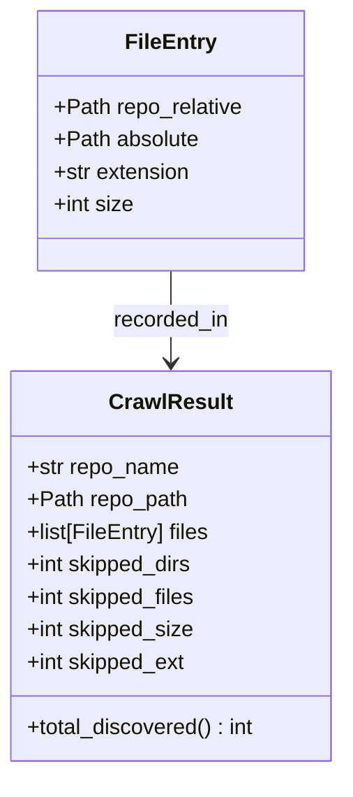

# Diagram: application_service/config/config.dev2.yml


> Auto-generated by Obscura crawlers

## Diagram 1



### SVG

<svg id="container" width="254" xmlns="http://www.w3.org/2000/svg" class="classDiagram" height="570" viewBox="0 0 254 570" role="graphics-document document" aria-roledescription="class"><style>#container{font-family:"trebuchet ms",verdana,arial,sans-serif;font-size:16px;fill:#333;}@keyframes edge-animation-frame{from{stroke-dashoffset:0;}}@keyframes dash{to{stroke-dashoffset:0;}}#container .edge-animation-slow{stroke-dasharray:9,5!important;stroke-dashoffset:900;animation:dash 50s linear infinite;stroke-linecap:round;}#container .edge-animation-fast{stroke-dasharray:9,5!important;stroke-dashoffset:900;animation:dash 20s linear infinite;stroke-linecap:round;}#container .error-icon{fill:#552222;}#container .error-text{fill:#552222;stroke:#552222;}#container .edge-thickness-normal{stroke-width:1px;}#container .edge-thickness-thick{stroke-width:3.5px;}#container .edge-pattern-solid{stroke-dasharray:0;}#container .edge-thickness-invisible{stroke-width:0;fill:none;}#container .edge-pattern-dashed{stroke-dasharray:3;}#container .edge-pattern-dotted{stroke-dasharray:2;}#container .marker{fill:#333333;stroke:#333333;}#container .marker.cross{stroke:#333333;}#container svg{font-family:"trebuchet ms",verdana,arial,sans-serif;font-size:16px;}#container p{margin:0;}#container g.classGroup text{fill:#9370DB;stroke:none;font-family:"trebuchet ms",verdana,arial,sans-serif;font-size:10px;}#container g.classGroup text .title{font-weight:bolder;}#container .nodeLabel,#container .edgeLabel{color:#131300;}#container .edgeLabel .label rect{fill:#ECECFF;}#container .label text{fill:#131300;}#container .labelBkg{background:#ECECFF;}#container .edgeLabel .label span{background:#ECECFF;}#container .classTitle{font-weight:bolder;}#container .node rect,#container .node circle,#container .node ellipse,#container .node polygon,#container .node path{fill:#ECECFF;stroke:#9370DB;stroke-width:1px;}#container .divider{stroke:#9370DB;stroke-width:1;}#container g.clickable{cursor:pointer;}#container g.classGroup rect{fill:#ECECFF;stroke:#9370DB;}#container g.classGroup line{stroke:#9370DB;stroke-width:1;}#container .classLabel .box{stroke:none;stroke-width:0;fill:#ECECFF;opacity:0.5;}#container .classLabel .label{fill:#9370DB;font-size:10px;}#container .relation{stroke:#333333;stroke-width:1;fill:none;}#container .dashed-line{stroke-dasharray:3;}#container .dotted-line{stroke-dasharray:1 2;}#container #compositionStart,#container .composition{fill:#333333!important;stroke:#333333!important;stroke-width:1;}#container #compositionEnd,#container .composition{fill:#333333!important;stroke:#333333!important;stroke-width:1;}#container #dependencyStart,#container .dependency{fill:#333333!important;stroke:#333333!important;stroke-width:1;}#container #dependencyStart,#container .dependency{fill:#333333!important;stroke:#333333!important;stroke-width:1;}#container #extensionStart,#container .extension{fill:transparent!important;stroke:#333333!important;stroke-width:1;}#container #extensionEnd,#container .extension{fill:transparent!important;stroke:#333333!important;stroke-width:1;}#container #aggregationStart,#container .aggregation{fill:transparent!important;stroke:#333333!important;stroke-width:1;}#container #aggregationEnd,#container .aggregation{fill:transparent!important;stroke:#333333!important;stroke-width:1;}#container #lollipopStart,#container .lollipop{fill:#ECECFF!important;stroke:#333333!important;stroke-width:1;}#container #lollipopEnd,#container .lollipop{fill:#ECECFF!important;stroke:#333333!important;stroke-width:1;}#container .edgeTerminals{font-size:11px;line-height:initial;}#container .classTitleText{text-anchor:middle;font-size:18px;fill:#333;}#container .label-icon{display:inline-block;height:1em;overflow:visible;vertical-align:-0.125em;}#container .node .label-icon path{fill:currentColor;stroke:revert;stroke-width:revert;}#container :root{--mermaid-font-family:"trebuchet ms",verdana,arial,sans-serif;}</style><g><defs><marker id="container_class-aggregationStart" class="marker aggregation class" refX="18" refY="7" markerWidth="190" markerHeight="240" orient="auto"><path d="M 18,7 L9,13 L1,7 L9,1 Z"></path></marker></defs><defs><marker id="container_class-aggregationEnd" class="marker aggregation class" refX="1" refY="7" markerWidth="20" markerHeight="28" orient="auto"><path d="M 18,7 L9,13 L1,7 L9,1 Z"></path></marker></defs><defs><marker id="container_class-extensionStart" class="marker extension class" refX="18" refY="7" markerWidth="190" markerHeight="240" orient="auto"><path d="M 1,7 L18,13 V 1 Z"></path></marker></defs><defs><marker id="container_class-extensionEnd" class="marker extension class" refX="1" refY="7" markerWidth="20" markerHeight="28" orient="auto"><path d="M 1,1 V 13 L18,7 Z"></path></marker></defs><defs><marker id="container_class-compositionStart" class="marker composition class" refX="18" refY="7" markerWidth="190" markerHeight="240" orient="auto"><path d="M 18,7 L9,13 L1,7 L9,1 Z"></path></marker></defs><defs><marker id="container_class-compositionEnd" class="marker composition class" refX="1" refY="7" markerWidth="20" markerHeight="28" orient="auto"><path d="M 18,7 L9,13 L1,7 L9,1 Z"></path></marker></defs><defs><marker id="container_class-dependencyStart" class="marker dependency class" refX="6" refY="7" markerWidth="190" markerHeight="240" orient="auto"><path d="M 5,7 L9,13 L1,7 L9,1 Z"></path></marker></defs><defs><marker id="container_class-dependencyEnd" class="marker dependency class" refX="13" refY="7" markerWidth="20" markerHeight="28" orient="auto"><path d="M 18,7 L9,13 L14,7 L9,1 Z"></path></marker></defs><defs><marker id="container_class-lollipopStart" class="marker lollipop class" refX="13" refY="7" markerWidth="190" markerHeight="240" orient="auto"><circle stroke="black" fill="transparent" cx="7" cy="7" r="6"></circle></marker></defs><defs><marker id="container_class-lollipopEnd" class="marker lollipop class" refX="1" refY="7" markerWidth="190" markerHeight="240" orient="auto"><circle stroke="black" fill="transparent" cx="7" cy="7" r="6"></circle></marker></defs><g class="root"><g class="clusters"></g><g class="edgePaths"><path d="M127,200L127,206.167C127,212.333,127,224.667,127,236C127,247.333,127,257.667,127,262.833L127,268" id="id_FileEntry_CrawlResult_1" class="edge-thickness-normal edge-pattern-solid relation" style=";;;" data-edge="true" data-et="edge" data-id="id_FileEntry_CrawlResult_1" data-points="W3sieCI6MTI3LCJ5IjoyMDB9LHsieCI6MTI3LCJ5IjoyMzd9LHsieCI6MTI3LCJ5IjoyNzR9XQ==" marker-end="url(#container_class-dependencyEnd)"></path></g><g class="edgeLabels"><g class="edgeLabel" transform="translate(127, 237)"><g class="label" data-id="id_FileEntry_CrawlResult_1" transform="translate(-43.4296875, -12)"><foreignObject width="86.859375" height="24"><div xmlns="http://www.w3.org/1999/xhtml" class="labelBkg" style="display: table-cell; white-space: nowrap; line-height: 1.5; max-width: 200px; text-align: center;"><span class="edgeLabel"><p>recorded_in</p></span></div></foreignObject></g></g></g><g class="nodes"><g class="node default" id="classId-FileEntry-0" transform="translate(127, 104)"><g class="basic label-container"><path d="M-98.0859375 -96 L98.0859375 -96 L98.0859375 96 L-98.0859375 96" stroke="none" stroke-width="0" fill="#ECECFF" style=""></path><path d="M-98.0859375 -96 C-53.32218782262032 -96, -8.558438145240643 -96, 98.0859375 -96 M-98.0859375 -96 C-21.983133871032805 -96, 54.11966975793439 -96, 98.0859375 -96 M98.0859375 -96 C98.0859375 -33.13316483430755, 98.0859375 29.7336703313849, 98.0859375 96 M98.0859375 -96 C98.0859375 -48.02487675393236, 98.0859375 -0.04975350786472177, 98.0859375 96 M98.0859375 96 C29.215472240790774 96, -39.65499301841845 96, -98.0859375 96 M98.0859375 96 C48.70713152482195 96, -0.6716744503560932 96, -98.0859375 96 M-98.0859375 96 C-98.0859375 47.81422686321268, -98.0859375 -0.3715462735746371, -98.0859375 -96 M-98.0859375 96 C-98.0859375 39.44421068356024, -98.0859375 -17.111578632879514, -98.0859375 -96" stroke="#9370DB" stroke-width="1.3" fill="none" stroke-dasharray="0 0" style=""></path></g><g class="annotation-group text" transform="translate(0, -72)"></g><g class="label-group text" transform="translate(-31.859375, -72)"><g class="label" style="font-weight: bolder" transform="translate(0,-12)"><foreignObject width="63.71875" height="24"><div xmlns="http://www.w3.org/1999/xhtml" style="display: table-cell; white-space: nowrap; line-height: 1.5; max-width: 113px; text-align: center;"><span class="nodeLabel markdown-node-label" style=""><p>FileEntry</p></span></div></foreignObject></g></g><g class="members-group text" transform="translate(-86.0859375, -24)"><g class="label" style="" transform="translate(0,-12)"><foreignObject width="140.3125" height="24"><div xmlns="http://www.w3.org/1999/xhtml" style="display: table-cell; white-space: nowrap; line-height: 1.5; max-width: 198px; text-align: center;"><span class="nodeLabel markdown-node-label" style=""><p>+Path repo_relative</p></span></div></foreignObject></g><g class="label" style="" transform="translate(0,12)"><foreignObject width="107.78125" height="24"><div xmlns="http://www.w3.org/1999/xhtml" style="display: table-cell; white-space: nowrap; line-height: 1.5; max-width: 165px; text-align: center;"><span class="nodeLabel markdown-node-label" style=""><p>+Path absolute</p></span></div></foreignObject></g><g class="label" style="" transform="translate(0,36)"><foreignObject width="102.328125" height="24"><div xmlns="http://www.w3.org/1999/xhtml" style="display: table-cell; white-space: nowrap; line-height: 1.5; max-width: 160px; text-align: center;"><span class="nodeLabel markdown-node-label" style=""><p>+str extension</p></span></div></foreignObject></g><g class="label" style="" transform="translate(0,60)"><foreignObject width="59.484375" height="24"><div xmlns="http://www.w3.org/1999/xhtml" style="display: table-cell; white-space: nowrap; line-height: 1.5; max-width: 117px; text-align: center;"><span class="nodeLabel markdown-node-label" style=""><p>+int size</p></span></div></foreignObject></g></g><g class="methods-group text" transform="translate(-86.0859375, 96)"></g><g class="divider" style=""><path d="M-98.0859375 -48 C-48.22989853048286 -48, 1.6261404390342733 -48, 98.0859375 -48 M-98.0859375 -48 C-35.548040985609994 -48, 26.989855528780012 -48, 98.0859375 -48" stroke="#9370DB" stroke-width="1.3" fill="none" stroke-dasharray="0 0" style=""></path></g><g class="divider" style=""><path d="M-98.0859375 72 C-30.73226374632783 72, 36.62141000734434 72, 98.0859375 72 M-98.0859375 72 C-25.23150737755944 72, 47.62292274488112 72, 98.0859375 72" stroke="#9370DB" stroke-width="1.3" fill="none" stroke-dasharray="0 0" style=""></path></g></g><g class="node default" id="classId-CrawlResult-1" transform="translate(127, 418)"><g class="basic label-container"><path d="M-119 -144 L119 -144 L119 144 L-119 144" stroke="none" stroke-width="0" fill="#ECECFF" style=""></path><path d="M-119 -144 C-57.42454178473881 -144, 4.150916430522386 -144, 119 -144 M-119 -144 C-69.79813265160189 -144, -20.596265303203793 -144, 119 -144 M119 -144 C119 -49.001043860050416, 119 45.99791227989917, 119 144 M119 -144 C119 -44.76106161481506, 119 54.477876770369875, 119 144 M119 144 C61.31051446375935 144, 3.6210289275186938 144, -119 144 M119 144 C63.69590329127004 144, 8.391806582540084 144, -119 144 M-119 144 C-119 36.85580404891955, -119 -70.2883919021609, -119 -144 M-119 144 C-119 32.34277169380333, -119 -79.31445661239334, -119 -144" stroke="#9370DB" stroke-width="1.3" fill="none" stroke-dasharray="0 0" style=""></path></g><g class="annotation-group text" transform="translate(0, -120)"></g><g class="label-group text" transform="translate(-43.28125, -120)"><g class="label" style="font-weight: bolder" transform="translate(0,-12)"><foreignObject width="86.5625" height="24"><div xmlns="http://www.w3.org/1999/xhtml" style="display: table-cell; white-space: nowrap; line-height: 1.5; max-width: 135px; text-align: center;"><span class="nodeLabel markdown-node-label" style=""><p>CrawlResult</p></span></div></foreignObject></g></g><g class="members-group text" transform="translate(-107, -72)"><g class="label" style="" transform="translate(0,-12)"><foreignObject width="113.4375" height="24"><div xmlns="http://www.w3.org/1999/xhtml" style="display: table-cell; white-space: nowrap; line-height: 1.5; max-width: 171px; text-align: center;"><span class="nodeLabel markdown-node-label" style=""><p>+str repo_name</p></span></div></foreignObject></g><g class="label" style="" transform="translate(0,12)"><foreignObject width="118.96875" height="24"><div xmlns="http://www.w3.org/1999/xhtml" style="display: table-cell; white-space: nowrap; line-height: 1.5; max-width: 176px; text-align: center;"><span class="nodeLabel markdown-node-label" style=""><p>+Path repo_path</p></span></div></foreignObject></g><g class="label" style="" transform="translate(0,36)"><foreignObject width="137.71875" height="24"><div xmlns="http://www.w3.org/1999/xhtml" style="display: table-cell; white-space: nowrap; line-height: 1.5; max-width: 195px; text-align: center;"><span class="nodeLabel markdown-node-label" style=""><p>+list[FileEntry] files</p></span></div></foreignObject></g><g class="label" style="" transform="translate(0,60)"><foreignObject width="124.859375" height="24"><div xmlns="http://www.w3.org/1999/xhtml" style="display: table-cell; white-space: nowrap; line-height: 1.5; max-width: 182px; text-align: center;"><span class="nodeLabel markdown-node-label" style=""><p>+int skipped_dirs</p></span></div></foreignObject></g><g class="label" style="" transform="translate(0,84)"><foreignObject width="127.375" height="24"><div xmlns="http://www.w3.org/1999/xhtml" style="display: table-cell; white-space: nowrap; line-height: 1.5; max-width: 185px; text-align: center;"><span class="nodeLabel markdown-node-label" style=""><p>+int skipped_files</p></span></div></foreignObject></g><g class="label" style="" transform="translate(0,108)"><foreignObject width="125.265625" height="24"><div xmlns="http://www.w3.org/1999/xhtml" style="display: table-cell; white-space: nowrap; line-height: 1.5; max-width: 183px; text-align: center;"><span class="nodeLabel markdown-node-label" style=""><p>+int skipped_size</p></span></div></foreignObject></g><g class="label" style="" transform="translate(0,132)"><foreignObject width="119.484375" height="24"><div xmlns="http://www.w3.org/1999/xhtml" style="display: table-cell; white-space: nowrap; line-height: 1.5; max-width: 177px; text-align: center;"><span class="nodeLabel markdown-node-label" style=""><p>+int skipped_ext</p></span></div></foreignObject></g></g><g class="methods-group text" transform="translate(-107, 120)"><g class="label" style="" transform="translate(0,-12)"><foreignObject width="170.71875" height="24"><div xmlns="http://www.w3.org/1999/xhtml" style="display: table-cell; white-space: nowrap; line-height: 1.5; max-width: 228px; text-align: center;"><span class="nodeLabel markdown-node-label" style=""><p>+total_discovered() : int</p></span></div></foreignObject></g></g><g class="divider" style=""><path d="M-119 -96 C-27.33971177162826 -96, 64.32057645674348 -96, 119 -96 M-119 -96 C-35.2930804829475 -96, 48.413839034104996 -96, 119 -96" stroke="#9370DB" stroke-width="1.3" fill="none" stroke-dasharray="0 0" style=""></path></g><g class="divider" style=""><path d="M-119 96 C-51.08781515837808 96, 16.824369683243845 96, 119 96 M-119 96 C-59.1846933197738 96, 0.6306133604524007 96, 119 96" stroke="#9370DB" stroke-width="1.3" fill="none" stroke-dasharray="0 0" style=""></path></g></g></g></g></g></svg>

## Diagram 2

```mermaid
flowchart TD
    A[Start: crawl_repo(repo_path)] --> B[Resolve & validate repo_path]
    B --> C[Walk directory tree]
    C --> D{For each file}
    D --> E[Skip by name or filename list]
    D --> F{Check extension}
    F --> G[Skip wrong ext]
    F --> H[Stat file size]
    H --> I{Size checks}
    I --> J[Skip if > max_size or zero]
    I --> K[Create FileEntry and append to result.files]
    E --> L[Increment skipped_files]
    G --> L
    J --> L
    K --> M[Continue walking]
    L --> M
    M --> N[Return CrawlResult]
```

> SVG rendering failed for this diagram.
