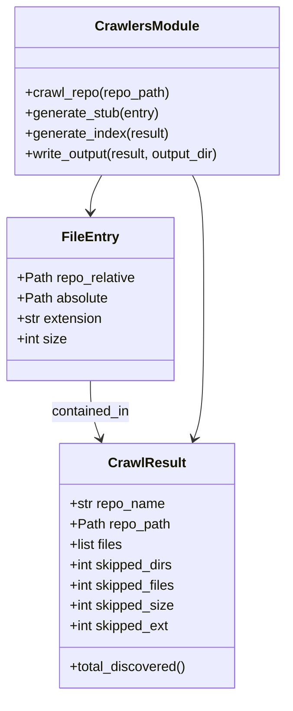

# Diagram: application_service/config/config.qa2.yml


> Auto-generated by Obscura crawlers

## Diagram 1



### SVG

<svg id="container" width="341.203125" xmlns="http://www.w3.org/2000/svg" class="classDiagram" height="818" viewBox="0 0 341.203125 818" role="graphics-document document" aria-roledescription="class"><style>#container{font-family:"trebuchet ms",verdana,arial,sans-serif;font-size:16px;fill:#333;}@keyframes edge-animation-frame{from{stroke-dashoffset:0;}}@keyframes dash{to{stroke-dashoffset:0;}}#container .edge-animation-slow{stroke-dasharray:9,5!important;stroke-dashoffset:900;animation:dash 50s linear infinite;stroke-linecap:round;}#container .edge-animation-fast{stroke-dasharray:9,5!important;stroke-dashoffset:900;animation:dash 20s linear infinite;stroke-linecap:round;}#container .error-icon{fill:#552222;}#container .error-text{fill:#552222;stroke:#552222;}#container .edge-thickness-normal{stroke-width:1px;}#container .edge-thickness-thick{stroke-width:3.5px;}#container .edge-pattern-solid{stroke-dasharray:0;}#container .edge-thickness-invisible{stroke-width:0;fill:none;}#container .edge-pattern-dashed{stroke-dasharray:3;}#container .edge-pattern-dotted{stroke-dasharray:2;}#container .marker{fill:#333333;stroke:#333333;}#container .marker.cross{stroke:#333333;}#container svg{font-family:"trebuchet ms",verdana,arial,sans-serif;font-size:16px;}#container p{margin:0;}#container g.classGroup text{fill:#9370DB;stroke:none;font-family:"trebuchet ms",verdana,arial,sans-serif;font-size:10px;}#container g.classGroup text .title{font-weight:bolder;}#container .nodeLabel,#container .edgeLabel{color:#131300;}#container .edgeLabel .label rect{fill:#ECECFF;}#container .label text{fill:#131300;}#container .labelBkg{background:#ECECFF;}#container .edgeLabel .label span{background:#ECECFF;}#container .classTitle{font-weight:bolder;}#container .node rect,#container .node circle,#container .node ellipse,#container .node polygon,#container .node path{fill:#ECECFF;stroke:#9370DB;stroke-width:1px;}#container .divider{stroke:#9370DB;stroke-width:1;}#container g.clickable{cursor:pointer;}#container g.classGroup rect{fill:#ECECFF;stroke:#9370DB;}#container g.classGroup line{stroke:#9370DB;stroke-width:1;}#container .classLabel .box{stroke:none;stroke-width:0;fill:#ECECFF;opacity:0.5;}#container .classLabel .label{fill:#9370DB;font-size:10px;}#container .relation{stroke:#333333;stroke-width:1;fill:none;}#container .dashed-line{stroke-dasharray:3;}#container .dotted-line{stroke-dasharray:1 2;}#container #compositionStart,#container .composition{fill:#333333!important;stroke:#333333!important;stroke-width:1;}#container #compositionEnd,#container .composition{fill:#333333!important;stroke:#333333!important;stroke-width:1;}#container #dependencyStart,#container .dependency{fill:#333333!important;stroke:#333333!important;stroke-width:1;}#container #dependencyStart,#container .dependency{fill:#333333!important;stroke:#333333!important;stroke-width:1;}#container #extensionStart,#container .extension{fill:transparent!important;stroke:#333333!important;stroke-width:1;}#container #extensionEnd,#container .extension{fill:transparent!important;stroke:#333333!important;stroke-width:1;}#container #aggregationStart,#container .aggregation{fill:transparent!important;stroke:#333333!important;stroke-width:1;}#container #aggregationEnd,#container .aggregation{fill:transparent!important;stroke:#333333!important;stroke-width:1;}#container #lollipopStart,#container .lollipop{fill:#ECECFF!important;stroke:#333333!important;stroke-width:1;}#container #lollipopEnd,#container .lollipop{fill:#ECECFF!important;stroke:#333333!important;stroke-width:1;}#container .edgeTerminals{font-size:11px;line-height:initial;}#container .classTitleText{text-anchor:middle;font-size:18px;fill:#333;}#container .label-icon{display:inline-block;height:1em;overflow:visible;vertical-align:-0.125em;}#container .node .label-icon path{fill:currentColor;stroke:revert;stroke-width:revert;}#container :root{--mermaid-font-family:"trebuchet ms",verdana,arial,sans-serif;}</style><g><defs><marker id="container_class-aggregationStart" class="marker aggregation class" refX="18" refY="7" markerWidth="190" markerHeight="240" orient="auto"><path d="M 18,7 L9,13 L1,7 L9,1 Z"></path></marker></defs><defs><marker id="container_class-aggregationEnd" class="marker aggregation class" refX="1" refY="7" markerWidth="20" markerHeight="28" orient="auto"><path d="M 18,7 L9,13 L1,7 L9,1 Z"></path></marker></defs><defs><marker id="container_class-extensionStart" class="marker extension class" refX="18" refY="7" markerWidth="190" markerHeight="240" orient="auto"><path d="M 1,7 L18,13 V 1 Z"></path></marker></defs><defs><marker id="container_class-extensionEnd" class="marker extension class" refX="1" refY="7" markerWidth="20" markerHeight="28" orient="auto"><path d="M 1,1 V 13 L18,7 Z"></path></marker></defs><defs><marker id="container_class-compositionStart" class="marker composition class" refX="18" refY="7" markerWidth="190" markerHeight="240" orient="auto"><path d="M 18,7 L9,13 L1,7 L9,1 Z"></path></marker></defs><defs><marker id="container_class-compositionEnd" class="marker composition class" refX="1" refY="7" markerWidth="20" markerHeight="28" orient="auto"><path d="M 18,7 L9,13 L1,7 L9,1 Z"></path></marker></defs><defs><marker id="container_class-dependencyStart" class="marker dependency class" refX="6" refY="7" markerWidth="190" markerHeight="240" orient="auto"><path d="M 5,7 L9,13 L1,7 L9,1 Z"></path></marker></defs><defs><marker id="container_class-dependencyEnd" class="marker dependency class" refX="13" refY="7" markerWidth="20" markerHeight="28" orient="auto"><path d="M 18,7 L9,13 L14,7 L9,1 Z"></path></marker></defs><defs><marker id="container_class-lollipopStart" class="marker lollipop class" refX="13" refY="7" markerWidth="190" markerHeight="240" orient="auto"><circle stroke="black" fill="transparent" cx="7" cy="7" r="6"></circle></marker></defs><defs><marker id="container_class-lollipopEnd" class="marker lollipop class" refX="1" refY="7" markerWidth="190" markerHeight="240" orient="auto"><circle stroke="black" fill="transparent" cx="7" cy="7" r="6"></circle></marker></defs><g class="root"><g class="clusters"></g><g class="edgePaths"><path d="M106.086,448L106.086,454.167C106.086,460.333,106.086,472.667,108.008,484.061C109.93,495.456,113.774,505.912,115.696,511.14L117.618,516.369" id="id_FileEntry_CrawlResult_1" class="edge-thickness-normal edge-pattern-solid relation" style=";;;" data-edge="true" data-et="edge" data-id="id_FileEntry_CrawlResult_1" data-points="W3sieCI6MTA2LjA4NTkzNzUsInkiOjQ0OH0seyJ4IjoxMDYuMDg1OTM3NSwieSI6NDg1fSx7IngiOjExOS42ODg2NDM4MTkwNjA3NywieSI6NTIyfV0=" marker-end="url(#container_class-dependencyEnd)"></path><path d="M225.756,206L227.992,210.167C230.228,214.333,234.7,222.667,236.936,247C239.172,271.333,239.172,311.667,239.172,354C239.172,396.333,239.172,440.667,237.25,468.061C235.328,495.456,231.484,505.912,229.562,511.14L227.64,516.369" id="id_CrawlersModule_CrawlResult_2" class="edge-thickness-normal edge-pattern-solid relation" style=";;;" data-edge="true" data-et="edge" data-id="id_CrawlersModule_CrawlResult_2" data-points="W3sieCI6MjI1Ljc1NTk1Mzg4MTA0ODM4LCJ5IjoyMDZ9LHsieCI6MjM5LjE3MTg3NSwieSI6MjMxfSx7IngiOjIzOS4xNzE4NzUsInkiOjM1Mn0seyJ4IjoyMzkuMTcxODc1LCJ5Ijo0ODV9LHsieCI6MjI1LjU2OTE2ODY4MDkzOTI0LCJ5Ijo1MjJ9XQ==" marker-end="url(#container_class-dependencyEnd)"></path><path d="M119.502,206L117.266,210.167C115.03,214.333,110.558,222.667,108.322,230C106.086,237.333,106.086,243.667,106.086,246.833L106.086,250" id="id_CrawlersModule_FileEntry_3" class="edge-thickness-normal edge-pattern-solid relation" style=";;;" data-edge="true" data-et="edge" data-id="id_CrawlersModule_FileEntry_3" data-points="W3sieCI6MTE5LjUwMTg1ODYxODk1MTYyLCJ5IjoyMDZ9LHsieCI6MTA2LjA4NTkzNzUsInkiOjIzMX0seyJ4IjoxMDYuMDg1OTM3NSwieSI6MjU2fV0=" marker-end="url(#container_class-dependencyEnd)"></path></g><g class="edgeLabels"><g class="edgeLabel" transform="translate(106.0859375, 485)"><g class="label" data-id="id_FileEntry_CrawlResult_1" transform="translate(-47.40625, -12)"><foreignObject width="94.8125" height="24"><div xmlns="http://www.w3.org/1999/xhtml" class="labelBkg" style="display: table-cell; white-space: nowrap; line-height: 1.5; max-width: 200px; text-align: center;"><span class="edgeLabel"><p>contained_in</p></span></div></foreignObject></g></g><g class="edgeLabel"><g class="label" data-id="id_CrawlersModule_CrawlResult_2" transform="translate(0, 0)"><foreignObject width="0" height="0"><div xmlns="http://www.w3.org/1999/xhtml" class="labelBkg" style="display: table-cell; white-space: nowrap; line-height: 1.5; max-width: 200px; text-align: center;"><span class="edgeLabel"></span></div></foreignObject></g></g><g class="edgeLabel"><g class="label" data-id="id_CrawlersModule_FileEntry_3" transform="translate(0, 0)"><foreignObject width="0" height="0"><div xmlns="http://www.w3.org/1999/xhtml" class="labelBkg" style="display: table-cell; white-space: nowrap; line-height: 1.5; max-width: 200px; text-align: center;"><span class="edgeLabel"></span></div></foreignObject></g></g></g><g class="nodes"><g class="node default" id="classId-FileEntry-0" transform="translate(106.0859375, 352)"><g class="basic label-container"><path d="M-98.0859375 -96 L98.0859375 -96 L98.0859375 96 L-98.0859375 96" stroke="none" stroke-width="0" fill="#ECECFF" style=""></path><path d="M-98.0859375 -96 C-29.573443925104954 -96, 38.93904964979009 -96, 98.0859375 -96 M-98.0859375 -96 C-33.040269605347845 -96, 32.00539828930431 -96, 98.0859375 -96 M98.0859375 -96 C98.0859375 -19.624613451869436, 98.0859375 56.75077309626113, 98.0859375 96 M98.0859375 -96 C98.0859375 -31.952281028967548, 98.0859375 32.095437942064905, 98.0859375 96 M98.0859375 96 C37.293844844320645 96, -23.49824781135871 96, -98.0859375 96 M98.0859375 96 C55.81018553849531 96, 13.534433576990622 96, -98.0859375 96 M-98.0859375 96 C-98.0859375 28.240189489092884, -98.0859375 -39.51962102181423, -98.0859375 -96 M-98.0859375 96 C-98.0859375 44.75160246451938, -98.0859375 -6.496795070961241, -98.0859375 -96" stroke="#9370DB" stroke-width="1.3" fill="none" stroke-dasharray="0 0" style=""></path></g><g class="annotation-group text" transform="translate(0, -72)"></g><g class="label-group text" transform="translate(-31.859375, -72)"><g class="label" style="font-weight: bolder" transform="translate(0,-12)"><foreignObject width="63.71875" height="24"><div xmlns="http://www.w3.org/1999/xhtml" style="display: table-cell; white-space: nowrap; line-height: 1.5; max-width: 113px; text-align: center;"><span class="nodeLabel markdown-node-label" style=""><p>FileEntry</p></span></div></foreignObject></g></g><g class="members-group text" transform="translate(-86.0859375, -24)"><g class="label" style="" transform="translate(0,-12)"><foreignObject width="140.3125" height="24"><div xmlns="http://www.w3.org/1999/xhtml" style="display: table-cell; white-space: nowrap; line-height: 1.5; max-width: 198px; text-align: center;"><span class="nodeLabel markdown-node-label" style=""><p>+Path repo_relative</p></span></div></foreignObject></g><g class="label" style="" transform="translate(0,12)"><foreignObject width="107.78125" height="24"><div xmlns="http://www.w3.org/1999/xhtml" style="display: table-cell; white-space: nowrap; line-height: 1.5; max-width: 165px; text-align: center;"><span class="nodeLabel markdown-node-label" style=""><p>+Path absolute</p></span></div></foreignObject></g><g class="label" style="" transform="translate(0,36)"><foreignObject width="102.328125" height="24"><div xmlns="http://www.w3.org/1999/xhtml" style="display: table-cell; white-space: nowrap; line-height: 1.5; max-width: 160px; text-align: center;"><span class="nodeLabel markdown-node-label" style=""><p>+str extension</p></span></div></foreignObject></g><g class="label" style="" transform="translate(0,60)"><foreignObject width="59.484375" height="24"><div xmlns="http://www.w3.org/1999/xhtml" style="display: table-cell; white-space: nowrap; line-height: 1.5; max-width: 117px; text-align: center;"><span class="nodeLabel markdown-node-label" style=""><p>+int size</p></span></div></foreignObject></g></g><g class="methods-group text" transform="translate(-86.0859375, 96)"></g><g class="divider" style=""><path d="M-98.0859375 -48 C-58.47262225930585 -48, -18.859307018611702 -48, 98.0859375 -48 M-98.0859375 -48 C-31.402126009297476 -48, 35.28168548140505 -48, 98.0859375 -48" stroke="#9370DB" stroke-width="1.3" fill="none" stroke-dasharray="0 0" style=""></path></g><g class="divider" style=""><path d="M-98.0859375 72 C-48.41243238506742 72, 1.2610727298651625 72, 98.0859375 72 M-98.0859375 72 C-19.794752082011684 72, 58.49643333597663 72, 98.0859375 72" stroke="#9370DB" stroke-width="1.3" fill="none" stroke-dasharray="0 0" style=""></path></g></g><g class="node default" id="classId-CrawlResult-1" transform="translate(172.62890625, 666)"><g class="basic label-container"><path d="M-103.0078125 -144 L103.0078125 -144 L103.0078125 144 L-103.0078125 144" stroke="none" stroke-width="0" fill="#ECECFF" style=""></path><path d="M-103.0078125 -144 C-56.320360737973544 -144, -9.632908975947089 -144, 103.0078125 -144 M-103.0078125 -144 C-48.953511615265754 -144, 5.100789269468493 -144, 103.0078125 -144 M103.0078125 -144 C103.0078125 -80.02209467242548, 103.0078125 -16.044189344850977, 103.0078125 144 M103.0078125 -144 C103.0078125 -84.40644555515894, 103.0078125 -24.812891110317892, 103.0078125 144 M103.0078125 144 C32.65504815011464 144, -37.697716199770724 144, -103.0078125 144 M103.0078125 144 C27.96960071813041 144, -47.06861106373918 144, -103.0078125 144 M-103.0078125 144 C-103.0078125 57.66524955175014, -103.0078125 -28.669500896499727, -103.0078125 -144 M-103.0078125 144 C-103.0078125 81.85507633110085, -103.0078125 19.710152662201693, -103.0078125 -144" stroke="#9370DB" stroke-width="1.3" fill="none" stroke-dasharray="0 0" style=""></path></g><g class="annotation-group text" transform="translate(0, -120)"></g><g class="label-group text" transform="translate(-43.28125, -120)"><g class="label" style="font-weight: bolder" transform="translate(0,-12)"><foreignObject width="86.5625" height="24"><div xmlns="http://www.w3.org/1999/xhtml" style="display: table-cell; white-space: nowrap; line-height: 1.5; max-width: 135px; text-align: center;"><span class="nodeLabel markdown-node-label" style=""><p>CrawlResult</p></span></div></foreignObject></g></g><g class="members-group text" transform="translate(-91.0078125, -72)"><g class="label" style="" transform="translate(0,-12)"><foreignObject width="113.4375" height="24"><div xmlns="http://www.w3.org/1999/xhtml" style="display: table-cell; white-space: nowrap; line-height: 1.5; max-width: 171px; text-align: center;"><span class="nodeLabel markdown-node-label" style=""><p>+str repo_name</p></span></div></foreignObject></g><g class="label" style="" transform="translate(0,12)"><foreignObject width="118.96875" height="24"><div xmlns="http://www.w3.org/1999/xhtml" style="display: table-cell; white-space: nowrap; line-height: 1.5; max-width: 176px; text-align: center;"><span class="nodeLabel markdown-node-label" style=""><p>+Path repo_path</p></span></div></foreignObject></g><g class="label" style="" transform="translate(0,36)"><foreignObject width="64.6875" height="24"><div xmlns="http://www.w3.org/1999/xhtml" style="display: table-cell; white-space: nowrap; line-height: 1.5; max-width: 122px; text-align: center;"><span class="nodeLabel markdown-node-label" style=""><p>+list files</p></span></div></foreignObject></g><g class="label" style="" transform="translate(0,60)"><foreignObject width="124.859375" height="24"><div xmlns="http://www.w3.org/1999/xhtml" style="display: table-cell; white-space: nowrap; line-height: 1.5; max-width: 182px; text-align: center;"><span class="nodeLabel markdown-node-label" style=""><p>+int skipped_dirs</p></span></div></foreignObject></g><g class="label" style="" transform="translate(0,84)"><foreignObject width="127.375" height="24"><div xmlns="http://www.w3.org/1999/xhtml" style="display: table-cell; white-space: nowrap; line-height: 1.5; max-width: 185px; text-align: center;"><span class="nodeLabel markdown-node-label" style=""><p>+int skipped_files</p></span></div></foreignObject></g><g class="label" style="" transform="translate(0,108)"><foreignObject width="125.265625" height="24"><div xmlns="http://www.w3.org/1999/xhtml" style="display: table-cell; white-space: nowrap; line-height: 1.5; max-width: 183px; text-align: center;"><span class="nodeLabel markdown-node-label" style=""><p>+int skipped_size</p></span></div></foreignObject></g><g class="label" style="" transform="translate(0,132)"><foreignObject width="119.484375" height="24"><div xmlns="http://www.w3.org/1999/xhtml" style="display: table-cell; white-space: nowrap; line-height: 1.5; max-width: 177px; text-align: center;"><span class="nodeLabel markdown-node-label" style=""><p>+int skipped_ext</p></span></div></foreignObject></g></g><g class="methods-group text" transform="translate(-91.0078125, 120)"><g class="label" style="" transform="translate(0,-12)"><foreignObject width="138.734375" height="24"><div xmlns="http://www.w3.org/1999/xhtml" style="display: table-cell; white-space: nowrap; line-height: 1.5; max-width: 196px; text-align: center;"><span class="nodeLabel markdown-node-label" style=""><p>+total_discovered()</p></span></div></foreignObject></g></g><g class="divider" style=""><path d="M-103.0078125 -96 C-50.598328991543816 -96, 1.8111545169123673 -96, 103.0078125 -96 M-103.0078125 -96 C-40.198201492907714 -96, 22.611409514184572 -96, 103.0078125 -96" stroke="#9370DB" stroke-width="1.3" fill="none" stroke-dasharray="0 0" style=""></path></g><g class="divider" style=""><path d="M-103.0078125 96 C-21.291317401396554 96, 60.42517769720689 96, 103.0078125 96 M-103.0078125 96 C-35.96525283289432 96, 31.077306834211356 96, 103.0078125 96" stroke="#9370DB" stroke-width="1.3" fill="none" stroke-dasharray="0 0" style=""></path></g></g><g class="node default" id="classId-CrawlersModule-2" transform="translate(172.62890625, 107)"><g class="basic label-container"><path d="M-160.57421875 -99 L160.57421875 -99 L160.57421875 99 L-160.57421875 99" stroke="none" stroke-width="0" fill="#ECECFF" style=""></path><path d="M-160.57421875 -99 C-76.82713328699214 -99, 6.919952176015727 -99, 160.57421875 -99 M-160.57421875 -99 C-42.13807882892833 -99, 76.29806109214334 -99, 160.57421875 -99 M160.57421875 -99 C160.57421875 -33.63651987970282, 160.57421875 31.726960240594366, 160.57421875 99 M160.57421875 -99 C160.57421875 -32.592754673723306, 160.57421875 33.81449065255339, 160.57421875 99 M160.57421875 99 C90.42043659815025 99, 20.266654446300493 99, -160.57421875 99 M160.57421875 99 C74.81083820638625 99, -10.952542337227499 99, -160.57421875 99 M-160.57421875 99 C-160.57421875 28.591391164955084, -160.57421875 -41.81721767008983, -160.57421875 -99 M-160.57421875 99 C-160.57421875 22.89629263822438, -160.57421875 -53.20741472355124, -160.57421875 -99" stroke="#9370DB" stroke-width="1.3" fill="none" stroke-dasharray="0 0" style=""></path></g><g class="annotation-group text" transform="translate(0, -75)"></g><g class="label-group text" transform="translate(-58.5859375, -75)"><g class="label" style="font-weight: bolder" transform="translate(0,-12)"><foreignObject width="117.171875" height="24"><div xmlns="http://www.w3.org/1999/xhtml" style="display: table-cell; white-space: nowrap; line-height: 1.5; max-width: 165px; text-align: center;"><span class="nodeLabel markdown-node-label" style=""><p>CrawlersModule</p></span></div></foreignObject></g></g><g class="members-group text" transform="translate(-148.57421875, -27)"></g><g class="methods-group text" transform="translate(-148.57421875, 3)"><g class="label" style="" transform="translate(0,-12)"><foreignObject width="172.453125" height="24"><div xmlns="http://www.w3.org/1999/xhtml" style="display: table-cell; white-space: nowrap; line-height: 1.5; max-width: 230px; text-align: center;"><span class="nodeLabel markdown-node-label" style=""><p>+crawl_repo(repo_path)</p></span></div></foreignObject></g><g class="label" style="" transform="translate(0,12)"><foreignObject width="159.796875" height="24"><div xmlns="http://www.w3.org/1999/xhtml" style="display: table-cell; white-space: nowrap; line-height: 1.5; max-width: 217px; text-align: center;"><span class="nodeLabel markdown-node-label" style=""><p>+generate_stub(entry)</p></span></div></foreignObject></g><g class="label" style="" transform="translate(0,36)"><foreignObject width="171.265625" height="24"><div xmlns="http://www.w3.org/1999/xhtml" style="display: table-cell; white-space: nowrap; line-height: 1.5; max-width: 229px; text-align: center;"><span class="nodeLabel markdown-node-label" style=""><p>+generate_index(result)</p></span></div></foreignObject></g><g class="label" style="" transform="translate(0,60)"><foreignObject width="238.5625" height="24"><div xmlns="http://www.w3.org/1999/xhtml" style="display: table-cell; white-space: nowrap; line-height: 1.5; max-width: 296px; text-align: center;"><span class="nodeLabel markdown-node-label" style=""><p>+write_output(result, output_dir)</p></span></div></foreignObject></g></g><g class="divider" style=""><path d="M-160.57421875 -51 C-40.43414378449302 -51, 79.70593118101397 -51, 160.57421875 -51 M-160.57421875 -51 C-46.54014828354721 -51, 67.49392218290558 -51, 160.57421875 -51" stroke="#9370DB" stroke-width="1.3" fill="none" stroke-dasharray="0 0" style=""></path></g><g class="divider" style=""><path d="M-160.57421875 -27 C-77.83816975410973 -27, 4.897879241780544 -27, 160.57421875 -27 M-160.57421875 -27 C-33.81204198207831 -27, 92.95013478584337 -27, 160.57421875 -27" stroke="#9370DB" stroke-width="1.3" fill="none" stroke-dasharray="0 0" style=""></path></g></g></g></g></g></svg>

## Diagram 2

```mermaid
flowchart TD
    Start([Start]) --> Walk[/"os.walk(repo_path)"/]
    Walk --> FilterDirs{Filter directories}
    FilterDirs --> SkipCount[increment skipped_dirs]
    FilterDirs --> FilesLoop[iterate files]
    FilesLoop --> CheckSkipFiles{fname in SKIP_FILES?}
    CheckSkipFiles -- yes --> SkipFile[skipped_files++]
    CheckSkipFiles -- no --> CheckExt{ext in DEFAULT_EXTENSIONS?}
    CheckExt -- no --> SkipExt[skipped_ext++]
    CheckExt -- yes --> Stat[size = fpath.stat().st_size]
    Stat --> CheckSize{size == 0 or size > MAX_FILE_SIZE?}
    CheckSize -- yes --> SkipSize[skipped_size++ or skipped_files++]
    CheckSize -- no --> CreateEntry[create FileEntry and append to result.files]
    CreateEntry --> Continue[continue loop]
    Continue --> FilesLoop
    FilesLoop --> End[Return CrawlResult]
```

> SVG rendering failed for this diagram.
