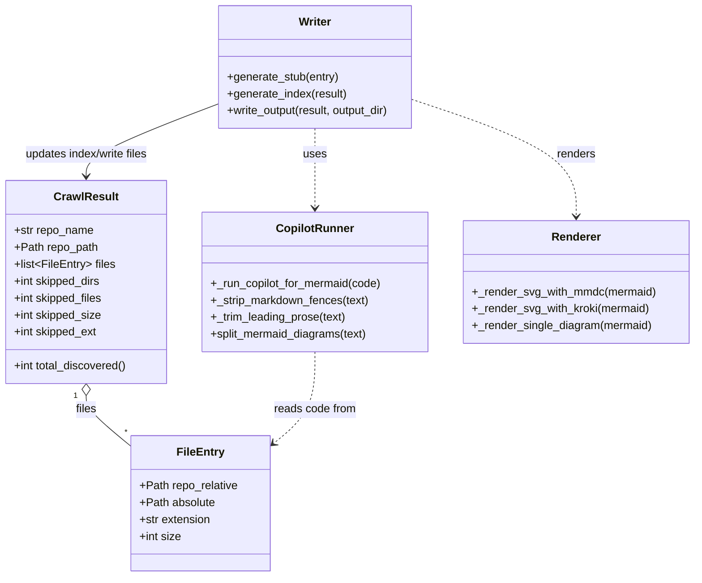

# Diagram: application_service/config/config.staging.yml


> Auto-generated by Obscura crawlers

## Diagram 1



### SVG

<svg id="container" width="986.09375" xmlns="http://www.w3.org/2000/svg" class="classDiagram" height="818" viewBox="0 0 986.09375 818" role="graphics-document document" aria-roledescription="class"><style>#container{font-family:"trebuchet ms",verdana,arial,sans-serif;font-size:16px;fill:#333;}@keyframes edge-animation-frame{from{stroke-dashoffset:0;}}@keyframes dash{to{stroke-dashoffset:0;}}#container .edge-animation-slow{stroke-dasharray:9,5!important;stroke-dashoffset:900;animation:dash 50s linear infinite;stroke-linecap:round;}#container .edge-animation-fast{stroke-dasharray:9,5!important;stroke-dashoffset:900;animation:dash 20s linear infinite;stroke-linecap:round;}#container .error-icon{fill:#552222;}#container .error-text{fill:#552222;stroke:#552222;}#container .edge-thickness-normal{stroke-width:1px;}#container .edge-thickness-thick{stroke-width:3.5px;}#container .edge-pattern-solid{stroke-dasharray:0;}#container .edge-thickness-invisible{stroke-width:0;fill:none;}#container .edge-pattern-dashed{stroke-dasharray:3;}#container .edge-pattern-dotted{stroke-dasharray:2;}#container .marker{fill:#333333;stroke:#333333;}#container .marker.cross{stroke:#333333;}#container svg{font-family:"trebuchet ms",verdana,arial,sans-serif;font-size:16px;}#container p{margin:0;}#container g.classGroup text{fill:#9370DB;stroke:none;font-family:"trebuchet ms",verdana,arial,sans-serif;font-size:10px;}#container g.classGroup text .title{font-weight:bolder;}#container .nodeLabel,#container .edgeLabel{color:#131300;}#container .edgeLabel .label rect{fill:#ECECFF;}#container .label text{fill:#131300;}#container .labelBkg{background:#ECECFF;}#container .edgeLabel .label span{background:#ECECFF;}#container .classTitle{font-weight:bolder;}#container .node rect,#container .node circle,#container .node ellipse,#container .node polygon,#container .node path{fill:#ECECFF;stroke:#9370DB;stroke-width:1px;}#container .divider{stroke:#9370DB;stroke-width:1;}#container g.clickable{cursor:pointer;}#container g.classGroup rect{fill:#ECECFF;stroke:#9370DB;}#container g.classGroup line{stroke:#9370DB;stroke-width:1;}#container .classLabel .box{stroke:none;stroke-width:0;fill:#ECECFF;opacity:0.5;}#container .classLabel .label{fill:#9370DB;font-size:10px;}#container .relation{stroke:#333333;stroke-width:1;fill:none;}#container .dashed-line{stroke-dasharray:3;}#container .dotted-line{stroke-dasharray:1 2;}#container #compositionStart,#container .composition{fill:#333333!important;stroke:#333333!important;stroke-width:1;}#container #compositionEnd,#container .composition{fill:#333333!important;stroke:#333333!important;stroke-width:1;}#container #dependencyStart,#container .dependency{fill:#333333!important;stroke:#333333!important;stroke-width:1;}#container #dependencyStart,#container .dependency{fill:#333333!important;stroke:#333333!important;stroke-width:1;}#container #extensionStart,#container .extension{fill:transparent!important;stroke:#333333!important;stroke-width:1;}#container #extensionEnd,#container .extension{fill:transparent!important;stroke:#333333!important;stroke-width:1;}#container #aggregationStart,#container .aggregation{fill:transparent!important;stroke:#333333!important;stroke-width:1;}#container #aggregationEnd,#container .aggregation{fill:transparent!important;stroke:#333333!important;stroke-width:1;}#container #lollipopStart,#container .lollipop{fill:#ECECFF!important;stroke:#333333!important;stroke-width:1;}#container #lollipopEnd,#container .lollipop{fill:#ECECFF!important;stroke:#333333!important;stroke-width:1;}#container .edgeTerminals{font-size:11px;line-height:initial;}#container .classTitleText{text-anchor:middle;font-size:18px;fill:#333;}#container .label-icon{display:inline-block;height:1em;overflow:visible;vertical-align:-0.125em;}#container .node .label-icon path{fill:currentColor;stroke:revert;stroke-width:revert;}#container :root{--mermaid-font-family:"trebuchet ms",verdana,arial,sans-serif;}</style><g><defs><marker id="container_class-aggregationStart" class="marker aggregation class" refX="18" refY="7" markerWidth="190" markerHeight="240" orient="auto"><path d="M 18,7 L9,13 L1,7 L9,1 Z"></path></marker></defs><defs><marker id="container_class-aggregationEnd" class="marker aggregation class" refX="1" refY="7" markerWidth="20" markerHeight="28" orient="auto"><path d="M 18,7 L9,13 L1,7 L9,1 Z"></path></marker></defs><defs><marker id="container_class-extensionStart" class="marker extension class" refX="18" refY="7" markerWidth="190" markerHeight="240" orient="auto"><path d="M 1,7 L18,13 V 1 Z"></path></marker></defs><defs><marker id="container_class-extensionEnd" class="marker extension class" refX="1" refY="7" markerWidth="20" markerHeight="28" orient="auto"><path d="M 1,1 V 13 L18,7 Z"></path></marker></defs><defs><marker id="container_class-compositionStart" class="marker composition class" refX="18" refY="7" markerWidth="190" markerHeight="240" orient="auto"><path d="M 18,7 L9,13 L1,7 L9,1 Z"></path></marker></defs><defs><marker id="container_class-compositionEnd" class="marker composition class" refX="1" refY="7" markerWidth="20" markerHeight="28" orient="auto"><path d="M 18,7 L9,13 L1,7 L9,1 Z"></path></marker></defs><defs><marker id="container_class-dependencyStart" class="marker dependency class" refX="6" refY="7" markerWidth="190" markerHeight="240" orient="auto"><path d="M 5,7 L9,13 L1,7 L9,1 Z"></path></marker></defs><defs><marker id="container_class-dependencyEnd" class="marker dependency class" refX="13" refY="7" markerWidth="20" markerHeight="28" orient="auto"><path d="M 18,7 L9,13 L14,7 L9,1 Z"></path></marker></defs><defs><marker id="container_class-lollipopStart" class="marker lollipop class" refX="13" refY="7" markerWidth="190" markerHeight="240" orient="auto"><circle stroke="black" fill="transparent" cx="7" cy="7" r="6"></circle></marker></defs><defs><marker id="container_class-lollipopEnd" class="marker lollipop class" refX="1" refY="7" markerWidth="190" markerHeight="240" orient="auto"><circle stroke="black" fill="transparent" cx="7" cy="7" r="6"></circle></marker></defs><g class="root"><g class="clusters"></g><g class="edgePaths"><path d="M123,561.25L123,564.542C123,567.833,123,574.417,133.782,586.518C144.564,598.619,166.128,616.238,176.91,625.048L187.691,633.857" id="id_CrawlResult_FileEntry_1" class="edge-thickness-normal edge-pattern-solid relation" style=";;;" data-edge="true" data-et="edge" data-id="id_CrawlResult_FileEntry_1" data-points="W3sieCI6MTIzLCJ5Ijo1NDR9LHsieCI6MTIzLCJ5Ijo1ODF9LHsieCI6MTg3LjY5MTQwNjI1LCJ5Ijo2MzMuODU3MjE0ODQ5NjU1Nn1d" marker-start="url(#container_class-aggregationStart)"></path><path d="M448.555,182L448.555,188.167C448.555,194.333,448.555,206.667,448.555,225.5C448.555,244.333,448.555,269.667,448.555,282.333L448.555,295" id="id_Writer_CopilotRunner_2" class="edge-thickness-normal edge-pattern-dashed relation" style=";;;" data-edge="true" data-et="edge" data-id="id_Writer_CopilotRunner_2" data-points="W3sieCI6NDQ4LjU1NDY4NzUsInkiOjE4Mn0seyJ4Ijo0NDguNTU0Njg3NSwieSI6MjE5fSx7IngiOjQ0OC41NTQ2ODc1LCJ5IjozMDF9XQ==" marker-end="url(#container_class-dependencyEnd)"></path><path d="M591.223,142.807L629.119,155.506C667.016,168.205,742.809,193.602,780.705,220.968C818.602,248.333,818.602,277.667,818.602,292.333L818.602,307" id="id_Writer_Renderer_3" class="edge-thickness-normal edge-pattern-dashed relation" style=";;;" data-edge="true" data-et="edge" data-id="id_Writer_Renderer_3" data-points="W3sieCI6NTkxLjIyMjY1NjI1LCJ5IjoxNDIuODA2OTkyMzU3Mzg3MTR9LHsieCI6ODE4LjYwMTU2MjUsInkiOjIxOX0seyJ4Ijo4MTguNjAxNTYyNSwieSI6MzEzfV0=" marker-end="url(#container_class-dependencyEnd)"></path><path d="M448.555,499L448.555,512.667C448.555,526.333,448.555,553.667,438.547,575.51C428.54,597.354,408.525,613.707,398.517,621.884L388.51,630.061" id="id_CopilotRunner_FileEntry_4" class="edge-thickness-normal edge-pattern-dashed relation" style=";;;" data-edge="true" data-et="edge" data-id="id_CopilotRunner_FileEntry_4" data-points="W3sieCI6NDQ4LjU1NDY4NzUsInkiOjQ5OX0seyJ4Ijo0NDguNTU0Njg3NSwieSI6NTgxfSx7IngiOjM4My44NjMyODEyNSwieSI6NjMzLjg1NzIxNDg0OTY1NTZ9XQ==" marker-end="url(#container_class-dependencyEnd)"></path><path d="M305.887,149.341L275.406,160.95C244.924,172.56,183.962,195.78,153.481,212.557C123,229.333,123,239.667,123,244.833L123,250" id="id_Writer_CrawlResult_5" class="edge-thickness-normal edge-pattern-solid relation" style=";;;" data-edge="true" data-et="edge" data-id="id_Writer_CrawlResult_5" data-points="W3sieCI6MzA1Ljg4NjcxODc1LCJ5IjoxNDkuMzQwNTcyNTgwNDUxNjR9LHsieCI6MTIzLCJ5IjoyMTl9LHsieCI6MTIzLCJ5IjoyNTZ9XQ==" marker-end="url(#container_class-dependencyEnd)"></path></g><g class="edgeLabels"><g class="edgeLabel" transform="translate(123, 581)"><g class="label" data-id="id_CrawlResult_FileEntry_1" transform="translate(-15.0078125, -12)"><foreignObject width="30.015625" height="24"><div xmlns="http://www.w3.org/1999/xhtml" class="labelBkg" style="display: table-cell; white-space: nowrap; line-height: 1.5; max-width: 200px; text-align: center;"><span class="edgeLabel"><p>files</p></span></div></foreignObject></g></g><g class="edgeLabel" transform="translate(448.5546875, 219)"><g class="label" data-id="id_Writer_CopilotRunner_2" transform="translate(-16.4921875, -12)"><foreignObject width="32.984375" height="24"><div xmlns="http://www.w3.org/1999/xhtml" class="labelBkg" style="display: table-cell; white-space: nowrap; line-height: 1.5; max-width: 200px; text-align: center;"><span class="edgeLabel"><p>uses</p></span></div></foreignObject></g></g><g class="edgeLabel" transform="translate(818.6015625, 219)"><g class="label" data-id="id_Writer_Renderer_3" transform="translate(-27.75, -12)"><foreignObject width="55.5" height="24"><div xmlns="http://www.w3.org/1999/xhtml" class="labelBkg" style="display: table-cell; white-space: nowrap; line-height: 1.5; max-width: 200px; text-align: center;"><span class="edgeLabel"><p>renders</p></span></div></foreignObject></g></g><g class="edgeLabel" transform="translate(448.5546875, 581)"><g class="label" data-id="id_CopilotRunner_FileEntry_4" transform="translate(-58.78125, -12)"><foreignObject width="117.5625" height="24"><div xmlns="http://www.w3.org/1999/xhtml" class="labelBkg" style="display: table-cell; white-space: nowrap; line-height: 1.5; max-width: 200px; text-align: center;"><span class="edgeLabel"><p>reads code from</p></span></div></foreignObject></g></g><g class="edgeLabel" transform="translate(123, 219)"><g class="label" data-id="id_Writer_CrawlResult_5" transform="translate(-90.7578125, -12)"><foreignObject width="181.515625" height="24"><div xmlns="http://www.w3.org/1999/xhtml" class="labelBkg" style="display: table-cell; white-space: nowrap; line-height: 1.5; max-width: 200px; text-align: center;"><span class="edgeLabel"><p>updates index/write files</p></span></div></foreignObject></g></g><g class="edgeTerminals" transform="translate(108, 561.5)"><g class="inner" transform="translate(0, 0)"><foreignObject style="width: 9px; height: 12px;"><div xmlns="http://www.w3.org/1999/xhtml" style="display: inline-block; padding-right: 1px; white-space: nowrap;"><span class="edgeLabel">1</span></div></foreignObject></g></g><g class="edgeTerminals" transform="translate(178.63056045596596, 606.1689035629654)"><g class="inner" transform="translate(0, 0)"></g><foreignObject style="width: 9px; height: 12px;"><div xmlns="http://www.w3.org/1999/xhtml" style="display: inline-block; padding-right: 1px; white-space: nowrap;"><span class="edgeLabel">*</span></div></foreignObject></g></g><g class="nodes"><g class="node default" id="classId-FileEntry-0" transform="translate(285.77734375, 714)"><g class="basic label-container"><path d="M-98.0859375 -96 L98.0859375 -96 L98.0859375 96 L-98.0859375 96" stroke="none" stroke-width="0" fill="#ECECFF" style=""></path><path d="M-98.0859375 -96 C-51.97664493016287 -96, -5.867352360325739 -96, 98.0859375 -96 M-98.0859375 -96 C-47.7688024481596 -96, 2.548332603680805 -96, 98.0859375 -96 M98.0859375 -96 C98.0859375 -29.45342706800389, 98.0859375 37.09314586399222, 98.0859375 96 M98.0859375 -96 C98.0859375 -55.3104444018108, 98.0859375 -14.620888803621597, 98.0859375 96 M98.0859375 96 C37.676322191252574 96, -22.733293117494853 96, -98.0859375 96 M98.0859375 96 C49.5525028667241 96, 1.0190682334481949 96, -98.0859375 96 M-98.0859375 96 C-98.0859375 45.714155709431566, -98.0859375 -4.571688581136868, -98.0859375 -96 M-98.0859375 96 C-98.0859375 44.96045553120352, -98.0859375 -6.079088937592957, -98.0859375 -96" stroke="#9370DB" stroke-width="1.3" fill="none" stroke-dasharray="0 0" style=""></path></g><g class="annotation-group text" transform="translate(0, -72)"></g><g class="label-group text" transform="translate(-31.859375, -72)"><g class="label" style="font-weight: bolder" transform="translate(0,-12)"><foreignObject width="63.71875" height="24"><div xmlns="http://www.w3.org/1999/xhtml" style="display: table-cell; white-space: nowrap; line-height: 1.5; max-width: 113px; text-align: center;"><span class="nodeLabel markdown-node-label" style=""><p>FileEntry</p></span></div></foreignObject></g></g><g class="members-group text" transform="translate(-86.0859375, -24)"><g class="label" style="" transform="translate(0,-12)"><foreignObject width="140.3125" height="24"><div xmlns="http://www.w3.org/1999/xhtml" style="display: table-cell; white-space: nowrap; line-height: 1.5; max-width: 198px; text-align: center;"><span class="nodeLabel markdown-node-label" style=""><p>+Path repo_relative</p></span></div></foreignObject></g><g class="label" style="" transform="translate(0,12)"><foreignObject width="107.78125" height="24"><div xmlns="http://www.w3.org/1999/xhtml" style="display: table-cell; white-space: nowrap; line-height: 1.5; max-width: 165px; text-align: center;"><span class="nodeLabel markdown-node-label" style=""><p>+Path absolute</p></span></div></foreignObject></g><g class="label" style="" transform="translate(0,36)"><foreignObject width="102.328125" height="24"><div xmlns="http://www.w3.org/1999/xhtml" style="display: table-cell; white-space: nowrap; line-height: 1.5; max-width: 160px; text-align: center;"><span class="nodeLabel markdown-node-label" style=""><p>+str extension</p></span></div></foreignObject></g><g class="label" style="" transform="translate(0,60)"><foreignObject width="59.484375" height="24"><div xmlns="http://www.w3.org/1999/xhtml" style="display: table-cell; white-space: nowrap; line-height: 1.5; max-width: 117px; text-align: center;"><span class="nodeLabel markdown-node-label" style=""><p>+int size</p></span></div></foreignObject></g></g><g class="methods-group text" transform="translate(-86.0859375, 96)"></g><g class="divider" style=""><path d="M-98.0859375 -48 C-37.55890939141907 -48, 22.968118717161857 -48, 98.0859375 -48 M-98.0859375 -48 C-55.745714229033176 -48, -13.405490958066352 -48, 98.0859375 -48" stroke="#9370DB" stroke-width="1.3" fill="none" stroke-dasharray="0 0" style=""></path></g><g class="divider" style=""><path d="M-98.0859375 72 C-55.552084529613126 72, -13.018231559226251 72, 98.0859375 72 M-98.0859375 72 C-38.13976029985549 72, 21.806416900289022 72, 98.0859375 72" stroke="#9370DB" stroke-width="1.3" fill="none" stroke-dasharray="0 0" style=""></path></g></g><g class="node default" id="classId-CrawlResult-1" transform="translate(123, 400)"><g class="basic label-container"><path d="M-115 -144 L115 -144 L115 144 L-115 144" stroke="none" stroke-width="0" fill="#ECECFF" style=""></path><path d="M-115 -144 C-48.362228331911524 -144, 18.275543336176952 -144, 115 -144 M-115 -144 C-47.87390562721876 -144, 19.252188745562478 -144, 115 -144 M115 -144 C115 -85.05067536135323, 115 -26.101350722706442, 115 144 M115 -144 C115 -44.14651404696973, 115 55.706971906060545, 115 144 M115 144 C67.07575027274082 144, 19.15150054548164 144, -115 144 M115 144 C30.854417145820378 144, -53.291165708359244 144, -115 144 M-115 144 C-115 54.6294083056998, -115 -34.741183388600405, -115 -144 M-115 144 C-115 62.39804486452006, -115 -19.20391027095988, -115 -144" stroke="#9370DB" stroke-width="1.3" fill="none" stroke-dasharray="0 0" style=""></path></g><g class="annotation-group text" transform="translate(0, -120)"></g><g class="label-group text" transform="translate(-43.28125, -120)"><g class="label" style="font-weight: bolder" transform="translate(0,-12)"><foreignObject width="86.5625" height="24"><div xmlns="http://www.w3.org/1999/xhtml" style="display: table-cell; white-space: nowrap; line-height: 1.5; max-width: 135px; text-align: center;"><span class="nodeLabel markdown-node-label" style=""><p>CrawlResult</p></span></div></foreignObject></g></g><g class="members-group text" transform="translate(-103, -72)"><g class="label" style="" transform="translate(0,-12)"><foreignObject width="113.4375" height="24"><div xmlns="http://www.w3.org/1999/xhtml" style="display: table-cell; white-space: nowrap; line-height: 1.5; max-width: 171px; text-align: center;"><span class="nodeLabel markdown-node-label" style=""><p>+str repo_name</p></span></div></foreignObject></g><g class="label" style="" transform="translate(0,12)"><foreignObject width="118.96875" height="24"><div xmlns="http://www.w3.org/1999/xhtml" style="display: table-cell; white-space: nowrap; line-height: 1.5; max-width: 176px; text-align: center;"><span class="nodeLabel markdown-node-label" style=""><p>+Path repo_path</p></span></div></foreignObject></g><g class="label" style="" transform="translate(0,36)"><foreignObject width="143.421875" height="24"><div xmlns="http://www.w3.org/1999/xhtml" style="display: table-cell; white-space: nowrap; line-height: 1.5; max-width: 240px; text-align: center;"><span class="nodeLabel markdown-node-label" style=""><p>+list&lt;FileEntry&gt; files</p></span></div></foreignObject></g><g class="label" style="" transform="translate(0,60)"><foreignObject width="124.859375" height="24"><div xmlns="http://www.w3.org/1999/xhtml" style="display: table-cell; white-space: nowrap; line-height: 1.5; max-width: 182px; text-align: center;"><span class="nodeLabel markdown-node-label" style=""><p>+int skipped_dirs</p></span></div></foreignObject></g><g class="label" style="" transform="translate(0,84)"><foreignObject width="127.375" height="24"><div xmlns="http://www.w3.org/1999/xhtml" style="display: table-cell; white-space: nowrap; line-height: 1.5; max-width: 185px; text-align: center;"><span class="nodeLabel markdown-node-label" style=""><p>+int skipped_files</p></span></div></foreignObject></g><g class="label" style="" transform="translate(0,108)"><foreignObject width="125.265625" height="24"><div xmlns="http://www.w3.org/1999/xhtml" style="display: table-cell; white-space: nowrap; line-height: 1.5; max-width: 183px; text-align: center;"><span class="nodeLabel markdown-node-label" style=""><p>+int skipped_size</p></span></div></foreignObject></g><g class="label" style="" transform="translate(0,132)"><foreignObject width="119.484375" height="24"><div xmlns="http://www.w3.org/1999/xhtml" style="display: table-cell; white-space: nowrap; line-height: 1.5; max-width: 177px; text-align: center;"><span class="nodeLabel markdown-node-label" style=""><p>+int skipped_ext</p></span></div></foreignObject></g></g><g class="methods-group text" transform="translate(-103, 120)"><g class="label" style="" transform="translate(0,-12)"><foreignObject width="162.71875" height="24"><div xmlns="http://www.w3.org/1999/xhtml" style="display: table-cell; white-space: nowrap; line-height: 1.5; max-width: 220px; text-align: center;"><span class="nodeLabel markdown-node-label" style=""><p>+int total_discovered()</p></span></div></foreignObject></g></g><g class="divider" style=""><path d="M-115 -96 C-33.080316191510605 -96, 48.83936761697879 -96, 115 -96 M-115 -96 C-64.00035446390966 -96, -13.000708927819318 -96, 115 -96" stroke="#9370DB" stroke-width="1.3" fill="none" stroke-dasharray="0 0" style=""></path></g><g class="divider" style=""><path d="M-115 96 C-61.74680792720281 96, -8.493615854405618 96, 115 96 M-115 96 C-48.89376822017721 96, 17.212463559645585 96, 115 96" stroke="#9370DB" stroke-width="1.3" fill="none" stroke-dasharray="0 0" style=""></path></g></g><g class="node default" id="classId-CopilotRunner-2" transform="translate(448.5546875, 400)"><g class="basic label-container"><path d="M-160.5546875 -99 L160.5546875 -99 L160.5546875 99 L-160.5546875 99" stroke="none" stroke-width="0" fill="#ECECFF" style=""></path><path d="M-160.5546875 -99 C-41.697268694335506 -99, 77.16015011132899 -99, 160.5546875 -99 M-160.5546875 -99 C-65.15841926204943 -99, 30.23784897590113 -99, 160.5546875 -99 M160.5546875 -99 C160.5546875 -19.98446016426449, 160.5546875 59.03107967147102, 160.5546875 99 M160.5546875 -99 C160.5546875 -48.231938590187994, 160.5546875 2.536122819624012, 160.5546875 99 M160.5546875 99 C68.09637473817844 99, -24.36193802364312 99, -160.5546875 99 M160.5546875 99 C88.40482350621005 99, 16.2549595124201 99, -160.5546875 99 M-160.5546875 99 C-160.5546875 45.32383191444697, -160.5546875 -8.35233617110606, -160.5546875 -99 M-160.5546875 99 C-160.5546875 54.35559190584707, -160.5546875 9.711183811694141, -160.5546875 -99" stroke="#9370DB" stroke-width="1.3" fill="none" stroke-dasharray="0 0" style=""></path></g><g class="annotation-group text" transform="translate(0, -75)"></g><g class="label-group text" transform="translate(-52.609375, -75)"><g class="label" style="font-weight: bolder" transform="translate(0,-12)"><foreignObject width="105.21875" height="24"><div xmlns="http://www.w3.org/1999/xhtml" style="display: table-cell; white-space: nowrap; line-height: 1.5; max-width: 155px; text-align: center;"><span class="nodeLabel markdown-node-label" style=""><p>CopilotRunner</p></span></div></foreignObject></g></g><g class="members-group text" transform="translate(-148.5546875, -27)"></g><g class="methods-group text" transform="translate(-148.5546875, 3)"><g class="label" style="" transform="translate(0,-12)"><foreignObject width="244.5" height="24"><div xmlns="http://www.w3.org/1999/xhtml" style="display: table-cell; white-space: nowrap; line-height: 1.5; max-width: 302px; text-align: center;"><span class="nodeLabel markdown-node-label" style=""><p>+_run_copilot_for_mermaid(code)</p></span></div></foreignObject></g><g class="label" style="" transform="translate(0,12)"><foreignObject width="225.703125" height="24"><div xmlns="http://www.w3.org/1999/xhtml" style="display: table-cell; white-space: nowrap; line-height: 1.5; max-width: 283px; text-align: center;"><span class="nodeLabel markdown-node-label" style=""><p>+_strip_markdown_fences(text)</p></span></div></foreignObject></g><g class="label" style="" transform="translate(0,36)"><foreignObject width="193.828125" height="24"><div xmlns="http://www.w3.org/1999/xhtml" style="display: table-cell; white-space: nowrap; line-height: 1.5; max-width: 251px; text-align: center;"><span class="nodeLabel markdown-node-label" style=""><p>+_trim_leading_prose(text)</p></span></div></foreignObject></g><g class="label" style="" transform="translate(0,60)"><foreignObject width="225.828125" height="24"><div xmlns="http://www.w3.org/1999/xhtml" style="display: table-cell; white-space: nowrap; line-height: 1.5; max-width: 283px; text-align: center;"><span class="nodeLabel markdown-node-label" style=""><p>+split_mermaid_diagrams(text)</p></span></div></foreignObject></g></g><g class="divider" style=""><path d="M-160.5546875 -51 C-53.80838888466178 -51, 52.93790973067644 -51, 160.5546875 -51 M-160.5546875 -51 C-46.53717266508255 -51, 67.4803421698349 -51, 160.5546875 -51" stroke="#9370DB" stroke-width="1.3" fill="none" stroke-dasharray="0 0" style=""></path></g><g class="divider" style=""><path d="M-160.5546875 -27 C-44.67526244916159 -27, 71.20416260167681 -27, 160.5546875 -27 M-160.5546875 -27 C-40.07710443896761 -27, 80.40047862206478 -27, 160.5546875 -27" stroke="#9370DB" stroke-width="1.3" fill="none" stroke-dasharray="0 0" style=""></path></g></g><g class="node default" id="classId-Renderer-3" transform="translate(818.6015625, 400)"><g class="basic label-container"><path d="M-159.4921875 -87 L159.4921875 -87 L159.4921875 87 L-159.4921875 87" stroke="none" stroke-width="0" fill="#ECECFF" style=""></path><path d="M-159.4921875 -87 C-95.6522647096794 -87, -31.812341919358786 -87, 159.4921875 -87 M-159.4921875 -87 C-90.65200404622229 -87, -21.811820592444576 -87, 159.4921875 -87 M159.4921875 -87 C159.4921875 -45.933517305352474, 159.4921875 -4.867034610704948, 159.4921875 87 M159.4921875 -87 C159.4921875 -45.15755729399917, 159.4921875 -3.3151145879983375, 159.4921875 87 M159.4921875 87 C85.55758598403818 87, 11.622984468076368 87, -159.4921875 87 M159.4921875 87 C71.51963750972754 87, -16.45291248054491 87, -159.4921875 87 M-159.4921875 87 C-159.4921875 17.7821751456423, -159.4921875 -51.4356497087154, -159.4921875 -87 M-159.4921875 87 C-159.4921875 51.80542298509659, -159.4921875 16.610845970193182, -159.4921875 -87" stroke="#9370DB" stroke-width="1.3" fill="none" stroke-dasharray="0 0" style=""></path></g><g class="annotation-group text" transform="translate(0, -63)"></g><g class="label-group text" transform="translate(-33.65625, -63)"><g class="label" style="font-weight: bolder" transform="translate(0,-12)"><foreignObject width="67.3125" height="24"><div xmlns="http://www.w3.org/1999/xhtml" style="display: table-cell; white-space: nowrap; line-height: 1.5; max-width: 117px; text-align: center;"><span class="nodeLabel markdown-node-label" style=""><p>Renderer</p></span></div></foreignObject></g></g><g class="members-group text" transform="translate(-147.4921875, -15)"></g><g class="methods-group text" transform="translate(-147.4921875, 15)"><g class="label" style="" transform="translate(0,-12)"><foreignObject width="261.328125" height="24"><div xmlns="http://www.w3.org/1999/xhtml" style="display: table-cell; white-space: nowrap; line-height: 1.5; max-width: 319px; text-align: center;"><span class="nodeLabel markdown-node-label" style=""><p>+_render_svg_with_mmdc(mermaid)</p></span></div></foreignObject></g><g class="label" style="" transform="translate(0,12)"><foreignObject width="252.609375" height="24"><div xmlns="http://www.w3.org/1999/xhtml" style="display: table-cell; white-space: nowrap; line-height: 1.5; max-width: 310px; text-align: center;"><span class="nodeLabel markdown-node-label" style=""><p>+_render_svg_with_kroki(mermaid)</p></span></div></foreignObject></g><g class="label" style="" transform="translate(0,36)"><foreignObject width="255.46875" height="24"><div xmlns="http://www.w3.org/1999/xhtml" style="display: table-cell; white-space: nowrap; line-height: 1.5; max-width: 313px; text-align: center;"><span class="nodeLabel markdown-node-label" style=""><p>+_render_single_diagram(mermaid)</p></span></div></foreignObject></g></g><g class="divider" style=""><path d="M-159.4921875 -39 C-40.966111644901574 -39, 77.55996421019685 -39, 159.4921875 -39 M-159.4921875 -39 C-48.71308269854815 -39, 62.0660221029037 -39, 159.4921875 -39" stroke="#9370DB" stroke-width="1.3" fill="none" stroke-dasharray="0 0" style=""></path></g><g class="divider" style=""><path d="M-159.4921875 -15 C-42.10949621242305 -15, 75.2731950751539 -15, 159.4921875 -15 M-159.4921875 -15 C-34.78750297321194 -15, 89.91718155357611 -15, 159.4921875 -15" stroke="#9370DB" stroke-width="1.3" fill="none" stroke-dasharray="0 0" style=""></path></g></g><g class="node default" id="classId-Writer-4" transform="translate(448.5546875, 95)"><g class="basic label-container"><path d="M-142.66796875 -87 L142.66796875 -87 L142.66796875 87 L-142.66796875 87" stroke="none" stroke-width="0" fill="#ECECFF" style=""></path><path d="M-142.66796875 -87 C-62.350016577402826 -87, 17.967935595194348 -87, 142.66796875 -87 M-142.66796875 -87 C-35.267179849917355 -87, 72.13360905016529 -87, 142.66796875 -87 M142.66796875 -87 C142.66796875 -38.97780112612328, 142.66796875 9.044397747753436, 142.66796875 87 M142.66796875 -87 C142.66796875 -40.79992320560187, 142.66796875 5.4001535887962575, 142.66796875 87 M142.66796875 87 C38.66489615631296 87, -65.33817643737407 87, -142.66796875 87 M142.66796875 87 C46.55113247010664 87, -49.565703809786726 87, -142.66796875 87 M-142.66796875 87 C-142.66796875 36.74104838259941, -142.66796875 -13.517903234801182, -142.66796875 -87 M-142.66796875 87 C-142.66796875 20.8635769555013, -142.66796875 -45.2728460889974, -142.66796875 -87" stroke="#9370DB" stroke-width="1.3" fill="none" stroke-dasharray="0 0" style=""></path></g><g class="annotation-group text" transform="translate(0, -63)"></g><g class="label-group text" transform="translate(-22.7734375, -63)"><g class="label" style="font-weight: bolder" transform="translate(0,-12)"><foreignObject width="45.546875" height="24"><div xmlns="http://www.w3.org/1999/xhtml" style="display: table-cell; white-space: nowrap; line-height: 1.5; max-width: 95px; text-align: center;"><span class="nodeLabel markdown-node-label" style=""><p>Writer</p></span></div></foreignObject></g></g><g class="members-group text" transform="translate(-130.66796875, -15)"></g><g class="methods-group text" transform="translate(-130.66796875, 15)"><g class="label" style="" transform="translate(0,-12)"><foreignObject width="159.796875" height="24"><div xmlns="http://www.w3.org/1999/xhtml" style="display: table-cell; white-space: nowrap; line-height: 1.5; max-width: 217px; text-align: center;"><span class="nodeLabel markdown-node-label" style=""><p>+generate_stub(entry)</p></span></div></foreignObject></g><g class="label" style="" transform="translate(0,12)"><foreignObject width="171.265625" height="24"><div xmlns="http://www.w3.org/1999/xhtml" style="display: table-cell; white-space: nowrap; line-height: 1.5; max-width: 229px; text-align: center;"><span class="nodeLabel markdown-node-label" style=""><p>+generate_index(result)</p></span></div></foreignObject></g><g class="label" style="" transform="translate(0,36)"><foreignObject width="238.5625" height="24"><div xmlns="http://www.w3.org/1999/xhtml" style="display: table-cell; white-space: nowrap; line-height: 1.5; max-width: 296px; text-align: center;"><span class="nodeLabel markdown-node-label" style=""><p>+write_output(result, output_dir)</p></span></div></foreignObject></g></g><g class="divider" style=""><path d="M-142.66796875 -39 C-80.4855564687862 -39, -18.3031441875724 -39, 142.66796875 -39 M-142.66796875 -39 C-56.529874735355506 -39, 29.60821927928899 -39, 142.66796875 -39" stroke="#9370DB" stroke-width="1.3" fill="none" stroke-dasharray="0 0" style=""></path></g><g class="divider" style=""><path d="M-142.66796875 -15 C-69.93398611550263 -15, 2.799996518994732 -15, 142.66796875 -15 M-142.66796875 -15 C-67.96039327009775 -15, 6.7471822098044925 -15, 142.66796875 -15" stroke="#9370DB" stroke-width="1.3" fill="none" stroke-dasharray="0 0" style=""></path></g></g></g></g></g></svg>

## Diagram 2

```mermaid
flowchart TD
    Start([Start]) --> CrawlRepo[/crawl_repo(repo_path)/]
    CrawlRepo --> Discovery[/"Walk repository\ncollect FileEntry list"/]
    Discovery --> FilesList(("FileEntry[]"))
    FilesList --> ThreadPool{ThreadPoolExecutor}
    ThreadPool -->|per file| Process[/_process_entry(entry)/]
    Process --> Generate[generate_stub(entry)]
    Generate --> Copilot["copilot -p\n(generate mermaid)"]
    Copilot --> Split[split_mermaid_diagrams()]
    Split --> RenderDecision{SVG render\navailable?}
    RenderDecision -->|try mmdc| MMDC[mmdc CLI]
    RenderDecision -->|fallback| Kroki[kroki.io]
    MMDC --> SVG["<svg>..."]
    Kroki --> SVG
    SVG --> WriteFile[write markdown (.md) with\n```mermaid``` + inline <svg>]
    WriteFile --> Progress[update counter]
    Progress --> Complete{All files processed?}
    Complete -->|no| ThreadPool
    Complete -->|yes| Index[write INDEX.md]
    Index --> End([Done])
```

> SVG rendering failed for this diagram.
