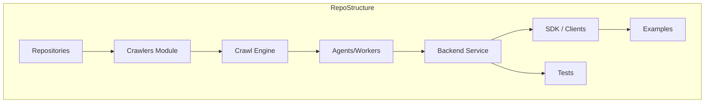
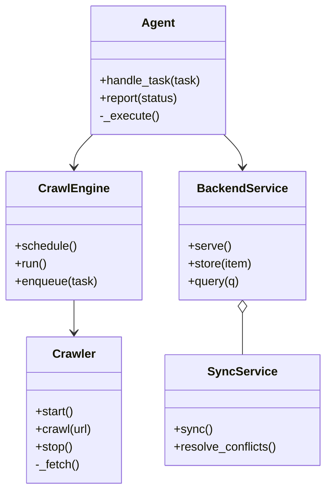

# Diagram: application_service/config/config.test.yml

> Auto-generated by Obscura crawlers

## Diagram 1

### SVG

<svg id="container" width="1660.421875" xmlns="http://www.w3.org/2000/svg" class="flowchart" height="244" viewBox="0 0 1660.421875 244" role="graphics-document document" aria-roledescription="flowchart-v2"><g><marker id="container_flowchart-v2-pointEnd" class="marker flowchart-v2" viewBox="0 0 10 10" refX="5" refY="5" markerUnits="userSpaceOnUse" markerWidth="8" markerHeight="8" orient="auto"><path d="M 0 0 L 10 5 L 0 10 z" class="arrowMarkerPath" style="stroke-width: 1; stroke-dasharray: 1, 0;"></path></marker><marker id="container_flowchart-v2-pointStart" class="marker flowchart-v2" viewBox="0 0 10 10" refX="4.5" refY="5" markerUnits="userSpaceOnUse" markerWidth="8" markerHeight="8" orient="auto"><path d="M 0 5 L 10 10 L 10 0 z" class="arrowMarkerPath" style="stroke-width: 1; stroke-dasharray: 1, 0;"></path></marker><marker id="container_flowchart-v2-circleEnd" class="marker flowchart-v2" viewBox="0 0 10 10" refX="11" refY="5" markerUnits="userSpaceOnUse" markerWidth="11" markerHeight="11" orient="auto"><circle cx="5" cy="5" r="5" class="arrowMarkerPath" style="stroke-width: 1; stroke-dasharray: 1, 0;"></circle></marker><marker id="container_flowchart-v2-circleStart" class="marker flowchart-v2" viewBox="0 0 10 10" refX="-1" refY="5" markerUnits="userSpaceOnUse" markerWidth="11" markerHeight="11" orient="auto"><circle cx="5" cy="5" r="5" class="arrowMarkerPath" style="stroke-width: 1; stroke-dasharray: 1, 0;"></circle></marker><marker id="container_flowchart-v2-crossEnd" class="marker cross flowchart-v2" viewBox="0 0 11 11" refX="12" refY="5.2" markerUnits="userSpaceOnUse" markerWidth="11" markerHeight="11" orient="auto"><path d="M 1,1 l 9,9 M 10,1 l -9,9" class="arrowMarkerPath" style="stroke-width: 2; stroke-dasharray: 1, 0;"></path></marker><marker id="container_flowchart-v2-crossStart" class="marker cross flowchart-v2" viewBox="0 0 11 11" refX="-1" refY="5.2" markerUnits="userSpaceOnUse" markerWidth="11" markerHeight="11" orient="auto"><path d="M 1,1 l 9,9 M 10,1 l -9,9" class="arrowMarkerPath" style="stroke-width: 2; stroke-dasharray: 1, 0;"></path></marker><g class="root"><g class="clusters"></g><g class="edgePaths"></g><g class="edgeLabels"></g><g class="nodes"><g class="root" transform="translate(0, 0)"><g class="clusters"><g class="cluster" id="RepoStructure" data-look="classic"><rect style="" x="8" y="8" width="1644.421875" height="228"></rect><g class="cluster-label" transform="translate(778.1328125, 8)"><foreignObject width="104.15625" height="24">

RepoStructure

</foreignObject></g></g></g><g class="edgePaths"><path d="M196.266,122L202.516,122C208.766,122,221.266,122,233.099,122C244.932,122,256.099,122,261.682,122L267.266,122" id="L_Repos_Crawlers_0" class="edge-thickness-normal edge-pattern-solid edge-thickness-normal edge-pattern-solid flowchart-link" style=";" data-edge="true" data-et="edge" data-id="L_Repos_Crawlers_0" data-points="W3sieCI6MTk2LjI2NTYyNSwieSI6MTIyfSx7IngiOjIzMy43NjU2MjUsInkiOjEyMn0seyJ4IjoyNzEuMjY1NjI1LCJ5IjoxMjJ9XQ==" marker-end="url(#container_flowchart-v2-pointEnd)"></path><path d="M450.688,122L456.938,122C463.188,122,475.688,122,487.521,122C499.354,122,510.521,122,516.104,122L521.688,122" id="L_Crawlers_CrawlEngine_0" class="edge-thickness-normal edge-pattern-solid edge-thickness-normal edge-pattern-solid flowchart-link" style=";" data-edge="true" data-et="edge" data-id="L_Crawlers_CrawlEngine_0" data-points="W3sieCI6NDUwLjY4NzUsInkiOjEyMn0seyJ4Ijo0ODguMTg3NSwieSI6MTIyfSx7IngiOjUyNS42ODc1LCJ5IjoxMjJ9XQ==" marker-end="url(#container_flowchart-v2-pointEnd)"></path><path d="M677.766,122L684.016,122C690.266,122,702.766,122,714.599,122C726.432,122,737.599,122,743.182,122L748.766,122" id="L_CrawlEngine_Agents_0" class="edge-thickness-normal edge-pattern-solid edge-thickness-normal edge-pattern-solid flowchart-link" style=";" data-edge="true" data-et="edge" data-id="L_CrawlEngine_Agents_0" data-points="W3sieCI6Njc3Ljc2NTYyNSwieSI6MTIyfSx7IngiOjcxNS4yNjU2MjUsInkiOjEyMn0seyJ4Ijo3NTIuNzY1NjI1LCJ5IjoxMjJ9XQ==" marker-end="url(#container_flowchart-v2-pointEnd)"></path><path d="M928.422,122L934.672,122C940.922,122,953.422,122,965.255,122C977.089,122,988.255,122,993.839,122L999.422,122" id="L_Agents_Backend_0" class="edge-thickness-normal edge-pattern-solid edge-thickness-normal edge-pattern-solid flowchart-link" style=";" data-edge="true" data-et="edge" data-id="L_Agents_Backend_0" data-points="W3sieCI6OTI4LjQyMTg3NSwieSI6MTIyfSx7IngiOjk2NS45MjE4NzUsInkiOjEyMn0seyJ4IjoxMDAzLjQyMTg3NSwieSI6MTIyfV0=" marker-end="url(#container_flowchart-v2-pointEnd)"></path><path d="M1158.176,95L1168.316,90.833C1178.456,86.667,1198.736,78.333,1214.459,74.167C1230.182,70,1241.349,70,1246.932,70L1252.516,70" id="L_Backend_SDK_0" class="edge-thickness-normal edge-pattern-solid edge-thickness-normal edge-pattern-solid flowchart-link" style=";" data-edge="true" data-et="edge" data-id="L_Backend_SDK_0" data-points="W3sieCI6MTE1OC4xNzU3ODEyNSwieSI6OTV9LHsieCI6MTIxOS4wMTU2MjUsInkiOjcwfSx7IngiOjEyNTYuNTE1NjI1LCJ5Ijo3MH1d" marker-end="url(#container_flowchart-v2-pointEnd)"></path><path d="M1411.109,70L1417.359,70C1423.609,70,1436.109,70,1447.943,70C1459.776,70,1470.943,70,1476.526,70L1482.109,70" id="L_SDK_Examples_0" class="edge-thickness-normal edge-pattern-solid edge-thickness-normal edge-pattern-solid flowchart-link" style=";" data-edge="true" data-et="edge" data-id="L_SDK_Examples_0" data-points="W3sieCI6MTQxMS4xMDkzNzUsInkiOjcwfSx7IngiOjE0NDguNjA5Mzc1LCJ5Ijo3MH0seyJ4IjoxNDg2LjEwOTM3NSwieSI6NzB9XQ==" marker-end="url(#container_flowchart-v2-pointEnd)"></path><path d="M1158.176,149L1168.316,153.167C1178.456,157.333,1198.736,165.667,1219.271,169.833C1239.807,174,1260.599,174,1270.995,174L1281.391,174" id="L_Backend_Tests_0" class="edge-thickness-normal edge-pattern-solid edge-thickness-normal edge-pattern-solid flowchart-link" style=";" data-edge="true" data-et="edge" data-id="L_Backend_Tests_0" data-points="W3sieCI6MTE1OC4xNzU3ODEyNSwieSI6MTQ5fSx7IngiOjEyMTkuMDE1NjI1LCJ5IjoxNzR9LHsieCI6MTI4NS4zOTA2MjUsInkiOjE3NH1d" marker-end="url(#container_flowchart-v2-pointEnd)"></path></g><g class="edgeLabels"><g class="edgeLabel"><g class="label" data-id="L_Repos_Crawlers_0" transform="translate(0, 0)"><foreignObject width="0" height="0">

</foreignObject></g></g><g class="edgeLabel"><g class="label" data-id="L_Crawlers_CrawlEngine_0" transform="translate(0, 0)"><foreignObject width="0" height="0">

</foreignObject></g></g><g class="edgeLabel"><g class="label" data-id="L_CrawlEngine_Agents_0" transform="translate(0, 0)"><foreignObject width="0" height="0">

</foreignObject></g></g><g class="edgeLabel"><g class="label" data-id="L_Agents_Backend_0" transform="translate(0, 0)"><foreignObject width="0" height="0">

</foreignObject></g></g><g class="edgeLabel"><g class="label" data-id="L_Backend_SDK_0" transform="translate(0, 0)"><foreignObject width="0" height="0">

</foreignObject></g></g><g class="edgeLabel"><g class="label" data-id="L_SDK_Examples_0" transform="translate(0, 0)"><foreignObject width="0" height="0">

</foreignObject></g></g><g class="edgeLabel"><g class="label" data-id="L_Backend_Tests_0" transform="translate(0, 0)"><foreignObject width="0" height="0">

</foreignObject></g></g></g><g class="nodes"><g class="node default" id="flowchart-Repos-0" transform="translate(120.8828125, 122)"><rect class="basic label-container" style="" x="-75.3828125" y="-27" width="150.765625" height="54"></rect><g class="label" style="" transform="translate(-45.3828125, -12)"><rect></rect><foreignObject width="90.765625" height="24">

Repositories

</foreignObject></g></g><g class="node default" id="flowchart-Crawlers-1" transform="translate(360.9765625, 122)"><rect class="basic label-container" style="" x="-89.7109375" y="-27" width="179.421875" height="54"></rect><g class="label" style="" transform="translate(-59.7109375, -12)"><rect></rect><foreignObject width="119.421875" height="24">

Crawlers Module

</foreignObject></g></g><g class="node default" id="flowchart-CrawlEngine-2" transform="translate(601.7265625, 122)"><rect class="basic label-container" style="" x="-76.0390625" y="-27" width="152.078125" height="54"></rect><g class="label" style="" transform="translate(-46.0390625, -12)"><rect></rect><foreignObject width="92.078125" height="24">

Crawl Engine

</foreignObject></g></g><g class="node default" id="flowchart-Agents-3" transform="translate(840.59375, 122)"><rect class="basic label-container" style="" x="-87.828125" y="-27" width="175.65625" height="54"></rect><g class="label" style="" transform="translate(-57.828125, -12)"><rect></rect><foreignObject width="115.65625" height="24">

Agents/Workers

</foreignObject></g></g><g class="node default" id="flowchart-Backend-4" transform="translate(1092.46875, 122)"><rect class="basic label-container" style="" x="-89.046875" y="-27" width="178.09375" height="54"></rect><g class="label" style="" transform="translate(-59.046875, -12)"><rect></rect><foreignObject width="118.09375" height="24">

Backend Service

</foreignObject></g></g><g class="node default" id="flowchart-SDK-5" transform="translate(1333.8125, 70)"><rect class="basic label-container" style="" x="-77.296875" y="-27" width="154.59375" height="54"></rect><g class="label" style="" transform="translate(-47.296875, -12)"><rect></rect><foreignObject width="94.59375" height="24">

SDK / Clients

</foreignObject></g></g><g class="node default" id="flowchart-Examples-6" transform="translate(1550.515625, 70)"><rect class="basic label-container" style="" x="-64.40625" y="-27" width="128.8125" height="54"></rect><g class="label" style="" transform="translate(-34.40625, -12)"><rect></rect><foreignObject width="68.8125" height="24">

Examples

</foreignObject></g></g><g class="node default" id="flowchart-Tests-7" transform="translate(1333.8125, 174)"><rect class="basic label-container" style="" x="-48.421875" y="-27" width="96.84375" height="54"></rect><g class="label" style="" transform="translate(-18.421875, -12)"><rect></rect><foreignObject width="36.84375" height="24">

Tests

</foreignObject></g></g></g></g></g></g></g></svg>

## Diagram 2

### SVG

<svg id="container" width="434.8125" xmlns="http://www.w3.org/2000/svg" class="classDiagram" height="662" viewBox="0 0 434.8125 662" role="graphics-document document" aria-roledescription="class"><g><defs><marker id="container_class-aggregationStart" class="marker aggregation class" refX="18" refY="7" markerWidth="190" markerHeight="240" orient="auto"><path d="M 18,7 L9,13 L1,7 L9,1 Z"></path></marker></defs><defs><marker id="container_class-aggregationEnd" class="marker aggregation class" refX="1" refY="7" markerWidth="20" markerHeight="28" orient="auto"><path d="M 18,7 L9,13 L1,7 L9,1 Z"></path></marker></defs><defs><marker id="container_class-extensionStart" class="marker extension class" refX="18" refY="7" markerWidth="190" markerHeight="240" orient="auto"><path d="M 1,7 L18,13 V 1 Z"></path></marker></defs><defs><marker id="container_class-extensionEnd" class="marker extension class" refX="1" refY="7" markerWidth="20" markerHeight="28" orient="auto"><path d="M 1,1 V 13 L18,7 Z"></path></marker></defs><defs><marker id="container_class-compositionStart" class="marker composition class" refX="18" refY="7" markerWidth="190" markerHeight="240" orient="auto"><path d="M 18,7 L9,13 L1,7 L9,1 Z"></path></marker></defs><defs><marker id="container_class-compositionEnd" class="marker composition class" refX="1" refY="7" markerWidth="20" markerHeight="28" orient="auto"><path d="M 18,7 L9,13 L1,7 L9,1 Z"></path></marker></defs><defs><marker id="container_class-dependencyStart" class="marker dependency class" refX="6" refY="7" markerWidth="190" markerHeight="240" orient="auto"><path d="M 5,7 L9,13 L1,7 L9,1 Z"></path></marker></defs><defs><marker id="container_class-dependencyEnd" class="marker dependency class" refX="13" refY="7" markerWidth="20" markerHeight="28" orient="auto"><path d="M 18,7 L9,13 L14,7 L9,1 Z"></path></marker></defs><defs><marker id="container_class-lollipopStart" class="marker lollipop class" refX="13" refY="7" markerWidth="190" markerHeight="240" orient="auto"><circle stroke="black" fill="transparent" cx="7" cy="7" r="6"></circle></marker></defs><defs><marker id="container_class-lollipopEnd" class="marker lollipop class" refX="1" refY="7" markerWidth="190" markerHeight="240" orient="auto"><circle stroke="black" fill="transparent" cx="7" cy="7" r="6"></circle></marker></defs><g class="root"><g class="clusters"></g><g class="edgePaths"><path d="M98.27,406L98.27,410.167C98.27,414.333,98.27,422.667,98.27,430C98.27,437.333,98.27,443.667,98.27,446.833L98.27,450" id="id_CrawlEngine_Crawler_1" class="edge-thickness-normal edge-pattern-solid relation" style=";;;" data-edge="true" data-et="edge" data-id="id_CrawlEngine_Crawler_1" data-points="W3sieCI6OTguMjY5NTMxMjUsInkiOjQwNn0seyJ4Ijo5OC4yNjk1MzEyNSwieSI6NDMxfSx7IngiOjk4LjI2OTUzMTI1LCJ5Ijo0NTZ9XQ==" marker-end="url(#container_class-dependencyEnd)"></path><path d="M123.386,182L119.2,186.167C115.014,190.333,106.642,198.667,102.456,206C98.27,213.333,98.27,219.667,98.27,222.833L98.27,226" id="id_Agent_CrawlEngine_2" class="edge-thickness-normal edge-pattern-solid relation" style=";;;" data-edge="true" data-et="edge" data-id="id_Agent_CrawlEngine_2" data-points="W3sieCI6MTIzLjM4NjM2OTk3NzY3ODU3LCJ5IjoxODJ9LHsieCI6OTguMjY5NTMxMjUsInkiOjIwN30seyJ4Ijo5OC4yNjk1MzEyNSwieSI6MjMyfV0=" marker-end="url(#container_class-dependencyEnd)"></path><path d="M298.2,182L302.386,186.167C306.572,190.333,314.944,198.667,319.13,206C323.316,213.333,323.316,219.667,323.316,222.833L323.316,226" id="id_Agent_BackendService_3" class="edge-thickness-normal edge-pattern-solid relation" style=";;;" data-edge="true" data-et="edge" data-id="id_Agent_BackendService_3" data-points="W3sieCI6Mjk4LjE5OTU2NzUyMjMyMTQ0LCJ5IjoxODJ9LHsieCI6MzIzLjMxNjQwNjI1LCJ5IjoyMDd9LHsieCI6MzIzLjMxNjQwNjI1LCJ5IjoyMzJ9XQ==" marker-end="url(#container_class-dependencyEnd)"></path><path d="M323.316,423.25L323.316,424.542C323.316,425.833,323.316,428.417,323.316,437.875C323.316,447.333,323.316,463.667,323.316,471.833L323.316,480" id="id_BackendService_SyncService_4" class="edge-thickness-normal edge-pattern-solid relation" style=";;;" data-edge="true" data-et="edge" data-id="id_BackendService_SyncService_4" data-points="W3sieCI6MzIzLjMxNjQwNjI1LCJ5Ijo0MDZ9LHsieCI6MzIzLjMxNjQwNjI1LCJ5Ijo0MzF9LHsieCI6MzIzLjMxNjQwNjI1LCJ5Ijo0ODB9XQ==" marker-start="url(#container_class-aggregationStart)"></path></g><g class="edgeLabels"><g class="edgeLabel"><g class="label" data-id="id_CrawlEngine_Crawler_1" transform="translate(0, 0)"><foreignObject width="0" height="0">

</foreignObject></g></g><g class="edgeLabel"><g class="label" data-id="id_Agent_CrawlEngine_2" transform="translate(0, 0)"><foreignObject width="0" height="0">

</foreignObject></g></g><g class="edgeLabel"><g class="label" data-id="id_Agent_BackendService_3" transform="translate(0, 0)"><foreignObject width="0" height="0">

</foreignObject></g></g><g class="edgeLabel"><g class="label" data-id="id_BackendService_SyncService_4" transform="translate(0, 0)"><foreignObject width="0" height="0">

</foreignObject></g></g></g><g class="nodes"><g class="node default" id="classId-Crawler-0" transform="translate(98.26953125, 555)"><g class="basic label-container"><path d="M-64.15625 -99 L64.15625 -99 L64.15625 99 L-64.15625 99" stroke="none" stroke-width="0" fill="#ECECFF" style=""></path><path d="M-64.15625 -99 C-17.6208332838199 -99, 28.914583432360203 -99, 64.15625 -99 M-64.15625 -99 C-36.666698074185774 -99, -9.177146148371556 -99, 64.15625 -99 M64.15625 -99 C64.15625 -32.99672079465459, 64.15625 33.006558410690815, 64.15625 99 M64.15625 -99 C64.15625 -29.30274095744963, 64.15625 40.39451808510074, 64.15625 99 M64.15625 99 C17.839262111409944 99, -28.477725777180112 99, -64.15625 99 M64.15625 99 C18.844511868617325 99, -26.46722626276535 99, -64.15625 99 M-64.15625 99 C-64.15625 32.13107778099682, -64.15625 -34.73784443800636, -64.15625 -99 M-64.15625 99 C-64.15625 47.357393811640854, -64.15625 -4.285212376718292, -64.15625 -99" stroke="#9370DB" stroke-width="1.3" fill="none" stroke-dasharray="0 0" style=""></path></g><g class="annotation-group text" transform="translate(0, -75)"></g><g class="label-group text" transform="translate(-27.734375, -75)"><g class="label" style="font-weight: bolder" transform="translate(0,-12)"><foreignObject width="55.46875" height="24">

Crawler

</foreignObject></g></g><g class="members-group text" transform="translate(-52.15625, -27)"></g><g class="methods-group text" transform="translate(-52.15625, 3)"><g class="label" style="" transform="translate(0,-12)"><foreignObject width="52.15625" height="24">

+start()

</foreignObject></g><g class="label" style="" transform="translate(0,12)"><foreignObject width="76.578125" height="24">

+crawl(url)

</foreignObject></g><g class="label" style="" transform="translate(0,36)"><foreignObject width="50.21875" height="24">

+stop()

</foreignObject></g><g class="label" style="" transform="translate(0,60)"><foreignObject width="60.03125" height="24">

-_fetch()

</foreignObject></g></g><g class="divider" style=""><path d="M-64.15625 -51 C-16.45934127374133 -51, 31.23756745251734 -51, 64.15625 -51 M-64.15625 -51 C-23.208917292327364 -51, 17.738415415345273 -51, 64.15625 -51" stroke="#9370DB" stroke-width="1.3" fill="none" stroke-dasharray="0 0" style=""></path></g><g class="divider" style=""><path d="M-64.15625 -27 C-29.19871110832934 -27, 5.758827783341317 -27, 64.15625 -27 M-64.15625 -27 C-25.251563197887272 -27, 13.653123604225456 -27, 64.15625 -27" stroke="#9370DB" stroke-width="1.3" fill="none" stroke-dasharray="0 0" style=""></path></g></g><g class="node default" id="classId-CrawlEngine-1" transform="translate(98.26953125, 319)"><g class="basic label-container"><path d="M-90.26953125 -87 L90.26953125 -87 L90.26953125 87 L-90.26953125 87" stroke="none" stroke-width="0" fill="#ECECFF" style=""></path><path d="M-90.26953125 -87 C-23.270680453930154 -87, 43.72817034213969 -87, 90.26953125 -87 M-90.26953125 -87 C-41.270503963952926 -87, 7.728523322094148 -87, 90.26953125 -87 M90.26953125 -87 C90.26953125 -43.235924973400564, 90.26953125 0.5281500531988712, 90.26953125 87 M90.26953125 -87 C90.26953125 -48.47312037887453, 90.26953125 -9.946240757749067, 90.26953125 87 M90.26953125 87 C46.355144742253614 87, 2.4407582345072285 87, -90.26953125 87 M90.26953125 87 C26.897252635418276 87, -36.47502597916345 87, -90.26953125 87 M-90.26953125 87 C-90.26953125 45.3359341613238, -90.26953125 3.6718683226475974, -90.26953125 -87 M-90.26953125 87 C-90.26953125 43.00716360260296, -90.26953125 -0.985672794794084, -90.26953125 -87" stroke="#9370DB" stroke-width="1.3" fill="none" stroke-dasharray="0 0" style=""></path></g><g class="annotation-group text" transform="translate(0, -63)"></g><g class="label-group text" transform="translate(-44.5859375, -63)"><g class="label" style="font-weight: bolder" transform="translate(0,-12)"><foreignObject width="89.171875" height="24">

CrawlEngine

</foreignObject></g></g><g class="members-group text" transform="translate(-78.26953125, -15)"></g><g class="methods-group text" transform="translate(-78.26953125, 15)"><g class="label" style="" transform="translate(0,-12)"><foreignObject width="83.78125" height="24">

+schedule()

</foreignObject></g><g class="label" style="" transform="translate(0,12)"><foreignObject width="43.21875" height="24">

+run()

</foreignObject></g><g class="label" style="" transform="translate(0,36)"><foreignObject width="111.953125" height="24">

+enqueue(task)

</foreignObject></g></g><g class="divider" style=""><path d="M-90.26953125 -39 C-21.068307927658083 -39, 48.132915394683835 -39, 90.26953125 -39 M-90.26953125 -39 C-38.87017504369459 -39, 12.529181162610826 -39, 90.26953125 -39" stroke="#9370DB" stroke-width="1.3" fill="none" stroke-dasharray="0 0" style=""></path></g><g class="divider" style=""><path d="M-90.26953125 -15 C-53.02054966192915 -15, -15.771568073858305 -15, 90.26953125 -15 M-90.26953125 -15 C-47.96444912983878 -15, -5.659367009677567 -15, 90.26953125 -15" stroke="#9370DB" stroke-width="1.3" fill="none" stroke-dasharray="0 0" style=""></path></g></g><g class="node default" id="classId-Agent-2" transform="translate(210.79296875, 95)"><g class="basic label-container"><path d="M-90.609375 -87 L90.609375 -87 L90.609375 87 L-90.609375 87" stroke="none" stroke-width="0" fill="#ECECFF" style=""></path><path d="M-90.609375 -87 C-34.98550994764187 -87, 20.638355104716254 -87, 90.609375 -87 M-90.609375 -87 C-30.010882175983923 -87, 30.587610648032154 -87, 90.609375 -87 M90.609375 -87 C90.609375 -25.579459387637314, 90.609375 35.84108122472537, 90.609375 87 M90.609375 -87 C90.609375 -21.71603701327321, 90.609375 43.56792597345358, 90.609375 87 M90.609375 87 C20.311363977125964 87, -49.98664704574807 87, -90.609375 87 M90.609375 87 C48.97098509265625 87, 7.332595185312499 87, -90.609375 87 M-90.609375 87 C-90.609375 43.763179606116616, -90.609375 0.5263592122332312, -90.609375 -87 M-90.609375 87 C-90.609375 47.22023841658068, -90.609375 7.440476833161355, -90.609375 -87" stroke="#9370DB" stroke-width="1.3" fill="none" stroke-dasharray="0 0" style=""></path></g><g class="annotation-group text" transform="translate(0, -63)"></g><g class="label-group text" transform="translate(-21.078125, -63)"><g class="label" style="font-weight: bolder" transform="translate(0,-12)"><foreignObject width="42.15625" height="24">

Agent

</foreignObject></g></g><g class="members-group text" transform="translate(-78.609375, -15)"></g><g class="methods-group text" transform="translate(-78.609375, 15)"><g class="label" style="" transform="translate(0,-12)"><foreignObject width="136.140625" height="24">

+handle_task(task)

</foreignObject></g><g class="label" style="" transform="translate(0,12)"><foreignObject width="107.96875" height="24">

+report(status)

</foreignObject></g><g class="label" style="" transform="translate(0,36)"><foreignObject width="79.515625" height="24">

-_execute()

</foreignObject></g></g><g class="divider" style=""><path d="M-90.609375 -39 C-50.39140263797108 -39, -10.173430275942167 -39, 90.609375 -39 M-90.609375 -39 C-31.705785875684967 -39, 27.197803248630066 -39, 90.609375 -39" stroke="#9370DB" stroke-width="1.3" fill="none" stroke-dasharray="0 0" style=""></path></g><g class="divider" style=""><path d="M-90.609375 -15 C-47.00320383853692 -15, -3.397032677073838 -15, 90.609375 -15 M-90.609375 -15 C-40.22764975969366 -15, 10.154075480612676 -15, 90.609375 -15" stroke="#9370DB" stroke-width="1.3" fill="none" stroke-dasharray="0 0" style=""></path></g></g><g class="node default" id="classId-BackendService-3" transform="translate(323.31640625, 319)"><g class="basic label-container"><path d="M-84.77734375 -87 L84.77734375 -87 L84.77734375 87 L-84.77734375 87" stroke="none" stroke-width="0" fill="#ECECFF" style=""></path><path d="M-84.77734375 -87 C-36.244123026058034 -87, 12.289097697883932 -87, 84.77734375 -87 M-84.77734375 -87 C-45.96518770213055 -87, -7.153031654261099 -87, 84.77734375 -87 M84.77734375 -87 C84.77734375 -41.945437496919425, 84.77734375 3.1091250061611504, 84.77734375 87 M84.77734375 -87 C84.77734375 -45.338895034620904, 84.77734375 -3.6777900692418086, 84.77734375 87 M84.77734375 87 C37.983320421944356 87, -8.810702906111288 87, -84.77734375 87 M84.77734375 87 C43.5908795242227 87, 2.4044152984454 87, -84.77734375 87 M-84.77734375 87 C-84.77734375 30.12110429160436, -84.77734375 -26.757791416791278, -84.77734375 -87 M-84.77734375 87 C-84.77734375 27.857152321173054, -84.77734375 -31.285695357653893, -84.77734375 -87" stroke="#9370DB" stroke-width="1.3" fill="none" stroke-dasharray="0 0" style=""></path></g><g class="annotation-group text" transform="translate(0, -63)"></g><g class="label-group text" transform="translate(-57.9453125, -63)"><g class="label" style="font-weight: bolder" transform="translate(0,-12)"><foreignObject width="115.890625" height="24">

BackendService

</foreignObject></g></g><g class="members-group text" transform="translate(-72.77734375, -15)"></g><g class="methods-group text" transform="translate(-72.77734375, 15)"><g class="label" style="" transform="translate(0,-12)"><foreignObject width="57.25" height="24">

+serve()

</foreignObject></g><g class="label" style="" transform="translate(0,12)"><foreignObject width="87.609375" height="24">

+store(item)

</foreignObject></g><g class="label" style="" transform="translate(0,36)"><foreignObject width="69.578125" height="24">

+query(q)

</foreignObject></g></g><g class="divider" style=""><path d="M-84.77734375 -39 C-20.023765945018113 -39, 44.729811859963775 -39, 84.77734375 -39 M-84.77734375 -39 C-33.70851328988062 -39, 17.36031717023876 -39, 84.77734375 -39" stroke="#9370DB" stroke-width="1.3" fill="none" stroke-dasharray="0 0" style=""></path></g><g class="divider" style=""><path d="M-84.77734375 -15 C-19.276376021808503 -15, 46.224591706382995 -15, 84.77734375 -15 M-84.77734375 -15 C-32.454069814569195 -15, 19.86920412086161 -15, 84.77734375 -15" stroke="#9370DB" stroke-width="1.3" fill="none" stroke-dasharray="0 0" style=""></path></g></g><g class="node default" id="classId-SyncService-4" transform="translate(323.31640625, 555)"><g class="basic label-container"><path d="M-103.49609375 -75 L103.49609375 -75 L103.49609375 75 L-103.49609375 75" stroke="none" stroke-width="0" fill="#ECECFF" style=""></path><path d="M-103.49609375 -75 C-43.0439691063843 -75, 17.408155537231394 -75, 103.49609375 -75 M-103.49609375 -75 C-41.108054468994325 -75, 21.27998481201135 -75, 103.49609375 -75 M103.49609375 -75 C103.49609375 -20.862398664508717, 103.49609375 33.275202670982566, 103.49609375 75 M103.49609375 -75 C103.49609375 -35.10640572278887, 103.49609375 4.787188554422258, 103.49609375 75 M103.49609375 75 C57.28937226148917 75, 11.08265077297834 75, -103.49609375 75 M103.49609375 75 C44.80670890748099 75, -13.882675935038023 75, -103.49609375 75 M-103.49609375 75 C-103.49609375 44.389710847853976, -103.49609375 13.779421695707953, -103.49609375 -75 M-103.49609375 75 C-103.49609375 23.275667223313498, -103.49609375 -28.448665553373004, -103.49609375 -75" stroke="#9370DB" stroke-width="1.3" fill="none" stroke-dasharray="0 0" style=""></path></g><g class="annotation-group text" transform="translate(0, -51)"></g><g class="label-group text" transform="translate(-43.7421875, -51)"><g class="label" style="font-weight: bolder" transform="translate(0,-12)"><foreignObject width="87.484375" height="24">

SyncService

</foreignObject></g></g><g class="members-group text" transform="translate(-91.49609375, -3)"></g><g class="methods-group text" transform="translate(-91.49609375, 27)"><g class="label" style="" transform="translate(0,-12)"><foreignObject width="50.453125" height="24">

+sync()

</foreignObject></g><g class="label" style="" transform="translate(0,12)"><foreignObject width="139.25" height="24">

+resolve_conflicts()

</foreignObject></g></g><g class="divider" style=""><path d="M-103.49609375 -27 C-40.12987582978473 -27, 23.23634209043054 -27, 103.49609375 -27 M-103.49609375 -27 C-60.814752785354855 -27, -18.13341182070971 -27, 103.49609375 -27" stroke="#9370DB" stroke-width="1.3" fill="none" stroke-dasharray="0 0" style=""></path></g><g class="divider" style=""><path d="M-103.49609375 -3 C-38.93838491330264 -3, 25.619323923394717 -3, 103.49609375 -3 M-103.49609375 -3 C-50.179774052741884 -3, 3.1365456445162323 -3, 103.49609375 -3" stroke="#9370DB" stroke-width="1.3" fill="none" stroke-dasharray="0 0" style=""></path></g></g></g></g></g></svg>
