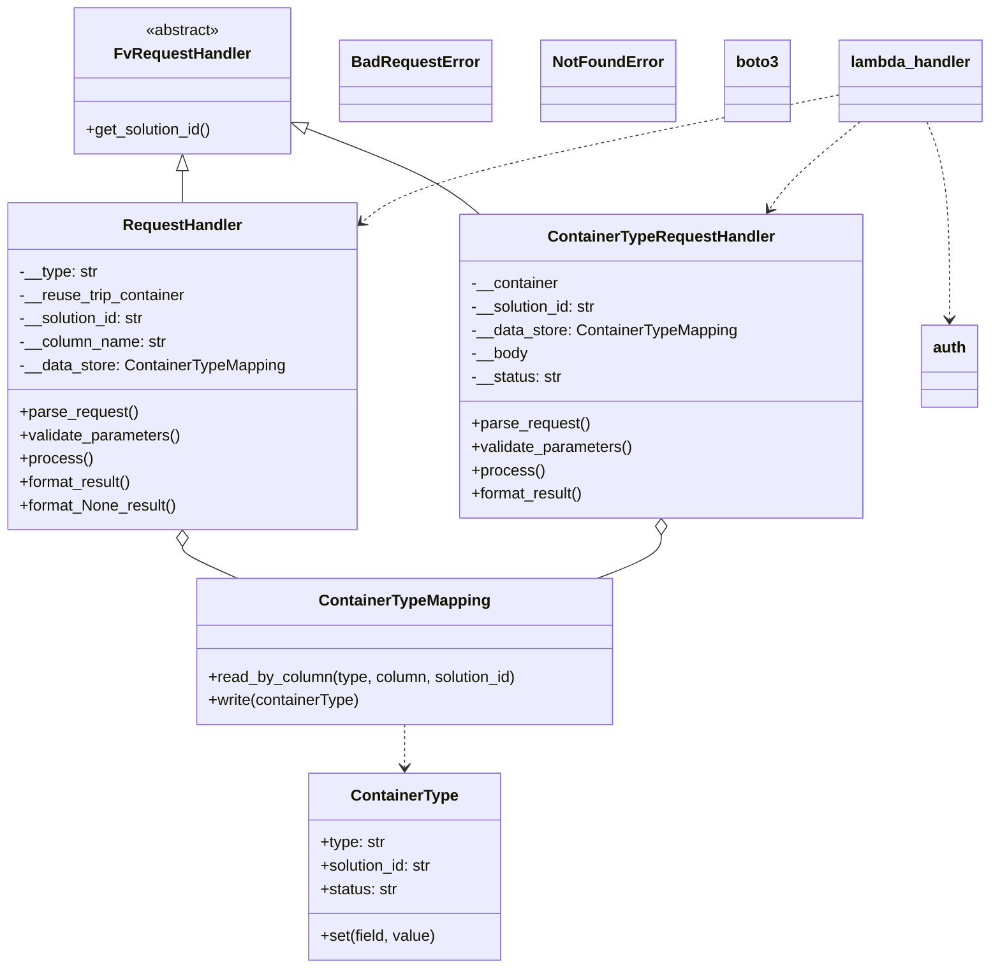
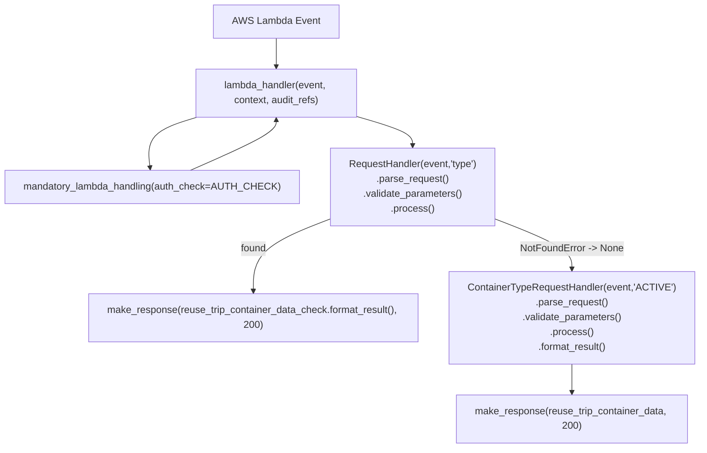

# Diagram: application_service/container_tracking_app_service/api/add_reuse_trip_container_containertype.py

> Auto-generated by Obscura crawlers

## Diagram 1

### SVG

<svg id="container" width="995.2578125" xmlns="http://www.w3.org/2000/svg" class="classDiagram" height="994" viewBox="0 0 995.2578125 994" role="graphics-document document" aria-roledescription="class"><g><defs><marker id="container_class-aggregationStart" class="marker aggregation class" refX="18" refY="7" markerWidth="190" markerHeight="240" orient="auto"><path d="M 18,7 L9,13 L1,7 L9,1 Z"></path></marker></defs><defs><marker id="container_class-aggregationEnd" class="marker aggregation class" refX="1" refY="7" markerWidth="20" markerHeight="28" orient="auto"><path d="M 18,7 L9,13 L1,7 L9,1 Z"></path></marker></defs><defs><marker id="container_class-extensionStart" class="marker extension class" refX="18" refY="7" markerWidth="190" markerHeight="240" orient="auto"><path d="M 1,7 L18,13 V 1 Z"></path></marker></defs><defs><marker id="container_class-extensionEnd" class="marker extension class" refX="1" refY="7" markerWidth="20" markerHeight="28" orient="auto"><path d="M 1,1 V 13 L18,7 Z"></path></marker></defs><defs><marker id="container_class-compositionStart" class="marker composition class" refX="18" refY="7" markerWidth="190" markerHeight="240" orient="auto"><path d="M 18,7 L9,13 L1,7 L9,1 Z"></path></marker></defs><defs><marker id="container_class-compositionEnd" class="marker composition class" refX="1" refY="7" markerWidth="20" markerHeight="28" orient="auto"><path d="M 18,7 L9,13 L1,7 L9,1 Z"></path></marker></defs><defs><marker id="container_class-dependencyStart" class="marker dependency class" refX="6" refY="7" markerWidth="190" markerHeight="240" orient="auto"><path d="M 5,7 L9,13 L1,7 L9,1 Z"></path></marker></defs><defs><marker id="container_class-dependencyEnd" class="marker dependency class" refX="13" refY="7" markerWidth="20" markerHeight="28" orient="auto"><path d="M 18,7 L9,13 L14,7 L9,1 Z"></path></marker></defs><defs><marker id="container_class-lollipopStart" class="marker lollipop class" refX="13" refY="7" markerWidth="190" markerHeight="240" orient="auto"><circle stroke="black" fill="transparent" cx="7" cy="7" r="6"></circle></marker></defs><defs><marker id="container_class-lollipopEnd" class="marker lollipop class" refX="1" refY="7" markerWidth="190" markerHeight="240" orient="auto"><circle stroke="black" fill="transparent" cx="7" cy="7" r="6"></circle></marker></defs><g class="root"><g class="clusters"></g><g class="edgePaths"><path d="M186.41,175.25L186.41,176.542C186.41,177.833,186.41,180.417,186.41,185.875C186.41,191.333,186.41,199.667,186.41,203.833L186.41,208" id="id_FvRequestHandler_RequestHandler_1" class="edge-thickness-normal edge-pattern-solid relation" style=";;;" data-edge="true" data-et="edge" data-id="id_FvRequestHandler_RequestHandler_1" data-points="W3sieCI6MTg2LjQxMDE1NjI1LCJ5IjoxNTh9LHsieCI6MTg2LjQxMDE1NjI1LCJ5IjoxODN9LHsieCI6MTg2LjQxMDE1NjI1LCJ5IjoyMDh9XQ==" marker-start="url(#container_class-extensionStart)"></path><path d="M313.579,133.331L334.494,141.609C355.41,149.887,397.242,166.444,425.273,180.889C453.303,195.333,467.532,207.667,474.647,213.833L481.761,220" id="id_FvRequestHandler_ContainerTypeRequestHandler_2" class="edge-thickness-normal edge-pattern-solid relation" style=";;;" data-edge="true" data-et="edge" data-id="id_FvRequestHandler_ContainerTypeRequestHandler_2" data-points="W3sieCI6Mjk3LjUzOTA2MjUsInkiOjEyNi45ODI4NzAwNDExMjQyN30seyJ4Ijo0MzkuMDc0MjE4NzUsInkiOjE4M30seyJ4Ijo0ODEuNzYxMTExNTYwODgwODYsInkiOjIyMH1d" marker-start="url(#container_class-extensionStart)"></path><path d="M186.41,561.25L186.41,562.542C186.41,563.833,186.41,566.417,195.854,571.875C205.297,577.333,224.184,585.667,233.628,589.833L243.071,594" id="id_RequestHandler_ContainerTypeMapping_3" class="edge-thickness-normal edge-pattern-solid relation" style=";;;" data-edge="true" data-et="edge" data-id="id_RequestHandler_ContainerTypeMapping_3" data-points="W3sieCI6MTg2LjQxMDE1NjI1LCJ5Ijo1NDR9LHsieCI6MTg2LjQxMDE1NjI1LCJ5Ijo1Njl9LHsieCI6MjQzLjA3MTI4OTA2MjUsInkiOjU5NH1d" marker-start="url(#container_class-aggregationStart)"></path><path d="M661.738,549.25L661.738,552.542C661.738,555.833,661.738,562.417,651.376,569.875C641.015,577.333,620.291,585.667,609.929,589.833L599.567,594" id="id_ContainerTypeRequestHandler_ContainerTypeMapping_4" class="edge-thickness-normal edge-pattern-solid relation" style=";;;" data-edge="true" data-et="edge" data-id="id_ContainerTypeRequestHandler_ContainerTypeMapping_4" data-points="W3sieCI6NjYxLjczODI4MTI1LCJ5Ijo1MzJ9LHsieCI6NjYxLjczODI4MTI1LCJ5Ijo1Njl9LHsieCI6NTk5LjU2NzM4MjgxMjUsInkiOjU5NH1d" marker-start="url(#container_class-aggregationStart)"></path><path d="M413.055,744L413.055,748.167C413.055,752.333,413.055,760.667,413.055,768C413.055,775.333,413.055,781.667,413.055,784.833L413.055,788" id="id_ContainerTypeMapping_ContainerType_5" class="edge-thickness-normal edge-pattern-dashed relation" style=";;;" data-edge="true" data-et="edge" data-id="id_ContainerTypeMapping_ContainerType_5" data-points="W3sieCI6NDEzLjA1NDY4NzUsInkiOjc0NH0seyJ4Ijo0MTMuMDU0Njg3NSwieSI6NzY5fSx7IngiOjQxMy4wNTQ2ODc1LCJ5Ijo3OTR9XQ==" marker-end="url(#container_class-dependencyEnd)"></path><path d="M843.305,97.505L772.6,111.754C701.895,126.004,560.484,154.502,481.507,175.613C402.529,196.725,385.984,210.449,377.711,217.312L369.438,224.174" id="id_lambda_handler_RequestHandler_6" class="edge-thickness-normal edge-pattern-dashed relation" style=";;;" data-edge="true" data-et="edge" data-id="id_lambda_handler_RequestHandler_6" data-points="W3sieCI6ODQzLjMwNDY4NzUsInkiOjk3LjUwNTM0OTE3MjIzNjI3fSx7IngiOjQxOS4wNzQyMTg3NSwieSI6MTgzfSx7IngiOjM2NC44MjAzMTI1LCJ5IjoyMjguMDA0ODE4NTA4NDQ0OTd9XQ==" marker-end="url(#container_class-dependencyEnd)"></path><path d="M864.137,125L852.366,134.667C840.595,144.333,817.052,163.667,801.635,178.674C786.217,193.682,778.924,204.363,775.278,209.704L771.631,215.045" id="id_lambda_handler_ContainerTypeRequestHandler_7" class="edge-thickness-normal edge-pattern-dashed relation" style=";;;" data-edge="true" data-et="edge" data-id="id_lambda_handler_ContainerTypeRequestHandler_7" data-points="W3sieCI6ODY0LjEzNzIyNjU2MjUsInkiOjEyNX0seyJ4Ijo3OTMuNTA5NzY1NjI1LCJ5IjoxODN9LHsieCI6NzY4LjI0Nzg3NDgzODA4MjksInkiOjIyMH1d" marker-end="url(#container_class-dependencyEnd)"></path><path d="M932.081,125L935.948,134.667C939.815,144.333,947.548,163.667,951.415,197.5C955.281,231.333,955.281,279.667,955.281,303.833L955.281,328" id="id_lambda_handler_auth_8" class="edge-thickness-normal edge-pattern-dashed relation" style=";;;" data-edge="true" data-et="edge" data-id="id_lambda_handler_auth_8" data-points="W3sieCI6OTMyLjA4MTI1LCJ5IjoxMjV9LHsieCI6OTU1LjI4MTI1LCJ5IjoxODN9LHsieCI6OTU1LjI4MTI1LCJ5IjozMzR9XQ==" marker-end="url(#container_class-dependencyEnd)"></path></g><g class="edgeLabels"><g class="edgeLabel"><g class="label" data-id="id_FvRequestHandler_RequestHandler_1" transform="translate(0, 0)"><foreignObject width="0" height="0">

</foreignObject></g></g><g class="edgeLabel"><g class="label" data-id="id_FvRequestHandler_ContainerTypeRequestHandler_2" transform="translate(0, 0)"><foreignObject width="0" height="0">

</foreignObject></g></g><g class="edgeLabel"><g class="label" data-id="id_RequestHandler_ContainerTypeMapping_3" transform="translate(0, 0)"><foreignObject width="0" height="0">

</foreignObject></g></g><g class="edgeLabel"><g class="label" data-id="id_ContainerTypeRequestHandler_ContainerTypeMapping_4" transform="translate(0, 0)"><foreignObject width="0" height="0">

</foreignObject></g></g><g class="edgeLabel"><g class="label" data-id="id_ContainerTypeMapping_ContainerType_5" transform="translate(0, 0)"><foreignObject width="0" height="0">

</foreignObject></g></g><g class="edgeLabel"><g class="label" data-id="id_lambda_handler_RequestHandler_6" transform="translate(0, 0)"><foreignObject width="0" height="0">

</foreignObject></g></g><g class="edgeLabel"><g class="label" data-id="id_lambda_handler_ContainerTypeRequestHandler_7" transform="translate(0, 0)"><foreignObject width="0" height="0">

</foreignObject></g></g><g class="edgeLabel"><g class="label" data-id="id_lambda_handler_auth_8" transform="translate(0, 0)"><foreignObject width="0" height="0">

</foreignObject></g></g></g><g class="nodes"><g class="node default" id="classId-FvRequestHandler-0" transform="translate(186.41015625, 83)"><g class="basic label-container"><path d="M-111.12890625 -75 L111.12890625 -75 L111.12890625 75 L-111.12890625 75" stroke="none" stroke-width="0" fill="#ECECFF" style=""></path><path d="M-111.12890625 -75 C-59.3459282678399 -75, -7.562950285679804 -75, 111.12890625 -75 M-111.12890625 -75 C-58.20828101505261 -75, -5.287655780105226 -75, 111.12890625 -75 M111.12890625 -75 C111.12890625 -37.82098387343053, 111.12890625 -0.6419677468610558, 111.12890625 75 M111.12890625 -75 C111.12890625 -44.200768431152405, 111.12890625 -13.401536862304809, 111.12890625 75 M111.12890625 75 C62.48168269401857 75, 13.834459138037147 75, -111.12890625 75 M111.12890625 75 C32.67751478374919 75, -45.77387668250162 75, -111.12890625 75 M-111.12890625 75 C-111.12890625 44.4949733221888, -111.12890625 13.989946644377603, -111.12890625 -75 M-111.12890625 75 C-111.12890625 40.84124011284306, -111.12890625 6.68248022568612, -111.12890625 -75" stroke="#9370DB" stroke-width="1.3" fill="none" stroke-dasharray="0 0" style=""></path></g><g class="annotation-group text" transform="translate(-38.609375, -51)"><g class="label" style="" transform="translate(0,-12)"><foreignObject width="77.21875" height="24">

«abstract»

</foreignObject></g></g><g class="label-group text" transform="translate(-66.7890625, -27)"><g class="label" style="font-weight: bolder" transform="translate(0,-12)"><foreignObject width="133.578125" height="24">

FvRequestHandler

</foreignObject></g></g><g class="members-group text" transform="translate(-99.12890625, 21)"></g><g class="methods-group text" transform="translate(-99.12890625, 51)"><g class="label" style="" transform="translate(0,-12)"><foreignObject width="131.46875" height="24">

+get_solution_id()

</foreignObject></g></g><g class="divider" style=""><path d="M-111.12890625 -3 C-43.393265410549105 -3, 24.34237542890179 -3, 111.12890625 -3 M-111.12890625 -3 C-48.744658645014255 -3, 13.63958895997149 -3, 111.12890625 -3" stroke="#9370DB" stroke-width="1.3" fill="none" stroke-dasharray="0 0" style=""></path></g><g class="divider" style=""><path d="M-111.12890625 21 C-55.6866333548588 21, -0.24436045971759768 21, 111.12890625 21 M-111.12890625 21 C-56.04619348671854 21, -0.9634807234370868 21, 111.12890625 21" stroke="#9370DB" stroke-width="1.3" fill="none" stroke-dasharray="0 0" style=""></path></g></g><g class="node default" id="classId-RequestHandler-1" transform="translate(186.41015625, 376)"><g class="basic label-container"><path d="M-178.41015625 -168 L178.41015625 -168 L178.41015625 168 L-178.41015625 168" stroke="none" stroke-width="0" fill="#ECECFF" style=""></path><path d="M-178.41015625 -168 C-101.2600554478312 -168, -24.109954645662413 -168, 178.41015625 -168 M-178.41015625 -168 C-81.24560925125809 -168, 15.918937747483824 -168, 178.41015625 -168 M178.41015625 -168 C178.41015625 -45.820998190208485, 178.41015625 76.35800361958303, 178.41015625 168 M178.41015625 -168 C178.41015625 -75.29639446770749, 178.41015625 17.407211064585027, 178.41015625 168 M178.41015625 168 C60.28920315269589 168, -57.83174994460822 168, -178.41015625 168 M178.41015625 168 C43.30837380573519 168, -91.79340863852963 168, -178.41015625 168 M-178.41015625 168 C-178.41015625 48.800000321286504, -178.41015625 -70.39999935742699, -178.41015625 -168 M-178.41015625 168 C-178.41015625 33.90554116928217, -178.41015625 -100.18891766143565, -178.41015625 -168" stroke="#9370DB" stroke-width="1.3" fill="none" stroke-dasharray="0 0" style=""></path></g><g class="annotation-group text" transform="translate(0, -144)"></g><g class="label-group text" transform="translate(-59.0703125, -144)"><g class="label" style="font-weight: bolder" transform="translate(0,-12)"><foreignObject width="118.140625" height="24">

RequestHandler

</foreignObject></g></g><g class="members-group text" transform="translate(-166.41015625, -96)"><g class="label" style="" transform="translate(0,-12)"><foreignObject width="80.625" height="24">

-__type: str

</foreignObject></g><g class="label" style="" transform="translate(0,12)"><foreignObject width="172.109375" height="24">

-__reuse_trip_container

</foreignObject></g><g class="label" style="" transform="translate(0,36)"><foreignObject width="131.390625" height="24">

-__solution_id: str

</foreignObject></g><g class="label" style="" transform="translate(0,60)"><foreignObject width="151.4375" height="24">

-__column_name: str

</foreignObject></g><g class="label" style="" transform="translate(0,84)"><foreignObject width="273.75" height="24">

-__data_store: ContainerTypeMapping

</foreignObject></g></g><g class="methods-group text" transform="translate(-166.41015625, 48)"><g class="label" style="" transform="translate(0,-12)"><foreignObject width="121.796875" height="24">

+parse_request()

</foreignObject></g><g class="label" style="" transform="translate(0,12)"><foreignObject width="166.546875" height="24">

+validate_parameters()

</foreignObject></g><g class="label" style="" transform="translate(0,36)"><foreignObject width="73.734375" height="24">

+process()

</foreignObject></g><g class="label" style="" transform="translate(0,60)"><foreignObject width="117.015625" height="24">

+format_result()

</foreignObject></g><g class="label" style="" transform="translate(0,84)"><foreignObject width="163.390625" height="24">

+format_None_result()

</foreignObject></g></g><g class="divider" style=""><path d="M-178.41015625 -120 C-51.977173364749405 -120, 74.45580952050119 -120, 178.41015625 -120 M-178.41015625 -120 C-47.54569001718687 -120, 83.31877621562626 -120, 178.41015625 -120" stroke="#9370DB" stroke-width="1.3" fill="none" stroke-dasharray="0 0" style=""></path></g><g class="divider" style=""><path d="M-178.41015625 24 C-91.88181921410491 24, -5.353482178209816 24, 178.41015625 24 M-178.41015625 24 C-98.39757002193892 24, -18.384983793877836 24, 178.41015625 24" stroke="#9370DB" stroke-width="1.3" fill="none" stroke-dasharray="0 0" style=""></path></g></g><g class="node default" id="classId-ContainerTypeRequestHandler-2" transform="translate(661.73828125, 376)"><g class="basic label-container"><path d="M-204.87890625 -156 L204.87890625 -156 L204.87890625 156 L-204.87890625 156" stroke="none" stroke-width="0" fill="#ECECFF" style=""></path><path d="M-204.87890625 -156 C-80.60380756723026 -156, 43.671291115539475 -156, 204.87890625 -156 M-204.87890625 -156 C-79.20124895287628 -156, 46.47640834424743 -156, 204.87890625 -156 M204.87890625 -156 C204.87890625 -48.49724491366533, 204.87890625 59.00551017266935, 204.87890625 156 M204.87890625 -156 C204.87890625 -50.154093005409294, 204.87890625 55.69181398918141, 204.87890625 156 M204.87890625 156 C49.6909296181808 156, -105.4970470136384 156, -204.87890625 156 M204.87890625 156 C67.21234562342562 156, -70.45421500314876 156, -204.87890625 156 M-204.87890625 156 C-204.87890625 38.35358822538252, -204.87890625 -79.29282354923495, -204.87890625 -156 M-204.87890625 156 C-204.87890625 83.28564742645374, -204.87890625 10.57129485290747, -204.87890625 -156" stroke="#9370DB" stroke-width="1.3" fill="none" stroke-dasharray="0 0" style=""></path></g><g class="annotation-group text" transform="translate(0, -132)"></g><g class="label-group text" transform="translate(-112.0078125, -132)"><g class="label" style="font-weight: bolder" transform="translate(0,-12)"><foreignObject width="224.015625" height="24">

ContainerTypeRequestHandler

</foreignObject></g></g><g class="members-group text" transform="translate(-192.87890625, -84)"><g class="label" style="" transform="translate(0,-12)"><foreignObject width="90.53125" height="24">

-__container

</foreignObject></g><g class="label" style="" transform="translate(0,12)"><foreignObject width="131.390625" height="24">

-__solution_id: str

</foreignObject></g><g class="label" style="" transform="translate(0,36)"><foreignObject width="273.75" height="24">

-__data_store: ContainerTypeMapping

</foreignObject></g><g class="label" style="" transform="translate(0,60)"><foreignObject width="57.9375" height="24">

-__body

</foreignObject></g><g class="label" style="" transform="translate(0,84)"><foreignObject width="93.5625" height="24">

-__status: str

</foreignObject></g></g><g class="methods-group text" transform="translate(-192.87890625, 60)"><g class="label" style="" transform="translate(0,-12)"><foreignObject width="121.796875" height="24">

+parse_request()

</foreignObject></g><g class="label" style="" transform="translate(0,12)"><foreignObject width="166.546875" height="24">

+validate_parameters()

</foreignObject></g><g class="label" style="" transform="translate(0,36)"><foreignObject width="73.734375" height="24">

+process()

</foreignObject></g><g class="label" style="" transform="translate(0,60)"><foreignObject width="117.015625" height="24">

+format_result()

</foreignObject></g></g><g class="divider" style=""><path d="M-204.87890625 -108 C-121.83923558176816 -108, -38.79956491353633 -108, 204.87890625 -108 M-204.87890625 -108 C-47.28036273130198 -108, 110.31818078739605 -108, 204.87890625 -108" stroke="#9370DB" stroke-width="1.3" fill="none" stroke-dasharray="0 0" style=""></path></g><g class="divider" style=""><path d="M-204.87890625 36 C-102.72430118008846 36, -0.5696961101769205 36, 204.87890625 36 M-204.87890625 36 C-100.39747060148244 36, 4.083965047035122 36, 204.87890625 36" stroke="#9370DB" stroke-width="1.3" fill="none" stroke-dasharray="0 0" style=""></path></g></g><g class="node default" id="classId-ContainerTypeMapping-3" transform="translate(413.0546875, 669)"><g class="basic label-container"><path d="M-215.01171875 -75 L215.01171875 -75 L215.01171875 75 L-215.01171875 75" stroke="none" stroke-width="0" fill="#ECECFF" style=""></path><path d="M-215.01171875 -75 C-89.83310069135777 -75, 35.34551736728446 -75, 215.01171875 -75 M-215.01171875 -75 C-95.28976958196658 -75, 24.432179586066837 -75, 215.01171875 -75 M215.01171875 -75 C215.01171875 -33.62351891225548, 215.01171875 7.752962175489046, 215.01171875 75 M215.01171875 -75 C215.01171875 -31.649593519704098, 215.01171875 11.700812960591804, 215.01171875 75 M215.01171875 75 C43.69572315637049 75, -127.62027243725902 75, -215.01171875 75 M215.01171875 75 C46.16633497802047 75, -122.67904879395905 75, -215.01171875 75 M-215.01171875 75 C-215.01171875 40.19490127384692, -215.01171875 5.389802547693833, -215.01171875 -75 M-215.01171875 75 C-215.01171875 29.701547580842146, -215.01171875 -15.596904838315709, -215.01171875 -75" stroke="#9370DB" stroke-width="1.3" fill="none" stroke-dasharray="0 0" style=""></path></g><g class="annotation-group text" transform="translate(0, -51)"></g><g class="label-group text" transform="translate(-84.4453125, -51)"><g class="label" style="font-weight: bolder" transform="translate(0,-12)"><foreignObject width="168.890625" height="24">

ContainerTypeMapping

</foreignObject></g></g><g class="members-group text" transform="translate(-203.01171875, -3)"></g><g class="methods-group text" transform="translate(-203.01171875, 27)"><g class="label" style="" transform="translate(0,-12)"><foreignObject width="321.578125" height="24">

+read_by_column(type, column, solution_id)

</foreignObject></g><g class="label" style="" transform="translate(0,12)"><foreignObject width="157.703125" height="24">

+write(containerType)

</foreignObject></g></g><g class="divider" style=""><path d="M-215.01171875 -27 C-81.5927912139621 -27, 51.8261363220758 -27, 215.01171875 -27 M-215.01171875 -27 C-95.16994447402188 -27, 24.67182980195625 -27, 215.01171875 -27" stroke="#9370DB" stroke-width="1.3" fill="none" stroke-dasharray="0 0" style=""></path></g><g class="divider" style=""><path d="M-215.01171875 -3 C-45.4220415702801 -3, 124.1676356094398 -3, 215.01171875 -3 M-215.01171875 -3 C-122.3095387969486 -3, -29.607358843897202 -3, 215.01171875 -3" stroke="#9370DB" stroke-width="1.3" fill="none" stroke-dasharray="0 0" style=""></path></g></g><g class="node default" id="classId-ContainerType-4" transform="translate(413.0546875, 890)"><g class="basic label-container"><path d="M-98.1640625 -96 L98.1640625 -96 L98.1640625 96 L-98.1640625 96" stroke="none" stroke-width="0" fill="#ECECFF" style=""></path><path d="M-98.1640625 -96 C-46.54475806271267 -96, 5.074546374574666 -96, 98.1640625 -96 M-98.1640625 -96 C-55.08762764055297 -96, -12.011192781105933 -96, 98.1640625 -96 M98.1640625 -96 C98.1640625 -39.16758119857759, 98.1640625 17.664837602844827, 98.1640625 96 M98.1640625 -96 C98.1640625 -52.58304538025946, 98.1640625 -9.166090760518927, 98.1640625 96 M98.1640625 96 C49.90383979782503 96, 1.6436170956500575 96, -98.1640625 96 M98.1640625 96 C26.899807034427695 96, -44.36444843114461 96, -98.1640625 96 M-98.1640625 96 C-98.1640625 26.86725488063864, -98.1640625 -42.26549023872272, -98.1640625 -96 M-98.1640625 96 C-98.1640625 37.33072541093536, -98.1640625 -21.338549178129284, -98.1640625 -96" stroke="#9370DB" stroke-width="1.3" fill="none" stroke-dasharray="0 0" style=""></path></g><g class="annotation-group text" transform="translate(0, -72)"></g><g class="label-group text" transform="translate(-52.9375, -72)"><g class="label" style="font-weight: bolder" transform="translate(0,-12)"><foreignObject width="105.875" height="24">

ContainerType

</foreignObject></g></g><g class="members-group text" transform="translate(-86.1640625, -24)"><g class="label" style="" transform="translate(0,-12)"><foreignObject width="67.203125" height="24">

+type: str

</foreignObject></g><g class="label" style="" transform="translate(0,12)"><foreignObject width="117.71875" height="24">

+solution_id: str

</foreignObject></g><g class="label" style="" transform="translate(0,36)"><foreignObject width="79.890625" height="24">

+status: str

</foreignObject></g></g><g class="methods-group text" transform="translate(-86.1640625, 72)"><g class="label" style="" transform="translate(0,-12)"><foreignObject width="119.390625" height="24">

+set(field, value)

</foreignObject></g></g><g class="divider" style=""><path d="M-98.1640625 -48 C-35.036559604933515 -48, 28.09094329013297 -48, 98.1640625 -48 M-98.1640625 -48 C-58.64143724170379 -48, -19.118811983407582 -48, 98.1640625 -48" stroke="#9370DB" stroke-width="1.3" fill="none" stroke-dasharray="0 0" style=""></path></g><g class="divider" style=""><path d="M-98.1640625 48 C-50.75452926716183 48, -3.344996034323657 48, 98.1640625 48 M-98.1640625 48 C-24.234111162298632 48, 49.695840175402736 48, 98.1640625 48" stroke="#9370DB" stroke-width="1.3" fill="none" stroke-dasharray="0 0" style=""></path></g></g><g class="node default" id="classId-BadRequestError-5" transform="translate(421.8203125, 83)"><g class="basic label-container"><path d="M-74.28125 -42 L74.28125 -42 L74.28125 42 L-74.28125 42" stroke="none" stroke-width="0" fill="#ECECFF" style=""></path><path d="M-74.28125 -42 C-37.13140144278813 -42, 0.018447114423736366 -42, 74.28125 -42 M-74.28125 -42 C-15.743888104662105 -42, 42.79347379067579 -42, 74.28125 -42 M74.28125 -42 C74.28125 -15.521914344559168, 74.28125 10.956171310881665, 74.28125 42 M74.28125 -42 C74.28125 -18.82535831391157, 74.28125 4.349283372176863, 74.28125 42 M74.28125 42 C27.86017395967385 42, -18.560902080652298 42, -74.28125 42 M74.28125 42 C42.96317746167573 42, 11.645104923351454 42, -74.28125 42 M-74.28125 42 C-74.28125 15.218408774374161, -74.28125 -11.563182451251677, -74.28125 -42 M-74.28125 42 C-74.28125 23.084682094784448, -74.28125 4.1693641895688955, -74.28125 -42" stroke="#9370DB" stroke-width="1.3" fill="none" stroke-dasharray="0 0" style=""></path></g><g class="annotation-group text" transform="translate(0, -18)"></g><g class="label-group text" transform="translate(-62.28125, -18)"><g class="label" style="font-weight: bolder" transform="translate(0,-12)"><foreignObject width="124.5625" height="24">

BadRequestError

</foreignObject></g></g><g class="members-group text" transform="translate(-62.28125, 30)"></g><g class="methods-group text" transform="translate(-62.28125, 60)"></g><g class="divider" style=""><path d="M-74.28125 6 C-29.84950034432761 6, 14.582249311344782 6, 74.28125 6 M-74.28125 6 C-44.387263557924705 6, -14.49327711584941 6, 74.28125 6" stroke="#9370DB" stroke-width="1.3" fill="none" stroke-dasharray="0 0" style=""></path></g><g class="divider" style=""><path d="M-74.28125 24 C-17.751609013021387 24, 38.778031973957226 24, 74.28125 24 M-74.28125 24 C-17.71109104326169 24, 38.85906791347662 24, 74.28125 24" stroke="#9370DB" stroke-width="1.3" fill="none" stroke-dasharray="0 0" style=""></path></g></g><g class="node default" id="classId-NotFoundError-6" transform="translate(611.6328125, 83)"><g class="basic label-container"><path d="M-65.53125 -42 L65.53125 -42 L65.53125 42 L-65.53125 42" stroke="none" stroke-width="0" fill="#ECECFF" style=""></path><path d="M-65.53125 -42 C-36.96361433801975 -42, -8.395978676039498 -42, 65.53125 -42 M-65.53125 -42 C-33.41113314954593 -42, -1.291016299091865 -42, 65.53125 -42 M65.53125 -42 C65.53125 -17.840523637265047, 65.53125 6.318952725469906, 65.53125 42 M65.53125 -42 C65.53125 -24.945699880246483, 65.53125 -7.891399760492966, 65.53125 42 M65.53125 42 C13.268045576998851 42, -38.9951588460023 42, -65.53125 42 M65.53125 42 C30.807590212365568 42, -3.916069575268864 42, -65.53125 42 M-65.53125 42 C-65.53125 19.302482927763723, -65.53125 -3.395034144472554, -65.53125 -42 M-65.53125 42 C-65.53125 15.935875550518507, -65.53125 -10.128248898962987, -65.53125 -42" stroke="#9370DB" stroke-width="1.3" fill="none" stroke-dasharray="0 0" style=""></path></g><g class="annotation-group text" transform="translate(0, -18)"></g><g class="label-group text" transform="translate(-53.53125, -18)"><g class="label" style="font-weight: bolder" transform="translate(0,-12)"><foreignObject width="107.0625" height="24">

NotFoundError

</foreignObject></g></g><g class="members-group text" transform="translate(-53.53125, 30)"></g><g class="methods-group text" transform="translate(-53.53125, 60)"></g><g class="divider" style=""><path d="M-65.53125 6 C-38.46205829905729 6, -11.392866598114573 6, 65.53125 6 M-65.53125 6 C-37.50700496116973 6, -9.482759922339447 6, 65.53125 6" stroke="#9370DB" stroke-width="1.3" fill="none" stroke-dasharray="0 0" style=""></path></g><g class="divider" style=""><path d="M-65.53125 24 C-19.85991284631705 24, 25.811424307365897 24, 65.53125 24 M-65.53125 24 C-35.41095263120938 24, -5.29065526241876 24, 65.53125 24" stroke="#9370DB" stroke-width="1.3" fill="none" stroke-dasharray="0 0" style=""></path></g></g><g class="node default" id="classId-auth-7" transform="translate(955.28125, 376)"><g class="basic label-container"><path d="M-28.6640625 -42 L28.6640625 -42 L28.6640625 42 L-28.6640625 42" stroke="none" stroke-width="0" fill="#ECECFF" style=""></path><path d="M-28.6640625 -42 C-10.660610562522987 -42, 7.342841374954027 -42, 28.6640625 -42 M-28.6640625 -42 C-7.389736255091556 -42, 13.884589989816888 -42, 28.6640625 -42 M28.6640625 -42 C28.6640625 -21.223811905599014, 28.6640625 -0.44762381119802797, 28.6640625 42 M28.6640625 -42 C28.6640625 -22.177898806256636, 28.6640625 -2.355797612513271, 28.6640625 42 M28.6640625 42 C9.9691189443184 42, -8.725824611363201 42, -28.6640625 42 M28.6640625 42 C16.72842159746819 42, 4.792780694936383 42, -28.6640625 42 M-28.6640625 42 C-28.6640625 19.389444454456342, -28.6640625 -3.221111091087316, -28.6640625 -42 M-28.6640625 42 C-28.6640625 12.934066733171477, -28.6640625 -16.131866533657046, -28.6640625 -42" stroke="#9370DB" stroke-width="1.3" fill="none" stroke-dasharray="0 0" style=""></path></g><g class="annotation-group text" transform="translate(0, -18)"></g><g class="label-group text" transform="translate(-16.6640625, -18)"><g class="label" style="font-weight: bolder" transform="translate(0,-12)"><foreignObject width="33.328125" height="24">

auth

</foreignObject></g></g><g class="members-group text" transform="translate(-16.6640625, 30)"></g><g class="methods-group text" transform="translate(-16.6640625, 60)"></g><g class="divider" style=""><path d="M-28.6640625 6 C-15.091958162728568 6, -1.5198538254571368 6, 28.6640625 6 M-28.6640625 6 C-8.54708194958831 6, 11.569898600823379 6, 28.6640625 6" stroke="#9370DB" stroke-width="1.3" fill="none" stroke-dasharray="0 0" style=""></path></g><g class="divider" style=""><path d="M-28.6640625 24 C-7.772592989972075 24, 13.11887652005585 24, 28.6640625 24 M-28.6640625 24 C-13.449417540116993 24, 1.7652274197660134 24, 28.6640625 24" stroke="#9370DB" stroke-width="1.3" fill="none" stroke-dasharray="0 0" style=""></path></g></g><g class="node default" id="classId-boto3-8" transform="translate(760.234375, 83)"><g class="basic label-container"><path d="M-33.0703125 -42 L33.0703125 -42 L33.0703125 42 L-33.0703125 42" stroke="none" stroke-width="0" fill="#ECECFF" style=""></path><path d="M-33.0703125 -42 C-17.083764711221733 -42, -1.0972169224434687 -42, 33.0703125 -42 M-33.0703125 -42 C-15.030970647364057 -42, 3.008371205271885 -42, 33.0703125 -42 M33.0703125 -42 C33.0703125 -24.709063375679115, 33.0703125 -7.41812675135823, 33.0703125 42 M33.0703125 -42 C33.0703125 -20.564278476644223, 33.0703125 0.8714430467115548, 33.0703125 42 M33.0703125 42 C7.799833362377768 42, -17.470645775244463 42, -33.0703125 42 M33.0703125 42 C18.326942374406492 42, 3.5835722488129846 42, -33.0703125 42 M-33.0703125 42 C-33.0703125 17.95258327354372, -33.0703125 -6.09483345291256, -33.0703125 -42 M-33.0703125 42 C-33.0703125 25.187881039360214, -33.0703125 8.375762078720427, -33.0703125 -42" stroke="#9370DB" stroke-width="1.3" fill="none" stroke-dasharray="0 0" style=""></path></g><g class="annotation-group text" transform="translate(0, -18)"></g><g class="label-group text" transform="translate(-21.0703125, -18)"><g class="label" style="font-weight: bolder" transform="translate(0,-12)"><foreignObject width="42.140625" height="24">

boto3

</foreignObject></g></g><g class="members-group text" transform="translate(-21.0703125, 30)"></g><g class="methods-group text" transform="translate(-21.0703125, 60)"></g><g class="divider" style=""><path d="M-33.0703125 6 C-12.281528972514632 6, 8.507254554970736 6, 33.0703125 6 M-33.0703125 6 C-10.362614659686802 6, 12.345083180626396 6, 33.0703125 6" stroke="#9370DB" stroke-width="1.3" fill="none" stroke-dasharray="0 0" style=""></path></g><g class="divider" style=""><path d="M-33.0703125 24 C-14.431654278138538 24, 4.207003943722924 24, 33.0703125 24 M-33.0703125 24 C-14.74900805685796 24, 3.57229638628408 24, 33.0703125 24" stroke="#9370DB" stroke-width="1.3" fill="none" stroke-dasharray="0 0" style=""></path></g></g><g class="node default" id="classId-lambda_handler-9" transform="translate(915.28125, 83)"><g class="basic label-container"><path d="M-71.9765625 -42 L71.9765625 -42 L71.9765625 42 L-71.9765625 42" stroke="none" stroke-width="0" fill="#ECECFF" style=""></path><path d="M-71.9765625 -42 C-14.613344315689574 -42, 42.74987386862085 -42, 71.9765625 -42 M-71.9765625 -42 C-38.32721028183528 -42, -4.677858063670556 -42, 71.9765625 -42 M71.9765625 -42 C71.9765625 -16.850139670577043, 71.9765625 8.299720658845914, 71.9765625 42 M71.9765625 -42 C71.9765625 -10.353614576630044, 71.9765625 21.292770846739913, 71.9765625 42 M71.9765625 42 C32.081412232888816 42, -7.813738034222368 42, -71.9765625 42 M71.9765625 42 C40.849596883866504 42, 9.722631267733007 42, -71.9765625 42 M-71.9765625 42 C-71.9765625 10.915816061446343, -71.9765625 -20.168367877107315, -71.9765625 -42 M-71.9765625 42 C-71.9765625 14.828766940669912, -71.9765625 -12.342466118660177, -71.9765625 -42" stroke="#9370DB" stroke-width="1.3" fill="none" stroke-dasharray="0 0" style=""></path></g><g class="annotation-group text" transform="translate(0, -18)"></g><g class="label-group text" transform="translate(-59.9765625, -18)"><g class="label" style="font-weight: bolder" transform="translate(0,-12)"><foreignObject width="119.953125" height="24">

lambda_handler

</foreignObject></g></g><g class="members-group text" transform="translate(-59.9765625, 30)"></g><g class="methods-group text" transform="translate(-59.9765625, 60)"></g><g class="divider" style=""><path d="M-71.9765625 6 C-24.906534296920405 6, 22.16349390615919 6, 71.9765625 6 M-71.9765625 6 C-33.7930996527356 6, 4.390363194528803 6, 71.9765625 6" stroke="#9370DB" stroke-width="1.3" fill="none" stroke-dasharray="0 0" style=""></path></g><g class="divider" style=""><path d="M-71.9765625 24 C-32.9766716614918 24, 6.023219177016401 24, 71.9765625 24 M-71.9765625 24 C-42.815999242098236 24, -13.655435984196473 24, 71.9765625 24" stroke="#9370DB" stroke-width="1.3" fill="none" stroke-dasharray="0 0" style=""></path></g></g></g></g></g></svg>

## Diagram 2

### SVG

<svg id="container" width="1720.36328125" xmlns="http://www.w3.org/2000/svg" class="flowchart" height="582" viewBox="0 0 1720.36328125 582" role="graphics-document document" aria-roledescription="flowchart-v2"><g><marker id="container_flowchart-v2-pointEnd" class="marker flowchart-v2" viewBox="0 0 10 10" refX="5" refY="5" markerUnits="userSpaceOnUse" markerWidth="8" markerHeight="8" orient="auto"><path d="M 0 0 L 10 5 L 0 10 z" class="arrowMarkerPath" style="stroke-width: 1; stroke-dasharray: 1, 0;"></path></marker><marker id="container_flowchart-v2-pointStart" class="marker flowchart-v2" viewBox="0 0 10 10" refX="4.5" refY="5" markerUnits="userSpaceOnUse" markerWidth="8" markerHeight="8" orient="auto"><path d="M 0 5 L 10 10 L 10 0 z" class="arrowMarkerPath" style="stroke-width: 1; stroke-dasharray: 1, 0;"></path></marker><marker id="container_flowchart-v2-circleEnd" class="marker flowchart-v2" viewBox="0 0 10 10" refX="11" refY="5" markerUnits="userSpaceOnUse" markerWidth="11" markerHeight="11" orient="auto"><circle cx="5" cy="5" r="5" class="arrowMarkerPath" style="stroke-width: 1; stroke-dasharray: 1, 0;"></circle></marker><marker id="container_flowchart-v2-circleStart" class="marker flowchart-v2" viewBox="0 0 10 10" refX="-1" refY="5" markerUnits="userSpaceOnUse" markerWidth="11" markerHeight="11" orient="auto"><circle cx="5" cy="5" r="5" class="arrowMarkerPath" style="stroke-width: 1; stroke-dasharray: 1, 0;"></circle></marker><marker id="container_flowchart-v2-crossEnd" class="marker cross flowchart-v2" viewBox="0 0 11 11" refX="12" refY="5.2" markerUnits="userSpaceOnUse" markerWidth="11" markerHeight="11" orient="auto"><path d="M 1,1 l 9,9 M 10,1 l -9,9" class="arrowMarkerPath" style="stroke-width: 2; stroke-dasharray: 1, 0;"></path></marker><marker id="container_flowchart-v2-crossStart" class="marker cross flowchart-v2" viewBox="0 0 11 11" refX="-1" refY="5.2" markerUnits="userSpaceOnUse" markerWidth="11" markerHeight="11" orient="auto"><path d="M 1,1 l 9,9 M 10,1 l -9,9" class="arrowMarkerPath" style="stroke-width: 2; stroke-dasharray: 1, 0;"></path></marker><g class="root"><g class="clusters"></g><g class="edgePaths"><path d="M541.492,62L541.492,66.167C541.492,70.333,541.492,78.667,541.492,86.333C541.492,94,541.492,101,541.492,104.5L541.492,108" id="L_Event_Lambda_0" class="edge-thickness-normal edge-pattern-solid edge-thickness-normal edge-pattern-solid flowchart-link" style=";" data-edge="true" data-et="edge" data-id="L_Event_Lambda_0" data-points="W3sieCI6NTQxLjQ5MjE4NzUsInkiOjYyfSx7IngiOjU0MS40OTIxODc1LCJ5Ijo4N30seyJ4Ijo1NDEuNDkyMTg3NSwieSI6MTEyfV0=" marker-end="url(#container_flowchart-v2-pointEnd)"></path><path d="M411.492,177.866L381.546,184.055C351.599,190.244,291.706,202.622,262.434,212.323C233.163,222.024,234.514,229.048,235.189,232.56L235.865,236.072" id="L_Lambda_AuthCheck_0" class="edge-thickness-normal edge-pattern-solid edge-thickness-normal edge-pattern-solid flowchart-link" style=";" data-edge="true" data-et="edge" data-id="L_Lambda_AuthCheck_0" data-points="W3sieCI6NDExLjQ5MjE4NzUsInkiOjE3Ny44NjY0Njk4OTA3NjQxNH0seyJ4IjoyMzEuODEyNSwieSI6MjE1fSx7IngiOjIzNi42MjAxOTIzMDc2OTIzMiwieSI6MjQwfV0=" marker-end="url(#container_flowchart-v2-pointEnd)"></path><path d="M671.492,177.026L703.105,183.355C734.719,189.684,797.945,202.342,829.559,212.171C861.172,222,861.172,229,861.172,232.5L861.172,236" id="L_Lambda_CheckExisting_0" class="edge-thickness-normal edge-pattern-solid edge-thickness-normal edge-pattern-solid flowchart-link" style=";" data-edge="true" data-et="edge" data-id="L_Lambda_CheckExisting_0" data-points="W3sieCI6NjcxLjQ5MjE4NzUsInkiOjE3Ny4wMjYwNTE0Njc1MzM0Mn0seyJ4Ijo4NjEuMTcxODc1LCJ5IjoyMTV9LHsieCI6ODYxLjE3MTg3NSwieSI6MjQwfV0=" marker-end="url(#container_flowchart-v2-pointEnd)"></path><path d="M696.537,294L658.935,300.167C621.333,306.333,546.129,318.667,508.528,330.333C470.926,342,470.926,353,470.926,358.5L470.926,364" id="L_CheckExisting_ReturnExisting_0" class="edge-thickness-normal edge-pattern-solid edge-thickness-normal edge-pattern-solid flowchart-link" style=";" data-edge="true" data-et="edge" data-id="L_CheckExisting_ReturnExisting_0" data-points="W3sieCI6Njk2LjUzNjgwNDE5OTIxODgsInkiOjI5NH0seyJ4Ijo0NzAuOTI1NzgxMjUsInkiOjMzMX0seyJ4Ijo0NzAuOTI1NzgxMjUsInkiOjM2OH1d" marker-end="url(#container_flowchart-v2-pointEnd)"></path><path d="M1025.807,294L1063.409,300.167C1101.011,306.333,1176.214,318.667,1213.816,332.333C1251.418,346,1251.418,361,1251.418,368.5L1251.418,376" id="L_CheckExisting_CreateNew_0" class="edge-thickness-normal edge-pattern-solid edge-thickness-normal edge-pattern-solid flowchart-link" style=";" data-edge="true" data-et="edge" data-id="L_CheckExisting_CreateNew_0" data-points="W3sieCI6MTAyNS44MDY5NDU4MDA3ODEyLCJ5IjoyOTR9LHsieCI6MTI1MS40MTc5Njg3NSwieSI6MzMxfSx7IngiOjEyNTEuNDE3OTY4NzUsInkiOjM4MH1d" marker-end="url(#container_flowchart-v2-pointEnd)"></path><path d="M1251.418,434L1251.418,440.167C1251.418,446.333,1251.418,458.667,1251.418,468.333C1251.418,478,1251.418,485,1251.418,488.5L1251.418,492" id="L_CreateNew_ReturnNew_0" class="edge-thickness-normal edge-pattern-solid edge-thickness-normal edge-pattern-solid flowchart-link" style=";" data-edge="true" data-et="edge" data-id="L_CreateNew_ReturnNew_0" data-points="W3sieCI6MTI1MS40MTc5Njg3NSwieSI6NDM0fSx7IngiOjEyNTEuNDE3OTY4NzUsInkiOjQ3MX0seyJ4IjoxMjUxLjQxNzk2ODc1LCJ5Ijo0OTZ9XQ==" marker-end="url(#container_flowchart-v2-pointEnd)"></path><path d="M397.415,240L421.428,235.833C445.441,231.667,493.467,223.333,517.479,215.667C541.492,208,541.492,201,541.492,197.5L541.492,194" id="L_AuthCheck_Lambda_0" class="edge-thickness-normal edge-pattern-solid edge-thickness-normal edge-pattern-solid flowchart-link" style=";" data-edge="true" data-et="edge" data-id="L_AuthCheck_Lambda_0" data-points="W3sieCI6Mzk3LjQxNTQxNDY2MzQ2MTU1LCJ5IjoyNDB9LHsieCI6NTQxLjQ5MjE4NzUsInkiOjIxNX0seyJ4Ijo1NDEuNDkyMTg3NSwieSI6MTkwfV0=" marker-end="url(#container_flowchart-v2-pointEnd)"></path></g><g class="edgeLabels"><g class="edgeLabel"><g class="label" data-id="L_Event_Lambda_0" transform="translate(0, 0)"><foreignObject width="0" height="0">

</foreignObject></g></g><g class="edgeLabel"><g class="label" data-id="L_Lambda_AuthCheck_0" transform="translate(0, 0)"><foreignObject width="0" height="0">

</foreignObject></g></g><g class="edgeLabel"><g class="label" data-id="L_Lambda_CheckExisting_0" transform="translate(0, 0)"><foreignObject width="0" height="0">

</foreignObject></g></g><g class="edgeLabel" transform="translate(470.92578125, 331)"><g class="label" data-id="L_CheckExisting_ReturnExisting_0" transform="translate(-21.40625, -12)"><foreignObject width="42.8125" height="24">

found

</foreignObject></g></g><g class="edgeLabel" transform="translate(1251.41796875, 331)"><g class="label" data-id="L_CheckExisting_CreateNew_0" transform="translate(-84.0234375, -12)"><foreignObject width="168.046875" height="24">

NotFoundError -&gt; None

</foreignObject></g></g><g class="edgeLabel"><g class="label" data-id="L_CreateNew_ReturnNew_0" transform="translate(0, 0)"><foreignObject width="0" height="0">

</foreignObject></g></g><g class="edgeLabel"><g class="label" data-id="L_AuthCheck_Lambda_0" transform="translate(0, 0)"><foreignObject width="0" height="0">

</foreignObject></g></g></g><g class="nodes"><g class="node default" id="flowchart-Event-0" transform="translate(541.4921875, 35)"><rect class="basic label-container" style="" x="-98.6796875" y="-27" width="197.359375" height="54"></rect><g class="label" style="" transform="translate(-68.6796875, -12)"><rect></rect><foreignObject width="137.359375" height="24">

AWS Lambda Event

</foreignObject></g></g><g class="node default" id="flowchart-Lambda-1" transform="translate(541.4921875, 151)"><rect class="basic label-container" style="" x="-130" y="-39" width="260" height="78"></rect><g class="label" style="" transform="translate(-100, -24)"><rect></rect><foreignObject width="200" height="48">

lambda_handler(event, context, audit_refs)

</foreignObject></g></g><g class="node default" id="flowchart-AuthCheck-3" transform="translate(241.8125, 267)"><rect class="basic label-container" style="" x="-233.8125" y="-27" width="467.625" height="54"></rect><g class="label" style="" transform="translate(-203.8125, -12)"><rect></rect><foreignObject width="407.625" height="24">

mandatory_lambda_handling(auth_check=AUTH_CHECK)

</foreignObject></g></g><g class="node default" id="flowchart-CheckExisting-5" transform="translate(861.171875, 267)"><rect class="basic label-container" style="" x="-335.546875" y="-27" width="671.09375" height="54"></rect><g class="label" style="" transform="translate(-305.546875, -12)"><rect></rect><foreignObject width="611.09375" height="24">

RequestHandler(event,'type')\n.parse_request()\n.validate_parameters()\n.process()

</foreignObject></g></g><g class="node default" id="flowchart-ReturnExisting-7" transform="translate(470.92578125, 407)"><rect class="basic label-container" style="" x="-269.546875" y="-39" width="539.09375" height="78"></rect><g class="label" style="" transform="translate(-239.546875, -24)"><rect></rect><foreignObject width="479.09375" height="48">

make_response(reuse_trip_container_data_check.format_result(), 200)

</foreignObject></g></g><g class="node default" id="flowchart-CreateNew-9" transform="translate(1251.41796875, 407)"><rect class="basic label-container" style="" x="-460.9453125" y="-27" width="921.890625" height="54"></rect><g class="label" style="" transform="translate(-430.9453125, -12)"><rect></rect><foreignObject width="861.890625" height="24">

ContainerTypeRequestHandler(event,'ACTIVE')\n.parse_request()\n.validate_parameters()\n.process()\n.format_result()

</foreignObject></g></g><g class="node default" id="flowchart-ReturnNew-11" transform="translate(1251.41796875, 535)"><rect class="basic label-container" style="" x="-188.28125" y="-39" width="376.5625" height="78"></rect><g class="label" style="" transform="translate(-158.28125, -24)"><rect></rect><foreignObject width="316.5625" height="48">

make_response(reuse_trip_container_data, 200)

</foreignObject></g></g></g></g></g></svg>
