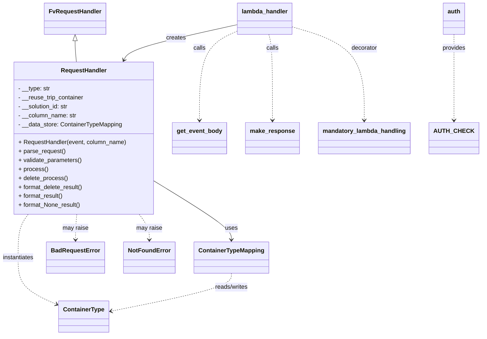

# Diagram: application_service/container_tracking_app_service/api/delete_reuse_trip_container_containertype.py


> Auto-generated by Obscura crawlers

## Diagram 1



### SVG

<svg id="container" width="1254.28125" xmlns="http://www.w3.org/2000/svg" class="classDiagram" height="898" viewBox="0 0 1254.28125 898" role="graphics-document document" aria-roledescription="class"><style>#container{font-family:"trebuchet ms",verdana,arial,sans-serif;font-size:16px;fill:#333;}@keyframes edge-animation-frame{from{stroke-dashoffset:0;}}@keyframes dash{to{stroke-dashoffset:0;}}#container .edge-animation-slow{stroke-dasharray:9,5!important;stroke-dashoffset:900;animation:dash 50s linear infinite;stroke-linecap:round;}#container .edge-animation-fast{stroke-dasharray:9,5!important;stroke-dashoffset:900;animation:dash 20s linear infinite;stroke-linecap:round;}#container .error-icon{fill:#552222;}#container .error-text{fill:#552222;stroke:#552222;}#container .edge-thickness-normal{stroke-width:1px;}#container .edge-thickness-thick{stroke-width:3.5px;}#container .edge-pattern-solid{stroke-dasharray:0;}#container .edge-thickness-invisible{stroke-width:0;fill:none;}#container .edge-pattern-dashed{stroke-dasharray:3;}#container .edge-pattern-dotted{stroke-dasharray:2;}#container .marker{fill:#333333;stroke:#333333;}#container .marker.cross{stroke:#333333;}#container svg{font-family:"trebuchet ms",verdana,arial,sans-serif;font-size:16px;}#container p{margin:0;}#container g.classGroup text{fill:#9370DB;stroke:none;font-family:"trebuchet ms",verdana,arial,sans-serif;font-size:10px;}#container g.classGroup text .title{font-weight:bolder;}#container .nodeLabel,#container .edgeLabel{color:#131300;}#container .edgeLabel .label rect{fill:#ECECFF;}#container .label text{fill:#131300;}#container .labelBkg{background:#ECECFF;}#container .edgeLabel .label span{background:#ECECFF;}#container .classTitle{font-weight:bolder;}#container .node rect,#container .node circle,#container .node ellipse,#container .node polygon,#container .node path{fill:#ECECFF;stroke:#9370DB;stroke-width:1px;}#container .divider{stroke:#9370DB;stroke-width:1;}#container g.clickable{cursor:pointer;}#container g.classGroup rect{fill:#ECECFF;stroke:#9370DB;}#container g.classGroup line{stroke:#9370DB;stroke-width:1;}#container .classLabel .box{stroke:none;stroke-width:0;fill:#ECECFF;opacity:0.5;}#container .classLabel .label{fill:#9370DB;font-size:10px;}#container .relation{stroke:#333333;stroke-width:1;fill:none;}#container .dashed-line{stroke-dasharray:3;}#container .dotted-line{stroke-dasharray:1 2;}#container #compositionStart,#container .composition{fill:#333333!important;stroke:#333333!important;stroke-width:1;}#container #compositionEnd,#container .composition{fill:#333333!important;stroke:#333333!important;stroke-width:1;}#container #dependencyStart,#container .dependency{fill:#333333!important;stroke:#333333!important;stroke-width:1;}#container #dependencyStart,#container .dependency{fill:#333333!important;stroke:#333333!important;stroke-width:1;}#container #extensionStart,#container .extension{fill:transparent!important;stroke:#333333!important;stroke-width:1;}#container #extensionEnd,#container .extension{fill:transparent!important;stroke:#333333!important;stroke-width:1;}#container #aggregationStart,#container .aggregation{fill:transparent!important;stroke:#333333!important;stroke-width:1;}#container #aggregationEnd,#container .aggregation{fill:transparent!important;stroke:#333333!important;stroke-width:1;}#container #lollipopStart,#container .lollipop{fill:#ECECFF!important;stroke:#333333!important;stroke-width:1;}#container #lollipopEnd,#container .lollipop{fill:#ECECFF!important;stroke:#333333!important;stroke-width:1;}#container .edgeTerminals{font-size:11px;line-height:initial;}#container .classTitleText{text-anchor:middle;font-size:18px;fill:#333;}#container .label-icon{display:inline-block;height:1em;overflow:visible;vertical-align:-0.125em;}#container .node .label-icon path{fill:currentColor;stroke:revert;stroke-width:revert;}#container :root{--mermaid-font-family:"trebuchet ms",verdana,arial,sans-serif;}</style><g><defs><marker id="container_class-aggregationStart" class="marker aggregation class" refX="18" refY="7" markerWidth="190" markerHeight="240" orient="auto"><path d="M 18,7 L9,13 L1,7 L9,1 Z"></path></marker></defs><defs><marker id="container_class-aggregationEnd" class="marker aggregation class" refX="1" refY="7" markerWidth="20" markerHeight="28" orient="auto"><path d="M 18,7 L9,13 L1,7 L9,1 Z"></path></marker></defs><defs><marker id="container_class-extensionStart" class="marker extension class" refX="18" refY="7" markerWidth="190" markerHeight="240" orient="auto"><path d="M 1,7 L18,13 V 1 Z"></path></marker></defs><defs><marker id="container_class-extensionEnd" class="marker extension class" refX="1" refY="7" markerWidth="20" markerHeight="28" orient="auto"><path d="M 1,1 V 13 L18,7 Z"></path></marker></defs><defs><marker id="container_class-compositionStart" class="marker composition class" refX="18" refY="7" markerWidth="190" markerHeight="240" orient="auto"><path d="M 18,7 L9,13 L1,7 L9,1 Z"></path></marker></defs><defs><marker id="container_class-compositionEnd" class="marker composition class" refX="1" refY="7" markerWidth="20" markerHeight="28" orient="auto"><path d="M 18,7 L9,13 L1,7 L9,1 Z"></path></marker></defs><defs><marker id="container_class-dependencyStart" class="marker dependency class" refX="6" refY="7" markerWidth="190" markerHeight="240" orient="auto"><path d="M 5,7 L9,13 L1,7 L9,1 Z"></path></marker></defs><defs><marker id="container_class-dependencyEnd" class="marker dependency class" refX="13" refY="7" markerWidth="20" markerHeight="28" orient="auto"><path d="M 18,7 L9,13 L14,7 L9,1 Z"></path></marker></defs><defs><marker id="container_class-lollipopStart" class="marker lollipop class" refX="13" refY="7" markerWidth="190" markerHeight="240" orient="auto"><circle stroke="black" fill="transparent" cx="7" cy="7" r="6"></circle></marker></defs><defs><marker id="container_class-lollipopEnd" class="marker lollipop class" refX="1" refY="7" markerWidth="190" markerHeight="240" orient="auto"><circle stroke="black" fill="transparent" cx="7" cy="7" r="6"></circle></marker></defs><g class="root"><g class="clusters"></g><g class="edgePaths"><path d="M198.832,109.25L198.832,112.542C198.832,115.833,198.832,122.417,199.423,131.875C200.013,141.333,201.195,153.667,201.786,159.833L202.376,166" id="id_FvRequestHandler_RequestHandler_1" class="edge-thickness-normal edge-pattern-solid relation" style=";;;" data-edge="true" data-et="edge" data-id="id_FvRequestHandler_RequestHandler_1" data-points="W3sieCI6MTk4LjgzMjAzMTI1LCJ5Ijo5Mn0seyJ4IjoxOTguODMyMDMxMjUsInkiOjEyOX0seyJ4IjoyMDIuMzc2MzQ1MzA2MDE2NiwieSI6MTY2fV0=" marker-start="url(#container_class-extensionStart)"></path><path d="M408.813,487.608L441.493,508.173C474.174,528.739,539.536,569.869,572.217,595.601C604.898,621.333,604.898,631.667,604.898,636.833L604.898,642" id="id_RequestHandler_ContainerTypeMapping_2" class="edge-thickness-normal edge-pattern-solid relation" style=";;;" data-edge="true" data-et="edge" data-id="id_RequestHandler_ContainerTypeMapping_2" data-points="W3sieCI6NDA4LjgxMjUsInkiOjQ4Ny42MDgwMzkzMjk2ODE5fSx7IngiOjYwNC44OTg0Mzc1LCJ5Ijo2MTF9LHsieCI6NjA0Ljg5ODQzNzUsInkiOjY0OH1d" marker-end="url(#container_class-dependencyEnd)"></path><path d="M77.168,574L72.792,580.167C68.417,586.333,59.665,598.667,55.29,618C50.914,637.333,50.914,663.667,50.914,690C50.914,716.333,50.914,742.667,67.684,763.581C84.454,784.495,117.994,799.989,134.764,807.737L151.534,815.484" id="id_RequestHandler_ContainerType_3" class="edge-thickness-normal edge-pattern-dashed relation" style=";;;" data-edge="true" data-et="edge" data-id="id_RequestHandler_ContainerType_3" data-points="W3sieCI6NzcuMTY3Nzc0MjQ3OTI1MzEsInkiOjU3NH0seyJ4Ijo1MC45MTQwNjI1LCJ5Ijo2MTF9LHsieCI6NTAuOTE0MDYyNSwieSI6NjkwfSx7IngiOjUwLjkxNDA2MjUsInkiOjc2OX0seyJ4IjoxNTYuOTgwNDY4NzUsInkiOjgxOC4wMDAzMTk4MDI2MzYxfV0=" marker-end="url(#container_class-dependencyEnd)"></path><path d="M205.997,574L205.516,580.167C205.034,586.333,204.072,598.667,203.591,610C203.109,621.333,203.109,631.667,203.109,636.833L203.109,642" id="id_RequestHandler_BadRequestError_4" class="edge-thickness-normal edge-pattern-dashed relation" style=";;;" data-edge="true" data-et="edge" data-id="id_RequestHandler_BadRequestError_4" data-points="W3sieCI6MjA1Ljk5NzAwMTQyNjM0ODU2LCJ5Ijo1NzR9LHsieCI6MjAzLjEwOTM3NSwieSI6NjExfSx7IngiOjIwMy4xMDkzNzUsInkiOjY0OH1d" marker-end="url(#container_class-dependencyEnd)"></path><path d="M366.668,574L371.044,580.167C375.419,586.333,384.171,598.667,388.546,610C392.922,621.333,392.922,631.667,392.922,636.833L392.922,642" id="id_RequestHandler_NotFoundError_5" class="edge-thickness-normal edge-pattern-dashed relation" style=";;;" data-edge="true" data-et="edge" data-id="id_RequestHandler_NotFoundError_5" data-points="W3sieCI6MzY2LjY2ODE2MzI1MjA3NDcsInkiOjU3NH0seyJ4IjozOTIuOTIxODc1LCJ5Ijo2MTF9LHsieCI6MzkyLjkyMTg3NSwieSI6NjQ4fV0=" marker-end="url(#container_class-dependencyEnd)"></path><path d="M628.875,65.955L581.472,76.462C534.07,86.97,439.264,107.985,389.179,123.768C339.094,139.551,333.73,150.101,331.047,155.376L328.365,160.652" id="id_lambda_handler_RequestHandler_6" class="edge-thickness-normal edge-pattern-solid relation" style=";;;" data-edge="true" data-et="edge" data-id="id_lambda_handler_RequestHandler_6" data-points="W3sieCI6NjI4Ljg3NSwieSI6NjUuOTU0NzMzMDI4OTk2MDd9LHsieCI6MzQ0LjQ1ODk4NDM3NSwieSI6MTI5fSx7IngiOjMyNS42NDU2MzM0Mjg0MjMyNSwieSI6MTY2fV0=" marker-end="url(#container_class-dependencyEnd)"></path><path d="M772.828,72.045L803.822,81.537C834.815,91.03,896.802,110.015,927.796,151.674C958.789,193.333,958.789,257.667,958.789,289.833L958.789,322" id="id_lambda_handler_mandatory_lambda_handling_7" class="edge-thickness-normal edge-pattern-dashed relation" style=";;;" data-edge="true" data-et="edge" data-id="id_lambda_handler_mandatory_lambda_handling_7" data-points="W3sieCI6NzcyLjgyODEyNSwieSI6NzIuMDQ0Njc1MzA4OTQxMTJ9LHsieCI6OTU4Ljc4OTA2MjUsInkiOjEyOX0seyJ4Ijo5NTguNzg5MDYyNSwieSI6MzI4fV0=" marker-end="url(#container_class-dependencyEnd)"></path><path d="M628.875,83.207L612.332,90.839C595.789,98.471,562.703,113.736,546.16,153.534C529.617,193.333,529.617,257.667,529.617,289.833L529.617,322" id="id_lambda_handler_get_event_body_8" class="edge-thickness-normal edge-pattern-dashed relation" style=";;;" data-edge="true" data-et="edge" data-id="id_lambda_handler_get_event_body_8" data-points="W3sieCI6NjI4Ljg3NSwieSI6ODMuMjA2ODE2MzE1MzU3MjN9LHsieCI6NTI5LjYxNzE4NzUsInkiOjEyOX0seyJ4Ijo1MjkuNjE3MTg3NSwieSI6MzI4fV0=" marker-end="url(#container_class-dependencyEnd)"></path><path d="M710.974,92L712.46,98.167C713.946,104.333,716.918,116.667,718.404,155C719.891,193.333,719.891,257.667,719.891,289.833L719.891,322" id="id_lambda_handler_make_response_9" class="edge-thickness-normal edge-pattern-dashed relation" style=";;;" data-edge="true" data-et="edge" data-id="id_lambda_handler_make_response_9" data-points="W3sieCI6NzEwLjk3MzU5NTcyNzg0ODEsInkiOjkyfSx7IngiOjcxOS44OTA2MjUsInkiOjEyOX0seyJ4Ijo3MTkuODkwNjI1LCJ5IjozMjh9XQ==" marker-end="url(#container_class-dependencyEnd)"></path><path d="M1187.25,92L1187.25,98.167C1187.25,104.333,1187.25,116.667,1187.25,155C1187.25,193.333,1187.25,257.667,1187.25,289.833L1187.25,322" id="id_auth_AUTH_CHECK_10" class="edge-thickness-normal edge-pattern-dashed relation" style=";;;" data-edge="true" data-et="edge" data-id="id_auth_AUTH_CHECK_10" data-points="W3sieCI6MTE4Ny4yNSwieSI6OTJ9LHsieCI6MTE4Ny4yNSwieSI6MTI5fSx7IngiOjExODcuMjUsInkiOjMyOH1d" marker-end="url(#container_class-dependencyEnd)"></path><path d="M604.898,732L604.898,738.167C604.898,744.333,604.898,756.667,552.871,773.565C500.843,790.464,396.787,811.929,344.76,822.661L292.732,833.393" id="id_ContainerTypeMapping_ContainerType_11" class="edge-thickness-normal edge-pattern-dashed relation" style=";;;" data-edge="true" data-et="edge" data-id="id_ContainerTypeMapping_ContainerType_11" data-points="W3sieCI6NjA0Ljg5ODQzNzUsInkiOjczMn0seyJ4Ijo2MDQuODk4NDM3NSwieSI6NzY5fSx7IngiOjI4Ni44NTU0Njg3NSwieSI6ODM0LjYwNDg5Nzg1MDk0M31d" marker-end="url(#container_class-dependencyEnd)"></path></g><g class="edgeLabels"><g class="edgeLabel"><g class="label" data-id="id_FvRequestHandler_RequestHandler_1" transform="translate(0, 0)"><foreignObject width="0" height="0"><div xmlns="http://www.w3.org/1999/xhtml" class="labelBkg" style="display: table-cell; white-space: nowrap; line-height: 1.5; max-width: 200px; text-align: center;"><span class="edgeLabel"></span></div></foreignObject></g></g><g class="edgeLabel" transform="translate(604.8984375, 611)"><g class="label" data-id="id_RequestHandler_ContainerTypeMapping_2" transform="translate(-16.4921875, -12)"><foreignObject width="32.984375" height="24"><div xmlns="http://www.w3.org/1999/xhtml" class="labelBkg" style="display: table-cell; white-space: nowrap; line-height: 1.5; max-width: 200px; text-align: center;"><span class="edgeLabel"><p>uses</p></span></div></foreignObject></g></g><g class="edgeLabel" transform="translate(50.9140625, 690)"><g class="label" data-id="id_RequestHandler_ContainerType_3" transform="translate(-42.9140625, -12)"><foreignObject width="85.828125" height="24"><div xmlns="http://www.w3.org/1999/xhtml" class="labelBkg" style="display: table-cell; white-space: nowrap; line-height: 1.5; max-width: 200px; text-align: center;"><span class="edgeLabel"><p>instantiates</p></span></div></foreignObject></g></g><g class="edgeLabel" transform="translate(203.109375, 611)"><g class="label" data-id="id_RequestHandler_BadRequestError_4" transform="translate(-34.65625, -12)"><foreignObject width="69.3125" height="24"><div xmlns="http://www.w3.org/1999/xhtml" class="labelBkg" style="display: table-cell; white-space: nowrap; line-height: 1.5; max-width: 200px; text-align: center;"><span class="edgeLabel"><p>may raise</p></span></div></foreignObject></g></g><g class="edgeLabel" transform="translate(392.921875, 611)"><g class="label" data-id="id_RequestHandler_NotFoundError_5" transform="translate(-34.65625, -12)"><foreignObject width="69.3125" height="24"><div xmlns="http://www.w3.org/1999/xhtml" class="labelBkg" style="display: table-cell; white-space: nowrap; line-height: 1.5; max-width: 200px; text-align: center;"><span class="edgeLabel"><p>may raise</p></span></div></foreignObject></g></g><g class="edgeLabel" transform="translate(466.40466, 101.96883)"><g class="label" data-id="id_lambda_handler_RequestHandler_6" transform="translate(-26.171875, -12)"><foreignObject width="52.34375" height="24"><div xmlns="http://www.w3.org/1999/xhtml" class="labelBkg" style="display: table-cell; white-space: nowrap; line-height: 1.5; max-width: 200px; text-align: center;"><span class="edgeLabel"><p>creates</p></span></div></foreignObject></g></g><g class="edgeLabel" transform="translate(958.7890625, 129)"><g class="label" data-id="id_lambda_handler_mandatory_lambda_handling_7" transform="translate(-35.171875, -12)"><foreignObject width="70.34375" height="24"><div xmlns="http://www.w3.org/1999/xhtml" class="labelBkg" style="display: table-cell; white-space: nowrap; line-height: 1.5; max-width: 200px; text-align: center;"><span class="edgeLabel"><p>decorator</p></span></div></foreignObject></g></g><g class="edgeLabel" transform="translate(529.6171875, 129)"><g class="label" data-id="id_lambda_handler_get_event_body_8" transform="translate(-16.4453125, -12)"><foreignObject width="32.890625" height="24"><div xmlns="http://www.w3.org/1999/xhtml" class="labelBkg" style="display: table-cell; white-space: nowrap; line-height: 1.5; max-width: 200px; text-align: center;"><span class="edgeLabel"><p>calls</p></span></div></foreignObject></g></g><g class="edgeLabel" transform="translate(719.890625, 129)"><g class="label" data-id="id_lambda_handler_make_response_9" transform="translate(-16.4453125, -12)"><foreignObject width="32.890625" height="24"><div xmlns="http://www.w3.org/1999/xhtml" class="labelBkg" style="display: table-cell; white-space: nowrap; line-height: 1.5; max-width: 200px; text-align: center;"><span class="edgeLabel"><p>calls</p></span></div></foreignObject></g></g><g class="edgeLabel" transform="translate(1187.25, 129)"><g class="label" data-id="id_auth_AUTH_CHECK_10" transform="translate(-31.3125, -12)"><foreignObject width="62.625" height="24"><div xmlns="http://www.w3.org/1999/xhtml" class="labelBkg" style="display: table-cell; white-space: nowrap; line-height: 1.5; max-width: 200px; text-align: center;"><span class="edgeLabel"><p>provides</p></span></div></foreignObject></g></g><g class="edgeLabel" transform="translate(604.8984375, 769)"><g class="label" data-id="id_ContainerTypeMapping_ContainerType_11" transform="translate(-45.9453125, -12)"><foreignObject width="91.890625" height="24"><div xmlns="http://www.w3.org/1999/xhtml" class="labelBkg" style="display: table-cell; white-space: nowrap; line-height: 1.5; max-width: 200px; text-align: center;"><span class="edgeLabel"><p>reads/writes</p></span></div></foreignObject></g></g></g><g class="nodes"><g class="node default" id="classId-FvRequestHandler-0" transform="translate(198.83203125, 50)"><g class="basic label-container"><path d="M-78.7890625 -42 L78.7890625 -42 L78.7890625 42 L-78.7890625 42" stroke="none" stroke-width="0" fill="#ECECFF" style=""></path><path d="M-78.7890625 -42 C-44.68716130351875 -42, -10.585260107037499 -42, 78.7890625 -42 M-78.7890625 -42 C-24.38115830543684 -42, 30.026745889126317 -42, 78.7890625 -42 M78.7890625 -42 C78.7890625 -22.641109057860827, 78.7890625 -3.282218115721655, 78.7890625 42 M78.7890625 -42 C78.7890625 -18.611560749004546, 78.7890625 4.7768785019909075, 78.7890625 42 M78.7890625 42 C20.33899676394695 42, -38.1110689721061 42, -78.7890625 42 M78.7890625 42 C41.550282829765436 42, 4.311503159530872 42, -78.7890625 42 M-78.7890625 42 C-78.7890625 22.043734175268376, -78.7890625 2.087468350536753, -78.7890625 -42 M-78.7890625 42 C-78.7890625 18.10584057775883, -78.7890625 -5.78831884448234, -78.7890625 -42" stroke="#9370DB" stroke-width="1.3" fill="none" stroke-dasharray="0 0" style=""></path></g><g class="annotation-group text" transform="translate(0, -18)"></g><g class="label-group text" transform="translate(-66.7890625, -18)"><g class="label" style="font-weight: bolder" transform="translate(0,-12)"><foreignObject width="133.578125" height="24"><div xmlns="http://www.w3.org/1999/xhtml" style="display: table-cell; white-space: nowrap; line-height: 1.5; max-width: 183px; text-align: center;"><span class="nodeLabel markdown-node-label" style=""><p>FvRequestHandler</p></span></div></foreignObject></g></g><g class="members-group text" transform="translate(-66.7890625, 30)"></g><g class="methods-group text" transform="translate(-66.7890625, 60)"></g><g class="divider" style=""><path d="M-78.7890625 6 C-42.511178519566975 6, -6.233294539133951 6, 78.7890625 6 M-78.7890625 6 C-37.69589203853388 6, 3.3972784229322457 6, 78.7890625 6" stroke="#9370DB" stroke-width="1.3" fill="none" stroke-dasharray="0 0" style=""></path></g><g class="divider" style=""><path d="M-78.7890625 24 C-35.00099973095887 24, 8.787063038082266 24, 78.7890625 24 M-78.7890625 24 C-47.2457029325419 24, -15.702343365083799 24, 78.7890625 24" stroke="#9370DB" stroke-width="1.3" fill="none" stroke-dasharray="0 0" style=""></path></g></g><g class="node default" id="classId-RequestHandler-1" transform="translate(221.91796875, 370)"><g class="basic label-container"><path d="M-186.89453125 -204 L186.89453125 -204 L186.89453125 204 L-186.89453125 204" stroke="none" stroke-width="0" fill="#ECECFF" style=""></path><path d="M-186.89453125 -204 C-70.36868365714317 -204, 46.15716393571367 -204, 186.89453125 -204 M-186.89453125 -204 C-37.999547781193485 -204, 110.89543568761303 -204, 186.89453125 -204 M186.89453125 -204 C186.89453125 -106.4441303996291, 186.89453125 -8.888260799258205, 186.89453125 204 M186.89453125 -204 C186.89453125 -80.49743071035252, 186.89453125 43.005138579294965, 186.89453125 204 M186.89453125 204 C61.4242221085553 204, -64.0460870328894 204, -186.89453125 204 M186.89453125 204 C48.75064794610054 204, -89.39323535779891 204, -186.89453125 204 M-186.89453125 204 C-186.89453125 81.58203989756633, -186.89453125 -40.835920204867335, -186.89453125 -204 M-186.89453125 204 C-186.89453125 64.14831460527452, -186.89453125 -75.70337078945096, -186.89453125 -204" stroke="#9370DB" stroke-width="1.3" fill="none" stroke-dasharray="0 0" style=""></path></g><g class="annotation-group text" transform="translate(0, -180)"></g><g class="label-group text" transform="translate(-59.0703125, -180)"><g class="label" style="font-weight: bolder" transform="translate(0,-12)"><foreignObject width="118.140625" height="24"><div xmlns="http://www.w3.org/1999/xhtml" style="display: table-cell; white-space: nowrap; line-height: 1.5; max-width: 168px; text-align: center;"><span class="nodeLabel markdown-node-label" style=""><p>RequestHandler</p></span></div></foreignObject></g></g><g class="members-group text" transform="translate(-174.89453125, -132)"><g class="label" style="" transform="translate(0,-12)"><foreignObject width="86.15625" height="24"><div xmlns="http://www.w3.org/1999/xhtml" style="display: table-cell; white-space: nowrap; line-height: 1.5; max-width: 144px; text-align: center;"><span class="nodeLabel markdown-node-label" style=""><p>- __type: str</p></span></div></foreignObject></g><g class="label" style="" transform="translate(0,12)"><foreignObject width="177.625" height="24"><div xmlns="http://www.w3.org/1999/xhtml" style="display: table-cell; white-space: nowrap; line-height: 1.5; max-width: 236px; text-align: center;"><span class="nodeLabel markdown-node-label" style=""><p>- __reuse_trip_container</p></span></div></foreignObject></g><g class="label" style="" transform="translate(0,36)"><foreignObject width="136.90625" height="24"><div xmlns="http://www.w3.org/1999/xhtml" style="display: table-cell; white-space: nowrap; line-height: 1.5; max-width: 195px; text-align: center;"><span class="nodeLabel markdown-node-label" style=""><p>- __solution_id: str</p></span></div></foreignObject></g><g class="label" style="" transform="translate(0,60)"><foreignObject width="156.953125" height="24"><div xmlns="http://www.w3.org/1999/xhtml" style="display: table-cell; white-space: nowrap; line-height: 1.5; max-width: 215px; text-align: center;"><span class="nodeLabel markdown-node-label" style=""><p>- __column_name: str</p></span></div></foreignObject></g><g class="label" style="" transform="translate(0,84)"><foreignObject width="279.265625" height="24"><div xmlns="http://www.w3.org/1999/xhtml" style="display: table-cell; white-space: nowrap; line-height: 1.5; max-width: 337px; text-align: center;"><span class="nodeLabel markdown-node-label" style=""><p>- __data_store: ContainerTypeMapping</p></span></div></foreignObject></g></g><g class="methods-group text" transform="translate(-174.89453125, 12)"><g class="label" style="" transform="translate(0,-12)"><foreignObject width="290.71875" height="24"><div xmlns="http://www.w3.org/1999/xhtml" style="display: table-cell; white-space: nowrap; line-height: 1.5; max-width: 348px; text-align: center;"><span class="nodeLabel markdown-node-label" style=""><p>+ RequestHandler(event, column_name)</p></span></div></foreignObject></g><g class="label" style="" transform="translate(0,12)"><foreignObject width="126.046875" height="24"><div xmlns="http://www.w3.org/1999/xhtml" style="display: table-cell; white-space: nowrap; line-height: 1.5; max-width: 183px; text-align: center;"><span class="nodeLabel markdown-node-label" style=""><p>+ parse_request()</p></span></div></foreignObject></g><g class="label" style="" transform="translate(0,36)"><foreignObject width="170.953125" height="24"><div xmlns="http://www.w3.org/1999/xhtml" style="display: table-cell; white-space: nowrap; line-height: 1.5; max-width: 228px; text-align: center;"><span class="nodeLabel markdown-node-label" style=""><p>+ validate_parameters()</p></span></div></foreignObject></g><g class="label" style="" transform="translate(0,60)"><foreignObject width="77.96875" height="24"><div xmlns="http://www.w3.org/1999/xhtml" style="display: table-cell; white-space: nowrap; line-height: 1.5; max-width: 135px; text-align: center;"><span class="nodeLabel markdown-node-label" style=""><p>+ process()</p></span></div></foreignObject></g><g class="label" style="" transform="translate(0,84)"><foreignObject width="131.84375" height="24"><div xmlns="http://www.w3.org/1999/xhtml" style="display: table-cell; white-space: nowrap; line-height: 1.5; max-width: 189px; text-align: center;"><span class="nodeLabel markdown-node-label" style=""><p>+ delete_process()</p></span></div></foreignObject></g><g class="label" style="" transform="translate(0,108)"><foreignObject width="175.046875" height="24"><div xmlns="http://www.w3.org/1999/xhtml" style="display: table-cell; white-space: nowrap; line-height: 1.5; max-width: 232px; text-align: center;"><span class="nodeLabel markdown-node-label" style=""><p>+ format_delete_result()</p></span></div></foreignObject></g><g class="label" style="" transform="translate(0,132)"><foreignObject width="121.5" height="24"><div xmlns="http://www.w3.org/1999/xhtml" style="display: table-cell; white-space: nowrap; line-height: 1.5; max-width: 179px; text-align: center;"><span class="nodeLabel markdown-node-label" style=""><p>+ format_result()</p></span></div></foreignObject></g><g class="label" style="" transform="translate(0,156)"><foreignObject width="167.859375" height="24"><div xmlns="http://www.w3.org/1999/xhtml" style="display: table-cell; white-space: nowrap; line-height: 1.5; max-width: 225px; text-align: center;"><span class="nodeLabel markdown-node-label" style=""><p>+ format_None_result()</p></span></div></foreignObject></g></g><g class="divider" style=""><path d="M-186.89453125 -156 C-86.87110412124089 -156, 13.15232300751822 -156, 186.89453125 -156 M-186.89453125 -156 C-46.84907636738035 -156, 93.1963785152393 -156, 186.89453125 -156" stroke="#9370DB" stroke-width="1.3" fill="none" stroke-dasharray="0 0" style=""></path></g><g class="divider" style=""><path d="M-186.89453125 -12 C-71.55090251074708 -12, 43.79272622850584 -12, 186.89453125 -12 M-186.89453125 -12 C-49.48275249534211 -12, 87.92902625931578 -12, 186.89453125 -12" stroke="#9370DB" stroke-width="1.3" fill="none" stroke-dasharray="0 0" style=""></path></g></g><g class="node default" id="classId-ContainerTypeMapping-2" transform="translate(604.8984375, 690)"><g class="basic label-container"><path d="M-96.4453125 -42 L96.4453125 -42 L96.4453125 42 L-96.4453125 42" stroke="none" stroke-width="0" fill="#ECECFF" style=""></path><path d="M-96.4453125 -42 C-53.984444729176204 -42, -11.523576958352407 -42, 96.4453125 -42 M-96.4453125 -42 C-43.95158478846246 -42, 8.542142923075076 -42, 96.4453125 -42 M96.4453125 -42 C96.4453125 -14.28993801274229, 96.4453125 13.42012397451542, 96.4453125 42 M96.4453125 -42 C96.4453125 -25.026653091373586, 96.4453125 -8.053306182747171, 96.4453125 42 M96.4453125 42 C39.90100263497747 42, -16.643307230045053 42, -96.4453125 42 M96.4453125 42 C55.20659557862096 42, 13.967878657241926 42, -96.4453125 42 M-96.4453125 42 C-96.4453125 11.739676357670035, -96.4453125 -18.52064728465993, -96.4453125 -42 M-96.4453125 42 C-96.4453125 11.382589651734829, -96.4453125 -19.234820696530342, -96.4453125 -42" stroke="#9370DB" stroke-width="1.3" fill="none" stroke-dasharray="0 0" style=""></path></g><g class="annotation-group text" transform="translate(0, -18)"></g><g class="label-group text" transform="translate(-84.4453125, -18)"><g class="label" style="font-weight: bolder" transform="translate(0,-12)"><foreignObject width="168.890625" height="24"><div xmlns="http://www.w3.org/1999/xhtml" style="display: table-cell; white-space: nowrap; line-height: 1.5; max-width: 217px; text-align: center;"><span class="nodeLabel markdown-node-label" style=""><p>ContainerTypeMapping</p></span></div></foreignObject></g></g><g class="members-group text" transform="translate(-84.4453125, 30)"></g><g class="methods-group text" transform="translate(-84.4453125, 60)"></g><g class="divider" style=""><path d="M-96.4453125 6 C-24.503560483753645 6, 47.43819153249271 6, 96.4453125 6 M-96.4453125 6 C-23.265197971469988 6, 49.914916557060025 6, 96.4453125 6" stroke="#9370DB" stroke-width="1.3" fill="none" stroke-dasharray="0 0" style=""></path></g><g class="divider" style=""><path d="M-96.4453125 24 C-51.14925791308748 24, -5.853203326174963 24, 96.4453125 24 M-96.4453125 24 C-42.06874074116238 24, 12.307831017675241 24, 96.4453125 24" stroke="#9370DB" stroke-width="1.3" fill="none" stroke-dasharray="0 0" style=""></path></g></g><g class="node default" id="classId-ContainerType-3" transform="translate(221.91796875, 848)"><g class="basic label-container"><path d="M-64.9375 -42 L64.9375 -42 L64.9375 42 L-64.9375 42" stroke="none" stroke-width="0" fill="#ECECFF" style=""></path><path d="M-64.9375 -42 C-14.620279934571485 -42, 35.69694013085703 -42, 64.9375 -42 M-64.9375 -42 C-36.16350457416554 -42, -7.389509148331079 -42, 64.9375 -42 M64.9375 -42 C64.9375 -14.777755381182882, 64.9375 12.444489237634237, 64.9375 42 M64.9375 -42 C64.9375 -8.919099971703439, 64.9375 24.161800056593123, 64.9375 42 M64.9375 42 C35.38693682831932 42, 5.836373656638642 42, -64.9375 42 M64.9375 42 C24.946327422981014 42, -15.044845154037972 42, -64.9375 42 M-64.9375 42 C-64.9375 19.024748859306968, -64.9375 -3.950502281386065, -64.9375 -42 M-64.9375 42 C-64.9375 19.047089206147643, -64.9375 -3.9058215877047147, -64.9375 -42" stroke="#9370DB" stroke-width="1.3" fill="none" stroke-dasharray="0 0" style=""></path></g><g class="annotation-group text" transform="translate(0, -18)"></g><g class="label-group text" transform="translate(-52.9375, -18)"><g class="label" style="font-weight: bolder" transform="translate(0,-12)"><foreignObject width="105.875" height="24"><div xmlns="http://www.w3.org/1999/xhtml" style="display: table-cell; white-space: nowrap; line-height: 1.5; max-width: 154px; text-align: center;"><span class="nodeLabel markdown-node-label" style=""><p>ContainerType</p></span></div></foreignObject></g></g><g class="members-group text" transform="translate(-52.9375, 30)"></g><g class="methods-group text" transform="translate(-52.9375, 60)"></g><g class="divider" style=""><path d="M-64.9375 6 C-20.528001985303625 6, 23.88149602939275 6, 64.9375 6 M-64.9375 6 C-14.389079046357026 6, 36.15934190728595 6, 64.9375 6" stroke="#9370DB" stroke-width="1.3" fill="none" stroke-dasharray="0 0" style=""></path></g><g class="divider" style=""><path d="M-64.9375 24 C-25.408617581899115 24, 14.12026483620177 24, 64.9375 24 M-64.9375 24 C-16.147670960542655 24, 32.64215807891469 24, 64.9375 24" stroke="#9370DB" stroke-width="1.3" fill="none" stroke-dasharray="0 0" style=""></path></g></g><g class="node default" id="classId-BadRequestError-4" transform="translate(203.109375, 690)"><g class="basic label-container"><path d="M-74.28125 -42 L74.28125 -42 L74.28125 42 L-74.28125 42" stroke="none" stroke-width="0" fill="#ECECFF" style=""></path><path d="M-74.28125 -42 C-33.824197351522514 -42, 6.632855296954972 -42, 74.28125 -42 M-74.28125 -42 C-19.599837690613995 -42, 35.08157461877201 -42, 74.28125 -42 M74.28125 -42 C74.28125 -15.7706648872757, 74.28125 10.4586702254486, 74.28125 42 M74.28125 -42 C74.28125 -21.423576998032953, 74.28125 -0.8471539960659058, 74.28125 42 M74.28125 42 C39.41276013879798 42, 4.544270277595956 42, -74.28125 42 M74.28125 42 C23.677074289049152 42, -26.927101421901696 42, -74.28125 42 M-74.28125 42 C-74.28125 20.745560835443538, -74.28125 -0.5088783291129246, -74.28125 -42 M-74.28125 42 C-74.28125 15.479053135986998, -74.28125 -11.041893728026004, -74.28125 -42" stroke="#9370DB" stroke-width="1.3" fill="none" stroke-dasharray="0 0" style=""></path></g><g class="annotation-group text" transform="translate(0, -18)"></g><g class="label-group text" transform="translate(-62.28125, -18)"><g class="label" style="font-weight: bolder" transform="translate(0,-12)"><foreignObject width="124.5625" height="24"><div xmlns="http://www.w3.org/1999/xhtml" style="display: table-cell; white-space: nowrap; line-height: 1.5; max-width: 174px; text-align: center;"><span class="nodeLabel markdown-node-label" style=""><p>BadRequestError</p></span></div></foreignObject></g></g><g class="members-group text" transform="translate(-62.28125, 30)"></g><g class="methods-group text" transform="translate(-62.28125, 60)"></g><g class="divider" style=""><path d="M-74.28125 6 C-16.768816909010297 6, 40.743616181979405 6, 74.28125 6 M-74.28125 6 C-36.69934255062132 6, 0.8825648987573658 6, 74.28125 6" stroke="#9370DB" stroke-width="1.3" fill="none" stroke-dasharray="0 0" style=""></path></g><g class="divider" style=""><path d="M-74.28125 24 C-20.487535616419876 24, 33.30617876716025 24, 74.28125 24 M-74.28125 24 C-39.93108503462293 24, -5.580920069245863 24, 74.28125 24" stroke="#9370DB" stroke-width="1.3" fill="none" stroke-dasharray="0 0" style=""></path></g></g><g class="node default" id="classId-NotFoundError-5" transform="translate(392.921875, 690)"><g class="basic label-container"><path d="M-65.53125 -42 L65.53125 -42 L65.53125 42 L-65.53125 42" stroke="none" stroke-width="0" fill="#ECECFF" style=""></path><path d="M-65.53125 -42 C-25.098220330399315 -42, 15.334809339201371 -42, 65.53125 -42 M-65.53125 -42 C-18.83523196804248 -42, 27.860786063915043 -42, 65.53125 -42 M65.53125 -42 C65.53125 -20.462663285492543, 65.53125 1.074673429014915, 65.53125 42 M65.53125 -42 C65.53125 -23.996413885098647, 65.53125 -5.9928277701972945, 65.53125 42 M65.53125 42 C17.85508038196909 42, -29.821089236061823 42, -65.53125 42 M65.53125 42 C27.038567303005053 42, -11.454115393989895 42, -65.53125 42 M-65.53125 42 C-65.53125 23.556710066269936, -65.53125 5.113420132539872, -65.53125 -42 M-65.53125 42 C-65.53125 11.997380960927277, -65.53125 -18.005238078145446, -65.53125 -42" stroke="#9370DB" stroke-width="1.3" fill="none" stroke-dasharray="0 0" style=""></path></g><g class="annotation-group text" transform="translate(0, -18)"></g><g class="label-group text" transform="translate(-53.53125, -18)"><g class="label" style="font-weight: bolder" transform="translate(0,-12)"><foreignObject width="107.0625" height="24"><div xmlns="http://www.w3.org/1999/xhtml" style="display: table-cell; white-space: nowrap; line-height: 1.5; max-width: 158px; text-align: center;"><span class="nodeLabel markdown-node-label" style=""><p>NotFoundError</p></span></div></foreignObject></g></g><g class="members-group text" transform="translate(-53.53125, 30)"></g><g class="methods-group text" transform="translate(-53.53125, 60)"></g><g class="divider" style=""><path d="M-65.53125 6 C-38.34074534574959 6, -11.150240691499178 6, 65.53125 6 M-65.53125 6 C-25.836612642043413 6, 13.858024715913174 6, 65.53125 6" stroke="#9370DB" stroke-width="1.3" fill="none" stroke-dasharray="0 0" style=""></path></g><g class="divider" style=""><path d="M-65.53125 24 C-14.06778890902659 24, 37.39567218194682 24, 65.53125 24 M-65.53125 24 C-34.482364797281555 24, -3.43347959456311 24, 65.53125 24" stroke="#9370DB" stroke-width="1.3" fill="none" stroke-dasharray="0 0" style=""></path></g></g><g class="node default" id="classId-auth-6" transform="translate(1187.25, 50)"><g class="basic label-container"><path d="M-28.6640625 -42 L28.6640625 -42 L28.6640625 42 L-28.6640625 42" stroke="none" stroke-width="0" fill="#ECECFF" style=""></path><path d="M-28.6640625 -42 C-6.635244578915035 -42, 15.39357334216993 -42, 28.6640625 -42 M-28.6640625 -42 C-6.995688381691991 -42, 14.672685736616017 -42, 28.6640625 -42 M28.6640625 -42 C28.6640625 -12.783584742876847, 28.6640625 16.432830514246305, 28.6640625 42 M28.6640625 -42 C28.6640625 -8.46109305296492, 28.6640625 25.07781389407016, 28.6640625 42 M28.6640625 42 C10.758303960835757 42, -7.147454578328485 42, -28.6640625 42 M28.6640625 42 C7.2183914520393095 42, -14.227279595921381 42, -28.6640625 42 M-28.6640625 42 C-28.6640625 19.30699780944232, -28.6640625 -3.386004381115363, -28.6640625 -42 M-28.6640625 42 C-28.6640625 10.510062576131126, -28.6640625 -20.979874847737747, -28.6640625 -42" stroke="#9370DB" stroke-width="1.3" fill="none" stroke-dasharray="0 0" style=""></path></g><g class="annotation-group text" transform="translate(0, -18)"></g><g class="label-group text" transform="translate(-16.6640625, -18)"><g class="label" style="font-weight: bolder" transform="translate(0,-12)"><foreignObject width="33.328125" height="24"><div xmlns="http://www.w3.org/1999/xhtml" style="display: table-cell; white-space: nowrap; line-height: 1.5; max-width: 83px; text-align: center;"><span class="nodeLabel markdown-node-label" style=""><p>auth</p></span></div></foreignObject></g></g><g class="members-group text" transform="translate(-16.6640625, 30)"></g><g class="methods-group text" transform="translate(-16.6640625, 60)"></g><g class="divider" style=""><path d="M-28.6640625 6 C-9.58115312690018 6, 9.50175624619964 6, 28.6640625 6 M-28.6640625 6 C-13.831241854423574 6, 1.001578791152852 6, 28.6640625 6" stroke="#9370DB" stroke-width="1.3" fill="none" stroke-dasharray="0 0" style=""></path></g><g class="divider" style=""><path d="M-28.6640625 24 C-9.489992931648494 24, 9.684076636703011 24, 28.6640625 24 M-28.6640625 24 C-9.639718467099907 24, 9.384625565800185 24, 28.6640625 24" stroke="#9370DB" stroke-width="1.3" fill="none" stroke-dasharray="0 0" style=""></path></g></g><g class="node default" id="classId-get_event_body-7" transform="translate(529.6171875, 370)"><g class="basic label-container"><path d="M-70.8046875 -42 L70.8046875 -42 L70.8046875 42 L-70.8046875 42" stroke="none" stroke-width="0" fill="#ECECFF" style=""></path><path d="M-70.8046875 -42 C-28.62150699111367 -42, 13.561673517772661 -42, 70.8046875 -42 M-70.8046875 -42 C-17.30828117498455 -42, 36.1881251500309 -42, 70.8046875 -42 M70.8046875 -42 C70.8046875 -17.706300751525198, 70.8046875 6.5873984969496036, 70.8046875 42 M70.8046875 -42 C70.8046875 -8.682270048423312, 70.8046875 24.635459903153375, 70.8046875 42 M70.8046875 42 C30.869641268381564 42, -9.065404963236873 42, -70.8046875 42 M70.8046875 42 C22.650888142343376 42, -25.502911215313247 42, -70.8046875 42 M-70.8046875 42 C-70.8046875 11.093114782410904, -70.8046875 -19.813770435178192, -70.8046875 -42 M-70.8046875 42 C-70.8046875 12.047642415155103, -70.8046875 -17.904715169689794, -70.8046875 -42" stroke="#9370DB" stroke-width="1.3" fill="none" stroke-dasharray="0 0" style=""></path></g><g class="annotation-group text" transform="translate(0, -18)"></g><g class="label-group text" transform="translate(-58.8046875, -18)"><g class="label" style="font-weight: bolder" transform="translate(0,-12)"><foreignObject width="117.609375" height="24"><div xmlns="http://www.w3.org/1999/xhtml" style="display: table-cell; white-space: nowrap; line-height: 1.5; max-width: 166px; text-align: center;"><span class="nodeLabel markdown-node-label" style=""><p>get_event_body</p></span></div></foreignObject></g></g><g class="members-group text" transform="translate(-58.8046875, 30)"></g><g class="methods-group text" transform="translate(-58.8046875, 60)"></g><g class="divider" style=""><path d="M-70.8046875 6 C-40.23805507768232 6, -9.671422655364637 6, 70.8046875 6 M-70.8046875 6 C-31.856328053108157 6, 7.092031393783685 6, 70.8046875 6" stroke="#9370DB" stroke-width="1.3" fill="none" stroke-dasharray="0 0" style=""></path></g><g class="divider" style=""><path d="M-70.8046875 24 C-19.764166861551175 24, 31.27635377689765 24, 70.8046875 24 M-70.8046875 24 C-34.493309493286006 24, 1.8180685134279884 24, 70.8046875 24" stroke="#9370DB" stroke-width="1.3" fill="none" stroke-dasharray="0 0" style=""></path></g></g><g class="node default" id="classId-make_response-8" transform="translate(719.890625, 370)"><g class="basic label-container"><path d="M-69.46875 -42 L69.46875 -42 L69.46875 42 L-69.46875 42" stroke="none" stroke-width="0" fill="#ECECFF" style=""></path><path d="M-69.46875 -42 C-16.235141326713567 -42, 36.998467346572866 -42, 69.46875 -42 M-69.46875 -42 C-40.69305565682085 -42, -11.917361313641706 -42, 69.46875 -42 M69.46875 -42 C69.46875 -14.49275737724659, 69.46875 13.014485245506819, 69.46875 42 M69.46875 -42 C69.46875 -11.401492609229031, 69.46875 19.197014781541938, 69.46875 42 M69.46875 42 C21.04756295527003 42, -27.373624089459938 42, -69.46875 42 M69.46875 42 C24.00670310126128 42, -21.45534379747744 42, -69.46875 42 M-69.46875 42 C-69.46875 24.84223343906743, -69.46875 7.684466878134863, -69.46875 -42 M-69.46875 42 C-69.46875 9.826534773282695, -69.46875 -22.34693045343461, -69.46875 -42" stroke="#9370DB" stroke-width="1.3" fill="none" stroke-dasharray="0 0" style=""></path></g><g class="annotation-group text" transform="translate(0, -18)"></g><g class="label-group text" transform="translate(-57.46875, -18)"><g class="label" style="font-weight: bolder" transform="translate(0,-12)"><foreignObject width="114.9375" height="24"><div xmlns="http://www.w3.org/1999/xhtml" style="display: table-cell; white-space: nowrap; line-height: 1.5; max-width: 164px; text-align: center;"><span class="nodeLabel markdown-node-label" style=""><p>make_response</p></span></div></foreignObject></g></g><g class="members-group text" transform="translate(-57.46875, 30)"></g><g class="methods-group text" transform="translate(-57.46875, 60)"></g><g class="divider" style=""><path d="M-69.46875 6 C-28.79488879205762 6, 11.87897241588476 6, 69.46875 6 M-69.46875 6 C-40.10066240417264 6, -10.73257480834527 6, 69.46875 6" stroke="#9370DB" stroke-width="1.3" fill="none" stroke-dasharray="0 0" style=""></path></g><g class="divider" style=""><path d="M-69.46875 24 C-26.534613921931516 24, 16.399522156136968 24, 69.46875 24 M-69.46875 24 C-39.75619647283901 24, -10.043642945678023 24, 69.46875 24" stroke="#9370DB" stroke-width="1.3" fill="none" stroke-dasharray="0 0" style=""></path></g></g><g class="node default" id="classId-mandatory_lambda_handling-9" transform="translate(958.7890625, 370)"><g class="basic label-container"><path d="M-119.4296875 -42 L119.4296875 -42 L119.4296875 42 L-119.4296875 42" stroke="none" stroke-width="0" fill="#ECECFF" style=""></path><path d="M-119.4296875 -42 C-52.578119965000624 -42, 14.273447569998751 -42, 119.4296875 -42 M-119.4296875 -42 C-65.10001198189929 -42, -10.770336463798586 -42, 119.4296875 -42 M119.4296875 -42 C119.4296875 -23.47133761848789, 119.4296875 -4.942675236975781, 119.4296875 42 M119.4296875 -42 C119.4296875 -10.224087777642907, 119.4296875 21.551824444714185, 119.4296875 42 M119.4296875 42 C37.63747887001486 42, -44.15472975997028 42, -119.4296875 42 M119.4296875 42 C42.42113048855127 42, -34.58742652289746 42, -119.4296875 42 M-119.4296875 42 C-119.4296875 14.75138707254942, -119.4296875 -12.49722585490116, -119.4296875 -42 M-119.4296875 42 C-119.4296875 13.177011809486196, -119.4296875 -15.645976381027609, -119.4296875 -42" stroke="#9370DB" stroke-width="1.3" fill="none" stroke-dasharray="0 0" style=""></path></g><g class="annotation-group text" transform="translate(0, -18)"></g><g class="label-group text" transform="translate(-107.4296875, -18)"><g class="label" style="font-weight: bolder" transform="translate(0,-12)"><foreignObject width="214.859375" height="24"><div xmlns="http://www.w3.org/1999/xhtml" style="display: table-cell; white-space: nowrap; line-height: 1.5; max-width: 264px; text-align: center;"><span class="nodeLabel markdown-node-label" style=""><p>mandatory_lambda_handling</p></span></div></foreignObject></g></g><g class="members-group text" transform="translate(-107.4296875, 30)"></g><g class="methods-group text" transform="translate(-107.4296875, 60)"></g><g class="divider" style=""><path d="M-119.4296875 6 C-45.8331229428552 6, 27.763441614289604 6, 119.4296875 6 M-119.4296875 6 C-67.70826155397262 6, -15.986835607945224 6, 119.4296875 6" stroke="#9370DB" stroke-width="1.3" fill="none" stroke-dasharray="0 0" style=""></path></g><g class="divider" style=""><path d="M-119.4296875 24 C-43.538319290081304 24, 32.35304891983739 24, 119.4296875 24 M-119.4296875 24 C-61.55172481702685 24, -3.673762134053703 24, 119.4296875 24" stroke="#9370DB" stroke-width="1.3" fill="none" stroke-dasharray="0 0" style=""></path></g></g><g class="node default" id="classId-lambda_handler-10" transform="translate(700.8515625, 50)"><g class="basic label-container"><path d="M-71.9765625 -42 L71.9765625 -42 L71.9765625 42 L-71.9765625 42" stroke="none" stroke-width="0" fill="#ECECFF" style=""></path><path d="M-71.9765625 -42 C-26.01785021331238 -42, 19.940862073375243 -42, 71.9765625 -42 M-71.9765625 -42 C-41.38401364977846 -42, -10.79146479955692 -42, 71.9765625 -42 M71.9765625 -42 C71.9765625 -9.157801549308623, 71.9765625 23.684396901382755, 71.9765625 42 M71.9765625 -42 C71.9765625 -17.884881237145038, 71.9765625 6.230237525709924, 71.9765625 42 M71.9765625 42 C42.31823199088355 42, 12.659901481767093 42, -71.9765625 42 M71.9765625 42 C21.124328407756998 42, -29.727905684486004 42, -71.9765625 42 M-71.9765625 42 C-71.9765625 19.1862144877147, -71.9765625 -3.6275710245705994, -71.9765625 -42 M-71.9765625 42 C-71.9765625 9.140743802111814, -71.9765625 -23.718512395776372, -71.9765625 -42" stroke="#9370DB" stroke-width="1.3" fill="none" stroke-dasharray="0 0" style=""></path></g><g class="annotation-group text" transform="translate(0, -18)"></g><g class="label-group text" transform="translate(-59.9765625, -18)"><g class="label" style="font-weight: bolder" transform="translate(0,-12)"><foreignObject width="119.953125" height="24"><div xmlns="http://www.w3.org/1999/xhtml" style="display: table-cell; white-space: nowrap; line-height: 1.5; max-width: 170px; text-align: center;"><span class="nodeLabel markdown-node-label" style=""><p>lambda_handler</p></span></div></foreignObject></g></g><g class="members-group text" transform="translate(-59.9765625, 30)"></g><g class="methods-group text" transform="translate(-59.9765625, 60)"></g><g class="divider" style=""><path d="M-71.9765625 6 C-17.927045709837785 6, 36.12247108032443 6, 71.9765625 6 M-71.9765625 6 C-22.18691411958561 6, 27.602734260828782 6, 71.9765625 6" stroke="#9370DB" stroke-width="1.3" fill="none" stroke-dasharray="0 0" style=""></path></g><g class="divider" style=""><path d="M-71.9765625 24 C-42.9245344276617 24, -13.872506355323388 24, 71.9765625 24 M-71.9765625 24 C-21.22129450389268 24, 29.533973492214642 24, 71.9765625 24" stroke="#9370DB" stroke-width="1.3" fill="none" stroke-dasharray="0 0" style=""></path></g></g><g class="node default" id="classId-AUTH_CHECK-11" transform="translate(1187.25, 370)"><g class="basic label-container"><path d="M-59.03125 -42 L59.03125 -42 L59.03125 42 L-59.03125 42" stroke="none" stroke-width="0" fill="#ECECFF" style=""></path><path d="M-59.03125 -42 C-27.0955342555807 -42, 4.840181488838603 -42, 59.03125 -42 M-59.03125 -42 C-21.79234958703165 -42, 15.446550825936697 -42, 59.03125 -42 M59.03125 -42 C59.03125 -10.963557673280974, 59.03125 20.072884653438052, 59.03125 42 M59.03125 -42 C59.03125 -24.443304255627833, 59.03125 -6.886608511255666, 59.03125 42 M59.03125 42 C22.348416226719344 42, -14.334417546561312 42, -59.03125 42 M59.03125 42 C25.167333323596026 42, -8.696583352807949 42, -59.03125 42 M-59.03125 42 C-59.03125 20.421525181405013, -59.03125 -1.1569496371899746, -59.03125 -42 M-59.03125 42 C-59.03125 19.293129761884785, -59.03125 -3.41374047623043, -59.03125 -42" stroke="#9370DB" stroke-width="1.3" fill="none" stroke-dasharray="0 0" style=""></path></g><g class="annotation-group text" transform="translate(0, -18)"></g><g class="label-group text" transform="translate(-47.03125, -18)"><g class="label" style="font-weight: bolder" transform="translate(0,-12)"><foreignObject width="94.0625" height="24"><div xmlns="http://www.w3.org/1999/xhtml" style="display: table-cell; white-space: nowrap; line-height: 1.5; max-width: 144px; text-align: center;"><span class="nodeLabel markdown-node-label" style=""><p>AUTH_CHECK</p></span></div></foreignObject></g></g><g class="members-group text" transform="translate(-47.03125, 30)"></g><g class="methods-group text" transform="translate(-47.03125, 60)"></g><g class="divider" style=""><path d="M-59.03125 6 C-14.62047638127843 6, 29.79029723744314 6, 59.03125 6 M-59.03125 6 C-30.15519899133709 6, -1.279147982674182 6, 59.03125 6" stroke="#9370DB" stroke-width="1.3" fill="none" stroke-dasharray="0 0" style=""></path></g><g class="divider" style=""><path d="M-59.03125 24 C-24.483408295653888 24, 10.064433408692224 24, 59.03125 24 M-59.03125 24 C-15.313138858835487 24, 28.404972282329027 24, 59.03125 24" stroke="#9370DB" stroke-width="1.3" fill="none" stroke-dasharray="0 0" style=""></path></g></g></g></g></g></svg>

## Diagram 2

```mermaid
flowchart TD
Start([Start]) --> ParseRequest[parse_request()]
ParseRequest --> Validate[validate_parameters()]
Validate --> ProcessDB[process() — read_by_column]
ProcessDB --> Found{reuse_trip_container found?}
Found -- Yes --> DeleteProc[delete_process() — hard_delete_by_column]
DeleteProc --> FormatDelete[format_delete_result()]
FormatDelete --> MakeRespOK1[make_response(..., HTTP 200)]
MakeRespOK1 --> End([End])
Found -- No --> FormatNone[format_None_result()]
FormatNone --> MakeRespOK2[make_response(..., HTTP 200)]
MakeRespOK2 --> End([End])
```

> SVG rendering failed for this diagram.
