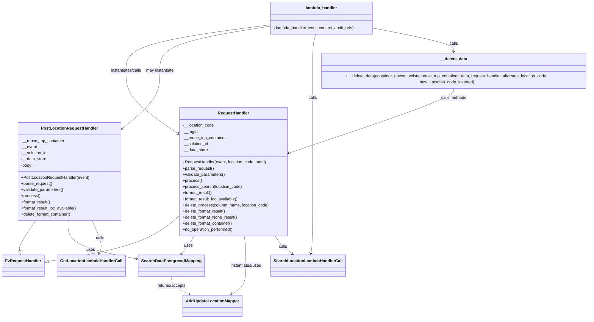

# Diagram: application_service/container_tracking_app_service/api/update_reuse_trip_container_location_entry.py


> Auto-generated by Obscura crawlers

## Diagram 1



### SVG

<svg id="container" width="2339.345703125" xmlns="http://www.w3.org/2000/svg" class="classDiagram" height="1236" viewBox="0 0 2339.345703125 1236" role="graphics-document document" aria-roledescription="class"><style>#container{font-family:"trebuchet ms",verdana,arial,sans-serif;font-size:16px;fill:#333;}@keyframes edge-animation-frame{from{stroke-dashoffset:0;}}@keyframes dash{to{stroke-dashoffset:0;}}#container .edge-animation-slow{stroke-dasharray:9,5!important;stroke-dashoffset:900;animation:dash 50s linear infinite;stroke-linecap:round;}#container .edge-animation-fast{stroke-dasharray:9,5!important;stroke-dashoffset:900;animation:dash 20s linear infinite;stroke-linecap:round;}#container .error-icon{fill:#552222;}#container .error-text{fill:#552222;stroke:#552222;}#container .edge-thickness-normal{stroke-width:1px;}#container .edge-thickness-thick{stroke-width:3.5px;}#container .edge-pattern-solid{stroke-dasharray:0;}#container .edge-thickness-invisible{stroke-width:0;fill:none;}#container .edge-pattern-dashed{stroke-dasharray:3;}#container .edge-pattern-dotted{stroke-dasharray:2;}#container .marker{fill:#333333;stroke:#333333;}#container .marker.cross{stroke:#333333;}#container svg{font-family:"trebuchet ms",verdana,arial,sans-serif;font-size:16px;}#container p{margin:0;}#container g.classGroup text{fill:#9370DB;stroke:none;font-family:"trebuchet ms",verdana,arial,sans-serif;font-size:10px;}#container g.classGroup text .title{font-weight:bolder;}#container .nodeLabel,#container .edgeLabel{color:#131300;}#container .edgeLabel .label rect{fill:#ECECFF;}#container .label text{fill:#131300;}#container .labelBkg{background:#ECECFF;}#container .edgeLabel .label span{background:#ECECFF;}#container .classTitle{font-weight:bolder;}#container .node rect,#container .node circle,#container .node ellipse,#container .node polygon,#container .node path{fill:#ECECFF;stroke:#9370DB;stroke-width:1px;}#container .divider{stroke:#9370DB;stroke-width:1;}#container g.clickable{cursor:pointer;}#container g.classGroup rect{fill:#ECECFF;stroke:#9370DB;}#container g.classGroup line{stroke:#9370DB;stroke-width:1;}#container .classLabel .box{stroke:none;stroke-width:0;fill:#ECECFF;opacity:0.5;}#container .classLabel .label{fill:#9370DB;font-size:10px;}#container .relation{stroke:#333333;stroke-width:1;fill:none;}#container .dashed-line{stroke-dasharray:3;}#container .dotted-line{stroke-dasharray:1 2;}#container #compositionStart,#container .composition{fill:#333333!important;stroke:#333333!important;stroke-width:1;}#container #compositionEnd,#container .composition{fill:#333333!important;stroke:#333333!important;stroke-width:1;}#container #dependencyStart,#container .dependency{fill:#333333!important;stroke:#333333!important;stroke-width:1;}#container #dependencyStart,#container .dependency{fill:#333333!important;stroke:#333333!important;stroke-width:1;}#container #extensionStart,#container .extension{fill:transparent!important;stroke:#333333!important;stroke-width:1;}#container #extensionEnd,#container .extension{fill:transparent!important;stroke:#333333!important;stroke-width:1;}#container #aggregationStart,#container .aggregation{fill:transparent!important;stroke:#333333!important;stroke-width:1;}#container #aggregationEnd,#container .aggregation{fill:transparent!important;stroke:#333333!important;stroke-width:1;}#container #lollipopStart,#container .lollipop{fill:#ECECFF!important;stroke:#333333!important;stroke-width:1;}#container #lollipopEnd,#container .lollipop{fill:#ECECFF!important;stroke:#333333!important;stroke-width:1;}#container .edgeTerminals{font-size:11px;line-height:initial;}#container .classTitleText{text-anchor:middle;font-size:18px;fill:#333;}#container .label-icon{display:inline-block;height:1em;overflow:visible;vertical-align:-0.125em;}#container .node .label-icon path{fill:currentColor;stroke:revert;stroke-width:revert;}#container :root{--mermaid-font-family:"trebuchet ms",verdana,arial,sans-serif;}</style><g><defs><marker id="container_class-aggregationStart" class="marker aggregation class" refX="18" refY="7" markerWidth="190" markerHeight="240" orient="auto"><path d="M 18,7 L9,13 L1,7 L9,1 Z"></path></marker></defs><defs><marker id="container_class-aggregationEnd" class="marker aggregation class" refX="1" refY="7" markerWidth="20" markerHeight="28" orient="auto"><path d="M 18,7 L9,13 L1,7 L9,1 Z"></path></marker></defs><defs><marker id="container_class-extensionStart" class="marker extension class" refX="18" refY="7" markerWidth="190" markerHeight="240" orient="auto"><path d="M 1,7 L18,13 V 1 Z"></path></marker></defs><defs><marker id="container_class-extensionEnd" class="marker extension class" refX="1" refY="7" markerWidth="20" markerHeight="28" orient="auto"><path d="M 1,1 V 13 L18,7 Z"></path></marker></defs><defs><marker id="container_class-compositionStart" class="marker composition class" refX="18" refY="7" markerWidth="190" markerHeight="240" orient="auto"><path d="M 18,7 L9,13 L1,7 L9,1 Z"></path></marker></defs><defs><marker id="container_class-compositionEnd" class="marker composition class" refX="1" refY="7" markerWidth="20" markerHeight="28" orient="auto"><path d="M 18,7 L9,13 L1,7 L9,1 Z"></path></marker></defs><defs><marker id="container_class-dependencyStart" class="marker dependency class" refX="6" refY="7" markerWidth="190" markerHeight="240" orient="auto"><path d="M 5,7 L9,13 L1,7 L9,1 Z"></path></marker></defs><defs><marker id="container_class-dependencyEnd" class="marker dependency class" refX="13" refY="7" markerWidth="20" markerHeight="28" orient="auto"><path d="M 18,7 L9,13 L14,7 L9,1 Z"></path></marker></defs><defs><marker id="container_class-lollipopStart" class="marker lollipop class" refX="13" refY="7" markerWidth="190" markerHeight="240" orient="auto"><circle stroke="black" fill="transparent" cx="7" cy="7" r="6"></circle></marker></defs><defs><marker id="container_class-lollipopEnd" class="marker lollipop class" refX="1" refY="7" markerWidth="190" markerHeight="240" orient="auto"><circle stroke="black" fill="transparent" cx="7" cy="7" r="6"></circle></marker></defs><g class="root"><g class="clusters"></g><g class="edgePaths"><path d="M674.094,839.913L652.705,858.094C631.316,876.275,588.539,912.638,506.62,941.238C424.701,969.837,303.639,990.675,243.109,1001.094L182.578,1011.512" id="id_RequestHandler_FvRequestHandler_1" class="edge-thickness-normal edge-pattern-solid relation" style=";;;" data-edge="true" data-et="edge" data-id="id_RequestHandler_FvRequestHandler_1" data-points="W3sieCI6Njc0LjA5Mzc1LCJ5Ijo4MzkuOTEyNzYwMjM3MTQzM30seyJ4Ijo1NDUuNzYxNzE4NzUsInkiOjk0OX0seyJ4IjoxNjUuNTc4MTI1LCJ5IjoxMDE0LjQzODU0NzM2NzE2Njh9XQ==" marker-end="url(#container_class-extensionEnd)"></path><path d="M135.028,852L123.951,868.167C112.874,884.333,90.72,916.667,80.42,936.199C70.119,955.73,71.671,962.461,72.448,965.826L73.224,969.191" id="id_PostLocationRequestHandler_FvRequestHandler_2" class="edge-thickness-normal edge-pattern-solid relation" style=";;;" data-edge="true" data-et="edge" data-id="id_PostLocationRequestHandler_FvRequestHandler_2" data-points="W3sieCI6MTM1LjAyODM5ODAzMjAwNjkyLCJ5Ijo4NTJ9LHsieCI6NjguNTY2NDA2MjUsInkiOjk0OX0seyJ4Ijo3Ny4xMDEwNjgwMzc5NzQ2OCwieSI6OTg2fV0=" marker-end="url(#container_class-extensionEnd)"></path><path d="M736.785,912L733.14,918.167C729.495,924.333,722.204,936.667,713.779,948.25C705.353,959.834,695.792,970.668,691.012,976.084L686.231,981.501" id="id_RequestHandler_SearchDataPostgresqlMapping_3" class="edge-thickness-normal edge-pattern-solid relation" style=";;;" data-edge="true" data-et="edge" data-id="id_RequestHandler_SearchDataPostgresqlMapping_3" data-points="W3sieCI6NzM2Ljc4NTI5MTQxNDM1OTksInkiOjkxMn0seyJ4Ijo3MTQuOTE0MDYyNSwieSI6OTQ5fSx7IngiOjY4Mi4yNjA5NzcwNTY5NjIsInkiOjk4Nn1d" marker-end="url(#container_class-dependencyEnd)"></path><path d="M261.119,852L260.659,868.167C260.199,884.333,259.279,916.667,301.644,941.579C344.009,966.491,429.659,983.983,472.484,992.729L515.309,1001.474" id="id_PostLocationRequestHandler_SearchDataPostgresqlMapping_4" class="edge-thickness-normal edge-pattern-solid relation" style=";;;" data-edge="true" data-et="edge" data-id="id_PostLocationRequestHandler_SearchDataPostgresqlMapping_4" data-points="W3sieCI6MjYxLjExOTIyODQ4MTgzMzksInkiOjg1Mn0seyJ4IjoyNTguMzU5Mzc1LCJ5Ijo5NDl9LHsieCI6NTIxLjE4NzUsInkiOjEwMDIuNjc1MDA3NTczNDYyNn1d" marker-end="url(#container_class-dependencyEnd)"></path><path d="M930.649,912L931.748,918.167C932.847,924.333,935.045,936.667,936.143,956C937.242,975.333,937.242,1001.667,937.242,1028C937.242,1054.333,937.242,1080.667,927.996,1099.479C918.75,1118.291,900.257,1129.582,891.011,1135.228L881.764,1140.873" id="id_RequestHandler_AddUpdateLocationMapper_5" class="edge-thickness-normal edge-pattern-solid relation" style=";;;" data-edge="true" data-et="edge" data-id="id_RequestHandler_AddUpdateLocationMapper_5" data-points="W3sieCI6OTMwLjY0OTI2MjAwMjU5NTIsInkiOjkxMn0seyJ4Ijo5MzcuMjQyMTg3NSwieSI6OTQ5fSx7IngiOjkzNy4yNDIxODc1LCJ5IjoxMDI4fSx7IngiOjkzNy4yNDIxODc1LCJ5IjoxMTA3fSx7IngiOjg3Ni42NDMzNDQ1NDExMzkyLCJ5IjoxMTQ0fV0=" marker-end="url(#container_class-dependencyEnd)"></path><path d="M351.817,852L358.994,868.167C366.171,884.333,380.525,916.667,384.228,938.162C387.932,959.658,380.984,970.316,377.511,975.645L374.037,980.974" id="id_PostLocationRequestHandler_GetLocationLambdaHandlerCall_6" class="edge-thickness-normal edge-pattern-solid relation" style=";;;" data-edge="true" data-et="edge" data-id="id_PostLocationRequestHandler_GetLocationLambdaHandlerCall_6" data-points="W3sieCI6MzUxLjgxNzMyNTM2NzY0NzEsInkiOjg1Mn0seyJ4IjozOTQuODc4OTA2MjUsInkiOjk0OX0seyJ4IjozNzAuNzYwNDgyNTk0OTM2NywieSI6OTg2fV0=" marker-end="url(#container_class-dependencyEnd)"></path><path d="M1050.379,912L1054.407,918.167C1058.436,924.333,1066.493,936.667,1077.927,948.399C1089.361,960.132,1104.17,971.263,1111.575,976.829L1118.98,982.395" id="id_RequestHandler_SearchLocationLambdaHandlerCall_7" class="edge-thickness-normal edge-pattern-solid relation" style=";;;" data-edge="true" data-et="edge" data-id="id_RequestHandler_SearchLocationLambdaHandlerCall_7" data-points="W3sieCI6MTA1MC4zNzg1NTQ4MjI2NjQ1LCJ5Ijo5MTJ9LHsieCI6MTA3NC41NTA3ODEyNSwieSI6OTQ5fSx7IngiOjExMjMuNzc2NDc4NDQxNDU1OCwieSI6OTg2fV0=" marker-end="url(#container_class-dependencyEnd)"></path><path d="M1025.035,98.019L933.722,110.182C842.409,122.346,659.783,146.673,568.469,175.503C477.156,204.333,477.156,237.667,477.156,271C477.156,304.333,477.156,337.667,509.163,376.972C541.169,416.277,605.182,461.554,637.189,484.193L669.195,506.831" id="id_lambda_handler_RequestHandler_8" class="edge-thickness-normal edge-pattern-solid relation" style=";;;" data-edge="true" data-et="edge" data-id="id_lambda_handler_RequestHandler_8" data-points="W3sieCI6MTAyNS4wMzUxNTYyNSwieSI6OTguMDE4NjU5Mzk1NzgxMDl9LHsieCI6NDc3LjE1NjI1LCJ5IjoxNzF9LHsieCI6NDc3LjE1NjI1LCJ5IjoyNzF9LHsieCI6NDc3LjE1NjI1LCJ5IjozNzF9LHsieCI6Njc0LjA5Mzc1LCJ5Ijo1MTAuMjk2MDE2MjE0MzA0MTN9XQ==" marker-end="url(#container_class-dependencyEnd)"></path><path d="M1025.035,104.182L956.962,115.318C888.888,126.455,752.741,148.727,684.667,176.53C616.594,204.333,616.594,237.667,616.594,271C616.594,304.333,616.594,337.667,592.35,374.351C568.106,411.036,519.618,451.071,495.374,471.089L471.131,491.107" id="id_lambda_handler_PostLocationRequestHandler_9" class="edge-thickness-normal edge-pattern-solid relation" style=";;;" data-edge="true" data-et="edge" data-id="id_lambda_handler_PostLocationRequestHandler_9" data-points="W3sieCI6MTAyNS4wMzUxNTYyNSwieSI6MTA0LjE4MTg4MjA4NTI5ODM1fSx7IngiOjYxNi41OTM3NSwieSI6MTcxfSx7IngiOjYxNi41OTM3NSwieSI6MjcxfSx7IngiOjYxNi41OTM3NSwieSI6MzcxfSx7IngiOjQ2Ni41MDM5MDYyNSwieSI6NDk0LjkyNzE3ODc3NzQ5NjN9XQ==" marker-end="url(#container_class-dependencyEnd)"></path><path d="M1208.973,134L1207.124,140.167C1205.275,146.333,1201.576,158.667,1199.726,181.5C1197.877,204.333,1197.877,237.667,1197.877,271C1197.877,304.333,1197.877,337.667,1197.877,402.5C1197.877,467.333,1197.877,563.667,1197.877,660C1197.877,756.333,1197.877,852.667,1196.679,906.026C1195.482,959.385,1193.086,969.769,1191.889,974.961L1190.691,980.154" id="id_lambda_handler_SearchLocationLambdaHandlerCall_10" class="edge-thickness-normal edge-pattern-solid relation" style=";;;" data-edge="true" data-et="edge" data-id="id_lambda_handler_SearchLocationLambdaHandlerCall_10" data-points="W3sieCI6MTIwOC45NzMzMzk4NDM3NSwieSI6MTM0fSx7IngiOjExOTcuODc2OTUzMTI1LCJ5IjoxNzF9LHsieCI6MTE5Ny44NzY5NTMxMjUsInkiOjI3MX0seyJ4IjoxMTk3Ljg3Njk1MzEyNSwieSI6MzcxfSx7IngiOjExOTcuODc2OTUzMTI1LCJ5Ijo2NjB9LHsieCI6MTE5Ny44NzY5NTMxMjUsInkiOjk0OX0seyJ4IjoxMTg5LjM0MjI5MTMzNzAyNTIsInkiOjk4Nn1d" marker-end="url(#container_class-dependencyEnd)"></path><path d="M1430.699,107.596L1489.268,118.163C1547.837,128.731,1664.974,149.865,1723.543,165.599C1782.111,181.333,1782.111,191.667,1782.111,196.833L1782.111,202" id="id_lambda_handler___delete_data_11" class="edge-thickness-normal edge-pattern-solid relation" style=";;;" data-edge="true" data-et="edge" data-id="id_lambda_handler___delete_data_11" data-points="W3sieCI6MTQzMC42OTkyMTg3NSwieSI6MTA3LjU5NjE1MjU1ODU1OTE0fSx7IngiOjE3ODIuMTExMzI4MTI1LCJ5IjoxNzF9LHsieCI6MTc4Mi4xMTEzMjgxMjUsInkiOjIwOH1d" marker-end="url(#container_class-dependencyEnd)"></path><path d="M1782.111,334L1782.111,340.167C1782.111,346.333,1782.111,358.667,1668.944,401.32C1555.777,443.973,1329.443,516.946,1216.276,553.433L1103.109,589.919" id="id___delete_data_RequestHandler_12" class="edge-thickness-normal edge-pattern-solid relation" style=";;;" data-edge="true" data-et="edge" data-id="id___delete_data_RequestHandler_12" data-points="W3sieCI6MTc4Mi4xMTEzMjgxMjUsInkiOjMzNH0seyJ4IjoxNzgyLjExMTMyODEyNSwieSI6MzcxfSx7IngiOjEwOTcuMzk4NDM3NSwieSI6NTkxLjc2MDQ4NjY4Nzc3MzN9XQ==" marker-end="url(#container_class-dependencyEnd)"></path><path d="M645.195,1070L645.195,1076.167C645.195,1082.333,645.195,1094.667,656.993,1106.563C668.79,1118.46,692.386,1129.919,704.183,1135.649L715.981,1141.379" id="id_SearchDataPostgresqlMapping_AddUpdateLocationMapper_13" class="edge-thickness-normal edge-pattern-dashed relation" style=";;;" data-edge="true" data-et="edge" data-id="id_SearchDataPostgresqlMapping_AddUpdateLocationMapper_13" data-points="W3sieCI6NjQ1LjE5NTMxMjUsInkiOjEwNzB9LHsieCI6NjQ1LjE5NTMxMjUsInkiOjExMDd9LHsieCI6NzIxLjM3NzkxNzMyNTk0OTQsInkiOjExNDR9XQ==" marker-end="url(#container_class-dependencyEnd)"></path></g><g class="edgeLabels"><g class="edgeLabel"><g class="label" data-id="id_RequestHandler_FvRequestHandler_1" transform="translate(0, 0)"><foreignObject width="0" height="0"><div xmlns="http://www.w3.org/1999/xhtml" class="labelBkg" style="display: table-cell; white-space: nowrap; line-height: 1.5; max-width: 200px; text-align: center;"><span class="edgeLabel"></span></div></foreignObject></g></g><g class="edgeLabel"><g class="label" data-id="id_PostLocationRequestHandler_FvRequestHandler_2" transform="translate(0, 0)"><foreignObject width="0" height="0"><div xmlns="http://www.w3.org/1999/xhtml" class="labelBkg" style="display: table-cell; white-space: nowrap; line-height: 1.5; max-width: 200px; text-align: center;"><span class="edgeLabel"></span></div></foreignObject></g></g><g class="edgeLabel" transform="translate(712.80751, 951.38698)"><g class="label" data-id="id_RequestHandler_SearchDataPostgresqlMapping_3" transform="translate(-16.4921875, -12)"><foreignObject width="32.984375" height="24"><div xmlns="http://www.w3.org/1999/xhtml" class="labelBkg" style="display: table-cell; white-space: nowrap; line-height: 1.5; max-width: 200px; text-align: center;"><span class="edgeLabel"><p>uses</p></span></div></foreignObject></g></g><g class="edgeLabel" transform="translate(342.23501, 966.12916)"><g class="label" data-id="id_PostLocationRequestHandler_SearchDataPostgresqlMapping_4" transform="translate(-16.4921875, -12)"><foreignObject width="32.984375" height="24"><div xmlns="http://www.w3.org/1999/xhtml" class="labelBkg" style="display: table-cell; white-space: nowrap; line-height: 1.5; max-width: 200px; text-align: center;"><span class="edgeLabel"><p>uses</p></span></div></foreignObject></g></g><g class="edgeLabel" transform="translate(937.2421875, 1028)"><g class="label" data-id="id_RequestHandler_AddUpdateLocationMapper_5" transform="translate(-63.3203125, -12)"><foreignObject width="126.640625" height="24"><div xmlns="http://www.w3.org/1999/xhtml" class="labelBkg" style="display: table-cell; white-space: nowrap; line-height: 1.5; max-width: 200px; text-align: center;"><span class="edgeLabel"><p>instantiates/uses</p></span></div></foreignObject></g></g><g class="edgeLabel" transform="translate(382.30841, 920.68385)"><g class="label" data-id="id_PostLocationRequestHandler_GetLocationLambdaHandlerCall_6" transform="translate(-16.4453125, -12)"><foreignObject width="32.890625" height="24"><div xmlns="http://www.w3.org/1999/xhtml" class="labelBkg" style="display: table-cell; white-space: nowrap; line-height: 1.5; max-width: 200px; text-align: center;"><span class="edgeLabel"><p>calls</p></span></div></foreignObject></g></g><g class="edgeLabel" transform="translate(1081.4991, 954.22263)"><g class="label" data-id="id_RequestHandler_SearchLocationLambdaHandlerCall_7" transform="translate(-16.4453125, -12)"><foreignObject width="32.890625" height="24"><div xmlns="http://www.w3.org/1999/xhtml" class="labelBkg" style="display: table-cell; white-space: nowrap; line-height: 1.5; max-width: 200px; text-align: center;"><span class="edgeLabel"><p>calls</p></span></div></foreignObject></g></g><g class="edgeLabel" transform="translate(477.15625, 271)"><g class="label" data-id="id_lambda_handler_RequestHandler_8" transform="translate(-63.1171875, -12)"><foreignObject width="126.234375" height="24"><div xmlns="http://www.w3.org/1999/xhtml" class="labelBkg" style="display: table-cell; white-space: nowrap; line-height: 1.5; max-width: 200px; text-align: center;"><span class="edgeLabel"><p>instantiates/calls</p></span></div></foreignObject></g></g><g class="edgeLabel" transform="translate(616.59375, 271)"><g class="label" data-id="id_lambda_handler_PostLocationRequestHandler_9" transform="translate(-56.3203125, -12)"><foreignObject width="112.640625" height="24"><div xmlns="http://www.w3.org/1999/xhtml" class="labelBkg" style="display: table-cell; white-space: nowrap; line-height: 1.5; max-width: 200px; text-align: center;"><span class="edgeLabel"><p>may instantiate</p></span></div></foreignObject></g></g><g class="edgeLabel" transform="translate(1197.876953125, 371)"><g class="label" data-id="id_lambda_handler_SearchLocationLambdaHandlerCall_10" transform="translate(-16.4453125, -12)"><foreignObject width="32.890625" height="24"><div xmlns="http://www.w3.org/1999/xhtml" class="labelBkg" style="display: table-cell; white-space: nowrap; line-height: 1.5; max-width: 200px; text-align: center;"><span class="edgeLabel"><p>calls</p></span></div></foreignObject></g></g><g class="edgeLabel" transform="translate(1782.111328125, 171)"><g class="label" data-id="id_lambda_handler___delete_data_11" transform="translate(-16.4453125, -12)"><foreignObject width="32.890625" height="24"><div xmlns="http://www.w3.org/1999/xhtml" class="labelBkg" style="display: table-cell; white-space: nowrap; line-height: 1.5; max-width: 200px; text-align: center;"><span class="edgeLabel"><p>calls</p></span></div></foreignObject></g></g><g class="edgeLabel" transform="translate(1782.111328125, 371)"><g class="label" data-id="id___delete_data_RequestHandler_12" transform="translate(-50.546875, -12)"><foreignObject width="101.09375" height="24"><div xmlns="http://www.w3.org/1999/xhtml" class="labelBkg" style="display: table-cell; white-space: nowrap; line-height: 1.5; max-width: 200px; text-align: center;"><span class="edgeLabel"><p>calls methods</p></span></div></foreignObject></g></g><g class="edgeLabel" transform="translate(645.1953125, 1107)"><g class="label" data-id="id_SearchDataPostgresqlMapping_AddUpdateLocationMapper_13" transform="translate(-57.4453125, -12)"><foreignObject width="114.890625" height="24"><div xmlns="http://www.w3.org/1999/xhtml" class="labelBkg" style="display: table-cell; white-space: nowrap; line-height: 1.5; max-width: 200px; text-align: center;"><span class="edgeLabel"><p>returns/accepts</p></span></div></foreignObject></g></g></g><g class="nodes"><g class="node default" id="classId-FvRequestHandler-0" transform="translate(86.7890625, 1028)"><g class="basic label-container"><path d="M-78.7890625 -42 L78.7890625 -42 L78.7890625 42 L-78.7890625 42" stroke="none" stroke-width="0" fill="#ECECFF" style=""></path><path d="M-78.7890625 -42 C-37.35274923029705 -42, 4.0835640394059 -42, 78.7890625 -42 M-78.7890625 -42 C-42.061620565793916 -42, -5.334178631587832 -42, 78.7890625 -42 M78.7890625 -42 C78.7890625 -15.456798245176838, 78.7890625 11.086403509646324, 78.7890625 42 M78.7890625 -42 C78.7890625 -20.560905277333635, 78.7890625 0.8781894453327297, 78.7890625 42 M78.7890625 42 C17.713663526448634 42, -43.36173544710273 42, -78.7890625 42 M78.7890625 42 C21.50143844208322 42, -35.78618561583356 42, -78.7890625 42 M-78.7890625 42 C-78.7890625 17.810977858092997, -78.7890625 -6.378044283814006, -78.7890625 -42 M-78.7890625 42 C-78.7890625 8.853137862302837, -78.7890625 -24.293724275394325, -78.7890625 -42" stroke="#9370DB" stroke-width="1.3" fill="none" stroke-dasharray="0 0" style=""></path></g><g class="annotation-group text" transform="translate(0, -18)"></g><g class="label-group text" transform="translate(-66.7890625, -18)"><g class="label" style="font-weight: bolder" transform="translate(0,-12)"><foreignObject width="133.578125" height="24"><div xmlns="http://www.w3.org/1999/xhtml" style="display: table-cell; white-space: nowrap; line-height: 1.5; max-width: 183px; text-align: center;"><span class="nodeLabel markdown-node-label" style=""><p>FvRequestHandler</p></span></div></foreignObject></g></g><g class="members-group text" transform="translate(-66.7890625, 30)"></g><g class="methods-group text" transform="translate(-66.7890625, 60)"></g><g class="divider" style=""><path d="M-78.7890625 6 C-16.90102930262597 6, 44.98700389474806 6, 78.7890625 6 M-78.7890625 6 C-25.881608770978943 6, 27.025844958042114 6, 78.7890625 6" stroke="#9370DB" stroke-width="1.3" fill="none" stroke-dasharray="0 0" style=""></path></g><g class="divider" style=""><path d="M-78.7890625 24 C-24.529236718015134 24, 29.73058906396973 24, 78.7890625 24 M-78.7890625 24 C-35.64944034645897 24, 7.490181807082067 24, 78.7890625 24" stroke="#9370DB" stroke-width="1.3" fill="none" stroke-dasharray="0 0" style=""></path></g></g><g class="node default" id="classId-RequestHandler-1" transform="translate(885.74609375, 660)"><g class="basic label-container"><path d="M-211.65234375 -252 L211.65234375 -252 L211.65234375 252 L-211.65234375 252" stroke="none" stroke-width="0" fill="#ECECFF" style=""></path><path d="M-211.65234375 -252 C-69.15331937979349 -252, 73.34570499041303 -252, 211.65234375 -252 M-211.65234375 -252 C-111.19789336293807 -252, -10.74344297587615 -252, 211.65234375 -252 M211.65234375 -252 C211.65234375 -90.94962947839073, 211.65234375 70.10074104321853, 211.65234375 252 M211.65234375 -252 C211.65234375 -88.06981731817038, 211.65234375 75.86036536365924, 211.65234375 252 M211.65234375 252 C106.41691682782256 252, 1.1814899056451225 252, -211.65234375 252 M211.65234375 252 C66.09241434310897 252, -79.46751506378206 252, -211.65234375 252 M-211.65234375 252 C-211.65234375 52.929242853705205, -211.65234375 -146.1415142925896, -211.65234375 -252 M-211.65234375 252 C-211.65234375 83.25981646774247, -211.65234375 -85.48036706451506, -211.65234375 -252" stroke="#9370DB" stroke-width="1.3" fill="none" stroke-dasharray="0 0" style=""></path></g><g class="annotation-group text" transform="translate(0, -228)"></g><g class="label-group text" transform="translate(-59.0703125, -228)"><g class="label" style="font-weight: bolder" transform="translate(0,-12)"><foreignObject width="118.140625" height="24"><div xmlns="http://www.w3.org/1999/xhtml" style="display: table-cell; white-space: nowrap; line-height: 1.5; max-width: 168px; text-align: center;"><span class="nodeLabel markdown-node-label" style=""><p>RequestHandler</p></span></div></foreignObject></g></g><g class="members-group text" transform="translate(-199.65234375, -180)"><g class="label" style="" transform="translate(0,-12)"><foreignObject width="123.609375" height="24"><div xmlns="http://www.w3.org/1999/xhtml" style="display: table-cell; white-space: nowrap; line-height: 1.5; max-width: 181px; text-align: center;"><span class="nodeLabel markdown-node-label" style=""><p>-__location_code</p></span></div></foreignObject></g><g class="label" style="" transform="translate(0,12)"><foreignObject width="58.15625" height="24"><div xmlns="http://www.w3.org/1999/xhtml" style="display: table-cell; white-space: nowrap; line-height: 1.5; max-width: 116px; text-align: center;"><span class="nodeLabel markdown-node-label" style=""><p>-__tagId</p></span></div></foreignObject></g><g class="label" style="" transform="translate(0,36)"><foreignObject width="172.109375" height="24"><div xmlns="http://www.w3.org/1999/xhtml" style="display: table-cell; white-space: nowrap; line-height: 1.5; max-width: 230px; text-align: center;"><span class="nodeLabel markdown-node-label" style=""><p>-__reuse_trip_container</p></span></div></foreignObject></g><g class="label" style="" transform="translate(0,60)"><foreignObject width="103.875" height="24"><div xmlns="http://www.w3.org/1999/xhtml" style="display: table-cell; white-space: nowrap; line-height: 1.5; max-width: 161px; text-align: center;"><span class="nodeLabel markdown-node-label" style=""><p>-__solution_id</p></span></div></foreignObject></g><g class="label" style="" transform="translate(0,84)"><foreignObject width="99.0625" height="24"><div xmlns="http://www.w3.org/1999/xhtml" style="display: table-cell; white-space: nowrap; line-height: 1.5; max-width: 156px; text-align: center;"><span class="nodeLabel markdown-node-label" style=""><p>-__data_store</p></span></div></foreignObject></g></g><g class="methods-group text" transform="translate(-199.65234375, -36)"><g class="label" style="" transform="translate(0,-12)"><foreignObject width="330.734375" height="24"><div xmlns="http://www.w3.org/1999/xhtml" style="display: table-cell; white-space: nowrap; line-height: 1.5; max-width: 388px; text-align: center;"><span class="nodeLabel markdown-node-label" style=""><p>+RequestHandler(event, location_code, tagId)</p></span></div></foreignObject></g><g class="label" style="" transform="translate(0,12)"><foreignObject width="121.796875" height="24"><div xmlns="http://www.w3.org/1999/xhtml" style="display: table-cell; white-space: nowrap; line-height: 1.5; max-width: 179px; text-align: center;"><span class="nodeLabel markdown-node-label" style=""><p>+parse_request()</p></span></div></foreignObject></g><g class="label" style="" transform="translate(0,36)"><foreignObject width="166.546875" height="24"><div xmlns="http://www.w3.org/1999/xhtml" style="display: table-cell; white-space: nowrap; line-height: 1.5; max-width: 224px; text-align: center;"><span class="nodeLabel markdown-node-label" style=""><p>+validate_parameters()</p></span></div></foreignObject></g><g class="label" style="" transform="translate(0,60)"><foreignObject width="73.734375" height="24"><div xmlns="http://www.w3.org/1999/xhtml" style="display: table-cell; white-space: nowrap; line-height: 1.5; max-width: 131px; text-align: center;"><span class="nodeLabel markdown-node-label" style=""><p>+process()</p></span></div></foreignObject></g><g class="label" style="" transform="translate(0,84)"><foreignObject width="231.296875" height="24"><div xmlns="http://www.w3.org/1999/xhtml" style="display: table-cell; white-space: nowrap; line-height: 1.5; max-width: 289px; text-align: center;"><span class="nodeLabel markdown-node-label" style=""><p>+process_search(location_code)</p></span></div></foreignObject></g><g class="label" style="" transform="translate(0,108)"><foreignObject width="117.015625" height="24"><div xmlns="http://www.w3.org/1999/xhtml" style="display: table-cell; white-space: nowrap; line-height: 1.5; max-width: 174px; text-align: center;"><span class="nodeLabel markdown-node-label" style=""><p>+format_result()</p></span></div></foreignObject></g><g class="label" style="" transform="translate(0,132)"><foreignObject width="220.21875" height="24"><div xmlns="http://www.w3.org/1999/xhtml" style="display: table-cell; white-space: nowrap; line-height: 1.5; max-width: 278px; text-align: center;"><span class="nodeLabel markdown-node-label" style=""><p>+format_result_loc_available()</p></span></div></foreignObject></g><g class="label" style="" transform="translate(0,156)"><foreignObject width="340.234375" height="24"><div xmlns="http://www.w3.org/1999/xhtml" style="display: table-cell; white-space: nowrap; line-height: 1.5; max-width: 398px; text-align: center;"><span class="nodeLabel markdown-node-label" style=""><p>+delete_process(column_name, location_code)</p></span></div></foreignObject></g><g class="label" style="" transform="translate(0,180)"><foreignObject width="170.8125" height="24"><div xmlns="http://www.w3.org/1999/xhtml" style="display: table-cell; white-space: nowrap; line-height: 1.5; max-width: 228px; text-align: center;"><span class="nodeLabel markdown-node-label" style=""><p>+delete_format_result()</p></span></div></foreignObject></g><g class="label" style="" transform="translate(0,204)"><foreignObject width="217.171875" height="24"><div xmlns="http://www.w3.org/1999/xhtml" style="display: table-cell; white-space: nowrap; line-height: 1.5; max-width: 275px; text-align: center;"><span class="nodeLabel markdown-node-label" style=""><p>+delete_format_None_result()</p></span></div></foreignObject></g><g class="label" style="" transform="translate(0,228)"><foreignObject width="198.03125" height="24"><div xmlns="http://www.w3.org/1999/xhtml" style="display: table-cell; white-space: nowrap; line-height: 1.5; max-width: 255px; text-align: center;"><span class="nodeLabel markdown-node-label" style=""><p>+delete_format_container()</p></span></div></foreignObject></g><g class="label" style="" transform="translate(0,252)"><foreignObject width="201.09375" height="24"><div xmlns="http://www.w3.org/1999/xhtml" style="display: table-cell; white-space: nowrap; line-height: 1.5; max-width: 258px; text-align: center;"><span class="nodeLabel markdown-node-label" style=""><p>+no_operation_performed()</p></span></div></foreignObject></g></g><g class="divider" style=""><path d="M-211.65234375 -204 C-54.95895729283225 -204, 101.7344291643355 -204, 211.65234375 -204 M-211.65234375 -204 C-103.9583658867536 -204, 3.7356119764928053 -204, 211.65234375 -204" stroke="#9370DB" stroke-width="1.3" fill="none" stroke-dasharray="0 0" style=""></path></g><g class="divider" style=""><path d="M-211.65234375 -60 C-81.94581731615435 -60, 47.760709117691306 -60, 211.65234375 -60 M-211.65234375 -60 C-56.48521950740823 -60, 98.68190473518354 -60, 211.65234375 -60" stroke="#9370DB" stroke-width="1.3" fill="none" stroke-dasharray="0 0" style=""></path></g></g><g class="node default" id="classId-PostLocationRequestHandler-2" transform="translate(266.58203125, 660)"><g class="basic label-container"><path d="M-199.921875 -192 L199.921875 -192 L199.921875 192 L-199.921875 192" stroke="none" stroke-width="0" fill="#ECECFF" style=""></path><path d="M-199.921875 -192 C-91.22945626593888 -192, 17.462962468122242 -192, 199.921875 -192 M-199.921875 -192 C-50.93290665219806 -192, 98.05606169560389 -192, 199.921875 -192 M199.921875 -192 C199.921875 -96.10197354685, 199.921875 -0.20394709370000896, 199.921875 192 M199.921875 -192 C199.921875 -39.256910863118605, 199.921875 113.48617827376279, 199.921875 192 M199.921875 192 C117.98506815732905 192, 36.048261314658106 192, -199.921875 192 M199.921875 192 C79.50367926050278 192, -40.91451647899444 192, -199.921875 192 M-199.921875 192 C-199.921875 43.72642285000347, -199.921875 -104.54715429999305, -199.921875 -192 M-199.921875 192 C-199.921875 98.63057076071372, -199.921875 5.261141521427447, -199.921875 -192" stroke="#9370DB" stroke-width="1.3" fill="none" stroke-dasharray="0 0" style=""></path></g><g class="annotation-group text" transform="translate(0, -168)"></g><g class="label-group text" transform="translate(-106.59375, -168)"><g class="label" style="font-weight: bolder" transform="translate(0,-12)"><foreignObject width="213.1875" height="24"><div xmlns="http://www.w3.org/1999/xhtml" style="display: table-cell; white-space: nowrap; line-height: 1.5; max-width: 261px; text-align: center;"><span class="nodeLabel markdown-node-label" style=""><p>PostLocationRequestHandler</p></span></div></foreignObject></g></g><g class="members-group text" transform="translate(-187.921875, -120)"><g class="label" style="" transform="translate(0,-12)"><foreignObject width="172.109375" height="24"><div xmlns="http://www.w3.org/1999/xhtml" style="display: table-cell; white-space: nowrap; line-height: 1.5; max-width: 230px; text-align: center;"><span class="nodeLabel markdown-node-label" style=""><p>-__reuse_trip_container</p></span></div></foreignObject></g><g class="label" style="" transform="translate(0,12)"><foreignObject width="61.671875" height="24"><div xmlns="http://www.w3.org/1999/xhtml" style="display: table-cell; white-space: nowrap; line-height: 1.5; max-width: 119px; text-align: center;"><span class="nodeLabel markdown-node-label" style=""><p>-__event</p></span></div></foreignObject></g><g class="label" style="" transform="translate(0,36)"><foreignObject width="103.875" height="24"><div xmlns="http://www.w3.org/1999/xhtml" style="display: table-cell; white-space: nowrap; line-height: 1.5; max-width: 161px; text-align: center;"><span class="nodeLabel markdown-node-label" style=""><p>-__solution_id</p></span></div></foreignObject></g><g class="label" style="" transform="translate(0,60)"><foreignObject width="99.0625" height="24"><div xmlns="http://www.w3.org/1999/xhtml" style="display: table-cell; white-space: nowrap; line-height: 1.5; max-width: 156px; text-align: center;"><span class="nodeLabel markdown-node-label" style=""><p>-__data_store</p></span></div></foreignObject></g><g class="label" style="" transform="translate(0,84)"><foreignObject width="42.75" height="24"><div xmlns="http://www.w3.org/1999/xhtml" style="display: table-cell; white-space: nowrap; line-height: 1.5; max-width: 100px; text-align: center;"><span class="nodeLabel markdown-node-label" style=""><p>-body</p></span></div></foreignObject></g></g><g class="methods-group text" transform="translate(-187.921875, 24)"><g class="label" style="" transform="translate(0,-12)"><foreignObject width="269.25" height="24"><div xmlns="http://www.w3.org/1999/xhtml" style="display: table-cell; white-space: nowrap; line-height: 1.5; max-width: 327px; text-align: center;"><span class="nodeLabel markdown-node-label" style=""><p>+PostLocationRequestHandler(event)</p></span></div></foreignObject></g><g class="label" style="" transform="translate(0,12)"><foreignObject width="121.796875" height="24"><div xmlns="http://www.w3.org/1999/xhtml" style="display: table-cell; white-space: nowrap; line-height: 1.5; max-width: 179px; text-align: center;"><span class="nodeLabel markdown-node-label" style=""><p>+parse_request()</p></span></div></foreignObject></g><g class="label" style="" transform="translate(0,36)"><foreignObject width="166.546875" height="24"><div xmlns="http://www.w3.org/1999/xhtml" style="display: table-cell; white-space: nowrap; line-height: 1.5; max-width: 224px; text-align: center;"><span class="nodeLabel markdown-node-label" style=""><p>+validate_parameters()</p></span></div></foreignObject></g><g class="label" style="" transform="translate(0,60)"><foreignObject width="73.734375" height="24"><div xmlns="http://www.w3.org/1999/xhtml" style="display: table-cell; white-space: nowrap; line-height: 1.5; max-width: 131px; text-align: center;"><span class="nodeLabel markdown-node-label" style=""><p>+process()</p></span></div></foreignObject></g><g class="label" style="" transform="translate(0,84)"><foreignObject width="117.015625" height="24"><div xmlns="http://www.w3.org/1999/xhtml" style="display: table-cell; white-space: nowrap; line-height: 1.5; max-width: 174px; text-align: center;"><span class="nodeLabel markdown-node-label" style=""><p>+format_result()</p></span></div></foreignObject></g><g class="label" style="" transform="translate(0,108)"><foreignObject width="220.21875" height="24"><div xmlns="http://www.w3.org/1999/xhtml" style="display: table-cell; white-space: nowrap; line-height: 1.5; max-width: 278px; text-align: center;"><span class="nodeLabel markdown-node-label" style=""><p>+format_result_loc_available()</p></span></div></foreignObject></g><g class="label" style="" transform="translate(0,132)"><foreignObject width="198.03125" height="24"><div xmlns="http://www.w3.org/1999/xhtml" style="display: table-cell; white-space: nowrap; line-height: 1.5; max-width: 255px; text-align: center;"><span class="nodeLabel markdown-node-label" style=""><p>+delete_format_container()</p></span></div></foreignObject></g></g><g class="divider" style=""><path d="M-199.921875 -144 C-49.92651426169638 -144, 100.06884647660723 -144, 199.921875 -144 M-199.921875 -144 C-100.24982682859856 -144, -0.5777786571971149 -144, 199.921875 -144" stroke="#9370DB" stroke-width="1.3" fill="none" stroke-dasharray="0 0" style=""></path></g><g class="divider" style=""><path d="M-199.921875 0 C-54.51862123584769 0, 90.88463252830462 0, 199.921875 0 M-199.921875 0 C-50.636140135854674 0, 98.64959472829065 0, 199.921875 0" stroke="#9370DB" stroke-width="1.3" fill="none" stroke-dasharray="0 0" style=""></path></g></g><g class="node default" id="classId-SearchDataPostgresqlMapping-3" transform="translate(645.1953125, 1028)"><g class="basic label-container"><path d="M-124.0078125 -42 L124.0078125 -42 L124.0078125 42 L-124.0078125 42" stroke="none" stroke-width="0" fill="#ECECFF" style=""></path><path d="M-124.0078125 -42 C-55.850445528866274 -42, 12.306921442267452 -42, 124.0078125 -42 M-124.0078125 -42 C-56.53635753524392 -42, 10.935097429512155 -42, 124.0078125 -42 M124.0078125 -42 C124.0078125 -21.256132207644658, 124.0078125 -0.5122644152893159, 124.0078125 42 M124.0078125 -42 C124.0078125 -18.729743989976907, 124.0078125 4.540512020046187, 124.0078125 42 M124.0078125 42 C26.091703032531342 42, -71.82440643493732 42, -124.0078125 42 M124.0078125 42 C66.83826092043503 42, 9.668709340870066 42, -124.0078125 42 M-124.0078125 42 C-124.0078125 10.860703053048294, -124.0078125 -20.278593893903412, -124.0078125 -42 M-124.0078125 42 C-124.0078125 13.79169584324859, -124.0078125 -14.41660831350282, -124.0078125 -42" stroke="#9370DB" stroke-width="1.3" fill="none" stroke-dasharray="0 0" style=""></path></g><g class="annotation-group text" transform="translate(0, -18)"></g><g class="label-group text" transform="translate(-112.0078125, -18)"><g class="label" style="font-weight: bolder" transform="translate(0,-12)"><foreignObject width="224.015625" height="24"><div xmlns="http://www.w3.org/1999/xhtml" style="display: table-cell; white-space: nowrap; line-height: 1.5; max-width: 271px; text-align: center;"><span class="nodeLabel markdown-node-label" style=""><p>SearchDataPostgresqlMapping</p></span></div></foreignObject></g></g><g class="members-group text" transform="translate(-112.0078125, 30)"></g><g class="methods-group text" transform="translate(-112.0078125, 60)"></g><g class="divider" style=""><path d="M-124.0078125 6 C-59.38339982481418 6, 5.241012850371646 6, 124.0078125 6 M-124.0078125 6 C-34.46537137730735 6, 55.0770697453853 6, 124.0078125 6" stroke="#9370DB" stroke-width="1.3" fill="none" stroke-dasharray="0 0" style=""></path></g><g class="divider" style=""><path d="M-124.0078125 24 C-37.65603919351065 24, 48.6957341129787 24, 124.0078125 24 M-124.0078125 24 C-68.86986062285567 24, -13.731908745711323 24, 124.0078125 24" stroke="#9370DB" stroke-width="1.3" fill="none" stroke-dasharray="0 0" style=""></path></g></g><g class="node default" id="classId-AddUpdateLocationMapper-4" transform="translate(807.85546875, 1186)"><g class="basic label-container"><path d="M-112.046875 -42 L112.046875 -42 L112.046875 42 L-112.046875 42" stroke="none" stroke-width="0" fill="#ECECFF" style=""></path><path d="M-112.046875 -42 C-28.511903824820664 -42, 55.02306735035867 -42, 112.046875 -42 M-112.046875 -42 C-44.44795905406205 -42, 23.150956891875893 -42, 112.046875 -42 M112.046875 -42 C112.046875 -23.981983207642557, 112.046875 -5.963966415285114, 112.046875 42 M112.046875 -42 C112.046875 -24.475453314711736, 112.046875 -6.950906629423471, 112.046875 42 M112.046875 42 C27.220132037067344 42, -57.60661092586531 42, -112.046875 42 M112.046875 42 C35.43987069540654 42, -41.16713360918692 42, -112.046875 42 M-112.046875 42 C-112.046875 11.926265772401813, -112.046875 -18.147468455196375, -112.046875 -42 M-112.046875 42 C-112.046875 9.757218603142796, -112.046875 -22.485562793714408, -112.046875 -42" stroke="#9370DB" stroke-width="1.3" fill="none" stroke-dasharray="0 0" style=""></path></g><g class="annotation-group text" transform="translate(0, -18)"></g><g class="label-group text" transform="translate(-100.046875, -18)"><g class="label" style="font-weight: bolder" transform="translate(0,-12)"><foreignObject width="200.09375" height="24"><div xmlns="http://www.w3.org/1999/xhtml" style="display: table-cell; white-space: nowrap; line-height: 1.5; max-width: 249px; text-align: center;"><span class="nodeLabel markdown-node-label" style=""><p>AddUpdateLocationMapper</p></span></div></foreignObject></g></g><g class="members-group text" transform="translate(-100.046875, 30)"></g><g class="methods-group text" transform="translate(-100.046875, 60)"></g><g class="divider" style=""><path d="M-112.046875 6 C-50.97142566487658 6, 10.104023670246846 6, 112.046875 6 M-112.046875 6 C-34.26930830051322 6, 43.50825839897357 6, 112.046875 6" stroke="#9370DB" stroke-width="1.3" fill="none" stroke-dasharray="0 0" style=""></path></g><g class="divider" style=""><path d="M-112.046875 24 C-40.621646201975 24, 30.803582596050006 24, 112.046875 24 M-112.046875 24 C-57.96161506491783 24, -3.876355129835659 24, 112.046875 24" stroke="#9370DB" stroke-width="1.3" fill="none" stroke-dasharray="0 0" style=""></path></g></g><g class="node default" id="classId-GetLocationLambdaHandlerCall-5" transform="translate(343.3828125, 1028)"><g class="basic label-container"><path d="M-127.8046875 -42 L127.8046875 -42 L127.8046875 42 L-127.8046875 42" stroke="none" stroke-width="0" fill="#ECECFF" style=""></path><path d="M-127.8046875 -42 C-73.75190108363816 -42, -19.699114667276305 -42, 127.8046875 -42 M-127.8046875 -42 C-44.40546149501577 -42, 38.99376450996846 -42, 127.8046875 -42 M127.8046875 -42 C127.8046875 -24.02701821265829, 127.8046875 -6.054036425316582, 127.8046875 42 M127.8046875 -42 C127.8046875 -17.79611500375287, 127.8046875 6.407769992494259, 127.8046875 42 M127.8046875 42 C58.48958543214968 42, -10.825516635700637 42, -127.8046875 42 M127.8046875 42 C44.379559603291966 42, -39.04556829341607 42, -127.8046875 42 M-127.8046875 42 C-127.8046875 17.748945903625764, -127.8046875 -6.502108192748473, -127.8046875 -42 M-127.8046875 42 C-127.8046875 18.376149049062867, -127.8046875 -5.247701901874265, -127.8046875 -42" stroke="#9370DB" stroke-width="1.3" fill="none" stroke-dasharray="0 0" style=""></path></g><g class="annotation-group text" transform="translate(0, -18)"></g><g class="label-group text" transform="translate(-115.8046875, -18)"><g class="label" style="font-weight: bolder" transform="translate(0,-12)"><foreignObject width="231.609375" height="24"><div xmlns="http://www.w3.org/1999/xhtml" style="display: table-cell; white-space: nowrap; line-height: 1.5; max-width: 280px; text-align: center;"><span class="nodeLabel markdown-node-label" style=""><p>GetLocationLambdaHandlerCall</p></span></div></foreignObject></g></g><g class="members-group text" transform="translate(-115.8046875, 30)"></g><g class="methods-group text" transform="translate(-115.8046875, 60)"></g><g class="divider" style=""><path d="M-127.8046875 6 C-60.254828434369 6, 7.295030631261994 6, 127.8046875 6 M-127.8046875 6 C-61.00127972706572 6, 5.802128045868557 6, 127.8046875 6" stroke="#9370DB" stroke-width="1.3" fill="none" stroke-dasharray="0 0" style=""></path></g><g class="divider" style=""><path d="M-127.8046875 24 C-26.999634976552926 24, 73.80541754689415 24, 127.8046875 24 M-127.8046875 24 C-30.802916440823083 24, 66.19885461835383 24, 127.8046875 24" stroke="#9370DB" stroke-width="1.3" fill="none" stroke-dasharray="0 0" style=""></path></g></g><g class="node default" id="classId-SearchLocationLambdaHandlerCall-6" transform="translate(1179.654296875, 1028)"><g class="basic label-container"><path d="M-139.8515625 -42 L139.8515625 -42 L139.8515625 42 L-139.8515625 42" stroke="none" stroke-width="0" fill="#ECECFF" style=""></path><path d="M-139.8515625 -42 C-49.6990779097696 -42, 40.4534066804608 -42, 139.8515625 -42 M-139.8515625 -42 C-62.222157039138864 -42, 15.407248421722272 -42, 139.8515625 -42 M139.8515625 -42 C139.8515625 -8.716037974902328, 139.8515625 24.567924050195344, 139.8515625 42 M139.8515625 -42 C139.8515625 -9.297715147441906, 139.8515625 23.404569705116188, 139.8515625 42 M139.8515625 42 C69.37240097817809 42, -1.1067605436438157 42, -139.8515625 42 M139.8515625 42 C53.6799667404144 42, -32.4916290191712 42, -139.8515625 42 M-139.8515625 42 C-139.8515625 11.499230863614773, -139.8515625 -19.001538272770453, -139.8515625 -42 M-139.8515625 42 C-139.8515625 11.009106990518866, -139.8515625 -19.981786018962268, -139.8515625 -42" stroke="#9370DB" stroke-width="1.3" fill="none" stroke-dasharray="0 0" style=""></path></g><g class="annotation-group text" transform="translate(0, -18)"></g><g class="label-group text" transform="translate(-127.8515625, -18)"><g class="label" style="font-weight: bolder" transform="translate(0,-12)"><foreignObject width="255.703125" height="24"><div xmlns="http://www.w3.org/1999/xhtml" style="display: table-cell; white-space: nowrap; line-height: 1.5; max-width: 304px; text-align: center;"><span class="nodeLabel markdown-node-label" style=""><p>SearchLocationLambdaHandlerCall</p></span></div></foreignObject></g></g><g class="members-group text" transform="translate(-127.8515625, 30)"></g><g class="methods-group text" transform="translate(-127.8515625, 60)"></g><g class="divider" style=""><path d="M-139.8515625 6 C-59.77719212186638 6, 20.297178256267244 6, 139.8515625 6 M-139.8515625 6 C-66.48073169700221 6, 6.890099105995574 6, 139.8515625 6" stroke="#9370DB" stroke-width="1.3" fill="none" stroke-dasharray="0 0" style=""></path></g><g class="divider" style=""><path d="M-139.8515625 24 C-79.47803960191891 24, -19.10451670383783 24, 139.8515625 24 M-139.8515625 24 C-48.292016087463594 24, 43.26753032507281 24, 139.8515625 24" stroke="#9370DB" stroke-width="1.3" fill="none" stroke-dasharray="0 0" style=""></path></g></g><g class="node default" id="classId-__delete_data-7" transform="translate(1782.111328125, 271)"><g class="basic label-container"><path d="M-549.234375 -63 L549.234375 -63 L549.234375 63 L-549.234375 63" stroke="none" stroke-width="0" fill="#ECECFF" style=""></path><path d="M-549.234375 -63 C-256.74226350413664 -63, 35.74984799172671 -63, 549.234375 -63 M-549.234375 -63 C-211.63818881943155 -63, 125.9579973611369 -63, 549.234375 -63 M549.234375 -63 C549.234375 -37.25814960202695, 549.234375 -11.516299204053901, 549.234375 63 M549.234375 -63 C549.234375 -18.20582082241414, 549.234375 26.58835835517172, 549.234375 63 M549.234375 63 C312.2662749572253 63, 75.2981749144505 63, -549.234375 63 M549.234375 63 C261.653885132916 63, -25.926604734167995 63, -549.234375 63 M-549.234375 63 C-549.234375 36.514879849332836, -549.234375 10.029759698665671, -549.234375 -63 M-549.234375 63 C-549.234375 21.55704161987623, -549.234375 -19.88591676024754, -549.234375 -63" stroke="#9370DB" stroke-width="1.3" fill="none" stroke-dasharray="0 0" style=""></path></g><g class="annotation-group text" transform="translate(0, -39)"></g><g class="label-group text" transform="translate(-51.8125, -39)"><g class="label" style="font-weight: bolder" transform="translate(0,-12)"><foreignObject width="103.625" height="24"><div xmlns="http://www.w3.org/1999/xhtml" style="display: table-cell; white-space: nowrap; line-height: 1.5; max-width: 152px; text-align: center;"><span class="nodeLabel markdown-node-label" style=""><p>__delete_data</p></span></div></foreignObject></g></g><g class="members-group text" transform="translate(-537.234375, 9)"></g><g class="methods-group text" transform="translate(-537.234375, 39)"><g class="label" style="" transform="translate(0,-12)"><foreignObject width="1022.65625" height="24"><div xmlns="http://www.w3.org/1999/xhtml" style="display: table-cell; white-space: nowrap; line-height: 1.5; max-width: 1080px; text-align: center;"><span class="nodeLabel markdown-node-label" style=""><p>+__delete_data(container_doesnt_exists, reuse_trip_container_data, request_handler, alternate_location_code, new_Location_code_inserted)</p></span></div></foreignObject></g></g><g class="divider" style=""><path d="M-549.234375 -15 C-236.20441702229806 -15, 76.82554095540388 -15, 549.234375 -15 M-549.234375 -15 C-183.17610997386078 -15, 182.88215505227845 -15, 549.234375 -15" stroke="#9370DB" stroke-width="1.3" fill="none" stroke-dasharray="0 0" style=""></path></g><g class="divider" style=""><path d="M-549.234375 9 C-205.3653969014547 9, 138.50358119709063 9, 549.234375 9 M-549.234375 9 C-136.11390506547218 9, 277.00656486905564 9, 549.234375 9" stroke="#9370DB" stroke-width="1.3" fill="none" stroke-dasharray="0 0" style=""></path></g></g><g class="node default" id="classId-lambda_handler-8" transform="translate(1227.8671875, 71)"><g class="basic label-container"><path d="M-202.83203125 -63 L202.83203125 -63 L202.83203125 63 L-202.83203125 63" stroke="none" stroke-width="0" fill="#ECECFF" style=""></path><path d="M-202.83203125 -63 C-64.77716343867746 -63, 73.27770437264508 -63, 202.83203125 -63 M-202.83203125 -63 C-108.37875719070148 -63, -13.925483131402956 -63, 202.83203125 -63 M202.83203125 -63 C202.83203125 -29.668503730030892, 202.83203125 3.662992539938216, 202.83203125 63 M202.83203125 -63 C202.83203125 -17.390098137253823, 202.83203125 28.219803725492355, 202.83203125 63 M202.83203125 63 C66.41388805189766 63, -70.00425514620468 63, -202.83203125 63 M202.83203125 63 C118.16938095734686 63, 33.50673066469372 63, -202.83203125 63 M-202.83203125 63 C-202.83203125 33.83746225836473, -202.83203125 4.674924516729462, -202.83203125 -63 M-202.83203125 63 C-202.83203125 31.946923525499447, -202.83203125 0.8938470509988932, -202.83203125 -63" stroke="#9370DB" stroke-width="1.3" fill="none" stroke-dasharray="0 0" style=""></path></g><g class="annotation-group text" transform="translate(0, -39)"></g><g class="label-group text" transform="translate(-59.9765625, -39)"><g class="label" style="font-weight: bolder" transform="translate(0,-12)"><foreignObject width="119.953125" height="24"><div xmlns="http://www.w3.org/1999/xhtml" style="display: table-cell; white-space: nowrap; line-height: 1.5; max-width: 170px; text-align: center;"><span class="nodeLabel markdown-node-label" style=""><p>lambda_handler</p></span></div></foreignObject></g></g><g class="members-group text" transform="translate(-190.83203125, 9)"></g><g class="methods-group text" transform="translate(-190.83203125, 39)"><g class="label" style="" transform="translate(0,-12)"><foreignObject width="321.6875" height="24"><div xmlns="http://www.w3.org/1999/xhtml" style="display: table-cell; white-space: nowrap; line-height: 1.5; max-width: 379px; text-align: center;"><span class="nodeLabel markdown-node-label" style=""><p>+lambda_handler(event, context, audit_refs)</p></span></div></foreignObject></g></g><g class="divider" style=""><path d="M-202.83203125 -15 C-49.84583566613179 -15, 103.14035991773642 -15, 202.83203125 -15 M-202.83203125 -15 C-43.54930524189848 -15, 115.73342076620304 -15, 202.83203125 -15" stroke="#9370DB" stroke-width="1.3" fill="none" stroke-dasharray="0 0" style=""></path></g><g class="divider" style=""><path d="M-202.83203125 9 C-46.057129751954335 9, 110.71777174609133 9, 202.83203125 9 M-202.83203125 9 C-75.3615076393497 9, 52.10901597130061 9, 202.83203125 9" stroke="#9370DB" stroke-width="1.3" fill="none" stroke-dasharray="0 0" style=""></path></g></g></g></g></g></svg>

## Diagram 2

```mermaid
flowchart TD
  Start((lambda_handler event))
  Start --> RH[RequestHandler.parse_request()\n.validate_parameters()\n.process()]
  RH --> CheckEmpty{result list empty?}
  CheckEmpty -->|yes| ReturnNone[make_response(request_handler.delete_format_None_result, 200)]
  CheckEmpty -->|no| Lookup[Set alternate_location_code\nrequest_handler.process_search(alternate_location_code)]
  Lookup --> GetCount{get_count == 0?}
  GetCount -->|yes| PostFlow[PostLocationRequestHandler.parse_request()\n.validate_parameters()\n.process()]
  PostFlow --> PostInserted{post returned non-None?}
  PostInserted -->|yes| NewInserted[set new_Location_code_inserted = post.format_result()]
  PostInserted -->|no| NewInsertedFail[set new_Location_code_inserted = {"message":"Data is not inserted in DB"}]
  GetCount -->|no| LocAvailable[set new_Location_code_inserted = request_handler.format_result_loc_available()]
  NewInserted --> Compare
  NewInsertedFail --> Compare
  LocAvailable --> Compare
  Compare{alternateLocationCode == latest AND\nactualCreatedTs == latestTS?}
  Compare -->|yes| UseSecond[alternate_location_code = second AL LOC CODE\nrequest_handler.process_search(alternate_location_code)]
  UseSecond --> SecondCount{get_count ?}
  SecondCount -->|yes| SearchActive[container_doesnt_exists = SearchLocationLambdaHandlerCall.get_lambda_detail(...)\n__delete_data(...)]
  SecondCount -->|no| NoOp1[make_response(request_handler.no_operation_performed(), 200)]
  Compare -->|no and different| DiffBranch[alternate_location_code = latest\ncontainer_doesnt_exists = SearchLocationLambdaHandlerCall.get_lambda_detail(...)\n__delete_data(...)]
  Compare -->|else| NoOp2[make_response(request_handler.no_operation_performed(), 200)]
  SearchActive --> End[End]
  DiffBranch --> End
  NoOp1 --> End
  NoOp2 --> End
```

> SVG rendering failed for this diagram.
