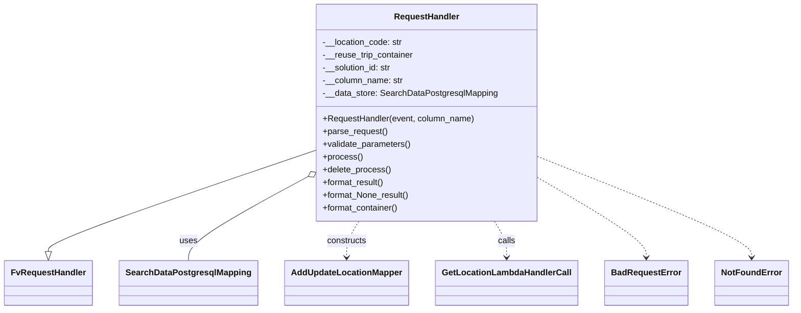

# Diagram: application_service/container_tracking_app_service/api/update_reuse_trip_container_location_exit.py


> Auto-generated by Obscura crawlers

## Diagram 1



### SVG

<svg id="container" width="1430.921875" xmlns="http://www.w3.org/2000/svg" class="classDiagram" height="582" viewBox="0 0 1430.921875 582" role="graphics-document document" aria-roledescription="class"><style>#container{font-family:"trebuchet ms",verdana,arial,sans-serif;font-size:16px;fill:#333;}@keyframes edge-animation-frame{from{stroke-dashoffset:0;}}@keyframes dash{to{stroke-dashoffset:0;}}#container .edge-animation-slow{stroke-dasharray:9,5!important;stroke-dashoffset:900;animation:dash 50s linear infinite;stroke-linecap:round;}#container .edge-animation-fast{stroke-dasharray:9,5!important;stroke-dashoffset:900;animation:dash 20s linear infinite;stroke-linecap:round;}#container .error-icon{fill:#552222;}#container .error-text{fill:#552222;stroke:#552222;}#container .edge-thickness-normal{stroke-width:1px;}#container .edge-thickness-thick{stroke-width:3.5px;}#container .edge-pattern-solid{stroke-dasharray:0;}#container .edge-thickness-invisible{stroke-width:0;fill:none;}#container .edge-pattern-dashed{stroke-dasharray:3;}#container .edge-pattern-dotted{stroke-dasharray:2;}#container .marker{fill:#333333;stroke:#333333;}#container .marker.cross{stroke:#333333;}#container svg{font-family:"trebuchet ms",verdana,arial,sans-serif;font-size:16px;}#container p{margin:0;}#container g.classGroup text{fill:#9370DB;stroke:none;font-family:"trebuchet ms",verdana,arial,sans-serif;font-size:10px;}#container g.classGroup text .title{font-weight:bolder;}#container .nodeLabel,#container .edgeLabel{color:#131300;}#container .edgeLabel .label rect{fill:#ECECFF;}#container .label text{fill:#131300;}#container .labelBkg{background:#ECECFF;}#container .edgeLabel .label span{background:#ECECFF;}#container .classTitle{font-weight:bolder;}#container .node rect,#container .node circle,#container .node ellipse,#container .node polygon,#container .node path{fill:#ECECFF;stroke:#9370DB;stroke-width:1px;}#container .divider{stroke:#9370DB;stroke-width:1;}#container g.clickable{cursor:pointer;}#container g.classGroup rect{fill:#ECECFF;stroke:#9370DB;}#container g.classGroup line{stroke:#9370DB;stroke-width:1;}#container .classLabel .box{stroke:none;stroke-width:0;fill:#ECECFF;opacity:0.5;}#container .classLabel .label{fill:#9370DB;font-size:10px;}#container .relation{stroke:#333333;stroke-width:1;fill:none;}#container .dashed-line{stroke-dasharray:3;}#container .dotted-line{stroke-dasharray:1 2;}#container #compositionStart,#container .composition{fill:#333333!important;stroke:#333333!important;stroke-width:1;}#container #compositionEnd,#container .composition{fill:#333333!important;stroke:#333333!important;stroke-width:1;}#container #dependencyStart,#container .dependency{fill:#333333!important;stroke:#333333!important;stroke-width:1;}#container #dependencyStart,#container .dependency{fill:#333333!important;stroke:#333333!important;stroke-width:1;}#container #extensionStart,#container .extension{fill:transparent!important;stroke:#333333!important;stroke-width:1;}#container #extensionEnd,#container .extension{fill:transparent!important;stroke:#333333!important;stroke-width:1;}#container #aggregationStart,#container .aggregation{fill:transparent!important;stroke:#333333!important;stroke-width:1;}#container #aggregationEnd,#container .aggregation{fill:transparent!important;stroke:#333333!important;stroke-width:1;}#container #lollipopStart,#container .lollipop{fill:#ECECFF!important;stroke:#333333!important;stroke-width:1;}#container #lollipopEnd,#container .lollipop{fill:#ECECFF!important;stroke:#333333!important;stroke-width:1;}#container .edgeTerminals{font-size:11px;line-height:initial;}#container .classTitleText{text-anchor:middle;font-size:18px;fill:#333;}#container .label-icon{display:inline-block;height:1em;overflow:visible;vertical-align:-0.125em;}#container .node .label-icon path{fill:currentColor;stroke:revert;stroke-width:revert;}#container :root{--mermaid-font-family:"trebuchet ms",verdana,arial,sans-serif;}</style><g><defs><marker id="container_class-aggregationStart" class="marker aggregation class" refX="18" refY="7" markerWidth="190" markerHeight="240" orient="auto"><path d="M 18,7 L9,13 L1,7 L9,1 Z"></path></marker></defs><defs><marker id="container_class-aggregationEnd" class="marker aggregation class" refX="1" refY="7" markerWidth="20" markerHeight="28" orient="auto"><path d="M 18,7 L9,13 L1,7 L9,1 Z"></path></marker></defs><defs><marker id="container_class-extensionStart" class="marker extension class" refX="18" refY="7" markerWidth="190" markerHeight="240" orient="auto"><path d="M 1,7 L18,13 V 1 Z"></path></marker></defs><defs><marker id="container_class-extensionEnd" class="marker extension class" refX="1" refY="7" markerWidth="20" markerHeight="28" orient="auto"><path d="M 1,1 V 13 L18,7 Z"></path></marker></defs><defs><marker id="container_class-compositionStart" class="marker composition class" refX="18" refY="7" markerWidth="190" markerHeight="240" orient="auto"><path d="M 18,7 L9,13 L1,7 L9,1 Z"></path></marker></defs><defs><marker id="container_class-compositionEnd" class="marker composition class" refX="1" refY="7" markerWidth="20" markerHeight="28" orient="auto"><path d="M 18,7 L9,13 L1,7 L9,1 Z"></path></marker></defs><defs><marker id="container_class-dependencyStart" class="marker dependency class" refX="6" refY="7" markerWidth="190" markerHeight="240" orient="auto"><path d="M 5,7 L9,13 L1,7 L9,1 Z"></path></marker></defs><defs><marker id="container_class-dependencyEnd" class="marker dependency class" refX="13" refY="7" markerWidth="20" markerHeight="28" orient="auto"><path d="M 18,7 L9,13 L14,7 L9,1 Z"></path></marker></defs><defs><marker id="container_class-lollipopStart" class="marker lollipop class" refX="13" refY="7" markerWidth="190" markerHeight="240" orient="auto"><circle stroke="black" fill="transparent" cx="7" cy="7" r="6"></circle></marker></defs><defs><marker id="container_class-lollipopEnd" class="marker lollipop class" refX="1" refY="7" markerWidth="190" markerHeight="240" orient="auto"><circle stroke="black" fill="transparent" cx="7" cy="7" r="6"></circle></marker></defs><g class="root"><g class="clusters"></g><g class="edgePaths"><path d="M565.5,284.276L485.715,312.397C405.93,340.518,246.359,396.759,166.574,428.171C86.789,459.583,86.789,466.167,86.789,469.458L86.789,472.75" id="id_RequestHandler_FvRequestHandler_1" class="edge-thickness-normal edge-pattern-solid relation" style=";;;" data-edge="true" data-et="edge" data-id="id_RequestHandler_FvRequestHandler_1" data-points="W3sieCI6NTY1LjUsInkiOjI4NC4yNzY0NTcxODAwNzE2NX0seyJ4Ijo4Ni43ODkwNjI1LCJ5Ijo0NTN9LHsieCI6ODYuNzg5MDYyNSwieSI6NDkwfV0=" marker-end="url(#container_class-extensionEnd)"></path><path d="M550.444,335.09L515.301,354.742C480.158,374.393,409.872,413.697,374.729,439.515C339.586,465.333,339.586,477.667,339.586,483.833L339.586,490" id="id_RequestHandler_SearchDataPostgresqlMapping_2" class="edge-thickness-normal edge-pattern-solid relation" style=";;;" data-edge="true" data-et="edge" data-id="id_RequestHandler_SearchDataPostgresqlMapping_2" data-points="W3sieCI6NTY1LjUsInkiOjMyNi42NzEwOTg3ODQ1NjY0fSx7IngiOjMzOS41ODU5Mzc1LCJ5Ijo0NTN9LHsieCI6MzM5LjU4NTkzNzUsInkiOjQ5MH1d" marker-start="url(#container_class-aggregationStart)"></path><path d="M647.891,416L644.182,422.167C640.474,428.333,633.057,440.667,629.349,452C625.641,463.333,625.641,473.667,625.641,478.833L625.641,484" id="id_RequestHandler_AddUpdateLocationMapper_3" class="edge-thickness-normal edge-pattern-dashed relation" style=";;;" data-edge="true" data-et="edge" data-id="id_RequestHandler_AddUpdateLocationMapper_3" data-points="W3sieCI6NjQ3Ljg5MDY0MTIwODUwNjIsInkiOjQxNn0seyJ4Ijo2MjUuNjQwNjI1LCJ5Ijo0NTN9LHsieCI6NjI1LjY0MDYyNSwieSI6NDkwfV0=" marker-end="url(#container_class-dependencyEnd)"></path><path d="M893.242,416L896.951,422.167C900.659,428.333,908.076,440.667,911.784,452C915.492,463.333,915.492,473.667,915.492,478.833L915.492,484" id="id_RequestHandler_GetLocationLambdaHandlerCall_4" class="edge-thickness-normal edge-pattern-dashed relation" style=";;;" data-edge="true" data-et="edge" data-id="id_RequestHandler_GetLocationLambdaHandlerCall_4" data-points="W3sieCI6ODkzLjI0MjE3MTI5MTQ5MzgsInkiOjQxNn0seyJ4Ijo5MTUuNDkyMTg3NSwieSI6NDUzfSx7IngiOjkxNS40OTIxODc1LCJ5Ijo0OTB9XQ==" marker-end="url(#container_class-dependencyEnd)"></path><path d="M975.633,336.482L1007.624,355.902C1039.615,375.322,1103.596,414.161,1135.587,438.747C1167.578,463.333,1167.578,473.667,1167.578,478.833L1167.578,484" id="id_RequestHandler_BadRequestError_5" class="edge-thickness-normal edge-pattern-dashed relation" style=";;;" data-edge="true" data-et="edge" data-id="id_RequestHandler_BadRequestError_5" data-points="W3sieCI6OTc1LjYzMjgxMjUsInkiOjMzNi40ODI0ODE0Mjg2NDE3fSx7IngiOjExNjcuNTc4MTI1LCJ5Ijo0NTN9LHsieCI6MTE2Ny41NzgxMjUsInkiOjQ5MH1d" marker-end="url(#container_class-dependencyEnd)"></path><path d="M975.633,296.218L1039.259,322.348C1102.885,348.478,1230.138,400.739,1293.764,432.036C1357.391,463.333,1357.391,473.667,1357.391,478.833L1357.391,484" id="id_RequestHandler_NotFoundError_6" class="edge-thickness-normal edge-pattern-dashed relation" style=";;;" data-edge="true" data-et="edge" data-id="id_RequestHandler_NotFoundError_6" data-points="W3sieCI6OTc1LjYzMjgxMjUsInkiOjI5Ni4yMTc3MzA1MDExNzQ4Nn0seyJ4IjoxMzU3LjM5MDYyNSwieSI6NDUzfSx7IngiOjEzNTcuMzkwNjI1LCJ5Ijo0OTB9XQ==" marker-end="url(#container_class-dependencyEnd)"></path></g><g class="edgeLabels"><g class="edgeLabel"><g class="label" data-id="id_RequestHandler_FvRequestHandler_1" transform="translate(0, 0)"><foreignObject width="0" height="0"><div xmlns="http://www.w3.org/1999/xhtml" class="labelBkg" style="display: table-cell; white-space: nowrap; line-height: 1.5; max-width: 200px; text-align: center;"><span class="edgeLabel"></span></div></foreignObject></g></g><g class="edgeLabel" transform="translate(339.5859375, 453)"><g class="label" data-id="id_RequestHandler_SearchDataPostgresqlMapping_2" transform="translate(-16.4921875, -12)"><foreignObject width="32.984375" height="24"><div xmlns="http://www.w3.org/1999/xhtml" class="labelBkg" style="display: table-cell; white-space: nowrap; line-height: 1.5; max-width: 200px; text-align: center;"><span class="edgeLabel"><p>uses</p></span></div></foreignObject></g></g><g class="edgeLabel" transform="translate(625.640625, 453)"><g class="label" data-id="id_RequestHandler_AddUpdateLocationMapper_3" transform="translate(-37.84375, -12)"><foreignObject width="75.6875" height="24"><div xmlns="http://www.w3.org/1999/xhtml" class="labelBkg" style="display: table-cell; white-space: nowrap; line-height: 1.5; max-width: 200px; text-align: center;"><span class="edgeLabel"><p>constructs</p></span></div></foreignObject></g></g><g class="edgeLabel" transform="translate(915.4921875, 453)"><g class="label" data-id="id_RequestHandler_GetLocationLambdaHandlerCall_4" transform="translate(-16.4453125, -12)"><foreignObject width="32.890625" height="24"><div xmlns="http://www.w3.org/1999/xhtml" class="labelBkg" style="display: table-cell; white-space: nowrap; line-height: 1.5; max-width: 200px; text-align: center;"><span class="edgeLabel"><p>calls</p></span></div></foreignObject></g></g><g class="edgeLabel"><g class="label" data-id="id_RequestHandler_BadRequestError_5" transform="translate(0, 0)"><foreignObject width="0" height="0"><div xmlns="http://www.w3.org/1999/xhtml" class="labelBkg" style="display: table-cell; white-space: nowrap; line-height: 1.5; max-width: 200px; text-align: center;"><span class="edgeLabel"></span></div></foreignObject></g></g><g class="edgeLabel"><g class="label" data-id="id_RequestHandler_NotFoundError_6" transform="translate(0, 0)"><foreignObject width="0" height="0"><div xmlns="http://www.w3.org/1999/xhtml" class="labelBkg" style="display: table-cell; white-space: nowrap; line-height: 1.5; max-width: 200px; text-align: center;"><span class="edgeLabel"></span></div></foreignObject></g></g></g><g class="nodes"><g class="node default" id="classId-RequestHandler-0" transform="translate(770.56640625, 212)"><g class="basic label-container"><path d="M-205.06640625 -204 L205.06640625 -204 L205.06640625 204 L-205.06640625 204" stroke="none" stroke-width="0" fill="#ECECFF" style=""></path><path d="M-205.06640625 -204 C-119.64510520107117 -204, -34.22380415214235 -204, 205.06640625 -204 M-205.06640625 -204 C-62.9906317941728 -204, 79.0851426616544 -204, 205.06640625 -204 M205.06640625 -204 C205.06640625 -84.89338480552956, 205.06640625 34.21323038894087, 205.06640625 204 M205.06640625 -204 C205.06640625 -71.6085272290766, 205.06640625 60.7829455418468, 205.06640625 204 M205.06640625 204 C103.27407898579959 204, 1.4817517215991813 204, -205.06640625 204 M205.06640625 204 C96.53126906942005 204, -12.003868111159903 204, -205.06640625 204 M-205.06640625 204 C-205.06640625 115.22095893305303, -205.06640625 26.441917866106053, -205.06640625 -204 M-205.06640625 204 C-205.06640625 43.24604138234483, -205.06640625 -117.50791723531034, -205.06640625 -204" stroke="#9370DB" stroke-width="1.3" fill="none" stroke-dasharray="0 0" style=""></path></g><g class="annotation-group text" transform="translate(0, -180)"></g><g class="label-group text" transform="translate(-59.0703125, -180)"><g class="label" style="font-weight: bolder" transform="translate(0,-12)"><foreignObject width="118.140625" height="24"><div xmlns="http://www.w3.org/1999/xhtml" style="display: table-cell; white-space: nowrap; line-height: 1.5; max-width: 168px; text-align: center;"><span class="nodeLabel markdown-node-label" style=""><p>RequestHandler</p></span></div></foreignObject></g></g><g class="members-group text" transform="translate(-193.06640625, -132)"><g class="label" style="" transform="translate(0,-12)"><foreignObject width="151.109375" height="24"><div xmlns="http://www.w3.org/1999/xhtml" style="display: table-cell; white-space: nowrap; line-height: 1.5; max-width: 209px; text-align: center;"><span class="nodeLabel markdown-node-label" style=""><p>-__location_code: str</p></span></div></foreignObject></g><g class="label" style="" transform="translate(0,12)"><foreignObject width="172.109375" height="24"><div xmlns="http://www.w3.org/1999/xhtml" style="display: table-cell; white-space: nowrap; line-height: 1.5; max-width: 230px; text-align: center;"><span class="nodeLabel markdown-node-label" style=""><p>-__reuse_trip_container</p></span></div></foreignObject></g><g class="label" style="" transform="translate(0,36)"><foreignObject width="131.390625" height="24"><div xmlns="http://www.w3.org/1999/xhtml" style="display: table-cell; white-space: nowrap; line-height: 1.5; max-width: 190px; text-align: center;"><span class="nodeLabel markdown-node-label" style=""><p>-__solution_id: str</p></span></div></foreignObject></g><g class="label" style="" transform="translate(0,60)"><foreignObject width="151.4375" height="24"><div xmlns="http://www.w3.org/1999/xhtml" style="display: table-cell; white-space: nowrap; line-height: 1.5; max-width: 210px; text-align: center;"><span class="nodeLabel markdown-node-label" style=""><p>-__column_name: str</p></span></div></foreignObject></g><g class="label" style="" transform="translate(0,84)"><foreignObject width="327.0625" height="24"><div xmlns="http://www.w3.org/1999/xhtml" style="display: table-cell; white-space: nowrap; line-height: 1.5; max-width: 385px; text-align: center;"><span class="nodeLabel markdown-node-label" style=""><p>-__data_store: SearchDataPostgresqlMapping</p></span></div></foreignObject></g></g><g class="methods-group text" transform="translate(-193.06640625, 12)"><g class="label" style="" transform="translate(0,-12)"><foreignObject width="286.46875" height="24"><div xmlns="http://www.w3.org/1999/xhtml" style="display: table-cell; white-space: nowrap; line-height: 1.5; max-width: 344px; text-align: center;"><span class="nodeLabel markdown-node-label" style=""><p>+RequestHandler(event, column_name)</p></span></div></foreignObject></g><g class="label" style="" transform="translate(0,12)"><foreignObject width="121.796875" height="24"><div xmlns="http://www.w3.org/1999/xhtml" style="display: table-cell; white-space: nowrap; line-height: 1.5; max-width: 179px; text-align: center;"><span class="nodeLabel markdown-node-label" style=""><p>+parse_request()</p></span></div></foreignObject></g><g class="label" style="" transform="translate(0,36)"><foreignObject width="166.546875" height="24"><div xmlns="http://www.w3.org/1999/xhtml" style="display: table-cell; white-space: nowrap; line-height: 1.5; max-width: 224px; text-align: center;"><span class="nodeLabel markdown-node-label" style=""><p>+validate_parameters()</p></span></div></foreignObject></g><g class="label" style="" transform="translate(0,60)"><foreignObject width="73.734375" height="24"><div xmlns="http://www.w3.org/1999/xhtml" style="display: table-cell; white-space: nowrap; line-height: 1.5; max-width: 131px; text-align: center;"><span class="nodeLabel markdown-node-label" style=""><p>+process()</p></span></div></foreignObject></g><g class="label" style="" transform="translate(0,84)"><foreignObject width="127.609375" height="24"><div xmlns="http://www.w3.org/1999/xhtml" style="display: table-cell; white-space: nowrap; line-height: 1.5; max-width: 185px; text-align: center;"><span class="nodeLabel markdown-node-label" style=""><p>+delete_process()</p></span></div></foreignObject></g><g class="label" style="" transform="translate(0,108)"><foreignObject width="117.015625" height="24"><div xmlns="http://www.w3.org/1999/xhtml" style="display: table-cell; white-space: nowrap; line-height: 1.5; max-width: 174px; text-align: center;"><span class="nodeLabel markdown-node-label" style=""><p>+format_result()</p></span></div></foreignObject></g><g class="label" style="" transform="translate(0,132)"><foreignObject width="163.390625" height="24"><div xmlns="http://www.w3.org/1999/xhtml" style="display: table-cell; white-space: nowrap; line-height: 1.5; max-width: 221px; text-align: center;"><span class="nodeLabel markdown-node-label" style=""><p>+format_None_result()</p></span></div></foreignObject></g><g class="label" style="" transform="translate(0,156)"><foreignObject width="144.234375" height="24"><div xmlns="http://www.w3.org/1999/xhtml" style="display: table-cell; white-space: nowrap; line-height: 1.5; max-width: 202px; text-align: center;"><span class="nodeLabel markdown-node-label" style=""><p>+format_container()</p></span></div></foreignObject></g></g><g class="divider" style=""><path d="M-205.06640625 -156 C-79.5720739424193 -156, 45.92225836516141 -156, 205.06640625 -156 M-205.06640625 -156 C-54.24193113333965 -156, 96.5825439833207 -156, 205.06640625 -156" stroke="#9370DB" stroke-width="1.3" fill="none" stroke-dasharray="0 0" style=""></path></g><g class="divider" style=""><path d="M-205.06640625 -12 C-90.85664990779112 -12, 23.353106434417754 -12, 205.06640625 -12 M-205.06640625 -12 C-46.48190371733824 -12, 112.10259881532352 -12, 205.06640625 -12" stroke="#9370DB" stroke-width="1.3" fill="none" stroke-dasharray="0 0" style=""></path></g></g><g class="node default" id="classId-FvRequestHandler-1" transform="translate(86.7890625, 532)"><g class="basic label-container"><path d="M-78.7890625 -42 L78.7890625 -42 L78.7890625 42 L-78.7890625 42" stroke="none" stroke-width="0" fill="#ECECFF" style=""></path><path d="M-78.7890625 -42 C-22.325992808363267 -42, 34.137076883273465 -42, 78.7890625 -42 M-78.7890625 -42 C-31.151767489644186 -42, 16.485527520711628 -42, 78.7890625 -42 M78.7890625 -42 C78.7890625 -24.795563933089074, 78.7890625 -7.591127866178148, 78.7890625 42 M78.7890625 -42 C78.7890625 -19.280028145918592, 78.7890625 3.439943708162815, 78.7890625 42 M78.7890625 42 C46.5005598925452 42, 14.212057285090395 42, -78.7890625 42 M78.7890625 42 C38.37945297856036 42, -2.0301565428792827 42, -78.7890625 42 M-78.7890625 42 C-78.7890625 15.087054597777577, -78.7890625 -11.825890804444846, -78.7890625 -42 M-78.7890625 42 C-78.7890625 10.27602089872725, -78.7890625 -21.4479582025455, -78.7890625 -42" stroke="#9370DB" stroke-width="1.3" fill="none" stroke-dasharray="0 0" style=""></path></g><g class="annotation-group text" transform="translate(0, -18)"></g><g class="label-group text" transform="translate(-66.7890625, -18)"><g class="label" style="font-weight: bolder" transform="translate(0,-12)"><foreignObject width="133.578125" height="24"><div xmlns="http://www.w3.org/1999/xhtml" style="display: table-cell; white-space: nowrap; line-height: 1.5; max-width: 183px; text-align: center;"><span class="nodeLabel markdown-node-label" style=""><p>FvRequestHandler</p></span></div></foreignObject></g></g><g class="members-group text" transform="translate(-66.7890625, 30)"></g><g class="methods-group text" transform="translate(-66.7890625, 60)"></g><g class="divider" style=""><path d="M-78.7890625 6 C-28.572318519492292 6, 21.644425461015416 6, 78.7890625 6 M-78.7890625 6 C-16.66895705476177 6, 45.45114839047646 6, 78.7890625 6" stroke="#9370DB" stroke-width="1.3" fill="none" stroke-dasharray="0 0" style=""></path></g><g class="divider" style=""><path d="M-78.7890625 24 C-21.362269973347665 24, 36.06452255330467 24, 78.7890625 24 M-78.7890625 24 C-39.241847638692235 24, 0.30536722261552995 24, 78.7890625 24" stroke="#9370DB" stroke-width="1.3" fill="none" stroke-dasharray="0 0" style=""></path></g></g><g class="node default" id="classId-SearchDataPostgresqlMapping-2" transform="translate(339.5859375, 532)"><g class="basic label-container"><path d="M-124.0078125 -42 L124.0078125 -42 L124.0078125 42 L-124.0078125 42" stroke="none" stroke-width="0" fill="#ECECFF" style=""></path><path d="M-124.0078125 -42 C-54.19680018861598 -42, 15.614212122768038 -42, 124.0078125 -42 M-124.0078125 -42 C-73.27993824023201 -42, -22.552063980464027 -42, 124.0078125 -42 M124.0078125 -42 C124.0078125 -16.812241732538965, 124.0078125 8.37551653492207, 124.0078125 42 M124.0078125 -42 C124.0078125 -17.14910144697278, 124.0078125 7.701797106054443, 124.0078125 42 M124.0078125 42 C43.50217835813383 42, -37.003455783732335 42, -124.0078125 42 M124.0078125 42 C46.847836164035 42, -30.312140171929997 42, -124.0078125 42 M-124.0078125 42 C-124.0078125 23.035296013458662, -124.0078125 4.070592026917325, -124.0078125 -42 M-124.0078125 42 C-124.0078125 17.28714367376232, -124.0078125 -7.425712652475362, -124.0078125 -42" stroke="#9370DB" stroke-width="1.3" fill="none" stroke-dasharray="0 0" style=""></path></g><g class="annotation-group text" transform="translate(0, -18)"></g><g class="label-group text" transform="translate(-112.0078125, -18)"><g class="label" style="font-weight: bolder" transform="translate(0,-12)"><foreignObject width="224.015625" height="24"><div xmlns="http://www.w3.org/1999/xhtml" style="display: table-cell; white-space: nowrap; line-height: 1.5; max-width: 271px; text-align: center;"><span class="nodeLabel markdown-node-label" style=""><p>SearchDataPostgresqlMapping</p></span></div></foreignObject></g></g><g class="members-group text" transform="translate(-112.0078125, 30)"></g><g class="methods-group text" transform="translate(-112.0078125, 60)"></g><g class="divider" style=""><path d="M-124.0078125 6 C-35.998442615490305 6, 52.01092726901939 6, 124.0078125 6 M-124.0078125 6 C-73.83511723847772 6, -23.66242197695543 6, 124.0078125 6" stroke="#9370DB" stroke-width="1.3" fill="none" stroke-dasharray="0 0" style=""></path></g><g class="divider" style=""><path d="M-124.0078125 24 C-56.81928151311344 24, 10.369249473773124 24, 124.0078125 24 M-124.0078125 24 C-32.078796842850096 24, 59.85021881429981 24, 124.0078125 24" stroke="#9370DB" stroke-width="1.3" fill="none" stroke-dasharray="0 0" style=""></path></g></g><g class="node default" id="classId-AddUpdateLocationMapper-3" transform="translate(625.640625, 532)"><g class="basic label-container"><path d="M-112.046875 -42 L112.046875 -42 L112.046875 42 L-112.046875 42" stroke="none" stroke-width="0" fill="#ECECFF" style=""></path><path d="M-112.046875 -42 C-45.50190997228313 -42, 21.04305505543374 -42, 112.046875 -42 M-112.046875 -42 C-36.489228508540506 -42, 39.06841798291899 -42, 112.046875 -42 M112.046875 -42 C112.046875 -23.773737538288806, 112.046875 -5.547475076577612, 112.046875 42 M112.046875 -42 C112.046875 -12.838560420722303, 112.046875 16.322879158555395, 112.046875 42 M112.046875 42 C66.93089439306726 42, 21.81491378613454 42, -112.046875 42 M112.046875 42 C44.098544966871245 42, -23.84978506625751 42, -112.046875 42 M-112.046875 42 C-112.046875 16.598175194467487, -112.046875 -8.803649611065026, -112.046875 -42 M-112.046875 42 C-112.046875 22.222733085999224, -112.046875 2.445466171998447, -112.046875 -42" stroke="#9370DB" stroke-width="1.3" fill="none" stroke-dasharray="0 0" style=""></path></g><g class="annotation-group text" transform="translate(0, -18)"></g><g class="label-group text" transform="translate(-100.046875, -18)"><g class="label" style="font-weight: bolder" transform="translate(0,-12)"><foreignObject width="200.09375" height="24"><div xmlns="http://www.w3.org/1999/xhtml" style="display: table-cell; white-space: nowrap; line-height: 1.5; max-width: 249px; text-align: center;"><span class="nodeLabel markdown-node-label" style=""><p>AddUpdateLocationMapper</p></span></div></foreignObject></g></g><g class="members-group text" transform="translate(-100.046875, 30)"></g><g class="methods-group text" transform="translate(-100.046875, 60)"></g><g class="divider" style=""><path d="M-112.046875 6 C-65.56960966434883 6, -19.092344328697664 6, 112.046875 6 M-112.046875 6 C-45.60734417925852 6, 20.832186641482963 6, 112.046875 6" stroke="#9370DB" stroke-width="1.3" fill="none" stroke-dasharray="0 0" style=""></path></g><g class="divider" style=""><path d="M-112.046875 24 C-62.62386770769474 24, -13.200860415389485 24, 112.046875 24 M-112.046875 24 C-59.61237164947797 24, -7.177868298955943 24, 112.046875 24" stroke="#9370DB" stroke-width="1.3" fill="none" stroke-dasharray="0 0" style=""></path></g></g><g class="node default" id="classId-GetLocationLambdaHandlerCall-4" transform="translate(915.4921875, 532)"><g class="basic label-container"><path d="M-127.8046875 -42 L127.8046875 -42 L127.8046875 42 L-127.8046875 42" stroke="none" stroke-width="0" fill="#ECECFF" style=""></path><path d="M-127.8046875 -42 C-33.75448557491026 -42, 60.295716350179475 -42, 127.8046875 -42 M-127.8046875 -42 C-50.70696811098236 -42, 26.39075127803528 -42, 127.8046875 -42 M127.8046875 -42 C127.8046875 -19.333376526675167, 127.8046875 3.333246946649666, 127.8046875 42 M127.8046875 -42 C127.8046875 -9.392371257715254, 127.8046875 23.21525748456949, 127.8046875 42 M127.8046875 42 C65.84457043378617 42, 3.884453367572334 42, -127.8046875 42 M127.8046875 42 C33.91974609742756 42, -59.965195305144874 42, -127.8046875 42 M-127.8046875 42 C-127.8046875 11.96929359075072, -127.8046875 -18.06141281849856, -127.8046875 -42 M-127.8046875 42 C-127.8046875 9.880962171247042, -127.8046875 -22.238075657505917, -127.8046875 -42" stroke="#9370DB" stroke-width="1.3" fill="none" stroke-dasharray="0 0" style=""></path></g><g class="annotation-group text" transform="translate(0, -18)"></g><g class="label-group text" transform="translate(-115.8046875, -18)"><g class="label" style="font-weight: bolder" transform="translate(0,-12)"><foreignObject width="231.609375" height="24"><div xmlns="http://www.w3.org/1999/xhtml" style="display: table-cell; white-space: nowrap; line-height: 1.5; max-width: 280px; text-align: center;"><span class="nodeLabel markdown-node-label" style=""><p>GetLocationLambdaHandlerCall</p></span></div></foreignObject></g></g><g class="members-group text" transform="translate(-115.8046875, 30)"></g><g class="methods-group text" transform="translate(-115.8046875, 60)"></g><g class="divider" style=""><path d="M-127.8046875 6 C-38.103136738434486 6, 51.59841402313103 6, 127.8046875 6 M-127.8046875 6 C-44.84411863910145 6, 38.116450221797095 6, 127.8046875 6" stroke="#9370DB" stroke-width="1.3" fill="none" stroke-dasharray="0 0" style=""></path></g><g class="divider" style=""><path d="M-127.8046875 24 C-33.34179581398236 24, 61.12109587203528 24, 127.8046875 24 M-127.8046875 24 C-29.374975503009296 24, 69.05473649398141 24, 127.8046875 24" stroke="#9370DB" stroke-width="1.3" fill="none" stroke-dasharray="0 0" style=""></path></g></g><g class="node default" id="classId-BadRequestError-5" transform="translate(1167.578125, 532)"><g class="basic label-container"><path d="M-74.28125 -42 L74.28125 -42 L74.28125 42 L-74.28125 42" stroke="none" stroke-width="0" fill="#ECECFF" style=""></path><path d="M-74.28125 -42 C-39.36365280221406 -42, -4.446055604428125 -42, 74.28125 -42 M-74.28125 -42 C-16.164179718267363 -42, 41.952890563465274 -42, 74.28125 -42 M74.28125 -42 C74.28125 -12.616839413360744, 74.28125 16.766321173278513, 74.28125 42 M74.28125 -42 C74.28125 -21.787082436440095, 74.28125 -1.5741648728801891, 74.28125 42 M74.28125 42 C30.538732104003813 42, -13.203785791992374 42, -74.28125 42 M74.28125 42 C41.40994818806816 42, 8.538646376136313 42, -74.28125 42 M-74.28125 42 C-74.28125 18.902704203771457, -74.28125 -4.194591592457087, -74.28125 -42 M-74.28125 42 C-74.28125 9.028805146729923, -74.28125 -23.942389706540155, -74.28125 -42" stroke="#9370DB" stroke-width="1.3" fill="none" stroke-dasharray="0 0" style=""></path></g><g class="annotation-group text" transform="translate(0, -18)"></g><g class="label-group text" transform="translate(-62.28125, -18)"><g class="label" style="font-weight: bolder" transform="translate(0,-12)"><foreignObject width="124.5625" height="24"><div xmlns="http://www.w3.org/1999/xhtml" style="display: table-cell; white-space: nowrap; line-height: 1.5; max-width: 174px; text-align: center;"><span class="nodeLabel markdown-node-label" style=""><p>BadRequestError</p></span></div></foreignObject></g></g><g class="members-group text" transform="translate(-62.28125, 30)"></g><g class="methods-group text" transform="translate(-62.28125, 60)"></g><g class="divider" style=""><path d="M-74.28125 6 C-23.001551947128817 6, 28.278146105742366 6, 74.28125 6 M-74.28125 6 C-22.983300087921528 6, 28.314649824156945 6, 74.28125 6" stroke="#9370DB" stroke-width="1.3" fill="none" stroke-dasharray="0 0" style=""></path></g><g class="divider" style=""><path d="M-74.28125 24 C-34.780980838203575 24, 4.719288323592849 24, 74.28125 24 M-74.28125 24 C-29.90957286872308 24, 14.462104262553837 24, 74.28125 24" stroke="#9370DB" stroke-width="1.3" fill="none" stroke-dasharray="0 0" style=""></path></g></g><g class="node default" id="classId-NotFoundError-6" transform="translate(1357.390625, 532)"><g class="basic label-container"><path d="M-65.53125 -42 L65.53125 -42 L65.53125 42 L-65.53125 42" stroke="none" stroke-width="0" fill="#ECECFF" style=""></path><path d="M-65.53125 -42 C-17.61600343874869 -42, 30.299243122502617 -42, 65.53125 -42 M-65.53125 -42 C-19.425054088464158 -42, 26.681141823071684 -42, 65.53125 -42 M65.53125 -42 C65.53125 -25.053275989174264, 65.53125 -8.106551978348527, 65.53125 42 M65.53125 -42 C65.53125 -15.362899472100523, 65.53125 11.274201055798954, 65.53125 42 M65.53125 42 C25.94156711765278 42, -13.648115764694438 42, -65.53125 42 M65.53125 42 C14.19257652566769 42, -37.14609694866462 42, -65.53125 42 M-65.53125 42 C-65.53125 10.98637678613579, -65.53125 -20.02724642772842, -65.53125 -42 M-65.53125 42 C-65.53125 12.42337605046201, -65.53125 -17.15324789907598, -65.53125 -42" stroke="#9370DB" stroke-width="1.3" fill="none" stroke-dasharray="0 0" style=""></path></g><g class="annotation-group text" transform="translate(0, -18)"></g><g class="label-group text" transform="translate(-53.53125, -18)"><g class="label" style="font-weight: bolder" transform="translate(0,-12)"><foreignObject width="107.0625" height="24"><div xmlns="http://www.w3.org/1999/xhtml" style="display: table-cell; white-space: nowrap; line-height: 1.5; max-width: 158px; text-align: center;"><span class="nodeLabel markdown-node-label" style=""><p>NotFoundError</p></span></div></foreignObject></g></g><g class="members-group text" transform="translate(-53.53125, 30)"></g><g class="methods-group text" transform="translate(-53.53125, 60)"></g><g class="divider" style=""><path d="M-65.53125 6 C-20.820348930792058 6, 23.890552138415885 6, 65.53125 6 M-65.53125 6 C-35.099213335720364 6, -4.667176671440728 6, 65.53125 6" stroke="#9370DB" stroke-width="1.3" fill="none" stroke-dasharray="0 0" style=""></path></g><g class="divider" style=""><path d="M-65.53125 24 C-26.04602674248322 24, 13.439196515033558 24, 65.53125 24 M-65.53125 24 C-36.88803510021032 24, -8.244820200420634 24, 65.53125 24" stroke="#9370DB" stroke-width="1.3" fill="none" stroke-dasharray="0 0" style=""></path></g></g></g></g></g></svg>

## Diagram 2

```mermaid
flowchart TD
Start([lambda_handler start]) --> Instantiate[/"RequestHandler(event,'location_code')"/]
Instantiate --> Parse[/"parse_request()"/]
Parse --> Validate[/"validate_parameters()"/]
Validate --> DBRead[/"process() -> reuse_trip_container_data"/]
DBRead --> IsNone{reuse_trip_container_data == None}
IsNone -- Yes --> FormatNone["format_None_result()"]
FormatNone --> MakeRespNone["make_response(..., 200)"]
MakeRespNone --> End([End])
IsNone -- No --> CallAPI[/"GetLocationLambdaHandlerCall.get_lambda_detail(event) -> container_exists"/]
CallAPI --> LenCheck{len(container_exists)}
LenCheck -- "== 1" --> IdCheck{container_exists[0].containerId == event.body.containerId}
IdCheck -- Yes --> Delete1[/"delete_process()"/] --> FormatRes1["format_result()"] --> MakeResp1["make_response(..., 200)"] --> End
IdCheck -- No --> FormatContainer["format_container()"] --> MakeResp2["make_response(..., 200)"] --> End
LenCheck -- "> 1" --> FormatContainer2["format_container()"] --> MakeResp3["make_response(..., 200)"] --> End
LenCheck -- "== 0" --> Delete2[/"delete_process()"/] --> FormatRes2["format_result()"] --> MakeResp4["make_response(..., 200)"] --> End
```

> SVG rendering failed for this diagram.
