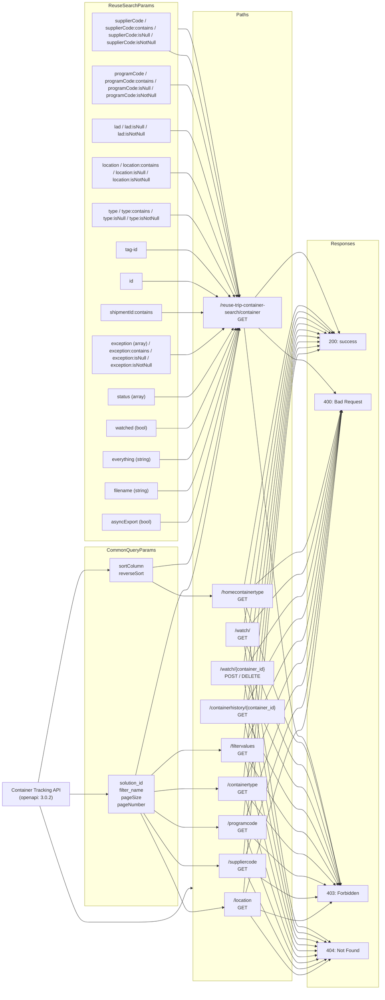

# Diagram: application_service/container_tracking_app_service/api_documentation/AdvancedSearchFilters.yaml

> Auto-generated by Obscura crawlers

## Diagram 1

### SVG

<svg id="container" width="1534.40625" xmlns="http://www.w3.org/2000/svg" class="flowchart" height="3118" viewBox="0 0 1534.40625 3118" role="graphics-document document" aria-roledescription="flowchart-v2"><g><marker id="container_flowchart-v2-pointEnd" class="marker flowchart-v2" viewBox="0 0 10 10" refX="5" refY="5" markerUnits="userSpaceOnUse" markerWidth="8" markerHeight="8" orient="auto"><path d="M 0 0 L 10 5 L 0 10 z" class="arrowMarkerPath" style="stroke-width: 1; stroke-dasharray: 1, 0;"></path></marker><marker id="container_flowchart-v2-pointStart" class="marker flowchart-v2" viewBox="0 0 10 10" refX="4.5" refY="5" markerUnits="userSpaceOnUse" markerWidth="8" markerHeight="8" orient="auto"><path d="M 0 5 L 10 10 L 10 0 z" class="arrowMarkerPath" style="stroke-width: 1; stroke-dasharray: 1, 0;"></path></marker><marker id="container_flowchart-v2-circleEnd" class="marker flowchart-v2" viewBox="0 0 10 10" refX="11" refY="5" markerUnits="userSpaceOnUse" markerWidth="11" markerHeight="11" orient="auto"><circle cx="5" cy="5" r="5" class="arrowMarkerPath" style="stroke-width: 1; stroke-dasharray: 1, 0;"></circle></marker><marker id="container_flowchart-v2-circleStart" class="marker flowchart-v2" viewBox="0 0 10 10" refX="-1" refY="5" markerUnits="userSpaceOnUse" markerWidth="11" markerHeight="11" orient="auto"><circle cx="5" cy="5" r="5" class="arrowMarkerPath" style="stroke-width: 1; stroke-dasharray: 1, 0;"></circle></marker><marker id="container_flowchart-v2-crossEnd" class="marker cross flowchart-v2" viewBox="0 0 11 11" refX="12" refY="5.2" markerUnits="userSpaceOnUse" markerWidth="11" markerHeight="11" orient="auto"><path d="M 1,1 l 9,9 M 10,1 l -9,9" class="arrowMarkerPath" style="stroke-width: 2; stroke-dasharray: 1, 0;"></path></marker><marker id="container_flowchart-v2-crossStart" class="marker cross flowchart-v2" viewBox="0 0 11 11" refX="-1" refY="5.2" markerUnits="userSpaceOnUse" markerWidth="11" markerHeight="11" orient="auto"><path d="M 1,1 l 9,9 M 10,1 l -9,9" class="arrowMarkerPath" style="stroke-width: 2; stroke-dasharray: 1, 0;"></path></marker><g class="root"><g class="clusters"><g class="cluster" id="ReuseSearchParams" data-look="classic"><rect style="" x="318" y="8" width="482.125" height="1812"></rect><g class="cluster-label" transform="translate(486.5625, 8)"><foreignObject width="145" height="24">

ReuseSearchParams

</foreignObject></g></g><g class="cluster" id="CommonQueryParams" data-look="classic"><rect style="" x="318" y="1840" width="482.125" height="988"></rect><g class="cluster-label" transform="translate(479.1171875, 1840)"><foreignObject width="159.890625" height="24">

CommonQueryParams

</foreignObject></g></g><g class="cluster" id="Responses" data-look="classic"><rect style="" x="1290.703125" y="822" width="235.703125" height="2288"></rect><g class="cluster-label" transform="translate(1369.7890625, 822)"><foreignObject width="77.53125" height="24">

Responses

</foreignObject></g></g><g class="cluster" id="Paths" data-look="classic"><rect style="" x="850.125" y="38" width="390.578125" height="3062"></rect><g class="cluster-label" transform="translate(1025.5390625, 38)"><foreignObject width="39.75" height="24">

Paths

</foreignObject></g></g></g><g class="edgePaths"><path d="M268,2529L272.167,2529C276.333,2529,284.667,2529,293,2529C301.333,2529,309.667,2529,317.333,2529C325,2529,332,2529,335.5,2529L339,2529" id="L_API_common_0" class="edge-thickness-normal edge-pattern-solid edge-thickness-normal edge-pattern-solid flowchart-link" style=";" data-edge="true" data-et="edge" data-id="L_API_common_0" data-points="W3sieCI6MjY4LCJ5IjoyNTI5fSx7IngiOjI5MywieSI6MjUyOX0seyJ4IjozMTgsInkiOjI1Mjl9LHsieCI6MzQzLCJ5IjoyNTI5fV0=" marker-end="url(#container_flowchart-v2-pointEnd)"></path><path d="M147.782,2490L171.985,2393.5C196.188,2297,244.594,2104,272.964,2007.5C301.333,1911,309.667,1911,333.009,1911C356.352,1911,394.703,1911,413.879,1911L433.055,1911" id="L_API_sortParams_0" class="edge-thickness-normal edge-pattern-solid edge-thickness-normal edge-pattern-solid flowchart-link" style=";" data-edge="true" data-et="edge" data-id="L_API_sortParams_0" data-points="W3sieCI6MTQ3Ljc4MTU1MzM5ODA1ODI2LCJ5IjoyNDkwfSx7IngiOjI5MywieSI6MTkxMX0seyJ4IjozMTgsInkiOjE5MTF9LHsieCI6NDM3LjA1NDY4NzUsInkiOjE5MTF9XQ==" marker-end="url(#container_flowchart-v2-pointEnd)"></path><path d="M584.29,2556L620.262,2594.5C656.235,2633,728.18,2710,768.319,2763.833C808.458,2817.667,816.792,2848.333,825.125,2863.667C833.458,2879,841.792,2879,863.565,2874.492C885.339,2869.984,920.552,2860.969,938.159,2856.461L955.766,2851.953" id="L_common_loc_0" class="edge-thickness-normal edge-pattern-solid edge-thickness-normal edge-pattern-solid flowchart-link" style=";" data-edge="true" data-et="edge" data-id="L_common_loc_0" data-points="W3sieCI6NTg0LjI4OTk3MDkzMDIzMjYsInkiOjI1NTZ9LHsieCI6ODAwLjEyNSwieSI6Mjc4N30seyJ4Ijo4MjUuMTI1LCJ5IjoyODc5fSx7IngiOjg1MC4xMjUsInkiOjI4Nzl9LHsieCI6OTU5LjY0MDYyNSwieSI6Mjg1MC45NjA2MzUyNzYyMzN9XQ==" marker-end="url(#container_flowchart-v2-pointEnd)"></path><path d="M592.27,2556L626.913,2584.167C661.555,2612.333,730.84,2668.667,769.649,2696.833C808.458,2725,816.792,2725,825.125,2725C833.458,2725,841.792,2725,860.669,2725C879.547,2725,908.969,2725,923.68,2725L938.391,2725" id="L_common_sup_0" class="edge-thickness-normal edge-pattern-solid edge-thickness-normal edge-pattern-solid flowchart-link" style=";" data-edge="true" data-et="edge" data-id="L_common_sup_0" data-points="W3sieCI6NTkyLjI3MDA4OTI4NTcxNDMsInkiOjI1NTZ9LHsieCI6ODAwLjEyNSwieSI6MjcyNX0seyJ4Ijo4MjUuMTI1LCJ5IjoyNzI1fSx7IngiOjg1MC4xMjUsInkiOjI3MjV9LHsieCI6OTQyLjM5MDYyNSwieSI6MjcyNX1d" marker-end="url(#container_flowchart-v2-pointEnd)"></path><path d="M629.809,2556L658.195,2566.833C686.581,2577.667,743.353,2599.333,775.906,2610.167C808.458,2621,816.792,2621,825.125,2621C833.458,2621,841.792,2621,860.546,2621C879.299,2621,908.474,2621,923.061,2621L937.648,2621" id="L_common_prog_0" class="edge-thickness-normal edge-pattern-solid edge-thickness-normal edge-pattern-solid flowchart-link" style=";" data-edge="true" data-et="edge" data-id="L_common_prog_0" data-points="W3sieCI6NjI5LjgwOTEwMzI2MDg2OTUsInkiOjI1NTZ9LHsieCI6ODAwLjEyNSwieSI6MjYyMX0seyJ4Ijo4MjUuMTI1LCJ5IjoyNjIxfSx7IngiOjg1MC4xMjUsInkiOjI2MjF9LHsieCI6OTQxLjY0ODQzNzUsInkiOjI2MjF9XQ==" marker-end="url(#container_flowchart-v2-pointEnd)"></path><path d="M775.125,2518.244L779.292,2518.037C783.458,2517.83,791.792,2517.415,800.125,2517.207C808.458,2517,816.792,2517,825.125,2517C833.458,2517,841.792,2517,860.145,2517C878.497,2517,906.87,2517,921.056,2517L935.242,2517" id="L_common_ctype_0" class="edge-thickness-normal edge-pattern-solid edge-thickness-normal edge-pattern-solid flowchart-link" style=";" data-edge="true" data-et="edge" data-id="L_common_ctype_0" data-points="W3sieCI6Nzc1LjEyNSwieSI6MjUxOC4yNDQ0OTA1MzY2ODY1fSx7IngiOjgwMC4xMjUsInkiOjI1MTd9LHsieCI6ODI1LjEyNSwieSI6MjUxN30seyJ4Ijo4NTAuMTI1LCJ5IjoyNTE3fSx7IngiOjkzOS4yNDIxODc1LCJ5IjoyNTE3fV0=" marker-end="url(#container_flowchart-v2-pointEnd)"></path><path d="M615.172,2502L645.997,2487.167C676.823,2472.333,738.474,2442.667,773.466,2427.833C808.458,2413,816.792,2413,825.125,2413C833.458,2413,841.792,2413,861.798,2413C881.805,2413,913.484,2413,929.324,2413L945.164,2413" id="L_common_filtervals_0" class="edge-thickness-normal edge-pattern-solid edge-thickness-normal edge-pattern-solid flowchart-link" style=";" data-edge="true" data-et="edge" data-id="L_common_filtervals_0" data-points="W3sieCI6NjE1LjE3MTg3NSwieSI6MjUwMn0seyJ4Ijo4MDAuMTI1LCJ5IjoyNDEzfSx7IngiOjgyNS4xMjUsInkiOjI0MTN9LHsieCI6ODUwLjEyNSwieSI6MjQxM30seyJ4Ijo5NDkuMTY0MDYyNSwieSI6MjQxM31d" marker-end="url(#container_flowchart-v2-pointEnd)"></path><path d="M570.362,2502L608.656,2410.5C646.95,2319,723.537,2136,765.998,2044.5C808.458,1953,816.792,1953,825.125,1953C833.458,1953,841.792,1953,876.939,1811.651C912.087,1670.302,974.048,1387.605,1005.029,1246.256L1036.01,1104.907" id="L_common_reuseSearch_0" class="edge-thickness-normal edge-pattern-solid edge-thickness-normal edge-pattern-solid flowchart-link" style=";" data-edge="true" data-et="edge" data-id="L_common_reuseSearch_0" data-points="W3sieCI6NTcwLjM2MjMwNDY4NzUsInkiOjI1MDJ9LHsieCI6ODAwLjEyNSwieSI6MTk1M30seyJ4Ijo4MjUuMTI1LCJ5IjoxOTUzfSx7IngiOjg1MC4xMjUsInkiOjE5NTN9LHsieCI6MTAzNi44NjYwNTYzOTczMDY1LCJ5IjoxMTAxfV0=" marker-end="url(#container_flowchart-v2-pointEnd)"></path><path d="M664.041,1938L686.722,1943.833C709.403,1949.667,754.764,1961.333,781.611,1967.167C808.458,1973,816.792,1973,825.125,1973C833.458,1973,841.792,1973,856.648,1973C871.505,1973,892.885,1973,903.576,1973L914.266,1973" id="L_sortParams_homeType_0" class="edge-thickness-normal edge-pattern-solid edge-thickness-normal edge-pattern-solid flowchart-link" style=";" data-edge="true" data-et="edge" data-id="L_sortParams_homeType_0" data-points="W3sieCI6NjY0LjA0MTMzMDY0NTE2MTMsInkiOjE5Mzh9LHsieCI6ODAwLjEyNSwieSI6MTk3M30seyJ4Ijo4MjUuMTI1LCJ5IjoxOTczfSx7IngiOjg1MC4xMjUsInkiOjE5NzN9LHsieCI6OTE4LjI2NTYyNSwieSI6MTk3M31d" marker-end="url(#container_flowchart-v2-pointEnd)"></path><path d="M681.07,1900.877L700.913,1899.231C720.755,1897.585,760.44,1894.292,784.449,1892.646C808.458,1891,816.792,1891,825.125,1891C833.458,1891,841.792,1891,876.822,1759.982C911.853,1628.964,973.581,1366.929,1004.445,1235.911L1035.31,1104.893" id="L_sortParams_reuseSearch_0" class="edge-thickness-normal edge-pattern-solid edge-thickness-normal edge-pattern-solid flowchart-link" style=";" data-edge="true" data-et="edge" data-id="L_sortParams_reuseSearch_0" data-points="W3sieCI6NjgxLjA3MDMxMjUsInkiOjE5MDAuODc3NDk1NDYyNzk1fSx7IngiOjgwMC4xMjUsInkiOjE4OTF9LHsieCI6ODI1LjEyNSwieSI6MTg5MX0seyJ4Ijo4NTAuMTI1LCJ5IjoxODkxfSx7IngiOjEwMzYuMjI2NzYwNDA0MTAxMiwieSI6MTEwMX1d" marker-end="url(#container_flowchart-v2-pointEnd)"></path><path d="M1048.614,2802L1080.629,2531.833C1112.643,2261.667,1176.673,1721.333,1212.855,1451.167C1249.036,1181,1257.37,1181,1265.703,1181C1274.036,1181,1282.37,1181,1293.146,1178.757C1303.922,1176.513,1317.141,1172.027,1323.751,1169.783L1330.361,1167.54" id="L_loc_ok200_0" class="edge-thickness-normal edge-pattern-solid edge-thickness-normal edge-pattern-solid flowchart-link" style=";" data-edge="true" data-et="edge" data-id="L_loc_ok200_0" data-points="W3sieCI6MTA0OC42MTM1Nzk5MDc0NjM2LCJ5IjoyODAyfSx7IngiOjEyNDAuNzAzMTI1LCJ5IjoxMTgxfSx7IngiOjEyNjUuNzAzMTI1LCJ5IjoxMTgxfSx7IngiOjEyOTAuNzAzMTI1LCJ5IjoxMTgxfSx7IngiOjEzMzQuMTQ4NDM3NSwieSI6MTE2Ni4yNTQyMjYwNTIzNjk5fV0=" marker-end="url(#container_flowchart-v2-pointEnd)"></path><path d="M1056.219,2802L1086.966,2725.167C1117.714,2648.333,1179.208,2494.667,1214.122,2417.833C1249.036,2341,1257.37,2341,1265.703,2341C1274.036,2341,1282.37,2341,1305.57,2179.495C1328.77,2017.991,1366.837,1694.982,1385.871,1533.477L1404.905,1371.973" id="L_loc_bad400_0" class="edge-thickness-normal edge-pattern-solid edge-thickness-normal edge-pattern-solid flowchart-link" style=";" data-edge="true" data-et="edge" data-id="L_loc_bad400_0" data-points="W3sieCI6MTA1Ni4yMTg5OTAxMzgzMTk3LCJ5IjoyODAyfSx7IngiOjEyNDAuNzAzMTI1LCJ5IjoyMzQxfSx7IngiOjEyNjUuNzAzMTI1LCJ5IjoyMzQxfSx7IngiOjEyOTAuNzAzMTI1LCJ5IjoyMzQxfSx7IngiOjE0MDUuMzcyNjk1MzEyNSwieSI6MTM2OH1d" marker-end="url(#container_flowchart-v2-pointEnd)"></path><path d="M1131.188,2855.353L1149.44,2860.961C1167.693,2866.569,1204.198,2877.784,1226.617,2883.392C1249.036,2889,1257.37,2889,1265.703,2889C1274.036,2889,1282.37,2889,1299.756,2878.905C1317.142,2868.809,1343.581,2848.618,1356.801,2838.523L1370.02,2828.428" id="L_loc_forbidden403_0" class="edge-thickness-normal edge-pattern-solid edge-thickness-normal edge-pattern-solid flowchart-link" style=";" data-edge="true" data-et="edge" data-id="L_loc_forbidden403_0" data-points="W3sieCI6MTEzMS4xODc1LCJ5IjoyODU1LjM1Mjc2MjMzMTQ4fSx7IngiOjEyNDAuNzAzMTI1LCJ5IjoyODg5fSx7IngiOjEyNjUuNzAzMTI1LCJ5IjoyODg5fSx7IngiOjEyOTAuNzAzMTI1LCJ5IjoyODg5fSx7IngiOjEzNzMuMTk5MjE4NzUsInkiOjI4MjZ9XQ==" marker-end="url(#container_flowchart-v2-pointEnd)"></path><path d="M1067.384,2856L1096.271,2891.5C1125.157,2927,1182.93,2998,1215.983,3033.5C1249.036,3069,1257.37,3069,1265.703,3069C1274.036,3069,1282.37,3069,1298.998,3060.541C1315.626,3052.082,1340.548,3035.164,1353.009,3026.705L1365.47,3018.247" id="L_loc_notfound404_0" class="edge-thickness-normal edge-pattern-solid edge-thickness-normal edge-pattern-solid flowchart-link" style=";" data-edge="true" data-et="edge" data-id="L_loc_notfound404_0" data-points="W3sieCI6MTA2Ny4zODQwODIwMzEyNSwieSI6Mjg1Nn0seyJ4IjoxMjQwLjcwMzEyNSwieSI6MzA2OX0seyJ4IjoxMjY1LjcwMzEyNSwieSI6MzA2OX0seyJ4IjoxMjkwLjcwMzEyNSwieSI6MzA2OX0seyJ4IjoxMzY4Ljc3OTc4NTE1NjI1LCJ5IjozMDE2fV0=" marker-end="url(#container_flowchart-v2-pointEnd)"></path><path d="M1048.785,2698L1080.772,2441.833C1112.758,2185.667,1176.731,1673.333,1212.884,1417.167C1249.036,1161,1257.37,1161,1265.703,1161C1274.036,1161,1282.37,1161,1293.12,1159.883C1303.87,1158.765,1317.038,1156.531,1323.621,1155.414L1330.205,1154.296" id="L_sup_ok200_0" class="edge-thickness-normal edge-pattern-solid edge-thickness-normal edge-pattern-solid flowchart-link" style=";" data-edge="true" data-et="edge" data-id="L_sup_ok200_0" data-points="W3sieCI6MTA0OC43ODU0MjA5OTU4NDM5LCJ5IjoyNjk4fSx7IngiOjEyNDAuNzAzMTI1LCJ5IjoxMTYxfSx7IngiOjEyNjUuNzAzMTI1LCJ5IjoxMTYxfSx7IngiOjEyOTAuNzAzMTI1LCJ5IjoxMTYxfSx7IngiOjEzMzQuMTQ4NDM3NSwieSI6MTE1My42MjcxMTMwMjYxODV9XQ==" marker-end="url(#container_flowchart-v2-pointEnd)"></path><path d="M1057.236,2698L1087.814,2628.167C1118.392,2558.333,1179.548,2418.667,1214.292,2348.833C1249.036,2279,1257.37,2279,1265.703,2279C1274.036,2279,1282.37,2279,1305.53,2127.828C1328.69,1976.656,1366.677,1674.313,1385.67,1523.141L1404.664,1371.969" id="L_sup_bad400_0" class="edge-thickness-normal edge-pattern-solid edge-thickness-normal edge-pattern-solid flowchart-link" style=";" data-edge="true" data-et="edge" data-id="L_sup_bad400_0" data-points="W3sieCI6MTA1Ny4yMzY0OTQ1MzQ3NTMzLCJ5IjoyNjk4fSx7IngiOjEyNDAuNzAzMTI1LCJ5IjoyMjc5fSx7IngiOjEyNjUuNzAzMTI1LCJ5IjoyMjc5fSx7IngiOjEyOTAuNzAzMTI1LCJ5IjoyMjc5fSx7IngiOjE0MDUuMTYyMzcxNzM1MDc0NywieSI6MTM2OH1d" marker-end="url(#container_flowchart-v2-pointEnd)"></path><path d="M1097.108,2752L1121.041,2764.5C1144.973,2777,1192.838,2802,1220.937,2814.5C1249.036,2827,1257.37,2827,1265.703,2827C1274.036,2827,1282.37,2827,1291.578,2825.802C1300.786,2824.604,1310.869,2822.209,1315.911,2821.011L1320.952,2819.813" id="L_sup_forbidden403_0" class="edge-thickness-normal edge-pattern-solid edge-thickness-normal edge-pattern-solid flowchart-link" style=";" data-edge="true" data-et="edge" data-id="L_sup_forbidden403_0" data-points="W3sieCI6MTA5Ny4xMDgyMjYxMDI5NDEyLCJ5IjoyNzUyfSx7IngiOjEyNDAuNzAzMTI1LCJ5IjoyODI3fSx7IngiOjEyNjUuNzAzMTI1LCJ5IjoyODI3fSx7IngiOjEyOTAuNzAzMTI1LCJ5IjoyODI3fSx7IngiOjEzMjQuODQzNzUsInkiOjI4MTguODg4NjMxMDkwNDg3M31d" marker-end="url(#container_flowchart-v2-pointEnd)"></path><path d="M1061.688,2752L1091.524,2801.5C1121.36,2851,1181.031,2950,1215.034,2999.5C1249.036,3049,1257.37,3049,1265.703,3049C1274.036,3049,1282.37,3049,1296.745,3043.802C1311.121,3038.605,1331.539,3028.21,1341.748,3023.012L1351.957,3017.815" id="L_sup_notfound404_0" class="edge-thickness-normal edge-pattern-solid edge-thickness-normal edge-pattern-solid flowchart-link" style=";" data-edge="true" data-et="edge" data-id="L_sup_notfound404_0" data-points="W3sieCI6MTA2MS42ODgxNTEwNDE2NjY3LCJ5IjoyNzUyfSx7IngiOjEyNDAuNzAzMTI1LCJ5IjozMDQ5fSx7IngiOjEyNjUuNzAzMTI1LCJ5IjozMDQ5fSx7IngiOjEyOTAuNzAzMTI1LCJ5IjozMDQ5fSx7IngiOjEzNTUuNTIxNDg0Mzc1LCJ5IjozMDE2fV0=" marker-end="url(#container_flowchart-v2-pointEnd)"></path><path d="M1048.977,2594L1080.931,2351.833C1112.886,2109.667,1176.794,1625.333,1212.915,1383.167C1249.036,1141,1257.37,1141,1265.703,1141C1274.036,1141,1282.37,1141,1293.111,1141C1303.852,1141,1317,1141,1323.574,1141L1330.148,1141" id="L_prog_ok200_0" class="edge-thickness-normal edge-pattern-solid edge-thickness-normal edge-pattern-solid flowchart-link" style=";" data-edge="true" data-et="edge" data-id="L_prog_ok200_0" data-points="W3sieCI6MTA0OC45NzY3NjgzNjk5MzI0LCJ5IjoyNTk0fSx7IngiOjEyNDAuNzAzMTI1LCJ5IjoxMTQxfSx7IngiOjEyNjUuNzAzMTI1LCJ5IjoxMTQxfSx7IngiOjEyOTAuNzAzMTI1LCJ5IjoxMTQxfSx7IngiOjEzMzQuMTQ4NDM3NSwieSI6MTE0MX1d" marker-end="url(#container_flowchart-v2-pointEnd)"></path><path d="M1058.466,2594L1088.838,2531.167C1119.211,2468.333,1179.957,2342.667,1214.497,2279.833C1249.036,2217,1257.37,2217,1265.703,2217C1274.036,2217,1282.37,2217,1305.484,2076.161C1328.598,1935.321,1366.494,1653.643,1385.441,1512.804L1404.389,1371.964" id="L_prog_bad400_0" class="edge-thickness-normal edge-pattern-solid edge-thickness-normal edge-pattern-solid flowchart-link" style=";" data-edge="true" data-et="edge" data-id="L_prog_bad400_0" data-points="W3sieCI6MTA1OC40NjU1NTkyNTEyMzc3LCJ5IjoyNTk0fSx7IngiOjEyNDAuNzAzMTI1LCJ5IjoyMjE3fSx7IngiOjEyNjUuNzAzMTI1LCJ5IjoyMjE3fSx7IngiOjEyOTAuNzAzMTI1LCJ5IjoyMjE3fSx7IngiOjE0MDQuOTIyMjc2MzI3MDU0OCwieSI6MTM2OH1d" marker-end="url(#container_flowchart-v2-pointEnd)"></path><path d="M1082.031,2648L1108.476,2667.5C1134.922,2687,1187.812,2726,1218.424,2745.5C1249.036,2765,1257.37,2765,1265.703,2765C1274.036,2765,1282.37,2765,1291.586,2766.457C1300.802,2767.914,1310.901,2770.827,1315.951,2772.284L1321,2773.741" id="L_prog_forbidden403_0" class="edge-thickness-normal edge-pattern-solid edge-thickness-normal edge-pattern-solid flowchart-link" style=";" data-edge="true" data-et="edge" data-id="L_prog_forbidden403_0" data-points="W3sieCI6MTA4Mi4wMzA3NjE3MTg3NSwieSI6MjY0OH0seyJ4IjoxMjQwLjcwMzEyNSwieSI6Mjc2NX0seyJ4IjoxMjY1LjcwMzEyNSwieSI6Mjc2NX0seyJ4IjoxMjkwLjcwMzEyNSwieSI6Mjc2NX0seyJ4IjoxMzI0Ljg0Mzc1LCJ5IjoyNzc0Ljg0OTUxOTM5MDEyMjZ9XQ==" marker-end="url(#container_flowchart-v2-pointEnd)"></path><path d="M1058.338,2648L1088.732,2711.5C1119.126,2775,1179.915,2902,1214.476,2965.5C1249.036,3029,1257.37,3029,1265.703,3029C1274.036,3029,1282.37,3029,1292.289,3027.048C1302.208,3025.095,1313.712,3021.19,1319.465,3019.238L1325.217,3017.286" id="L_prog_notfound404_0" class="edge-thickness-normal edge-pattern-solid edge-thickness-normal edge-pattern-solid flowchart-link" style=";" data-edge="true" data-et="edge" data-id="L_prog_notfound404_0" data-points="W3sieCI6MTA1OC4zMzc2MDM0MDA3MzU0LCJ5IjoyNjQ4fSx7IngiOjEyNDAuNzAzMTI1LCJ5IjozMDI5fSx7IngiOjEyNjUuNzAzMTI1LCJ5IjozMDI5fSx7IngiOjEyOTAuNzAzMTI1LCJ5IjozMDI5fSx7IngiOjEzMjkuMDA0ODgyODEyNSwieSI6MzAxNn1d" marker-end="url(#container_flowchart-v2-pointEnd)"></path><path d="M1049.191,2490L1081.11,2261.833C1113.028,2033.667,1176.866,1577.333,1212.951,1349.167C1249.036,1121,1257.37,1121,1265.703,1121C1274.036,1121,1282.37,1121,1293.12,1122.117C1303.87,1123.235,1317.038,1125.469,1323.621,1126.586L1330.205,1127.704" id="L_ctype_ok200_0" class="edge-thickness-normal edge-pattern-solid edge-thickness-normal edge-pattern-solid flowchart-link" style=";" data-edge="true" data-et="edge" data-id="L_ctype_ok200_0" data-points="W3sieCI6MTA0OS4xOTExNDMyMjE3MDQ4LCJ5IjoyNDkwfSx7IngiOjEyNDAuNzAzMTI1LCJ5IjoxMTIxfSx7IngiOjEyNjUuNzAzMTI1LCJ5IjoxMTIxfSx7IngiOjEyOTAuNzAzMTI1LCJ5IjoxMTIxfSx7IngiOjEzMzQuMTQ4NDM3NSwieSI6MTEyOC4zNzI4ODY5NzM4MTV9XQ==" marker-end="url(#container_flowchart-v2-pointEnd)"></path><path d="M1059.98,2490L1090.1,2434.167C1120.221,2378.333,1180.462,2266.667,1214.749,2210.833C1249.036,2155,1257.37,2155,1265.703,2155C1274.036,2155,1282.37,2155,1305.431,2024.493C1328.493,1893.986,1366.283,1632.972,1385.178,1502.466L1404.072,1371.959" id="L_ctype_bad400_0" class="edge-thickness-normal edge-pattern-solid edge-thickness-normal edge-pattern-solid flowchart-link" style=";" data-edge="true" data-et="edge" data-id="L_ctype_bad400_0" data-points="W3sieCI6MTA1OS45Nzk4MjEzMDUyNDg2LCJ5IjoyNDkwfSx7IngiOjEyNDAuNzAzMTI1LCJ5IjoyMTU1fSx7IngiOjEyNjUuNzAzMTI1LCJ5IjoyMTU1fSx7IngiOjEyOTAuNzAzMTI1LCJ5IjoyMTU1fSx7IngiOjE0MDQuNjQ1NjA2MTg4NTc1LCJ5IjoxMzY4fV0=" marker-end="url(#container_flowchart-v2-pointEnd)"></path><path d="M1073.762,2544L1101.586,2570.5C1129.409,2597,1185.056,2650,1217.046,2676.5C1249.036,2703,1257.37,2703,1265.703,2703C1274.036,2703,1282.37,2703,1300.137,2714.079C1317.905,2725.158,1345.106,2747.316,1358.707,2758.395L1372.308,2769.474" id="L_ctype_forbidden403_0" class="edge-thickness-normal edge-pattern-solid edge-thickness-normal edge-pattern-solid flowchart-link" style=";" data-edge="true" data-et="edge" data-id="L_ctype_forbidden403_0" data-points="W3sieCI6MTA3My43NjI0NzQ3OTgzODcsInkiOjI1NDR9LHsieCI6MTI0MC43MDMxMjUsInkiOjI3MDN9LHsieCI6MTI2NS43MDMxMjUsInkiOjI3MDN9LHsieCI6MTI5MC43MDMxMjUsInkiOjI3MDN9LHsieCI6MTM3NS40MDg5MzU1NDY4NzUsInkiOjI3NzJ9XQ==" marker-end="url(#container_flowchart-v2-pointEnd)"></path><path d="M1056.131,2544L1086.893,2621.5C1117.655,2699,1179.179,2854,1214.108,2931.5C1249.036,3009,1257.37,3009,1265.703,3009C1274.036,3009,1282.37,3009,1291.42,3008.171C1300.469,3007.343,1310.236,3005.685,1315.119,3004.857L1320.002,3004.028" id="L_ctype_notfound404_0" class="edge-thickness-normal edge-pattern-solid edge-thickness-normal edge-pattern-solid flowchart-link" style=";" data-edge="true" data-et="edge" data-id="L_ctype_notfound404_0" data-points="W3sieCI6MTA1Ni4xMzExNDUxOTgxNzA4LCJ5IjoyNTQ0fSx7IngiOjEyNDAuNzAzMTI1LCJ5IjozMDA5fSx7IngiOjEyNjUuNzAzMTI1LCJ5IjozMDA5fSx7IngiOjEyOTAuNzAzMTI1LCJ5IjozMDA5fSx7IngiOjEzMjMuOTQ1MzEyNSwieSI6MzAwMy4zNTg2MzQ0MDUwMzh9XQ==" marker-end="url(#container_flowchart-v2-pointEnd)"></path><path d="M1049.433,2386L1081.311,2171.833C1113.19,1957.667,1176.946,1529.333,1212.991,1315.167C1249.036,1101,1257.37,1101,1265.703,1101C1274.036,1101,1282.37,1101,1293.146,1103.243C1303.922,1105.487,1317.141,1109.973,1323.751,1112.217L1330.361,1114.46" id="L_filtervals_ok200_0" class="edge-thickness-normal edge-pattern-solid edge-thickness-normal edge-pattern-solid flowchart-link" style=";" data-edge="true" data-et="edge" data-id="L_filtervals_ok200_0" data-points="W3sieCI6MTA0OS40MzI5Njg1MTE4MTQxLCJ5IjoyMzg2fSx7IngiOjEyNDAuNzAzMTI1LCJ5IjoxMTAxfSx7IngiOjEyNjUuNzAzMTI1LCJ5IjoxMTAxfSx7IngiOjEyOTAuNzAzMTI1LCJ5IjoxMTAxfSx7IngiOjEzMzQuMTQ4NDM3NSwieSI6MTExNS43NDU3NzM5NDc2MzAxfV0=" marker-end="url(#container_flowchart-v2-pointEnd)"></path><path d="M1061.892,2386L1091.694,2337.167C1121.495,2288.333,1181.099,2190.667,1215.068,2141.833C1249.036,2093,1257.37,2093,1265.703,2093C1274.036,2093,1282.37,2093,1305.37,1972.825C1328.37,1852.651,1366.037,1612.301,1384.871,1492.126L1403.704,1371.952" id="L_filtervals_bad400_0" class="edge-thickness-normal edge-pattern-solid edge-thickness-normal edge-pattern-solid flowchart-link" style=";" data-edge="true" data-et="edge" data-id="L_filtervals_bad400_0" data-points="W3sieCI6MTA2MS44OTE1NzcxNDg0Mzc2LCJ5IjoyMzg2fSx7IngiOjEyNDAuNzAzMTI1LCJ5IjoyMDkzfSx7IngiOjEyNjUuNzAzMTI1LCJ5IjoyMDkzfSx7IngiOjEyOTAuNzAzMTI1LCJ5IjoyMDkzfSx7IngiOjE0MDQuMzIzMzE0OTEwMjM5MywieSI6MTM2OH1d" marker-end="url(#container_flowchart-v2-pointEnd)"></path><path d="M1068.54,2440L1097.234,2473.5C1125.928,2507,1183.316,2574,1216.176,2607.5C1249.036,2641,1257.37,2641,1265.703,2641C1274.036,2641,1282.37,2641,1302.423,2662.299C1322.477,2683.598,1354.25,2726.196,1370.137,2747.495L1386.024,2768.794" id="L_filtervals_forbidden403_0" class="edge-thickness-normal edge-pattern-solid edge-thickness-normal edge-pattern-solid flowchart-link" style=";" data-edge="true" data-et="edge" data-id="L_filtervals_forbidden403_0" data-points="W3sieCI6MTA2OC41NDAzOTg4NDg2ODQyLCJ5IjoyNDQwfSx7IngiOjEyNDAuNzAzMTI1LCJ5IjoyNjQxfSx7IngiOjEyNjUuNzAzMTI1LCJ5IjoyNjQxfSx7IngiOjEyOTAuNzAzMTI1LCJ5IjoyNjQxfSx7IngiOjEzODguNDE1NDk2NDM5ODczMywieSI6Mjc3Mn1d" marker-end="url(#container_flowchart-v2-pointEnd)"></path><path d="M1054.568,2440L1085.591,2531.5C1116.613,2623,1178.658,2806,1213.847,2897.5C1249.036,2989,1257.37,2989,1265.703,2989C1274.036,2989,1282.37,2989,1291.41,2989C1300.451,2989,1310.198,2989,1315.072,2989L1319.945,2989" id="L_filtervals_notfound404_0" class="edge-thickness-normal edge-pattern-solid edge-thickness-normal edge-pattern-solid flowchart-link" style=";" data-edge="true" data-et="edge" data-id="L_filtervals_notfound404_0" data-points="W3sieCI6MTA1NC41NjgyMzczMDQ2ODc1LCJ5IjoyNDQwfSx7IngiOjEyNDAuNzAzMTI1LCJ5IjoyOTg5fSx7IngiOjEyNjUuNzAzMTI1LCJ5IjoyOTg5fSx7IngiOjEyOTAuNzAzMTI1LCJ5IjoyOTg5fSx7IngiOjEzMjMuOTQ1MzEyNSwieSI6Mjk4OX1d" marker-end="url(#container_flowchart-v2-pointEnd)"></path><path d="M1049.708,2282L1081.54,2081.833C1113.373,1881.667,1177.038,1481.333,1213.037,1281.167C1249.036,1081,1257.37,1081,1265.703,1081C1274.036,1081,1282.37,1081,1296.745,1086.198C1311.121,1091.395,1331.539,1101.79,1341.748,1106.988L1351.957,1112.185" id="L_chist_ok200_0" class="edge-thickness-normal edge-pattern-solid edge-thickness-normal edge-pattern-solid flowchart-link" style=";" data-edge="true" data-et="edge" data-id="L_chist_ok200_0" data-points="W3sieCI6MTA0OS43MDc4NzczOTIxMDEsInkiOjIyODJ9LHsieCI6MTI0MC43MDMxMjUsInkiOjEwODF9LHsieCI6MTI2NS43MDMxMjUsInkiOjEwODF9LHsieCI6MTI5MC43MDMxMjUsInkiOjEwODF9LHsieCI6MTM1NS41MjE0ODQzNzUsInkiOjExMTR9XQ==" marker-end="url(#container_flowchart-v2-pointEnd)"></path><path d="M1064.381,2282L1093.768,2240.167C1123.155,2198.333,1181.929,2114.667,1215.483,2072.833C1249.036,2031,1257.37,2031,1265.703,2031C1274.036,2031,1282.37,2031,1305.298,1921.157C1328.225,1811.314,1365.747,1591.629,1384.509,1481.786L1403.27,1371.943" id="L_chist_bad400_0" class="edge-thickness-normal edge-pattern-solid edge-thickness-normal edge-pattern-solid flowchart-link" style=";" data-edge="true" data-et="edge" data-id="L_chist_bad400_0" data-points="W3sieCI6MTA2NC4zODA5ODU4MzYzMzA5LCJ5IjoyMjgyfSx7IngiOjEyNDAuNzAzMTI1LCJ5IjoyMDMxfSx7IngiOjEyNjUuNzAzMTI1LCJ5IjoyMDMxfSx7IngiOjEyOTAuNzAzMTI1LCJ5IjoyMDMxfSx7IngiOjE0MDMuOTQzMTA0NjE5NTY1MiwieSI6MTM2OH1d" marker-end="url(#container_flowchart-v2-pointEnd)"></path><path d="M1064.943,2336L1094.236,2376.5C1123.53,2417,1182.116,2498,1215.576,2538.5C1249.036,2579,1257.37,2579,1265.703,2579C1274.036,2579,1282.37,2579,1303.453,2610.579C1324.536,2642.158,1358.369,2705.316,1375.286,2736.895L1392.202,2768.474" id="L_chist_forbidden403_0" class="edge-thickness-normal edge-pattern-solid edge-thickness-normal edge-pattern-solid flowchart-link" style=";" data-edge="true" data-et="edge" data-id="L_chist_forbidden403_0" data-points="W3sieCI6MTA2NC45NDI5Njg3NSwieSI6MjMzNn0seyJ4IjoxMjQwLjcwMzEyNSwieSI6MjU3OX0seyJ4IjoxMjY1LjcwMzEyNSwieSI6MjU3OX0seyJ4IjoxMjkwLjcwMzEyNSwieSI6MjU3OX0seyJ4IjoxMzk0LjA5MTA4NjY0NzcyNzMsInkiOjI3NzJ9XQ==" marker-end="url(#container_flowchart-v2-pointEnd)"></path><path d="M1053.403,2336L1084.62,2441.5C1115.836,2547,1178.27,2758,1213.653,2863.5C1249.036,2969,1257.37,2969,1265.703,2969C1274.036,2969,1282.37,2969,1291.42,2969.829C1300.469,2970.657,1310.236,2972.315,1315.119,2973.143L1320.002,2973.972" id="L_chist_notfound404_0" class="edge-thickness-normal edge-pattern-solid edge-thickness-normal edge-pattern-solid flowchart-link" style=";" data-edge="true" data-et="edge" data-id="L_chist_notfound404_0" data-points="W3sieCI6MTA1My40MDMxNjA1MTEzNjM3LCJ5IjoyMzM2fSx7IngiOjEyNDAuNzAzMTI1LCJ5IjoyOTY5fSx7IngiOjEyNjUuNzAzMTI1LCJ5IjoyOTY5fSx7IngiOjEyOTAuNzAzMTI1LCJ5IjoyOTY5fSx7IngiOjEzMjMuOTQ1MzEyNSwieSI6Mjk3NC42NDEzNjU1OTQ5NjJ9XQ==" marker-end="url(#container_flowchart-v2-pointEnd)"></path><path d="M1052.142,2154L1083.569,1971.833C1114.996,1789.667,1177.849,1425.333,1213.443,1243.167C1249.036,1061,1257.37,1061,1265.703,1061C1274.036,1061,1282.37,1061,1298.998,1069.459C1315.626,1077.918,1340.548,1094.836,1353.009,1103.295L1365.47,1111.753" id="L_watchId_ok200_0" class="edge-thickness-normal edge-pattern-solid edge-thickness-normal edge-pattern-solid flowchart-link" style=";" data-edge="true" data-et="edge" data-id="L_watchId_ok200_0" data-points="W3sieCI6MTA1Mi4xNDIyMTkyNDY5MDgsInkiOjIxNTR9LHsieCI6MTI0MC43MDMxMjUsInkiOjEwNjF9LHsieCI6MTI2NS43MDMxMjUsInkiOjEwNjF9LHsieCI6MTI5MC43MDMxMjUsInkiOjEwNjF9LHsieCI6MTM2OC43Nzk3ODUxNTYyNSwieSI6MTExNH1d" marker-end="url(#container_flowchart-v2-pointEnd)"></path><path d="M1078.528,2154L1105.557,2122.167C1132.587,2090.333,1186.645,2026.667,1217.841,1994.833C1249.036,1963,1257.37,1963,1265.703,1963C1274.036,1963,1282.37,1963,1305.202,1864.488C1328.034,1765.977,1365.364,1568.953,1384.029,1470.442L1402.694,1371.93" id="L_watchId_bad400_0" class="edge-thickness-normal edge-pattern-solid edge-thickness-normal edge-pattern-solid flowchart-link" style=";" data-edge="true" data-et="edge" data-id="L_watchId_bad400_0" data-points="W3sieCI6MTA3OC41MjgyOTQ4MzY5NTY1LCJ5IjoyMTU0fSx7IngiOjEyNDAuNzAzMTI1LCJ5IjoxOTYzfSx7IngiOjEyNjUuNzAzMTI1LCJ5IjoxOTYzfSx7IngiOjEyOTAuNzAzMTI1LCJ5IjoxOTYzfSx7IngiOjE0MDMuNDM4OTQ0NDMzMjc5NiwieSI6MTM2OH1d" marker-end="url(#container_flowchart-v2-pointEnd)"></path><path d="M1069.365,2232L1097.921,2278.5C1126.477,2325,1183.59,2418,1216.313,2464.5C1249.036,2511,1257.37,2511,1265.703,2511C1274.036,2511,1282.37,2511,1304.084,2553.883C1325.799,2596.766,1360.895,2682.532,1378.443,2725.415L1395.991,2768.298" id="L_watchId_forbidden403_0" class="edge-thickness-normal edge-pattern-solid edge-thickness-normal edge-pattern-solid flowchart-link" style=";" data-edge="true" data-et="edge" data-id="L_watchId_forbidden403_0" data-points="W3sieCI6MTA2OS4zNjQ2MDc5MDA5NDM0LCJ5IjoyMjMyfSx7IngiOjEyNDAuNzAzMTI1LCJ5IjoyNTExfSx7IngiOjEyNjUuNzAzMTI1LCJ5IjoyNTExfSx7IngiOjEyOTAuNzAzMTI1LCJ5IjoyNTExfSx7IngiOjEzOTcuNTA2MTAzNTE1NjI1LCJ5IjoyNzcyfV0=" marker-end="url(#container_flowchart-v2-pointEnd)"></path><path d="M1055.488,2232L1086.358,2351.5C1117.227,2471,1178.965,2710,1214.001,2829.5C1249.036,2949,1257.37,2949,1265.703,2949C1274.036,2949,1282.37,2949,1292.289,2950.952C1302.208,2952.905,1313.712,2956.81,1319.465,2958.762L1325.217,2960.714" id="L_watchId_notfound404_0" class="edge-thickness-normal edge-pattern-solid edge-thickness-normal edge-pattern-solid flowchart-link" style=";" data-edge="true" data-et="edge" data-id="L_watchId_notfound404_0" data-points="W3sieCI6MTA1NS40ODg0OTgyNjM4ODksInkiOjIyMzJ9LHsieCI6MTI0MC43MDMxMjUsInkiOjI5NDl9LHsieCI6MTI2NS43MDMxMjUsInkiOjI5NDl9LHsieCI6MTI5MC43MDMxMjUsInkiOjI5NDl9LHsieCI6MTMyOS4wMDQ4ODI4MTI1LCJ5IjoyOTYyfV0=" marker-end="url(#container_flowchart-v2-pointEnd)"></path><path d="M1050.504,2050L1082.204,1881.833C1113.903,1713.667,1177.303,1377.333,1213.17,1209.167C1249.036,1041,1257.37,1041,1265.703,1041C1274.036,1041,1282.37,1041,1300.367,1052.735C1318.364,1064.471,1346.024,1087.941,1359.855,1099.677L1373.685,1111.412" id="L_watchAll_ok200_0" class="edge-thickness-normal edge-pattern-solid edge-thickness-normal edge-pattern-solid flowchart-link" style=";" data-edge="true" data-et="edge" data-id="L_watchAll_ok200_0" data-points="W3sieCI6MTA1MC41MDM2NDIzMTQxODkyLCJ5IjoyMDUwfSx7IngiOjEyNDAuNzAzMTI1LCJ5IjoxMDQxfSx7IngiOjEyNjUuNzAzMTI1LCJ5IjoxMDQxfSx7IngiOjEyOTAuNzAzMTI1LCJ5IjoxMDQxfSx7IngiOjEzNzYuNzM0NzY1NjI1LCJ5IjoxMTE0fV0=" marker-end="url(#container_flowchart-v2-pointEnd)"></path><path d="M1074.386,2050L1102.105,2024.167C1129.825,1998.333,1185.264,1946.667,1217.15,1920.833C1249.036,1895,1257.37,1895,1265.703,1895C1274.036,1895,1282.37,1895,1305.082,1807.819C1327.795,1720.637,1364.887,1546.275,1383.433,1459.094L1401.979,1371.912" id="L_watchAll_bad400_0" class="edge-thickness-normal edge-pattern-solid edge-thickness-normal edge-pattern-solid flowchart-link" style=";" data-edge="true" data-et="edge" data-id="L_watchAll_bad400_0" data-points="W3sieCI6MTA3NC4zODU1MTY4MjY5MjMsInkiOjIwNTB9LHsieCI6MTI0MC43MDMxMjUsInkiOjE4OTV9LHsieCI6MTI2NS43MDMxMjUsInkiOjE4OTV9LHsieCI6MTI5MC43MDMxMjUsInkiOjE4OTV9LHsieCI6MTQwMi44MTEwMTkyOTE1MTYyLCJ5IjoxMzY4fV0=" marker-end="url(#container_flowchart-v2-pointEnd)"></path><path d="M1059.821,2104L1089.968,2160.5C1120.115,2217,1180.409,2330,1214.723,2386.5C1249.036,2443,1257.37,2443,1265.703,2443C1274.036,2443,1282.37,2443,1304.479,2497.2C1326.589,2551.401,1362.474,2659.802,1380.417,2714.002L1398.359,2768.203" id="L_watchAll_forbidden403_0" class="edge-thickness-normal edge-pattern-solid edge-thickness-normal edge-pattern-solid flowchart-link" style=";" data-edge="true" data-et="edge" data-id="L_watchAll_forbidden403_0" data-points="W3sieCI6MTA1OS44MjA2MzI2ODQ0MjYzLCJ5IjoyMTA0fSx7IngiOjEyNDAuNzAzMTI1LCJ5IjoyNDQzfSx7IngiOjEyNjUuNzAzMTI1LCJ5IjoyNDQzfSx7IngiOjEyOTAuNzAzMTI1LCJ5IjoyNDQzfSx7IngiOjEzOTkuNjE2NTA3MTk4MDMzOCwieSI6Mjc3Mn1d" marker-end="url(#container_flowchart-v2-pointEnd)"></path><path d="M1051.603,2104L1083.12,2241.5C1114.636,2379,1177.67,2654,1213.353,2791.5C1249.036,2929,1257.37,2929,1265.703,2929C1274.036,2929,1282.37,2929,1296.745,2934.198C1311.121,2939.395,1331.539,2949.79,1341.748,2954.988L1351.957,2960.185" id="L_watchAll_notfound404_0" class="edge-thickness-normal edge-pattern-solid edge-thickness-normal edge-pattern-solid flowchart-link" style=";" data-edge="true" data-et="edge" data-id="L_watchAll_notfound404_0" data-points="W3sieCI6MTA1MS42MDI4MDAzOTYxMjY3LCJ5IjoyMTA0fSx7IngiOjEyNDAuNzAzMTI1LCJ5IjoyOTI5fSx7IngiOjEyNjUuNzAzMTI1LCJ5IjoyOTI5fSx7IngiOjEyOTAuNzAzMTI1LCJ5IjoyOTI5fSx7IngiOjEzNTUuNTIxNDg0Mzc1LCJ5IjoyOTYyfV0=" marker-end="url(#container_flowchart-v2-pointEnd)"></path><path d="M1050.953,1946L1082.578,1791.833C1114.203,1637.667,1177.453,1329.333,1213.245,1175.167C1249.036,1021,1257.37,1021,1265.703,1021C1274.036,1021,1282.37,1021,1301.292,1036.024C1320.214,1051.049,1349.725,1081.097,1364.48,1096.122L1379.235,1111.146" id="L_homeType_ok200_0" class="edge-thickness-normal edge-pattern-solid edge-thickness-normal edge-pattern-solid flowchart-link" style=";" data-edge="true" data-et="edge" data-id="L_homeType_ok200_0" data-points="W3sieCI6MTA1MC45NTI3MjI4ODYwMjk1LCJ5IjoxOTQ2fSx7IngiOjEyNDAuNzAzMTI1LCJ5IjoxMDIxfSx7IngiOjEyNjUuNzAzMTI1LCJ5IjoxMDIxfSx7IngiOjEyOTAuNzAzMTI1LCJ5IjoxMDIxfSx7IngiOjEzODIuMDM4MDg1OTM3NSwieSI6MTExNH1d" marker-end="url(#container_flowchart-v2-pointEnd)"></path><path d="M1083.077,1946L1109.348,1927.167C1135.619,1908.333,1188.161,1870.667,1218.599,1851.833C1249.036,1833,1257.37,1833,1265.703,1833C1274.036,1833,1282.37,1833,1304.945,1756.148C1327.521,1679.297,1364.338,1525.593,1382.747,1448.742L1401.155,1371.89" id="L_homeType_bad400_0" class="edge-thickness-normal edge-pattern-solid edge-thickness-normal edge-pattern-solid flowchart-link" style=";" data-edge="true" data-et="edge" data-id="L_homeType_bad400_0" data-points="W3sieCI6MTA4My4wNzY5NTMxMjUsInkiOjE5NDZ9LHsieCI6MTI0MC43MDMxMjUsInkiOjE4MzN9LHsieCI6MTI2NS43MDMxMjUsInkiOjE4MzN9LHsieCI6MTI5MC43MDMxMjUsInkiOjE4MzN9LHsieCI6MTQwMi4wODcyMjM3MDQyNjg0LCJ5IjoxMzY4fV0=" marker-end="url(#container_flowchart-v2-pointEnd)"></path><path d="M1058.338,2000L1088.732,2063.5C1119.126,2127,1179.915,2254,1214.476,2317.5C1249.036,2381,1257.37,2381,1265.703,2381C1274.036,2381,1282.37,2381,1304.729,2445.525C1327.088,2510.05,1363.472,2639.1,1381.665,2703.625L1399.857,2768.15" id="L_homeType_forbidden403_0" class="edge-thickness-normal edge-pattern-solid edge-thickness-normal edge-pattern-solid flowchart-link" style=";" data-edge="true" data-et="edge" data-id="L_homeType_forbidden403_0" data-points="W3sieCI6MTA1OC4zMzc2MDM0MDA3MzU0LCJ5IjoyMDAwfSx7IngiOjEyNDAuNzAzMTI1LCJ5IjoyMzgxfSx7IngiOjEyNjUuNzAzMTI1LCJ5IjoyMzgxfSx7IngiOjEyOTAuNzAzMTI1LCJ5IjoyMzgxfSx7IngiOjE0MDAuOTQyMjY1OTk4ODAzOCwieSI6Mjc3Mn1d" marker-end="url(#container_flowchart-v2-pointEnd)"></path><path d="M1051.047,2000L1082.657,2151.5C1114.266,2303,1177.485,2606,1213.261,2757.5C1249.036,2909,1257.37,2909,1265.703,2909C1274.036,2909,1282.37,2909,1298.998,2917.459C1315.626,2925.918,1340.548,2942.836,1353.009,2951.295L1365.47,2959.753" id="L_homeType_notfound404_0" class="edge-thickness-normal edge-pattern-solid edge-thickness-normal edge-pattern-solid flowchart-link" style=";" data-edge="true" data-et="edge" data-id="L_homeType_notfound404_0" data-points="W3sieCI6MTA1MS4wNDc0MDA4NDEzNDYyLCJ5IjoyMDAwfSx7IngiOjEyNDAuNzAzMTI1LCJ5IjoyOTA5fSx7IngiOjEyNjUuNzAzMTI1LCJ5IjoyOTA5fSx7IngiOjEyOTAuNzAzMTI1LCJ5IjoyOTA5fSx7IngiOjEzNjguNzc5Nzg1MTU2MjUsInkiOjI5NjJ9XQ==" marker-end="url(#container_flowchart-v2-pointEnd)"></path><path d="M1083.495,1023L1109.697,996.167C1135.898,969.333,1188.301,915.667,1218.669,888.833C1249.036,862,1257.37,862,1265.703,862C1274.036,862,1282.37,862,1304.018,903.386C1325.666,944.772,1360.63,1027.543,1378.112,1068.929L1395.593,1110.315" id="L_reuseSearch_ok200_0" class="edge-thickness-normal edge-pattern-solid edge-thickness-normal edge-pattern-solid flowchart-link" style=";" data-edge="true" data-et="edge" data-id="L_reuseSearch_ok200_0" data-points="W3sieCI6MTA4My40OTU0Mjk2ODc1LCJ5IjoxMDIzfSx7IngiOjEyNDAuNzAzMTI1LCJ5Ijo4NjJ9LHsieCI6MTI2NS43MDMxMjUsInkiOjg2Mn0seyJ4IjoxMjkwLjcwMzEyNSwieSI6ODYyfSx7IngiOjEzOTcuMTQ5Njk3NTgwNjQ1MSwieSI6MTExNH1d" marker-end="url(#container_flowchart-v2-pointEnd)"></path><path d="M1100.207,1101L1123.623,1117.667C1147.039,1134.333,1193.871,1167.667,1221.454,1184.333C1249.036,1201,1257.37,1201,1265.703,1201C1274.036,1201,1282.37,1201,1301.961,1219.323C1321.552,1237.647,1352.401,1274.293,1367.826,1292.617L1383.25,1310.94" id="L_reuseSearch_bad400_0" class="edge-thickness-normal edge-pattern-solid edge-thickness-normal edge-pattern-solid flowchart-link" style=";" data-edge="true" data-et="edge" data-id="L_reuseSearch_bad400_0" data-points="W3sieCI6MTEwMC4yMDczOTY1ODI3MzM3LCJ5IjoxMTAxfSx7IngiOjEyNDAuNzAzMTI1LCJ5IjoxMjAxfSx7IngiOjEyNjUuNzAzMTI1LCJ5IjoxMjAxfSx7IngiOjEyOTAuNzAzMTI1LCJ5IjoxMjAxfSx7IngiOjEzODUuODI2MTcxODc1LCJ5IjoxMzE0fV0=" marker-end="url(#container_flowchart-v2-pointEnd)"></path><path d="M1051.277,1101L1082.848,1311C1114.419,1521,1177.561,1941,1213.299,2151C1249.036,2361,1257.37,2361,1265.703,2361C1274.036,2361,1282.37,2361,1304.794,2428.856C1327.219,2496.712,1363.735,2632.425,1381.993,2700.281L1400.251,2768.137" id="L_reuseSearch_forbidden403_0" class="edge-thickness-normal edge-pattern-solid edge-thickness-normal edge-pattern-solid flowchart-link" style=";" data-edge="true" data-et="edge" data-id="L_reuseSearch_forbidden403_0" data-points="W3sieCI6MTA1MS4yNzcyNDQ1MTUwMTE1LCJ5IjoxMTAxfSx7IngiOjEyNDAuNzAzMTI1LCJ5IjoyMzYxfSx7IngiOjEyNjUuNzAzMTI1LCJ5IjoyMzYxfSx7IngiOjEyOTAuNzAzMTI1LCJ5IjoyMzYxfSx7IngiOjE0MDEuMjg5ODY1MTU0MTA5NSwieSI6Mjc3Mn1d" marker-end="url(#container_flowchart-v2-pointEnd)"></path><path d="M656.688,1758L680.594,1758C704.5,1758,752.313,1758,780.385,1758C808.458,1758,816.792,1758,825.125,1758C833.458,1758,841.792,1758,876.503,1649.142C911.214,1540.284,972.302,1322.568,1002.846,1213.709L1033.391,1104.851" id="L_asyncExport_reuseSearch_0" class="edge-thickness-normal edge-pattern-solid edge-thickness-normal edge-pattern-solid flowchart-link" style=";" data-edge="true" data-et="edge" data-id="L_asyncExport_reuseSearch_0" data-points="W3sieCI6NjU2LjY4NzUsInkiOjE3NTh9LHsieCI6ODAwLjEyNSwieSI6MTc1OH0seyJ4Ijo4MjUuMTI1LCJ5IjoxNzU4fSx7IngiOjg1MC4xMjUsInkiOjE3NTh9LHsieCI6MTAzNC40NzExNDA4OTQzOTY1LCJ5IjoxMTAxfV0=" marker-end="url(#container_flowchart-v2-pointEnd)"></path><path d="M648.703,1654L673.94,1654C699.177,1654,749.651,1654,779.055,1654C808.458,1654,816.792,1654,825.125,1654C833.458,1654,841.792,1654,876.153,1562.466C910.515,1470.933,970.905,1287.866,1001.101,1196.332L1031.296,1104.799" id="L_filename_reuseSearch_0" class="edge-thickness-normal edge-pattern-solid edge-thickness-normal edge-pattern-solid flowchart-link" style=";" data-edge="true" data-et="edge" data-id="L_filename_reuseSearch_0" data-points="W3sieCI6NjQ4LjcwMzEyNSwieSI6MTY1NH0seyJ4Ijo4MDAuMTI1LCJ5IjoxNjU0fSx7IngiOjgyNS4xMjUsInkiOjE2NTR9LHsieCI6ODUwLjEyNSwieSI6MTY1NH0seyJ4IjoxMDMyLjU0ODczNTc0NzQ2NjMsInkiOjExMDF9XQ==" marker-end="url(#container_flowchart-v2-pointEnd)"></path><path d="M655.484,1550L679.591,1550C703.698,1550,751.911,1550,780.185,1550C808.458,1550,816.792,1550,825.125,1550C833.458,1550,841.792,1550,875.658,1475.786C909.524,1401.571,968.922,1253.142,998.621,1178.928L1028.321,1104.714" id="L_everything_reuseSearch_0" class="edge-thickness-normal edge-pattern-solid edge-thickness-normal edge-pattern-solid flowchart-link" style=";" data-edge="true" data-et="edge" data-id="L_everything_reuseSearch_0" data-points="W3sieCI6NjU1LjQ4NDM3NSwieSI6MTU1MH0seyJ4Ijo4MDAuMTI1LCJ5IjoxNTUwfSx7IngiOjgyNS4xMjUsInkiOjE1NTB9LHsieCI6ODUwLjEyNSwieSI6MTU1MH0seyJ4IjoxMDI5LjgwNjk0NDgwMDIwNSwieSI6MTEwMX1d" marker-end="url(#container_flowchart-v2-pointEnd)"></path><path d="M643.227,1446L669.376,1446C695.526,1446,747.826,1446,778.142,1446C808.458,1446,816.792,1446,825.125,1446C833.458,1446,841.792,1446,874.899,1389.094C908.006,1332.188,965.886,1218.377,994.826,1161.471L1023.767,1104.565" id="L_watched_reuseSearch_0" class="edge-thickness-normal edge-pattern-solid edge-thickness-normal edge-pattern-solid flowchart-link" style=";" data-edge="true" data-et="edge" data-id="L_watched_reuseSearch_0" data-points="W3sieCI6NjQzLjIyNjU2MjUsInkiOjE0NDZ9LHsieCI6ODAwLjEyNSwieSI6MTQ0Nn0seyJ4Ijo4MjUuMTI1LCJ5IjoxNDQ2fSx7IngiOjg1MC4xMjUsInkiOjE0NDZ9LHsieCI6MTAyNS41ODAwMTcwODk4NDM4LCJ5IjoxMTAxfV0=" marker-end="url(#container_flowchart-v2-pointEnd)"></path><path d="M636.984,1342L664.174,1342C691.365,1342,745.745,1342,777.102,1342C808.458,1342,816.792,1342,825.125,1342C833.458,1342,841.792,1342,873.592,1302.38C905.392,1262.76,960.658,1183.521,988.292,1143.901L1015.925,1104.281" id="L_status_reuseSearch_0" class="edge-thickness-normal edge-pattern-solid edge-thickness-normal edge-pattern-solid flowchart-link" style=";" data-edge="true" data-et="edge" data-id="L_status_reuseSearch_0" data-points="W3sieCI6NjM2Ljk4NDM3NSwieSI6MTM0Mn0seyJ4Ijo4MDAuMTI1LCJ5IjoxMzQyfSx7IngiOjgyNS4xMjUsInkiOjEzNDJ9LHsieCI6ODUwLjEyNSwieSI6MTM0Mn0seyJ4IjoxMDE4LjIxMzA4NTkzNzUsInkiOjExMDF9XQ==" marker-end="url(#container_flowchart-v2-pointEnd)"></path><path d="M689.063,1202L707.573,1202C726.083,1202,763.104,1202,785.781,1202C808.458,1202,816.792,1202,825.125,1202C833.458,1202,841.792,1202,868.898,1185.555C896.004,1169.11,941.882,1136.22,964.822,1119.775L987.761,1103.331" id="L_exception_reuseSearch_0" class="edge-thickness-normal edge-pattern-solid edge-thickness-normal edge-pattern-solid flowchart-link" style=";" data-edge="true" data-et="edge" data-id="L_exception_reuseSearch_0" data-points="W3sieCI6Njg5LjA2MjUsInkiOjEyMDJ9LHsieCI6ODAwLjEyNSwieSI6MTIwMn0seyJ4Ijo4MjUuMTI1LCJ5IjoxMjAyfSx7IngiOjg1MC4xMjUsInkiOjEyMDJ9LHsieCI6OTkxLjAxMjEwOTM3NSwieSI6MTEwMX1d" marker-end="url(#container_flowchart-v2-pointEnd)"></path><path d="M663.242,1062L686.056,1062C708.87,1062,754.497,1062,781.478,1062C808.458,1062,816.792,1062,825.125,1062C833.458,1062,841.792,1062,856.173,1062C870.555,1062,890.984,1062,901.199,1062L911.414,1062" id="L_shipmentIdContains_reuseSearch_0" class="edge-thickness-normal edge-pattern-solid edge-thickness-normal edge-pattern-solid flowchart-link" style=";" data-edge="true" data-et="edge" data-id="L_shipmentIdContains_reuseSearch_0" data-points="W3sieCI6NjYzLjI0MjE4NzUsInkiOjEwNjJ9LHsieCI6ODAwLjEyNSwieSI6MTA2Mn0seyJ4Ijo4MjUuMTI1LCJ5IjoxMDYyfSx7IngiOjg1MC4xMjUsInkiOjEwNjJ9LHsieCI6OTE1LjQxNDA2MjUsInkiOjEwNjJ9XQ==" marker-end="url(#container_flowchart-v2-pointEnd)"></path><path d="M596.109,958L630.112,958C664.115,958,732.12,958,770.289,958C808.458,958,816.792,958,825.125,958C833.458,958,841.792,958,865.713,968.52C889.633,979.04,929.142,1000.08,948.896,1010.6L968.65,1021.12" id="L_idParam_reuseSearch_0" class="edge-thickness-normal edge-pattern-solid edge-thickness-normal edge-pattern-solid flowchart-link" style=";" data-edge="true" data-et="edge" data-id="L_idParam_reuseSearch_0" data-points="W3sieCI6NTk2LjEwOTM3NSwieSI6OTU4fSx7IngiOjgwMC4xMjUsInkiOjk1OH0seyJ4Ijo4MjUuMTI1LCJ5Ijo5NTh9LHsieCI6ODUwLjEyNSwieSI6OTU4fSx7IngiOjk3Mi4xODA2NjQwNjI1LCJ5IjoxMDIzfV0=" marker-end="url(#container_flowchart-v2-pointEnd)"></path><path d="M610.516,854L642.117,854C673.719,854,736.922,854,772.69,854C808.458,854,816.792,854,825.125,854C833.458,854,841.792,854,871.947,881.681C902.103,909.361,954.081,964.723,980.07,992.403L1006.059,1020.084" id="L_tagId_reuseSearch_0" class="edge-thickness-normal edge-pattern-solid edge-thickness-normal edge-pattern-solid flowchart-link" style=";" data-edge="true" data-et="edge" data-id="L_tagId_reuseSearch_0" data-points="W3sieCI6NjEwLjUxNTYyNSwieSI6ODU0fSx7IngiOjgwMC4xMjUsInkiOjg1NH0seyJ4Ijo4MjUuMTI1LCJ5Ijo4NTR9LHsieCI6ODUwLjEyNSwieSI6ODU0fSx7IngiOjEwMDguNzk3MzYzMjgxMjUsInkiOjEwMjN9XQ==" marker-end="url(#container_flowchart-v2-pointEnd)"></path><path d="M689.063,738L707.573,738C726.083,738,763.104,738,785.781,738C808.458,738,816.792,738,825.125,738C833.458,738,841.792,738,874.245,784.929C906.697,831.858,963.27,925.716,991.556,972.645L1019.842,1019.574" id="L_typeParams_reuseSearch_0" class="edge-thickness-normal edge-pattern-solid edge-thickness-normal edge-pattern-solid flowchart-link" style=";" data-edge="true" data-et="edge" data-id="L_typeParams_reuseSearch_0" data-points="W3sieCI6Njg5LjA2MjUsInkiOjczOH0seyJ4Ijo4MDAuMTI1LCJ5Ijo3Mzh9LHsieCI6ODI1LjEyNSwieSI6NzM4fSx7IngiOjg1MC4xMjUsInkiOjczOH0seyJ4IjoxMDIxLjkwNzA0NTcxNzU5MjYsInkiOjEwMjN9XQ==" marker-end="url(#container_flowchart-v2-pointEnd)"></path><path d="M689.063,586L707.573,586C726.083,586,763.104,586,785.781,586C808.458,586,816.792,586,825.125,586C833.458,586,841.792,586,875.587,658.217C909.382,730.433,968.638,874.866,998.267,947.083L1027.895,1019.299" id="L_locationParams_reuseSearch_0" class="edge-thickness-normal edge-pattern-solid edge-thickness-normal edge-pattern-solid flowchart-link" style=";" data-edge="true" data-et="edge" data-id="L_locationParams_reuseSearch_0" data-points="W3sieCI6Njg5LjA2MjUsInkiOjU4Nn0seyJ4Ijo4MDAuMTI1LCJ5Ijo1ODZ9LHsieCI6ODI1LjEyNSwieSI6NTg2fSx7IngiOjg1MC4xMjUsInkiOjU4Nn0seyJ4IjoxMDI5LjQxMzQ4ODA1MTQ3MDUsInkiOjEwMjN9XQ==" marker-end="url(#container_flowchart-v2-pointEnd)"></path><path d="M689.063,434L707.573,434C726.083,434,763.104,434,785.781,434C808.458,434,816.792,434,825.125,434C833.458,434,841.792,434,876.287,531.53C910.783,629.06,971.441,824.12,1001.77,921.65L1032.098,1019.18" id="L_ladParams_reuseSearch_0" class="edge-thickness-normal edge-pattern-solid edge-thickness-normal edge-pattern-solid flowchart-link" style=";" data-edge="true" data-et="edge" data-id="L_ladParams_reuseSearch_0" data-points="W3sieCI6Njg5LjA2MjUsInkiOjQzNH0seyJ4Ijo4MDAuMTI1LCJ5Ijo0MzR9LHsieCI6ODI1LjEyNSwieSI6NDM0fSx7IngiOjg1MC4xMjUsInkiOjQzNH0seyJ4IjoxMDMzLjI4NjIzODU1NDkzNjMsInkiOjEwMjN9XQ==" marker-end="url(#container_flowchart-v2-pointEnd)"></path><path d="M689.063,282L707.573,282C726.083,282,763.104,282,785.781,282C808.458,282,816.792,282,825.125,282C833.458,282,841.792,282,876.717,404.853C911.643,527.707,973.16,773.413,1003.919,896.266L1034.678,1019.12" id="L_programCodeParams_reuseSearch_0" class="edge-thickness-normal edge-pattern-solid edge-thickness-normal edge-pattern-solid flowchart-link" style=";" data-edge="true" data-et="edge" data-id="L_programCodeParams_reuseSearch_0" data-points="W3sieCI6Njg5LjA2MjUsInkiOjI4Mn0seyJ4Ijo4MDAuMTI1LCJ5IjoyODJ9LHsieCI6ODI1LjEyNSwieSI6MjgyfSx7IngiOjg1MC4xMjUsInkiOjI4Mn0seyJ4IjoxMDM1LjY0OTYwOTM3NSwieSI6MTAyM31d" marker-end="url(#container_flowchart-v2-pointEnd)"></path><path d="M689.063,148.064L707.573,154.053C726.083,160.043,763.104,172.021,785.781,178.011C808.458,184,816.792,184,825.125,184C833.458,184,841.792,184,876.916,323.183C912.04,462.365,973.956,740.73,1004.913,879.913L1035.871,1019.095" id="L_supplierCodeParams_reuseSearch_0" class="edge-thickness-normal edge-pattern-solid edge-thickness-normal edge-pattern-solid flowchart-link" style=";" data-edge="true" data-et="edge" data-id="L_supplierCodeParams_reuseSearch_0" data-points="W3sieCI6Njg5LjA2MjUsInkiOjE0OC4wNjM3ODAxNDAwMDUxOH0seyJ4Ijo4MDAuMTI1LCJ5IjoxODR9LHsieCI6ODI1LjEyNSwieSI6MTg0fSx7IngiOjg1MC4xMjUsInkiOjE4NH0seyJ4IjoxMDM2LjczOTQ5MTM4NjY3NDIsInkiOjEwMjN9XQ==" marker-end="url(#container_flowchart-v2-pointEnd)"></path><path d="M155.727,2568L178.606,2618.333C201.485,2668.667,247.242,2769.333,274.288,2819.667C301.333,2870,309.667,2870,354.01,2870C398.354,2870,478.708,2870,559.063,2870C639.417,2870,719.771,2870,764.115,2856.167C808.458,2842.333,816.792,2814.667,824.458,2800.833C832.125,2787,839.125,2787,842.625,2787L846.125,2787" id="L_API_Paths_0" class="edge-thickness-normal edge-pattern-solid edge-thickness-normal edge-pattern-solid flowchart-link" style=";" data-edge="true" data-et="edge" data-id="L_API_Paths_0" data-points="W3sieCI6MTU1LjcyNzI3MjcyNzI3MjcyLCJ5IjoyNTY4fSx7IngiOjI5MywieSI6Mjg3MH0seyJ4IjozMTgsInkiOjI4NzB9LHsieCI6NTU5LjA2MjUsInkiOjI4NzB9LHsieCI6ODAwLjEyNSwieSI6Mjg3MH0seyJ4Ijo4MjUuMTI1LCJ5IjoyNzg3fSx7IngiOjg1MC4xMjUsInkiOjI3ODd9LHsieCI6OTU5LjY0MDYyNSwieSI6MjgxMC41NTMwNjYzNjc5NjR9XQ==" marker-end="url(#container_flowchart-v2-pointEnd)"></path><path d="M800.125,96L804.292,96C808.458,96,816.792,96,825.125,96C833.458,96,841.792,96,877.06,249.847C912.329,403.693,974.533,711.386,1005.635,865.233L1036.737,1019.079" id="L_ReuseSearchParams_reuseSearch_0" class="edge-thickness-normal edge-pattern-solid edge-thickness-normal edge-pattern-solid flowchart-link" style=";" data-edge="true" data-et="edge" data-id="L_ReuseSearchParams_reuseSearch_0" data-points="W3sieCI6Njg5LjA2MjUsInkiOjEwMC42MDcyMDc2NzQzNTgzfSx7IngiOjgwMC4xMjUsInkiOjk2fSx7IngiOjgyNS4xMjUsInkiOjk2fSx7IngiOjg1MC4xMjUsInkiOjk2fSx7IngiOjEwMzcuNTI5NzIxNDY3MzkxMywieSI6MTAyM31d" marker-end="url(#container_flowchart-v2-pointEnd)"></path></g><g class="edgeLabels"><g class="edgeLabel"><g class="label" data-id="L_API_common_0" transform="translate(0, 0)"><foreignObject width="0" height="0">

</foreignObject></g></g><g class="edgeLabel"><g class="label" data-id="L_API_sortParams_0" transform="translate(0, 0)"><foreignObject width="0" height="0">

</foreignObject></g></g><g class="edgeLabel"><g class="label" data-id="L_common_loc_0" transform="translate(0, 0)"><foreignObject width="0" height="0">

</foreignObject></g></g><g class="edgeLabel"><g class="label" data-id="L_common_sup_0" transform="translate(0, 0)"><foreignObject width="0" height="0">

</foreignObject></g></g><g class="edgeLabel"><g class="label" data-id="L_common_prog_0" transform="translate(0, 0)"><foreignObject width="0" height="0">

</foreignObject></g></g><g class="edgeLabel"><g class="label" data-id="L_common_ctype_0" transform="translate(0, 0)"><foreignObject width="0" height="0">

</foreignObject></g></g><g class="edgeLabel"><g class="label" data-id="L_common_filtervals_0" transform="translate(0, 0)"><foreignObject width="0" height="0">

</foreignObject></g></g><g class="edgeLabel"><g class="label" data-id="L_common_reuseSearch_0" transform="translate(0, 0)"><foreignObject width="0" height="0">

</foreignObject></g></g><g class="edgeLabel"><g class="label" data-id="L_sortParams_homeType_0" transform="translate(0, 0)"><foreignObject width="0" height="0">

</foreignObject></g></g><g class="edgeLabel"><g class="label" data-id="L_sortParams_reuseSearch_0" transform="translate(0, 0)"><foreignObject width="0" height="0">

</foreignObject></g></g><g class="edgeLabel"><g class="label" data-id="L_loc_ok200_0" transform="translate(0, 0)"><foreignObject width="0" height="0">

</foreignObject></g></g><g class="edgeLabel"><g class="label" data-id="L_loc_bad400_0" transform="translate(0, 0)"><foreignObject width="0" height="0">

</foreignObject></g></g><g class="edgeLabel"><g class="label" data-id="L_loc_forbidden403_0" transform="translate(0, 0)"><foreignObject width="0" height="0">

</foreignObject></g></g><g class="edgeLabel"><g class="label" data-id="L_loc_notfound404_0" transform="translate(0, 0)"><foreignObject width="0" height="0">

</foreignObject></g></g><g class="edgeLabel"><g class="label" data-id="L_sup_ok200_0" transform="translate(0, 0)"><foreignObject width="0" height="0">

</foreignObject></g></g><g class="edgeLabel"><g class="label" data-id="L_sup_bad400_0" transform="translate(0, 0)"><foreignObject width="0" height="0">

</foreignObject></g></g><g class="edgeLabel"><g class="label" data-id="L_sup_forbidden403_0" transform="translate(0, 0)"><foreignObject width="0" height="0">

</foreignObject></g></g><g class="edgeLabel"><g class="label" data-id="L_sup_notfound404_0" transform="translate(0, 0)"><foreignObject width="0" height="0">

</foreignObject></g></g><g class="edgeLabel"><g class="label" data-id="L_prog_ok200_0" transform="translate(0, 0)"><foreignObject width="0" height="0">

</foreignObject></g></g><g class="edgeLabel"><g class="label" data-id="L_prog_bad400_0" transform="translate(0, 0)"><foreignObject width="0" height="0">

</foreignObject></g></g><g class="edgeLabel"><g class="label" data-id="L_prog_forbidden403_0" transform="translate(0, 0)"><foreignObject width="0" height="0">

</foreignObject></g></g><g class="edgeLabel"><g class="label" data-id="L_prog_notfound404_0" transform="translate(0, 0)"><foreignObject width="0" height="0">

</foreignObject></g></g><g class="edgeLabel"><g class="label" data-id="L_ctype_ok200_0" transform="translate(0, 0)"><foreignObject width="0" height="0">

</foreignObject></g></g><g class="edgeLabel"><g class="label" data-id="L_ctype_bad400_0" transform="translate(0, 0)"><foreignObject width="0" height="0">

</foreignObject></g></g><g class="edgeLabel"><g class="label" data-id="L_ctype_forbidden403_0" transform="translate(0, 0)"><foreignObject width="0" height="0">

</foreignObject></g></g><g class="edgeLabel"><g class="label" data-id="L_ctype_notfound404_0" transform="translate(0, 0)"><foreignObject width="0" height="0">

</foreignObject></g></g><g class="edgeLabel"><g class="label" data-id="L_filtervals_ok200_0" transform="translate(0, 0)"><foreignObject width="0" height="0">

</foreignObject></g></g><g class="edgeLabel"><g class="label" data-id="L_filtervals_bad400_0" transform="translate(0, 0)"><foreignObject width="0" height="0">

</foreignObject></g></g><g class="edgeLabel"><g class="label" data-id="L_filtervals_forbidden403_0" transform="translate(0, 0)"><foreignObject width="0" height="0">

</foreignObject></g></g><g class="edgeLabel"><g class="label" data-id="L_filtervals_notfound404_0" transform="translate(0, 0)"><foreignObject width="0" height="0">

</foreignObject></g></g><g class="edgeLabel"><g class="label" data-id="L_chist_ok200_0" transform="translate(0, 0)"><foreignObject width="0" height="0">

</foreignObject></g></g><g class="edgeLabel"><g class="label" data-id="L_chist_bad400_0" transform="translate(0, 0)"><foreignObject width="0" height="0">

</foreignObject></g></g><g class="edgeLabel"><g class="label" data-id="L_chist_forbidden403_0" transform="translate(0, 0)"><foreignObject width="0" height="0">

</foreignObject></g></g><g class="edgeLabel"><g class="label" data-id="L_chist_notfound404_0" transform="translate(0, 0)"><foreignObject width="0" height="0">

</foreignObject></g></g><g class="edgeLabel"><g class="label" data-id="L_watchId_ok200_0" transform="translate(0, 0)"><foreignObject width="0" height="0">

</foreignObject></g></g><g class="edgeLabel"><g class="label" data-id="L_watchId_bad400_0" transform="translate(0, 0)"><foreignObject width="0" height="0">

</foreignObject></g></g><g class="edgeLabel"><g class="label" data-id="L_watchId_forbidden403_0" transform="translate(0, 0)"><foreignObject width="0" height="0">

</foreignObject></g></g><g class="edgeLabel"><g class="label" data-id="L_watchId_notfound404_0" transform="translate(0, 0)"><foreignObject width="0" height="0">

</foreignObject></g></g><g class="edgeLabel"><g class="label" data-id="L_watchAll_ok200_0" transform="translate(0, 0)"><foreignObject width="0" height="0">

</foreignObject></g></g><g class="edgeLabel"><g class="label" data-id="L_watchAll_bad400_0" transform="translate(0, 0)"><foreignObject width="0" height="0">

</foreignObject></g></g><g class="edgeLabel"><g class="label" data-id="L_watchAll_forbidden403_0" transform="translate(0, 0)"><foreignObject width="0" height="0">

</foreignObject></g></g><g class="edgeLabel"><g class="label" data-id="L_watchAll_notfound404_0" transform="translate(0, 0)"><foreignObject width="0" height="0">

</foreignObject></g></g><g class="edgeLabel"><g class="label" data-id="L_homeType_ok200_0" transform="translate(0, 0)"><foreignObject width="0" height="0">

</foreignObject></g></g><g class="edgeLabel"><g class="label" data-id="L_homeType_bad400_0" transform="translate(0, 0)"><foreignObject width="0" height="0">

</foreignObject></g></g><g class="edgeLabel"><g class="label" data-id="L_homeType_forbidden403_0" transform="translate(0, 0)"><foreignObject width="0" height="0">

</foreignObject></g></g><g class="edgeLabel"><g class="label" data-id="L_homeType_notfound404_0" transform="translate(0, 0)"><foreignObject width="0" height="0">

</foreignObject></g></g><g class="edgeLabel"><g class="label" data-id="L_reuseSearch_ok200_0" transform="translate(0, 0)"><foreignObject width="0" height="0">

</foreignObject></g></g><g class="edgeLabel"><g class="label" data-id="L_reuseSearch_bad400_0" transform="translate(0, 0)"><foreignObject width="0" height="0">

</foreignObject></g></g><g class="edgeLabel"><g class="label" data-id="L_reuseSearch_forbidden403_0" transform="translate(0, 0)"><foreignObject width="0" height="0">

</foreignObject></g></g><g class="edgeLabel"><g class="label" data-id="L_asyncExport_reuseSearch_0" transform="translate(0, 0)"><foreignObject width="0" height="0">

</foreignObject></g></g><g class="edgeLabel"><g class="label" data-id="L_filename_reuseSearch_0" transform="translate(0, 0)"><foreignObject width="0" height="0">

</foreignObject></g></g><g class="edgeLabel"><g class="label" data-id="L_everything_reuseSearch_0" transform="translate(0, 0)"><foreignObject width="0" height="0">

</foreignObject></g></g><g class="edgeLabel"><g class="label" data-id="L_watched_reuseSearch_0" transform="translate(0, 0)"><foreignObject width="0" height="0">

</foreignObject></g></g><g class="edgeLabel"><g class="label" data-id="L_status_reuseSearch_0" transform="translate(0, 0)"><foreignObject width="0" height="0">

</foreignObject></g></g><g class="edgeLabel"><g class="label" data-id="L_exception_reuseSearch_0" transform="translate(0, 0)"><foreignObject width="0" height="0">

</foreignObject></g></g><g class="edgeLabel"><g class="label" data-id="L_shipmentIdContains_reuseSearch_0" transform="translate(0, 0)"><foreignObject width="0" height="0">

</foreignObject></g></g><g class="edgeLabel"><g class="label" data-id="L_idParam_reuseSearch_0" transform="translate(0, 0)"><foreignObject width="0" height="0">

</foreignObject></g></g><g class="edgeLabel"><g class="label" data-id="L_tagId_reuseSearch_0" transform="translate(0, 0)"><foreignObject width="0" height="0">

</foreignObject></g></g><g class="edgeLabel"><g class="label" data-id="L_typeParams_reuseSearch_0" transform="translate(0, 0)"><foreignObject width="0" height="0">

</foreignObject></g></g><g class="edgeLabel"><g class="label" data-id="L_locationParams_reuseSearch_0" transform="translate(0, 0)"><foreignObject width="0" height="0">

</foreignObject></g></g><g class="edgeLabel"><g class="label" data-id="L_ladParams_reuseSearch_0" transform="translate(0, 0)"><foreignObject width="0" height="0">

</foreignObject></g></g><g class="edgeLabel"><g class="label" data-id="L_programCodeParams_reuseSearch_0" transform="translate(0, 0)"><foreignObject width="0" height="0">

</foreignObject></g></g><g class="edgeLabel"><g class="label" data-id="L_supplierCodeParams_reuseSearch_0" transform="translate(0, 0)"><foreignObject width="0" height="0">

</foreignObject></g></g><g class="edgeLabel"><g class="label" data-id="L_API_Paths_0" transform="translate(0, 0)"><foreignObject width="0" height="0">

</foreignObject></g></g><g class="edgeLabel"><g class="label" data-id="L_ReuseSearchParams_reuseSearch_0" transform="translate(0, 0)"><foreignObject width="0" height="0">

</foreignObject></g></g></g><g class="nodes"><g class="node default" id="flowchart-API-0" transform="translate(138, 2529)"><rect class="basic label-container" style="" x="-130" y="-39" width="260" height="78"></rect><g class="label" style="" transform="translate(-100, -24)"><rect></rect><foreignObject width="200" height="48">

Container Tracking API\n(openapi: 3.0.2)

</foreignObject></g></g><g class="node default" id="flowchart-loc-1" transform="translate(1045.4140625, 2829)"><rect class="basic label-container" style="" x="-85.7734375" y="-27" width="171.546875" height="54"></rect><g class="label" style="" transform="translate(-55.7734375, -12)"><rect></rect><foreignObject width="111.546875" height="24">

/location\nGET

</foreignObject></g></g><g class="node default" id="flowchart-sup-2" transform="translate(1045.4140625, 2725)"><rect class="basic label-container" style="" x="-103.0234375" y="-27" width="206.046875" height="54"></rect><g class="label" style="" transform="translate(-73.0234375, -12)"><rect></rect><foreignObject width="146.046875" height="24">

/suppliercode\nGET

</foreignObject></g></g><g class="node default" id="flowchart-prog-3" transform="translate(1045.4140625, 2621)"><rect class="basic label-container" style="" x="-103.765625" y="-27" width="207.53125" height="54"></rect><g class="label" style="" transform="translate(-73.765625, -12)"><rect></rect><foreignObject width="147.53125" height="24">

/programcode\nGET

</foreignObject></g></g><g class="node default" id="flowchart-ctype-4" transform="translate(1045.4140625, 2517)"><rect class="basic label-container" style="" x="-106.171875" y="-27" width="212.34375" height="54"></rect><g class="label" style="" transform="translate(-76.171875, -12)"><rect></rect><foreignObject width="152.34375" height="24">

/containertype\nGET

</foreignObject></g></g><g class="node default" id="flowchart-filtervals-5" transform="translate(1045.4140625, 2413)"><rect class="basic label-container" style="" x="-96.25" y="-27" width="192.5" height="54"></rect><g class="label" style="" transform="translate(-66.25, -12)"><rect></rect><foreignObject width="132.5" height="24">

/filtervalues\nGET

</foreignObject></g></g><g class="node default" id="flowchart-chist-6" transform="translate(1045.4140625, 2309)"><rect class="basic label-container" style="" x="-170.2890625" y="-27" width="340.578125" height="54"></rect><g class="label" style="" transform="translate(-140.2890625, -12)"><rect></rect><foreignObject width="280.578125" height="24">

/containerhistory/{container_id}\nGET

</foreignObject></g></g><g class="node default" id="flowchart-watchId-7" transform="translate(1045.4140625, 2193)"><rect class="basic label-container" style="" x="-139.21875" y="-39" width="278.4375" height="78"></rect><g class="label" style="" transform="translate(-109.21875, -24)"><rect></rect><foreignObject width="218.4375" height="48">

/watch/{container_id}\nPOST / DELETE

</foreignObject></g></g><g class="node default" id="flowchart-watchAll-8" transform="translate(1045.4140625, 2077)"><rect class="basic label-container" style="" x="-81.75" y="-27" width="163.5" height="54"></rect><g class="label" style="" transform="translate(-51.75, -12)"><rect></rect><foreignObject width="103.5" height="24">

/watch/\nGET

</foreignObject></g></g><g class="node default" id="flowchart-homeType-9" transform="translate(1045.4140625, 1973)"><rect class="basic label-container" style="" x="-127.1484375" y="-27" width="254.296875" height="54"></rect><g class="label" style="" transform="translate(-97.1484375, -12)"><rect></rect><foreignObject width="194.296875" height="24">

/homecontainertype\nGET

</foreignObject></g></g><g class="node default" id="flowchart-reuseSearch-10" transform="translate(1045.4140625, 1062)"><rect class="basic label-container" style="" x="-130" y="-39" width="260" height="78"></rect><g class="label" style="" transform="translate(-100, -24)"><rect></rect><foreignObject width="200" height="48">

/reuse-trip-container-search/container\nGET

</foreignObject></g></g><g class="node default" id="flowchart-ok200-11" transform="translate(1408.5546875, 1141)"><rect class="basic label-container" style="" x="-74.40625" y="-27" width="148.8125" height="54"></rect><g class="label" style="" transform="translate(-44.40625, -12)"><rect></rect><foreignObject width="88.8125" height="24">

200: success

</foreignObject></g></g><g class="node default" id="flowchart-bad400-12" transform="translate(1408.5546875, 1341)"><rect class="basic label-container" style="" x="-92.8515625" y="-27" width="185.703125" height="54"></rect><g class="label" style="" transform="translate(-62.8515625, -12)"><rect></rect><foreignObject width="125.703125" height="24">

400: Bad Request

</foreignObject></g></g><g class="node default" id="flowchart-forbidden403-13" transform="translate(1408.5546875, 2799)"><rect class="basic label-container" style="" x="-83.7109375" y="-27" width="167.421875" height="54"></rect><g class="label" style="" transform="translate(-53.7109375, -12)"><rect></rect><foreignObject width="107.421875" height="24">

403: Forbidden

</foreignObject></g></g><g class="node default" id="flowchart-notfound404-14" transform="translate(1408.5546875, 2989)"><rect class="basic label-container" style="" x="-84.609375" y="-27" width="169.21875" height="54"></rect><g class="label" style="" transform="translate(-54.609375, -12)"><rect></rect><foreignObject width="109.21875" height="24">

404: Not Found

</foreignObject></g></g><g class="node default" id="flowchart-common-15" transform="translate(559.0625, 2529)"><rect class="basic label-container" style="" x="-216.0625" y="-27" width="432.125" height="54"></rect><g class="label" style="" transform="translate(-186.0625, -12)"><rect></rect><foreignObject width="372.125" height="24">

solution_id\nfilter_name\npageSize\npageNumber

</foreignObject></g></g><g class="node default" id="flowchart-sortParams-16" transform="translate(559.0625, 1911)"><rect class="basic label-container" style="" x="-122.0078125" y="-27" width="244.015625" height="54"></rect><g class="label" style="" transform="translate(-92.0078125, -12)"><rect></rect><foreignObject width="184.015625" height="24">

sortColumn\nreverseSort

</foreignObject></g></g><g class="node default" id="flowchart-asyncExport-117" transform="translate(559.0625, 1758)"><rect class="basic label-container" style="" x="-97.625" y="-27" width="195.25" height="54"></rect><g class="label" style="" transform="translate(-67.625, -12)"><rect></rect><foreignObject width="135.25" height="24">

asyncExport (bool)

</foreignObject></g></g><g class="node default" id="flowchart-filename-118" transform="translate(559.0625, 1654)"><rect class="basic label-container" style="" x="-89.640625" y="-27" width="179.28125" height="54"></rect><g class="label" style="" transform="translate(-59.640625, -12)"><rect></rect><foreignObject width="119.28125" height="24">

filename (string)

</foreignObject></g></g><g class="node default" id="flowchart-everything-119" transform="translate(559.0625, 1550)"><rect class="basic label-container" style="" x="-96.421875" y="-27" width="192.84375" height="54"></rect><g class="label" style="" transform="translate(-66.421875, -12)"><rect></rect><foreignObject width="132.84375" height="24">

everything (string)

</foreignObject></g></g><g class="node default" id="flowchart-watched-120" transform="translate(559.0625, 1446)"><rect class="basic label-container" style="" x="-84.1640625" y="-27" width="168.328125" height="54"></rect><g class="label" style="" transform="translate(-54.1640625, -12)"><rect></rect><foreignObject width="108.328125" height="24">

watched (bool)

</foreignObject></g></g><g class="node default" id="flowchart-status-121" transform="translate(559.0625, 1342)"><rect class="basic label-container" style="" x="-77.921875" y="-27" width="155.84375" height="54"></rect><g class="label" style="" transform="translate(-47.921875, -12)"><rect></rect><foreignObject width="95.84375" height="24">

status (array)

</foreignObject></g></g><g class="node default" id="flowchart-exception-122" transform="translate(559.0625, 1202)"><rect class="basic label-container" style="" x="-130" y="-63" width="260" height="126"></rect><g class="label" style="" transform="translate(-100, -48)"><rect></rect><foreignObject width="200" height="96">

exception (array) / exception:contains / exception:isNull / exception:isNotNull

</foreignObject></g></g><g class="node default" id="flowchart-shipmentIdContains-123" transform="translate(559.0625, 1062)"><rect class="basic label-container" style="" x="-104.1796875" y="-27" width="208.359375" height="54"></rect><g class="label" style="" transform="translate(-74.1796875, -12)"><rect></rect><foreignObject width="148.359375" height="24">

shipmentId:contains

</foreignObject></g></g><g class="node default" id="flowchart-idParam-124" transform="translate(559.0625, 958)"><rect class="basic label-container" style="" x="-37.046875" y="-27" width="74.09375" height="54"></rect><g class="label" style="" transform="translate(-7.046875, -12)"><rect></rect><foreignObject width="14.09375" height="24">

id

</foreignObject></g></g><g class="node default" id="flowchart-tagId-125" transform="translate(559.0625, 854)"><rect class="basic label-container" style="" x="-51.453125" y="-27" width="102.90625" height="54"></rect><g class="label" style="" transform="translate(-21.453125, -12)"><rect></rect><foreignObject width="42.90625" height="24">

tag-id

</foreignObject></g></g><g class="node default" id="flowchart-typeParams-126" transform="translate(559.0625, 738)"><rect class="basic label-container" style="" x="-130" y="-39" width="260" height="78"></rect><g class="label" style="" transform="translate(-100, -24)"><rect></rect><foreignObject width="200" height="48">

type / type:contains / type:isNull / type:isNotNull

</foreignObject></g></g><g class="node default" id="flowchart-locationParams-127" transform="translate(559.0625, 586)"><rect class="basic label-container" style="" x="-130" y="-63" width="260" height="126"></rect><g class="label" style="" transform="translate(-100, -48)"><rect></rect><foreignObject width="200" height="96">

location / location:contains / location:isNull / location:isNotNull

</foreignObject></g></g><g class="node default" id="flowchart-ladParams-128" transform="translate(559.0625, 434)"><rect class="basic label-container" style="" x="-130" y="-39" width="260" height="78"></rect><g class="label" style="" transform="translate(-100, -24)"><rect></rect><foreignObject width="200" height="48">

lad / lad:isNull / lad:isNotNull

</foreignObject></g></g><g class="node default" id="flowchart-programCodeParams-129" transform="translate(559.0625, 282)"><rect class="basic label-container" style="" x="-130" y="-63" width="260" height="126"></rect><g class="label" style="" transform="translate(-100, -48)"><rect></rect><foreignObject width="200" height="96">

programCode / programCode:contains / programCode:isNull / programCode:isNotNull

</foreignObject></g></g><g class="node default" id="flowchart-supplierCodeParams-130" transform="translate(559.0625, 106)"><rect class="basic label-container" style="" x="-130" y="-63" width="260" height="126"></rect><g class="label" style="" transform="translate(-100, -48)"><rect></rect><foreignObject width="200" height="96">

supplierCode / supplierCode:contains / supplierCode:isNull / supplierCode:isNotNull

</foreignObject></g></g></g></g></g></svg>

## Diagram 2

```mermaid
classDiagram
  class LocationListOfDictionaries {
    +Integer location_id
    +String location_name
    +String location_code
  }
  class FilterValuesListOfDictionaries {
    +String filter_value
    +String filter_desc
  }
  class containerhistoryListOfDictionaries {
    +String Received_Time
    +String Event_Time
    +String Type
    +String Status
  }
  class userWatchContainer {
    +String id
    +String container_id
    +String user_id
    +String solution_id
    +String ts
    +String modified
  }
  class results_data {
    +String id
    +String container_id
    +String user_id
    +String solution_id
    +String ts
    +String modified
  }
  class userWatchContainerResult {
    +String message
    +results_data results_data
  }
  class StringList {
    +String[] items
  }
  class PaginationMetaData {
    +Integer totalCount
    +Integer currentPage
    +Integer totalPages
  }
  class UserWatchDetails {
    +String container_identifier
    +String container_type
    +String last_update
    +String Status
  }
  class Containertypetabledetails {
    +String container_type
    +Integer total
    +Integer onsite
    +Integer unaccounted
  }
  class GET_data {
    +LAD[] LAD
    +Status[] Status
    +Exception[] Exception
  }
  class LAD {
    +String[] items
  }
  class Status {
    +String[] items
  }
  class Exception {
    +String[] items
  }

  %% relationships
  LocationListOfDictionaries <|-- LocationListOfDictionariesCollection : "data[]"
  FilterValuesListOfDictionaries <|-- FilterValuesCollection : "data[]"
  containerhistoryListOfDictionaries <|-- ContainerHistoryCollection : "data[]"
  userWatchContainerResult o-- results_data
  GET_data o-- LAD
  GET_data o-- Status
  GET_data o-- Exception
  PaginationMetaData <-- "meta" LocationListOfDictionariesCollection
  PaginationMetaData <-- "meta" UserWatchDetailsCollection
  Containertypetabledetails <|-- ContainertypesCollection : "data[]"
```

### SVG

<svg id="container" width="3406.84375" xmlns="http://www.w3.org/2000/svg" class="classDiagram" height="570" viewBox="0 0 3406.84375 570" role="graphics-document document" aria-roledescription="class"><g><defs><marker id="container_class-aggregationStart" class="marker aggregation class" refX="18" refY="7" markerWidth="190" markerHeight="240" orient="auto"><path d="M 18,7 L9,13 L1,7 L9,1 Z"></path></marker></defs><defs><marker id="container_class-aggregationEnd" class="marker aggregation class" refX="1" refY="7" markerWidth="20" markerHeight="28" orient="auto"><path d="M 18,7 L9,13 L1,7 L9,1 Z"></path></marker></defs><defs><marker id="container_class-extensionStart" class="marker extension class" refX="18" refY="7" markerWidth="190" markerHeight="240" orient="auto"><path d="M 1,7 L18,13 V 1 Z"></path></marker></defs><defs><marker id="container_class-extensionEnd" class="marker extension class" refX="1" refY="7" markerWidth="20" markerHeight="28" orient="auto"><path d="M 1,1 V 13 L18,7 Z"></path></marker></defs><defs><marker id="container_class-compositionStart" class="marker composition class" refX="18" refY="7" markerWidth="190" markerHeight="240" orient="auto"><path d="M 18,7 L9,13 L1,7 L9,1 Z"></path></marker></defs><defs><marker id="container_class-compositionEnd" class="marker composition class" refX="1" refY="7" markerWidth="20" markerHeight="28" orient="auto"><path d="M 18,7 L9,13 L1,7 L9,1 Z"></path></marker></defs><defs><marker id="container_class-dependencyStart" class="marker dependency class" refX="6" refY="7" markerWidth="190" markerHeight="240" orient="auto"><path d="M 5,7 L9,13 L1,7 L9,1 Z"></path></marker></defs><defs><marker id="container_class-dependencyEnd" class="marker dependency class" refX="13" refY="7" markerWidth="20" markerHeight="28" orient="auto"><path d="M 18,7 L9,13 L14,7 L9,1 Z"></path></marker></defs><defs><marker id="container_class-lollipopStart" class="marker lollipop class" refX="13" refY="7" markerWidth="190" markerHeight="240" orient="auto"><circle stroke="black" fill="transparent" cx="7" cy="7" r="6"></circle></marker></defs><defs><marker id="container_class-lollipopEnd" class="marker lollipop class" refX="1" refY="7" markerWidth="190" markerHeight="240" orient="auto"><circle stroke="black" fill="transparent" cx="7" cy="7" r="6"></circle></marker></defs><g class="root"><g class="clusters"></g><g class="edgePaths"><path d="M466.398,229.25L466.398,238.542C466.398,247.833,466.398,266.417,469.315,294.875C472.232,323.333,478.065,361.667,480.981,380.833L483.898,400" id="id_LocationListOfDictionaries_LocationListOfDictionariesCollection_1" class="edge-thickness-normal edge-pattern-solid relation" style=";;;" data-edge="true" data-et="edge" data-id="id_LocationListOfDictionaries_LocationListOfDictionariesCollection_1" data-points="W3sieCI6NDY2LjM5ODQzNzUsInkiOjIxMn0seyJ4Ijo0NjYuMzk4NDM3NSwieSI6Mjg1fSx7IngiOjQ4My44OTc5Mzk4ODg1MzUsInkiOjQwMH1d" marker-start="url(#container_class-extensionStart)"></path><path d="M141.313,217.25L141.313,228.542C141.313,239.833,141.313,262.417,141.313,292.875C141.313,323.333,141.313,361.667,141.313,380.833L141.313,400" id="id_FilterValuesListOfDictionaries_FilterValuesCollection_2" class="edge-thickness-normal edge-pattern-solid relation" style=";;;" data-edge="true" data-et="edge" data-id="id_FilterValuesListOfDictionaries_FilterValuesCollection_2" data-points="W3sieCI6MTQxLjMxMjUsInkiOjIwMH0seyJ4IjoxNDEuMzEyNSwieSI6Mjg1fSx7IngiOjE0MS4zMTI1LCJ5Ijo0MDB9XQ==" marker-start="url(#container_class-extensionStart)"></path><path d="M1425.426,241.25L1425.426,248.542C1425.426,255.833,1425.426,270.417,1425.426,296.875C1425.426,323.333,1425.426,361.667,1425.426,380.833L1425.426,400" id="id_containerhistoryListOfDictionaries_ContainerHistoryCollection_3" class="edge-thickness-normal edge-pattern-solid relation" style=";;;" data-edge="true" data-et="edge" data-id="id_containerhistoryListOfDictionaries_ContainerHistoryCollection_3" data-points="W3sieCI6MTQyNS40MjU3ODEyNSwieSI6MjI0fSx7IngiOjE0MjUuNDI1NzgxMjUsInkiOjI4NX0seyJ4IjoxNDI1LjQyNTc4MTI1LCJ5Ijo0MDB9XQ==" marker-start="url(#container_class-extensionStart)"></path><path d="M2001.914,217.25L2001.914,228.542C2001.914,239.833,2001.914,262.417,2001.914,279.875C2001.914,297.333,2001.914,309.667,2001.914,315.833L2001.914,322" id="id_userWatchContainerResult_results_data_4" class="edge-thickness-normal edge-pattern-solid relation" style=";;;" data-edge="true" data-et="edge" data-id="id_userWatchContainerResult_results_data_4" data-points="W3sieCI6MjAwMS45MTQwNjI1LCJ5IjoyMDB9LHsieCI6MjAwMS45MTQwNjI1LCJ5IjoyODV9LHsieCI6MjAwMS45MTQwNjI1LCJ5IjozMjJ9XQ==" marker-start="url(#container_class-aggregationStart)"></path><path d="M2989.127,222.734L2976.073,233.112C2963.018,243.49,2936.91,264.245,2923.855,290.789C2910.801,317.333,2910.801,349.667,2910.801,365.833L2910.801,382" id="id_GET_data_LAD_5" class="edge-thickness-normal edge-pattern-solid relation" style=";;;" data-edge="true" data-et="edge" data-id="id_GET_data_LAD_5" data-points="W3sieCI6MzAwMi42MzAxNzUxNTkyMzU1LCJ5IjoyMTJ9LHsieCI6MjkxMC44MDA3ODEyNSwieSI6Mjg1fSx7IngiOjI5MTAuODAwNzgxMjUsInkiOjM4Mn1d" marker-start="url(#container_class-aggregationStart)"></path><path d="M3108.297,229.25L3108.297,238.542C3108.297,247.833,3108.297,266.417,3108.297,291.875C3108.297,317.333,3108.297,349.667,3108.297,365.833L3108.297,382" id="id_GET_data_Status_6" class="edge-thickness-normal edge-pattern-solid relation" style=";;;" data-edge="true" data-et="edge" data-id="id_GET_data_Status_6" data-points="W3sieCI6MzEwOC4yOTY4NzUsInkiOjIxMn0seyJ4IjozMTA4LjI5Njg3NSwieSI6Mjg1fSx7IngiOjMxMDguMjk2ODc1LCJ5IjozODJ9XQ==" marker-start="url(#container_class-aggregationStart)"></path><path d="M3233.007,221.984L3246.943,232.486C3260.879,242.989,3288.752,263.995,3302.689,290.664C3316.625,317.333,3316.625,349.667,3316.625,365.833L3316.625,382" id="id_GET_data_Exception_7" class="edge-thickness-normal edge-pattern-solid relation" style=";;;" data-edge="true" data-et="edge" data-id="id_GET_data_Exception_7" data-points="W3sieCI6MzIxOS4yMzA0Njg3NSwieSI6MjExLjYwMTY0NjI5MTE1NzN9LHsieCI6MzMxNi42MjUsInkiOjI4NX0seyJ4IjozMzE2LjYyNSwieSI6MzgyfV0=" marker-start="url(#container_class-aggregationStart)"></path><path d="M715.743,216.277L704.473,227.731C693.202,239.185,670.662,262.092,640.123,292.713C609.585,323.333,571.048,361.667,551.78,380.833L532.512,400" id="id_PaginationMetaData_LocationListOfDictionariesCollection_8" class="edge-thickness-normal edge-pattern-solid relation" style=";;;" data-edge="true" data-et="edge" data-id="id_PaginationMetaData_LocationListOfDictionariesCollection_8" data-points="W3sieCI6NzE5Ljk1MTQwODI0MDQ0NTksInkiOjIxMn0seyJ4Ijo2NDguMTIxMDkzNzUsInkiOjI4NX0seyJ4Ijo1MzIuNTExNjQ0MTA4MjgwMywieSI6NDAwfV0=" marker-start="url(#container_class-dependencyStart)"></path><path d="M900.408,216.014L913.184,227.511C925.961,239.009,951.513,262.005,964.29,292.669C977.066,323.333,977.066,361.667,977.066,380.833L977.066,400" id="id_PaginationMetaData_UserWatchDetailsCollection_9" class="edge-thickness-normal edge-pattern-solid relation" style=";;;" data-edge="true" data-et="edge" data-id="id_PaginationMetaData_UserWatchDetailsCollection_9" data-points="W3sieCI6ODk1Ljk0NzYyNjM5MzMxMjEsInkiOjIxMn0seyJ4Ijo5NzcuMDY2NDA2MjUsInkiOjI4NX0seyJ4Ijo5NzcuMDY2NDA2MjUsInkiOjQwMH1d" marker-start="url(#container_class-dependencyStart)"></path><path d="M2684.859,241.25L2684.859,248.542C2684.859,255.833,2684.859,270.417,2684.859,296.875C2684.859,323.333,2684.859,361.667,2684.859,380.833L2684.859,400" id="id_Containertypetabledetails_ContainertypesCollection_10" class="edge-thickness-normal edge-pattern-solid relation" style=";;;" data-edge="true" data-et="edge" data-id="id_Containertypetabledetails_ContainertypesCollection_10" data-points="W3sieCI6MjY4NC44NTkzNzUsInkiOjIyNH0seyJ4IjoyNjg0Ljg1OTM3NSwieSI6Mjg1fSx7IngiOjI2ODQuODU5Mzc1LCJ5Ijo0MDB9XQ==" marker-start="url(#container_class-extensionStart)"></path></g><g class="edgeLabels"><g class="edgeLabel" transform="translate(466.3984375, 285)"><g class="label" data-id="id_LocationListOfDictionaries_LocationListOfDictionariesCollection_1" transform="translate(-27.78125, -12)"><foreignObject width="55.5625" height="24">

"data[]"

</foreignObject></g></g><g class="edgeLabel" transform="translate(141.3125, 285)"><g class="label" data-id="id_FilterValuesListOfDictionaries_FilterValuesCollection_2" transform="translate(-27.78125, -12)"><foreignObject width="55.5625" height="24">

"data[]"

</foreignObject></g></g><g class="edgeLabel" transform="translate(1425.42578125, 285)"><g class="label" data-id="id_containerhistoryListOfDictionaries_ContainerHistoryCollection_3" transform="translate(-27.78125, -12)"><foreignObject width="55.5625" height="24">

"data[]"

</foreignObject></g></g><g class="edgeLabel"><g class="label" data-id="id_userWatchContainerResult_results_data_4" transform="translate(0, 0)"><foreignObject width="0" height="0">

</foreignObject></g></g><g class="edgeLabel"><g class="label" data-id="id_GET_data_LAD_5" transform="translate(0, 0)"><foreignObject width="0" height="0">

</foreignObject></g></g><g class="edgeLabel"><g class="label" data-id="id_GET_data_Status_6" transform="translate(0, 0)"><foreignObject width="0" height="0">

</foreignObject></g></g><g class="edgeLabel"><g class="label" data-id="id_GET_data_Exception_7" transform="translate(0, 0)"><foreignObject width="0" height="0">

</foreignObject></g></g><g class="edgeLabel"><g class="label" data-id="id_PaginationMetaData_LocationListOfDictionariesCollection_8" transform="translate(0, 0)"><foreignObject width="0" height="0">

</foreignObject></g></g><g class="edgeLabel"><g class="label" data-id="id_PaginationMetaData_UserWatchDetailsCollection_9" transform="translate(0, 0)"><foreignObject width="0" height="0">

</foreignObject></g></g><g class="edgeLabel" transform="translate(2684.859375, 285)"><g class="label" data-id="id_Containertypetabledetails_ContainertypesCollection_10" transform="translate(-27.78125, -12)"><foreignObject width="55.5625" height="24">

"data[]"

</foreignObject></g></g><g class="edgeTerminals" transform="translate(550.4972069033181, 393.2929695124733)"><g class="inner" transform="translate(0, 0)"></g><foreignObject style="width: 36px; height: 12px;">
meta
</foreignObject></g><g class="edgeTerminals" transform="translate(987.0664081249998, 377.50000160714285)"><g class="inner" transform="translate(0, 0)"></g><foreignObject style="width: 36px; height: 12px;">
meta
</foreignObject></g></g><g class="nodes"><g class="node default" id="classId-LocationListOfDictionaries-0" transform="translate(466.3984375, 128)"><g class="basic label-container"><path d="M-141.7734375 -84 L141.7734375 -84 L141.7734375 84 L-141.7734375 84" stroke="none" stroke-width="0" fill="#ECECFF" style=""></path><path d="M-141.7734375 -84 C-63.29573306640938 -84, 15.181971367181234 -84, 141.7734375 -84 M-141.7734375 -84 C-53.73279060757119 -84, 34.30785628485762 -84, 141.7734375 -84 M141.7734375 -84 C141.7734375 -31.78463135150121, 141.7734375 20.430737296997577, 141.7734375 84 M141.7734375 -84 C141.7734375 -30.05286034407839, 141.7734375 23.89427931184322, 141.7734375 84 M141.7734375 84 C56.28453301883968 84, -29.204371462320637 84, -141.7734375 84 M141.7734375 84 C79.25866503441864 84, 16.743892568837282 84, -141.7734375 84 M-141.7734375 84 C-141.7734375 40.11314518961961, -141.7734375 -3.7737096207607834, -141.7734375 -84 M-141.7734375 84 C-141.7734375 46.57398888868954, -141.7734375 9.147977777379083, -141.7734375 -84" stroke="#9370DB" stroke-width="1.3" fill="none" stroke-dasharray="0 0" style=""></path></g><g class="annotation-group text" transform="translate(0, -60)"></g><g class="label-group text" transform="translate(-97.09375, -60)"><g class="label" style="font-weight: bolder" transform="translate(0,-12)"><foreignObject width="194.1875" height="24">

LocationListOfDictionaries

</foreignObject></g></g><g class="members-group text" transform="translate(-129.7734375, -12)"><g class="label" style="" transform="translate(0,-12)"><foreignObject width="145.09375" height="24">

+Integer location_id

</foreignObject></g><g class="label" style="" transform="translate(0,12)"><foreignObject width="162.453125" height="24">

+String location_name

</foreignObject></g><g class="label" style="" transform="translate(0,36)"><foreignObject width="156.578125" height="24">

+String location_code

</foreignObject></g></g><g class="methods-group text" transform="translate(-129.7734375, 84)"></g><g class="divider" style=""><path d="M-141.7734375 -36 C-75.35498817403969 -36, -8.93653884807938 -36, 141.7734375 -36 M-141.7734375 -36 C-61.741349565272955 -36, 18.29073836945409 -36, 141.7734375 -36" stroke="#9370DB" stroke-width="1.3" fill="none" stroke-dasharray="0 0" style=""></path></g><g class="divider" style=""><path d="M-141.7734375 60 C-76.43561268649643 60, -11.097787872992853 60, 141.7734375 60 M-141.7734375 60 C-39.66259681504107 60, 62.44824386991786 60, 141.7734375 60" stroke="#9370DB" stroke-width="1.3" fill="none" stroke-dasharray="0 0" style=""></path></g></g><g class="node default" id="classId-FilterValuesListOfDictionaries-1" transform="translate(141.3125, 128)"><g class="basic label-container"><path d="M-133.3125 -72 L133.3125 -72 L133.3125 72 L-133.3125 72" stroke="none" stroke-width="0" fill="#ECECFF" style=""></path><path d="M-133.3125 -72 C-75.70746865802693 -72, -18.102437316053866 -72, 133.3125 -72 M-133.3125 -72 C-42.58439843165047 -72, 48.14370313669906 -72, 133.3125 -72 M133.3125 -72 C133.3125 -33.46171815896734, 133.3125 5.076563682065327, 133.3125 72 M133.3125 -72 C133.3125 -40.707526259922034, 133.3125 -9.415052519844075, 133.3125 72 M133.3125 72 C61.881156159526 72, -9.550187680948 72, -133.3125 72 M133.3125 72 C76.45689613376966 72, 19.60129226753932 72, -133.3125 72 M-133.3125 72 C-133.3125 22.300485531280827, -133.3125 -27.399028937438345, -133.3125 -72 M-133.3125 72 C-133.3125 35.32639733867086, -133.3125 -1.347205322658283, -133.3125 -72" stroke="#9370DB" stroke-width="1.3" fill="none" stroke-dasharray="0 0" style=""></path></g><g class="annotation-group text" transform="translate(0, -48)"></g><g class="label-group text" transform="translate(-108.390625, -48)"><g class="label" style="font-weight: bolder" transform="translate(0,-12)"><foreignObject width="216.78125" height="24">

FilterValuesListOfDictionaries

</foreignObject></g></g><g class="members-group text" transform="translate(-121.3125, 0)"><g class="label" style="" transform="translate(0,-12)"><foreignObject width="134.234375" height="24">

+String filter_value

</foreignObject></g><g class="label" style="" transform="translate(0,12)"><foreignObject width="128.921875" height="24">

+String filter_desc

</foreignObject></g></g><g class="methods-group text" transform="translate(-121.3125, 72)"></g><g class="divider" style=""><path d="M-133.3125 -24 C-32.733010413064235 -24, 67.84647917387153 -24, 133.3125 -24 M-133.3125 -24 C-74.56830398719879 -24, -15.824107974397577 -24, 133.3125 -24" stroke="#9370DB" stroke-width="1.3" fill="none" stroke-dasharray="0 0" style=""></path></g><g class="divider" style=""><path d="M-133.3125 48 C-26.875398842154553 48, 79.5617023156909 48, 133.3125 48 M-133.3125 48 C-77.8695012971739 48, -22.426502594347795 48, 133.3125 48" stroke="#9370DB" stroke-width="1.3" fill="none" stroke-dasharray="0 0" style=""></path></g></g><g class="node default" id="classId-containerhistoryListOfDictionaries-2" transform="translate(1425.42578125, 128)"><g class="basic label-container"><path d="M-156.15625 -96 L156.15625 -96 L156.15625 96 L-156.15625 96" stroke="none" stroke-width="0" fill="#ECECFF" style=""></path><path d="M-156.15625 -96 C-36.595809151636004 -96, 82.96463169672799 -96, 156.15625 -96 M-156.15625 -96 C-53.46113759897574 -96, 49.23397480204852 -96, 156.15625 -96 M156.15625 -96 C156.15625 -43.50870058162559, 156.15625 8.98259883674882, 156.15625 96 M156.15625 -96 C156.15625 -52.26831944202003, 156.15625 -8.536638884040059, 156.15625 96 M156.15625 96 C93.10284150401849 96, 30.04943300803697 96, -156.15625 96 M156.15625 96 C62.71151748301662 96, -30.733215033966758 96, -156.15625 96 M-156.15625 96 C-156.15625 44.04558285251568, -156.15625 -7.908834294968642, -156.15625 -96 M-156.15625 96 C-156.15625 43.300518319070854, -156.15625 -9.398963361858293, -156.15625 -96" stroke="#9370DB" stroke-width="1.3" fill="none" stroke-dasharray="0 0" style=""></path></g><g class="annotation-group text" transform="translate(0, -72)"></g><g class="label-group text" transform="translate(-126.28125, -72)"><g class="label" style="font-weight: bolder" transform="translate(0,-12)"><foreignObject width="252.5625" height="24">

containerhistoryListOfDictionaries

</foreignObject></g></g><g class="members-group text" transform="translate(-144.15625, -24)"><g class="label" style="" transform="translate(0,-12)"><foreignObject width="162.03125" height="24">

+String Received_Time

</foreignObject></g><g class="label" style="" transform="translate(0,12)"><foreignObject width="137.125" height="24">

+String Event_Time

</foreignObject></g><g class="label" style="" transform="translate(0,36)"><foreignObject width="88.203125" height="24">

+String Type

</foreignObject></g><g class="label" style="" transform="translate(0,60)"><foreignObject width="100.125" height="24">

+String Status

</foreignObject></g></g><g class="methods-group text" transform="translate(-144.15625, 96)"></g><g class="divider" style=""><path d="M-156.15625 -48 C-62.90138403078603 -48, 30.353481938427933 -48, 156.15625 -48 M-156.15625 -48 C-85.9467853137806 -48, -15.73732062756119 -48, 156.15625 -48" stroke="#9370DB" stroke-width="1.3" fill="none" stroke-dasharray="0 0" style=""></path></g><g class="divider" style=""><path d="M-156.15625 72 C-41.31821486093477 72, 73.51982027813045 72, 156.15625 72 M-156.15625 72 C-48.75403440787416 72, 58.64818118425168 72, 156.15625 72" stroke="#9370DB" stroke-width="1.3" fill="none" stroke-dasharray="0 0" style=""></path></g></g><g class="node default" id="classId-userWatchContainer-3" transform="translate(1097.8828125, 128)"><g class="basic label-container"><path d="M-121.38671875 -120 L121.38671875 -120 L121.38671875 120 L-121.38671875 120" stroke="none" stroke-width="0" fill="#ECECFF" style=""></path><path d="M-121.38671875 -120 C-36.889998801815906 -120, 47.60672114636819 -120, 121.38671875 -120 M-121.38671875 -120 C-69.6668521393768 -120, -17.9469855287536 -120, 121.38671875 -120 M121.38671875 -120 C121.38671875 -55.577128191618556, 121.38671875 8.845743616762888, 121.38671875 120 M121.38671875 -120 C121.38671875 -27.026065915196128, 121.38671875 65.94786816960774, 121.38671875 120 M121.38671875 120 C69.47937808832654 120, 17.572037426653083 120, -121.38671875 120 M121.38671875 120 C30.354853845042484 120, -60.67701105991503 120, -121.38671875 120 M-121.38671875 120 C-121.38671875 67.8302941707874, -121.38671875 15.660588341574794, -121.38671875 -120 M-121.38671875 120 C-121.38671875 71.13575386853078, -121.38671875 22.27150773706157, -121.38671875 -120" stroke="#9370DB" stroke-width="1.3" fill="none" stroke-dasharray="0 0" style=""></path></g><g class="annotation-group text" transform="translate(0, -96)"></g><g class="label-group text" transform="translate(-73.9765625, -96)"><g class="label" style="font-weight: bolder" transform="translate(0,-12)"><foreignObject width="147.953125" height="24">

userWatchContainer

</foreignObject></g></g><g class="members-group text" transform="translate(-109.38671875, -48)"><g class="label" style="" transform="translate(0,-12)"><foreignObject width="68.546875" height="24">

+String id

</foreignObject></g><g class="label" style="" transform="translate(0,12)"><foreignObject width="144.796875" height="24">

+String container_id

</foreignObject></g><g class="label" style="" transform="translate(0,36)"><foreignObject width="107.265625" height="24">

+String user_id

</foreignObject></g><g class="label" style="" transform="translate(0,60)"><foreignObject width="136.703125" height="24">

+String solution_id

</foreignObject></g><g class="label" style="" transform="translate(0,84)"><foreignObject width="67.71875" height="24">

+String ts

</foreignObject></g><g class="label" style="" transform="translate(0,108)"><foreignObject width="119.09375" height="24">

+String modified

</foreignObject></g></g><g class="methods-group text" transform="translate(-109.38671875, 120)"></g><g class="divider" style=""><path d="M-121.38671875 -72 C-33.90981905024273 -72, 53.56708064951454 -72, 121.38671875 -72 M-121.38671875 -72 C-41.83727850472624 -72, 37.712161740547515 -72, 121.38671875 -72" stroke="#9370DB" stroke-width="1.3" fill="none" stroke-dasharray="0 0" style=""></path></g><g class="divider" style=""><path d="M-121.38671875 96 C-38.97367970501216 96, 43.43935933997568 96, 121.38671875 96 M-121.38671875 96 C-59.777641904852935 96, 1.8314349402941303 96, 121.38671875 96" stroke="#9370DB" stroke-width="1.3" fill="none" stroke-dasharray="0 0" style=""></path></g></g><g class="node default" id="classId-results_data-4" transform="translate(2001.9140625, 442)"><g class="basic label-container"><path d="M-107.17578125 -120 L107.17578125 -120 L107.17578125 120 L-107.17578125 120" stroke="none" stroke-width="0" fill="#ECECFF" style=""></path><path d="M-107.17578125 -120 C-39.72478888568301 -120, 27.726203478633977 -120, 107.17578125 -120 M-107.17578125 -120 C-29.41601736729679 -120, 48.34374651540642 -120, 107.17578125 -120 M107.17578125 -120 C107.17578125 -63.26563323627765, 107.17578125 -6.531266472555302, 107.17578125 120 M107.17578125 -120 C107.17578125 -52.465153103252334, 107.17578125 15.069693793495333, 107.17578125 120 M107.17578125 120 C24.14228465568445 120, -58.8912119386311 120, -107.17578125 120 M107.17578125 120 C55.65390748239957 120, 4.132033714799135 120, -107.17578125 120 M-107.17578125 120 C-107.17578125 62.61019456520229, -107.17578125 5.220389130404584, -107.17578125 -120 M-107.17578125 120 C-107.17578125 30.5293823801712, -107.17578125 -58.9412352396576, -107.17578125 -120" stroke="#9370DB" stroke-width="1.3" fill="none" stroke-dasharray="0 0" style=""></path></g><g class="annotation-group text" transform="translate(0, -96)"></g><g class="label-group text" transform="translate(-45.5546875, -96)"><g class="label" style="font-weight: bolder" transform="translate(0,-12)"><foreignObject width="91.109375" height="24">

results_data

</foreignObject></g></g><g class="members-group text" transform="translate(-95.17578125, -48)"><g class="label" style="" transform="translate(0,-12)"><foreignObject width="68.546875" height="24">

+String id

</foreignObject></g><g class="label" style="" transform="translate(0,12)"><foreignObject width="144.796875" height="24">

+String container_id

</foreignObject></g><g class="label" style="" transform="translate(0,36)"><foreignObject width="107.265625" height="24">

+String user_id

</foreignObject></g><g class="label" style="" transform="translate(0,60)"><foreignObject width="136.703125" height="24">

+String solution_id

</foreignObject></g><g class="label" style="" transform="translate(0,84)"><foreignObject width="67.71875" height="24">

+String ts

</foreignObject></g><g class="label" style="" transform="translate(0,108)"><foreignObject width="119.09375" height="24">

+String modified

</foreignObject></g></g><g class="methods-group text" transform="translate(-95.17578125, 120)"></g><g class="divider" style=""><path d="M-107.17578125 -72 C-22.158379502006596 -72, 62.85902224598681 -72, 107.17578125 -72 M-107.17578125 -72 C-60.774119543069865 -72, -14.37245783613973 -72, 107.17578125 -72" stroke="#9370DB" stroke-width="1.3" fill="none" stroke-dasharray="0 0" style=""></path></g><g class="divider" style=""><path d="M-107.17578125 96 C-37.35048717726009 96, 32.474806895479816 96, 107.17578125 96 M-107.17578125 96 C-27.664606402358856 96, 51.84656844528229 96, 107.17578125 96" stroke="#9370DB" stroke-width="1.3" fill="none" stroke-dasharray="0 0" style=""></path></g></g><g class="node default" id="classId-userWatchContainerResult-5" transform="translate(2001.9140625, 128)"><g class="basic label-container"><path d="M-156.12890625 -72 L156.12890625 -72 L156.12890625 72 L-156.12890625 72" stroke="none" stroke-width="0" fill="#ECECFF" style=""></path><path d="M-156.12890625 -72 C-70.9824990233843 -72, 14.163908203231387 -72, 156.12890625 -72 M-156.12890625 -72 C-46.299778722490956 -72, 63.52934880501809 -72, 156.12890625 -72 M156.12890625 -72 C156.12890625 -17.09034849281501, 156.12890625 37.81930301436998, 156.12890625 72 M156.12890625 -72 C156.12890625 -29.78497410791325, 156.12890625 12.4300517841735, 156.12890625 72 M156.12890625 72 C40.773227749879865 72, -74.58245075024027 72, -156.12890625 72 M156.12890625 72 C74.19948328472051 72, -7.729939680558971 72, -156.12890625 72 M-156.12890625 72 C-156.12890625 39.27783203095416, -156.12890625 6.555664061908317, -156.12890625 -72 M-156.12890625 72 C-156.12890625 36.07781099635727, -156.12890625 0.15562199271454347, -156.12890625 -72" stroke="#9370DB" stroke-width="1.3" fill="none" stroke-dasharray="0 0" style=""></path></g><g class="annotation-group text" transform="translate(0, -48)"></g><g class="label-group text" transform="translate(-97.1171875, -48)"><g class="label" style="font-weight: bolder" transform="translate(0,-12)"><foreignObject width="194.234375" height="24">

userWatchContainerResult

</foreignObject></g></g><g class="members-group text" transform="translate(-144.12890625, 0)"><g class="label" style="" transform="translate(0,-12)"><foreignObject width="116.859375" height="24">

+String message

</foreignObject></g><g class="label" style="" transform="translate(0,12)"><foreignObject width="191.140625" height="24">

+results_data results_data

</foreignObject></g></g><g class="methods-group text" transform="translate(-144.12890625, 72)"></g><g class="divider" style=""><path d="M-156.12890625 -24 C-93.57644872911789 -24, -31.023991208235785 -24, 156.12890625 -24 M-156.12890625 -24 C-64.36314051056323 -24, 27.402625228873546 -24, 156.12890625 -24" stroke="#9370DB" stroke-width="1.3" fill="none" stroke-dasharray="0 0" style=""></path></g><g class="divider" style=""><path d="M-156.12890625 48 C-55.18163076014093 48, 45.76564472971813 48, 156.12890625 48 M-156.12890625 48 C-93.67013175231483 48, -31.211357254629675 48, 156.12890625 48" stroke="#9370DB" stroke-width="1.3" fill="none" stroke-dasharray="0 0" style=""></path></g></g><g class="node default" id="classId-StringList-6" transform="translate(1713.68359375, 128)"><g class="basic label-container"><path d="M-82.1015625 -60 L82.1015625 -60 L82.1015625 60 L-82.1015625 60" stroke="none" stroke-width="0" fill="#ECECFF" style=""></path><path d="M-82.1015625 -60 C-28.58373357575765 -60, 24.934095348484703 -60, 82.1015625 -60 M-82.1015625 -60 C-18.387237080964425 -60, 45.32708833807115 -60, 82.1015625 -60 M82.1015625 -60 C82.1015625 -35.26901058292844, 82.1015625 -10.538021165856875, 82.1015625 60 M82.1015625 -60 C82.1015625 -33.93263411886638, 82.1015625 -7.865268237732764, 82.1015625 60 M82.1015625 60 C42.40679964932759 60, 2.712036798655177 60, -82.1015625 60 M82.1015625 60 C20.11902878039197 60, -41.86350493921606 60, -82.1015625 60 M-82.1015625 60 C-82.1015625 33.0269348453013, -82.1015625 6.053869690602603, -82.1015625 -60 M-82.1015625 60 C-82.1015625 25.676082143558133, -82.1015625 -8.647835712883733, -82.1015625 -60" stroke="#9370DB" stroke-width="1.3" fill="none" stroke-dasharray="0 0" style=""></path></g><g class="annotation-group text" transform="translate(0, -36)"></g><g class="label-group text" transform="translate(-35.46875, -36)"><g class="label" style="font-weight: bolder" transform="translate(0,-12)"><foreignObject width="70.9375" height="24">

StringList

</foreignObject></g></g><g class="members-group text" transform="translate(-70.1015625, 12)"><g class="label" style="" transform="translate(0,-12)"><foreignObject width="104.734375" height="24">

+String[] items

</foreignObject></g></g><g class="methods-group text" transform="translate(-70.1015625, 60)"></g><g class="divider" style=""><path d="M-82.1015625 -12 C-28.73189425344564 -12, 24.637773993108723 -12, 82.1015625 -12 M-82.1015625 -12 C-24.727074844736457 -12, 32.647412810527086 -12, 82.1015625 -12" stroke="#9370DB" stroke-width="1.3" fill="none" stroke-dasharray="0 0" style=""></path></g><g class="divider" style=""><path d="M-82.1015625 36 C-31.683081385750178 36, 18.735399728499644 36, 82.1015625 36 M-82.1015625 36 C-32.06666610317773 36, 17.968230293644538 36, 82.1015625 36" stroke="#9370DB" stroke-width="1.3" fill="none" stroke-dasharray="0 0" style=""></path></g></g><g class="node default" id="classId-PaginationMetaData-7" transform="translate(802.60546875, 128)"><g class="basic label-container"><path d="M-123.890625 -84 L123.890625 -84 L123.890625 84 L-123.890625 84" stroke="none" stroke-width="0" fill="#ECECFF" style=""></path><path d="M-123.890625 -84 C-47.302933501559096 -84, 29.284757996881808 -84, 123.890625 -84 M-123.890625 -84 C-49.83281749392731 -84, 24.224990012145383 -84, 123.890625 -84 M123.890625 -84 C123.890625 -45.99329921777999, 123.890625 -7.9865984355599835, 123.890625 84 M123.890625 -84 C123.890625 -48.49888417667753, 123.890625 -12.997768353355056, 123.890625 84 M123.890625 84 C30.145610769784483 84, -63.599403460431034 84, -123.890625 84 M123.890625 84 C48.52064225865884 84, -26.849340482682322 84, -123.890625 84 M-123.890625 84 C-123.890625 27.55438166962294, -123.890625 -28.891236660754117, -123.890625 -84 M-123.890625 84 C-123.890625 39.55740373365183, -123.890625 -4.885192532696337, -123.890625 -84" stroke="#9370DB" stroke-width="1.3" fill="none" stroke-dasharray="0 0" style=""></path></g><g class="annotation-group text" transform="translate(0, -60)"></g><g class="label-group text" transform="translate(-73.953125, -60)"><g class="label" style="font-weight: bolder" transform="translate(0,-12)"><foreignObject width="147.90625" height="24">

PaginationMetaData

</foreignObject></g></g><g class="members-group text" transform="translate(-111.890625, -12)"><g class="label" style="" transform="translate(0,-12)"><foreignObject width="139.765625" height="24">

+Integer totalCount

</foreignObject></g><g class="label" style="" transform="translate(0,12)"><foreignObject width="149.828125" height="24">

+Integer currentPage

</foreignObject></g><g class="label" style="" transform="translate(0,36)"><foreignObject width="138.53125" height="24">

+Integer totalPages

</foreignObject></g></g><g class="methods-group text" transform="translate(-111.890625, 84)"></g><g class="divider" style=""><path d="M-123.890625 -36 C-35.9898130840307 -36, 51.9109988319386 -36, 123.890625 -36 M-123.890625 -36 C-53.96692679067405 -36, 15.956771418651897 -36, 123.890625 -36" stroke="#9370DB" stroke-width="1.3" fill="none" stroke-dasharray="0 0" style=""></path></g><g class="divider" style=""><path d="M-123.890625 60 C-45.29238583567604 60, 33.30585332864791 60, 123.890625 60 M-123.890625 60 C-55.58021971765096 60, 12.730185564698075 60, 123.890625 60" stroke="#9370DB" stroke-width="1.3" fill="none" stroke-dasharray="0 0" style=""></path></g></g><g class="node default" id="classId-UserWatchDetails-8" transform="translate(2350.91015625, 128)"><g class="basic label-container"><path d="M-142.8671875 -96 L142.8671875 -96 L142.8671875 96 L-142.8671875 96" stroke="none" stroke-width="0" fill="#ECECFF" style=""></path><path d="M-142.8671875 -96 C-83.3822972217605 -96, -23.897406943521005 -96, 142.8671875 -96 M-142.8671875 -96 C-40.13738276469245 -96, 62.592421970615106 -96, 142.8671875 -96 M142.8671875 -96 C142.8671875 -38.46272882957071, 142.8671875 19.074542340858585, 142.8671875 96 M142.8671875 -96 C142.8671875 -31.878823725700045, 142.8671875 32.24235254859991, 142.8671875 96 M142.8671875 96 C44.04543975370717 96, -54.77630799258566 96, -142.8671875 96 M142.8671875 96 C76.68411078185268 96, 10.501034063705362 96, -142.8671875 96 M-142.8671875 96 C-142.8671875 55.66563041543452, -142.8671875 15.331260830869041, -142.8671875 -96 M-142.8671875 96 C-142.8671875 37.207861852872476, -142.8671875 -21.584276294255048, -142.8671875 -96" stroke="#9370DB" stroke-width="1.3" fill="none" stroke-dasharray="0 0" style=""></path></g><g class="annotation-group text" transform="translate(0, -72)"></g><g class="label-group text" transform="translate(-64.46875, -72)"><g class="label" style="font-weight: bolder" transform="translate(0,-12)"><foreignObject width="128.9375" height="24">

UserWatchDetails

</foreignObject></g></g><g class="members-group text" transform="translate(-130.8671875, -24)"><g class="label" style="" transform="translate(0,-12)"><foreignObject width="197.265625" height="24">

+String container_identifier

</foreignObject></g><g class="label" style="" transform="translate(0,12)"><foreignObject width="162.1875" height="24">

+String container_type

</foreignObject></g><g class="label" style="" transform="translate(0,36)"><foreignObject width="140.21875" height="24">

+String last_update

</foreignObject></g><g class="label" style="" transform="translate(0,60)"><foreignObject width="100.125" height="24">

+String Status

</foreignObject></g></g><g class="methods-group text" transform="translate(-130.8671875, 96)"></g><g class="divider" style=""><path d="M-142.8671875 -48 C-57.489953580752754 -48, 27.88728033849449 -48, 142.8671875 -48 M-142.8671875 -48 C-79.43837682094593 -48, -16.009566141891852 -48, 142.8671875 -48" stroke="#9370DB" stroke-width="1.3" fill="none" stroke-dasharray="0 0" style=""></path></g><g class="divider" style=""><path d="M-142.8671875 72 C-35.895136080296 72, 71.076915339408 72, 142.8671875 72 M-142.8671875 72 C-53.10619858657252 72, 36.654790326854965 72, 142.8671875 72" stroke="#9370DB" stroke-width="1.3" fill="none" stroke-dasharray="0 0" style=""></path></g></g><g class="node default" id="classId-Containertypetabledetails-9" transform="translate(2684.859375, 128)"><g class="basic label-container"><path d="M-141.08203125 -96 L141.08203125 -96 L141.08203125 96 L-141.08203125 96" stroke="none" stroke-width="0" fill="#ECECFF" style=""></path><path d="M-141.08203125 -96 C-44.3050054259227 -96, 52.4720203981546 -96, 141.08203125 -96 M-141.08203125 -96 C-36.93039416167838 -96, 67.22124292664324 -96, 141.08203125 -96 M141.08203125 -96 C141.08203125 -52.06219740639627, 141.08203125 -8.124394812792545, 141.08203125 96 M141.08203125 -96 C141.08203125 -22.344689243752256, 141.08203125 51.31062151249549, 141.08203125 96 M141.08203125 96 C60.475954488961776 96, -20.13012227207645 96, -141.08203125 96 M141.08203125 96 C49.93930503154546 96, -41.20342118690908 96, -141.08203125 96 M-141.08203125 96 C-141.08203125 50.07627372991447, -141.08203125 4.152547459828938, -141.08203125 -96 M-141.08203125 96 C-141.08203125 30.22229609315518, -141.08203125 -35.55540781368964, -141.08203125 -96" stroke="#9370DB" stroke-width="1.3" fill="none" stroke-dasharray="0 0" style=""></path></g><g class="annotation-group text" transform="translate(0, -72)"></g><g class="label-group text" transform="translate(-95.9765625, -72)"><g class="label" style="font-weight: bolder" transform="translate(0,-12)"><foreignObject width="191.953125" height="24">

Containertypetabledetails

</foreignObject></g></g><g class="members-group text" transform="translate(-129.08203125, -24)"><g class="label" style="" transform="translate(0,-12)"><foreignObject width="162.1875" height="24">

+String container_type

</foreignObject></g><g class="label" style="" transform="translate(0,12)"><foreignObject width="97.3125" height="24">

+Integer total

</foreignObject></g><g class="label" style="" transform="translate(0,36)"><foreignObject width="108.5" height="24">

+Integer onsite

</foreignObject></g><g class="label" style="" transform="translate(0,60)"><foreignObject width="157.453125" height="24">

+Integer unaccounted

</foreignObject></g></g><g class="methods-group text" transform="translate(-129.08203125, 96)"></g><g class="divider" style=""><path d="M-141.08203125 -48 C-68.6958909295486 -48, 3.6902493909028067 -48, 141.08203125 -48 M-141.08203125 -48 C-29.61296894716544 -48, 81.85609335566912 -48, 141.08203125 -48" stroke="#9370DB" stroke-width="1.3" fill="none" stroke-dasharray="0 0" style=""></path></g><g class="divider" style=""><path d="M-141.08203125 72 C-83.35158823159124 72, -25.621145213182473 72, 141.08203125 72 M-141.08203125 72 C-54.11468411236203 72, 32.852663025275945 72, 141.08203125 72" stroke="#9370DB" stroke-width="1.3" fill="none" stroke-dasharray="0 0" style=""></path></g></g><g class="node default" id="classId-GET_data-10" transform="translate(3108.296875, 128)"><g class="basic label-container"><path d="M-110.93359375 -84 L110.93359375 -84 L110.93359375 84 L-110.93359375 84" stroke="none" stroke-width="0" fill="#ECECFF" style=""></path><path d="M-110.93359375 -84 C-38.2332530411708 -84, 34.467087667658404 -84, 110.93359375 -84 M-110.93359375 -84 C-35.92187301070045 -84, 39.089847728599096 -84, 110.93359375 -84 M110.93359375 -84 C110.93359375 -34.36057479468295, 110.93359375 15.278850410634107, 110.93359375 84 M110.93359375 -84 C110.93359375 -47.07682407161889, 110.93359375 -10.153648143237774, 110.93359375 84 M110.93359375 84 C44.53495027222988 84, -21.863693205540244 84, -110.93359375 84 M110.93359375 84 C54.57983771174725 84, -1.7739183265054947 84, -110.93359375 84 M-110.93359375 84 C-110.93359375 38.660530317930345, -110.93359375 -6.67893936413931, -110.93359375 -84 M-110.93359375 84 C-110.93359375 21.28473956049077, -110.93359375 -41.43052087901846, -110.93359375 -84" stroke="#9370DB" stroke-width="1.3" fill="none" stroke-dasharray="0 0" style=""></path></g><g class="annotation-group text" transform="translate(0, -60)"></g><g class="label-group text" transform="translate(-33.8515625, -60)"><g class="label" style="font-weight: bolder" transform="translate(0,-12)"><foreignObject width="67.703125" height="24">

GET_data

</foreignObject></g></g><g class="members-group text" transform="translate(-98.93359375, -12)"><g class="label" style="" transform="translate(0,-12)"><foreignObject width="77.421875" height="24">

+LAD[] LAD

</foreignObject></g><g class="label" style="" transform="translate(0,12)"><foreignObject width="113.1875" height="24">

+Status[] Status

</foreignObject></g><g class="label" style="" transform="translate(0,36)"><foreignObject width="164.015625" height="24">

+Exception[] Exception

</foreignObject></g></g><g class="methods-group text" transform="translate(-98.93359375, 84)"></g><g class="divider" style=""><path d="M-110.93359375 -36 C-26.61958303884876 -36, 57.69442767230248 -36, 110.93359375 -36 M-110.93359375 -36 C-50.65495271668962 -36, 9.623688316620758 -36, 110.93359375 -36" stroke="#9370DB" stroke-width="1.3" fill="none" stroke-dasharray="0 0" style=""></path></g><g class="divider" style=""><path d="M-110.93359375 60 C-64.03640452281263 60, -17.139215295625263 60, 110.93359375 60 M-110.93359375 60 C-58.83313331674388 60, -6.732672883487766 60, 110.93359375 60" stroke="#9370DB" stroke-width="1.3" fill="none" stroke-dasharray="0 0" style=""></path></g></g><g class="node default" id="classId-LAD-11" transform="translate(2910.80078125, 442)"><g class="basic label-container"><path d="M-71.38671875 -60 L71.38671875 -60 L71.38671875 60 L-71.38671875 60" stroke="none" stroke-width="0" fill="#ECECFF" style=""></path><path d="M-71.38671875 -60 C-25.35558374092112 -60, 20.67555126815776 -60, 71.38671875 -60 M-71.38671875 -60 C-32.82651015088407 -60, 5.733698448231863 -60, 71.38671875 -60 M71.38671875 -60 C71.38671875 -13.22973706108526, 71.38671875 33.54052587782948, 71.38671875 60 M71.38671875 -60 C71.38671875 -28.579825860806885, 71.38671875 2.84034827838623, 71.38671875 60 M71.38671875 60 C18.2827753307473 60, -34.8211680885054 60, -71.38671875 60 M71.38671875 60 C35.304146540869354 60, -0.778425668261292 60, -71.38671875 60 M-71.38671875 60 C-71.38671875 25.932159698942776, -71.38671875 -8.135680602114448, -71.38671875 -60 M-71.38671875 60 C-71.38671875 18.190658282878935, -71.38671875 -23.61868343424213, -71.38671875 -60" stroke="#9370DB" stroke-width="1.3" fill="none" stroke-dasharray="0 0" style=""></path></g><g class="annotation-group text" transform="translate(0, -36)"></g><g class="label-group text" transform="translate(-14.0390625, -36)"><g class="label" style="font-weight: bolder" transform="translate(0,-12)"><foreignObject width="28.078125" height="24">

LAD

</foreignObject></g></g><g class="members-group text" transform="translate(-59.38671875, 12)"><g class="label" style="" transform="translate(0,-12)"><foreignObject width="104.734375" height="24">

+String[] items

</foreignObject></g></g><g class="methods-group text" transform="translate(-59.38671875, 60)"></g><g class="divider" style=""><path d="M-71.38671875 -12 C-23.356860157159623 -12, 24.672998435680753 -12, 71.38671875 -12 M-71.38671875 -12 C-16.307425374200413 -12, 38.771868001599174 -12, 71.38671875 -12" stroke="#9370DB" stroke-width="1.3" fill="none" stroke-dasharray="0 0" style=""></path></g><g class="divider" style=""><path d="M-71.38671875 36 C-27.643044131927333 36, 16.100630486145334 36, 71.38671875 36 M-71.38671875 36 C-41.8715672567657 36, -12.356415763531395 36, 71.38671875 36" stroke="#9370DB" stroke-width="1.3" fill="none" stroke-dasharray="0 0" style=""></path></g></g><g class="node default" id="classId-Status-12" transform="translate(3108.296875, 442)"><g class="basic label-container"><path d="M-76.109375 -60 L76.109375 -60 L76.109375 60 L-76.109375 60" stroke="none" stroke-width="0" fill="#ECECFF" style=""></path><path d="M-76.109375 -60 C-15.478089796923733 -60, 45.153195406152534 -60, 76.109375 -60 M-76.109375 -60 C-28.605939102900216 -60, 18.89749679419957 -60, 76.109375 -60 M76.109375 -60 C76.109375 -14.381667606037873, 76.109375 31.236664787924255, 76.109375 60 M76.109375 -60 C76.109375 -28.845007242727764, 76.109375 2.309985514544472, 76.109375 60 M76.109375 60 C23.379384960203105 60, -29.35060507959379 60, -76.109375 60 M76.109375 60 C22.347097164683134 60, -31.41518067063373 60, -76.109375 60 M-76.109375 60 C-76.109375 14.269133591932075, -76.109375 -31.46173281613585, -76.109375 -60 M-76.109375 60 C-76.109375 24.923418842822066, -76.109375 -10.153162314355868, -76.109375 -60" stroke="#9370DB" stroke-width="1.3" fill="none" stroke-dasharray="0 0" style=""></path></g><g class="annotation-group text" transform="translate(0, -36)"></g><g class="label-group text" transform="translate(-23.484375, -36)"><g class="label" style="font-weight: bolder" transform="translate(0,-12)"><foreignObject width="46.96875" height="24">

Status

</foreignObject></g></g><g class="members-group text" transform="translate(-64.109375, 12)"><g class="label" style="" transform="translate(0,-12)"><foreignObject width="104.734375" height="24">

+String[] items

</foreignObject></g></g><g class="methods-group text" transform="translate(-64.109375, 60)"></g><g class="divider" style=""><path d="M-76.109375 -12 C-34.09554707742994 -12, 7.918280845140117 -12, 76.109375 -12 M-76.109375 -12 C-41.35190695458839 -12, -6.594438909176773 -12, 76.109375 -12" stroke="#9370DB" stroke-width="1.3" fill="none" stroke-dasharray="0 0" style=""></path></g><g class="divider" style=""><path d="M-76.109375 36 C-17.640884350501587 36, 40.82760629899683 36, 76.109375 36 M-76.109375 36 C-25.91115931868366 36, 24.287056362632683 36, 76.109375 36" stroke="#9370DB" stroke-width="1.3" fill="none" stroke-dasharray="0 0" style=""></path></g></g><g class="node default" id="classId-Exception-13" transform="translate(3316.625, 442)"><g class="basic label-container"><path d="M-82.21875 -60 L82.21875 -60 L82.21875 60 L-82.21875 60" stroke="none" stroke-width="0" fill="#ECECFF" style=""></path><path d="M-82.21875 -60 C-40.273788475982975 -60, 1.6711730480340492 -60, 82.21875 -60 M-82.21875 -60 C-21.59929634088885 -60, 39.0201573182223 -60, 82.21875 -60 M82.21875 -60 C82.21875 -28.32505840296679, 82.21875 3.3498831940664218, 82.21875 60 M82.21875 -60 C82.21875 -24.605408516287717, 82.21875 10.789182967424566, 82.21875 60 M82.21875 60 C24.356830380701496 60, -33.50508923859701 60, -82.21875 60 M82.21875 60 C39.87071883362615 60, -2.477312332747701 60, -82.21875 60 M-82.21875 60 C-82.21875 28.13414746820739, -82.21875 -3.731705063585217, -82.21875 -60 M-82.21875 60 C-82.21875 34.63270814542872, -82.21875 9.265416290857445, -82.21875 -60" stroke="#9370DB" stroke-width="1.3" fill="none" stroke-dasharray="0 0" style=""></path></g><g class="annotation-group text" transform="translate(0, -36)"></g><g class="label-group text" transform="translate(-35.703125, -36)"><g class="label" style="font-weight: bolder" transform="translate(0,-12)"><foreignObject width="71.40625" height="24">

Exception

</foreignObject></g></g><g class="members-group text" transform="translate(-70.21875, 12)"><g class="label" style="" transform="translate(0,-12)"><foreignObject width="104.734375" height="24">

+String[] items

</foreignObject></g></g><g class="methods-group text" transform="translate(-70.21875, 60)"></g><g class="divider" style=""><path d="M-82.21875 -12 C-48.391121303434446 -12, -14.563492606868891 -12, 82.21875 -12 M-82.21875 -12 C-48.05429538291248 -12, -13.889840765824957 -12, 82.21875 -12" stroke="#9370DB" stroke-width="1.3" fill="none" stroke-dasharray="0 0" style=""></path></g><g class="divider" style=""><path d="M-82.21875 36 C-21.465117669534642 36, 39.288514660930716 36, 82.21875 36 M-82.21875 36 C-40.082249224256515 36, 2.0542515514869706 36, 82.21875 36" stroke="#9370DB" stroke-width="1.3" fill="none" stroke-dasharray="0 0" style=""></path></g></g><g class="node default" id="classId-LocationListOfDictionariesCollection-14" transform="translate(490.2890625, 442)"><g class="basic label-container"><path d="M-145.796875 -42 L145.796875 -42 L145.796875 42 L-145.796875 42" stroke="none" stroke-width="0" fill="#ECECFF" style=""></path><path d="M-145.796875 -42 C-53.63468729851486 -42, 38.527500402970276 -42, 145.796875 -42 M-145.796875 -42 C-76.51498104660841 -42, -7.233087093216824 -42, 145.796875 -42 M145.796875 -42 C145.796875 -22.42286591575897, 145.796875 -2.845731831517938, 145.796875 42 M145.796875 -42 C145.796875 -24.81721905191465, 145.796875 -7.6344381038292966, 145.796875 42 M145.796875 42 C64.72530604424341 42, -16.34626291151318 42, -145.796875 42 M145.796875 42 C86.1897543549055 42, 26.582633709811006 42, -145.796875 42 M-145.796875 42 C-145.796875 23.40331473051614, -145.796875 4.80662946103228, -145.796875 -42 M-145.796875 42 C-145.796875 16.19638421693761, -145.796875 -9.607231566124781, -145.796875 -42" stroke="#9370DB" stroke-width="1.3" fill="none" stroke-dasharray="0 0" style=""></path></g><g class="annotation-group text" transform="translate(0, -18)"></g><g class="label-group text" transform="translate(-133.796875, -18)"><g class="label" style="font-weight: bolder" transform="translate(0,-12)"><foreignObject width="267.59375" height="24">

LocationListOfDictionariesCollection

</foreignObject></g></g><g class="members-group text" transform="translate(-133.796875, 30)"></g><g class="methods-group text" transform="translate(-133.796875, 60)"></g><g class="divider" style=""><path d="M-145.796875 6 C-59.46079845640031 6, 26.875278087199376 6, 145.796875 6 M-145.796875 6 C-69.7291841490022 6, 6.3385067019956125 6, 145.796875 6" stroke="#9370DB" stroke-width="1.3" fill="none" stroke-dasharray="0 0" style=""></path></g><g class="divider" style=""><path d="M-145.796875 24 C-69.75008111202341 24, 6.296712775953182 24, 145.796875 24 M-145.796875 24 C-71.1103409915604 24, 3.576193016879188 24, 145.796875 24" stroke="#9370DB" stroke-width="1.3" fill="none" stroke-dasharray="0 0" style=""></path></g></g><g class="node default" id="classId-FilterValuesCollection-15" transform="translate(141.3125, 442)"><g class="basic label-container"><path d="M-91.3515625 -42 L91.3515625 -42 L91.3515625 42 L-91.3515625 42" stroke="none" stroke-width="0" fill="#ECECFF" style=""></path><path d="M-91.3515625 -42 C-28.801835768577504 -42, 33.74789096284499 -42, 91.3515625 -42 M-91.3515625 -42 C-35.539464548128066 -42, 20.272633403743868 -42, 91.3515625 -42 M91.3515625 -42 C91.3515625 -13.194589757756567, 91.3515625 15.610820484486865, 91.3515625 42 M91.3515625 -42 C91.3515625 -21.73182792782124, 91.3515625 -1.4636558556424788, 91.3515625 42 M91.3515625 42 C44.03996874324669 42, -3.271625013506622 42, -91.3515625 42 M91.3515625 42 C46.2893747415374 42, 1.2271869830748017 42, -91.3515625 42 M-91.3515625 42 C-91.3515625 18.992235167825243, -91.3515625 -4.015529664349515, -91.3515625 -42 M-91.3515625 42 C-91.3515625 17.156167325812593, -91.3515625 -7.687665348374814, -91.3515625 -42" stroke="#9370DB" stroke-width="1.3" fill="none" stroke-dasharray="0 0" style=""></path></g><g class="annotation-group text" transform="translate(0, -18)"></g><g class="label-group text" transform="translate(-79.3515625, -18)"><g class="label" style="font-weight: bolder" transform="translate(0,-12)"><foreignObject width="158.703125" height="24">

FilterValuesCollection

</foreignObject></g></g><g class="members-group text" transform="translate(-79.3515625, 30)"></g><g class="methods-group text" transform="translate(-79.3515625, 60)"></g><g class="divider" style=""><path d="M-91.3515625 6 C-44.38737285071176 6, 2.5768167985764734 6, 91.3515625 6 M-91.3515625 6 C-24.217914810437392 6, 42.915732879125216 6, 91.3515625 6" stroke="#9370DB" stroke-width="1.3" fill="none" stroke-dasharray="0 0" style=""></path></g><g class="divider" style=""><path d="M-91.3515625 24 C-53.92088259331542 24, -16.490202686630838 24, 91.3515625 24 M-91.3515625 24 C-25.212145259360128 24, 40.927271981279745 24, 91.3515625 24" stroke="#9370DB" stroke-width="1.3" fill="none" stroke-dasharray="0 0" style=""></path></g></g><g class="node default" id="classId-ContainerHistoryCollection-16" transform="translate(1425.42578125, 442)"><g class="basic label-container"><path d="M-110.7265625 -42 L110.7265625 -42 L110.7265625 42 L-110.7265625 42" stroke="none" stroke-width="0" fill="#ECECFF" style=""></path><path d="M-110.7265625 -42 C-40.99578084836345 -42, 28.735000803273095 -42, 110.7265625 -42 M-110.7265625 -42 C-64.6750622245631 -42, -18.623561949126213 -42, 110.7265625 -42 M110.7265625 -42 C110.7265625 -16.940602573436745, 110.7265625 8.11879485312651, 110.7265625 42 M110.7265625 -42 C110.7265625 -13.15585493624154, 110.7265625 15.688290127516922, 110.7265625 42 M110.7265625 42 C54.07020063290833 42, -2.5861612341833364 42, -110.7265625 42 M110.7265625 42 C51.430564511567624 42, -7.865433476864752 42, -110.7265625 42 M-110.7265625 42 C-110.7265625 12.610712411573012, -110.7265625 -16.778575176853977, -110.7265625 -42 M-110.7265625 42 C-110.7265625 20.964487078375306, -110.7265625 -0.07102584324938732, -110.7265625 -42" stroke="#9370DB" stroke-width="1.3" fill="none" stroke-dasharray="0 0" style=""></path></g><g class="annotation-group text" transform="translate(0, -18)"></g><g class="label-group text" transform="translate(-98.7265625, -18)"><g class="label" style="font-weight: bolder" transform="translate(0,-12)"><foreignObject width="197.453125" height="24">

ContainerHistoryCollection

</foreignObject></g></g><g class="members-group text" transform="translate(-98.7265625, 30)"></g><g class="methods-group text" transform="translate(-98.7265625, 60)"></g><g class="divider" style=""><path d="M-110.7265625 6 C-30.60002676403181 6, 49.52650897193638 6, 110.7265625 6 M-110.7265625 6 C-35.38797414828731 6, 39.950614203425374 6, 110.7265625 6" stroke="#9370DB" stroke-width="1.3" fill="none" stroke-dasharray="0 0" style=""></path></g><g class="divider" style=""><path d="M-110.7265625 24 C-53.1487906271441 24, 4.428981245711796 24, 110.7265625 24 M-110.7265625 24 C-60.63752780867097 24, -10.548493117341934 24, 110.7265625 24" stroke="#9370DB" stroke-width="1.3" fill="none" stroke-dasharray="0 0" style=""></path></g></g><g class="node default" id="classId-UserWatchDetailsCollection-17" transform="translate(977.06640625, 442)"><g class="basic label-container"><path d="M-113.171875 -42 L113.171875 -42 L113.171875 42 L-113.171875 42" stroke="none" stroke-width="0" fill="#ECECFF" style=""></path><path d="M-113.171875 -42 C-55.435138756895775 -42, 2.3015974862084505 -42, 113.171875 -42 M-113.171875 -42 C-66.86951991713133 -42, -20.567164834262655 -42, 113.171875 -42 M113.171875 -42 C113.171875 -21.557773415260304, 113.171875 -1.115546830520607, 113.171875 42 M113.171875 -42 C113.171875 -19.345540643086675, 113.171875 3.3089187138266496, 113.171875 42 M113.171875 42 C46.1828054988714 42, -20.806264002257194 42, -113.171875 42 M113.171875 42 C30.167253692020964 42, -52.83736761595807 42, -113.171875 42 M-113.171875 42 C-113.171875 19.31309364592396, -113.171875 -3.37381270815208, -113.171875 -42 M-113.171875 42 C-113.171875 14.550533138197721, -113.171875 -12.898933723604557, -113.171875 -42" stroke="#9370DB" stroke-width="1.3" fill="none" stroke-dasharray="0 0" style=""></path></g><g class="annotation-group text" transform="translate(0, -18)"></g><g class="label-group text" transform="translate(-101.171875, -18)"><g class="label" style="font-weight: bolder" transform="translate(0,-12)"><foreignObject width="202.34375" height="24">

UserWatchDetailsCollection

</foreignObject></g></g><g class="members-group text" transform="translate(-101.171875, 30)"></g><g class="methods-group text" transform="translate(-101.171875, 60)"></g><g class="divider" style=""><path d="M-113.171875 6 C-58.210247458266984 6, -3.2486199165339684 6, 113.171875 6 M-113.171875 6 C-50.097710757153365 6, 12.97645348569327 6, 113.171875 6" stroke="#9370DB" stroke-width="1.3" fill="none" stroke-dasharray="0 0" style=""></path></g><g class="divider" style=""><path d="M-113.171875 24 C-42.795527336668314 24, 27.58082032666337 24, 113.171875 24 M-113.171875 24 C-53.03687693430948 24, 7.098121131381035 24, 113.171875 24" stroke="#9370DB" stroke-width="1.3" fill="none" stroke-dasharray="0 0" style=""></path></g></g><g class="node default" id="classId-ContainertypesCollection-18" transform="translate(2684.859375, 442)"><g class="basic label-container"><path d="M-104.5546875 -42 L104.5546875 -42 L104.5546875 42 L-104.5546875 42" stroke="none" stroke-width="0" fill="#ECECFF" style=""></path><path d="M-104.5546875 -42 C-49.53890691810217 -42, 5.476873663795658 -42, 104.5546875 -42 M-104.5546875 -42 C-62.2611716448998 -42, -19.967655789799593 -42, 104.5546875 -42 M104.5546875 -42 C104.5546875 -11.366751772191904, 104.5546875 19.266496455616192, 104.5546875 42 M104.5546875 -42 C104.5546875 -19.36807616690542, 104.5546875 3.2638476661891573, 104.5546875 42 M104.5546875 42 C52.50702152823024 42, 0.4593555564604799 42, -104.5546875 42 M104.5546875 42 C60.45585928503461 42, 16.357031070069226 42, -104.5546875 42 M-104.5546875 42 C-104.5546875 19.662042837085956, -104.5546875 -2.6759143258280886, -104.5546875 -42 M-104.5546875 42 C-104.5546875 25.097516285009537, -104.5546875 8.195032570019073, -104.5546875 -42" stroke="#9370DB" stroke-width="1.3" fill="none" stroke-dasharray="0 0" style=""></path></g><g class="annotation-group text" transform="translate(0, -18)"></g><g class="label-group text" transform="translate(-92.5546875, -18)"><g class="label" style="font-weight: bolder" transform="translate(0,-12)"><foreignObject width="185.109375" height="24">

ContainertypesCollection

</foreignObject></g></g><g class="members-group text" transform="translate(-92.5546875, 30)"></g><g class="methods-group text" transform="translate(-92.5546875, 60)"></g><g class="divider" style=""><path d="M-104.5546875 6 C-43.5670631475187 6, 17.420561204962596 6, 104.5546875 6 M-104.5546875 6 C-56.92995428601312 6, -9.305221072026242 6, 104.5546875 6" stroke="#9370DB" stroke-width="1.3" fill="none" stroke-dasharray="0 0" style=""></path></g><g class="divider" style=""><path d="M-104.5546875 24 C-54.22968360632576 24, -3.9046797126515145 24, 104.5546875 24 M-104.5546875 24 C-44.16023455859553 24, 16.234218382808933 24, 104.5546875 24" stroke="#9370DB" stroke-width="1.3" fill="none" stroke-dasharray="0 0" style=""></path></g></g></g></g></g></svg>
