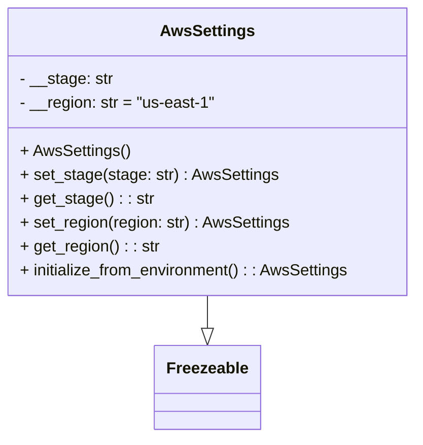

# Diagram: application_service/container_tracking_app_service/aws/AwsSettings.py


> Auto-generated by Obscura crawlers

## Diagram 1



### SVG

<svg id="container" width="418.6796875" xmlns="http://www.w3.org/2000/svg" class="classDiagram" height="438" viewBox="0 0 418.6796875 438" role="graphics-document document" aria-roledescription="class"><style>#container{font-family:"trebuchet ms",verdana,arial,sans-serif;font-size:16px;fill:#333;}@keyframes edge-animation-frame{from{stroke-dashoffset:0;}}@keyframes dash{to{stroke-dashoffset:0;}}#container .edge-animation-slow{stroke-dasharray:9,5!important;stroke-dashoffset:900;animation:dash 50s linear infinite;stroke-linecap:round;}#container .edge-animation-fast{stroke-dasharray:9,5!important;stroke-dashoffset:900;animation:dash 20s linear infinite;stroke-linecap:round;}#container .error-icon{fill:#552222;}#container .error-text{fill:#552222;stroke:#552222;}#container .edge-thickness-normal{stroke-width:1px;}#container .edge-thickness-thick{stroke-width:3.5px;}#container .edge-pattern-solid{stroke-dasharray:0;}#container .edge-thickness-invisible{stroke-width:0;fill:none;}#container .edge-pattern-dashed{stroke-dasharray:3;}#container .edge-pattern-dotted{stroke-dasharray:2;}#container .marker{fill:#333333;stroke:#333333;}#container .marker.cross{stroke:#333333;}#container svg{font-family:"trebuchet ms",verdana,arial,sans-serif;font-size:16px;}#container p{margin:0;}#container g.classGroup text{fill:#9370DB;stroke:none;font-family:"trebuchet ms",verdana,arial,sans-serif;font-size:10px;}#container g.classGroup text .title{font-weight:bolder;}#container .nodeLabel,#container .edgeLabel{color:#131300;}#container .edgeLabel .label rect{fill:#ECECFF;}#container .label text{fill:#131300;}#container .labelBkg{background:#ECECFF;}#container .edgeLabel .label span{background:#ECECFF;}#container .classTitle{font-weight:bolder;}#container .node rect,#container .node circle,#container .node ellipse,#container .node polygon,#container .node path{fill:#ECECFF;stroke:#9370DB;stroke-width:1px;}#container .divider{stroke:#9370DB;stroke-width:1;}#container g.clickable{cursor:pointer;}#container g.classGroup rect{fill:#ECECFF;stroke:#9370DB;}#container g.classGroup line{stroke:#9370DB;stroke-width:1;}#container .classLabel .box{stroke:none;stroke-width:0;fill:#ECECFF;opacity:0.5;}#container .classLabel .label{fill:#9370DB;font-size:10px;}#container .relation{stroke:#333333;stroke-width:1;fill:none;}#container .dashed-line{stroke-dasharray:3;}#container .dotted-line{stroke-dasharray:1 2;}#container #compositionStart,#container .composition{fill:#333333!important;stroke:#333333!important;stroke-width:1;}#container #compositionEnd,#container .composition{fill:#333333!important;stroke:#333333!important;stroke-width:1;}#container #dependencyStart,#container .dependency{fill:#333333!important;stroke:#333333!important;stroke-width:1;}#container #dependencyStart,#container .dependency{fill:#333333!important;stroke:#333333!important;stroke-width:1;}#container #extensionStart,#container .extension{fill:transparent!important;stroke:#333333!important;stroke-width:1;}#container #extensionEnd,#container .extension{fill:transparent!important;stroke:#333333!important;stroke-width:1;}#container #aggregationStart,#container .aggregation{fill:transparent!important;stroke:#333333!important;stroke-width:1;}#container #aggregationEnd,#container .aggregation{fill:transparent!important;stroke:#333333!important;stroke-width:1;}#container #lollipopStart,#container .lollipop{fill:#ECECFF!important;stroke:#333333!important;stroke-width:1;}#container #lollipopEnd,#container .lollipop{fill:#ECECFF!important;stroke:#333333!important;stroke-width:1;}#container .edgeTerminals{font-size:11px;line-height:initial;}#container .classTitleText{text-anchor:middle;font-size:18px;fill:#333;}#container .label-icon{display:inline-block;height:1em;overflow:visible;vertical-align:-0.125em;}#container .node .label-icon path{fill:currentColor;stroke:revert;stroke-width:revert;}#container :root{--mermaid-font-family:"trebuchet ms",verdana,arial,sans-serif;}</style><g><defs><marker id="container_class-aggregationStart" class="marker aggregation class" refX="18" refY="7" markerWidth="190" markerHeight="240" orient="auto"><path d="M 18,7 L9,13 L1,7 L9,1 Z"></path></marker></defs><defs><marker id="container_class-aggregationEnd" class="marker aggregation class" refX="1" refY="7" markerWidth="20" markerHeight="28" orient="auto"><path d="M 18,7 L9,13 L1,7 L9,1 Z"></path></marker></defs><defs><marker id="container_class-extensionStart" class="marker extension class" refX="18" refY="7" markerWidth="190" markerHeight="240" orient="auto"><path d="M 1,7 L18,13 V 1 Z"></path></marker></defs><defs><marker id="container_class-extensionEnd" class="marker extension class" refX="1" refY="7" markerWidth="20" markerHeight="28" orient="auto"><path d="M 1,1 V 13 L18,7 Z"></path></marker></defs><defs><marker id="container_class-compositionStart" class="marker composition class" refX="18" refY="7" markerWidth="190" markerHeight="240" orient="auto"><path d="M 18,7 L9,13 L1,7 L9,1 Z"></path></marker></defs><defs><marker id="container_class-compositionEnd" class="marker composition class" refX="1" refY="7" markerWidth="20" markerHeight="28" orient="auto"><path d="M 18,7 L9,13 L1,7 L9,1 Z"></path></marker></defs><defs><marker id="container_class-dependencyStart" class="marker dependency class" refX="6" refY="7" markerWidth="190" markerHeight="240" orient="auto"><path d="M 5,7 L9,13 L1,7 L9,1 Z"></path></marker></defs><defs><marker id="container_class-dependencyEnd" class="marker dependency class" refX="13" refY="7" markerWidth="20" markerHeight="28" orient="auto"><path d="M 18,7 L9,13 L14,7 L9,1 Z"></path></marker></defs><defs><marker id="container_class-lollipopStart" class="marker lollipop class" refX="13" refY="7" markerWidth="190" markerHeight="240" orient="auto"><circle stroke="black" fill="transparent" cx="7" cy="7" r="6"></circle></marker></defs><defs><marker id="container_class-lollipopEnd" class="marker lollipop class" refX="1" refY="7" markerWidth="190" markerHeight="240" orient="auto"><circle stroke="black" fill="transparent" cx="7" cy="7" r="6"></circle></marker></defs><g class="root"><g class="clusters"></g><g class="edgePaths"><path d="M209.34,296L209.34,300.167C209.34,304.333,209.34,312.667,209.34,318.125C209.34,323.583,209.34,326.167,209.34,327.458L209.34,328.75" id="id_AwsSettings_Freezeable_1" class="edge-thickness-normal edge-pattern-solid relation" style=";;;" data-edge="true" data-et="edge" data-id="id_AwsSettings_Freezeable_1" data-points="W3sieCI6MjA5LjMzOTg0Mzc1LCJ5IjoyOTZ9LHsieCI6MjA5LjMzOTg0Mzc1LCJ5IjozMjF9LHsieCI6MjA5LjMzOTg0Mzc1LCJ5IjozNDZ9XQ==" marker-end="url(#container_class-extensionEnd)"></path></g><g class="edgeLabels"><g class="edgeLabel"><g class="label" data-id="id_AwsSettings_Freezeable_1" transform="translate(0, 0)"><foreignObject width="0" height="0"><div xmlns="http://www.w3.org/1999/xhtml" class="labelBkg" style="display: table-cell; white-space: nowrap; line-height: 1.5; max-width: 200px; text-align: center;"><span class="edgeLabel"></span></div></foreignObject></g></g></g><g class="nodes"><g class="node default" id="classId-Freezeable-0" transform="translate(209.33984375, 388)"><g class="basic label-container"><path d="M-51.1953125 -42 L51.1953125 -42 L51.1953125 42 L-51.1953125 42" stroke="none" stroke-width="0" fill="#ECECFF" style=""></path><path d="M-51.1953125 -42 C-28.64563258194929 -42, -6.095952663898579 -42, 51.1953125 -42 M-51.1953125 -42 C-11.278863090032047 -42, 28.637586319935906 -42, 51.1953125 -42 M51.1953125 -42 C51.1953125 -14.159617907741925, 51.1953125 13.68076418451615, 51.1953125 42 M51.1953125 -42 C51.1953125 -17.464836078031755, 51.1953125 7.070327843936489, 51.1953125 42 M51.1953125 42 C11.02416640608189 42, -29.14697968783622 42, -51.1953125 42 M51.1953125 42 C10.88626587601749 42, -29.42278074796502 42, -51.1953125 42 M-51.1953125 42 C-51.1953125 19.98231148612123, -51.1953125 -2.0353770277575407, -51.1953125 -42 M-51.1953125 42 C-51.1953125 15.951122905483288, -51.1953125 -10.097754189033424, -51.1953125 -42" stroke="#9370DB" stroke-width="1.3" fill="none" stroke-dasharray="0 0" style=""></path></g><g class="annotation-group text" transform="translate(0, -18)"></g><g class="label-group text" transform="translate(-39.1953125, -18)"><g class="label" style="font-weight: bolder" transform="translate(0,-12)"><foreignObject width="78.390625" height="24"><div xmlns="http://www.w3.org/1999/xhtml" style="display: table-cell; white-space: nowrap; line-height: 1.5; max-width: 127px; text-align: center;"><span class="nodeLabel markdown-node-label" style=""><p>Freezeable</p></span></div></foreignObject></g></g><g class="members-group text" transform="translate(-39.1953125, 30)"></g><g class="methods-group text" transform="translate(-39.1953125, 60)"></g><g class="divider" style=""><path d="M-51.1953125 6 C-17.687969602298196 6, 15.819373295403608 6, 51.1953125 6 M-51.1953125 6 C-28.326079244281257 6, -5.456845988562513 6, 51.1953125 6" stroke="#9370DB" stroke-width="1.3" fill="none" stroke-dasharray="0 0" style=""></path></g><g class="divider" style=""><path d="M-51.1953125 24 C-12.035139409308115 24, 27.12503368138377 24, 51.1953125 24 M-51.1953125 24 C-29.024209502348167 24, -6.853106504696335 24, 51.1953125 24" stroke="#9370DB" stroke-width="1.3" fill="none" stroke-dasharray="0 0" style=""></path></g></g><g class="node default" id="classId-AwsSettings-1" transform="translate(209.33984375, 152)"><g class="basic label-container"><path d="M-201.33984375 -144 L201.33984375 -144 L201.33984375 144 L-201.33984375 144" stroke="none" stroke-width="0" fill="#ECECFF" style=""></path><path d="M-201.33984375 -144 C-104.75103617798979 -144, -8.162228605979578 -144, 201.33984375 -144 M-201.33984375 -144 C-118.1503252037598 -144, -34.96080665751961 -144, 201.33984375 -144 M201.33984375 -144 C201.33984375 -80.76222402110011, 201.33984375 -17.524448042200234, 201.33984375 144 M201.33984375 -144 C201.33984375 -61.8180277023628, 201.33984375 20.363944595274404, 201.33984375 144 M201.33984375 144 C72.13000694746222 144, -57.07982985507556 144, -201.33984375 144 M201.33984375 144 C65.11990807046735 144, -71.10002760906531 144, -201.33984375 144 M-201.33984375 144 C-201.33984375 32.63906620179388, -201.33984375 -78.72186759641224, -201.33984375 -144 M-201.33984375 144 C-201.33984375 53.74466595845186, -201.33984375 -36.51066808309628, -201.33984375 -144" stroke="#9370DB" stroke-width="1.3" fill="none" stroke-dasharray="0 0" style=""></path></g><g class="annotation-group text" transform="translate(0, -120)"></g><g class="label-group text" transform="translate(-44.8203125, -120)"><g class="label" style="font-weight: bolder" transform="translate(0,-12)"><foreignObject width="89.640625" height="24"><div xmlns="http://www.w3.org/1999/xhtml" style="display: table-cell; white-space: nowrap; line-height: 1.5; max-width: 137px; text-align: center;"><span class="nodeLabel markdown-node-label" style=""><p>AwsSettings</p></span></div></foreignObject></g></g><g class="members-group text" transform="translate(-189.33984375, -72)"><g class="label" style="" transform="translate(0,-12)"><foreignObject width="93.140625" height="24"><div xmlns="http://www.w3.org/1999/xhtml" style="display: table-cell; white-space: nowrap; line-height: 1.5; max-width: 151px; text-align: center;"><span class="nodeLabel markdown-node-label" style=""><p>- __stage: str</p></span></div></foreignObject></g><g class="label" style="" transform="translate(0,12)"><foreignObject width="194.9375" height="24"><div xmlns="http://www.w3.org/1999/xhtml" style="display: table-cell; white-space: nowrap; line-height: 1.5; max-width: 252px; text-align: center;"><span class="nodeLabel markdown-node-label" style=""><p>- __region: str = "us-east-1"</p></span></div></foreignObject></g></g><g class="methods-group text" transform="translate(-189.33984375, 0)"><g class="label" style="" transform="translate(0,-12)"><foreignObject width="109.265625" height="24"><div xmlns="http://www.w3.org/1999/xhtml" style="display: table-cell; white-space: nowrap; line-height: 1.5; max-width: 167px; text-align: center;"><span class="nodeLabel markdown-node-label" style=""><p>+ AwsSettings()</p></span></div></foreignObject></g><g class="label" style="" transform="translate(0,12)"><foreignObject width="256.3125" height="24"><div xmlns="http://www.w3.org/1999/xhtml" style="display: table-cell; white-space: nowrap; line-height: 1.5; max-width: 314px; text-align: center;"><span class="nodeLabel markdown-node-label" style=""><p>+ set_stage(stage: str) : AwsSettings</p></span></div></foreignObject></g><g class="label" style="" transform="translate(0,36)"><foreignObject width="131.765625" height="24"><div xmlns="http://www.w3.org/1999/xhtml" style="display: table-cell; white-space: nowrap; line-height: 1.5; max-width: 190px; text-align: center;"><span class="nodeLabel markdown-node-label" style=""><p>+ get_stage() : : str</p></span></div></foreignObject></g><g class="label" style="" transform="translate(0,60)"><foreignObject width="271.328125" height="24"><div xmlns="http://www.w3.org/1999/xhtml" style="display: table-cell; white-space: nowrap; line-height: 1.5; max-width: 329px; text-align: center;"><span class="nodeLabel markdown-node-label" style=""><p>+ set_region(region: str) : AwsSettings</p></span></div></foreignObject></g><g class="label" style="" transform="translate(0,84)"><foreignObject width="139.265625" height="24"><div xmlns="http://www.w3.org/1999/xhtml" style="display: table-cell; white-space: nowrap; line-height: 1.5; max-width: 197px; text-align: center;"><span class="nodeLabel markdown-node-label" style=""><p>+ get_region() : : str</p></span></div></foreignObject></g><g class="label" style="" transform="translate(0,108)"><foreignObject width="333.859375" height="24"><div xmlns="http://www.w3.org/1999/xhtml" style="display: table-cell; white-space: nowrap; line-height: 1.5; max-width: 391px; text-align: center;"><span class="nodeLabel markdown-node-label" style=""><p>+ initialize_from_environment() : : AwsSettings</p></span></div></foreignObject></g></g><g class="divider" style=""><path d="M-201.33984375 -96 C-62.432976299903004 -96, 76.47389115019399 -96, 201.33984375 -96 M-201.33984375 -96 C-81.08277283949568 -96, 39.17429807100865 -96, 201.33984375 -96" stroke="#9370DB" stroke-width="1.3" fill="none" stroke-dasharray="0 0" style=""></path></g><g class="divider" style=""><path d="M-201.33984375 -24 C-110.66184008346487 -24, -19.983836416929734 -24, 201.33984375 -24 M-201.33984375 -24 C-96.82085739803748 -24, 7.69812895392505 -24, 201.33984375 -24" stroke="#9370DB" stroke-width="1.3" fill="none" stroke-dasharray="0 0" style=""></path></g></g></g></g></g></svg>

## Diagram 2

```mermaid
flowchart TD
    init[initialize_from_environment()] --> getStage[getenv("AWS_STAGE")]
    init --> getRegion[getenv("AWS_REGION")]
    getStage --> callSetStage[set_stage(stage)]
    getRegion --> callSetRegion[set_region(region)]
    callSetStage --> instance[AwsSettings instance]
    callSetRegion --> instance
```

> SVG rendering failed for this diagram.
