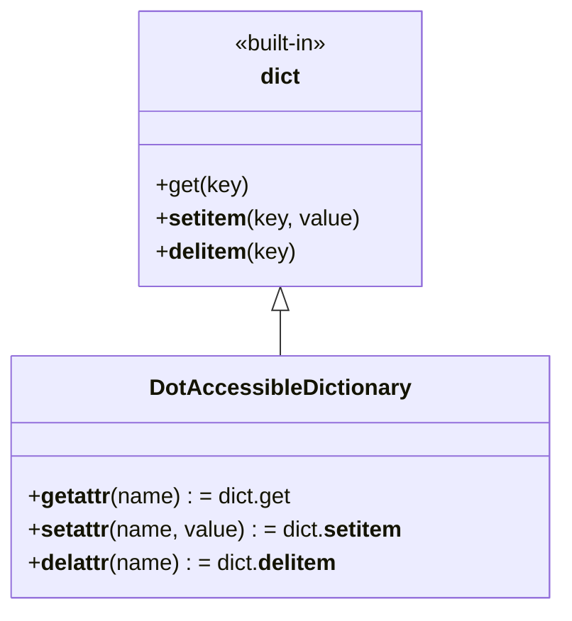

# Diagram: application_service/container_tracking_app_service/aws/DotAccessibleDictionary.py

> Auto-generated by Obscura crawlers

## Mermaid

### SVG

<svg id="container" width="395.8046875" xmlns="http://www.w3.org/2000/svg" class="classDiagram" height="438" viewBox="0 0 395.8046875 438" role="graphics-document document" aria-roledescription="class"><g><defs><marker id="container_class-aggregationStart" class="marker aggregation class" refX="18" refY="7" markerWidth="190" markerHeight="240" orient="auto"><path d="M 18,7 L9,13 L1,7 L9,1 Z"></path></marker></defs><defs><marker id="container_class-aggregationEnd" class="marker aggregation class" refX="1" refY="7" markerWidth="20" markerHeight="28" orient="auto"><path d="M 18,7 L9,13 L1,7 L9,1 Z"></path></marker></defs><defs><marker id="container_class-extensionStart" class="marker extension class" refX="18" refY="7" markerWidth="190" markerHeight="240" orient="auto"><path d="M 1,7 L18,13 V 1 Z"></path></marker></defs><defs><marker id="container_class-extensionEnd" class="marker extension class" refX="1" refY="7" markerWidth="20" markerHeight="28" orient="auto"><path d="M 1,1 V 13 L18,7 Z"></path></marker></defs><defs><marker id="container_class-compositionStart" class="marker composition class" refX="18" refY="7" markerWidth="190" markerHeight="240" orient="auto"><path d="M 18,7 L9,13 L1,7 L9,1 Z"></path></marker></defs><defs><marker id="container_class-compositionEnd" class="marker composition class" refX="1" refY="7" markerWidth="20" markerHeight="28" orient="auto"><path d="M 18,7 L9,13 L1,7 L9,1 Z"></path></marker></defs><defs><marker id="container_class-dependencyStart" class="marker dependency class" refX="6" refY="7" markerWidth="190" markerHeight="240" orient="auto"><path d="M 5,7 L9,13 L1,7 L9,1 Z"></path></marker></defs><defs><marker id="container_class-dependencyEnd" class="marker dependency class" refX="13" refY="7" markerWidth="20" markerHeight="28" orient="auto"><path d="M 18,7 L9,13 L14,7 L9,1 Z"></path></marker></defs><defs><marker id="container_class-lollipopStart" class="marker lollipop class" refX="13" refY="7" markerWidth="190" markerHeight="240" orient="auto"><circle stroke="black" fill="transparent" cx="7" cy="7" r="6"></circle></marker></defs><defs><marker id="container_class-lollipopEnd" class="marker lollipop class" refX="1" refY="7" markerWidth="190" markerHeight="240" orient="auto"><circle stroke="black" fill="transparent" cx="7" cy="7" r="6"></circle></marker></defs><g class="root"><g class="clusters"></g><g class="edgePaths"><path d="M197.902,223.25L197.902,224.542C197.902,225.833,197.902,228.417,197.902,233.875C197.902,239.333,197.902,247.667,197.902,251.833L197.902,256" id="id_dict_DotAccessibleDictionary_1" class="edge-thickness-normal edge-pattern-solid relation" style=";;;" data-edge="true" data-et="edge" data-id="id_dict_DotAccessibleDictionary_1" data-points="W3sieCI6MTk3LjkwMjM0Mzc1LCJ5IjoyMDZ9LHsieCI6MTk3LjkwMjM0Mzc1LCJ5IjoyMzF9LHsieCI6MTk3LjkwMjM0Mzc1LCJ5IjoyNTZ9XQ==" marker-start="url(#container_class-extensionStart)"></path></g><g class="edgeLabels"><g class="edgeLabel"><g class="label" data-id="id_dict_DotAccessibleDictionary_1" transform="translate(0, 0)"><foreignObject width="0" height="0">

</foreignObject></g></g></g><g class="nodes"><g class="node default" id="classId-dict-0" transform="translate(197.90234375, 107)"><g class="basic label-container"><path d="M-102.3125 -99 L102.3125 -99 L102.3125 99 L-102.3125 99" stroke="none" stroke-width="0" fill="#ECECFF" style=""></path><path d="M-102.3125 -99 C-48.288967843398346 -99, 5.7345643132033075 -99, 102.3125 -99 M-102.3125 -99 C-21.712203786160003 -99, 58.88809242767999 -99, 102.3125 -99 M102.3125 -99 C102.3125 -40.185407294337466, 102.3125 18.629185411325068, 102.3125 99 M102.3125 -99 C102.3125 -25.910663274859274, 102.3125 47.17867345028145, 102.3125 99 M102.3125 99 C23.273779680803557 99, -55.764940638392886 99, -102.3125 99 M102.3125 99 C49.77267534726146 99, -2.7671493054770764 99, -102.3125 99 M-102.3125 99 C-102.3125 30.86771965999435, -102.3125 -37.2645606800113, -102.3125 -99 M-102.3125 99 C-102.3125 50.21875598003935, -102.3125 1.4375119600786945, -102.3125 -99" stroke="#9370DB" stroke-width="1.3" fill="none" stroke-dasharray="0 0" style=""></path></g><g class="annotation-group text" transform="translate(-35.875, -75)"><g class="label" style="" transform="translate(0,-12)"><foreignObject width="71.75" height="24">

«built-in»

</foreignObject></g></g><g class="label-group text" transform="translate(-13.9765625, -51)"><g class="label" style="font-weight: bolder" transform="translate(0,-12)"><foreignObject width="27.953125" height="24">

dict

</foreignObject></g></g><g class="members-group text" transform="translate(-90.3125, -3)"></g><g class="methods-group text" transform="translate(-90.3125, 27)"><g class="label" style="" transform="translate(0,-12)"><foreignObject width="65.5" height="24">

+get(key)

</foreignObject></g><g class="label" style="" transform="translate(0,12)"><foreignObject width="144.75" height="24">

+<strong>setitem</strong>(key, value)

</foreignObject></g><g class="label" style="" transform="translate(0,36)"><foreignObject width="98.875" height="24">

+<strong>delitem</strong>(key)

</foreignObject></g></g><g class="divider" style=""><path d="M-102.3125 -27 C-30.886394397338137 -27, 40.53971120532373 -27, 102.3125 -27 M-102.3125 -27 C-39.15176225628832 -27, 24.008975487423356 -27, 102.3125 -27" stroke="#9370DB" stroke-width="1.3" fill="none" stroke-dasharray="0 0" style=""></path></g><g class="divider" style=""><path d="M-102.3125 -3 C-23.4607920850153 -3, 55.3909158299694 -3, 102.3125 -3 M-102.3125 -3 C-39.39241291830656 -3, 23.527674163386877 -3, 102.3125 -3" stroke="#9370DB" stroke-width="1.3" fill="none" stroke-dasharray="0 0" style=""></path></g></g><g class="node default" id="classId-DotAccessibleDictionary-1" transform="translate(197.90234375, 343)"><g class="basic label-container"><path d="M-189.90234375 -87 L189.90234375 -87 L189.90234375 87 L-189.90234375 87" stroke="none" stroke-width="0" fill="#ECECFF" style=""></path><path d="M-189.90234375 -87 C-101.52475333089133 -87, -13.147162911782658 -87, 189.90234375 -87 M-189.90234375 -87 C-112.15017823878318 -87, -34.39801272756637 -87, 189.90234375 -87 M189.90234375 -87 C189.90234375 -47.969595663634266, 189.90234375 -8.939191327268531, 189.90234375 87 M189.90234375 -87 C189.90234375 -31.96116679112268, 189.90234375 23.077666417754642, 189.90234375 87 M189.90234375 87 C58.85554650091666 87, -72.19125074816668 87, -189.90234375 87 M189.90234375 87 C67.8167046072319 87, -54.268934535536204 87, -189.90234375 87 M-189.90234375 87 C-189.90234375 49.83132914696048, -189.90234375 12.662658293920956, -189.90234375 -87 M-189.90234375 87 C-189.90234375 46.77930174419907, -189.90234375 6.558603488398134, -189.90234375 -87" stroke="#9370DB" stroke-width="1.3" fill="none" stroke-dasharray="0 0" style=""></path></g><g class="annotation-group text" transform="translate(0, -63)"></g><g class="label-group text" transform="translate(-88.5703125, -63)"><g class="label" style="font-weight: bolder" transform="translate(0,-12)"><foreignObject width="177.140625" height="24">

DotAccessibleDictionary

</foreignObject></g></g><g class="members-group text" transform="translate(-177.90234375, -15)"></g><g class="methods-group text" transform="translate(-177.90234375, 15)"><g class="label" style="" transform="translate(0,-12)"><foreignObject width="188.0625" height="24">

+<strong>getattr</strong>(name) : = dict.get

</foreignObject></g><g class="label" style="" transform="translate(0,12)"><foreignObject width="267.234375" height="24">

+<strong>setattr</strong>(name, value) : = dict.<strong>setitem</strong>

</foreignObject></g><g class="label" style="" transform="translate(0,36)"><foreignObject width="221.421875" height="24">

+<strong>delattr</strong>(name) : = dict.<strong>delitem</strong>

</foreignObject></g></g><g class="divider" style=""><path d="M-189.90234375 -39 C-88.11308956819408 -39, 13.676164613611832 -39, 189.90234375 -39 M-189.90234375 -39 C-89.78619844820946 -39, 10.329946853581077 -39, 189.90234375 -39" stroke="#9370DB" stroke-width="1.3" fill="none" stroke-dasharray="0 0" style=""></path></g><g class="divider" style=""><path d="M-189.90234375 -15 C-105.66903523816653 -15, -21.43572672633306 -15, 189.90234375 -15 M-189.90234375 -15 C-55.31023664665099 -15, 79.28187045669802 -15, 189.90234375 -15" stroke="#9370DB" stroke-width="1.3" fill="none" stroke-dasharray="0 0" style=""></path></g></g></g></g></g></svg>
