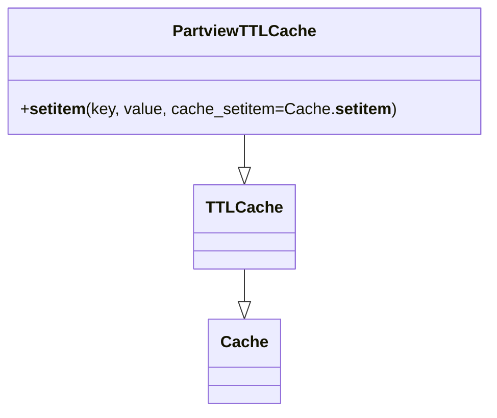

# Diagram: application_service/container_tracking_app_service/aws/PartviewTTLCache.py


> Auto-generated by Obscura crawlers

## Diagram 1



### SVG

<svg id="container" width="473.453125" xmlns="http://www.w3.org/2000/svg" class="classDiagram" height="410" viewBox="0 0 473.453125 410" role="graphics-document document" aria-roledescription="class"><style>#container{font-family:"trebuchet ms",verdana,arial,sans-serif;font-size:16px;fill:#333;}@keyframes edge-animation-frame{from{stroke-dashoffset:0;}}@keyframes dash{to{stroke-dashoffset:0;}}#container .edge-animation-slow{stroke-dasharray:9,5!important;stroke-dashoffset:900;animation:dash 50s linear infinite;stroke-linecap:round;}#container .edge-animation-fast{stroke-dasharray:9,5!important;stroke-dashoffset:900;animation:dash 20s linear infinite;stroke-linecap:round;}#container .error-icon{fill:#552222;}#container .error-text{fill:#552222;stroke:#552222;}#container .edge-thickness-normal{stroke-width:1px;}#container .edge-thickness-thick{stroke-width:3.5px;}#container .edge-pattern-solid{stroke-dasharray:0;}#container .edge-thickness-invisible{stroke-width:0;fill:none;}#container .edge-pattern-dashed{stroke-dasharray:3;}#container .edge-pattern-dotted{stroke-dasharray:2;}#container .marker{fill:#333333;stroke:#333333;}#container .marker.cross{stroke:#333333;}#container svg{font-family:"trebuchet ms",verdana,arial,sans-serif;font-size:16px;}#container p{margin:0;}#container g.classGroup text{fill:#9370DB;stroke:none;font-family:"trebuchet ms",verdana,arial,sans-serif;font-size:10px;}#container g.classGroup text .title{font-weight:bolder;}#container .nodeLabel,#container .edgeLabel{color:#131300;}#container .edgeLabel .label rect{fill:#ECECFF;}#container .label text{fill:#131300;}#container .labelBkg{background:#ECECFF;}#container .edgeLabel .label span{background:#ECECFF;}#container .classTitle{font-weight:bolder;}#container .node rect,#container .node circle,#container .node ellipse,#container .node polygon,#container .node path{fill:#ECECFF;stroke:#9370DB;stroke-width:1px;}#container .divider{stroke:#9370DB;stroke-width:1;}#container g.clickable{cursor:pointer;}#container g.classGroup rect{fill:#ECECFF;stroke:#9370DB;}#container g.classGroup line{stroke:#9370DB;stroke-width:1;}#container .classLabel .box{stroke:none;stroke-width:0;fill:#ECECFF;opacity:0.5;}#container .classLabel .label{fill:#9370DB;font-size:10px;}#container .relation{stroke:#333333;stroke-width:1;fill:none;}#container .dashed-line{stroke-dasharray:3;}#container .dotted-line{stroke-dasharray:1 2;}#container #compositionStart,#container .composition{fill:#333333!important;stroke:#333333!important;stroke-width:1;}#container #compositionEnd,#container .composition{fill:#333333!important;stroke:#333333!important;stroke-width:1;}#container #dependencyStart,#container .dependency{fill:#333333!important;stroke:#333333!important;stroke-width:1;}#container #dependencyStart,#container .dependency{fill:#333333!important;stroke:#333333!important;stroke-width:1;}#container #extensionStart,#container .extension{fill:transparent!important;stroke:#333333!important;stroke-width:1;}#container #extensionEnd,#container .extension{fill:transparent!important;stroke:#333333!important;stroke-width:1;}#container #aggregationStart,#container .aggregation{fill:transparent!important;stroke:#333333!important;stroke-width:1;}#container #aggregationEnd,#container .aggregation{fill:transparent!important;stroke:#333333!important;stroke-width:1;}#container #lollipopStart,#container .lollipop{fill:#ECECFF!important;stroke:#333333!important;stroke-width:1;}#container #lollipopEnd,#container .lollipop{fill:#ECECFF!important;stroke:#333333!important;stroke-width:1;}#container .edgeTerminals{font-size:11px;line-height:initial;}#container .classTitleText{text-anchor:middle;font-size:18px;fill:#333;}#container .label-icon{display:inline-block;height:1em;overflow:visible;vertical-align:-0.125em;}#container .node .label-icon path{fill:currentColor;stroke:revert;stroke-width:revert;}#container :root{--mermaid-font-family:"trebuchet ms",verdana,arial,sans-serif;}</style><g><defs><marker id="container_class-aggregationStart" class="marker aggregation class" refX="18" refY="7" markerWidth="190" markerHeight="240" orient="auto"><path d="M 18,7 L9,13 L1,7 L9,1 Z"></path></marker></defs><defs><marker id="container_class-aggregationEnd" class="marker aggregation class" refX="1" refY="7" markerWidth="20" markerHeight="28" orient="auto"><path d="M 18,7 L9,13 L1,7 L9,1 Z"></path></marker></defs><defs><marker id="container_class-extensionStart" class="marker extension class" refX="18" refY="7" markerWidth="190" markerHeight="240" orient="auto"><path d="M 1,7 L18,13 V 1 Z"></path></marker></defs><defs><marker id="container_class-extensionEnd" class="marker extension class" refX="1" refY="7" markerWidth="20" markerHeight="28" orient="auto"><path d="M 1,1 V 13 L18,7 Z"></path></marker></defs><defs><marker id="container_class-compositionStart" class="marker composition class" refX="18" refY="7" markerWidth="190" markerHeight="240" orient="auto"><path d="M 18,7 L9,13 L1,7 L9,1 Z"></path></marker></defs><defs><marker id="container_class-compositionEnd" class="marker composition class" refX="1" refY="7" markerWidth="20" markerHeight="28" orient="auto"><path d="M 18,7 L9,13 L1,7 L9,1 Z"></path></marker></defs><defs><marker id="container_class-dependencyStart" class="marker dependency class" refX="6" refY="7" markerWidth="190" markerHeight="240" orient="auto"><path d="M 5,7 L9,13 L1,7 L9,1 Z"></path></marker></defs><defs><marker id="container_class-dependencyEnd" class="marker dependency class" refX="13" refY="7" markerWidth="20" markerHeight="28" orient="auto"><path d="M 18,7 L9,13 L14,7 L9,1 Z"></path></marker></defs><defs><marker id="container_class-lollipopStart" class="marker lollipop class" refX="13" refY="7" markerWidth="190" markerHeight="240" orient="auto"><circle stroke="black" fill="transparent" cx="7" cy="7" r="6"></circle></marker></defs><defs><marker id="container_class-lollipopEnd" class="marker lollipop class" refX="1" refY="7" markerWidth="190" markerHeight="240" orient="auto"><circle stroke="black" fill="transparent" cx="7" cy="7" r="6"></circle></marker></defs><g class="root"><g class="clusters"></g><g class="edgePaths"><path d="M236.727,268L236.727,272.167C236.727,276.333,236.727,284.667,236.727,290.125C236.727,295.583,236.727,298.167,236.727,299.458L236.727,300.75" id="id_TTLCache_Cache_1" class="edge-thickness-normal edge-pattern-solid relation" style=";;;" data-edge="true" data-et="edge" data-id="id_TTLCache_Cache_1" data-points="W3sieCI6MjM2LjcyNjU2MjUsInkiOjI2OH0seyJ4IjoyMzYuNzI2NTYyNSwieSI6MjkzfSx7IngiOjIzNi43MjY1NjI1LCJ5IjozMTh9XQ==" marker-end="url(#container_class-extensionEnd)"></path><path d="M236.727,134L236.727,138.167C236.727,142.333,236.727,150.667,236.727,156.125C236.727,161.583,236.727,164.167,236.727,165.458L236.727,166.75" id="id_PartviewTTLCache_TTLCache_2" class="edge-thickness-normal edge-pattern-solid relation" style=";;;" data-edge="true" data-et="edge" data-id="id_PartviewTTLCache_TTLCache_2" data-points="W3sieCI6MjM2LjcyNjU2MjUsInkiOjEzNH0seyJ4IjoyMzYuNzI2NTYyNSwieSI6MTU5fSx7IngiOjIzNi43MjY1NjI1LCJ5IjoxODR9XQ==" marker-end="url(#container_class-extensionEnd)"></path></g><g class="edgeLabels"><g class="edgeLabel"><g class="label" data-id="id_TTLCache_Cache_1" transform="translate(0, 0)"><foreignObject width="0" height="0"><div xmlns="http://www.w3.org/1999/xhtml" class="labelBkg" style="display: table-cell; white-space: nowrap; line-height: 1.5; max-width: 200px; text-align: center;"><span class="edgeLabel"></span></div></foreignObject></g></g><g class="edgeLabel"><g class="label" data-id="id_PartviewTTLCache_TTLCache_2" transform="translate(0, 0)"><foreignObject width="0" height="0"><div xmlns="http://www.w3.org/1999/xhtml" class="labelBkg" style="display: table-cell; white-space: nowrap; line-height: 1.5; max-width: 200px; text-align: center;"><span class="edgeLabel"></span></div></foreignObject></g></g></g><g class="nodes"><g class="node default" id="classId-Cache-0" transform="translate(236.7265625, 360)"><g class="basic label-container"><path d="M-33.7734375 -42 L33.7734375 -42 L33.7734375 42 L-33.7734375 42" stroke="none" stroke-width="0" fill="#ECECFF" style=""></path><path d="M-33.7734375 -42 C-9.321975980552981 -42, 15.129485538894038 -42, 33.7734375 -42 M-33.7734375 -42 C-11.97270615055158 -42, 9.828025198896839 -42, 33.7734375 -42 M33.7734375 -42 C33.7734375 -23.69006597494479, 33.7734375 -5.380131949889581, 33.7734375 42 M33.7734375 -42 C33.7734375 -18.553494409534284, 33.7734375 4.893011180931431, 33.7734375 42 M33.7734375 42 C8.524083386006865 42, -16.72527072798627 42, -33.7734375 42 M33.7734375 42 C18.897377732594883 42, 4.021317965189766 42, -33.7734375 42 M-33.7734375 42 C-33.7734375 23.10161718140114, -33.7734375 4.203234362802277, -33.7734375 -42 M-33.7734375 42 C-33.7734375 23.72123994003386, -33.7734375 5.442479880067722, -33.7734375 -42" stroke="#9370DB" stroke-width="1.3" fill="none" stroke-dasharray="0 0" style=""></path></g><g class="annotation-group text" transform="translate(0, -18)"></g><g class="label-group text" transform="translate(-21.7734375, -18)"><g class="label" style="font-weight: bolder" transform="translate(0,-12)"><foreignObject width="43.546875" height="24"><div xmlns="http://www.w3.org/1999/xhtml" style="display: table-cell; white-space: nowrap; line-height: 1.5; max-width: 93px; text-align: center;"><span class="nodeLabel markdown-node-label" style=""><p>Cache</p></span></div></foreignObject></g></g><g class="members-group text" transform="translate(-21.7734375, 30)"></g><g class="methods-group text" transform="translate(-21.7734375, 60)"></g><g class="divider" style=""><path d="M-33.7734375 6 C-19.902351871670085 6, -6.031266243340173 6, 33.7734375 6 M-33.7734375 6 C-14.126489097989737 6, 5.520459304020527 6, 33.7734375 6" stroke="#9370DB" stroke-width="1.3" fill="none" stroke-dasharray="0 0" style=""></path></g><g class="divider" style=""><path d="M-33.7734375 24 C-13.048802207959628 24, 7.675833084080743 24, 33.7734375 24 M-33.7734375 24 C-10.934488531363812 24, 11.904460437272377 24, 33.7734375 24" stroke="#9370DB" stroke-width="1.3" fill="none" stroke-dasharray="0 0" style=""></path></g></g><g class="node default" id="classId-TTLCache-1" transform="translate(236.7265625, 226)"><g class="basic label-container"><path d="M-46.1796875 -42 L46.1796875 -42 L46.1796875 42 L-46.1796875 42" stroke="none" stroke-width="0" fill="#ECECFF" style=""></path><path d="M-46.1796875 -42 C-23.387283499065866 -42, -0.594879498131732 -42, 46.1796875 -42 M-46.1796875 -42 C-18.20516095241237 -42, 9.769365595175259 -42, 46.1796875 -42 M46.1796875 -42 C46.1796875 -23.359848613182642, 46.1796875 -4.719697226365284, 46.1796875 42 M46.1796875 -42 C46.1796875 -19.95982659828813, 46.1796875 2.080346803423737, 46.1796875 42 M46.1796875 42 C27.154590629295512 42, 8.129493758591025 42, -46.1796875 42 M46.1796875 42 C18.296623738080008 42, -9.586440023839984 42, -46.1796875 42 M-46.1796875 42 C-46.1796875 21.072067697773154, -46.1796875 0.14413539554630717, -46.1796875 -42 M-46.1796875 42 C-46.1796875 9.947272388528944, -46.1796875 -22.105455222942112, -46.1796875 -42" stroke="#9370DB" stroke-width="1.3" fill="none" stroke-dasharray="0 0" style=""></path></g><g class="annotation-group text" transform="translate(0, -18)"></g><g class="label-group text" transform="translate(-34.1796875, -18)"><g class="label" style="font-weight: bolder" transform="translate(0,-12)"><foreignObject width="68.359375" height="24"><div xmlns="http://www.w3.org/1999/xhtml" style="display: table-cell; white-space: nowrap; line-height: 1.5; max-width: 117px; text-align: center;"><span class="nodeLabel markdown-node-label" style=""><p>TTLCache</p></span></div></foreignObject></g></g><g class="members-group text" transform="translate(-34.1796875, 30)"></g><g class="methods-group text" transform="translate(-34.1796875, 60)"></g><g class="divider" style=""><path d="M-46.1796875 6 C-18.431007820107073 6, 9.317671859785854 6, 46.1796875 6 M-46.1796875 6 C-23.495017677106468 6, -0.8103478542129352 6, 46.1796875 6" stroke="#9370DB" stroke-width="1.3" fill="none" stroke-dasharray="0 0" style=""></path></g><g class="divider" style=""><path d="M-46.1796875 24 C-17.57433806494155 24, 11.0310113701169 24, 46.1796875 24 M-46.1796875 24 C-16.159393660037562 24, 13.860900179924876 24, 46.1796875 24" stroke="#9370DB" stroke-width="1.3" fill="none" stroke-dasharray="0 0" style=""></path></g></g><g class="node default" id="classId-PartviewTTLCache-2" transform="translate(236.7265625, 71)"><g class="basic label-container"><path d="M-228.7265625 -63 L228.7265625 -63 L228.7265625 63 L-228.7265625 63" stroke="none" stroke-width="0" fill="#ECECFF" style=""></path><path d="M-228.7265625 -63 C-50.80802114036027 -63, 127.11052021927946 -63, 228.7265625 -63 M-228.7265625 -63 C-79.84643056492283 -63, 69.03370137015435 -63, 228.7265625 -63 M228.7265625 -63 C228.7265625 -20.822857165618217, 228.7265625 21.354285668763566, 228.7265625 63 M228.7265625 -63 C228.7265625 -17.49602163254083, 228.7265625 28.007956734918338, 228.7265625 63 M228.7265625 63 C96.61821875609007 63, -35.490124987819854 63, -228.7265625 63 M228.7265625 63 C84.00269119483218 63, -60.72118011033564 63, -228.7265625 63 M-228.7265625 63 C-228.7265625 17.21659519324185, -228.7265625 -28.5668096135163, -228.7265625 -63 M-228.7265625 63 C-228.7265625 13.771139256955856, -228.7265625 -35.45772148608829, -228.7265625 -63" stroke="#9370DB" stroke-width="1.3" fill="none" stroke-dasharray="0 0" style=""></path></g><g class="annotation-group text" transform="translate(0, -39)"></g><g class="label-group text" transform="translate(-65.96875, -39)"><g class="label" style="font-weight: bolder" transform="translate(0,-12)"><foreignObject width="131.9375" height="24"><div xmlns="http://www.w3.org/1999/xhtml" style="display: table-cell; white-space: nowrap; line-height: 1.5; max-width: 179px; text-align: center;"><span class="nodeLabel markdown-node-label" style=""><p>PartviewTTLCache</p></span></div></foreignObject></g></g><g class="members-group text" transform="translate(-216.7265625, 9)"></g><g class="methods-group text" transform="translate(-216.7265625, 39)"><g class="label" style="" transform="translate(0,-12)"><foreignObject width="367.484375" height="24"><div xmlns="http://www.w3.org/1999/xhtml" style="display: table-cell; white-space: nowrap; line-height: 1.5; max-width: 488px; text-align: center;"><span class="nodeLabel markdown-node-label" style=""><p>+<strong>setitem</strong>(key, value, cache_setitem=Cache.<strong>setitem</strong>)</p></span></div></foreignObject></g></g><g class="divider" style=""><path d="M-228.7265625 -15 C-93.26308511254712 -15, 42.20039227490577 -15, 228.7265625 -15 M-228.7265625 -15 C-57.56940519935972 -15, 113.58775210128056 -15, 228.7265625 -15" stroke="#9370DB" stroke-width="1.3" fill="none" stroke-dasharray="0 0" style=""></path></g><g class="divider" style=""><path d="M-228.7265625 9 C-102.95613506505799 9, 22.814292369884015 9, 228.7265625 9 M-228.7265625 9 C-116.03747863138798 9, -3.3483947627759676 9, 228.7265625 9" stroke="#9370DB" stroke-width="1.3" fill="none" stroke-dasharray="0 0" style=""></path></g></g></g></g></g></svg>

## Diagram 2

```mermaid
flowchart TD
    A[Call PartviewTTLCache.__setitem__(key, value)] --> B{key is None?}
    B -- Yes --> C[Return without setting]
    B -- No --> D[Call super().__setitem__(key, value, cache_setitem=Cache.__setitem__)]
    D --> E[Item stored in cache]
    C --> F[End]
    E --> F
```

> SVG rendering failed for this diagram.
