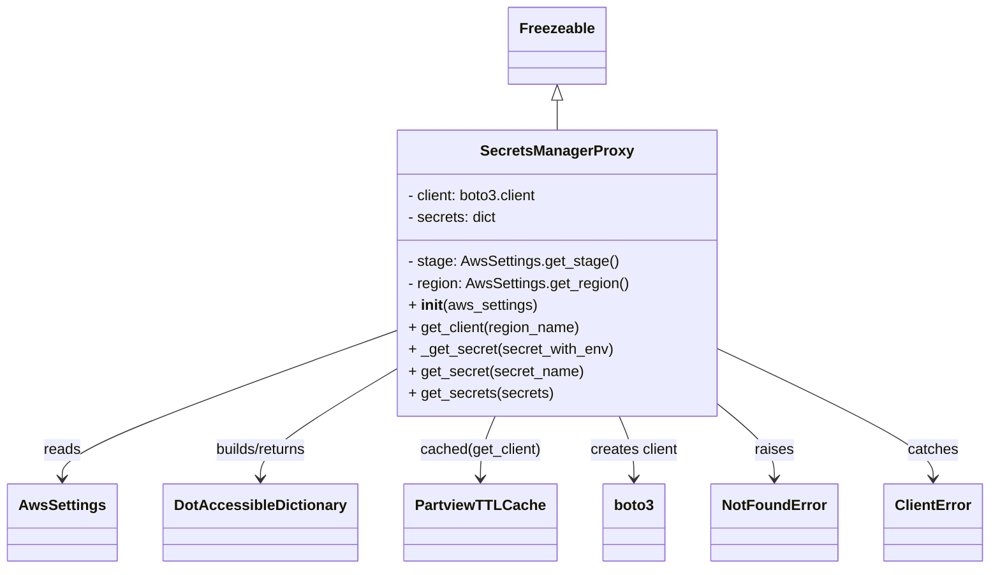

# Diagram: application_service/container_tracking_app_service/aws/SecretsManagerProxy.py


> Auto-generated by Obscura crawlers

## Diagram 1



### SVG

<svg id="container" width="1036.84375" xmlns="http://www.w3.org/2000/svg" class="classDiagram" height="620" viewBox="0 0 1036.84375 620" role="graphics-document document" aria-roledescription="class"><style>#container{font-family:"trebuchet ms",verdana,arial,sans-serif;font-size:16px;fill:#333;}@keyframes edge-animation-frame{from{stroke-dashoffset:0;}}@keyframes dash{to{stroke-dashoffset:0;}}#container .edge-animation-slow{stroke-dasharray:9,5!important;stroke-dashoffset:900;animation:dash 50s linear infinite;stroke-linecap:round;}#container .edge-animation-fast{stroke-dasharray:9,5!important;stroke-dashoffset:900;animation:dash 20s linear infinite;stroke-linecap:round;}#container .error-icon{fill:#552222;}#container .error-text{fill:#552222;stroke:#552222;}#container .edge-thickness-normal{stroke-width:1px;}#container .edge-thickness-thick{stroke-width:3.5px;}#container .edge-pattern-solid{stroke-dasharray:0;}#container .edge-thickness-invisible{stroke-width:0;fill:none;}#container .edge-pattern-dashed{stroke-dasharray:3;}#container .edge-pattern-dotted{stroke-dasharray:2;}#container .marker{fill:#333333;stroke:#333333;}#container .marker.cross{stroke:#333333;}#container svg{font-family:"trebuchet ms",verdana,arial,sans-serif;font-size:16px;}#container p{margin:0;}#container g.classGroup text{fill:#9370DB;stroke:none;font-family:"trebuchet ms",verdana,arial,sans-serif;font-size:10px;}#container g.classGroup text .title{font-weight:bolder;}#container .nodeLabel,#container .edgeLabel{color:#131300;}#container .edgeLabel .label rect{fill:#ECECFF;}#container .label text{fill:#131300;}#container .labelBkg{background:#ECECFF;}#container .edgeLabel .label span{background:#ECECFF;}#container .classTitle{font-weight:bolder;}#container .node rect,#container .node circle,#container .node ellipse,#container .node polygon,#container .node path{fill:#ECECFF;stroke:#9370DB;stroke-width:1px;}#container .divider{stroke:#9370DB;stroke-width:1;}#container g.clickable{cursor:pointer;}#container g.classGroup rect{fill:#ECECFF;stroke:#9370DB;}#container g.classGroup line{stroke:#9370DB;stroke-width:1;}#container .classLabel .box{stroke:none;stroke-width:0;fill:#ECECFF;opacity:0.5;}#container .classLabel .label{fill:#9370DB;font-size:10px;}#container .relation{stroke:#333333;stroke-width:1;fill:none;}#container .dashed-line{stroke-dasharray:3;}#container .dotted-line{stroke-dasharray:1 2;}#container #compositionStart,#container .composition{fill:#333333!important;stroke:#333333!important;stroke-width:1;}#container #compositionEnd,#container .composition{fill:#333333!important;stroke:#333333!important;stroke-width:1;}#container #dependencyStart,#container .dependency{fill:#333333!important;stroke:#333333!important;stroke-width:1;}#container #dependencyStart,#container .dependency{fill:#333333!important;stroke:#333333!important;stroke-width:1;}#container #extensionStart,#container .extension{fill:transparent!important;stroke:#333333!important;stroke-width:1;}#container #extensionEnd,#container .extension{fill:transparent!important;stroke:#333333!important;stroke-width:1;}#container #aggregationStart,#container .aggregation{fill:transparent!important;stroke:#333333!important;stroke-width:1;}#container #aggregationEnd,#container .aggregation{fill:transparent!important;stroke:#333333!important;stroke-width:1;}#container #lollipopStart,#container .lollipop{fill:#ECECFF!important;stroke:#333333!important;stroke-width:1;}#container #lollipopEnd,#container .lollipop{fill:#ECECFF!important;stroke:#333333!important;stroke-width:1;}#container .edgeTerminals{font-size:11px;line-height:initial;}#container .classTitleText{text-anchor:middle;font-size:18px;fill:#333;}#container .label-icon{display:inline-block;height:1em;overflow:visible;vertical-align:-0.125em;}#container .node .label-icon path{fill:currentColor;stroke:revert;stroke-width:revert;}#container :root{--mermaid-font-family:"trebuchet ms",verdana,arial,sans-serif;}</style><g><defs><marker id="container_class-aggregationStart" class="marker aggregation class" refX="18" refY="7" markerWidth="190" markerHeight="240" orient="auto"><path d="M 18,7 L9,13 L1,7 L9,1 Z"></path></marker></defs><defs><marker id="container_class-aggregationEnd" class="marker aggregation class" refX="1" refY="7" markerWidth="20" markerHeight="28" orient="auto"><path d="M 18,7 L9,13 L1,7 L9,1 Z"></path></marker></defs><defs><marker id="container_class-extensionStart" class="marker extension class" refX="18" refY="7" markerWidth="190" markerHeight="240" orient="auto"><path d="M 1,7 L18,13 V 1 Z"></path></marker></defs><defs><marker id="container_class-extensionEnd" class="marker extension class" refX="1" refY="7" markerWidth="20" markerHeight="28" orient="auto"><path d="M 1,1 V 13 L18,7 Z"></path></marker></defs><defs><marker id="container_class-compositionStart" class="marker composition class" refX="18" refY="7" markerWidth="190" markerHeight="240" orient="auto"><path d="M 18,7 L9,13 L1,7 L9,1 Z"></path></marker></defs><defs><marker id="container_class-compositionEnd" class="marker composition class" refX="1" refY="7" markerWidth="20" markerHeight="28" orient="auto"><path d="M 18,7 L9,13 L1,7 L9,1 Z"></path></marker></defs><defs><marker id="container_class-dependencyStart" class="marker dependency class" refX="6" refY="7" markerWidth="190" markerHeight="240" orient="auto"><path d="M 5,7 L9,13 L1,7 L9,1 Z"></path></marker></defs><defs><marker id="container_class-dependencyEnd" class="marker dependency class" refX="13" refY="7" markerWidth="20" markerHeight="28" orient="auto"><path d="M 18,7 L9,13 L14,7 L9,1 Z"></path></marker></defs><defs><marker id="container_class-lollipopStart" class="marker lollipop class" refX="13" refY="7" markerWidth="190" markerHeight="240" orient="auto"><circle stroke="black" fill="transparent" cx="7" cy="7" r="6"></circle></marker></defs><defs><marker id="container_class-lollipopEnd" class="marker lollipop class" refX="1" refY="7" markerWidth="190" markerHeight="240" orient="auto"><circle stroke="black" fill="transparent" cx="7" cy="7" r="6"></circle></marker></defs><g class="root"><g class="clusters"></g><g class="edgePaths"><path d="M581.27,109.25L581.27,110.542C581.27,111.833,581.27,114.417,581.27,119.875C581.27,125.333,581.27,133.667,581.27,137.833L581.27,142" id="id_Freezeable_SecretsManagerProxy_1" class="edge-thickness-normal edge-pattern-solid relation" style=";;;" data-edge="true" data-et="edge" data-id="id_Freezeable_SecretsManagerProxy_1" data-points="W3sieCI6NTgxLjI2OTUzMTI1LCJ5Ijo5Mn0seyJ4Ijo1ODEuMjY5NTMxMjUsInkiOjExN30seyJ4Ijo1ODEuMjY5NTMxMjUsInkiOjE0Mn1d" marker-start="url(#container_class-extensionStart)"></path><path d="M408.598,362.528L351.301,383.94C294.005,405.352,179.413,448.176,122.117,474.755C64.82,501.333,64.82,511.667,64.82,516.833L64.82,522" id="id_SecretsManagerProxy_AwsSettings_2" class="edge-thickness-normal edge-pattern-solid relation" style=";;;" data-edge="true" data-et="edge" data-id="id_SecretsManagerProxy_AwsSettings_2" data-points="W3sieCI6NDA4LjU5NzY1NjI1LCJ5IjozNjIuNTI4NDU4Mjk3NzIxMDR9LHsieCI6NjQuODIwMzEyNSwieSI6NDkxfSx7IngiOjY0LjgyMDMxMjUsInkiOjUyOH1d" marker-end="url(#container_class-dependencyEnd)"></path><path d="M408.598,405.83L385.867,420.025C363.135,434.22,317.673,462.61,294.942,481.972C272.211,501.333,272.211,511.667,272.211,516.833L272.211,522" id="id_SecretsManagerProxy_DotAccessibleDictionary_3" class="edge-thickness-normal edge-pattern-solid relation" style=";;;" data-edge="true" data-et="edge" data-id="id_SecretsManagerProxy_DotAccessibleDictionary_3" data-points="W3sieCI6NDA4LjU5NzY1NjI1LCJ5Ijo0MDUuODI5NjIzNzMxMzQxMzd9LHsieCI6MjcyLjIxMDkzNzUsInkiOjQ5MX0seyJ4IjoyNzIuMjEwOTM3NSwieSI6NTI4fV0=" marker-end="url(#container_class-dependencyEnd)"></path><path d="M516.186,454L513.614,460.167C511.041,466.333,505.895,478.667,503.323,490C500.75,501.333,500.75,511.667,500.75,516.833L500.75,522" id="id_SecretsManagerProxy_PartviewTTLCache_4" class="edge-thickness-normal edge-pattern-solid relation" style=";;;" data-edge="true" data-et="edge" data-id="id_SecretsManagerProxy_PartviewTTLCache_4" data-points="W3sieCI6NTE2LjE4NjM4NjgxOTk0ODIsInkiOjQ1NH0seyJ4Ijo1MDAuNzUsInkiOjQ5MX0seyJ4Ijo1MDAuNzUsInkiOjUyOH1d" marker-end="url(#container_class-dependencyEnd)"></path><path d="M646.353,454L648.925,460.167C651.498,466.333,656.644,478.667,659.216,490C661.789,501.333,661.789,511.667,661.789,516.833L661.789,522" id="id_SecretsManagerProxy_boto3_5" class="edge-thickness-normal edge-pattern-solid relation" style=";;;" data-edge="true" data-et="edge" data-id="id_SecretsManagerProxy_boto3_5" data-points="W3sieCI6NjQ2LjM1MjY3NTY4MDA1MTgsInkiOjQ1NH0seyJ4Ijo2NjEuNzg5MDYyNSwieSI6NDkxfSx7IngiOjY2MS43ODkwNjI1LCJ5Ijo1Mjh9XQ==" marker-end="url(#container_class-dependencyEnd)"></path><path d="M753.941,443.45L763.35,451.375C772.758,459.3,791.574,475.15,800.982,488.242C810.391,501.333,810.391,511.667,810.391,516.833L810.391,522" id="id_SecretsManagerProxy_NotFoundError_6" class="edge-thickness-normal edge-pattern-solid relation" style=";;;" data-edge="true" data-et="edge" data-id="id_SecretsManagerProxy_NotFoundError_6" data-points="W3sieCI6NzUzLjk0MTQwNjI1LCJ5Ijo0NDMuNDUwMDM4MzU5OTAxMX0seyJ4Ijo4MTAuMzkwNjI1LCJ5Ijo0OTF9LHsieCI6ODEwLjM5MDYyNSwieSI6NTI4fV0=" marker-end="url(#container_class-dependencyEnd)"></path><path d="M753.941,382.132L791.182,400.276C828.422,418.421,902.902,454.711,940.143,478.022C977.383,501.333,977.383,511.667,977.383,516.833L977.383,522" id="id_SecretsManagerProxy_ClientError_7" class="edge-thickness-normal edge-pattern-solid relation" style=";;;" data-edge="true" data-et="edge" data-id="id_SecretsManagerProxy_ClientError_7" data-points="W3sieCI6NzUzLjk0MTQwNjI1LCJ5IjozODIuMTMxNjcwMDM1OTk0MjZ9LHsieCI6OTc3LjM4MjgxMjUsInkiOjQ5MX0seyJ4Ijo5NzcuMzgyODEyNSwieSI6NTI4fV0=" marker-end="url(#container_class-dependencyEnd)"></path></g><g class="edgeLabels"><g class="edgeLabel"><g class="label" data-id="id_Freezeable_SecretsManagerProxy_1" transform="translate(0, 0)"><foreignObject width="0" height="0"><div xmlns="http://www.w3.org/1999/xhtml" class="labelBkg" style="display: table-cell; white-space: nowrap; line-height: 1.5; max-width: 200px; text-align: center;"><span class="edgeLabel"></span></div></foreignObject></g></g><g class="edgeLabel" transform="translate(64.8203125, 491)"><g class="label" data-id="id_SecretsManagerProxy_AwsSettings_2" transform="translate(-20.0078125, -12)"><foreignObject width="40.015625" height="24"><div xmlns="http://www.w3.org/1999/xhtml" class="labelBkg" style="display: table-cell; white-space: nowrap; line-height: 1.5; max-width: 200px; text-align: center;"><span class="edgeLabel"><p>reads</p></span></div></foreignObject></g></g><g class="edgeLabel" transform="translate(272.2109375, 491)"><g class="label" data-id="id_SecretsManagerProxy_DotAccessibleDictionary_3" transform="translate(-52.6796875, -12)"><foreignObject width="105.359375" height="24"><div xmlns="http://www.w3.org/1999/xhtml" class="labelBkg" style="display: table-cell; white-space: nowrap; line-height: 1.5; max-width: 200px; text-align: center;"><span class="edgeLabel"><p>builds/returns</p></span></div></foreignObject></g></g><g class="edgeLabel" transform="translate(500.75, 491)"><g class="label" data-id="id_SecretsManagerProxy_PartviewTTLCache_4" transform="translate(-66.578125, -12)"><foreignObject width="133.15625" height="24"><div xmlns="http://www.w3.org/1999/xhtml" class="labelBkg" style="display: table-cell; white-space: nowrap; line-height: 1.5; max-width: 200px; text-align: center;"><span class="edgeLabel"><p>cached(get_client)</p></span></div></foreignObject></g></g><g class="edgeLabel" transform="translate(661.7890625, 491)"><g class="label" data-id="id_SecretsManagerProxy_boto3_5" transform="translate(-48.6484375, -12)"><foreignObject width="97.296875" height="24"><div xmlns="http://www.w3.org/1999/xhtml" class="labelBkg" style="display: table-cell; white-space: nowrap; line-height: 1.5; max-width: 200px; text-align: center;"><span class="edgeLabel"><p>creates client</p></span></div></foreignObject></g></g><g class="edgeLabel" transform="translate(810.390625, 491)"><g class="label" data-id="id_SecretsManagerProxy_NotFoundError_6" transform="translate(-21.25, -12)"><foreignObject width="42.5" height="24"><div xmlns="http://www.w3.org/1999/xhtml" class="labelBkg" style="display: table-cell; white-space: nowrap; line-height: 1.5; max-width: 200px; text-align: center;"><span class="edgeLabel"><p>raises</p></span></div></foreignObject></g></g><g class="edgeLabel" transform="translate(977.3828125, 491)"><g class="label" data-id="id_SecretsManagerProxy_ClientError_7" transform="translate(-27.4765625, -12)"><foreignObject width="54.953125" height="24"><div xmlns="http://www.w3.org/1999/xhtml" class="labelBkg" style="display: table-cell; white-space: nowrap; line-height: 1.5; max-width: 200px; text-align: center;"><span class="edgeLabel"><p>catches</p></span></div></foreignObject></g></g></g><g class="nodes"><g class="node default" id="classId-SecretsManagerProxy-0" transform="translate(581.26953125, 298)"><g class="basic label-container"><path d="M-172.671875 -156 L172.671875 -156 L172.671875 156 L-172.671875 156" stroke="none" stroke-width="0" fill="#ECECFF" style=""></path><path d="M-172.671875 -156 C-35.12214094261918 -156, 102.42759311476163 -156, 172.671875 -156 M-172.671875 -156 C-51.29121230474999 -156, 70.08945039050002 -156, 172.671875 -156 M172.671875 -156 C172.671875 -39.722084775822935, 172.671875 76.55583044835413, 172.671875 156 M172.671875 -156 C172.671875 -47.65283943074715, 172.671875 60.6943211385057, 172.671875 156 M172.671875 156 C89.29659802279515 156, 5.921321045590304 156, -172.671875 156 M172.671875 156 C82.58550282856349 156, -7.500869342873017 156, -172.671875 156 M-172.671875 156 C-172.671875 37.8985289286545, -172.671875 -80.202942142691, -172.671875 -156 M-172.671875 156 C-172.671875 79.37248477377257, -172.671875 2.744969547545139, -172.671875 -156" stroke="#9370DB" stroke-width="1.3" fill="none" stroke-dasharray="0 0" style=""></path></g><g class="annotation-group text" transform="translate(0, -132)"></g><g class="label-group text" transform="translate(-79.03125, -132)"><g class="label" style="font-weight: bolder" transform="translate(0,-12)"><foreignObject width="158.0625" height="24"><div xmlns="http://www.w3.org/1999/xhtml" style="display: table-cell; white-space: nowrap; line-height: 1.5; max-width: 204px; text-align: center;"><span class="nodeLabel markdown-node-label" style=""><p>SecretsManagerProxy</p></span></div></foreignObject></g></g><g class="members-group text" transform="translate(-160.671875, -84)"><g class="label" style="" transform="translate(0,-12)"><foreignObject width="145.359375" height="24"><div xmlns="http://www.w3.org/1999/xhtml" style="display: table-cell; white-space: nowrap; line-height: 1.5; max-width: 203px; text-align: center;"><span class="nodeLabel markdown-node-label" style=""><p>- client: boto3.client</p></span></div></foreignObject></g><g class="label" style="" transform="translate(0,12)"><foreignObject width="97.78125" height="24"><div xmlns="http://www.w3.org/1999/xhtml" style="display: table-cell; white-space: nowrap; line-height: 1.5; max-width: 155px; text-align: center;"><span class="nodeLabel markdown-node-label" style=""><p>- secrets: dict</p></span></div></foreignObject></g></g><g class="methods-group text" transform="translate(-160.671875, -12)"><g class="label" style="" transform="translate(0,-12)"><foreignObject width="227.296875" height="24"><div xmlns="http://www.w3.org/1999/xhtml" style="display: table-cell; white-space: nowrap; line-height: 1.5; max-width: 285px; text-align: center;"><span class="nodeLabel markdown-node-label" style=""><p>- stage: AwsSettings.get_stage()</p></span></div></foreignObject></g><g class="label" style="" transform="translate(0,12)"><foreignObject width="242.3125" height="24"><div xmlns="http://www.w3.org/1999/xhtml" style="display: table-cell; white-space: nowrap; line-height: 1.5; max-width: 300px; text-align: center;"><span class="nodeLabel markdown-node-label" style=""><p>- region: AwsSettings.get_region()</p></span></div></foreignObject></g><g class="label" style="" transform="translate(0,36)"><foreignObject width="139.921875" height="24"><div xmlns="http://www.w3.org/1999/xhtml" style="display: table-cell; white-space: nowrap; line-height: 1.5; max-width: 230px; text-align: center;"><span class="nodeLabel markdown-node-label" style=""><p>+ <strong>init</strong>(aws_settings)</p></span></div></foreignObject></g><g class="label" style="" transform="translate(0,60)"><foreignObject width="188.6875" height="24"><div xmlns="http://www.w3.org/1999/xhtml" style="display: table-cell; white-space: nowrap; line-height: 1.5; max-width: 246px; text-align: center;"><span class="nodeLabel markdown-node-label" style=""><p>+ get_client(region_name)</p></span></div></foreignObject></g><g class="label" style="" transform="translate(0,84)"><foreignObject width="223" height="24"><div xmlns="http://www.w3.org/1999/xhtml" style="display: table-cell; white-space: nowrap; line-height: 1.5; max-width: 280px; text-align: center;"><span class="nodeLabel markdown-node-label" style=""><p>+ _get_secret(secret_with_env)</p></span></div></foreignObject></g><g class="label" style="" transform="translate(0,108)"><foreignObject width="190.375" height="24"><div xmlns="http://www.w3.org/1999/xhtml" style="display: table-cell; white-space: nowrap; line-height: 1.5; max-width: 248px; text-align: center;"><span class="nodeLabel markdown-node-label" style=""><p>+ get_secret(secret_name)</p></span></div></foreignObject></g><g class="label" style="" transform="translate(0,132)"><foreignObject width="156.484375" height="24"><div xmlns="http://www.w3.org/1999/xhtml" style="display: table-cell; white-space: nowrap; line-height: 1.5; max-width: 214px; text-align: center;"><span class="nodeLabel markdown-node-label" style=""><p>+ get_secrets(secrets)</p></span></div></foreignObject></g></g><g class="divider" style=""><path d="M-172.671875 -108 C-64.36131623026012 -108, 43.94924253947977 -108, 172.671875 -108 M-172.671875 -108 C-96.41235492922338 -108, -20.152834858446766 -108, 172.671875 -108" stroke="#9370DB" stroke-width="1.3" fill="none" stroke-dasharray="0 0" style=""></path></g><g class="divider" style=""><path d="M-172.671875 -36 C-40.147139166951774 -36, 92.37759666609645 -36, 172.671875 -36 M-172.671875 -36 C-66.94903761848494 -36, 38.77379976303013 -36, 172.671875 -36" stroke="#9370DB" stroke-width="1.3" fill="none" stroke-dasharray="0 0" style=""></path></g></g><g class="node default" id="classId-Freezeable-1" transform="translate(581.26953125, 50)"><g class="basic label-container"><path d="M-51.1953125 -42 L51.1953125 -42 L51.1953125 42 L-51.1953125 42" stroke="none" stroke-width="0" fill="#ECECFF" style=""></path><path d="M-51.1953125 -42 C-13.645294272179612 -42, 23.904723955640776 -42, 51.1953125 -42 M-51.1953125 -42 C-19.102816062637913 -42, 12.989680374724173 -42, 51.1953125 -42 M51.1953125 -42 C51.1953125 -23.012079501916297, 51.1953125 -4.024159003832594, 51.1953125 42 M51.1953125 -42 C51.1953125 -23.303506044072837, 51.1953125 -4.607012088145673, 51.1953125 42 M51.1953125 42 C15.429048837473083 42, -20.337214825053834 42, -51.1953125 42 M51.1953125 42 C30.061462260093084 42, 8.927612020186167 42, -51.1953125 42 M-51.1953125 42 C-51.1953125 19.731767528551764, -51.1953125 -2.5364649428964725, -51.1953125 -42 M-51.1953125 42 C-51.1953125 13.411186391311531, -51.1953125 -15.177627217376937, -51.1953125 -42" stroke="#9370DB" stroke-width="1.3" fill="none" stroke-dasharray="0 0" style=""></path></g><g class="annotation-group text" transform="translate(0, -18)"></g><g class="label-group text" transform="translate(-39.1953125, -18)"><g class="label" style="font-weight: bolder" transform="translate(0,-12)"><foreignObject width="78.390625" height="24"><div xmlns="http://www.w3.org/1999/xhtml" style="display: table-cell; white-space: nowrap; line-height: 1.5; max-width: 127px; text-align: center;"><span class="nodeLabel markdown-node-label" style=""><p>Freezeable</p></span></div></foreignObject></g></g><g class="members-group text" transform="translate(-39.1953125, 30)"></g><g class="methods-group text" transform="translate(-39.1953125, 60)"></g><g class="divider" style=""><path d="M-51.1953125 6 C-20.83287842819022 6, 9.52955564361956 6, 51.1953125 6 M-51.1953125 6 C-12.936215121463398 6, 25.322882257073204 6, 51.1953125 6" stroke="#9370DB" stroke-width="1.3" fill="none" stroke-dasharray="0 0" style=""></path></g><g class="divider" style=""><path d="M-51.1953125 24 C-29.02687558309908 24, -6.858438666198161 24, 51.1953125 24 M-51.1953125 24 C-13.7594170952446 24, 23.6764783095108 24, 51.1953125 24" stroke="#9370DB" stroke-width="1.3" fill="none" stroke-dasharray="0 0" style=""></path></g></g><g class="node default" id="classId-AwsSettings-2" transform="translate(64.8203125, 570)"><g class="basic label-container"><path d="M-56.8203125 -42 L56.8203125 -42 L56.8203125 42 L-56.8203125 42" stroke="none" stroke-width="0" fill="#ECECFF" style=""></path><path d="M-56.8203125 -42 C-28.479288751712353 -42, -0.13826500342470638 -42, 56.8203125 -42 M-56.8203125 -42 C-18.087921748077143 -42, 20.644469003845714 -42, 56.8203125 -42 M56.8203125 -42 C56.8203125 -24.585950594870795, 56.8203125 -7.17190118974159, 56.8203125 42 M56.8203125 -42 C56.8203125 -13.331223255626266, 56.8203125 15.337553488747467, 56.8203125 42 M56.8203125 42 C20.257342024318447 42, -16.305628451363106 42, -56.8203125 42 M56.8203125 42 C17.57781803325394 42, -21.66467643349212 42, -56.8203125 42 M-56.8203125 42 C-56.8203125 24.352158897413478, -56.8203125 6.704317794826956, -56.8203125 -42 M-56.8203125 42 C-56.8203125 14.426943968444505, -56.8203125 -13.14611206311099, -56.8203125 -42" stroke="#9370DB" stroke-width="1.3" fill="none" stroke-dasharray="0 0" style=""></path></g><g class="annotation-group text" transform="translate(0, -18)"></g><g class="label-group text" transform="translate(-44.8203125, -18)"><g class="label" style="font-weight: bolder" transform="translate(0,-12)"><foreignObject width="89.640625" height="24"><div xmlns="http://www.w3.org/1999/xhtml" style="display: table-cell; white-space: nowrap; line-height: 1.5; max-width: 137px; text-align: center;"><span class="nodeLabel markdown-node-label" style=""><p>AwsSettings</p></span></div></foreignObject></g></g><g class="members-group text" transform="translate(-44.8203125, 30)"></g><g class="methods-group text" transform="translate(-44.8203125, 60)"></g><g class="divider" style=""><path d="M-56.8203125 6 C-32.70806716658912 6, -8.595821833178228 6, 56.8203125 6 M-56.8203125 6 C-12.92082762009678 6, 30.97865725980644 6, 56.8203125 6" stroke="#9370DB" stroke-width="1.3" fill="none" stroke-dasharray="0 0" style=""></path></g><g class="divider" style=""><path d="M-56.8203125 24 C-23.376866862678206 24, 10.066578774643588 24, 56.8203125 24 M-56.8203125 24 C-20.42678242737037 24, 15.966747645259261 24, 56.8203125 24" stroke="#9370DB" stroke-width="1.3" fill="none" stroke-dasharray="0 0" style=""></path></g></g><g class="node default" id="classId-DotAccessibleDictionary-3" transform="translate(272.2109375, 570)"><g class="basic label-container"><path d="M-100.5703125 -42 L100.5703125 -42 L100.5703125 42 L-100.5703125 42" stroke="none" stroke-width="0" fill="#ECECFF" style=""></path><path d="M-100.5703125 -42 C-37.85303258694742 -42, 24.864247326105158 -42, 100.5703125 -42 M-100.5703125 -42 C-35.05920853517593 -42, 30.451895429648147 -42, 100.5703125 -42 M100.5703125 -42 C100.5703125 -20.36994601013051, 100.5703125 1.260107979738983, 100.5703125 42 M100.5703125 -42 C100.5703125 -13.009163582058967, 100.5703125 15.981672835882065, 100.5703125 42 M100.5703125 42 C21.487824697922676 42, -57.59466310415465 42, -100.5703125 42 M100.5703125 42 C22.41264716989504 42, -55.74501816020992 42, -100.5703125 42 M-100.5703125 42 C-100.5703125 11.460727235805706, -100.5703125 -19.078545528388588, -100.5703125 -42 M-100.5703125 42 C-100.5703125 19.29359013864309, -100.5703125 -3.41281972271382, -100.5703125 -42" stroke="#9370DB" stroke-width="1.3" fill="none" stroke-dasharray="0 0" style=""></path></g><g class="annotation-group text" transform="translate(0, -18)"></g><g class="label-group text" transform="translate(-88.5703125, -18)"><g class="label" style="font-weight: bolder" transform="translate(0,-12)"><foreignObject width="177.140625" height="24"><div xmlns="http://www.w3.org/1999/xhtml" style="display: table-cell; white-space: nowrap; line-height: 1.5; max-width: 224px; text-align: center;"><span class="nodeLabel markdown-node-label" style=""><p>DotAccessibleDictionary</p></span></div></foreignObject></g></g><g class="members-group text" transform="translate(-88.5703125, 30)"></g><g class="methods-group text" transform="translate(-88.5703125, 60)"></g><g class="divider" style=""><path d="M-100.5703125 6 C-21.051433332515174 6, 58.46744583496965 6, 100.5703125 6 M-100.5703125 6 C-22.351486973343754 6, 55.86733855331249 6, 100.5703125 6" stroke="#9370DB" stroke-width="1.3" fill="none" stroke-dasharray="0 0" style=""></path></g><g class="divider" style=""><path d="M-100.5703125 24 C-58.5836616710588 24, -16.597010842117598 24, 100.5703125 24 M-100.5703125 24 C-37.56488747370166 24, 25.44053755259668 24, 100.5703125 24" stroke="#9370DB" stroke-width="1.3" fill="none" stroke-dasharray="0 0" style=""></path></g></g><g class="node default" id="classId-PartviewTTLCache-4" transform="translate(500.75, 570)"><g class="basic label-container"><path d="M-77.96875 -42 L77.96875 -42 L77.96875 42 L-77.96875 42" stroke="none" stroke-width="0" fill="#ECECFF" style=""></path><path d="M-77.96875 -42 C-15.653286192873672 -42, 46.662177614252656 -42, 77.96875 -42 M-77.96875 -42 C-40.93901851848054 -42, -3.909287036961075 -42, 77.96875 -42 M77.96875 -42 C77.96875 -24.66913189989005, 77.96875 -7.338263799780101, 77.96875 42 M77.96875 -42 C77.96875 -21.277669805389838, 77.96875 -0.5553396107796758, 77.96875 42 M77.96875 42 C40.99658157453215 42, 4.024413149064301 42, -77.96875 42 M77.96875 42 C22.92527477190609 42, -32.11820045618782 42, -77.96875 42 M-77.96875 42 C-77.96875 22.596378242358547, -77.96875 3.192756484717094, -77.96875 -42 M-77.96875 42 C-77.96875 23.164075220783023, -77.96875 4.328150441566045, -77.96875 -42" stroke="#9370DB" stroke-width="1.3" fill="none" stroke-dasharray="0 0" style=""></path></g><g class="annotation-group text" transform="translate(0, -18)"></g><g class="label-group text" transform="translate(-65.96875, -18)"><g class="label" style="font-weight: bolder" transform="translate(0,-12)"><foreignObject width="131.9375" height="24"><div xmlns="http://www.w3.org/1999/xhtml" style="display: table-cell; white-space: nowrap; line-height: 1.5; max-width: 179px; text-align: center;"><span class="nodeLabel markdown-node-label" style=""><p>PartviewTTLCache</p></span></div></foreignObject></g></g><g class="members-group text" transform="translate(-65.96875, 30)"></g><g class="methods-group text" transform="translate(-65.96875, 60)"></g><g class="divider" style=""><path d="M-77.96875 6 C-39.79413749613442 6, -1.6195249922688362 6, 77.96875 6 M-77.96875 6 C-26.535555980278893 6, 24.897638039442214 6, 77.96875 6" stroke="#9370DB" stroke-width="1.3" fill="none" stroke-dasharray="0 0" style=""></path></g><g class="divider" style=""><path d="M-77.96875 24 C-24.258631707587945 24, 29.45148658482411 24, 77.96875 24 M-77.96875 24 C-17.606117755819 24, 42.756514488362 24, 77.96875 24" stroke="#9370DB" stroke-width="1.3" fill="none" stroke-dasharray="0 0" style=""></path></g></g><g class="node default" id="classId-boto3-5" transform="translate(661.7890625, 570)"><g class="basic label-container"><path d="M-33.0703125 -42 L33.0703125 -42 L33.0703125 42 L-33.0703125 42" stroke="none" stroke-width="0" fill="#ECECFF" style=""></path><path d="M-33.0703125 -42 C-11.450728735446486 -42, 10.168855029107029 -42, 33.0703125 -42 M-33.0703125 -42 C-14.946692979770589 -42, 3.1769265404588225 -42, 33.0703125 -42 M33.0703125 -42 C33.0703125 -17.586225551440258, 33.0703125 6.827548897119485, 33.0703125 42 M33.0703125 -42 C33.0703125 -9.518224993562555, 33.0703125 22.96355001287489, 33.0703125 42 M33.0703125 42 C8.30618998204329 42, -16.45793253591342 42, -33.0703125 42 M33.0703125 42 C11.16315448213237 42, -10.74400353573526 42, -33.0703125 42 M-33.0703125 42 C-33.0703125 12.665881000776864, -33.0703125 -16.668237998446273, -33.0703125 -42 M-33.0703125 42 C-33.0703125 8.880041348548716, -33.0703125 -24.23991730290257, -33.0703125 -42" stroke="#9370DB" stroke-width="1.3" fill="none" stroke-dasharray="0 0" style=""></path></g><g class="annotation-group text" transform="translate(0, -18)"></g><g class="label-group text" transform="translate(-21.0703125, -18)"><g class="label" style="font-weight: bolder" transform="translate(0,-12)"><foreignObject width="42.140625" height="24"><div xmlns="http://www.w3.org/1999/xhtml" style="display: table-cell; white-space: nowrap; line-height: 1.5; max-width: 91px; text-align: center;"><span class="nodeLabel markdown-node-label" style=""><p>boto3</p></span></div></foreignObject></g></g><g class="members-group text" transform="translate(-21.0703125, 30)"></g><g class="methods-group text" transform="translate(-21.0703125, 60)"></g><g class="divider" style=""><path d="M-33.0703125 6 C-18.863178301615207 6, -4.656044103230414 6, 33.0703125 6 M-33.0703125 6 C-12.561585289928761 6, 7.947141920142478 6, 33.0703125 6" stroke="#9370DB" stroke-width="1.3" fill="none" stroke-dasharray="0 0" style=""></path></g><g class="divider" style=""><path d="M-33.0703125 24 C-8.065073243352245 24, 16.94016601329551 24, 33.0703125 24 M-33.0703125 24 C-16.182088155262754 24, 0.706136189474492 24, 33.0703125 24" stroke="#9370DB" stroke-width="1.3" fill="none" stroke-dasharray="0 0" style=""></path></g></g><g class="node default" id="classId-NotFoundError-6" transform="translate(810.390625, 570)"><g class="basic label-container"><path d="M-65.53125 -42 L65.53125 -42 L65.53125 42 L-65.53125 42" stroke="none" stroke-width="0" fill="#ECECFF" style=""></path><path d="M-65.53125 -42 C-13.776379242262955 -42, 37.97849151547409 -42, 65.53125 -42 M-65.53125 -42 C-22.38114494111639 -42, 20.76896011776722 -42, 65.53125 -42 M65.53125 -42 C65.53125 -12.041549309331593, 65.53125 17.916901381336814, 65.53125 42 M65.53125 -42 C65.53125 -23.791094484702764, 65.53125 -5.582188969405529, 65.53125 42 M65.53125 42 C24.81807086438409 42, -15.89510827123182 42, -65.53125 42 M65.53125 42 C35.978579705194846 42, 6.4259094103897 42, -65.53125 42 M-65.53125 42 C-65.53125 23.789763873295062, -65.53125 5.579527746590124, -65.53125 -42 M-65.53125 42 C-65.53125 17.459110721163466, -65.53125 -7.0817785576730685, -65.53125 -42" stroke="#9370DB" stroke-width="1.3" fill="none" stroke-dasharray="0 0" style=""></path></g><g class="annotation-group text" transform="translate(0, -18)"></g><g class="label-group text" transform="translate(-53.53125, -18)"><g class="label" style="font-weight: bolder" transform="translate(0,-12)"><foreignObject width="107.0625" height="24"><div xmlns="http://www.w3.org/1999/xhtml" style="display: table-cell; white-space: nowrap; line-height: 1.5; max-width: 158px; text-align: center;"><span class="nodeLabel markdown-node-label" style=""><p>NotFoundError</p></span></div></foreignObject></g></g><g class="members-group text" transform="translate(-53.53125, 30)"></g><g class="methods-group text" transform="translate(-53.53125, 60)"></g><g class="divider" style=""><path d="M-65.53125 6 C-14.944217041747656 6, 35.64281591650469 6, 65.53125 6 M-65.53125 6 C-25.454021455076578 6, 14.623207089846844 6, 65.53125 6" stroke="#9370DB" stroke-width="1.3" fill="none" stroke-dasharray="0 0" style=""></path></g><g class="divider" style=""><path d="M-65.53125 24 C-19.674977050308613 24, 26.181295899382775 24, 65.53125 24 M-65.53125 24 C-14.778477976549368 24, 35.974294046901264 24, 65.53125 24" stroke="#9370DB" stroke-width="1.3" fill="none" stroke-dasharray="0 0" style=""></path></g></g><g class="node default" id="classId-ClientError-7" transform="translate(977.3828125, 570)"><g class="basic label-container"><path d="M-51.4609375 -42 L51.4609375 -42 L51.4609375 42 L-51.4609375 42" stroke="none" stroke-width="0" fill="#ECECFF" style=""></path><path d="M-51.4609375 -42 C-23.20469735205462 -42, 5.051542795890761 -42, 51.4609375 -42 M-51.4609375 -42 C-14.814707156449778 -42, 21.831523187100444 -42, 51.4609375 -42 M51.4609375 -42 C51.4609375 -17.705759183197912, 51.4609375 6.588481633604175, 51.4609375 42 M51.4609375 -42 C51.4609375 -16.706657618738962, 51.4609375 8.586684762522076, 51.4609375 42 M51.4609375 42 C16.75470731479686 42, -17.95152287040628 42, -51.4609375 42 M51.4609375 42 C26.680242862176623 42, 1.8995482243532464 42, -51.4609375 42 M-51.4609375 42 C-51.4609375 15.58639205461822, -51.4609375 -10.827215890763561, -51.4609375 -42 M-51.4609375 42 C-51.4609375 12.018944997189823, -51.4609375 -17.962110005620353, -51.4609375 -42" stroke="#9370DB" stroke-width="1.3" fill="none" stroke-dasharray="0 0" style=""></path></g><g class="annotation-group text" transform="translate(0, -18)"></g><g class="label-group text" transform="translate(-39.4609375, -18)"><g class="label" style="font-weight: bolder" transform="translate(0,-12)"><foreignObject width="78.921875" height="24"><div xmlns="http://www.w3.org/1999/xhtml" style="display: table-cell; white-space: nowrap; line-height: 1.5; max-width: 128px; text-align: center;"><span class="nodeLabel markdown-node-label" style=""><p>ClientError</p></span></div></foreignObject></g></g><g class="members-group text" transform="translate(-39.4609375, 30)"></g><g class="methods-group text" transform="translate(-39.4609375, 60)"></g><g class="divider" style=""><path d="M-51.4609375 6 C-23.16903147456118 6, 5.12287455087764 6, 51.4609375 6 M-51.4609375 6 C-20.45759261648781 6, 10.545752267024383 6, 51.4609375 6" stroke="#9370DB" stroke-width="1.3" fill="none" stroke-dasharray="0 0" style=""></path></g><g class="divider" style=""><path d="M-51.4609375 24 C-25.56908946018151 24, 0.3227585796369823 24, 51.4609375 24 M-51.4609375 24 C-21.653887342378326 24, 8.153162815243348 24, 51.4609375 24" stroke="#9370DB" stroke-width="1.3" fill="none" stroke-dasharray="0 0" style=""></path></g></g></g></g></g></svg>

## Diagram 2

```mermaid
flowchart TD
    Start([get_secret(secret_name)]) --> CheckCache{secret_name in __secrets?}
    CheckCache -- Yes --> ReturnCached[/return __secrets[secret_name]/]
    CheckCache -- No --> BuildEnv[secret_with_env = stage + "/" + secret_name]
    BuildEnv --> Call_get_secret[_get_secret(secret_with_env)_]
    Call_get_secret --> InvokeClient[client.get_secret_value(SecretId=secret_with_env)]
    InvokeClient --> ResourceNotFoundException[ResourceNotFoundException caught]
    InvokeClient --> ClientErrorCatch[ClientError caught]
    InvokeClient --> ParseSecret[SecretString present?]
    ParseSecret -- Yes --> LoadJSON[json.loads -> DotAccessibleDictionary]
    LoadJSON --> StoreSecret[__secrets[secret_name] = secret]
    StoreSecret --> ReturnNew[/return secret/]
    ParseSecret -- No --> Missing[no secret -> raise NotFoundError]
    ResourceNotFoundException --> Missing
    ClientErrorCatch --> LogAndReraise[log error & raise]
    LogAndReraise --> End([error raised])
```

> SVG rendering failed for this diagram.
