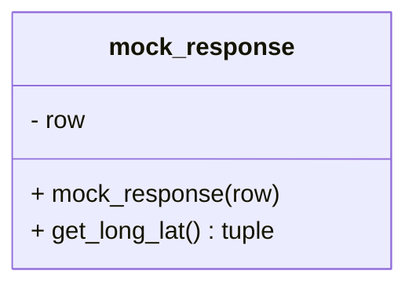

# Diagram: application_service/container_tracking_app_service/common/HERE/HERE_locator.py


> Auto-generated by Obscura crawlers

## Diagram 1



### SVG

<svg id="container" width="260.0625" xmlns="http://www.w3.org/2000/svg" class="classDiagram" height="184" viewBox="0 0 260.0625 184" role="graphics-document document" aria-roledescription="class"><style>#container{font-family:"trebuchet ms",verdana,arial,sans-serif;font-size:16px;fill:#333;}@keyframes edge-animation-frame{from{stroke-dashoffset:0;}}@keyframes dash{to{stroke-dashoffset:0;}}#container .edge-animation-slow{stroke-dasharray:9,5!important;stroke-dashoffset:900;animation:dash 50s linear infinite;stroke-linecap:round;}#container .edge-animation-fast{stroke-dasharray:9,5!important;stroke-dashoffset:900;animation:dash 20s linear infinite;stroke-linecap:round;}#container .error-icon{fill:#552222;}#container .error-text{fill:#552222;stroke:#552222;}#container .edge-thickness-normal{stroke-width:1px;}#container .edge-thickness-thick{stroke-width:3.5px;}#container .edge-pattern-solid{stroke-dasharray:0;}#container .edge-thickness-invisible{stroke-width:0;fill:none;}#container .edge-pattern-dashed{stroke-dasharray:3;}#container .edge-pattern-dotted{stroke-dasharray:2;}#container .marker{fill:#333333;stroke:#333333;}#container .marker.cross{stroke:#333333;}#container svg{font-family:"trebuchet ms",verdana,arial,sans-serif;font-size:16px;}#container p{margin:0;}#container g.classGroup text{fill:#9370DB;stroke:none;font-family:"trebuchet ms",verdana,arial,sans-serif;font-size:10px;}#container g.classGroup text .title{font-weight:bolder;}#container .nodeLabel,#container .edgeLabel{color:#131300;}#container .edgeLabel .label rect{fill:#ECECFF;}#container .label text{fill:#131300;}#container .labelBkg{background:#ECECFF;}#container .edgeLabel .label span{background:#ECECFF;}#container .classTitle{font-weight:bolder;}#container .node rect,#container .node circle,#container .node ellipse,#container .node polygon,#container .node path{fill:#ECECFF;stroke:#9370DB;stroke-width:1px;}#container .divider{stroke:#9370DB;stroke-width:1;}#container g.clickable{cursor:pointer;}#container g.classGroup rect{fill:#ECECFF;stroke:#9370DB;}#container g.classGroup line{stroke:#9370DB;stroke-width:1;}#container .classLabel .box{stroke:none;stroke-width:0;fill:#ECECFF;opacity:0.5;}#container .classLabel .label{fill:#9370DB;font-size:10px;}#container .relation{stroke:#333333;stroke-width:1;fill:none;}#container .dashed-line{stroke-dasharray:3;}#container .dotted-line{stroke-dasharray:1 2;}#container #compositionStart,#container .composition{fill:#333333!important;stroke:#333333!important;stroke-width:1;}#container #compositionEnd,#container .composition{fill:#333333!important;stroke:#333333!important;stroke-width:1;}#container #dependencyStart,#container .dependency{fill:#333333!important;stroke:#333333!important;stroke-width:1;}#container #dependencyStart,#container .dependency{fill:#333333!important;stroke:#333333!important;stroke-width:1;}#container #extensionStart,#container .extension{fill:transparent!important;stroke:#333333!important;stroke-width:1;}#container #extensionEnd,#container .extension{fill:transparent!important;stroke:#333333!important;stroke-width:1;}#container #aggregationStart,#container .aggregation{fill:transparent!important;stroke:#333333!important;stroke-width:1;}#container #aggregationEnd,#container .aggregation{fill:transparent!important;stroke:#333333!important;stroke-width:1;}#container #lollipopStart,#container .lollipop{fill:#ECECFF!important;stroke:#333333!important;stroke-width:1;}#container #lollipopEnd,#container .lollipop{fill:#ECECFF!important;stroke:#333333!important;stroke-width:1;}#container .edgeTerminals{font-size:11px;line-height:initial;}#container .classTitleText{text-anchor:middle;font-size:18px;fill:#333;}#container .label-icon{display:inline-block;height:1em;overflow:visible;vertical-align:-0.125em;}#container .node .label-icon path{fill:currentColor;stroke:revert;stroke-width:revert;}#container :root{--mermaid-font-family:"trebuchet ms",verdana,arial,sans-serif;}</style><g><defs><marker id="container_class-aggregationStart" class="marker aggregation class" refX="18" refY="7" markerWidth="190" markerHeight="240" orient="auto"><path d="M 18,7 L9,13 L1,7 L9,1 Z"></path></marker></defs><defs><marker id="container_class-aggregationEnd" class="marker aggregation class" refX="1" refY="7" markerWidth="20" markerHeight="28" orient="auto"><path d="M 18,7 L9,13 L1,7 L9,1 Z"></path></marker></defs><defs><marker id="container_class-extensionStart" class="marker extension class" refX="18" refY="7" markerWidth="190" markerHeight="240" orient="auto"><path d="M 1,7 L18,13 V 1 Z"></path></marker></defs><defs><marker id="container_class-extensionEnd" class="marker extension class" refX="1" refY="7" markerWidth="20" markerHeight="28" orient="auto"><path d="M 1,1 V 13 L18,7 Z"></path></marker></defs><defs><marker id="container_class-compositionStart" class="marker composition class" refX="18" refY="7" markerWidth="190" markerHeight="240" orient="auto"><path d="M 18,7 L9,13 L1,7 L9,1 Z"></path></marker></defs><defs><marker id="container_class-compositionEnd" class="marker composition class" refX="1" refY="7" markerWidth="20" markerHeight="28" orient="auto"><path d="M 18,7 L9,13 L1,7 L9,1 Z"></path></marker></defs><defs><marker id="container_class-dependencyStart" class="marker dependency class" refX="6" refY="7" markerWidth="190" markerHeight="240" orient="auto"><path d="M 5,7 L9,13 L1,7 L9,1 Z"></path></marker></defs><defs><marker id="container_class-dependencyEnd" class="marker dependency class" refX="13" refY="7" markerWidth="20" markerHeight="28" orient="auto"><path d="M 18,7 L9,13 L14,7 L9,1 Z"></path></marker></defs><defs><marker id="container_class-lollipopStart" class="marker lollipop class" refX="13" refY="7" markerWidth="190" markerHeight="240" orient="auto"><circle stroke="black" fill="transparent" cx="7" cy="7" r="6"></circle></marker></defs><defs><marker id="container_class-lollipopEnd" class="marker lollipop class" refX="1" refY="7" markerWidth="190" markerHeight="240" orient="auto"><circle stroke="black" fill="transparent" cx="7" cy="7" r="6"></circle></marker></defs><g class="root"><g class="clusters"></g><g class="edgePaths"></g><g class="edgeLabels"></g><g class="nodes"><g class="node default" id="classId-mock_response-0" transform="translate(130.03125, 92)"><g class="basic label-container"><path d="M-122.03125 -84 L122.03125 -84 L122.03125 84 L-122.03125 84" stroke="none" stroke-width="0" fill="#ECECFF" style=""></path><path d="M-122.03125 -84 C-28.76818765902948 -84, 64.49487468194104 -84, 122.03125 -84 M-122.03125 -84 C-34.95911028488081 -84, 52.113029430238385 -84, 122.03125 -84 M122.03125 -84 C122.03125 -47.58712547519249, 122.03125 -11.174250950384973, 122.03125 84 M122.03125 -84 C122.03125 -32.26305059192269, 122.03125 19.473898816154616, 122.03125 84 M122.03125 84 C45.44689824219215 84, -31.137453515615704 84, -122.03125 84 M122.03125 84 C43.25982410488888 84, -35.511601790222244 84, -122.03125 84 M-122.03125 84 C-122.03125 42.58796419513301, -122.03125 1.175928390266023, -122.03125 -84 M-122.03125 84 C-122.03125 27.459811593927725, -122.03125 -29.08037681214455, -122.03125 -84" stroke="#9370DB" stroke-width="1.3" fill="none" stroke-dasharray="0 0" style=""></path></g><g class="annotation-group text" transform="translate(0, -60)"></g><g class="label-group text" transform="translate(-57.4375, -60)"><g class="label" style="font-weight: bolder" transform="translate(0,-12)"><foreignObject width="114.875" height="24"><div xmlns="http://www.w3.org/1999/xhtml" style="display: table-cell; white-space: nowrap; line-height: 1.5; max-width: 164px; text-align: center;"><span class="nodeLabel markdown-node-label" style=""><p>mock_response</p></span></div></foreignObject></g></g><g class="members-group text" transform="translate(-110.03125, -12)"><g class="label" style="" transform="translate(0,-12)"><foreignObject width="37.203125" height="24"><div xmlns="http://www.w3.org/1999/xhtml" style="display: table-cell; white-space: nowrap; line-height: 1.5; max-width: 95px; text-align: center;"><span class="nodeLabel markdown-node-label" style=""><p>- row</p></span></div></foreignObject></g></g><g class="methods-group text" transform="translate(-110.03125, 36)"><g class="label" style="" transform="translate(0,-12)"><foreignObject width="162.625" height="24"><div xmlns="http://www.w3.org/1999/xhtml" style="display: table-cell; white-space: nowrap; line-height: 1.5; max-width: 220px; text-align: center;"><span class="nodeLabel markdown-node-label" style=""><p>+ mock_response(row)</p></span></div></foreignObject></g><g class="label" style="" transform="translate(0,12)"><foreignObject width="162.515625" height="24"><div xmlns="http://www.w3.org/1999/xhtml" style="display: table-cell; white-space: nowrap; line-height: 1.5; max-width: 220px; text-align: center;"><span class="nodeLabel markdown-node-label" style=""><p>+ get_long_lat() : tuple</p></span></div></foreignObject></g></g><g class="divider" style=""><path d="M-122.03125 -36 C-50.93554785446965 -36, 20.160154291060707 -36, 122.03125 -36 M-122.03125 -36 C-56.38774634407359 -36, 9.255757311852818 -36, 122.03125 -36" stroke="#9370DB" stroke-width="1.3" fill="none" stroke-dasharray="0 0" style=""></path></g><g class="divider" style=""><path d="M-122.03125 12 C-67.51258328116914 12, -12.993916562338285 12, 122.03125 12 M-122.03125 12 C-28.74107516962586 12, 64.54909966074828 12, 122.03125 12" stroke="#9370DB" stroke-width="1.3" fill="none" stroke-dasharray="0 0" style=""></path></g></g></g></g></g></svg>

## Diagram 2

```mermaid
flowchart TD
Start1([Call decorated function HERE_locator_by_lat_long])
A1[getcallargs -> extract lng, lat, cursor]
Start1 --> A1
A1 --> B1{is_valid_lat_long(lng,lat)?}
B1 -- No --> C1[call original function f(*args, **kwargs) and return result]
B1 -- Yes --> D1[format lat and long to 2 decimal places]
D1 --> E1{cursor is None?}
E1 -- Yes --> F1[call original function f(*args, **kwargs) and return result]
E1 -- No --> G1[read_by_long_lat_db_by_cache(long, lat, include_api_response=False, cursor)]
G1 --> H1{cached result?}
H1 -- Yes --> I1[return cached result]
H1 -- No --> J1[call original function f(*args, **kwargs) to obtain result]
J1 --> K1[write_by_long_lat_db(long,lat,city,state,country,postal_code,api_response,source_ref, cursor)]
K1 --> L1[return result]
```

> SVG rendering failed for this diagram.

## Diagram 3

```mermaid
flowchart TD
Start2([Call decorated function HERE_locator_Address_by_lat_long])
A2[getcallargs -> extract longitude, latitude, cursor]
Start2 --> A2
A2 --> B2{is_valid_lat_long(longitude,latitude)?}
B2 -- No --> C2[return ("", "", "", "")]
B2 -- Yes --> D2[format latitude and longitude to 2 decimal places]
D2 --> E2{cursor is None?}
E2 -- Yes --> F2[(city,state,postal_code,country) = f(*args, **kwargs); return tuple]
E2 -- No --> G2[read_by_long_lat_db_by_cache(long, lat, include_api_response=False, cursor)]
G2 --> H2{cached result?}
H2 -- Yes --> I2[return (City, State, PostalCode, Country) from cached result]
H2 -- No --> J2[(city,state,postal_code,country) = f(*args, **kwargs)]
J2 --> K2[write_by_long_lat_db(long,lat,city,state,country,postal_code,api_response,source_ref, cursor)]
K2 --> L2[return (city,state,postal_code,country)]
```

> SVG rendering failed for this diagram.
