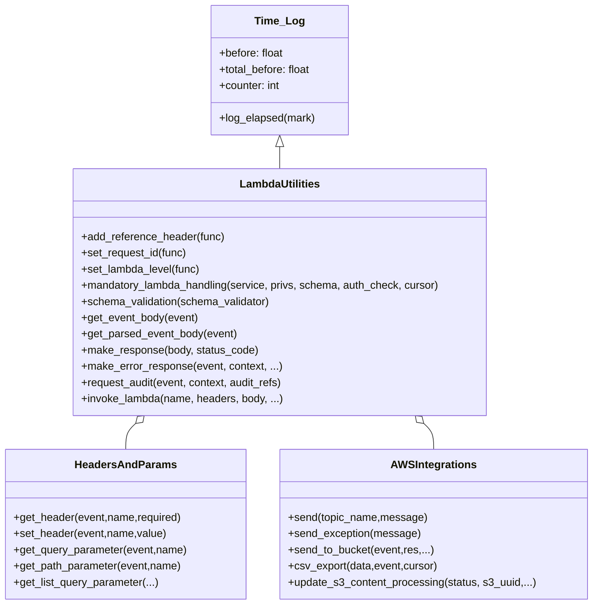

# Diagram: application_service/container_tracking_app_service/common/aws/lambdas/__init__.py


> Auto-generated by Obscura crawlers

## Diagram 1



### SVG

<svg id="container" width="869.8828125" xmlns="http://www.w3.org/2000/svg" class="classDiagram" height="896" viewBox="0 0 869.8828125 896" role="graphics-document document" aria-roledescription="class"><style>#container{font-family:"trebuchet ms",verdana,arial,sans-serif;font-size:16px;fill:#333;}@keyframes edge-animation-frame{from{stroke-dashoffset:0;}}@keyframes dash{to{stroke-dashoffset:0;}}#container .edge-animation-slow{stroke-dasharray:9,5!important;stroke-dashoffset:900;animation:dash 50s linear infinite;stroke-linecap:round;}#container .edge-animation-fast{stroke-dasharray:9,5!important;stroke-dashoffset:900;animation:dash 20s linear infinite;stroke-linecap:round;}#container .error-icon{fill:#552222;}#container .error-text{fill:#552222;stroke:#552222;}#container .edge-thickness-normal{stroke-width:1px;}#container .edge-thickness-thick{stroke-width:3.5px;}#container .edge-pattern-solid{stroke-dasharray:0;}#container .edge-thickness-invisible{stroke-width:0;fill:none;}#container .edge-pattern-dashed{stroke-dasharray:3;}#container .edge-pattern-dotted{stroke-dasharray:2;}#container .marker{fill:#333333;stroke:#333333;}#container .marker.cross{stroke:#333333;}#container svg{font-family:"trebuchet ms",verdana,arial,sans-serif;font-size:16px;}#container p{margin:0;}#container g.classGroup text{fill:#9370DB;stroke:none;font-family:"trebuchet ms",verdana,arial,sans-serif;font-size:10px;}#container g.classGroup text .title{font-weight:bolder;}#container .nodeLabel,#container .edgeLabel{color:#131300;}#container .edgeLabel .label rect{fill:#ECECFF;}#container .label text{fill:#131300;}#container .labelBkg{background:#ECECFF;}#container .edgeLabel .label span{background:#ECECFF;}#container .classTitle{font-weight:bolder;}#container .node rect,#container .node circle,#container .node ellipse,#container .node polygon,#container .node path{fill:#ECECFF;stroke:#9370DB;stroke-width:1px;}#container .divider{stroke:#9370DB;stroke-width:1;}#container g.clickable{cursor:pointer;}#container g.classGroup rect{fill:#ECECFF;stroke:#9370DB;}#container g.classGroup line{stroke:#9370DB;stroke-width:1;}#container .classLabel .box{stroke:none;stroke-width:0;fill:#ECECFF;opacity:0.5;}#container .classLabel .label{fill:#9370DB;font-size:10px;}#container .relation{stroke:#333333;stroke-width:1;fill:none;}#container .dashed-line{stroke-dasharray:3;}#container .dotted-line{stroke-dasharray:1 2;}#container #compositionStart,#container .composition{fill:#333333!important;stroke:#333333!important;stroke-width:1;}#container #compositionEnd,#container .composition{fill:#333333!important;stroke:#333333!important;stroke-width:1;}#container #dependencyStart,#container .dependency{fill:#333333!important;stroke:#333333!important;stroke-width:1;}#container #dependencyStart,#container .dependency{fill:#333333!important;stroke:#333333!important;stroke-width:1;}#container #extensionStart,#container .extension{fill:transparent!important;stroke:#333333!important;stroke-width:1;}#container #extensionEnd,#container .extension{fill:transparent!important;stroke:#333333!important;stroke-width:1;}#container #aggregationStart,#container .aggregation{fill:transparent!important;stroke:#333333!important;stroke-width:1;}#container #aggregationEnd,#container .aggregation{fill:transparent!important;stroke:#333333!important;stroke-width:1;}#container #lollipopStart,#container .lollipop{fill:#ECECFF!important;stroke:#333333!important;stroke-width:1;}#container #lollipopEnd,#container .lollipop{fill:#ECECFF!important;stroke:#333333!important;stroke-width:1;}#container .edgeTerminals{font-size:11px;line-height:initial;}#container .classTitleText{text-anchor:middle;font-size:18px;fill:#333;}#container .label-icon{display:inline-block;height:1em;overflow:visible;vertical-align:-0.125em;}#container .node .label-icon path{fill:currentColor;stroke:revert;stroke-width:revert;}#container :root{--mermaid-font-family:"trebuchet ms",verdana,arial,sans-serif;}</style><g><defs><marker id="container_class-aggregationStart" class="marker aggregation class" refX="18" refY="7" markerWidth="190" markerHeight="240" orient="auto"><path d="M 18,7 L9,13 L1,7 L9,1 Z"></path></marker></defs><defs><marker id="container_class-aggregationEnd" class="marker aggregation class" refX="1" refY="7" markerWidth="20" markerHeight="28" orient="auto"><path d="M 18,7 L9,13 L1,7 L9,1 Z"></path></marker></defs><defs><marker id="container_class-extensionStart" class="marker extension class" refX="18" refY="7" markerWidth="190" markerHeight="240" orient="auto"><path d="M 1,7 L18,13 V 1 Z"></path></marker></defs><defs><marker id="container_class-extensionEnd" class="marker extension class" refX="1" refY="7" markerWidth="20" markerHeight="28" orient="auto"><path d="M 1,1 V 13 L18,7 Z"></path></marker></defs><defs><marker id="container_class-compositionStart" class="marker composition class" refX="18" refY="7" markerWidth="190" markerHeight="240" orient="auto"><path d="M 18,7 L9,13 L1,7 L9,1 Z"></path></marker></defs><defs><marker id="container_class-compositionEnd" class="marker composition class" refX="1" refY="7" markerWidth="20" markerHeight="28" orient="auto"><path d="M 18,7 L9,13 L1,7 L9,1 Z"></path></marker></defs><defs><marker id="container_class-dependencyStart" class="marker dependency class" refX="6" refY="7" markerWidth="190" markerHeight="240" orient="auto"><path d="M 5,7 L9,13 L1,7 L9,1 Z"></path></marker></defs><defs><marker id="container_class-dependencyEnd" class="marker dependency class" refX="13" refY="7" markerWidth="20" markerHeight="28" orient="auto"><path d="M 18,7 L9,13 L14,7 L9,1 Z"></path></marker></defs><defs><marker id="container_class-lollipopStart" class="marker lollipop class" refX="13" refY="7" markerWidth="190" markerHeight="240" orient="auto"><circle stroke="black" fill="transparent" cx="7" cy="7" r="6"></circle></marker></defs><defs><marker id="container_class-lollipopEnd" class="marker lollipop class" refX="1" refY="7" markerWidth="190" markerHeight="240" orient="auto"><circle stroke="black" fill="transparent" cx="7" cy="7" r="6"></circle></marker></defs><g class="root"><g class="clusters"></g><g class="edgePaths"><path d="M410.709,217.25L410.709,218.542C410.709,219.833,410.709,222.417,410.709,227.875C410.709,233.333,410.709,241.667,410.709,245.833L410.709,250" id="id_Time_Log_LambdaUtilities_1" class="edge-thickness-normal edge-pattern-solid relation" style=";;;" data-edge="true" data-et="edge" data-id="id_Time_Log_LambdaUtilities_1" data-points="W3sieCI6NDEwLjcwODk4NDM3NSwieSI6MjAwfSx7IngiOjQxMC43MDg5ODQzNzUsInkiOjIyNX0seyJ4Ijo0MTAuNzA4OTg0Mzc1LCJ5IjoyNTB9XQ==" marker-start="url(#container_class-extensionStart)"></path><path d="M199.206,627.682L196.795,629.902C194.384,632.122,189.561,636.561,187.15,642.947C184.738,649.333,184.738,657.667,184.738,661.833L184.738,666" id="id_LambdaUtilities_HeadersAndParams_2" class="edge-thickness-normal edge-pattern-solid relation" style=";;;" data-edge="true" data-et="edge" data-id="id_LambdaUtilities_HeadersAndParams_2" data-points="W3sieCI6MjExLjg5ODIyMTUyOTQ0NzEsInkiOjYxNn0seyJ4IjoxODQuNzM4MjgxMjUsInkiOjY0MX0seyJ4IjoxODQuNzM4MjgxMjUsInkiOjY2Nn1d" marker-start="url(#container_class-aggregationStart)"></path><path d="M622.212,627.682L624.623,629.902C627.034,632.122,631.857,636.561,634.268,642.947C636.68,649.333,636.68,657.667,636.68,661.833L636.68,666" id="id_LambdaUtilities_AWSIntegrations_3" class="edge-thickness-normal edge-pattern-solid relation" style=";;;" data-edge="true" data-et="edge" data-id="id_LambdaUtilities_AWSIntegrations_3" data-points="W3sieCI6NjA5LjUxOTc0NzIyMDU1MjksInkiOjYxNn0seyJ4Ijo2MzYuNjc5Njg3NSwieSI6NjQxfSx7IngiOjYzNi42Nzk2ODc1LCJ5Ijo2NjZ9XQ==" marker-start="url(#container_class-aggregationStart)"></path></g><g class="edgeLabels"><g class="edgeLabel"><g class="label" data-id="id_Time_Log_LambdaUtilities_1" transform="translate(0, 0)"><foreignObject width="0" height="0"><div xmlns="http://www.w3.org/1999/xhtml" class="labelBkg" style="display: table-cell; white-space: nowrap; line-height: 1.5; max-width: 200px; text-align: center;"><span class="edgeLabel"></span></div></foreignObject></g></g><g class="edgeLabel"><g class="label" data-id="id_LambdaUtilities_HeadersAndParams_2" transform="translate(0, 0)"><foreignObject width="0" height="0"><div xmlns="http://www.w3.org/1999/xhtml" class="labelBkg" style="display: table-cell; white-space: nowrap; line-height: 1.5; max-width: 200px; text-align: center;"><span class="edgeLabel"></span></div></foreignObject></g></g><g class="edgeLabel"><g class="label" data-id="id_LambdaUtilities_AWSIntegrations_3" transform="translate(0, 0)"><foreignObject width="0" height="0"><div xmlns="http://www.w3.org/1999/xhtml" class="labelBkg" style="display: table-cell; white-space: nowrap; line-height: 1.5; max-width: 200px; text-align: center;"><span class="edgeLabel"></span></div></foreignObject></g></g></g><g class="nodes"><g class="node default" id="classId-Time_Log-0" transform="translate(410.708984375, 104)"><g class="basic label-container"><path d="M-100.76171875 -96 L100.76171875 -96 L100.76171875 96 L-100.76171875 96" stroke="none" stroke-width="0" fill="#ECECFF" style=""></path><path d="M-100.76171875 -96 C-54.99205038157105 -96, -9.222382013142095 -96, 100.76171875 -96 M-100.76171875 -96 C-38.3275189323147 -96, 24.106680885370594 -96, 100.76171875 -96 M100.76171875 -96 C100.76171875 -29.61043280304027, 100.76171875 36.77913439391946, 100.76171875 96 M100.76171875 -96 C100.76171875 -29.753203470383824, 100.76171875 36.49359305923235, 100.76171875 96 M100.76171875 96 C57.1651777262697 96, 13.568636702539393 96, -100.76171875 96 M100.76171875 96 C31.605975980244594 96, -37.54976678951081 96, -100.76171875 96 M-100.76171875 96 C-100.76171875 46.68103750499718, -100.76171875 -2.6379249900056436, -100.76171875 -96 M-100.76171875 96 C-100.76171875 34.03144759265878, -100.76171875 -27.937104814682442, -100.76171875 -96" stroke="#9370DB" stroke-width="1.3" fill="none" stroke-dasharray="0 0" style=""></path></g><g class="annotation-group text" transform="translate(0, -72)"></g><g class="label-group text" transform="translate(-34.7421875, -72)"><g class="label" style="font-weight: bolder" transform="translate(0,-12)"><foreignObject width="69.484375" height="24"><div xmlns="http://www.w3.org/1999/xhtml" style="display: table-cell; white-space: nowrap; line-height: 1.5; max-width: 119px; text-align: center;"><span class="nodeLabel markdown-node-label" style=""><p>Time_Log</p></span></div></foreignObject></g></g><g class="members-group text" transform="translate(-88.76171875, -24)"><g class="label" style="" transform="translate(0,-12)"><foreignObject width="96.3125" height="24"><div xmlns="http://www.w3.org/1999/xhtml" style="display: table-cell; white-space: nowrap; line-height: 1.5; max-width: 154px; text-align: center;"><span class="nodeLabel markdown-node-label" style=""><p>+before: float</p></span></div></foreignObject></g><g class="label" style="" transform="translate(0,12)"><foreignObject width="138.328125" height="24"><div xmlns="http://www.w3.org/1999/xhtml" style="display: table-cell; white-space: nowrap; line-height: 1.5; max-width: 196px; text-align: center;"><span class="nodeLabel markdown-node-label" style=""><p>+total_before: float</p></span></div></foreignObject></g><g class="label" style="" transform="translate(0,36)"><foreignObject width="91.6875" height="24"><div xmlns="http://www.w3.org/1999/xhtml" style="display: table-cell; white-space: nowrap; line-height: 1.5; max-width: 149px; text-align: center;"><span class="nodeLabel markdown-node-label" style=""><p>+counter: int</p></span></div></foreignObject></g></g><g class="methods-group text" transform="translate(-88.76171875, 72)"><g class="label" style="" transform="translate(0,-12)"><foreignObject width="142.78125" height="24"><div xmlns="http://www.w3.org/1999/xhtml" style="display: table-cell; white-space: nowrap; line-height: 1.5; max-width: 200px; text-align: center;"><span class="nodeLabel markdown-node-label" style=""><p>+log_elapsed(mark)</p></span></div></foreignObject></g></g><g class="divider" style=""><path d="M-100.76171875 -48 C-40.37871520530678 -48, 20.004288339386434 -48, 100.76171875 -48 M-100.76171875 -48 C-24.148343739095864 -48, 52.46503127180827 -48, 100.76171875 -48" stroke="#9370DB" stroke-width="1.3" fill="none" stroke-dasharray="0 0" style=""></path></g><g class="divider" style=""><path d="M-100.76171875 48 C-44.76579236487649 48, 11.230134020247021 48, 100.76171875 48 M-100.76171875 48 C-22.48460921489756 48, 55.79250032020488 48, 100.76171875 48" stroke="#9370DB" stroke-width="1.3" fill="none" stroke-dasharray="0 0" style=""></path></g></g><g class="node default" id="classId-LambdaUtilities-1" transform="translate(410.708984375, 433)"><g class="basic label-container"><path d="M-308.2890625 -183 L308.2890625 -183 L308.2890625 183 L-308.2890625 183" stroke="none" stroke-width="0" fill="#ECECFF" style=""></path><path d="M-308.2890625 -183 C-153.59364289839772 -183, 1.101776703204564 -183, 308.2890625 -183 M-308.2890625 -183 C-114.51918715501017 -183, 79.25068818997966 -183, 308.2890625 -183 M308.2890625 -183 C308.2890625 -105.18138028232035, 308.2890625 -27.362760564640695, 308.2890625 183 M308.2890625 -183 C308.2890625 -91.62329226549157, 308.2890625 -0.24658453098314226, 308.2890625 183 M308.2890625 183 C117.56768425180005 183, -73.15369399639991 183, -308.2890625 183 M308.2890625 183 C105.06801662097988 183, -98.15302925804025 183, -308.2890625 183 M-308.2890625 183 C-308.2890625 82.71346298499962, -308.2890625 -17.573074030000754, -308.2890625 -183 M-308.2890625 183 C-308.2890625 43.975756987031076, -308.2890625 -95.04848602593785, -308.2890625 -183" stroke="#9370DB" stroke-width="1.3" fill="none" stroke-dasharray="0 0" style=""></path></g><g class="annotation-group text" transform="translate(0, -159)"></g><g class="label-group text" transform="translate(-57.9375, -159)"><g class="label" style="font-weight: bolder" transform="translate(0,-12)"><foreignObject width="115.875" height="24"><div xmlns="http://www.w3.org/1999/xhtml" style="display: table-cell; white-space: nowrap; line-height: 1.5; max-width: 165px; text-align: center;"><span class="nodeLabel markdown-node-label" style=""><p>LambdaUtilities</p></span></div></foreignObject></g></g><g class="members-group text" transform="translate(-296.2890625, -111)"></g><g class="methods-group text" transform="translate(-296.2890625, -81)"><g class="label" style="" transform="translate(0,-12)"><foreignObject width="213.25" height="24"><div xmlns="http://www.w3.org/1999/xhtml" style="display: table-cell; white-space: nowrap; line-height: 1.5; max-width: 271px; text-align: center;"><span class="nodeLabel markdown-node-label" style=""><p>+add_reference_header(func)</p></span></div></foreignObject></g><g class="label" style="" transform="translate(0,12)"><foreignObject width="158.015625" height="24"><div xmlns="http://www.w3.org/1999/xhtml" style="display: table-cell; white-space: nowrap; line-height: 1.5; max-width: 215px; text-align: center;"><span class="nodeLabel markdown-node-label" style=""><p>+set_request_id(func)</p></span></div></foreignObject></g><g class="label" style="" transform="translate(0,36)"><foreignObject width="177.625" height="24"><div xmlns="http://www.w3.org/1999/xhtml" style="display: table-cell; white-space: nowrap; line-height: 1.5; max-width: 235px; text-align: center;"><span class="nodeLabel markdown-node-label" style=""><p>+set_lambda_level(func)</p></span></div></foreignObject></g><g class="label" style="" transform="translate(0,60)"><foreignObject width="534.640625" height="24"><div xmlns="http://www.w3.org/1999/xhtml" style="display: table-cell; white-space: nowrap; line-height: 1.5; max-width: 592px; text-align: center;"><span class="nodeLabel markdown-node-label" style=""><p>+mandatory_lambda_handling(service, privs, schema, auth_check, cursor)</p></span></div></foreignObject></g><g class="label" style="" transform="translate(0,84)"><foreignObject width="282.625" height="24"><div xmlns="http://www.w3.org/1999/xhtml" style="display: table-cell; white-space: nowrap; line-height: 1.5; max-width: 340px; text-align: center;"><span class="nodeLabel markdown-node-label" style=""><p>+schema_validation(schema_validator)</p></span></div></foreignObject></g><g class="label" style="" transform="translate(0,108)"><foreignObject width="174.203125" height="24"><div xmlns="http://www.w3.org/1999/xhtml" style="display: table-cell; white-space: nowrap; line-height: 1.5; max-width: 232px; text-align: center;"><span class="nodeLabel markdown-node-label" style=""><p>+get_event_body(event)</p></span></div></foreignObject></g><g class="label" style="" transform="translate(0,132)"><foreignObject width="232.265625" height="24"><div xmlns="http://www.w3.org/1999/xhtml" style="display: table-cell; white-space: nowrap; line-height: 1.5; max-width: 290px; text-align: center;"><span class="nodeLabel markdown-node-label" style=""><p>+get_parsed_event_body(event)</p></span></div></foreignObject></g><g class="label" style="" transform="translate(0,156)"><foreignObject width="262.609375" height="24"><div xmlns="http://www.w3.org/1999/xhtml" style="display: table-cell; white-space: nowrap; line-height: 1.5; max-width: 320px; text-align: center;"><span class="nodeLabel markdown-node-label" style=""><p>+make_response(body, status_code)</p></span></div></foreignObject></g><g class="label" style="" transform="translate(0,180)"><foreignObject width="296.515625" height="24"><div xmlns="http://www.w3.org/1999/xhtml" style="display: table-cell; white-space: nowrap; line-height: 1.5; max-width: 354px; text-align: center;"><span class="nodeLabel markdown-node-label" style=""><p>+make_error_response(event, context, ...)</p></span></div></foreignObject></g><g class="label" style="" transform="translate(0,204)"><foreignObject width="303.171875" height="24"><div xmlns="http://www.w3.org/1999/xhtml" style="display: table-cell; white-space: nowrap; line-height: 1.5; max-width: 361px; text-align: center;"><span class="nodeLabel markdown-node-label" style=""><p>+request_audit(event, context, audit_refs)</p></span></div></foreignObject></g><g class="label" style="" transform="translate(0,228)"><foreignObject width="298.796875" height="24"><div xmlns="http://www.w3.org/1999/xhtml" style="display: table-cell; white-space: nowrap; line-height: 1.5; max-width: 356px; text-align: center;"><span class="nodeLabel markdown-node-label" style=""><p>+invoke_lambda(name, headers, body, ...)</p></span></div></foreignObject></g></g><g class="divider" style=""><path d="M-308.2890625 -135 C-110.45345438791207 -135, 87.38215372417585 -135, 308.2890625 -135 M-308.2890625 -135 C-105.94422255032359 -135, 96.40061739935283 -135, 308.2890625 -135" stroke="#9370DB" stroke-width="1.3" fill="none" stroke-dasharray="0 0" style=""></path></g><g class="divider" style=""><path d="M-308.2890625 -111 C-65.14995295741011 -111, 177.98915658517978 -111, 308.2890625 -111 M-308.2890625 -111 C-133.71648208442346 -111, 40.85609833115308 -111, 308.2890625 -111" stroke="#9370DB" stroke-width="1.3" fill="none" stroke-dasharray="0 0" style=""></path></g></g><g class="node default" id="classId-HeadersAndParams-2" transform="translate(184.73828125, 777)"><g class="basic label-container"><path d="M-176.73828125 -111 L176.73828125 -111 L176.73828125 111 L-176.73828125 111" stroke="none" stroke-width="0" fill="#ECECFF" style=""></path><path d="M-176.73828125 -111 C-99.27652244220681 -111, -21.814763634413623 -111, 176.73828125 -111 M-176.73828125 -111 C-78.31581973519816 -111, 20.106641779603677 -111, 176.73828125 -111 M176.73828125 -111 C176.73828125 -33.69151768833498, 176.73828125 43.616964623330034, 176.73828125 111 M176.73828125 -111 C176.73828125 -22.486906643609856, 176.73828125 66.02618671278029, 176.73828125 111 M176.73828125 111 C77.69053259410539 111, -21.357216061789217 111, -176.73828125 111 M176.73828125 111 C54.85040272405111 111, -67.03747580189778 111, -176.73828125 111 M-176.73828125 111 C-176.73828125 33.365160756104444, -176.73828125 -44.26967848779111, -176.73828125 -111 M-176.73828125 111 C-176.73828125 31.006793286679525, -176.73828125 -48.98641342664095, -176.73828125 -111" stroke="#9370DB" stroke-width="1.3" fill="none" stroke-dasharray="0 0" style=""></path></g><g class="annotation-group text" transform="translate(0, -87)"></g><g class="label-group text" transform="translate(-71.0859375, -87)"><g class="label" style="font-weight: bolder" transform="translate(0,-12)"><foreignObject width="142.171875" height="24"><div xmlns="http://www.w3.org/1999/xhtml" style="display: table-cell; white-space: nowrap; line-height: 1.5; max-width: 191px; text-align: center;"><span class="nodeLabel markdown-node-label" style=""><p>HeadersAndParams</p></span></div></foreignObject></g></g><g class="members-group text" transform="translate(-164.73828125, -39)"></g><g class="methods-group text" transform="translate(-164.73828125, -9)"><g class="label" style="" transform="translate(0,-12)"><foreignObject width="250.5625" height="24"><div xmlns="http://www.w3.org/1999/xhtml" style="display: table-cell; white-space: nowrap; line-height: 1.5; max-width: 308px; text-align: center;"><span class="nodeLabel markdown-node-label" style=""><p>+get_header(event,name,required)</p></span></div></foreignObject></g><g class="label" style="" transform="translate(0,12)"><foreignObject width="226.421875" height="24"><div xmlns="http://www.w3.org/1999/xhtml" style="display: table-cell; white-space: nowrap; line-height: 1.5; max-width: 284px; text-align: center;"><span class="nodeLabel markdown-node-label" style=""><p>+set_header(event,name,value)</p></span></div></foreignObject></g><g class="label" style="" transform="translate(0,36)"><foreignObject width="258.390625" height="24"><div xmlns="http://www.w3.org/1999/xhtml" style="display: table-cell; white-space: nowrap; line-height: 1.5; max-width: 316px; text-align: center;"><span class="nodeLabel markdown-node-label" style=""><p>+get_query_parameter(event,name)</p></span></div></foreignObject></g><g class="label" style="" transform="translate(0,60)"><foreignObject width="250.75" height="24"><div xmlns="http://www.w3.org/1999/xhtml" style="display: table-cell; white-space: nowrap; line-height: 1.5; max-width: 308px; text-align: center;"><span class="nodeLabel markdown-node-label" style=""><p>+get_path_parameter(event,name)</p></span></div></foreignObject></g><g class="label" style="" transform="translate(0,84)"><foreignObject width="215.765625" height="24"><div xmlns="http://www.w3.org/1999/xhtml" style="display: table-cell; white-space: nowrap; line-height: 1.5; max-width: 273px; text-align: center;"><span class="nodeLabel markdown-node-label" style=""><p>+get_list_query_parameter(...)</p></span></div></foreignObject></g></g><g class="divider" style=""><path d="M-176.73828125 -63 C-81.73083405789671 -63, 13.27661313420657 -63, 176.73828125 -63 M-176.73828125 -63 C-49.33393722866049 -63, 78.07040679267902 -63, 176.73828125 -63" stroke="#9370DB" stroke-width="1.3" fill="none" stroke-dasharray="0 0" style=""></path></g><g class="divider" style=""><path d="M-176.73828125 -39 C-94.10494472677989 -39, -11.471608203559782 -39, 176.73828125 -39 M-176.73828125 -39 C-105.56157450739751 -39, -34.38486776479502 -39, 176.73828125 -39" stroke="#9370DB" stroke-width="1.3" fill="none" stroke-dasharray="0 0" style=""></path></g></g><g class="node default" id="classId-AWSIntegrations-3" transform="translate(636.6796875, 777)"><g class="basic label-container"><path d="M-225.203125 -111 L225.203125 -111 L225.203125 111 L-225.203125 111" stroke="none" stroke-width="0" fill="#ECECFF" style=""></path><path d="M-225.203125 -111 C-54.75324279597976 -111, 115.69663940804048 -111, 225.203125 -111 M-225.203125 -111 C-95.1973290012248 -111, 34.8084669975504 -111, 225.203125 -111 M225.203125 -111 C225.203125 -33.96702992876848, 225.203125 43.065940142463035, 225.203125 111 M225.203125 -111 C225.203125 -27.04683580927572, 225.203125 56.90632838144856, 225.203125 111 M225.203125 111 C56.173552417037484 111, -112.85602016592503 111, -225.203125 111 M225.203125 111 C53.108000897977576 111, -118.98712320404485 111, -225.203125 111 M-225.203125 111 C-225.203125 33.3452490759378, -225.203125 -44.3095018481244, -225.203125 -111 M-225.203125 111 C-225.203125 45.5968820293335, -225.203125 -19.806235941333, -225.203125 -111" stroke="#9370DB" stroke-width="1.3" fill="none" stroke-dasharray="0 0" style=""></path></g><g class="annotation-group text" transform="translate(0, -87)"></g><g class="label-group text" transform="translate(-60.53125, -87)"><g class="label" style="font-weight: bolder" transform="translate(0,-12)"><foreignObject width="121.0625" height="24"><div xmlns="http://www.w3.org/1999/xhtml" style="display: table-cell; white-space: nowrap; line-height: 1.5; max-width: 168px; text-align: center;"><span class="nodeLabel markdown-node-label" style=""><p>AWSIntegrations</p></span></div></foreignObject></g></g><g class="members-group text" transform="translate(-213.203125, -39)"></g><g class="methods-group text" transform="translate(-213.203125, -9)"><g class="label" style="" transform="translate(0,-12)"><foreignObject width="204.9375" height="24"><div xmlns="http://www.w3.org/1999/xhtml" style="display: table-cell; white-space: nowrap; line-height: 1.5; max-width: 262px; text-align: center;"><span class="nodeLabel markdown-node-label" style=""><p>+send(topic_name,message)</p></span></div></foreignObject></g><g class="label" style="" transform="translate(0,12)"><foreignObject width="194.625" height="24"><div xmlns="http://www.w3.org/1999/xhtml" style="display: table-cell; white-space: nowrap; line-height: 1.5; max-width: 252px; text-align: center;"><span class="nodeLabel markdown-node-label" style=""><p>+send_exception(message)</p></span></div></foreignObject></g><g class="label" style="" transform="translate(0,36)"><foreignObject width="214.875" height="24"><div xmlns="http://www.w3.org/1999/xhtml" style="display: table-cell; white-space: nowrap; line-height: 1.5; max-width: 272px; text-align: center;"><span class="nodeLabel markdown-node-label" style=""><p>+send_to_bucket(event,res,...)</p></span></div></foreignObject></g><g class="label" style="" transform="translate(0,60)"><foreignObject width="221.859375" height="24"><div xmlns="http://www.w3.org/1999/xhtml" style="display: table-cell; white-space: nowrap; line-height: 1.5; max-width: 279px; text-align: center;"><span class="nodeLabel markdown-node-label" style=""><p>+csv_export(data,event,cursor)</p></span></div></foreignObject></g><g class="label" style="" transform="translate(0,84)"><foreignObject width="365.875" height="24"><div xmlns="http://www.w3.org/1999/xhtml" style="display: table-cell; white-space: nowrap; line-height: 1.5; max-width: 423px; text-align: center;"><span class="nodeLabel markdown-node-label" style=""><p>+update_s3_content_processing(status, s3_uuid,...)</p></span></div></foreignObject></g></g><g class="divider" style=""><path d="M-225.203125 -63 C-110.54333320860555 -63, 4.116458582788908 -63, 225.203125 -63 M-225.203125 -63 C-103.75936527571403 -63, 17.684394448571936 -63, 225.203125 -63" stroke="#9370DB" stroke-width="1.3" fill="none" stroke-dasharray="0 0" style=""></path></g><g class="divider" style=""><path d="M-225.203125 -39 C-104.00247759751313 -39, 17.19816980497373 -39, 225.203125 -39 M-225.203125 -39 C-120.77144368331643 -39, -16.33976236663287 -39, 225.203125 -39" stroke="#9370DB" stroke-width="1.3" fill="none" stroke-dasharray="0 0" style=""></path></g></g></g></g></g></svg>

## Diagram 2

```mermaid
graph TD
    Event["HTTP/API Event"] -->|sanitize / add headers| AddRef[add_reference_header]
    AddRef --> SetID[set_request_id]
    SetID --> ConfigLog[config_logging]
    ConfigLog --> SetLevel[set_lambda_level]
    SetLevel --> Mandatory[mandatory_lambda_handling]
    Mandatory --> Handler[lambda handler (business logic)]
    Handler -->|normal response| MakeResp[make_response]
    Handler -->|large body| CheckBody{body size > limit?}
    CheckBody -->|yes & fv-overflow| ToS3[send_to_bucket -> presigned URL]
    CheckBody -->|yes & no overflow header| ErrorOverflow[raise HandledException]
    ToS3 --> MakeResp
    ErrorOverflow --> MakeErr[make_error_response]
    MakeResp --> AuditCheck{to_audit(event,context)?}
    MakeErr --> AuditCheck
    AuditCheck -->|true| RequestAudit[request_audit -> invoke_lambda(request_audit) or publish SNS]
    RequestAudit --> SNS[SNS Topic: audit / failed requests]
    MakeErr -->|also| SendException[send_exception -> SNS failed requests]
    SNS -->|logged| End[Done]
```

> SVG rendering failed for this diagram.
