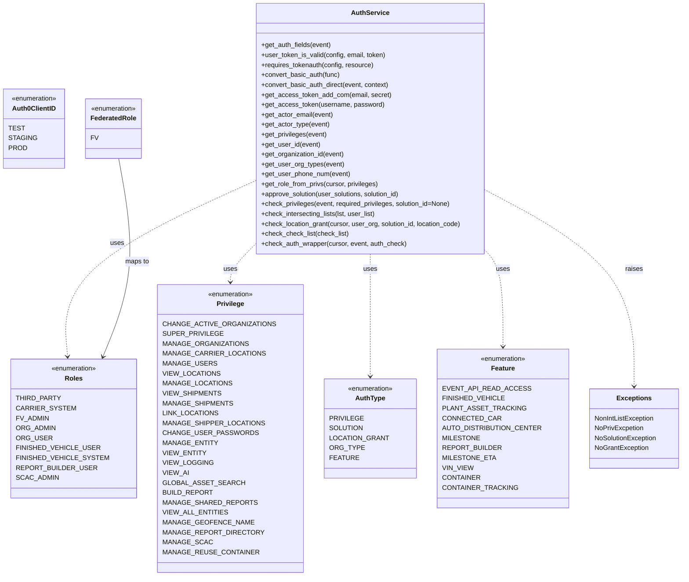

# Diagram: application_service/container_tracking_app_service/common/aws/lambdas/auth.py


> Auto-generated by Obscura crawlers

## Diagram 1



### SVG

<svg id="container" width="1546.763671875" xmlns="http://www.w3.org/2000/svg" class="classDiagram" height="1392" viewBox="0 0 1546.763671875 1392" role="graphics-document document" aria-roledescription="class"><style>#container{font-family:"trebuchet ms",verdana,arial,sans-serif;font-size:16px;fill:#333;}@keyframes edge-animation-frame{from{stroke-dashoffset:0;}}@keyframes dash{to{stroke-dashoffset:0;}}#container .edge-animation-slow{stroke-dasharray:9,5!important;stroke-dashoffset:900;animation:dash 50s linear infinite;stroke-linecap:round;}#container .edge-animation-fast{stroke-dasharray:9,5!important;stroke-dashoffset:900;animation:dash 20s linear infinite;stroke-linecap:round;}#container .error-icon{fill:#552222;}#container .error-text{fill:#552222;stroke:#552222;}#container .edge-thickness-normal{stroke-width:1px;}#container .edge-thickness-thick{stroke-width:3.5px;}#container .edge-pattern-solid{stroke-dasharray:0;}#container .edge-thickness-invisible{stroke-width:0;fill:none;}#container .edge-pattern-dashed{stroke-dasharray:3;}#container .edge-pattern-dotted{stroke-dasharray:2;}#container .marker{fill:#333333;stroke:#333333;}#container .marker.cross{stroke:#333333;}#container svg{font-family:"trebuchet ms",verdana,arial,sans-serif;font-size:16px;}#container p{margin:0;}#container g.classGroup text{fill:#9370DB;stroke:none;font-family:"trebuchet ms",verdana,arial,sans-serif;font-size:10px;}#container g.classGroup text .title{font-weight:bolder;}#container .nodeLabel,#container .edgeLabel{color:#131300;}#container .edgeLabel .label rect{fill:#ECECFF;}#container .label text{fill:#131300;}#container .labelBkg{background:#ECECFF;}#container .edgeLabel .label span{background:#ECECFF;}#container .classTitle{font-weight:bolder;}#container .node rect,#container .node circle,#container .node ellipse,#container .node polygon,#container .node path{fill:#ECECFF;stroke:#9370DB;stroke-width:1px;}#container .divider{stroke:#9370DB;stroke-width:1;}#container g.clickable{cursor:pointer;}#container g.classGroup rect{fill:#ECECFF;stroke:#9370DB;}#container g.classGroup line{stroke:#9370DB;stroke-width:1;}#container .classLabel .box{stroke:none;stroke-width:0;fill:#ECECFF;opacity:0.5;}#container .classLabel .label{fill:#9370DB;font-size:10px;}#container .relation{stroke:#333333;stroke-width:1;fill:none;}#container .dashed-line{stroke-dasharray:3;}#container .dotted-line{stroke-dasharray:1 2;}#container #compositionStart,#container .composition{fill:#333333!important;stroke:#333333!important;stroke-width:1;}#container #compositionEnd,#container .composition{fill:#333333!important;stroke:#333333!important;stroke-width:1;}#container #dependencyStart,#container .dependency{fill:#333333!important;stroke:#333333!important;stroke-width:1;}#container #dependencyStart,#container .dependency{fill:#333333!important;stroke:#333333!important;stroke-width:1;}#container #extensionStart,#container .extension{fill:transparent!important;stroke:#333333!important;stroke-width:1;}#container #extensionEnd,#container .extension{fill:transparent!important;stroke:#333333!important;stroke-width:1;}#container #aggregationStart,#container .aggregation{fill:transparent!important;stroke:#333333!important;stroke-width:1;}#container #aggregationEnd,#container .aggregation{fill:transparent!important;stroke:#333333!important;stroke-width:1;}#container #lollipopStart,#container .lollipop{fill:#ECECFF!important;stroke:#333333!important;stroke-width:1;}#container #lollipopEnd,#container .lollipop{fill:#ECECFF!important;stroke:#333333!important;stroke-width:1;}#container .edgeTerminals{font-size:11px;line-height:initial;}#container .classTitleText{text-anchor:middle;font-size:18px;fill:#333;}#container .label-icon{display:inline-block;height:1em;overflow:visible;vertical-align:-0.125em;}#container .node .label-icon path{fill:currentColor;stroke:revert;stroke-width:revert;}#container :root{--mermaid-font-family:"trebuchet ms",verdana,arial,sans-serif;}</style><g><defs><marker id="container_class-aggregationStart" class="marker aggregation class" refX="18" refY="7" markerWidth="190" markerHeight="240" orient="auto"><path d="M 18,7 L9,13 L1,7 L9,1 Z"></path></marker></defs><defs><marker id="container_class-aggregationEnd" class="marker aggregation class" refX="1" refY="7" markerWidth="20" markerHeight="28" orient="auto"><path d="M 18,7 L9,13 L1,7 L9,1 Z"></path></marker></defs><defs><marker id="container_class-extensionStart" class="marker extension class" refX="18" refY="7" markerWidth="190" markerHeight="240" orient="auto"><path d="M 1,7 L18,13 V 1 Z"></path></marker></defs><defs><marker id="container_class-extensionEnd" class="marker extension class" refX="1" refY="7" markerWidth="20" markerHeight="28" orient="auto"><path d="M 1,1 V 13 L18,7 Z"></path></marker></defs><defs><marker id="container_class-compositionStart" class="marker composition class" refX="18" refY="7" markerWidth="190" markerHeight="240" orient="auto"><path d="M 18,7 L9,13 L1,7 L9,1 Z"></path></marker></defs><defs><marker id="container_class-compositionEnd" class="marker composition class" refX="1" refY="7" markerWidth="20" markerHeight="28" orient="auto"><path d="M 18,7 L9,13 L1,7 L9,1 Z"></path></marker></defs><defs><marker id="container_class-dependencyStart" class="marker dependency class" refX="6" refY="7" markerWidth="190" markerHeight="240" orient="auto"><path d="M 5,7 L9,13 L1,7 L9,1 Z"></path></marker></defs><defs><marker id="container_class-dependencyEnd" class="marker dependency class" refX="13" refY="7" markerWidth="20" markerHeight="28" orient="auto"><path d="M 18,7 L9,13 L14,7 L9,1 Z"></path></marker></defs><defs><marker id="container_class-lollipopStart" class="marker lollipop class" refX="13" refY="7" markerWidth="190" markerHeight="240" orient="auto"><circle stroke="black" fill="transparent" cx="7" cy="7" r="6"></circle></marker></defs><defs><marker id="container_class-lollipopEnd" class="marker lollipop class" refX="1" refY="7" markerWidth="190" markerHeight="240" orient="auto"><circle stroke="black" fill="transparent" cx="7" cy="7" r="6"></circle></marker></defs><g class="root"><g class="clusters"></g><g class="edgePaths"><path d="M552.357,613.857L546.673,620.048C540.989,626.238,529.62,638.619,523.936,649.976C518.252,661.333,518.252,671.667,518.252,676.833L518.252,682" id="id_AuthService_Privilege_1" class="edge-thickness-normal edge-pattern-dashed relation" style=";;;" data-edge="true" data-et="edge" data-id="id_AuthService_Privilege_1" data-points="W3sieCI6NTUyLjM1NzQyMTg3NSwieSI6NjEzLjg1NzAzNTYwOTcxOTZ9LHsieCI6NTE4LjI1MTk1MzEyNSwieSI6NjUxfSx7IngiOjUxOC4yNTE5NTMxMjUsInkiOjY4OH1d" marker-end="url(#container_class-dependencyEnd)"></path><path d="M552.357,447.762L483.48,481.635C414.604,515.508,276.85,583.254,210.976,652.297C145.102,721.341,151.108,791.681,154.112,826.851L157.115,862.022" id="id_AuthService_Roles_2" class="edge-thickness-normal edge-pattern-dashed relation" style=";;;" data-edge="true" data-et="edge" data-id="id_AuthService_Roles_2" data-points="W3sieCI6NTUyLjM1NzQyMTg3NSwieSI6NDQ3Ljc2MTg5MDc3MTAyMTR9LHsieCI6MTM5LjA5NTcwMzEyNSwieSI6NjUxfSx7IngiOjE1Ny42MjUyNDg1Nzk1NDU0NiwieSI6ODY4fV0=" marker-end="url(#container_class-dependencyEnd)"></path><path d="M830.447,614L830.447,620.167C830.447,626.333,830.447,638.667,830.447,688C830.447,737.333,830.447,823.667,830.447,866.833L830.447,910" id="id_AuthService_AuthType_3" class="edge-thickness-normal edge-pattern-dashed relation" style=";;;" data-edge="true" data-et="edge" data-id="id_AuthService_AuthType_3" data-points="W3sieCI6ODMwLjQ0NzI2NTYyNSwieSI6NjE0fSx7IngiOjgzMC40NDcyNjU2MjUsInkiOjY1MX0seyJ4Ijo4MzAuNDQ3MjY1NjI1LCJ5Ijo5MTZ9XQ==" marker-end="url(#container_class-dependencyEnd)"></path><path d="M1095.872,614L1101.274,620.167C1106.675,626.333,1117.479,638.667,1122.881,676C1128.283,713.333,1128.283,775.667,1128.283,806.833L1128.283,838" id="id_AuthService_Feature_4" class="edge-thickness-normal edge-pattern-dashed relation" style=";;;" data-edge="true" data-et="edge" data-id="id_AuthService_Feature_4" data-points="W3sieCI6MTA5NS44NzE2NDUyMjA1ODgsInkiOjYxNH0seyJ4IjoxMTI4LjI4MzIwMzEyNSwieSI6NjUxfSx7IngiOjExMjguMjgzMjAzMTI1LCJ5Ijo4NDR9XQ==" marker-end="url(#container_class-dependencyEnd)"></path><path d="M1108.537,468.456L1162.27,498.88C1216.003,529.304,1323.469,590.152,1377.202,667.743C1430.936,745.333,1430.936,839.667,1430.936,886.833L1430.936,934" id="id_AuthService_Exceptions_5" class="edge-thickness-normal edge-pattern-dashed relation" style=";;;" data-edge="true" data-et="edge" data-id="id_AuthService_Exceptions_5" data-points="W3sieCI6MTEwOC41MzcxMDkzNzUsInkiOjQ2OC40NTYxMDY2ODQwMTM2Nn0seyJ4IjoxNDMwLjkzNTU0Njg3NSwieSI6NjUxfSx7IngiOjE0MzAuOTM1NTQ2ODc1LCJ5Ijo5NDB9XQ==" marker-end="url(#container_class-dependencyEnd)"></path><path d="M273.769,383L278.706,427.667C283.642,472.333,293.514,561.667,286.428,641.554C279.343,721.441,255.298,791.881,243.276,827.101L231.254,862.322" id="id_FederatedRole_Roles_6" class="edge-thickness-normal edge-pattern-solid relation" style=";;;" data-edge="true" data-et="edge" data-id="id_FederatedRole_Roles_6" data-points="W3sieCI6MjczLjc2OTM5MzM4MjM1MjksInkiOjM4M30seyJ4IjozMDMuMzg2NzE4NzUsInkiOjY1MX0seyJ4IjoyMjkuMzE1ODczNTc5NTQ1NDQsInkiOjg2OH1d" marker-end="url(#container_class-dependencyEnd)"></path></g><g class="edgeLabels"><g class="edgeLabel" transform="translate(518.251953125, 651)"><g class="label" data-id="id_AuthService_Privilege_1" transform="translate(-16.4921875, -12)"><foreignObject width="32.984375" height="24"><div xmlns="http://www.w3.org/1999/xhtml" class="labelBkg" style="display: table-cell; white-space: nowrap; line-height: 1.5; max-width: 200px; text-align: center;"><span class="edgeLabel"><p>uses</p></span></div></foreignObject></g></g><g class="edgeLabel" transform="translate(248.00928, 597.43736)"><g class="label" data-id="id_AuthService_Roles_2" transform="translate(-16.4921875, -12)"><foreignObject width="32.984375" height="24"><div xmlns="http://www.w3.org/1999/xhtml" class="labelBkg" style="display: table-cell; white-space: nowrap; line-height: 1.5; max-width: 200px; text-align: center;"><span class="edgeLabel"><p>uses</p></span></div></foreignObject></g></g><g class="edgeLabel" transform="translate(830.447265625, 651)"><g class="label" data-id="id_AuthService_AuthType_3" transform="translate(-16.4921875, -12)"><foreignObject width="32.984375" height="24"><div xmlns="http://www.w3.org/1999/xhtml" class="labelBkg" style="display: table-cell; white-space: nowrap; line-height: 1.5; max-width: 200px; text-align: center;"><span class="edgeLabel"><p>uses</p></span></div></foreignObject></g></g><g class="edgeLabel" transform="translate(1128.283203125, 651)"><g class="label" data-id="id_AuthService_Feature_4" transform="translate(-16.4921875, -12)"><foreignObject width="32.984375" height="24"><div xmlns="http://www.w3.org/1999/xhtml" class="labelBkg" style="display: table-cell; white-space: nowrap; line-height: 1.5; max-width: 200px; text-align: center;"><span class="edgeLabel"><p>uses</p></span></div></foreignObject></g></g><g class="edgeLabel" transform="translate(1430.935546875, 651)"><g class="label" data-id="id_AuthService_Exceptions_5" transform="translate(-21.25, -12)"><foreignObject width="42.5" height="24"><div xmlns="http://www.w3.org/1999/xhtml" class="labelBkg" style="display: table-cell; white-space: nowrap; line-height: 1.5; max-width: 200px; text-align: center;"><span class="edgeLabel"><p>raises</p></span></div></foreignObject></g></g><g class="edgeLabel" transform="translate(301.17128, 630.95299)"><g class="label" data-id="id_FederatedRole_Roles_6" transform="translate(-29.2578125, -12)"><foreignObject width="58.515625" height="24"><div xmlns="http://www.w3.org/1999/xhtml" class="labelBkg" style="display: table-cell; white-space: nowrap; line-height: 1.5; max-width: 200px; text-align: center;"><span class="edgeLabel"><p>maps to</p></span></div></foreignObject></g></g></g><g class="nodes"><g class="node default" id="classId-Privilege-0" transform="translate(518.251953125, 1036)"><g class="basic label-container"><path d="M-159.18359375 -348 L159.18359375 -348 L159.18359375 348 L-159.18359375 348" stroke="none" stroke-width="0" fill="#ECECFF" style=""></path><path d="M-159.18359375 -348 C-94.82009955559816 -348, -30.456605361196324 -348, 159.18359375 -348 M-159.18359375 -348 C-42.79599057623048 -348, 73.59161259753904 -348, 159.18359375 -348 M159.18359375 -348 C159.18359375 -118.23450489306691, 159.18359375 111.53099021386618, 159.18359375 348 M159.18359375 -348 C159.18359375 -172.16782713232408, 159.18359375 3.6643457353518443, 159.18359375 348 M159.18359375 348 C50.28016066043216 348, -58.62327242913568 348, -159.18359375 348 M159.18359375 348 C41.96835421558613 348, -75.24688531882774 348, -159.18359375 348 M-159.18359375 348 C-159.18359375 121.46253758893764, -159.18359375 -105.07492482212473, -159.18359375 -348 M-159.18359375 348 C-159.18359375 87.30250807335318, -159.18359375 -173.39498385329364, -159.18359375 -348" stroke="#9370DB" stroke-width="1.3" fill="none" stroke-dasharray="0 0" style=""></path></g><g class="annotation-group text" transform="translate(-55.5546875, -324)"><g class="label" style="" transform="translate(0,-12)"><foreignObject width="111.109375" height="24"><div xmlns="http://www.w3.org/1999/xhtml" style="display: table-cell; white-space: nowrap; line-height: 1.5; max-width: 161px; text-align: center;"><span class="nodeLabel markdown-node-label" style=""><p>«enumeration»</p></span></div></foreignObject></g></g><g class="label-group text" transform="translate(-31.8671875, -300)"><g class="label" style="font-weight: bolder" transform="translate(0,-12)"><foreignObject width="63.734375" height="24"><div xmlns="http://www.w3.org/1999/xhtml" style="display: table-cell; white-space: nowrap; line-height: 1.5; max-width: 112px; text-align: center;"><span class="nodeLabel markdown-node-label" style=""><p>Privilege</p></span></div></foreignObject></g></g><g class="members-group text" transform="translate(-147.18359375, -252)"><g class="label" style="" transform="translate(0,-12)"><foreignObject width="238.8125" height="24"><div xmlns="http://www.w3.org/1999/xhtml" style="display: table-cell; white-space: nowrap; line-height: 1.5; max-width: 289px; text-align: center;"><span class="nodeLabel markdown-node-label" style=""><p>CHANGE_ACTIVE_ORGANIZATIONS</p></span></div></foreignObject></g><g class="label" style="" transform="translate(0,12)"><foreignObject width="127.484375" height="24"><div xmlns="http://www.w3.org/1999/xhtml" style="display: table-cell; white-space: nowrap; line-height: 1.5; max-width: 177px; text-align: center;"><span class="nodeLabel markdown-node-label" style=""><p>SUPER_PRIVILEGE</p></span></div></foreignObject></g><g class="label" style="" transform="translate(0,36)"><foreignObject width="183.84375" height="24"><div xmlns="http://www.w3.org/1999/xhtml" style="display: table-cell; white-space: nowrap; line-height: 1.5; max-width: 234px; text-align: center;"><span class="nodeLabel markdown-node-label" style=""><p>MANAGE_ORGANIZATIONS</p></span></div></foreignObject></g><g class="label" style="" transform="translate(0,60)"><foreignObject width="216.03125" height="24"><div xmlns="http://www.w3.org/1999/xhtml" style="display: table-cell; white-space: nowrap; line-height: 1.5; max-width: 266px; text-align: center;"><span class="nodeLabel markdown-node-label" style=""><p>MANAGE_CARRIER_LOCATIONS</p></span></div></foreignObject></g><g class="label" style="" transform="translate(0,84)"><foreignObject width="114.109375" height="24"><div xmlns="http://www.w3.org/1999/xhtml" style="display: table-cell; white-space: nowrap; line-height: 1.5; max-width: 164px; text-align: center;"><span class="nodeLabel markdown-node-label" style=""><p>MANAGE_USERS</p></span></div></foreignObject></g><g class="label" style="" transform="translate(0,108)"><foreignObject width="122.125" height="24"><div xmlns="http://www.w3.org/1999/xhtml" style="display: table-cell; white-space: nowrap; line-height: 1.5; max-width: 172px; text-align: center;"><span class="nodeLabel markdown-node-label" style=""><p>VIEW_LOCATIONS</p></span></div></foreignObject></g><g class="label" style="" transform="translate(0,132)"><foreignObject width="147.890625" height="24"><div xmlns="http://www.w3.org/1999/xhtml" style="display: table-cell; white-space: nowrap; line-height: 1.5; max-width: 198px; text-align: center;"><span class="nodeLabel markdown-node-label" style=""><p>MANAGE_LOCATIONS</p></span></div></foreignObject></g><g class="label" style="" transform="translate(0,156)"><foreignObject width="124.1875" height="24"><div xmlns="http://www.w3.org/1999/xhtml" style="display: table-cell; white-space: nowrap; line-height: 1.5; max-width: 174px; text-align: center;"><span class="nodeLabel markdown-node-label" style=""><p>VIEW_SHIPMENTS</p></span></div></foreignObject></g><g class="label" style="" transform="translate(0,180)"><foreignObject width="149.953125" height="24"><div xmlns="http://www.w3.org/1999/xhtml" style="display: table-cell; white-space: nowrap; line-height: 1.5; max-width: 200px; text-align: center;"><span class="nodeLabel markdown-node-label" style=""><p>MANAGE_SHIPMENTS</p></span></div></foreignObject></g><g class="label" style="" transform="translate(0,204)"><foreignObject width="120.734375" height="24"><div xmlns="http://www.w3.org/1999/xhtml" style="display: table-cell; white-space: nowrap; line-height: 1.5; max-width: 171px; text-align: center;"><span class="nodeLabel markdown-node-label" style=""><p>LINK_LOCATIONS</p></span></div></foreignObject></g><g class="label" style="" transform="translate(0,228)"><foreignObject width="217.046875" height="24"><div xmlns="http://www.w3.org/1999/xhtml" style="display: table-cell; white-space: nowrap; line-height: 1.5; max-width: 267px; text-align: center;"><span class="nodeLabel markdown-node-label" style=""><p>MANAGE_SHIPPER_LOCATIONS</p></span></div></foreignObject></g><g class="label" style="" transform="translate(0,252)"><foreignObject width="199.78125" height="24"><div xmlns="http://www.w3.org/1999/xhtml" style="display: table-cell; white-space: nowrap; line-height: 1.5; max-width: 250px; text-align: center;"><span class="nodeLabel markdown-node-label" style=""><p>CHANGE_USER_PASSWORDS</p></span></div></foreignObject></g><g class="label" style="" transform="translate(0,276)"><foreignObject width="118.09375" height="24"><div xmlns="http://www.w3.org/1999/xhtml" style="display: table-cell; white-space: nowrap; line-height: 1.5; max-width: 168px; text-align: center;"><span class="nodeLabel markdown-node-label" style=""><p>MANAGE_ENTITY</p></span></div></foreignObject></g><g class="label" style="" transform="translate(0,300)"><foreignObject width="92.3125" height="24"><div xmlns="http://www.w3.org/1999/xhtml" style="display: table-cell; white-space: nowrap; line-height: 1.5; max-width: 143px; text-align: center;"><span class="nodeLabel markdown-node-label" style=""><p>VIEW_ENTITY</p></span></div></foreignObject></g><g class="label" style="" transform="translate(0,324)"><foreignObject width="107.015625" height="24"><div xmlns="http://www.w3.org/1999/xhtml" style="display: table-cell; white-space: nowrap; line-height: 1.5; max-width: 157px; text-align: center;"><span class="nodeLabel markdown-node-label" style=""><p>VIEW_LOGGING</p></span></div></foreignObject></g><g class="label" style="" transform="translate(0,348)"><foreignObject width="56.640625" height="24"><div xmlns="http://www.w3.org/1999/xhtml" style="display: table-cell; white-space: nowrap; line-height: 1.5; max-width: 107px; text-align: center;"><span class="nodeLabel markdown-node-label" style=""><p>VIEW_AI</p></span></div></foreignObject></g><g class="label" style="" transform="translate(0,372)"><foreignObject width="169.796875" height="24"><div xmlns="http://www.w3.org/1999/xhtml" style="display: table-cell; white-space: nowrap; line-height: 1.5; max-width: 220px; text-align: center;"><span class="nodeLabel markdown-node-label" style=""><p>GLOBAL_ASSET_SEARCH</p></span></div></foreignObject></g><g class="label" style="" transform="translate(0,396)"><foreignObject width="107.234375" height="24"><div xmlns="http://www.w3.org/1999/xhtml" style="display: table-cell; white-space: nowrap; line-height: 1.5; max-width: 158px; text-align: center;"><span class="nodeLabel markdown-node-label" style=""><p>BUILD_REPORT</p></span></div></foreignObject></g><g class="label" style="" transform="translate(0,420)"><foreignObject width="197.84375" height="24"><div xmlns="http://www.w3.org/1999/xhtml" style="display: table-cell; white-space: nowrap; line-height: 1.5; max-width: 248px; text-align: center;"><span class="nodeLabel markdown-node-label" style=""><p>MANAGE_SHARED_REPORTS</p></span></div></foreignObject></g><g class="label" style="" transform="translate(0,444)"><foreignObject width="138.78125" height="24"><div xmlns="http://www.w3.org/1999/xhtml" style="display: table-cell; white-space: nowrap; line-height: 1.5; max-width: 189px; text-align: center;"><span class="nodeLabel markdown-node-label" style=""><p>VIEW_ALL_ENTITIES</p></span></div></foreignObject></g><g class="label" style="" transform="translate(0,468)"><foreignObject width="191.71875" height="24"><div xmlns="http://www.w3.org/1999/xhtml" style="display: table-cell; white-space: nowrap; line-height: 1.5; max-width: 242px; text-align: center;"><span class="nodeLabel markdown-node-label" style=""><p>MANAGE_GEOFENCE_NAME</p></span></div></foreignObject></g><g class="label" style="" transform="translate(0,492)"><foreignObject width="211.015625" height="24"><div xmlns="http://www.w3.org/1999/xhtml" style="display: table-cell; white-space: nowrap; line-height: 1.5; max-width: 261px; text-align: center;"><span class="nodeLabel markdown-node-label" style=""><p>MANAGE_REPORT_DIRECTORY</p></span></div></foreignObject></g><g class="label" style="" transform="translate(0,516)"><foreignObject width="103.859375" height="24"><div xmlns="http://www.w3.org/1999/xhtml" style="display: table-cell; white-space: nowrap; line-height: 1.5; max-width: 154px; text-align: center;"><span class="nodeLabel markdown-node-label" style=""><p>MANAGE_SCAC</p></span></div></foreignObject></g><g class="label" style="" transform="translate(0,540)"><foreignObject width="203.390625" height="24"><div xmlns="http://www.w3.org/1999/xhtml" style="display: table-cell; white-space: nowrap; line-height: 1.5; max-width: 254px; text-align: center;"><span class="nodeLabel markdown-node-label" style=""><p>MANAGE_REUSE_CONTAINER</p></span></div></foreignObject></g></g><g class="methods-group text" transform="translate(-147.18359375, 348)"></g><g class="divider" style=""><path d="M-159.18359375 -276 C-53.85479387800335 -276, 51.4740059939933 -276, 159.18359375 -276 M-159.18359375 -276 C-53.802487962064745 -276, 51.57861782587051 -276, 159.18359375 -276" stroke="#9370DB" stroke-width="1.3" fill="none" stroke-dasharray="0 0" style=""></path></g><g class="divider" style=""><path d="M-159.18359375 324 C-57.41855096750044 324, 44.346491814999126 324, 159.18359375 324 M-159.18359375 324 C-65.80691080701763 324, 27.56977213596474 324, 159.18359375 324" stroke="#9370DB" stroke-width="1.3" fill="none" stroke-dasharray="0 0" style=""></path></g></g><g class="node default" id="classId-Roles-1" transform="translate(171.970703125, 1036)"><g class="basic label-container"><path d="M-137.09765625 -168 L137.09765625 -168 L137.09765625 168 L-137.09765625 168" stroke="none" stroke-width="0" fill="#ECECFF" style=""></path><path d="M-137.09765625 -168 C-61.77052653854763 -168, 13.556603172904744 -168, 137.09765625 -168 M-137.09765625 -168 C-75.26248998288818 -168, -13.427323715776353 -168, 137.09765625 -168 M137.09765625 -168 C137.09765625 -44.36554171561791, 137.09765625 79.26891656876418, 137.09765625 168 M137.09765625 -168 C137.09765625 -70.94121752318236, 137.09765625 26.11756495363528, 137.09765625 168 M137.09765625 168 C45.42556938174103 168, -46.246517486517945 168, -137.09765625 168 M137.09765625 168 C31.945185431590147 168, -73.2072853868197 168, -137.09765625 168 M-137.09765625 168 C-137.09765625 46.858246099005854, -137.09765625 -74.28350780198829, -137.09765625 -168 M-137.09765625 168 C-137.09765625 79.70584974017027, -137.09765625 -8.58830051965947, -137.09765625 -168" stroke="#9370DB" stroke-width="1.3" fill="none" stroke-dasharray="0 0" style=""></path></g><g class="annotation-group text" transform="translate(-55.5546875, -144)"><g class="label" style="" transform="translate(0,-12)"><foreignObject width="111.109375" height="24"><div xmlns="http://www.w3.org/1999/xhtml" style="display: table-cell; white-space: nowrap; line-height: 1.5; max-width: 161px; text-align: center;"><span class="nodeLabel markdown-node-label" style=""><p>«enumeration»</p></span></div></foreignObject></g></g><g class="label-group text" transform="translate(-20.109375, -120)"><g class="label" style="font-weight: bolder" transform="translate(0,-12)"><foreignObject width="40.21875" height="24"><div xmlns="http://www.w3.org/1999/xhtml" style="display: table-cell; white-space: nowrap; line-height: 1.5; max-width: 90px; text-align: center;"><span class="nodeLabel markdown-node-label" style=""><p>Roles</p></span></div></foreignObject></g></g><g class="members-group text" transform="translate(-125.09765625, -72)"><g class="label" style="" transform="translate(0,-12)"><foreignObject width="95.484375" height="24"><div xmlns="http://www.w3.org/1999/xhtml" style="display: table-cell; white-space: nowrap; line-height: 1.5; max-width: 146px; text-align: center;"><span class="nodeLabel markdown-node-label" style=""><p>THIRD_PARTY</p></span></div></foreignObject></g><g class="label" style="" transform="translate(0,12)"><foreignObject width="122.984375" height="24"><div xmlns="http://www.w3.org/1999/xhtml" style="display: table-cell; white-space: nowrap; line-height: 1.5; max-width: 173px; text-align: center;"><span class="nodeLabel markdown-node-label" style=""><p>CARRIER_SYSTEM</p></span></div></foreignObject></g><g class="label" style="" transform="translate(0,36)"><foreignObject width="71.734375" height="24"><div xmlns="http://www.w3.org/1999/xhtml" style="display: table-cell; white-space: nowrap; line-height: 1.5; max-width: 122px; text-align: center;"><span class="nodeLabel markdown-node-label" style=""><p>FV_ADMIN</p></span></div></foreignObject></g><g class="label" style="" transform="translate(0,60)"><foreignObject width="86.484375" height="24"><div xmlns="http://www.w3.org/1999/xhtml" style="display: table-cell; white-space: nowrap; line-height: 1.5; max-width: 136px; text-align: center;"><span class="nodeLabel markdown-node-label" style=""><p>ORG_ADMIN</p></span></div></foreignObject></g><g class="label" style="" transform="translate(0,84)"><foreignObject width="75.984375" height="24"><div xmlns="http://www.w3.org/1999/xhtml" style="display: table-cell; white-space: nowrap; line-height: 1.5; max-width: 126px; text-align: center;"><span class="nodeLabel markdown-node-label" style=""><p>ORG_USER</p></span></div></foreignObject></g><g class="label" style="" transform="translate(0,108)"><foreignObject width="177.40625" height="24"><div xmlns="http://www.w3.org/1999/xhtml" style="display: table-cell; white-space: nowrap; line-height: 1.5; max-width: 228px; text-align: center;"><span class="nodeLabel markdown-node-label" style=""><p>FINISHED_VEHICLE_USER</p></span></div></foreignObject></g><g class="label" style="" transform="translate(0,132)"><foreignObject width="194.640625" height="24"><div xmlns="http://www.w3.org/1999/xhtml" style="display: table-cell; white-space: nowrap; line-height: 1.5; max-width: 245px; text-align: center;"><span class="nodeLabel markdown-node-label" style=""><p>FINISHED_VEHICLE_SYSTEM</p></span></div></foreignObject></g><g class="label" style="" transform="translate(0,156)"><foreignObject width="170.59375" height="24"><div xmlns="http://www.w3.org/1999/xhtml" style="display: table-cell; white-space: nowrap; line-height: 1.5; max-width: 221px; text-align: center;"><span class="nodeLabel markdown-node-label" style=""><p>REPORT_BUILDER_USER</p></span></div></foreignObject></g><g class="label" style="" transform="translate(0,180)"><foreignObject width="91.4375" height="24"><div xmlns="http://www.w3.org/1999/xhtml" style="display: table-cell; white-space: nowrap; line-height: 1.5; max-width: 141px; text-align: center;"><span class="nodeLabel markdown-node-label" style=""><p>SCAC_ADMIN</p></span></div></foreignObject></g></g><g class="methods-group text" transform="translate(-125.09765625, 168)"></g><g class="divider" style=""><path d="M-137.09765625 -96 C-67.75359098478346 -96, 1.5904742804330851 -96, 137.09765625 -96 M-137.09765625 -96 C-52.2910976354534 -96, 32.515460979093206 -96, 137.09765625 -96" stroke="#9370DB" stroke-width="1.3" fill="none" stroke-dasharray="0 0" style=""></path></g><g class="divider" style=""><path d="M-137.09765625 144 C-34.971552384286284 144, 67.15455148142743 144, 137.09765625 144 M-137.09765625 144 C-46.69048051159386 144, 43.71669522681228 144, 137.09765625 144" stroke="#9370DB" stroke-width="1.3" fill="none" stroke-dasharray="0 0" style=""></path></g></g><g class="node default" id="classId-Auth0ClientID-2" transform="translate(78.12890625, 311)"><g class="basic label-container"><path d="M-70.12890625 -96 L70.12890625 -96 L70.12890625 96 L-70.12890625 96" stroke="none" stroke-width="0" fill="#ECECFF" style=""></path><path d="M-70.12890625 -96 C-23.378258330217193 -96, 23.372389589565614 -96, 70.12890625 -96 M-70.12890625 -96 C-38.371411148471196 -96, -6.613916046942386 -96, 70.12890625 -96 M70.12890625 -96 C70.12890625 -35.197671015278594, 70.12890625 25.604657969442812, 70.12890625 96 M70.12890625 -96 C70.12890625 -33.39825721664069, 70.12890625 29.203485566718626, 70.12890625 96 M70.12890625 96 C33.83487087531692 96, -2.4591644993661532 96, -70.12890625 96 M70.12890625 96 C18.26470458475589 96, -33.59949708048822 96, -70.12890625 96 M-70.12890625 96 C-70.12890625 25.064996036011365, -70.12890625 -45.87000792797727, -70.12890625 -96 M-70.12890625 96 C-70.12890625 54.46545361956392, -70.12890625 12.930907239127833, -70.12890625 -96" stroke="#9370DB" stroke-width="1.3" fill="none" stroke-dasharray="0 0" style=""></path></g><g class="annotation-group text" transform="translate(-55.5546875, -72)"><g class="label" style="" transform="translate(0,-12)"><foreignObject width="111.109375" height="24"><div xmlns="http://www.w3.org/1999/xhtml" style="display: table-cell; white-space: nowrap; line-height: 1.5; max-width: 161px; text-align: center;"><span class="nodeLabel markdown-node-label" style=""><p>«enumeration»</p></span></div></foreignObject></g></g><g class="label-group text" transform="translate(-50.5078125, -48)"><g class="label" style="font-weight: bolder" transform="translate(0,-12)"><foreignObject width="101.015625" height="24"><div xmlns="http://www.w3.org/1999/xhtml" style="display: table-cell; white-space: nowrap; line-height: 1.5; max-width: 149px; text-align: center;"><span class="nodeLabel markdown-node-label" style=""><p>Auth0ClientID</p></span></div></foreignObject></g></g><g class="members-group text" transform="translate(-58.12890625, 0)"><g class="label" style="" transform="translate(0,-12)"><foreignObject width="33.3125" height="24"><div xmlns="http://www.w3.org/1999/xhtml" style="display: table-cell; white-space: nowrap; line-height: 1.5; max-width: 84px; text-align: center;"><span class="nodeLabel markdown-node-label" style=""><p>TEST</p></span></div></foreignObject></g><g class="label" style="" transform="translate(0,12)"><foreignObject width="60.703125" height="24"><div xmlns="http://www.w3.org/1999/xhtml" style="display: table-cell; white-space: nowrap; line-height: 1.5; max-width: 111px; text-align: center;"><span class="nodeLabel markdown-node-label" style=""><p>STAGING</p></span></div></foreignObject></g><g class="label" style="" transform="translate(0,36)"><foreignObject width="40.21875" height="24"><div xmlns="http://www.w3.org/1999/xhtml" style="display: table-cell; white-space: nowrap; line-height: 1.5; max-width: 90px; text-align: center;"><span class="nodeLabel markdown-node-label" style=""><p>PROD</p></span></div></foreignObject></g></g><g class="methods-group text" transform="translate(-58.12890625, 96)"></g><g class="divider" style=""><path d="M-70.12890625 -24 C-16.98176530490848 -24, 36.16537564018304 -24, 70.12890625 -24 M-70.12890625 -24 C-21.634685394673532 -24, 26.859535460652936 -24, 70.12890625 -24" stroke="#9370DB" stroke-width="1.3" fill="none" stroke-dasharray="0 0" style=""></path></g><g class="divider" style=""><path d="M-70.12890625 72 C-25.335712968426925 72, 19.45748031314615 72, 70.12890625 72 M-70.12890625 72 C-37.13516150556827 72, -4.14141676113654 72, 70.12890625 72" stroke="#9370DB" stroke-width="1.3" fill="none" stroke-dasharray="0 0" style=""></path></g></g><g class="node default" id="classId-AuthType-3" transform="translate(830.447265625, 1036)"><g class="basic label-container"><path d="M-103.01171875 -120 L103.01171875 -120 L103.01171875 120 L-103.01171875 120" stroke="none" stroke-width="0" fill="#ECECFF" style=""></path><path d="M-103.01171875 -120 C-57.23400151437733 -120, -11.456284278754666 -120, 103.01171875 -120 M-103.01171875 -120 C-51.01650357722785 -120, 0.9787115955442971 -120, 103.01171875 -120 M103.01171875 -120 C103.01171875 -26.469077584670046, 103.01171875 67.06184483065991, 103.01171875 120 M103.01171875 -120 C103.01171875 -53.07504790624991, 103.01171875 13.849904187500186, 103.01171875 120 M103.01171875 120 C22.073209631566797 120, -58.865299486866405 120, -103.01171875 120 M103.01171875 120 C21.34235362394122 120, -60.32701150211756 120, -103.01171875 120 M-103.01171875 120 C-103.01171875 67.19061895734058, -103.01171875 14.38123791468115, -103.01171875 -120 M-103.01171875 120 C-103.01171875 40.92244288871757, -103.01171875 -38.15511422256486, -103.01171875 -120" stroke="#9370DB" stroke-width="1.3" fill="none" stroke-dasharray="0 0" style=""></path></g><g class="annotation-group text" transform="translate(-55.5546875, -96)"><g class="label" style="" transform="translate(0,-12)"><foreignObject width="111.109375" height="24"><div xmlns="http://www.w3.org/1999/xhtml" style="display: table-cell; white-space: nowrap; line-height: 1.5; max-width: 161px; text-align: center;"><span class="nodeLabel markdown-node-label" style=""><p>«enumeration»</p></span></div></foreignObject></g></g><g class="label-group text" transform="translate(-34.34375, -72)"><g class="label" style="font-weight: bolder" transform="translate(0,-12)"><foreignObject width="68.6875" height="24"><div xmlns="http://www.w3.org/1999/xhtml" style="display: table-cell; white-space: nowrap; line-height: 1.5; max-width: 117px; text-align: center;"><span class="nodeLabel markdown-node-label" style=""><p>AuthType</p></span></div></foreignObject></g></g><g class="members-group text" transform="translate(-91.01171875, -24)"><g class="label" style="" transform="translate(0,-12)"><foreignObject width="72.3125" height="24"><div xmlns="http://www.w3.org/1999/xhtml" style="display: table-cell; white-space: nowrap; line-height: 1.5; max-width: 122px; text-align: center;"><span class="nodeLabel markdown-node-label" style=""><p>PRIVILEGE</p></span></div></foreignObject></g><g class="label" style="" transform="translate(0,12)"><foreignObject width="72.953125" height="24"><div xmlns="http://www.w3.org/1999/xhtml" style="display: table-cell; white-space: nowrap; line-height: 1.5; max-width: 123px; text-align: center;"><span class="nodeLabel markdown-node-label" style=""><p>SOLUTION</p></span></div></foreignObject></g><g class="label" style="" transform="translate(0,36)"><foreignObject width="126.46875" height="24"><div xmlns="http://www.w3.org/1999/xhtml" style="display: table-cell; white-space: nowrap; line-height: 1.5; max-width: 177px; text-align: center;"><span class="nodeLabel markdown-node-label" style=""><p>LOCATION_GRANT</p></span></div></foreignObject></g><g class="label" style="" transform="translate(0,60)"><foreignObject width="73.15625" height="24"><div xmlns="http://www.w3.org/1999/xhtml" style="display: table-cell; white-space: nowrap; line-height: 1.5; max-width: 123px; text-align: center;"><span class="nodeLabel markdown-node-label" style=""><p>ORG_TYPE</p></span></div></foreignObject></g><g class="label" style="" transform="translate(0,84)"><foreignObject width="61.890625" height="24"><div xmlns="http://www.w3.org/1999/xhtml" style="display: table-cell; white-space: nowrap; line-height: 1.5; max-width: 112px; text-align: center;"><span class="nodeLabel markdown-node-label" style=""><p>FEATURE</p></span></div></foreignObject></g></g><g class="methods-group text" transform="translate(-91.01171875, 120)"></g><g class="divider" style=""><path d="M-103.01171875 -48 C-36.58019242859443 -48, 29.85133389281114 -48, 103.01171875 -48 M-103.01171875 -48 C-36.12733650289219 -48, 30.757045744215617 -48, 103.01171875 -48" stroke="#9370DB" stroke-width="1.3" fill="none" stroke-dasharray="0 0" style=""></path></g><g class="divider" style=""><path d="M-103.01171875 96 C-60.87711615733763 96, -18.742513564675264 96, 103.01171875 96 M-103.01171875 96 C-45.70749903917212 96, 11.59672067165576 96, 103.01171875 96" stroke="#9370DB" stroke-width="1.3" fill="none" stroke-dasharray="0 0" style=""></path></g></g><g class="node default" id="classId-Feature-4" transform="translate(1128.283203125, 1036)"><g class="basic label-container"><path d="M-144.82421875 -192 L144.82421875 -192 L144.82421875 192 L-144.82421875 192" stroke="none" stroke-width="0" fill="#ECECFF" style=""></path><path d="M-144.82421875 -192 C-55.590498692390554 -192, 33.64322136521889 -192, 144.82421875 -192 M-144.82421875 -192 C-68.84732542718007 -192, 7.129567895639866 -192, 144.82421875 -192 M144.82421875 -192 C144.82421875 -62.93628977428966, 144.82421875 66.12742045142068, 144.82421875 192 M144.82421875 -192 C144.82421875 -110.10182311485123, 144.82421875 -28.203646229702457, 144.82421875 192 M144.82421875 192 C69.45972506147764 192, -5.904768627044717 192, -144.82421875 192 M144.82421875 192 C68.718539729285 192, -7.387139291430003 192, -144.82421875 192 M-144.82421875 192 C-144.82421875 51.88129249437881, -144.82421875 -88.23741501124238, -144.82421875 -192 M-144.82421875 192 C-144.82421875 51.31966005004426, -144.82421875 -89.36067989991147, -144.82421875 -192" stroke="#9370DB" stroke-width="1.3" fill="none" stroke-dasharray="0 0" style=""></path></g><g class="annotation-group text" transform="translate(-55.5546875, -168)"><g class="label" style="" transform="translate(0,-12)"><foreignObject width="111.109375" height="24"><div xmlns="http://www.w3.org/1999/xhtml" style="display: table-cell; white-space: nowrap; line-height: 1.5; max-width: 161px; text-align: center;"><span class="nodeLabel markdown-node-label" style=""><p>«enumeration»</p></span></div></foreignObject></g></g><g class="label-group text" transform="translate(-27.390625, -144)"><g class="label" style="font-weight: bolder" transform="translate(0,-12)"><foreignObject width="54.78125" height="24"><div xmlns="http://www.w3.org/1999/xhtml" style="display: table-cell; white-space: nowrap; line-height: 1.5; max-width: 104px; text-align: center;"><span class="nodeLabel markdown-node-label" style=""><p>Feature</p></span></div></foreignObject></g></g><g class="members-group text" transform="translate(-132.82421875, -96)"><g class="label" style="" transform="translate(0,-12)"><foreignObject width="181.890625" height="24"><div xmlns="http://www.w3.org/1999/xhtml" style="display: table-cell; white-space: nowrap; line-height: 1.5; max-width: 232px; text-align: center;"><span class="nodeLabel markdown-node-label" style=""><p>EVENT_API_READ_ACCESS</p></span></div></foreignObject></g><g class="label" style="" transform="translate(0,12)"><foreignObject width="132.125" height="24"><div xmlns="http://www.w3.org/1999/xhtml" style="display: table-cell; white-space: nowrap; line-height: 1.5; max-width: 182px; text-align: center;"><span class="nodeLabel markdown-node-label" style=""><p>FINISHED_VEHICLE</p></span></div></foreignObject></g><g class="label" style="" transform="translate(0,36)"><foreignObject width="174.21875" height="24"><div xmlns="http://www.w3.org/1999/xhtml" style="display: table-cell; white-space: nowrap; line-height: 1.5; max-width: 224px; text-align: center;"><span class="nodeLabel markdown-node-label" style=""><p>PLANT_ASSET_TRACKING</p></span></div></foreignObject></g><g class="label" style="" transform="translate(0,60)"><foreignObject width="120.734375" height="24"><div xmlns="http://www.w3.org/1999/xhtml" style="display: table-cell; white-space: nowrap; line-height: 1.5; max-width: 171px; text-align: center;"><span class="nodeLabel markdown-node-label" style=""><p>CONNECTED_CAR</p></span></div></foreignObject></g><g class="label" style="" transform="translate(0,84)"><foreignObject width="210.09375" height="24"><div xmlns="http://www.w3.org/1999/xhtml" style="display: table-cell; white-space: nowrap; line-height: 1.5; max-width: 260px; text-align: center;"><span class="nodeLabel markdown-node-label" style=""><p>AUTO_DISTRIBUTION_CENTER</p></span></div></foreignObject></g><g class="label" style="" transform="translate(0,108)"><foreignObject width="80.1875" height="24"><div xmlns="http://www.w3.org/1999/xhtml" style="display: table-cell; white-space: nowrap; line-height: 1.5; max-width: 130px; text-align: center;"><span class="nodeLabel markdown-node-label" style=""><p>MILESTONE</p></span></div></foreignObject></g><g class="label" style="" transform="translate(0,132)"><foreignObject width="125.3125" height="24"><div xmlns="http://www.w3.org/1999/xhtml" style="display: table-cell; white-space: nowrap; line-height: 1.5; max-width: 176px; text-align: center;"><span class="nodeLabel markdown-node-label" style=""><p>REPORT_BUILDER</p></span></div></foreignObject></g><g class="label" style="" transform="translate(0,156)"><foreignObject width="113.703125" height="24"><div xmlns="http://www.w3.org/1999/xhtml" style="display: table-cell; white-space: nowrap; line-height: 1.5; max-width: 165px; text-align: center;"><span class="nodeLabel markdown-node-label" style=""><p>MILESTONE_ETA</p></span></div></foreignObject></g><g class="label" style="" transform="translate(0,180)"><foreignObject width="67.46875" height="24"><div xmlns="http://www.w3.org/1999/xhtml" style="display: table-cell; white-space: nowrap; line-height: 1.5; max-width: 117px; text-align: center;"><span class="nodeLabel markdown-node-label" style=""><p>VIN_VIEW</p></span></div></foreignObject></g><g class="label" style="" transform="translate(0,204)"><foreignObject width="81.171875" height="24"><div xmlns="http://www.w3.org/1999/xhtml" style="display: table-cell; white-space: nowrap; line-height: 1.5; max-width: 131px; text-align: center;"><span class="nodeLabel markdown-node-label" style=""><p>CONTAINER</p></span></div></foreignObject></g><g class="label" style="" transform="translate(0,228)"><foreignObject width="159.78125" height="24"><div xmlns="http://www.w3.org/1999/xhtml" style="display: table-cell; white-space: nowrap; line-height: 1.5; max-width: 210px; text-align: center;"><span class="nodeLabel markdown-node-label" style=""><p>CONTAINER_TRACKING</p></span></div></foreignObject></g></g><g class="methods-group text" transform="translate(-132.82421875, 192)"></g><g class="divider" style=""><path d="M-144.82421875 -120 C-79.22335867632918 -120, -13.622498602658368 -120, 144.82421875 -120 M-144.82421875 -120 C-79.21892553819549 -120, -13.613632326390984 -120, 144.82421875 -120" stroke="#9370DB" stroke-width="1.3" fill="none" stroke-dasharray="0 0" style=""></path></g><g class="divider" style=""><path d="M-144.82421875 168 C-58.571712653178736 168, 27.68079344364253 168, 144.82421875 168 M-144.82421875 168 C-65.4475948226812 168, 13.929029104637607 168, 144.82421875 168" stroke="#9370DB" stroke-width="1.3" fill="none" stroke-dasharray="0 0" style=""></path></g></g><g class="node default" id="classId-FederatedRole-5" transform="translate(265.8125, 311)"><g class="basic label-container"><path d="M-67.5546875 -72 L67.5546875 -72 L67.5546875 72 L-67.5546875 72" stroke="none" stroke-width="0" fill="#ECECFF" style=""></path><path d="M-67.5546875 -72 C-32.03110898146442 -72, 3.492469537071159 -72, 67.5546875 -72 M-67.5546875 -72 C-30.478662550682323 -72, 6.5973623986353545 -72, 67.5546875 -72 M67.5546875 -72 C67.5546875 -31.29336022713909, 67.5546875 9.41327954572182, 67.5546875 72 M67.5546875 -72 C67.5546875 -21.233908190190043, 67.5546875 29.532183619619914, 67.5546875 72 M67.5546875 72 C17.718781692003446 72, -32.11712411599311 72, -67.5546875 72 M67.5546875 72 C29.339660166669248 72, -8.875367166661505 72, -67.5546875 72 M-67.5546875 72 C-67.5546875 35.8503208451474, -67.5546875 -0.29935830970519817, -67.5546875 -72 M-67.5546875 72 C-67.5546875 38.83012287449785, -67.5546875 5.660245748995706, -67.5546875 -72" stroke="#9370DB" stroke-width="1.3" fill="none" stroke-dasharray="0 0" style=""></path></g><g class="annotation-group text" transform="translate(-55.5546875, -48)"><g class="label" style="" transform="translate(0,-12)"><foreignObject width="111.109375" height="24"><div xmlns="http://www.w3.org/1999/xhtml" style="display: table-cell; white-space: nowrap; line-height: 1.5; max-width: 161px; text-align: center;"><span class="nodeLabel markdown-node-label" style=""><p>«enumeration»</p></span></div></foreignObject></g></g><g class="label-group text" transform="translate(-52.9609375, -24)"><g class="label" style="font-weight: bolder" transform="translate(0,-12)"><foreignObject width="105.921875" height="24"><div xmlns="http://www.w3.org/1999/xhtml" style="display: table-cell; white-space: nowrap; line-height: 1.5; max-width: 155px; text-align: center;"><span class="nodeLabel markdown-node-label" style=""><p>FederatedRole</p></span></div></foreignObject></g></g><g class="members-group text" transform="translate(-55.5546875, 24)"><g class="label" style="" transform="translate(0,-12)"><foreignObject width="16.765625" height="24"><div xmlns="http://www.w3.org/1999/xhtml" style="display: table-cell; white-space: nowrap; line-height: 1.5; max-width: 67px; text-align: center;"><span class="nodeLabel markdown-node-label" style=""><p>FV</p></span></div></foreignObject></g></g><g class="methods-group text" transform="translate(-55.5546875, 72)"></g><g class="divider" style=""><path d="M-67.5546875 0 C-32.028604223755806 0, 3.497479052488387 0, 67.5546875 0 M-67.5546875 0 C-37.78325048603696 0, -8.011813472073925 0, 67.5546875 0" stroke="#9370DB" stroke-width="1.3" fill="none" stroke-dasharray="0 0" style=""></path></g><g class="divider" style=""><path d="M-67.5546875 48 C-19.61720267683728 48, 28.32028214632544 48, 67.5546875 48 M-67.5546875 48 C-21.38384655896371 48, 24.786994382072578 48, 67.5546875 48" stroke="#9370DB" stroke-width="1.3" fill="none" stroke-dasharray="0 0" style=""></path></g></g><g class="node default" id="classId-Exceptions-6" transform="translate(1430.935546875, 1036)"><g class="basic label-container"><path d="M-107.828125 -96 L107.828125 -96 L107.828125 96 L-107.828125 96" stroke="none" stroke-width="0" fill="#ECECFF" style=""></path><path d="M-107.828125 -96 C-64.19630137936664 -96, -20.564477758733304 -96, 107.828125 -96 M-107.828125 -96 C-33.44022022085525 -96, 40.947684558289495 -96, 107.828125 -96 M107.828125 -96 C107.828125 -39.483006350413206, 107.828125 17.03398729917359, 107.828125 96 M107.828125 -96 C107.828125 -52.23482713011868, 107.828125 -8.469654260237363, 107.828125 96 M107.828125 96 C61.495269638929315 96, 15.16241427785863 96, -107.828125 96 M107.828125 96 C41.89575588602452 96, -24.036613227950966 96, -107.828125 96 M-107.828125 96 C-107.828125 46.18802864711828, -107.828125 -3.62394270576344, -107.828125 -96 M-107.828125 96 C-107.828125 31.031990583382665, -107.828125 -33.93601883323467, -107.828125 -96" stroke="#9370DB" stroke-width="1.3" fill="none" stroke-dasharray="0 0" style=""></path></g><g class="annotation-group text" transform="translate(0, -72)"></g><g class="label-group text" transform="translate(-39.5625, -72)"><g class="label" style="font-weight: bolder" transform="translate(0,-12)"><foreignObject width="79.125" height="24"><div xmlns="http://www.w3.org/1999/xhtml" style="display: table-cell; white-space: nowrap; line-height: 1.5; max-width: 128px; text-align: center;"><span class="nodeLabel markdown-node-label" style=""><p>Exceptions</p></span></div></foreignObject></g></g><g class="members-group text" transform="translate(-95.828125, -24)"><g class="label" style="" transform="translate(0,-12)"><foreignObject width="145.984375" height="24"><div xmlns="http://www.w3.org/1999/xhtml" style="display: table-cell; white-space: nowrap; line-height: 1.5; max-width: 196px; text-align: center;"><span class="nodeLabel markdown-node-label" style=""><p>NonIntListException</p></span></div></foreignObject></g><g class="label" style="" transform="translate(0,12)"><foreignObject width="118.875" height="24"><div xmlns="http://www.w3.org/1999/xhtml" style="display: table-cell; white-space: nowrap; line-height: 1.5; max-width: 169px; text-align: center;"><span class="nodeLabel markdown-node-label" style=""><p>NoPrivExcpetion</p></span></div></foreignObject></g><g class="label" style="" transform="translate(0,36)"><foreignObject width="152.09375" height="24"><div xmlns="http://www.w3.org/1999/xhtml" style="display: table-cell; white-space: nowrap; line-height: 1.5; max-width: 202px; text-align: center;"><span class="nodeLabel markdown-node-label" style=""><p>NoSolutionException</p></span></div></foreignObject></g><g class="label" style="" transform="translate(0,60)"><foreignObject width="130.578125" height="24"><div xmlns="http://www.w3.org/1999/xhtml" style="display: table-cell; white-space: nowrap; line-height: 1.5; max-width: 181px; text-align: center;"><span class="nodeLabel markdown-node-label" style=""><p>NoGrantException</p></span></div></foreignObject></g></g><g class="methods-group text" transform="translate(-95.828125, 96)"></g><g class="divider" style=""><path d="M-107.828125 -48 C-62.87904675995689 -48, -17.929968519913785 -48, 107.828125 -48 M-107.828125 -48 C-61.16865021228725 -48, -14.509175424574494 -48, 107.828125 -48" stroke="#9370DB" stroke-width="1.3" fill="none" stroke-dasharray="0 0" style=""></path></g><g class="divider" style=""><path d="M-107.828125 72 C-35.04520906763011 72, 37.73770686473978 72, 107.828125 72 M-107.828125 72 C-28.796225705590743 72, 50.235673588818514 72, 107.828125 72" stroke="#9370DB" stroke-width="1.3" fill="none" stroke-dasharray="0 0" style=""></path></g></g><g class="node default" id="classId-AuthService-7" transform="translate(830.447265625, 311)"><g class="basic label-container"><path d="M-278.08984375 -303 L278.08984375 -303 L278.08984375 303 L-278.08984375 303" stroke="none" stroke-width="0" fill="#ECECFF" style=""></path><path d="M-278.08984375 -303 C-111.44687328240266 -303, 55.196097185194674 -303, 278.08984375 -303 M-278.08984375 -303 C-82.7978569629507 -303, 112.4941298240986 -303, 278.08984375 -303 M278.08984375 -303 C278.08984375 -62.76440634651689, 278.08984375 177.47118730696621, 278.08984375 303 M278.08984375 -303 C278.08984375 -96.44365315276443, 278.08984375 110.11269369447115, 278.08984375 303 M278.08984375 303 C119.84529927326298 303, -38.39924520347404 303, -278.08984375 303 M278.08984375 303 C163.80479784639223 303, 49.51975194278447 303, -278.08984375 303 M-278.08984375 303 C-278.08984375 120.74858708699344, -278.08984375 -61.50282582601312, -278.08984375 -303 M-278.08984375 303 C-278.08984375 91.11775072458633, -278.08984375 -120.76449855082734, -278.08984375 -303" stroke="#9370DB" stroke-width="1.3" fill="none" stroke-dasharray="0 0" style=""></path></g><g class="annotation-group text" transform="translate(0, -279)"></g><g class="label-group text" transform="translate(-43.6484375, -279)"><g class="label" style="font-weight: bolder" transform="translate(0,-12)"><foreignObject width="87.296875" height="24"><div xmlns="http://www.w3.org/1999/xhtml" style="display: table-cell; white-space: nowrap; line-height: 1.5; max-width: 136px; text-align: center;"><span class="nodeLabel markdown-node-label" style=""><p>AuthService</p></span></div></foreignObject></g></g><g class="members-group text" transform="translate(-266.08984375, -231)"></g><g class="methods-group text" transform="translate(-266.08984375, -201)"><g class="label" style="" transform="translate(0,-12)"><foreignObject width="169.984375" height="24"><div xmlns="http://www.w3.org/1999/xhtml" style="display: table-cell; white-space: nowrap; line-height: 1.5; max-width: 227px; text-align: center;"><span class="nodeLabel markdown-node-label" style=""><p>+get_auth_fields(event)</p></span></div></foreignObject></g><g class="label" style="" transform="translate(0,12)"><foreignObject width="301.6875" height="24"><div xmlns="http://www.w3.org/1999/xhtml" style="display: table-cell; white-space: nowrap; line-height: 1.5; max-width: 359px; text-align: center;"><span class="nodeLabel markdown-node-label" style=""><p>+user_token_is_valid(config, email, token)</p></span></div></foreignObject></g><g class="label" style="" transform="translate(0,36)"><foreignObject width="273.859375" height="24"><div xmlns="http://www.w3.org/1999/xhtml" style="display: table-cell; white-space: nowrap; line-height: 1.5; max-width: 331px; text-align: center;"><span class="nodeLabel markdown-node-label" style=""><p>+requires_tokenauth(config, resource)</p></span></div></foreignObject></g><g class="label" style="" transform="translate(0,60)"><foreignObject width="191.484375" height="24"><div xmlns="http://www.w3.org/1999/xhtml" style="display: table-cell; white-space: nowrap; line-height: 1.5; max-width: 249px; text-align: center;"><span class="nodeLabel markdown-node-label" style=""><p>+convert_basic_auth(func)</p></span></div></foreignObject></g><g class="label" style="" transform="translate(0,84)"><foreignObject width="311.875" height="24"><div xmlns="http://www.w3.org/1999/xhtml" style="display: table-cell; white-space: nowrap; line-height: 1.5; max-width: 369px; text-align: center;"><span class="nodeLabel markdown-node-label" style=""><p>+convert_basic_auth_direct(event, context)</p></span></div></foreignObject></g><g class="label" style="" transform="translate(0,108)"><foreignObject width="311.21875" height="24"><div xmlns="http://www.w3.org/1999/xhtml" style="display: table-cell; white-space: nowrap; line-height: 1.5; max-width: 369px; text-align: center;"><span class="nodeLabel markdown-node-label" style=""><p>+get_access_token_add_com(email, secret)</p></span></div></foreignObject></g><g class="label" style="" transform="translate(0,132)"><foreignObject width="293.234375" height="24"><div xmlns="http://www.w3.org/1999/xhtml" style="display: table-cell; white-space: nowrap; line-height: 1.5; max-width: 351px; text-align: center;"><span class="nodeLabel markdown-node-label" style=""><p>+get_access_token(username, password)</p></span></div></foreignObject></g><g class="label" style="" transform="translate(0,156)"><foreignObject width="173.71875" height="24"><div xmlns="http://www.w3.org/1999/xhtml" style="display: table-cell; white-space: nowrap; line-height: 1.5; max-width: 231px; text-align: center;"><span class="nodeLabel markdown-node-label" style=""><p>+get_actor_email(event)</p></span></div></foreignObject></g><g class="label" style="" transform="translate(0,180)"><foreignObject width="165.171875" height="24"><div xmlns="http://www.w3.org/1999/xhtml" style="display: table-cell; white-space: nowrap; line-height: 1.5; max-width: 223px; text-align: center;"><span class="nodeLabel markdown-node-label" style=""><p>+get_actor_type(event)</p></span></div></foreignObject></g><g class="label" style="" transform="translate(0,204)"><foreignObject width="159.734375" height="24"><div xmlns="http://www.w3.org/1999/xhtml" style="display: table-cell; white-space: nowrap; line-height: 1.5; max-width: 217px; text-align: center;"><span class="nodeLabel markdown-node-label" style=""><p>+get_privileges(event)</p></span></div></foreignObject></g><g class="label" style="" transform="translate(0,228)"><foreignObject width="142.0625" height="24"><div xmlns="http://www.w3.org/1999/xhtml" style="display: table-cell; white-space: nowrap; line-height: 1.5; max-width: 199px; text-align: center;"><span class="nodeLabel markdown-node-label" style=""><p>+get_user_id(event)</p></span></div></foreignObject></g><g class="label" style="" transform="translate(0,252)"><foreignObject width="202.015625" height="24"><div xmlns="http://www.w3.org/1999/xhtml" style="display: table-cell; white-space: nowrap; line-height: 1.5; max-width: 259px; text-align: center;"><span class="nodeLabel markdown-node-label" style=""><p>+get_organization_id(event)</p></span></div></foreignObject></g><g class="label" style="" transform="translate(0,276)"><foreignObject width="198.578125" height="24"><div xmlns="http://www.w3.org/1999/xhtml" style="display: table-cell; white-space: nowrap; line-height: 1.5; max-width: 256px; text-align: center;"><span class="nodeLabel markdown-node-label" style=""><p>+get_user_org_types(event)</p></span></div></foreignObject></g><g class="label" style="" transform="translate(0,300)"><foreignObject width="214.703125" height="24"><div xmlns="http://www.w3.org/1999/xhtml" style="display: table-cell; white-space: nowrap; line-height: 1.5; max-width: 272px; text-align: center;"><span class="nodeLabel markdown-node-label" style=""><p>+get_user_phone_num(event)</p></span></div></foreignObject></g><g class="label" style="" transform="translate(0,324)"><foreignObject width="285.828125" height="24"><div xmlns="http://www.w3.org/1999/xhtml" style="display: table-cell; white-space: nowrap; line-height: 1.5; max-width: 343px; text-align: center;"><span class="nodeLabel markdown-node-label" style=""><p>+get_role_from_privs(cursor, privileges)</p></span></div></foreignObject></g><g class="label" style="" transform="translate(0,348)"><foreignObject width="341.484375" height="24"><div xmlns="http://www.w3.org/1999/xhtml" style="display: table-cell; white-space: nowrap; line-height: 1.5; max-width: 399px; text-align: center;"><span class="nodeLabel markdown-node-label" style=""><p>+approve_solution(user_solutions, solution_id)</p></span></div></foreignObject></g><g class="label" style="" transform="translate(0,372)"><foreignObject width="463.84375" height="24"><div xmlns="http://www.w3.org/1999/xhtml" style="display: table-cell; white-space: nowrap; line-height: 1.5; max-width: 521px; text-align: center;"><span class="nodeLabel markdown-node-label" style=""><p>+check_privileges(event, required_privileges, solution_id=None)</p></span></div></foreignObject></g><g class="label" style="" transform="translate(0,396)"><foreignObject width="279.40625" height="24"><div xmlns="http://www.w3.org/1999/xhtml" style="display: table-cell; white-space: nowrap; line-height: 1.5; max-width: 337px; text-align: center;"><span class="nodeLabel markdown-node-label" style=""><p>+check_intersecting_lists(lst, user_list)</p></span></div></foreignObject></g><g class="label" style="" transform="translate(0,420)"><foreignObject width="488.53125" height="24"><div xmlns="http://www.w3.org/1999/xhtml" style="display: table-cell; white-space: nowrap; line-height: 1.5; max-width: 546px; text-align: center;"><span class="nodeLabel markdown-node-label" style=""><p>+check_location_grant(cursor, user_org, solution_id, location_code)</p></span></div></foreignObject></g><g class="label" style="" transform="translate(0,444)"><foreignObject width="212.328125" height="24"><div xmlns="http://www.w3.org/1999/xhtml" style="display: table-cell; white-space: nowrap; line-height: 1.5; max-width: 270px; text-align: center;"><span class="nodeLabel markdown-node-label" style=""><p>+check_check_list(check_list)</p></span></div></foreignObject></g><g class="label" style="" transform="translate(0,468)"><foreignObject width="352.5625" height="24"><div xmlns="http://www.w3.org/1999/xhtml" style="display: table-cell; white-space: nowrap; line-height: 1.5; max-width: 410px; text-align: center;"><span class="nodeLabel markdown-node-label" style=""><p>+check_auth_wrapper(cursor, event, auth_check)</p></span></div></foreignObject></g></g><g class="divider" style=""><path d="M-278.08984375 -255 C-144.90644743983486 -255, -11.723051129669727 -255, 278.08984375 -255 M-278.08984375 -255 C-71.75242253664445 -255, 134.5849986767111 -255, 278.08984375 -255" stroke="#9370DB" stroke-width="1.3" fill="none" stroke-dasharray="0 0" style=""></path></g><g class="divider" style=""><path d="M-278.08984375 -231 C-61.604309484691896 -231, 154.8812247806162 -231, 278.08984375 -231 M-278.08984375 -231 C-130.73372650118984 -231, 16.62239074762033 -231, 278.08984375 -231" stroke="#9370DB" stroke-width="1.3" fill="none" stroke-dasharray="0 0" style=""></path></g></g></g></g></g></svg>

## Diagram 2

```mermaid
flowchart TD
    Req[Client Request] --> HdrCheck{Authorization header present?}
    HdrCheck -- "Basic" --> BasicDecode[decode Basic auth\nconvert_basic_auth / convert_basic_auth_direct]
    HdrCheck -- "Token headers present" --> GetFields[get_auth_fields(event)]
    BasicDecode --> GetFields
    GetFields --> Validate[user_token_is_valid(config, email, token)]
    Validate -- valid --> Handler[call wrapped Lambda handler]
    Validate -- invalid --> ClientError[raise BadRequestError / return 401]
    Handler --> Invoke[application logic executed]
    ClientError --> MakeResp[make_error_response(..., http_status=401)]
```

> SVG rendering failed for this diagram.

## Diagram 3

```mermaid
flowchart TD
    Start[check_auth_wrapper(cursor, event, auth_check)] --> Extract[extract user_org, solutions, privileges, features]
    Extract --> ForEach{for each auth_group in auth_check}
    ForEach --> SolutionCheck{AuthType.SOLUTION in group?}
    SolutionCheck -- yes --> ApproveSolution[approve_solution(user_solutions, solution_id)]
    ApproveSolution -- fail --> AppendErr1[append ForbiddenError to last_check_list]
    SolutionCheck -- no --> PrivCheck{AuthType.PRIVILEGE in group?}
    PrivCheck -- yes --> CheckPrivileges[check_privileges(event, privileges)]
    CheckPrivileges -- fail --> AppendErr2[append ForbiddenError to last_check_list]
    PrivCheck -- no --> OrgTypeCheck{AuthType.ORG_TYPE in group?}
    OrgTypeCheck -- yes --> CheckOrgTypes[check_intersecting_lists(required_org_types, user_org_types)]
    CheckOrgTypes -- fail --> AppendErr3[append ForbiddenError to last_check_list]
    OrgTypeCheck -- no --> FeatureCheck{AuthType.FEATURE in group?}
    FeatureCheck -- yes --> CheckFeatures[check_intersecting_lists(required_features, user_features)]
    CheckFeatures -- fail --> AppendErr4[append ForbiddenError to last_check_list]
    FeatureCheck -- no --> LocGrantCheck{AuthType.LOCATION_GRANT in group?}
    LocGrantCheck -- yes --> CheckLocGrant[check_location_grant(cursor, user_org, solution_id, location_code)]
    CheckLocGrant -- fail --> AppendErr5[append ForbiddenError to last_check_list]
    LocGrantCheck -- no --> Eval[Evaluate last_check_list]
    Eval -- "all passed or empty" --> Success[success = True; break -> return (success)]
    Eval -- "errors present" --> RecordFirst[first_error = first Exception if not set]
    RecordFirst --> NextGroup{more auth_group?}
    NextGroup -- yes --> ForEach
    NextGroup -- no --> Fail[raise first_error]
```

> SVG rendering failed for this diagram.
