# Diagram: application_service/container_tracking_app_service/common/aws/lambdas/constants.py

> Auto-generated by Obscura crawlers

## Mermaid

```mermaid
classDiagram
    class Service {
        <<StringEnum>>
        +SHIPMENTS
        +NG_SHIPMENTS
        +LOCATION
        +ENTITY
        +TRIP_LEG
        +MOBILE
        +NOTIFICATION
        +COMMENT
        +SUBSCRIPTION
    }

    class KEY_HEADER {
        <<StringEnum>>
        +KEY1 = "FV-KEY-1"
        +KEY2 = "FV-KEY-2"
        +KEY3 = "FV-KEY-3"
    }

    class Logging_Key {
        <<container>>
    }
    class Logging_Key_Shipments {
        +SHIPMENT_ID
        +CARRIER_ID
        +CUSTOMER_ID
    }
    class Logging_Key_Entity {
        +EXTERNAL_ID
        +SOLUTION_ID
    }
    class Logging_Key_Trip_Leg {
        +EXTERNAL_ID
        +SOLUTION_ID
    }
    class Logging_Key_Location {
        +CODE
        +OWNER_ID
        +CUSTOMER_ID
    }
    class Logging_Key_Mobile {
        +MOBILE_NUMBER
        +SHIPMENT_ID
        +ORG_ID
    }
    class Logging_Key_Notification { +REFERENCE_ID }
    class Logging_Key_Comment { +REFERENCE_ID }
    class Logging_Key_Subscription { +REFERENCE_ID }

    Logging_Key <|-- Logging_Key_Shipments
    Logging_Key <|-- Logging_Key_Entity
    Logging_Key <|-- Logging_Key_Trip_Leg
    Logging_Key <|-- Logging_Key_Location
    Logging_Key <|-- Logging_Key_Mobile
    Logging_Key <|-- Logging_Key_Notification
    Logging_Key <|-- Logging_Key_Comment
    Logging_Key <|-- Logging_Key_Subscription

    class KEY_MAPPING {
        <<mapping>>
        +Service -> Logging_Key.* : KEY_HEADER.*
    }
    Service --> KEY_MAPPING
    KEY_MAPPING --> Logging_Key
    KEY_MAPPING --> KEY_HEADER

    class Account_Number { <<StringEnum>> +PROD +STAGING +DEV }
    class SNSTopics { <<StringEnum>> +AUDIT +FAILED }
    class PaginationOptions { <<StringEnum>> +PAGE_NUMBER +PAGE_SIZE }
    class MetaFields { <<StringEnum>> +TOTAL_PAGES +CURRENT_PAGE +TOTAL_COUNT }
    class HeaderOptions { <<StringEnum>> +TIMEZONE +MOCK +ACCEPT }
    class OrgTypes { <<StringEnum>> +SHIPPER +CARRIER +THIRD_PARTY +FREIGHTVERIFY +PARTNER +DEALER }
    class Org_FV_Ids { <<StringEnum>> +TEST_SUPPLIER +TEST_SHIPPER +TEST_CARRIER +TEST_THIRD_PARTY +INTERMODAL_CARRIER +LTL_CARRIER }
    class Psycopg2Errors { <<StringEnum>> +ForeignKeyViolation +NotNullViolation +UniqueViolation }
    class BATCH_TYPE { <<StringEnum>> }
    class BATCH_SEARCH_TYPE { <<StringEnum>> +BASIC +EXPANDED }
    class State { <<StringEnum>> +PENDING +PROCESSING +COMPLETE +FAILURE +ERROR +SUCCESS +PARTIAL }

    class QSP { <<params>> +SORT_COLUMN +REVERSE_SORT +ASYNC_EXPORT }
    class QSP_Entity { <<StringEnum>> +INBOUND_LOCATION +OUTBOUND_LOCATION +CURRENT_LOCATION +SHIPMENT_ID +CARRIER +EVERYTHING +DESCRIPTION +ORIGIN +DESTINATION +LOCATION_ID +ENTITY_ID +WATCHED +LIFECYCLE_STATE }
    class QSP_EntityLocation { <<StringEnum>> +GROUP +ELS +LOCATION_IDS +SEARCH +LOCATION }
    class QSP_EntityGroup { <<StringEnum>> +ENTITY_ID +INTERNAL_ENTITY_ID }
    class QSP_LocationGrant { <<StringEnum>> +LOCATION_IDS +GRANTEE_ID +GRANTER_ID +POINT_OF_VIEW +GRANT_TYPE }
    class QSP_Notification { <<StringEnum>> +READ +EVENT_TS_FROM +EVENT_TS_TO }

    QSP --> QSP_Entity
    QSP --> QSP_EntityLocation
    QSP --> QSP_EntityGroup
    QSP --> QSP_LocationGrant
    QSP --> QSP_Notification

    class VersionOptions { <<container>> }
    class VersionOptions_NGShipments { <<StringEnum>> +BASIC +ID +TOTALS +COUNT +SHIPMENT }
    class VersionOptions_Entity { <<StringEnum>> +FULL +ENTITY +CLUSTER +ADC +CONNECTED +COUNT +SAVED_SEARCH }
    class VersionOptions_Locations { <<StringEnum>> +SUMMARY +COUNT +FULL +BASIC }

    VersionOptions --> VersionOptions_NGShipments
    VersionOptions --> VersionOptions_Entity
    VersionOptions --> VersionOptions_Locations

    class PositionUpdate { <<container>> }
    class PositionUpdate_SourceType { <<StringEnum>> +DEFAULT +SHIPMENT +MILESTONE }
    class PositionUpdate_PositionType { <<StringEnum>> +AT_LOCATION +ON_RAIL +ON_ROAD +ON_WATER }

    PositionUpdate --> PositionUpdate_SourceType
    PositionUpdate --> PositionUpdate_PositionType

    class Sync_Types { <<StringEnum>> +EQUIPMENT +FINISHED_VEHICLE }
    class SYNC_TYPE_TO_KEY { <<mapping>> +EQUIPMENT:equipment_numbers +FINISHED_VEHICLE:vins }
    Sync_Types --> SYNC_TYPE_TO_KEY

    class MVW { <<container>> }
    class MVW_Entity { <<StringEnum>> +ROUTE_NUMBER +ACTIVE_LOCATION +ORIGIN_DESTINATION_LOCATION }
    class MVW_Shipment { <<StringEnum>> }

    MVW --> MVW_Entity
    MVW --> MVW_Shipment

    %% High-level associations
    Service --> Logging_Key_Shipments : "logs columns"
    Service --> Logging_Key_Entity : "logs columns"
    Service --> Logging_Key_Trip_Leg : "logs columns"
    Service --> Logging_Key_Location : "logs columns"
    Service --> Logging_Key_Mobile : "logs columns"
    Service --> Logging_Key_Notification : "logs columns"
    Service --> Logging_Key_Comment : "logs columns"
    Service --> Logging_Key_Subscription : "logs columns"
```

### SVG

<svg id="container" width="13022.806640625" xmlns="http://www.w3.org/2000/svg" class="classDiagram" height="1030" viewBox="0 0 13022.806640625 1030" role="graphics-document document" aria-roledescription="class"><g><defs><marker id="container_class-aggregationStart" class="marker aggregation class" refX="18" refY="7" markerWidth="190" markerHeight="240" orient="auto"><path d="M 18,7 L9,13 L1,7 L9,1 Z"></path></marker></defs><defs><marker id="container_class-aggregationEnd" class="marker aggregation class" refX="1" refY="7" markerWidth="20" markerHeight="28" orient="auto"><path d="M 18,7 L9,13 L1,7 L9,1 Z"></path></marker></defs><defs><marker id="container_class-extensionStart" class="marker extension class" refX="18" refY="7" markerWidth="190" markerHeight="240" orient="auto"><path d="M 1,7 L18,13 V 1 Z"></path></marker></defs><defs><marker id="container_class-extensionEnd" class="marker extension class" refX="1" refY="7" markerWidth="20" markerHeight="28" orient="auto"><path d="M 1,1 V 13 L18,7 Z"></path></marker></defs><defs><marker id="container_class-compositionStart" class="marker composition class" refX="18" refY="7" markerWidth="190" markerHeight="240" orient="auto"><path d="M 18,7 L9,13 L1,7 L9,1 Z"></path></marker></defs><defs><marker id="container_class-compositionEnd" class="marker composition class" refX="1" refY="7" markerWidth="20" markerHeight="28" orient="auto"><path d="M 18,7 L9,13 L1,7 L9,1 Z"></path></marker></defs><defs><marker id="container_class-dependencyStart" class="marker dependency class" refX="6" refY="7" markerWidth="190" markerHeight="240" orient="auto"><path d="M 5,7 L9,13 L1,7 L9,1 Z"></path></marker></defs><defs><marker id="container_class-dependencyEnd" class="marker dependency class" refX="13" refY="7" markerWidth="20" markerHeight="28" orient="auto"><path d="M 18,7 L9,13 L14,7 L9,1 Z"></path></marker></defs><defs><marker id="container_class-lollipopStart" class="marker lollipop class" refX="13" refY="7" markerWidth="190" markerHeight="240" orient="auto"><circle stroke="black" fill="transparent" cx="7" cy="7" r="6"></circle></marker></defs><defs><marker id="container_class-lollipopEnd" class="marker lollipop class" refX="1" refY="7" markerWidth="190" markerHeight="240" orient="auto"><circle stroke="black" fill="transparent" cx="7" cy="7" r="6"></circle></marker></defs><g class="root"><g class="clusters"></g><g class="edgePaths"><path d="M10577.304,746.114L10550.616,759.929C10523.929,773.743,10470.554,801.371,10472.785,826.277C10475.016,851.182,10532.852,873.363,10561.77,884.454L10590.688,895.545" id="id_Logging_Key_Logging_Key_Shipments_1" class="edge-thickness-normal edge-pattern-solid relation" style=";;;" data-edge="true" data-et="edge" data-id="id_Logging_Key_Logging_Key_Shipments_1" data-points="W3sieCI6MTA1OTIuNjIzMDQ2ODc1LCJ5Ijo3MzguMTg0NTM3NDg2NTI2OX0seyJ4IjoxMDQxNy4xNzk2ODc1LCJ5Ijo4Mjl9LHsieCI6MTA1OTAuNjg3NSwieSI6ODk1LjU0NTE5MjE0OTEwMTF9XQ==" marker-start="url(#container_class-extensionStart)"></path><path d="M10598.599,775.643L10591.719,784.536C10584.838,793.429,10571.077,811.214,10614.99,833.8C10658.904,856.385,10760.491,883.771,10811.285,897.464L10862.078,911.156" id="id_Logging_Key_Logging_Key_Entity_2" class="edge-thickness-normal edge-pattern-solid relation" style=";;;" data-edge="true" data-et="edge" data-id="id_Logging_Key_Logging_Key_Entity_2" data-points="W3sieCI6MTA2MDkuMTU1MTAzOTUxNDQ3LCJ5Ijo3NjJ9LHsieCI6MTA1NTcuMzE2NDA2MjUsInkiOjgyOX0seyJ4IjoxMDg2Mi4wNzgxMjUsInkiOjkxMS4xNTYyMDU2MjA2NTg2fV0=" marker-start="url(#container_class-extensionStart)"></path><path d="M10647.708,779.232L10647.332,787.527C10646.956,795.822,10646.205,812.411,10723.459,835.549C10800.714,858.688,10955.974,888.376,11033.604,903.22L11111.234,918.064" id="id_Logging_Key_Logging_Key_Trip_Leg_3" class="edge-thickness-normal edge-pattern-solid relation" style=";;;" data-edge="true" data-et="edge" data-id="id_Logging_Key_Logging_Key_Trip_Leg_3" data-points="W3sieCI6MTA2NDguNDg4ODQ2MjAzNTEyLCJ5Ijo3NjJ9LHsieCI6MTA2NDUuNDUzMTI1LCJ5Ijo4Mjl9LHsieCI6MTExMTEuMjM0Mzc1LCJ5Ijo5MTguMDYzNzM1NjAxMDcxN31d" marker-start="url(#container_class-extensionStart)"></path><path d="M10722.099,771.723L10732.76,781.269C10743.421,790.815,10764.743,809.908,10872.686,834.807C10980.629,859.706,11175.193,890.413,11272.476,905.766L11369.758,921.119" id="id_Logging_Key_Logging_Key_Location_4" class="edge-thickness-normal edge-pattern-solid relation" style=";;;" data-edge="true" data-et="edge" data-id="id_Logging_Key_Logging_Key_Location_4" data-points="W3sieCI6MTA3MDkuMjQ4MDQ2ODc1LCJ5Ijo3NjAuMjE1NDE5MzA0NDgzNn0seyJ4IjoxMDc4Ni4wNjQ0NTMxMjUsInkiOjgyOX0seyJ4IjoxMTM2OS43NTc4MTI1LCJ5Ijo5MjEuMTE5Mjc5NDQyMzMxNH1d" marker-start="url(#container_class-extensionStart)"></path><path d="M10725.096,739.877L10759.652,754.731C10794.209,769.585,10863.321,799.292,11014.752,829.739C11166.182,860.185,11399.931,891.369,11516.805,906.962L11633.68,922.554" id="id_Logging_Key_Logging_Key_Mobile_5" class="edge-thickness-normal edge-pattern-solid relation" style=";;;" data-edge="true" data-et="edge" data-id="id_Logging_Key_Logging_Key_Mobile_5" data-points="W3sieCI6MTA3MDkuMjQ4MDQ2ODc1LCJ5Ijo3MzMuMDY1MjI3MTk1NDU5Nn0seyJ4IjoxMDkzMi40MzM1OTM3NSwieSI6ODI5fSx7IngiOjExNjMzLjY3OTY4NzUsInkiOjkyMi41NTQwMTY1ODA3NjY2fV0=" marker-start="url(#container_class-extensionStart)"></path><path d="M10725.858,728.993L10785.344,745.661C10844.83,762.329,10963.802,795.664,11162.031,828.295C11360.26,860.927,11637.747,892.853,11776.491,908.816L11915.234,924.78" id="id_Logging_Key_Logging_Key_Notification_6" class="edge-thickness-normal edge-pattern-solid relation" style=";;;" data-edge="true" data-et="edge" data-id="id_Logging_Key_Logging_Key_Notification_6" data-points="W3sieCI6MTA3MDkuMjQ4MDQ2ODc1LCJ5Ijo3MjQuMzM5MDMwNTc4Nzg1Mn0seyJ4IjoxMTA4Mi43NzM0Mzc1LCJ5Ijo4Mjl9LHsieCI6MTE5MTUuMjM0Mzc1LCJ5Ijo5MjQuNzc5Nzc1MjgwODk4OX1d" marker-start="url(#container_class-extensionStart)"></path><path d="M10726.134,723.698L10810.206,741.248C10894.278,758.799,11062.421,793.899,11307.238,827.746C11552.056,861.593,11873.548,894.186,12034.293,910.483L12195.039,926.779" id="id_Logging_Key_Logging_Key_Comment_7" class="edge-thickness-normal edge-pattern-solid relation" style=";;;" data-edge="true" data-et="edge" data-id="id_Logging_Key_Logging_Key_Comment_7" data-points="W3sieCI6MTA3MDkuMjQ4MDQ2ODc1LCJ5Ijo3MjAuMTcyOTgyNDQ0MzE3Mn0seyJ4IjoxMTIzMC41NjQ0NTMxMjUsInkiOjgyOX0seyJ4IjoxMjE5NS4wMzkwNjI1LCJ5Ijo5MjYuNzc5MjA1MDE5NjI4M31d" marker-start="url(#container_class-extensionStart)"></path><path d="M10726.265,720.516L10835.09,738.596C10943.916,756.677,11161.567,792.839,11451.59,827.326C11741.612,861.813,12104.005,894.626,12285.202,911.033L12466.398,927.44" id="id_Logging_Key_Logging_Key_Subscription_8" class="edge-thickness-normal edge-pattern-solid relation" style=";;;" data-edge="true" data-et="edge" data-id="id_Logging_Key_Logging_Key_Subscription_8" data-points="W3sieCI6MTA3MDkuMjQ4MDQ2ODc1LCJ5Ijo3MTcuNjg4MjgxMjQ3OTA0OH0seyJ4IjoxMTM3OS4yMTg3NSwieSI6ODI5fSx7IngiOjEyNDY2LjM5ODQzNzUsInkiOjkyNy40Mzk3MjQxODI2ODg1fV0=" marker-start="url(#container_class-extensionStart)"></path><path d="M12134.467,189.669L11922.654,219.557C11710.842,249.446,11287.217,309.223,11075.404,342.278C10863.592,375.333,10863.592,381.667,10863.592,384.833L10863.592,388" id="id_Service_KEY_MAPPING_9" class="edge-thickness-normal edge-pattern-solid relation" style=";;;" data-edge="true" data-et="edge" data-id="id_Service_KEY_MAPPING_9" data-points="W3sieCI6MTIxMzQuNDY2Nzk2ODc1LCJ5IjoxODkuNjY4NzgwMDk0OTMyOX0seyJ4IjoxMDg2My41OTE3OTY4NzUsInkiOjM2OX0seyJ4IjoxMDg2My41OTE3OTY4NzUsInkiOjM5NH1d" marker-end="url(#container_class-dependencyEnd)"></path><path d="M10723.122,538L10711.091,544.167C10699.06,550.333,10674.998,562.667,10662.967,581C10650.936,599.333,10650.936,623.667,10650.936,635.833L10650.936,648" id="id_KEY_MAPPING_Logging_Key_10" class="edge-thickness-normal edge-pattern-solid relation" style=";;;" data-edge="true" data-et="edge" data-id="id_KEY_MAPPING_Logging_Key_10" data-points="W3sieCI6MTA3MjMuMTIxNjEzMzg4NzYxLCJ5Ijo1Mzh9LHsieCI6MTA2NTAuOTM1NTQ2ODc1LCJ5Ijo1NzV9LHsieCI6MTA2NTAuOTM1NTQ2ODc1LCJ5Ijo2NTR9XQ==" marker-end="url(#container_class-dependencyEnd)"></path><path d="M11044.342,503.014L11102.931,515.011C11161.52,527.009,11278.697,551.005,11337.286,568.169C11395.875,585.333,11395.875,595.667,11395.875,600.833L11395.875,606" id="id_KEY_MAPPING_KEY_HEADER_11" class="edge-thickness-normal edge-pattern-solid relation" style=";;;" data-edge="true" data-et="edge" data-id="id_KEY_MAPPING_KEY_HEADER_11" data-points="W3sieCI6MTEwNDQuMzQxNzk2ODc1LCJ5Ijo1MDMuMDEzNjYwOTMxNDk3Mn0seyJ4IjoxMTM5NS44NzUsInkiOjU3NX0seyJ4IjoxMTM5NS44NzUsInkiOjYxMn1d" marker-end="url(#container_class-dependencyEnd)"></path><path d="M2080.617,202.377L1862.644,230.147C1644.671,257.918,1208.724,313.459,990.751,346.396C772.777,379.333,772.777,389.667,772.777,394.833L772.777,400" id="id_QSP_QSP_Entity_12" class="edge-thickness-normal edge-pattern-solid relation" style=";;;" data-edge="true" data-et="edge" data-id="id_QSP_QSP_Entity_12" data-points="W3sieCI6MjA4MC42MTcxODc1LCJ5IjoyMDIuMzc2OTUxOTk2ODY0NDJ9LHsieCI6NzcyLjc3NzM0Mzc1LCJ5IjozNjl9LHsieCI6NzcyLjc3NzM0Mzc1LCJ5Ijo0MDZ9XQ==" marker-end="url(#container_class-dependencyEnd)"></path><path d="M2144.016,236L2090.95,258.167C2037.884,280.333,1931.753,324.667,1878.687,352C1825.621,379.333,1825.621,389.667,1825.621,394.833L1825.621,400" id="id_QSP_QSP_EntityLocation_13" class="edge-thickness-normal edge-pattern-solid relation" style=";;;" data-edge="true" data-et="edge" data-id="id_QSP_QSP_EntityLocation_13" data-points="W3sieCI6MjE0NC4wMTU2ODU3MTg5MTE4LCJ5IjoyMzZ9LHsieCI6MTgyNS42MjEwOTM3NSwieSI6MzY5fSx7IngiOjE4MjUuNjIxMDkzNzUsInkiOjQwNn1d" marker-end="url(#container_class-dependencyEnd)"></path><path d="M2287.652,236L2287.652,258.167C2287.652,280.333,2287.652,324.667,2287.652,352C2287.652,379.333,2287.652,389.667,2287.652,394.833L2287.652,400" id="id_QSP_QSP_EntityGroup_14" class="edge-thickness-normal edge-pattern-solid relation" style=";;;" data-edge="true" data-et="edge" data-id="id_QSP_QSP_EntityGroup_14" data-points="W3sieCI6MjI4Ny42NTIzNDM3NSwieSI6MjM2fSx7IngiOjIyODcuNjUyMzQzNzUsInkiOjM2OX0seyJ4IjoyMjg3LjY1MjM0Mzc1LCJ5Ijo0MDZ9XQ==" marker-end="url(#container_class-dependencyEnd)"></path><path d="M2494.688,200.18L2735.598,228.317C2976.508,256.454,3458.328,312.727,3699.238,346.03C3940.148,379.333,3940.148,389.667,3940.148,394.833L3940.148,400" id="id_QSP_QSP_LocationGrant_15" class="edge-thickness-normal edge-pattern-solid relation" style=";;;" data-edge="true" data-et="edge" data-id="id_QSP_QSP_LocationGrant_15" data-points="W3sieCI6MjQ5NC42ODc1LCJ5IjoyMDAuMTgwMjU5OTc2MDMwNTh9LHsieCI6Mzk0MC4xNDg0Mzc1LCJ5IjozNjl9LHsieCI6Mzk0MC4xNDg0Mzc1LCJ5Ijo0MDZ9XQ==" marker-end="url(#container_class-dependencyEnd)"></path><path d="M2494.688,193.977L2830.629,223.148C3166.57,252.318,3838.453,310.659,4174.395,344.996C4510.336,379.333,4510.336,389.667,4510.336,394.833L4510.336,400" id="id_QSP_QSP_Notification_16" class="edge-thickness-normal edge-pattern-solid relation" style=";;;" data-edge="true" data-et="edge" data-id="id_QSP_QSP_Notification_16" data-points="W3sieCI6MjQ5NC42ODc1LCJ5IjoxOTMuOTc3MjcwOTI5ODgzMX0seyJ4Ijo0NTEwLjMzNTkzNzUsInkiOjM2OX0seyJ4Ijo0NTEwLjMzNTkzNzUsInkiOjQwNn1d" marker-end="url(#container_class-dependencyEnd)"></path><path d="M7522.484,181.023L7097.697,212.352C6672.909,243.682,5823.333,306.341,5398.546,342.837C4973.758,379.333,4973.758,389.667,4973.758,394.833L4973.758,400" id="id_VersionOptions_VersionOptions_NGShipments_17" class="edge-thickness-normal edge-pattern-solid relation" style=";;;" data-edge="true" data-et="edge" data-id="id_VersionOptions_VersionOptions_NGShipments_17" data-points="W3sieCI6NzUyMi40ODQzNzUsInkiOjE4MS4wMjI3MjI1MjMwOTI3fSx7IngiOjQ5NzMuNzU3ODEyNSwieSI6MzY5fSx7IngiOjQ5NzMuNzU3ODEyNSwieSI6NDA2fV0=" marker-end="url(#container_class-dependencyEnd)"></path><path d="M7522.484,204.178L7456.093,231.648C7389.701,259.119,7256.918,314.059,7190.526,346.696C7124.135,379.333,7124.135,389.667,7124.135,394.833L7124.135,400" id="id_VersionOptions_VersionOptions_Entity_18" class="edge-thickness-normal edge-pattern-solid relation" style=";;;" data-edge="true" data-et="edge" data-id="id_VersionOptions_VersionOptions_Entity_18" data-points="W3sieCI6NzUyMi40ODQzNzUsInkiOjIwNC4xNzc4NzIzMTU0ODA1fSx7IngiOjcxMjQuMTM0NzY1NjI1LCJ5IjozNjl9LHsieCI6NzEyNC4xMzQ3NjU2MjUsInkiOjQwNn1d" marker-end="url(#container_class-dependencyEnd)"></path><path d="M7658.688,206.241L7719.776,233.367C7780.865,260.494,7903.043,314.747,7964.132,347.04C8025.221,379.333,8025.221,389.667,8025.221,394.833L8025.221,400" id="id_VersionOptions_VersionOptions_Locations_19" class="edge-thickness-normal edge-pattern-solid relation" style=";;;" data-edge="true" data-et="edge" data-id="id_VersionOptions_VersionOptions_Locations_19" data-points="W3sieCI6NzY1OC42ODc1LCJ5IjoyMDYuMjQwNTY2NTY3NjU1MTJ9LHsieCI6ODAyNS4yMjA3MDMxMjUsInkiOjM2OX0seyJ4Ijo4MDI1LjIyMDcwMzEyNSwieSI6NDA2fV0=" marker-end="url(#container_class-dependencyEnd)"></path><path d="M8759.008,212.134L8709.434,238.278C8659.86,264.423,8560.712,316.711,8511.138,348.022C8461.564,379.333,8461.564,389.667,8461.564,394.833L8461.564,400" id="id_PositionUpdate_PositionUpdate_SourceType_20" class="edge-thickness-normal edge-pattern-solid relation" style=";;;" data-edge="true" data-et="edge" data-id="id_PositionUpdate_PositionUpdate_SourceType_20" data-points="W3sieCI6ODc1OS4wMDc4MTI1LCJ5IjoyMTIuMTMzODczNDM4MjU4ODZ9LHsieCI6ODQ2MS41NjQ0NTMxMjUsInkiOjM2OX0seyJ4Ijo4NDYxLjU2NDQ1MzEyNSwieSI6NDA2fV0=" marker-end="url(#container_class-dependencyEnd)"></path><path d="M8864.118,230L8879.817,253.167C8895.517,276.333,8926.916,322.667,8942.615,351C8958.314,379.333,8958.314,389.667,8958.314,394.833L8958.314,400" id="id_PositionUpdate_PositionUpdate_PositionType_21" class="edge-thickness-normal edge-pattern-solid relation" style=";;;" data-edge="true" data-et="edge" data-id="id_PositionUpdate_PositionUpdate_PositionType_21" data-points="W3sieCI6ODg2NC4xMTc4MTQ5Mjg3NTcsInkiOjIzMH0seyJ4Ijo4OTU4LjMxNDQ1MzEyNSwieSI6MzY5fSx7IngiOjg5NTguMzE0NDUzMTI1LCJ5Ijo0MDZ9XQ==" marker-end="url(#container_class-dependencyEnd)"></path><path d="M9528.924,236L9528.924,258.167C9528.924,280.333,9528.924,324.667,9528.924,352C9528.924,379.333,9528.924,389.667,9528.924,394.833L9528.924,400" id="id_Sync_Types_SYNC_TYPE_TO_KEY_22" class="edge-thickness-normal edge-pattern-solid relation" style=";;;" data-edge="true" data-et="edge" data-id="id_Sync_Types_SYNC_TYPE_TO_KEY_22" data-points="W3sieCI6OTUyOC45MjM4MjgxMjUsInkiOjIzNn0seyJ4Ijo5NTI4LjkyMzgyODEyNSwieSI6MzY5fSx7IngiOjk1MjguOTIzODI4MTI1LCJ5Ijo0MDZ9XQ==" marker-end="url(#container_class-dependencyEnd)"></path><path d="M10418.303,208.85L10373.214,235.542C10328.124,262.233,10237.946,315.617,10192.857,347.475C10147.768,379.333,10147.768,389.667,10147.768,394.833L10147.768,400" id="id_MVW_MVW_Entity_23" class="edge-thickness-normal edge-pattern-solid relation" style=";;;" data-edge="true" data-et="edge" data-id="id_MVW_MVW_Entity_23" data-points="W3sieCI6MTA0MTguMzAyNzM0Mzc1LCJ5IjoyMDguODQ5OTgxNDI4ODk2NjN9LHsieCI6MTAxNDcuNzY3NTc4MTI1LCJ5IjozNjl9LHsieCI6MTAxNDcuNzY3NTc4MTI1LCJ5Ijo0MDZ9XQ==" marker-end="url(#container_class-dependencyEnd)"></path><path d="M10499.217,230L10510.123,253.167C10521.029,276.333,10542.842,322.667,10553.748,352C10564.654,381.333,10564.654,393.667,10564.654,399.833L10564.654,406" id="id_MVW_MVW_Shipment_24" class="edge-thickness-normal edge-pattern-solid relation" style=";;;" data-edge="true" data-et="edge" data-id="id_MVW_MVW_Shipment_24" data-points="W3sieCI6MTA0OTkuMjE2NzE1OTE2NDUxLCJ5IjoyMzB9LHsieCI6MTA1NjQuNjU0Mjk2ODc1LCJ5IjozNjl9LHsieCI6MTA1NjQuNjU0Mjk2ODc1LCJ5Ijo0MTJ9XQ==" marker-end="url(#container_class-dependencyEnd)"></path><path d="M12134.467,204.416L12040.959,231.847C11947.452,259.277,11760.437,314.139,11666.929,357.736C11573.422,401.333,11573.422,433.667,11573.422,468C11573.422,502.333,11573.422,538.667,11573.422,579C11573.422,619.333,11573.422,663.667,11573.422,706C11573.422,748.333,11573.422,788.667,11447.524,824.57C11321.625,860.473,11069.828,891.946,10943.93,907.683L10818.032,923.42" id="id_Service_Logging_Key_Shipments_25" class="edge-thickness-normal edge-pattern-solid relation" style=";;;" data-edge="true" data-et="edge" data-id="id_Service_Logging_Key_Shipments_25" data-points="W3sieCI6MTIxMzQuNDY2Nzk2ODc1LCJ5IjoyMDQuNDE2MjA3NzU5NTEzODR9LHsieCI6MTE1NzMuNDIxODc1LCJ5IjozNjl9LHsieCI6MTE1NzMuNDIxODc1LCJ5Ijo0NjZ9LHsieCI6MTE1NzMuNDIxODc1LCJ5Ijo1NzV9LHsieCI6MTE1NzMuNDIxODc1LCJ5Ijo3MDh9LHsieCI6MTE1NzMuNDIxODc1LCJ5Ijo4Mjl9LHsieCI6MTA4MTIuMDc4MTI1LCJ5Ijo5MjQuMTYzNzA1NzU0MjkzNn1d" marker-end="url(#container_class-dependencyEnd)"></path><path d="M12134.467,216.296L12073.285,241.746C12012.104,267.197,11889.742,318.099,11828.56,359.716C11767.379,401.333,11767.379,433.667,11767.379,468C11767.379,502.333,11767.379,538.667,11767.379,579C11767.379,619.333,11767.379,663.667,11767.379,706C11767.379,748.333,11767.379,788.667,11650.679,824.621C11533.979,860.575,11300.58,892.15,11183.88,907.937L11067.18,923.724" id="id_Service_Logging_Key_Entity_26" class="edge-thickness-normal edge-pattern-solid relation" style=";;;" data-edge="true" data-et="edge" data-id="id_Service_Logging_Key_Entity_26" data-points="W3sieCI6MTIxMzQuNDY2Nzk2ODc1LCJ5IjoyMTYuMjk1NjQwODI1OTQ4Nzd9LHsieCI6MTE3NjcuMzc4OTA2MjUsInkiOjM2OX0seyJ4IjoxMTc2Ny4zNzg5MDYyNSwieSI6NDY2fSx7IngiOjExNzY3LjM3ODkwNjI1LCJ5Ijo1NzV9LHsieCI6MTE3NjcuMzc4OTA2MjUsInkiOjcwOH0seyJ4IjoxMTc2Ny4zNzg5MDYyNSwieSI6ODI5fSx7IngiOjExMDYxLjIzNDM3NSwieSI6OTI0LjUyODg0Mzk2Mjg2MzN9XQ==" marker-end="url(#container_class-dependencyEnd)"></path><path d="M12134.467,244.427L12105.076,265.189C12075.684,285.952,12016.902,327.476,11987.51,364.405C11958.119,401.333,11958.119,433.667,11958.119,468C11958.119,502.333,11958.119,538.667,11958.119,579C11958.119,619.333,11958.119,663.667,11958.119,706C11958.119,748.333,11958.119,788.667,11852.715,824.304C11747.311,859.942,11536.503,890.884,11431.098,906.355L11325.694,921.825" id="id_Service_Logging_Key_Trip_Leg_27" class="edge-thickness-normal edge-pattern-solid relation" style=";;;" data-edge="true" data-et="edge" data-id="id_Service_Logging_Key_Trip_Leg_27" data-points="W3sieCI6MTIxMzQuNDY2Nzk2ODc1LCJ5IjoyNDQuNDI3MzQ3OTgzMzU3OX0seyJ4IjoxMTk1OC4xMTkxNDA2MjUsInkiOjM2OX0seyJ4IjoxMTk1OC4xMTkxNDA2MjUsInkiOjQ2Nn0seyJ4IjoxMTk1OC4xMTkxNDA2MjUsInkiOjU3NX0seyJ4IjoxMTk1OC4xMTkxNDA2MjUsInkiOjcwOH0seyJ4IjoxMTk1OC4xMTkxNDA2MjUsInkiOjgyOX0seyJ4IjoxMTMxOS43NTc4MTI1LCJ5Ijo5MjIuNjk2Nzc1MzEzNDM0NX1d" marker-end="url(#container_class-dependencyEnd)"></path><path d="M12162.756,344L12161.055,348.167C12159.354,352.333,12155.952,360.667,12154.252,381C12152.551,401.333,12152.551,433.667,12152.551,468C12152.551,502.333,12152.551,538.667,12152.551,579C12152.551,619.333,12152.551,663.667,12152.551,706C12152.551,748.333,12152.551,788.667,12058.726,823.966C11964.902,859.265,11777.252,889.529,11683.428,904.661L11589.603,919.794" id="id_Service_Logging_Key_Location_28" class="edge-thickness-normal edge-pattern-solid relation" style=";;;" data-edge="true" data-et="edge" data-id="id_Service_Logging_Key_Location_28" data-points="W3sieCI6MTIxNjIuNzU1ODU5Mzc1LCJ5IjozNDR9LHsieCI6MTIxNTIuNTUwNzgxMjUsInkiOjM2OX0seyJ4IjoxMjE1Mi41NTA3ODEyNSwieSI6NDY2fSx7IngiOjEyMTUyLjU1MDc4MTI1LCJ5Ijo1NzV9LHsieCI6MTIxNTIuNTUwNzgxMjUsInkiOjcwOH0seyJ4IjoxMjE1Mi41NTA3ODEyNSwieSI6ODI5fSx7IngiOjExNTgzLjY3OTY4NzUsInkiOjkyMC43NDkwNTM1MzkzMjk1fV0=" marker-end="url(#container_class-dependencyEnd)"></path><path d="M12328.201,329.99L12332.291,336.492C12336.381,342.993,12344.561,355.997,12348.65,378.665C12352.74,401.333,12352.74,433.667,12352.74,468C12352.74,502.333,12352.74,538.667,12352.74,579C12352.74,619.333,12352.74,663.667,12352.74,706C12352.74,748.333,12352.74,788.667,12272.473,823.336C12192.206,858.005,12031.673,887.01,11951.406,901.512L11871.139,916.015" id="id_Service_Logging_Key_Mobile_29" class="edge-thickness-normal edge-pattern-solid relation" style=";;;" data-edge="true" data-et="edge" data-id="id_Service_Logging_Key_Mobile_29" data-points="W3sieCI6MTIzMjguMjAxMTcxODc1LCJ5IjozMjkuOTkwMTU0NDQwMTU0NDd9LHsieCI6MTIzNTIuNzQwMjM0Mzc1LCJ5IjozNjl9LHsieCI6MTIzNTIuNzQwMjM0Mzc1LCJ5Ijo0NjZ9LHsieCI6MTIzNTIuNzQwMjM0Mzc1LCJ5Ijo1NzV9LHsieCI6MTIzNTIuNzQwMjM0Mzc1LCJ5Ijo3MDh9LHsieCI6MTIzNTIuNzQwMjM0Mzc1LCJ5Ijo4Mjl9LHsieCI6MTE4NjUuMjM0Mzc1LCJ5Ijo5MTcuMDgxNTgxNTc5OTYxM31d" marker-end="url(#container_class-dependencyEnd)"></path><path d="M12328.201,233.424L12366.318,256.02C12404.434,278.616,12480.667,323.808,12518.784,362.571C12556.9,401.333,12556.9,433.667,12556.9,468C12556.9,502.333,12556.9,538.667,12556.9,579C12556.9,619.333,12556.9,663.667,12556.9,706C12556.9,748.333,12556.9,788.667,12489.236,822.835C12421.572,857.003,12286.243,885.005,12218.579,899.007L12150.915,913.008" id="id_Service_Logging_Key_Notification_30" class="edge-thickness-normal edge-pattern-solid relation" style=";;;" data-edge="true" data-et="edge" data-id="id_Service_Logging_Key_Notification_30" data-points="W3sieCI6MTIzMjguMjAxMTcxODc1LCJ5IjoyMzMuNDI0MTI4NjIxOTkyOX0seyJ4IjoxMjU1Ni45MDAzOTA2MjUsInkiOjM2OX0seyJ4IjoxMjU1Ni45MDAzOTA2MjUsInkiOjQ2Nn0seyJ4IjoxMjU1Ni45MDAzOTA2MjUsInkiOjU3NX0seyJ4IjoxMjU1Ni45MDAzOTA2MjUsInkiOjcwOH0seyJ4IjoxMjU1Ni45MDAzOTA2MjUsInkiOjgyOX0seyJ4IjoxMjE0NS4wMzkwNjI1LCJ5Ijo5MTQuMjIzOTU3NDY0MzIxOX1d" marker-end="url(#container_class-dependencyEnd)"></path><path d="M12328.201,211.463L12399.92,237.719C12471.638,263.975,12615.075,316.488,12686.793,358.911C12758.512,401.333,12758.512,433.667,12758.512,468C12758.512,502.333,12758.512,538.667,12758.512,579C12758.512,619.333,12758.512,663.667,12758.512,706C12758.512,748.333,12758.512,788.667,12702.465,822.325C12646.418,855.984,12534.325,882.968,12478.278,896.46L12422.232,909.952" id="id_Service_Logging_Key_Comment_31" class="edge-thickness-normal edge-pattern-solid relation" style=";;;" data-edge="true" data-et="edge" data-id="id_Service_Logging_Key_Comment_31" data-points="W3sieCI6MTIzMjguMjAxMTcxODc1LCJ5IjoyMTEuNDYzMTE5ODcxMDcwNTJ9LHsieCI6MTI3NTguNTExNzE4NzUsInkiOjM2OX0seyJ4IjoxMjc1OC41MTE3MTg3NSwieSI6NDY2fSx7IngiOjEyNzU4LjUxMTcxODc1LCJ5Ijo1NzV9LHsieCI6MTI3NTguNTExNzE4NzUsInkiOjcwOH0seyJ4IjoxMjc1OC41MTE3MTg3NSwieSI6ODI5fSx7IngiOjEyNDE2LjM5ODQzNzUsInkiOjkxMS4zNTYyODY5MzQzOTE2fV0=" marker-end="url(#container_class-dependencyEnd)"></path><path d="M12328.201,201.622L12433.665,229.519C12539.13,257.415,12750.058,313.207,12855.522,357.27C12960.986,401.333,12960.986,433.667,12960.986,468C12960.986,502.333,12960.986,538.667,12960.986,579C12960.986,619.333,12960.986,663.667,12960.986,706C12960.986,748.333,12960.986,788.667,12918.392,821.117C12875.798,853.568,12790.61,878.135,12748.015,890.419L12705.421,902.703" id="id_Service_Logging_Key_Subscription_32" class="edge-thickness-normal edge-pattern-solid relation" style=";;;" data-edge="true" data-et="edge" data-id="id_Service_Logging_Key_Subscription_32" data-points="W3sieCI6MTIzMjguMjAxMTcxODc1LCJ5IjoyMDEuNjIyMjk0NDM2MDI3NDN9LHsieCI6MTI5NjAuOTg2MzI4MTI1LCJ5IjozNjl9LHsieCI6MTI5NjAuOTg2MzI4MTI1LCJ5Ijo0NjZ9LHsieCI6MTI5NjAuOTg2MzI4MTI1LCJ5Ijo1NzV9LHsieCI6MTI5NjAuOTg2MzI4MTI1LCJ5Ijo3MDh9LHsieCI6MTI5NjAuOTg2MzI4MTI1LCJ5Ijo4Mjl9LHsieCI6MTI2OTkuNjU2MjUsInkiOjkwNC4zNjUyNjM2NzQ2NTA2fV0=" marker-end="url(#container_class-dependencyEnd)"></path></g><g class="edgeLabels"><g class="edgeLabel"><g class="label" data-id="id_Logging_Key_Logging_Key_Shipments_1" transform="translate(0, 0)"><foreignObject width="0" height="0">

</foreignObject></g></g><g class="edgeLabel"><g class="label" data-id="id_Logging_Key_Logging_Key_Entity_2" transform="translate(0, 0)"><foreignObject width="0" height="0">

</foreignObject></g></g><g class="edgeLabel"><g class="label" data-id="id_Logging_Key_Logging_Key_Trip_Leg_3" transform="translate(0, 0)"><foreignObject width="0" height="0">

</foreignObject></g></g><g class="edgeLabel"><g class="label" data-id="id_Logging_Key_Logging_Key_Location_4" transform="translate(0, 0)"><foreignObject width="0" height="0">

</foreignObject></g></g><g class="edgeLabel"><g class="label" data-id="id_Logging_Key_Logging_Key_Mobile_5" transform="translate(0, 0)"><foreignObject width="0" height="0">

</foreignObject></g></g><g class="edgeLabel"><g class="label" data-id="id_Logging_Key_Logging_Key_Notification_6" transform="translate(0, 0)"><foreignObject width="0" height="0">

</foreignObject></g></g><g class="edgeLabel"><g class="label" data-id="id_Logging_Key_Logging_Key_Comment_7" transform="translate(0, 0)"><foreignObject width="0" height="0">

</foreignObject></g></g><g class="edgeLabel"><g class="label" data-id="id_Logging_Key_Logging_Key_Subscription_8" transform="translate(0, 0)"><foreignObject width="0" height="0">

</foreignObject></g></g><g class="edgeLabel"><g class="label" data-id="id_Service_KEY_MAPPING_9" transform="translate(0, 0)"><foreignObject width="0" height="0">

</foreignObject></g></g><g class="edgeLabel"><g class="label" data-id="id_KEY_MAPPING_Logging_Key_10" transform="translate(0, 0)"><foreignObject width="0" height="0">

</foreignObject></g></g><g class="edgeLabel"><g class="label" data-id="id_KEY_MAPPING_KEY_HEADER_11" transform="translate(0, 0)"><foreignObject width="0" height="0">

</foreignObject></g></g><g class="edgeLabel"><g class="label" data-id="id_QSP_QSP_Entity_12" transform="translate(0, 0)"><foreignObject width="0" height="0">

</foreignObject></g></g><g class="edgeLabel"><g class="label" data-id="id_QSP_QSP_EntityLocation_13" transform="translate(0, 0)"><foreignObject width="0" height="0">

</foreignObject></g></g><g class="edgeLabel"><g class="label" data-id="id_QSP_QSP_EntityGroup_14" transform="translate(0, 0)"><foreignObject width="0" height="0">

</foreignObject></g></g><g class="edgeLabel"><g class="label" data-id="id_QSP_QSP_LocationGrant_15" transform="translate(0, 0)"><foreignObject width="0" height="0">

</foreignObject></g></g><g class="edgeLabel"><g class="label" data-id="id_QSP_QSP_Notification_16" transform="translate(0, 0)"><foreignObject width="0" height="0">

</foreignObject></g></g><g class="edgeLabel"><g class="label" data-id="id_VersionOptions_VersionOptions_NGShipments_17" transform="translate(0, 0)"><foreignObject width="0" height="0">

</foreignObject></g></g><g class="edgeLabel"><g class="label" data-id="id_VersionOptions_VersionOptions_Entity_18" transform="translate(0, 0)"><foreignObject width="0" height="0">

</foreignObject></g></g><g class="edgeLabel"><g class="label" data-id="id_VersionOptions_VersionOptions_Locations_19" transform="translate(0, 0)"><foreignObject width="0" height="0">

</foreignObject></g></g><g class="edgeLabel"><g class="label" data-id="id_PositionUpdate_PositionUpdate_SourceType_20" transform="translate(0, 0)"><foreignObject width="0" height="0">

</foreignObject></g></g><g class="edgeLabel"><g class="label" data-id="id_PositionUpdate_PositionUpdate_PositionType_21" transform="translate(0, 0)"><foreignObject width="0" height="0">

</foreignObject></g></g><g class="edgeLabel"><g class="label" data-id="id_Sync_Types_SYNC_TYPE_TO_KEY_22" transform="translate(0, 0)"><foreignObject width="0" height="0">

</foreignObject></g></g><g class="edgeLabel"><g class="label" data-id="id_MVW_MVW_Entity_23" transform="translate(0, 0)"><foreignObject width="0" height="0">

</foreignObject></g></g><g class="edgeLabel"><g class="label" data-id="id_MVW_MVW_Shipment_24" transform="translate(0, 0)"><foreignObject width="0" height="0">

</foreignObject></g></g><g class="edgeLabel" transform="translate(11573.421875, 575)"><g class="label" data-id="id_Service_Logging_Key_Shipments_25" transform="translate(-53.8203125, -12)"><foreignObject width="107.640625" height="24">

"logs columns"

</foreignObject></g></g><g class="edgeLabel" transform="translate(11767.37890625, 575)"><g class="label" data-id="id_Service_Logging_Key_Entity_26" transform="translate(-53.8203125, -12)"><foreignObject width="107.640625" height="24">

"logs columns"

</foreignObject></g></g><g class="edgeLabel" transform="translate(11958.119140625, 575)"><g class="label" data-id="id_Service_Logging_Key_Trip_Leg_27" transform="translate(-53.8203125, -12)"><foreignObject width="107.640625" height="24">

"logs columns"

</foreignObject></g></g><g class="edgeLabel" transform="translate(12152.55078125, 575)"><g class="label" data-id="id_Service_Logging_Key_Location_28" transform="translate(-53.8203125, -12)"><foreignObject width="107.640625" height="24">

"logs columns"

</foreignObject></g></g><g class="edgeLabel" transform="translate(12352.740234375, 575)"><g class="label" data-id="id_Service_Logging_Key_Mobile_29" transform="translate(-53.8203125, -12)"><foreignObject width="107.640625" height="24">

"logs columns"

</foreignObject></g></g><g class="edgeLabel" transform="translate(12556.900390625, 575)"><g class="label" data-id="id_Service_Logging_Key_Notification_30" transform="translate(-53.8203125, -12)"><foreignObject width="107.640625" height="24">

"logs columns"

</foreignObject></g></g><g class="edgeLabel" transform="translate(12758.51171875, 575)"><g class="label" data-id="id_Service_Logging_Key_Comment_31" transform="translate(-53.8203125, -12)"><foreignObject width="107.640625" height="24">

"logs columns"

</foreignObject></g></g><g class="edgeLabel" transform="translate(12960.986328125, 575)"><g class="label" data-id="id_Service_Logging_Key_Subscription_32" transform="translate(-53.8203125, -12)"><foreignObject width="107.640625" height="24">

"logs columns"

</foreignObject></g></g></g><g class="nodes"><g class="node default" id="classId-Service-0" transform="translate(12231.333984375, 176)"><g class="basic label-container"><path d="M-96.8671875 -168 L96.8671875 -168 L96.8671875 168 L-96.8671875 168" stroke="none" stroke-width="0" fill="#ECECFF" style=""></path><path d="M-96.8671875 -168 C-41.64359963307369 -168, 13.579988233852617 -168, 96.8671875 -168 M-96.8671875 -168 C-34.870114085894755 -168, 27.12695932821049 -168, 96.8671875 -168 M96.8671875 -168 C96.8671875 -41.988614845832416, 96.8671875 84.02277030833517, 96.8671875 168 M96.8671875 -168 C96.8671875 -95.14904968316793, 96.8671875 -22.29809936633586, 96.8671875 168 M96.8671875 168 C36.22116758331401 168, -24.424852333371973 168, -96.8671875 168 M96.8671875 168 C37.87135023637368 168, -21.12448702725264 168, -96.8671875 168 M-96.8671875 168 C-96.8671875 52.65764145577528, -96.8671875 -62.684717088449446, -96.8671875 -168 M-96.8671875 168 C-96.8671875 63.38119515550427, -96.8671875 -41.237609688991455, -96.8671875 -168" stroke="#9370DB" stroke-width="1.3" fill="none" stroke-dasharray="0 0" style=""></path></g><g class="annotation-group text" transform="translate(-50.96875, -144)"><g class="label" style="" transform="translate(0,-12)"><foreignObject width="101.9375" height="24">

«StringEnum»

</foreignObject></g></g><g class="label-group text" transform="translate(-26.6484375, -120)"><g class="label" style="font-weight: bolder" transform="translate(0,-12)"><foreignObject width="53.296875" height="24">

Service

</foreignObject></g></g><g class="members-group text" transform="translate(-84.8671875, -72)"><g class="label" style="" transform="translate(0,-12)"><foreignObject width="89.09375" height="24">

+SHIPMENTS

</foreignObject></g><g class="label" style="" transform="translate(0,12)"><foreignObject width="118.765625" height="24">

+NG_SHIPMENTS

</foreignObject></g><g class="label" style="" transform="translate(0,36)"><foreignObject width="78.625" height="24">

+LOCATION

</foreignObject></g><g class="label" style="" transform="translate(0,60)"><foreignObject width="57.546875" height="24">

+ENTITY

</foreignObject></g><g class="label" style="" transform="translate(0,84)"><foreignObject width="72.3125" height="24">

+TRIP_LEG

</foreignObject></g><g class="label" style="" transform="translate(0,108)"><foreignObject width="62.328125" height="24">

+MOBILE

</foreignObject></g><g class="label" style="" transform="translate(0,132)"><foreignObject width="107.3125" height="24">

+NOTIFICATION

</foreignObject></g><g class="label" style="" transform="translate(0,156)"><foreignObject width="80.25" height="24">

+COMMENT

</foreignObject></g><g class="label" style="" transform="translate(0,180)"><foreignObject width="112.046875" height="24">

+SUBSCRIPTION

</foreignObject></g></g><g class="methods-group text" transform="translate(-84.8671875, 168)"></g><g class="divider" style=""><path d="M-96.8671875 -96 C-29.31724647833991 -96, 38.23269454332018 -96, 96.8671875 -96 M-96.8671875 -96 C-43.89759740564026 -96, 9.071992688719476 -96, 96.8671875 -96" stroke="#9370DB" stroke-width="1.3" fill="none" stroke-dasharray="0 0" style=""></path></g><g class="divider" style=""><path d="M-96.8671875 144 C-54.30883413758116 144, -11.750480775162316 144, 96.8671875 144 M-96.8671875 144 C-46.889068148368196 144, 3.089051203263608 144, 96.8671875 144" stroke="#9370DB" stroke-width="1.3" fill="none" stroke-dasharray="0 0" style=""></path></g></g><g class="node default" id="classId-KEY_HEADER-1" transform="translate(11395.875, 708)"><g class="basic label-container"><path d="M-104.34375 -96 L104.34375 -96 L104.34375 96 L-104.34375 96" stroke="none" stroke-width="0" fill="#ECECFF" style=""></path><path d="M-104.34375 -96 C-49.58949238668699 -96, 5.164765226626017 -96, 104.34375 -96 M-104.34375 -96 C-49.19756244346534 -96, 5.948625113069326 -96, 104.34375 -96 M104.34375 -96 C104.34375 -38.577048443363864, 104.34375 18.84590311327227, 104.34375 96 M104.34375 -96 C104.34375 -44.5816373896805, 104.34375 6.836725220638996, 104.34375 96 M104.34375 96 C56.00939570584113 96, 7.675041411682258 96, -104.34375 96 M104.34375 96 C31.2248102824866 96, -41.8941294350268 96, -104.34375 96 M-104.34375 96 C-104.34375 43.8942126466319, -104.34375 -8.2115747067362, -104.34375 -96 M-104.34375 96 C-104.34375 20.823966749355364, -104.34375 -54.35206650128927, -104.34375 -96" stroke="#9370DB" stroke-width="1.3" fill="none" stroke-dasharray="0 0" style=""></path></g><g class="annotation-group text" transform="translate(-50.96875, -72)"><g class="label" style="" transform="translate(0,-12)"><foreignObject width="101.9375" height="24">

«StringEnum»

</foreignObject></g></g><g class="label-group text" transform="translate(-46.1171875, -48)"><g class="label" style="font-weight: bolder" transform="translate(0,-12)"><foreignObject width="92.234375" height="24">

KEY_HEADER

</foreignObject></g></g><g class="members-group text" transform="translate(-92.34375, 0)"><g class="label" style="" transform="translate(0,-12)"><foreignObject width="131.296875" height="24">

+KEY1 = "FV-KEY-1"

</foreignObject></g><g class="label" style="" transform="translate(0,12)"><foreignObject width="133.578125" height="24">

+KEY2 = "FV-KEY-2"

</foreignObject></g><g class="label" style="" transform="translate(0,36)"><foreignObject width="133.71875" height="24">

+KEY3 = "FV-KEY-3"

</foreignObject></g></g><g class="methods-group text" transform="translate(-92.34375, 96)"></g><g class="divider" style=""><path d="M-104.34375 -24 C-34.008446879263516 -24, 36.32685624147297 -24, 104.34375 -24 M-104.34375 -24 C-59.116935908212724 -24, -13.890121816425449 -24, 104.34375 -24" stroke="#9370DB" stroke-width="1.3" fill="none" stroke-dasharray="0 0" style=""></path></g><g class="divider" style=""><path d="M-104.34375 72 C-58.1131280517584 72, -11.882506103516803 72, 104.34375 72 M-104.34375 72 C-53.356875678083235 72, -2.370001356166469 72, 104.34375 72" stroke="#9370DB" stroke-width="1.3" fill="none" stroke-dasharray="0 0" style=""></path></g></g><g class="node default" id="classId-Logging_Key-2" transform="translate(10650.935546875, 708)"><g class="basic label-container"><path d="M-58.3125 -54 L58.3125 -54 L58.3125 54 L-58.3125 54" stroke="none" stroke-width="0" fill="#ECECFF" style=""></path><path d="M-58.3125 -54 C-30.935747500732113 -54, -3.5589950014642255 -54, 58.3125 -54 M-58.3125 -54 C-28.319772524166908 -54, 1.6729549516661848 -54, 58.3125 -54 M58.3125 -54 C58.3125 -24.424488389846292, 58.3125 5.151023220307415, 58.3125 54 M58.3125 -54 C58.3125 -12.0043888425459, 58.3125 29.9912223149082, 58.3125 54 M58.3125 54 C17.113656329016955 54, -24.08518734196609 54, -58.3125 54 M58.3125 54 C15.496825027658979 54, -27.318849944682043 54, -58.3125 54 M-58.3125 54 C-58.3125 31.8582163244352, -58.3125 9.716432648870402, -58.3125 -54 M-58.3125 54 C-58.3125 25.779330004231642, -58.3125 -2.441339991536715, -58.3125 -54" stroke="#9370DB" stroke-width="1.3" fill="none" stroke-dasharray="0 0" style=""></path></g><g class="annotation-group text" transform="translate(-43.4921875, -30)"><g class="label" style="" transform="translate(0,-12)"><foreignObject width="86.984375" height="24">

«container»

</foreignObject></g></g><g class="label-group text" transform="translate(-46.3125, -6)"><g class="label" style="font-weight: bolder" transform="translate(0,-12)"><foreignObject width="92.625" height="24">

Logging_Key

</foreignObject></g></g><g class="members-group text" transform="translate(-46.3125, 42)"></g><g class="methods-group text" transform="translate(-46.3125, 72)"></g><g class="divider" style=""><path d="M-58.3125 18 C-20.184844783450202 18, 17.942810433099595 18, 58.3125 18 M-58.3125 18 C-25.420020294805525 18, 7.47245941038895 18, 58.3125 18" stroke="#9370DB" stroke-width="1.3" fill="none" stroke-dasharray="0 0" style=""></path></g><g class="divider" style=""><path d="M-58.3125 36 C-34.83174279263707 36, -11.350985585274138 36, 58.3125 36 M-58.3125 36 C-22.898475974241293 36, 12.515548051517413 36, 58.3125 36" stroke="#9370DB" stroke-width="1.3" fill="none" stroke-dasharray="0 0" style=""></path></g></g><g class="node default" id="classId-Logging_Key_Shipments-3" transform="translate(10701.3828125, 938)"><g class="basic label-container"><path d="M-110.6953125 -84 L110.6953125 -84 L110.6953125 84 L-110.6953125 84" stroke="none" stroke-width="0" fill="#ECECFF" style=""></path><path d="M-110.6953125 -84 C-31.245378387161523 -84, 48.204555725676954 -84, 110.6953125 -84 M-110.6953125 -84 C-46.03992992060223 -84, 18.615452658795533 -84, 110.6953125 -84 M110.6953125 -84 C110.6953125 -40.25418561691043, 110.6953125 3.491628766179133, 110.6953125 84 M110.6953125 -84 C110.6953125 -38.913765968709356, 110.6953125 6.172468062581288, 110.6953125 84 M110.6953125 84 C58.47994108220118 84, 6.264569664402359 84, -110.6953125 84 M110.6953125 84 C44.20472433689264 84, -22.285863826214722 84, -110.6953125 84 M-110.6953125 84 C-110.6953125 29.1999043215016, -110.6953125 -25.600191356996802, -110.6953125 -84 M-110.6953125 84 C-110.6953125 48.496445948912985, -110.6953125 12.99289189782597, -110.6953125 -84" stroke="#9370DB" stroke-width="1.3" fill="none" stroke-dasharray="0 0" style=""></path></g><g class="annotation-group text" transform="translate(0, -60)"></g><g class="label-group text" transform="translate(-89.046875, -60)"><g class="label" style="font-weight: bolder" transform="translate(0,-12)"><foreignObject width="178.09375" height="24">

Logging_Key_Shipments

</foreignObject></g></g><g class="members-group text" transform="translate(-98.6953125, -12)"><g class="label" style="" transform="translate(0,-12)"><foreignObject width="103.234375" height="24">

+SHIPMENT_ID

</foreignObject></g><g class="label" style="" transform="translate(0,12)"><foreignObject width="91.78125" height="24">

+CARRIER_ID

</foreignObject></g><g class="label" style="" transform="translate(0,36)"><foreignObject width="108.34375" height="24">

+CUSTOMER_ID

</foreignObject></g></g><g class="methods-group text" transform="translate(-98.6953125, 84)"></g><g class="divider" style=""><path d="M-110.6953125 -36 C-27.672164405384663 -36, 55.350983689230674 -36, 110.6953125 -36 M-110.6953125 -36 C-29.363781155935584 -36, 51.96775018812883 -36, 110.6953125 -36" stroke="#9370DB" stroke-width="1.3" fill="none" stroke-dasharray="0 0" style=""></path></g><g class="divider" style=""><path d="M-110.6953125 60 C-43.49314058723721 60, 23.709031325525586 60, 110.6953125 60 M-110.6953125 60 C-62.19069465519691 60, -13.686076810393814 60, 110.6953125 60" stroke="#9370DB" stroke-width="1.3" fill="none" stroke-dasharray="0 0" style=""></path></g></g><g class="node default" id="classId-Logging_Key_Entity-4" transform="translate(10961.65625, 938)"><g class="basic label-container"><path d="M-99.578125 -72 L99.578125 -72 L99.578125 72 L-99.578125 72" stroke="none" stroke-width="0" fill="#ECECFF" style=""></path><path d="M-99.578125 -72 C-59.69639272235798 -72, -19.814660444715955 -72, 99.578125 -72 M-99.578125 -72 C-36.3510717911159 -72, 26.8759814177682 -72, 99.578125 -72 M99.578125 -72 C99.578125 -22.08217831107681, 99.578125 27.83564337784638, 99.578125 72 M99.578125 -72 C99.578125 -19.261581538652933, 99.578125 33.47683692269413, 99.578125 72 M99.578125 72 C34.57170061246751 72, -30.43472377506498 72, -99.578125 72 M99.578125 72 C52.696913557592836 72, 5.8157021151856725 72, -99.578125 72 M-99.578125 72 C-99.578125 37.78037332515705, -99.578125 3.560746650314101, -99.578125 -72 M-99.578125 72 C-99.578125 22.480369163327822, -99.578125 -27.039261673344356, -99.578125 -72" stroke="#9370DB" stroke-width="1.3" fill="none" stroke-dasharray="0 0" style=""></path></g><g class="annotation-group text" transform="translate(0, -48)"></g><g class="label-group text" transform="translate(-71.515625, -48)"><g class="label" style="font-weight: bolder" transform="translate(0,-12)"><foreignObject width="143.03125" height="24">

Logging_Key_Entity

</foreignObject></g></g><g class="members-group text" transform="translate(-87.578125, 0)"><g class="label" style="" transform="translate(0,-12)"><foreignObject width="103.109375" height="24">

+EXTERNAL_ID

</foreignObject></g><g class="label" style="" transform="translate(0,12)"><foreignObject width="103.640625" height="24">

+SOLUTION_ID

</foreignObject></g></g><g class="methods-group text" transform="translate(-87.578125, 72)"></g><g class="divider" style=""><path d="M-99.578125 -24 C-59.01367221980396 -24, -18.449219439607916 -24, 99.578125 -24 M-99.578125 -24 C-38.89590132809165 -24, 21.786322343816707 -24, 99.578125 -24" stroke="#9370DB" stroke-width="1.3" fill="none" stroke-dasharray="0 0" style=""></path></g><g class="divider" style=""><path d="M-99.578125 48 C-35.384732552647165 48, 28.80865989470567 48, 99.578125 48 M-99.578125 48 C-37.70176697765402 48, 24.174591044691965 48, 99.578125 48" stroke="#9370DB" stroke-width="1.3" fill="none" stroke-dasharray="0 0" style=""></path></g></g><g class="node default" id="classId-Logging_Key_Trip_Leg-5" transform="translate(11215.49609375, 938)"><g class="basic label-container"><path d="M-104.26171875 -72 L104.26171875 -72 L104.26171875 72 L-104.26171875 72" stroke="none" stroke-width="0" fill="#ECECFF" style=""></path><path d="M-104.26171875 -72 C-60.732723074335844 -72, -17.20372739867169 -72, 104.26171875 -72 M-104.26171875 -72 C-58.71172318349387 -72, -13.161727616987747 -72, 104.26171875 -72 M104.26171875 -72 C104.26171875 -23.129265571738507, 104.26171875 25.741468856522985, 104.26171875 72 M104.26171875 -72 C104.26171875 -29.217210380814365, 104.26171875 13.56557923837127, 104.26171875 72 M104.26171875 72 C48.02316892216147 72, -8.215380905677065 72, -104.26171875 72 M104.26171875 72 C40.489870549233956 72, -23.281977651532088 72, -104.26171875 72 M-104.26171875 72 C-104.26171875 21.89460747887771, -104.26171875 -28.21078504224458, -104.26171875 -72 M-104.26171875 72 C-104.26171875 26.87006922698857, -104.26171875 -18.25986154602286, -104.26171875 -72" stroke="#9370DB" stroke-width="1.3" fill="none" stroke-dasharray="0 0" style=""></path></g><g class="annotation-group text" transform="translate(0, -48)"></g><g class="label-group text" transform="translate(-80.8828125, -48)"><g class="label" style="font-weight: bolder" transform="translate(0,-12)"><foreignObject width="161.765625" height="24">

Logging_Key_Trip_Leg

</foreignObject></g></g><g class="members-group text" transform="translate(-92.26171875, 0)"><g class="label" style="" transform="translate(0,-12)"><foreignObject width="103.109375" height="24">

+EXTERNAL_ID

</foreignObject></g><g class="label" style="" transform="translate(0,12)"><foreignObject width="103.640625" height="24">

+SOLUTION_ID

</foreignObject></g></g><g class="methods-group text" transform="translate(-92.26171875, 72)"></g><g class="divider" style=""><path d="M-104.26171875 -24 C-31.992035187913984 -24, 40.27764837417203 -24, 104.26171875 -24 M-104.26171875 -24 C-36.739777794796936 -24, 30.782163160406128 -24, 104.26171875 -24" stroke="#9370DB" stroke-width="1.3" fill="none" stroke-dasharray="0 0" style=""></path></g><g class="divider" style=""><path d="M-104.26171875 48 C-48.1553555138462 48, 7.951007722307594 48, 104.26171875 48 M-104.26171875 48 C-54.24853511254617 48, -4.235351475092344 48, 104.26171875 48" stroke="#9370DB" stroke-width="1.3" fill="none" stroke-dasharray="0 0" style=""></path></g></g><g class="node default" id="classId-Logging_Key_Location-6" transform="translate(11476.71875, 938)"><g class="basic label-container"><path d="M-106.9609375 -84 L106.9609375 -84 L106.9609375 84 L-106.9609375 84" stroke="none" stroke-width="0" fill="#ECECFF" style=""></path><path d="M-106.9609375 -84 C-48.15857678139846 -84, 10.643783937203082 -84, 106.9609375 -84 M-106.9609375 -84 C-60.908023736405504 -84, -14.855109972811007 -84, 106.9609375 -84 M106.9609375 -84 C106.9609375 -42.358514852467856, 106.9609375 -0.7170297049357117, 106.9609375 84 M106.9609375 -84 C106.9609375 -45.343113663243514, 106.9609375 -6.686227326487028, 106.9609375 84 M106.9609375 84 C25.056367706966597 84, -56.848202086066806 84, -106.9609375 84 M106.9609375 84 C55.68441235782103 84, 4.407887215642063 84, -106.9609375 84 M-106.9609375 84 C-106.9609375 45.823290621469916, -106.9609375 7.646581242939831, -106.9609375 -84 M-106.9609375 84 C-106.9609375 31.041386133073914, -106.9609375 -21.917227733852172, -106.9609375 -84" stroke="#9370DB" stroke-width="1.3" fill="none" stroke-dasharray="0 0" style=""></path></g><g class="annotation-group text" transform="translate(0, -60)"></g><g class="label-group text" transform="translate(-81.578125, -60)"><g class="label" style="font-weight: bolder" transform="translate(0,-12)"><foreignObject width="163.15625" height="24">

Logging_Key_Location

</foreignObject></g></g><g class="members-group text" transform="translate(-94.9609375, -12)"><g class="label" style="" transform="translate(0,-12)"><foreignObject width="46.5625" height="24">

+CODE

</foreignObject></g><g class="label" style="" transform="translate(0,12)"><foreignObject width="84.796875" height="24">

+OWNER_ID

</foreignObject></g><g class="label" style="" transform="translate(0,36)"><foreignObject width="108.34375" height="24">

+CUSTOMER_ID

</foreignObject></g></g><g class="methods-group text" transform="translate(-94.9609375, 84)"></g><g class="divider" style=""><path d="M-106.9609375 -36 C-24.456088116731834 -36, 58.04876126653633 -36, 106.9609375 -36 M-106.9609375 -36 C-23.73873205995865 -36, 59.4834733800827 -36, 106.9609375 -36" stroke="#9370DB" stroke-width="1.3" fill="none" stroke-dasharray="0 0" style=""></path></g><g class="divider" style=""><path d="M-106.9609375 60 C-30.87629658613031 60, 45.20834432773938 60, 106.9609375 60 M-106.9609375 60 C-32.00443764659548 60, 42.952062206809046 60, 106.9609375 60" stroke="#9370DB" stroke-width="1.3" fill="none" stroke-dasharray="0 0" style=""></path></g></g><g class="node default" id="classId-Logging_Key_Mobile-7" transform="translate(11749.45703125, 938)"><g class="basic label-container"><path d="M-115.77734375 -84 L115.77734375 -84 L115.77734375 84 L-115.77734375 84" stroke="none" stroke-width="0" fill="#ECECFF" style=""></path><path d="M-115.77734375 -84 C-26.466214355270225 -84, 62.84491503945955 -84, 115.77734375 -84 M-115.77734375 -84 C-23.892438677020778 -84, 67.99246639595844 -84, 115.77734375 -84 M115.77734375 -84 C115.77734375 -25.41726144616763, 115.77734375 33.16547710766474, 115.77734375 84 M115.77734375 -84 C115.77734375 -40.24445699739424, 115.77734375 3.5110860052115243, 115.77734375 84 M115.77734375 84 C27.364221196834905 84, -61.04890135633019 84, -115.77734375 84 M115.77734375 84 C38.76974172440481 84, -38.23786030119038 84, -115.77734375 84 M-115.77734375 84 C-115.77734375 32.75431953964697, -115.77734375 -18.491360920706057, -115.77734375 -84 M-115.77734375 84 C-115.77734375 50.24318960504853, -115.77734375 16.486379210097056, -115.77734375 -84" stroke="#9370DB" stroke-width="1.3" fill="none" stroke-dasharray="0 0" style=""></path></g><g class="annotation-group text" transform="translate(0, -60)"></g><g class="label-group text" transform="translate(-74.9765625, -60)"><g class="label" style="font-weight: bolder" transform="translate(0,-12)"><foreignObject width="149.953125" height="24">

Logging_Key_Mobile

</foreignObject></g></g><g class="members-group text" transform="translate(-103.77734375, -12)"><g class="label" style="" transform="translate(0,-12)"><foreignObject width="132.578125" height="24">

+MOBILE_NUMBER

</foreignObject></g><g class="label" style="" transform="translate(0,12)"><foreignObject width="103.234375" height="24">

+SHIPMENT_ID

</foreignObject></g><g class="label" style="" transform="translate(0,36)"><foreignObject width="62.046875" height="24">

+ORG_ID

</foreignObject></g></g><g class="methods-group text" transform="translate(-103.77734375, 84)"></g><g class="divider" style=""><path d="M-115.77734375 -36 C-64.84734750396218 -36, -13.917351257924366 -36, 115.77734375 -36 M-115.77734375 -36 C-54.97453395083336 -36, 5.828275848333277 -36, 115.77734375 -36" stroke="#9370DB" stroke-width="1.3" fill="none" stroke-dasharray="0 0" style=""></path></g><g class="divider" style=""><path d="M-115.77734375 60 C-26.50351921317882 60, 62.77030532364236 60, 115.77734375 60 M-115.77734375 60 C-26.085454414999546 60, 63.60643492000091 60, 115.77734375 60" stroke="#9370DB" stroke-width="1.3" fill="none" stroke-dasharray="0 0" style=""></path></g></g><g class="node default" id="classId-Logging_Key_Notification-8" transform="translate(12030.13671875, 938)"><g class="basic label-container"><path d="M-114.90234375 -60 L114.90234375 -60 L114.90234375 60 L-114.90234375 60" stroke="none" stroke-width="0" fill="#ECECFF" style=""></path><path d="M-114.90234375 -60 C-37.86468868005805 -60, 39.1729663898839 -60, 114.90234375 -60 M-114.90234375 -60 C-44.63408610464248 -60, 25.634171540715045 -60, 114.90234375 -60 M114.90234375 -60 C114.90234375 -20.566460581701435, 114.90234375 18.86707883659713, 114.90234375 60 M114.90234375 -60 C114.90234375 -23.326944102309064, 114.90234375 13.346111795381873, 114.90234375 60 M114.90234375 60 C43.38889227685608 60, -28.124559196287834 60, -114.90234375 60 M114.90234375 60 C29.61068267539423 60, -55.68097839921154 60, -114.90234375 60 M-114.90234375 60 C-114.90234375 30.232060163327414, -114.90234375 0.46412032665482883, -114.90234375 -60 M-114.90234375 60 C-114.90234375 33.77722914747898, -114.90234375 7.554458294957946, -114.90234375 -60" stroke="#9370DB" stroke-width="1.3" fill="none" stroke-dasharray="0 0" style=""></path></g><g class="annotation-group text" transform="translate(0, -36)"></g><g class="label-group text" transform="translate(-93.1171875, -36)"><g class="label" style="font-weight: bolder" transform="translate(0,-12)"><foreignObject width="186.234375" height="24">

Logging_Key_Notification

</foreignObject></g></g><g class="members-group text" transform="translate(-102.90234375, 12)"><g class="label" style="" transform="translate(0,-12)"><foreignObject width="112.6875" height="24">

+REFERENCE_ID

</foreignObject></g></g><g class="methods-group text" transform="translate(-102.90234375, 60)"></g><g class="divider" style=""><path d="M-114.90234375 -12 C-26.494070391220575 -12, 61.91420296755885 -12, 114.90234375 -12 M-114.90234375 -12 C-36.917394386326364 -12, 41.06755497734727 -12, 114.90234375 -12" stroke="#9370DB" stroke-width="1.3" fill="none" stroke-dasharray="0 0" style=""></path></g><g class="divider" style=""><path d="M-114.90234375 36 C-68.3985054496084 36, -21.8946671492168 36, 114.90234375 36 M-114.90234375 36 C-41.75878534781344 36, 31.384773054373113 36, 114.90234375 36" stroke="#9370DB" stroke-width="1.3" fill="none" stroke-dasharray="0 0" style=""></path></g></g><g class="node default" id="classId-Logging_Key_Comment-9" transform="translate(12305.71875, 938)"><g class="basic label-container"><path d="M-110.6796875 -60 L110.6796875 -60 L110.6796875 60 L-110.6796875 60" stroke="none" stroke-width="0" fill="#ECECFF" style=""></path><path d="M-110.6796875 -60 C-51.81534131163634 -60, 7.049004876727324 -60, 110.6796875 -60 M-110.6796875 -60 C-60.099880087398894 -60, -9.520072674797788 -60, 110.6796875 -60 M110.6796875 -60 C110.6796875 -18.393917778924077, 110.6796875 23.212164442151845, 110.6796875 60 M110.6796875 -60 C110.6796875 -22.308204280668093, 110.6796875 15.383591438663814, 110.6796875 60 M110.6796875 60 C47.08344110582684 60, -16.512805288346314 60, -110.6796875 60 M110.6796875 60 C63.24808474303203 60, 15.816481986064062 60, -110.6796875 60 M-110.6796875 60 C-110.6796875 31.937130789292766, -110.6796875 3.874261578585532, -110.6796875 -60 M-110.6796875 60 C-110.6796875 23.613563865123467, -110.6796875 -12.772872269753066, -110.6796875 -60" stroke="#9370DB" stroke-width="1.3" fill="none" stroke-dasharray="0 0" style=""></path></g><g class="annotation-group text" transform="translate(0, -36)"></g><g class="label-group text" transform="translate(-84.671875, -36)"><g class="label" style="font-weight: bolder" transform="translate(0,-12)"><foreignObject width="169.34375" height="24">

Logging_Key_Comment

</foreignObject></g></g><g class="members-group text" transform="translate(-98.6796875, 12)"><g class="label" style="" transform="translate(0,-12)"><foreignObject width="112.6875" height="24">

+REFERENCE_ID

</foreignObject></g></g><g class="methods-group text" transform="translate(-98.6796875, 60)"></g><g class="divider" style=""><path d="M-110.6796875 -12 C-53.46921427571104 -12, 3.741258948577922 -12, 110.6796875 -12 M-110.6796875 -12 C-49.66488295413565 -12, 11.349921591728702 -12, 110.6796875 -12" stroke="#9370DB" stroke-width="1.3" fill="none" stroke-dasharray="0 0" style=""></path></g><g class="divider" style=""><path d="M-110.6796875 36 C-32.329011380907204 36, 46.02166473818559 36, 110.6796875 36 M-110.6796875 36 C-29.353230752110377 36, 51.973225995779245 36, 110.6796875 36" stroke="#9370DB" stroke-width="1.3" fill="none" stroke-dasharray="0 0" style=""></path></g></g><g class="node default" id="classId-Logging_Key_Subscription-10" transform="translate(12583.02734375, 938)"><g class="basic label-container"><path d="M-116.62890625 -60 L116.62890625 -60 L116.62890625 60 L-116.62890625 60" stroke="none" stroke-width="0" fill="#ECECFF" style=""></path><path d="M-116.62890625 -60 C-36.889346415633185 -60, 42.85021341873363 -60, 116.62890625 -60 M-116.62890625 -60 C-64.47449877263226 -60, -12.320091295264518 -60, 116.62890625 -60 M116.62890625 -60 C116.62890625 -16.388111302573044, 116.62890625 27.22377739485391, 116.62890625 60 M116.62890625 -60 C116.62890625 -15.042891588301607, 116.62890625 29.914216823396785, 116.62890625 60 M116.62890625 60 C69.43353970516607 60, 22.23817316033214 60, -116.62890625 60 M116.62890625 60 C58.89629568298962 60, 1.1636851159792343 60, -116.62890625 60 M-116.62890625 60 C-116.62890625 13.326308170895729, -116.62890625 -33.34738365820854, -116.62890625 -60 M-116.62890625 60 C-116.62890625 23.638603698799656, -116.62890625 -12.722792602400688, -116.62890625 -60" stroke="#9370DB" stroke-width="1.3" fill="none" stroke-dasharray="0 0" style=""></path></g><g class="annotation-group text" transform="translate(0, -36)"></g><g class="label-group text" transform="translate(-96.5703125, -36)"><g class="label" style="font-weight: bolder" transform="translate(0,-12)"><foreignObject width="193.140625" height="24">

Logging_Key_Subscription

</foreignObject></g></g><g class="members-group text" transform="translate(-104.62890625, 12)"><g class="label" style="" transform="translate(0,-12)"><foreignObject width="112.6875" height="24">

+REFERENCE_ID

</foreignObject></g></g><g class="methods-group text" transform="translate(-104.62890625, 60)"></g><g class="divider" style=""><path d="M-116.62890625 -12 C-55.67198598263884 -12, 5.2849342847223255 -12, 116.62890625 -12 M-116.62890625 -12 C-48.87847032330241 -12, 18.871965603395182 -12, 116.62890625 -12" stroke="#9370DB" stroke-width="1.3" fill="none" stroke-dasharray="0 0" style=""></path></g><g class="divider" style=""><path d="M-116.62890625 36 C-43.506069004052904 36, 29.616768241894192 36, 116.62890625 36 M-116.62890625 36 C-63.2493802668141 36, -9.8698542836282 36, 116.62890625 36" stroke="#9370DB" stroke-width="1.3" fill="none" stroke-dasharray="0 0" style=""></path></g></g><g class="node default" id="classId-KEY_MAPPING-11" transform="translate(10863.591796875, 466)"><g class="basic label-container"><path d="M-180.75 -72 L180.75 -72 L180.75 72 L-180.75 72" stroke="none" stroke-width="0" fill="#ECECFF" style=""></path><path d="M-180.75 -72 C-68.0263467284179 -72, 44.69730654316419 -72, 180.75 -72 M-180.75 -72 C-41.51917751519531 -72, 97.71164496960938 -72, 180.75 -72 M180.75 -72 C180.75 -23.187974030210086, 180.75 25.62405193957983, 180.75 72 M180.75 -72 C180.75 -17.94260237939404, 180.75 36.11479524121192, 180.75 72 M180.75 72 C71.5562076100712 72, -37.637584779857605 72, -180.75 72 M180.75 72 C95.78989936207303 72, 10.829798724146059 72, -180.75 72 M-180.75 72 C-180.75 27.566002753068254, -180.75 -16.867994493863492, -180.75 -72 M-180.75 72 C-180.75 26.6307644345654, -180.75 -18.7384711308692, -180.75 -72" stroke="#9370DB" stroke-width="1.3" fill="none" stroke-dasharray="0 0" style=""></path></g><g class="annotation-group text" transform="translate(-40.9453125, -48)"><g class="label" style="" transform="translate(0,-12)"><foreignObject width="81.890625" height="24">

«mapping»

</foreignObject></g></g><g class="label-group text" transform="translate(-50.921875, -24)"><g class="label" style="font-weight: bolder" transform="translate(0,-12)"><foreignObject width="101.84375" height="24">

KEY_MAPPING

</foreignObject></g></g><g class="members-group text" transform="translate(-168.75, 24)"><g class="label" style="font-style:italic;" transform="translate(0,-12)"><foreignObject width="286.578125" height="24">

+Service -&gt; Logging_Key.* : KEY_HEADER.

</foreignObject></g></g><g class="methods-group text" transform="translate(-168.75, 72)"></g><g class="divider" style=""><path d="M-180.75 0 C-50.69295808068239 0, 79.36408383863522 0, 180.75 0 M-180.75 0 C-63.52002080705995 0, 53.7099583858801 0, 180.75 0" stroke="#9370DB" stroke-width="1.3" fill="none" stroke-dasharray="0 0" style=""></path></g><g class="divider" style=""><path d="M-180.75 48 C-87.08929355992201 48, 6.571412880155975 48, 180.75 48 M-180.75 48 C-42.86322826301617 48, 95.02354347396766 48, 180.75 48" stroke="#9370DB" stroke-width="1.3" fill="none" stroke-dasharray="0 0" style=""></path></g></g><g class="node default" id="classId-Account_Number-12" transform="translate(2678.1484375, 176)"><g class="basic label-container"><path d="M-133.4609375 -60 L133.4609375 -60 L133.4609375 60 L-133.4609375 60" stroke="none" stroke-width="0" fill="#ECECFF" style=""></path><path d="M-133.4609375 -60 C-29.38498734434981 -60, 74.69096281130038 -60, 133.4609375 -60 M-133.4609375 -60 C-53.81955008374838 -60, 25.821837332503236 -60, 133.4609375 -60 M133.4609375 -60 C133.4609375 -26.002462864820863, 133.4609375 7.995074270358273, 133.4609375 60 M133.4609375 -60 C133.4609375 -32.83278103293161, 133.4609375 -5.665562065863206, 133.4609375 60 M133.4609375 60 C49.06053809335539 60, -35.33986131328922 60, -133.4609375 60 M133.4609375 60 C30.915741378977216 60, -71.62945474204557 60, -133.4609375 60 M-133.4609375 60 C-133.4609375 19.862932958303247, -133.4609375 -20.274134083393506, -133.4609375 -60 M-133.4609375 60 C-133.4609375 31.06272964634904, -133.4609375 2.125459292698082, -133.4609375 -60" stroke="#9370DB" stroke-width="1.3" fill="none" stroke-dasharray="0 0" style=""></path></g><g class="annotation-group text" transform="translate(0, -36)"></g><g class="label-group text" transform="translate(-62.21875, -36)"><g class="label" style="font-weight: bolder" transform="translate(0,-12)"><foreignObject width="124.4375" height="24">

Account_Number

</foreignObject></g></g><g class="members-group text" transform="translate(-121.4609375, 12)"><g class="label" style="" transform="translate(0,-12)"><foreignObject width="180.703125" height="24">

&lt;&gt; +PROD +STAGING +DEV

</foreignObject></g></g><g class="methods-group text" transform="translate(-121.4609375, 60)"></g><g class="divider" style=""><path d="M-133.4609375 -12 C-55.192414219382 -12, 23.076109061235996 -12, 133.4609375 -12 M-133.4609375 -12 C-34.99007406490851 -12, 63.480789370182976 -12, 133.4609375 -12" stroke="#9370DB" stroke-width="1.3" fill="none" stroke-dasharray="0 0" style=""></path></g><g class="divider" style=""><path d="M-133.4609375 36 C-45.65623452931659 36, 42.148468441366816 36, 133.4609375 36 M-133.4609375 36 C-44.98645364020487 36, 43.48803021959026 36, 133.4609375 36" stroke="#9370DB" stroke-width="1.3" fill="none" stroke-dasharray="0 0" style=""></path></g></g><g class="node default" id="classId-SNSTopics-13" transform="translate(2957.87890625, 176)"><g class="basic label-container"><path d="M-96.26953125 -60 L96.26953125 -60 L96.26953125 60 L-96.26953125 60" stroke="none" stroke-width="0" fill="#ECECFF" style=""></path><path d="M-96.26953125 -60 C-28.000457693481607 -60, 40.268615863036786 -60, 96.26953125 -60 M-96.26953125 -60 C-37.052496832551824 -60, 22.16453758489635 -60, 96.26953125 -60 M96.26953125 -60 C96.26953125 -28.014917408557373, 96.26953125 3.9701651828852533, 96.26953125 60 M96.26953125 -60 C96.26953125 -32.81310214128227, 96.26953125 -5.626204282564551, 96.26953125 60 M96.26953125 60 C42.30317402827158 60, -11.663183193456845 60, -96.26953125 60 M96.26953125 60 C23.81003554629335 60, -48.6494601574133 60, -96.26953125 60 M-96.26953125 60 C-96.26953125 33.53575081920479, -96.26953125 7.071501638409586, -96.26953125 -60 M-96.26953125 60 C-96.26953125 33.0478432477768, -96.26953125 6.095686495553593, -96.26953125 -60" stroke="#9370DB" stroke-width="1.3" fill="none" stroke-dasharray="0 0" style=""></path></g><g class="annotation-group text" transform="translate(0, -36)"></g><g class="label-group text" transform="translate(-37.5703125, -36)"><g class="label" style="font-weight: bolder" transform="translate(0,-12)"><foreignObject width="75.140625" height="24">

SNSTopics

</foreignObject></g></g><g class="members-group text" transform="translate(-84.26953125, 12)"><g class="label" style="" transform="translate(0,-12)"><foreignObject width="130.96875" height="24">

&lt;&gt; +AUDIT +FAILED

</foreignObject></g></g><g class="methods-group text" transform="translate(-84.26953125, 60)"></g><g class="divider" style=""><path d="M-96.26953125 -12 C-45.04230308991587 -12, 6.184925070168262 -12, 96.26953125 -12 M-96.26953125 -12 C-39.5280266425061 -12, 17.213477964987803 -12, 96.26953125 -12" stroke="#9370DB" stroke-width="1.3" fill="none" stroke-dasharray="0 0" style=""></path></g><g class="divider" style=""><path d="M-96.26953125 36 C-19.360815896478286 36, 57.54789945704343 36, 96.26953125 36 M-96.26953125 36 C-30.71212045002325 36, 34.8452903499535 36, 96.26953125 36" stroke="#9370DB" stroke-width="1.3" fill="none" stroke-dasharray="0 0" style=""></path></g></g><g class="node default" id="classId-PaginationOptions-14" transform="translate(3260.57421875, 176)"><g class="basic label-container"><path d="M-156.42578125 -60 L156.42578125 -60 L156.42578125 60 L-156.42578125 60" stroke="none" stroke-width="0" fill="#ECECFF" style=""></path><path d="M-156.42578125 -60 C-79.47268360331147 -60, -2.519585956622933 -60, 156.42578125 -60 M-156.42578125 -60 C-32.67875302325963 -60, 91.06827520348074 -60, 156.42578125 -60 M156.42578125 -60 C156.42578125 -34.460683826240896, 156.42578125 -8.921367652481791, 156.42578125 60 M156.42578125 -60 C156.42578125 -29.86716235173673, 156.42578125 0.2656752965265383, 156.42578125 60 M156.42578125 60 C35.7713265347452 60, -84.8831281805096 60, -156.42578125 60 M156.42578125 60 C76.54394145843287 60, -3.3378983331342624 60, -156.42578125 60 M-156.42578125 60 C-156.42578125 16.544046836506993, -156.42578125 -26.911906326986013, -156.42578125 -60 M-156.42578125 60 C-156.42578125 23.06766901972359, -156.42578125 -13.864661960552823, -156.42578125 -60" stroke="#9370DB" stroke-width="1.3" fill="none" stroke-dasharray="0 0" style=""></path></g><g class="annotation-group text" transform="translate(0, -36)"></g><g class="label-group text" transform="translate(-67.7890625, -36)"><g class="label" style="font-weight: bolder" transform="translate(0,-12)"><foreignObject width="135.578125" height="24">

PaginationOptions

</foreignObject></g></g><g class="members-group text" transform="translate(-144.42578125, 12)"><g class="label" style="" transform="translate(0,-12)"><foreignObject width="221.0625" height="24">

&lt;&gt; +PAGE_NUMBER +PAGE_SIZE

</foreignObject></g></g><g class="methods-group text" transform="translate(-144.42578125, 60)"></g><g class="divider" style=""><path d="M-156.42578125 -12 C-45.64557443366796 -12, 65.13463238266408 -12, 156.42578125 -12 M-156.42578125 -12 C-63.2947199251134 -12, 29.836341399773204 -12, 156.42578125 -12" stroke="#9370DB" stroke-width="1.3" fill="none" stroke-dasharray="0 0" style=""></path></g><g class="divider" style=""><path d="M-156.42578125 36 C-90.37344476240975 36, -24.321108274819494 36, 156.42578125 36 M-156.42578125 36 C-40.09232037344964 36, 76.24114050310072 36, 156.42578125 36" stroke="#9370DB" stroke-width="1.3" fill="none" stroke-dasharray="0 0" style=""></path></g></g><g class="node default" id="classId-MetaFields-15" transform="translate(3677.1328125, 176)"><g class="basic label-container"><path d="M-210.1328125 -60 L210.1328125 -60 L210.1328125 60 L-210.1328125 60" stroke="none" stroke-width="0" fill="#ECECFF" style=""></path><path d="M-210.1328125 -60 C-72.27863037396904 -60, 65.57555175206193 -60, 210.1328125 -60 M-210.1328125 -60 C-67.2618609264519 -60, 75.6090906470962 -60, 210.1328125 -60 M210.1328125 -60 C210.1328125 -29.54104309483539, 210.1328125 0.9179138103292175, 210.1328125 60 M210.1328125 -60 C210.1328125 -27.256540838221582, 210.1328125 5.486918323556836, 210.1328125 60 M210.1328125 60 C66.66241807029235 60, -76.8079763594153 60, -210.1328125 60 M210.1328125 60 C80.69401930926261 60, -48.74477388147477 60, -210.1328125 60 M-210.1328125 60 C-210.1328125 16.907528756066732, -210.1328125 -26.184942487866536, -210.1328125 -60 M-210.1328125 60 C-210.1328125 28.274109259685282, -210.1328125 -3.4517814806294354, -210.1328125 -60" stroke="#9370DB" stroke-width="1.3" fill="none" stroke-dasharray="0 0" style=""></path></g><g class="annotation-group text" transform="translate(0, -36)"></g><g class="label-group text" transform="translate(-39.421875, -36)"><g class="label" style="font-weight: bolder" transform="translate(0,-12)"><foreignObject width="78.84375" height="24">

MetaFields

</foreignObject></g></g><g class="members-group text" transform="translate(-198.1328125, 12)"><g class="label" style="" transform="translate(0,-12)"><foreignObject width="356.84375" height="24">

&lt;&gt; +TOTAL_PAGES +CURRENT_PAGE +TOTAL_COUNT

</foreignObject></g></g><g class="methods-group text" transform="translate(-198.1328125, 60)"></g><g class="divider" style=""><path d="M-210.1328125 -12 C-67.63380784347396 -12, 74.86519681305208 -12, 210.1328125 -12 M-210.1328125 -12 C-86.55134249759357 -12, 37.03012750481287 -12, 210.1328125 -12" stroke="#9370DB" stroke-width="1.3" fill="none" stroke-dasharray="0 0" style=""></path></g><g class="divider" style=""><path d="M-210.1328125 36 C-115.4228685468552 36, -20.712924593710397 36, 210.1328125 36 M-210.1328125 36 C-48.17813197709876 36, 113.77654854580248 36, 210.1328125 36" stroke="#9370DB" stroke-width="1.3" fill="none" stroke-dasharray="0 0" style=""></path></g></g><g class="node default" id="classId-HeaderOptions-16" transform="translate(4085.98046875, 176)"><g class="basic label-container"><path d="M-148.71484375 -60 L148.71484375 -60 L148.71484375 60 L-148.71484375 60" stroke="none" stroke-width="0" fill="#ECECFF" style=""></path><path d="M-148.71484375 -60 C-37.803895852212506 -60, 73.10705204557499 -60, 148.71484375 -60 M-148.71484375 -60 C-55.614862943478684 -60, 37.48511786304263 -60, 148.71484375 -60 M148.71484375 -60 C148.71484375 -33.495664758903374, 148.71484375 -6.991329517806747, 148.71484375 60 M148.71484375 -60 C148.71484375 -15.952798997034549, 148.71484375 28.094402005930903, 148.71484375 60 M148.71484375 60 C58.965743113802645 60, -30.78335752239471 60, -148.71484375 60 M148.71484375 60 C74.0113883555098 60, -0.6920670389804116 60, -148.71484375 60 M-148.71484375 60 C-148.71484375 15.820488037857473, -148.71484375 -28.359023924285054, -148.71484375 -60 M-148.71484375 60 C-148.71484375 30.71092283721207, -148.71484375 1.4218456744241408, -148.71484375 -60" stroke="#9370DB" stroke-width="1.3" fill="none" stroke-dasharray="0 0" style=""></path></g><g class="annotation-group text" transform="translate(0, -36)"></g><g class="label-group text" transform="translate(-55.2734375, -36)"><g class="label" style="font-weight: bolder" transform="translate(0,-12)"><foreignObject width="110.546875" height="24">

HeaderOptions

</foreignObject></g></g><g class="members-group text" transform="translate(-136.71484375, 12)"><g class="label" style="" transform="translate(0,-12)"><foreignObject width="218.15625" height="24">

&lt;&gt; +TIMEZONE +MOCK +ACCEPT

</foreignObject></g></g><g class="methods-group text" transform="translate(-136.71484375, 60)"></g><g class="divider" style=""><path d="M-148.71484375 -12 C-46.23954503797415 -12, 56.23575367405169 -12, 148.71484375 -12 M-148.71484375 -12 C-80.1420929016372 -12, -11.569342053274397 -12, 148.71484375 -12" stroke="#9370DB" stroke-width="1.3" fill="none" stroke-dasharray="0 0" style=""></path></g><g class="divider" style=""><path d="M-148.71484375 36 C-66.43138626803285 36, 15.852071213934295 36, 148.71484375 36 M-148.71484375 36 C-32.952921599778136 36, 82.80900055044373 36, 148.71484375 36" stroke="#9370DB" stroke-width="1.3" fill="none" stroke-dasharray="0 0" style=""></path></g></g><g class="node default" id="classId-OrgTypes-17" transform="translate(4579.8359375, 176)"><g class="basic label-container"><path d="M-295.140625 -60 L295.140625 -60 L295.140625 60 L-295.140625 60" stroke="none" stroke-width="0" fill="#ECECFF" style=""></path><path d="M-295.140625 -60 C-95.77867244461643 -60, 103.58328011076713 -60, 295.140625 -60 M-295.140625 -60 C-156.31125820245467 -60, -17.481891404909334 -60, 295.140625 -60 M295.140625 -60 C295.140625 -13.676026567536539, 295.140625 32.64794686492692, 295.140625 60 M295.140625 -60 C295.140625 -20.92598918851796, 295.140625 18.14802162296408, 295.140625 60 M295.140625 60 C140.88526062351596 60, -13.370103752968078 60, -295.140625 60 M295.140625 60 C128.70119939082704 60, -37.738226218345915 60, -295.140625 60 M-295.140625 60 C-295.140625 23.673234883491588, -295.140625 -12.653530233016824, -295.140625 -60 M-295.140625 60 C-295.140625 21.215861176010627, -295.140625 -17.568277647978746, -295.140625 -60" stroke="#9370DB" stroke-width="1.3" fill="none" stroke-dasharray="0 0" style=""></path></g><g class="annotation-group text" transform="translate(0, -36)"></g><g class="label-group text" transform="translate(-34.25, -36)"><g class="label" style="font-weight: bolder" transform="translate(0,-12)"><foreignObject width="68.5" height="24">

OrgTypes

</foreignObject></g></g><g class="members-group text" transform="translate(-283.140625, 12)"><g class="label" style="" transform="translate(0,-12)"><foreignObject width="532.03125" height="24">

&lt;&gt; +SHIPPER +CARRIER +THIRD_PARTY +FREIGHTVERIFY +PARTNER +DEALER

</foreignObject></g></g><g class="methods-group text" transform="translate(-283.140625, 60)"></g><g class="divider" style=""><path d="M-295.140625 -12 C-165.74808150285762 -12, -36.35553800571523 -12, 295.140625 -12 M-295.140625 -12 C-161.82762244681712 -12, -28.514619893634233 -12, 295.140625 -12" stroke="#9370DB" stroke-width="1.3" fill="none" stroke-dasharray="0 0" style=""></path></g><g class="divider" style=""><path d="M-295.140625 36 C-74.43298586610973 36, 146.27465326778054 36, 295.140625 36 M-295.140625 36 C-169.261143664873 36, -43.38166232974601 36, 295.140625 36" stroke="#9370DB" stroke-width="1.3" fill="none" stroke-dasharray="0 0" style=""></path></g></g><g class="node default" id="classId-Org_FV_Ids-18" transform="translate(5349.84375, 176)"><g class="basic label-container"><path d="M-424.8671875 -60 L424.8671875 -60 L424.8671875 60 L-424.8671875 60" stroke="none" stroke-width="0" fill="#ECECFF" style=""></path><path d="M-424.8671875 -60 C-151.84488435026566 -60, 121.17741879946868 -60, 424.8671875 -60 M-424.8671875 -60 C-226.5257058394329 -60, -28.184224178865804 -60, 424.8671875 -60 M424.8671875 -60 C424.8671875 -21.129411152258562, 424.8671875 17.741177695482875, 424.8671875 60 M424.8671875 -60 C424.8671875 -15.655699125763064, 424.8671875 28.68860174847387, 424.8671875 60 M424.8671875 60 C215.74356069461507 60, 6.61993388923014 60, -424.8671875 60 M424.8671875 60 C239.5615608094102 60, 54.25593411882039 60, -424.8671875 60 M-424.8671875 60 C-424.8671875 27.627683325635807, -424.8671875 -4.744633348728385, -424.8671875 -60 M-424.8671875 60 C-424.8671875 28.135130998275038, -424.8671875 -3.729738003449924, -424.8671875 -60" stroke="#9370DB" stroke-width="1.3" fill="none" stroke-dasharray="0 0" style=""></path></g><g class="annotation-group text" transform="translate(0, -36)"></g><g class="label-group text" transform="translate(-40.5, -36)"><g class="label" style="font-weight: bolder" transform="translate(0,-12)"><foreignObject width="81" height="24">

Org_FV_Ids

</foreignObject></g></g><g class="members-group text" transform="translate(-412.8671875, 12)"><g class="label" style="" transform="translate(0,-12)"><foreignObject width="785.234375" height="24">

&lt;&gt; +TEST_SUPPLIER +TEST_SHIPPER +TEST_CARRIER +TEST_THIRD_PARTY +INTERMODAL_CARRIER +LTL_CARRIER

</foreignObject></g></g><g class="methods-group text" transform="translate(-412.8671875, 60)"></g><g class="divider" style=""><path d="M-424.8671875 -12 C-219.88396491643732 -12, -14.900742332874643 -12, 424.8671875 -12 M-424.8671875 -12 C-250.14604519874408 -12, -75.42490289748815 -12, 424.8671875 -12" stroke="#9370DB" stroke-width="1.3" fill="none" stroke-dasharray="0 0" style=""></path></g><g class="divider" style=""><path d="M-424.8671875 36 C-162.4396259587146 36, 99.9879355825708 36, 424.8671875 36 M-424.8671875 36 C-173.09441801455515 36, 78.67835147088971 36, 424.8671875 36" stroke="#9370DB" stroke-width="1.3" fill="none" stroke-dasharray="0 0" style=""></path></g></g><g class="node default" id="classId-Psycopg2Errors-19" transform="translate(6082.015625, 176)"><g class="basic label-container"><path d="M-257.3046875 -60 L257.3046875 -60 L257.3046875 60 L-257.3046875 60" stroke="none" stroke-width="0" fill="#ECECFF" style=""></path><path d="M-257.3046875 -60 C-62.40369981776453 -60, 132.49728786447093 -60, 257.3046875 -60 M-257.3046875 -60 C-99.73430080508251 -60, 57.836085889834976 -60, 257.3046875 -60 M257.3046875 -60 C257.3046875 -28.960754219517202, 257.3046875 2.0784915609655954, 257.3046875 60 M257.3046875 -60 C257.3046875 -31.614331951893544, 257.3046875 -3.228663903787087, 257.3046875 60 M257.3046875 60 C82.93352802393008 60, -91.43763145213984 60, -257.3046875 60 M257.3046875 60 C131.76154832412828 60, 6.218409148256569 60, -257.3046875 60 M-257.3046875 60 C-257.3046875 24.540459656218992, -257.3046875 -10.919080687562015, -257.3046875 -60 M-257.3046875 60 C-257.3046875 31.787362441801132, -257.3046875 3.574724883602265, -257.3046875 -60" stroke="#9370DB" stroke-width="1.3" fill="none" stroke-dasharray="0 0" style=""></path></g><g class="annotation-group text" transform="translate(0, -36)"></g><g class="label-group text" transform="translate(-55.984375, -36)"><g class="label" style="font-weight: bolder" transform="translate(0,-12)"><foreignObject width="111.96875" height="24">

Psycopg2Errors

</foreignObject></g></g><g class="members-group text" transform="translate(-245.3046875, 12)"><g class="label" style="" transform="translate(0,-12)"><foreignObject width="434.625" height="24">

&lt;&gt; +ForeignKeyViolation +NotNullViolation +UniqueViolation

</foreignObject></g></g><g class="methods-group text" transform="translate(-245.3046875, 60)"></g><g class="divider" style=""><path d="M-257.3046875 -12 C-71.49311998998758 -12, 114.31844752002485 -12, 257.3046875 -12 M-257.3046875 -12 C-99.21532039774792 -12, 58.87404670450417 -12, 257.3046875 -12" stroke="#9370DB" stroke-width="1.3" fill="none" stroke-dasharray="0 0" style=""></path></g><g class="divider" style=""><path d="M-257.3046875 36 C-99.79728202605091 36, 57.710123447898184 36, 257.3046875 36 M-257.3046875 36 C-52.76117547337327 36, 151.78233655325346 36, 257.3046875 36" stroke="#9370DB" stroke-width="1.3" fill="none" stroke-dasharray="0 0" style=""></path></g></g><g class="node default" id="classId-BATCH_TYPE-20" transform="translate(6452.2890625, 176)"><g class="basic label-container"><path d="M-62.96875 -54 L62.96875 -54 L62.96875 54 L-62.96875 54" stroke="none" stroke-width="0" fill="#ECECFF" style=""></path><path d="M-62.96875 -54 C-35.993603375813024 -54, -9.01845675162604 -54, 62.96875 -54 M-62.96875 -54 C-13.289608475150992 -54, 36.38953304969802 -54, 62.96875 -54 M62.96875 -54 C62.96875 -14.78551005529443, 62.96875 24.42897988941114, 62.96875 54 M62.96875 -54 C62.96875 -16.435926333711663, 62.96875 21.128147332576674, 62.96875 54 M62.96875 54 C35.553226096565226 54, 8.137702193130451 54, -62.96875 54 M62.96875 54 C34.25473534665555 54, 5.540720693311101 54, -62.96875 54 M-62.96875 54 C-62.96875 19.50431221847927, -62.96875 -14.991375563041458, -62.96875 -54 M-62.96875 54 C-62.96875 21.262275672256372, -62.96875 -11.475448655487256, -62.96875 -54" stroke="#9370DB" stroke-width="1.3" fill="none" stroke-dasharray="0 0" style=""></path></g><g class="annotation-group text" transform="translate(-50.96875, -30)"><g class="label" style="" transform="translate(0,-12)"><foreignObject width="101.9375" height="24">

«StringEnum»

</foreignObject></g></g><g class="label-group text" transform="translate(-45.03125, -6)"><g class="label" style="font-weight: bolder" transform="translate(0,-12)"><foreignObject width="90.0625" height="24">

BATCH_TYPE

</foreignObject></g></g><g class="members-group text" transform="translate(-50.96875, 42)"></g><g class="methods-group text" transform="translate(-50.96875, 72)"></g><g class="divider" style=""><path d="M-62.96875 18 C-22.435521023315253 18, 18.097707953369493 18, 62.96875 18 M-62.96875 18 C-36.41956465498862 18, -9.870379309977245 18, 62.96875 18" stroke="#9370DB" stroke-width="1.3" fill="none" stroke-dasharray="0 0" style=""></path></g><g class="divider" style=""><path d="M-62.96875 36 C-13.101042817526746 36, 36.76666436494651 36, 62.96875 36 M-62.96875 36 C-15.2548003316914 36, 32.4591493366172 36, 62.96875 36" stroke="#9370DB" stroke-width="1.3" fill="none" stroke-dasharray="0 0" style=""></path></g></g><g class="node default" id="classId-BATCH_SEARCH_TYPE-21" transform="translate(6694.13671875, 176)"><g class="basic label-container"><path d="M-128.87890625 -60 L128.87890625 -60 L128.87890625 60 L-128.87890625 60" stroke="none" stroke-width="0" fill="#ECECFF" style=""></path><path d="M-128.87890625 -60 C-42.47705756383205 -60, 43.924791122335904 -60, 128.87890625 -60 M-128.87890625 -60 C-28.932165821037273 -60, 71.01457460792545 -60, 128.87890625 -60 M128.87890625 -60 C128.87890625 -18.820094977064386, 128.87890625 22.359810045871228, 128.87890625 60 M128.87890625 -60 C128.87890625 -15.722245551840402, 128.87890625 28.555508896319196, 128.87890625 60 M128.87890625 60 C56.48729309423223 60, -15.904320061535543 60, -128.87890625 60 M128.87890625 60 C32.305602282768476 60, -64.26770168446305 60, -128.87890625 60 M-128.87890625 60 C-128.87890625 34.66331078621332, -128.87890625 9.326621572426646, -128.87890625 -60 M-128.87890625 60 C-128.87890625 25.8203866910358, -128.87890625 -8.3592266179284, -128.87890625 -60" stroke="#9370DB" stroke-width="1.3" fill="none" stroke-dasharray="0 0" style=""></path></g><g class="annotation-group text" transform="translate(0, -36)"></g><g class="label-group text" transform="translate(-77.2890625, -36)"><g class="label" style="font-weight: bolder" transform="translate(0,-12)"><foreignObject width="154.578125" height="24">

BATCH_SEARCH_TYPE

</foreignObject></g></g><g class="members-group text" transform="translate(-116.87890625, 12)"><g class="label" style="" transform="translate(0,-12)"><foreignObject width="156.46875" height="24">

&lt;&gt; +BASIC +EXPANDED

</foreignObject></g></g><g class="methods-group text" transform="translate(-116.87890625, 60)"></g><g class="divider" style=""><path d="M-128.87890625 -12 C-53.27549396382008 -12, 22.327918322359835 -12, 128.87890625 -12 M-128.87890625 -12 C-53.07990662773463 -12, 22.71909299453074 -12, 128.87890625 -12" stroke="#9370DB" stroke-width="1.3" fill="none" stroke-dasharray="0 0" style=""></path></g><g class="divider" style=""><path d="M-128.87890625 36 C-73.98928874094415 36, -19.099671231888294 36, 128.87890625 36 M-128.87890625 36 C-29.084727084189765 36, 70.70945208162047 36, 128.87890625 36" stroke="#9370DB" stroke-width="1.3" fill="none" stroke-dasharray="0 0" style=""></path></g></g><g class="node default" id="classId-State-22" transform="translate(7172.75, 176)"><g class="basic label-container"><path d="M-299.734375 -60 L299.734375 -60 L299.734375 60 L-299.734375 60" stroke="none" stroke-width="0" fill="#ECECFF" style=""></path><path d="M-299.734375 -60 C-171.45981111364654 -60, -43.185247227293075 -60, 299.734375 -60 M-299.734375 -60 C-150.23966430033087 -60, -0.744953600661745 -60, 299.734375 -60 M299.734375 -60 C299.734375 -16.426907917427656, 299.734375 27.14618416514469, 299.734375 60 M299.734375 -60 C299.734375 -13.506328336678386, 299.734375 32.98734332664323, 299.734375 60 M299.734375 60 C85.4818232794274 60, -128.7707284411452 60, -299.734375 60 M299.734375 60 C125.07344661749704 60, -49.58748176500592 60, -299.734375 60 M-299.734375 60 C-299.734375 34.301730281601294, -299.734375 8.603460563202596, -299.734375 -60 M-299.734375 60 C-299.734375 17.452803931655545, -299.734375 -25.09439213668891, -299.734375 -60" stroke="#9370DB" stroke-width="1.3" fill="none" stroke-dasharray="0 0" style=""></path></g><g class="annotation-group text" transform="translate(0, -36)"></g><g class="label-group text" transform="translate(-19.3125, -36)"><g class="label" style="font-weight: bolder" transform="translate(0,-12)"><foreignObject width="38.625" height="24">

State

</foreignObject></g></g><g class="members-group text" transform="translate(-287.734375, 12)"><g class="label" style="" transform="translate(0,-12)"><foreignObject width="556.15625" height="24">

&lt;&gt; +PENDING +PROCESSING +COMPLETE +FAILURE +ERROR +SUCCESS +PARTIAL

</foreignObject></g></g><g class="methods-group text" transform="translate(-287.734375, 60)"></g><g class="divider" style=""><path d="M-299.734375 -12 C-139.54552929887015 -12, 20.6433164022597 -12, 299.734375 -12 M-299.734375 -12 C-123.77824317535976 -12, 52.177888649280476 -12, 299.734375 -12" stroke="#9370DB" stroke-width="1.3" fill="none" stroke-dasharray="0 0" style=""></path></g><g class="divider" style=""><path d="M-299.734375 36 C-88.67976429346149 36, 122.37484641307702 36, 299.734375 36 M-299.734375 36 C-112.73376765150076 36, 74.26683969699849 36, 299.734375 36" stroke="#9370DB" stroke-width="1.3" fill="none" stroke-dasharray="0 0" style=""></path></g></g><g class="node default" id="classId-QSP-23" transform="translate(2287.65234375, 176)"><g class="basic label-container"><path d="M-207.03515625 -60 L207.03515625 -60 L207.03515625 60 L-207.03515625 60" stroke="none" stroke-width="0" fill="#ECECFF" style=""></path><path d="M-207.03515625 -60 C-72.13842174377643 -60, 62.75831276244713 -60, 207.03515625 -60 M-207.03515625 -60 C-50.70402226215856 -60, 105.62711172568288 -60, 207.03515625 -60 M207.03515625 -60 C207.03515625 -21.967973554072863, 207.03515625 16.064052891854274, 207.03515625 60 M207.03515625 -60 C207.03515625 -27.63100292709356, 207.03515625 4.737994145812877, 207.03515625 60 M207.03515625 60 C72.69154994734623 60, -61.652056355307536 60, -207.03515625 60 M207.03515625 60 C64.76613271181805 60, -77.50289082636391 60, -207.03515625 60 M-207.03515625 60 C-207.03515625 28.743603400547958, -207.03515625 -2.5127931989040846, -207.03515625 -60 M-207.03515625 60 C-207.03515625 26.944098749357984, -207.03515625 -6.111802501284032, -207.03515625 -60" stroke="#9370DB" stroke-width="1.3" fill="none" stroke-dasharray="0 0" style=""></path></g><g class="annotation-group text" transform="translate(0, -36)"></g><g class="label-group text" transform="translate(-14.8984375, -36)"><g class="label" style="font-weight: bolder" transform="translate(0,-12)"><foreignObject width="29.796875" height="24">

QSP

</foreignObject></g></g><g class="members-group text" transform="translate(-195.03515625, 12)"><g class="label" style="" transform="translate(0,-12)"><foreignObject width="375.171875" height="24">

&lt;&gt; +SORT_COLUMN +REVERSE_SORT +ASYNC_EXPORT

</foreignObject></g></g><g class="methods-group text" transform="translate(-195.03515625, 60)"></g><g class="divider" style=""><path d="M-207.03515625 -12 C-122.73483053820075 -12, -38.43450482640151 -12, 207.03515625 -12 M-207.03515625 -12 C-70.60655788215931 -12, 65.82204048568138 -12, 207.03515625 -12" stroke="#9370DB" stroke-width="1.3" fill="none" stroke-dasharray="0 0" style=""></path></g><g class="divider" style=""><path d="M-207.03515625 36 C-73.05104018413911 36, 60.93307588172178 36, 207.03515625 36 M-207.03515625 36 C-59.32087868580422 36, 88.39339887839157 36, 207.03515625 36" stroke="#9370DB" stroke-width="1.3" fill="none" stroke-dasharray="0 0" style=""></path></g></g><g class="node default" id="classId-QSP_Entity-24" transform="translate(772.77734375, 466)"><g class="basic label-container"><path d="M-764.77734375 -60 L764.77734375 -60 L764.77734375 60 L-764.77734375 60" stroke="none" stroke-width="0" fill="#ECECFF" style=""></path><path d="M-764.77734375 -60 C-416.19930180683053 -60, -67.62125986366107 -60, 764.77734375 -60 M-764.77734375 -60 C-280.3486575028276 -60, 204.08002874434476 -60, 764.77734375 -60 M764.77734375 -60 C764.77734375 -29.211424430331853, 764.77734375 1.5771511393362942, 764.77734375 60 M764.77734375 -60 C764.77734375 -24.05068812114476, 764.77734375 11.898623757710482, 764.77734375 60 M764.77734375 60 C351.98891395354457 60, -60.799515842910864 60, -764.77734375 60 M764.77734375 60 C431.36963019509784 60, 97.96191664019568 60, -764.77734375 60 M-764.77734375 60 C-764.77734375 18.054235013478596, -764.77734375 -23.891529973042807, -764.77734375 -60 M-764.77734375 60 C-764.77734375 20.610958565461537, -764.77734375 -18.778082869076925, -764.77734375 -60" stroke="#9370DB" stroke-width="1.3" fill="none" stroke-dasharray="0 0" style=""></path></g><g class="annotation-group text" transform="translate(0, -36)"></g><g class="label-group text" transform="translate(-39.5390625, -36)"><g class="label" style="font-weight: bolder" transform="translate(0,-12)"><foreignObject width="79.078125" height="24">

QSP_Entity

</foreignObject></g></g><g class="members-group text" transform="translate(-752.77734375, 12)"><g class="label" style="" transform="translate(0,-12)"><foreignObject width="1466.015625" height="24">

&lt;&gt; +INBOUND_LOCATION +OUTBOUND_LOCATION +CURRENT_LOCATION +SHIPMENT_ID +CARRIER +EVERYTHING +DESCRIPTION +ORIGIN +DESTINATION +LOCATION_ID +ENTITY_ID +WATCHED +LIFECYCLE_STATE

</foreignObject></g></g><g class="methods-group text" transform="translate(-752.77734375, 60)"></g><g class="divider" style=""><path d="M-764.77734375 -12 C-434.32199822541565 -12, -103.86665270083131 -12, 764.77734375 -12 M-764.77734375 -12 C-440.4290888390327 -12, -116.08083392806543 -12, 764.77734375 -12" stroke="#9370DB" stroke-width="1.3" fill="none" stroke-dasharray="0 0" style=""></path></g><g class="divider" style=""><path d="M-764.77734375 36 C-261.41927461156513 36, 241.93879452686974 36, 764.77734375 36 M-764.77734375 36 C-203.97255206766295 36, 356.8322396146741 36, 764.77734375 36" stroke="#9370DB" stroke-width="1.3" fill="none" stroke-dasharray="0 0" style=""></path></g></g><g class="node default" id="classId-QSP_EntityLocation-25" transform="translate(1825.62109375, 466)"><g class="basic label-container"><path d="M-238.06640625 -60 L238.06640625 -60 L238.06640625 60 L-238.06640625 60" stroke="none" stroke-width="0" fill="#ECECFF" style=""></path><path d="M-238.06640625 -60 C-103.9830882978805 -60, 30.100229654239 -60, 238.06640625 -60 M-238.06640625 -60 C-87.92131049488356 -60, 62.22378526023289 -60, 238.06640625 -60 M238.06640625 -60 C238.06640625 -31.29749508190695, 238.06640625 -2.594990163813897, 238.06640625 60 M238.06640625 -60 C238.06640625 -15.330770676573202, 238.06640625 29.338458646853596, 238.06640625 60 M238.06640625 60 C48.21483003508499 60, -141.63674617983003 60, -238.06640625 60 M238.06640625 60 C63.32446900495458 60, -111.41746824009084 60, -238.06640625 60 M-238.06640625 60 C-238.06640625 14.913211228205647, -238.06640625 -30.173577543588706, -238.06640625 -60 M-238.06640625 60 C-238.06640625 35.69769510574054, -238.06640625 11.395390211481086, -238.06640625 -60" stroke="#9370DB" stroke-width="1.3" fill="none" stroke-dasharray="0 0" style=""></path></g><g class="annotation-group text" transform="translate(0, -36)"></g><g class="label-group text" transform="translate(-70.8828125, -36)"><g class="label" style="font-weight: bolder" transform="translate(0,-12)"><foreignObject width="141.765625" height="24">

QSP_EntityLocation

</foreignObject></g></g><g class="members-group text" transform="translate(-226.06640625, 12)"><g class="label" style="" transform="translate(0,-12)"><foreignObject width="381.25" height="24">

&lt;&gt; +GROUP +ELS +LOCATION_IDS +SEARCH +LOCATION

</foreignObject></g></g><g class="methods-group text" transform="translate(-226.06640625, 60)"></g><g class="divider" style=""><path d="M-238.06640625 -12 C-139.88898812188998 -12, -41.71156999377996 -12, 238.06640625 -12 M-238.06640625 -12 C-121.24190023414097 -12, -4.417394218281942 -12, 238.06640625 -12" stroke="#9370DB" stroke-width="1.3" fill="none" stroke-dasharray="0 0" style=""></path></g><g class="divider" style=""><path d="M-238.06640625 36 C-109.65115470926929 36, 18.764096831461416 36, 238.06640625 36 M-238.06640625 36 C-120.60001096501843 36, -3.133615680036854 36, 238.06640625 36" stroke="#9370DB" stroke-width="1.3" fill="none" stroke-dasharray="0 0" style=""></path></g></g><g class="node default" id="classId-QSP_EntityGroup-26" transform="translate(2287.65234375, 466)"><g class="basic label-container"><path d="M-173.96484375 -60 L173.96484375 -60 L173.96484375 60 L-173.96484375 60" stroke="none" stroke-width="0" fill="#ECECFF" style=""></path><path d="M-173.96484375 -60 C-101.95771461260911 -60, -29.95058547521822 -60, 173.96484375 -60 M-173.96484375 -60 C-80.08059784515648 -60, 13.803648059687049 -60, 173.96484375 -60 M173.96484375 -60 C173.96484375 -23.20118068009186, 173.96484375 13.597638639816282, 173.96484375 60 M173.96484375 -60 C173.96484375 -22.901524871151437, 173.96484375 14.196950257697125, 173.96484375 60 M173.96484375 60 C83.6463702364042 60, -6.67210327719161 60, -173.96484375 60 M173.96484375 60 C40.68726558057227 60, -92.59031258885545 60, -173.96484375 60 M-173.96484375 60 C-173.96484375 23.058464291229377, -173.96484375 -13.883071417541245, -173.96484375 -60 M-173.96484375 60 C-173.96484375 25.537947339713853, -173.96484375 -8.924105320572295, -173.96484375 -60" stroke="#9370DB" stroke-width="1.3" fill="none" stroke-dasharray="0 0" style=""></path></g><g class="annotation-group text" transform="translate(0, -36)"></g><g class="label-group text" transform="translate(-61.6953125, -36)"><g class="label" style="font-weight: bolder" transform="translate(0,-12)"><foreignObject width="123.390625" height="24">

QSP_EntityGroup

</foreignObject></g></g><g class="members-group text" transform="translate(-161.96484375, 12)"><g class="label" style="" transform="translate(0,-12)"><foreignObject width="262.234375" height="24">

&lt;&gt; +ENTITY_ID +INTERNAL_ENTITY_ID

</foreignObject></g></g><g class="methods-group text" transform="translate(-161.96484375, 60)"></g><g class="divider" style=""><path d="M-173.96484375 -12 C-58.241209398809715 -12, 57.48242495238057 -12, 173.96484375 -12 M-173.96484375 -12 C-37.841011819186775 -12, 98.28282011162645 -12, 173.96484375 -12" stroke="#9370DB" stroke-width="1.3" fill="none" stroke-dasharray="0 0" style=""></path></g><g class="divider" style=""><path d="M-173.96484375 36 C-80.55072737189066 36, 12.863389006218682 36, 173.96484375 36 M-173.96484375 36 C-40.93469144916608 36, 92.09546085166784 36, 173.96484375 36" stroke="#9370DB" stroke-width="1.3" fill="none" stroke-dasharray="0 0" style=""></path></g></g><g class="node default" id="classId-QSP_LocationGrant-27" transform="translate(3940.1484375, 466)"><g class="basic label-container"><path d="M-326.578125 -60 L326.578125 -60 L326.578125 60 L-326.578125 60" stroke="none" stroke-width="0" fill="#ECECFF" style=""></path><path d="M-326.578125 -60 C-191.93280101885628 -60, -57.28747703771256 -60, 326.578125 -60 M-326.578125 -60 C-126.22732434720481 -60, 74.12347630559037 -60, 326.578125 -60 M326.578125 -60 C326.578125 -12.083654668419143, 326.578125 35.83269066316171, 326.578125 60 M326.578125 -60 C326.578125 -30.41424632402677, 326.578125 -0.8284926480535404, 326.578125 60 M326.578125 60 C159.10618991671097 60, -8.365745166578051 60, -326.578125 60 M326.578125 60 C146.79929353812494 60, -32.979537923750115 60, -326.578125 60 M-326.578125 60 C-326.578125 34.56408581659079, -326.578125 9.128171633181573, -326.578125 -60 M-326.578125 60 C-326.578125 18.020828712349342, -326.578125 -23.958342575301316, -326.578125 -60" stroke="#9370DB" stroke-width="1.3" fill="none" stroke-dasharray="0 0" style=""></path></g><g class="annotation-group text" transform="translate(0, -36)"></g><g class="label-group text" transform="translate(-69.78125, -36)"><g class="label" style="font-weight: bolder" transform="translate(0,-12)"><foreignObject width="139.5625" height="24">

QSP_LocationGrant

</foreignObject></g></g><g class="members-group text" transform="translate(-314.578125, 12)"><g class="label" style="" transform="translate(0,-12)"><foreignObject width="559.375" height="24">

&lt;&gt; +LOCATION_IDS +GRANTEE_ID +GRANTER_ID +POINT_OF_VIEW +GRANT_TYPE

</foreignObject></g></g><g class="methods-group text" transform="translate(-314.578125, 60)"></g><g class="divider" style=""><path d="M-326.578125 -12 C-79.17544515348825 -12, 168.2272346930235 -12, 326.578125 -12 M-326.578125 -12 C-123.51598157076435 -12, 79.5461618584713 -12, 326.578125 -12" stroke="#9370DB" stroke-width="1.3" fill="none" stroke-dasharray="0 0" style=""></path></g><g class="divider" style=""><path d="M-326.578125 36 C-89.40004277471863 36, 147.77803945056274 36, 326.578125 36 M-326.578125 36 C-103.09151475150895 36, 120.3950954969821 36, 326.578125 36" stroke="#9370DB" stroke-width="1.3" fill="none" stroke-dasharray="0 0" style=""></path></g></g><g class="node default" id="classId-QSP_Notification-28" transform="translate(4510.3359375, 466)"><g class="basic label-container"><path d="M-193.609375 -60 L193.609375 -60 L193.609375 60 L-193.609375 60" stroke="none" stroke-width="0" fill="#ECECFF" style=""></path><path d="M-193.609375 -60 C-110.16994702131224 -60, -26.73051904262448 -60, 193.609375 -60 M-193.609375 -60 C-57.76128965546721 -60, 78.08679568906558 -60, 193.609375 -60 M193.609375 -60 C193.609375 -19.032251900917785, 193.609375 21.93549619816443, 193.609375 60 M193.609375 -60 C193.609375 -12.328631639272153, 193.609375 35.342736721455694, 193.609375 60 M193.609375 60 C92.57676981047936 60, -8.455835379041275 60, -193.609375 60 M193.609375 60 C108.3590054946055 60, 23.108635989210995 60, -193.609375 60 M-193.609375 60 C-193.609375 20.156085125469893, -193.609375 -19.687829749060214, -193.609375 -60 M-193.609375 60 C-193.609375 20.861742830880004, -193.609375 -18.27651433823999, -193.609375 -60" stroke="#9370DB" stroke-width="1.3" fill="none" stroke-dasharray="0 0" style=""></path></g><g class="annotation-group text" transform="translate(0, -36)"></g><g class="label-group text" transform="translate(-61.140625, -36)"><g class="label" style="font-weight: bolder" transform="translate(0,-12)"><foreignObject width="122.28125" height="24">

QSP_Notification

</foreignObject></g></g><g class="members-group text" transform="translate(-181.609375, 12)"><g class="label" style="" transform="translate(0,-12)"><foreignObject width="302.078125" height="24">

&lt;&gt; +READ +EVENT_TS_FROM +EVENT_TS_TO

</foreignObject></g></g><g class="methods-group text" transform="translate(-181.609375, 60)"></g><g class="divider" style=""><path d="M-193.609375 -12 C-58.55610426368119 -12, 76.49716647263762 -12, 193.609375 -12 M-193.609375 -12 C-85.97379038546696 -12, 21.66179422906609 -12, 193.609375 -12" stroke="#9370DB" stroke-width="1.3" fill="none" stroke-dasharray="0 0" style=""></path></g><g class="divider" style=""><path d="M-193.609375 36 C-93.48480440728582 36, 6.639766185428357 36, 193.609375 36 M-193.609375 36 C-92.86377083378933 36, 7.881833332421337 36, 193.609375 36" stroke="#9370DB" stroke-width="1.3" fill="none" stroke-dasharray="0 0" style=""></path></g></g><g class="node default" id="classId-VersionOptions-29" transform="translate(7590.5859375, 176)"><g class="basic label-container"><path d="M-68.1015625 -54 L68.1015625 -54 L68.1015625 54 L-68.1015625 54" stroke="none" stroke-width="0" fill="#ECECFF" style=""></path><path d="M-68.1015625 -54 C-14.318385635607264 -54, 39.46479122878547 -54, 68.1015625 -54 M-68.1015625 -54 C-28.13193292715267 -54, 11.837696645694663 -54, 68.1015625 -54 M68.1015625 -54 C68.1015625 -19.101624405509412, 68.1015625 15.796751188981176, 68.1015625 54 M68.1015625 -54 C68.1015625 -29.79649332092532, 68.1015625 -5.5929866418506435, 68.1015625 54 M68.1015625 54 C35.04828291656773 54, 1.9950033331354575 54, -68.1015625 54 M68.1015625 54 C35.64452919460212 54, 3.187495889204243 54, -68.1015625 54 M-68.1015625 54 C-68.1015625 29.333884937522974, -68.1015625 4.667769875045948, -68.1015625 -54 M-68.1015625 54 C-68.1015625 15.873647480865657, -68.1015625 -22.252705038268687, -68.1015625 -54" stroke="#9370DB" stroke-width="1.3" fill="none" stroke-dasharray="0 0" style=""></path></g><g class="annotation-group text" transform="translate(-43.4921875, -30)"><g class="label" style="" transform="translate(0,-12)"><foreignObject width="86.984375" height="24">

«container»

</foreignObject></g></g><g class="label-group text" transform="translate(-56.1015625, -6)"><g class="label" style="font-weight: bolder" transform="translate(0,-12)"><foreignObject width="112.203125" height="24">

VersionOptions

</foreignObject></g></g><g class="members-group text" transform="translate(-56.1015625, 42)"></g><g class="methods-group text" transform="translate(-56.1015625, 72)"></g><g class="divider" style=""><path d="M-68.1015625 18 C-38.21427823139531 18, -8.326993962790631 18, 68.1015625 18 M-68.1015625 18 C-24.952338578948563 18, 18.196885342102874 18, 68.1015625 18" stroke="#9370DB" stroke-width="1.3" fill="none" stroke-dasharray="0 0" style=""></path></g><g class="divider" style=""><path d="M-68.1015625 36 C-34.511138041506726 36, -0.9207135830134519 36, 68.1015625 36 M-68.1015625 36 C-33.02215774209793 36, 2.057247015804137 36, 68.1015625 36" stroke="#9370DB" stroke-width="1.3" fill="none" stroke-dasharray="0 0" style=""></path></g></g><g class="node default" id="classId-VersionOptions_NGShipments-30" transform="translate(4973.7578125, 466)"><g class="basic label-container"><path d="M-219.8125 -60 L219.8125 -60 L219.8125 60 L-219.8125 60" stroke="none" stroke-width="0" fill="#ECECFF" style=""></path><path d="M-219.8125 -60 C-122.77288416566046 -60, -25.733268331320915 -60, 219.8125 -60 M-219.8125 -60 C-55.73330321613872 -60, 108.34589356772256 -60, 219.8125 -60 M219.8125 -60 C219.8125 -29.806331695414123, 219.8125 0.3873366091717543, 219.8125 60 M219.8125 -60 C219.8125 -33.94433141825519, 219.8125 -7.888662836510385, 219.8125 60 M219.8125 60 C49.54130900496048 60, -120.72988199007904 60, -219.8125 60 M219.8125 60 C60.016835706106036 60, -99.77882858778793 60, -219.8125 60 M-219.8125 60 C-219.8125 12.208088526172723, -219.8125 -35.583822947654554, -219.8125 -60 M-219.8125 60 C-219.8125 35.16564472317633, -219.8125 10.331289446352663, -219.8125 -60" stroke="#9370DB" stroke-width="1.3" fill="none" stroke-dasharray="0 0" style=""></path></g><g class="annotation-group text" transform="translate(0, -36)"></g><g class="label-group text" transform="translate(-109.53125, -36)"><g class="label" style="font-weight: bolder" transform="translate(0,-12)"><foreignObject width="219.0625" height="24">

VersionOptions_NGShipments

</foreignObject></g></g><g class="members-group text" transform="translate(-207.8125, 12)"><g class="label" style="" transform="translate(0,-12)"><foreignObject width="306.09375" height="24">

&lt;&gt; +BASIC +ID +TOTALS +COUNT +SHIPMENT

</foreignObject></g></g><g class="methods-group text" transform="translate(-207.8125, 60)"></g><g class="divider" style=""><path d="M-219.8125 -12 C-131.70122995359878 -12, -43.589959907197596 -12, 219.8125 -12 M-219.8125 -12 C-127.12646838475808 -12, -34.44043676951617 -12, 219.8125 -12" stroke="#9370DB" stroke-width="1.3" fill="none" stroke-dasharray="0 0" style=""></path></g><g class="divider" style=""><path d="M-219.8125 36 C-131.65387483349048 36, -43.49524966698098 36, 219.8125 36 M-219.8125 36 C-101.29807537256796 36, 17.21634925486407 36, 219.8125 36" stroke="#9370DB" stroke-width="1.3" fill="none" stroke-dasharray="0 0" style=""></path></g></g><g class="node default" id="classId-VersionOptions_Entity-31" transform="translate(7124.134765625, 466)"><g class="basic label-container"><path d="M-312.16015625 -60 L312.16015625 -60 L312.16015625 60 L-312.16015625 60" stroke="none" stroke-width="0" fill="#ECECFF" style=""></path><path d="M-312.16015625 -60 C-108.01586772302886 -60, 96.12842080394228 -60, 312.16015625 -60 M-312.16015625 -60 C-182.8910702552925 -60, -53.62198426058501 -60, 312.16015625 -60 M312.16015625 -60 C312.16015625 -32.185905329282, 312.16015625 -4.3718106585640015, 312.16015625 60 M312.16015625 -60 C312.16015625 -33.57497715736492, 312.16015625 -7.14995431472984, 312.16015625 60 M312.16015625 60 C70.98260581492053 60, -170.19494462015894 60, -312.16015625 60 M312.16015625 60 C87.26975318843944 60, -137.62064987312112 60, -312.16015625 60 M-312.16015625 60 C-312.16015625 18.618034943456372, -312.16015625 -22.763930113087255, -312.16015625 -60 M-312.16015625 60 C-312.16015625 22.00008031699189, -312.16015625 -15.999839366016218, -312.16015625 -60" stroke="#9370DB" stroke-width="1.3" fill="none" stroke-dasharray="0 0" style=""></path></g><g class="annotation-group text" transform="translate(0, -36)"></g><g class="label-group text" transform="translate(-81.3828125, -36)"><g class="label" style="font-weight: bolder" transform="translate(0,-12)"><foreignObject width="162.765625" height="24">

VersionOptions_Entity

</foreignObject></g></g><g class="members-group text" transform="translate(-300.16015625, 12)"><g class="label" style="" transform="translate(0,-12)"><foreignObject width="518.9375" height="24">

&lt;&gt; +FULL +ENTITY +CLUSTER +ADC +CONNECTED +COUNT +SAVED_SEARCH

</foreignObject></g></g><g class="methods-group text" transform="translate(-300.16015625, 60)"></g><g class="divider" style=""><path d="M-312.16015625 -12 C-100.36113570610715 -12, 111.4378848377857 -12, 312.16015625 -12 M-312.16015625 -12 C-164.35903075684465 -12, -16.557905263689292 -12, 312.16015625 -12" stroke="#9370DB" stroke-width="1.3" fill="none" stroke-dasharray="0 0" style=""></path></g><g class="divider" style=""><path d="M-312.16015625 36 C-177.89837511673798 36, -43.63659398347596 36, 312.16015625 36 M-312.16015625 36 C-158.2117078225613 36, -4.263259395122589 36, 312.16015625 36" stroke="#9370DB" stroke-width="1.3" fill="none" stroke-dasharray="0 0" style=""></path></g></g><g class="node default" id="classId-VersionOptions_Locations-32" transform="translate(8025.220703125, 466)"><g class="basic label-container"><path d="M-190.05859375 -60 L190.05859375 -60 L190.05859375 60 L-190.05859375 60" stroke="none" stroke-width="0" fill="#ECECFF" style=""></path><path d="M-190.05859375 -60 C-113.49636663855418 -60, -36.93413952710836 -60, 190.05859375 -60 M-190.05859375 -60 C-94.23078346669692 -60, 1.59702681660616 -60, 190.05859375 -60 M190.05859375 -60 C190.05859375 -30.23753818973458, 190.05859375 -0.47507637946915793, 190.05859375 60 M190.05859375 -60 C190.05859375 -29.816620866346383, 190.05859375 0.36675826730723315, 190.05859375 60 M190.05859375 60 C93.38899812075326 60, -3.2805975084934857 60, -190.05859375 60 M190.05859375 60 C97.65438613213809 60, 5.250178514276172 60, -190.05859375 60 M-190.05859375 60 C-190.05859375 23.55751163463423, -190.05859375 -12.884976730731537, -190.05859375 -60 M-190.05859375 60 C-190.05859375 27.61268516272205, -190.05859375 -4.7746296745558965, -190.05859375 -60" stroke="#9370DB" stroke-width="1.3" fill="none" stroke-dasharray="0 0" style=""></path></g><g class="annotation-group text" transform="translate(0, -36)"></g><g class="label-group text" transform="translate(-95.3046875, -36)"><g class="label" style="font-weight: bolder" transform="translate(0,-12)"><foreignObject width="190.609375" height="24">

VersionOptions_Locations

</foreignObject></g></g><g class="members-group text" transform="translate(-178.05859375, 12)"><g class="label" style="" transform="translate(0,-12)"><foreignObject width="260.8125" height="24">

&lt;&gt; +SUMMARY +COUNT +FULL +BASIC

</foreignObject></g></g><g class="methods-group text" transform="translate(-178.05859375, 60)"></g><g class="divider" style=""><path d="M-190.05859375 -12 C-92.4775192671164 -12, 5.103555215767187 -12, 190.05859375 -12 M-190.05859375 -12 C-59.13992018240194 -12, 71.77875338519613 -12, 190.05859375 -12" stroke="#9370DB" stroke-width="1.3" fill="none" stroke-dasharray="0 0" style=""></path></g><g class="divider" style=""><path d="M-190.05859375 36 C-49.76163763665073 36, 90.53531847669854 36, 190.05859375 36 M-190.05859375 36 C-83.9225137095171 36, 22.21356633096579 36, 190.05859375 36" stroke="#9370DB" stroke-width="1.3" fill="none" stroke-dasharray="0 0" style=""></path></g></g><g class="node default" id="classId-PositionUpdate-33" transform="translate(8827.5234375, 176)"><g class="basic label-container"><path d="M-68.515625 -54 L68.515625 -54 L68.515625 54 L-68.515625 54" stroke="none" stroke-width="0" fill="#ECECFF" style=""></path><path d="M-68.515625 -54 C-33.9515830535127 -54, 0.6124588929746011 -54, 68.515625 -54 M-68.515625 -54 C-16.50951251699891 -54, 35.49659996600218 -54, 68.515625 -54 M68.515625 -54 C68.515625 -26.920746727865566, 68.515625 0.15850654426886734, 68.515625 54 M68.515625 -54 C68.515625 -11.615404955470929, 68.515625 30.769190089058142, 68.515625 54 M68.515625 54 C34.17303213063098 54, -0.169560738738042 54, -68.515625 54 M68.515625 54 C17.669719319575208 54, -33.176186360849584 54, -68.515625 54 M-68.515625 54 C-68.515625 20.884294773696652, -68.515625 -12.231410452606696, -68.515625 -54 M-68.515625 54 C-68.515625 25.519266668795613, -68.515625 -2.9614666624087747, -68.515625 -54" stroke="#9370DB" stroke-width="1.3" fill="none" stroke-dasharray="0 0" style=""></path></g><g class="annotation-group text" transform="translate(-43.4921875, -30)"><g class="label" style="" transform="translate(0,-12)"><foreignObject width="86.984375" height="24">

«container»

</foreignObject></g></g><g class="label-group text" transform="translate(-56.515625, -6)"><g class="label" style="font-weight: bolder" transform="translate(0,-12)"><foreignObject width="113.03125" height="24">

PositionUpdate

</foreignObject></g></g><g class="members-group text" transform="translate(-56.515625, 42)"></g><g class="methods-group text" transform="translate(-56.515625, 72)"></g><g class="divider" style=""><path d="M-68.515625 18 C-34.87403467995487 18, -1.232444359909735 18, 68.515625 18 M-68.515625 18 C-28.39689038090961 18, 11.721844238180779 18, 68.515625 18" stroke="#9370DB" stroke-width="1.3" fill="none" stroke-dasharray="0 0" style=""></path></g><g class="divider" style=""><path d="M-68.515625 36 C-20.786761161750192 36, 26.942102676499616 36, 68.515625 36 M-68.515625 36 C-30.845194867022677 36, 6.825235265954646 36, 68.515625 36" stroke="#9370DB" stroke-width="1.3" fill="none" stroke-dasharray="0 0" style=""></path></g></g><g class="node default" id="classId-PositionUpdate_SourceType-34" transform="translate(8461.564453125, 466)"><g class="basic label-container"><path d="M-196.28515625 -60 L196.28515625 -60 L196.28515625 60 L-196.28515625 60" stroke="none" stroke-width="0" fill="#ECECFF" style=""></path><path d="M-196.28515625 -60 C-42.24324044272427 -60, 111.79867536455146 -60, 196.28515625 -60 M-196.28515625 -60 C-64.30451112468558 -60, 67.67613400062885 -60, 196.28515625 -60 M196.28515625 -60 C196.28515625 -17.39501528984465, 196.28515625 25.2099694203107, 196.28515625 60 M196.28515625 -60 C196.28515625 -21.93403983141976, 196.28515625 16.13192033716048, 196.28515625 60 M196.28515625 60 C68.87569812067241 60, -58.53376000865518 60, -196.28515625 60 M196.28515625 60 C92.76060058389857 60, -10.76395508220287 60, -196.28515625 60 M-196.28515625 60 C-196.28515625 12.889054612569737, -196.28515625 -34.221890774860526, -196.28515625 -60 M-196.28515625 60 C-196.28515625 28.0115161938304, -196.28515625 -3.9769676123392017, -196.28515625 -60" stroke="#9370DB" stroke-width="1.3" fill="none" stroke-dasharray="0 0" style=""></path></g><g class="annotation-group text" transform="translate(0, -36)"></g><g class="label-group text" transform="translate(-102.5703125, -36)"><g class="label" style="font-weight: bolder" transform="translate(0,-12)"><foreignObject width="205.140625" height="24">

PositionUpdate_SourceType

</foreignObject></g></g><g class="members-group text" transform="translate(-184.28515625, 12)"><g class="label" style="" transform="translate(0,-12)"><foreignObject width="266" height="24">

&lt;&gt; +DEFAULT +SHIPMENT +MILESTONE

</foreignObject></g></g><g class="methods-group text" transform="translate(-184.28515625, 60)"></g><g class="divider" style=""><path d="M-196.28515625 -12 C-48.144123728690005 -12, 99.99690879261999 -12, 196.28515625 -12 M-196.28515625 -12 C-88.46516118230636 -12, 19.35483388538728 -12, 196.28515625 -12" stroke="#9370DB" stroke-width="1.3" fill="none" stroke-dasharray="0 0" style=""></path></g><g class="divider" style=""><path d="M-196.28515625 36 C-85.32400404965153 36, 25.63714815069693 36, 196.28515625 36 M-196.28515625 36 C-114.1343328125256 36, -31.9835093750512 36, 196.28515625 36" stroke="#9370DB" stroke-width="1.3" fill="none" stroke-dasharray="0 0" style=""></path></g></g><g class="node default" id="classId-PositionUpdate_PositionType-35" transform="translate(8958.314453125, 466)"><g class="basic label-container"><path d="M-250.46484375 -60 L250.46484375 -60 L250.46484375 60 L-250.46484375 60" stroke="none" stroke-width="0" fill="#ECECFF" style=""></path><path d="M-250.46484375 -60 C-100.29063469119455 -60, 49.88357436761089 -60, 250.46484375 -60 M-250.46484375 -60 C-55.28658640436984 -60, 139.89167094126032 -60, 250.46484375 -60 M250.46484375 -60 C250.46484375 -18.30694386138746, 250.46484375 23.38611227722508, 250.46484375 60 M250.46484375 -60 C250.46484375 -26.9441550422231, 250.46484375 6.1116899155537965, 250.46484375 60 M250.46484375 60 C66.74592791761663 60, -116.97298791476675 60, -250.46484375 60 M250.46484375 60 C147.38951728323832 60, 44.31419081647664 60, -250.46484375 60 M-250.46484375 60 C-250.46484375 27.25351901290466, -250.46484375 -5.492961974190678, -250.46484375 -60 M-250.46484375 60 C-250.46484375 25.304631154027184, -250.46484375 -9.390737691945631, -250.46484375 -60" stroke="#9370DB" stroke-width="1.3" fill="none" stroke-dasharray="0 0" style=""></path></g><g class="annotation-group text" transform="translate(0, -36)"></g><g class="label-group text" transform="translate(-107.8359375, -36)"><g class="label" style="font-weight: bolder" transform="translate(0,-12)"><foreignObject width="215.671875" height="24">

PositionUpdate_PositionType

</foreignObject></g></g><g class="members-group text" transform="translate(-238.46484375, 12)"><g class="label" style="" transform="translate(0,-12)"><foreignObject width="369.09375" height="24">

&lt;&gt; +AT_LOCATION +ON_RAIL +ON_ROAD +ON_WATER

</foreignObject></g></g><g class="methods-group text" transform="translate(-238.46484375, 60)"></g><g class="divider" style=""><path d="M-250.46484375 -12 C-146.13663140712896 -12, -41.80841906425789 -12, 250.46484375 -12 M-250.46484375 -12 C-104.38438024264559 -12, 41.69608326470882 -12, 250.46484375 -12" stroke="#9370DB" stroke-width="1.3" fill="none" stroke-dasharray="0 0" style=""></path></g><g class="divider" style=""><path d="M-250.46484375 36 C-116.9896125373981 36, 16.485618675203796 36, 250.46484375 36 M-250.46484375 36 C-79.99628279711843 36, 90.47227815576315 36, 250.46484375 36" stroke="#9370DB" stroke-width="1.3" fill="none" stroke-dasharray="0 0" style=""></path></g></g><g class="node default" id="classId-Sync_Types-36" transform="translate(9528.923828125, 176)"><g class="basic label-container"><path d="M-161.19140625 -60 L161.19140625 -60 L161.19140625 60 L-161.19140625 60" stroke="none" stroke-width="0" fill="#ECECFF" style=""></path><path d="M-161.19140625 -60 C-91.49097856343039 -60, -21.790550876860777 -60, 161.19140625 -60 M-161.19140625 -60 C-62.42133290773958 -60, 36.348740434520835 -60, 161.19140625 -60 M161.19140625 -60 C161.19140625 -19.731630806573392, 161.19140625 20.536738386853216, 161.19140625 60 M161.19140625 -60 C161.19140625 -26.42775671448419, 161.19140625 7.144486571031621, 161.19140625 60 M161.19140625 60 C91.76388750059024 60, 22.336368751180487 60, -161.19140625 60 M161.19140625 60 C54.489816564577666 60, -52.21177312084467 60, -161.19140625 60 M-161.19140625 60 C-161.19140625 30.713815680218307, -161.19140625 1.4276313604366138, -161.19140625 -60 M-161.19140625 60 C-161.19140625 35.667511875881864, -161.19140625 11.335023751763728, -161.19140625 -60" stroke="#9370DB" stroke-width="1.3" fill="none" stroke-dasharray="0 0" style=""></path></g><g class="annotation-group text" transform="translate(0, -36)"></g><g class="label-group text" transform="translate(-42.0546875, -36)"><g class="label" style="font-weight: bolder" transform="translate(0,-12)"><foreignObject width="84.109375" height="24">

Sync_Types

</foreignObject></g></g><g class="members-group text" transform="translate(-149.19140625, 12)"><g class="label" style="" transform="translate(0,-12)"><foreignObject width="256.328125" height="24">

&lt;&gt; +EQUIPMENT +FINISHED_VEHICLE

</foreignObject></g></g><g class="methods-group text" transform="translate(-149.19140625, 60)"></g><g class="divider" style=""><path d="M-161.19140625 -12 C-85.37584216340424 -12, -9.560278076808487 -12, 161.19140625 -12 M-161.19140625 -12 C-87.10580402147224 -12, -13.020201792944476 -12, 161.19140625 -12" stroke="#9370DB" stroke-width="1.3" fill="none" stroke-dasharray="0 0" style=""></path></g><g class="divider" style=""><path d="M-161.19140625 36 C-43.40791546670749 36, 74.37557531658501 36, 161.19140625 36 M-161.19140625 36 C-71.22156505411931 36, 18.74827614176138 36, 161.19140625 36" stroke="#9370DB" stroke-width="1.3" fill="none" stroke-dasharray="0 0" style=""></path></g></g><g class="node default" id="classId-SYNC_TYPE_TO_KEY-37" transform="translate(9528.923828125, 466)"><g class="basic label-container"><path d="M-270.14453125 -60 L270.14453125 -60 L270.14453125 60 L-270.14453125 60" stroke="none" stroke-width="0" fill="#ECECFF" style=""></path><path d="M-270.14453125 -60 C-102.35602064075951 -60, 65.43248996848098 -60, 270.14453125 -60 M-270.14453125 -60 C-71.41433401494496 -60, 127.31586322011009 -60, 270.14453125 -60 M270.14453125 -60 C270.14453125 -22.733079312713343, 270.14453125 14.533841374573313, 270.14453125 60 M270.14453125 -60 C270.14453125 -25.13868375960064, 270.14453125 9.722632480798723, 270.14453125 60 M270.14453125 60 C57.91547044593486 60, -154.31359035813028 60, -270.14453125 60 M270.14453125 60 C147.27282963383226 60, 24.401128017664547 60, -270.14453125 60 M-270.14453125 60 C-270.14453125 13.264428618610836, -270.14453125 -33.47114276277833, -270.14453125 -60 M-270.14453125 60 C-270.14453125 22.335343532372164, -270.14453125 -15.329312935255672, -270.14453125 -60" stroke="#9370DB" stroke-width="1.3" fill="none" stroke-dasharray="0 0" style=""></path></g><g class="annotation-group text" transform="translate(0, -36)"></g><g class="label-group text" transform="translate(-72.0703125, -36)"><g class="label" style="font-weight: bolder" transform="translate(0,-12)"><foreignObject width="144.140625" height="24">

SYNC_TYPE_TO_KEY

</foreignObject></g></g><g class="members-group text" transform="translate(-258.14453125, 12)"><g class="label" style="" transform="translate(0,-12)"><foreignObject width="444.21875" height="24">

&lt;&gt; +EQUIPMENT:equipment_numbers +FINISHED_VEHICLE:vins

</foreignObject></g></g><g class="methods-group text" transform="translate(-258.14453125, 60)"></g><g class="divider" style=""><path d="M-270.14453125 -12 C-131.63943899362104 -12, 6.865653262757917 -12, 270.14453125 -12 M-270.14453125 -12 C-118.3041031755736 -12, 33.5363248988528 -12, 270.14453125 -12" stroke="#9370DB" stroke-width="1.3" fill="none" stroke-dasharray="0 0" style=""></path></g><g class="divider" style=""><path d="M-270.14453125 36 C-77.89930339583219 36, 114.34592445833562 36, 270.14453125 36 M-270.14453125 36 C-156.30415486189912 36, -42.46377847379824 36, 270.14453125 36" stroke="#9370DB" stroke-width="1.3" fill="none" stroke-dasharray="0 0" style=""></path></g></g><g class="node default" id="classId-MVW-38" transform="translate(10473.794921875, 176)"><g class="basic label-container"><path d="M-55.4921875 -54 L55.4921875 -54 L55.4921875 54 L-55.4921875 54" stroke="none" stroke-width="0" fill="#ECECFF" style=""></path><path d="M-55.4921875 -54 C-28.05388170979901 -54, -0.6155759195980224 -54, 55.4921875 -54 M-55.4921875 -54 C-25.177540881123118 -54, 5.137105737753764 -54, 55.4921875 -54 M55.4921875 -54 C55.4921875 -14.327393868445846, 55.4921875 25.34521226310831, 55.4921875 54 M55.4921875 -54 C55.4921875 -32.229128803259904, 55.4921875 -10.458257606519808, 55.4921875 54 M55.4921875 54 C27.64292086520089 54, -0.20634576959822226 54, -55.4921875 54 M55.4921875 54 C12.8767888960869 54, -29.7386097078262 54, -55.4921875 54 M-55.4921875 54 C-55.4921875 20.773834258079233, -55.4921875 -12.452331483841533, -55.4921875 -54 M-55.4921875 54 C-55.4921875 30.230949069230284, -55.4921875 6.461898138460569, -55.4921875 -54" stroke="#9370DB" stroke-width="1.3" fill="none" stroke-dasharray="0 0" style=""></path></g><g class="annotation-group text" transform="translate(-43.4921875, -30)"><g class="label" style="" transform="translate(0,-12)"><foreignObject width="86.984375" height="24">

«container»

</foreignObject></g></g><g class="label-group text" transform="translate(-17.5625, -6)"><g class="label" style="font-weight: bolder" transform="translate(0,-12)"><foreignObject width="35.125" height="24">

MVW

</foreignObject></g></g><g class="members-group text" transform="translate(-43.4921875, 42)"></g><g class="methods-group text" transform="translate(-43.4921875, 72)"></g><g class="divider" style=""><path d="M-55.4921875 18 C-15.688277721225191 18, 24.115632057549618 18, 55.4921875 18 M-55.4921875 18 C-12.450385911956133 18, 30.591415676087735 18, 55.4921875 18" stroke="#9370DB" stroke-width="1.3" fill="none" stroke-dasharray="0 0" style=""></path></g><g class="divider" style=""><path d="M-55.4921875 36 C-24.224084811949552 36, 7.044017876100895 36, 55.4921875 36 M-55.4921875 36 C-21.3934569459173 36, 12.705273608165399 36, 55.4921875 36" stroke="#9370DB" stroke-width="1.3" fill="none" stroke-dasharray="0 0" style=""></path></g></g><g class="node default" id="classId-MVW_Entity-39" transform="translate(10147.767578125, 466)"><g class="basic label-container"><path d="M-298.69921875 -60 L298.69921875 -60 L298.69921875 60 L-298.69921875 60" stroke="none" stroke-width="0" fill="#ECECFF" style=""></path><path d="M-298.69921875 -60 C-121.63992127154498 -60, 55.419376206910044 -60, 298.69921875 -60 M-298.69921875 -60 C-94.39561985808359 -60, 109.90797903383282 -60, 298.69921875 -60 M298.69921875 -60 C298.69921875 -24.49341747432411, 298.69921875 11.013165051351777, 298.69921875 60 M298.69921875 -60 C298.69921875 -20.940753596867815, 298.69921875 18.11849280626437, 298.69921875 60 M298.69921875 60 C67.46528090703558 60, -163.76865693592885 60, -298.69921875 60 M298.69921875 60 C129.33837875289277 60, -40.02246124421447 60, -298.69921875 60 M-298.69921875 60 C-298.69921875 16.150747709086218, -298.69921875 -27.698504581827564, -298.69921875 -60 M-298.69921875 60 C-298.69921875 21.2634873873057, -298.69921875 -17.473025225388596, -298.69921875 -60" stroke="#9370DB" stroke-width="1.3" fill="none" stroke-dasharray="0 0" style=""></path></g><g class="annotation-group text" transform="translate(0, -36)"></g><g class="label-group text" transform="translate(-42.5234375, -36)"><g class="label" style="font-weight: bolder" transform="translate(0,-12)"><foreignObject width="85.046875" height="24">

MVW_Entity

</foreignObject></g></g><g class="members-group text" transform="translate(-286.69921875, 12)"><g class="label" style="" transform="translate(0,-12)"><foreignObject width="530.875" height="24">

&lt;&gt; +ROUTE_NUMBER +ACTIVE_LOCATION +ORIGIN_DESTINATION_LOCATION

</foreignObject></g></g><g class="methods-group text" transform="translate(-286.69921875, 60)"></g><g class="divider" style=""><path d="M-298.69921875 -12 C-71.82254697236507 -12, 155.05412480526985 -12, 298.69921875 -12 M-298.69921875 -12 C-147.05242485680364 -12, 4.59436903639272 -12, 298.69921875 -12" stroke="#9370DB" stroke-width="1.3" fill="none" stroke-dasharray="0 0" style=""></path></g><g class="divider" style=""><path d="M-298.69921875 36 C-113.81472366021728 36, 71.06977142956544 36, 298.69921875 36 M-298.69921875 36 C-154.10871485413958 36, -9.518210958279155 36, 298.69921875 36" stroke="#9370DB" stroke-width="1.3" fill="none" stroke-dasharray="0 0" style=""></path></g></g><g class="node default" id="classId-MVW_Shipment-40" transform="translate(10564.654296875, 466)"><g class="basic label-container"><path d="M-68.1875 -54 L68.1875 -54 L68.1875 54 L-68.1875 54" stroke="none" stroke-width="0" fill="#ECECFF" style=""></path><path d="M-68.1875 -54 C-29.92141858659916 -54, 8.344662826801681 -54, 68.1875 -54 M-68.1875 -54 C-22.034042965722534 -54, 24.11941406855493 -54, 68.1875 -54 M68.1875 -54 C68.1875 -17.879716015322572, 68.1875 18.240567969354856, 68.1875 54 M68.1875 -54 C68.1875 -24.615935385678647, 68.1875 4.768129228642707, 68.1875 54 M68.1875 54 C16.10652832610713 54, -35.97444334778574 54, -68.1875 54 M68.1875 54 C25.730693721029986 54, -16.726112557940027 54, -68.1875 54 M-68.1875 54 C-68.1875 24.58292622373227, -68.1875 -4.8341475525354625, -68.1875 -54 M-68.1875 54 C-68.1875 15.12821727848948, -68.1875 -23.74356544302104, -68.1875 -54" stroke="#9370DB" stroke-width="1.3" fill="none" stroke-dasharray="0 0" style=""></path></g><g class="annotation-group text" transform="translate(-50.96875, -30)"><g class="label" style="" transform="translate(0,-12)"><foreignObject width="101.9375" height="24">

«StringEnum»

</foreignObject></g></g><g class="label-group text" transform="translate(-56.1875, -6)"><g class="label" style="font-weight: bolder" transform="translate(0,-12)"><foreignObject width="112.375" height="24">

MVW_Shipment

</foreignObject></g></g><g class="members-group text" transform="translate(-56.1875, 42)"></g><g class="methods-group text" transform="translate(-56.1875, 72)"></g><g class="divider" style=""><path d="M-68.1875 18 C-24.07249755678798 18, 20.04250488642404 18, 68.1875 18 M-68.1875 18 C-15.65290957550112 18, 36.88168084899776 18, 68.1875 18" stroke="#9370DB" stroke-width="1.3" fill="none" stroke-dasharray="0 0" style=""></path></g><g class="divider" style=""><path d="M-68.1875 36 C-36.94887120160702 36, -5.710242403214032 36, 68.1875 36 M-68.1875 36 C-27.810007002702804 36, 12.567485994594392 36, 68.1875 36" stroke="#9370DB" stroke-width="1.3" fill="none" stroke-dasharray="0 0" style=""></path></g></g></g></g></g></svg>
