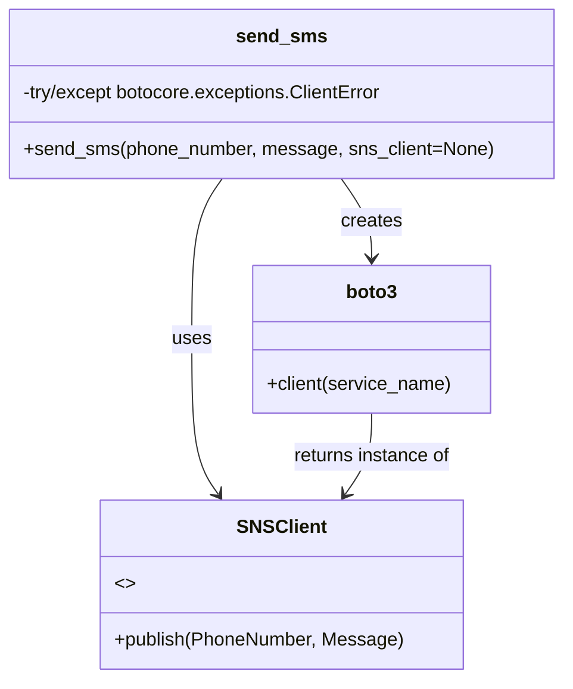

# Diagram: application_service/container_tracking_app_service/common/aws/sns.py


> Auto-generated by Obscura crawlers

## Diagram 1

```mermaid
flowchart TD
    Start([send_sms(phone_number, message, sns_client=None)]) --> Check{sns_client provided?}
    Check -- Yes --> UseProvided[Use provided sns_client]
    Check -- No --> Create[Create sns_client = boto3.client("sns")]
    UseProvided --> Publish[Call sns_client.publish(PhoneNumber, Message)]
    Create --> Publish
    Publish --> Success([Publish succeeded])
    Publish -.-> Error[ClientError caught\nlogging.error("Could not publish SMS: ...")]
    Error --> End([Exit])
    Success --> End([Exit])
```

> SVG rendering failed for this diagram.

## Diagram 2



### SVG

<svg id="container" width="474.1328125" xmlns="http://www.w3.org/2000/svg" class="classDiagram" height="578" viewBox="0 0 474.1328125 578" role="graphics-document document" aria-roledescription="class"><style>#container{font-family:"trebuchet ms",verdana,arial,sans-serif;font-size:16px;fill:#333;}@keyframes edge-animation-frame{from{stroke-dashoffset:0;}}@keyframes dash{to{stroke-dashoffset:0;}}#container .edge-animation-slow{stroke-dasharray:9,5!important;stroke-dashoffset:900;animation:dash 50s linear infinite;stroke-linecap:round;}#container .edge-animation-fast{stroke-dasharray:9,5!important;stroke-dashoffset:900;animation:dash 20s linear infinite;stroke-linecap:round;}#container .error-icon{fill:#552222;}#container .error-text{fill:#552222;stroke:#552222;}#container .edge-thickness-normal{stroke-width:1px;}#container .edge-thickness-thick{stroke-width:3.5px;}#container .edge-pattern-solid{stroke-dasharray:0;}#container .edge-thickness-invisible{stroke-width:0;fill:none;}#container .edge-pattern-dashed{stroke-dasharray:3;}#container .edge-pattern-dotted{stroke-dasharray:2;}#container .marker{fill:#333333;stroke:#333333;}#container .marker.cross{stroke:#333333;}#container svg{font-family:"trebuchet ms",verdana,arial,sans-serif;font-size:16px;}#container p{margin:0;}#container g.classGroup text{fill:#9370DB;stroke:none;font-family:"trebuchet ms",verdana,arial,sans-serif;font-size:10px;}#container g.classGroup text .title{font-weight:bolder;}#container .nodeLabel,#container .edgeLabel{color:#131300;}#container .edgeLabel .label rect{fill:#ECECFF;}#container .label text{fill:#131300;}#container .labelBkg{background:#ECECFF;}#container .edgeLabel .label span{background:#ECECFF;}#container .classTitle{font-weight:bolder;}#container .node rect,#container .node circle,#container .node ellipse,#container .node polygon,#container .node path{fill:#ECECFF;stroke:#9370DB;stroke-width:1px;}#container .divider{stroke:#9370DB;stroke-width:1;}#container g.clickable{cursor:pointer;}#container g.classGroup rect{fill:#ECECFF;stroke:#9370DB;}#container g.classGroup line{stroke:#9370DB;stroke-width:1;}#container .classLabel .box{stroke:none;stroke-width:0;fill:#ECECFF;opacity:0.5;}#container .classLabel .label{fill:#9370DB;font-size:10px;}#container .relation{stroke:#333333;stroke-width:1;fill:none;}#container .dashed-line{stroke-dasharray:3;}#container .dotted-line{stroke-dasharray:1 2;}#container #compositionStart,#container .composition{fill:#333333!important;stroke:#333333!important;stroke-width:1;}#container #compositionEnd,#container .composition{fill:#333333!important;stroke:#333333!important;stroke-width:1;}#container #dependencyStart,#container .dependency{fill:#333333!important;stroke:#333333!important;stroke-width:1;}#container #dependencyStart,#container .dependency{fill:#333333!important;stroke:#333333!important;stroke-width:1;}#container #extensionStart,#container .extension{fill:transparent!important;stroke:#333333!important;stroke-width:1;}#container #extensionEnd,#container .extension{fill:transparent!important;stroke:#333333!important;stroke-width:1;}#container #aggregationStart,#container .aggregation{fill:transparent!important;stroke:#333333!important;stroke-width:1;}#container #aggregationEnd,#container .aggregation{fill:transparent!important;stroke:#333333!important;stroke-width:1;}#container #lollipopStart,#container .lollipop{fill:#ECECFF!important;stroke:#333333!important;stroke-width:1;}#container #lollipopEnd,#container .lollipop{fill:#ECECFF!important;stroke:#333333!important;stroke-width:1;}#container .edgeTerminals{font-size:11px;line-height:initial;}#container .classTitleText{text-anchor:middle;font-size:18px;fill:#333;}#container .label-icon{display:inline-block;height:1em;overflow:visible;vertical-align:-0.125em;}#container .node .label-icon path{fill:currentColor;stroke:revert;stroke-width:revert;}#container :root{--mermaid-font-family:"trebuchet ms",verdana,arial,sans-serif;}</style><g><defs><marker id="container_class-aggregationStart" class="marker aggregation class" refX="18" refY="7" markerWidth="190" markerHeight="240" orient="auto"><path d="M 18,7 L9,13 L1,7 L9,1 Z"></path></marker></defs><defs><marker id="container_class-aggregationEnd" class="marker aggregation class" refX="1" refY="7" markerWidth="20" markerHeight="28" orient="auto"><path d="M 18,7 L9,13 L1,7 L9,1 Z"></path></marker></defs><defs><marker id="container_class-extensionStart" class="marker extension class" refX="18" refY="7" markerWidth="190" markerHeight="240" orient="auto"><path d="M 1,7 L18,13 V 1 Z"></path></marker></defs><defs><marker id="container_class-extensionEnd" class="marker extension class" refX="1" refY="7" markerWidth="20" markerHeight="28" orient="auto"><path d="M 1,1 V 13 L18,7 Z"></path></marker></defs><defs><marker id="container_class-compositionStart" class="marker composition class" refX="18" refY="7" markerWidth="190" markerHeight="240" orient="auto"><path d="M 18,7 L9,13 L1,7 L9,1 Z"></path></marker></defs><defs><marker id="container_class-compositionEnd" class="marker composition class" refX="1" refY="7" markerWidth="20" markerHeight="28" orient="auto"><path d="M 18,7 L9,13 L1,7 L9,1 Z"></path></marker></defs><defs><marker id="container_class-dependencyStart" class="marker dependency class" refX="6" refY="7" markerWidth="190" markerHeight="240" orient="auto"><path d="M 5,7 L9,13 L1,7 L9,1 Z"></path></marker></defs><defs><marker id="container_class-dependencyEnd" class="marker dependency class" refX="13" refY="7" markerWidth="20" markerHeight="28" orient="auto"><path d="M 18,7 L9,13 L14,7 L9,1 Z"></path></marker></defs><defs><marker id="container_class-lollipopStart" class="marker lollipop class" refX="13" refY="7" markerWidth="190" markerHeight="240" orient="auto"><circle stroke="black" fill="transparent" cx="7" cy="7" r="6"></circle></marker></defs><defs><marker id="container_class-lollipopEnd" class="marker lollipop class" refX="1" refY="7" markerWidth="190" markerHeight="240" orient="auto"><circle stroke="black" fill="transparent" cx="7" cy="7" r="6"></circle></marker></defs><g class="root"><g class="clusters"></g><g class="edgePaths"><path d="M287.672,152L292.006,158.167C296.341,164.333,305.009,176.667,309.343,188C313.678,199.333,313.678,209.667,313.678,214.833L313.678,220" id="id_send_sms_boto3_1" class="edge-thickness-normal edge-pattern-solid relation" style=";;;" data-edge="true" data-et="edge" data-id="id_send_sms_boto3_1" data-points="W3sieCI6Mjg3LjY3MjA1NDE4NTc3OTgsInkiOjE1Mn0seyJ4IjozMTMuNjc3NzM0Mzc1LCJ5IjoxODl9LHsieCI6MzEzLjY3NzczNDM3NSwieSI6MjI2fV0=" marker-end="url(#container_class-dependencyEnd)"></path><path d="M186.461,152L182.126,158.167C177.792,164.333,169.124,176.667,164.789,199.5C160.455,222.333,160.455,255.667,160.455,289C160.455,322.333,160.455,355.667,164.214,377.682C167.974,399.697,175.492,410.394,179.251,415.743L183.011,421.091" id="id_send_sms_SNSClient_2" class="edge-thickness-normal edge-pattern-solid relation" style=";;;" data-edge="true" data-et="edge" data-id="id_send_sms_SNSClient_2" data-points="W3sieCI6MTg2LjQ2MDc1ODMxNDIyMDIsInkiOjE1Mn0seyJ4IjoxNjAuNDU1MDc4MTI1LCJ5IjoxODl9LHsieCI6MTYwLjQ1NTA3ODEyNSwieSI6Mjg5fSx7IngiOjE2MC40NTUwNzgxMjUsInkiOjM4OX0seyJ4IjoxODYuNDYwNzU4MzE0MjIwMiwieSI6NDI2fV0=" marker-end="url(#container_class-dependencyEnd)"></path><path d="M313.678,352L313.678,358.167C313.678,364.333,313.678,376.667,309.918,388.182C306.159,399.697,298.641,410.394,294.881,415.743L291.122,421.091" id="id_boto3_SNSClient_3" class="edge-thickness-normal edge-pattern-solid relation" style=";;;" data-edge="true" data-et="edge" data-id="id_boto3_SNSClient_3" data-points="W3sieCI6MzEzLjY3NzczNDM3NSwieSI6MzUyfSx7IngiOjMxMy42Nzc3MzQzNzUsInkiOjM4OX0seyJ4IjoyODcuNjcyMDU0MTg1Nzc5OCwieSI6NDI2fV0=" marker-end="url(#container_class-dependencyEnd)"></path></g><g class="edgeLabels"><g class="edgeLabel" transform="translate(313.677734375, 189)"><g class="label" data-id="id_send_sms_boto3_1" transform="translate(-26.171875, -12)"><foreignObject width="52.34375" height="24"><div xmlns="http://www.w3.org/1999/xhtml" class="labelBkg" style="display: table-cell; white-space: nowrap; line-height: 1.5; max-width: 200px; text-align: center;"><span class="edgeLabel"><p>creates</p></span></div></foreignObject></g></g><g class="edgeLabel" transform="translate(160.455078125, 289)"><g class="label" data-id="id_send_sms_SNSClient_2" transform="translate(-16.4921875, -12)"><foreignObject width="32.984375" height="24"><div xmlns="http://www.w3.org/1999/xhtml" class="labelBkg" style="display: table-cell; white-space: nowrap; line-height: 1.5; max-width: 200px; text-align: center;"><span class="edgeLabel"><p>uses</p></span></div></foreignObject></g></g><g class="edgeLabel" transform="translate(313.677734375, 389)"><g class="label" data-id="id_boto3_SNSClient_3" transform="translate(-68.4375, -12)"><foreignObject width="136.875" height="24"><div xmlns="http://www.w3.org/1999/xhtml" class="labelBkg" style="display: table-cell; white-space: nowrap; line-height: 1.5; max-width: 200px; text-align: center;"><span class="edgeLabel"><p>returns instance of</p></span></div></foreignObject></g></g></g><g class="nodes"><g class="node default" id="classId-send_sms-0" transform="translate(237.06640625, 80)"><g class="basic label-container"><path d="M-229.06640625 -72 L229.06640625 -72 L229.06640625 72 L-229.06640625 72" stroke="none" stroke-width="0" fill="#ECECFF" style=""></path><path d="M-229.06640625 -72 C-135.36881311107174 -72, -41.67121997214349 -72, 229.06640625 -72 M-229.06640625 -72 C-134.44379896743123 -72, -39.8211916848625 -72, 229.06640625 -72 M229.06640625 -72 C229.06640625 -25.08671595187019, 229.06640625 21.82656809625962, 229.06640625 72 M229.06640625 -72 C229.06640625 -17.86952219393801, 229.06640625 36.26095561212398, 229.06640625 72 M229.06640625 72 C106.61967803736712 72, -15.827050175265754 72, -229.06640625 72 M229.06640625 72 C70.7289084309055 72, -87.60858938818899 72, -229.06640625 72 M-229.06640625 72 C-229.06640625 40.501583535044674, -229.06640625 9.003167070089347, -229.06640625 -72 M-229.06640625 72 C-229.06640625 41.62104076522875, -229.06640625 11.242081530457497, -229.06640625 -72" stroke="#9370DB" stroke-width="1.3" fill="none" stroke-dasharray="0 0" style=""></path></g><g class="annotation-group text" transform="translate(0, -48)"></g><g class="label-group text" transform="translate(-36.3515625, -48)"><g class="label" style="font-weight: bolder" transform="translate(0,-12)"><foreignObject width="72.703125" height="24"><div xmlns="http://www.w3.org/1999/xhtml" style="display: table-cell; white-space: nowrap; line-height: 1.5; max-width: 122px; text-align: center;"><span class="nodeLabel markdown-node-label" style=""><p>send_sms</p></span></div></foreignObject></g></g><g class="members-group text" transform="translate(-217.06640625, 0)"><g class="label" style="" transform="translate(0,-12)"><foreignObject width="313.21875" height="24"><div xmlns="http://www.w3.org/1999/xhtml" style="display: table-cell; white-space: nowrap; line-height: 1.5; max-width: 371px; text-align: center;"><span class="nodeLabel markdown-node-label" style=""><p>-try/except botocore.exceptions.ClientError</p></span></div></foreignObject></g></g><g class="methods-group text" transform="translate(-217.06640625, 48)"><g class="label" style="" transform="translate(0,-12)"><foreignObject width="397.78125" height="24"><div xmlns="http://www.w3.org/1999/xhtml" style="display: table-cell; white-space: nowrap; line-height: 1.5; max-width: 455px; text-align: center;"><span class="nodeLabel markdown-node-label" style=""><p>+send_sms(phone_number, message, sns_client=None)</p></span></div></foreignObject></g></g><g class="divider" style=""><path d="M-229.06640625 -24 C-75.60427776578817 -24, 77.85785071842366 -24, 229.06640625 -24 M-229.06640625 -24 C-56.56557459682878 -24, 115.93525705634244 -24, 229.06640625 -24" stroke="#9370DB" stroke-width="1.3" fill="none" stroke-dasharray="0 0" style=""></path></g><g class="divider" style=""><path d="M-229.06640625 24 C-50.94907901401152 24, 127.16824822197697 24, 229.06640625 24 M-229.06640625 24 C-101.3465158385038 24, 26.37337457299239 24, 229.06640625 24" stroke="#9370DB" stroke-width="1.3" fill="none" stroke-dasharray="0 0" style=""></path></g></g><g class="node default" id="classId-boto3-1" transform="translate(313.677734375, 289)"><g class="basic label-container"><path d="M-101.73046875 -63 L101.73046875 -63 L101.73046875 63 L-101.73046875 63" stroke="none" stroke-width="0" fill="#ECECFF" style=""></path><path d="M-101.73046875 -63 C-58.38488187311201 -63, -15.039294996224015 -63, 101.73046875 -63 M-101.73046875 -63 C-54.038794636608465 -63, -6.34712052321693 -63, 101.73046875 -63 M101.73046875 -63 C101.73046875 -13.438647708348498, 101.73046875 36.122704583303005, 101.73046875 63 M101.73046875 -63 C101.73046875 -19.547500692976087, 101.73046875 23.904998614047827, 101.73046875 63 M101.73046875 63 C40.540516890582154 63, -20.649434968835692 63, -101.73046875 63 M101.73046875 63 C52.97695747558548 63, 4.223446201170958 63, -101.73046875 63 M-101.73046875 63 C-101.73046875 18.415667167072264, -101.73046875 -26.16866566585547, -101.73046875 -63 M-101.73046875 63 C-101.73046875 16.4501004362592, -101.73046875 -30.099799127481603, -101.73046875 -63" stroke="#9370DB" stroke-width="1.3" fill="none" stroke-dasharray="0 0" style=""></path></g><g class="annotation-group text" transform="translate(0, -39)"></g><g class="label-group text" transform="translate(-21.0703125, -39)"><g class="label" style="font-weight: bolder" transform="translate(0,-12)"><foreignObject width="42.140625" height="24"><div xmlns="http://www.w3.org/1999/xhtml" style="display: table-cell; white-space: nowrap; line-height: 1.5; max-width: 91px; text-align: center;"><span class="nodeLabel markdown-node-label" style=""><p>boto3</p></span></div></foreignObject></g></g><g class="members-group text" transform="translate(-89.73046875, 9)"></g><g class="methods-group text" transform="translate(-89.73046875, 39)"><g class="label" style="" transform="translate(0,-12)"><foreignObject width="158.390625" height="24"><div xmlns="http://www.w3.org/1999/xhtml" style="display: table-cell; white-space: nowrap; line-height: 1.5; max-width: 216px; text-align: center;"><span class="nodeLabel markdown-node-label" style=""><p>+client(service_name)</p></span></div></foreignObject></g></g><g class="divider" style=""><path d="M-101.73046875 -15 C-41.0201291558437 -15, 19.690210438312604 -15, 101.73046875 -15 M-101.73046875 -15 C-56.773550933266456 -15, -11.816633116532913 -15, 101.73046875 -15" stroke="#9370DB" stroke-width="1.3" fill="none" stroke-dasharray="0 0" style=""></path></g><g class="divider" style=""><path d="M-101.73046875 9 C-32.47725928824306 9, 36.77595017351388 9, 101.73046875 9 M-101.73046875 9 C-34.03794348924768 9, 33.65458177150464 9, 101.73046875 9" stroke="#9370DB" stroke-width="1.3" fill="none" stroke-dasharray="0 0" style=""></path></g></g><g class="node default" id="classId-SNSClient-2" transform="translate(237.06640625, 498)"><g class="basic label-container"><path d="M-152.265625 -72 L152.265625 -72 L152.265625 72 L-152.265625 72" stroke="none" stroke-width="0" fill="#ECECFF" style=""></path><path d="M-152.265625 -72 C-49.64603523762213 -72, 52.97355452475574 -72, 152.265625 -72 M-152.265625 -72 C-41.65904045527742 -72, 68.94754408944516 -72, 152.265625 -72 M152.265625 -72 C152.265625 -35.57821665656412, 152.265625 0.8435666868717533, 152.265625 72 M152.265625 -72 C152.265625 -15.27387116627937, 152.265625 41.45225766744126, 152.265625 72 M152.265625 72 C48.699377842069254 72, -54.86686931586149 72, -152.265625 72 M152.265625 72 C47.25502081854553 72, -57.755583362908936 72, -152.265625 72 M-152.265625 72 C-152.265625 23.300881192578203, -152.265625 -25.398237614843595, -152.265625 -72 M-152.265625 72 C-152.265625 20.405294964021103, -152.265625 -31.189410071957795, -152.265625 -72" stroke="#9370DB" stroke-width="1.3" fill="none" stroke-dasharray="0 0" style=""></path></g><g class="annotation-group text" transform="translate(0, -48)"></g><g class="label-group text" transform="translate(-35.734375, -48)"><g class="label" style="font-weight: bolder" transform="translate(0,-12)"><foreignObject width="71.46875" height="24"><div xmlns="http://www.w3.org/1999/xhtml" style="display: table-cell; white-space: nowrap; line-height: 1.5; max-width: 120px; text-align: center;"><span class="nodeLabel markdown-node-label" style=""><p>SNSClient</p></span></div></foreignObject></g></g><g class="members-group text" transform="translate(-140.265625, 0)"><g class="label" style="" transform="translate(0,-12)"><foreignObject width="16.015625" height="24"><div xmlns="http://www.w3.org/1999/xhtml" style="display: table-cell; white-space: nowrap; line-height: 1.5; max-width: 106px; text-align: center;"><span class="nodeLabel markdown-node-label" style=""><p>&lt;&gt;</p></span></div></foreignObject></g></g><g class="methods-group text" transform="translate(-140.265625, 48)"><g class="label" style="" transform="translate(0,-12)"><foreignObject width="244.796875" height="24"><div xmlns="http://www.w3.org/1999/xhtml" style="display: table-cell; white-space: nowrap; line-height: 1.5; max-width: 302px; text-align: center;"><span class="nodeLabel markdown-node-label" style=""><p>+publish(PhoneNumber, Message)</p></span></div></foreignObject></g></g><g class="divider" style=""><path d="M-152.265625 -24 C-58.83607445496 -24, 34.59347609008 -24, 152.265625 -24 M-152.265625 -24 C-66.9214402178682 -24, 18.42274456426361 -24, 152.265625 -24" stroke="#9370DB" stroke-width="1.3" fill="none" stroke-dasharray="0 0" style=""></path></g><g class="divider" style=""><path d="M-152.265625 24 C-82.67601239651457 24, -13.08639979302913 24, 152.265625 24 M-152.265625 24 C-91.01546067566622 24, -29.765296351332438 24, 152.265625 24" stroke="#9370DB" stroke-width="1.3" fill="none" stroke-dasharray="0 0" style=""></path></g></g></g></g></g></svg>
