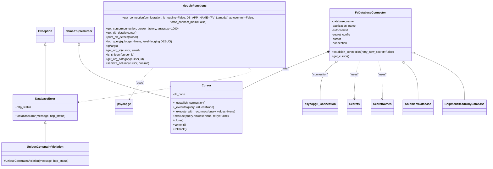

# Diagram: application_service/container_tracking_app_service/common/db/__init__.py


> Auto-generated by Obscura crawlers

## Diagram 1



### SVG

<svg id="container" width="2633.583984375" xmlns="http://www.w3.org/2000/svg" class="classDiagram" height="896" viewBox="0 0 2633.583984375 896" role="graphics-document document" aria-roledescription="class"><style>#container{font-family:"trebuchet ms",verdana,arial,sans-serif;font-size:16px;fill:#333;}@keyframes edge-animation-frame{from{stroke-dashoffset:0;}}@keyframes dash{to{stroke-dashoffset:0;}}#container .edge-animation-slow{stroke-dasharray:9,5!important;stroke-dashoffset:900;animation:dash 50s linear infinite;stroke-linecap:round;}#container .edge-animation-fast{stroke-dasharray:9,5!important;stroke-dashoffset:900;animation:dash 20s linear infinite;stroke-linecap:round;}#container .error-icon{fill:#552222;}#container .error-text{fill:#552222;stroke:#552222;}#container .edge-thickness-normal{stroke-width:1px;}#container .edge-thickness-thick{stroke-width:3.5px;}#container .edge-pattern-solid{stroke-dasharray:0;}#container .edge-thickness-invisible{stroke-width:0;fill:none;}#container .edge-pattern-dashed{stroke-dasharray:3;}#container .edge-pattern-dotted{stroke-dasharray:2;}#container .marker{fill:#333333;stroke:#333333;}#container .marker.cross{stroke:#333333;}#container svg{font-family:"trebuchet ms",verdana,arial,sans-serif;font-size:16px;}#container p{margin:0;}#container g.classGroup text{fill:#9370DB;stroke:none;font-family:"trebuchet ms",verdana,arial,sans-serif;font-size:10px;}#container g.classGroup text .title{font-weight:bolder;}#container .nodeLabel,#container .edgeLabel{color:#131300;}#container .edgeLabel .label rect{fill:#ECECFF;}#container .label text{fill:#131300;}#container .labelBkg{background:#ECECFF;}#container .edgeLabel .label span{background:#ECECFF;}#container .classTitle{font-weight:bolder;}#container .node rect,#container .node circle,#container .node ellipse,#container .node polygon,#container .node path{fill:#ECECFF;stroke:#9370DB;stroke-width:1px;}#container .divider{stroke:#9370DB;stroke-width:1;}#container g.clickable{cursor:pointer;}#container g.classGroup rect{fill:#ECECFF;stroke:#9370DB;}#container g.classGroup line{stroke:#9370DB;stroke-width:1;}#container .classLabel .box{stroke:none;stroke-width:0;fill:#ECECFF;opacity:0.5;}#container .classLabel .label{fill:#9370DB;font-size:10px;}#container .relation{stroke:#333333;stroke-width:1;fill:none;}#container .dashed-line{stroke-dasharray:3;}#container .dotted-line{stroke-dasharray:1 2;}#container #compositionStart,#container .composition{fill:#333333!important;stroke:#333333!important;stroke-width:1;}#container #compositionEnd,#container .composition{fill:#333333!important;stroke:#333333!important;stroke-width:1;}#container #dependencyStart,#container .dependency{fill:#333333!important;stroke:#333333!important;stroke-width:1;}#container #dependencyStart,#container .dependency{fill:#333333!important;stroke:#333333!important;stroke-width:1;}#container #extensionStart,#container .extension{fill:transparent!important;stroke:#333333!important;stroke-width:1;}#container #extensionEnd,#container .extension{fill:transparent!important;stroke:#333333!important;stroke-width:1;}#container #aggregationStart,#container .aggregation{fill:transparent!important;stroke:#333333!important;stroke-width:1;}#container #aggregationEnd,#container .aggregation{fill:transparent!important;stroke:#333333!important;stroke-width:1;}#container #lollipopStart,#container .lollipop{fill:#ECECFF!important;stroke:#333333!important;stroke-width:1;}#container #lollipopEnd,#container .lollipop{fill:#ECECFF!important;stroke:#333333!important;stroke-width:1;}#container .edgeTerminals{font-size:11px;line-height:initial;}#container .classTitleText{text-anchor:middle;font-size:18px;fill:#333;}#container .label-icon{display:inline-block;height:1em;overflow:visible;vertical-align:-0.125em;}#container .node .label-icon path{fill:currentColor;stroke:revert;stroke-width:revert;}#container :root{--mermaid-font-family:"trebuchet ms",verdana,arial,sans-serif;}</style><g><defs><marker id="container_class-aggregationStart" class="marker aggregation class" refX="18" refY="7" markerWidth="190" markerHeight="240" orient="auto"><path d="M 18,7 L9,13 L1,7 L9,1 Z"></path></marker></defs><defs><marker id="container_class-aggregationEnd" class="marker aggregation class" refX="1" refY="7" markerWidth="20" markerHeight="28" orient="auto"><path d="M 18,7 L9,13 L1,7 L9,1 Z"></path></marker></defs><defs><marker id="container_class-extensionStart" class="marker extension class" refX="18" refY="7" markerWidth="190" markerHeight="240" orient="auto"><path d="M 1,7 L18,13 V 1 Z"></path></marker></defs><defs><marker id="container_class-extensionEnd" class="marker extension class" refX="1" refY="7" markerWidth="20" markerHeight="28" orient="auto"><path d="M 1,1 V 13 L18,7 Z"></path></marker></defs><defs><marker id="container_class-compositionStart" class="marker composition class" refX="18" refY="7" markerWidth="190" markerHeight="240" orient="auto"><path d="M 18,7 L9,13 L1,7 L9,1 Z"></path></marker></defs><defs><marker id="container_class-compositionEnd" class="marker composition class" refX="1" refY="7" markerWidth="20" markerHeight="28" orient="auto"><path d="M 18,7 L9,13 L1,7 L9,1 Z"></path></marker></defs><defs><marker id="container_class-dependencyStart" class="marker dependency class" refX="6" refY="7" markerWidth="190" markerHeight="240" orient="auto"><path d="M 5,7 L9,13 L1,7 L9,1 Z"></path></marker></defs><defs><marker id="container_class-dependencyEnd" class="marker dependency class" refX="13" refY="7" markerWidth="20" markerHeight="28" orient="auto"><path d="M 18,7 L9,13 L14,7 L9,1 Z"></path></marker></defs><defs><marker id="container_class-lollipopStart" class="marker lollipop class" refX="13" refY="7" markerWidth="190" markerHeight="240" orient="auto"><circle stroke="black" fill="transparent" cx="7" cy="7" r="6"></circle></marker></defs><defs><marker id="container_class-lollipopEnd" class="marker lollipop class" refX="1" refY="7" markerWidth="190" markerHeight="240" orient="auto"><circle stroke="black" fill="transparent" cx="7" cy="7" r="6"></circle></marker></defs><g class="root"><g class="clusters"></g><g class="edgePaths"><path d="M249.953,238.25L249.953,263.042C249.953,287.833,249.953,337.417,249.953,380.375C249.953,423.333,249.953,459.667,249.953,477.833L249.953,496" id="id_Exception_DatabaseError_1" class="edge-thickness-normal edge-pattern-solid relation" style=";;;" data-edge="true" data-et="edge" data-id="id_Exception_DatabaseError_1" data-points="W3sieCI6MjQ5Ljk1MzEyNSwieSI6MjIxfSx7IngiOjI0OS45NTMxMjUsInkiOjM4N30seyJ4IjoyNDkuOTUzMTI1LCJ5Ijo0OTZ9XQ==" marker-start="url(#container_class-extensionStart)"></path><path d="M249.953,657.25L249.953,670.542C249.953,683.833,249.953,710.417,249.953,727.875C249.953,745.333,249.953,753.667,249.953,757.833L249.953,762" id="id_DatabaseError_UniqueConstraintViolation_2" class="edge-thickness-normal edge-pattern-solid relation" style=";;;" data-edge="true" data-et="edge" data-id="id_DatabaseError_UniqueConstraintViolation_2" data-points="W3sieCI6MjQ5Ljk1MzEyNSwieSI6NjQwfSx7IngiOjI0OS45NTMxMjUsInkiOjczN30seyJ4IjoyNDkuOTUzMTI1LCJ5Ijo3NjJ9XQ==" marker-start="url(#container_class-extensionStart)"></path><path d="M429.336,238.25L429.336,263.042C429.336,287.833,429.336,337.417,512.198,383.878C595.06,430.34,760.784,473.68,843.646,495.35L926.508,517.02" id="id_NamedTupleCursor_Cursor_3" class="edge-thickness-normal edge-pattern-solid relation" style=";;;" data-edge="true" data-et="edge" data-id="id_NamedTupleCursor_Cursor_3" data-points="W3sieCI6NDI5LjMzNTkzNzUsInkiOjIyMX0seyJ4Ijo0MjkuMzM1OTM3NSwieSI6Mzg3fSx7IngiOjkyNi41MDc4MTI1LCJ5Ijo1MTcuMDIwMDY5OTg1MzI1N31d" marker-start="url(#container_class-extensionStart)"></path><path d="M1774.565,270.548L1724.025,289.957C1673.485,309.365,1572.406,348.183,1496.042,380.951C1419.678,413.718,1368.031,440.437,1342.207,453.796L1316.383,467.155" id="id_FvDatabaseConnector_Cursor_4" class="edge-thickness-normal edge-pattern-solid relation" style=";;;" data-edge="true" data-et="edge" data-id="id_FvDatabaseConnector_Cursor_4" data-points="W3sieCI6MTc5MC42Njc5Njg3NSwieSI6MjY0LjM2Mzc1ODY0MDk1ODA1fSx7IngiOjE0NzEuMzI2MTcxODc1LCJ5IjozODd9LHsieCI6MTMxNi4zODI4MTI1LCJ5Ijo0NjcuMTU1MTM2NTE0MTAzNTZ9XQ==" marker-start="url(#container_class-compositionStart)"></path><path d="M1810.947,333.479L1799.282,342.399C1787.618,351.319,1764.288,369.16,1752.624,401.246C1740.959,433.333,1740.959,479.667,1740.959,502.833L1740.959,526" id="id_FvDatabaseConnector_psycopg2_Connection_5" class="edge-thickness-normal edge-pattern-solid relation" style=";;;" data-edge="true" data-et="edge" data-id="id_FvDatabaseConnector_psycopg2_Connection_5" data-points="W3sieCI6MTgyNC42NDk0ODkxODI2OTI0LCJ5IjozMjN9LHsieCI6MTc0MC45NTg5ODQzNzUsInkiOjM4N30seyJ4IjoxNzQwLjk1ODk4NDM3NSwieSI6NTI2fV0=" marker-start="url(#container_class-aggregationStart)"></path><path d="M1949.584,323L1944.89,333.667C1940.196,344.333,1930.808,365.667,1926.114,398.5C1921.42,431.333,1921.42,475.667,1921.42,497.833L1921.42,520" id="id_FvDatabaseConnector_Secrets_6" class="edge-thickness-normal edge-pattern-dashed relation" style=";;;" data-edge="true" data-et="edge" data-id="id_FvDatabaseConnector_Secrets_6" data-points="W3sieCI6MTk0OS41ODM5ODQzNzUsInkiOjMyM30seyJ4IjoxOTIxLjQxOTkyMTg3NSwieSI6Mzg3fSx7IngiOjE5MjEuNDE5OTIxODc1LCJ5Ijo1MjZ9XQ==" marker-end="url(#container_class-dependencyEnd)"></path><path d="M2052.873,323L2055.83,333.667C2058.787,344.333,2064.701,365.667,2067.658,398.5C2070.615,431.333,2070.615,475.667,2070.615,497.833L2070.615,520" id="id_FvDatabaseConnector_SecretNames_7" class="edge-thickness-normal edge-pattern-dashed relation" style=";;;" data-edge="true" data-et="edge" data-id="id_FvDatabaseConnector_SecretNames_7" data-points="W3sieCI6MjA1Mi44NzMwNDY4NzUsInkiOjMyM30seyJ4IjoyMDcwLjYxNTIzNDM3NSwieSI6Mzg3fSx7IngiOjIwNzAuNjE1MjM0Mzc1LCJ5Ijo1MjZ9XQ==" marker-end="url(#container_class-dependencyEnd)"></path><path d="M2198.553,334.06L2209.114,342.883C2219.675,351.706,2240.798,369.353,2251.359,401.343C2261.92,433.333,2261.92,479.667,2261.92,502.833L2261.92,526" id="id_FvDatabaseConnector_ShipmentDatabase_8" class="edge-thickness-normal edge-pattern-solid relation" style=";;;" data-edge="true" data-et="edge" data-id="id_FvDatabaseConnector_ShipmentDatabase_8" data-points="W3sieCI6MjE4NS4zMTQ3NTM2MDU3NjksInkiOjMyM30seyJ4IjoyMjYxLjkxOTkyMTg3NSwieSI6Mzg3fSx7IngiOjIyNjEuOTE5OTIxODc1LCJ5Ijo1MjZ9XQ==" marker-start="url(#container_class-extensionStart)"></path><path d="M2251.148,278.801L2294.188,296.834C2337.228,314.867,2423.309,350.934,2466.349,392.133C2509.389,433.333,2509.389,479.667,2509.389,502.833L2509.389,526" id="id_FvDatabaseConnector_ShipmentReadOnlyDatabase_9" class="edge-thickness-normal edge-pattern-solid relation" style=";;;" data-edge="true" data-et="edge" data-id="id_FvDatabaseConnector_ShipmentReadOnlyDatabase_9" data-points="W3sieCI6MjIzNS4yMzgyODEyNSwieSI6MjcyLjEzNDU3MjYzNjk2MjczfSx7IngiOjI1MDkuMzg4NjcxODc1LCJ5IjozODd9LHsieCI6MjUwOS4zODg2NzE4NzUsInkiOjUyNn1d" marker-start="url(#container_class-extensionStart)"></path><path d="M835.747,350L827.841,356.167C819.935,362.333,804.124,374.667,782.366,403.15C760.608,431.634,732.903,476.268,719.051,498.585L705.199,520.902" id="id_ModuleFunctions_psycopg2_10" class="edge-thickness-normal edge-pattern-dashed relation" style=";;;" data-edge="true" data-et="edge" data-id="id_ModuleFunctions_psycopg2_10" data-points="W3sieCI6ODM1Ljc0NjU0NDQ3MTE1MzgsInkiOjM1MH0seyJ4Ijo3ODguMzEyNSwieSI6Mzg3fSx7IngiOjcwMi4wMzQ0NjU2NDIyNjUyLCJ5Ijo1MjZ9XQ==" marker-end="url(#container_class-dependencyEnd)"></path><path d="M1342.611,350L1352.984,356.167C1363.357,362.333,1384.103,374.667,1232.227,406.262C1080.35,437.857,755.85,488.714,593.6,514.142L431.35,539.571" id="id_ModuleFunctions_DatabaseError_11" class="edge-thickness-normal edge-pattern-dashed relation" style=";;;" data-edge="true" data-et="edge" data-id="id_ModuleFunctions_DatabaseError_11" data-points="W3sieCI6MTM0Mi42MTExODcyNzQ2Mzk0LCJ5IjozNTB9LHsieCI6MTQwNC44NDk2MDkzNzUsInkiOjM4N30seyJ4Ijo0MjUuNDIxODc1LCJ5Ijo1NDAuNDk5ODM1MTExMDMzN31d" marker-end="url(#container_class-dependencyEnd)"></path></g><g class="edgeLabels"><g class="edgeLabel"><g class="label" data-id="id_Exception_DatabaseError_1" transform="translate(0, 0)"><foreignObject width="0" height="0"><div xmlns="http://www.w3.org/1999/xhtml" class="labelBkg" style="display: table-cell; white-space: nowrap; line-height: 1.5; max-width: 200px; text-align: center;"><span class="edgeLabel"></span></div></foreignObject></g></g><g class="edgeLabel"><g class="label" data-id="id_DatabaseError_UniqueConstraintViolation_2" transform="translate(0, 0)"><foreignObject width="0" height="0"><div xmlns="http://www.w3.org/1999/xhtml" class="labelBkg" style="display: table-cell; white-space: nowrap; line-height: 1.5; max-width: 200px; text-align: center;"><span class="edgeLabel"></span></div></foreignObject></g></g><g class="edgeLabel"><g class="label" data-id="id_NamedTupleCursor_Cursor_3" transform="translate(0, 0)"><foreignObject width="0" height="0"><div xmlns="http://www.w3.org/1999/xhtml" class="labelBkg" style="display: table-cell; white-space: nowrap; line-height: 1.5; max-width: 200px; text-align: center;"><span class="edgeLabel"></span></div></foreignObject></g></g><g class="edgeLabel" transform="translate(1549.57067, 356.95191)"><g class="label" data-id="id_FvDatabaseConnector_Cursor_4" transform="translate(-18.9609375, -12)"><foreignObject width="37.921875" height="24"><div xmlns="http://www.w3.org/1999/xhtml" class="labelBkg" style="display: table-cell; white-space: nowrap; line-height: 1.5; max-width: 200px; text-align: center;"><span class="edgeLabel"><p>"has"</p></span></div></foreignObject></g></g><g class="edgeLabel" transform="translate(1740.958984375, 387)"><g class="label" data-id="id_FvDatabaseConnector_psycopg2_Connection_5" transform="translate(-46.625, -12)"><foreignObject width="93.25" height="24"><div xmlns="http://www.w3.org/1999/xhtml" class="labelBkg" style="display: table-cell; white-space: nowrap; line-height: 1.5; max-width: 200px; text-align: center;"><span class="edgeLabel"><p>"connection"</p></span></div></foreignObject></g></g><g class="edgeLabel" transform="translate(1921.419921875, 387)"><g class="label" data-id="id_FvDatabaseConnector_Secrets_6" transform="translate(-22.7578125, -12)"><foreignObject width="45.515625" height="24"><div xmlns="http://www.w3.org/1999/xhtml" class="labelBkg" style="display: table-cell; white-space: nowrap; line-height: 1.5; max-width: 200px; text-align: center;"><span class="edgeLabel"><p>"uses"</p></span></div></foreignObject></g></g><g class="edgeLabel" transform="translate(2070.615234375, 387)"><g class="label" data-id="id_FvDatabaseConnector_SecretNames_7" transform="translate(-22.7578125, -12)"><foreignObject width="45.515625" height="24"><div xmlns="http://www.w3.org/1999/xhtml" class="labelBkg" style="display: table-cell; white-space: nowrap; line-height: 1.5; max-width: 200px; text-align: center;"><span class="edgeLabel"><p>"uses"</p></span></div></foreignObject></g></g><g class="edgeLabel"><g class="label" data-id="id_FvDatabaseConnector_ShipmentDatabase_8" transform="translate(0, 0)"><foreignObject width="0" height="0"><div xmlns="http://www.w3.org/1999/xhtml" class="labelBkg" style="display: table-cell; white-space: nowrap; line-height: 1.5; max-width: 200px; text-align: center;"><span class="edgeLabel"></span></div></foreignObject></g></g><g class="edgeLabel"><g class="label" data-id="id_FvDatabaseConnector_ShipmentReadOnlyDatabase_9" transform="translate(0, 0)"><foreignObject width="0" height="0"><div xmlns="http://www.w3.org/1999/xhtml" class="labelBkg" style="display: table-cell; white-space: nowrap; line-height: 1.5; max-width: 200px; text-align: center;"><span class="edgeLabel"></span></div></foreignObject></g></g><g class="edgeLabel" transform="translate(761.03633, 430.94384)"><g class="label" data-id="id_ModuleFunctions_psycopg2_10" transform="translate(-22.7578125, -12)"><foreignObject width="45.515625" height="24"><div xmlns="http://www.w3.org/1999/xhtml" class="labelBkg" style="display: table-cell; white-space: nowrap; line-height: 1.5; max-width: 200px; text-align: center;"><span class="edgeLabel"><p>"uses"</p></span></div></foreignObject></g></g><g class="edgeLabel" transform="translate(950.90213, 458.14447)"><g class="label" data-id="id_ModuleFunctions_DatabaseError_11" transform="translate(-27.515625, -12)"><foreignObject width="55.03125" height="24"><div xmlns="http://www.w3.org/1999/xhtml" class="labelBkg" style="display: table-cell; white-space: nowrap; line-height: 1.5; max-width: 200px; text-align: center;"><span class="edgeLabel"><p>"raises"</p></span></div></foreignObject></g></g></g><g class="nodes"><g class="node default" id="classId-Exception-0" transform="translate(249.953125, 179)"><g class="basic label-container"><path d="M-47.703125 -42 L47.703125 -42 L47.703125 42 L-47.703125 42" stroke="none" stroke-width="0" fill="#ECECFF" style=""></path><path d="M-47.703125 -42 C-22.66196788583729 -42, 2.379189228325423 -42, 47.703125 -42 M-47.703125 -42 C-11.927739079320673 -42, 23.847646841358653 -42, 47.703125 -42 M47.703125 -42 C47.703125 -12.663609627279438, 47.703125 16.672780745441123, 47.703125 42 M47.703125 -42 C47.703125 -19.300575108091884, 47.703125 3.3988497838162317, 47.703125 42 M47.703125 42 C23.903734819457533 42, 0.10434463891506596 42, -47.703125 42 M47.703125 42 C26.698406974370904 42, 5.6936889487418085 42, -47.703125 42 M-47.703125 42 C-47.703125 20.70388177197149, -47.703125 -0.592236456057023, -47.703125 -42 M-47.703125 42 C-47.703125 14.41085970924837, -47.703125 -13.178280581503259, -47.703125 -42" stroke="#9370DB" stroke-width="1.3" fill="none" stroke-dasharray="0 0" style=""></path></g><g class="annotation-group text" transform="translate(0, -18)"></g><g class="label-group text" transform="translate(-35.703125, -18)"><g class="label" style="font-weight: bolder" transform="translate(0,-12)"><foreignObject width="71.40625" height="24"><div xmlns="http://www.w3.org/1999/xhtml" style="display: table-cell; white-space: nowrap; line-height: 1.5; max-width: 121px; text-align: center;"><span class="nodeLabel markdown-node-label" style=""><p>Exception</p></span></div></foreignObject></g></g><g class="members-group text" transform="translate(-35.703125, 30)"></g><g class="methods-group text" transform="translate(-35.703125, 60)"></g><g class="divider" style=""><path d="M-47.703125 6 C-21.031040834961736 6, 5.641043330076528 6, 47.703125 6 M-47.703125 6 C-26.66183836130732 6, -5.620551722614643 6, 47.703125 6" stroke="#9370DB" stroke-width="1.3" fill="none" stroke-dasharray="0 0" style=""></path></g><g class="divider" style=""><path d="M-47.703125 24 C-20.30243653813878 24, 7.098251923722437 24, 47.703125 24 M-47.703125 24 C-19.77241698239105 24, 8.1582910352179 24, 47.703125 24" stroke="#9370DB" stroke-width="1.3" fill="none" stroke-dasharray="0 0" style=""></path></g></g><g class="node default" id="classId-DatabaseError-1" transform="translate(249.953125, 568)"><g class="basic label-container"><path d="M-175.46875 -72 L175.46875 -72 L175.46875 72 L-175.46875 72" stroke="none" stroke-width="0" fill="#ECECFF" style=""></path><path d="M-175.46875 -72 C-87.2776233918311 -72, 0.9135032163378014 -72, 175.46875 -72 M-175.46875 -72 C-89.92308816233493 -72, -4.3774263246698695 -72, 175.46875 -72 M175.46875 -72 C175.46875 -36.5837815990597, 175.46875 -1.167563198119396, 175.46875 72 M175.46875 -72 C175.46875 -42.378543655140355, 175.46875 -12.75708731028071, 175.46875 72 M175.46875 72 C63.357316768390234 72, -48.75411646321953 72, -175.46875 72 M175.46875 72 C99.76207833830254 72, 24.055406676605088 72, -175.46875 72 M-175.46875 72 C-175.46875 16.87681859535917, -175.46875 -38.24636280928166, -175.46875 -72 M-175.46875 72 C-175.46875 18.65871491270847, -175.46875 -34.68257017458306, -175.46875 -72" stroke="#9370DB" stroke-width="1.3" fill="none" stroke-dasharray="0 0" style=""></path></g><g class="annotation-group text" transform="translate(0, -48)"></g><g class="label-group text" transform="translate(-52.359375, -48)"><g class="label" style="font-weight: bolder" transform="translate(0,-12)"><foreignObject width="104.71875" height="24"><div xmlns="http://www.w3.org/1999/xhtml" style="display: table-cell; white-space: nowrap; line-height: 1.5; max-width: 154px; text-align: center;"><span class="nodeLabel markdown-node-label" style=""><p>DatabaseError</p></span></div></foreignObject></g></g><g class="members-group text" transform="translate(-163.46875, 0)"><g class="label" style="" transform="translate(0,-12)"><foreignObject width="90.828125" height="24"><div xmlns="http://www.w3.org/1999/xhtml" style="display: table-cell; white-space: nowrap; line-height: 1.5; max-width: 148px; text-align: center;"><span class="nodeLabel markdown-node-label" style=""><p>+http_status</p></span></div></foreignObject></g></g><g class="methods-group text" transform="translate(-163.46875, 48)"><g class="label" style="" transform="translate(0,-12)"><foreignObject width="274.578125" height="24"><div xmlns="http://www.w3.org/1999/xhtml" style="display: table-cell; white-space: nowrap; line-height: 1.5; max-width: 332px; text-align: center;"><span class="nodeLabel markdown-node-label" style=""><p>+DatabaseError(message, http_status)</p></span></div></foreignObject></g></g><g class="divider" style=""><path d="M-175.46875 -24 C-62.0289178131157 -24, 51.410914373768605 -24, 175.46875 -24 M-175.46875 -24 C-51.151594397391705 -24, 73.16556120521659 -24, 175.46875 -24" stroke="#9370DB" stroke-width="1.3" fill="none" stroke-dasharray="0 0" style=""></path></g><g class="divider" style=""><path d="M-175.46875 24 C-87.86123696891669 24, -0.2537239378333709 24, 175.46875 24 M-175.46875 24 C-97.09676333679023 24, -18.724776673580465 24, 175.46875 24" stroke="#9370DB" stroke-width="1.3" fill="none" stroke-dasharray="0 0" style=""></path></g></g><g class="node default" id="classId-UniqueConstraintViolation-2" transform="translate(249.953125, 825)"><g class="basic label-container"><path d="M-241.953125 -63 L241.953125 -63 L241.953125 63 L-241.953125 63" stroke="none" stroke-width="0" fill="#ECECFF" style=""></path><path d="M-241.953125 -63 C-75.79161075126311 -63, 90.36990349747379 -63, 241.953125 -63 M-241.953125 -63 C-78.49370363376869 -63, 84.96571773246262 -63, 241.953125 -63 M241.953125 -63 C241.953125 -18.78413033933675, 241.953125 25.431739321326504, 241.953125 63 M241.953125 -63 C241.953125 -35.375845092589266, 241.953125 -7.751690185178532, 241.953125 63 M241.953125 63 C105.53147965135634 63, -30.89016569728733 63, -241.953125 63 M241.953125 63 C105.99599570280648 63, -29.961133594387036 63, -241.953125 63 M-241.953125 63 C-241.953125 16.043469879898204, -241.953125 -30.913060240203592, -241.953125 -63 M-241.953125 63 C-241.953125 27.911267152599144, -241.953125 -7.177465694801711, -241.953125 -63" stroke="#9370DB" stroke-width="1.3" fill="none" stroke-dasharray="0 0" style=""></path></g><g class="annotation-group text" transform="translate(0, -39)"></g><g class="label-group text" transform="translate(-96.671875, -39)"><g class="label" style="font-weight: bolder" transform="translate(0,-12)"><foreignObject width="193.34375" height="24"><div xmlns="http://www.w3.org/1999/xhtml" style="display: table-cell; white-space: nowrap; line-height: 1.5; max-width: 242px; text-align: center;"><span class="nodeLabel markdown-node-label" style=""><p>UniqueConstraintViolation</p></span></div></foreignObject></g></g><g class="members-group text" transform="translate(-229.953125, 9)"></g><g class="methods-group text" transform="translate(-229.953125, 39)"><g class="label" style="" transform="translate(0,-12)"><foreignObject width="363.234375" height="24"><div xmlns="http://www.w3.org/1999/xhtml" style="display: table-cell; white-space: nowrap; line-height: 1.5; max-width: 421px; text-align: center;"><span class="nodeLabel markdown-node-label" style=""><p>+UniqueConstraintViolation(message, http_status)</p></span></div></foreignObject></g></g><g class="divider" style=""><path d="M-241.953125 -15 C-97.29011192939777 -15, 47.372901141204466 -15, 241.953125 -15 M-241.953125 -15 C-139.7622505738267 -15, -37.57137614765338 -15, 241.953125 -15" stroke="#9370DB" stroke-width="1.3" fill="none" stroke-dasharray="0 0" style=""></path></g><g class="divider" style=""><path d="M-241.953125 9 C-70.1422592269735 9, 101.66860654605301 9, 241.953125 9 M-241.953125 9 C-57.922581585048164 9, 126.10796182990367 9, 241.953125 9" stroke="#9370DB" stroke-width="1.3" fill="none" stroke-dasharray="0 0" style=""></path></g></g><g class="node default" id="classId-NamedTupleCursor-3" transform="translate(429.3359375, 179)"><g class="basic label-container"><path d="M-81.6796875 -42 L81.6796875 -42 L81.6796875 42 L-81.6796875 42" stroke="none" stroke-width="0" fill="#ECECFF" style=""></path><path d="M-81.6796875 -42 C-28.210167565091893 -42, 25.259352369816213 -42, 81.6796875 -42 M-81.6796875 -42 C-43.80146596107169 -42, -5.923244422143384 -42, 81.6796875 -42 M81.6796875 -42 C81.6796875 -8.424853571133667, 81.6796875 25.150292857732666, 81.6796875 42 M81.6796875 -42 C81.6796875 -16.48884319599664, 81.6796875 9.02231360800672, 81.6796875 42 M81.6796875 42 C34.83599709476758 42, -12.007693310464845 42, -81.6796875 42 M81.6796875 42 C27.90127910030474 42, -25.877129299390518 42, -81.6796875 42 M-81.6796875 42 C-81.6796875 17.882482053217704, -81.6796875 -6.235035893564593, -81.6796875 -42 M-81.6796875 42 C-81.6796875 24.02422787160707, -81.6796875 6.0484557432141415, -81.6796875 -42" stroke="#9370DB" stroke-width="1.3" fill="none" stroke-dasharray="0 0" style=""></path></g><g class="annotation-group text" transform="translate(0, -18)"></g><g class="label-group text" transform="translate(-69.6796875, -18)"><g class="label" style="font-weight: bolder" transform="translate(0,-12)"><foreignObject width="139.359375" height="24"><div xmlns="http://www.w3.org/1999/xhtml" style="display: table-cell; white-space: nowrap; line-height: 1.5; max-width: 189px; text-align: center;"><span class="nodeLabel markdown-node-label" style=""><p>NamedTupleCursor</p></span></div></foreignObject></g></g><g class="members-group text" transform="translate(-69.6796875, 30)"></g><g class="methods-group text" transform="translate(-69.6796875, 60)"></g><g class="divider" style=""><path d="M-81.6796875 6 C-29.46004561452486 6, 22.759596270950283 6, 81.6796875 6 M-81.6796875 6 C-25.841682819098594 6, 29.996321861802812 6, 81.6796875 6" stroke="#9370DB" stroke-width="1.3" fill="none" stroke-dasharray="0 0" style=""></path></g><g class="divider" style=""><path d="M-81.6796875 24 C-27.024562957119592 24, 27.630561585760816 24, 81.6796875 24 M-81.6796875 24 C-27.254639040162992 24, 27.170409419674016 24, 81.6796875 24" stroke="#9370DB" stroke-width="1.3" fill="none" stroke-dasharray="0 0" style=""></path></g></g><g class="node default" id="classId-Cursor-4" transform="translate(1121.4453125, 568)"><g class="basic label-container"><path d="M-194.9375 -144 L194.9375 -144 L194.9375 144 L-194.9375 144" stroke="none" stroke-width="0" fill="#ECECFF" style=""></path><path d="M-194.9375 -144 C-83.45964668911587 -144, 28.018206621768257 -144, 194.9375 -144 M-194.9375 -144 C-107.90746814581135 -144, -20.8774362916227 -144, 194.9375 -144 M194.9375 -144 C194.9375 -75.64311109891047, 194.9375 -7.286222197820933, 194.9375 144 M194.9375 -144 C194.9375 -57.61424311845728, 194.9375 28.771513763085437, 194.9375 144 M194.9375 144 C113.34881523196879 144, 31.76013046393757 144, -194.9375 144 M194.9375 144 C39.38758337959936 144, -116.16233324080127 144, -194.9375 144 M-194.9375 144 C-194.9375 54.04869099992146, -194.9375 -35.90261800015708, -194.9375 -144 M-194.9375 144 C-194.9375 52.28676218018637, -194.9375 -39.426475639627256, -194.9375 -144" stroke="#9370DB" stroke-width="1.3" fill="none" stroke-dasharray="0 0" style=""></path></g><g class="annotation-group text" transform="translate(0, -120)"></g><g class="label-group text" transform="translate(-23.90625, -120)"><g class="label" style="font-weight: bolder" transform="translate(0,-12)"><foreignObject width="47.8125" height="24"><div xmlns="http://www.w3.org/1999/xhtml" style="display: table-cell; white-space: nowrap; line-height: 1.5; max-width: 98px; text-align: center;"><span class="nodeLabel markdown-node-label" style=""><p>Cursor</p></span></div></foreignObject></g></g><g class="members-group text" transform="translate(-182.9375, -72)"><g class="label" style="" transform="translate(0,-12)"><foreignObject width="68.625" height="24"><div xmlns="http://www.w3.org/1999/xhtml" style="display: table-cell; white-space: nowrap; line-height: 1.5; max-width: 126px; text-align: center;"><span class="nodeLabel markdown-node-label" style=""><p>-db_conn</p></span></div></foreignObject></g></g><g class="methods-group text" transform="translate(-182.9375, -24)"><g class="label" style="" transform="translate(0,-12)"><foreignObject width="179.984375" height="24"><div xmlns="http://www.w3.org/1999/xhtml" style="display: table-cell; white-space: nowrap; line-height: 1.5; max-width: 237px; text-align: center;"><span class="nodeLabel markdown-node-label" style=""><p>+_establish_connection()</p></span></div></foreignObject></g><g class="label" style="" transform="translate(0,12)"><foreignObject width="222.859375" height="24"><div xmlns="http://www.w3.org/1999/xhtml" style="display: table-cell; white-space: nowrap; line-height: 1.5; max-width: 280px; text-align: center;"><span class="nodeLabel markdown-node-label" style=""><p>+_execute(query, values=None)</p></span></div></foreignObject></g><g class="label" style="" transform="translate(0,36)"><foreignObject width="341.96875" height="24"><div xmlns="http://www.w3.org/1999/xhtml" style="display: table-cell; white-space: nowrap; line-height: 1.5; max-width: 399px; text-align: center;"><span class="nodeLabel markdown-node-label" style=""><p>+_execute_with_reconnect(query, values=None)</p></span></div></foreignObject></g><g class="label" style="" transform="translate(0,60)"><foreignObject width="302.609375" height="24"><div xmlns="http://www.w3.org/1999/xhtml" style="display: table-cell; white-space: nowrap; line-height: 1.5; max-width: 360px; text-align: center;"><span class="nodeLabel markdown-node-label" style=""><p>+execute(query, values=None, retry=False)</p></span></div></foreignObject></g><g class="label" style="" transform="translate(0,84)"><foreignObject width="56.15625" height="24"><div xmlns="http://www.w3.org/1999/xhtml" style="display: table-cell; white-space: nowrap; line-height: 1.5; max-width: 114px; text-align: center;"><span class="nodeLabel markdown-node-label" style=""><p>+close()</p></span></div></foreignObject></g><g class="label" style="" transform="translate(0,108)"><foreignObject width="72.75" height="24"><div xmlns="http://www.w3.org/1999/xhtml" style="display: table-cell; white-space: nowrap; line-height: 1.5; max-width: 130px; text-align: center;"><span class="nodeLabel markdown-node-label" style=""><p>+commit()</p></span></div></foreignObject></g><g class="label" style="" transform="translate(0,132)"><foreignObject width="76.65625" height="24"><div xmlns="http://www.w3.org/1999/xhtml" style="display: table-cell; white-space: nowrap; line-height: 1.5; max-width: 134px; text-align: center;"><span class="nodeLabel markdown-node-label" style=""><p>+rollback()</p></span></div></foreignObject></g></g><g class="divider" style=""><path d="M-194.9375 -96 C-77.03391028263826 -96, 40.86967943472348 -96, 194.9375 -96 M-194.9375 -96 C-49.673105474933635 -96, 95.59128905013273 -96, 194.9375 -96" stroke="#9370DB" stroke-width="1.3" fill="none" stroke-dasharray="0 0" style=""></path></g><g class="divider" style=""><path d="M-194.9375 -48 C-61.779456050425324 -48, 71.37858789914935 -48, 194.9375 -48 M-194.9375 -48 C-75.41724214043411 -48, 44.103015719131776 -48, 194.9375 -48" stroke="#9370DB" stroke-width="1.3" fill="none" stroke-dasharray="0 0" style=""></path></g></g><g class="node default" id="classId-FvDatabaseConnector-5" transform="translate(2012.953125, 179)"><g class="basic label-container"><path d="M-222.28515625 -144 L222.28515625 -144 L222.28515625 144 L-222.28515625 144" stroke="none" stroke-width="0" fill="#ECECFF" style=""></path><path d="M-222.28515625 -144 C-62.353205909965084 -144, 97.57874443006983 -144, 222.28515625 -144 M-222.28515625 -144 C-87.44230123568724 -144, 47.40055377862552 -144, 222.28515625 -144 M222.28515625 -144 C222.28515625 -29.167789104279535, 222.28515625 85.66442179144093, 222.28515625 144 M222.28515625 -144 C222.28515625 -29.734669582934117, 222.28515625 84.53066083413177, 222.28515625 144 M222.28515625 144 C123.22699085753264 144, 24.168825465065282 144, -222.28515625 144 M222.28515625 144 C111.14726024677078 144, 0.00936424354156884 144, -222.28515625 144 M-222.28515625 144 C-222.28515625 38.132231014236396, -222.28515625 -67.73553797152721, -222.28515625 -144 M-222.28515625 144 C-222.28515625 82.44626796431226, -222.28515625 20.892535928624525, -222.28515625 -144" stroke="#9370DB" stroke-width="1.3" fill="none" stroke-dasharray="0 0" style=""></path></g><g class="annotation-group text" transform="translate(0, -120)"></g><g class="label-group text" transform="translate(-79.3046875, -120)"><g class="label" style="font-weight: bolder" transform="translate(0,-12)"><foreignObject width="158.609375" height="24"><div xmlns="http://www.w3.org/1999/xhtml" style="display: table-cell; white-space: nowrap; line-height: 1.5; max-width: 207px; text-align: center;"><span class="nodeLabel markdown-node-label" style=""><p>FvDatabaseConnector</p></span></div></foreignObject></g></g><g class="members-group text" transform="translate(-210.28515625, -72)"><g class="label" style="" transform="translate(0,-12)"><foreignObject width="121.6875" height="24"><div xmlns="http://www.w3.org/1999/xhtml" style="display: table-cell; white-space: nowrap; line-height: 1.5; max-width: 179px; text-align: center;"><span class="nodeLabel markdown-node-label" style=""><p>-database_name</p></span></div></foreignObject></g><g class="label" style="" transform="translate(0,12)"><foreignObject width="137.15625" height="24"><div xmlns="http://www.w3.org/1999/xhtml" style="display: table-cell; white-space: nowrap; line-height: 1.5; max-width: 195px; text-align: center;"><span class="nodeLabel markdown-node-label" style=""><p>-application_name</p></span></div></foreignObject></g><g class="label" style="" transform="translate(0,36)"><foreignObject width="93.5" height="24"><div xmlns="http://www.w3.org/1999/xhtml" style="display: table-cell; white-space: nowrap; line-height: 1.5; max-width: 151px; text-align: center;"><span class="nodeLabel markdown-node-label" style=""><p>-autocommit</p></span></div></foreignObject></g><g class="label" style="" transform="translate(0,60)"><foreignObject width="102.0625" height="24"><div xmlns="http://www.w3.org/1999/xhtml" style="display: table-cell; white-space: nowrap; line-height: 1.5; max-width: 160px; text-align: center;"><span class="nodeLabel markdown-node-label" style=""><p>-secret_config</p></span></div></foreignObject></g><g class="label" style="" transform="translate(0,84)"><foreignObject width="52.1875" height="24"><div xmlns="http://www.w3.org/1999/xhtml" style="display: table-cell; white-space: nowrap; line-height: 1.5; max-width: 110px; text-align: center;"><span class="nodeLabel markdown-node-label" style=""><p>-cursor</p></span></div></foreignObject></g><g class="label" style="" transform="translate(0,108)"><foreignObject width="87.25" height="24"><div xmlns="http://www.w3.org/1999/xhtml" style="display: table-cell; white-space: nowrap; line-height: 1.5; max-width: 145px; text-align: center;"><span class="nodeLabel markdown-node-label" style=""><p>-connection</p></span></div></foreignObject></g></g><g class="methods-group text" transform="translate(-210.28515625, 96)"><g class="label" style="" transform="translate(0,-12)"><foreignObject width="341.265625" height="24"><div xmlns="http://www.w3.org/1999/xhtml" style="display: table-cell; white-space: nowrap; line-height: 1.5; max-width: 399px; text-align: center;"><span class="nodeLabel markdown-node-label" style=""><p>+establish_connection(retry_new_secret=False)</p></span></div></foreignObject></g><g class="label" style="" transform="translate(0,12)"><foreignObject width="94.640625" height="24"><div xmlns="http://www.w3.org/1999/xhtml" style="display: table-cell; white-space: nowrap; line-height: 1.5; max-width: 152px; text-align: center;"><span class="nodeLabel markdown-node-label" style=""><p>+get_cursor()</p></span></div></foreignObject></g></g><g class="divider" style=""><path d="M-222.28515625 -96 C-74.79593073113469 -96, 72.69329478773062 -96, 222.28515625 -96 M-222.28515625 -96 C-77.52415315833727 -96, 67.23684993332546 -96, 222.28515625 -96" stroke="#9370DB" stroke-width="1.3" fill="none" stroke-dasharray="0 0" style=""></path></g><g class="divider" style=""><path d="M-222.28515625 72 C-51.40133948969719 72, 119.48247727060561 72, 222.28515625 72 M-222.28515625 72 C-63.003814870390016 72, 96.27752650921997 72, 222.28515625 72" stroke="#9370DB" stroke-width="1.3" fill="none" stroke-dasharray="0 0" style=""></path></g></g><g class="node default" id="classId-psycopg2_Connection-6" transform="translate(1740.958984375, 568)"><g class="basic label-container"><path d="M-91.296875 -42 L91.296875 -42 L91.296875 42 L-91.296875 42" stroke="none" stroke-width="0" fill="#ECECFF" style=""></path><path d="M-91.296875 -42 C-31.74380228394282 -42, 27.80927043211436 -42, 91.296875 -42 M-91.296875 -42 C-49.84213192438483 -42, -8.38738884876966 -42, 91.296875 -42 M91.296875 -42 C91.296875 -20.031877331900297, 91.296875 1.9362453361994056, 91.296875 42 M91.296875 -42 C91.296875 -23.289223642491844, 91.296875 -4.578447284983689, 91.296875 42 M91.296875 42 C36.56165876674159 42, -18.173557466516826 42, -91.296875 42 M91.296875 42 C27.234600652279582 42, -36.827673695440836 42, -91.296875 42 M-91.296875 42 C-91.296875 18.520580960004153, -91.296875 -4.958838079991693, -91.296875 -42 M-91.296875 42 C-91.296875 17.649132849210794, -91.296875 -6.701734301578412, -91.296875 -42" stroke="#9370DB" stroke-width="1.3" fill="none" stroke-dasharray="0 0" style=""></path></g><g class="annotation-group text" transform="translate(0, -18)"></g><g class="label-group text" transform="translate(-79.296875, -18)"><g class="label" style="font-weight: bolder" transform="translate(0,-12)"><foreignObject width="158.59375" height="24"><div xmlns="http://www.w3.org/1999/xhtml" style="display: table-cell; white-space: nowrap; line-height: 1.5; max-width: 207px; text-align: center;"><span class="nodeLabel markdown-node-label" style=""><p>psycopg2_Connection</p></span></div></foreignObject></g></g><g class="members-group text" transform="translate(-79.296875, 30)"></g><g class="methods-group text" transform="translate(-79.296875, 60)"></g><g class="divider" style=""><path d="M-91.296875 6 C-25.03345873695281 6, 41.22995752609438 6, 91.296875 6 M-91.296875 6 C-18.816708846235727 6, 53.663457307528546 6, 91.296875 6" stroke="#9370DB" stroke-width="1.3" fill="none" stroke-dasharray="0 0" style=""></path></g><g class="divider" style=""><path d="M-91.296875 24 C-46.303667489441736 24, -1.3104599788834719 24, 91.296875 24 M-91.296875 24 C-31.90234218732337 24, 27.49219062535326 24, 91.296875 24" stroke="#9370DB" stroke-width="1.3" fill="none" stroke-dasharray="0 0" style=""></path></g></g><g class="node default" id="classId-Secrets-7" transform="translate(1921.419921875, 568)"><g class="basic label-container"><path d="M-39.1640625 -42 L39.1640625 -42 L39.1640625 42 L-39.1640625 42" stroke="none" stroke-width="0" fill="#ECECFF" style=""></path><path d="M-39.1640625 -42 C-16.92859835494487 -42, 5.306865790110258 -42, 39.1640625 -42 M-39.1640625 -42 C-17.723357431910994 -42, 3.717347636178012 -42, 39.1640625 -42 M39.1640625 -42 C39.1640625 -16.82816119230783, 39.1640625 8.343677615384337, 39.1640625 42 M39.1640625 -42 C39.1640625 -15.937493145874154, 39.1640625 10.125013708251693, 39.1640625 42 M39.1640625 42 C8.476666790863831 42, -22.210728918272338 42, -39.1640625 42 M39.1640625 42 C20.9866338170711 42, 2.8092051341422035 42, -39.1640625 42 M-39.1640625 42 C-39.1640625 23.34239493153541, -39.1640625 4.684789863070819, -39.1640625 -42 M-39.1640625 42 C-39.1640625 15.90191103511889, -39.1640625 -10.196177929762221, -39.1640625 -42" stroke="#9370DB" stroke-width="1.3" fill="none" stroke-dasharray="0 0" style=""></path></g><g class="annotation-group text" transform="translate(0, -18)"></g><g class="label-group text" transform="translate(-27.1640625, -18)"><g class="label" style="font-weight: bolder" transform="translate(0,-12)"><foreignObject width="54.328125" height="24"><div xmlns="http://www.w3.org/1999/xhtml" style="display: table-cell; white-space: nowrap; line-height: 1.5; max-width: 103px; text-align: center;"><span class="nodeLabel markdown-node-label" style=""><p>Secrets</p></span></div></foreignObject></g></g><g class="members-group text" transform="translate(-27.1640625, 30)"></g><g class="methods-group text" transform="translate(-27.1640625, 60)"></g><g class="divider" style=""><path d="M-39.1640625 6 C-13.967200468037607 6, 11.229661563924786 6, 39.1640625 6 M-39.1640625 6 C-22.06738252516245 6, -4.970702550324901 6, 39.1640625 6" stroke="#9370DB" stroke-width="1.3" fill="none" stroke-dasharray="0 0" style=""></path></g><g class="divider" style=""><path d="M-39.1640625 24 C-9.922515355207526 24, 19.319031789584947 24, 39.1640625 24 M-39.1640625 24 C-17.82614411636464 24, 3.5117742672707166 24, 39.1640625 24" stroke="#9370DB" stroke-width="1.3" fill="none" stroke-dasharray="0 0" style=""></path></g></g><g class="node default" id="classId-SecretNames-8" transform="translate(2070.615234375, 568)"><g class="basic label-container"><path d="M-60.03125 -42 L60.03125 -42 L60.03125 42 L-60.03125 42" stroke="none" stroke-width="0" fill="#ECECFF" style=""></path><path d="M-60.03125 -42 C-26.518426454918455 -42, 6.9943970901630905 -42, 60.03125 -42 M-60.03125 -42 C-27.116146805343632 -42, 5.798956389312735 -42, 60.03125 -42 M60.03125 -42 C60.03125 -22.591147803299638, 60.03125 -3.1822956065992756, 60.03125 42 M60.03125 -42 C60.03125 -22.549121478052044, 60.03125 -3.0982429561040874, 60.03125 42 M60.03125 42 C35.522481994723165 42, 11.01371398944633 42, -60.03125 42 M60.03125 42 C18.57678987567045 42, -22.8776702486591 42, -60.03125 42 M-60.03125 42 C-60.03125 13.342814604446605, -60.03125 -15.31437079110679, -60.03125 -42 M-60.03125 42 C-60.03125 17.98768998576281, -60.03125 -6.024620028474381, -60.03125 -42" stroke="#9370DB" stroke-width="1.3" fill="none" stroke-dasharray="0 0" style=""></path></g><g class="annotation-group text" transform="translate(0, -18)"></g><g class="label-group text" transform="translate(-48.03125, -18)"><g class="label" style="font-weight: bolder" transform="translate(0,-12)"><foreignObject width="96.0625" height="24"><div xmlns="http://www.w3.org/1999/xhtml" style="display: table-cell; white-space: nowrap; line-height: 1.5; max-width: 145px; text-align: center;"><span class="nodeLabel markdown-node-label" style=""><p>SecretNames</p></span></div></foreignObject></g></g><g class="members-group text" transform="translate(-48.03125, 30)"></g><g class="methods-group text" transform="translate(-48.03125, 60)"></g><g class="divider" style=""><path d="M-60.03125 6 C-13.768358330030537 6, 32.494533339938926 6, 60.03125 6 M-60.03125 6 C-19.37873230728725 6, 21.273785385425498 6, 60.03125 6" stroke="#9370DB" stroke-width="1.3" fill="none" stroke-dasharray="0 0" style=""></path></g><g class="divider" style=""><path d="M-60.03125 24 C-22.07325969936305 24, 15.884730601273901 24, 60.03125 24 M-60.03125 24 C-33.65473148082727 24, -7.278212961654546 24, 60.03125 24" stroke="#9370DB" stroke-width="1.3" fill="none" stroke-dasharray="0 0" style=""></path></g></g><g class="node default" id="classId-ShipmentDatabase-9" transform="translate(2261.919921875, 568)"><g class="basic label-container"><path d="M-81.2734375 -42 L81.2734375 -42 L81.2734375 42 L-81.2734375 42" stroke="none" stroke-width="0" fill="#ECECFF" style=""></path><path d="M-81.2734375 -42 C-47.57636876442823 -42, -13.879300028856463 -42, 81.2734375 -42 M-81.2734375 -42 C-32.32263162618407 -42, 16.62817424763186 -42, 81.2734375 -42 M81.2734375 -42 C81.2734375 -23.86689466112528, 81.2734375 -5.7337893222505585, 81.2734375 42 M81.2734375 -42 C81.2734375 -22.672432825151596, 81.2734375 -3.3448656503031913, 81.2734375 42 M81.2734375 42 C42.07391375660446 42, 2.8743900132089237 42, -81.2734375 42 M81.2734375 42 C30.08878911098244 42, -21.09585927803512 42, -81.2734375 42 M-81.2734375 42 C-81.2734375 12.866641423970446, -81.2734375 -16.26671715205911, -81.2734375 -42 M-81.2734375 42 C-81.2734375 16.627780268846994, -81.2734375 -8.744439462306012, -81.2734375 -42" stroke="#9370DB" stroke-width="1.3" fill="none" stroke-dasharray="0 0" style=""></path></g><g class="annotation-group text" transform="translate(0, -18)"></g><g class="label-group text" transform="translate(-69.2734375, -18)"><g class="label" style="font-weight: bolder" transform="translate(0,-12)"><foreignObject width="138.546875" height="24"><div xmlns="http://www.w3.org/1999/xhtml" style="display: table-cell; white-space: nowrap; line-height: 1.5; max-width: 187px; text-align: center;"><span class="nodeLabel markdown-node-label" style=""><p>ShipmentDatabase</p></span></div></foreignObject></g></g><g class="members-group text" transform="translate(-69.2734375, 30)"></g><g class="methods-group text" transform="translate(-69.2734375, 60)"></g><g class="divider" style=""><path d="M-81.2734375 6 C-44.49399571370141 6, -7.714553927402818 6, 81.2734375 6 M-81.2734375 6 C-41.058569508291434 6, -0.8437015165828683 6, 81.2734375 6" stroke="#9370DB" stroke-width="1.3" fill="none" stroke-dasharray="0 0" style=""></path></g><g class="divider" style=""><path d="M-81.2734375 24 C-31.52698200018193 24, 18.219473499636138 24, 81.2734375 24 M-81.2734375 24 C-18.821714531556594 24, 43.63000843688681 24, 81.2734375 24" stroke="#9370DB" stroke-width="1.3" fill="none" stroke-dasharray="0 0" style=""></path></g></g><g class="node default" id="classId-ShipmentReadOnlyDatabase-10" transform="translate(2509.388671875, 568)"><g class="basic label-container"><path d="M-116.1953125 -42 L116.1953125 -42 L116.1953125 42 L-116.1953125 42" stroke="none" stroke-width="0" fill="#ECECFF" style=""></path><path d="M-116.1953125 -42 C-65.64518257429128 -42, -15.095052648582566 -42, 116.1953125 -42 M-116.1953125 -42 C-26.073000737946728 -42, 64.04931102410654 -42, 116.1953125 -42 M116.1953125 -42 C116.1953125 -17.579962108221466, 116.1953125 6.840075783557069, 116.1953125 42 M116.1953125 -42 C116.1953125 -18.86880767213431, 116.1953125 4.262384655731381, 116.1953125 42 M116.1953125 42 C51.17420795189311 42, -13.846896596213782 42, -116.1953125 42 M116.1953125 42 C32.51489939690059 42, -51.16551370619882 42, -116.1953125 42 M-116.1953125 42 C-116.1953125 9.742822098671525, -116.1953125 -22.51435580265695, -116.1953125 -42 M-116.1953125 42 C-116.1953125 10.924293749754405, -116.1953125 -20.15141250049119, -116.1953125 -42" stroke="#9370DB" stroke-width="1.3" fill="none" stroke-dasharray="0 0" style=""></path></g><g class="annotation-group text" transform="translate(0, -18)"></g><g class="label-group text" transform="translate(-104.1953125, -18)"><g class="label" style="font-weight: bolder" transform="translate(0,-12)"><foreignObject width="208.390625" height="24"><div xmlns="http://www.w3.org/1999/xhtml" style="display: table-cell; white-space: nowrap; line-height: 1.5; max-width: 256px; text-align: center;"><span class="nodeLabel markdown-node-label" style=""><p>ShipmentReadOnlyDatabase</p></span></div></foreignObject></g></g><g class="members-group text" transform="translate(-104.1953125, 30)"></g><g class="methods-group text" transform="translate(-104.1953125, 60)"></g><g class="divider" style=""><path d="M-116.1953125 6 C-48.25755565698476 6, 19.680201186030473 6, 116.1953125 6 M-116.1953125 6 C-38.855502570614945 6, 38.48430735877011 6, 116.1953125 6" stroke="#9370DB" stroke-width="1.3" fill="none" stroke-dasharray="0 0" style=""></path></g><g class="divider" style=""><path d="M-116.1953125 24 C-23.37512830386825 24, 69.4450558922635 24, 116.1953125 24 M-116.1953125 24 C-36.083686994945126 24, 44.02793851010975 24, 116.1953125 24" stroke="#9370DB" stroke-width="1.3" fill="none" stroke-dasharray="0 0" style=""></path></g></g><g class="node default" id="classId-ModuleFunctions-11" transform="translate(1054.96875, 179)"><g class="basic label-container"><path d="M-493.953125 -171 L493.953125 -171 L493.953125 171 L-493.953125 171" stroke="none" stroke-width="0" fill="#ECECFF" style=""></path><path d="M-493.953125 -171 C-179.4413322835225 -171, 135.07046043295497 -171, 493.953125 -171 M-493.953125 -171 C-170.93703338820598 -171, 152.07905822358805 -171, 493.953125 -171 M493.953125 -171 C493.953125 -40.066555072755904, 493.953125 90.86688985448819, 493.953125 171 M493.953125 -171 C493.953125 -102.57535811402437, 493.953125 -34.150716228048736, 493.953125 171 M493.953125 171 C232.0869719447753 171, -29.77918111044937 171, -493.953125 171 M493.953125 171 C267.6846717580337 171, 41.41621851606732 171, -493.953125 171 M-493.953125 171 C-493.953125 67.04320921282289, -493.953125 -36.913581574354225, -493.953125 -171 M-493.953125 171 C-493.953125 55.05210757105502, -493.953125 -60.895784857889964, -493.953125 -171" stroke="#9370DB" stroke-width="1.3" fill="none" stroke-dasharray="0 0" style=""></path></g><g class="annotation-group text" transform="translate(0, -147)"></g><g class="label-group text" transform="translate(-62.21875, -147)"><g class="label" style="font-weight: bolder" transform="translate(0,-12)"><foreignObject width="124.4375" height="24"><div xmlns="http://www.w3.org/1999/xhtml" style="display: table-cell; white-space: nowrap; line-height: 1.5; max-width: 174px; text-align: center;"><span class="nodeLabel markdown-node-label" style=""><p>ModuleFunctions</p></span></div></foreignObject></g></g><g class="members-group text" transform="translate(-481.953125, -99)"></g><g class="methods-group text" transform="translate(-481.953125, -69)"><g class="label" style="" transform="translate(0,-12)"><foreignObject width="901.6875" height="24"><div xmlns="http://www.w3.org/1999/xhtml" style="display: table-cell; white-space: nowrap; line-height: 1.5; max-width: 959px; text-align: center;"><span class="nodeLabel markdown-node-label" style=""><p>+get_connection(configuration, is_logging=False, DB_APP_NAME="FV_Lambda", autocommit=False, force_connect_main=False)</p></span></div></foreignObject></g><g class="label" style="" transform="translate(0,12)"><foreignObject width="399.40625" height="24"><div xmlns="http://www.w3.org/1999/xhtml" style="display: table-cell; white-space: nowrap; line-height: 1.5; max-width: 457px; text-align: center;"><span class="nodeLabel markdown-node-label" style=""><p>+get_cursor(connection, cursor_factory, arraysize=1000)</p></span></div></foreignObject></g><g class="label" style="" transform="translate(0,36)"><foreignObject width="170.734375" height="24"><div xmlns="http://www.w3.org/1999/xhtml" style="display: table-cell; white-space: nowrap; line-height: 1.5; max-width: 228px; text-align: center;"><span class="nodeLabel markdown-node-label" style=""><p>+get_db_details(cursor)</p></span></div></foreignObject></g><g class="label" style="" transform="translate(0,60)"><foreignObject width="183.515625" height="24"><div xmlns="http://www.w3.org/1999/xhtml" style="display: table-cell; white-space: nowrap; line-height: 1.5; max-width: 241px; text-align: center;"><span class="nodeLabel markdown-node-label" style=""><p>+print_db_details(cursor)</p></span></div></foreignObject></g><g class="label" style="" transform="translate(0,84)"><foreignObject width="355.90625" height="24"><div xmlns="http://www.w3.org/1999/xhtml" style="display: table-cell; white-space: nowrap; line-height: 1.5; max-width: 413px; text-align: center;"><span class="nodeLabel markdown-node-label" style=""><p>+log_query(q, logger=None, level=logging.DEBUG)</p></span></div></foreignObject></g><g class="label" style="" transform="translate(0,108)"><foreignObject width="64.953125" height="24"><div xmlns="http://www.w3.org/1999/xhtml" style="display: table-cell; white-space: nowrap; line-height: 1.5; max-width: 122px; text-align: center;"><span class="nodeLabel markdown-node-label" style=""><p>+q(*args)</p></span></div></foreignObject></g><g class="label" style="" transform="translate(0,132)"><foreignObject width="187.84375" height="24"><div xmlns="http://www.w3.org/1999/xhtml" style="display: table-cell; white-space: nowrap; line-height: 1.5; max-width: 245px; text-align: center;"><span class="nodeLabel markdown-node-label" style=""><p>+get_org_id(cursor, email)</p></span></div></foreignObject></g><g class="label" style="" transform="translate(0,156)"><foreignObject width="160.21875" height="24"><div xmlns="http://www.w3.org/1999/xhtml" style="display: table-cell; white-space: nowrap; line-height: 1.5; max-width: 218px; text-align: center;"><span class="nodeLabel markdown-node-label" style=""><p>+is_shipper(cursor, id)</p></span></div></foreignObject></g><g class="label" style="" transform="translate(0,180)"><foreignObject width="209.09375" height="24"><div xmlns="http://www.w3.org/1999/xhtml" style="display: table-cell; white-space: nowrap; line-height: 1.5; max-width: 266px; text-align: center;"><span class="nodeLabel markdown-node-label" style=""><p>+get_org_category(cursor, id)</p></span></div></foreignObject></g><g class="label" style="" transform="translate(0,204)"><foreignObject width="241.875" height="24"><div xmlns="http://www.w3.org/1999/xhtml" style="display: table-cell; white-space: nowrap; line-height: 1.5; max-width: 299px; text-align: center;"><span class="nodeLabel markdown-node-label" style=""><p>+sanitize_column(cursor, column)</p></span></div></foreignObject></g></g><g class="divider" style=""><path d="M-493.953125 -123 C-217.6504798367842 -123, 58.6521653264316 -123, 493.953125 -123 M-493.953125 -123 C-134.37073514495341 -123, 225.21165471009317 -123, 493.953125 -123" stroke="#9370DB" stroke-width="1.3" fill="none" stroke-dasharray="0 0" style=""></path></g><g class="divider" style=""><path d="M-493.953125 -99 C-158.6226631438567 -99, 176.7077987122866 -99, 493.953125 -99 M-493.953125 -99 C-231.4520035164433 -99, 31.049117967113375 -99, 493.953125 -99" stroke="#9370DB" stroke-width="1.3" fill="none" stroke-dasharray="0 0" style=""></path></g></g><g class="node default" id="classId-psycopg2-12" transform="translate(675.96484375, 568)"><g class="basic label-container"><path d="M-46.234375 -42 L46.234375 -42 L46.234375 42 L-46.234375 42" stroke="none" stroke-width="0" fill="#ECECFF" style=""></path><path d="M-46.234375 -42 C-12.31545536184278 -42, 21.60346427631444 -42, 46.234375 -42 M-46.234375 -42 C-24.687636516255044 -42, -3.140898032510087 -42, 46.234375 -42 M46.234375 -42 C46.234375 -9.572557110416923, 46.234375 22.854885779166153, 46.234375 42 M46.234375 -42 C46.234375 -17.60691461956474, 46.234375 6.786170760870519, 46.234375 42 M46.234375 42 C23.574305785110887 42, 0.9142365702217745 42, -46.234375 42 M46.234375 42 C10.033911196366887 42, -26.166552607266226 42, -46.234375 42 M-46.234375 42 C-46.234375 11.483792234105234, -46.234375 -19.032415531789532, -46.234375 -42 M-46.234375 42 C-46.234375 12.62363682068711, -46.234375 -16.75272635862578, -46.234375 -42" stroke="#9370DB" stroke-width="1.3" fill="none" stroke-dasharray="0 0" style=""></path></g><g class="annotation-group text" transform="translate(0, -18)"></g><g class="label-group text" transform="translate(-34.234375, -18)"><g class="label" style="font-weight: bolder" transform="translate(0,-12)"><foreignObject width="68.46875" height="24"><div xmlns="http://www.w3.org/1999/xhtml" style="display: table-cell; white-space: nowrap; line-height: 1.5; max-width: 117px; text-align: center;"><span class="nodeLabel markdown-node-label" style=""><p>psycopg2</p></span></div></foreignObject></g></g><g class="members-group text" transform="translate(-34.234375, 30)"></g><g class="methods-group text" transform="translate(-34.234375, 60)"></g><g class="divider" style=""><path d="M-46.234375 6 C-25.97534945808403 6, -5.716323916168058 6, 46.234375 6 M-46.234375 6 C-9.916170667770565 6, 26.40203366445887 6, 46.234375 6" stroke="#9370DB" stroke-width="1.3" fill="none" stroke-dasharray="0 0" style=""></path></g><g class="divider" style=""><path d="M-46.234375 24 C-20.89867640154965 24, 4.437022196900699 24, 46.234375 24 M-46.234375 24 C-9.463489664456723 24, 27.307395671086553 24, 46.234375 24" stroke="#9370DB" stroke-width="1.3" fill="none" stroke-dasharray="0 0" style=""></path></g></g></g></g></g></svg>

## Diagram 2

```mermaid
flowchart TD
    Start([get_connection call]) --> CheckUser{configuration.get("username")?}
    CheckUser -- "yes" --> ForceMain{force_connect_main?}
    ForceMain -- "yes" --> HostMain[host = configuration.get("host")]
    ForceMain -- "no" --> HostReplica[host = configuration.get("readReplicaHost") or configuration.get("host")]
    HostMain --> Connect1[psycopg2.connect(host, port, dbname, user, password, application_name, cursor_factory)]
    HostReplica --> Connect1
    CheckUser -- "no" --> IsLogging{is_logging?}
    IsLogging -- "yes" --> LoggingConfig[use FV_LOGGING_HOST, FV_LOGGING_NAME, FV_LOGGING_USER, FV_LOGGING_PASS, FV_LOGGING_APP_NAME]
    IsLogging -- "no" --> DefaultConfig[use DB_HOST, DB_PORT, DB_NAME, DB_USER, DB_PASS, DB_APPLICATION_NAME]
    LoggingConfig --> Connect2[psycopg2.connect(host, port, dbname, user, password, application_name, cursor_factory)]
    DefaultConfig --> Connect2
    Connect1 --> SetSession[conn.set_session(autocommit=autocommit)]
    Connect2 --> SetSession
    SetSession --> ReturnConn[/return conn/]
    Connect1 -- "psycopg2.Error" --> Error[DatabaseError: Cannot connect to database]
    Connect2 -- "psycopg2.Error" --> Error
    Error --> Raise[raise DatabaseError(message)]
```

> SVG rendering failed for this diagram.
