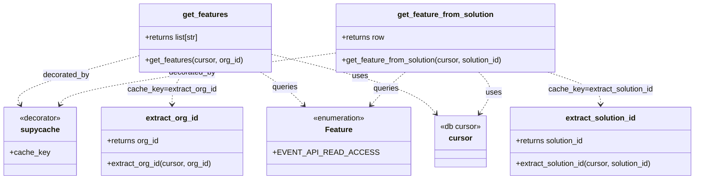

# Diagram: application_service/container_tracking_app_service/common/db/features.py


> Auto-generated by Obscura crawlers

## Diagram 1



### SVG

<svg id="container" width="1437.15234375" xmlns="http://www.w3.org/2000/svg" class="classDiagram" height="378" viewBox="33.46875 0 1437.15234375 378" role="graphics-document document" aria-roledescription="class"><style>#container{font-family:"trebuchet ms",verdana,arial,sans-serif;font-size:16px;fill:#333;}@keyframes edge-animation-frame{from{stroke-dashoffset:0;}}@keyframes dash{to{stroke-dashoffset:0;}}#container .edge-animation-slow{stroke-dasharray:9,5!important;stroke-dashoffset:900;animation:dash 50s linear infinite;stroke-linecap:round;}#container .edge-animation-fast{stroke-dasharray:9,5!important;stroke-dashoffset:900;animation:dash 20s linear infinite;stroke-linecap:round;}#container .error-icon{fill:#552222;}#container .error-text{fill:#552222;stroke:#552222;}#container .edge-thickness-normal{stroke-width:1px;}#container .edge-thickness-thick{stroke-width:3.5px;}#container .edge-pattern-solid{stroke-dasharray:0;}#container .edge-thickness-invisible{stroke-width:0;fill:none;}#container .edge-pattern-dashed{stroke-dasharray:3;}#container .edge-pattern-dotted{stroke-dasharray:2;}#container .marker{fill:#333333;stroke:#333333;}#container .marker.cross{stroke:#333333;}#container svg{font-family:"trebuchet ms",verdana,arial,sans-serif;font-size:16px;}#container p{margin:0;}#container g.classGroup text{fill:#9370DB;stroke:none;font-family:"trebuchet ms",verdana,arial,sans-serif;font-size:10px;}#container g.classGroup text .title{font-weight:bolder;}#container .nodeLabel,#container .edgeLabel{color:#131300;}#container .edgeLabel .label rect{fill:#ECECFF;}#container .label text{fill:#131300;}#container .labelBkg{background:#ECECFF;}#container .edgeLabel .label span{background:#ECECFF;}#container .classTitle{font-weight:bolder;}#container .node rect,#container .node circle,#container .node ellipse,#container .node polygon,#container .node path{fill:#ECECFF;stroke:#9370DB;stroke-width:1px;}#container .divider{stroke:#9370DB;stroke-width:1;}#container g.clickable{cursor:pointer;}#container g.classGroup rect{fill:#ECECFF;stroke:#9370DB;}#container g.classGroup line{stroke:#9370DB;stroke-width:1;}#container .classLabel .box{stroke:none;stroke-width:0;fill:#ECECFF;opacity:0.5;}#container .classLabel .label{fill:#9370DB;font-size:10px;}#container .relation{stroke:#333333;stroke-width:1;fill:none;}#container .dashed-line{stroke-dasharray:3;}#container .dotted-line{stroke-dasharray:1 2;}#container #compositionStart,#container .composition{fill:#333333!important;stroke:#333333!important;stroke-width:1;}#container #compositionEnd,#container .composition{fill:#333333!important;stroke:#333333!important;stroke-width:1;}#container #dependencyStart,#container .dependency{fill:#333333!important;stroke:#333333!important;stroke-width:1;}#container #dependencyStart,#container .dependency{fill:#333333!important;stroke:#333333!important;stroke-width:1;}#container #extensionStart,#container .extension{fill:transparent!important;stroke:#333333!important;stroke-width:1;}#container #extensionEnd,#container .extension{fill:transparent!important;stroke:#333333!important;stroke-width:1;}#container #aggregationStart,#container .aggregation{fill:transparent!important;stroke:#333333!important;stroke-width:1;}#container #aggregationEnd,#container .aggregation{fill:transparent!important;stroke:#333333!important;stroke-width:1;}#container #lollipopStart,#container .lollipop{fill:#ECECFF!important;stroke:#333333!important;stroke-width:1;}#container #lollipopEnd,#container .lollipop{fill:#ECECFF!important;stroke:#333333!important;stroke-width:1;}#container .edgeTerminals{font-size:11px;line-height:initial;}#container .classTitleText{text-anchor:middle;font-size:18px;fill:#333;}#container .label-icon{display:inline-block;height:1em;overflow:visible;vertical-align:-0.125em;}#container .node .label-icon path{fill:currentColor;stroke:revert;stroke-width:revert;}#container :root{--mermaid-font-family:"trebuchet ms",verdana,arial,sans-serif;}</style><g><defs><marker id="container_class-aggregationStart" class="marker aggregation class" refX="18" refY="7" markerWidth="190" markerHeight="240" orient="auto"><path d="M 18,7 L9,13 L1,7 L9,1 Z"></path></marker></defs><defs><marker id="container_class-aggregationEnd" class="marker aggregation class" refX="1" refY="7" markerWidth="20" markerHeight="28" orient="auto"><path d="M 18,7 L9,13 L1,7 L9,1 Z"></path></marker></defs><defs><marker id="container_class-extensionStart" class="marker extension class" refX="18" refY="7" markerWidth="190" markerHeight="240" orient="auto"><path d="M 1,7 L18,13 V 1 Z"></path></marker></defs><defs><marker id="container_class-extensionEnd" class="marker extension class" refX="1" refY="7" markerWidth="20" markerHeight="28" orient="auto"><path d="M 1,1 V 13 L18,7 Z"></path></marker></defs><defs><marker id="container_class-compositionStart" class="marker composition class" refX="18" refY="7" markerWidth="190" markerHeight="240" orient="auto"><path d="M 18,7 L9,13 L1,7 L9,1 Z"></path></marker></defs><defs><marker id="container_class-compositionEnd" class="marker composition class" refX="1" refY="7" markerWidth="20" markerHeight="28" orient="auto"><path d="M 18,7 L9,13 L1,7 L9,1 Z"></path></marker></defs><defs><marker id="container_class-dependencyStart" class="marker dependency class" refX="6" refY="7" markerWidth="190" markerHeight="240" orient="auto"><path d="M 5,7 L9,13 L1,7 L9,1 Z"></path></marker></defs><defs><marker id="container_class-dependencyEnd" class="marker dependency class" refX="13" refY="7" markerWidth="20" markerHeight="28" orient="auto"><path d="M 18,7 L9,13 L14,7 L9,1 Z"></path></marker></defs><defs><marker id="container_class-lollipopStart" class="marker lollipop class" refX="13" refY="7" markerWidth="190" markerHeight="240" orient="auto"><circle stroke="black" fill="transparent" cx="7" cy="7" r="6"></circle></marker></defs><defs><marker id="container_class-lollipopEnd" class="marker lollipop class" refX="1" refY="7" markerWidth="190" markerHeight="240" orient="auto"><circle stroke="black" fill="transparent" cx="7" cy="7" r="6"></circle></marker></defs><g class="root"><g class="clusters"></g><g class="edgePaths"><path d="M326.266,117.065L281.451,129.054C236.635,141.043,147.005,165.022,105.071,182.299C63.137,199.577,68.898,210.154,71.779,215.443L74.66,220.731" id="id_get_features_supycache_1" class="edge-thickness-normal edge-pattern-dashed relation" style=";;;" data-edge="true" data-et="edge" data-id="id_get_features_supycache_1" data-points="W3sieCI6MzI2LjI2NTYyNSwieSI6MTE3LjA2NDg0ODkwMzIwNjAxfSx7IngiOjU3LjM3NSwieSI6MTg5fSx7IngiOjc3LjUyOTgxNjUxMzc2MTQ2LCJ5IjoyMjZ9XQ==" marker-end="url(#container_class-dependencyEnd)"></path><path d="M418.422,152L414.448,158.167C410.475,164.333,402.529,176.667,398.555,188C394.582,199.333,394.582,209.667,394.582,214.833L394.582,220" id="id_get_features_extract_org_id_2" class="edge-thickness-normal edge-pattern-dashed relation" style=";;;" data-edge="true" data-et="edge" data-id="id_get_features_extract_org_id_2" data-points="W3sieCI6NDE4LjQyMTczMTY1MTM3NjE1LCJ5IjoxNTJ9LHsieCI6Mzk0LjU4MjAzMTI1LCJ5IjoxODl9LHsieCI6Mzk0LjU4MjAzMTI1LCJ5IjoyMjZ9XQ==" marker-end="url(#container_class-dependencyEnd)"></path><path d="M702.988,113.484L615.178,126.07C527.367,138.656,351.746,163.828,261.055,181.702C170.363,199.577,164.602,210.154,161.721,215.443L158.84,220.731" id="id_get_feature_from_solution_supycache_3" class="edge-thickness-normal edge-pattern-dashed relation" style=";;;" data-edge="true" data-et="edge" data-id="id_get_feature_from_solution_supycache_3" data-points="W3sieCI6NzAyLjk4ODI4MTI1LCJ5IjoxMTMuNDgzNjc4NDI3Nzg3fSx7IngiOjE3Ni4xMjUsInkiOjE4OX0seyJ4IjoxNTUuOTcwMTgzNDg2MjM4NTQsInkiOjIyNn1d" marker-end="url(#container_class-dependencyEnd)"></path><path d="M1155.671,152L1174.434,158.167C1193.197,164.333,1230.724,176.667,1249.487,188C1268.25,199.333,1268.25,209.667,1268.25,214.833L1268.25,220" id="id_get_feature_from_solution_extract_solution_id_4" class="edge-thickness-normal edge-pattern-dashed relation" style=";;;" data-edge="true" data-et="edge" data-id="id_get_feature_from_solution_extract_solution_id_4" data-points="W3sieCI6MTE1NS42NzA3NjQwNDgxNjUyLCJ5IjoxNTJ9LHsieCI6MTI2OC4yNSwieSI6MTg5fSx7IngiOjEyNjguMjUsInkiOjIyNn1d" marker-end="url(#container_class-dependencyEnd)"></path><path d="M575.043,152L584.484,158.167C593.925,164.333,612.807,176.667,627.053,188.252C641.298,199.837,650.907,210.674,655.711,216.092L660.515,221.511" id="id_get_features_Feature_5" class="edge-thickness-normal edge-pattern-dashed relation" style=";;;" data-edge="true" data-et="edge" data-id="id_get_features_Feature_5" data-points="W3sieCI6NTc1LjA0MzE0NzkzNTc3OTksInkiOjE1Mn0seyJ4Ijo2MzEuNjg5NDUzMTI1LCJ5IjoxODl9LHsieCI6NjY0LjQ5NjA1NzkxMjg0NCwieSI6MjI2fV0=" marker-end="url(#container_class-dependencyEnd)"></path><path d="M857.289,152L850.496,158.167C843.704,164.333,830.118,176.667,818.965,188.223C807.812,199.779,799.09,210.557,794.73,215.946L790.369,221.336" id="id_get_feature_from_solution_Feature_6" class="edge-thickness-normal edge-pattern-dashed relation" style=";;;" data-edge="true" data-et="edge" data-id="id_get_feature_from_solution_Feature_6" data-points="W3sieCI6ODU3LjI4OTAyNjY2Mjg0NCwieSI6MTUyfSx7IngiOjgxNi41MzMyMDMxMjUsInkiOjE4OX0seyJ4Ijo3ODYuNTk0NjgxNzY2MDU1LCJ5IjoyMjZ9XQ==" marker-end="url(#container_class-dependencyEnd)"></path><path d="M603.359,116.35L649.511,128.458C695.662,140.566,787.965,164.783,840.904,185.281C893.844,205.779,907.42,222.557,914.208,230.946L920.997,239.336" id="id_get_features_cursor_7" class="edge-thickness-normal edge-pattern-dashed relation" style=";;;" data-edge="true" data-et="edge" data-id="id_get_features_cursor_7" data-points="W3sieCI6NjAzLjM1OTM3NSwieSI6MTE2LjM0OTU2MDIwNTUzNTE2fSx7IngiOjg4MC4yNjc1NzgxMjUsInkiOjE4OX0seyJ4Ijo5MjQuNzcwNzg1NTUwNDU4OCwieSI6MjQ0fV0=" marker-end="url(#container_class-dependencyEnd)"></path><path d="M1007.794,152L1013.892,158.167C1019.99,164.333,1032.185,176.667,1032.47,191.179C1032.755,205.692,1021.129,222.384,1015.317,230.73L1009.504,239.076" id="id_get_feature_from_solution_cursor_8" class="edge-thickness-normal edge-pattern-dashed relation" style=";;;" data-edge="true" data-et="edge" data-id="id_get_feature_from_solution_cursor_8" data-points="W3sieCI6MTAwNy43OTM5MDA1MTYwNTUsInkiOjE1Mn0seyJ4IjoxMDQ0LjM4MDg1OTM3NSwieSI6MTg5fSx7IngiOjEwMDYuMDc0NjEyOTU4NzE1NiwieSI6MjQ0fV0=" marker-end="url(#container_class-dependencyEnd)"></path></g><g class="edgeLabels"><g class="edgeLabel" transform="translate(171.46933, 158.47684)"><g class="label" data-id="id_get_features_supycache_1" transform="translate(-49.375, -12)"><foreignObject width="98.75" height="24"><div xmlns="http://www.w3.org/1999/xhtml" class="labelBkg" style="display: table-cell; white-space: nowrap; line-height: 1.5; max-width: 200px; text-align: center;"><span class="edgeLabel"><p>decorated_by</p></span></div></foreignObject></g></g><g class="edgeLabel" transform="translate(394.58203125, 189)"><g class="label" data-id="id_get_features_extract_org_id_2" transform="translate(-93.21875, -12)"><foreignObject width="186.4375" height="24"><div xmlns="http://www.w3.org/1999/xhtml" class="labelBkg" style="display: table-cell; white-space: nowrap; line-height: 1.5; max-width: 200px; text-align: center;"><span class="edgeLabel"><p>cache_key=extract_org_id</p></span></div></foreignObject></g></g><g class="edgeLabel" transform="translate(418.7031, 154.23082)"><g class="label" data-id="id_get_feature_from_solution_supycache_3" transform="translate(-49.375, -12)"><foreignObject width="98.75" height="24"><div xmlns="http://www.w3.org/1999/xhtml" class="labelBkg" style="display: table-cell; white-space: nowrap; line-height: 1.5; max-width: 200px; text-align: center;"><span class="edgeLabel"><p>decorated_by</p></span></div></foreignObject></g></g><g class="edgeLabel" transform="translate(1268.25, 189)"><g class="label" data-id="id_get_feature_from_solution_extract_solution_id_4" transform="translate(-111.4609375, -12)"><foreignObject width="222.921875" height="24"><div xmlns="http://www.w3.org/1999/xhtml" class="labelBkg" style="display: table; white-space: break-spaces; line-height: 1.5; max-width: 200px; text-align: center; width: 200px;"><span class="edgeLabel"><p>cache_key=extract_solution_id</p></span></div></foreignObject></g></g><g class="edgeLabel" transform="translate(624.0666, 184.02094)"><g class="label" data-id="id_get_features_Feature_5" transform="translate(-27.2421875, -12)"><foreignObject width="54.484375" height="24"><div xmlns="http://www.w3.org/1999/xhtml" class="labelBkg" style="display: table-cell; white-space: nowrap; line-height: 1.5; max-width: 200px; text-align: center;"><span class="edgeLabel"><p>queries</p></span></div></foreignObject></g></g><g class="edgeLabel" transform="translate(819.29135, 186.49602)"><g class="label" data-id="id_get_feature_from_solution_Feature_6" transform="translate(-27.2421875, -12)"><foreignObject width="54.484375" height="24"><div xmlns="http://www.w3.org/1999/xhtml" class="labelBkg" style="display: table-cell; white-space: nowrap; line-height: 1.5; max-width: 200px; text-align: center;"><span class="edgeLabel"><p>queries</p></span></div></foreignObject></g></g><g class="edgeLabel" transform="translate(776.03033, 161.65201)"><g class="label" data-id="id_get_features_cursor_7" transform="translate(-16.4921875, -12)"><foreignObject width="32.984375" height="24"><div xmlns="http://www.w3.org/1999/xhtml" class="labelBkg" style="display: table-cell; white-space: nowrap; line-height: 1.5; max-width: 200px; text-align: center;"><span class="edgeLabel"><p>uses</p></span></div></foreignObject></g></g><g class="edgeLabel" transform="translate(1040.09718, 195.1505)"><g class="label" data-id="id_get_feature_from_solution_cursor_8" transform="translate(-16.4921875, -12)"><foreignObject width="32.984375" height="24"><div xmlns="http://www.w3.org/1999/xhtml" class="labelBkg" style="display: table-cell; white-space: nowrap; line-height: 1.5; max-width: 200px; text-align: center;"><span class="edgeLabel"><p>uses</p></span></div></foreignObject></g></g></g><g class="nodes"><g class="node default" id="classId-Feature-0" transform="translate(728.3359375, 298)"><g class="basic label-container"><path d="M-134.71484375 -72 L134.71484375 -72 L134.71484375 72 L-134.71484375 72" stroke="none" stroke-width="0" fill="#ECECFF" style=""></path><path d="M-134.71484375 -72 C-72.89823062049234 -72, -11.081617490984684 -72, 134.71484375 -72 M-134.71484375 -72 C-47.789938394958924 -72, 39.13496696008215 -72, 134.71484375 -72 M134.71484375 -72 C134.71484375 -41.639690582864716, 134.71484375 -11.27938116572944, 134.71484375 72 M134.71484375 -72 C134.71484375 -30.72949678429977, 134.71484375 10.541006431400461, 134.71484375 72 M134.71484375 72 C60.93534969005353 72, -12.844144369892945 72, -134.71484375 72 M134.71484375 72 C34.29151606631781 72, -66.13181161736438 72, -134.71484375 72 M-134.71484375 72 C-134.71484375 33.37951722184139, -134.71484375 -5.240965556317221, -134.71484375 -72 M-134.71484375 72 C-134.71484375 40.21761323397566, -134.71484375 8.435226467951324, -134.71484375 -72" stroke="#9370DB" stroke-width="1.3" fill="none" stroke-dasharray="0 0" style=""></path></g><g class="annotation-group text" transform="translate(-55.5546875, -48)"><g class="label" style="" transform="translate(0,-12)"><foreignObject width="111.109375" height="24"><div xmlns="http://www.w3.org/1999/xhtml" style="display: table-cell; white-space: nowrap; line-height: 1.5; max-width: 161px; text-align: center;"><span class="nodeLabel markdown-node-label" style=""><p>«enumeration»</p></span></div></foreignObject></g></g><g class="label-group text" transform="translate(-27.390625, -24)"><g class="label" style="font-weight: bolder" transform="translate(0,-12)"><foreignObject width="54.78125" height="24"><div xmlns="http://www.w3.org/1999/xhtml" style="display: table-cell; white-space: nowrap; line-height: 1.5; max-width: 104px; text-align: center;"><span class="nodeLabel markdown-node-label" style=""><p>Feature</p></span></div></foreignObject></g></g><g class="members-group text" transform="translate(-122.71484375, 24)"><g class="label" style="" transform="translate(0,-12)"><foreignObject width="189.875" height="24"><div xmlns="http://www.w3.org/1999/xhtml" style="display: table-cell; white-space: nowrap; line-height: 1.5; max-width: 248px; text-align: center;"><span class="nodeLabel markdown-node-label" style=""><p>+EVENT_API_READ_ACCESS</p></span></div></foreignObject></g></g><g class="methods-group text" transform="translate(-122.71484375, 72)"></g><g class="divider" style=""><path d="M-134.71484375 0 C-73.58466957121124 0, -12.454495392422473 0, 134.71484375 0 M-134.71484375 0 C-37.018593337440606 0, 60.67765707511879 0, 134.71484375 0" stroke="#9370DB" stroke-width="1.3" fill="none" stroke-dasharray="0 0" style=""></path></g><g class="divider" style=""><path d="M-134.71484375 48 C-76.61876811706529 48, -18.522692484130573 48, 134.71484375 48 M-134.71484375 48 C-58.70109706071062 48, 17.312649628578754 48, 134.71484375 48" stroke="#9370DB" stroke-width="1.3" fill="none" stroke-dasharray="0 0" style=""></path></g></g><g class="node default" id="classId-extract_org_id-1" transform="translate(394.58203125, 298)"><g class="basic label-container"><path d="M-149.0390625 -72 L149.0390625 -72 L149.0390625 72 L-149.0390625 72" stroke="none" stroke-width="0" fill="#ECECFF" style=""></path><path d="M-149.0390625 -72 C-64.48027830330017 -72, 20.078505893399665 -72, 149.0390625 -72 M-149.0390625 -72 C-62.12438851339958 -72, 24.79028547320084 -72, 149.0390625 -72 M149.0390625 -72 C149.0390625 -18.96304634059844, 149.0390625 34.07390731880312, 149.0390625 72 M149.0390625 -72 C149.0390625 -29.254718442694582, 149.0390625 13.490563114610836, 149.0390625 72 M149.0390625 72 C74.14128072678344 72, -0.7565010464331294 72, -149.0390625 72 M149.0390625 72 C33.916711712985574 72, -81.20563907402885 72, -149.0390625 72 M-149.0390625 72 C-149.0390625 35.61622259812662, -149.0390625 -0.7675548037467621, -149.0390625 -72 M-149.0390625 72 C-149.0390625 41.91867293354873, -149.0390625 11.837345867097454, -149.0390625 -72" stroke="#9370DB" stroke-width="1.3" fill="none" stroke-dasharray="0 0" style=""></path></g><g class="annotation-group text" transform="translate(0, -48)"></g><g class="label-group text" transform="translate(-53.203125, -48)"><g class="label" style="font-weight: bolder" transform="translate(0,-12)"><foreignObject width="106.40625" height="24"><div xmlns="http://www.w3.org/1999/xhtml" style="display: table-cell; white-space: nowrap; line-height: 1.5; max-width: 154px; text-align: center;"><span class="nodeLabel markdown-node-label" style=""><p>extract_org_id</p></span></div></foreignObject></g></g><g class="members-group text" transform="translate(-137.0390625, 0)"><g class="label" style="" transform="translate(0,-12)"><foreignObject width="110.828125" height="24"><div xmlns="http://www.w3.org/1999/xhtml" style="display: table-cell; white-space: nowrap; line-height: 1.5; max-width: 168px; text-align: center;"><span class="nodeLabel markdown-node-label" style=""><p>+returns org_id</p></span></div></foreignObject></g></g><g class="methods-group text" transform="translate(-137.0390625, 48)"><g class="label" style="" transform="translate(0,-12)"><foreignObject width="220.875" height="24"><div xmlns="http://www.w3.org/1999/xhtml" style="display: table-cell; white-space: nowrap; line-height: 1.5; max-width: 278px; text-align: center;"><span class="nodeLabel markdown-node-label" style=""><p>+extract_org_id(cursor, org_id)</p></span></div></foreignObject></g></g><g class="divider" style=""><path d="M-149.0390625 -24 C-39.40315476522963 -24, 70.23275296954074 -24, 149.0390625 -24 M-149.0390625 -24 C-33.617559981744904 -24, 81.80394253651019 -24, 149.0390625 -24" stroke="#9370DB" stroke-width="1.3" fill="none" stroke-dasharray="0 0" style=""></path></g><g class="divider" style=""><path d="M-149.0390625 24 C-49.52607655211983 24, 49.986909395760335 24, 149.0390625 24 M-149.0390625 24 C-45.21718639055612 24, 58.604689718887755 24, 149.0390625 24" stroke="#9370DB" stroke-width="1.3" fill="none" stroke-dasharray="0 0" style=""></path></g></g><g class="node default" id="classId-get_features-2" transform="translate(464.8125, 80)"><g class="basic label-container"><path d="M-138.546875 -72 L138.546875 -72 L138.546875 72 L-138.546875 72" stroke="none" stroke-width="0" fill="#ECECFF" style=""></path><path d="M-138.546875 -72 C-50.12992991293555 -72, 38.287015174128896 -72, 138.546875 -72 M-138.546875 -72 C-74.16639121562184 -72, -9.785907431243686 -72, 138.546875 -72 M138.546875 -72 C138.546875 -20.636569343790406, 138.546875 30.72686131241919, 138.546875 72 M138.546875 -72 C138.546875 -37.62555922697672, 138.546875 -3.2511184539534383, 138.546875 72 M138.546875 72 C55.935026161658385 72, -26.67682267668323 72, -138.546875 72 M138.546875 72 C33.53517491812799 72, -71.47652516374401 72, -138.546875 72 M-138.546875 72 C-138.546875 40.14459575590371, -138.546875 8.289191511807424, -138.546875 -72 M-138.546875 72 C-138.546875 21.35134811515433, -138.546875 -29.29730376969134, -138.546875 -72" stroke="#9370DB" stroke-width="1.3" fill="none" stroke-dasharray="0 0" style=""></path></g><g class="annotation-group text" transform="translate(0, -48)"></g><g class="label-group text" transform="translate(-46.140625, -48)"><g class="label" style="font-weight: bolder" transform="translate(0,-12)"><foreignObject width="92.28125" height="24"><div xmlns="http://www.w3.org/1999/xhtml" style="display: table-cell; white-space: nowrap; line-height: 1.5; max-width: 140px; text-align: center;"><span class="nodeLabel markdown-node-label" style=""><p>get_features</p></span></div></foreignObject></g></g><g class="members-group text" transform="translate(-126.546875, 0)"><g class="label" style="" transform="translate(0,-12)"><foreignObject width="116.9375" height="24"><div xmlns="http://www.w3.org/1999/xhtml" style="display: table-cell; white-space: nowrap; line-height: 1.5; max-width: 174px; text-align: center;"><span class="nodeLabel markdown-node-label" style=""><p>+returns list[str]</p></span></div></foreignObject></g></g><g class="methods-group text" transform="translate(-126.546875, 48)"><g class="label" style="" transform="translate(0,-12)"><foreignObject width="206.953125" height="24"><div xmlns="http://www.w3.org/1999/xhtml" style="display: table-cell; white-space: nowrap; line-height: 1.5; max-width: 264px; text-align: center;"><span class="nodeLabel markdown-node-label" style=""><p>+get_features(cursor, org_id)</p></span></div></foreignObject></g></g><g class="divider" style=""><path d="M-138.546875 -24 C-40.312557947069564 -24, 57.92175910586087 -24, 138.546875 -24 M-138.546875 -24 C-37.1369419114277 -24, 64.2729911771446 -24, 138.546875 -24" stroke="#9370DB" stroke-width="1.3" fill="none" stroke-dasharray="0 0" style=""></path></g><g class="divider" style=""><path d="M-138.546875 24 C-62.84450463947455 24, 12.8578657210509 24, 138.546875 24 M-138.546875 24 C-68.00653464907613 24, 2.53380570184774 24, 138.546875 24" stroke="#9370DB" stroke-width="1.3" fill="none" stroke-dasharray="0 0" style=""></path></g></g><g class="node default" id="classId-supycache-3" transform="translate(116.75, 298)"><g class="basic label-container"><path d="M-75.28125 -72 L75.28125 -72 L75.28125 72 L-75.28125 72" stroke="none" stroke-width="0" fill="#ECECFF" style=""></path><path d="M-75.28125 -72 C-33.28514285348834 -72, 8.710964293023324 -72, 75.28125 -72 M-75.28125 -72 C-15.20953798879711 -72, 44.86217402240578 -72, 75.28125 -72 M75.28125 -72 C75.28125 -14.683117049887827, 75.28125 42.63376590022435, 75.28125 72 M75.28125 -72 C75.28125 -24.32389380633741, 75.28125 23.35221238732518, 75.28125 72 M75.28125 72 C23.74490476078457 72, -27.791440478430857 72, -75.28125 72 M75.28125 72 C20.408973147633496 72, -34.46330370473301 72, -75.28125 72 M-75.28125 72 C-75.28125 26.253664743211033, -75.28125 -19.492670513577934, -75.28125 -72 M-75.28125 72 C-75.28125 26.50754325848682, -75.28125 -18.98491348302636, -75.28125 -72" stroke="#9370DB" stroke-width="1.3" fill="none" stroke-dasharray="0 0" style=""></path></g><g class="annotation-group text" transform="translate(-44.0625, -48)"><g class="label" style="" transform="translate(0,-12)"><foreignObject width="88.125" height="24"><div xmlns="http://www.w3.org/1999/xhtml" style="display: table-cell; white-space: nowrap; line-height: 1.5; max-width: 138px; text-align: center;"><span class="nodeLabel markdown-node-label" style=""><p>«decorator»</p></span></div></foreignObject></g></g><g class="label-group text" transform="translate(-38.234375, -24)"><g class="label" style="font-weight: bolder" transform="translate(0,-12)"><foreignObject width="76.46875" height="24"><div xmlns="http://www.w3.org/1999/xhtml" style="display: table-cell; white-space: nowrap; line-height: 1.5; max-width: 126px; text-align: center;"><span class="nodeLabel markdown-node-label" style=""><p>supycache</p></span></div></foreignObject></g></g><g class="members-group text" transform="translate(-63.28125, 24)"><g class="label" style="" transform="translate(0,-12)"><foreignObject width="82.5" height="24"><div xmlns="http://www.w3.org/1999/xhtml" style="display: table-cell; white-space: nowrap; line-height: 1.5; max-width: 140px; text-align: center;"><span class="nodeLabel markdown-node-label" style=""><p>+cache_key</p></span></div></foreignObject></g></g><g class="methods-group text" transform="translate(-63.28125, 72)"></g><g class="divider" style=""><path d="M-75.28125 0 C-36.20532633473108 0, 2.8705973305378336 0, 75.28125 0 M-75.28125 0 C-42.75102362664596 0, -10.22079725329192 0, 75.28125 0" stroke="#9370DB" stroke-width="1.3" fill="none" stroke-dasharray="0 0" style=""></path></g><g class="divider" style=""><path d="M-75.28125 48 C-23.527253301596588 48, 28.226743396806825 48, 75.28125 48 M-75.28125 48 C-19.57473413731224 48, 36.13178172537552 48, 75.28125 48" stroke="#9370DB" stroke-width="1.3" fill="none" stroke-dasharray="0 0" style=""></path></g></g><g class="node default" id="classId-extract_solution_id-4" transform="translate(1268.25, 298)"><g class="basic label-container"><path d="M-194.37109375 -72 L194.37109375 -72 L194.37109375 72 L-194.37109375 72" stroke="none" stroke-width="0" fill="#ECECFF" style=""></path><path d="M-194.37109375 -72 C-115.04146901155212 -72, -35.71184427310425 -72, 194.37109375 -72 M-194.37109375 -72 C-59.924446355079084 -72, 74.52220103984183 -72, 194.37109375 -72 M194.37109375 -72 C194.37109375 -25.816569419192916, 194.37109375 20.366861161614167, 194.37109375 72 M194.37109375 -72 C194.37109375 -35.40240351556098, 194.37109375 1.1951929688780467, 194.37109375 72 M194.37109375 72 C109.62514829323412 72, 24.879202836468238 72, -194.37109375 72 M194.37109375 72 C108.19157729816882 72, 22.012060846337647 72, -194.37109375 72 M-194.37109375 72 C-194.37109375 39.545469345461456, -194.37109375 7.090938690922911, -194.37109375 -72 M-194.37109375 72 C-194.37109375 15.65099469710053, -194.37109375 -40.69801060579894, -194.37109375 -72" stroke="#9370DB" stroke-width="1.3" fill="none" stroke-dasharray="0 0" style=""></path></g><g class="annotation-group text" transform="translate(0, -48)"></g><g class="label-group text" transform="translate(-71.2265625, -48)"><g class="label" style="font-weight: bolder" transform="translate(0,-12)"><foreignObject width="142.453125" height="24"><div xmlns="http://www.w3.org/1999/xhtml" style="display: table-cell; white-space: nowrap; line-height: 1.5; max-width: 190px; text-align: center;"><span class="nodeLabel markdown-node-label" style=""><p>extract_solution_id</p></span></div></foreignObject></g></g><g class="members-group text" transform="translate(-182.37109375, 0)"><g class="label" style="" transform="translate(0,-12)"><foreignObject width="146.984375" height="24"><div xmlns="http://www.w3.org/1999/xhtml" style="display: table-cell; white-space: nowrap; line-height: 1.5; max-width: 204px; text-align: center;"><span class="nodeLabel markdown-node-label" style=""><p>+returns solution_id</p></span></div></foreignObject></g></g><g class="methods-group text" transform="translate(-182.37109375, 48)"><g class="label" style="" transform="translate(0,-12)"><foreignObject width="293.515625" height="24"><div xmlns="http://www.w3.org/1999/xhtml" style="display: table-cell; white-space: nowrap; line-height: 1.5; max-width: 351px; text-align: center;"><span class="nodeLabel markdown-node-label" style=""><p>+extract_solution_id(cursor, solution_id)</p></span></div></foreignObject></g></g><g class="divider" style=""><path d="M-194.37109375 -24 C-43.93742117414493 -24, 106.49625140171014 -24, 194.37109375 -24 M-194.37109375 -24 C-51.83249931581466 -24, 90.70609511837068 -24, 194.37109375 -24" stroke="#9370DB" stroke-width="1.3" fill="none" stroke-dasharray="0 0" style=""></path></g><g class="divider" style=""><path d="M-194.37109375 24 C-100.02619782136831 24, -5.681301892736627 24, 194.37109375 24 M-194.37109375 24 C-68.35761778377194 24, 57.655858182456114 24, 194.37109375 24" stroke="#9370DB" stroke-width="1.3" fill="none" stroke-dasharray="0 0" style=""></path></g></g><g class="node default" id="classId-get_feature_from_solution-5" transform="translate(936.59765625, 80)"><g class="basic label-container"><path d="M-233.609375 -72 L233.609375 -72 L233.609375 72 L-233.609375 72" stroke="none" stroke-width="0" fill="#ECECFF" style=""></path><path d="M-233.609375 -72 C-130.93869640991431 -72, -28.268017819828657 -72, 233.609375 -72 M-233.609375 -72 C-103.23995348589972 -72, 27.129468028200563 -72, 233.609375 -72 M233.609375 -72 C233.609375 -29.25740914907321, 233.609375 13.485181701853577, 233.609375 72 M233.609375 -72 C233.609375 -30.75632129338876, 233.609375 10.487357413222483, 233.609375 72 M233.609375 72 C91.93843159591796 72, -49.73251180816408 72, -233.609375 72 M233.609375 72 C110.89970107929587 72, -11.809972841408268 72, -233.609375 72 M-233.609375 72 C-233.609375 31.766023514290957, -233.609375 -8.467952971418086, -233.609375 -72 M-233.609375 72 C-233.609375 25.299265085991436, -233.609375 -21.401469828017127, -233.609375 -72" stroke="#9370DB" stroke-width="1.3" fill="none" stroke-dasharray="0 0" style=""></path></g><g class="annotation-group text" transform="translate(0, -48)"></g><g class="label-group text" transform="translate(-97.640625, -48)"><g class="label" style="font-weight: bolder" transform="translate(0,-12)"><foreignObject width="195.28125" height="24"><div xmlns="http://www.w3.org/1999/xhtml" style="display: table-cell; white-space: nowrap; line-height: 1.5; max-width: 242px; text-align: center;"><span class="nodeLabel markdown-node-label" style=""><p>get_feature_from_solution</p></span></div></foreignObject></g></g><g class="members-group text" transform="translate(-221.609375, 0)"><g class="label" style="" transform="translate(0,-12)"><foreignObject width="91.265625" height="24"><div xmlns="http://www.w3.org/1999/xhtml" style="display: table-cell; white-space: nowrap; line-height: 1.5; max-width: 149px; text-align: center;"><span class="nodeLabel markdown-node-label" style=""><p>+returns row</p></span></div></foreignObject></g></g><g class="methods-group text" transform="translate(-221.609375, 48)"><g class="label" style="" transform="translate(0,-12)"><foreignObject width="345.578125" height="24"><div xmlns="http://www.w3.org/1999/xhtml" style="display: table-cell; white-space: nowrap; line-height: 1.5; max-width: 403px; text-align: center;"><span class="nodeLabel markdown-node-label" style=""><p>+get_feature_from_solution(cursor, solution_id)</p></span></div></foreignObject></g></g><g class="divider" style=""><path d="M-233.609375 -24 C-64.49056842553634 -24, 104.62823814892732 -24, 233.609375 -24 M-233.609375 -24 C-138.13025714544253 -24, -42.651139290885055 -24, 233.609375 -24" stroke="#9370DB" stroke-width="1.3" fill="none" stroke-dasharray="0 0" style=""></path></g><g class="divider" style=""><path d="M-233.609375 24 C-89.77220553770462 24, 54.06496392459076 24, 233.609375 24 M-233.609375 24 C-87.27375327347718 24, 59.06186845304563 24, 233.609375 24" stroke="#9370DB" stroke-width="1.3" fill="none" stroke-dasharray="0 0" style=""></path></g></g><g class="node default" id="classId-cursor-6" transform="translate(968.46484375, 298)"><g class="basic label-container"><path d="M-55.4140625 -54 L55.4140625 -54 L55.4140625 54 L-55.4140625 54" stroke="none" stroke-width="0" fill="#ECECFF" style=""></path><path d="M-55.4140625 -54 C-14.216312717277965 -54, 26.98143706544407 -54, 55.4140625 -54 M-55.4140625 -54 C-29.96161372665937 -54, -4.509164953318738 -54, 55.4140625 -54 M55.4140625 -54 C55.4140625 -25.705006519978763, 55.4140625 2.5899869600424736, 55.4140625 54 M55.4140625 -54 C55.4140625 -29.83578500605415, 55.4140625 -5.6715700121082975, 55.4140625 54 M55.4140625 54 C24.533920201263474 54, -6.346222097473053 54, -55.4140625 54 M55.4140625 54 C31.30476379240557 54, 7.19546508481114 54, -55.4140625 54 M-55.4140625 54 C-55.4140625 22.27951055540848, -55.4140625 -9.440978889183043, -55.4140625 -54 M-55.4140625 54 C-55.4140625 27.302686935496524, -55.4140625 0.6053738709930485, -55.4140625 -54" stroke="#9370DB" stroke-width="1.3" fill="none" stroke-dasharray="0 0" style=""></path></g><g class="annotation-group text" transform="translate(-43.4140625, -30)"><g class="label" style="" transform="translate(0,-12)"><foreignObject width="86.828125" height="24"><div xmlns="http://www.w3.org/1999/xhtml" style="display: table-cell; white-space: nowrap; line-height: 1.5; max-width: 137px; text-align: center;"><span class="nodeLabel markdown-node-label" style=""><p>«db cursor»</p></span></div></foreignObject></g></g><g class="label-group text" transform="translate(-23.1875, -6)"><g class="label" style="font-weight: bolder" transform="translate(0,-12)"><foreignObject width="46.375" height="24"><div xmlns="http://www.w3.org/1999/xhtml" style="display: table-cell; white-space: nowrap; line-height: 1.5; max-width: 97px; text-align: center;"><span class="nodeLabel markdown-node-label" style=""><p>cursor</p></span></div></foreignObject></g></g><g class="members-group text" transform="translate(-43.4140625, 42)"></g><g class="methods-group text" transform="translate(-43.4140625, 72)"></g><g class="divider" style=""><path d="M-55.4140625 18 C-31.822199292406445 18, -8.23033608481289 18, 55.4140625 18 M-55.4140625 18 C-21.90586430112183 18, 11.602333897756338 18, 55.4140625 18" stroke="#9370DB" stroke-width="1.3" fill="none" stroke-dasharray="0 0" style=""></path></g><g class="divider" style=""><path d="M-55.4140625 36 C-29.504066178297855 36, -3.594069856595709 36, 55.4140625 36 M-55.4140625 36 C-31.027953694344117 36, -6.641844888688233 36, 55.4140625 36" stroke="#9370DB" stroke-width="1.3" fill="none" stroke-dasharray="0 0" style=""></path></g></g></g></g></g></svg>

## Diagram 2

```mermaid
flowchart TD
    subgraph CacheLayer
        SC[Supycache Decorator]
        EK1[extract_org_id(cursor, org_id)]
        EK2[extract_solution_id(cursor, solution_id)]
    end
    GF[get_features(cursor, org_id)]
    GS[get_feature_from_solution(cursor, solution_id)]
    CUR[(DB Cursor)]
    FE[Feature Enum]
    EV[EVENT_API_READ_ACCESS]
    GF -->|cache_key from| EK1
    GS -->|cache_key from| EK2
    GF --> SC
    GS --> SC
    GF -->|exec SQL| CUR
    GS -->|exec SQL| CUR
    SC -->|return cached or call| GF
    SC -->|return cached or call| GS
    GF -->|reads| FE
    GS -->|reads| FE
    FE --> EV
    CUR -->|fetchall| GF
    CUR -->|fetchone| GS
```

> SVG rendering failed for this diagram.
