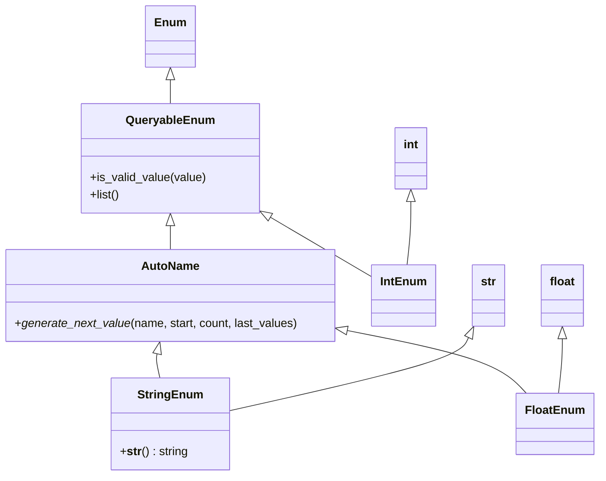

# Diagram: application_service/container_tracking_app_service/common/enum.py

> Auto-generated by Obscura crawlers

## Mermaid

### SVG

<svg id="container" width="813.53125" xmlns="http://www.w3.org/2000/svg" class="classDiagram" height="652" viewBox="0 0 813.53125 652" role="graphics-document document" aria-roledescription="class"><g><defs><marker id="container_class-aggregationStart" class="marker aggregation class" refX="18" refY="7" markerWidth="190" markerHeight="240" orient="auto"><path d="M 18,7 L9,13 L1,7 L9,1 Z"></path></marker></defs><defs><marker id="container_class-aggregationEnd" class="marker aggregation class" refX="1" refY="7" markerWidth="20" markerHeight="28" orient="auto"><path d="M 18,7 L9,13 L1,7 L9,1 Z"></path></marker></defs><defs><marker id="container_class-extensionStart" class="marker extension class" refX="18" refY="7" markerWidth="190" markerHeight="240" orient="auto"><path d="M 1,7 L18,13 V 1 Z"></path></marker></defs><defs><marker id="container_class-extensionEnd" class="marker extension class" refX="1" refY="7" markerWidth="20" markerHeight="28" orient="auto"><path d="M 1,1 V 13 L18,7 Z"></path></marker></defs><defs><marker id="container_class-compositionStart" class="marker composition class" refX="18" refY="7" markerWidth="190" markerHeight="240" orient="auto"><path d="M 18,7 L9,13 L1,7 L9,1 Z"></path></marker></defs><defs><marker id="container_class-compositionEnd" class="marker composition class" refX="1" refY="7" markerWidth="20" markerHeight="28" orient="auto"><path d="M 18,7 L9,13 L1,7 L9,1 Z"></path></marker></defs><defs><marker id="container_class-dependencyStart" class="marker dependency class" refX="6" refY="7" markerWidth="190" markerHeight="240" orient="auto"><path d="M 5,7 L9,13 L1,7 L9,1 Z"></path></marker></defs><defs><marker id="container_class-dependencyEnd" class="marker dependency class" refX="13" refY="7" markerWidth="20" markerHeight="28" orient="auto"><path d="M 18,7 L9,13 L14,7 L9,1 Z"></path></marker></defs><defs><marker id="container_class-lollipopStart" class="marker lollipop class" refX="13" refY="7" markerWidth="190" markerHeight="240" orient="auto"><circle stroke="black" fill="transparent" cx="7" cy="7" r="6"></circle></marker></defs><defs><marker id="container_class-lollipopEnd" class="marker lollipop class" refX="1" refY="7" markerWidth="190" markerHeight="240" orient="auto"><circle stroke="black" fill="transparent" cx="7" cy="7" r="6"></circle></marker></defs><g class="root"><g class="clusters"></g><g class="edgePaths"><path d="M232.781,109.25L232.781,110.542C232.781,111.833,232.781,114.417,232.781,119.875C232.781,125.333,232.781,133.667,232.781,137.833L232.781,142" id="id_Enum_QueryableEnum_1" class="edge-thickness-normal edge-pattern-solid relation" style=";;;" data-edge="true" data-et="edge" data-id="id_Enum_QueryableEnum_1" data-points="W3sieCI6MjMyLjc4MTI1LCJ5Ijo5Mn0seyJ4IjoyMzIuNzgxMjUsInkiOjExN30seyJ4IjoyMzIuNzgxMjUsInkiOjE0Mn1d" marker-start="url(#container_class-extensionStart)"></path><path d="M232.781,309.25L232.781,310.542C232.781,311.833,232.781,314.417,232.781,319.875C232.781,325.333,232.781,333.667,232.781,337.833L232.781,342" id="id_QueryableEnum_AutoName_2" class="edge-thickness-normal edge-pattern-solid relation" style=";;;" data-edge="true" data-et="edge" data-id="id_QueryableEnum_AutoName_2" data-points="W3sieCI6MjMyLjc4MTI1LCJ5IjoyOTJ9LHsieCI6MjMyLjc4MTI1LCJ5IjozMTd9LHsieCI6MjMyLjc4MTI1LCJ5IjozNDJ9XQ==" marker-start="url(#container_class-extensionStart)"></path><path d="M367.654,297.063L373.251,300.386C378.849,303.709,390.043,310.354,413.362,324.181C436.68,338.008,472.121,359.017,489.842,369.521L507.563,380.025" id="id_QueryableEnum_IntEnum_3" class="edge-thickness-normal edge-pattern-solid relation" style=";;;" data-edge="true" data-et="edge" data-id="id_QueryableEnum_IntEnum_3" data-points="W3sieCI6MzUyLjgyMDMxMjUsInkiOjI4OC4yNTc5NzEwMTQ0OTI3NH0seyJ4Ijo0MDEuMjM4MjgxMjUsInkiOjMxN30seyJ4Ijo1MDcuNTYyNSwieSI6MzgwLjAyNTE4MDg5NzI1MDR9XQ==" marker-start="url(#container_class-extensionStart)"></path><path d="M214.64,484.821L214.33,486.184C214.02,487.547,213.401,490.274,214.038,495.804C214.675,501.333,216.569,509.667,217.516,513.833L218.463,518" id="id_AutoName_StringEnum_4" class="edge-thickness-normal edge-pattern-solid relation" style=";;;" data-edge="true" data-et="edge" data-id="id_AutoName_StringEnum_4" data-points="W3sieCI6MjE4LjQ2MzA2ODE4MTgxODIsInkiOjQ2OH0seyJ4IjoyMTIuNzgxMjUsInkiOjQ5M30seyJ4IjoyMTguNDYzMDY4MTgxODE4MiwieSI6NTE4fV0=" marker-start="url(#container_class-extensionStart)"></path><path d="M474.481,453.058L507.962,459.715C541.443,466.372,608.405,479.686,648.844,494.01C689.283,508.333,703.2,523.667,710.158,531.333L717.116,539" id="id_AutoName_FloatEnum_5" class="edge-thickness-normal edge-pattern-solid relation" style=";;;" data-edge="true" data-et="edge" data-id="id_AutoName_FloatEnum_5" data-points="W3sieCI6NDU3LjU2MjUsInkiOjQ0OS42OTM1Nzk5ODk3NjE5fSx7IngiOjY3NS4zNjcxODc1LCJ5Ijo0OTN9LHsieCI6NzE3LjExNTk0NDYwMjI3MjcsInkiOjUzOX1d" marker-start="url(#container_class-extensionStart)"></path><path d="M559.695,276.25L559.695,283.042C559.695,289.833,559.695,303.417,558.824,317.875C557.953,332.333,556.21,347.667,555.339,355.333L554.468,363" id="id_int_IntEnum_6" class="edge-thickness-normal edge-pattern-solid relation" style=";;;" data-edge="true" data-et="edge" data-id="id_int_IntEnum_6" data-points="W3sieCI6NTU5LjY5NTMxMjUsInkiOjI1OX0seyJ4Ijo1NTkuNjk1MzEyNSwieSI6MzE3fSx7IngiOjU1NC40NjgwMzk3NzI3MjczLCJ5IjozNjN9XQ==" marker-start="url(#container_class-extensionStart)"></path><path d="M638.235,462.754L635.987,467.795C633.739,472.836,629.242,482.918,574.906,499.653C520.57,516.388,416.395,539.777,364.307,551.471L312.219,563.165" id="id_str_StringEnum_7" class="edge-thickness-normal edge-pattern-solid relation" style=";;;" data-edge="true" data-et="edge" data-id="id_str_StringEnum_7" data-points="W3sieCI6NjQ1LjI2MTA5NzMwMTEzNjQsInkiOjQ0N30seyJ4Ijo2MjQuNzQ2MDkzNzUsInkiOjQ5M30seyJ4IjozMTIuMjE4NzUsInkiOjU2My4xNjU0OTIzNjEyMDExfV0=" marker-start="url(#container_class-extensionStart)"></path><path d="M765.234,464.25L765.234,469.042C765.234,473.833,765.234,483.417,764.363,495.875C763.492,508.333,761.75,523.667,760.878,531.333L760.007,539" id="id_float_FloatEnum_8" class="edge-thickness-normal edge-pattern-solid relation" style=";;;" data-edge="true" data-et="edge" data-id="id_float_FloatEnum_8" data-points="W3sieCI6NzY1LjIzNDM3NSwieSI6NDQ3fSx7IngiOjc2NS4yMzQzNzUsInkiOjQ5M30seyJ4Ijo3NjAuMDA3MTAyMjcyNzI3MywieSI6NTM5fV0=" marker-start="url(#container_class-extensionStart)"></path></g><g class="edgeLabels"><g class="edgeLabel"><g class="label" data-id="id_Enum_QueryableEnum_1" transform="translate(0, 0)"><foreignObject width="0" height="0">

</foreignObject></g></g><g class="edgeLabel"><g class="label" data-id="id_QueryableEnum_AutoName_2" transform="translate(0, 0)"><foreignObject width="0" height="0">

</foreignObject></g></g><g class="edgeLabel"><g class="label" data-id="id_QueryableEnum_IntEnum_3" transform="translate(0, 0)"><foreignObject width="0" height="0">

</foreignObject></g></g><g class="edgeLabel"><g class="label" data-id="id_AutoName_StringEnum_4" transform="translate(0, 0)"><foreignObject width="0" height="0">

</foreignObject></g></g><g class="edgeLabel"><g class="label" data-id="id_AutoName_FloatEnum_5" transform="translate(0, 0)"><foreignObject width="0" height="0">

</foreignObject></g></g><g class="edgeLabel"><g class="label" data-id="id_int_IntEnum_6" transform="translate(0, 0)"><foreignObject width="0" height="0">

</foreignObject></g></g><g class="edgeLabel"><g class="label" data-id="id_str_StringEnum_7" transform="translate(0, 0)"><foreignObject width="0" height="0">

</foreignObject></g></g><g class="edgeLabel"><g class="label" data-id="id_float_FloatEnum_8" transform="translate(0, 0)"><foreignObject width="0" height="0">

</foreignObject></g></g></g><g class="nodes"><g class="node default" id="classId-Enum-0" transform="translate(232.78125, 50)"><g class="basic label-container"><path d="M-32.0859375 -42 L32.0859375 -42 L32.0859375 42 L-32.0859375 42" stroke="none" stroke-width="0" fill="#ECECFF" style=""></path><path d="M-32.0859375 -42 C-13.353114153987743 -42, 5.379709192024514 -42, 32.0859375 -42 M-32.0859375 -42 C-10.460597700208233 -42, 11.164742099583535 -42, 32.0859375 -42 M32.0859375 -42 C32.0859375 -11.351599491394907, 32.0859375 19.296801017210186, 32.0859375 42 M32.0859375 -42 C32.0859375 -11.647011037250252, 32.0859375 18.705977925499496, 32.0859375 42 M32.0859375 42 C14.519069562904104 42, -3.0477983741917924 42, -32.0859375 42 M32.0859375 42 C15.275423563109904 42, -1.5350903737801929 42, -32.0859375 42 M-32.0859375 42 C-32.0859375 18.925591351994438, -32.0859375 -4.148817296011124, -32.0859375 -42 M-32.0859375 42 C-32.0859375 13.133662165921436, -32.0859375 -15.732675668157128, -32.0859375 -42" stroke="#9370DB" stroke-width="1.3" fill="none" stroke-dasharray="0 0" style=""></path></g><g class="annotation-group text" transform="translate(0, -18)"></g><g class="label-group text" transform="translate(-20.0859375, -18)"><g class="label" style="font-weight: bolder" transform="translate(0,-12)"><foreignObject width="40.171875" height="24">

Enum

</foreignObject></g></g><g class="members-group text" transform="translate(-20.0859375, 30)"></g><g class="methods-group text" transform="translate(-20.0859375, 60)"></g><g class="divider" style=""><path d="M-32.0859375 6 C-7.767375504897586 6, 16.551186490204827 6, 32.0859375 6 M-32.0859375 6 C-11.312314779995855 6, 9.46130794000829 6, 32.0859375 6" stroke="#9370DB" stroke-width="1.3" fill="none" stroke-dasharray="0 0" style=""></path></g><g class="divider" style=""><path d="M-32.0859375 24 C-7.835916779122993 24, 16.414103941754014 24, 32.0859375 24 M-32.0859375 24 C-10.502783060866083 24, 11.080371378267834 24, 32.0859375 24" stroke="#9370DB" stroke-width="1.3" fill="none" stroke-dasharray="0 0" style=""></path></g></g><g class="node default" id="classId-QueryableEnum-1" transform="translate(232.78125, 217)"><g class="basic label-container"><path d="M-120.0390625 -75 L120.0390625 -75 L120.0390625 75 L-120.0390625 75" stroke="none" stroke-width="0" fill="#ECECFF" style=""></path><path d="M-120.0390625 -75 C-53.74230746550225 -75, 12.5544475689955 -75, 120.0390625 -75 M-120.0390625 -75 C-51.116388295663455 -75, 17.80628590867309 -75, 120.0390625 -75 M120.0390625 -75 C120.0390625 -20.973845951606357, 120.0390625 33.052308096787286, 120.0390625 75 M120.0390625 -75 C120.0390625 -30.737003218549077, 120.0390625 13.525993562901846, 120.0390625 75 M120.0390625 75 C71.66538472118165 75, 23.291706942363305 75, -120.0390625 75 M120.0390625 75 C28.188412449567366 75, -63.66223760086527 75, -120.0390625 75 M-120.0390625 75 C-120.0390625 42.55656609988343, -120.0390625 10.113132199766866, -120.0390625 -75 M-120.0390625 75 C-120.0390625 44.576599299761625, -120.0390625 14.15319859952325, -120.0390625 -75" stroke="#9370DB" stroke-width="1.3" fill="none" stroke-dasharray="0 0" style=""></path></g><g class="annotation-group text" transform="translate(0, -51)"></g><g class="label-group text" transform="translate(-57.6875, -51)"><g class="label" style="font-weight: bolder" transform="translate(0,-12)"><foreignObject width="115.375" height="24">

QueryableEnum

</foreignObject></g></g><g class="members-group text" transform="translate(-108.0390625, -3)"></g><g class="methods-group text" transform="translate(-108.0390625, 27)"><g class="label" style="" transform="translate(0,-12)"><foreignObject width="158.390625" height="24">

+is_valid_value(value)

</foreignObject></g><g class="label" style="" transform="translate(0,12)"><foreignObject width="40.8125" height="24">

+list()

</foreignObject></g></g><g class="divider" style=""><path d="M-120.0390625 -27 C-54.11499127429383 -27, 11.809079951412343 -27, 120.0390625 -27 M-120.0390625 -27 C-70.63323073998873 -27, -21.227398979977465 -27, 120.0390625 -27" stroke="#9370DB" stroke-width="1.3" fill="none" stroke-dasharray="0 0" style=""></path></g><g class="divider" style=""><path d="M-120.0390625 -3 C-44.37022510672341 -3, 31.29861228655318 -3, 120.0390625 -3 M-120.0390625 -3 C-38.27198714828221 -3, 43.495088203435586 -3, 120.0390625 -3" stroke="#9370DB" stroke-width="1.3" fill="none" stroke-dasharray="0 0" style=""></path></g></g><g class="node default" id="classId-AutoName-2" transform="translate(232.78125, 405)"><g class="basic label-container"><path d="M-224.78125 -63 L224.78125 -63 L224.78125 63 L-224.78125 63" stroke="none" stroke-width="0" fill="#ECECFF" style=""></path><path d="M-224.78125 -63 C-105.59636930201678 -63, 13.588511395966435 -63, 224.78125 -63 M-224.78125 -63 C-85.94521488175639 -63, 52.89082023648723 -63, 224.78125 -63 M224.78125 -63 C224.78125 -17.560333642104332, 224.78125 27.879332715791335, 224.78125 63 M224.78125 -63 C224.78125 -20.69071951355521, 224.78125 21.618560972889583, 224.78125 63 M224.78125 63 C69.53710806817989 63, -85.70703386364022 63, -224.78125 63 M224.78125 63 C64.21129241429071 63, -96.35866517141858 63, -224.78125 63 M-224.78125 63 C-224.78125 19.232040930300393, -224.78125 -24.535918139399215, -224.78125 -63 M-224.78125 63 C-224.78125 33.423187949370075, -224.78125 3.846375898740142, -224.78125 -63" stroke="#9370DB" stroke-width="1.3" fill="none" stroke-dasharray="0 0" style=""></path></g><g class="annotation-group text" transform="translate(0, -39)"></g><g class="label-group text" transform="translate(-37.78125, -39)"><g class="label" style="font-weight: bolder" transform="translate(0,-12)"><foreignObject width="75.5625" height="24">

AutoName

</foreignObject></g></g><g class="members-group text" transform="translate(-212.78125, 9)"></g><g class="methods-group text" transform="translate(-212.78125, 39)"><g class="label" style="" transform="translate(0,-12)"><foreignObject width="387.78125" height="24">

+<em>generate_next_value</em>(name, start, count, last_values)

</foreignObject></g></g><g class="divider" style=""><path d="M-224.78125 -15 C-131.12904418178613 -15, -37.476838363572284 -15, 224.78125 -15 M-224.78125 -15 C-126.4661834851893 -15, -28.15111697037861 -15, 224.78125 -15" stroke="#9370DB" stroke-width="1.3" fill="none" stroke-dasharray="0 0" style=""></path></g><g class="divider" style=""><path d="M-224.78125 9 C-51.26786284262093 9, 122.24552431475814 9, 224.78125 9 M-224.78125 9 C-112.04299453432344 9, 0.6952609313531184 9, 224.78125 9" stroke="#9370DB" stroke-width="1.3" fill="none" stroke-dasharray="0 0" style=""></path></g></g><g class="node default" id="classId-IntEnum-3" transform="translate(549.6953125, 405)"><g class="basic label-container"><path d="M-42.1328125 -42 L42.1328125 -42 L42.1328125 42 L-42.1328125 42" stroke="none" stroke-width="0" fill="#ECECFF" style=""></path><path d="M-42.1328125 -42 C-23.60438671596339 -42, -5.0759609319267796 -42, 42.1328125 -42 M-42.1328125 -42 C-8.861028551049891 -42, 24.410755397900218 -42, 42.1328125 -42 M42.1328125 -42 C42.1328125 -21.77424017216407, 42.1328125 -1.5484803443281407, 42.1328125 42 M42.1328125 -42 C42.1328125 -19.33837646314673, 42.1328125 3.32324707370654, 42.1328125 42 M42.1328125 42 C14.130031633619037 42, -13.872749232761926 42, -42.1328125 42 M42.1328125 42 C22.171182505187307 42, 2.209552510374614 42, -42.1328125 42 M-42.1328125 42 C-42.1328125 24.125627903616053, -42.1328125 6.251255807232106, -42.1328125 -42 M-42.1328125 42 C-42.1328125 16.479882927985805, -42.1328125 -9.040234144028389, -42.1328125 -42" stroke="#9370DB" stroke-width="1.3" fill="none" stroke-dasharray="0 0" style=""></path></g><g class="annotation-group text" transform="translate(0, -18)"></g><g class="label-group text" transform="translate(-30.1328125, -18)"><g class="label" style="font-weight: bolder" transform="translate(0,-12)"><foreignObject width="60.265625" height="24">

IntEnum

</foreignObject></g></g><g class="members-group text" transform="translate(-30.1328125, 30)"></g><g class="methods-group text" transform="translate(-30.1328125, 60)"></g><g class="divider" style=""><path d="M-42.1328125 6 C-25.099008956257283 6, -8.065205412514565 6, 42.1328125 6 M-42.1328125 6 C-23.91663745493406 6, -5.700462409868123 6, 42.1328125 6" stroke="#9370DB" stroke-width="1.3" fill="none" stroke-dasharray="0 0" style=""></path></g><g class="divider" style=""><path d="M-42.1328125 24 C-16.6790240365208 24, 8.774764426958399 24, 42.1328125 24 M-42.1328125 24 C-12.395082212423649 24, 17.342648075152702 24, 42.1328125 24" stroke="#9370DB" stroke-width="1.3" fill="none" stroke-dasharray="0 0" style=""></path></g></g><g class="node default" id="classId-StringEnum-4" transform="translate(232.78125, 581)"><g class="basic label-container"><path d="M-79.4375 -63 L79.4375 -63 L79.4375 63 L-79.4375 63" stroke="none" stroke-width="0" fill="#ECECFF" style=""></path><path d="M-79.4375 -63 C-27.34941674468331 -63, 24.73866651063338 -63, 79.4375 -63 M-79.4375 -63 C-20.885206320621407 -63, 37.667087358757186 -63, 79.4375 -63 M79.4375 -63 C79.4375 -18.99095786905996, 79.4375 25.018084261880077, 79.4375 63 M79.4375 -63 C79.4375 -17.24928000401833, 79.4375 28.501439991963338, 79.4375 63 M79.4375 63 C41.25364871611323 63, 3.0697974322264656 63, -79.4375 63 M79.4375 63 C19.473775489682275 63, -40.48994902063545 63, -79.4375 63 M-79.4375 63 C-79.4375 24.784125962893512, -79.4375 -13.431748074212976, -79.4375 -63 M-79.4375 63 C-79.4375 36.90435769554952, -79.4375 10.808715391099042, -79.4375 -63" stroke="#9370DB" stroke-width="1.3" fill="none" stroke-dasharray="0 0" style=""></path></g><g class="annotation-group text" transform="translate(0, -39)"></g><g class="label-group text" transform="translate(-42.234375, -39)"><g class="label" style="font-weight: bolder" transform="translate(0,-12)"><foreignObject width="84.46875" height="24">

StringEnum

</foreignObject></g></g><g class="members-group text" transform="translate(-67.4375, 9)"></g><g class="methods-group text" transform="translate(-67.4375, 39)"><g class="label" style="" transform="translate(0,-12)"><foreignObject width="92.640625" height="24">

+<strong>str</strong>() : string

</foreignObject></g></g><g class="divider" style=""><path d="M-79.4375 -15 C-30.503866284806698 -15, 18.429767430386605 -15, 79.4375 -15 M-79.4375 -15 C-46.04616797223884 -15, -12.654835944477682 -15, 79.4375 -15" stroke="#9370DB" stroke-width="1.3" fill="none" stroke-dasharray="0 0" style=""></path></g><g class="divider" style=""><path d="M-79.4375 9 C-35.41416625925238 9, 8.609167481495234 9, 79.4375 9 M-79.4375 9 C-21.576167822754492 9, 36.285164354491016 9, 79.4375 9" stroke="#9370DB" stroke-width="1.3" fill="none" stroke-dasharray="0 0" style=""></path></g></g><g class="node default" id="classId-FloatEnum-5" transform="translate(755.234375, 581)"><g class="basic label-container"><path d="M-50.296875 -42 L50.296875 -42 L50.296875 42 L-50.296875 42" stroke="none" stroke-width="0" fill="#ECECFF" style=""></path><path d="M-50.296875 -42 C-19.62159620253654 -42, 11.053682594926919 -42, 50.296875 -42 M-50.296875 -42 C-11.610376148550657 -42, 27.076122702898687 -42, 50.296875 -42 M50.296875 -42 C50.296875 -22.02039428749781, 50.296875 -2.0407885749956165, 50.296875 42 M50.296875 -42 C50.296875 -14.227105262904562, 50.296875 13.545789474190876, 50.296875 42 M50.296875 42 C22.01066925990528 42, -6.275536480189437 42, -50.296875 42 M50.296875 42 C16.470586973544066 42, -17.35570105291187 42, -50.296875 42 M-50.296875 42 C-50.296875 14.639171503725546, -50.296875 -12.721656992548908, -50.296875 -42 M-50.296875 42 C-50.296875 23.818003898335746, -50.296875 5.6360077966714925, -50.296875 -42" stroke="#9370DB" stroke-width="1.3" fill="none" stroke-dasharray="0 0" style=""></path></g><g class="annotation-group text" transform="translate(0, -18)"></g><g class="label-group text" transform="translate(-38.296875, -18)"><g class="label" style="font-weight: bolder" transform="translate(0,-12)"><foreignObject width="76.59375" height="24">

FloatEnum

</foreignObject></g></g><g class="members-group text" transform="translate(-38.296875, 30)"></g><g class="methods-group text" transform="translate(-38.296875, 60)"></g><g class="divider" style=""><path d="M-50.296875 6 C-16.984231233379525 6, 16.32841253324095 6, 50.296875 6 M-50.296875 6 C-20.990675194682197 6, 8.315524610635606 6, 50.296875 6" stroke="#9370DB" stroke-width="1.3" fill="none" stroke-dasharray="0 0" style=""></path></g><g class="divider" style=""><path d="M-50.296875 24 C-26.089693258746667 24, -1.8825115174933345 24, 50.296875 24 M-50.296875 24 C-28.344250766972 24, -6.391626533943999 24, 50.296875 24" stroke="#9370DB" stroke-width="1.3" fill="none" stroke-dasharray="0 0" style=""></path></g></g><g class="node default" id="classId-int-6" transform="translate(559.6953125, 217)"><g class="basic label-container"><path d="M-21.9609375 -42 L21.9609375 -42 L21.9609375 42 L-21.9609375 42" stroke="none" stroke-width="0" fill="#ECECFF" style=""></path><path d="M-21.9609375 -42 C-10.866900381403442 -42, 0.227136737193117 -42, 21.9609375 -42 M-21.9609375 -42 C-6.522027947715053 -42, 8.916881604569895 -42, 21.9609375 -42 M21.9609375 -42 C21.9609375 -13.363963654785252, 21.9609375 15.272072690429496, 21.9609375 42 M21.9609375 -42 C21.9609375 -18.11619561459786, 21.9609375 5.76760877080428, 21.9609375 42 M21.9609375 42 C8.480034758779636 42, -5.000867982440727 42, -21.9609375 42 M21.9609375 42 C12.539804461111919 42, 3.118671422223837 42, -21.9609375 42 M-21.9609375 42 C-21.9609375 18.70348174866414, -21.9609375 -4.593036502671723, -21.9609375 -42 M-21.9609375 42 C-21.9609375 14.779120759247842, -21.9609375 -12.441758481504316, -21.9609375 -42" stroke="#9370DB" stroke-width="1.3" fill="none" stroke-dasharray="0 0" style=""></path></g><g class="annotation-group text" transform="translate(0, -18)"></g><g class="label-group text" transform="translate(-9.9609375, -18)"><g class="label" style="font-weight: bolder" transform="translate(0,-12)"><foreignObject width="19.921875" height="24">

int

</foreignObject></g></g><g class="members-group text" transform="translate(-9.9609375, 30)"></g><g class="methods-group text" transform="translate(-9.9609375, 60)"></g><g class="divider" style=""><path d="M-21.9609375 6 C-8.26276573124742 6, 5.43540603750516 6, 21.9609375 6 M-21.9609375 6 C-5.88105371110132 6, 10.19883007779736 6, 21.9609375 6" stroke="#9370DB" stroke-width="1.3" fill="none" stroke-dasharray="0 0" style=""></path></g><g class="divider" style=""><path d="M-21.9609375 24 C-10.870482427884003 24, 0.21997264423199425 24, 21.9609375 24 M-21.9609375 24 C-12.905265430214904 24, -3.8495933604298074 24, 21.9609375 24" stroke="#9370DB" stroke-width="1.3" fill="none" stroke-dasharray="0 0" style=""></path></g></g><g class="node default" id="classId-str-7" transform="translate(663.9921875, 405)"><g class="basic label-container"><path d="M-22.1640625 -42 L22.1640625 -42 L22.1640625 42 L-22.1640625 42" stroke="none" stroke-width="0" fill="#ECECFF" style=""></path><path d="M-22.1640625 -42 C-8.0441208621519 -42, 6.075820775696201 -42, 22.1640625 -42 M-22.1640625 -42 C-5.180019279344563 -42, 11.804023941310874 -42, 22.1640625 -42 M22.1640625 -42 C22.1640625 -23.003191368967048, 22.1640625 -4.006382737934096, 22.1640625 42 M22.1640625 -42 C22.1640625 -13.651664911632018, 22.1640625 14.696670176735964, 22.1640625 42 M22.1640625 42 C12.452034932604768 42, 2.740007365209536 42, -22.1640625 42 M22.1640625 42 C5.9277011150051315 42, -10.308660269989737 42, -22.1640625 42 M-22.1640625 42 C-22.1640625 16.203014245525523, -22.1640625 -9.593971508948954, -22.1640625 -42 M-22.1640625 42 C-22.1640625 11.037257943173966, -22.1640625 -19.925484113652068, -22.1640625 -42" stroke="#9370DB" stroke-width="1.3" fill="none" stroke-dasharray="0 0" style=""></path></g><g class="annotation-group text" transform="translate(0, -18)"></g><g class="label-group text" transform="translate(-10.1640625, -18)"><g class="label" style="font-weight: bolder" transform="translate(0,-12)"><foreignObject width="20.328125" height="24">

str

</foreignObject></g></g><g class="members-group text" transform="translate(-10.1640625, 30)"></g><g class="methods-group text" transform="translate(-10.1640625, 60)"></g><g class="divider" style=""><path d="M-22.1640625 6 C-4.723807597928804 6, 12.716447304142392 6, 22.1640625 6 M-22.1640625 6 C-5.32551377321456 6, 11.51303495357088 6, 22.1640625 6" stroke="#9370DB" stroke-width="1.3" fill="none" stroke-dasharray="0 0" style=""></path></g><g class="divider" style=""><path d="M-22.1640625 24 C-7.709170807161938 24, 6.745720885676125 24, 22.1640625 24 M-22.1640625 24 C-13.047177840259108 24, -3.930293180518216 24, 22.1640625 24" stroke="#9370DB" stroke-width="1.3" fill="none" stroke-dasharray="0 0" style=""></path></g></g><g class="node default" id="classId-float-8" transform="translate(765.234375, 405)"><g class="basic label-container"><path d="M-29.078125 -42 L29.078125 -42 L29.078125 42 L-29.078125 42" stroke="none" stroke-width="0" fill="#ECECFF" style=""></path><path d="M-29.078125 -42 C-15.8410873718238 -42, -2.6040497436476002 -42, 29.078125 -42 M-29.078125 -42 C-13.026789493915686 -42, 3.024546012168628 -42, 29.078125 -42 M29.078125 -42 C29.078125 -22.905227218717137, 29.078125 -3.8104544374342737, 29.078125 42 M29.078125 -42 C29.078125 -24.37301969093364, 29.078125 -6.746039381867277, 29.078125 42 M29.078125 42 C9.131732422761392 42, -10.814660154477217 42, -29.078125 42 M29.078125 42 C12.763473860571057 42, -3.5511772788578853 42, -29.078125 42 M-29.078125 42 C-29.078125 18.799756359430816, -29.078125 -4.400487281138368, -29.078125 -42 M-29.078125 42 C-29.078125 21.812319598853378, -29.078125 1.624639197706756, -29.078125 -42" stroke="#9370DB" stroke-width="1.3" fill="none" stroke-dasharray="0 0" style=""></path></g><g class="annotation-group text" transform="translate(0, -18)"></g><g class="label-group text" transform="translate(-17.078125, -18)"><g class="label" style="font-weight: bolder" transform="translate(0,-12)"><foreignObject width="34.15625" height="24">

float

</foreignObject></g></g><g class="members-group text" transform="translate(-17.078125, 30)"></g><g class="methods-group text" transform="translate(-17.078125, 60)"></g><g class="divider" style=""><path d="M-29.078125 6 C-7.275244920285559 6, 14.527635159428883 6, 29.078125 6 M-29.078125 6 C-13.152297837423225 6, 2.77352932515355 6, 29.078125 6" stroke="#9370DB" stroke-width="1.3" fill="none" stroke-dasharray="0 0" style=""></path></g><g class="divider" style=""><path d="M-29.078125 24 C-16.09861196179792 24, -3.119098923595839 24, 29.078125 24 M-29.078125 24 C-14.844302747859153 24, -0.6104804957183063 24, 29.078125 24" stroke="#9370DB" stroke-width="1.3" fill="none" stroke-dasharray="0 0" style=""></path></g></g></g></g></g></svg>
