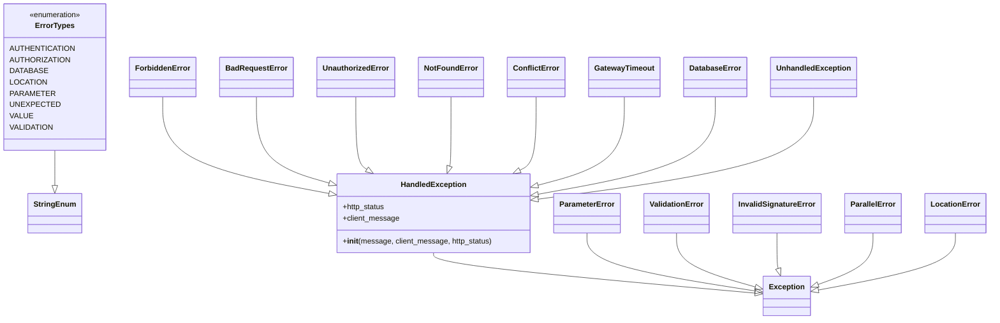

# Diagram: application_service/container_tracking_app_service/common/error.py


> Auto-generated by Obscura crawlers

## Diagram 1



### SVG

<svg id="container" width="2032.029296875" xmlns="http://www.w3.org/2000/svg" class="classDiagram" height="680" viewBox="0 0 2032.029296875 680" role="graphics-document document" aria-roledescription="class"><style>#container{font-family:"trebuchet ms",verdana,arial,sans-serif;font-size:16px;fill:#333;}@keyframes edge-animation-frame{from{stroke-dashoffset:0;}}@keyframes dash{to{stroke-dashoffset:0;}}#container .edge-animation-slow{stroke-dasharray:9,5!important;stroke-dashoffset:900;animation:dash 50s linear infinite;stroke-linecap:round;}#container .edge-animation-fast{stroke-dasharray:9,5!important;stroke-dashoffset:900;animation:dash 20s linear infinite;stroke-linecap:round;}#container .error-icon{fill:#552222;}#container .error-text{fill:#552222;stroke:#552222;}#container .edge-thickness-normal{stroke-width:1px;}#container .edge-thickness-thick{stroke-width:3.5px;}#container .edge-pattern-solid{stroke-dasharray:0;}#container .edge-thickness-invisible{stroke-width:0;fill:none;}#container .edge-pattern-dashed{stroke-dasharray:3;}#container .edge-pattern-dotted{stroke-dasharray:2;}#container .marker{fill:#333333;stroke:#333333;}#container .marker.cross{stroke:#333333;}#container svg{font-family:"trebuchet ms",verdana,arial,sans-serif;font-size:16px;}#container p{margin:0;}#container g.classGroup text{fill:#9370DB;stroke:none;font-family:"trebuchet ms",verdana,arial,sans-serif;font-size:10px;}#container g.classGroup text .title{font-weight:bolder;}#container .nodeLabel,#container .edgeLabel{color:#131300;}#container .edgeLabel .label rect{fill:#ECECFF;}#container .label text{fill:#131300;}#container .labelBkg{background:#ECECFF;}#container .edgeLabel .label span{background:#ECECFF;}#container .classTitle{font-weight:bolder;}#container .node rect,#container .node circle,#container .node ellipse,#container .node polygon,#container .node path{fill:#ECECFF;stroke:#9370DB;stroke-width:1px;}#container .divider{stroke:#9370DB;stroke-width:1;}#container g.clickable{cursor:pointer;}#container g.classGroup rect{fill:#ECECFF;stroke:#9370DB;}#container g.classGroup line{stroke:#9370DB;stroke-width:1;}#container .classLabel .box{stroke:none;stroke-width:0;fill:#ECECFF;opacity:0.5;}#container .classLabel .label{fill:#9370DB;font-size:10px;}#container .relation{stroke:#333333;stroke-width:1;fill:none;}#container .dashed-line{stroke-dasharray:3;}#container .dotted-line{stroke-dasharray:1 2;}#container #compositionStart,#container .composition{fill:#333333!important;stroke:#333333!important;stroke-width:1;}#container #compositionEnd,#container .composition{fill:#333333!important;stroke:#333333!important;stroke-width:1;}#container #dependencyStart,#container .dependency{fill:#333333!important;stroke:#333333!important;stroke-width:1;}#container #dependencyStart,#container .dependency{fill:#333333!important;stroke:#333333!important;stroke-width:1;}#container #extensionStart,#container .extension{fill:transparent!important;stroke:#333333!important;stroke-width:1;}#container #extensionEnd,#container .extension{fill:transparent!important;stroke:#333333!important;stroke-width:1;}#container #aggregationStart,#container .aggregation{fill:transparent!important;stroke:#333333!important;stroke-width:1;}#container #aggregationEnd,#container .aggregation{fill:transparent!important;stroke:#333333!important;stroke-width:1;}#container #lollipopStart,#container .lollipop{fill:#ECECFF!important;stroke:#333333!important;stroke-width:1;}#container #lollipopEnd,#container .lollipop{fill:#ECECFF!important;stroke:#333333!important;stroke-width:1;}#container .edgeTerminals{font-size:11px;line-height:initial;}#container .classTitleText{text-anchor:middle;font-size:18px;fill:#333;}#container .label-icon{display:inline-block;height:1em;overflow:visible;vertical-align:-0.125em;}#container .node .label-icon path{fill:currentColor;stroke:revert;stroke-width:revert;}#container :root{--mermaid-font-family:"trebuchet ms",verdana,arial,sans-serif;}</style><g><defs><marker id="container_class-aggregationStart" class="marker aggregation class" refX="18" refY="7" markerWidth="190" markerHeight="240" orient="auto"><path d="M 18,7 L9,13 L1,7 L9,1 Z"></path></marker></defs><defs><marker id="container_class-aggregationEnd" class="marker aggregation class" refX="1" refY="7" markerWidth="20" markerHeight="28" orient="auto"><path d="M 18,7 L9,13 L1,7 L9,1 Z"></path></marker></defs><defs><marker id="container_class-extensionStart" class="marker extension class" refX="18" refY="7" markerWidth="190" markerHeight="240" orient="auto"><path d="M 1,7 L18,13 V 1 Z"></path></marker></defs><defs><marker id="container_class-extensionEnd" class="marker extension class" refX="1" refY="7" markerWidth="20" markerHeight="28" orient="auto"><path d="M 1,1 V 13 L18,7 Z"></path></marker></defs><defs><marker id="container_class-compositionStart" class="marker composition class" refX="18" refY="7" markerWidth="190" markerHeight="240" orient="auto"><path d="M 18,7 L9,13 L1,7 L9,1 Z"></path></marker></defs><defs><marker id="container_class-compositionEnd" class="marker composition class" refX="1" refY="7" markerWidth="20" markerHeight="28" orient="auto"><path d="M 18,7 L9,13 L1,7 L9,1 Z"></path></marker></defs><defs><marker id="container_class-dependencyStart" class="marker dependency class" refX="6" refY="7" markerWidth="190" markerHeight="240" orient="auto"><path d="M 5,7 L9,13 L1,7 L9,1 Z"></path></marker></defs><defs><marker id="container_class-dependencyEnd" class="marker dependency class" refX="13" refY="7" markerWidth="20" markerHeight="28" orient="auto"><path d="M 18,7 L9,13 L14,7 L9,1 Z"></path></marker></defs><defs><marker id="container_class-lollipopStart" class="marker lollipop class" refX="13" refY="7" markerWidth="190" markerHeight="240" orient="auto"><circle stroke="black" fill="transparent" cx="7" cy="7" r="6"></circle></marker></defs><defs><marker id="container_class-lollipopEnd" class="marker lollipop class" refX="1" refY="7" markerWidth="190" markerHeight="240" orient="auto"><circle stroke="black" fill="transparent" cx="7" cy="7" r="6"></circle></marker></defs><g class="root"><g class="clusters"></g><g class="edgePaths"><path d="M109.559,320L109.559,324.167C109.559,328.333,109.559,336.667,109.559,349.125C109.559,361.583,109.559,378.167,109.559,386.458L109.559,394.75" id="id_ErrorTypes_StringEnum_1" class="edge-thickness-normal edge-pattern-solid relation" style=";;;" data-edge="true" data-et="edge" data-id="id_ErrorTypes_StringEnum_1" data-points="W3sieCI6MTA5LjU1ODU5Mzc1LCJ5IjozMjB9LHsieCI6MTA5LjU1ODU5Mzc1LCJ5IjozNDV9LHsieCI6MTA5LjU1ODU5Mzc1LCJ5Ijo0MTJ9XQ==" marker-end="url(#container_class-extensionEnd)"></path><path d="M882.244,538L882.244,542.167C882.244,546.333,882.244,554.667,993.667,569.012C1105.089,583.358,1327.934,603.715,1439.356,613.894L1550.779,624.073" id="id_HandledException_Exception_2" class="edge-thickness-normal edge-pattern-solid relation" style=";;;" data-edge="true" data-et="edge" data-id="id_HandledException_Exception_2" data-points="W3sieCI6ODgyLjI0NDE0MDYyNSwieSI6NTM4fSx7IngiOjg4Mi4yNDQxNDA2MjUsInkiOjU2M30seyJ4IjoxNTY3Ljk1NzAzMTI1LCJ5Ijo2MjUuNjQyMTYwMzc0MzE4Nn1d" marker-end="url(#container_class-extensionEnd)"></path><path d="M328.469,206L328.469,229.167C328.469,252.333,328.469,298.667,384.138,332.791C439.808,366.915,551.147,388.83,606.817,399.788L662.487,410.745" id="id_ForbiddenError_HandledException_3" class="edge-thickness-normal edge-pattern-solid relation" style=";;;" data-edge="true" data-et="edge" data-id="id_ForbiddenError_HandledException_3" data-points="W3sieCI6MzI4LjQ2ODc1LCJ5IjoyMDZ9LHsieCI6MzI4LjQ2ODc1LCJ5IjozNDV9LHsieCI6Njc5LjQxMjEwOTM3NSwieSI6NDE0LjA3NjQyODQ5MzMzMjM0fV0=" marker-end="url(#container_class-extensionEnd)"></path><path d="M520.102,206L520.102,229.167C520.102,252.333,520.102,298.667,543.9,328.996C567.699,359.326,615.297,373.652,639.095,380.816L662.894,387.979" id="id_BadRequestError_HandledException_4" class="edge-thickness-normal edge-pattern-solid relation" style=";;;" data-edge="true" data-et="edge" data-id="id_BadRequestError_HandledException_4" data-points="W3sieCI6NTIwLjEwMTU2MjUsInkiOjIwNn0seyJ4Ijo1MjAuMTAxNTYyNSwieSI6MzQ1fSx7IngiOjY3OS40MTIxMDkzNzUsInkiOjM5Mi45NTAzMTE5OTk0MzkxfV0=" marker-end="url(#container_class-extensionEnd)"></path><path d="M724.008,206L724.008,229.167C724.008,252.333,724.008,298.667,727.689,324.369C731.37,350.071,738.732,355.143,742.414,357.679L746.095,360.214" id="id_UnauthorizedError_HandledException_5" class="edge-thickness-normal edge-pattern-solid relation" style=";;;" data-edge="true" data-et="edge" data-id="id_UnauthorizedError_HandledException_5" data-points="W3sieCI6NzI0LjAwNzgxMjUsInkiOjIwNn0seyJ4Ijo3MjQuMDA3ODEyNSwieSI6MzQ1fSx7IngiOjc2MC4zMDA1NDgzMDg0ODYyLCJ5IjozNzB9XQ==" marker-end="url(#container_class-extensionEnd)"></path><path d="M919.164,206L919.164,229.167C919.164,252.333,919.164,298.667,918.675,323.277C918.186,347.887,917.208,350.775,916.719,352.218L916.23,353.662" id="id_NotFoundError_HandledException_6" class="edge-thickness-normal edge-pattern-solid relation" style=";;;" data-edge="true" data-et="edge" data-id="id_NotFoundError_HandledException_6" data-points="W3sieCI6OTE5LjE2NDA2MjUsInkiOjIwNn0seyJ4Ijo5MTkuMTY0MDYyNSwieSI6MzQ1fSx7IngiOjkxMC42OTYxOTA1MTAzMjExLCJ5IjozNzB9XQ==" marker-end="url(#container_class-extensionEnd)"></path><path d="M1092.836,206L1092.836,229.167C1092.836,252.333,1092.836,298.667,1087.339,324.678C1081.842,350.69,1070.848,356.381,1065.352,359.226L1059.855,362.071" id="id_ConflictError_HandledException_7" class="edge-thickness-normal edge-pattern-solid relation" style=";;;" data-edge="true" data-et="edge" data-id="id_ConflictError_HandledException_7" data-points="W3sieCI6MTA5Mi44MzU5Mzc1LCJ5IjoyMDZ9LHsieCI6MTA5Mi44MzU5Mzc1LCJ5IjozNDV9LHsieCI6MTA0NC41MzUwNjY2NTcxMSwieSI6MzcwfV0=" marker-end="url(#container_class-extensionEnd)"></path><path d="M1274.258,206L1274.258,229.167C1274.258,252.333,1274.258,298.667,1245.497,329.83C1216.737,360.994,1159.216,376.987,1130.456,384.984L1101.696,392.981" id="id_GatewayTimeout_HandledException_8" class="edge-thickness-normal edge-pattern-solid relation" style=";;;" data-edge="true" data-et="edge" data-id="id_GatewayTimeout_HandledException_8" data-points="W3sieCI6MTI3NC4yNTc4MTI1LCJ5IjoyMDZ9LHsieCI6MTI3NC4yNTc4MTI1LCJ5IjozNDV9LHsieCI6MTA4NS4wNzYxNzE4NzUsInkiOjM5Ny42MDIyNDQwMjI1MDAwM31d" marker-end="url(#container_class-extensionEnd)"></path><path d="M1461.898,206L1461.898,229.167C1461.898,252.333,1461.898,298.667,1401.92,333.112C1341.942,367.557,1221.986,390.114,1162.007,401.392L1102.029,412.671" id="id_DatabaseError_HandledException_9" class="edge-thickness-normal edge-pattern-solid relation" style=";;;" data-edge="true" data-et="edge" data-id="id_DatabaseError_HandledException_9" data-points="W3sieCI6MTQ2MS44OTg0Mzc1LCJ5IjoyMDZ9LHsieCI6MTQ2MS44OTg0Mzc1LCJ5IjozNDV9LHsieCI6MTA4NS4wNzYxNzE4NzUsInkiOjQxNS44NTg4MzI4ODQ2MzI5fV0=" marker-end="url(#container_class-extensionEnd)"></path><path d="M1663.75,206L1663.75,229.167C1663.75,252.333,1663.75,298.667,1570.152,334.888C1476.554,371.109,1289.357,397.218,1195.759,410.273L1102.161,423.327" id="id_UnhandledException_HandledException_10" class="edge-thickness-normal edge-pattern-solid relation" style=";;;" data-edge="true" data-et="edge" data-id="id_UnhandledException_HandledException_10" data-points="W3sieCI6MTY2My43NSwieSI6MjA2fSx7IngiOjE2NjMuNzUsInkiOjM0NX0seyJ4IjoxMDg1LjA3NjE3MTg3NSwieSI6NDI1LjcxMDEzOTkyOTE3MzJ9XQ==" marker-end="url(#container_class-extensionEnd)"></path><path d="M1203.092,496L1203.092,507.167C1203.092,518.333,1203.092,540.667,1261.065,561.248C1319.038,581.829,1434.984,600.659,1492.957,610.073L1550.93,619.488" id="id_ParameterError_Exception_11" class="edge-thickness-normal edge-pattern-solid relation" style=";;;" data-edge="true" data-et="edge" data-id="id_ParameterError_Exception_11" data-points="W3sieCI6MTIwMy4wOTE3OTY4NzUsInkiOjQ5Nn0seyJ4IjoxMjAzLjA5MTc5Njg3NSwieSI6NTYzfSx7IngiOjE1NjcuOTU3MDMxMjUsInkiOjYyMi4yNTMxMzk4Njc5MTk2fV0=" marker-end="url(#container_class-extensionEnd)"></path><path d="M1388.287,496L1388.287,507.167C1388.287,518.333,1388.287,540.667,1415.474,559.845C1442.662,579.023,1497.036,595.045,1524.223,603.056L1551.41,611.068" id="id_ValidationError_Exception_12" class="edge-thickness-normal edge-pattern-solid relation" style=";;;" data-edge="true" data-et="edge" data-id="id_ValidationError_Exception_12" data-points="W3sieCI6MTM4OC4yODcxMDkzNzUsInkiOjQ5Nn0seyJ4IjoxMzg4LjI4NzEwOTM3NSwieSI6NTYzfSx7IngiOjE1NjcuOTU3MDMxMjUsInkiOjYxNS45NDMzMjM0NTQ4ODEyfV0=" marker-end="url(#container_class-extensionEnd)"></path><path d="M1595.521,496L1595.521,507.167C1595.521,518.333,1595.521,540.667,1595.946,553.247C1596.371,565.827,1597.221,568.653,1597.646,570.067L1598.07,571.48" id="id_InvalidSignatureError_Exception_13" class="edge-thickness-normal edge-pattern-solid relation" style=";;;" data-edge="true" data-et="edge" data-id="id_InvalidSignatureError_Exception_13" data-points="W3sieCI6MTU5NS41MjE0ODQzNzUsInkiOjQ5Nn0seyJ4IjoxNTk1LjUyMTQ4NDM3NSwieSI6NTYzfSx7IngiOjE2MDMuMDM1OTE0MTc5MTA0NiwieSI6NTg4fV0=" marker-end="url(#container_class-extensionEnd)"></path><path d="M1793.271,496L1793.271,507.167C1793.271,518.333,1793.271,540.667,1774.31,558.986C1755.349,577.306,1717.426,591.611,1698.465,598.764L1679.503,605.917" id="id_ParallelError_Exception_14" class="edge-thickness-normal edge-pattern-solid relation" style=";;;" data-edge="true" data-et="edge" data-id="id_ParallelError_Exception_14" data-points="W3sieCI6MTc5My4yNzE0ODQzNzUsInkiOjQ5Nn0seyJ4IjoxNzkzLjI3MTQ4NDM3NSwieSI6NTYzfSx7IngiOjE2NjMuMzYzMjgxMjUsInkiOjYxMi4wMDUwMzY0NTM4MDg3fV0=" marker-end="url(#container_class-extensionEnd)"></path><path d="M1962.498,496L1962.498,507.167C1962.498,518.333,1962.498,540.667,1915.465,560.919C1868.432,581.171,1774.366,599.342,1727.333,608.428L1680.3,617.513" id="id_LocationError_Exception_15" class="edge-thickness-normal edge-pattern-solid relation" style=";;;" data-edge="true" data-et="edge" data-id="id_LocationError_Exception_15" data-points="W3sieCI6MTk2Mi40OTgwNDY4NzUsInkiOjQ5Nn0seyJ4IjoxOTYyLjQ5ODA0Njg3NSwieSI6NTYzfSx7IngiOjE2NjMuMzYzMjgxMjUsInkiOjYyMC43ODUwMDUxNTI1NzgzfV0=" marker-end="url(#container_class-extensionEnd)"></path></g><g class="edgeLabels"><g class="edgeLabel"><g class="label" data-id="id_ErrorTypes_StringEnum_1" transform="translate(0, 0)"><foreignObject width="0" height="0"><div xmlns="http://www.w3.org/1999/xhtml" class="labelBkg" style="display: table-cell; white-space: nowrap; line-height: 1.5; max-width: 200px; text-align: center;"><span class="edgeLabel"></span></div></foreignObject></g></g><g class="edgeLabel"><g class="label" data-id="id_HandledException_Exception_2" transform="translate(0, 0)"><foreignObject width="0" height="0"><div xmlns="http://www.w3.org/1999/xhtml" class="labelBkg" style="display: table-cell; white-space: nowrap; line-height: 1.5; max-width: 200px; text-align: center;"><span class="edgeLabel"></span></div></foreignObject></g></g><g class="edgeLabel"><g class="label" data-id="id_ForbiddenError_HandledException_3" transform="translate(0, 0)"><foreignObject width="0" height="0"><div xmlns="http://www.w3.org/1999/xhtml" class="labelBkg" style="display: table-cell; white-space: nowrap; line-height: 1.5; max-width: 200px; text-align: center;"><span class="edgeLabel"></span></div></foreignObject></g></g><g class="edgeLabel"><g class="label" data-id="id_BadRequestError_HandledException_4" transform="translate(0, 0)"><foreignObject width="0" height="0"><div xmlns="http://www.w3.org/1999/xhtml" class="labelBkg" style="display: table-cell; white-space: nowrap; line-height: 1.5; max-width: 200px; text-align: center;"><span class="edgeLabel"></span></div></foreignObject></g></g><g class="edgeLabel"><g class="label" data-id="id_UnauthorizedError_HandledException_5" transform="translate(0, 0)"><foreignObject width="0" height="0"><div xmlns="http://www.w3.org/1999/xhtml" class="labelBkg" style="display: table-cell; white-space: nowrap; line-height: 1.5; max-width: 200px; text-align: center;"><span class="edgeLabel"></span></div></foreignObject></g></g><g class="edgeLabel"><g class="label" data-id="id_NotFoundError_HandledException_6" transform="translate(0, 0)"><foreignObject width="0" height="0"><div xmlns="http://www.w3.org/1999/xhtml" class="labelBkg" style="display: table-cell; white-space: nowrap; line-height: 1.5; max-width: 200px; text-align: center;"><span class="edgeLabel"></span></div></foreignObject></g></g><g class="edgeLabel"><g class="label" data-id="id_ConflictError_HandledException_7" transform="translate(0, 0)"><foreignObject width="0" height="0"><div xmlns="http://www.w3.org/1999/xhtml" class="labelBkg" style="display: table-cell; white-space: nowrap; line-height: 1.5; max-width: 200px; text-align: center;"><span class="edgeLabel"></span></div></foreignObject></g></g><g class="edgeLabel"><g class="label" data-id="id_GatewayTimeout_HandledException_8" transform="translate(0, 0)"><foreignObject width="0" height="0"><div xmlns="http://www.w3.org/1999/xhtml" class="labelBkg" style="display: table-cell; white-space: nowrap; line-height: 1.5; max-width: 200px; text-align: center;"><span class="edgeLabel"></span></div></foreignObject></g></g><g class="edgeLabel"><g class="label" data-id="id_DatabaseError_HandledException_9" transform="translate(0, 0)"><foreignObject width="0" height="0"><div xmlns="http://www.w3.org/1999/xhtml" class="labelBkg" style="display: table-cell; white-space: nowrap; line-height: 1.5; max-width: 200px; text-align: center;"><span class="edgeLabel"></span></div></foreignObject></g></g><g class="edgeLabel"><g class="label" data-id="id_UnhandledException_HandledException_10" transform="translate(0, 0)"><foreignObject width="0" height="0"><div xmlns="http://www.w3.org/1999/xhtml" class="labelBkg" style="display: table-cell; white-space: nowrap; line-height: 1.5; max-width: 200px; text-align: center;"><span class="edgeLabel"></span></div></foreignObject></g></g><g class="edgeLabel"><g class="label" data-id="id_ParameterError_Exception_11" transform="translate(0, 0)"><foreignObject width="0" height="0"><div xmlns="http://www.w3.org/1999/xhtml" class="labelBkg" style="display: table-cell; white-space: nowrap; line-height: 1.5; max-width: 200px; text-align: center;"><span class="edgeLabel"></span></div></foreignObject></g></g><g class="edgeLabel"><g class="label" data-id="id_ValidationError_Exception_12" transform="translate(0, 0)"><foreignObject width="0" height="0"><div xmlns="http://www.w3.org/1999/xhtml" class="labelBkg" style="display: table-cell; white-space: nowrap; line-height: 1.5; max-width: 200px; text-align: center;"><span class="edgeLabel"></span></div></foreignObject></g></g><g class="edgeLabel"><g class="label" data-id="id_InvalidSignatureError_Exception_13" transform="translate(0, 0)"><foreignObject width="0" height="0"><div xmlns="http://www.w3.org/1999/xhtml" class="labelBkg" style="display: table-cell; white-space: nowrap; line-height: 1.5; max-width: 200px; text-align: center;"><span class="edgeLabel"></span></div></foreignObject></g></g><g class="edgeLabel"><g class="label" data-id="id_ParallelError_Exception_14" transform="translate(0, 0)"><foreignObject width="0" height="0"><div xmlns="http://www.w3.org/1999/xhtml" class="labelBkg" style="display: table-cell; white-space: nowrap; line-height: 1.5; max-width: 200px; text-align: center;"><span class="edgeLabel"></span></div></foreignObject></g></g><g class="edgeLabel"><g class="label" data-id="id_LocationError_Exception_15" transform="translate(0, 0)"><foreignObject width="0" height="0"><div xmlns="http://www.w3.org/1999/xhtml" class="labelBkg" style="display: table-cell; white-space: nowrap; line-height: 1.5; max-width: 200px; text-align: center;"><span class="edgeLabel"></span></div></foreignObject></g></g></g><g class="nodes"><g class="node default" id="classId-ErrorTypes-0" transform="translate(109.55859375, 164)"><g class="basic label-container"><path d="M-101.55859375 -156 L101.55859375 -156 L101.55859375 156 L-101.55859375 156" stroke="none" stroke-width="0" fill="#ECECFF" style=""></path><path d="M-101.55859375 -156 C-43.41682405032266 -156, 14.72494564935468 -156, 101.55859375 -156 M-101.55859375 -156 C-39.5192661863258 -156, 22.520061377348398 -156, 101.55859375 -156 M101.55859375 -156 C101.55859375 -47.24507989154928, 101.55859375 61.50984021690144, 101.55859375 156 M101.55859375 -156 C101.55859375 -81.45516287930796, 101.55859375 -6.910325758615926, 101.55859375 156 M101.55859375 156 C27.09792948058208 156, -47.36273478883584 156, -101.55859375 156 M101.55859375 156 C41.50518176613374 156, -18.548230217732524 156, -101.55859375 156 M-101.55859375 156 C-101.55859375 58.82839448135529, -101.55859375 -38.34321103728942, -101.55859375 -156 M-101.55859375 156 C-101.55859375 64.93655255174586, -101.55859375 -26.126894896508276, -101.55859375 -156" stroke="#9370DB" stroke-width="1.3" fill="none" stroke-dasharray="0 0" style=""></path></g><g class="annotation-group text" transform="translate(-55.5546875, -132)"><g class="label" style="" transform="translate(0,-12)"><foreignObject width="111.109375" height="24"><div xmlns="http://www.w3.org/1999/xhtml" style="display: table-cell; white-space: nowrap; line-height: 1.5; max-width: 161px; text-align: center;"><span class="nodeLabel markdown-node-label" style=""><p>«enumeration»</p></span></div></foreignObject></g></g><g class="label-group text" transform="translate(-39.390625, -108)"><g class="label" style="font-weight: bolder" transform="translate(0,-12)"><foreignObject width="78.78125" height="24"><div xmlns="http://www.w3.org/1999/xhtml" style="display: table-cell; white-space: nowrap; line-height: 1.5; max-width: 127px; text-align: center;"><span class="nodeLabel markdown-node-label" style=""><p>ErrorTypes</p></span></div></foreignObject></g></g><g class="members-group text" transform="translate(-89.55859375, -60)"><g class="label" style="" transform="translate(0,-12)"><foreignObject width="123.5625" height="24"><div xmlns="http://www.w3.org/1999/xhtml" style="display: table-cell; white-space: nowrap; line-height: 1.5; max-width: 174px; text-align: center;"><span class="nodeLabel markdown-node-label" style=""><p>AUTHENTICATION</p></span></div></foreignObject></g><g class="label" style="" transform="translate(0,12)"><foreignObject width="115.9375" height="24"><div xmlns="http://www.w3.org/1999/xhtml" style="display: table-cell; white-space: nowrap; line-height: 1.5; max-width: 166px; text-align: center;"><span class="nodeLabel markdown-node-label" style=""><p>AUTHORIZATION</p></span></div></foreignObject></g><g class="label" style="" transform="translate(0,36)"><foreignObject width="71.25" height="24"><div xmlns="http://www.w3.org/1999/xhtml" style="display: table-cell; white-space: nowrap; line-height: 1.5; max-width: 121px; text-align: center;"><span class="nodeLabel markdown-node-label" style=""><p>DATABASE</p></span></div></foreignObject></g><g class="label" style="" transform="translate(0,60)"><foreignObject width="70.640625" height="24"><div xmlns="http://www.w3.org/1999/xhtml" style="display: table-cell; white-space: nowrap; line-height: 1.5; max-width: 121px; text-align: center;"><span class="nodeLabel markdown-node-label" style=""><p>LOCATION</p></span></div></foreignObject></g><g class="label" style="" transform="translate(0,84)"><foreignObject width="83.875" height="24"><div xmlns="http://www.w3.org/1999/xhtml" style="display: table-cell; white-space: nowrap; line-height: 1.5; max-width: 134px; text-align: center;"><span class="nodeLabel markdown-node-label" style=""><p>PARAMETER</p></span></div></foreignObject></g><g class="label" style="" transform="translate(0,108)"><foreignObject width="92.328125" height="24"><div xmlns="http://www.w3.org/1999/xhtml" style="display: table-cell; white-space: nowrap; line-height: 1.5; max-width: 142px; text-align: center;"><span class="nodeLabel markdown-node-label" style=""><p>UNEXPECTED</p></span></div></foreignObject></g><g class="label" style="" transform="translate(0,132)"><foreignObject width="44.5625" height="24"><div xmlns="http://www.w3.org/1999/xhtml" style="display: table-cell; white-space: nowrap; line-height: 1.5; max-width: 95px; text-align: center;"><span class="nodeLabel markdown-node-label" style=""><p>VALUE</p></span></div></foreignObject></g><g class="label" style="" transform="translate(0,156)"><foreignObject width="84.046875" height="24"><div xmlns="http://www.w3.org/1999/xhtml" style="display: table-cell; white-space: nowrap; line-height: 1.5; max-width: 134px; text-align: center;"><span class="nodeLabel markdown-node-label" style=""><p>VALIDATION</p></span></div></foreignObject></g></g><g class="methods-group text" transform="translate(-89.55859375, 156)"></g><g class="divider" style=""><path d="M-101.55859375 -84 C-23.78590535941626 -84, 53.98678303116748 -84, 101.55859375 -84 M-101.55859375 -84 C-58.41937659586956 -84, -15.280159441739116 -84, 101.55859375 -84" stroke="#9370DB" stroke-width="1.3" fill="none" stroke-dasharray="0 0" style=""></path></g><g class="divider" style=""><path d="M-101.55859375 132 C-42.240155933199944 132, 17.078281883600113 132, 101.55859375 132 M-101.55859375 132 C-50.915404801736955 132, -0.2722158534739094 132, 101.55859375 132" stroke="#9370DB" stroke-width="1.3" fill="none" stroke-dasharray="0 0" style=""></path></g></g><g class="node default" id="classId-StringEnum-1" transform="translate(109.55859375, 454)"><g class="basic label-container"><path d="M-54.234375 -42 L54.234375 -42 L54.234375 42 L-54.234375 42" stroke="none" stroke-width="0" fill="#ECECFF" style=""></path><path d="M-54.234375 -42 C-21.667614230927313 -42, 10.899146538145374 -42, 54.234375 -42 M-54.234375 -42 C-32.25107062217208 -42, -10.267766244344166 -42, 54.234375 -42 M54.234375 -42 C54.234375 -22.306369389921613, 54.234375 -2.6127387798432267, 54.234375 42 M54.234375 -42 C54.234375 -20.466137791900888, 54.234375 1.0677244161982244, 54.234375 42 M54.234375 42 C13.438538936472511 42, -27.357297127054977 42, -54.234375 42 M54.234375 42 C12.621893380172487 42, -28.990588239655025 42, -54.234375 42 M-54.234375 42 C-54.234375 15.940025356525016, -54.234375 -10.119949286949968, -54.234375 -42 M-54.234375 42 C-54.234375 14.031457112462117, -54.234375 -13.937085775075765, -54.234375 -42" stroke="#9370DB" stroke-width="1.3" fill="none" stroke-dasharray="0 0" style=""></path></g><g class="annotation-group text" transform="translate(0, -18)"></g><g class="label-group text" transform="translate(-42.234375, -18)"><g class="label" style="font-weight: bolder" transform="translate(0,-12)"><foreignObject width="84.46875" height="24"><div xmlns="http://www.w3.org/1999/xhtml" style="display: table-cell; white-space: nowrap; line-height: 1.5; max-width: 134px; text-align: center;"><span class="nodeLabel markdown-node-label" style=""><p>StringEnum</p></span></div></foreignObject></g></g><g class="members-group text" transform="translate(-42.234375, 30)"></g><g class="methods-group text" transform="translate(-42.234375, 60)"></g><g class="divider" style=""><path d="M-54.234375 6 C-24.84671434114298 6, 4.540946317714038 6, 54.234375 6 M-54.234375 6 C-31.790356773277647 6, -9.346338546555295 6, 54.234375 6" stroke="#9370DB" stroke-width="1.3" fill="none" stroke-dasharray="0 0" style=""></path></g><g class="divider" style=""><path d="M-54.234375 24 C-15.932882289476773 24, 22.368610421046455 24, 54.234375 24 M-54.234375 24 C-29.290937951126562 24, -4.347500902253124 24, 54.234375 24" stroke="#9370DB" stroke-width="1.3" fill="none" stroke-dasharray="0 0" style=""></path></g></g><g class="node default" id="classId-HandledException-2" transform="translate(882.244140625, 454)"><g class="basic label-container"><path d="M-202.83203125 -84 L202.83203125 -84 L202.83203125 84 L-202.83203125 84" stroke="none" stroke-width="0" fill="#ECECFF" style=""></path><path d="M-202.83203125 -84 C-41.110165557540114 -84, 120.61170013491977 -84, 202.83203125 -84 M-202.83203125 -84 C-102.63900073397603 -84, -2.445970217952066 -84, 202.83203125 -84 M202.83203125 -84 C202.83203125 -25.333394758487167, 202.83203125 33.33321048302567, 202.83203125 84 M202.83203125 -84 C202.83203125 -29.175156210189115, 202.83203125 25.64968757962177, 202.83203125 84 M202.83203125 84 C63.086736724693964 84, -76.65855780061207 84, -202.83203125 84 M202.83203125 84 C41.13573025771208 84, -120.56057073457583 84, -202.83203125 84 M-202.83203125 84 C-202.83203125 23.79353781080573, -202.83203125 -36.41292437838854, -202.83203125 -84 M-202.83203125 84 C-202.83203125 21.194732162513738, -202.83203125 -41.610535674972525, -202.83203125 -84" stroke="#9370DB" stroke-width="1.3" fill="none" stroke-dasharray="0 0" style=""></path></g><g class="annotation-group text" transform="translate(0, -60)"></g><g class="label-group text" transform="translate(-66.3828125, -60)"><g class="label" style="font-weight: bolder" transform="translate(0,-12)"><foreignObject width="132.765625" height="24"><div xmlns="http://www.w3.org/1999/xhtml" style="display: table-cell; white-space: nowrap; line-height: 1.5; max-width: 182px; text-align: center;"><span class="nodeLabel markdown-node-label" style=""><p>HandledException</p></span></div></foreignObject></g></g><g class="members-group text" transform="translate(-190.83203125, -12)"><g class="label" style="" transform="translate(0,-12)"><foreignObject width="90.828125" height="24"><div xmlns="http://www.w3.org/1999/xhtml" style="display: table-cell; white-space: nowrap; line-height: 1.5; max-width: 148px; text-align: center;"><span class="nodeLabel markdown-node-label" style=""><p>+http_status</p></span></div></foreignObject></g><g class="label" style="" transform="translate(0,12)"><foreignObject width="119.421875" height="24"><div xmlns="http://www.w3.org/1999/xhtml" style="display: table-cell; white-space: nowrap; line-height: 1.5; max-width: 177px; text-align: center;"><span class="nodeLabel markdown-node-label" style=""><p>+client_message</p></span></div></foreignObject></g></g><g class="methods-group text" transform="translate(-190.83203125, 60)"><g class="label" style="" transform="translate(0,-12)"><foreignObject width="315.28125" height="24"><div xmlns="http://www.w3.org/1999/xhtml" style="display: table-cell; white-space: nowrap; line-height: 1.5; max-width: 404px; text-align: center;"><span class="nodeLabel markdown-node-label" style=""><p>+<strong>init</strong>(message, client_message, http_status)</p></span></div></foreignObject></g></g><g class="divider" style=""><path d="M-202.83203125 -36 C-118.98710776652584 -36, -35.14218428305168 -36, 202.83203125 -36 M-202.83203125 -36 C-45.23738556600503 -36, 112.35726011798994 -36, 202.83203125 -36" stroke="#9370DB" stroke-width="1.3" fill="none" stroke-dasharray="0 0" style=""></path></g><g class="divider" style=""><path d="M-202.83203125 36 C-95.67402031432322 36, 11.48399062135357 36, 202.83203125 36 M-202.83203125 36 C-50.42474301689748 36, 101.98254521620504 36, 202.83203125 36" stroke="#9370DB" stroke-width="1.3" fill="none" stroke-dasharray="0 0" style=""></path></g></g><g class="node default" id="classId-Exception-3" transform="translate(1615.66015625, 630)"><g class="basic label-container"><path d="M-47.703125 -42 L47.703125 -42 L47.703125 42 L-47.703125 42" stroke="none" stroke-width="0" fill="#ECECFF" style=""></path><path d="M-47.703125 -42 C-25.46472765247356 -42, -3.226330304947119 -42, 47.703125 -42 M-47.703125 -42 C-27.051024243534652 -42, -6.398923487069304 -42, 47.703125 -42 M47.703125 -42 C47.703125 -13.038155523006164, 47.703125 15.923688953987671, 47.703125 42 M47.703125 -42 C47.703125 -23.811599408866993, 47.703125 -5.623198817733986, 47.703125 42 M47.703125 42 C15.016218623139586 42, -17.670687753720827 42, -47.703125 42 M47.703125 42 C23.35841770146963 42, -0.9862895970607397 42, -47.703125 42 M-47.703125 42 C-47.703125 20.347904002006555, -47.703125 -1.3041919959868906, -47.703125 -42 M-47.703125 42 C-47.703125 22.50827401392172, -47.703125 3.0165480278434416, -47.703125 -42" stroke="#9370DB" stroke-width="1.3" fill="none" stroke-dasharray="0 0" style=""></path></g><g class="annotation-group text" transform="translate(0, -18)"></g><g class="label-group text" transform="translate(-35.703125, -18)"><g class="label" style="font-weight: bolder" transform="translate(0,-12)"><foreignObject width="71.40625" height="24"><div xmlns="http://www.w3.org/1999/xhtml" style="display: table-cell; white-space: nowrap; line-height: 1.5; max-width: 121px; text-align: center;"><span class="nodeLabel markdown-node-label" style=""><p>Exception</p></span></div></foreignObject></g></g><g class="members-group text" transform="translate(-35.703125, 30)"></g><g class="methods-group text" transform="translate(-35.703125, 60)"></g><g class="divider" style=""><path d="M-47.703125 6 C-12.685883023965012 6, 22.331358952069976 6, 47.703125 6 M-47.703125 6 C-27.974584747783954 6, -8.246044495567908 6, 47.703125 6" stroke="#9370DB" stroke-width="1.3" fill="none" stroke-dasharray="0 0" style=""></path></g><g class="divider" style=""><path d="M-47.703125 24 C-14.008271036934907 24, 19.686582926130185 24, 47.703125 24 M-47.703125 24 C-14.5601570566619 24, 18.5828108866762 24, 47.703125 24" stroke="#9370DB" stroke-width="1.3" fill="none" stroke-dasharray="0 0" style=""></path></g></g><g class="node default" id="classId-ForbiddenError-4" transform="translate(328.46875, 164)"><g class="basic label-container"><path d="M-67.3515625 -42 L67.3515625 -42 L67.3515625 42 L-67.3515625 42" stroke="none" stroke-width="0" fill="#ECECFF" style=""></path><path d="M-67.3515625 -42 C-32.607957194921056 -42, 2.135648110157888 -42, 67.3515625 -42 M-67.3515625 -42 C-29.869444630885468 -42, 7.612673238229064 -42, 67.3515625 -42 M67.3515625 -42 C67.3515625 -23.84262682490548, 67.3515625 -5.68525364981096, 67.3515625 42 M67.3515625 -42 C67.3515625 -20.367450842616414, 67.3515625 1.2650983147671724, 67.3515625 42 M67.3515625 42 C30.062921551194407 42, -7.225719397611186 42, -67.3515625 42 M67.3515625 42 C21.102922637391103 42, -25.145717225217794 42, -67.3515625 42 M-67.3515625 42 C-67.3515625 8.587303368698365, -67.3515625 -24.82539326260327, -67.3515625 -42 M-67.3515625 42 C-67.3515625 19.691323492237593, -67.3515625 -2.617353015524813, -67.3515625 -42" stroke="#9370DB" stroke-width="1.3" fill="none" stroke-dasharray="0 0" style=""></path></g><g class="annotation-group text" transform="translate(0, -18)"></g><g class="label-group text" transform="translate(-55.3515625, -18)"><g class="label" style="font-weight: bolder" transform="translate(0,-12)"><foreignObject width="110.703125" height="24"><div xmlns="http://www.w3.org/1999/xhtml" style="display: table-cell; white-space: nowrap; line-height: 1.5; max-width: 161px; text-align: center;"><span class="nodeLabel markdown-node-label" style=""><p>ForbiddenError</p></span></div></foreignObject></g></g><g class="members-group text" transform="translate(-55.3515625, 30)"></g><g class="methods-group text" transform="translate(-55.3515625, 60)"></g><g class="divider" style=""><path d="M-67.3515625 6 C-23.62530676437339 6, 20.100948971253217 6, 67.3515625 6 M-67.3515625 6 C-15.853097842895487 6, 35.64536681420903 6, 67.3515625 6" stroke="#9370DB" stroke-width="1.3" fill="none" stroke-dasharray="0 0" style=""></path></g><g class="divider" style=""><path d="M-67.3515625 24 C-26.849368181911878 24, 13.652826136176245 24, 67.3515625 24 M-67.3515625 24 C-32.72829332282591 24, 1.894975854348175 24, 67.3515625 24" stroke="#9370DB" stroke-width="1.3" fill="none" stroke-dasharray="0 0" style=""></path></g></g><g class="node default" id="classId-BadRequestError-5" transform="translate(520.1015625, 164)"><g class="basic label-container"><path d="M-74.28125 -42 L74.28125 -42 L74.28125 42 L-74.28125 42" stroke="none" stroke-width="0" fill="#ECECFF" style=""></path><path d="M-74.28125 -42 C-16.01516277535329 -42, 42.25092444929342 -42, 74.28125 -42 M-74.28125 -42 C-27.669419459822343 -42, 18.942411080355313 -42, 74.28125 -42 M74.28125 -42 C74.28125 -12.97569707886289, 74.28125 16.04860584227422, 74.28125 42 M74.28125 -42 C74.28125 -11.81700903201973, 74.28125 18.36598193596054, 74.28125 42 M74.28125 42 C27.6647391953244 42, -18.951771609351198 42, -74.28125 42 M74.28125 42 C26.753165261807155 42, -20.77491947638569 42, -74.28125 42 M-74.28125 42 C-74.28125 23.313101192602595, -74.28125 4.62620238520519, -74.28125 -42 M-74.28125 42 C-74.28125 24.79012414768172, -74.28125 7.58024829536344, -74.28125 -42" stroke="#9370DB" stroke-width="1.3" fill="none" stroke-dasharray="0 0" style=""></path></g><g class="annotation-group text" transform="translate(0, -18)"></g><g class="label-group text" transform="translate(-62.28125, -18)"><g class="label" style="font-weight: bolder" transform="translate(0,-12)"><foreignObject width="124.5625" height="24"><div xmlns="http://www.w3.org/1999/xhtml" style="display: table-cell; white-space: nowrap; line-height: 1.5; max-width: 174px; text-align: center;"><span class="nodeLabel markdown-node-label" style=""><p>BadRequestError</p></span></div></foreignObject></g></g><g class="members-group text" transform="translate(-62.28125, 30)"></g><g class="methods-group text" transform="translate(-62.28125, 60)"></g><g class="divider" style=""><path d="M-74.28125 6 C-17.368338978745115 6, 39.54457204250977 6, 74.28125 6 M-74.28125 6 C-30.78712783949829 6, 12.706994321003421 6, 74.28125 6" stroke="#9370DB" stroke-width="1.3" fill="none" stroke-dasharray="0 0" style=""></path></g><g class="divider" style=""><path d="M-74.28125 24 C-28.832077211888574 24, 16.61709557622285 24, 74.28125 24 M-74.28125 24 C-16.91300612029076 24, 40.45523775941848 24, 74.28125 24" stroke="#9370DB" stroke-width="1.3" fill="none" stroke-dasharray="0 0" style=""></path></g></g><g class="node default" id="classId-UnauthorizedError-6" transform="translate(724.0078125, 164)"><g class="basic label-container"><path d="M-79.625 -42 L79.625 -42 L79.625 42 L-79.625 42" stroke="none" stroke-width="0" fill="#ECECFF" style=""></path><path d="M-79.625 -42 C-24.926289757034333 -42, 29.772420485931335 -42, 79.625 -42 M-79.625 -42 C-26.41039588363857 -42, 26.804208232722857 -42, 79.625 -42 M79.625 -42 C79.625 -23.999199290093824, 79.625 -5.998398580187647, 79.625 42 M79.625 -42 C79.625 -20.954725024455662, 79.625 0.09054995108867558, 79.625 42 M79.625 42 C18.164871424663524 42, -43.29525715067295 42, -79.625 42 M79.625 42 C43.37616843798343 42, 7.127336875966861 42, -79.625 42 M-79.625 42 C-79.625 13.715931489785415, -79.625 -14.56813702042917, -79.625 -42 M-79.625 42 C-79.625 22.275492731715172, -79.625 2.5509854634303437, -79.625 -42" stroke="#9370DB" stroke-width="1.3" fill="none" stroke-dasharray="0 0" style=""></path></g><g class="annotation-group text" transform="translate(0, -18)"></g><g class="label-group text" transform="translate(-67.625, -18)"><g class="label" style="font-weight: bolder" transform="translate(0,-12)"><foreignObject width="135.25" height="24"><div xmlns="http://www.w3.org/1999/xhtml" style="display: table-cell; white-space: nowrap; line-height: 1.5; max-width: 185px; text-align: center;"><span class="nodeLabel markdown-node-label" style=""><p>UnauthorizedError</p></span></div></foreignObject></g></g><g class="members-group text" transform="translate(-67.625, 30)"></g><g class="methods-group text" transform="translate(-67.625, 60)"></g><g class="divider" style=""><path d="M-79.625 6 C-18.262725076641885 6, 43.09954984671623 6, 79.625 6 M-79.625 6 C-20.282822307272916 6, 39.05935538545417 6, 79.625 6" stroke="#9370DB" stroke-width="1.3" fill="none" stroke-dasharray="0 0" style=""></path></g><g class="divider" style=""><path d="M-79.625 24 C-22.002390623153786 24, 35.62021875369243 24, 79.625 24 M-79.625 24 C-44.17722373953748 24, -8.729447479074963 24, 79.625 24" stroke="#9370DB" stroke-width="1.3" fill="none" stroke-dasharray="0 0" style=""></path></g></g><g class="node default" id="classId-NotFoundError-7" transform="translate(919.1640625, 164)"><g class="basic label-container"><path d="M-65.53125 -42 L65.53125 -42 L65.53125 42 L-65.53125 42" stroke="none" stroke-width="0" fill="#ECECFF" style=""></path><path d="M-65.53125 -42 C-28.69959971866863 -42, 8.13205056266274 -42, 65.53125 -42 M-65.53125 -42 C-22.651967015043276 -42, 20.227315969913448 -42, 65.53125 -42 M65.53125 -42 C65.53125 -13.103071649401336, 65.53125 15.793856701197328, 65.53125 42 M65.53125 -42 C65.53125 -16.4981276547642, 65.53125 9.0037446904716, 65.53125 42 M65.53125 42 C31.5192365387895 42, -2.492776922421001 42, -65.53125 42 M65.53125 42 C29.379911623481377 42, -6.771426753037247 42, -65.53125 42 M-65.53125 42 C-65.53125 19.969205343512023, -65.53125 -2.061589312975954, -65.53125 -42 M-65.53125 42 C-65.53125 8.817551616169077, -65.53125 -24.364896767661847, -65.53125 -42" stroke="#9370DB" stroke-width="1.3" fill="none" stroke-dasharray="0 0" style=""></path></g><g class="annotation-group text" transform="translate(0, -18)"></g><g class="label-group text" transform="translate(-53.53125, -18)"><g class="label" style="font-weight: bolder" transform="translate(0,-12)"><foreignObject width="107.0625" height="24"><div xmlns="http://www.w3.org/1999/xhtml" style="display: table-cell; white-space: nowrap; line-height: 1.5; max-width: 158px; text-align: center;"><span class="nodeLabel markdown-node-label" style=""><p>NotFoundError</p></span></div></foreignObject></g></g><g class="members-group text" transform="translate(-53.53125, 30)"></g><g class="methods-group text" transform="translate(-53.53125, 60)"></g><g class="divider" style=""><path d="M-65.53125 6 C-32.69735449201939 6, 0.13654101596121393 6, 65.53125 6 M-65.53125 6 C-15.763279643668085 6, 34.00469071266383 6, 65.53125 6" stroke="#9370DB" stroke-width="1.3" fill="none" stroke-dasharray="0 0" style=""></path></g><g class="divider" style=""><path d="M-65.53125 24 C-19.336184534469538 24, 26.858880931060924 24, 65.53125 24 M-65.53125 24 C-20.669692589254666 24, 24.191864821490668 24, 65.53125 24" stroke="#9370DB" stroke-width="1.3" fill="none" stroke-dasharray="0 0" style=""></path></g></g><g class="node default" id="classId-ConflictError-8" transform="translate(1092.8359375, 164)"><g class="basic label-container"><path d="M-58.140625 -42 L58.140625 -42 L58.140625 42 L-58.140625 42" stroke="none" stroke-width="0" fill="#ECECFF" style=""></path><path d="M-58.140625 -42 C-18.78587934073935 -42, 20.5688663185213 -42, 58.140625 -42 M-58.140625 -42 C-30.424088593717595 -42, -2.7075521874351907 -42, 58.140625 -42 M58.140625 -42 C58.140625 -14.258566255895545, 58.140625 13.48286748820891, 58.140625 42 M58.140625 -42 C58.140625 -9.13749206441382, 58.140625 23.72501587117236, 58.140625 42 M58.140625 42 C34.51766756398543 42, 10.89471012797086 42, -58.140625 42 M58.140625 42 C18.64335713002243 42, -20.85391073995514 42, -58.140625 42 M-58.140625 42 C-58.140625 12.626308077754576, -58.140625 -16.747383844490848, -58.140625 -42 M-58.140625 42 C-58.140625 15.255685008908724, -58.140625 -11.488629982182552, -58.140625 -42" stroke="#9370DB" stroke-width="1.3" fill="none" stroke-dasharray="0 0" style=""></path></g><g class="annotation-group text" transform="translate(0, -18)"></g><g class="label-group text" transform="translate(-46.140625, -18)"><g class="label" style="font-weight: bolder" transform="translate(0,-12)"><foreignObject width="92.28125" height="24"><div xmlns="http://www.w3.org/1999/xhtml" style="display: table-cell; white-space: nowrap; line-height: 1.5; max-width: 141px; text-align: center;"><span class="nodeLabel markdown-node-label" style=""><p>ConflictError</p></span></div></foreignObject></g></g><g class="members-group text" transform="translate(-46.140625, 30)"></g><g class="methods-group text" transform="translate(-46.140625, 60)"></g><g class="divider" style=""><path d="M-58.140625 6 C-26.43552816893964 6, 5.269568662120719 6, 58.140625 6 M-58.140625 6 C-30.67495537229599 6, -3.2092857445919805 6, 58.140625 6" stroke="#9370DB" stroke-width="1.3" fill="none" stroke-dasharray="0 0" style=""></path></g><g class="divider" style=""><path d="M-58.140625 24 C-17.069132521882025 24, 24.00235995623595 24, 58.140625 24 M-58.140625 24 C-27.835436836885588 24, 2.469751326228824 24, 58.140625 24" stroke="#9370DB" stroke-width="1.3" fill="none" stroke-dasharray="0 0" style=""></path></g></g><g class="node default" id="classId-GatewayTimeout-9" transform="translate(1274.2578125, 164)"><g class="basic label-container"><path d="M-73.28125 -42 L73.28125 -42 L73.28125 42 L-73.28125 42" stroke="none" stroke-width="0" fill="#ECECFF" style=""></path><path d="M-73.28125 -42 C-29.123780401840534 -42, 15.033689196318932 -42, 73.28125 -42 M-73.28125 -42 C-22.677988610984073 -42, 27.925272778031854 -42, 73.28125 -42 M73.28125 -42 C73.28125 -8.78239005736954, 73.28125 24.43521988526092, 73.28125 42 M73.28125 -42 C73.28125 -8.49747037734906, 73.28125 25.00505924530188, 73.28125 42 M73.28125 42 C24.446210296539007 42, -24.388829406921985 42, -73.28125 42 M73.28125 42 C29.719364518360777 42, -13.842520963278446 42, -73.28125 42 M-73.28125 42 C-73.28125 11.279207733559112, -73.28125 -19.441584532881777, -73.28125 -42 M-73.28125 42 C-73.28125 9.857063447732173, -73.28125 -22.285873104535654, -73.28125 -42" stroke="#9370DB" stroke-width="1.3" fill="none" stroke-dasharray="0 0" style=""></path></g><g class="annotation-group text" transform="translate(0, -18)"></g><g class="label-group text" transform="translate(-61.28125, -18)"><g class="label" style="font-weight: bolder" transform="translate(0,-12)"><foreignObject width="122.5625" height="24"><div xmlns="http://www.w3.org/1999/xhtml" style="display: table-cell; white-space: nowrap; line-height: 1.5; max-width: 171px; text-align: center;"><span class="nodeLabel markdown-node-label" style=""><p>GatewayTimeout</p></span></div></foreignObject></g></g><g class="members-group text" transform="translate(-61.28125, 30)"></g><g class="methods-group text" transform="translate(-61.28125, 60)"></g><g class="divider" style=""><path d="M-73.28125 6 C-31.25659765868219 6, 10.768054682635622 6, 73.28125 6 M-73.28125 6 C-22.478384991172994 6, 28.32448001765401 6, 73.28125 6" stroke="#9370DB" stroke-width="1.3" fill="none" stroke-dasharray="0 0" style=""></path></g><g class="divider" style=""><path d="M-73.28125 24 C-35.76844562581818 24, 1.7443587483636378 24, 73.28125 24 M-73.28125 24 C-26.223714247692747 24, 20.833821504614505 24, 73.28125 24" stroke="#9370DB" stroke-width="1.3" fill="none" stroke-dasharray="0 0" style=""></path></g></g><g class="node default" id="classId-DatabaseError-10" transform="translate(1461.8984375, 164)"><g class="basic label-container"><path d="M-64.359375 -42 L64.359375 -42 L64.359375 42 L-64.359375 42" stroke="none" stroke-width="0" fill="#ECECFF" style=""></path><path d="M-64.359375 -42 C-38.41294541438228 -42, -12.466515828764564 -42, 64.359375 -42 M-64.359375 -42 C-19.622888076127673 -42, 25.113598847744655 -42, 64.359375 -42 M64.359375 -42 C64.359375 -24.883396466054414, 64.359375 -7.766792932108828, 64.359375 42 M64.359375 -42 C64.359375 -17.86853208486458, 64.359375 6.262935830270841, 64.359375 42 M64.359375 42 C14.506335866095966 42, -35.34670326780807 42, -64.359375 42 M64.359375 42 C30.70146894651411 42, -2.9564371069717765 42, -64.359375 42 M-64.359375 42 C-64.359375 24.07207209937846, -64.359375 6.144144198756919, -64.359375 -42 M-64.359375 42 C-64.359375 8.793443447728372, -64.359375 -24.413113104543257, -64.359375 -42" stroke="#9370DB" stroke-width="1.3" fill="none" stroke-dasharray="0 0" style=""></path></g><g class="annotation-group text" transform="translate(0, -18)"></g><g class="label-group text" transform="translate(-52.359375, -18)"><g class="label" style="font-weight: bolder" transform="translate(0,-12)"><foreignObject width="104.71875" height="24"><div xmlns="http://www.w3.org/1999/xhtml" style="display: table-cell; white-space: nowrap; line-height: 1.5; max-width: 154px; text-align: center;"><span class="nodeLabel markdown-node-label" style=""><p>DatabaseError</p></span></div></foreignObject></g></g><g class="members-group text" transform="translate(-52.359375, 30)"></g><g class="methods-group text" transform="translate(-52.359375, 60)"></g><g class="divider" style=""><path d="M-64.359375 6 C-16.898920222741495 6, 30.56153455451701 6, 64.359375 6 M-64.359375 6 C-20.810980779470796 6, 22.737413441058408 6, 64.359375 6" stroke="#9370DB" stroke-width="1.3" fill="none" stroke-dasharray="0 0" style=""></path></g><g class="divider" style=""><path d="M-64.359375 24 C-30.3902331553639 24, 3.578908689272197 24, 64.359375 24 M-64.359375 24 C-27.715679292605145 24, 8.92801641478971 24, 64.359375 24" stroke="#9370DB" stroke-width="1.3" fill="none" stroke-dasharray="0 0" style=""></path></g></g><g class="node default" id="classId-UnhandledException-11" transform="translate(1663.75, 164)"><g class="basic label-container"><path d="M-87.4921875 -42 L87.4921875 -42 L87.4921875 42 L-87.4921875 42" stroke="none" stroke-width="0" fill="#ECECFF" style=""></path><path d="M-87.4921875 -42 C-52.457937589265 -42, -17.42368767853 -42, 87.4921875 -42 M-87.4921875 -42 C-22.021882237900414 -42, 43.44842302419917 -42, 87.4921875 -42 M87.4921875 -42 C87.4921875 -13.255898363865292, 87.4921875 15.488203272269416, 87.4921875 42 M87.4921875 -42 C87.4921875 -17.85178136948959, 87.4921875 6.29643726102082, 87.4921875 42 M87.4921875 42 C45.36269556453417 42, 3.233203629068342 42, -87.4921875 42 M87.4921875 42 C32.43446266539122 42, -22.623262169217554 42, -87.4921875 42 M-87.4921875 42 C-87.4921875 14.89764624384241, -87.4921875 -12.204707512315181, -87.4921875 -42 M-87.4921875 42 C-87.4921875 11.907924414997876, -87.4921875 -18.18415117000425, -87.4921875 -42" stroke="#9370DB" stroke-width="1.3" fill="none" stroke-dasharray="0 0" style=""></path></g><g class="annotation-group text" transform="translate(0, -18)"></g><g class="label-group text" transform="translate(-75.4921875, -18)"><g class="label" style="font-weight: bolder" transform="translate(0,-12)"><foreignObject width="150.984375" height="24"><div xmlns="http://www.w3.org/1999/xhtml" style="display: table-cell; white-space: nowrap; line-height: 1.5; max-width: 201px; text-align: center;"><span class="nodeLabel markdown-node-label" style=""><p>UnhandledException</p></span></div></foreignObject></g></g><g class="members-group text" transform="translate(-75.4921875, 30)"></g><g class="methods-group text" transform="translate(-75.4921875, 60)"></g><g class="divider" style=""><path d="M-87.4921875 6 C-45.103078447161955 6, -2.713969394323911 6, 87.4921875 6 M-87.4921875 6 C-24.279686508584746 6, 38.93281448283051 6, 87.4921875 6" stroke="#9370DB" stroke-width="1.3" fill="none" stroke-dasharray="0 0" style=""></path></g><g class="divider" style=""><path d="M-87.4921875 24 C-41.96641433709822 24, 3.5593588258035567 24, 87.4921875 24 M-87.4921875 24 C-30.20735838158479 24, 27.07747073683042 24, 87.4921875 24" stroke="#9370DB" stroke-width="1.3" fill="none" stroke-dasharray="0 0" style=""></path></g></g><g class="node default" id="classId-ParameterError-12" transform="translate(1203.091796875, 454)"><g class="basic label-container"><path d="M-68.015625 -42 L68.015625 -42 L68.015625 42 L-68.015625 42" stroke="none" stroke-width="0" fill="#ECECFF" style=""></path><path d="M-68.015625 -42 C-33.56346658133474 -42, 0.8886918373305264 -42, 68.015625 -42 M-68.015625 -42 C-22.855331549274496 -42, 22.30496190145101 -42, 68.015625 -42 M68.015625 -42 C68.015625 -19.960553582371674, 68.015625 2.078892835256653, 68.015625 42 M68.015625 -42 C68.015625 -16.675741236116135, 68.015625 8.64851752776773, 68.015625 42 M68.015625 42 C21.312261417227198 42, -25.391102165545604 42, -68.015625 42 M68.015625 42 C27.519378432683297 42, -12.976868134633406 42, -68.015625 42 M-68.015625 42 C-68.015625 11.10585709281585, -68.015625 -19.7882858143683, -68.015625 -42 M-68.015625 42 C-68.015625 11.946070290742, -68.015625 -18.107859418516, -68.015625 -42" stroke="#9370DB" stroke-width="1.3" fill="none" stroke-dasharray="0 0" style=""></path></g><g class="annotation-group text" transform="translate(0, -18)"></g><g class="label-group text" transform="translate(-56.015625, -18)"><g class="label" style="font-weight: bolder" transform="translate(0,-12)"><foreignObject width="112.03125" height="24"><div xmlns="http://www.w3.org/1999/xhtml" style="display: table-cell; white-space: nowrap; line-height: 1.5; max-width: 161px; text-align: center;"><span class="nodeLabel markdown-node-label" style=""><p>ParameterError</p></span></div></foreignObject></g></g><g class="members-group text" transform="translate(-56.015625, 30)"></g><g class="methods-group text" transform="translate(-56.015625, 60)"></g><g class="divider" style=""><path d="M-68.015625 6 C-32.25408062401698 6, 3.5074637519660428 6, 68.015625 6 M-68.015625 6 C-17.687751330767618 6, 32.640122338464764 6, 68.015625 6" stroke="#9370DB" stroke-width="1.3" fill="none" stroke-dasharray="0 0" style=""></path></g><g class="divider" style=""><path d="M-68.015625 24 C-27.64550543454002 24, 12.72461413091996 24, 68.015625 24 M-68.015625 24 C-31.30153659886271 24, 5.412551802274578 24, 68.015625 24" stroke="#9370DB" stroke-width="1.3" fill="none" stroke-dasharray="0 0" style=""></path></g></g><g class="node default" id="classId-ValidationError-13" transform="translate(1388.287109375, 454)"><g class="basic label-container"><path d="M-67.1796875 -42 L67.1796875 -42 L67.1796875 42 L-67.1796875 42" stroke="none" stroke-width="0" fill="#ECECFF" style=""></path><path d="M-67.1796875 -42 C-36.924528823363644 -42, -6.669370146727289 -42, 67.1796875 -42 M-67.1796875 -42 C-16.189142410799654 -42, 34.80140267840069 -42, 67.1796875 -42 M67.1796875 -42 C67.1796875 -22.68431507192509, 67.1796875 -3.368630143850183, 67.1796875 42 M67.1796875 -42 C67.1796875 -21.220784340721703, 67.1796875 -0.4415686814434068, 67.1796875 42 M67.1796875 42 C17.44654013429652 42, -32.28660723140696 42, -67.1796875 42 M67.1796875 42 C26.91772067004632 42, -13.344246159907357 42, -67.1796875 42 M-67.1796875 42 C-67.1796875 15.605625118310485, -67.1796875 -10.78874976337903, -67.1796875 -42 M-67.1796875 42 C-67.1796875 21.56255209234288, -67.1796875 1.1251041846857603, -67.1796875 -42" stroke="#9370DB" stroke-width="1.3" fill="none" stroke-dasharray="0 0" style=""></path></g><g class="annotation-group text" transform="translate(0, -18)"></g><g class="label-group text" transform="translate(-55.1796875, -18)"><g class="label" style="font-weight: bolder" transform="translate(0,-12)"><foreignObject width="110.359375" height="24"><div xmlns="http://www.w3.org/1999/xhtml" style="display: table-cell; white-space: nowrap; line-height: 1.5; max-width: 160px; text-align: center;"><span class="nodeLabel markdown-node-label" style=""><p>ValidationError</p></span></div></foreignObject></g></g><g class="members-group text" transform="translate(-55.1796875, 30)"></g><g class="methods-group text" transform="translate(-55.1796875, 60)"></g><g class="divider" style=""><path d="M-67.1796875 6 C-39.9396954153696 6, -12.699703330739197 6, 67.1796875 6 M-67.1796875 6 C-32.27102881797739 6, 2.6376298640452234 6, 67.1796875 6" stroke="#9370DB" stroke-width="1.3" fill="none" stroke-dasharray="0 0" style=""></path></g><g class="divider" style=""><path d="M-67.1796875 24 C-20.232262912173532 24, 26.715161675652936 24, 67.1796875 24 M-67.1796875 24 C-36.05939415649698 24, -4.9391008129939635 24, 67.1796875 24" stroke="#9370DB" stroke-width="1.3" fill="none" stroke-dasharray="0 0" style=""></path></g></g><g class="node default" id="classId-InvalidSignatureError-14" transform="translate(1595.521484375, 454)"><g class="basic label-container"><path d="M-90.0546875 -42 L90.0546875 -42 L90.0546875 42 L-90.0546875 42" stroke="none" stroke-width="0" fill="#ECECFF" style=""></path><path d="M-90.0546875 -42 C-41.42313103400719 -42, 7.208425431985617 -42, 90.0546875 -42 M-90.0546875 -42 C-18.284688131674258 -42, 53.485311236651484 -42, 90.0546875 -42 M90.0546875 -42 C90.0546875 -8.494712643381597, 90.0546875 25.010574713236807, 90.0546875 42 M90.0546875 -42 C90.0546875 -21.95815349251666, 90.0546875 -1.916306985033323, 90.0546875 42 M90.0546875 42 C30.614500863324253 42, -28.825685773351495 42, -90.0546875 42 M90.0546875 42 C22.060638552484463 42, -45.933410395031075 42, -90.0546875 42 M-90.0546875 42 C-90.0546875 15.508016117301, -90.0546875 -10.983967765397999, -90.0546875 -42 M-90.0546875 42 C-90.0546875 19.076415313013875, -90.0546875 -3.8471693739722497, -90.0546875 -42" stroke="#9370DB" stroke-width="1.3" fill="none" stroke-dasharray="0 0" style=""></path></g><g class="annotation-group text" transform="translate(0, -18)"></g><g class="label-group text" transform="translate(-78.0546875, -18)"><g class="label" style="font-weight: bolder" transform="translate(0,-12)"><foreignObject width="156.109375" height="24"><div xmlns="http://www.w3.org/1999/xhtml" style="display: table-cell; white-space: nowrap; line-height: 1.5; max-width: 205px; text-align: center;"><span class="nodeLabel markdown-node-label" style=""><p>InvalidSignatureError</p></span></div></foreignObject></g></g><g class="members-group text" transform="translate(-78.0546875, 30)"></g><g class="methods-group text" transform="translate(-78.0546875, 60)"></g><g class="divider" style=""><path d="M-90.0546875 6 C-37.74222492255103 6, 14.570237654897937 6, 90.0546875 6 M-90.0546875 6 C-26.548659204560202 6, 36.957369090879595 6, 90.0546875 6" stroke="#9370DB" stroke-width="1.3" fill="none" stroke-dasharray="0 0" style=""></path></g><g class="divider" style=""><path d="M-90.0546875 24 C-18.19203144981128 24, 53.67062460037744 24, 90.0546875 24 M-90.0546875 24 C-35.634517104873616 24, 18.785653290252768 24, 90.0546875 24" stroke="#9370DB" stroke-width="1.3" fill="none" stroke-dasharray="0 0" style=""></path></g></g><g class="node default" id="classId-ParallelError-15" transform="translate(1793.271484375, 454)"><g class="basic label-container"><path d="M-57.6953125 -42 L57.6953125 -42 L57.6953125 42 L-57.6953125 42" stroke="none" stroke-width="0" fill="#ECECFF" style=""></path><path d="M-57.6953125 -42 C-16.488159402507122 -42, 24.718993694985755 -42, 57.6953125 -42 M-57.6953125 -42 C-11.815086089389098 -42, 34.065140321221804 -42, 57.6953125 -42 M57.6953125 -42 C57.6953125 -14.830439762400289, 57.6953125 12.339120475199422, 57.6953125 42 M57.6953125 -42 C57.6953125 -12.233036060486121, 57.6953125 17.533927879027758, 57.6953125 42 M57.6953125 42 C29.680332683670972 42, 1.6653528673419444 42, -57.6953125 42 M57.6953125 42 C21.320601646770378 42, -15.054109206459245 42, -57.6953125 42 M-57.6953125 42 C-57.6953125 14.523685901709086, -57.6953125 -12.952628196581827, -57.6953125 -42 M-57.6953125 42 C-57.6953125 14.876193810677552, -57.6953125 -12.247612378644895, -57.6953125 -42" stroke="#9370DB" stroke-width="1.3" fill="none" stroke-dasharray="0 0" style=""></path></g><g class="annotation-group text" transform="translate(0, -18)"></g><g class="label-group text" transform="translate(-45.6953125, -18)"><g class="label" style="font-weight: bolder" transform="translate(0,-12)"><foreignObject width="91.390625" height="24"><div xmlns="http://www.w3.org/1999/xhtml" style="display: table-cell; white-space: nowrap; line-height: 1.5; max-width: 141px; text-align: center;"><span class="nodeLabel markdown-node-label" style=""><p>ParallelError</p></span></div></foreignObject></g></g><g class="members-group text" transform="translate(-45.6953125, 30)"></g><g class="methods-group text" transform="translate(-45.6953125, 60)"></g><g class="divider" style=""><path d="M-57.6953125 6 C-30.23967868921361 6, -2.784044878427217 6, 57.6953125 6 M-57.6953125 6 C-34.53890273160556 6, -11.38249296321112 6, 57.6953125 6" stroke="#9370DB" stroke-width="1.3" fill="none" stroke-dasharray="0 0" style=""></path></g><g class="divider" style=""><path d="M-57.6953125 24 C-20.81969622889757 24, 16.05592004220486 24, 57.6953125 24 M-57.6953125 24 C-14.192351645314616 24, 29.310609209370767 24, 57.6953125 24" stroke="#9370DB" stroke-width="1.3" fill="none" stroke-dasharray="0 0" style=""></path></g></g><g class="node default" id="classId-LocationError-16" transform="translate(1962.498046875, 454)"><g class="basic label-container"><path d="M-61.53125 -42 L61.53125 -42 L61.53125 42 L-61.53125 42" stroke="none" stroke-width="0" fill="#ECECFF" style=""></path><path d="M-61.53125 -42 C-28.501458229791616 -42, 4.528333540416767 -42, 61.53125 -42 M-61.53125 -42 C-31.527771208789428 -42, -1.524292417578856 -42, 61.53125 -42 M61.53125 -42 C61.53125 -15.023776103646693, 61.53125 11.952447792706614, 61.53125 42 M61.53125 -42 C61.53125 -15.278460705952654, 61.53125 11.443078588094693, 61.53125 42 M61.53125 42 C21.225730402442466 42, -19.07978919511507 42, -61.53125 42 M61.53125 42 C17.91489780857586 42, -25.701454382848283 42, -61.53125 42 M-61.53125 42 C-61.53125 20.072573174708822, -61.53125 -1.8548536505823563, -61.53125 -42 M-61.53125 42 C-61.53125 18.71878057340947, -61.53125 -4.562438853181057, -61.53125 -42" stroke="#9370DB" stroke-width="1.3" fill="none" stroke-dasharray="0 0" style=""></path></g><g class="annotation-group text" transform="translate(0, -18)"></g><g class="label-group text" transform="translate(-49.53125, -18)"><g class="label" style="font-weight: bolder" transform="translate(0,-12)"><foreignObject width="99.0625" height="24"><div xmlns="http://www.w3.org/1999/xhtml" style="display: table-cell; white-space: nowrap; line-height: 1.5; max-width: 149px; text-align: center;"><span class="nodeLabel markdown-node-label" style=""><p>LocationError</p></span></div></foreignObject></g></g><g class="members-group text" transform="translate(-49.53125, 30)"></g><g class="methods-group text" transform="translate(-49.53125, 60)"></g><g class="divider" style=""><path d="M-61.53125 6 C-30.546121857046508 6, 0.4390062859069843 6, 61.53125 6 M-61.53125 6 C-21.655079111306023 6, 18.221091777387954 6, 61.53125 6" stroke="#9370DB" stroke-width="1.3" fill="none" stroke-dasharray="0 0" style=""></path></g><g class="divider" style=""><path d="M-61.53125 24 C-20.871515674549933 24, 19.788218650900134 24, 61.53125 24 M-61.53125 24 C-26.106783494720666 24, 9.317683010558667 24, 61.53125 24" stroke="#9370DB" stroke-width="1.3" fill="none" stroke-dasharray="0 0" style=""></path></g></g></g></g></g></svg>

## Diagram 2

```mermaid
flowchart TD
    Start([start add_idens]) --> Check{identifiers present?}
    Check -- No --> InitEmpty[set client_message = ""]
    InitEmpty --> Return[return client_message]
    Check -- Yes --> Prepend[client_message = " with "]
    Prepend --> Loop[iterate over identifiers items with index i]
    Loop --> Build{is i last index?}
    Build -- No --> AppendAnd[append "iden: value and "]
    AppendAnd --> Loop
    Build -- Yes --> AppendLast[append "iden: value"]
    AppendLast --> Return2[return client_message]
    Return2 --> End([end])
```

> SVG rendering failed for this diagram.
